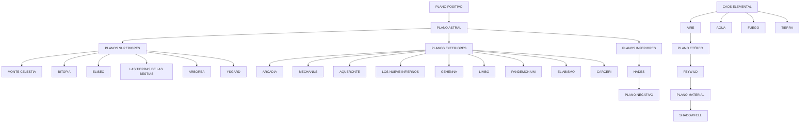

# DUNGEONS & DRAGONS

## MANUAL DEL JUGADOR
---


# MANUAL DEL JUGADOR

![D&D logo]

DUNGEONS & DRAGONS

Todo lo que necesita un jugador para crear personajes heroicos para el juego de rol más importante del mundo
---


# MANUAL DEL JUGADOR

[An illustration depicting a battle scene with a cloaked figure wielding a sword against multiple opponents in a yellow-tinted background]

&
---


## Créditos

Diseñadores jefe de D&D: Mike Mearls, Jeremy Crawford.
Responsable del Manual del Jugador: Jeremy Crawford.
Diseño de reglas: Rodney Thompson, Peter Lee.
Redacción: James Wyatt, Robert J. Schwalb, Bruce R. Cordell.
Edición: Michele Carter, Chris Sims, Scott Fitzgerald Gray, Christopher Perkins.
Productor: Greg Bilsland.
Dirección de arte: Kate Irwin, Dan Gelon, Jon Schindehette, Mari Kolkowsky, Melissa Rapier, Shauna Narciso.
Diseño gráfico: Bree Heiss, Emi Tanji, Barry Craig.
Ilustración de la portada: Tyler Jacobson.
Ilustraciones interiores: Steve Argyle, Tom Babbey, Daren Bader, Drew Baker, Mark Behm, Eric Belisle, Christopher Bradley, Noah Bradley, Sam Burley, Clint Cearley, Milivoj Ceran, Sidharth Chaturvedi, Jedd Chevrier, jD, Allen Douglas, Jesper Ejsing, Craig Elliott, Wayne England, Scott M. Fischer, Randy Gallegos, Justin Gerard, Florian De Gesincourt, Lars Grant-West, Jon Hodgson, Ralph Horsley, Lake Hurwitz, Tyler Jacobson, Kekai Kotaki, Olly Lawson, Raphael Lübke, Titus Lunter, Slawomir Maniak, Brynn Metheney, Aaron Miller, Christopher Moeller, Mark Molnar, Scott Murphy, William O'Connor, Hector Ortiz, David Palumbo, Alessandra Pisano, Claudio Pozas, Rob Rey, Wayne Reynolds, Aaron J. Riley, Chris Seaman, Cynthia Sheppard, Craig J. Spearing, John Stanko, Matt Stawicki, Alex Stone, Thom Tenery, Cory Trego-Erdner, Beth Trott, Autumn Rain Turkel, Jose Vega, Tyler Walpole, Julian Kok Joon Wen, Richard Whitters, Eva Widermann, Ben Wootten, Kieran Yanner.

Otras contribuciones: Kim Mohan, Matt Sernett, Chris Dupuis, Tom LaPille, Richard Baker, Miranda Horner, Jennifer Clarke Wilkes, Steve Winter, Nina Hess, Steve Townshend, Chris Youngs, Ben Petrisor, Tom Olsen.
Gestión de proyecto: Neil Shinkle, Kim Graham, John Hay.

Servicios de producción: Cynda Callaway, Brian Dumas, Jefferson Dunlap, David Gershman, Anita Williams.
Marca y marketing: Nathan Stewart, Liz Schuh, Chris Lindsay, Shelly Mazzanoble, Hilary Ross, Laura Tommervik, Kim Lundstrom, Trevor Kidd.

Basado en el juego original obra de E. Gary Gygax y Dave Arneson, con Brian Blume, Rob Kuntz, James Ward y Don Kaye.

Y que posteriormente fue desarrollado por J. Eric Holmes, Tom Moldvay, Frank Mentzer, Aaron Allston, Harold Johnson, Roger E. Moore, David "Zeb" Cook, Ed Greenwood, Tracy Hickman, Margaret Weis, Douglas Niles, Jeff Grubb, Jonathan Tweet, Monte Cook, Skip Williams, Richard Baker, Peter Adkison, Keith Baker, Bill Slavicsek, Andy Collins, y Rob Heinsoo.

Pruebas de juego por más de 175.000 entusiastas de D&D. ¡Gracias!

Con el consejo de Jeff Grubb, Kenneth Hite, Kevin Kulp, Robin Laws, S. John Ross, el RPGPundit, Vincent Venturella, y Zak S.

## Localización: Edge Entertainment

Coordinador de traducción: Rodrigo García Carmona
Traducción: Rodrigo García Carmona, Pablo Fontanilla Arranz
Corrección: Sergio Isabel Ludeña, Luis E. Sánchez
Responsable editorial (en forma ectoplasmática): Darío Aguilar Pereira

EDGE

## Equipo de producción de Gale Force Nine:

Director del proyecto: Matthew Vaughan
Equipo del proyecto: Kev Brett, Adam Simunovich
Productor: John-Paul Brisigotti

## En la portada

En esta intensa escena, obra de Tyler Jacobson, el Rey Snurre de los gigantes de fuego no piensa tolerar que seres inferiores permanezcan con vida, por lo que llama a sus sabuesos infernales para que le ayuden a limpiar su hogar de visitas indeseadas.

Descargo de responsabilidad: Wizards of the Coast no se hace responsable de las consecuencias de dividir el grupo, insertar extremidades en la boca de un rostro verde demoníaco de mirada maliciosa, aceptar la invitación a cenar de unos ogros, invadir la sala de banquetes de unos gigantes de las colinas, enfadar a un dragón de cualquier tipo o responder "sí" cuando el DM pregunta: "¿Estáis seguros?".

ISBN: 978-84-16357-60-4
Edición española, 2018

DUNGEONS & DRAGONS, D&D, Wizards of the Coast, Forgotten Realms, the dragon ampersand, Player's Handbook, Monster Manual, Dungeon Master's Guide, all other Wizards of the Coast product names and their respective logos are trademarks of Wizards of the Coast in the USA and other countries. All characters and their distinctive likenesses are property of Wizards of the Coast. This material is protected under the copyright laws of the United States of America. Any reproduction or unauthorized use of the material or artwork contained herein is prohibited without the express written permission of Wizards of the Coast. Edición española: Edge Entertainment, Avda. Diego Martínez Barrio 10, 41013 Sevilla, España. Traducción española © 2018 Wizards of the Coast LLC.

Impreso en Lituania. Manufactured by Standartu Spaustuve, Dariaus ir Gireno g. 39, LT-02189 Vilnius, Lietuva
©2018 Wizards of the Coast LLC, PO Box 707, Renton, WA 98057-0707, USA
---


# ÍNDICE

## PREFACIO 4

## INTRODUCCIÓN 5
Mundos de aventura 5
Cómo usar este libro 6
Cómo jugar 6
Aventuras 7

## 1ª PARTE 9

### CAPÍTULO 1: PERSONAJES PASO A PASO 11
Después de nivel 1 15

### CAPÍTULO 2: RAZAS 17
Elegir una raza 17
Enano 18
Elfo 21
Mediano 26
Humano 29
Dracónido 32
Gnomo 35
Semielfo 38
Semiorco 40
Tiefling 42

### CAPÍTULO 3: CLASES 45
Bárbaro 46
Bardo 51
Brujo 56
Clérigo 63
Druida 71
Explorador 77
Guerrero 82
Hechicero 88
Mago 94
Monje 102
Paladín 108
Pícaro 115

### CAPÍTULO 4: PERSONALIDAD Y TRASFONDO 121
Aspectos de un personaje 121
Inspiración 125
Trasfondos 125

### CAPÍTULO 5: EQUIPO 143
Equipo inicial 143
Riqueza 143
Armaduras y escudos 144
Armas 146
Equipo de aventureros 148
Herramientas 153
Monturas y vehículos 154
Mercancías 155
Gastos 157
Bagatelas 159

### CAPÍTULO 6: OPCIONES DE PERSONALIZACIÓN 163
Multiclase 163
Dotes 165

## 2ª PARTE 171

### CAPÍTULO 7: USAR PUNTUACIONES DE CARACTERÍSTICA 173
Puntuaciones de características y modificadores 173
Ventaja y desventaja 173
Bonificador por competencia 173
Pruebas de característica 174
Usar cada característica 175
Tiradas de salvación 179

### CAPÍTULO 8: AVENTURAS 181
Tiempo 181
Movimiento 181
El entorno 183
Interacciones sociales 185
Descansar 186
Entre aventuras 186

### CAPÍTULO 9: COMBATE 189
Estructura de un combate 189
Movimiento y posición 190
Acciones en combate 192
Atacando 193
Cobertura 195
Daño y curación 196
Combate montado 198
Combate bajo el agua 198

## 3ª PARTE 199

### CAPÍTULO 10: LANZAMIENTO DE CONJUROS 201
¿Qué es un conjuro? 201
Lanzar un conjuro 202

### CAPÍTULO 11: CONJUROS 207
Listas de conjuros 207
Descripciones de conjuros 211

## APÉNDICE A: ESTADOS 290

## APÉNDICE B: DIOSES DEL MULTIVERSO 293

## APÉNDICE C: LOS PLANOS DE EXISTENCIA 300
El Plano Material 300
Más allá del Plano Material 301

## APÉNDICE D: PERFILES DE CRIATURAS 304

## APÉNDICE E: LECTURAS INSPIRADORAS 312

## ÍNDICE DE TÉRMINOS 313

## HOJA DE PERSONAJE 317
---


# Prefacio

Érase una vez, hace mucho, mucho tiempo, en un reino llamado el Medio Oeste de los Estados Unidos (y más concretamente, en los estados de Minnesota y Wisconsin), un grupo de amigos se reunieron y cambiaron para siempre la historia de los juegos.

No era su intención hacerlo; simplemente estaban cansados de limitarse a leer historias sobre mundos de magia, monstruos y aventura. Querían jugar en esos mundos en vez de solamente observarlos. Por ello, crearon DUNGEONS & DRAGONS, y al hacerlo dieron el pistoletazo de salida a una revolución en el mundo de los juegos que sigue viva hoy en día. Este hecho nos habla de dos cosas:

En primer lugar, nos muestra su inventiva y su genialidad, pues se dieron cuenta de que los juegos eran la forma perfecta de explorar mundos que de otra forma no existirían. Prácticamente todos los juegos de rol actuales, ya se jueguen en una mesa o en soporte digital, han bebido de D&D.

En segundo lugar, es testigo del atractivo natural del juego que habían creado. DUNGEONS & DRAGONS dio comienzo a un fenómeno global que no para de crecer. Fue el primer juego de rol, y sigue siendo uno de los mejores.

Para jugar a DUNGEONS & DRAGONS y hacerlo bien no necesitas leer todas las reglas, memorizar cada detalle del juego o dominar el delicado arte de tirar dados de formas curiosas. Ninguno de estos factores tiene nada que ver con el mejor aspecto del juego.

Solo necesitas dos cosas, la primera de las cuales es ser amigo de aquellos con los que vas a jugar. Jugar con tus amigos es intrínsecamente divertido, pero D&D va más allá de simplemente entretener.

Jugar a DUNGEONS & DRAGONS es un ejercicio de creación colaborativa. Tus amigos y tú daréis vida a historias épicas, llenas de tensión y momentos memorables. Crearéis bromas referentes a lo que ocurrió en las partidas que os harán reír durante años. Los dados serán crueles con vosotros, pero no desfallecereis. Vuestra creatividad colectiva construirá historias que contaréis una y otra vez, y que irán desde lo más absurdo hasta el material del que están hechas las leyendas.

Si no tienes amigos interesados en jugar, no te preocupes. En los grupos de juego de D&D se crea una alquimia que nada puede igualar. Juega con alguien el tiempo suficiente y es probable que acabéis siendo amigos. Es un fantástico efecto secundario del juego. Tu siguiente grupo podría estar tan cerca como la tienda de juegos, foro online o convención más próximos.

También necesitarás una imaginación poderosa o, mejor dicho, el deseo de usar la imaginación que ya poseas. No necesitas ser un maestro cuentacuentos ni un artista brillante, solo debes aspirar a ser un creador, a tener el coraje de alguien que está dispuesto a construir algo y compartirlo con los demás.

Por suerte, al igual que refuerza tu amistad con otros, DUNGEONS & DRAGONS también puede ayudarte a desarrollar la confianza necesaria para crear y compartir. D&D es un juego que te enseña a encontrar la solución astuta, compartir la idea inesperada que puede resolver un problema y empujarte a imaginar lo que podría ser, en lugar de limitarte a aceptar lo que es.

Lo más probable es que los primeros personajes y aventuras que crees sean una amalgama de clichés. Esto les ha ocurrido a todos, incluso a los Dungeon Masters más grandes de la historia. Acepta este hecho y avanza; crea tu segundo personaje o aventura, que será mejor que el primero, y luego el tercero, que será a su vez mejor que el anterior. A base de repetir este proceso, pronto serás capaz de crear cualquier cosa, desde el pasado de un personaje hasta un mundo épico de aventura y fantasía.

Una vez adquieras esta habilidad, será tuya para siempre. Incontables escritores, artistas y otros creadores pueden remontar sus orígenes hasta unas pocas páginas con notas sobre D&D, un puñado de dados y una mesa de cocina.

Por encima de todo, DUNGEONS & DRAGONS es tuyo. Las amistades que forjes alrededor de la mesa serán únicas, solamente tuyas. Las aventuras en las que te embarques, los personajes que crees, los recuerdos que construyas... Todos ellos serán exclusivamente tuyos. D&D es tu esquinita del universo, un lugar en el que tienes libertad para hacer lo que te plazca.

Adelante. Lee las reglas del juego y la historia de sus mundos, pero nunca olvides que tú eres el que los dota de vida. No son nada sin esa chispa que tú les das.

Mike Mearls
Mayo de 2014
---
      INTRODUCCION
                                                                                 INTRODUCCIÓN

p                                                                                                                                                 de  ÜUNGE0NS  ÜRAG0NS
                                                                                                                                                  1
                                                                                                                                                  objetivo del juego   rol  &
                                                                                                                                                  Tobjetivo del juego de rol DuNGEONS & DRAGONS                         Un jugador
                                                                                                                                                                                                                        asume el papel del Dungeon Master (DM, Señor
                                                                                                                                                                                                                        Un jugador asume el papel del Dungeon Master (DM, Seror
                                                                                                                                                     (D&D) es contar historias en mundos de espada                     de la Mazmorra en español): el  narrador principal y árbi‑
                                                                                                                                                  (D&D) es contar historias en mundos de espada y
                                                                                                                                                  brujería. Al  igual que los juegos de n iños en los  y               de la Mazmorra en espanol): el narrador principal y arbi-
                                                                                                                                                  brujeria. Al igual que los juegos de ninos en los                    tro del juego. El DM  crea aventuras para los personajes, que
                                                                                                                                                  que estos fingen ser personajes ficticios, como el                   tro del juego. El DM crea aventuras para los personajes, que
                                                                                                                                                  que estos fingen ser personajes ficticios,  el                       se  a las dificultades y deciden  explo‑
                                                                                                                                                  como                                                                  enfrentan  qué caminos
                                                                                                                                                  de indios y vaqueros, el motor de D&D es la ima‑                     se enfrentan alasdificultades y deciden que caminos explo-
                                                                                                                                                  de indios y vaqueros, el motor de D&D es la ima-                     rar. El DM  podría describir la entrada al Castillo Ravenloft y
                                                                                                                                                  ginación: visualizar el imponente castillo bajo el                   rar: El DM podria describir la entrada al Castillo Ravenloft y
                                                                                                                                                  ginacion: visualizar el imponente castillo bajo el                    jugadores elegir que quieren que hagan sus aventureros.
                                                                                                                                                                                                                       los  sus
                                                                                                                                                                                                                       losjugadores elegir qué quieren que hagan  aventureros.
                                                                                                                                                   Cruzaran el deteriorado puente levadizo? €Se ataran entre si
                                                                                                                                                  tormentoso cielo nocturno e imaginar cómo un                         ¿Cruzarán el deteriorado pue nte levadizo? ¿Se ata rán e ntre s í
                                                                                                                                                  tormentoso cielo nocturno e imaginar como un
                                                                                                                                                  aventurero de fantasía podría reacciona r a los desafíos que la      con unas cuerdas para mini mizar la posibilidad de que
       aventurero de fantasia podria reaccionar a los desafios que la            aventurero de fantasia podria reaccionar a los desafios que la                                                                         a lguno
                                                                                                                                                                                                                       con unas cuerdasparaminimizar la posibilidad de que alguno
                                                                                 escena le  plantea.                                                                                                                   se  si  cede?  con
      escena le plantea:                                                                                                                                                                                                caiga  el puente  ¿O lanzarán un  juro que les
                                                                                                                                                                                                                       se caiga si el puente cede? €0 lanzaran un conjuro que les
                                                                                                                                                                                                                       transporte al otro lado del abismo?
                                                                                                                                                                                                                       transporte al otro lado del abismo?
                                                                                                                                                                                                                        Entonces el  DM  el              de las acciones
                                                                                                                                                 Mas  ):  el ca‑                                                        determinará  resultado  de
                                                                                  Dungeon Master (DM): Tras atravesar los asperos picos, el ca-                                                                         Entonces el DM determinara el resultado de las acciones de
                                                                                                                                                 Dungeon  ter (DM Tras atravesar los ásperos picos,
                                                                                  mino gira  bruscamente hacia el                                 el  se                                                               los aventureros y describirá lo que estos experime ntan. D&D
                                                                                                                                                  este y Castillo Ravenloft  yergue                                    los aventureros y describira lo que estos experimentan: D&D
       mino gira bruscamente hacia el este Y el Castillo Ravenloft se yergue     mino gira bruscamente hacia el este Y el Castillo Ravenloft se yergue                                                                 es un juego infin itamente flexi ble, ya que el DM  puede impro‑
                                                                                                                                                  Las
       ante vosotros. Las torres desmoronadas de una fortaleza de piedra         ante vosotros. Las torres desmoronadas de una fortaleza de piedra                                                                     es un juego infinitamente flexible; ya que el DM puede impro-
       ante vosotros.                                                            ante vosotros.                                                   torres desmoronadas de una fortaleza de piedra
                                                                                                                                                                                                                       visar para responder a cualquier cosa que los aventureros
                                                                                                                                                  mantienen una guardia silenciosa sobre el acceso.  Parecen puestos   visar para responder a cualquier cosa que los aventu reros
       mantienen una guardia silenciosa sobre el acceso Parecen puestos          mantienen una guardia silenciosa sobre el acceso Parecen puestos                                                                       hacer, de manera  cada
       de vigilancia abandonados. Tras ellos se abre un ancho abismo cuyo        de vigilancia abandonados. Tras ellos se abre un ancho abismo cuyo                                                                    intenten  que  aventura sea emocionante
       de vigilancia abandonados. Tras ellos se abre un ancho abismo cuyo        de vigilancia abandonados. Tras ellos se abre un ancho abismo cuyo                                                                    intenten hacer; de manera que cada aventura sea emocionante
                                                                                                                                                  fondo se pierde entre la niebla. Un puente levadizo bajado cruza     e  impredecible.
       fondo se pierde entre la niebla. Un puente levadizo bajado cruza          fondo se pierde entre la niebla. Un puente levadizo bajado cruza                                                                      impredecible
       el abismo, conduciendo a una entrada en forma de arco que lleva           el abismo, conduciendo a una entrada en forma de arco que lleva                                                                          El juego no tiene un final  propiamente d icho; cuando una
       el abismo, conduciendo a una entrada en forma de arco que Ileva           el abismo, conduciendo a una entrada en forma de arco que Ileva                                                                            El juego no tiene un final propiamente dicho; cuando una
       al patio del castillo. El  viento hace chi rriar las cadenas del  puente  al patio del castillo. El  viento hace chi rriar las cadenas del  puente                                                              trama o misión concluye le sigue otra, de modo que se crea
       alpatiodel castillo. El viento hace chirriar las cadenas del puente       alpatiodel castillo. El viento hace chirriar las cadenas del puente                                                                   trama 0 mision concluye le sigue otra, de modo que se crea
                                                                                                                                                                                                                       una historia continua Ilamada campana. Muchas de
       levadizo, cuyos eslabones de hierro oxidado luchan por aguantar           levadizo, cuyos eslabones de hierro oxidado luchan por aguantar                                                                          una historia continua llamada campaña. Muchas de las perso‑
                                                                                                                                                   levadizo, cuyos eslabones de hierro oxidado luchan por aguantar     nas               mantienen sus campañas vivas  asperso-
       el peso del mismo. Gargolas de piedra sonrien espantosamente y            el peso del mismo. Gargolas de piedra sonrien espantosamente y                                                                         que juegan  durante meses
       el peso del  mismo. Gárgolas de piedra sonríen espantosamente y           el peso del  mismo. Gárgolas de piedra sonríen espantosamente y                                                                       nas que juegan mantienen sus campanas vivas durante meses
                                                                                                                                                  la                                                                   o años, quedando con su s amigos casi cada semana para con‑
       os observan con Sus cuencas vacias desde la parte superior de las         os observan con Sus cuencas vacias desde la parte superior de las                                                                     anos, quedando con sus amigos casi cada semana para con-
       os observan con sus cuencas vacías desde                                  os observan con sus cuencas vacías desde                         parte superior de las
                                                                                                                                                                                                                       tinuar con la historia donde la dejaron. Los aventu reros se
       altas y fuertes murallas.  Un podrido rastrillo de madera, verde de       altas y fuertes murallas.  Un podrido rastrillo de madera, verde de                                                                   tinuar con la historia donde la dejaron: Los aventureros se
       altas y fuertes murallas_ Un podrido rastrillo de madera, verde de        altas y fuertes murallas_ Un podrido rastrillo de madera, verde de                                                                    vuelven mas poderosos conforme Ia campana avanza. Cada
                                                                                  musgo, está levantado en el túnel de entrada. Tras él, las puertas                                                                   vuelven más poderosos conforme la campaña avanza. Cada
       musgo, esta levantado en el tunel de entrada_ Trasel; las puertas         musgo, esta levantado en el tunel de entrada_ Trasel; las puertas                                                                     monstruo derrotado, cada aventura term inad a y cada tesoro
                                                                                  principales del Castillo Ravenloft se encuentran abiertas, surgiendo
       principales del Castillo Ravenloft se encuentran abiertas, surgiendo      principales del Castillo Ravenloft se encuentran abiertas, surgiendo                                                                  monstruo derrotado, cada aventura terminada y cada tesoro
                                                                                                                                                                                                                       recuperado no solo contribuyen a avanzar en la historia, sino
       de ellas una luz  cálida e intensa que se escapa hacia el patio.          de ellas una luz  cálida e intensa que se escapa hacia el patio.                                                                      recuperado no solo contribuyen a avanzar en la historia, si no
       de ellas unaluzcalida e intensa que se escapa hacia elpatio.              de ellas unaluzcalida e intensa que se escapa hacia elpatio.                                                                          que tambien dotan a los aventureros de nuevas capacidades:
                                                                                                                                                                                                                        dotan a los aventureros
                                                                                   Gabriel (jugando como Gareth): Quiero examinar las gargolas_  Gabriel (jugando como Gareth): Quiero examinar las gargolas_          que también  de nuevas capacidades.
                                                                                                                                                 Gabriel (jugando como Gareth): Quiero examinar las gárgolas.
                                                                                  Presiento que no son simples estatuas.                                                                                                Este aumento de poder se refleja en el nivel  de un personaje.
       Presiento que no son simples estatuas.                                    Presiento que no son simples estatuas.                                                                                                Este aumento de poder se refleja en el nivel de un personaje.
                                                                                                                                                 Eva (jugando como  ¿El  puente levadizo parece inesta‑                 En una partida de DuNGE0NS & DRAG0NS no se gana ni se
                                                                                                                                                 (jugando como Riva): <El puente levadizo parece inesta-                En una partida de DUNGEONS & DRAGONS no se gana ni se
                                                                                   Eva                                                           Eva  Riva):  la                                                       pierde. O, a l menos, no tal y como se entienden estos términos
                                                                                  ble? Quiero comprobar lo resistente que es. ¿Me da              impresión
       ble? Quiero comprobar lo resistente que es. <Me da la impresion           ble? Quiero comprobar lo resistente que es. <Me da la impresion                                                                       pierde. O,al menos, no tal y como se entienden estos terminos
       de que podemos cruzarlo                                                   de que podemos cruzarlo                                                                                                               normalmente. El DM y los jugadores crean juntos una emocio-
                                                                                                                                                                                                                       normalmente. El DM y los  juntos una emocio‑
       de que podemos cruzarlo o parece que se fuera a derrumbar con             de que podemos cruzarlo o parece que se fuera a derrumbar con                                                                          jugadores crean
                                                                                                                                                                    parece que se fuera a derrumbar con                nante historia, protagonizada por aguerridos aventu reros que
                                                                                  nuestro peso?                                                                                                                        nante historia, protagonizada por aguerridos aventureros que
       nuestropeso?                                                              nuestropeso?                                                                                                                          se e nfrentan a  peligros mortales. En ocasiones, un personaje

                                                                                  A diferencia de los juegos de imaginacion de los ninos, D&D                                                                          se enfrentan a peligros mortales. En ocasiones, un personaje
                                                                                  A d iferencia                                                   los juegos  i  de los niños, D&D                                     podria sufrir un espeluznante final, despedazado por feroces
                                                                                                                                                                                                                       pod ría sufrir un  final, despedazado por
                                                                                                                                                  de  de imaginac ón                                                    espeluznante  feroces
                                                                                 dota de estructura a las historias y proporciona un método                                                                            monstruos o liquidado por un perverso villano. Aun así, los
       dota de estructura a las historias y proporciona un metodo                dota de estructura a las historias y proporciona un metodo                                                                            monstruos 0 liquidado por un perverso villano. Aun asi, los
                                                                                                                                                     para determinar las consecuencias de las acciones de los aven‑    demás aventureros pueden buscar una magia lo bastante pode‑
       para determinar las consecuencias de las acciones de los aven-            para determinar las consecuencias de las acciones de los aven-                                                                        demas aventureros pueden buscar una magia lo bastante pode-
                                                                                 tureros. Los jugadores tiran dados para averiguar si s us                                                                             rosa como para resucitar a su com pañero caído, o tal vez el
       tureros. Los jugadores tiran dados para averiguar si sus esca‑            tureros. Los jugadores tiran dados para averiguar si sus esca‑                                                                        rosa como para resucitar a SUcompanero caido, 0 tal vez el
                                                                                 personajes aciertan o fallan en sus ataques, si consiguen                                                                             jugador  jugar con un personaje nuevo. Es posible que
                                                                                                                                                                                                                        decida
       personajes aciertan 0 fallan en sus ataques, si consiguen esca-           personajes aciertan 0 fallan en sus ataques, si consiguen esca-                                                                       jugador decida jugar con un personaje nuevo. Es posible que
                                                                                                                                                     lar un precipicio, esquivar el impacto de un relámpago mágico     el gr upo fracase en su intento de terminar una aventura con
       lar un precipicio, esquivar el impacto de un relampago magico             lar un precipicio, esquivar el impacto de un relampago magico                                                                         el grupo fracase en SU intento de terminar una aventura con
                                                                                                                                                    o llevar a cabo cualquier otra tarea que implique peligro. Todo    éxito, pero s i os lo habéis  pasado bien y habéis  creado una his ‑
       0 llevar a cabo cualquier otra tarea que implique peligro. Todo           0 llevar a cabo cualquier otra tarea que implique peligro. Todo                                                                       exito.perosi 0s lo habeis pasado bien y habeis creado una his-
                                                                                                                                                       posible, pero los dados hacen que ciertos resultados sean       toria memorable, todos habreis ganado_
                                                                                 es posible, pero los dados hacen que ciertos resu ltados sean                                                                         toria memorable, todos habréis ganado.
       es                                                                        es                                                              pr  otros.
                                                                                 más                                                             obables que
       mas probables que otros.                                                  mas probables que otros.                                                                                                               DE  AVENTURA
                                                                                                                                                                                                                       MUNDOs DE AVENTURA
                                                                                                                                                 Dungeon  Vale, de uno en  uno. Gabriel, ¿exami‑                       MUNDOS
                                                                                   Dungeon Master (DM): Vale, de uno en uno. Gabriel, cexami-    Dungeon Master (DM): Vale, de uno en uno. Gabriel, cexami-
                                                                                                                                                 Master (DM):                                                          Los múltiples mundos de DUNGE0NS & DRAG0NS son luga‑
                                                                                  nas las gárgolas?                                                                                                                    Los multiples mundos de DUNGEONS & DRAGONS son luga-
       nas lasgargolas?                                                          nas lasgargolas?                                                                                                                      res de magia y monstruos, de val  guerreros y  tu
                                                                                                                                                                                                                        ientes  aven  ras
                                                                                   Gabriel: Efectivamente. ¿Alguna pista que indique que puedan  Gabriel: Efectivamente. ¿Alguna pista que indique que puedan          res de magia y monstruos, de valientes guerreros y aventuras
                                                                                   Gabriel: Efectivamente: cAlguna pista que indique que puedan  Gabriel: Efectivamente: cAlguna pista que indique que puedan          espectaculares. Parten de una base de fantasía medieval y
                                                                                 ser criaturas y no adornos?                                                                                                           espectaculares. Parten de una base de fantasia medieval y
       ser criaturas Y no adornos?                                               ser criaturas Y no adornos?                                                                                                           sobre ella añaden las cr iaturas, localizaciones y magia que
                                                                                                                                                 Haz una prueba de Inteligencia.                                       sobre ella anaden las criaturas, localizaciones y magia que
                                                                                   DM: Haz una prueba de Inteligencia                            DM: Haz una prueba de Inteligencia
                                                                                   DM:                                                           DM:                                                                   hacen únicos a estos mundos.
                                                                                                                                                  il                                                                   hacen unicos a estos mundos
                                                                                   Gabriel: < Puedo usar mi habilidad Investigacion?             Gabriel: < Puedo usar mi habilidad Investigacion?
                                                                                   Gabriel: ¿Puedo usar mi  hab                                  Gabriel: ¿Puedo usar mi  hab idad  Investigación?                      Los mundos de DuNGE0NS & DRAG0NS ex isten como parte
                                                                                                                                                 DM: Eso es.                                                            Losmundos de DUNGEONS & DRAGONS existen como parte
                                                                                   DM: Eso es_                                                   DM: Eso es_                                                           de un vasto cosmos llamado el multiverso. Están conec‑
                                                                                   Gabriel (tirando l d20): ¡Bah!  Siete.                        Gabriel (tirando l d20): ¡Bah!  Siete.                                de un vasto cosmos Ilamado el multiverso. Estan conec-
                                                                                   Gabriel (tirando Id20): jBah!Siete.                           Gabriel (tirando Id20): jBah!Siete.                                   tados e ntre sí y con otros planos de existencia, como el
                                                                                   DM: Te  parecen adornos. Y Eva,  ¿Riva examina el puente      DM: Te  parecen adornos. Y Eva,  ¿Riva examina el puente              tados entre Si y con otros planos de existencia, como el
                                                                                   DM: Te parecen adornos. Y Eva, &Riva examina el puente        DM: Te parecen adornos. Y Eva, &Riva examina el puente                Plano Elemental del Fuego y las Profundidades In finitas del
                                                                                 levadizo?                                                                                                                             Plano Elemental del Fuego y las Profundidades Infinitas del
       levadizo?                                                                 levadizo?                                                                                                                             Abismo, de formas extrañas y m isteriosas. Dentro de este
                                                                                                                                                                                                                       Abismo, de formas extranas y misteriosas. Dentro de este
                                                                                                                                                                                                                       multiverso hay una va riedad infi n ita de mundos, muchos de
                                                                                                                                                                                                                       multiverso hay una variedad infinita de mundos, muchos de
                                                                                                                                                                                                                       los cuales han sido publicados como ambientaciones oficiales
                                                                                                                                                  ÜUNGE0NS  AG0NS                                                      los cuales han sido publicados como ambientaciones oficiales
                                                                                                                                                         En una partida de DUNGEONS & DRAGONS cada jugador
                                                                                  En una pa rtida de                                              & ÜR  cada
                                                                                                                                                  jugador                                                              de D&D. Las leyendas de ambientaciones como los Reinos
       crea un aventurero (también lla mado personaje) y forma                   crea un aventurero (también lla mado personaje) y forma                                                                               de D&D Las leyendas de ambientaciones como los Reinos
       crea un aventurero (tambien Ilamado personaje) y forma                    crea un aventurero (tambien Ilamado personaje) y forma                                                                                Olvidados, Dragonlance, Falcongrís, Sol Oscuro, Mystara y
       equipo con otros                                                          equipo con otros                                                                                                                      Olvidados, Dragonlance, Falcongris, Sol Oscuro, Mystara y
                                                                                                                                                  aventureros (controlados por amigos).
       equipo con otros aventureros (controlados por amigos):                    equipo con otros aventureros (controlados por amigos):                                                                                 Eberron están entretejidas en la estructu ra del  multiverso.
                                                                                                                                                  Trabajando j untos, el gr upo podría explorar una oscura             Eberron estan entretejidas en la estructura del multiverso.
       Trabajando juntos, el grupo podria explorar una oscura                    Trabajando juntos, el grupo podria explorar una oscura                                                                                J unto a estos mundos se ha llan cientos de miles más; los
                                                                                                                                                  mazmorra, una ciudad en rui nas, un castillo encan tado,  Junto a estos mundos se hallan cientos de miles mas; los
       mazmorra, una ciudad en ruinas, un castillo encantado,                    mazmorra, una ciudad en ruinas, un castillo encantado,                                                                                creados por generaciones de jugadores de D&D para sus pro-
       un templo perdido en las profundidades de Ia selva 0 una                  un templo perdido en las profundidades de Ia selva 0 una                                                                              creados por generaciones de jugadores de D&D para sus pro‑
                                                                                 un templo perdido en las profund idades de la selva o una                                                                             pias partidas. Además, podrías añadir un  mundo de creación
                                                                                                                                                  caverna llena de lava bajo u na m isteriosa montaña. Los             pias partidas. Ademas, podrias anadir un mundo de creacion
       caverna Ilena de lava bajo una misteriosa montana.Los                     caverna Ilena de lava bajo una misteriosa montana.Los                                                                                 propia  a la riqueza del multiverso.
       aventureros pueden resolver acertijos, hablar con otros per-              aventureros pueden resolver acertijos, hablar con otros per-                                                                          propia a la riqueza del multiverso.
       aventureros pueden resolver acertijos, hablar con otros per‑              aventureros pueden resolver acertijos, hablar con otros per‑                                                                               Todos estos mundos comparten ciertas características,
                                                                                 sonajes, luchar contra monstruos fa ntásticos y descubrir                                                                                  Todos estos mundos comparten ciertas caracteristicas,
       sonajes, luchar contra monstruos fantasticos y descubrir                  sonajes, luchar contra monstruos fantasticos y descubrir                                                                              pero cada uno se
                                                                                                                                                                                                                        diferencia por su historia y cultura propias,
       fabu losos                                                                fabu losos                                                                                                                            pero cada uno se diferencia por su historia y culturapropias,
                                                                                                                                                 objetos mágicos y otros tesoros.
       fabulosos objetos magicos y otros tesoros.                                fabulosos objetos magicos y otros tesoros.                                                                                            sus monstruos y razas específicos,  antiguas mazmorras y
                                                                                                                                                                                                                        sus antiguas mazmorras y
                                                                                                                                                                                                                       sus monstruos y razas especificos, suS

                                                                                                                                                                                                                        ISTRODUCCION
                                                                                                                                                                                                                        TNTRODUCCTON
---


sus tortuosos villanos. Algunas razas poseen características
inusuales en ciertos mundos. Los medianos de la ambien-
tación del Sol Oscuro, por poner un ejemplo, son caníbales
que viven en la selva, mientras que los elfos son nómadas del
desierto. Unos mundos cuentan con razas desconocidas en
otras ambientaciones; como los forjados de Eberron; sol-
dados creados y dotados de vida para luchar en la Última
Guerra. En cambio, otros están dominados por una única his-
toria fundamental. como la Guerra de la Lanza; el centro de la
ambientación Dragonlance. Sin embargo, todos ellos son mun-
dos de D&D. por lo que puedes usar las reglas de este libro
para crear un personaje y jugar en cualquiera de ellos.

Tu DM podría situar su campaña en uno de estos mundos
o en otro de su propia cosecha. Como existe tanta diversidad
entre los mundos de D&D deberías preguntar a tu Dungeon
Master si usaréis alguna regla casera que afecte al juego. Al fin
y al cabo; el DM es la autoridad máxima en vuestra campaña y
su ambientación, aunque se trate de un mundo publicado.

## CÓMO USAR ESTE LIBRO

El Player's Handbook está dividido en tres partes.

La primera parte (capítulos 1-6) se ocupa de la creación
de personajes y contiene las reglas y consejos que necesitarás
para hacerte un personaje con el que jugar. Describe las razas,
clases, trasfondos, equipo y otras opciones de personalización
entre las que puedes elegir. Muchas de las reglas de la primera
parte hacen referencia a las partes segunda y tercera. Si te
encuentras con algún término de juego que no entiendes en la
primera parte, puedes consultar el índice de términos.

La segunda parte (capítulos 7-9) detalla las reglas del
juego, yendo más allá de los conceptos básicos explicados en
esta introducción. Esta parte cubre las tiradas de dado que
harás para determinar si tu personaje tiene éxito o fracasa en
lo que se propone, y describe las tres grandes categorías en las
que se pueden clasificar todas las actividades del juego: explo-
ración, interacción y combate.

La tercera parte (capítulos 10-11) se ocupa de la magia.
Explica el funcionamiento de la magia en los mundos de D&D,
así como sus reglas, y detalla la enorme variedad de conjuros
disponibles para aquellos personajes que pueden utilizar la
magia.

## CÓMO JUGAR

DUNGEONS & DRAGONS se juega siguiendo estos pasos:

1. El DM describe la situación. El DM explica a los juga-
dores dónde se encuentran sus aventureros y detalla los
alrededores, para así darles oportunidad de hacerse una com-
posición de lugar y decidir qué hacer. Un caso concreto podría
ser señalar cuántas puertas tiene una habitación, qué hay en la
mesa, quién está en la taberna, y así.

2. Los jugadores describen lo que hacen. A veces un juga-
dor hablará por todo el grupo. Por ejemplo: "Saldremos por
la puerta este". En otras ocasiones, cada aventurero hará una
cosa distinta. Así, uno podría buscar un cofre mientras otro
examina el símbolo esotérico grabado en un muro y un tercero
monta guardia para evitar que les sorprendan monstruos. Los
jugadores no tienen por qué turnarse, pero el DM debe escu-
charles a todos y decidir qué sucede en cada caso.

Muchas veces será fácil determinar qué ocurre. Si un aven-
turero quiere caminar hasta el otro lado de la habitación y
abrir una puerta, el DM simplemente dirá que la puerta se abre
y describirá lo que hay tras ella. No obstante, quizá la puerta
esté cerrada, el suelo esconda una trampa mortal o cualquier
otra circunstancia haga que llevar a cabo lo que el aventurero
se proponía sea difícil. En estos casos, el DM decidirá lo que
sucede, recurriendo habitualmente a la tirada de un dado para
dilucidar el resultado de la acción.

3. El DM describe el resultado de las acciones de los
aventureros. Describir estos resultados suele desembocar en
una nueva situación, por lo que se volvería al paso l.

Esta estructura se mantiene siempre, tanto si los aven-
tureros están explorando con cautela unas ruinas como
parlamentando con un retorcido príncipe o enzarzados en una
lucha a muerte contra un dragón. En situaciones concretas, en
especial el combate, las acciones están más estructuradas y
los jugadores (y el DM) se turnan para elegir acciones y resol-
verlas. Pero la mayor parte del tiempo la forma de jugar será
flexible, adaptándose a las circunstancias de la aventura.

En muchas ocasiones las acciones se desarrollan única-
mente en la imaginación, tanto de los jugadores como del DM,
apoyándose en las descripciones de la escena que hace este.
A algunos Dungeon Master les gusta recurrir a música, ilus-
traciones o efectos de sonido para crear ambiente, y hay tanto
jugadores como DM que usan diferentes tonos de voz al hablar
para distinguir entre varios aventureros, monstruos y otros
personajes que interpreten durante la partida. En ocasiones
concretas, el DM podría incluso desplegar un mapa y utilizar
contadores o miniaturas para representar a las criaturas que
forman parte de una escena, de modo que los jugadores pue-
dan ubicarse más fácilmente.

## DADOS

Este juego usa dados poliédricos con diferentes números de
caras. Puedes encontrar estos dados en tiendas de juegos
y librerías.

En este libro nos referiremos a cada uno de los dados escri-
biendo la letra d seguida del número de caras: d4, d6, d8, d10,
d12 y d20. Por ejemplo, ld6 es un dado de seis caras (el cubo
que usan la mayoría de los juegos).

Los dados percentiles, o d100, funcionan de forma ligera-
mente distinta. Para generar un número entre 1 y 100 tiras dos
dados de diez caras (numeradas del 0 al 9) distintos. Uno de
ellos (elegido antes de tirar) representará las decenas, y el otro
las unidades. De este modo, si sacas un 7 y un 1, el resultado
será un 71. Dos ceros representan un 100. Algunos dados de
diez caras tienen grabadas directamente las decenas (00, 10,
20 y así sucesivamente), lo que hace más fácil distinguir qué
dado representa cada dígito. Usando un dado de este tipo, un
70 y un 1 es un 71, y un 00 y un 0 es un 100.

Siempre que sea necesario hacer una tirada, las reglas te
dirán cuántos dados y de qué tipo debes utilizar, además de los
modificadores a aplicar. Así, "3d8 + 5" significa que debes tirar
3 dados de 8 caras, sumar sus resultados y añadir 5 al total.

La misma notación basada en la d se utiliza en expresio-
nes como "ld3" y "ld2". Para simular la tirada de ld3, tira ld6
y divide el resultado entre 2, redondeando hacia arriba. Para
la tirada de ld2, lanza cualquier dado; si sale impar el resul-
tado será l, y si sale par 2. O, si lo prefieres, si el resultado de
la tirada es superior a la mitad del número de caras del dado,
entonces el resultado será 2, y 1 en caso contrario.

## EL D20

¿Ha logrado la espada del aventurero herir al dragón, o ha
rebotado en sus escamas duras como el hierro? ¿Se creerá el
ogro ese farol tan exagerado? ¿Puede el personaje cruzar a
nado ese río tan revuelto? ¿Podrá esquivar parte de la deflagra-
ción de la bola de fuego, o ha acabado en el mismo centro de la
explosión? En aquellas situaciones en las que el resultado de
la acción no esté claro, en DUNGEONS & DRAGONS se tirará un
dado de 20 caras, ld20, para determinar si esta tiene éxito o
fracasa.

Todos los personajes y monstruos del juego tienen seis pun-
tuaciones de característica que indican sus capacidades. Las
características son Fuerza, Destreza, Constitución, Inteligencia,
---

Sabiduría y Carisma, y en el caso de la mayoría de los aventure-
ros sus puntuaciones suelen oscilar entre 3 y 18. Los monstruos
pueden tener puntuaciones entre 1 y 30. Estas puntuaciones de
característica y los modificadores por característica que de
ellas se derivan son la base de casi todas las tiradas de d20 que
el jugador que controla un personaje o un monstruo hace.

Las pruebas de característica, tiradas de ataque y tiradas
de salvación son los tres tipos principales de tiradas de d20,
y conforman el núcleo de las reglas de este juego. Las tres
siguen estos sencillos pasos:

1. Tira el dado y añade un modificador. Tira 1d20 y añade
el modificador correspondiente, que normalmente estará deri-
vado de una de las seis características y a veces incluirá un
bonificador por competencia, el cual refleja el dominio por
parte del personaje de una habilidad en concreto. Consulta el
capítulo 1 para aprender en qué consiste cada característica y
cómo determinar el modificador por característica.

2. Aplica bonificadores y penalizadores debido a las cir-
cunstancias. Un rasgo de clase, un conjuro, la situación actual
o cualquier otro efecto podría otorgar un bonificador o penali-
zador a la tirada.

3. Compara el total con un número objetivo. Si el total es
igual o superior al número objetivo, la prueba de caracterís-
tica, la tirada de ataque o la tirada de salvación tiene éxito. De
lo contrario, falla. Suele ser el DM el que decide los números
objetivo y dice a los jugadores si sus pruebas de característica,
tiradas de ataque y tiradas de salvación tienen éxito o no.

El número objetivo de una prueba de característica o de una
tirada de salvación se denomina Clase de Dificultad (CD). El
número objetivo de una tirada de ataque recibe el nombre de
Clase de Armadura (CA).

Esta sencilla regla se aplica a la mayoría de las situaciones
que pueden darse durante el juego. El capítulo 7, "Usar puntua-
ciones de característica", describe en más detalle cómo hacer
tiradas con el d20.

VENTAJA Y DESVENTAJA

En ocasiones, las pruebas de característica, tiradas de ataque
y tiradas de salvación se verán afectadas por circunstancias
especiales llamadas ventaja y desventaja. La ventaja se aplica
cuando hay circunstancias positivas afectando a la tirada de
d20 y la desventaja cuando existen circunstancias negativas.
Cuando tengas ventaja o desventajas tirarás 2d20 en lugar de
uno, quedándote con el resultado más alto de los dos si tienes
ventaja y con el más bajo si tienes desventaja.

Por ejemplo, si sufres una desventaja y obtienes en la tirada
un 17 y un 5, utilizarás el 5. Si, por el contrario, disfrutaras de
ventaja, te quedarías con el 17.

El capítulo 7 contiene una descripción más exhaustiva de las
reglas detalladas de ventaja y desventaja.

LO CONCRETO TIENE PREFERENCIA

Este libro, y en especial las partes segunda y tercera, contiene las
reglas del juego. Dicho esto, muchos atributos raciales, rasgos de
clase, conjuros, objetos mágicos, capacidades de monstruos y otros
elementos del juego "rompen" las reglas, creando excepciones en
las que el reglamento se aplica de forma distinta al resto de situa-
ciones. En estos casos, recuerda lo siguiente: Si una regla concreta
contradice a una regla general, la regla concreta tiene preferencia.

Las excepciones a las reglas generales suelen ser pequeñas. Por
ejemplo, muchos aventureros no son competentes con arcos largos,
pero los elfos de los bosques sí lo son, gracias a un atributo racial.
Dicho atributo crea una pequeña excepción en las reglas. Otros
casos son menos evidentes. Aunque, normalmente un aventurero
no puede atravesar muros, algunos conjuros sí lo permiten. De
hecho, la mayoría de las excepciones son culpa de la magia.

REDONDEAR HACIA ABAJO

Hay una regla más que debes tener presente desde el princi-
pio: siempre que tengas que dividir un número, redondéalo
hacia abajo si no es entero, incluso cuando el decimal sea
superior a 5.

AVENTURAS

En las partidas de DUNGEONS & DRAGONS, un grupo de aven-
tureros se embarca en una aventura que el Dungeon Master
les presenta. Todos los personajes aportan una serie de capa-
cidades a su grupo en forma de características y habilidades,
rasgos de clase, atributos raciales, equipo y objetos mágicos.
Cada uno es distinto a los demás, con sus fortalezas y debilida-
des, por lo que los mejores grupos de aventureros son aquellos
en los que los personajes se complementan unos a otros y
compensan las debilidades de sus compañeros. Los jugadores
deben cooperar para completar con éxito la aventura.

UNIDADES DE MEDIDA

D&D utiliza el sistema de medidas imperial (millas, libras, pies...),
habitual en países de habla inglesa, en lugar del sistema interna-
cional, al que estamos acostumbrados. Puesto que las reglas del
juego dependen de que las distancias y pesos se expresen usando
las medidas originales, hemos optado por no adaptarlas en la tra-
ducción al español de DUNGEONS & DRAGONS. En varios puntos del
texto se incluye la equivalencia entre cada medida concreta y su
versión en el sistema internacional pero, para mayor comodidad,
aquí tienes una tabla de equivalencias:

| Sistema imperial | Sistema internacional |
| ---------------- | --------------------- |
| 1 legua          | 4,8 kilómetros        |
| 1 milla          | 1,6 kilómetros        |
| 1 yarda          | 0,9 metros            |
| 1 pie            | 0,3 metros            |
| 1 pulgada        | 2,5 centímetros       |
| 1 acre           | 0,40 hectáreas        |
| 1 libra          | 0,45 kilos            |
| 1 onza           | 28 gramos             |
| 1 galón          | 3,8 litros            |
| 1 cuarta         | 0,9 litros            |
| 1 pinta          | 0,45 litros           |


Si necesitas hacer conversiones rápidas a ojo, te recomenda-
mos las siguientes aproximaciones:

| Sistema imperial | Sistema internacional |
| ---------------- | --------------------- |
| 25 leguas        | 120 kilómetros        |
| 25 millas        | 40 kilómetros         |
| 10 pies          | 3 metros              |
| 1 yarda          | 1 metro               |
| 4 pulgadas       | 10 centímetros        |
| 5 libras         | 2 kilos               |
| 9 onzas          | 250 gramos            |
| 1 galón          | 4 litros              |
| 1 cuarta         | 1 litro               |
| 1 pinta          | 1/2 litro             |

---


La aventura es el corazón del juego, una historia con un comienzo, un desarrollo y un final. Puede haber sido creada por el Dungeon Master o comprada en una tienda para posteriormente ser modificada, con el fin de adaptarse a las necesidades y deseos del DM. Sea como fuere, toda aventura se desarrolla en una ambientación fantástica como una mazmorra subterránea, un castillo derruido, la naturaleza o una bulliciosa ciudad. En ella aparece un rico elenco de personajes: los aventureros creados y controlados por el resto de jugadores y los personajes no jugadores (PNJ). Estos últimos pueden ser patrones, aliados, enemigos, siervos o simplemente extras para dar color a la aventura. Muchas veces, uno de estos PNJ será el villano cuyos planes son la causa de la aventura.

A lo largo de sus aventuras, los personajes se enfrentarán a una gran variedad de criaturas, objetos y situaciones, con las que deberán lidiar de una forma u otra. En ocasiones, los aventureros y sus enemigos harán lo posible por matarse o capturar a sus oponentes. No obstante, a veces deberán dialogar con criaturas (o incluso objetos mágicos) para alcanzar sus objetivos. También habrá momentos en los que los personajes deberán resolver un acertijo, superar un obstáculo, encontrar un objeto escondido o percatarse de lo que está ocurriendo en realidad. Y, mientras sucede todo esto, los aventureros explorarán el mundo, decidiendo el destino de sus viajes y qué hacer a continuación.

Las aventuras pueden variar en duración y complejidad. Una que fuera corta podría suponer solo unos pocos desafíos y jugarse en una sola sesión. Por otra parte, una aventura muy larga podría implicar cientos de combates, interacciones y otros retos, así como requerir docenas de sesiones de juego para poder terminarse, haciendo necesarias semanas o incluso meses de tiempo real. Lo más habitual es que el final de una aventura venga marcado por la vuelta a la civilización de los aventureros, que podrán descansar y disfrutar del duramente ganado botín.

Sin embargo, este no es el final de la historia. Podemos entender una aventura como un capítulo (compuesto de escenas) de una serie de televisión. Siguiendo este símil, una campaña sería la serie en su totalidad: una cadena de aventuras protagonizadas por el mismo grupo de aventureros, que desgrana una historia completa desde el principio hasta el final.

## LOS TRES PILARES DE UNA AVENTURA

Los aventureros pueden intentar hacer cualquier cosa que sus jugadores puedan imaginar, pero resulta útil dividir sus actividades en tres grandes categorías: exploración, interacción social y combate.

La exploración implica tanto el movimiento de los aventureros por el mundo como su interacción con objetos y situaciones que precisan de su atención. La exploración es un ciclo continuo en el que los jugadores describen lo que quieren que hagan sus personajes y el Dungeon Master les dice lo que sucede como consecuencia de dichas acciones. A gran escala, esto podría suponer un día de viaje a través de unas praderas o una hora de exploración de un complejo de cavernas. A pequeña escala, podría consistir en un personaje que tira de una palanca en la habitación de una mazmorra para ver qué ocurre.

En la interacción social los aventureros entablan conversación con alguien (o algo). Ejemplos de estas interacciones podrían ser: interrogar a un explorador capturado para que revele la ubicación de la entrada secreta a la guarida goblin, obtener información de un prisionero rescatado, suplicar misericordia a un caudillo orco o persuadir a un espejo mágico parlanchín para que muestre una localización remota.

Las reglas de la segunda parte (en especial los capítulos 7 y 8) y muchos rasgos de clase y de personalidad de la primera parte tratan la exploración y la interacción social.

El combate es el protagonista del capítulo 9, que explica cómo tanto los personajes como otras criaturas pueden atacar con sus armas, lanzar conjuros e intentar mejorar su posición (entre otros) con el fin de derrotar a sus oponentes, ya signifique esto matarlos a todos, hacerlos prisioneros u obligarlos a huir. El combate es la parte más fuertemente estructurada de una sesión de D&D y en él las criaturas se turnan para que así todos tengan la oportunidad de actuar. No obstante, incluso en medio de una encarnizada batalla, aún hay espacio para que los aventureros intenten las proezas más alocadas que se les ocurran (como bajar surfeando sobre un escudo un tramo de escaleras), examinar su entorno (quizá tirando de esa misteriosa palanca) o interaccionar con otras criaturas, ya sean aliados, enemigos u observadores neutrales.

## LAS MARAVILLAS DE LA MAGIA

Pocas aventuras de D&D acaban sin que nada mágico ocurra. Ya sea útil o dañina, la magia aparece frecuentemente en el día a día de un aventurero. De ella trata la tercera parte de este libro.

En los mundos de DUNGEONS & DRAGONS los practicantes de la magia son poco frecuentes, destacando entre el común de los mortales por su extraordinario talento. Es posible que la gente normal presencie muestras de magia con cierta frecuencia, pero suelen ser efectos menores; un monstruo, una plegaria que recibe respuesta o un mago que camina protegido por su guardián escudo.

Sin embargo, para los aventureros la magia es indispensable si desean sobrevivir. Sin la magia curativa de los clérigos y paladines, sucumbirían rápidamente a sus heridas. Sin el inspirador apoyo de la magia de bardos y clérigos, los guerreros se verían sobrepasados por sus enemigos más poderosos. Sin el impresionante poder mágico y la versatilidad de los magos y los druidas, las amenazas serían diez veces más mortales.

La magia también es el arma favorita de los villanos. Muchos aventureros se ven arrastrados por las maquinaciones de taumaturgos empecinados en utilizar sus poderes para hacer el mal. El líder de una secta que busca despertar a un dios que duerme bajo las aguas, la bruja que secuestra a jóvenes para robarles su vigor, el mago enloquecido que persigue dotar a un ejército de autómatas de una mera semblanza de vida y el dragón que se encuentra tras un ritual que le permitirá convertirse en un dios de la destrucción son solo algunos ejemplos de las amenazas de naturaleza mágica a las que podrían enfrentarse los aventureros. ¡Pero armados con sus propios poderes mágicos en forma de conjuros y objetos mágicos, los personajes tienen la oportunidad de vencer!
---


# 1ª PARTE

Crear un personaje
---


The image depicts a dramatic scene that appears to be from a fantasy or role-playing game setting. The composition is dominated by four main figures in a dimly lit, possibly tavern-like environment.

In the foreground, on the left, stands a tall figure in a dark blue hooded cloak. Their face is partially obscured, but they appear to be gesturing with a gloved hand towards the other characters. This figure has an air of mystery and authority.

To the right, three other characters are shown:

1. A figure with white hair and pale skin, possibly representing a magical or ethereal being. They are positioned slightly behind the others.

2. A bearded man with a rugged appearance, wearing what looks like fur-trimmed clothing. He has his hand on what might be a weapon at his side.

3. A younger-looking person partially obscured behind the bearded man, appearing cautious or wary.

The background is bathed in a golden yellow light, emanating from a hanging lantern above. This creates a stark contrast with the darker tones of the characters and the edges of the image. The setting suggests an indoor space with wooden structures, possibly a tavern or inn.

Decorative swirling lines frame parts of the image, adding to the fantastical atmosphere of the scene.

The overall mood of the painting is tense and mysterious, suggesting a moment of confrontation or revelation in a larger narrative. The style of the artwork is reminiscent of fantasy game or book cover illustrations, with rich colors and dramatic lighting enhancing the sense of adventure and intrigue.
---


# Capítulo 1: Personajes paso a paso

El primer paso para poder jugar a Dungeons & Dragons es imaginar y crear a tu propio personaje. Dicho personaje es una combinación de números, ganchos de interpretación y tu imaginación. Escoge una raza (como humano o mediano) y una clase (como guerrero o mago). También deberás inventar la personalidad, apariencia e historia pasada de tu personaje. Una vez esté terminado, este será tu representante en el juego, tu avatar en el mundo de Dungeons & Dragons.

Antes de empezar con el punto 1, que aparece más adelante, piensa en el tipo de aventurero con el que quieres jugar. Podrías ser un guerrero valiente, un pícaro sigiloso, un clérigo ferviente o un mago extravagante. O quizá estés más interesado en un personaje poco convencional, como un pícaro pendenciero que disfruta del cuerpo a cuerpo o un francotirador que elimina a sus enemigos desde la distancia. ¿Te gustan las historias de fantasía con elfos o enanos? Puedes probar a hacer un personaje de una de esas razas. ¿Quieres que tu personaje sea el aventurero más duro de la mesa? Valora la posibilidad de crear un bárbaro o un paladín. Si no sabes por dónde empezar, echa un vistazo a las ilustraciones de este libro hasta que encuentres algo que te llame la atención.

Cuando tengas un personaje en mente, procede según los siguientes pasos, tomando las decisiones que mejor representen el aventurero que quieres. Tu concepto de personaje podría evolucionar con cada elección que hagas. Lo importante es que llegues a la mesa con un aventurero con el que te ilusione jugar.

A lo largo de este capítulo usamos el término hoja de personaje para referirnos a cualquier sistema que utilices para registrar la información de tu personaje, ya sea una hoja de personaje propiamente dicha (como la que aparece al final de este libro), un archivo digital o simplemente una hoja de cuaderno. La hoja de personaje oficial de D&D es un buen punto de partida hasta que sepas qué información necesitas durante el juego y cómo le das uso.

## Creando a Bruenor

Cada uno de los pasos de la creación de personaje incluye un ejemplo que lo ilustra, en el que un jugador llamado José crea a Bruenor, su aventurero enano.

### 1. Elegir una raza

Todos los personajes pertenecen a una raza, una de las muchas especies inteligentes de humanoides que habitan el mundo de Dungeons & Dragons. Las razas de personaje más comunes son los elfos, los enanos, los humanos y los medianos. Algunas de ellas también tienen a su vez subrazas, como enano de las montañas o elfo de los bosques. El capítulo 2 contiene más información sobre estas razas, así como de otras menos comunes, como son los dracónidos, gnomos, semielfos, semiorcos y tieflings.

La raza que escojas será muy importante a la hora de definir la identidad de tu aventurero, ya que determina su apariencia general y los talentos naturales heredados de su cultura y linaje. La raza de tu personaje le proporciona una serie de atributos raciales, tales como sentidos especiales, competencia con ciertas armas o herramientas, competencia con una o más habilidades, o la capacidad de usar conjuros menores. A veces estos atributos se compenetran bien con las capacidades de ciertas clases (ver el paso 2). Por ejemplo, los atributos raciales de los medianos piesligeros les convierten en pícaros excepcionales y los altos elfos tienden a ser magos poderosos. Aunque jugar desafiando los arquetipos también puede ser divertido. Los paladines semiorcos y los magos enanos de las montañas, por ejemplo, suelen ser personajes inusuales pero memorables.

Tu raza también aumenta, al menos, una de tus puntuaciones de característica, que determinarás en el paso 3. Toma nota de estos aumentos y recuerda aplicarlos cuando llegue el momento.

Apunta los atributos de tu raza en la hoja de personaje. Asegúrate también de anotar tus idiomas iniciales y tu velocidad base.

#### Creando a Bruenor, paso 1

José se dispone a crear su personaje. Decide que un arisco enano de las montañas cuadra con el aventurero que quiere jugar. Apunta todos los atributos raciales de los enanos en su hoja de personaje, incluyendo su velocidad de 25 pies y los idiomas que conoce: común y enano.

### 2. Elegir una clase

Todos los aventureros son miembros de una clase. La clase describe a grandes rasgos la vocación del personaje, qué talentos especiales posee y cuáles son las tácticas a las que es más probable que recurra mientras explora una mazmorra, lucha contra monstruos o se enzarza en una tensa negociación. Las clases de personaje están descritas en el capítulo 3: "Clases".

Tu aventurero recibe una serie de beneficios en función de la clase elegida. Muchos de estos beneficios son rasgos de clase: capacidades (entre ellas el lanzamiento de conjuros) que diferencian a tu personaje de los miembros de otras clases. También obtiene varias competencias: con armaduras, armas, habilidades, tiradas de salvación y, a veces, herramientas. Las competencias definen muchas de las cosas que tu aventurero puede hacer especialmente bien, desde usar ciertos tipos de armas a mentir de forma convincente.

Apunta en tu hoja de personaje todos los rasgos que la clase proporciona a nivel 1.

#### Nivel

Lo normal es que los personajes empiecen a nivel 1 y suban de nivel tras vivir aventuras y obtener puntos de experiencia (PX). Un personaje de nivel 1 es novato en lo que a ir de aventuras respecta, aunque bien podría haber sido un soldado o pirata y haber vivido peligros antes.

El nivel 1 marca el comienzo de la vida como aventurero de tu personaje. Si ya estás familiarizado con el juego, o te unes a una campaña de D&D ya en marcha, tu DM podría decidir hacerte empezar a un nivel mayor, dando por hecho que tu personaje ya ha sobrevivido a algunas aventuras.

Anota tu nivel en la hoja de personaje. Si estás empezando a jugar en un nivel más alto, apunta también los beneficios adicionales que tu clase te da a niveles superiores al 1. Escribe también tus puntos de experiencia. Los aventureros de nivel 1 tienen 0 PX. Lo habitual es que un personaje de más nivel empiece con la cantidad mínima de PX necesaria para alcanzar su nivel (consulta "Después de nivel 1" un poco más adelante en este mismo capítulo).

<div style="background-color: #e0e0e0; padding: 10px; margin: 10px 0;">

### Creación rápida

Las descripciones de las clases del capítulo 3 contienen un apartado en el que se sugieren una serie de elecciones por defecto para poder crear un personaje de dicha clase rápidamente. Estas sugerencias incluyen cómo asignar tu puntuación de característica más alta, un trasfondo apropiado a la clase y unos conjuros iniciales.

</div>
---


## PUNTOS DE GOLPE Y DADOS DE GOLPE

Los puntos de golpe de tu personaje indican cuán duro es en combate y otras situaciones peligrosas. Tus puntos de golpe vendrán determinados por tus Dados de Golpe (forma acortada de Dados de Puntos de Golpe).

A nivel 1 tu personaje tiene 1 Dado de Golpe, cuyo tipo viene determinado por su clase. Empiezas con tantos puntos de golpe como el resultado máximo de tirar ese dado, tal y como se indica en la descripción de la clase. Además, añades tu modificador por Constitución, que determinarás en el paso 3. Estos son también tus puntos de golpe máximos.

Apunta los puntos de golpe en la hoja de personaje. Igualmente, anota el tipo de Dado de Golpe que utiliza tu personaje, así como el número de Dados de Golpe que posee. Tras un descanso, podrás gastar Dados de Golpe para recuperar puntos de golpe (consulta "Descansar" en el capítulo 8: "Aventuras").

## RESUMEN DE PUNTUACIONES DE CARACTERÍSTICA

| Característica | Representa                                     | Importante para            | Aumentos raciales                                                                                             |
| -------------- | ---------------------------------------------- | -------------------------- | ------------------------------------------------------------------------------------------------------------- |
| Fuerza         | Capacidades atléticas, poderío físico          | Bárbaro, guerrero, paladín | Enano de las montañas (+2)<br/>Dracónido (+2)<br/>Semiorco (+2)<br/>Humano (+1)                               |
| Destreza       | Agilidad, reflejos, equilibrio, estabilidad    | Explorador, monje, pícaro  | Elfo (+2)<br/>Mediano (+2)<br/>Gnomo de los bosques (+1)<br/>Humano (+1)                                      |
| Constitución   | Salud, vigor, fuerza vital                     | Todos                      | Enano (+2)<br/>Mediano fornido (+1)<br/>Gnomo de las rocas (+1)<br/>Semiorco (+1)<br/>Humano (+1)             |
| Inteligencia   | Agudeza mental, memoria, capacidad de análisis | Mago                       | Alto elfo (+1)<br/>Gnomo (+2)<br/>Tiefling (+1)<br/>Humano (+1)                                               |
| Sabiduría      | Atención, intuición, perspicacia               | Clérigo, druida            | Enano de las colinas (+1)<br/>Elfo de los bosques (+1)<br/>Humano (+1)                                        |
| Carisma        | Confianza, elocuencia, liderazgo               | Bardo, brujo, hechicero    | Semielfo (+2)<br/>Drow (+1)<br/>Mediano piesligeros (+1)<br/>Dracónido (+1)<br/>Humano (+1)<br/>Tiefling (+2) |


## BONIFICADOR POR COMPETENCIA

La tabla que aparece en la descripción de tu clase muestra tu bonificador por competencia, que a nivel 1 es +2. Este bonificador por competencia se añade a muchos de los números que apuntarás en la hoja de personaje:

- Tiradas de ataque usando armas con las que seas competente.
- Tiradas de ataque de conjuros que lances.
- Pruebas de característica usando habilidades en las que seas competente.
- Pruebas de característica utilizando herramientas con las que seas competente.
- Tiradas de salvación en las que seas competente.
- CD de las tiradas de salvación de conjuros que lances (como se explica en aquellas clases que lanzan conjuros).

Tu clase determina las armas y tiradas de salvación, así como algunas habilidades y herramientas con las que eres competente. Las habilidades se describen en el capítulo 7 ("Usar puntuaciones de característica") y las herramientas en el capítulo 5 ("Equipo"). Tu trasfondo te dará también competencias adicionales en habilidades y/o herramientas, y, del mismo modo, ciertas razas proporcionan competencias adicionales. No olvides anotar todas estas competencias, así como tu bonificador por competencia, en la hoja de personaje.

Tu bonificador por competencia no se puede sumar más de una vez a la misma tirada (o a cualquier otro número). En ciertos casos concretos, tu bonificador por competencia podría modificarse (duplicarse o reducirse a la mitad, por ejemplo) antes de aplicarlo. Eso sí, aunque alguna circunstancia dé a entender que tu bonificador por competencia debería aplicarse más de una vez a la misma tirada o multiplicarse varias veces, solo lo añadirás, multiplicarás o dividirás una vez.

## CREANDO A BRUENOR, PASO 2

José se imagina a Bruenor lanzándose al combate hacha en ristre, con uno de los cuernos de su yelmo rotos. Decide que Bruenor será un guerrero y apunta las competencias y rasgos de clase de nivel 1 del guerrero en su hoja de personaje.

Como guerrero de nivel 1, Bruenor tiene 1 Dado de Golpe (1d10) y empieza con tantos puntos de golpe como 10 + su modificador por Constitución. José toma nota de esto, aunque apuntará los puntos de golpe definitivos tras determinar la Constitución de Bruenor (paso 3). José también anota el bonificador por competencia de un personaje de nivel 1, que es +2.

## 3. DETERMINAR PUNTUACIONES DE CARACTERÍSTICA

La mayoría de las cosas que tu personaje podrá hacer durante el juego dependerán de sus seis características: Fuerza, Destreza, Constitución, Inteligencia, Sabiduría y Carisma. Cada una de ellas tiene una puntuación: un número que apuntas en la hoja de personaje.

El capítulo 7 describe las seis características y explica cómo usarlas. La tabla "resumen de puntuaciones de característica" sirve de referencia rápida de qué representa cada característica, qué razas aumentan su puntuación y qué clases la consideran especialmente importante.

Generarás las seis puntuaciones de característica de tu personaje de forma aleatoria. Tira cuatro dados de 6 caras y apunta la suma de los 3 más altos en un trozo de papel. Haz esto cinco veces más, hasta que tengas seis números. Si quieres ahorrar tiempo o no te gusta la idea de determinar las puntuaciones de característica aleatoriamente, puedes usar los siguientes valores en lugar de tirar: 15, 14, 13, 12, 10, 8.

Ahora coge estos seis números y escribe cada uno de ellos al lado de una de tus seis características, para así asignar puntuaciones a tu Fuerza, Destreza, Constitución, Inteligencia, Sabiduría
---


y Carisma. A continuación, haz los cambios pertinentes a dichas puntuaciones en función de la raza que escogiste.

Tras asignar tus puntuaciones de característica, determina tus modificadores por característica usando la tabla "puntuaciones de característica y modificadores". Si quieres calcular un modificador por característica sin consultar la tabla, resta 10 de la puntuación de característica y divide el valor resultante por 2 (redondeando hacia abajo). Escribe cada modificador al lado de su puntuación correspondiente.

### CREANDO A BRUENOR, PASO 3

José decide usar las puntuaciones estándar (15, 14, 13, 12, 10, 8) para las características de Bruenor. Como es un guerrero, pone la puntuación más alta, 15, en Fuerza. La segunda más alta, 14, irá a Constitución. Aunque Bruenor sea un guerrero intrépido, José pretende que su enano sea viejo, sabio y un buen líder, así que coloca puntuaciones medianamente buenas en Sabiduría y Carisma. Tras aplicar sus beneficios raciales (aumentando la Constitución y la Fuerza de Bruenor en 2 cada una), las puntuaciones de característica de Bruenor y sus modificadores pertinentes quedan así: Fuerza 17 (+3), Destreza 10 (+0), Constitución 16 (+3), Inteligencia 8 (-1), Sabiduría 13 (+1), Carisma 12 (+1).

José escribe los puntos de golpe definitivos de Bruenor: 10 + su modificador por Constitución de +3, para un total de 13 puntos de golpe.

### VARIANTE: PERSONALIZAR LAS PUNTUACIONES DE CARACTERÍSTICA

Si tu DM lo consiente, podrás utilizar esta forma alternativa de determinar tus puntuaciones de característica. El método que aquí se describe te permite crear un personaje cuyas puntuaciones de característica hayas elegido tú mismo una a una.

Tienes 27 puntos para invertir en puntuaciones de característica. El coste de cada puntuación se muestra en la tabla "coste en puntos de las puntuaciones de característica". Por ejemplo: una puntuación de 14 cuesta 7 puntos. 15 es la puntuación de característica más alta que serás capaz de comprar con puntos (antes de aplicar aumentos por raza). No puedes tener una puntuación inferior a 8.

Esta forma de determinar puntuaciones de característica te permite crear un conjunto de tres números altos y tres bajos (15, 15, 15, 8, 8, 8), uno en el que todas las puntuaciones sean casi iguales y por encima de la media (13, 13, 13, 12, 12, 12) o cualquier otra combinación entre ambos extremos.

#### COSTE EN PUNTOS DE LAS PUNTUACIONES DE CARACTERÍSTICA

| Puntuación | Coste | Puntuación | Coste |
| ---------- | ----- | ---------- | ----- |
| 8          | 0     | 12         | 4     |
| 9          | 1     | 13         | 5     |
| 10         | 2     | 14         | 7     |
| 11         | 3     | 15         | 9     |


#### PUNTUACIONES DE CARACTERÍSTICA Y MODIFICADORES

| Puntuación | Modificador | Puntuación | Modificador |
| ---------- | ----------- | ---------- | ----------- |
| 1          | -5          | 16-17      | +3          |
| 2-3        | -4          | 18-19      | +4          |
| 4-5        | -3          | 20-21      | +5          |
| 6-7        | -2          | 22-23      | +6          |
| 8-9        | -1          | 24-25      | +7          |
| 10-11      | +0          | 26-27      | +8          |
| 12-13      | +1          | 28-29      | +9          |
| 14-15      | +2          | 30         | +10         |


### 4. DESCRIBIR AL PERSONAJE

Una vez hayas definido los aspectos básicos de tu personaje a nivel de reglas, será el momento de darle vida y convertirle en una persona. En primer lugar, tu aventurero necesita un nombre. Además, dedica unos minutos a pensar qué aspecto tiene y cuál es, a grandes rasgos, su forma de comportarse.

La información del capítulo 4 ("Personalidad y trasfondo") te guiará a la hora de construir la personalidad y apariencia del personaje. Elige el alineamiento (la brújula moral que guía sus actos) y los ideales del aventurero. El capítulo 4 también te ayudará a identificar sus vínculos, lo que el personaje valora por encima de todo lo demás, y sus defectos, que podrían llegar a ser su perdición.
---


El trasfondo de tu aventurero explica de dónde viene, su ocupación original y el lugar que ocupa en el mundo de D&D. Tu DM podría ofrecerte más trasfondos de los que aparecen en el capítulo 4 o podría estar dispuesto a trabajar contigo para crear entre los dos uno que se adapte mejor al concepto que tienes para tu personaje.

El trasfondo da a tu aventurero un rasgo de trasfondo (un beneficio general) y competencia con dos habilidades. Además, también podría darle idiomas adicionales o competencia con ciertos tipos de herramientas. Apunta toda esta información, junto con la personalidad que hayas desarrollado, en la hoja de personaje.

LAS CARACTERÍSTICAS DE TU PERSONAJE

Ten en cuenta tanto las puntuaciones de característica como la raza de tu personaje a la hora de construir su personalidad y aspecto físico. Un aventurero muy fuerte, pero con poca inteligencia, podría pensar y comportarse de forma muy distinta a un personaje muy astuto pero débil.

Por ejemplo, una Fuerza elevada suele corresponderse con cuerpos atléticos o fornidos, mientras que un aventurero con poca Fuerza normalmente será flacucho o rechoncho.

Un personaje con Destreza alta probablemente sea ágil y esbelto, mientras que uno con Destreza baja suele ser o bien desgarbado y torpe, o pesado y de dedos gruesos.

Un aventurero con Constitución alta normalmente tiene un aspecto saludable, con ojos brillantes y rebosante de energía. Por contra, un personaje con Constitución baja sería enfermizo o frágil.

Un aventurero con Inteligencia alta podría ser inquisitivo y estudioso, mientras que uno con Inteligencia baja tenderá a hablar con palabras sencillas y olvidará detalles con facilidad.

Un personaje con Sabiduría alta posee buen juicio, es empático y se da cuenta fácilmente de lo que ocurre a su alrededor. Sin embargo, un aventurero con Sabiduría baja probablemente sea despistado, inconsciente o distraído.

Un personaje con Carisma alta rebosa confianza y, además, suele poseer una presencia elegante o intimidatoria. Al contrario, un aventurero con Carisma baja podría resultar desagradable, tener dificultad para expresarse o ser tímido.

CREANDO A BRUENOR, PASO 4

José completa algunos de los detalles básicos de Bruenor: su nombre, su género (masculino), su altura y peso, y su alineamiento (legal bueno). Su Fuerza y Constitución altas dan a entender que posee un cuerpo sano y atlético y su baja Inteligencia que tiende a ser olvidadizo.

José decide que Bruenor procede de un linaje noble, pero su clan le expulsó de su hogar cuando todavía era muy joven. Creció trabajando como herrero en los pueblos remotos del Valle de Icewind. Sin embargo, Bruenor posee un destino heroico: recuperar su tierra natal, así que José elige para él el trasfondo "héroe del pueblo". Apunta las competencias y el rasgo especial que le proporciona este trasfondo.

José ya tiene una idea bastante clara de la personalidad de Bruenor, así que ignora los rasgos de personalidad que se sugieren en el trasfondo "héroe del pueblo", apuntando en su lugar que Bruenor es un enano cariñoso y sensible, que quiere de verdad a sus amigos y aliados, pero que oculta su tierno corazón tras una actitud arisca y huraña. Escoge como ideal "justicia", de la lista que aparece en su trasfondo, lo que indica que Bruenor piensa que nadie está por encima de la ley.

Si se tiene en cuenta su pasado, será obvio cuál es el vínculo de Bruenor: aspira a algún día recuperar Salón de Mithral, su hogar, ahora bajo el control del dragón sombrío que expulsó a los enanos.

Su defecto está asociado a su naturaleza amable y cariñosa: siente debilidad por los huérfanos y las ovejas descarriadas, llegando a mostrar compasión incluso cuando no debería.

5. ELEGIR EQUIPO

Tu clase y tu trasfondo determinan el equipo inicial de tu personaje, que incluye armas, armadura y otros objetos útiles para un aventurero. Apunta este equipo en la hoja de personaje. Todos estos objetos están descritos en el capítulo 5: "Equipo".

Si lo prefieres, en lugar de utilizar el equipo inicial proporcionado por tu clase y tu trasfondo, puedes comprarlo. Puedes gastar una cantidad de piezas de oro (po) determinada por tu clase, tal y como se explica en el capítulo 5. Dicho capítulo también contiene una lista de equipo exhaustiva con precios. Y, si quieres, además puedes tener una bagatela sin coste alguno (consulta la tabla "bagatelas" al final del capítulo 5). Tu puntuación de Fuerza limita la cantidad de equipo con el que puedes cargar. Intenta no comprar equipo cuyo peso total (en libras) supere tu puntuación de Fuerza multiplicada por 15. El capítulo 7 aporta más información sobre la capacidad de carga.

CLASE DE ARMADURA

Tu Clase de Armadura (CA) representa la capacidad de tu personaje para evitar recibir heridas en combate. Hay varios factores que contribuyen a tu CA, como la armadura o escudo que lleves y tu modificador por Destreza. Aunque no todos los aventureros pueden llevar armadura o usar un escudo.

Sin armadura ni escudo, la CA de tu personaje es de 10 + su modificador por Destreza. Si porta armadura, escudo o ambos, calcula la CA usando las reglas del capítulo 5. Apunta tu CA en la hoja de personaje.

Tu aventurero deberá ser competente con armaduras y escudos para poder llevarlos de forma efectiva. Estas competencias vienen determinadas por la clase. Portar armadura o escudo sin las competencias pertinentes conlleva ciertas penalizaciones, como se explica en el capítulo 5.

Algunos conjuros y rasgos de clase te permiten calcular la CA de forma distinta. Si posees varias formas de calcular la CA, deberás elegir cuál quieres usar; solo uno de ellas.

ARMAS

Tendrás que calcular, para cada arma que tu personaje lleve, el modificador que utilizas para atacar con ella y el daño que haces si impactas.

Para atacar con un arma, tira 1d20 y añade tu bonificador por competencia (pero solo si eres competente con esa arma) y el modificador por característica apropiado.

• Para ataques con armas cuerpo a cuerpo, usa el modificador por Fuerza para las tiradas de ataque y de daño. Un arma con la propiedad sutil, como el estoque, te permite utilizar el modificador por Destreza en vez de por Fuerza.

• Para ataques con armas cuerpo a distancia, usa el modificador por Destreza para las tiradas de ataque y de daño. Un arma con la propiedad arrojadiza, como el hacha de mano, te permite utilizar el modificador por Fuerza en vez de por Destreza.
---


## CREANDO A BRUENOR, PASO 5

José apunta el equipo inicial de su clase (guerrero) y su trasfondo (héroe del pueblo). Su equipo inicial incluye una cota de malla y un escudo, que juntos dan a Bruenor una Clase de Armadura de 18.

En lo que a las armas respecta, José elige un hacha de guerra y dos hachas de mano. Su hacha de guerra es un arma cuerpo a cuerpo, por lo que Bruenor utiliza su modificador por Fuerza para las tiradas de ataque y daño. Su bonificador de ataque es igual a su modificador por Fuerza (+3) más su bonificador por competencia (+2), para un total de +5. El hacha de guerra causa 1d8 de daño cortante y Bruenor añade su modificador por Fuerza al daño, por lo que si impacta hará un total de 1d8 + 3 de daño cortante. Cuando lance una de sus hachas de mano, Bruenor empleará el mismo bonificador de ataque (las hachas de mano, al ser arrojadizas, pueden usar Fuerza para ataque y daño) e infligirá 1d6 + 3 de daño cortante si impacta.

## 6. FORMAR EL GRUPO

La mayoría de personajes de D&D no trabajan en solitario. Cada uno desempeña una función dentro del grupo; un conjunto de aventureros que colabora para alcanzar un objetivo común. El trabajo en equipo y la cooperación aumentarán considerablemente las posibilidades de que el grupo logre sobrevivir a los muchos peligros del mundo de DUNGEONS & DRAGONS. Habla con el resto de jugadores y el DM, y decidid si vuestros personajes se conocen con anterioridad, cómo se encontraron y qué tipo de misiones podrían emprender juntos.

## DESPUÉS DE NIVEL 1

Al ir de aventuras y superar desafíos, tu personaje ganará experiencia, que se representa mediante los puntos de experiencia. Al alcanzar ciertas cantidades concretas de puntos de experiencia, el aventurero se volverá más capaz. Esta progresión se conoce como subir de nivel.

Cuando tu personaje suba un nivel, lo normal es que su clase le proporcione rasgos adicionales, tal y como se explica en la descripción de la clase. Algunos de estos rasgos permitirán aumentar sus puntuaciones de característica, ya sea incrementando dos puntuaciones en 1 o una puntuación en 2. Debes tener siempre en cuenta que no es posible aumentar una puntuación de característica por encima de 20. Además, a ciertos niveles el bonificador por competencia aumentará también.

Cada vez que subas un nivel, obtendrás 1 Dado de Golpe adicional. Tira ese dado, suma tu modificador por Constitución al resultado y añade el total a tus puntos de golpe máximos. O, si lo prefieres, puedes utilizar el valor fijo que aparece en tu clase en vez de tirar. Este valor es el resultado medio de la tirada (redondeando hacia arriba).

Cuando tu modificador por Constitución aumente en 1, tus puntos de golpe máximos también aumentarán en 1 por cada nivel que tengas. Si, por ejemplo, Bruenor sube a nivel 8 como guerrero, y al hacerlo aumenta su puntuación de Constitución de 17 a 18, incrementará del mismo modo su modificador por Constitución de +3 a +4. Sus puntos de golpe máximos aumentan en 8.

La tabla "avance de personajes" resume el número de PX que necesitas para subir desde el nivel 1 hasta el 20, así como el bonificador por competencia de un personaje del nivel correspondiente. Consulta la información pertinente en la descripción de la clase de tu aventurero para ver qué otros aspectos mejoran al subir de nivel.

## ESCALONES DEL JUEGO

El sombreado en la tabla "avance de personajes" indica los cuatro escalones del juego. Estos escalones no tienen ninguna regla asociada; simplemente son una descripción general de cómo la experiencia de juego cambia al subir los personajes de nivel.

En el primer escalón (niveles 1-4) los personajes son, a todos los efectos, aprendices de aventurero. Están aprendiendo las capacidades que les definen como miembros de sus clases, además de decidir qué camino quieren seguir dentro de estas, como la Tradición Arcana del mago o el Arquetipo Marcial del guerrero. Las amenazas a las que se enfrentan suelen ser menores, y ponen en peligro únicamente a pueblos o granjas.

En el segundo escalón (niveles 5-10) los personajes ya tienen entidad propia. Al llegar a este escalón, muchos lanzadores de conjuros acceden a conjuros de nivel 3, cruzando el umbral a un nuevo mundo de poderes mágicos, con conjuros como bola de fuego y relámpago. En este escalón, muchas clases basadas en el uso de armas empiezan a hacer más de un ataque por asalto. Estos personajes son gente importante, que se enfrentan a peligros que amenazan a ciudades o reinos.

Al llegar al tercer escalón (niveles 11-16) los personajes habrán alcanzado un nivel de poder que les sitúa muy por encima de la gente normal, convirtiéndole en seres especiales incluso en comparación con otros aventureros. A nivel 11, muchos lanzadores de conjuros acceden a conjuros de nivel 6, algunos de los cuales pueden crear efectos que antes estaban fuera de su alcance. Otros personajes obtienen rasgos que les permiten hacer más ataques o llevar a cabo proezas impresionantes con ellos. Estos poderosos aventureros suelen enfrentarse a desafíos que amenazan a regiones enteras o incluso continentes.

En el cuarto escalón (niveles 17-20) los personajes alcanzan el pináculo de sus rasgos de clase, transformándose en auténticos arquetipos vivientes del heroísmo (o de la maldad). El destino del mundo, o incluso del orden fundamental del multiverso, estará en juego durante sus aventuras.

## AVANCE DE PERSONAJES

| Puntos de experiencia | Nivel | Bonificador por competencia |
| --------------------- | ----- | --------------------------- |
| 0                     | 1     | +2                          |
| 300                   | 2     | +2                          |
| 900                   | 3     | +2                          |
| 2,700                 | 4     | +2                          |
| 6,500                 | 5     | +3                          |
| 14,000                | 6     | +3                          |
| 23,000                | 7     | +3                          |
| 34,000                | 8     | +3                          |
| 48,000                | 9     | +4                          |
| 64,000                | 10    | +4                          |
| 85,000                | 11    | +4                          |
| 100,000               | 12    | +4                          |
| 120,000               | 13    | +5                          |
| 140,000               | 14    | +5                          |
| 165,000               | 15    | +5                          |
| 195,000               | 16    | +5                          |
| 225,000               | 17    | +6                          |
| 265,000               | 18    | +6                          |
| 305,000               | 19    | +6                          |
| 355,000               | 20    | +6                          |

---


The image contains no text to transcribe directly into Markdown. It is a detailed fantasy illustration showing a group of characters gathered around a campfire in a forested setting. The scene is framed by ornate golden swirls in the corners.

As there is no textual content to convert to Markdown, and following the instruction not to describe the image, I cannot provide a direct transcription. The content is purely visual, depicting a scene from what appears to be a fantasy world or story.
---


# Capítulo 2: Razas

Una visita a una de las grandes ciudades de los mundos de DUNGEONS & DRAGONS, como Waterdeep, la Ciudad Libre de Falcongrís o incluso la sorprendente Sigil, la Ciudad de las Puertas, representa una sobrecarga para los sentidos. Se pueden oír conversaciones en incontables idiomas. Los aromas de docenas de tradiciones culinarias distintas se entremezclan con el hedor de las calles atestadas y la falta de higiene. Edificios de una miríada de estilos arquitectónicos muestran los variados orígenes de sus habitantes.

Y sus mismos pobladores, individuos de múltiples tamaños, formas y coloraciones, vestidos en un apabullante espectro de estilos y tonalidades, son muestra de muchas razas distintas, entre las que se encuentran los diminutos medianos, los robustos enanos y los majestuosamente bellos elfos, que se mezclan con una gran variedad de culturas humanas.

Sin embargo, también se hallan, dispersos entre los habitantes de las razas más comunes, aquellos que pertenecen a orígenes más exóticos: un corpulento dracónido que se abre paso entre la multitud o un taimado tiefling que acecha entre las sombras con aviesas intenciones reflejándose en sus ojos. Un grupo de gnomos se ríe mientras uno de ellos activa un ingenioso juguete de madera que se mueve por voluntad propia. Los semielfos y semiorcos viven y trabajan junto a los humanos, pero sin pertenecer por completo a ninguna de las razas de sus progenitores. Y en un rincón, lejos de la luz, se localiza un solitario drow; un fugitivo de la extensión subterránea conocida como el Underdark (Infraoscuridad en español), que se ha abierto camino hasta un mundo que teme a su pueblo.

## Elegir una raza

Los humanos son el pueblo más común en los mundos de D&D, pero viven y trabajan junto a enanos, elfos, medianos y multitud de otras especies fantásticas. Tu personaje forma parte de uno de estos pueblos.

No todas las razas inteligentes del multiverso son apropiadas para un aventurero controlado por un jugador. Los elfos, enanos, humanos y medianos son las razas a las que es más probable que pertenezca un aventurero de un grupo típico. Es menos común encontrarse dracónidos, gnomos, semielfos, semiorcos o tieflings aventureros. Los drows, una subraza de los elfos, también son poco frecuentes.

Tu elección de raza afectará a muchos aspectos de tu personaje. Establece las aptitudes fundamentales que perdurarán a lo largo de toda la carrera como aventurero de tu personaje. Cuando tomes esta decisión, ten en cuenta el tipo de aventurero que quieres jugar. Un mediano, por ejemplo, será una buena elección para un furtivo pícaro, mientras que un enano podrá convertirse fácilmente en un resistente guerrero y un elfo en un maestro de la magia arcana.

La raza de tu personaje no solo afecta a sus puntuaciones de característica y sus atributos, sino que también te dará pistas para construir su historia. Este capítulo contiene una descripción de cada raza, con información que te ayudará a interpretar a un aventurero que pertenezca a ella, como puede ser su personalidad, apariencia física, peculiaridades de su sociedad y alineamientos típicos de la raza. Estos detalles son sugerencias que te serán de utilidad al pensar en tu personaje, pero los aventureros pueden desviarse considerablemente de la norma. Merece la pena meditar por qué tu personaje es diferente a otros, pues te ayudará a pensar en su trasfondo y su personalidad.

## Atributos raciales

La descripción de cada raza incluye los atributos raciales que son comunes a los miembros de la misma. La mayoría de las razas contienen los siguientes apartados.

### Mejora de característica

Todas las razas aumentan al menos una de las puntuaciones de característica del personaje.

### Edad

Este apartado indica la edad a la que un miembro de la raza es considerado adulto, así como la esperanza de vida típica. Esta información puede ayudarte a decidir cuán viejo quieres que sea tu aventurero al empezar a jugar. Puedes escoger cualquier edad, lo que podría ayudarte a explicar el porqué de algunas de sus puntuaciones de característica. De este modo, si juegas con un personaje muy joven o muy viejo, esto podría justificar una puntuación muy baja de Fuerza o de Constitución. De la misma forma, una edad avanzada explicaría una Inteligencia o Sabiduría altas.

### Alineamiento

La mayoría de las razas tienden hacia ciertos alineamientos. Estas tendencias se describen en este apartado. Pero no te sientas atado por ellas; simplemente piensa en, por ejemplo, por qué tu enano es caótico en claro desafío a la sociedad legal buena de su raza. Esto puede ayudarte a caracterizar mejor a tu personaje.

### Tamaño

Los personajes de la gran mayoría de las razas son de tamaño Mediano, una categoría de tamaño que cubre a las criaturas que miden entre 4 y 8 pies (1,2 y 2,4 m) de alto. Los miembros de algunas razas son Pequeños, midiendo entre 2 y 4 pies (0,6 y 1,2 m) de alto. Esto hace que ciertas reglas del juego les afecten de forma distinta. De estas, la más importante es la que indica que los personajes Pequeños tienen problemas para usar armas pesadas, tal y como se explica en el capítulo 5: "Equipo".

### Velocidad

Tu velocidad determina cuán rápido puedes moverte cuando viajas (capítulo 8: "Aventuras") y combates (capítulo 9: "Combate").

### Idiomas

Como miembro de su raza, tu personaje podrá hablar, leer y escribir determinados idiomas. El capítulo 4, "Personalidad y trasfondo", enumera los idiomas más comunes del multiverso de D&D.

### Subrazas

Algunas razas poseen subrazas. Los miembros de una de ellas tienen tanto los atributos de la raza madre como los de su subraza. Las relaciones entre subrazas varían significativamente de raza a raza y de mundo a mundo. En el entorno de campaña Dragonlance, por ejemplo, los enanos de las montañas y los de las colinas viven juntos, como diferentes clanes del mismo pueblo, pero en los Reinos Olvidados habitan en reinos diferentes y se llaman a sí mismos enanos escudo y enanos de oro, respectivamente.
---


## ENANO

"¡LLEGAS TARDE, ELFO!" —UNA VOZ FAMILIAR RESONÓ EN
EL aire y Bruenor Battlehammer se paseó por encima del cuerpo
muerto de su enemigo, sin tener en cuenta que el monstruo yacía
encima de su amigo élfico. A pesar de lo molesto que esto le resul-
taba, Drizzt observó con agrado la narizota puntiaguda y larga,
tantas veces rota, del enano y su barba salpicada de gris, aunque
todavía de un vivo rojo—. ¡Sabía que te encontraría en un apuro si
salía a buscarte!

— R. A. Salvatore, La piedra de cristal

Reinos rebosantes de antiguo esplendor, salas excavadas en
las raíces de las montañas, forjas abrasadoras, el resonar de
los picos y martillos en las minas, el compromiso con el clan y
la tradición, y el odio a los orcos y goblins. Estas son las hebras
que todos los enanos comparten.

### BAJOS Y RESISTENTES

Atrevidos y robustos, los enanos son conocidos
por su habilidad como guerreros, mineros y tra-
bajadores de la piedra y los metales. Aunque
están bastante por debajo de los 5 pies (1,5 m)
de altura, los enanos son tan anchos y compac-
tos que pueden pesar tanto como un humano a
pesar de medir un par de pies menos que ellos.
Su valentía y aguante también pueden compa-
rarse fácilmente con los de la gente alta.

La piel de los enanos varía en color desde un
marrón profundo hasta un tono más pálido y sonrosado. No
obstante, las tonalidades más comunes son el marrón claro
y un moreno intenso, parecidos a los colores de la tierra. Su
cabello, que llevan largo, pero con peinados sencillos, suele ser
negro, gris o marrón, aunque los enanos más pálidos a veces
son pelirrojos. Los enanos de género masculino tienen sus bar-
bas en alta estima, y las cuidan y adornan.

### UNA MEMORIA PORTENTOSA, UN ENORME RENCOR

Los enanos pueden vivir más de cuatrocientos años y por
eso los más ancianos rememoran un mundo muy diferente
al actual. Por ejemplo, los enanos más ancianos de Ciuda-
dela Felbarr (en el mundo de los Reinos Olvidados) pueden
recordar el día, hace ya más de tres siglos, en que los orcos
conquistaron la fortaleza y les forzaron a un exilio que duró
más de doscientos cincuenta años. Esta longevidad les da una
perspectiva del mundo que las razas de vida más corta, como
los humanos y los medianos, carecen.

Los enanos son firmes y tenaces como las montañas a las
que aman, aguantan el desgaste de los siglos con estoicismo
y sin apenas cambios. Respetan las tradiciones de sus clanes
y no las abandonan sin una buena razón, pues pueden trazar
su genealogía hasta los mismos fundadores de las fortalezas
más antiguas, que habitaban en el mundo cuando este aún era
joven. Parte de estas tradiciones está dedicada a los dioses de
los enanos, que encarnan los ideales del trabajo diligente, la
habilidad en batalla y la devoción a la forja.

Como individuos, son decididos y leales, fieles a la palabra
dada y comprometidos con el curso de acción elegido, rayando
en la tozudez más extrema. Muchos enanos poseen un fuerte
sentido de la justicia y tardan en olvidar las ocasiones en que
---


CLANES Y REINOS

Los reinos enanos se extienden por las profundidades de las montañas, donde estos buscan gemas y metales preciosos y forjan objetos maravillosos. Los enanos aman la belleza y el arte intrínsecos a los metales nobles y la joyería delicada, aunque en algunos casos este amor se torna en avaricia. Obtienen mediante el comercio todo aquello que no pueden encontrar en la montaña. No les gustan los barcos, por lo que los humanos y medianos especialmente emprendedores suelen comerciar con bienes enanos siguiendo rutas fluviales o marítimas. Los miembros de otras razas que demuestran ser de confianza son bien recibidos en los asentamientos enanos, aunque ni siquiera a ellos se les permite el paso a algunas zonas.

El núcleo de la sociedad enana es el clan, y los miembros de esta raza tienen la posición social en alta estima. Incluso aquellos enanos que viven lejos de sus reinos mantienen la identidad y afiliaciones de su clan, reconocen a otros enanos con relación de parentesco y recurren a los nombres de sus ancestros para jurar y maldecir. Carecer de clan es lo peor que le podría suceder a un enano.

Los enanos que viven en otras tierras suelen ser artesanos, en especial herreros, armeros y joyeros. Algunos se convierten en mercenarios o guardaespaldas, y son valorados por su coraje y lealtad.

DIOSES, ORO Y CLAN

Algunos enanos que parten en aventuras pueden estar motivados por el ansia de tesoros, ya sean estos para su propio disfrute, un propósito específico o incluso un deseo altruista de ayudar a los demás. Otros enanos están impulsados por las órdenes o la inspiración de una deidad, su vocación o el simple deseo de traer gloria a uno de los dioses enanos. El clan y los ancestros también son fuentes de motivación importantes. Un enano podría querer restaurar el honor perdido de su clan, vengar una injusticia sufrida por este o volver a ocupar un lugar entre los suyos tras haber sido exiliado. O quizá esté buscando el hacha que un día portó un poderoso ancestro, perdida en el campo de batalla hace siglos.

LENTOS PARA CONFIAR

Los enanos se llevan razonablemente bien con la mayoría de las razas. "La diferencia entre un conocido y un amigo son unos cien años" es un dicho enano que podría ser una hipérbole, pero que desde luego ejemplifica cuán difícil es para un miembro de las razas de vida corta, como los humanos, ganarse la confianza de un enano.

Elfos: "No es sabio depender de los elfos. Son impredecibles; cuando el martillo acaba en la cabeza del orco, lo mismo se ponen a cantar que desenvainan sus espadas. Son frívolos y caprichosos. Eso sí, hay dos cosas que se pueden decir de ellos: no tienen muchos herreros, aunque los pocos que hay hacen un gran trabajo; y cuando los orcos o los goblins bajan en tromba de las montañas, es bueno tenerlos a tu lado. Siempre es mejor luchar junto a un enano, claro está, pero no cabe duda de que odian a los orcos tanto como nosotros".

Humanos: "Cuando por fin has dedicado el tiempo necesario para conocer a un humano, este está en su lecho de muerte. O, si eres afortunado, tendrá parientes, quizá una hija o un nieto, que posean unas manos y un corazón tan buenos como los suyos. Y eso si eres capaz de hacerte amigo de un humano. ¡Para que luego se marche! Cuando ponen sus corazones en algo, lo consiguen, ya se trate del tesoro de un dragón o el trono de un imperio. No te queda otra que admirar tal dedicación, aunque acabe metiéndoles en problemas la mayoría de las veces".

Medianos: "Sí, son un pueblo agradable, pero muéstrame un héroe mediano. O un imperio, o un ejército victorioso. O tan siquiera un tesoro que pase a la historia y haya sido hecho por las manos de un mediano. Nada. ¿Cómo vas a tomártelos en serio?".

NOMBRES ENANOS

Un anciano del clan es quien pone nombre a cada enano, como dicta la tradición. Todos los nombres propios enanos han sido usados una y otra vez, generación tras generación. Así, el nombre de un enano pertenece al clan y no al individuo. Si un enano utiliza incorrectamente o trae vergüenza al nombre de un clan, este le será retirado y se le prohibirá por ley usar ningún otro nombre enano en su lugar.

Nombres masculinos: Adrik, Alberich, Baern, Barendd, Brottor, Bruenor, Dain, Darrak, Delg, Eberk, Einkil, Fargrim, Flint, Gardain, Harbek, Kildrak, Morgran, Orsik, Oskar, Rangrim, Rurik, Taklinn, Thoradin, Thorin, Tordek, Traubon, Travok, Ulfgar, Veit, Vondal.

Nombres femeninos: Amber, Artin, Audhild, Bardryn, Dagnal, Diesa, Eldeth, Falkrunn, Finellen, Gunnloda, Gurdis, Helja, Hlin, Kathra, Kristryd, Ilde, Liftrasa, Mardred, Riswynn, Sannl, Torbera, Torgga, Vistra.

Nombres de clan: Balderk, Battlehammer, Brawnanvil, Dankil, Fireforge, Frostbeard, Gorunn, Holderhek, Ironfist, Loderr, Lutgehr, Rumnaheim, Strakeln, Torunn, Ungart.
---


## ATRIBUTOS ENANOS

Tu personaje enano tiene una serie de características innatas, parte indisoluble de la naturaleza de su raza.

**Mejora de Característica.** Tu puntuación de Constitución aumenta en 2.

**Edad.** Los enanos alcanzan la madurez a la misma edad que los humanos, pero se les considera jóvenes hasta los cincuenta años. Viven, de media, unos trescientos cincuenta años.

**Alineamiento.** La mayoría de los enanos son legales, pues creen firmemente en los beneficios de una sociedad bien estructurada. Además, también tienden a ser buenos, ya que poseen un fuerte sentido del juego limpio y creen que todos merecen compartir los frutos de un orden justo.

**Tamaño.** Los enanos miden entre 4 y 5 pies de altura y pesan unas 150 libras de media. Eres de tamaño Mediano.

**Velocidad.** Tu velocidad caminando base es de 25 pies. Esta velocidad no se reduce por llevar armadura pesada.

**Visión en la Oscuridad.** Acostumbrado a la vida bajo tierra, puedes ver bien en la oscuridad o con poca luz. Eres capaz de percibir hasta a 60 pies en luz tenue como si hubiera luz brillante, y esa misma distancia en la oscuridad como si hubiera luz tenue. Eso sí, no puedes distinguir colores en la oscuridad, solo tonos de gris.

**Resistencia Enana.** Tienes ventaja en las tiradas de salvación contra veneno y posees resistencia al daño de veneno (como se explica en el capítulo 9: "Combate").

**Entrenamiento de Combate Enano.** Eres competente con hachas de guerra, hachas de mano, martillos de guerra y martillos ligeros.

**Competencia con Herramientas.** Eres competente con las herramientas de artesano que elijas de entre las siguientes: herramientas de albañil, herramientas de herrero o suministros de cervecero.

**Afinidad con la Piedra.** Cuando hagas una prueba de Inteligencia (Historia) que tenga relación con el origen de un trabajo en piedra, se te considerará competente en la habilidad Historia y añadirás dos veces tu bonificador por competencia a la tirada, en lugar de solo una.

**Idiomas.** Puedes hablar, leer y escribir en común y enano. El idioma enano está lleno de consonantes duras y sonidos guturales, y estas peculiaridades se traslucen en la forma que tienen los enanos de pronunciar cualquier otro lenguaje que conozcan.

**Subraza.** Los mundos de D&D dan cobijo a dos subrazas: enanos de las colinas y enanos de las montañas. Escoge una de las dos.

## ENANO DE LAS COLINAS

Como enano de las colinas, posees sentidos agudos, una profunda intuición y una resistencia extraordinaria. Los enanos de oro de Faerûn, habitantes de un poderoso reino sureño, son enanos de las colinas, como también lo son los exiliados Neidar y los corruptos Klar que habitan en Krynn, parte de la ambientación Dragonlance.

**Mejora de Característica.** Tu puntuación de Sabiduría aumenta en 1.

**Aguante Enano.** Tus puntos de golpe máximos se incrementan en 1, y aumentarán en 1 más cada vez que subas un nivel.

## ENANO DE LAS MONTAÑAS

Como enano de las montañas, eres fuerte y robusto, acostumbrado a la difícil vida en un terreno agreste. Probablemente seas alto (para ser un enano) y tiendas a tonos de piel más claros. Los enanos escudo del norte de Faerûn, así como los clanes Hylar, el dominante, y Daewar, especialmente noble, ambos de la ambientación Dragonlance, son enanos de las montañas.

**Mejora de Característica.** Tu puntuación de Fuerza aumenta en 2.

**Entrenamiento con Armadura Enana.** Eres competente con armaduras ligeras y medias.

## DUERGAR

Los duergars, o enanos grises, habitan en las ciudades de las profundidades del Underdark. Estos traficantes de esclavos, violentos y sigilosos, realizan incursiones en el mundo de la superficie en busca de prisioneros que después venden a otras razas del Underdark. Poseen habilidades mágicas innatas, que les permiten volverse invisibles y crecer, de forma temporal, hasta un tamaño gigantesco.
---


## ELFO

"NUNCA HUBIESE IMAGINADO QUE EXISTIERA ALGO TAN BELLO" 
- dijo Goldmoon en voz baja. La caminata había sido muy dura, 
pero al final la recompensa había sido mucho mayor de lo imaginado. Los compañeros se hallaban en una alta cima desde la que 
se divisaba la legendaria ciudad de Qualinost.

De cada uno de los cuatro vértices de la ciudad surgía un 
esbelto chapitel de piedra blanca y brillante, jaspeada de reluciente plata: parecían cuatro ruecas resplandecientes y estaban 
unidos entre sí por gráciles arcos que se elevaban hacia el cielo. 
Habían sido construidos por viejos enanos herreros, por lo que 
eran lo suficientemente fuertes para soportar el peso de un ejército, aunque parecían tan frágiles que daba la impresión de que, si 
un pájaro se posara sobre ellos, rompería el equilibrio. Estos arcos 
relucientes eran los límites virtuales de la ciudad ya que Qualinost no estaba amurallada. La ciudad de los elfos abría sus brazos 
amorosamente a la espesura de los bosques.

-Margaret Weis y Tracy Hickman,
*El retorno de los dragones*

Los elfos son un pueblo de gracia ultraterrena, que viven en el 
mundo, pero no forman completamente parte de él. Habitan en 
lugares de belleza etérea, en medio de ancianos bosques o en 
torres plateadas que brillan con una luz feérica. Son espacios 
en los que una suave música flota en el ambiente y la brisa trae 
una dulce fragancia. Los elfos aman la naturaleza y la magia, 
el arte y la artesanía, la música y la poesía.

### ESBELTOS Y ELEGANTES

Debido a su sobrenatural elegancia y rasgos delicados, los 
elfos parecen arrebatadoramente bellos a ojos tanto de humanos como de miembros de muchas otras razas. Son, de media, 
ligeramente más bajos que los humanos, midiendo entre poco 
menos de 5 pies (1,5 m) y algo más de 6 pies (1,8 m) de altura. 
Son más estilizados que los humanos, con pesos que oscilan 
entre las 100 y 145 libras (45 a 65 kilos). Varones y hembras 
poseen más o menos la misma altura, y aquellos son solo ligeramente más pesados que estas.

La gama de tonos de piel, cabello y ojos de los elfos incluye 
el habitual en los humanos, aunque su piel también puede ser 
de color cobre, bronce e incluso un azul casi blanco; su pelo 
verde o azul; y sus ojos estanques de oro y plata. Los elfos 
carecen por completo de vello corporal o facial. Prefieren las 
ropas elegantes en colores vivos y disfrutan de joyería sencilla 
pero bonita.

### UNA PERSPECTIVA ATEMPORAL

Los elfos pueden vivir más de setecientos años, lo que les permite poner en perspectiva eventos que podrían afectar más 
profundamente a las razas de vidas más cortas. Tienden a 
sentirse más entretenidos que entusiasmados y son más curiosos que avariciosos. Suelen mantener la compostura ante los 
imprevistos, pero cuando persiguen un objetivo, ya sea partir 
de aventuras con una misión o aprender una nueva habilidad 
o arte, los elfos pueden ser obsesivos e incansables. Les lleva 
tiempo hacer amigos o enemigos, aunque tardan aún más en 
olvidarlos. Responden a los pequeños insultos con el desprecio 
y a los agravios de más entidad con la venganza.

CAPÍTULO 2: RAZAS
---


Como las ramas de un árbol joven, los elfos son flexibles frente al peligro. Confían en que la diplomacia y la negociación permitirán acabar con las diferencias antes de llegar a las manos. Se sabe que han llegado a retirarse ante incursiones contra sus hogares en el bosque, confiados en la seguridad de que pueden limitarse a esperar a que los invasores se marchen. No obstante, cuando la necesidad apremia, los elfos muestran su lado más severo y marcial, haciendo gala de su habilidad con la espada, el arco y la estrategia.

## REINOS OCULTOS EN LOS BOSQUES

La mayoría de los elfos viven en pequeñas poblaciones escondidas entre los árboles de los bosques. Cazan, recolectan y cultivan, pero su aptitud para la magia les permite mantenerse sin la necesidad de limpiar y arar la tierra. Son artesanos muy habilidosos, capaces de tejer delicadas prendas y crear obras de arte. Su contacto con extranjeros suele ser muy limitado, aunque algunos elfos han hecho fortuna intercambiando bienes manufacturados por metales, pues tienen poco interés por la minería.

Los elfos que se dejan ver fuera de sus tierras suelen ser juglares, artistas o sabios. Los nobles humanos compiten por los servicios de los maestros elfos, que educan a sus hijos en la magia y la esgrima.

## EXPLORACIÓN Y AVENTURA

Los elfos parten de aventuras movidos por un ansia por viajar. Como sus vidas son tan largas, pueden disfrutar de siglos de exploración y descubrimientos. No les gusta el ritmo de la sociedad humana que, aunque es estricta en el día a día, cambia constantemente con el paso de las décadas, por lo que buscan profesiones que les permitan viajar libremente y marcarse su propio ritmo. Los elfos también disfrutan dando rienda suelta a su habilidad marcial u obteniendo poder mágico, y una vida de aventuras les permite hacerlo. Algunos podrían unirse a rebeldes que luchan contra la opresión, mientras que otros podrían convertirse en campeones de causas morales.

## NOMBRES ELFOS

Los elfos son considerados niños hasta que se declaran a sí mismos adultos, en algún momento tras su centésimo cumpleaños. Antes de esta declaración reciben nombres de niños. Tras ella cada uno elige su propio nombre de adulto, pero aquellos que les conocían desde niños quizá sigan usando el nombre de niño. Los nombres de elfos adultos son creaciones únicas, aunque podrían hacer referencia a los nombres de personas respetadas u otros parientes. Hay poca distinción entre nombres masculinos y femeninos, por lo que la forma de agruparlos que aparece a continuación refleja únicamente las tendencias más habituales. Además, todo elfo tiene un apellido, que suele ser una combinación de palabras élficas. En ocasiones, algunos de ellos, los que viajan junto a otras razas, traducen sus apellidos al común, pero otros conservan la versión élfica.

Nombres de niño: Ara, Bryn, Del, Eryn, Faen, Innil, Lael, Mella, Naill, Naeris, Phann, Rael, Rinn, Sai, Syllin, Thia, Vall.

Nombres masculinos adultos: Adran, Aelar, Aramil, Arannis, Aust, Beiro, Berrian, Carric, Enialis, Erdan, Erevan, Galinndan, Hadarai, Heian, Himo, Immeral, Ivellios, Laucian, Mindartis, Paelias, Peren, Quarion, Riardon, Rolen, Soveliss, Thamior, Tharivol, Theren, Varis.
---


## ARROGANTES PERO CORTESES

Aunque pueden ser arrogantes, los elfos suelen mostrarse corte‑
ses incluso con aquellos que no alcanzan sus elevadas expecta‑
tivas... que suelen ser mayoría entre los que no son elfos. Eso sí,
pueden encontrar bondad en casi cualquiera.

Enanos. "Los enanos son zoquetes torpes y aburridos. Sin em‑
bargo, lo que les falta en sentido del humor, sofisticación y moda‑
les, lo compensan con su valor. Y, debo admitir, los mejores entre
sus herreros crean arte capaz de acercarse a la calidad élfica".

Humanos. "Tanta prisa, ambición y ansia por lograr algo antes
de que sus cortas vidas terminen. A veces los esfuerzos de los hu‑
manos parecen tan fútiles... Pero cuando te das cuenta de lo que
han conseguido tienes que apreciar sus logros. Si tan solo pudie‑
ran detenerse un momento y aprender algo de sutileza".

Medianos. "Los medianos son un pueblo de placeres humildes,
y esa es una cualidad no desdeñable. Son bondadosos, cuidan los
unos de los otros, se preocupan de sus jardines y han demostra‑
do ser más resistentes de lo que parece cuando es verdaderamen‑
te necesario".

Nombres femeninos adultos: Adrie, Althaea, Anastrianna,
Andraste, Antinua, Bethrynna, Birel, Caelynn, Drusilia,
Enna, Felosial, Ielenia, Jelenneth, Keyleth, Leshanna, Lia,
Meriele, Mialee, Naivara, Quelenna, Quillathe, Sariel,
Shanairra, Shava, Silaqui, Theirastra, Thia, Vadania,
Valanthe, Xanaphia.

Apellidos (traducción al común): Amakiir (Flor Enjoyada),
Amastacia (Flor Estelar), Galanodel (Susurro Lunar),
Holimion (Rocío Diamantino), Ilphelkiir (Gema Floral),
Liadon (Fronda Plateada), Meliamne (Talón de Roble),
Nailo (Brisa Nocturna), Siannodel (Arroyo Lunar), Xilos‑
cient (Pétalo Dorado).

## ATRIBUTOS ELFOS

Tu personaje elfo posee una gran variedad de capacidades
innatas, que son el fruto de miles de años de sofisticación
élfica.

Mejora de Característica. Tu puntuación de Destreza
aumenta en 2.

Edad. Aunque los elfos alcanzan la madurez aproximada‑
mente a la misma edad que los humanos, la concepción de
la mayoría de edad de los elfos va más allá del crecimiento e
incluye la experiencia vital. Los elfos suelen llegar a la edad
adulta y recibir su nuevo nombre tras unos cien años y pueden
llegar a vivir hasta setecientos cincuenta.

Alineamiento. Los elfos aman la libertad, la variedad y
la expresión personal, por lo que tienden hacia los aspectos
más benéficos del caos. Valoran y protegen la libertad, tanto
la suya como la de los demás, y la mayoría suelen ser bue‑
nos. Los drows son una excepción; su exilio al Underdark les
ha hecho sanguinarios y peligrosos. La mayoría de los drows
son malvados.

Tamaño. Los elfos miden entre poco menos de 5 pies
y algo más de 6 pies de altura y son esbeltos. Eres de
tamaño Mediano.

Velocidad. Tu velocidad caminando base es de 30 pies.

Visión en la Oscuridad. Acostumbrado a la penumbra de
los bosques y el cielo nocturno, puedes ver bien en la oscuri‑
dad o con poca luz. Hasta a un máximo de 60 pies, eres capaz
de ver con luz tenue como si hubiera luz brillante y en la oscu‑
ridad como si hubiera luz tenue. Eso sí, no puedes distinguir
colores en la oscuridad, solo tonos de gris.

Sentidos Agudos. Eres competente en la habilidad Percepción.

Linaje Feérico. Tienes ventaja en las tiradas de salvación
para evitar ser hechizado y la magia no puede dormirte.

Trance. Los elfos no necesitan dormir. Meditan profunda‑
mente, en un estado semiconsciente, durante 4 horas al día. La
palabra en común para referirse a esta meditación es "trance".
Mientras meditas, experimentas algo parecido a sueños, que
en realidad son ejercicios mentales que se han vuelto auto‑
máticos tras años de práctica. Este trance es suficiente para
obtener los mismos beneficios que un humano recibe de 8
horas de sueño.

Idiomas. Puedes hablar, leer y escribir en común y elfo. El
idioma elfo es fluido, con entonaciones sutiles y una gramática
compleja. La literatura élfica es rica y variada, y sus canciones
y poemas son famosos entre el resto de razas. Muchos bar‑
dos aprenden este idioma para poder añadir baladas élficas a
sus repertorios.

Subraza. Ancestrales divisiones en el pueblo elfo dieron
lugar a tres subrazas principales: altos elfos, elfos de los bos‑
ques y elfos oscuros, comúnmente conocidos como drows.
Escoge una de las tres. En algunos mundos estas subrazas
están divididas en aún más tipos (como los elfos solares y luna‑
res de los Reinos Olvidados), así que, si quieres, puedes elegir
una subraza más concreta.

## ALTO ELFO

Como alto elfo, posees una mente aguda y un dominio de,
como mínimo, los rudimentos de la magia. En muchos de los
mundos de D&D hay dos tipos de altos elfos. Los elfos de
uno de ellos (que incluye los elfos grises y del valle de Fal‑
congrís, los silvanesti de Dragonlance y los elfos solares de
los Reinos Olvidados) son orgullosos y retraídos, pues se
creen superiores a las razas no élficas e incluso a otros
elfos. Los del otro tipo (que incluye los altos elfos de
Falcongrís, los qualinesti de Dragonlance y los elfos
lunares de los Reinos Olvidados) se dejan ver y son
más amables, siendo habitual encontrarlos junto a
humanos e individuos de otras razas.

Los elfos solares de Faerûn, también conocidos
como elfos dorados o elfos del amanecer, tienen
la piel de color bronce y el cabello cobrizo, negro
o rubio dorado, y sus ojos son dorados, plateados
o negros. Los elfos lunares, igualmente llamados
elfos plateados o elfos grises, son mucho más pálidos, con
la piel como el alabastro o, a veces, tonos azules. Suelen
tener el cabello de color blanco plateado, negro o azul, aun‑
que los tonos rubios, morenos o rojizos no son raros. Sus
ojos son verdes o azules con motas doradas.

Mejora de Característica. Tu puntuación de Inteligen‑
cia aumenta en 1.

Entrenamiento con Armas Élficas. Eres compe‑
tente con espadas cortas, espadas largas, arcos cortos
y arcos largos.
---


Truco. Conoces un truco de tu elección escogido de entre los de la lista de conjuros de mago. La Inteligencia es tu aptitud mágica para lanzarlo.

Idioma Adicional. Puedes hablar, leer y escribir un idioma adicional de tu elección.

## ELFO DE LOS BOSQUES

Como elfo de los bosques, posees sentidos agudos y una buena intuición. Además, tus veloces pies te permiten desplazarte rápida y sigilosamente a través de los bosques que son tu hogar. Esta categoría incluye los elfos salvajes (grugach) de Falcongrís y los kalanesti de Dragonlance, así como las razas conocidas como elfos de los bosques en Falcongrís y los Reinos Olvidados. En Faerûn, los elfos de los bosques (también llamados elfos salvajes, elfos verdes o elfos silvanos) son retraídos y no confían en los que no son elfos.

La piel de los elfos de los bosques suele tener un tono cobrizo, a veces con trazas de verde. Sus cabellos tienden a los tonos marrones y negros, aunque ocasionalmente son rubios o del color del cobre. Sus ojos son de color verde, marrón o avellana.

Mejora de Característica. Tu puntuación de Sabiduría aumenta en 1.

Entrenamiento con Armas Élficas. Eres competente con espadas cortas, espadas largas, arcos cortos y arcos largos.

Pies Veloces. Tu velocidad caminando base aumenta a 35 pies.

Máscara de la Naturaleza. Puedes intentar esconderte incluso cuando estés en un lugar solo ligeramente oscuro, siempre que lo que te tape sea follaje, una lluvia fuerte, nieve que cae, niebla o cualquier otro fenómeno natural.

## ELFO OSCURO (DROW)

Descendientes de una subraza de elfos más antigua, los drows fueron expulsados del mundo de la superficie por seguir a la diosa Lolth en la senda del mal. Han construido su propia civilización en las profundidades del Underdark tomando como modelo el camino de Lolth. También llamados elfos oscuros, los drows poseen un tono de piel que recuerda al carbón o la obsidiana, en contraste con cabellos blancos o de un rubio pálido. Suelen tener los ojos muy claros, tan pálidos que a veces se confunden con el blanco, de tonos lilas, plateados, rojos o azules. Tienden a ser más pequeños y delgados que el resto de elfos.

Es muy raro ver aventureros drows. Pregunta a tu Dungeon Master si puedes jugar con uno.

Mejora de Característica. Tu puntuación de Carisma aumenta en 1.

Visión en la Oscuridad Superior. Tu Visión en la Oscuridad posee un radio de 120 pies.

Sensibilidad a la Luz Solar. Tienes desventaja en las tiradas de ataque y las pruebas de Sabiduría (Percepción) que dependan de la vista realizadas cuando tú, el objetivo de tu ataque o lo que sea que intentas percibir esté bajo la luz solar directa.

Magia Drow. Conoces el truco luces danzantes. Cuando llegas a nivel 3, puedes lanzar el conjuro fuego feérico una vez usando este atributo y recuperas la capacidad para hacerlo tras realizar un descanso largo. Cuando alcanzas el nivel 5, eres capaz de lanzar el conjuro oscuridad una vez empleando este atributo y recuperas la capacidad para hacerlo tras realizar un descanso largo. El Carisma es tu aptitud mágica para estos conjuros.

Entrenamiento con Armas Drow. Eres competente con estoques, espadas cortas y ballestas de mano.

<div style="background-color: #f0f0f0; padding: 10px; margin: 10px 0;">

### LA OSCURIDAD DE LOS DROWS

Salvo una famosa excepción, los drows son denigrados universalmente. Para la mayoría, son una raza de incursores y adoradores de demonios, que moran en las profundidades subterráneas del Underdark (Infraoscuridad en español), de la que solo surgen en las noches más oscuras para saquear y masacrar a los habitantes de la superficie, a los que desprecian. Su depravada sociedad está obsesionada con conseguir el favor de Lolth, su diosa araña, que permite el asesinato y el exterminio de familias enteras, producidos mientras las casas nobles rivalizan por el poder.

No obstante, al menos un drow logró romper el molde. En el mundo de los Reinos Olvidados, Drizzt Do'Urden, explorador del Norte, ha demostrado su valía y su gran corazón defendiendo a los débiles y a los inocentes. Al rechazar su herencia y vivir a la deriva en un mundo que le desprecia y le teme, Drizzt se ha convertido en un modelo para esos pocos drows que han decidido seguir sus propios pasos y buscar una vida apartada de la malvada sociedad de sus hogares en el Underdark.

Los drows se crían en la creencia de que las razas de la superficie son inferiores y que únicamente sirven como esclavos. A aquellos que desarrollan una conciencia o se ven obligados a cooperar con miembros de otras razas les cuesta superar este prejuicio, especialmente cuando suelen ser víctimas de tanto odio.

</div>
---


The image depicts a fantastical, stylized painting of a character in dynamic motion. The figure appears to be a male warrior or adventurer with blue-tinted skin, dressed in ornate clothing with flowing fabrics in shades of blue and purple. He is shown in a dramatic pose, leaping or flying through the air with one arm extended, wielding a long staff or spear.

The character's outfit is adorned with intricate designs and patterns, including swirling motifs on the clothing and a leather satchel or pouch at his waist. His hair is dark and swept back, suggesting movement.

The background is predominantly yellow and green, creating a stark contrast with the blue tones of the figure. Abstract, glowing circular symbols resembling suns or moons are scattered throughout the background, adding a mystical element to the scene.

The overall style of the artwork is reminiscent of fantasy illustration or concept art for a video game or animated film. The use of vibrant colors and fluid lines creates a sense of energy and movement, while the fantastical elements suggest a magical or otherworldly setting.
---


## MEDIANO

REGIS EL MEDIANO, EL ÚNICO DE SU ESPECIE EN CIENTOS DE millas a la redonda, entrecruzó los dedos debajo de la nuca y se recostó sobre el suave manto de musgo del tronco. Regis era de baja estatura, incluso según los patrones de su raza diminuta, ya que, aun contando el mechón de rizos castaños, apenas superaba los tres pies. Sin embargo, lucía un vientre de grandes dimensiones, gracias a su amor por la comida, o comidas, según se presentase la oportunidad. La vara curva que le servía de caña de pescar se alzaba por encima de su cabeza, sujeta con firmeza entre dos de los dedos de sus pies, y acababa colgando por encima del lago en calma, reflejándose a la perfección en la superficie cristalina de Maer Dualdon.

—R. A. Salvatore, La piedra de cristal

Disfrutar las comodidades del hogar es el objetivo vital de la mayoría de los medianos: un lugar en el que asentarse en paz y tranquilidad, lejos de las depredaciones de los monstruos y los ejércitos en liza; dotado de un fuego calentito y comida abundante; y con bebida y conversación de calidad. Aunque algunos medianos viven en comunidades agrícolas remotas, otros forman bandas de nómadas que viajan constantemente, atraídas por la libertad del camino y los extensos horizontes, que les incitan a descubrir las maravillas que esconden pueblos y tierras nuevas. No obstante, incluso estos viajeros aman la paz, la comida y el hogar, a pesar de que este sea un carro que se desplaza traqueteando por un viejo camino de tierra o una balsa que flota río abajo.

### PEQUEÑOS Y PRÁCTICOS

Los minúsculos medianos sobreviven en un mundo poblado de seres más grandes evitando ser detectados o, si esto no es posible, no atacando a otros. Miden unos 3 pies (90 cm) de alto y parecen relativamente inofensivos, lo que les ha permitido sobrevivir durante siglos a la sombra de imperios y evitar guerras y disputas políticas. Tienen tendencia a estar rechonchos y pesan entre 40 y 45 libras (18 y 20 kilos).

La piel de los medianos varía entre el moreno y un tono pálido pero rubicundo, y sus cabellos, habitualmente ondulados, suelen ser marrones o color arena oscura. Sus ojos son de color marrón o avellana. Los varones medianos tienden a lucir patillas prominentes, pero es raro ver a alguno con barba y, aún más, con bigote. Les gusta llevar ropas sencillas, cómodas y prácticas, a ser posible de colores vivos.

El espíritu práctico de los medianos no solo se extiende a sus prendas. Les preocupan las necesidades básicas y los placeres sencillos, y no son amigos de la ostentación. Incluso el más rico de los medianos guarda sus tesoros en un sótano bajo llave en lugar de hacer alarde de ellos. Poseen un don para encontrar la solución más directa a los problemas y no tienen paciencia para la indecisión.
---


# AMABLES Y CURIOSOS

Los medianos son un pueblo cordial y alegre. Atesoran los lazos familiares y de amistad, así como las comodidades del hogar, y no albergan grandes sueños de gloria u oro. Incluso aquellos que acaban siendo aventureros y se atreven a conocer mundo lo hacen motivados por ayudar a su comunidad, la amistad, el espíritu viajero o la curiosidad. Adoran descubrir cosas nuevas, aunque estas sean sencillas, como un alimento exótico o un estilo de ropa que no conocían.

Es fácil lograr la compasión de un mediano, pues odian ver sufrir a los seres vivos. Son generosos, y comparten con alegría sus posesiones incluso en épocas de penuria.

## FUNDIRSE CON LA MULTITUD

Los medianos están acostumbrados a encajar en comunidades de humanos, enanos o elfos, en las que saben hacerse indispensables y son bienvenidos. Su sigilo innato y su natural modestia les ayudan a evitar atraer atenciones no deseadas.

Los medianos trabajan bien con los demás y son muy leales a sus amigos, ya sean estos medianos o miembros de otra raza. Pueden ser sorprendentemente feroces cuando se trata de defender a sus amigos, su familia o su comunidad.

## PLACERES BUCÓLICOS

La mayoría de los medianos viven en comunidades pacíficas, con grandes granjas y arboledas bien cuidadas. Rara vez levantan sus propios imperios u ocupan mucho territorio más allá de sus tranquilas comarcas. Lo habitual es que no reconozcan ningún tipo de nobleza o reyes medianos, por lo que suelen recurrir a los ancianos de la familia en busca de consejo. Las familias conservan sus costumbres tradicionales a pesar del auge y caída de imperios.

Muchos medianos viven entre miembros de otras razas, en lugares donde su duro trabajo y lealtad reciben recompensa y pueden disfrutar de comodidades. Algunas comunidades de medianos hacen del viaje un modo de vida, conduciendo carros o pilotando botes de un sitio a otro, sin un emplazamiento fijo al que llamar hogar.

## AFABLES Y POSITIVOS

Los medianos intentan llevarse bien con prácticamente todo el mundo, por lo que no les gusta generalizar, especialmente si se trata de estereotipos negativos.

Elfos: "¡Son tan hermosos! Sus rostros, su música, su elegancia y todo lo demás. Es como si hubieran salido de un sueño maravilloso. Pero es imposible saber lo que se esconde tras sus bellas sonrisas. Seguro que más de lo que dejan traslucir".

Enanos: "Los enanos son amigos leales y puedes contar con que mantendrán su palabra. Sin embargo, ¿no serían más felices si sonrieran de vez en cuando?".

Humanos: "Los humanos se parecen mucho a nosotros. De verdad. O al menos algunos de ellos. Sal de sus castillos y fortalezas, dedica tiempo a hablar con los granjeros y ganaderos y descubrirás a gente buena y honesta. No es que haya nada intrínsecamente malo en los barones y soldados, su convicción es de admirar. Y, al proteger sus propias tierras, también nos salvaguardan a nosotros".

## EXPLORANDO OPORTUNIDADES

Los medianos suelen seguir la senda de la aventura para defender sus comunidades, apoyar a sus amigos o explorar un mundo grande y lleno de maravillas. Para ellos, partir de aventuras es más una oportunidad, o a veces una necesidad, que una profesión.

## NOMBRES MEDIANOS

Los medianos poseen nombre propio, apellido y quizá un apodo. Los apellidos a veces provienen de apodos que han arraigado tanto que han acabado pasando de una generación a otra.

Nombres masculinos: Alton, Ander, Cade, Corrin, Eldon, Errich, Finnan, Garret, Lindal, Lyle, Merric, Milo, Osborn, Perrin, Reed, Roscoe, Wellby.
---


Nombres femeninos: Andry, Bree, Callie, Cora, Euphemia, Jillian, Kithri, Lavinia, Lidda, Merla, Nedda, Paela, Portia, Seraphina, Shaena, Trym, Vani, Verna.

Apellidos: Brushgather, Goodbarrel, Greenbottle, High-hill, Hilltopple, Leagallow, Tealeaf, Thorngage, Tosscobble, Underbough.

## ATRIBUTOS MEDIANOS

Tu personaje mediano tiene una serie de atributos en común con todos los otros miembros de su raza.

**Mejora de Característica.** Tu puntuación de Destreza aumenta en 2.

**Edad.** Los medianos alcanzan la edad adulta a los veinte años y suelen vivir hasta mediados de su segundo siglo.

**Alineamiento.** La mayoría de los medianos son legales buenos. Lo normal es que sean amables y de buen corazón, odien ver sufrir a otros y no toleren la opresión. También son muy ordenados y tradicionales, apoyándose en su comunidad y la comodidad que les proporcionan las viejas costumbres.

**Tamaño.** Los medianos miden unos 3 pies de altura y pesan unas 40 libras. Eres de tamaño Pequeño.

**Velocidad.** Tu velocidad caminando base es de 25 pies.

**Afortunado.** Cuando saques un 1 en el dado al hacer una tirada de ataque, prueba de característica o tirada de salvación, puedes volver a tirar el dado, pero tendrás que utilizar el resultado nuevo.

**Valiente.** Posees ventaja en las tiradas de salvación para evitar ser asustado.

**Agilidad de Mediano.** Puedes moverte a través del espacio ocupado por una criatura cuyo tamaño sea, al menos, una categoría superior al tuyo.

**Idiomas.** Puedes hablar, leer y escribir en común y mediano. El idioma de los medianos no es secreto, pero estos son reticentes a compartirlo con otros. Escriben poco, por lo que no tienen una gran producción literaria. No obstante, su tradición oral es muy rica. Prácticamente todos los medianos hablan común para poder comunicarse con los que viven junto a ellos o en los lugares por los que viajan.

**Subraza.** Los dos tipos principales de medianos, los piesligeros y los robustos, están estrechamente emparentados y no son verdaderas subrazas. Escoge una de las dos.

## PIESLIGEROS

Como mediano piesligeros, puedes esconderte con facilidad, incluso tras otras personas. Tienes tendencia a ser afable y llevarte bien con los demás. En los Reinos Olvidados, los medianos piesligeros se han extendido mucho y son, por tanto, la variedad más frecuente.

Los piesligeros poseen más tendencia a viajar que otros medianos, por lo que suelen habitar junto a otras razas o llevar una vida nómada. En el mundo de Falcongrís, estos medianos reciben el nombre de piesvellosos o grandullones.

**Mejora de Característica.** Tu puntuación de Carisma aumenta en 1.

**Sigiloso por Naturaleza.** Puedes intentar esconderte incluso tras una criatura cuyo tamaño sea, al menos, una categoría superior al tuyo.

## FORNIDO

Como mediano fornido, eres más resistente que la media y aguantas bien el veneno. Algunos afirman que los fornidos poseen sangre enana. En los Reinos Olvidados, estos medianos reciben el nombre de fortecores y son más comunes en el sur.

**Mejora de Característica.** Tu puntuación de Constitución aumenta en 1.

**Resistencia de Fornido.** Tienes ventaja en las tiradas de salvación contra veneno y posees resistencia al daño de veneno.
---


# Humano

Eran historias sobre unas gentes de temperamento inquieto que hacia mucho tiempo se pusieron a navegar en barcos por mares y ríos, primero para saquear y aterrorizar, y posteriormente para establecerse. Sin embargo, había una energía, un amor por la aventura, que resonaba en cada página, y Liriel leyó hasta bien entrada la noche, encendiendo una valiosa vela tras otra.

Jamás había pensado mucho en los humanos, pero aquellos relatos le fascinaron. En aquellas hojas amarillentas había historias sobre héroes audaces, animales extraños y feroces, poderosos dioses primitivos, y una magia que era parte y tejido de esa tierra lejana.

—Elaine Cunningham, La hija de la casa Baenre.

En los registros de la mayoría de los mundos, los humanos son la más joven de las razas comunes. Han llegado comparativamente tarde al mundo y sus vidas son más cortas que las de enanos, elfos y dragones. Y quizá sea precisamente por estas breves existencias por lo que los humanos aspiran a conseguir tanto como sean capaces en los años que se les han concedido. O puede que sientan que tienen que demostrar su valía a las razas antiguas, y por eso construyen poderosos imperios, anclados en los cimientos del comercio y la conquista. Sea cual fuere su motivación, los humanos son los innovadores, los triunfadores y los pioneros del mundo.

## Un amplio espectro

Debido a su tendencia a la emigración y la conquista, los humanos son más variopintos que otras razas comunes. No existe el humano típico. Un individuo concreto puede medir desde algo menos de 5 pies (1,5 m) hasta más de 6 (1,8 m), y pesar entre las 125 y las 250 libras (55 y 115 kilos). El color de la piel humana varía entre prácticamente el negro y un blanco muy pálido, y sus cabellos pueden ser desde negros hasta rubios (lisos, rizados u ondulados). Los varones pueden tener vello facial, tanto escaso como espeso. Muchos humanos poseen un poco de sangre de otras razas, con rasgos elfos, orcos o de otros linajes. Alcanzan la madurez poco antes de los veinte años y no suelen vivir ni siquiera un siglo.

## Variedad en todas las cosas

Los humanos son el pueblo más flexible y ambicioso de entre las razas comunes. Poseen una amplia variedad de gustos, códigos morales y costumbres, repartidos por las numerosas tierras en las que habitan. Cuando se asientan en algún lugar, lo hacen para quedarse. Construyen ciudades que perviven durante eras y grandes reinos que pueden durar siglos. Un individuo concreto tiene una existencia corta, pero sus naciones o culturas preservan tradiciones cuyos orígenes se remontan mucho más allá de la memoria de cualquier humano.
---


Los SEGUNDOS MEJORES AMIGOS DE TODOS

Los humanos se mezclan con miembros de otras razas con la
misma facilidad con la que lo hacen con otros humanos. Se llevan
bien con prácticamente todo el mundo, aunque podrían no sen-
tirse cercanos a la mayoría. Los humanos sirven como embajado-
res, diplomáticos, magistrados, comerciantes y funcionarios de
todo tipo.

Elfos. "Es mejor no internarse en los bosques élficos. No les
gustan los intrusos, y tan probable es que acabes embrujado
como asaeteado. Eso sí, si un elfo es capaz de superar su maldito
orgullo racial y tratarte como a un igual, puedes aprender mucho
de él".

Enanos. "Son gente robusta, amigos incondicionales y fie-
les a su palabra. Desgraciadamente, su codicia por el oro es su
perdición".

Medianos. "Es difícil superar la comida de un hogar mediano,
siempre y cuando un golpe con el techo no te la estropee; dis-
frutas de buena cocina y entretenidas historias frente a un fuego
agradable y calentito. Si tan solo tuvieran un poco de ambición,
los medianos podrían llegar muy lejos".

Viven por completo en el presente, una filosofía ideal para la
vida del aventurero, aunque también planean para el futuro,
aspirando a dejar un legado que les sobreviva. Tanto indi-
vidualmente como en grupo, los humanos son adaptables y
oportunistas, capaces de estar atentos a cambios en la política
y las dinámicas sociales.

INSTITUCIONES QUE PERDURAN

Donde un elfo o enano asumiría como individuo la respon-
sabilidad de proteger una ubicación especial o un secreto
poderoso, los humanos fundarían órdenes sagradas o institu-
ciones para perseguir ese fin. Mientras que los clanes enanos
y los ancianos medianos transmiten las costumbres ancestra-
les a la nueva generación, los humanos confían en los templos,
gobiernos, bibliotecas y leyes para afianzar sus tradiciones
en los cimientos de la historia. Los humanos sueñan con la
inmortalidad, pero, con la excepción de aquellos que buscan
resucitar como muertos vivientes o ascender a los cielos para
escapar de las garras de la muerte, su forma de conseguirla es
ser recordados cuando ya no estén.

Aunque algunos humanos pueden ser xenófobos, la mayoría
de sus sociedades son abiertas a todos. Los territorios huma-
nos reciben a un gran número de no humanos en proporción a
los humanos que viven en tierras de otras razas.

EJEMPLOS DE AMBICIÓN

Los humanos que buscan aventuras son los miembros más
osados y ambiciosos de una raza osada y ambiciosa. Desean
alcanzar la gloria a los ojos de sus compañeros a base de ama-
sar poder, riqueza y fama. Más que ningún otro pueblo, los
humanos luchan por causas más que por territorios o grupos.

NOMBRES Y GRUPOS ÉTNICOS
HUMANOS

Siendo mucho más variada que el resto de razas, la humanidad
como conjunto no posee nombres que puedan considerarse
típicos. Algunos padres humanos ponen a sus hijos nom-
bres de otros idiomas, como el enano o el elfo (pronunciados
con mejor o peor suerte), pero la mayoría de los progenitores
escogen nombres relativos a la cultura de la región o a las tra-
diciones de sus ancestros.

Los productos de su cultura y las características físicas de
los humanos pueden variar enormemente entre una región
y otra. En los Reinos Olvidados, por ejemplo, la vestimenta,
arquitectura, cocina, música y literatura de las tierras de la
Marca Argéntea, en el noroeste, son muy distintas a las de sus
contrapartidas en las distantes Turmish o Impiltur al este;
y aún más que las de la lejana Kara-Tur. Las características
físicas de los humanos varían conforme a las antiguas migra-
ciones de los primeros hombres, por lo que los individuos de la
Marca Argéntea poseen cualquier variación posible de rasgos
y coloración.

En la mayor parte de los Reinos Olvidados se reconoce a
nueve grupos étnicos de humanos, aunque hay al menos una
docena más en zonas más concretas de Faerún. Estos grupos,
así como los nombres típicos de sus miembros, pueden ser-
virte de inspiración independientemente del mundo del que
provenga tu humano.

CALISHITA

Más bajos y delgados que la mayoría de las otras etnias huma-
nas, los calishitas tienen la tez morena, al igual que el pelo y
los ojos. Se los encuentra sobre todo en el suroeste de Faerún.

Nombres calishitas: (masculinos) Aseir, Bardeid, Haseid,
Khemed, Mehmen, Sudeiman, Zasheir; (femeninos) Atala,
Ceidil, Hama, Jasmal, Meilil, Seipora, Yasheira, Zasheida;
(apellidos) Basha, Dumein, Jassan, Khalid, Mostana,
Pashar, Rein.
---


## CHONDATHANO

Los chondathanos son esbeltos, de piel olivácea y con cabellos de varios tonos de marrón, que van desde prácticamente rubio hasta casi negro. La mayoría son altos y tienen los ojos verdes o marrones, pero no es siempre el caso. Los humanos de ascendencia chondathana dominan la zona central de Faerûn, alrededor del Mar Interior.

Nombres chondathanos: (masculinos) Darvin, Dorn, Evendur, Gorstag, Grim, Helm, Malark, Morn, Randal, Stedd; (femeninos) Arveene, Esvele, Jhessail, Kerri, Lureene, Miri, Rowan, Shandri, Tessele; (apellidos) Amblecrown, Buckman, Dundragon, Evenwood, Greycastle, Tallstag.

## DAMARANO

Los damaranos habitan sobre todo en el noroeste de Faerûn y son de altura y complexión medias, con tonos de piel que van desde el oliva hasta el blanco. Suelen tener el pelo castaño o negro y su color de ojos varía enormemente, aunque el marrón es el más común.

Nombres damaranos: (masculinos) Bor, Fodel, Glar, Grigor, Igan, Ivor, Kosef, Mival, Orel, Pavel, Sergor; (femeninos) Alethra, Kara, Katernin, Mara, Natali, Olma, Tana, Zora; (apellidos) Bersk, Chernin, Dotsk, Kulenov, Marsk, Nemetsk, Shemov, Starag.

## ILLUSKANO

Los illuskanos son altos, de piel pálida y ojos azules o de un gris acerado. La mayoría tienen el pelo negro azabache, pero los que habitan más al noroeste poseen cabellos rubios, pelirrojos o castaños claros.

Nombres illuskanos: (masculinos) Ander, Blath, Bran, Frath, Geth, Lander, Luth, Malcer, Stor, Taman, Urth; (femeninos) Amafrey, Betha, Cefrey, Kethra, Mara, Olga, Silifrey, Westra; (apellidos) Brightwood, Helder, Hornraven, Lackman, Stormwind, Windrivver.

## MULANO

Amos de las costas este y sureste del Mar Interior, los mulanos suelen ser altos, delgados, de piel ambarina y ojos marrones o avellana. El color de sus cabellos va desde el negro hasta el marrón oscuro, aunque, en las zonas donde están más presentes, los nobles y otros muchos mulanos se afeitan la cabeza.

Nombres mulanos: (masculinos) Aoth, Bareris, Ehput-Ki, Kethoth, Mumed, Ramas, So-Kehur, Thazar-De, Urhur; (femeninos) Arizima, Chathi, Nephis, Nulara, Murithi, Sefris, Thola, Umara, Zolis; (apellidos) Ankhalab, Anskuld, Fezim, Hahpet, Nathandem, Sepret, Uuthrakt.

## RASHEMÍ

Los rashemíes están presentes sobre todo al este del Mar Interior y muchas veces se mezclan con los mulanos. Tienden a ser bajos, robustos y musculosos. Suelen tener la piel morena, los ojos oscuros y el cabello, muy espeso, de color negro.

Nombres rashemíes: (masculinos) Borivik, Faurgar, Jandar, Kanithar, Madislak, Ralmevik, Shaumar, Vladislak; (femeninos) Fyevarra, Hulmarra, Immith, Imzel, Navarra, Shevarra, Tammith, Yuldra; (apellidos) Chergoba, Dyernina, Iltazyara, Murnyethara, Stayanoga, Ulmokina.

## SHOU

Los shou son el grupo étnico más grande y poderoso de Kara-Tur, en el lejano oriente de Faerûn. Su piel es amarillenta y bronceada, y tienen los ojos oscuros y el pelo negro. Los apellidos shou suelen enunciarse antes del nombre propio.

Nombres shou: (masculinos) An, Chen, Chi, Fai, Jiang, Jun, Lian, Long, Meng, On, Shan, Shui, Wen; (femeninos) Bai, Chao, Jia, Lei, Mei, Qiao, Shui, Tai; (apellidos) Chien, Huang, Kao, Kung, Lao, Ling, Mei, Pin, Shin, Sum, Tan, Wan.

## TETHYRIANO

Muy extendidos a lo largo de la Costa de la Espada, en el extremo occidental de Faerûn, los tethyrianos son de complexión y altura medias, con piel morena, aunque este color es tanto más claro cuanto más al norte habiten. Su color de pelo y ojos varía enormemente, pero el cabello marrón y los ojos azules son la combinación más común. Los tethyrianos suelen usar nombres chondathanos.

## TURAMI

Originarios de la costa sur del Mar Interior, los turami suelen ser altos y musculosos, de piel oscura, color caoba, pelo negro y rizado, y ojos oscuros.

Nombres turami: (masculinos) Anton, Diero, Marcon, Pieron, Rimardo, Romero, Salazar, Umbero; (femeninos) Balama, Dona, Faila, Jalana, Luisa, Marta, Quara, Selise, Vonda; (apellidos) Agosto, Astorio, Calabra, Domine, Falone, Marivaldi, Pisacar, Ramondo.

## ATRIBUTOS HUMANOS

Es difícil generalizar en lo que a la humanidad respecta, pero tu personaje humano posee los siguientes atributos.

Mejora de Característica. Todas tus puntuaciones de característica aumentan en 1.

Edad. Alcanzan la madurez poco antes de los veinte años y viven menos de un siglo.

Alineamiento. Los humanos no tienen tendencia a ningún alineamiento en particular. Entre ellos puede encontrarse tanto lo mejor como lo peor.

Tamaño. La altura y complexión de los humanos varían enormemente de un individuo a otro, midiendo entre un poco menos de 5 pies y algo más de 6 pies de altura. Independientemente de cual sea tu altura concreta, tu tamaño es Mediano.

Velocidad. Tu velocidad caminando base es de 30 pies.

Idiomas. Puedes hablar, leer y escribir común y un idioma adicional de tu elección. Los humanos normalmente aprenden los idiomas de aquellos con los que se relacionan, aunque sean dialectos poco conocidos. Les gusta adornar su habla con palabras tomadas de otras lenguas: maldiciones orcas, expresiones musicales elfas, términos militares enanos, y así.

## ATRIBUTOS HUMANOS ALTERNATIVOS

Si tu campaña usa las reglas opcionales de dotes que aparecen en el capítulo 6, tu Dungeon Master quizá te permita utilizar estos atributos alternativos, que, entre todos, sustituyen al atributo Mejora de Característica original de los humanos.

Mejora de Característica. Dos de tus puntuaciones de característica, las que elijas, aumentan en 1.

Habilidades. Ganas competencia en una habilidad de tu elección.

Dote. Obtienes una dote de tu elección.
---


# Dracónido

SU PADRE SE ENCONTRABA EN EL PRIMERO DE LOS TRES PELDA-
ÑOS que descendían hacia el portal, inmóvil. Los bordes de las
escamas de su rostro se habían aclarado, pero Mehen Sin Clan
aún tenía el aspecto de alguien capaz de someter a un oso terri-
ble en solitario. Su característica armadura, desgastada, había
desaparecido, reemplazada por una coraza de escamas teñida
de púrpura con brillantes adornos plateados. También llevaba
un blasón en el brazo, la marca de alguna casa extranjera. Al
menos la espada que asomaba por encima de su espalda seguía
siendo la misma, la que había portado desde antes de encontrar
a los gemelos envueltos en telas y abandonados a las puertas de
Arush Vayem.

Durante toda su vida, Farideh había sido consciente de la
suerte que tenía de haber aprendido a interpretar el rostro de su
padre. Un humano que no lograra percibir los sutiles movimien-
tos de sus ojos, o de los de Havilar, solo vería reflejada en la cara
de Mehen Sin Clan la indiferencia de un dragón. El leve despla-
zamiento de sus escamas, la inclinación de sus crestas, la caída
de sus ojos, la apertura de su mandíbula... El rostro de su padre
era un libro abierto.

Pero, precisamente ahora, todas y cada una de sus escamas
parecían completamente inmóviles. Incluso para Farideh, mos-
traban solo la indiferencia de un dragón.

—Erin M. Evans, The Adversary

Nacidos de los dragones, los dracónidos caminan con orgu-
llo en un mundo que les recibe con temor e incomprensión.
Los dracónidos, cuya forma fue voluntad de los dragones o de
sus dioses, nacieron por primera vez de los huevos de estas
criaturas para convertirse en una raza única, que combina
los mejores aspectos de los dragones y los humanoides. Algu-
nos son fieles siervos de los auténticos dragones, otros luchan
como soldados en grandes guerras y unos pocos son incapaces
de encontrar su rumbo, un objetivo vital.

## Orgullosa estirpe de dragones

Los dracónidos parecen dragones erguidos sobre sus cuar-
tos traseros, pero con la forma de un humanoide y sin alas o
cola. Los primeros dracónidos poseían escamas brillantes,
del mismo color del dragón con el que estaban emparenta-
dos, pero generaciones de mestizaje han acabado deviniendo
en una coloración más uniforme. Sus escamas, pequeñas y
delicadas, suelen ser del color del bronce o del oropel, aunque
en algunos casos pueden verse tonos escarlata, óxido, oro o
cobre verde. Son altos, de complexión fuerte y lo habitual es
que midan cerca de 6,5 pies (2 m) y pesen incluso más de 300
libras (135 kilos). Sus extremidades poseen cuatro dedos, uno
de ellos el pulgar, terminados en garras fuertes y afiladas.

La sangre de un tipo concreto de dragón corre con fuerza
por el cuerpo de algunos clanes de dracónidos. Sus miembros
suelen presumir de escamas cuyo color se acerca más al de su
ancestro dragón: brillantes rojo, verde, azul o blanco; lustroso
negro; o refulgentes tonos metálicos como el oro, la plata, el
bronce, el cobre y el oropel.
---


## CLANES AUTOSUFICIENTES

Para cualquier dracónido, el clan es más importante que la propia vida. Le debe devoción y respeto por encima de todas las cosas, incluso de los mismos dioses. La conducta de cada dracónido refleja el honor de su clan y traer la deshonra a este puede suponer la expulsión y el exilio. Todos los dracónidos conocen su posición y deberes dentro del clan, y el honor les exige mantener las responsabilidades que esto implica.

Su constante deseo de mejorarse a sí mismos se refleja en la autosuficiencia de la raza en su conjunto. Los dracónidos valoran la excelencia en todo aquello que hacen. Odian fracasar y se empujan constantemente hasta el límite, esforzándose al máximo antes de darse por vencidos. Uno de los objetivos vitales de un dracónido es dominar una disciplina concreta. Los miembros de otras razas que comparten este sentido del compromiso descubren que resulta fácil ganarse el respeto de un dracónido.

Aunque todos los dracónidos aspiran a ser autosuficientes, reconocen que en circunstancias difíciles necesitan ayuda. El mejor sitio en el que encontrarla es el clan, y cuando es este el que necesita auxilio, acudirán a otro clan dracónido antes de buscar ayuda en otras razas, o incluso en los dioses.

## NOMBRES DRACÓNIDOS

Los dracónidos reciben sus nombres propios al nacer, pero anteponen el nombre de su clan como marca de honor. A veces, los compañeros de nidada usan entre ellos un nombre de infancia o apodo como término descriptivo o apelativo cariñoso. Estos nombres podrían hacer referencia a un evento o un hábito.

Nombres masculinos: Arjhan, Balasar, Bharash, Donaar, Ghesh, Heskan, Kriv, Medrash, Mehen, Nadarr, Pandjed, Patrin, Rhogar, Shamash, Shedinn, Tarhun, Torinn.

Nombres femeninos: Akra, Biri, Daar, Farideh, Harann, Havilar, Jheri, Kava, Korinn, Mishann, Nala, Perra, Raiann, Sora, Surina, Thava, Uadjit.

Nombres de infancia: Entusiasta, Muerdescudos, Piadoso, Saltarín, Trepador, Tuerceorejas.

<div style="background-color: #f0f0f0; padding: 10px; margin: 10px 0;">

### RAZAS POCO FRECUENTES

Tanto los dracónidos como el resto de razas que se detallan después en este capítulo son poco frecuentes. No existen en todos los mundos de DUNGEONS & DRAGONS e, incluso aunque sí estén presentes, están menos extendidas que los elfos, enanos, humanos y medianos.

En las cosmopolitas urbes del multiverso de D&D, la mayoría de las personas no prestarán especial atención ni siquiera a los miembros de las razas más exóticas. No obstante en las ciudades pequeñas y en los pueblos rurales las cosas cambian; los habitantes no estarán acostumbrados a ver individuos de estas razas, por lo que reaccionarán en consecuencia.

Dracónidos. Es fácil asumir que un dracónido es un monstruo, especialmente si sus escamas anuncian un linaje cromático. Con todo, salvo que el dracónido empiece a exhalar fuego y a causar destrucción, la mayoría de la gente reaccionará con cautela en lugar de miedo.

Gnomos. Los gnomos no tienen un aspecto amenazador y su buen humor rápidamente echa por tierra cualquier sospecha. Casi todas las personas sienten curiosidad por los gnomos, pues probablemente no hayan visto a ninguno antes, pero no suelen mostrarse hostiles o temerosos.

Semielfos. Aunque la gran mayoría de gente no ha visto nunca a un semielfo, prácticamente todo el mundo sabe de su existencia. La llegada de un forastero semielfo suele generar chismorreos a sus espaldas y miradas de soslayo, pero no una confrontación o preguntas directas.

Semiorcos. Lo normal es asumir, con cierta razón, que un semiorco será agresivo y propenso a la ira, por lo que se suele tener cuidado al relacionarse con un semiorco desconocido. Los tenderos podrían esconder disimuladamente sus mercancías más valiosas o frágiles si uno se acerca y los parroquianos de una taberna se retirarán paulatinamente, dando por hecho que habrá una trifulca pronto.

Tieflings. A los semiorcos se los recibe con precaución, pero los tieflings son directamente objeto de un miedo sobrenatural. Sus facciones traslucen el mal que yace en su linaje y, por lo que a la mayoría de la gente respecta, los tieflings podrían ser perfectamente diablos salidos de los Nueve Infiernos. Harán gestos de protección cuando un miembro de esta raza se acerque, se cambiarán de acera para evitarlo o cerrarán las puertas de su establecimiento antes de que pueda entrar.

</div>
---


Nombres de clan: Clethtinthiallor, Daardendrian, Delmirev, Drachedandion, Fenkenkabradon, Kepeshkmolik, Kerrhylon, Kimbatuul, Linxakasendalor, Myastan, Nemmonis, Norixius, Ophinshtalajiir, Prexijandilin, Shestendeliath, Turnuroth, Verthisathurgiesh, Yarjerit.

## ATRIBUTOS DRACÓNIDOS

Tu herencia dracónica se manifiesta a través de una serie de atributos que compartes con el resto de dracónidos.

**Mejora de Característica.** Tu puntuación de Fuerza aumenta en 2 y tu puntuación de Carisma en 1.

**Edad.** Los dracónidos crecen con celeridad. Pueden caminar horas después de salir del huevo y alcanzan el tamaño y desarrollo intelectual de un niño humano de diez años al llegar a los tres. Ya son adultos con quince años y viven hasta los ochenta.

**Alineamiento.** Los dracónidos tienden hacia los extremos, decidiendo de forma consciente a qué bando servir en la guerra cósmica entre el bien y el mal, representados por Bahamut y Tiamat, respectivamente. La mayoría son buenos, pero aquellos que se alían con Tiamat pueden ser villanos terribles.

### LINAJE DRACÓNICO

| Dragón | Tipo de daño | Ataque de aliento                      |
| ------ | ------------ | -------------------------------------- |
| Azul   | Relámpago    | Línea de 5 por 30 pies (salvación Des) |
| Blanco | Frío         | Cono de 15 pies (salvación Con)        |
| Bronce | Relámpago    | Línea de 5 por 30 pies (salvación Des) |
| Cobre  | Ácido        | Línea de 5 por 30 pies (salvación Des) |
| Negro  | Ácido        | Línea de 5 por 30 pies (salvación Des) |
| Oro    | Fuego        | Cono de 15 pies (salvación Des)        |
| Oropel | Fuego        | Línea de 5 por 30 pies (salvación Des) |
| Plata  | Frío         | Cono de 15 pies (salvación Con)        |
| Rojo   | Fuego        | Cono de 15 pies (salvación Des)        |
| Verde  | Veneno       | Cono de 15 pies (salvación Con)        |


### DRACONIANOS

En la ambientación Dragonlance, los seguidores de la diosa malvada Takhisis aprendieron un oscuro ritual que les permitió corromper los huevos de los dragones metálicos, creando así unos dracónidos malignos llamados draconianos. Durante la Guerra de la Lanza en el bando de Takhisis combatieron cinco tipos de draconianos, que se corresponden con los cinco tipos de dragones metálicos: auraks (oro), baaz (oropel), bozak (bronce), kapkl (cobre) y sivak (plata). Poseen habilidades mágicas únicas en lugar del ataque de aliento.

**Tamaño.** Los dracónidos son más altos y pesados que los humanos, sobrepasando los 6 pies de altura y pesando de media casi 250 libras. Eres de tamaño Mediano.

**Velocidad.** Tu velocidad caminando base es de 30 pies.

**Linaje Dracónico.** Posees la sangre de dragones. Escoge de qué tipo en la tabla "linaje dracónico". Tu Ataque de Aliento y Resistencia al Daño vendrán determinadas por el tipo de dragón, tal y como se indica en dicha tabla.

**Ataque de Aliento.** Puedes utilizar tu acción para exhalar energía destructora. Tu Linaje Dracónico determina el tamaño, forma y tipo de daño del aliento.

Cuando uses tu Ataque de Aliento, las criaturas que se encuentren en la zona cubierta por este deberán hacer una tirada de salvación, cuyo tipo viene definido por tu linaje. La CD de esta tirada de salvación es de 8 + tu modificador por Constitución + tu bonificador por competencia. Las criaturas sufrirán 2d6 de daño si fallan la tirada o la mitad de ese daño si la superan. El daño aumenta a 3d6 cuando alcanzas el nivel 6, a 4d6 a nivel 11 y a 5d6 a nivel 16.

Una vez utilizado el Ataque de Aliento, no podrás volver a emplearlo hasta que finalices un descanso corto o largo.

**Resistencia al Daño.** Posees resistencia al tipo de daño asociado a tu Linaje Dracónico.

**Idiomas.** Puedes hablar, leer y escribir en común y dracónico. Se piensa que el dracónico es uno de los idiomas más antiguos y suele emplearse en el estudio de la magia. Resulta áspero a oídos de la mayoría de criaturas y utiliza muchas consonantes duras y sibilantes.
---


## GNOMO

DELGADO Y RUBIO, CON LA PIEL DE COLOR NUEZ Y LOS OJOS de un deslumbrante turquesa, Byrgell no se alzaba ni la mitad que Aeron y tenía que subirse a un taburete para mirar a través del agujero. Como la mayoría de las residencias de Oeble, esta casa de vecindad había sido construida para humanos y sus habitantes más pequeños se adaptaban a las incomodidades debidas a este hecho lo mejor que podían.

La parte buena de la relativa amplitud del apartamento es que Burgell tenía sitio para guardar todo su equipo, de tamaño gnomo. El salón era su taller, y en él guardaba una impresionante variedad de herramientas: martillos, cinceles, sierras, ganzúas, lentes tintadas, lupas de joyero y jarras llenas de ingredientes para lanzar conjuros triturados y en polvo. Un gato gordo y gris, el familiar del mago, yacía acurrucado encima de un grimorio. Abrió sus ojos amarillos, dedicando a Aeron una mirada despectiva, para después volver, al menos en apariencia, a su sueño.

— Richard Lee Byers, The Black Bouquet

Un murmullo de actividad constante permea las madrigueras y barriadas en las que las unidas comunidades de gnomos se establecen. Sonidos más fuertes interrumpen este ruido de fondo: el crujir de engranajes girando por aquí, una explosión menor por allá, un aullido de sorpresa o triunfo y, sobre todo, risotadas. Los gnomos disfrutan de la vida, saboreando cada instante de exploración, investigación, creación y juego.

### REBOSANTES DE ENERGÍA

La energía y el entusiasmo por la vida de los gnomos quedan patentes a través de todos y cada uno de los músculos de sus diminutos cuerpos. Los gnomos miden de media un poco más de 3 pies (0,9 m) de altura y pesan entre 40 y 45 libras (18 y 20 kilos). Sus rostros, marrones o morenos, suelen lucir enormes sonrisas, que asoman bajos sus prodigiosas narices, y sus ojos brillan de excitación. Su cabello tiene tendencia a extenderse en todas direcciones, como si quisiera expresar el insaciable interés de los gnomos por todo lo que los rodea.

La personalidad de un gnomo queda escrita en su apariencia. No obstante, la barba de un gnomo, en claro contraste con sus revueltos cabellos, está bien cuidada, a menudo recortada para darle una forma curiosa, con bucles y puntas. Las ropas de los gnomos, a pesar de que suelen ser tejidas en modestos tonos naturales, están elaboradamente decoradas con bordados, repujados o brillantes joyas.

### ENCANTADOS DE ESFORZARSE

En lo que a los gnomos respecta, estar vivo es maravilloso, y extraen hasta la última gota de disfrute de los entre tres y cinco siglos de vida de los que disponen. Los humanos se preguntan cómo consiguen no aburrirse a lo largo de una vida tan extensa. Los elfos saborean con calma la belleza del mundo a lo largo de sus largas existencias, pero los gnomos están preocupados de que, aun con todo el tiempo que se les ha concedido, no puedan hacer o ver todo lo que les gustaría.

Los gnomos hablan como si no pudieran sacarse los pensamientos de la cabeza a la velocidad suficiente. Pero incluso cuando ofrecen sus ideas y opiniones sobre un amplio espectro de temas, logran escuchar atentamente a los demás, añadiendo las exclamaciones de sorpresa y aprecio adecuadas durante el proceso.

Aunque los gnomos adoran las bromas de todo tipo, en especial las pullas y las inocentadas, son igual de entregados con aquellas tareas de índole más seria a las que se dedican. Muchos gnomos son hábiles ingenieros, alquimistas, manitas e inventores. Están dispuestos a cometer fallos y se ríen de sí mismos durante el proceso que conlleva perfeccionar sus creaciones, asumiendo riesgos valientes (y a veces imprudentes) y persiguiendo grandes sueños.
---


## MADRIGUERAS LUMINOSAS

Los gnomos construyen sus hogares en bosques y colinas. Viven bajo tierra, pero reciben más aire fresco que los enanos, ya que disfrutan del vital mundo de la superficie siempre que pueden. Sus viviendas están bien escondidas, gracias a ingeniosas construcciones y sencillas ilusiones. Los visitantes bienvenidos son rápidamente invitados a pasar a sus cálidas y luminosas madrigueras, que una visita indeseada no llegará siquiera a encontrar.

Los gnomos que se establecen en tierras humanas suelen ser talladores de gemas, ingenieros, sabios o manitas. Algunas familias humanas contratan a tutores gnomos, asegurándose así que sus pupilos reciben a un exigente profesor y una fuente de diversión al mismo tiempo. Un gnomo podría enseñar, a lo largo de su extensa vida, a varias generaciones de la misma familia humana.

## NOMBRES GNOMOS

Los gnomos aman los nombres y, por ello, la mayoría tiene una media docena. El padre, la madre, el anciano del clan, los tíos y las tías eligen cada uno un nombre para el gnomo. Además, varios apodos de diversos orígenes podrían acabar arraigando. Los nombres gnomos suelen ser variantes de los de ancestros o parientes lejanos, aunque algunos son creaciones completamente nuevas. Cuando tratan con humanos y otras razas más "estiradas" con los nombres, los gnomos aprenden a usar no más de tres: un nombre personal, un nombre de clan y un apodo. Escogen para cada categoría el que sea más divertido de pronunciar.

Nombres masculinos: Alston, Alvyn, Boddynock, Brocc, Burgell, Dimble, Eldon, Erky, Fonkin, Frug, Gerbo, Gimble, Glim, Jebeddo, Kellen, Namfoodle, Orryn, Roondar, Seebo, Sindri, Warryn, Wrenn, Zook.

Nombres femeninos: Bimpnottin, Breena, Caramip, Carlin, Donella, Duvamil, Ella, Ellyjobell, Ellywick, Lilli, Loopmottin, Lorilla, Mardnab, Nissa, Nyx, Oda, Orla, Roywyn, Shamil, Tana, Waywocket, Zanna.

Nombres de clan: Beren, Daergel, Folkor, Garrick, Nackle, Murnig, Ningel, Raulnor, Scheppen, Timbers, Turen.

Apodos: Birlaypega, Capa, Derramacerveza, Doblecierre, Fnipper, Gemabrillante, Hogarceniza, Ku, Nim, Pock, Tropiezapato, Tejón, Unzapato.

## GNOMOS DE LAS PROFUNDIDADES

Existe una tercera subraza de gnomos, los de las profundidades (o svirfneblins), que viven en pequeñas comunidades desperdigadas por el Underdark. A diferencia de los duergars y los drows, los svirfneblins son igual de bondadosos que sus primos de la superficie. Sin embargo, su humor y entusiasmo son atenuados por el entorno opresivo que les rodea, y su pericia e inventiva se centran en el trabajo con la piedra.

## VER MUNDO

Curiosos e impulsivos, los gnomos pueden partir de aventuras como forma de conocer mundo o por el deseo de explorar. Dado que son amantes de las gemas y otros objetos hermosos, algunos gnomos ven la vida del aventurero como una manera rápida, aunque peligrosa, de amasar fortuna. Independientemente de qué motivos tengan, los gnomos que adoptan esta forma de vida extraen de ella toda la diversión que pueden, como lo harían con cualquier otra actividad. A veces esto irrita sobremanera a sus compañeros de aventuras.

## ATRIBUTOS GNOMOS

Tu personaje gnomo posee una serie de atributos en común con todos los otros miembros de su raza.

Mejora de Característica: Tu puntuación de Inteligencia aumenta en 2.

Edad: Los gnomos alcanzan la madurez al mismo ritmo que los humanos y se espera que la mayoría de ellos se asiente y se comporte como un adulto en torno a los cuarenta años. Pueden vivir entre trescientos cincuenta y quinientos años.

Alineamiento: Los gnomos suelen ser buenos. Aquellos que tienden hacia la ley se convierten en sabios, ingenieros, investigadores, eruditos, detectives o inventores. Por su parte, los que prefieren alinearse con el caos acaban siendo juglares, embaucadores, vagabundos o joyeros imaginativos. Los gnomos tienen buen corazón, e incluso los que se dedican al engaño tienden a ser más juguetones que maliciosos.

Tamaño: Los gnomos miden entre 3 y 4 pies de altura y pesan unas 40 libras de media. Eres de tamaño Pequeño.

Velocidad: Tu velocidad caminando base es de 25 pies.
---


Visión en la Oscuridad. Acostumbrado a la vida bajo tierra, puedes ver bien en la oscuridad o con poca luz. Eres capaz de percibir hasta a 60 pies en luz tenue como si hubiera luz brillante, y esa misma distancia en la oscuridad como si hubiera luz tenue. Eso sí, no puedes distinguir colores en la oscuridad, solo tonos de gris.

Astucia Gnoma. Tienes ventaja en las tiradas de salvación de Inteligencia, Sabiduría y Carisma contra magia.

Idiomas. Puedes hablar, leer y escribir en común y gnomo. El idioma gnomo, que se escribe con el alfabeto enano, es famoso por la cantidad de tratados técnicos y catálogos de conocimiento sobre el mundo natural escritos en él.

Subraza. En los mundos de D&D pueden encontrarse dos subrazas de gnomos: los gnomos de los bosques y los de las rocas. Escoge una de las dos.

SIEMPRE AGRADECIDOS

Es raro que un gnomo se muestre hostil o malintencionado si no ha sido víctima de una afrenta grave. Los gnomos saben que la mayoría de las razas no comparten su sentido del humor, pero aun así disfrutan de su compañía igual que de cualquier otro aspecto de la vida.

GNOMO DE LOS BOSQUES

Como gnomo de los bosques, posees un talento natural para la ilusión y una rapidez y sigilo innatos. En los mundos de DUNGEONS & DRAGONS estos gnomos son difíciles de encontrar y reservados. Se reúnen en comunidades ocultas en los bosques mágicos, recurriendo a las ilusiones y el engaño para ocultarse de las amenazas o cubrir su retirada si son detectados. Los gnomos de los bosques tienden a ser amistosos con otros habitantes de los bosques de naturaleza bondadosa, y consideran a los elfos y los feéricos buenos sus aliados más importantes. Estos gnomos también traban amistad con pequeños animales silvestres, a los que recurren para informarse sobre posibles amenazas a sus tierras.

Mejora de Característica. Tu puntuación de Destreza aumenta en 1.

Ilusionista Innato. Conoces el truco ilusión menor. La Inteligencia es tu aptitud mágica para lanzarlo.

Hablar con las Bestezuelas. Puedes comunicar ideas sencillas a bestias de tamaño Pequeño o inferior usando gestos y sonidos. Los gnomos de los bosques adoran a los animales y en ocasiones adoptan ardillas, tejones, conejos, topos, pájaros carpinteros y otras criaturas similares como mascotas.

GNOMO DE LAS ROCAS

Como gnomo de las rocas, posees un ingenio natural y eres más resistente que otros gnomos. La mayoría de los gnomos de los mundos de D&D pertenecen a esta subraza, como es el caso de los gnomos manitas de Dragonlance.

Mejora de Característica. Tu puntuación de Constitución aumenta en 1.

Saber del Artificiero. Cuando hagas una prueba de Inteligencia (Historia) que tenga relación con objetos mágicos, alquímicos o tecnológicos, se te considerará competente en la habilidad Historia y añadirás dos veces tu bonificador por competencia a la tirada, en lugar de solo una.

Manitas. Eres competente con las siguientes herramientas de artesano: herramientas de manitas. Usándolas, puedes invertir 1 hora y materiales valorados en 10 po para construir un dispositivo de relojería de tamaño Diminuto (CA 5, 1 punto de golpe). Este dispositivo deja de funcionar pasadas 24 horas (salvo si dedicas 1 hora a repararlo para mantenerlo a punto) o si usas una acción para desmantelarlo. De hacer esto último, puedes recuperar los materiales que usaste en la construcción. Puedes tener hasta tres dispositivos de este tipo funcionando al mismo tiempo.

Cada vez que construyas un dispositivo, elige de entre las siguientes opciones:

Juguete de relojería. Este juguete mecánico posee forma de un animal, monstruo o persona. Como, por ejemplo, de una rana, un ratón, un dragón o un soldado. Tras depositarlo en el suelo, se moverá 5 pies en una dirección aleatoria en cada uno de tus turnos. Hace ruidos apropiados para el ser que representa.

Encendedor. Este dispositivo produce una llama en miniatura, que puedes utilizar para encender una vela, antorcha u hoguera. Para usarlo es necesario invertir una acción.

Caja de música. Al abrirse, esta caja de música reproduce una única canción a un volumen moderado. La caja deja de sonar cuando la canción se acaba o es cerrada.
---


## SEMIELFO

FLINT MIRÓ DE SOSLAYO HACIA EL SOL PONIENTE. LE PARECIÓ ver la figura de un hombre que caminaba a zancadas por el camino. Poniéndose en pie, Flint retrocedió hasta la sombra de un inmenso pino para poder ver mejor. El hombre tenía un andar airoso —el garbo propio de un elfo, hubiera dicho Flint—, pero su cuerpo tenía la fortaleza y los firmes músculos de un humano, y su vello facial era indiscutiblemente humano. Todo lo que el enano podía ver del rostro del hombre bajo aquella capucha verde era la piel morena y una barba de color castaño rojizo. De uno de sus hombros pendía un arco y en el lado izquierdo llevaba sujeta una espada. Iba vestido de cuero blando, trabajado cuidadosamente con los elaborados diseños que los elfos adoran. Pero ningún elfo en Krynn llevaría barba..., ningún elfo, a menos...

—¿Tanis? —preguntó dudoso Flint cuando el hombre se acercó.

—El mismo. —El rostro barbudo del recién llegado se abrió en una amplia sonrisa. Extendió sus brazos y, antes de que el enano pudiese detenerlo, rodeó a Flint en un abrazo tal, que hasta lo levantó del suelo. El enano estrechó fuertemente a su viejo amigo durante un instante; luego, pensando en su dignidad, se sintió violento y se liberó del abrazo del semielfo.

—Margaret Weis y Tracy Hickman,
El retorno de los dragones

Caminando entre dos mundos, pero sin pertenecer realmente a ninguno de ellos, los semielfos combinan las que, según algunos, son las mejores cualidades de sus padres elfos y humanos: la curiosidad, inventiva y ambición de estos últimos, aunque moderadas por los sentidos refinados, amor por la naturaleza y gusto por el arte de los primeros. Ciertos semielfos viven entre los humanos, pero separados por sus diferencias físicas y emocionales, pues ven cómo sus amigos y seres queridos envejecen mientras que a ellos el tiempo no parece afectarles. Otros conviven con los elfos, sintiéndose inquietos al llegar a la edad adulta en los atemporales reinos élficos, mientras sus compañeros siguen viviendo como niños. Muchos semielfos, incapaces de encajar en ninguna de estas dos sociedades, eligen llevar vidas errantes, ya sea en solitario o con otros inadaptados o marginados, formando grupos de aventureros.

### DE DOS MUNDOS

Para los humanos, los semielfos parecen elfos, mientras que, para los elfos, parecen humanos. Su altura es comparable a la de ambos progenitores, aunque no son ni tan esbeltos como los elfos ni tan robustos como los humanos. Miden entre 5 y 6 pies (1,5 a 1,8 m) y pesan entre 100 y 180 libras (45 a 80 kilos). Los hombres son solo ligeramente más altos y pesados que las mujeres. Los varones semielfos poseen vello facial y, a veces, se dejan barba para ocultar su linaje elfo. Sus tonos de piel y pelo son una mezcla de los de los elfos y humanos de los que descienden, por lo que muestran una variedad de colores más extensa que la de cualquiera de las dos razas. Suelen tener los ojos de su lado elfo.

### DIPLOMÁTICOS Y VAGABUNDOS

Los semielfos no poseen un territorio propio, aunque son bienvenidos en las ciudades humanas y, en menor medida, los bosques élficos. A veces, en las grandes ciudades de zonas en las que los humanos y los elfos se encuentran a menudo, los semielfos son lo bastante numerosos como para formar sus propias comunidades. Disfrutan de la compañía de otros semielfos, pues son los únicos que pueden entender de verdad lo que implica vivir entre dos mundos.

CAPÍTULO 2: RAZAS
---


Sin embargo, en la mayor parte del mundo los semielfos son lo bastante poco comunes como para que pasen muchos años sin que uno se tropiece con otro. Además, algunos prefieren evitar toda compañía, vagando por la naturaleza como tramperos, guardabosques, cazadores o aventureros que visitan la civilización muy de vez en cuando. Como los elfos, su longevidad se traduce en un anhelo por viajar. Aunque algunos semielfos prefieren abrazar por completo la sociedad, aprovechando su carisma y habilidades sociales para medrar como diplomáticos, mediadores o estafadores.

## NOMBRES SEMIELFOS

Los semielfos adoptan nombres elfos o humanos. Como modo de enfatizar que no pertenecen realmente a ninguna de las dos sociedades de las que descienden, los semielfos criados junto a humanos suelen escoger nombres elfos, y los que crecieron junto a elfos, nombres humanos.

## ATRIBUTOS SEMIELFOS

Tu personaje semielfo tiene una serie de aptitudes en común con los elfos, además de algunas exclusivas de los semielfos.

**Mejora de Característica.** Tu puntuación de Carisma aumenta en 2 y otras dos puntuaciones de característica de tu elección en 1.

**Edad.** Los semielfos maduran al mismo ritmo que los humanos y alcanzan la edad adulta en torno a los veinte años. No obstante, viven mucho más que los humanos, superando a veces los ciento ochenta años.

**Alineamiento.** Los semielfos comparten la vena caótica de su linaje élfico. Valoran tanto la libertad individual como la creatividad, y no demuestran aprecio por los líderes ni desean seguidores. Les irritan las normas, se molestan con las órdenes de otros y a veces pueden no ser de confianza o, como mínimo, resultar impredecibles.

**Tamaño.** Los semielfos miden más o menos lo mismo que los humanos, entre 5 y 6 pies de alto. Eres de tamaño Mediano.

**Velocidad.** Tu velocidad caminando base es de 30 pies.

**Visión en la Oscuridad.** Debido a tu sangre élfica, puedes ver bien en la oscuridad o con poca luz. Eres capaz de percibir hasta a 60 pies en luz tenue como si hubiera luz brillante, y esa misma distancia en la oscuridad como si hubiera luz tenue. Eso sí, no puedes distinguir colores en la oscuridad, solo tonos de gris.

**Linaje Feérico.** Tienes ventaja en las tiradas de salvación para evitar ser hechizado y la magia no puede dormirte.

**Versátil con Habilidades.** Ganas competencia en dos habilidades de tu elección.

**Idiomas.** Puedes hablar, leer y escribir común, elfo y un idioma adicional de tu elección.

<div style="background-color: #e6f3e6; padding: 10px; border: 1px solid #b3d9b3;">

### EMBAJADORES SOBRESALIENTES

Muchos semielfos aprenden desde muy pequeños a llevarse bien con todos, apaciguando hostilidades y encontrando intereses comunes.

Como raza, poseen la elegancia de los elfos, pero sin su arrogancia, así como la energía de los humanos, pero sin su grosería. Suelen ser embajadores e intermediarios excelentes, excepto cuando se trata de relaciones entre elfos y humanos, ya que ambos bandos sospechan que el semielfo está favoreciendo al otro.

</div>
---


## SEMIORCO

EL JEFE DE GUERRA MHURREN SE DESEMBARAZÓ DE LAS pieles y las mujeres que acompañaban su sueño y se cubrió el musculoso torso con una cota de malla corta hecha de pesadas anillas de acero. Por lo general se levantaba antes que la mayoría de sus guerreros, ya que la sangre humana era fuerte en él y la luz del sol le molestaba menos que al resto de su tribu. Entre los Cráneos Sangrientos, a un guerrero se lo valoraba por su fuerza, su fiereza y su astucia. Para un guerrero sus antepasados humanos no eran una mancha siempre y cuando fuera tan fuerte, tenaz y ávido de sangre como los orcos de pura raza. Los semiorcos que eran más débiles que sus camaradas orcos no duraban mucho entre los Cráneos Sangrientos ni, en realidad, entre ninguna otra tribu. Sin embargo, a menudo se demostraba que un poco de sangre humana le daba a un guerrero la mezcla de astucia, ambición y autodisciplina necesaria para llegar lejos, como había sido el caso de Mhurren. Estaba al frente de una tribu que contaba con dos mil lanzas y era el jefe más fuerte de Thar.

— Richard Baker, El mago de la espada

Ya sea unidas bajo el mando de un poderoso brujo o tras haber llegado a una tregua tras años de conflicto, las tribus orcas y humanas a veces forman alianzas, aunando fuerzas en una gran horda que aterroriza a sus vecinos más civilizados. Cuando estas alianzas se sellan con matrimonios, nacen los semiorcos. Algunos semiorcos medran hasta convertirse en orgullosos jefes de tribus orcas, apoyándose en la ventaja que su sangre humana les proporciona sobre sus rivales orcos. Otros parten para conocer mundo y demostrar su valía entre humanos y otras razas civilizadas. De entre estos, muchos se convierten en aventureros, alcanzando la gloria mediante sus proezas y la fama gracias a sus costumbres bárbaras y su furia salvaje.

## FUERTES Y CUBIERTOS DE CICATRICES

La pigmentación gris, frente huidiza, mandíbula prominente, dientes afilados e impresionante constitución denotan claramente la sangre orca de los semiorcos. Miden entre 5 y 7 pies (1,5 a 2,1 m) de altura y normalmente pesan entre 180 y 250 libras (80 a 115 kilos).

Los orcos consideran a las cicatrices de guerra trofeos de los que estar orgullosos y a las escarificaciones ornamentales hermosos adornos. Sin embargo, las cicatrices que tienen otro origen pueden marcar al orco o semiorco como un antiguo esclavo o un exiliado sin honor. Así, todo semiorco que haya vivido entre o cerca de orcos luce cicatrices, ya sean estas marcas de humillación o de orgullo, o señales de éxitos y heridas pasadas. Algunos de estos semiorcos muestran orgullosos sus cicatrices cuando se encuentran entre humanos, mientras que otros las ocultan avergonzados.

## LA MARCA DE GRUUMSH

Gruumsh, el dios tuerto, creó a los orcos, e incluso aquellos que se han apartado de su adoración no pueden escapar por completo de su influencia. Lo mismo puede decirse de los semiorcos, a pesar de que el linaje humano modera el peso de su herencia orca. Algunos semiorcos escuchan en sueños los susurros de Gruumsh, que les llama a descargar la ira que bulle en su interior. Otros sienten el júbilo de la deidad cuando combaten cuerpo a cuerpo, y o bien se dejan llevar por esta
---


alegría o tiemblan de miedo y asco. Los semiorcos no son malvados por naturaleza, pero sí que habita en ellos la maldad. Es elección suya abrazarla o rebelarse contra ella.

Además de la furia de Gruumsh, los semiorcos también experimentan otras emociones con intensidad. La rabia no solo acelera su pulso, sino que hace sus cuerpos arder. Los insultos pican como el ácido y la tristeza les priva de fuerzas. Igualmente, ríen con fuerza y de corazón, y los placeres mundanos sencillos, como comer, beber, pelear, tocar tambores o bailar salvajemente, llenan sus almas de alegría. Suelen tener poca paciencia y ser taciturnos, además de preferir la acción a la reflexión y luchar frente a discutir. Los semiorcos que llegan más lejos son aquellos que poseen la autodisciplina suficiente como para vivir en la civilización.

## TRIBUS Y BARRIOS POBRES

La mayoría de los semiorcos viven entre orcos. Del resto de razas, la que más probabilidad tiene de aceptarles son los humanos, por lo que los semiorcos casi siempre habitan en los territorios de esta raza cuando no lo hacen con orcos. Ya sea demostrando su valía entre las violentas tribus bárbaras o sobreviviendo con uñas y dientes en los peores barrios de ciudades grandes, los semiorcos salen adelante gracias a su poderío físico, su aguante y la determinación heredada de su linaje humano.

## NOMBRES SEMIORCOS

Los semiorcos suelen emplear nombres apropiados a la cultura en la que fueron criados. Aunque los que quieren encajar con humanos podrían cambiar un nombre orco por otro humano. De forma similar, algunos semiorcos con nombre humano deciden adoptar un nombre orco porque opinan que les hace más amenazadores.

Nombres orcos masculinos: Dench, Feng, Gell, Henk, Holg, Imsh, Keth, Krusk, Mhurren, Ront, Shump, Thokk.

Nombres orcos femeninos: Baggi, Emen, Engong, Kansif, Myev, Neega, Ovak, Ownka, Shautha, Sutha, Vola, Volen, Yevelda.

## ATRIBUTOS SEMIORCOS

Tu personaje semiorco posee ciertos atributos derivados de su linaje orco.

### ACEPTADOS A REGAÑADIENTES

Cada semiorco encuentra su forma de ser aceptado por aquellos que odian a los orcos. Algunos son reservados y procuran no atraer la atención. Unos pocos demuestran piedad y buen corazón tan públicamente como pueden, sean auténticos o no estos gestos. Otros simplemente intentan ser lo bastante duros para que los demás los eviten.

**Mejora de Característica.** Tu puntuación de Fuerza aumenta en 2 y tu puntuación de Constitución en 1.

**Edad.** Los semiorcos maduran un poco más rápido que los humanos, llegando a la edad adulta en torno a los catorce años. También envejecen visiblemente más deprisa y rara vez viven más de setenta y cinco años.

**Alineamiento.** Los semiorcos han heredado la tendencia hacia el caos de su progenitor orco y no sienten una inclinación especial hacia el bien. Los que han sido criados entre orcos y aspiran a vivir junto a ellos suelen ser malvados.

**Tamaño.** Los semiorcos son ligeramente más altos y corpulentos que los humanos, midiendo desde 5 hasta bastante por encima de 6 pies de altura. Eres de tamaño Mediano.

**Velocidad.** Tu velocidad caminando base es de 30 pies.

**Visión en la Oscuridad.** Debido a tu sangre orca, puedes ver bien en la oscuridad o con poca luz. Eres capaz de percibir hasta a 60 pies en luz tenue como si hubiera luz brillante, y esa misma distancia en la oscuridad como si hubiera luz tenue. Eso sí, no puedes distinguir colores en la oscuridad, solo tonos de gris.

**Amenazador.** Eres competente en la habilidad Intimidación.

**Aguante Incansable.** Cuando tus puntos de golpe se reducen a 0 pero no mueres instantáneamente, puedes volver a tener 1 punto de golpe. Una vez utilizado este atributo, deberás terminar un descanso largo para poder volver a usarlo otra vez.

**Ataques Salvajes.** Cuando hagas un crítico con un ataque con arma cuerpo a cuerpo, podrás tirar uno de los dados de daño del arma una vez más y añadir el resultado al daño adicional causado por el crítico.

**Idiomas.** Puedes hablar, leer y escribir en común y orco. El orco es un idioma áspero y severo, con consonantes duras. No tiene escritura propia, pero para transcribirlo se usa el alfabeto enano.
---


## TIEFLING

"PERO VES CÓMO TE MIRAN LOS DEMÁS, HIJA DEL DIABLO.

—Esos ojos negros, fríos como una tormenta de invierno, mira-
ban directamente a su corazón, y la súbita seriedad de su voz la
impresionó.

—¿Cómo era el dicho? —preguntó él—. Una vez es curiosidad,
dos es conspiración...

—Y tres es maldición —acabó ella—. ¿Crees que es la primera
vez que escucho esa imbecilidad?

—Sé que no es así —cuando ella le miró fijamente, él añadió—:
No es como si estuviera sondeando las profundidades de tu mente,
querida niña. Esta es la carga de todo tiefling: Algunos se quiebran
bajo su peso, otros la convierten en su cruz, y algunos disfrutan de
ella. —Volvió a inclinar la cabeza, observándola, con ese perverso
brillo en los ojos—. Te revelas contra ella, ¿verdad? Como un felino
salvaje, me atrevería a aventurar. Cada pequeña pulla o comen-
tario solo sirve para afilar tus garras."

—Erin M. Evans, Brimstone Angels.

Ser recibido con miradas y susurros, ser víctima de la violen-
cia y los insultos por la calle, observar desconfianza y miedo
en todos los rostros; este es el destino de los tieflings. Y, para
añadir sal a la herida, los tieflings saben que esto se debe a un
pacto, sellado hace generaciones, que impregnó su linaje con la
esencia de Asmodeo, amo de los Nueve Infiernos. La aparien-
cia y naturaleza de los tieflings no son culpa suya, sino de un
pecado ancestral, por el que tanto ellos como su descendencia
deberán responder para siempre.

## LINAJE INFERNAL

Los tieflings descienden de humanos y, en el sentido más
amplio posible, aún tienen aspecto humano. Sin embargo,
su legado infernal ha marcado su apariencia. Poseen largos
cuernos, que adoptan una gran variedad de formas: algunos
son enroscados, como los de una cabra, mientras que otros
son altos y rectos, como los de una gacela, o describen curvas
ascendentes, como los de un antílope. También tienen gruesas
colas, de hasta cuatro o cinco pies de largo, que agitan o escon-
den entre las piernas cuando se enfadan o se ponen nerviosos.
Sus caninos son muy afilados, y sus ojos no poseen pupila
o esclerótica apreciable, siendo de un único color uniforme:
negro, rojo, blanco, plata u oro. Su piel puede ser de cualquiera
de los colores propios de los humanos, pero también de varias
tonalidades de rojo. En lo que a su cabello respecta, este nace
tras sus cuernos y suele ser oscuro: negro, marrón, rojo, azul
o púrpura.

## AUTOSUFICIENTES Y SUSPICACES

Los tieflings subsisten en pequeñas minorías que suelen
encontrarse sobre todo en ciudades humanas, normalmente
en los barrios más peligrosos, donde crecen para convertirse
en estafadores, ladrones o líderes mafiosos. A veces viven,
junto a otras minorías, en enclaves en los que son tratados
con más respeto.
---


## DESCONFIANZA MUTUA

La gente tiende a mostrarse suspicaz con los tieflings, pues asumen que su sangre infernal ha dejado marca no solo en su apariencia, sino también en su personalidad y su brújula moral. Los tenderos no pierden de vista sus productos cuando los tieflings entran en sus establecimientos, la guardia de la ciudad los vigila estrechamente durante un tiempo y los demagogos les culpan de los sucesos inexplicables.

Sin embargo, la realidad es que la sangre de los tieflings no tiene prácticamente ningún efecto apreciable en su personalidad. En cambio, años de lidiar con la desconfianza dejan marca en la mayoría de miembros de esta raza, que responden a ella de formas diferentes. Algunos eligen encarnar los estereotipos malvados de los que se les acusa, mientras que otros se comportan moralmente. La mayoría simplemente andan con cuidado, sabiendo cómo los demás van a reaccionar. Tras convivir con la suspicacia durante su juventud, la mayor parte de los tieflings desarrollan la habilidad para superar los prejuicios del resto de las personas mediante el encanto o la intimidación.

## ATRIBUTOS TIEFLINGS

Dado que carecen de una tierra natal, los tieflings son conscientes de que tienen que forjar su propio camino y saben que deben ser fuertes si quieren sobrevivir. Recelan del primero que afirma ser su amigo, pero cuando los compañeros de un tiefling demuestran ser dignos de su confianza, este no duda en entregársela. Cuando un tiefling ofrece su lealtad, se convierte en un amigo fiel y en un aliado de por vida.

### NOMBRES TIEFLINGS

Los nombres de los tieflings pueden clasificarse en tres grandes categorías. Por una parte, los nacidos en una cultura distinta a la suya suelen poseer nombres típicos de ella. Otros tienen nombres derivados del idioma infernal, heredados generación tras generación, que reflejan su legado diabólico. Y, por último, ciertos tieflings jóvenes adoptan un nombre que refleje una virtud u otro ideal, que intentan encarnar para así encontrar un lugar en el mundo. Para algunos, el nombre escogido representa una noble búsqueda, pero, para otros, se trata de un destino nefasto.

Nombres infernales masculinos: Akmenos, Amnon, Barakas, Damakos, Ekemon, Iados, Kairon, Leucis, Melech, Mordai, Morthos, Pelaios, Skamos, Therai.

Nombres infernales femeninos: Akta, Anakis, Bryseis, Criella, Damaia, Ea, Kallista, Lerissa, Makaria, Nemeia, Orianna, Phelaia, Rieta.

Nombres "de virtud": Apertura, Arte, Azar, Cántico, Cansancio, Carroña, Credo, Desesperación, Esperanza, Excelencia, Gloria, Ideal, Miedo, Misión, Música, Ningún lugar, Pena, Poesía, Reverencia, Temeridad, Tormento.

Todos los tieflings comparten ciertos atributos raciales, fruto de su ascendencia infernal.

Mejora de Característica. Tu puntuación de Carisma aumenta en 2 y tu puntuación de Inteligencia en 1.

Edad. Los tieflings alcanzan la madurez al mismo ritmo que los humanos, pero viven unos pocos años más.

Alineamiento. Los tieflings no poseen una tendencia innata hacia el mal, aunque muchos acaban abrazándolo. Malvados o no, su naturaleza independiente les hace inclinarse hacia el alineamiento caótico.

Tamaño. Los tieflings son de aproximadamente la misma altura y constitución que los humanos. Eres de tamaño Mediano.

Velocidad. Tu velocidad caminando base es de 30 pies.

Visión en la Oscuridad. Debido a tu sangre infernal, puedes ver bien en la oscuridad o con poca luz. Eres capaz de percibir hasta a 60 pies en luz tenue como si hubiera luz brillante, y esa misma distancia en la oscuridad como si hubiera luz tenue. Eso sí, no puedes distinguir colores en la oscuridad, solo tonos de gris.

Resistencia Infernal. Posees resistencia al daño de fuego.

Linaje Infernal. Conoces el truco taumaturgia. Cuando llegas a nivel 3, puedes lanzar el conjuro reprensión infernal como conjuro de nivel 2 una vez usando este atributo y recuperas la capacidad para hacerlo tras realizar un descanso largo. Cuando alcanzas el nivel 5, eres capaz de lanzar el conjuro oscuridad una vez empleando este atributo y recuperas la capacidad para hacerlo tras realizar un descanso largo. El Carisma es tu aptitud mágica para estos conjuros.

Idiomas. Puedes hablar, leer y escribir en común e infernal.
---
NO_CONTENT_HERE
---


# CAPÍTULO 3: CLASES

Los aventureros son individuos extraordinarios, empujados por su sed de emociones a una vida que otros no osarían llevar. Son héroes, obligados a explorar los rincones oscuros del mundo y asumir desafíos a los que hombres y mujeres de menor valía no podrían enfrentarse.

La clase es el aspecto que define en mayor medida lo que tu personaje puede hacer. No es un simple oficio, sino su vocación. Las clases determinan tu forma de concebir e interaccionar con el mundo, así como tus relaciones con los demás y con los poderes del multiverso. Una guerrera, por ejemplo, podría entender la vida según los pragmáticos términos propios de la estrategia y la maniobra, y quizá se vea a sí misma como un peón de un juego más grande. Un clérigo, sin embargo, podría identificarse como un servidor voluntario de los planes de su dios o como un participante en un incipiente conflicto entre deidades. Mientras que la guerrera probablemente tendrá contactos en una compañía mercenaria o en un ejército, el clérigo podría conocer a varios sacerdotes, paladines o devotos que compartan su fe.

Tu clase te otorga una serie de rasgos especiales, como la maestría con armas y armaduras del guerrero o los conjuros del mago. A niveles bajos, tu clase te proporcionará solo dos o tres de estos rasgos, pero según avances de nivel ganarás más y algunos de los que ya poseas mejorarán. El apartado de cada clase de este capítulo contiene una tabla que resume los beneficios que obtienes a cada nivel, además de una explicación en detalle de cada uno.

A veces los aventureros progresan en más de una clase. Un pícaro podría cambiar de senda vital y comprometerse con el juramento de un paladín. Una bárbara podría descubrir un don mágico incipiente y hacer pinitos como hechicera antes de seguir mejorando como bárbara. Los elfos son famosos por combinar la habilidad marcial con la disciplina mágica y avanzar como guerreros y como magos a la vez. Las reglas opcionales para combinar clases de esta forma, que reciben el nombre de multiclase, se describen en el capítulo 6.

En prácticamente todos los mundos de D&D pueden encontrarse doce clases (que se enumeran en la tabla "Clases") y en conjunto cubren el espectro de aventureros típicos.

| Clase      | Descripción                                                                                                                                                            | Dado de Golpe | Característica principal | Competencia en tiradas de salvación | Competencia con armas y armaduras                                                                                                                          |
| ---------- | ---------------------------------------------------------------------------------------------------------------------------------------------------------------------- | ------------- | ------------------------ | ----------------------------------- | ---------------------------------------------------------------------------------------------------------------------------------------------------------- |
| Bárbaro    | Un feroz guerrero de origen primitivo que puede dejarse llevar por la furia en combate.                                                                                | d12           | Fuerza                   | Fuerza y Constitución               | Armaduras ligeras y medias, escudos, armas sencillas y marciales                                                                                           |
| Bardo      | Un taumaturgo inspirador cuyo poder resuena con la música de la creación.                                                                                              | d8            | Carisma                  | Destreza y Carisma                  | Armaduras ligeras, armas sencillas, ballestas de mano, espadas cortas, espadas largas, estoques                                                            |
| Brujo      | Un lanzador de conjuros que obtiene su poder de un pacto con una entidad extraplanar.                                                                                  | d8            | Carisma                  | Sabiduría y Carisma                 | Armaduras ligeras, armas sencillas                                                                                                                         |
| Clérigo    | Un campeón religioso que empuña la magia divina en servicio de un poder superior.                                                                                      | d8            | Sabiduría                | Sabiduría y Carisma                 | Armaduras ligeras y medias, escudos, armas sencillas                                                                                                       |
| Druida     | Un sacerdote de la Antigua Fe, que adopta formas animales y empuña los poderes de la naturaleza; la luz lunar, el crecimiento de las plantas, el fuego y el relámpago. | d8            | Sabiduría                | Inteligencia y Sabiduría            | Armaduras ligeras y medias (no metálicas), escudos (no metálicos), bastones, cimitarras, dagas, dardos, garrotes, hoces, hondas, jabalinas, lanzas y mazas |
| Explorador | Un combatiente que recurre a la habilidad marcial y la magia de la naturaleza para enfrentarse a amenazas en los límites de la civilización.                           | d10           | Destreza y Sabiduría     | Fuerza y Destreza                   | Armaduras ligeras y medias, escudos, armas sencillas y marciales                                                                                           |
| Guerrero   | Un maestro del combate, experto en una gran variedad de armas y armaduras.                                                                                             | d10           | Fuerza o Destreza        | Fuerza y Constitución               | Todas las armaduras, escudos, armas sencillas y marciales                                                                                                  |
| Hechicero  | Un lanzador de conjuros que emplea una magia innata, fruto de un don o su linaje.                                                                                      | d6            | Carisma                  | Constitución y Carisma              | Ballestas ligeras, bastones, dagas, dardos, hondas                                                                                                         |
| Mago       | Un estudioso de la magia capaz de manipular las estructuras de la realidad.                                                                                            | d6            | Inteligencia             | Inteligencia y Sabiduría            | Ballestas ligeras, bastones, dagas, dardos, hondas                                                                                                         |
| Monje      | Un maestro de las artes marciales, que recurre al poder de su cuerpo para alcanzar la perfección física y espiritual.                                                  | d8            | Destreza y Sabiduría     | Fuerza y Destreza                   | Armas sencillas, espadas cortas                                                                                                                            |
| Paladín    | Un guerrero sagrado atado a un juramento.                                                                                                                              | d10           | Fuerza y Carisma         | Sabiduría y Carisma                 | Todas las armaduras, escudos, armas sencillas y marciales                                                                                                  |
| Pícaro     | Un canalla que emplea el sigilo y los engaños para superar obstáculos y enemigos.                                                                                      | d8            | Destreza                 | Destreza e Inteligencia             | Armaduras ligeras, armas sencillas, ballestas de mano, espadas cortas, espadas largas, estoques                                                            |

---


# BÁRBARO

Un humano alto y salvaje, envuelto en pieles y asiendo su hacha, atraviesa, con largas zancadas, una tormenta de nieve. Se ríe mientras carga contra el gigante de escarcha que se ha atrevido a cazar los rebaños de alces de su pueblo.

Una semiorca gruñe a su nuevo rival, el último en desafiar su autoridad sobre los miembros de la tribu. Está lista para romperle el cuello con las manos desnudas, como ya hizo con los seis contrincantes anteriores.

Echando espumarajos por la boca, un enano estrella su yelmo contra el rostro de un drow, para inmediatamente después girarse y hundir su codo acorazado en el estómago de otro enemigo.

Estos bárbaros, a pesar de sus diferencias, tienen algo en común: su furia. Una ira desenfrenada, insaciable e irreflexiva. No se trata de una simple emoción, pues esta ira es similar a la ferocidad del depredador acorralado, el asalto implacable de la tormenta o la agitada confusión del mar.

Para algunos bárbaros, la furia emana de la comunión con fieros espíritus animales, mientras que otros dan salida a sus reservas de ira apenas contenida, desatándola contra un mundo lleno de sufrimiento. Todos los bárbaros sienten su furia como una energía que no solo alimenta su agresividad en combate, sino que también les proporciona sus increíbles reflejos, resistencia y proezas de fuerza.

## INSTINTO PRIMORDIAL

Los habitantes de pueblos y ciudades se enorgullecen de sus civilizadas costumbres, que los distinguen de los animales, como si rechazar la propia naturaleza fuera señal de superioridad. Sin embargo, para un bárbaro la civilización no es una virtud, sino una muestra de debilidad. Los fuertes abrazan su naturaleza animal; sus instintos agudos, su físico primordial y su furia desencadenada. Los bárbaros no se encuentran cómodos cuando están rodeados por muros o multitudes. Medran en las tierras salvajes que son su hogar; las tundras, selvas o praderas en las que sus tribus habitan y cazan.

Los bárbaros cobran vida en medio del caos del combate. Pueden entrar en un estado de locura berserker en el que la furia les domina, otorgándoles una fuerza y resistencia sobrehumanas. Un bárbaro tan solo puede recurrir a sus reservas de ira unas pocas veces entre descansos, pero estos escasos arrebatos suelen ser más que suficientes para derrotar a cualquier amenaza que pueda presentarse.

## UNA VIDA DE PELIGROS

No todos los miembros de las tribus llamadas "bárbaras" por los vástagos de las sociedades civilizadas poseen la clase "bárbaro". Es tan poco común encontrar un auténtico bárbaro en estas culturas como lo es dar con un guerrero habilidoso en una ciudad, ya que ambos desempeñan funciones similares: proteger a su pueblo y servir como líderes en tiempos de guerra. La vida en los lugares más salvajes del mundo está llena de dificultades: tribus rivales, un clima hostil y monstruos terroríficos. Por ello,
---


| EL BÁRBARO<br/>Nivel | EL BÁRBARO<br/>Bon. por competencia | EL BÁRBARO<br/>Rasgos               | EL BÁRBARO<br/>N.° furias | EL BÁRBARO<br/>Daño por furia |
| -------------------- | ----------------------------------- | ----------------------------------- | ------------------------- | ----------------------------- |
| 1                    | +2                                  | Furia, Defensa sin Armadura         | 2                         | +2                            |
| 2                    | +2                                  | Ataque Temerario, Sentir el Peligro | 2                         | +2                            |
| 3                    | +2                                  | Senda Primordial                    | 3                         | +2                            |
| 4                    | +2                                  | Mejora de Característica            | 3                         | +2                            |
| 5                    | +3                                  | Ataque Adicional, Movimiento Rápido | 3                         | +2                            |
| 6                    | +3                                  | Rasgo de Senda                      | 4                         | +2                            |
| 7                    | +3                                  | Instinto Salvaje                    | 4                         | +2                            |
| 8                    | +3                                  | Mejora de Característica            | 4                         | +2                            |
| 9                    | +4                                  | Crítico Brutal (1 dado)             | 4                         | +3                            |
| 10                   | +4                                  | Rasgo de Senda                      | 4                         | +3                            |
| 11                   | +4                                  | Furia Implacable                    | 4                         | +3                            |
| 12                   | +4                                  | Mejora de Característica            | 5                         | +3                            |
| 13                   | +5                                  | Crítico Brutal (2 dados)            | 5                         | +3                            |
| 14                   | +5                                  | Rasgo de Senda                      | 5                         | +3                            |
| 15                   | +5                                  | Furia Persistente                   | 5                         | +3                            |
| 16                   | +5                                  | Mejora de Característica            | 5                         | +4                            |
| 17                   | +6                                  | Crítico Brutal (3 dados)            | 6                         | +4                            |
| 18                   | +6                                  | Poderío Indómito                    | 6                         | +4                            |
| 19                   | +6                                  | Mejora de Característica            | 6                         | +4                            |
| 20                   | +6                                  | Campeón Primordial                  | Ilimitadas                | +4                            |


Los bárbaros se lanzan de cabeza hacia el peligro para que su pueblo no tenga que hacerlo.

El valor frente a la adversidad de los bárbaros les convierte en aventureros excelentes. Muchas veces sus tribus de origen ya eran nómadas, por lo que la vida del aventurero, que impide echar raíces, no representa una molestia para ellos. Algunos bárbaros echan de menos las estructuras familiares de la tribu, muy estrechamente unidas, pero acaban reemplazándolas por los lazos forjados con el resto de miembros de sus grupos de aventureros.

## CREACIÓN DE UN BÁRBARO

Cuando crees un personaje bárbaro, piensa de dónde viene y cuál es su lugar en el mundo. Habla con tu DM para encontrar un origen apropiado para él. ¿Provienes de una tierra lejana? Si es así, serás un extraño en la zona en la que se desarrolle la campaña. O quizá esta esté ubicada en una zona fronteriza y conflictiva, en la que es frecuente encontrar bárbaros.

¿Qué te ha llevado a vivir aventuras? ¿Fuiste atraído a zonas más pobladas siguiendo promesas de riquezas? ¿Te uniste a los soldados de estas naciones para enfrentarte a un enemigo común? Puede que los monstruos o una horda invasora te expulsaran de tu hogar, convirtiéndote en un refugiado y un apátrida. Quizá fuiste un prisionero de guerra, que llegó a las tierras "civilizadas" encadenado, pero que ahora por fin acaba de conseguir la libertad. O tal vez hayas sido expulsado por tu propio pueblo, ya fuera por cometer un crimen, violar un tabú o ser víctima de una conjura destinada a desposeerte de algún cargo de responsabilidad.

## CREACIÓN RÁPIDA

Para crear un bárbaro de forma rápida sugerimos lo siguiente. Para empezar, Fuerza debería ser tu característica más alta, seguida de Constitución. A continuación, elige el trasfondo "salvaje".

## RASGOS DE CLASE

Como bárbaro, obtienes los siguientes rasgos de clase:

### PUNTOS DE GOLPE

**Dados de Golpe:** 1d12 por nivel de bárbaro.
**Puntos de Golpe a nivel 1:** 12 + tu modificador por Constitución.
**Puntos de Golpe a niveles superiores:** 1d12 (o 7) + tu modificador por Constitución por cada nivel de bárbaro por encima del primero.

### COMPETENCIAS

**Armadura:** armaduras ligeras y medias, escudos.
**Armas:** armas sencillas y marciales.
**Herramientas:** ninguna.
**Tiradas de salvación:** Fuerza, Constitución.
**Habilidades:** elige dos de entre Atletismo, Intimidación, Naturaleza, Percepción, Supervivencia y Trato con Animales.
---


## Equipo

Además del que obtengas por tu trasfondo, empiezas con el siguiente equipo:

- (a) un hacha a dos manos o (b) cualquier arma cuerpo a cuerpo marcial.
- (a) dos hachas de mano o (b) cualquier arma sencilla.
- Un paquete de explorador y cuatro jabalinas.

## Furia

Cuando estás en medio de un combate luchas con una ferocidad primordial. Durante tu turno, puedes usar tu acción adicional para dejarte llevar por la furia.

Mientras estés enfurecido, obtendrás, siempre y cuando no lleves armadura pesada, los siguientes beneficios:

- Tienes ventaja en las pruebas de Fuerza y las tiradas de salvación de Fuerza.
- Cuando haces un ataque con arma cuerpo a cuerpo utilizando Fuerza, ganas un bonificador a la tirada de daño que aumenta según subes de nivel como bárbaro, tal y como se indica en la columna "daño por furia" de la tabla del bárbaro.
- Posees resistencia al daño contundente, cortante y perforante.

Si normalmente eras capaz de lanzar conjuros, no podrás lanzarlos ni concentrarte en ellos mientras estés enfurecido.

Tu furia dura 1 minuto, aunque acabará antes de este tiempo si quedas inconsciente, o si terminas tu turno sin haber atacado a una criatura hostil o sin haber recibido daño desde tu turno anterior. Si lo deseas, también puedes finalizar tu furia empleando una acción adicional, durante tu turno.

Una vez te hayas enfurecido tantas veces como el número indicado en la columna "n.º furias" de la tabla del bárbaro, tendrás que llevar a cabo un descanso largo antes de poder dejarte llevar por la furia de nuevo.

## Defensa sin Armadura

Si no estás portando armadura alguna, tu Clase de Armadura será 10 + tu modificador por Destreza + tu modificador por Constitución. Podrás usar escudo sin tener que renunciar a este beneficio.

## Ataque Temerario

A partir de nivel 2, puedes abandonar por completo tu defensa para atacar con una fiereza desesperada. Cuando vayas a realizar el primer ataque de cada turno, puedes decidir atacar temerariamente. Si eliges hacer esto, tendrás ventaja en las tiradas de ataque con armas cuerpo a cuerpo que utilicen Fuerza durante este turno, pero las tiradas de ataque que te tengan como objetivo hasta el final de tu siguiente turno también tendrán ventaja.

## Sentir el Peligro

A nivel 2, eres capaz de percibir de forma casi sobrenatural cuándo lo que te rodea no es como debería ser. Gracias a ello se te da bien evitar el peligro.

Tienes ventaja en las tiradas de salvación de Destreza para evitar efectos que puedas ver, como trampas o conjuros. No obtendrás este beneficio si estás cegado, ensordecido o incapacitado.

## Senda Primordial

A nivel 3 debes escoger una senda, que determinará la naturaleza de tu furia. Elige entre la Senda del Berserker y la Senda del Guerrero Totémico. Ambas se detallan al final de la descripción de esta clase. Esta elección te proporciona ciertos rasgos cuando alcanzas los niveles 3, 6, 10 y 14.
---


## Mejora de Característica

Cuando asciendas a los niveles 4, 8, 12, 16 y 19, podrás elegir una puntuación de característica y aumentarla en 2 o dos puntuaciones de característica y aumentarlas en 1 cada una. Como es habitual, no puedes aumentar una puntuación de característica por encima de 20.

## Ataque Adicional

A partir de nivel 5, cuando lleves a cabo la acción de Atacar durante tu turno, podrás hacer dos ataques en lugar de uno.

## Movimiento Rápido

A partir de nivel 5, si no estás llevando armadura pesada, tu velocidad aumenta en 10 pies.

## Instinto Salvaje

A partir de nivel 7, tus instintos están tan afilados que tienes ventaja en las tiradas de iniciativa.

Además, aunque estés sorprendido al empezar un combate, podrás actuar con normalidad a lo largo de tu primer turno si no estás incapacitado y te enfureces antes de hacer cualquier otra cosa durante dicho turno.

## Crítico Brutal

A partir de nivel 9, cuando hagas un crítico con un ataque cuerpo a cuerpo, podrás tirar uno de los dados de daño del arma una vez más y añadir el resultado al daño adicional causado.

Podrás tirar dos dados adicionales a partir de nivel 13 y tres dados adicionales a partir de nivel 17.

## Furia Implacable

A partir de nivel 11, tu furia te permite seguir luchando incluso tras sufrir heridas graves. Si tus puntos de golpe se reducen a 0 mientras estás enfurecido, pero no mueres instantáneamente, puedes hacer una tirada de salvación de Constitución CD 10. Si tienes éxito, pasas a tener 1 punto de golpe en lugar de 0.

Cada vez que usas este rasgo la CD aumenta en 5 puntos, pero si finalizas un descanso corto o largo, dicha CD vuelve a ser 10.

## Furia Persistente

A partir de nivel 15, tu furia es tan violenta que solo terminará antes de tiempo si quedas inconsciente o eliges finalizarla voluntariamente.

## Poderío Indómito

A partir de nivel 18, si el resultado de una de tus pruebas de Fuerza es inferior a tu puntuación de Fuerza, puedes usar esa puntuación en lugar del resultado.

## Campeón Primordial

Cuando llegas a nivel 20 encarnas el poder de la naturaleza salvaje. Tus puntuaciones de Fuerza y de Constitución aumentan en 4. Tu valor máximo para dichas puntuaciones pasa a ser 24.

## Sendas Primordiales

La furia arde en el corazón de todos los bárbaros, cual horno que los mueve a alcanzar la grandeza. Sin embargo, diferentes bárbaros tienen varias teorías en lo que al origen de su furia respecta. Para algunos, se trata de una reserva interna en la que el dolor, la pena y la ira se entremezclan, forjando una ira dura como el acero. Otros la entienden como una bendición espiritual; un regalo de un tótem animal.

## Senda del Berserker

Para ciertos bárbaros la furia es el medio para alcanzar un fin: la violencia. La Senda del Berserker se asienta en una rabia sin cortapisas, cubierta de sangre. Al dejarte llevar por la furia del berserker experimentarás el entusiasmo que proporciona el caos del combate, sin reparar en tu propia seguridad o bienestar.

### Frenesí

A partir del momento en el que escoges esta senda, a nivel 3, puedes abandonarte al frenesí cuando te enfurezcas. Si eliges hacer esto, mientras estés enfurecido podrás hacer un ataque con arma cuerpo a cuerpo como acción adicional durante cada uno de tus turnos (empezando por el siguiente a haberte enfurecido). A cambio, cuando tu furia termine sufrirás un nivel de cansancio (como se describe en el apéndice A).

### Furia Irracional

A partir de nivel 6, no puedes ser asustado ni hechizado mientras estés enfurecido. Si estabas asustado o hechizado antes de enfurecerte, dejarás de estarlo temporalmente, mientras dure la furia.

### Presencia Intimidante

A partir de nivel 10, puedes usar tu acción para asustar a alguien con tu mera presencia. Para hacer esto, elige a una criatura que puedas ver a 30 pies o menos de ti. Si dicha criatura puede verte u oírte, deberá superar una tirada de salvación de Sabiduría (CD 8 + tu bonificador por competencia + tu bonificador por Carisma) o estará asustada de ti hasta el final de tu siguiente turno. En cada uno de los turnos subsiguientes, podrás utilizar tu acción para alargar la duración de este efecto sobre la criatura asustada hasta el final de tu siguiente turno. Este efecto termina si la criatura termina su turno fuera de tu línea de visión o a 60 pies o más de ti.

Si tiene éxito en su tirada de salvación, no podrás volver a usar este rasgo sobre esa criatura hasta que pasen 24 horas.
---


REPRESALIA
A partir de nivel 14, cuando recibas daño de una criatura que se encuentre a 5 pies o menos de ti, podrás utilizar tu reacción para hacer un ataque con arma cuerpo a cuerpo contra ella.

## SENDA DEL GUERRERO TOTÉMICO

La Senda del Guerrero Totémico es un viaje espiritual, mediante el cual el bárbaro acepta a un espíritu animal como guía, protector e inspiración. Durante el combate, tu espíritu totémico te llena de poder sobrenatural, añadiendo energías mágicas a tu furia de bárbaro.

La mayoría de las tribus bárbaras consideran que cada animal totémico está unido a un clan concreto. En estas tribus no suele ser frecuente ver bárbaros con más de un espíritu animal como tótem, aunque siempre hay excepciones.

### BUSCADOR DE ESPÍRITUS

Tu senda busca la armonía con el mundo natural, por lo que posees un vínculo especial con las bestias. A nivel 3, cuando adoptes esta senda, serás capaz de lanzar los conjuros hablar con los animales y sentidos de la bestia, pero únicamente como rituales, tal y como se describe en el capítulo 10: "Lanzamiento de conjuros".

### ESPÍRITU TOTÉMICO

A nivel 3, cuando escoges esta senda, también eliges un espíritu totémico y obtienes su rasgo asociado. Debes fabricar o hacerte con un tótem físico (un amuleto o adorno similar) confeccionado a partir de pelaje, plumas, garras, dientes o huesos del animal totémico. Si quieres, también puedes desarrollar pequeños rasgos físicos que recuerden a tu espíritu totémico. De este modo, si tu espíritu totémico es un oso, podrías ser especialmente velludo o tener la piel gruesa, mientras que, si tu tótem es el águila, quizá tus ojos se vuelvan de un color amarillo brillante.

Tu animal totémico podría no ser exactamente uno de los enumerados a continuación, sino uno emparentado con alguno de ellos, pero más apropiado a tu tierra natal. Podrías, por ejemplo, elegir un halcón o buitre en vez de un águila.

Águila. Mientras estés enfurecido y no lleves armadura pesada, el resto de criaturas tendrán desventaja en sus ataques de oportunidad contra ti y podrás usar la acción de Correr como acción adicional durante tu turno. El espíritu del águila te convierte en un depredador capaz de moverse sin dificultad en medio del combate.

Lobo. Mientras estés enfurecido, tus aliados tendrán ventaja en las tiradas de ataque cuerpo a cuerpo contra cualquier criatura que te sea hostil y esté a 5 pies o menos de ti. El espíritu del lobo te transforma en un líder de cazadores.

Oso. Mientras estés enfurecido, posees resistencia contra todo el daño, excepto el psíquico. El espíritu del oso te da la dureza necesaria para aguantar cualquier castigo.

### SEMBLANZA DE LA BESTIA

A nivel 6 recibes un poder mágico basado en un tótem animal de tu elección. Puedes volver a escoger el mismo animal que elegiste a nivel 3 o uno distinto.

Águila. Obtienes la agudeza visual de un águila. Puedes ver hasta a 1 milla de distancia sin problemas y eres capaz de distinguir incluso los detalles más pequeños de los objetos que estén a 100 pies o menos de ti. Además, no sufres desventaja al hacer pruebas de Sabiduría (Percepción) con luz tenue.

Lobo. Consigues el instinto para la caza de un lobo. Eres capaz de rastrear a otras criaturas mientras viajas a un ritmo rápido y puedes moverte con sigilo mientras viajas a un ritmo normal (el capítulo 8: "Aventuras" contiene las reglas relativas al ritmo de viaje).

Oso. Obtienes el poderío de un oso. Tu capacidad de carga se duplica, tanto para el peso que puedes llevar encima como para el que puedes empujar, arrastrar o levantar. Además, tienes ventaja en las pruebas de Fuerza hechas para levantar, romper, empujar o tirar de objetos.

### CAMINANTE ESPIRITUAL

A nivel 10 eres capaz de lanzar el conjuro comunión con la naturaleza, pero solo como ritual. Cuando lo hagas, será una versión espiritual de uno de los animales que escogiste para los rasgos Espíritu Totémico o Semblanza de la Bestia quien te comunique la información que buscas.

### ARMONÍA TOTÉMICA

A nivel 14 recibes un poder mágico basado en un tótem animal de tu elección. Puedes volver a escoger uno de los animales que elegiste anteriormente u otro distinto.

Águila. Mientras estés enfurecido, tendrás una velocidad volando igual a tu velocidad caminando actual. Esta capacidad se basa en impulsos breves, por lo que caerás si terminas tu turno en el aire y no hay nada que te sujete.

Lobo. Mientras estés enfurecido, cuando impactes a una criatura Grande o más pequeña con un ataque con arma cuerpo a cuerpo durante tu turno, podrás usar una acción adicional para derribarla.

Oso. Mientras estés enfurecido, cualquier criatura que te sea hostil que se encuentre a 5 pies o menos de ti tendrá desventaja en las tiradas de ataque contra objetivos que no seáis ni tú ni otro personaje con este rasgo. Los enemigos que no puedan verte ni oírte o no puedan ser asustados son inmunes a este efecto.
---


# BARDO

Una semielfa cubierta de resistentes pieles canturrea mientras traza con sus dedos el perfil de un antiguo monumento, encontrado en unas ruinas olvidadas. Siente cómo, gracias a la magia de su canción, su mente se llena de conocimiento: la historia del pueblo que construyó el monumento y la saga mítica que este representa.

Un adusto combatiente humano golpea rítmicamente su espada contra su cota de escamas, marcando el compás de su canto marcial y exhortando a sus compañeros a protagonizar actos de coraje y heroísmo. La magia de su canción les fortalece y envalentona.

Riendo mientras afina su cistro, una gnoma teje su sutil magia sobre los nobles reunidos en la sala, asegurándose así de que las palabras de sus compañeros serán bien recibidas.

Un bardo, ya sea este un erudito, un escaldo o un bribón, es capaz de tejer magia a través de sus palabras y su música, inspirando a sus aliados, desmoralizando a sus enemigos, manipulando mentes, creando ilusiones e incluso sanando heridas.

## MÚSICA Y MAGIA

En los mundos de D&D, las palabras y la música no son solo vibraciones del aire, sino vocalizaciones que contienen poder en sí mismas. El bardo es un maestro de la canción, el discurso y la magia que ambos albergan. Los bardos afirman que el multiverso nació del habla de los dioses, que sus palabras le dieron forma y que los ecos de estas Palabras de Creación primordiales aún resuenan a través del cosmos. La música de los bardos es un intento de atrapar y tomar el control de dichos ecos, tejiéndolos sutilmente en sus conjuros y poderes.

La mayor fortaleza de los bardos es su increíble versatilidad. Muchos prefieren echarse a un lado durante el combate, recurriendo a su magia para inspirar a sus aliados y obstaculizar a sus enemigos desde la distancia. No obstante, los bardos también son capaces de defenderse en cuerpo a cuerpo si se da el caso, empleando su magia para potenciar sus espadas y armadura. Sus conjuros no suelen desencadenar fuerzas destructoras, sino que tienden a manifestarse como encantamientos e ilusiones. Poseen un amplio espectro de conocimientos sobre muchas disciplinas, así como un talento natural que les permite sobresalir en prácticamente todo lo que hacen. Los bardos acaban transformándose en auténticos maestros de las artes que deciden perfeccionar; desde la interpretación musical hasta conocimientos esotéricos.

## APRENDER DE LA EXPERIENCIA

Los auténticos bardos son muy poco frecuentes. No todos los juglares que cantan en una taberna o bufones que brincan en una corte real son bardos. Desentrañar la magia escondida en la música precisa de un intenso estudio y un talento natural de los que la mayoría de los trovadores y rapsodas carecen. Con todo, a veces es difícil distinguir entre verdaderos bardos y simples artistas. Los bardos pasan sus vidas vagabundeando de un lugar a otro, recopilando conocimientos, contando historias y viviendo de la buena voluntad de sus audiencias, como les suele suceder a la mayoría de los animadores. Pero su amplitud de conocimientos, su gran aptitud para la música y su dominio de la magia les distingue del resto de intérpretes.

Rara vez un bardo pasará una temporada larga en el mismo sitio. Su ansia viajera, que les lleva a buscar nuevas historias que contar, nuevas habilidades que aprender y nuevos horizontes que descubrir, hace que la vida del aventurero sea una vocación bastante habitual entre ellos. Toda aventura es una nueva oportunidad para aprender, practicar una gran variedad
---


## CREACIÓN RÁPIDA

Para crear un bardo de forma rápida sugerimos lo siguiente. Para empezar, Carisma debería ser tu característica más alta, seguida de Destreza. A continuación, elige el trasfondo "animador". Después, escoge los trucos burla dañina y luces danzantes y los siguientes conjuros de nivel 1: detectar magia, hechizar persona, ola atronadora y palabra de curación.

## RASGOS DE CLASE

Como bardo, obtienes los siguientes rasgos de clase.

### PUNTOS DE GOLPE

Dados de Golpe: 1d8 por nivel de bardo.
Puntos de Golpe a nivel 1: 8 + tu modificador por Constitución.
Puntos de Golpe a niveles superiores: 1d8 (o 5) + tu modificador por Constitución por cada nivel de bardo por encima del primero.

### COMPETENCIAS

Armadura: armaduras ligeras.
Armas: armas sencillas, ballestas de mano, espadas cortas, espadas largas y estoques.
Herramientas: tres instrumentos musicales a tu elección.
Tiradas de salvación: Destreza, Carisma.
Habilidades: escoge tres cualesquiera.

### EQUIPO

Además del que obtengas por tu trasfondo, empiezas con el siguiente equipo:

- (a) un estoque, (b) una espada larga o (c) cualquier arma sencilla
- (a) un paquete de diplomático o (b) un paquete de artista
- (a) un laúd o (b) cualquier otro instrumento musical
- Armadura de cuero y una daga

### LANZAMIENTO DE CONJUROS

Has aprendido a desenmarañar y remodelar el tejido de la realidad, en armonía con tus deseos y la música. Los conjuros que puedes lanzar son parte de tu vasto repertorio; una magia que afinas para adaptarte a diferentes situaciones. El capítulo 10 contiene las reglas de lanzamiento de conjuros y el 11 la lista de conjuros de bardo.

### TRUCOS

Conoces dos trucos de tu elección escogidos de entre los de la lista de conjuros de bardo. Podrás elegir más trucos de bardo cuando llegues a niveles más altos, como se indica en la columna "trucos conocidos" de la tabla del bardo.

### ESPACIOS DE CONJURO

La tabla del bardo muestra de cuántos espacios de conjuro dispones para lanzar conjuros de nivel 1 y superiores. Para lanzar uno de estos conjuros deberás invertir un espacio de al menos el nivel del conjuro. Recuperas todos los espacios utilizados tras finalizar un descanso largo.

de habilidades, penetrar en tumbas ya olvidadas, descubrir artefactos mágicos perdidos, descifrar tomos antiguos, viajar a lugares extraños o encontrarse con criaturas exóticas. Los bardos adoran acompañar a héroes, para así poder ser testigos presenciales de sus hazañas, pues un bardo capaz de contar una impresionante epopeya basada en sus propias vivencias gozará de gran renombre entre los suyos. De hecho, tras narrar numerosas gestas protagonizadas por héroes, muchos bardos acaban interiorizando sus ideales y ellos mismos terminan asumiendo roles heroicos.

## CREACIÓN DE UN BARDO

Las historias dan vida a los bardos, tanto si son ciertas como si no. El trasfondo y las motivaciones de tu personaje no son tan importantes como los relatos en los que los plasma. Puede que hayas disfrutado de una infancia segura y prosaica, pero como es imposible elaborar una historia decente a partir de ella, quizá afirmes ser un huérfano criado por una saga en medio de un pantano lúgubre. O puede que tu infancia sí haya sido digna de ser contada, ya que algunos bardos reciben su magia musical a través de medios extraordinarios, como los seres feéricos u otras criaturas sobrenaturales.

¿Serviste como aprendiz a un maestro, obedeciendo las órdenes de un bardo más experto hasta que estuviste listo para partir? ¿O estudiaste en una universidad, un lugar donde practicar tu magia musical y adquirir conocimientos bárdicos? Tal vez te escapaste de tu hogar o tuviste la desgracia de ser huérfano, y un bardo que pasaba por allí se convirtió en tu mentor. O puede que seas el hijo malcriado de un noble, que disfrutó de un tutor extraordinario. Incluso podrías haber caído en las garras de una saga, con la que llegaste a un acuerdo que te proporcionó no solo tu vida y tu libertad, sino también tu don para la música. ¿Pero a qué precio?
---


# EL BARDO

| Nivel<br/>1 | Bon. por competencia<br/>2 | Rasgos<br/>3                                         | Trucos conocidos<br/>4 | Conjuros conocidos<br/>5 | Espacios de conjuro por cada nivel de conjuro<br/>6 | Espacios de conjuro por cada nivel de conjuro<br/>7 | Espacios de conjuro por cada nivel de conjuro<br/>8 | Espacios de conjuro por cada nivel de conjuro<br/>9 | Espacios de conjuro por cada nivel de conjuro | Espacios de conjuro por cada nivel de conjuro | Espacios de conjuro por cada nivel de conjuro | Espacios de conjuro por cada nivel de conjuro | Espacios de conjuro por cada nivel de conjuro |
| ----------- | -------------------------- | ---------------------------------------------------- | ---------------------- | ------------------------ | --------------------------------------------------- | --------------------------------------------------- | --------------------------------------------------- | --------------------------------------------------- | --------------------------------------------- | --------------------------------------------- | --------------------------------------------- | --------------------------------------------- | --------------------------------------------- |
| 1           | +2                         | Lanzamiento de Conjuros, Inspiración Bárdica (d6)    | 2                      | 4                        | 2                                                   | —                                                   | —                                                   | —                                                   | —                                             | —                                             | —                                             | —                                             | —                                             |
| 2           | +2                         | Aprendiz de Mucho, Canción de Descanso (d6)          | 2                      | 5                        | 3                                                   | —                                                   | —                                                   | —                                                   | —                                             | —                                             | —                                             | —                                             | —                                             |
| 3           | +2                         | Colegio Bárdico, Pericia                             | 2                      | 6                        | 4                                                   | 2                                                   | —                                                   | —                                                   | —                                             | —                                             | —                                             | —                                             | —                                             |
| 4           | +2                         | Mejora de Característica                             | 3                      | 7                        | 4                                                   | 3                                                   | —                                                   | —                                                   | —                                             | —                                             | —                                             | —                                             | —                                             |
| 5           | +3                         | Inspiración Bárdica (d8), Fuente de Inspiración      | 3                      | 8                        | 4                                                   | 3                                                   | 2                                                   | —                                                   | —                                             | —                                             | —                                             | —                                             | —                                             |
| 6           | +3                         | Contraencantamiento, rasgo de Colegio Bárdico        | 3                      | 9                        | 4                                                   | 3                                                   | 3                                                   | —                                                   | —                                             | —                                             | —                                             | —                                             | —                                             |
| 7           | +3                         | —                                                    | 3                      | 10                       | 4                                                   | 3                                                   | 3                                                   | 1                                                   | —                                             | —                                             | —                                             | —                                             | —                                             |
| 8           | +3                         | Mejora de Característica                             | 3                      | 11                       | 4                                                   | 3                                                   | 3                                                   | 2                                                   | —                                             | —                                             | —                                             | —                                             | —                                             |
| 9           | +4                         | Canción de Descanso (d8)                             | 3                      | 12                       | 4                                                   | 3                                                   | 3                                                   | 3                                                   | 1                                             | —                                             | —                                             | —                                             | —                                             |
| 10          | +4                         | Inspiración Bárdica (d10), Pericia, Secretos Mágicos | 4                      | 14                       | 4                                                   | 3                                                   | 3                                                   | 3                                                   | 2                                             | —                                             | —                                             | —                                             | —                                             |
| 11          | +4                         | —                                                    | 4                      | 15                       | 4                                                   | 3                                                   | 3                                                   | 3                                                   | 2                                             | 1                                             | —                                             | —                                             | —                                             |
| 12          | +4                         | Mejora de Característica                             | 4                      | 15                       | 4                                                   | 3                                                   | 3                                                   | 3                                                   | 2                                             | 1                                             | —                                             | —                                             | —                                             |
| 13          | +5                         | Canción de Descanso (d10)                            | 4                      | 16                       | 4                                                   | 3                                                   | 3                                                   | 3                                                   | 2                                             | 1                                             | 1                                             | —                                             | —                                             |
| 14          | +5                         | Secretos Mágicos, rasgo de Colegio Bárdico           | 4                      | 18                       | 4                                                   | 3                                                   | 3                                                   | 3                                                   | 2                                             | 1                                             | 1                                             | —                                             | —                                             |
| 15          | +5                         | Inspiración Bárdica (d12)                            | 4                      | 19                       | 4                                                   | 3                                                   | 3                                                   | 3                                                   | 2                                             | 1                                             | 1                                             | 1                                             | —                                             |
| 16          | +5                         | Mejora de Característica                             | 4                      | 19                       | 4                                                   | 3                                                   | 3                                                   | 3                                                   | 2                                             | 1                                             | 1                                             | 1                                             | —                                             |
| 17          | +6                         | Canción de Descanso (d12)                            | 4                      | 20                       | 4                                                   | 3                                                   | 3                                                   | 3                                                   | 2                                             | 1                                             | 1                                             | 1                                             | 1                                             |
| 18          | +6                         | Secretos Mágicos                                     | 4                      | 22                       | 4                                                   | 3                                                   | 3                                                   | 3                                                   | 3                                             | 1                                             | 1                                             | 1                                             | 1                                             |
| 19          | +6                         | Mejora de Característica                             | 4                      | 22                       | 4                                                   | 3                                                   | 3                                                   | 3                                                   | 3                                             | 2                                             | 1                                             | 1                                             | 1                                             |
| 20          | +6                         | Inspiración Superior                                 | 4                      | 22                       | 4                                                   | 3                                                   | 3                                                   | 3                                                   | 3                                             | 2                                             | 2                                             | 1                                             | 1                                             |


Si, por ejemplo, conoces el conjuro de nivel 1 curar heridas y posees un espacio de conjuro de nivel 1 y otro de nivel 2, podrías lanzar curar heridas empleando cualquiera de los dos espacios.

## CONJUROS CONOCIDOS DE NIVEL 1 Y SUPERIORES

Conoces cuatro conjuros de nivel 1 de tu elección, escogidos de entre la lista de conjuros de bardo.

La columna "conjuros conocidos" de la tabla del bardo te indica cuándo podrás aprender más conjuros de bardo y cuán‑tos elegir. Estos conjuros deben ser de un nivel para el que tengas espacios de conjuro, tal y como se indica en la tabla. Así, cuando subes a nivel 3 en esta clase puedes aprender un conjuro nuevo, que puede ser de nivel 1 o 2.

Además, cada vez que subas un nivel de esta clase podrás elegir uno de los conjuros de bardo que ya conoces y reem‑plazarlo por otro de los que aparecen en la lista de conjuros de bardo. Este reemplazo deberá ser de un nivel para el que poseas espacios de conjuro.

## APTITUD MÁGICA

El Carisma es tu aptitud mágica en lo que a conjuros de bardo respecta, ya que tu magia proviene del corazón y el alma que pones cuando interpretas tus canciones o discursos. Así, uti‑lizarás tu Carisma siempre que un conjuro de bardo haga referencia a tu aptitud mágica. Además, también usarás tu modificador por Carisma para determinar la CD de las tiradas de salvación y las tiradas de ataque de los conjuros de bardo que lances.

CD tirada de salvación de conjuros = 8 + tu bonificador por competencia + tu modificador por Carisma

Modificador de ataque de conjuros = tu bonificador por competencia + tu modificador por Carisma

## LANZAMIENTO RITUAL

Puedes lanzar de forma ritual aquellos conjuros de bardo que conozcas y estén marcados como "ritual".

## CANALIZADOR MÁGICO

Puedes utilizar un instrumento musical (mira el capítulo 5: "Equipo") como canalizador mágico para los conjuros de bardo.

## INSPIRACIÓN BÁRDICA

Puedes recurrir a tus palabras o a tu música, especialmente emotivas, para inspirar a los demás. Para hacer esto, deberás utilizar una acción adicional durante tu turno y elegir a una criatura que no seas tú, pueda oírte y esté a 60 pies o menos de ti. Dicho objetivo recibe un dado de Inspiración Bárdica, 1d6.

Una sola vez, antes de que pasen 10 minutos, la criatura puede tirar el dado y añadir el resultado a una de sus prue‑bas de característica, tiradas de ataque o tiradas de salvación. Puede esperar a ver el resultado del d20 antes de elegir si usar el dado de Inspiración Bárdica, pero debe tomar la decisión antes de que el DM diga si la tirada tiene éxito o no. Una vez se tira el dado de Inspiración Bárdica, este se pierde. Además, cada criatura solo puede tener un dado de Inspiración Bárdica al mismo tiempo.

Puedes utilizar este rasgo tantas veces como tu modificador por Carisma (mínimo una vez). Recuperas todos los usos tras finalizar un des canso largo.

Tu dado de Inspiración Bárdica cambia cuando alcanzas ciertos niveles de esta clase: pasa a ser 1d8 a nivel 5, 1d10 a nivel 10 y 1d12 a nivel 15.
---


## APRENDIZ DE MUCHO

A partir de nivel 2, puedes añadir la mitad de tu bonificador por competencia (redondeado hacia abajo) a cualquier prueba de característica que hagas que no se beneficie ya de tu bonificador por competencia.

## CANCIÓN DE DESCANSO

A partir de nivel 2, puedes recurrir a palabras o canciones reconfortantes para ayudar a tus aliados heridos a recuperarse durante un descanso corto. Si cualquiera de las criaturas amistosas (incluyéndote a ti) que escuchan tu interpretación gasta Dados de Golpe para recuperar puntos de golpe al final del descanso corto, cada una de ellas recobrará 1d6 puntos de golpe adicionales.

Estos puntos de golpe adicionales aumentan cuando alcanzas ciertos niveles de esta clase: a 1d8 a nivel 9, a 1d10 a nivel 13 y a 1d12 a nivel 17.

## COLEGIO BÁRDICO

A nivel 3 profundizas en las técnicas avanzadas de un colegio bárdico a tu elección: el Colegio del Conocimiento o el Colegio del Valor. Ambos están explicados al final de la descripción de esta clase. Esta elección te proporciona ciertos rasgos cuando alcanzas los niveles 3, 6 y 14.

## PERICIA

A nivel 3, escoge dos habilidades en las que seas competente. Tu bonificador por competencia se duplica para cualquier prueba de característica que hagas utilizando cualquiera de las dos habilidades elegidas.

A nivel 10 puedes elegir otras dos habilidades en las que seas competente, para que estas también disfruten de este beneficio.

## MEJORA DE CARACTERÍSTICA

Cuando alcances los niveles 4, 8, 12, 16 y 19, podrás escoger una puntuación de característica y aumentarla en 2 o dos puntuaciones de característica y aumentarlas en 1 cada una. Como es habitual, no puedes aumentar una puntuación de característica por encima de 20.

## FUENTE DE INSPIRACIÓN

A partir de nivel 5, recuperas todos los usos de Inspiración Bárdica tras hacer un descanso corto o largo.

## CONTRAENCANTAMIENTO

A partir de nivel 6, obtienes la capacidad de utilizar notas musicales o palabras de poder para interrumpir efectos que afecten a la mente. Como acción, puedes dar comienzo a una interpretación que durará hasta el final de tu siguiente turno. Durante este periodo, tanto tú como las criaturas amistosas a 30 pies o menos de ti tendréis ventaja en las tiradas de salvación para evitar ser asustados o hechizados. Para que una criatura pueda beneficiarse de este efecto deberá ser capaz de oírte. La interpretación terminará si quedas incapacitado, eres silenciado o decides finalizarla voluntariamente (no es necesario gastar ninguna acción).

## SECRETOS MÁGICOS

Para cuando llegas a nivel 10 ya has saqueado conocimientos mágicos pertenecientes a un amplio espectro de disciplinas. Escoge dos conjuros de cualquier clase, esta incluida. Ambos conjuros deben ser de un nivel que puedas lanzar, tal y como se indica en la tabla del bardo, o un truco.

Estos conjuros se consideran, en lo que a ti respecta, conjuros de bardo, y cuentan para el número de conjuros conocidos que puedes tener (consulta la tabla del bardo).

Aprendes otros dos conjuros de cualquier clase cuando alcanzas los niveles 14 y 18.

## INSPIRACIÓN SUPERIOR

A partir de nivel 20, si cuando tiras iniciativa no te quedan usos de Inspiración Bárdica, recuperas uno de ellos.

## COLEGIOS BÁRDICOS

Los bardos son gente gregaria. Se buscan unos a otros constantemente, con el fin de intercambiar canciones e historias, presumir de sus logros y compartir conocimiento. Los bardos forman organizaciones poco estructuradas, a las que llaman colegios bárdicos, para facilitar sus encuentros y preservar sus tradiciones.

## COLEGIO DEL CONOCIMIENTO

Los bardos del Colegio del Conocimiento siempre saben algo sobre prácticamente cualquier tema, pues coleccionan perlas de conocimiento procedentes de fuentes muy diversas; desde tratados sobre temas muy especializados hasta cuentos de campesinos. Ya sea cantando baladas populares en una taberna o interpretando elaboradas composiciones en una corte real, estos bardos emplean sus dones para fascinar a sus audiencias. Cuando los aplausos por fin se apagan, los espectadores podrían llegar a plantearse incluso sus creencias más arraigadas; desde la fe en los sacerdotes del templo local hasta su fidelidad al rey.

Estos bardos depositan su lealtad en la búsqueda de la belleza y la verdad, no en reyes ni en los preceptos de una deidad. Los nobles que recurren a uno de estos bardos como consejero o heraldo saben que este tenderá a comportarse de forma más honesta que diplomática.

Los miembros de este colegio se reúnen en bibliotecas y, a veces, en auténticos colegios, con sus aulas y dormitorios, en los que comparten con otros sus conocimientos. También se encuentran en festivales o reuniones de estado, en los que pueden sacar a la luz casos de corrupción, desvelar mentiras o reírse de los vanidosos representantes de la autoridad.

### COMPETENCIAS ADICIONALES

Cuando te unes al Colegio del Conocimiento, a nivel 3, ganas competencia en tres habilidades cualquiera, las que elijas.

### PALABRAS CORTANTES

También a nivel 3, aprendes cómo usar tu astucia para distraer, confundir y minar la confianza y aptitudes de otros. Cuando una criatura que puedas ver a 60 pies o menos de ti haga una tirada de ataque, prueba de característica o tirada de daño, podrás emplear tu reacción y gastar uno de tus usos de Inspiración Bárdica para tirar el dado de Inspiración Bárdica y restar el número obtenido del resultado de la tirada de la criatura. Puedes elegir utilizar este rasgo después de que la criatura haga su tirada, pero antes de que el DM indique si la tirada de ataque o prueba de característica ha tenido éxito, o la criatura cause el daño. Las criaturas que no puedan oírte o sean inmunes al estado "hechizado" no pueden verse afectadas por este rasgo.
---


## SECRETOS MÁGICOS ADICIONALES

A nivel 6, aprendes dos conjuros a tu elección de los de las listas de cualquier clase. Ambos conjuros deben ser de un nivel que puedas lanzar, tal y como se indica en la tabla del bardo, o un truco. Estos conjuros se consideran, en lo que a ti respecta, conjuros de bardo, pero no cuentan para el número de conjuros conocidos que puedes tener.

## HABILIDAD SIN PARANGÓN

A partir de nivel 14, cuando hagas una prueba de característica podrás gastar uno de tus usos de Inspiración Bárdica. Tira el dado de Inspiración Bárdica y suma el número obtenido al resultado de la prueba. Puedes elegir hacer esto después de haber hecho la tirada, pero antes de que el DM te diga si tienes éxito o no.

## COLEGIO DEL VALOR

Los bardos del Colegio del Valor son atrevidos escaldos, cuyas historias mantienen vivo el recuerdo de los grandes campeones del pasado, inspirando así a una nueva generación de héroes. Estos bardos se reúnen en salas de hidromiel o en torno a grandes hogueras para cantar las hazañas de los poderosos, tanto del presente como del pasado. Viajan por el mundo con el fin de ser testigos de grandes eventos en primera persona, para que la memoria de dichos sucesos no se pierda. A través de sus canciones, inspiran a otros para alcanzar las mismas cotas de éxito que los héroes de antaño.

## COMPETENCIAS ADICIONALES

Cuando te unes al Colegio del Valor, a nivel 3, ganas competencia con armaduras medias, escudos y armas marciales.

## INSPIRACIÓN EN COMBATE

También a nivel 3, aprendes cómo inspirar a los demás en combate. Una criatura que posea un dado de Inspiración Bárdica que tú le hayas dado podrá tirarlo y añadir el resultado a una tirada de daño con un arma que acabe de hacer. Además, cuando se realice una tirada de ataque que tenga como objetivo a dicha criatura, esta puede usar su reacción para tirar el dado de Inspiración Bárdica y añadir el resultado obtenido a su CA contra ese ataque. Puede hacer esto tras ver el resultado de la tirada de ataque, pero antes de saber si impacta o no.

## ATAQUE ADICIONAL

A partir de nivel 6, cuando lleves a cabo la acción de Atacar durante tu turno, podrás hacer dos ataques en lugar de uno.

## MAGIA DE BATALLA

A nivel 14 has logrado dominar el arte de conjugar el lanzamiento de conjuros y el manejo de las armas, mezclándolos armoniosamente. Cuando usas tu acción para lanzar un conjuro de bardo, puedes emplear tu acción adicional para hacer un ataque con arma.
---


# Brujo

Envuelto en una túnica dorada y con su pseudodragón enroscado en torno al hombro, un joven elfo sonríe con calidez, tejiendo un encantamiento mágico en sus melifluas palabras y doblegando a los centinelas de palacio a su voluntad.

Mientras las llamas cobran vida en sus manos, una marchita humana susurra el nombre secreto de su patrón demoníaco, que como respuesta llena el conjuro de magia infernal.

Un tiefling de ojos salvajes levanta la vista de un maltratado tomo para observar el extraño alineamiento estelar que brilla en el cielo. Sus labios pronuncian las salmodias de un ritual místico, que abrirá un portal a un mundo remoto.

Los brujos buscan el conocimiento que yace escondido tras el tejido mismo del multiverso. A través de pactos forjados con misteriosos seres de poder sobrenatural, desvelan efectos mágicos sutiles y espectaculares a partes iguales. A partir del conocimiento ancestral poseído por entidades como nobles feéricos, demonios, diablos, sagas o los extraños seres del Reino Lejano, los brujos descubren secretos arcanos que refuerzan sus propios poderes.

## Atados por un pacto

Cada brujo se define por el pacto que ha forjado con un ser sobrenatural. A veces la relación entre un brujo y su patrón es similar a la de un clérigo con su deidad, aunque las entidades con las que los brujos pactan no son dioses. Un brujo podría liderar una secta dedicada a un príncipe demonio, un archidiablo o un ente fuera de la comprensión humana; todos ellos ejemplos de amos a los que los clérigos no suelen servir. De hecho, en la mayoría de los casos la relación es más asimilable a la de un maestro y su aprendiz. El brujo aprende y desarrolla sus poderes y, a cambio, hace servicios puntuales en nombre de su patrón.

La magia conferida a un brujo puede manifestarse en forma de pequeñas alteraciones sobre el propio brujo (como la facultad para ver en la oscuridad o leer cualquier idioma) o en la capacidad para acceder a conjuros poderosos. A diferencia de los estudiosos magos, los brujos complementan su magia con cierta aptitud para el combate cuerpo a cuerpo. Se encuentran cómodos con armaduras ligeras y saben utilizar armas sencillas.

## Exploradores de secretos

Los brujos están movidos por un insaciable deseo de conocimiento y poder, que les insta a forjar sus pactos y marca sus vidas. Es un ansia que acaba determinando su destino.

Existen abundantes historias sobre brujos que se atan a infernales, pero también los hay que sirven a otro tipo de patrones. Cabe la posibilidad de que un viajero se encuentre, en medio de la naturaleza, una torre extrañamente hermosa, conozca al señor (o señora) feérico que la habita y cierre un pacto con él sin ser totalmente consciente de lo que ha hecho. Y a veces, mientras estudia detenidamente tomos de
---
                                                                                                                                                                                                                                                                                                                                                        conocimiento prohibido, la brillante pero enloquecida mente     EQUIPO
conocimiento prohibido, la brillante pero enloquecida mente         conocimiento prohibido, la brillante pero enloquecida mente         conocimiento prohibido, la brillante pero enloquecida mente         conocimiento prohibido, la brillante pero enloquecida mente         conocimiento prohibido, la brillante pero enloquecida mente         conocimiento prohibido, la brillante pero enloquecida mente         EQUIPO
de un estudiante se abre a  realidades más allá del mundo           de un estudiante se abre a  realidades más allá del mundo           de un estudiante se abre a  realidades más allá del mundo           de un estudiante se abre a  realidades más allá del mundo           de un estudiante se abre a  realidades más allá del mundo           de un estudiante se abre a  realidades más allá del mundo
de un estudiante se abre a realidades mas alla del mundo            de un estudiante se abre a realidades mas alla del mundo            de un estudiante se abre a realidades mas alla del mundo            de un estudiante se abre a realidades mas alla del mundo            de un estudiante se abre a realidades mas alla del mundo            de un estudiante se abre a realidades mas alla del mundo            Ademas del que obtengas por tu trasfondo, empiezas con el
                                                                                                                                                                                                                                                                                                                                                                                                                                                                                       del que obtengas por tu trasfondo, empi  con el
                                                                                                                                                                                                                                                                                                                                                    material y a las entidades alienígenas que habitan en el vacío      Además                                                         ezas
material y a las entidades alienigenas que habitan en el vacio      material y a las entidades alienigenas que habitan en el vacio      material y a las entidades alienigenas que habitan en el vacio      material y a las entidades alienigenas que habitan en el vacio      material y a las entidades alienigenas que habitan en el vacio      material y a las entidades alienigenas que habitan en el vacio      s iguiente equipo:
exterior.                                                           exterior.                                                           exterior.                                                           exterior.                                                           exterior.                                                           exterior.                                                           siguiente equipo:
exterior:                                                           exterior:                                                           exterior:                                                           exterior:                                                           exterior:                                                           exterior:                                                            (a) una ballesta ligera y 20 virotes 0 (b) cualquier arma     (a) una ballesta ligera y 20 virotes 0 (b) cualquier arma
                                                                                                                                                                                                                                                                                                                                                     Una vez cerrado un pacto, el ansia  el conocimiento y               (a) una ballesta ligera y 20 virotes o (b) cualquier arma     (a) una ballesta ligera y 20 virotes o (b) cualquier arma
                                                                                                                                                                                                                                                                                                                                                      por
                                                                                                                                                                                                                                                                                                                                                          Una vez cerrado un pacto, el ansia por el conocimiento y                                                                     sencilla.
                                                                                                                                                                                                                                                                                                                                                      poder de un brujo no puede ser saciada ún icamente por el estu‑    sencilla                                                      sencilla
poder de un brujo no puede ser saciada unicamente por el estu-      poder de un brujo no puede ser saciada unicamente por el estu-      poder de un brujo no puede ser saciada unicamente por el estu-      poder de un brujo no puede ser saciada unicamente por el estu-      poder de un brujo no puede ser saciada unicamente por el estu-      poder de un brujo no puede ser saciada unicamente por el estu-       (a) un saquito de componentes 0 (b) un canalizador arcano.    (a) un saquito de componentes 0 (b) un canalizador arcano.
dio y la investigación. Nad ie forja un acuerdo con un patrón de    dio y la investigación. Nad ie forja un acuerdo con un patrón de    dio y la investigación. Nad ie forja un acuerdo con un patrón de    dio y la investigación. Nad ie forja un acuerdo con un patrón de    dio y la investigación. Nad ie forja un acuerdo con un patrón de    dio y la investigación. Nad ie forja un acuerdo con un patrón de                                                                     •  (a) un saquito de componentes o (b) un canalizador arcano.
dio y la investigacion. Nadie forja un acuerdo con un patron de     dio y la investigacion. Nadie forja un acuerdo con un patron de     dio y la investigacion. Nadie forja un acuerdo con un patron de     dio y la investigacion. Nadie forja un acuerdo con un patron de     dio y la investigacion. Nadie forja un acuerdo con un patron de     dio y la investigacion. Nadie forja un acuerdo con un patron de      (a) un paquete de erudito o (b) un paquete de explorador de   (a) un paquete de erudito o (b) un paquete de explorador de
                                                                                                                                                                                                                                                                                                                                                       tamaño poderío si no planea dar uso a  los regalos recibidos.                                                                   un paquete de erudito 0 (b) un paquete de explorador de
tamano poderio si no planea dar USO a                               tamano poderio si no planea dar USO a                               tamano poderio si no planea dar USO a                               tamano poderio si no planea dar USO a                               tamano poderio si no planea dar USO a                               tamano poderio si no planea dar USO a  regalos recibidos
                                                                                                                                                                                                                                                                                                                                                      los                                                                                                                              mazmorras.
                                                                                                                                                                                                                                                                                                                                                       Es más, la mayoría de los brujos pasan los días persiguiendo      mazmorras                                                     mazmorras
Es mas, la mayoria de los brujos pasan los dias persiguiendo        Es mas, la mayoria de los brujos pasan los dias persiguiendo        Es mas, la mayoria de los brujos pasan los dias persiguiendo        Es mas, la mayoria de los brujos pasan los dias persiguiendo        Es mas, la mayoria de los brujos pasan los dias persiguiendo        Es mas, la mayoria de los brujos pasan los dias persiguiendo                                                                            Armadura de cuero; cualquier arma sencilla y dos dagas.
                                                                                                                                                                                                                                                                                                                                                      activamente sus objetivos, lo que suele implicar partir de aven‑                                                                 Armadura de cuero, cualquier arma sencilla y dos dagas.
activamente SuS objetivos, lo que suele implicar partir de aven     activamente SuS objetivos, lo que suele implicar partir de aven     activamente SuS objetivos, lo que suele implicar partir de aven     activamente SuS objetivos, lo que suele implicar partir de aven     activamente SuS objetivos, lo que suele implicar partir de aven     activamente SuS objetivos, lo que suele implicar partir de aven
                                                                                                                                                                                                                                                                                                                                                        turas. De hecho, suelen ser las demandas de sus patrones lo
turas. De hecho, suelen ser las demandas de SuS patrones lo         turas. De hecho, suelen ser las demandas de SuS patrones lo         turas. De hecho, suelen ser las demandas de SuS patrones lo         turas. De hecho, suelen ser las demandas de SuS patrones lo         turas. De hecho, suelen ser las demandas de SuS patrones lo         turas. De hecho, suelen ser las demandas de SuS patrones lo         PATRON SOBRENATURAL
                                                                                                                                                                                                                                                                                                                                                    que muchas veces les                                                PATRÓN SOBRENATURAL
                                                                                                                                                                                                                                                                                                                                                      empuja a conver tirse
                                                                                                                                                                                                                                                                                                                                                      e n aventureros.
que muchas veces les empuja a convertirse en aventureros:           que muchas veces les empuja a convertirse en aventureros:           que muchas veces les empuja a convertirse en aventureros:           que muchas veces les empuja a convertirse en aventureros:           que muchas veces les empuja a convertirse en aventureros:           que muchas veces les empuja a convertirse en aventureros:
                                                                                                                                                                                                                                                                                                                                                                                                                        A nivel                                                        has acordado un trato con un ser sobrenatural de tu
                                                                                                                                                                                                                                                                                                                                                                                                                        A nivel 1 has acordado un trato con un ser sobrenatural de tu
                                                                                                                                                                                                                                                                                                                                                    CREACION DE UN BRUJO                                                                                                               1
                                                                                                                                                                                                                                                                                                                                                    CREACIÓN  DE  UN BRUJO
                                                                                                                                                                                                                                                                                                                                                      ‑
                                                                                                                                                                                                                                                                                                                                                      ‑‑‑‑‑‑‑‑                                                          elección: el Señor Feérico, el Infernal o el  Primigen io. Todos
                                                                                                                                                                                                                                                                                                                                                                                                                        eleccion: el Senor Feerico, el Infernal 0 el Primigenio Todos
                                                                                                                                                                                                                                                                                                                                                                                                                        ellos están detallados al final de la descripción de esta clase.
Cuando crees tu brujo, dedica un tiempo a pensar en tu patrón       Cuando crees tu brujo, dedica un tiempo a pensar en tu patrón       Cuando crees tu brujo, dedica un tiempo a pensar en tu patrón       Cuando crees tu brujo, dedica un tiempo a pensar en tu patrón       Cuando crees tu brujo, dedica un tiempo a pensar en tu patrón       Cuando crees tu brujo, dedica un tiempo a pensar en tu patrón       ellos estan detallados al final de la descripcion de esta clase_
Cuando crees tu brujo, dedica un tiempo a pensar en tu patron       Cuando crees tu brujo, dedica un tiempo a pensar en tu patron       Cuando crees tu brujo, dedica un tiempo a pensar en tu patron       Cuando crees tu brujo, dedica un tiempo a pensar en tu patron       Cuando crees tu brujo, dedica un tiempo a pensar en tu patron       Cuando crees tu brujo, dedica un tiempo a pensar en tu patron                                                                         Esta elección te proporciona ciertos rasgos cuando alcanzas
                                                                                                                                                                                                                                                                                                                                                      ll                                                                Esta eleccion te proporciona ciertos rasgos cuando alcanzas
                                                                                                                                                                                                                                                                                                                                                            obligaciones que tu pacto te impone: €Que te Ilevo a forjar
                                                                                                                                                                                                                                                                                                                                                    y las obligaciones que tu pacto te impone. ¿Qué te evó a forjar
                                                                                                                                                                                                                                                                                                                                                    las                                                                 los niveles 1, 6, 10 y 14.
el pacto? €Como contactaste COn tu patron? Quiza fuiste ten-        el pacto? €Como contactaste COn tu patron? Quiza fuiste ten-        el pacto? €Como contactaste COn tu patron? Quiza fuiste ten-        el pacto? €Como contactaste COn tu patron? Quiza fuiste ten-        el pacto? €Como contactaste COn tu patron? Quiza fuiste ten-        el pacto? €Como contactaste COn tu patron? Quiza fuiste ten-        los niveles 1, 6, 10y 14.
                                                                                                                                                                                                                                                                                                                                                       e l pacto? ¿Cómo contactaste con tu patrón? Quizá fuiste ten‑
                                                                                                                                                                                                                                                                                                                                                    tado para invocar un diablo, o buscaste tú mismo el ritual que
tado para invocar un diablo, 0 buscaste tu mismo el ritual que      tado para invocar un diablo, 0 buscaste tu mismo el ritual que      tado para invocar un diablo, 0 buscaste tu mismo el ritual que      tado para invocar un diablo, 0 buscaste tu mismo el ritual que      tado para invocar un diablo, 0 buscaste tu mismo el ritual que      tado para invocar un diablo, 0 buscaste tu mismo el ritual que      MAGIA DEL PACTO
                                                                                                                                                                                                                                                                                                                                                                                                                                                                                            MAGIA DEL  ‑‑‑‑‑‑‑‑‑
                                                                                                                                                                                                                                                                                                                                                       te permitió contactar con una antigua deidad alienígena. ¿Bus‑                                                                  PACTO
te permitio contactar COn una antigua deidad alienigena. cBus-      te permitio contactar COn una antigua deidad alienigena. cBus-      te permitio contactar COn una antigua deidad alienigena. cBus-      te permitio contactar COn una antigua deidad alienigena. cBus-      te permitio contactar COn una antigua deidad alienigena. cBus-      te permitio contactar COn una antigua deidad alienigena. cBus-
caste tú a  tu patrón o te encontró y escogió él a ti? ¿Te irritan  caste tú a  tu patrón o te encontró y escogió él a ti? ¿Te irritan  caste tú a  tu patrón o te encontró y escogió él a ti? ¿Te irritan  caste tú a  tu patrón o te encontró y escogió él a ti? ¿Te irritan  caste tú a  tu patrón o te encontró y escogió él a ti? ¿Te irritan  caste tú a  tu patrón o te encontró y escogió él a ti? ¿Te irritan
caste tua tu patron 0 te encontro y escogio el a ti? &Te irritan    caste tua tu patron 0 te encontro y escogio el a ti? &Te irritan    caste tua tu patron 0 te encontro y escogio el a ti? &Te irritan    caste tua tu patron 0 te encontro y escogio el a ti? &Te irritan    caste tua tu patron 0 te encontro y escogio el a ti? &Te irritan    caste tua tu patron 0 te encontro y escogio el a ti? &Te irritan                                                                   Tus investigaciones  magia
                                                                                                                                                                                                                                                                                                                                                                                                                                                                                       en lo arcano y la  que te ha sido con‑
                                                                                                                                                                                                                                                                                                                                                      las responsabilidades de tu pacto o s irves a tu señor con ale‑   Tus investigaciones en lo arcano y la magia que te ha sido con-
las responsabilidades de tu pacto 0 sirves a tu senor con ale-      las responsabilidades de tu pacto 0 sirves a tu senor con ale-      las responsabilidades de tu pacto 0 sirves a tu senor con ale-      las responsabilidades de tu pacto 0 sirves a tu senor con ale-      las responsabilidades de tu pacto 0 sirves a tu senor con ale-      las responsabilidades de tu pacto 0 sirves a tu senor con ale-      cedida por tu patrón te han dotado de cierta habilidad con los
                                                                                                                                                                                                                                                                                                                                                    gría, esperando con impaciencia las recompensas prometidas?         cedida por tu patron te han dotado de cierta habilidad con los
                                                                                                                                                                                                                                                                                                                                                                  esperando con impaciencia las recompensas prometidas?
gria,                                                               gria,                                                               gria,                                                               gria,                                                               gria,                                                               gria,                                                               conjuros. El capítulo                                          contiene  reglas
                                                                                                                                                                                                                                                                                                                                                                                                                                                                                       10  las  de lanzamiento de
                                                                                                                                                                                                                                                                                                                                                          Hab la con tu DM para decidir hasta qué punto el pacto        conjuros. El capitulo 10 contiene las reglas de lanzamiento de
                                                                                                                                                                                                                                                                                                                                                     Habla con tu DM para decidir hasta que punto el pacto              conjuros y el 11  la lista de conjuros de brujo.
                                                                                                                                                                                                                                                                                                                                                         desempeñará un papel en la carrera como aventurero de tu       conjuros y el 11 la lista de conjuros de brujo.
desempenara unpapelen la carrera como aventurero de tu              desempenara unpapelen la carrera como aventurero de tu              desempenara unpapelen la carrera como aventurero de tu              desempenara unpapelen la carrera como aventurero de tu              desempenara unpapelen la carrera como aventurero de tu              desempenara unpapelen la carrera como aventurero de tu              TR.ucos
                                                                                                                                                                                                                                                                                                                                                         personaje. Las demandas de tu patrón podrían conducirte a
personaje. Las demandas de tu patron podrian conducirte a           personaje. Las demandas de tu patron podrian conducirte a           personaje. Las demandas de tu patron podrian conducirte a           personaje. Las demandas de tu patron podrian conducirte a           personaje. Las demandas de tu patron podrian conducirte a           personaje. Las demandas de tu patron podrian conducirte a           Trucos
aventuras o, por                                                    aventuras o, por                                                    aventuras o, por                                                    aventuras o, por                                                    aventuras o, por                                                    aventuras o, por  pequeños
                                                                                                                                                                                                                                                                                                                                                      el contrario, limitarse a  favores que
aventuras 0. pOr el contrario, limitarse a pequenos favores que     aventuras 0. pOr el contrario, limitarse a pequenos favores que     aventuras 0. pOr el contrario, limitarse a pequenos favores que     aventuras 0. pOr el contrario, limitarse a pequenos favores que     aventuras 0. pOr el contrario, limitarse a pequenos favores que     aventuras 0. pOr el contrario, limitarse a pequenos favores que     Conoces dos trucos de tu elección escogidos de entre los de
puedes realizar                                                     puedes realizar                                                     puedes realizar                                                     puedes realizar                                                     puedes realizar                                                     puedes realizar                                                     Conoces dos trucos de tu eleccion escogidos de entrelosde
                                                                                                                                                                                                                                                                                                                                                      entre ellas.
puedes realizar entre ellas:                                        puedes realizar entre ellas:                                        puedes realizar entre ellas:                                        puedes realizar entre ellas:                                        puedes realizar entre ellas:                                        puedes realizar entre ellas:                                        la lista de conjuros de brujo. Podrás elegir más trucos de
                                                                                                                                                                                                                                                                                                                                                          :Que tipo de relacion mantienes con tu patron? Puede ser      Ia lista de conjuros de brujo. Podras elegir mas trucos de
                                                                                                                                                                                                                                                                                                                                                     ¿Qué tipo de relación mantienes con tu patrón? Puede ser           brujo cuando llegues a niveles más
                                                                                                                                                                                                                                                                                                                                                                                                                                                                                       altos, como se indica e n la
amistosa, antagónica, incómoda o incluso romántica. ¿Cuán           amistosa, antagónica, incómoda o incluso romántica. ¿Cuán           amistosa, antagónica, incómoda o incluso romántica. ¿Cuán           amistosa, antagónica, incómoda o incluso romántica. ¿Cuán           amistosa, antagónica, incómoda o incluso romántica. ¿Cuán           amistosa, antagónica, incómoda o incluso romántica. ¿Cuán           brujo cuando llegues a niveles mas altos, como se indica en Ia
amistosa, antagonica, incomoda 0 incluso romantica: €Cuan           amistosa, antagonica, incomoda 0 incluso romantica: €Cuan           amistosa, antagonica, incomoda 0 incluso romantica: €Cuan           amistosa, antagonica, incomoda 0 incluso romantica: €Cuan           amistosa, antagonica, incomoda 0 incluso romantica: €Cuan           amistosa, antagonica, incomoda 0 incluso romantica: €Cuan           columna "trucos conocidos" de la tabla del brujo.
importante es para ti tu patrón?, ¿qué papel juegas en sus          importante es para ti tu patrón?, ¿qué papel juegas en sus          importante es para ti tu patrón?, ¿qué papel juegas en sus          importante es para ti tu patrón?, ¿qué papel juegas en sus          importante es para ti tu patrón?, ¿qué papel juegas en sus          importante es para ti tu patrón?, ¿qué papel juegas en sus          columna                                                        'trucos conocidos" de Ia tabla del brujo.
importante es para ti tu patron?, cque papel juegas en sus          importante es para ti tu patron?, cque papel juegas en sus          importante es para ti tu patron?, cque papel juegas en sus          importante es para ti tu patron?, cque papel juegas en sus          importante es para ti tu patron?, cque papel juegas en sus          importante es para ti tu patron?, cque papel juegas en sus
                                                                                                                                                                                                                                                                                                                                                      planes?, ¿conoces a a lgún otro de sus $iervos?, ¿cómo se comu‑
planes?, &conoces a algun tro de suS siervos?,ᵃᶜᵒᵐᵒse comu-         planes?, &conoces a algun tro de suS siervos?,ᵃᶜᵒᵐᵒse comu-         planes?, &conoces a algun tro de suS siervos?,ᵃᶜᵒᵐᵒse comu-         planes?, &conoces a algun tro de suS siervos?,ᵃᶜᵒᵐᵒse comu-         planes?, &conoces a algun tro de suS siervos?,ᵃᶜᵒᵐᵒse comu-         planes?, &conoces a algun tro de suS siervos?,ᵃᶜᵒᵐᵒse comu-         ESPACIOS DE CONJURO
                                                                                                                                                                                                                                                                                                                                                      nica contigo? S i posees un familiar, tu patrón podría hablar a   ESPACIOS DE  CONJURO
nica contigo? Si posees un familiar; tu patron podria hablar a      nica contigo? Si posees un familiar; tu patron podria hablar a      nica contigo? Si posees un familiar; tu patron podria hablar a      nica contigo? Si posees un familiar; tu patron podria hablar a      nica contigo? Si posees un familiar; tu patron podria hablar a      nica contigo? Si posees un familiar; tu patron podria hablar a      La tabla del brujo muestra de cuántos espacios de conjuro
                                                                                                                                                                                                                                                                                                                                                       través de s us labios de vez en cuando. Algunos brujos encuen‑   La tabla del brujo muestra de cuantos espacios de conjuro
traves de sus labios de vez en cuando. Algunos brujos encuen-       traves de sus labios de vez en cuando. Algunos brujos encuen-       traves de sus labios de vez en cuando. Algunos brujos encuen-       traves de sus labios de vez en cuando. Algunos brujos encuen-       traves de sus labios de vez en cuando. Algunos brujos encuen-       traves de sus labios de vez en cuando. Algunos brujos encuen-       dispones.
                                                                                                                                                                                                                                                                                                                                                       tran mensajes de s us patrones grabados en los árboles, entre    dispones_
tran mensajes de Sus patrones grabados en los arboles, entre        tran mensajes de Sus patrones grabados en los arboles, entre        tran mensajes de Sus patrones grabados en los arboles, entre        tran mensajes de Sus patrones grabados en los arboles, entre        tran mensajes de Sus patrones grabados en los arboles, entre        tran mensajes de Sus patrones grabados en los arboles, entre                                                                           Esta tabla también te indica de qué nivel son dichos espa‑
                                                                                                                                                                                                                                                                                                                                                      los posos del té o dibujados por las nubes; misivas que solo el                                                                      Esta tabla tambien te indica de que nivel son dichos espa-
los posos del te 0 dibujados por las nubes; misivas que solo el     los posos del te 0 dibujados por las nubes; misivas que solo el     los posos del te 0 dibujados por las nubes; misivas que solo el     los posos del te 0 dibujados por las nubes; misivas que solo el     los posos del te 0 dibujados por las nubes; misivas que solo el     los posos del te 0 dibujados por las nubes; misivas que solo el     cios. Todos tus espacios son del mismo nivel. Para lanzar uno
propio brujo puede percibir. Otros patrones conversan con sus       propio brujo puede percibir. Otros patrones conversan con sus       propio brujo puede percibir. Otros patrones conversan con sus       propio brujo puede percibir. Otros patrones conversan con sus       propio brujo puede percibir. Otros patrones conversan con sus       propio brujo puede percibir. Otros patrones conversan con sus       cios. Todos tus espacios son del mismo nivel. Para lanzar uno
propiobrujo puede percibir: Otros patrones conversan con suS        propiobrujo puede percibir: Otros patrones conversan con suS        propiobrujo puede percibir: Otros patrones conversan con suS        propiobrujo puede percibir: Otros patrones conversan con suS        propiobrujo puede percibir: Otros patrones conversan con suS        propiobrujo puede percibir: Otros patrones conversan con suS        de tus conjuros de brujo de nivel  1 o superiores deberás gastar
siervos a través                                                    siervos a través                                                    siervos a través                                                    siervos a través                                                    siervos a través                                                    siervos a través  hay                                               de tus conjuros de brujo de nivel 1 0 superiores deberas gastar
                                                                                                                                                                                                                                                                                                                                                      de sueños o visiones, y los  hay que incluso se
siervos a traves de suenos 0 visiones, y los                        siervos a traves de suenos 0 visiones, y los                        siervos a traves de suenos 0 visiones, y los                        siervos a traves de suenos 0 visiones, y los                        siervos a traves de suenos 0 visiones, y los                        siervos a traves de suenos 0 visiones, y los  que incluso se                                                                       un espacio de conjuro. Recuperas todos los espacios utilizados
limitan a interactuar mediante intermed iarios.                     limitan a interactuar mediante intermed iarios.                     limitan a interactuar mediante intermed iarios.                     limitan a interactuar mediante intermed iarios.                     limitan a interactuar mediante intermed iarios.                     limitan a interactuar mediante intermed iarios.                     un espacio de conjuro. Recuperas todos los espacios utilizados
limitan a interactuar mediante intermediarios.                      limitan a interactuar mediante intermediarios.                      limitan a interactuar mediante intermediarios.                      limitan a interactuar mediante intermediarios.                      limitan a interactuar mediante intermediarios.                      limitan a interactuar mediante intermediarios.                      tras finalizar un descanso corto o largo.
                                                                                                                                                                                                                                                                                                                                                                                                                        tras finalizar un descanso corto 0 largo.                      dos
                                                                                                                                                                                                                                                                                                                                                                                                                                                                                       Así, s i eres un brujo de nivel 5, dispondrás de  espacios
CREACION RAPIDA                                                     CREACION RAPIDA                                                     CREACION RAPIDA                                                     CREACION RAPIDA                                                     CREACION RAPIDA                                                     CREACION RAPIDA                                                      Asi, si eres un brujo de nivel 5, dispondras de dos espacios  Asi, si eres un brujo de nivel 5, dispondras de dos espacios
                                                                                                                                                                                                                                                                                                                                                    CREACIÓN RÁPIDA                                                     de conjuro de nivel  3.  Para lanzar el conjuro de nivel  1 rayo de
Para crear un brujo de forma rápida s ugerimos lo s iguiente .      Para crear un brujo de forma rápida s ugerimos lo s iguiente .      Para crear un brujo de forma rápida s ugerimos lo s iguiente .      Para crear un brujo de forma rápida s ugerimos lo s iguiente .      Para crear un brujo de forma rápida s ugerimos lo s iguiente .      Para crear un brujo de forma rápida s ugerimos lo s iguiente .      de conjuro de nivel 3. Para lanzar el conjuro de nivel 1 rayo de
Para crear un brujo de forma rapida sugerimos lo siguiente.         Para crear un brujo de forma rapida sugerimos lo siguiente.         Para crear un brujo de forma rapida sugerimos lo siguiente.         Para crear un brujo de forma rapida sugerimos lo siguiente.         Para crear un brujo de forma rapida sugerimos lo siguiente.         Para crear un brujo de forma rapida sugerimos lo siguiente.         hechicería deberás invertir uno de estos
                                                                                                                                                                                                                                                                                                                                                                                                                                                                                       espacios, y lo lanzarás
Para empezar, Carisma debería ser tu característica más alta,       Para empezar, Carisma debería ser tu característica más alta,       Para empezar, Carisma debería ser tu característica más alta,       Para empezar, Carisma debería ser tu característica más alta,       Para empezar, Carisma debería ser tu característica más alta,       Para empezar, Carisma debería ser tu característica más alta,       hechiceria deberas invertir uno de estos espacios,             lo lanzaras
Para empezar; Carisma deberia ser tu caracteristica mas alta,       Para empezar; Carisma deberia ser tu caracteristica mas alta,       Para empezar; Carisma deberia ser tu caracteristica mas alta,       Para empezar; Carisma deberia ser tu caracteristica mas alta,       Para empezar; Carisma deberia ser tu caracteristica mas alta,       Para empezar; Carisma deberia ser tu caracteristica mas alta,       como un conjuro de nivel 3.
seguida de Constitucion. A continuacion, elige el trasfondo         seguida de Constitucion. A continuacion, elige el trasfondo         seguida de Constitucion. A continuacion, elige el trasfondo         seguida de Constitucion. A continuacion, elige el trasfondo         seguida de Constitucion. A continuacion, elige el trasfondo         seguida de Constitucion. A continuacion, elige el trasfondo         como un conjuro de nivel 3_
seguida de Constitución. A continuación, elige el trasfondo         seguida de Constitución. A continuación, elige el trasfondo         seguida de Constitución. A continuación, elige el trasfondo         seguida de Constitución. A continuación, elige el trasfondo         seguida de Constitución. A continuación, elige el trasfondo         seguida de Constitución. A continuación, elige el trasfondo
                                                                                                                                                                                                                                                                                                                                                    "charlatán". Después, escoge los trucos descarga sobrenatu-
"charlatan". Despues; escoge los trucos descarga sobrenatu-         "charlatan". Despues; escoge los trucos descarga sobrenatu-         "charlatan". Despues; escoge los trucos descarga sobrenatu-         "charlatan". Despues; escoge los trucos descarga sobrenatu-         "charlatan". Despues; escoge los trucos descarga sobrenatu-         "charlatan". Despues; escoge los trucos descarga sobrenatu-                                                                        1
                                                                                                                                                                                                                                                                                                                                                                                                                        CONJUROS CONOCIDOS DE NIVEL 1
                                                                                                                                                                                                                                                                                                                                                    ral y toque helado y los siguientes conjuros de nivel 1: hechizar   CONJUROS CONOCIDOS DE  NIVEL
ral y toque helado y los siguientes conjuros de nivel 1: hechizar   ral y toque helado y los siguientes conjuros de nivel 1: hechizar   ral y toque helado y los siguientes conjuros de nivel 1: hechizar   ral y toque helado y los siguientes conjuros de nivel 1: hechizar   ral y toque helado y los siguientes conjuros de nivel 1: hechizar   ral y toque helado y los siguientes conjuros de nivel 1: hechizar   Y  SUPERIORES
                                                                                                                                                                                                                                                                                                                                                    persona y rayo de hechicería.                                       Y SUPERIORES
persona y rayo de hechiceria.                                       persona y rayo de hechiceria.                                       persona y rayo de hechiceria.                                       persona y rayo de hechiceria.                                       persona y rayo de hechiceria.                                       persona y rayo de hechiceria.                                       A nivel 1 conoces dos conjuros de nivel  1 de tu elección, esco‑
                                                                                                                                                                                                                                                                                                                                                                                                                        A nivel 1 conoces dos conjuros de nivel 1 de tu eleccion. esco-
                                                                                                                                                                                                                                                                                                                                                                                                                        gidos de entre la lista de conjuros de brujo.
RASGOS DE CLASE                                                     RASGOS DE CLASE                                                     RASGOS DE CLASE                                                     RASGOS DE CLASE                                                     RASGOS DE CLASE                                                     RASGOS DE CLASE                                                     gidos de entre la lista de conjuros de brujo.
                                                                                                                                                                                                                                                                                                                                                    RASGOS  DE  CLASE                                                                                                                      La columna "conjuros conocidos" de la tabla  del brujo te
                                                                                                                                                                                                                                                                                                                                                                                                                        La columna 'conjuros conocidos" de la tabla del brujo te
                                                                                                                                                                                                                                                                                                                                                                                                                        indica cuando podras aprender mas conjuros de brujo de
                                                                                                                                                                                                                                                                                                                                                    Como brujo, obtienes los siguientes rasgos de clase.                indica cuándo podrás aprender más conjuros de brujo de
Como brujo, obtienes los siguientes rasgos de clase.                Como brujo, obtienes los siguientes rasgos de clase.                Como brujo, obtienes los siguientes rasgos de clase.                Como brujo, obtienes los siguientes rasgos de clase.                Como brujo, obtienes los siguientes rasgos de clase.                Como brujo, obtienes los siguientes rasgos de clase.                nivel  1 o superiores. Siempre que elijas un conjuro, este debe
                                                                                                                                                                                                                                                                                                                                                                                                                        nivel                                                          superiores. Siempre que elijas un conjuro, este debe
PUNTOs DE GOLPE                                                     PUNTOs DE GOLPE                                                     PUNTOs DE GOLPE                                                     PUNTOs DE GOLPE                                                     PUNTOs DE GOLPE                                                     PUNTOs DE GOLPE                                                     ser de un nivel igua l o inferior al que aparece en la columna
                                                                                                                                                                                                                                                                                                                                                    PUNTOS DE GOLPE                                                     ser de un nivel igual 0 inferior al que aparece en la columna
                                                                                                                                                                                                                                                                                                                                                                                                                        "nivel de los espacios" para tu nivel de brujo. Así, cuando subes
                                                                                                                                                                                                                                                                                                                                                    Dados de Golpe: ld8 por nivel de brujo.                             "nivel de los espacios" para tu nivel de brujo. Asi, cuando subes
Dados de Golpe: 1d8 pOr nivel de brujo.                             Dados de Golpe: 1d8 pOr nivel de brujo.                             Dados de Golpe: 1d8 pOr nivel de brujo.                             Dados de Golpe: 1d8 pOr nivel de brujo.                             Dados de Golpe: 1d8 pOr nivel de brujo.                             Dados de Golpe: 1d8 pOr nivel de brujo.                             a nivel 6 en esta clase puedes aprender un conjuro de brujo
                                                                                                                                                                                                                                                                                                                                                     Puntos  1:                      +                                  nivel 6 en esta clase puedes aprender un conjuro de brujo
                                                                                                                                                                                                                                                                                                                                                      de
                                                                                                                                                                                                                                                                                                                                                      Golpe a nivel  8  tu modificador por
Puntos de Golpe a nivel l: 8 + tu modificador por                   Puntos de Golpe a nivel l: 8 + tu modificador por                   Puntos de Golpe a nivel l: 8 + tu modificador por                   Puntos de Golpe a nivel l: 8 + tu modificador por                   Puntos de Golpe a nivel l: 8 + tu modificador por                   Puntos de Golpe a nivel l: 8 + tu modificador por                   nuevo, que puede ser de nivel 1, 2 o 3.
                                                                                                                                                                                                                                                                                                                                                     Constitución.                                                      nuevo, que puede ser de nivel 1, 2 0 3_
                                                                                                                                                                                                                                                                                                                                                     Constitucion.                                                                                                                        Además, cada vez que subas un nivel de esta clase podrás
Puntos de Golpe a niveles superiores: 1d8 (0 5) + tu modifi-        Puntos de Golpe a niveles superiores: 1d8 (0 5) + tu modifi-        Puntos de Golpe a niveles superiores: 1d8 (0 5) + tu modifi-        Puntos de Golpe a niveles superiores: 1d8 (0 5) + tu modifi-        Puntos de Golpe a niveles superiores: 1d8 (0 5) + tu modifi-        Puntos de Golpe a niveles superiores: 1d8 (0 5) + tu modifi-                                                                       Ademas, cada vez que subas un nivel de esta clase podras
                                                                                                                                                                                                                                                                                                                                                     Puntos  +
                                                                                                                                                                                                                                                                                                                                                      de
                                                                                                                                                                                                                                                                                                                                                                   Golpe a niveles superiores: ld8 (o 5)  tu modifi‑    elegir uno de los conjuros de brujo que ya conoces y reem‑
                                                                                                                                                                                                                                                                                                                                                     cador por Constitución por cada nivel de brujo por encima          elegir uno de los conjuros de brujo que ya conoces y reem-
                                                                                                                                                                                                                                                                                                                                                     cador por Constitucion por cada nivel de brujo por encima          plazarlo por                                                   li
                                                                                                                                                                                                                                                                                                                                                                                                                                                                                       otro de los que aparecen en la sta de conjuros
                                                                                                                                                                                                                                                                                                                                                     del primero.                                                       plazarlo por otro de los que aparecen en la lista de conjuros
                                                                                                                                                                                                                                                                                                                                                     del primero.                                                       de brujo. Este reemplazo deberá ser de un nivel para el que
                                                                                                                                                                                                                                                                                                                                                                                                                        de brujo. Este reemplazo debera ser de un nivel para el que
                                                                                                                                                                                                                                                                                                                                                                                                                        poseas espacios de conjuro.
COMPETENCIAS                                                        COMPETENCIAS                                                        COMPETENCIAS                                                        COMPETENCIAS                                                        COMPETENCIAS                                                        COMPETENCIAS                                                        poseas espacios de conjuro.
                                                                                                                                                                                                                                                                                                                                                    COMPETENCIAS
                                                                                                                                                                                                                                                                                                                                                    Armadura: armaduras ligeras.
Armadura: armaduras ligeras.                                        Armadura: armaduras ligeras.                                        Armadura: armaduras ligeras.                                        Armadura: armaduras ligeras.                                        Armadura: armaduras ligeras.                                        Armadura: armaduras ligeras.                                        APTITUD MAGICA
                                                                                                                                                                                                                                                                                                                                                      Armas: armas sencillas.                                           APTITUD MÁGICA
Armas: armas sencillas.                                             Armas: armas sencillas.                                             Armas: armas sencillas.                                             Armas: armas sencillas.                                             Armas: armas sencillas.                                             Armas: armas sencillas.                                                                                                              El Carisma es tu aptitud mágica en lo que a conjuros de brujo
                                                                                                                                                                                                                                                                                                                                                      Herramientas: ninguna.                                            El Carisma es tu aptitud magica en lo que a conjuros de brujo
Herramientas: ninguna:                                              Herramientas: ninguna:                                              Herramientas: ninguna:                                              Herramientas: ninguna:                                              Herramientas: ninguna:                                              Herramientas: ninguna:                                              respecta. Así, utilizarás tu Carisma siempre que un conjuro de
                                                                                                                                                                                                                                                                                                                                                    Tiradas de salvación: Sabiduría, Carisma.                           respecta: Asi, utilizaras tu Carisma siempre que un conjuro de
Tiradas de salvacion: Sabiduria, Carisma:                           Tiradas de salvacion: Sabiduria, Carisma:                           Tiradas de salvacion: Sabiduria, Carisma:                           Tiradas de salvacion: Sabiduria, Carisma:                           Tiradas de salvacion: Sabiduria, Carisma:                           Tiradas de salvacion: Sabiduria, Carisma:                           brujo haga referencia a tu aptitud mágica. Además, también
                                                                                                                                                                                                                                                                                                                                                    Habilidades: escoge dos de entre Conocimiento Arcano,               brujohagareferencia a tuaptitud magica Ademas, tambien
Habilidades: escoge dos de entre Conocimiento Arcano,               Habilidades: escoge dos de entre Conocimiento Arcano,               Habilidades: escoge dos de entre Conocimiento Arcano,               Habilidades: escoge dos de entre Conocimiento Arcano,               Habilidades: escoge dos de entre Conocimiento Arcano,               Habilidades: escoge dos de entre Conocimiento Arcano,                                                                                 usarás tu modificador por Carisma para determinar la CD de
                                                                                                                                                                                                                                                                                                                                                     Engaño, Historia, Intimidación,  Investigación, Natura leza        usaras tu modificador por Carisma para determinar la CD de
                                                                                                                                                                                                                                                                                                                                                     Engano, Historia, Intimidacion, Investigacion, Naturaleza          las tiradas de salvacion y las tiradas de ataque de los conjuros
                                                                                                                                                                                                                                                                                                                                                     y Religión.                                                                                                                       las tiradas de salvación y las tiradas de ataque de los conjuros
                                                                                                                                                                                                                                                                                                                                                     y Religion.                                                        de brujo que lances.
                                                                                                                                                                                                                                                                                                                                                                                                                        de brujo que lances:

                                                                                                                                                                                                                                                                                                                                                                                                                                                                                       CAPITULO 5; CLASES
                                                                                                                                                                                                                                                                                                                                                                                                                                                                                       CAPITULO 3: CLASES  57
                                                                                                                                                                                                                                                                                                                                                                                                                                                                                       57
---


# EL BRUJO

| Nivel | Bon. por competencia | Rasgos                               | Trucos conocidos | Conjuros conocidos | Espacios de conjuro | Nivel de los espacios | Invocaciones conocidas |
| ----- | -------------------- | ------------------------------------ | ---------------- | ------------------ | ------------------- | --------------------- | ---------------------- |
| 1     | +2                   | Patrón Sobrenatural, Magia del Pacto | 2                | 2                  | 1                   | 1                     | —                      |
| 2     | +2                   | Invocaciones Sobrenaturales          | 2                | 3                  | 2                   | 1                     | 2                      |
| 3     | +2                   | Beneficio del Pacto                  | 2                | 4                  | 2                   | 2                     | 2                      |
| 4     | +2                   | Mejora de Característica             | 3                | 5                  | 2                   | 2                     | 2                      |
| 5     | +3                   | —                                    | 3                | 6                  | 2                   | 3                     | 3                      |
| 6     | +3                   | Rasgo de Patrón Sobrenatural         | 3                | 7                  | 2                   | 3                     | 3                      |
| 7     | +3                   | —                                    | 3                | 8                  | 2                   | 4                     | 4                      |
| 8     | +3                   | Mejora de Característica             | 3                | 9                  | 2                   | 4                     | 4                      |
| 9     | +4                   | —                                    | 3                | 10                 | 2                   | 5                     | 5                      |
| 10    | +4                   | Rasgo de Patrón Sobrenatural         | 4                | 10                 | 2                   | 5                     | 5                      |
| 11    | +4                   | Arcanum Místico (nivel 6)            | 4                | 11                 | 3                   | 5                     | 5                      |
| 12    | +4                   | Mejora de Característica             | 4                | 11                 | 3                   | 5                     | 6                      |
| 13    | +5                   | Arcanum Místico (nivel 7)            | 4                | 12                 | 3                   | 5                     | 6                      |
| 14    | +5                   | Rasgo de Patrón Sobrenatural         | 4                | 12                 | 3                   | 5                     | 6                      |
| 15    | +5                   | Arcanum Místico (nivel 8)            | 4                | 13                 | 3                   | 5                     | 7                      |
| 16    | +5                   | Mejora de Característica             | 4                | 13                 | 3                   | 5                     | 7                      |
| 17    | +6                   | Arcanum Místico (nivel 9)            | 4                | 14                 | 4                   | 5                     | 7                      |
| 18    | +6                   | —                                    | 4                | 14                 | 4                   | 5                     | 8                      |
| 19    | +6                   | Mejora de Característica             | 4                | 15                 | 4                   | 5                     | 8                      |
| 20    | +6                   | Maestro Sobrenatural                 | 4                | 15                 | 4                   | 5                     | 8                      |


## BENEFICIO DEL PACTO

A nivel 3 tu patrón sobrenatural te concede un regalo como recompensa por tus leales servicios. Obtienes uno de los siguientes rasgos, a tu elección.

### PACTO DE LA CADENA

Aprendes el conjuro encontrar familiar y puedes lanzarlo como ritual. Este conjuro no cuenta dentro de tu límite de conjuros conocidos.

Cuando lo lances, escoge entre una de las formas habituales para un familiar o una de las siguientes formas especiales: diablillo, duende, pseudodragón o quasit.

Además, cuando llevas a cabo la acción de Atacar, puedes renunciar a uno de tus ataques para permitir a tu familiar realizar uno de sus propios ataques utilizando su reacción.

### PACTO DEL FILO

Puedes usar tu acción para crear un arma de pacto en tu mano vacía. Puedes elegir qué forma adopta esta arma cuerpo a cuerpo cada vez que la crees (consulta el capítulo 5 para ver las armas disponibles). Mientras la empuñes serás competente con ella. Esta arma cuenta como mágica a efectos de superar las resistencias e inmunidades a ataques y daño no mágicos.

Tu arma de pacto desaparecerá si se encuentra a más de 5 pies de distancia de ti durante al menos 1 minuto. También desaparecerá si usas este rasgo otra vez, si haces desaparecer el arma voluntariamente (no es necesaria acción) o si mueres.

Puedes transformar un arma mágica en tu arma de pacto llevando a cabo un ritual especial mientras la empuñas. Para ejecutar este ritual necesitas 1 hora, que puede ser la de un descanso corto. Puedes hacer desaparecer el arma, depositándola en un espacio extradimensional, y a partir de ese momento será esta arma la que aparezca cuando crees tu arma de pacto. Los artefactos o armas conscientes no pueden

CD tirada de salvación de conjuros = 8 + tu bonificador por competencia + tu modificador por Carisma

Modificador de ataque de conjuros = tu bonificador por competencia + tu modificador por Carisma

## CANALIZADOR MÁGICO

Puedes utilizar un canalizador arcano (mira el capítulo 5: "Equipo") como canalizador mágico para los conjuros de brujo.

## INVOCACIONES SOBRENATURALES

Durante tu estudio de lo oculto, has desenterrado invocaciones sobrenaturales: fragmentos de conocimiento prohibido que te imbuyen de una capacidad mágica perpetua.

A nivel 2, obtienes dos invocaciones sobrenaturales a tu elección. Las invocaciones entre las que puedes elegir están detalladas al final de la descripción de esta clase. Podrás escoger más invocaciones sobrenaturales cuando subas a niveles de brujo más altos, como se indica en la columna "invocaciones conocidas" de la tabla del brujo.

Además, cada vez que subas un nivel de esta clase podrás elegir una de las invocaciones que ya conoces y reemplazarla por otra que puedas aprender a tu nuevo nivel.
---


ser afectados de esta forma. Además, dicha arma mágica dejará de ser tu arma de pacto si mueres, si ejecutas el ritual de 1 hora con un arma distinta o si usas el ritual de 1 hora para romper tu vínculo con ella. El arma aparecerá a tus pies si se encontraba en el espacio extradimensional cuando se rompe el vínculo.

## PACTO DEL GRIMORIO

Tu patrón te hace entrega de un grimorio que recibe el nombre de Libro de las Sombras. Cuando obtengas este rasgo, elige tres trucos de la lista de conjuros de cualquier clase. No tienen por qué ser los tres de la misma lista. Mientras tengas el libro contigo, puedes lanzar esos trucos a voluntad y no cuentan dentro de tu límite de trucos conocidos. Además, aunque no aparezcan en la lista de conjuros de brujo, para ti sí que se considerarán como conjuros de brujo.

Si pierdes el Libro de las Sombras, puedes llevar a cabo una ceremonia de 1 hora a través de la cual tu patrón te proporcionará un reemplazo. Puedes ejecutarla como parte de un descanso corto o largo, y esta ceremonia destruye el libro anterior. El Libro de las Sombras se convierte en cenizas cuando mueres.

## MEJORA DE CARACTERÍSTICA

Cuando alcances los niveles 4, 8, 12, 16 y 19, podrás escoger una puntuación de característica y aumentarla en 2 o dos puntuaciones de característica y aumentarlas en 1 cada una. Como es habitual, no puedes aumentar una puntuación de característica por encima de 20.

## ARCANUM MÍSTICO

A nivel 11 tu patrón te recompensa con un secreto mágico llamado arcanum. Escoge uno de los conjuros de nivel 6 de la lista del brujo como este arcanum.

Puedes lanzar tu conjuro de arcanum una vez sin gastar ningún espacio de conjuro, pero debes terminar un descanso largo para poder volver a hacerlo otra vez.

A niveles superiores puedes elegir más conjuros de brujo, que serás capaz de lanzar de esta forma: un conjuro de nivel 7 cuando subas a nivel 13, uno de nivel 8 cuando subas a nivel 15 y uno de nivel 9 cuando subas a nivel 17. Recuperas todos los usos de Arcanum Místico tras finalizar un descanso largo.

## MAESTRO SOBRENATURAL

A nivel 20 puedes acceder a tu reserva interior de poder místico mientras ruegas a tu patrón que te permita recuperar espacios de conjuro gastados. Puedes pasar 1 minuto suplicando a tu patrón que te ayude y este te hará recuperar todos los espacios de conjuro obtenidos mediante el rasgo Magia del Pacto que hayas gastado ya. Una vez utilizado este rasgo, deberás terminar un descanso largo para poder volver a usarlo otra vez.

## PATRONES SOBRENATURALES

Los seres que sirven de patrones a los brujos son poderosos habitantes de otros planos de existencia. No son dioses, pero su poder es prácticamente equivalente al de una deidad. Cada patrón da a sus brujos acceso a poderes e invocaciones diferentes y espera favores considerables a cambio.

Algunos patrones coleccionan brujos, otorgando conocimientos místicos libremente y presumiendo de su capacidad para atar mortales a su voluntad. Otros solo conceden sus dones a regañadientes. Es posible que incluso elijan a un único brujo. Aquellos brujos que comparten patrón pueden ver al resto de siervos de su amo como aliados, hermanos o rivales.

## TU BENEFICIO DEL PACTO

Cada opción de Beneficio del Pacto crea una criatura u objeto especial que refleja la naturaleza de tu patrón:

**Pacto de la Cadena.** Tu familiar es más astuto de lo normal. Su forma natural puede ser un reflejo de tu patrón. Los duendes y los pseudodragones están vinculados con el Señor Feérico y los diablillos y quasits con el Infernal. Como la naturaleza del Primigenio es inescrutable, cualquier familiar resultará apropiado para este patrón.

**Pacto del Filo.** Si tu patrón es el Señor Feérico, tu arma podría ser un delgado filo envuelto en frondosas enredaderas. Si sirves al Infernal, tu arma podría tomar la forma de un hacha fabricada con metal negro y adornada con filigranas imitando llamas. Finalmente, si es al Primigenio a quien sirves, tu arma podría tratarse de una lanza de aspecto muy antiguo, con una piedra preciosa, tallada para parecer un horrible ojo incapaz de pestañear, incrustada en su cabeza.

**Pacto del Grimorio.** Tu Libro de las Sombras podría ser un delicado volumen, con los cantos cubiertos con pan de oro y lleno de conjuros de encantamiento e ilusionismo; un regalo del Señor Feérico. También podría tratarse de un obsequio del Infernal: un pesado tomo encuadernado en piel de demonio con remaches de hierro, que contuviera en su interior magia de conjuración y abundantes saberes prohibidos, relativos a las regiones más siniestras del cosmos. O quizá sea el raído diario de un lunático, que perdió la cordura tras contactar con el Primigenio; un libro que alberga fragmentos de conjuros que solo una mente como la tuya, al borde de la locura, puede entender.

## EL INFERNAL

Has cerrado un trato con un infernal de los Planos Inferiores; un ser de fines malvados, a los que incluso tú mismo podrías oponerte. Este tipo de seres desean la corrupción y destrucción de todas las cosas, lo que, en última instancia, también te incluye. Entre los infernales lo bastante importantes para forjar un pacto se encuentran señores demonio como Demogorgon, Orcus, Fraz'Urb-luu o Bafomet; archidiablos como Asmodeo, Dispater, Mefistófeles o Belial; diablos de la sima y balors especialmente poderosos; y ultroloths u otros señores de los yugoloths.

### LISTA DE CONJUROS AMPLIADA

El Infernal te permite elegir de entre una lista de conjuros ampliada cada vez que aprendes un conjuro de brujo. Los siguientes conjuros también forman parte de tu lista de conjuros de brujo.

#### CONJUROS ADICIONALES DEL INFERNAL

| Nivel de conjuro | Conjuros |
|------------------|----------|
| 1 | manos ardientes, orden imperiosa |
| 2 | rayo abrasador, sordera/ceguera |
| 3 | bola de fuego, nube apestosa |
| 4 | escudo de fuego, muro de fuego |
| 5 | consagrar, golpe flamígero |

### BENDICIÓN DEL OSCURO

A partir de nivel 1, cuando reduces a una criatura hostil a 0 puntos de golpe, ganas tantos puntos de golpe temporales como tu modificador por Carisma + tu nivel de brujo (mínimo de 1).
---


## LA SUERTE DEL OSCURO

A partir de nivel 6 puedes invocar a tu patrón para alterar el destino a tu favor. Cuando hagas una prueba de característica o una tirada de salvación, puedes utilizar este rasgo para añadir 1d10 a tu tirada. Puedes realizar esto después de ver el resultado de la tirada, pero antes de que se resuelvan los efectos de la misma.

Una vez empleado este rasgo, deberás terminar un descanso corto o largo para poder volver a usarlo otra vez.

## RESISTENCIA INFERNAL

A partir de nivel 10 puedes elegir un tipo de daño cada vez que finalices un descanso corto o largo. Obtienes resistencia a ese tipo de daño hasta que vuelvas a usar este rasgo para escoger uno distinto. El daño que provenga de armas mágicas o de plata no se ve afectado por esta resistencia.

## ARRASTRAR POR EL INFIERNO

A partir de nivel 14, cuando impactas a una criatura con un ataque, puedes utilizar este rasgo para teletransportar instantáneamente al objetivo a los Planos Inferiores. La criatura desaparece y se precipita a través de un paisaje de pesadilla.

Al final de tu siguiente turno, el objetivo vuelve al espacio que ocupaba anteriormente o al espacio desocupado más cercano si el original está ahora ocupado. Si la criatura no es un infernal, sufrirá 10d10 de daño psíquico, debido al profundo impacto que le ha producido la terrorífica experiencia.

Una vez empleado este rasgo, deberás terminar un descanso largo para poder volver a usarlo otra vez.

## EL PRIMIGENIO

Tu patrón es una misteriosa entidad cuya naturaleza es completamente ajena al tejido de la realidad. Puede que provenga del Reino Lejano, un espacio más allá de la realidad, o quizá se trate de uno de los dioses antiguos que solo se recuerdan a través de leyendas. Sus motivos son incomprensibles para los mortales y su conocimiento es tan inmenso y antiguo que incluso las bibliotecas más grandes palidecen en comparación con los vastos secretos que este ser cobija. Es posible que el Primigenio no sea siquiera consciente de tu existencia o que le seas completamente indiferente, pero los secretos que has descubierto te permiten extraer poder mágico de él.

Entre las entidades de este tipo se encuentran Ghaunadar, también llamado Aquel Que Acecha; Tharizdun, el Dios Encadenado; Dendar, la Serpiente Nocturna; Zargon, El Que Regresa; el Gran Cthulhu; y otros seres insondables.

## LISTA DE CONJUROS AMPLIADA

El Primigenio te permite elegir de entre una lista de conjuros ampliada cada vez que aprendes un conjuro de brujo. Los siguientes conjuros también forma parte de tu lista de conjuros de brujo.

### CONJUROS ADICIONALES DEL PRIMIGENIO

| Nivel de conjuro | Conjuros                                      |
| ---------------- | --------------------------------------------- |
| 1                | risa horrible de Tasha, susurros discordantes |
| 2                | detectar pensamientos, fuerza fantasmal       |
| 3                | clarividencia, recado                         |
| 4                | dominar bestia, tentáculos negros de Evard    |
| 5                | dominar persona, telequinesis                 |


## MENTE ILUMINADA

A partir de nivel 1 tus conocimientos ultraterrenos te dotan de la facultad de tocar las mentes de otras criaturas. Eres capaz de hablar telepáticamente con cualquier criatura que puedas ver a 30 pies o menos de ti. La criatura y tú no tenéis por qué compartir un idioma para que esta entienda tus locuciones telepáticas, pero sí que es necesario que tu objetivo comprenda al menos un idioma.

## SALVAGUARDA ENTRÓPICA

A nivel 6 aprendes cómo protegerte mágicamente de los ataques y cómo transformar el golpe fallido de un oponente en buena suerte para ti mismo. Cuando una criatura haga una tirada de ataque contra ti, podrás usar tu reacción para dar desventaja a la tirada. Si el ataque falla, tu siguiente tirada de ataque contra dicha criatura tendrá ventaja, siempre y cuando la realices antes del final de tu siguiente turno.

Una vez utilizado este rasgo, deberás terminar un descanso corto o largo para poder volver a usarlo otra vez.

## ESCUDO MENTAL

A partir de nivel 10 tus pensamientos ya no pueden ser leídos mediante telepatía o cualquier otro medio sin que tú lo permitas. Además, tienes resistencia al daño psíquico, y siempre que una criatura te inflija daño psíquico, ella también recibirá la misma cantidad de daño que tú has sufrido.

## CREAR SIERVO

A nivel 14 obtienes la capacidad de infectar la mente de un humanoide con la magia extraterrenal de tu patrón. Puedes utilizar tu acción para tocar a un humanoide incapacitado. Tras hacer esto, la criatura estará hechizada por ti hasta que se lance un conjuro de levantar maldición sobre ella, se la libre del estado "hechizado" o uses este rasgo de nuevo.

Mientras los dos estéis en el mismo plano de existencia podrás comunicarte telepáticamente con la criatura hechizada.

## EL SEÑOR FEÉRICO

Tu patrón es un señor o señora feérico: una criatura de leyenda que atesora secretos que ya habían sido olvidados antes de que las razas mortales vieran la luz. Las motivaciones de una entidad como esta suelen ser incognoscibles y a veces parecen caprichosas, pues lo mismo pueden aspirar a aumentar su poder mágico como buscar vengarse de un agravio ancestral. Ejemplos de seres de este tipo son el Príncipe de la Escarcha; la Reina del Aire y la Oscuridad, gobernante de la Corte Crepuscular; Titania de la Corte del Verano; su consorte Oberón, el Lord Verde; Hyrsam, el Príncipe de los Locos; y sagas muy ancianas.

## LISTA DE CONJUROS AMPLIADA

El Señor Feérico te permite elegir de entre una lista de conjuros ampliada cada vez que aprendes un conjuro de brujo. Los siguientes conjuros también forman parte de tu lista de conjuros de brujo.

### CONJUROS ADICIONALES DEL SEÑOR FEÉRICO

| Nivel de conjuro | Conjuros                               |
| ---------------- | -------------------------------------- |
| 1                | dormir, fuego feérico                  |
| 2                | calmar emociones, fuerza fantasmal     |
| 3                | crecimiento vegetal, desplazamiento    |
| 4                | dominar bestia, invisibilidad mejorada |
| 5                | apariencia, dominar persona            |


## PRESENCIA FEÉRICA

A partir de nivel 1 tu patrón te concede la facultad para proyectar la seductora e imponente presencia de los seres feéricos. Como acción, puedes provocar que todas las criaturas en un cubo de 10 pies adyacente a ti tengan que hacer una tirada de salvación de Sabiduría con la misma CD que las tiradas de
---
                                                                                                                                                                                                                                                                                                                                                                                                                                                                                                                                                      salvaci ón de tus conjuros de brujo. Aquellas que fallen la tirad a
salvacion de tus conjuros de brujo. Aquellas que fallen la tirada salvacion de tus conjuros de brujo. Aquellas que fallen la tirada salvacion de tus conjuros de brujo. Aquellas que fallen la tirada salvacion de tus conjuros de brujo. Aquellas que fallen la tirada salvacion de tus conjuros de brujo. Aquellas que fallen la tirada salvacion de tus conjuros de brujo. Aquellas que fallen la tirada salvacion de tus conjuros de brujo. Aquellas que fallen la tirada salvacion de tus conjuros de brujo. Aquellas que fallen la tirada salvacion de tus conjuros de brujo. Aquellas que fallen la tirada         DESCARGA AcoNICA
                                                                                                                                                                                                                                                                                                                                                                                                                                                                                                                                                                                                                          DESCARGA AGÓNICA
de salvacion estaran hechizadas 0 asustadas (tu eliges) pOr ti    de salvacion estaran hechizadas 0 asustadas (tu eliges) pOr ti    de salvacion estaran hechizadas 0 asustadas (tu eliges) pOr ti    de salvacion estaran hechizadas 0 asustadas (tu eliges) pOr ti    de salvacion estaran hechizadas 0 asustadas (tu eliges) pOr ti    de salvacion estaran hechizadas 0 asustadas (tu eliges) pOr ti    de salvacion estaran hechizadas 0 asustadas (tu eliges) pOr ti    de salvacion estaran hechizadas 0 asustadas (tu eliges) pOr ti    de salvacion estaran hechizadas 0 asustadas (tu eliges) pOr ti
de salvaci ón estar án hechizadas o asustadas (tú eliges) por     de salvaci ón estar án hechizadas o asustadas (tú eliges) por     de salvaci ón estar án hechizadas o asustadas (tú eliges) por     de salvaci ón estar án hechizadas o asustadas (tú eliges) por     de salvaci ón estar án hechizadas o asustadas (tú eliges) por     de salvaci ón estar án hechizadas o asustadas (tú eliges) por     de salvaci ón estar án hechizadas o asustadas (tú eliges) por     de salvaci ón estar án hechizadas o asustadas (tú eliges) por     de salvaci ón estar án hechizadas o asustadas (tú eliges) por ti          Requisitos: el truco descar ga sobrenat ural.
hasta el final de tu siguiente turno.                             hasta el final de tu siguiente turno.                             hasta el final de tu siguiente turno.                             hasta el final de tu siguiente turno.                             hasta el final de tu siguiente turno.                             hasta el final de tu siguiente turno.                             hasta el final de tu siguiente turno.                             hasta el final de tu siguiente turno.                             hasta el final de tu siguiente turno.                                     Requisitos: el truco descarga sobrenatural.
                                                                                                                                                                                                                                                                                                                                                                                                                                                                                                                                                hasta el final de tu siguiente turno.                                     descarga sobrenatural
                                                                                                                                                                                                                                                                                                                                                                                                                                                                                                                                                                                                                          Cuando lanzas descarga sobrenatural anades tu modificador
                                                                                                                                                                                                                                                                                                                                                                                                                                                                                                                                                 Una vez utilizado este rasgo, deberas terminar un descanso               Cua ndo lanzas  añades t u modificador
                                                                                                                                                                                                                                                                                                                                                                                                                                                                                                                                                 Una ve z utilizado este rasgo, deberás terminar un descanso
                                                                                                                                                                                                                                                                                                                                                                                                                                                                                                                                                                                                                          por Carisma al dano que causas si impactas
co                                                                co                                                                co                                                                co                                                                co                                                                co                                                                co                                                                co                                                                co    largo para poder volver a usarlo otra vez.                          por Car i sma al daño que causas si impactas.
                                                                                                                                                                                                                                                                                                                                                                                                                                                                                                                                                 r to o largo para poder vo lver a usarlo otra vez.
corto 0                                                           corto 0                                                           corto 0                                                           corto 0                                                           corto 0                                                           corto 0                                                           corto 0                                                           corto 0                                                           corto 0
                                                                                                                                                                                                                                                                                                                                                                                                                                                                                                                                                                                                                          DESCARGA AHUYENTADORA
EsCAPE BRUMOSO                                                    EsCAPE BRUMOSO                                                    EsCAPE BRUMOSO                                                    EsCAPE BRUMOSO                                                    EsCAPE BRUMOSO                                                    EsCAPE BRUMOSO                                                    EsCAPE BRUMOSO                                                    EsCAPE BRUMOSO                                                    EsCAPE BRUMOSO                                                            DESCARGA AHUYENTADORA
                                                                                                                                                                                                                                                                                                                                                                                                                                                                                                                                                ESCAPE BRUMOSO
                                                                                                                                                                                                                                                                                                                                                                                                                                                                                                                                                                                                                          Requisitos: el truco
                                                                                                                                                                                                                                                                                                                                                                                                                                                                                                                                                                                                                          Requisitos: el truco descarga sobrenatural.
A partir de nivel 6. puedes responder a un peligro desvane-       A partir de nivel 6. puedes responder a un peligro desvane-       A partir de nivel 6. puedes responder a un peligro desvane-       A partir de nivel 6. puedes responder a un peligro desvane-       A partir de nivel 6. puedes responder a un peligro desvane-       A partir de nivel 6. puedes responder a un peligro desvane-       A partir de nivel 6. puedes responder a un peligro desvane-       A partir de nivel 6. puedes responder a un peligro desvane-       A partir de nivel 6. puedes responder a un peligro desvane-               descarga sobrenatural.
A partir de                                                       A partir de                                                       A partir de                                                       A partir de                                                       A partir de                                                       A partir de                                                       A partir de                                                       A partir de                                                       A partir de nivel 6, puedes responder a un peligro desvane-
ciendote en una leve niebla. Cuando recibas dano, puedes usar     ciendote en una leve niebla. Cuando recibas dano, puedes usar     ciendote en una leve niebla. Cuando recibas dano, puedes usar     ciendote en una leve niebla. Cuando recibas dano, puedes usar     ciendote en una leve niebla. Cuando recibas dano, puedes usar     ciendote en una leve niebla. Cuando recibas dano, puedes usar     ciendote en una leve niebla. Cuando recibas dano, puedes usar     ciendote en una leve niebla. Cuando recibas dano, puedes usar     ciendote en una leve niebla. Cuando recibas dano, puedes usar
                                                                                                                                                                                                                                                                                                                                                                                                                                                                                                                                                        ciéndote en una leve niebla. Cuando recibas daño, puedes usar     Cuando impactes a una criatura con tu descarga sobrenatural,
tu r eacción par a volverte invisible y  teletr ansportarte hasta tu r eacción par a volverte invisible y  teletr ansportarte hasta tu r eacción par a volverte invisible y  teletr ansportarte hasta tu r eacción par a volverte invisible y  teletr ansportarte hasta tu r eacción par a volverte invisible y  teletr ansportarte hasta tu r eacción par a volverte invisible y  teletr ansportarte hasta tu r eacción par a volverte invisible y  teletr ansportarte hasta tu r eacción par a volverte invisible y  teletr ansportarte hasta tu r eacción par a volverte invisible y  teletr ansportarte hasta         Cuando impactes a una criatura con tu descarga sobrenatural,
tu reaccion para volverte invisible y teletransportarte hasta     tu reaccion para volverte invisible y teletransportarte hasta     tu reaccion para volverte invisible y teletransportarte hasta     tu reaccion para volverte invisible y teletransportarte hasta     tu reaccion para volverte invisible y teletransportarte hasta     tu reaccion para volverte invisible y teletransportarte hasta     tu reaccion para volverte invisible y teletransportarte hasta     tu reaccion para volverte invisible y teletransportarte hasta     tu reaccion para volverte invisible y teletransportarte hasta             puedes empujarla hasta 10 pies en direccion contraria a ti.
                                                                                                                                                                                                                                                                                                                                                                                                                                                                                                                                                                                                                          puedes empujarla hasta 10 pies en dirección con traria a ti.
60 pies a una casilla desocupada que puedas ver: Seguiras         60 pies a una casilla desocupada que puedas ver: Seguiras         60 pies a una casilla desocupada que puedas ver: Seguiras         60 pies a una casilla desocupada que puedas ver: Seguiras         60 pies a una casilla desocupada que puedas ver: Seguiras         60 pies a una casilla desocupada que puedas ver: Seguiras         60 pies a una casilla desocupada que puedas ver: Seguiras         60 pies a una casilla desocupada que puedas ver: Seguiras         60 pies a una casilla desocupada que puedas ver: Seguiras
60 pies a una casilla desocupada que pued as ver. Seguirás        60 pies a una casilla desocupada que pued as ver. Seguirás        60 pies a una casilla desocupada que pued as ver. Seguirás        60 pies a una casilla desocupada que pued as ver. Seguirás        60 pies a una casilla desocupada que pued as ver. Seguirás        60 pies a una casilla desocupada que pued as ver. Seguirás        60 pies a una casilla desocupada que pued as ver. Seguirás        60 pies a una casilla desocupada que pued as ver. Seguirás        60 pies a una casilla desocupada que pued as ver. Seguirás
siendo invisiblehasta                                             siendo invisiblehasta                                             siendo invisiblehasta                                             siendo invisiblehasta                                             siendo invisiblehasta                                             siendo invisiblehasta                                             siendo invisiblehasta                                             siendo invisiblehasta                                             siendo invisiblehasta                                                     DEVORADORDE VIDA
                                                                                                                                                                                                                                                                                                                                                                                                                                                                                                                                                       siendo invisible hasta que dé comienzo tu siguiente turno, ata-
                                                                                                                                                                                                                                                                                                                                                                                                                                                                                                                                                                         que de comienzo tu siguiente turno, ata-         DEVORADOR DE VIDA
ques o lances un conjuro.                                         ques o lances un conjuro.                                         ques o lances un conjuro.                                         ques o lances un conjuro.                                         ques o lances un conjuro.                                         ques o lances un conjuro.                                         ques o lances un conjuro.                                         ques o lances un conjuro.                                         ques o lances un conjuro.
ques 0 lances un conjuro.                                         ques 0 lances un conjuro.                                         ques 0 lances un conjuro.                                         ques 0 lances un conjuro.                                         ques 0 lances un conjuro.                                         ques 0 lances un conjuro.                                         ques 0 lances un conjuro.                                         ques 0 lances un conjuro.                                         ques 0 lances un conjuro.                                                 Requisitos: nivel 12, rasgo Pacto del Filo.
                                                                                                                                                                                                                                                                                                                                                                                                                                                                                                                                                      ve                                                                  Requisitos: nivel 12, rasgo Pacto del Filo:
                                                                                                                                                                                                                                                                                                                                                                                                                                                                                                                                                       Una vez utilizado este rasgo, deberas terminar un descanso
                                                                                                                                                                                                                                                                                                                                                                                                                                                                                                                                                 Una  z util i zado este rasgo, deberás terminar un descanso              Cuando impactes a una criatura con tu ar ma de pacto, infligi-
cort                                                              cort                                                              cort                                                              cort                                                              cort                                                              cort                                                              cort                                                              cort                                                              cort  largo para poder volver a usarlo otra vez.                          Cuando impactes a una criatura con tu arma de pacto, infligi
                                                                                                                                                                                                                                                                                                                                                                                                                                                                                                                                                 o o l argo para poder volver a usarl o o tra vez.
corto 0                                                           corto 0                                                           corto 0                                                           corto 0                                                           corto 0                                                           corto 0                                                           corto 0                                                           corto 0                                                           corto 0                                                                   ras tanto dano necrotico adicional como tu modificador por
                                                                                                                                                                                                                                                                                                                                                                                                                                                                                                                                                                                                                          r ás tanto daño necrótico adicional como tu modificador por
                                                                                                                                                                                                                                                                                                                                                                                                                                                                                                                                                                                                                          1).
                                                                                                                                                                                                                                                                                                                                                                                                                                                                                                                                                                                                                          Carisma (como minimo 1)
DEFENSAS SEDUCTORAS                                               DEFENSAS SEDUCTORAS                                               DEFENSAS SEDUCTORAS                                               DEFENSAS SEDUCTORAS                                               DEFENSAS SEDUCTORAS                                               DEFENSAS SEDUCTORAS                                               DEFENSAS SEDUCTORAS                                               DEFENSAS SEDUCTORAS                                               DEFENSAS SEDUCTORAS                                                       Carisma (como m ínimo
DEFENSAS  SEDUCTORAS                                              DEFENSAS  SEDUCTORAS                                              DEFENSAS  SEDUCTORAS                                              DEFENSAS  SEDUCTORAS                                              DEFENSAS  SEDUCTORAS                                              DEFENSAS  SEDUCTORAS                                              DEFENSAS  SEDUCTORAS                                              DEFENSAS  SEDUCTORAS                                              DEFENSAS  SEDUCTORAS
A nivel 10 tu patrón te enseña cómo volver cont ra tus enemi-     A nivel 10 tu patrón te enseña cómo volver cont ra tus enemi-     A nivel 10 tu patrón te enseña cómo volver cont ra tus enemi-     A nivel 10 tu patrón te enseña cómo volver cont ra tus enemi-     A nivel 10 tu patrón te enseña cómo volver cont ra tus enemi-     A nivel 10 tu patrón te enseña cómo volver cont ra tus enemi-     A nivel 10 tu patrón te enseña cómo volver cont ra tus enemi-     A nivel 10 tu patrón te enseña cómo volver cont ra tus enemi-     A nivel 10 tu patrón te enseña cómo volver cont ra tus enemi-
A nivel 10 tu patron te ensena como volver contra tuS enemi-      A nivel 10 tu patron te ensena como volver contra tuS enemi-      A nivel 10 tu patron te ensena como volver contra tuS enemi-      A nivel 10 tu patron te ensena como volver contra tuS enemi-      A nivel 10 tu patron te ensena como volver contra tuS enemi-      A nivel 10 tu patron te ensena como volver contra tuS enemi-      A nivel 10 tu patron te ensena como volver contra tuS enemi-      A nivel 10 tu patron te ensena como volver contra tuS enemi-      A nivel 10 tu patron te ensena como volver contra tuS enemi-              ENFANGAR LA MENTE
gos sus propios intentos de embotar tus sentidos mediante Ia      gos sus propios intentos de embotar tus sentidos mediante Ia      gos sus propios intentos de embotar tus sentidos mediante Ia      gos sus propios intentos de embotar tus sentidos mediante Ia      gos sus propios intentos de embotar tus sentidos mediante Ia      gos sus propios intentos de embotar tus sentidos mediante Ia      gos sus propios intentos de embotar tus sentidos mediante Ia      gos sus propios intentos de embotar tus sentidos mediante Ia      gos sus propios intentos de embotar tus sentidos mediante Ia              ENFANGAR LA MENTE
gos sus propios intentos de embotar tus sentidos mediante l a     gos sus propios intentos de embotar tus sentidos mediante l a     gos sus propios intentos de embotar tus sentidos mediante l a     gos sus propios intentos de embotar tus sentidos mediante l a     gos sus propios intentos de embotar tus sentidos mediante l a     gos sus propios intentos de embotar tus sentidos mediante l a     gos sus propios intentos de embotar tus sentidos mediante l a     gos sus propios intentos de embotar tus sentidos mediante l a     gos sus propios intentos de embotar tus sentidos mediante l a             Requisitos: nivel 5.
                                                                                                                                                                                                                                                                                                                                                                                                                                                                                                                                                      y,                                                                  Requisitos: nivel 5.
magia. No puedes ser hechizado y; cuando otra criatura trate      magia. No puedes ser hechizado y; cuando otra criatura trate      magia. No puedes ser hechizado y; cuando otra criatura trate      magia. No puedes ser hechizado y; cuando otra criatura trate      magia. No puedes ser hechizado y; cuando otra criatura trate      magia. No puedes ser hechizado y; cuando otra criatura trate      magia. No puedes ser hechizado y; cuando otra criatura trate      magia. No puedes ser hechizado y; cuando otra criatura trate      magia. No puedes ser hechizado y; cuando otra criatura trate
m agia. No puedes ser hechizado                                   m agia. No puedes ser hechizado                                   m agia. No puedes ser hechizado                                   m agia. No puedes ser hechizado                                   m agia. No puedes ser hechizado                                   m agia. No puedes ser hechizado                                   m agia. No puedes ser hechizado                                   m agia. No puedes ser hechizado                                   m agia. No puedes ser hechizado  cuando otra criatura trate
                                                                                                                                                                                                                                                                                                                                                                                                                                                                                                                                                        de hechizar te, podrás emplear tu reacción para tratar de volver  ralentizar  vez
de hechizarte, podras emplear tu reaccion para tratar de volver   de hechizarte, podras emplear tu reaccion para tratar de volver   de hechizarte, podras emplear tu reaccion para tratar de volver   de hechizarte, podras emplear tu reaccion para tratar de volver   de hechizarte, podras emplear tu reaccion para tratar de volver   de hechizarte, podras emplear tu reaccion para tratar de volver   de hechizarte, podras emplear tu reaccion para tratar de volver   de hechizarte, podras emplear tu reaccion para tratar de volver   de hechizarte, podras emplear tu reaccion para tratar de volver           Puedes l anzar  una  util i zando un espacio de
su intento contra ella. La criatura deberá hacer una t irada de   su intento contra ella. La criatura deberá hacer una t irada de   su intento contra ella. La criatura deberá hacer una t irada de   su intento contra ella. La criatura deberá hacer una t irada de   su intento contra ella. La criatura deberá hacer una t irada de   su intento contra ella. La criatura deberá hacer una t irada de   su intento contra ella. La criatura deberá hacer una t irada de   su intento contra ella. La criatura deberá hacer una t irada de   su intento contra ella. La criatura deberá hacer una t irada de           Puedes lanzar ralentizar una vez utilizando un espacio de
su intento contra ella: La criatura debera hacer una tirada de    su intento contra ella: La criatura debera hacer una tirada de    su intento contra ella: La criatura debera hacer una tirada de    su intento contra ella: La criatura debera hacer una tirada de    su intento contra ella: La criatura debera hacer una tirada de    su intento contra ella: La criatura debera hacer una tirada de    su intento contra ella: La criatura debera hacer una tirada de    su intento contra ella: La criatura debera hacer una tirada de    su intento contra ella: La criatura debera hacer una tirada de            conjuro de brujo. Para volver a hacer esto tienes que finalizar
                                                                                                                                                                                                                                                                                                                                                                                                                                                                                                                                                        salvación de Sabiduría con la misma CD que las tiradas de sa l-   conjuro de brujo. Para volver a hacer esto tienes que finalizar
salvacion de Sabiduria con Ia misma CD que las tiradas de sal-    salvacion de Sabiduria con Ia misma CD que las tiradas de sal-    salvacion de Sabiduria con Ia misma CD que las tiradas de sal-    salvacion de Sabiduria con Ia misma CD que las tiradas de sal-    salvacion de Sabiduria con Ia misma CD que las tiradas de sal-    salvacion de Sabiduria con Ia misma CD que las tiradas de sal-    salvacion de Sabiduria con Ia misma CD que las tiradas de sal-    salvacion de Sabiduria con Ia misma CD que las tiradas de sal-    salvacion de Sabiduria con Ia misma CD que las tiradas de sal-            primero un descanso largo.
                                                                                                                                                                                                                                                                                                                                                                                                                                                                                                                                                                                                                          primero un descanso largo.
                                                                                                                                                                                                                                                                                                                                                                                                                                                                                                                                                vación de tus conjuros de brujo. Si falla, estará hech i zada por
vacion de tuS conjuros de brujo. Si falla, estara hechizada por   vacion de tuS conjuros de brujo. Si falla, estara hechizada por   vacion de tuS conjuros de brujo. Si falla, estara hechizada por   vacion de tuS conjuros de brujo. Si falla, estara hechizada por   vacion de tuS conjuros de brujo. Si falla, estara hechizada por   vacion de tuS conjuros de brujo. Si falla, estara hechizada por   vacion de tuS conjuros de brujo. Si falla, estara hechizada por   vacion de tuS conjuros de brujo. Si falla, estara hechizada por   vacion de tuS conjuros de brujo. Si falla, estara hechizada por           ESBIRROS DEL CAOS
ti durante 1 minuto o hasta que reciba daño.                      ti durante 1 minuto o hasta que reciba daño.                      ti durante 1 minuto o hasta que reciba daño.                      ti durante 1 minuto o hasta que reciba daño.                      ti durante 1 minuto o hasta que reciba daño.                      ti durante 1 minuto o hasta que reciba daño.                      ti durante 1 minuto o hasta que reciba daño.                      ti durante 1 minuto o hasta que reciba daño.                      ti durante 1 minuto o hasta que reciba daño.                                 ESBIRROS DEL  CAOS
ti durante 1 minuto 0 hasta que reciba dano.                      ti durante 1 minuto 0 hasta que reciba dano.                      ti durante 1 minuto 0 hasta que reciba dano.                      ti durante 1 minuto 0 hasta que reciba dano.                      ti durante 1 minuto 0 hasta que reciba dano.                      ti durante 1 minuto 0 hasta que reciba dano.                      ti durante 1 minuto 0 hasta que reciba dano.                      ti durante 1 minuto 0 hasta que reciba dano.                      ti durante 1 minuto 0 hasta que reciba dano.
                                                                                                                                                                                                                                                                                                                                                                                                                                                                                                                                                                                                                          Requisitos: nivel 9.
DELIRIO OSCURO                                                    DELIRIO OSCURO                                                    DELIRIO OSCURO                                                    DELIRIO OSCURO                                                    DELIRIO OSCURO                                                    DELIRIO OSCURO                                                    DELIRIO OSCURO                                                    DELIRIO OSCURO                                                    DELIRIO OSCURO                                                            Requisitos: nivel 9.
DELIRIO  OSCURO                                                   DELIRIO  OSCURO                                                   DELIRIO  OSCURO                                                   DELIRIO  OSCURO                                                   DELIRIO  OSCURO                                                   DELIRIO  OSCURO                                                   DELIRIO  OSCURO                                                   DELIRIO  OSCURO                                                   DELIRIO  OSCURO                                                           Puedes lanzar conjurar elemental una vez utilizando un espa-
A partir de nivel 14 puedes sumergir a una criatura en un reino   A partir de nivel 14 puedes sumergir a una criatura en un reino   A partir de nivel 14 puedes sumergir a una criatura en un reino   A partir de nivel 14 puedes sumergir a una criatura en un reino   A partir de nivel 14 puedes sumergir a una criatura en un reino   A partir de nivel 14 puedes sumergir a una criatura en un reino   A partir de nivel 14 puedes sumergir a una criatura en un reino   A partir de nivel 14 puedes sumergir a una criatura en un reino   A partir de nivel 14 puedes sumergir a una criatura en un reino           Puedes lanzar conjurar elemental una vez utilizando un espa-
                                                                                                                                                                                                                                                                                                                                                                                                                                                                                                                                                        A par tir de nivel 14 puedes sumergir a una criatura en un reino  cio de conjuro de brujo. Para volver a hacer esto tienes que
imaginar io. Como acción, elige una criatura que puedas ver       imaginar io. Como acción, elige una criatura que puedas ver       imaginar io. Como acción, elige una criatura que puedas ver       imaginar io. Como acción, elige una criatura que puedas ver       imaginar io. Como acción, elige una criatura que puedas ver       imaginar io. Como acción, elige una criatura que puedas ver       imaginar io. Como acción, elige una criatura que puedas ver       imaginar io. Como acción, elige una criatura que puedas ver       imaginar io. Como acción, elige una criatura que puedas ver               cio de conjuro de bruj o. Para volver a hacer esto tienes que
imaginario. Como accion, elige una criatura que puedas ver        imaginario. Como accion, elige una criatura que puedas ver        imaginario. Como accion, elige una criatura que puedas ver        imaginario. Como accion, elige una criatura que puedas ver        imaginario. Como accion, elige una criatura que puedas ver        imaginario. Como accion, elige una criatura que puedas ver        imaginario. Como accion, elige una criatura que puedas ver        imaginario. Como accion, elige una criatura que puedas ver        imaginario. Como accion, elige una criatura que puedas ver                finalizar primero un descanso largo.
                                                                                                                                                                                                                                                                                                                                                                                                                                                                                                                                                          60 pies 0 menos de ti. Debera hacer una tirada de salvacion     finalizar primer o un descanso largo.
a 60 pies o menos de ti . Deberá hacer una tirada de salvación    a 60 pies o menos de ti . Deberá hacer una tirada de salvación    a 60 pies o menos de ti . Deberá hacer una tirada de salvación    a 60 pies o menos de ti . Deberá hacer una tirada de salvación    a 60 pies o menos de ti . Deberá hacer una tirada de salvación    a 60 pies o menos de ti . Deberá hacer una tirada de salvación    a 60 pies o menos de ti . Deberá hacer una tirada de salvación    a 60 pies o menos de ti . Deberá hacer una tirada de salvación    a 60 pies o menos de ti . Deberá hacer una tirada de salvación
                                                                                                                                                                                                                                                                                                                                                                                                                                                                                                                                                        de Sabiduría con la misma CD que las tirada s de sa lvación de
de Sabiduria con Ia misma CD que las tiradas de salvacion de      de Sabiduria con Ia misma CD que las tiradas de salvacion de      de Sabiduria con Ia misma CD que las tiradas de salvacion de      de Sabiduria con Ia misma CD que las tiradas de salvacion de      de Sabiduria con Ia misma CD que las tiradas de salvacion de      de Sabiduria con Ia misma CD que las tiradas de salvacion de      de Sabiduria con Ia misma CD que las tiradas de salvacion de      de Sabiduria con Ia misma CD que las tiradas de salvacion de      de Sabiduria con Ia misma CD que las tiradas de salvacion de              EsCULTOR DE LA CARNE
tus conjuros de brujo. Si falla, estara hechizada 0 asustada (tu  tus conjuros de brujo. Si falla, estara hechizada 0 asustada (tu  tus conjuros de brujo. Si falla, estara hechizada 0 asustada (tu  tus conjuros de brujo. Si falla, estara hechizada 0 asustada (tu  tus conjuros de brujo. Si falla, estara hechizada 0 asustada (tu  tus conjuros de brujo. Si falla, estara hechizada 0 asustada (tu  tus conjuros de brujo. Si falla, estara hechizada 0 asustada (tu  tus conjuros de brujo. Si falla, estara hechizada 0 asustada (tu  tus conjuros de brujo. Si falla, estara hechizada 0 asustada (tu          ESCULTOR DE  LA  CARNE
                                                                                                                                                                                                                                                                                                                                                                                                                                                                                                                                                      tus conjuros de brujo. S i falla, estará hechizada o asustada (tú   Requisitos: nivel 7.
eliges) por ti durante 1 minuto 0 hasta que se rompa tu con-      eliges) por ti durante 1 minuto 0 hasta que se rompa tu con-      eliges) por ti durante 1 minuto 0 hasta que se rompa tu con-      eliges) por ti durante 1 minuto 0 hasta que se rompa tu con-      eliges) por ti durante 1 minuto 0 hasta que se rompa tu con-      eliges) por ti durante 1 minuto 0 hasta que se rompa tu con-      eliges) por ti durante 1 minuto 0 hasta que se rompa tu con-      eliges) por ti durante 1 minuto 0 hasta que se rompa tu con-      eliges) por ti durante 1 minuto 0 hasta que se rompa tu con-              Requisitos: nivel 7.
eliges) por                                                       eliges) por                                                       eliges) por                                                       eliges) por                                                       eliges) por                                                       eliges) por                                                       eliges) por                                                       eliges) por                                                       eliges) por ti durante 1 minuto o hasta que se r ompa tu con-
centracion (como si te estuvieras concentrando en un conjuro).    centracion (como si te estuvieras concentrando en un conjuro).    centracion (como si te estuvieras concentrando en un conjuro).    centracion (como si te estuvieras concentrando en un conjuro).    centracion (como si te estuvieras concentrando en un conjuro).    centracion (como si te estuvieras concentrando en un conjuro).    centracion (como si te estuvieras concentrando en un conjuro).    centracion (como si te estuvieras concentrando en un conjuro).    centracion (como si te estuvieras concentrando en un conjuro).            polimorfar
centr ación (como si te estuvieras concent rando en un conjuro).  centr ación (como si te estuvieras concent rando en un conjuro).  centr ación (como si te estuvieras concent rando en un conjuro).  centr ación (como si te estuvieras concent rando en un conjuro).  centr ación (como si te estuvieras concent rando en un conjuro).  centr ación (como si te estuvieras concent rando en un conjuro).  centr ación (como si te estuvieras concent rando en un conjuro).  centr ación (como si te estuvieras concent rando en un conjuro).  centr ación (como si te estuvieras concent rando en un conjuro).          Puedes lanzar polimorfar una vez utilizando un espacio de
                                                                                                                                                                                                                                                                                                                                                                                                                                                                                                                                                                                                                          Puedes lanzar  u na vez utilizando un espacio de
Este efecto termina antes de tiempo si el objetivo recibe cual    Este efecto termina antes de tiempo si el objetivo recibe cual    Este efecto termina antes de tiempo si el objetivo recibe cual    Este efecto termina antes de tiempo si el objetivo recibe cual    Este efecto termina antes de tiempo si el objetivo recibe cual    Este efecto termina antes de tiempo si el objetivo recibe cual    Este efecto termina antes de tiempo si el objetivo recibe cual    Este efecto termina antes de tiempo si el objetivo recibe cual    Este efecto termina antes de tiempo si el objetivo recibe cual            conjuro de brujo. Para volver a hacer esto tienes que finalizar
                                                                                                                                                                                                                                                                                                                                                                                                                                                                                                                                                Este efecto term ina antes de tiempo si el objetivo r ecibe cual-         conjuro de brujo. Para volver a hacer esto tienes que finalizar
quier tipo de dano.                                               quier tipo de dano.                                               quier tipo de dano.                                               quier tipo de dano.                                               quier tipo de dano.                                               quier tipo de dano.                                               quier tipo de dano.                                               quier tipo de dano.                                               quier tipo de dano.                                                       primero un descansolargo.
quier tipo de daño.                                               quier tipo de daño.                                               quier tipo de daño.                                               quier tipo de daño.                                               quier tipo de daño.                                               quier tipo de daño.                                               quier tipo de daño.                                               quier tipo de daño.                                               quier tipo de daño.                                                       primer o un descanso la rgo.
                                                                                                                                                                                                                                                                                                                                                                                                                                                                                                                                                          Hasta que la ilusion termine; la criatura pensara que esta
                                                                                                                                                                                                                                                                                                                                                                                                                                                                                                                                                         Hasta que l a ilusión termine, la criatura pensará que está
                                                                                                                                                                                                                                                                                                                                                                                                                                                                                                                                                                                                                          FILo SEDIENTO
perdida en un reino brumoso. que tomara Ia apariencia que tu      perdida en un reino brumoso. que tomara Ia apariencia que tu      perdida en un reino brumoso. que tomara Ia apariencia que tu      perdida en un reino brumoso. que tomara Ia apariencia que tu      perdida en un reino brumoso. que tomara Ia apariencia que tu      perdida en un reino brumoso. que tomara Ia apariencia que tu      perdida en un reino brumoso. que tomara Ia apariencia que tu      perdida en un reino brumoso. que tomara Ia apariencia que tu      perdida en un reino brumoso. que tomara Ia apariencia que tu              FILO  SEDIENTO
perdida en u n r eino brumoso, que tomará la apariencia que tú    perdida en u n r eino brumoso, que tomará la apariencia que tú    perdida en u n r eino brumoso, que tomará la apariencia que tú    perdida en u n r eino brumoso, que tomará la apariencia que tú    perdida en u n r eino brumoso, que tomará la apariencia que tú    perdida en u n r eino brumoso, que tomará la apariencia que tú    perdida en u n r eino brumoso, que tomará la apariencia que tú    perdida en u n r eino brumoso, que tomará la apariencia que tú    perdida en u n r eino brumoso, que tomará la apariencia que tú
prefieras. El objetivo únicamente puede ver y oír a la ilusión y  prefieras. El objetivo únicamente puede ver y oír a la ilusión y  prefieras. El objetivo únicamente puede ver y oír a la ilusión y  prefieras. El objetivo únicamente puede ver y oír a la ilusión y  prefieras. El objetivo únicamente puede ver y oír a la ilusión y  prefieras. El objetivo únicamente puede ver y oír a la ilusión y  prefieras. El objetivo únicamente puede ver y oír a la ilusión y  prefieras. El objetivo únicamente puede ver y oír a la ilusión y  prefieras. El objetivo únicamente puede ver y oír a la ilusión y          Requis itos: nivel 5,  rasgo Pacto del Filo.
prefieras. El objetivo unicamente puede ver y oir a la ilusion y  prefieras. El objetivo unicamente puede ver y oir a la ilusion y  prefieras. El objetivo unicamente puede ver y oir a la ilusion y  prefieras. El objetivo unicamente puede ver y oir a la ilusion y  prefieras. El objetivo unicamente puede ver y oir a la ilusion y  prefieras. El objetivo unicamente puede ver y oir a la ilusion y  prefieras. El objetivo unicamente puede ver y oir a la ilusion y  prefieras. El objetivo unicamente puede ver y oir a la ilusion y  prefieras. El objetivo unicamente puede ver y oir a la ilusion y          Requisitos: nivel 5, rasgo Pacto del Filo.
a sí mismo.                                                       a sí mismo.                                                       a sí mismo.                                                       a sí mismo.                                                       a sí mismo.                                                       a sí mismo.                                                       a sí mismo.                                                       a sí mismo.                                                       a sí mismo.
a si mismo.                                                       a si mismo.                                                       a si mismo.                                                       a si mismo.                                                       a si mismo.                                                       a si mismo.                                                       a si mismo.                                                       a si mismo.                                                       a si mismo.                                                               Puedes atacar con tu arma de pacto dos veces, en lugar de una;
                                                                                                                                                                                                                                                                                                                                                                                                                                                                                                                                                 Una vez utilizado este rasgo, deberás term inar un descanso              Puedes ataca r con tu arma de pacto dos veces, en lugar de u na,
                                                                                                                                                                                                                                                                                                                                                                                                                                                                                                                                                 Una vez utilizado este rasgo, deberas terminar un descanso               cuando realices una acción de Atacar durante t u turno.
cor to olargo para poder volver a usarlo otra vez.                cor to olargo para poder volver a usarlo otra vez.                cor to olargo para poder volver a usarlo otra vez.                cor to olargo para poder volver a usarlo otra vez.                cor to olargo para poder volver a usarlo otra vez.                cor to olargo para poder volver a usarlo otra vez.                cor to olargo para poder volver a usarlo otra vez.                cor to olargo para poder volver a usarlo otra vez.                cor to olargo para poder volver a usarlo otra vez.                        cuando realices una accion de Atacar durante tU turno_
corto 0largo pa ra poder volver a usarl o otra vez.               corto 0largo pa ra poder volver a usarl o otra vez.               corto 0largo pa ra poder volver a usarl o otra vez.               corto 0largo pa ra poder volver a usarl o otra vez.               corto 0largo pa ra poder volver a usarl o otra vez.               corto 0largo pa ra poder volver a usarl o otra vez.               corto 0largo pa ra poder volver a usarl o otra vez.               corto 0largo pa ra poder volver a usarl o otra vez.               corto 0largo pa ra poder volver a usarl o otra vez.
                                                                                                                                                                                                                                                                                                                                                                                                                                                                                                                                                                                                                          HABLA BESTIAL
INVOCACIONES                                                      INVOCACIONES                                                      INVOCACIONES                                                      INVOCACIONES                                                      INVOCACIONES                                                      INVOCACIONES                                                      INVOCACIONES                                                      INVOCACIONES                                                      INVOCACIONES                                                              HABLA BESTIAL
                                                                                                                                                                                                                                                                                                                                                                                                                                                                                                                                                I NVO CACIONES                                                            hablar con los animales
                                                                                                                                                                                                                                                                                                                                                                                                                                                                                                                                                                                                                          Puedes lanzar hablar con los animales a voluntad, sin tener
                                                                                                                                                                                                                                                                                                                                                                                                                                                                                                                                                                                                                          Puedes l anzar  a voluntad , sin tener
                                                                                                                                                                                                                                                                                                                                                                                                                                                                                                                                                S OBRENATURA LES                                                          que gastar un espacio de conjuro.
SOBRENATURALES                                                    SOBRENATURALES                                                    SOBRENATURALES                                                    SOBRENATURALES                                                    SOBRENATURALES                                                    SOBRENATURALES                                                    SOBRENATURALES                                                    SOBRENATURALES                                                    SOBRENATURALES                                                            que gastar un espacio de conjuro:
                                                                                                                                                                                                                                                                                                                                                                                                                                                                                                                                                S i una invocación sobrenatural tiene algún requisito previo,
Si una invocacion sobrenatural tiene algun requisito previo.      Si una invocacion sobrenatural tiene algun requisito previo.      Si una invocacion sobrenatural tiene algun requisito previo.      Si una invocacion sobrenatural tiene algun requisito previo.      Si una invocacion sobrenatural tiene algun requisito previo.      Si una invocacion sobrenatural tiene algun requisito previo.      Si una invocacion sobrenatural tiene algun requisito previo.      Si una invocacion sobrenatural tiene algun requisito previo.      Si una invocacion sobrenatural tiene algun requisito previo.              INFLUENCIA SEDUCTORA
                                                                                                                                                                                                                                                                                                                                                                                                                                                                                                                                                                                                                          INFLUENCIA SEDUCTORA
debes cumplir con el para poder aprenderla; aunque puedes         debes cumplir con el para poder aprenderla; aunque puedes         debes cumplir con el para poder aprenderla; aunque puedes         debes cumplir con el para poder aprenderla; aunque puedes         debes cumplir con el para poder aprenderla; aunque puedes         debes cumplir con el para poder aprenderla; aunque puedes         debes cumplir con el para poder aprenderla; aunque puedes         debes cumplir con el para poder aprenderla; aunque puedes         debes cumplir con el para poder aprenderla; aunque puedes
debes cumplir con él para poder aprenderla, aunque puedes         debes cumplir con él para poder aprenderla, aunque puedes         debes cumplir con él para poder aprenderla, aunque puedes         debes cumplir con él para poder aprenderla, aunque puedes         debes cumplir con él para poder aprenderla, aunque puedes         debes cumplir con él para poder aprenderla, aunque puedes         debes cumplir con él para poder aprenderla, aunque puedes         debes cumplir con él para poder aprenderla, aunque puedes         debes cumplir con él para poder aprenderla, aunque puedes                 Obtienes competencia en las habilidades Engaño y Per suasión.
                                                                                                                                                                                                                                                                                                                                                                                                                                                                                                                                                satisfacer estos requisitos al mismo tiempo que adquier es la             Obtienes competencia en las habilidades Engano y Persuasion_
satisfacer estos requisitos al mismo tiempo que adquieres Ia      satisfacer estos requisitos al mismo tiempo que adquieres Ia      satisfacer estos requisitos al mismo tiempo que adquieres Ia      satisfacer estos requisitos al mismo tiempo que adquieres Ia      satisfacer estos requisitos al mismo tiempo que adquieres Ia      satisfacer estos requisitos al mismo tiempo que adquieres Ia      satisfacer estos requisitos al mismo tiempo que adquieres Ia      satisfacer estos requisitos al mismo tiempo que adquieres Ia      satisfacer estos requisitos al mismo tiempo que adquieres Ia
invocacion. Por ejemplo, puedes aprender Descarga Agonica         invocacion. Por ejemplo, puedes aprender Descarga Agonica         invocacion. Por ejemplo, puedes aprender Descarga Agonica         invocacion. Por ejemplo, puedes aprender Descarga Agonica         invocacion. Por ejemplo, puedes aprender Descarga Agonica         invocacion. Por ejemplo, puedes aprender Descarga Agonica         invocacion. Por ejemplo, puedes aprender Descarga Agonica         invocacion. Por ejemplo, puedes aprender Descarga Agonica         invocacion. Por ejemplo, puedes aprender Descarga Agonica
invocación. Por ej emplo, puedes aprender Descarga A gónica       invocación. Por ej emplo, puedes aprender Descarga A gónica       invocación. Por ej emplo, puedes aprender Descarga A gónica       invocación. Por ej emplo, puedes aprender Descarga A gónica       invocación. Por ej emplo, puedes aprender Descarga A gónica       invocación. Por ej emplo, puedes aprender Descarga A gónica       invocación. Por ej emplo, puedes aprender Descarga A gónica       invocación. Por ej emplo, puedes aprender Descarga A gónica       invocación. Por ej emplo, puedes aprender Descarga A gónica               LADRON DE LOS CINCo DESTINOS
en el mismo nivel que obtienes el truco descarga sobrenatural.    en el mismo nivel que obtienes el truco descarga sobrenatural.    en el mismo nivel que obtienes el truco descarga sobrenatural.    en el mismo nivel que obtienes el truco descarga sobrenatural.    en el mismo nivel que obtienes el truco descarga sobrenatural.    en el mismo nivel que obtienes el truco descarga sobrenatural.    en el mismo nivel que obtienes el truco descarga sobrenatural.    en el mismo nivel que obtienes el truco descarga sobrenatural.    en el mismo nivel que obtienes el truco descarga sobrenatural.            LADRÓN  DE  LOS  CINCO DESTINOS
en el mismo nivel que obtienes el truco descarga sobrenatural.    en el mismo nivel que obtienes el truco descarga sobrenatural.    en el mismo nivel que obtienes el truco descarga sobrenatural.    en el mismo nivel que obtienes el truco descarga sobrenatural.    en el mismo nivel que obtienes el truco descarga sobrenatural.    en el mismo nivel que obtienes el truco descarga sobrenatural.    en el mismo nivel que obtienes el truco descarga sobrenatural.    en el mismo nivel que obtienes el truco descarga sobrenatural.    en el mismo nivel que obtienes el truco descarga sobrenatural.            perdición
                                                                                                                                                                                                                                                                                                                                                                                                                                                                                                                                                                                                                          Puedes lanzar perdicion una vez utilizando Un espacio de con-
                                                                                                                                                                                                                                                                                                                                                                                                                                                                                                                                                Cualquier requisito qu haga                                               Puedes l anzar  una vez utiliza ndo un espacio de con-
                                                                                                                                                                                                                                                                                                                                                                                                                                                                                                                                                      e haga referencia a un nivel se referirá
Cualquier requisito que                                           Cualquier requisito que                                           Cualquier requisito que                                           Cualquier requisito que                                           Cualquier requisito que                                           Cualquier requisito que                                           Cualquier requisito que                                           Cualquier requisito que                                           Cualquier requisito que  referencia a un nivel se referira                juro de br ujo. Para volver a hacer esto tienes que finalizar
únicamente a niveles en esta clase.                               únicamente a niveles en esta clase.                               únicamente a niveles en esta clase.                               únicamente a niveles en esta clase.                               únicamente a niveles en esta clase.                               únicamente a niveles en esta clase.                               únicamente a niveles en esta clase.                               únicamente a niveles en esta clase.                               únicamente a niveles en esta clase.                                       juro de brujo. Para volver a hacer esto tienes que finalizar
unicamente a niveles en esta clase.                               unicamente a niveles en esta clase.                               unicamente a niveles en esta clase.                               unicamente a niveles en esta clase.                               unicamente a niveles en esta clase.                               unicamente a niveles en esta clase.                               unicamente a niveles en esta clase.                               unicamente a niveles en esta clase.                               unicamente a niveles en esta clase.                                       primero un descanso largo.
                                                                                                                                                                                                                                                                                                                                                                                                                                                                                                                                                                                                                          primero un descanso largo.

CADENAS DE CARCERI                                                CADENAS DE CARCERI                                                CADENAS DE CARCERI                                                CADENAS DE CARCERI                                                CADENAS DE CARCERI                                                CADENAS DE CARCERI                                                CADENAS DE CARCERI                                                CADENAS DE CARCERI                                                CADENAS DE CARCERI
                                                                                                                                                                                                                                                                                                                                                                                                                                                                                                                                                CADENAS  DE  CARCERI                                                      LANZA SOBRENATURAL
                                                                                                                                                                                                                                                                                                                                                                                                                                                                                                                                                Requisitos: nivel 15, rasgo Pacto de la Cadena.                           LANZA SOBRENATURAL
Requisitos: nivel 15, rasgo Pacto de Ia Cadena:                   Requisitos: nivel 15, rasgo Pacto de Ia Cadena:                   Requisitos: nivel 15, rasgo Pacto de Ia Cadena:                   Requisitos: nivel 15, rasgo Pacto de Ia Cadena:                   Requisitos: nivel 15, rasgo Pacto de Ia Cadena:                   Requisitos: nivel 15, rasgo Pacto de Ia Cadena:                   Requisitos: nivel 15, rasgo Pacto de Ia Cadena:                   Requisitos: nivel 15, rasgo Pacto de Ia Cadena:                   Requisitos: nivel 15, rasgo Pacto de Ia Cadena:                           Requisitos: el truco descar ga sobrenatural.
                                                                                                                                                                                                                                                                                                                                                                                                                                                                                                                                                      inmovilizar m onstruo                                               Requisitos: el truco descarga sobrenatural
Puedes lanzar inmovilizar monstruo sobre un celestial, un         Puedes lanzar inmovilizar monstruo sobre un celestial, un         Puedes lanzar inmovilizar monstruo sobre un celestial, un         Puedes lanzar inmovilizar monstruo sobre un celestial, un         Puedes lanzar inmovilizar monstruo sobre un celestial, un         Puedes lanzar inmovilizar monstruo sobre un celestial, un         Puedes lanzar inmovilizar monstruo sobre un celestial, un         Puedes lanzar inmovilizar monstruo sobre un celestial, un         Puedes lanzar inmovilizar monstruo sobre un celestial, un
Puedes lanzar                                                     Puedes lanzar                                                     Puedes lanzar                                                     Puedes lanzar                                                     Puedes lanzar                                                     Puedes lanzar                                                     Puedes lanzar                                                     Puedes lanzar                                                     Puedes lanzar  sobre un celestial, un                                     descarga sobrenatural
                                                                                                                                                                                                                                                                                                                                                                                                                                                                                                                                                                                                                          Cuando lanzas descarga sobrenatural su alcance es de 300 pies:
infernal o un elemental a voluntad, sin tener que gastar un       infernal o un elemental a voluntad, sin tener que gastar un       infernal o un elemental a voluntad, sin tener que gastar un       infernal o un elemental a voluntad, sin tener que gastar un       infernal o un elemental a voluntad, sin tener que gastar un       infernal o un elemental a voluntad, sin tener que gastar un       infernal o un elemental a voluntad, sin tener que gastar un       infernal o un elemental a voluntad, sin tener que gastar un       infernal o un elemental a voluntad, sin tener que gastar un               Cuando lanzas  su alcance es de 300 pies.
infernal 0 un elemental a voluntad, sin tener que gastar un       infernal 0 un elemental a voluntad, sin tener que gastar un       infernal 0 un elemental a voluntad, sin tener que gastar un       infernal 0 un elemental a voluntad, sin tener que gastar un       infernal 0 un elemental a voluntad, sin tener que gastar un       infernal 0 un elemental a voluntad, sin tener que gastar un       infernal 0 un elemental a voluntad, sin tener que gastar un       infernal 0 un elemental a voluntad, sin tener que gastar un       infernal 0 un elemental a voluntad, sin tener que gastar un
                                                                                                                                                                                                                                                                                                                                                                                                                                                                                                                                                        espacio de conjuro ni com ponentes materiales. D eberás termi-
espacio de conjuro ni componentes materiales Deberas termi-       espacio de conjuro ni componentes materiales Deberas termi-       espacio de conjuro ni componentes materiales Deberas termi-       espacio de conjuro ni componentes materiales Deberas termi-       espacio de conjuro ni componentes materiales Deberas termi-       espacio de conjuro ni componentes materiales Deberas termi-       espacio de conjuro ni componentes materiales Deberas termi-       espacio de conjuro ni componentes materiales Deberas termi-       espacio de conjuro ni componentes materiales Deberas termi-               LIBRO DE SECRETOS ANCESTRALES
nar un descanso largo para poder volver a usar esta invocacion    nar un descanso largo para poder volver a usar esta invocacion    nar un descanso largo para poder volver a usar esta invocacion    nar un descanso largo para poder volver a usar esta invocacion    nar un descanso largo para poder volver a usar esta invocacion    nar un descanso largo para poder volver a usar esta invocacion    nar un descanso largo para poder volver a usar esta invocacion    nar un descanso largo para poder volver a usar esta invocacion    nar un descanso largo para poder volver a usar esta invocacion            LIBRO DE  SECRETOS ANCESTRALES
nar un descanso largo para poder volver a usar esta invocación    nar un descanso largo para poder volver a usar esta invocación    nar un descanso largo para poder volver a usar esta invocación    nar un descanso largo para poder volver a usar esta invocación    nar un descanso largo para poder volver a usar esta invocación    nar un descanso largo para poder volver a usar esta invocación    nar un descanso largo para poder volver a usar esta invocación    nar un descanso largo para poder volver a usar esta invocación    nar un descanso largo para poder volver a usar esta invocación            Requisitos: rasgo Pacto del Grimorio.
en la misma criatura otra vez.                                    en la misma criatura otra vez.                                    en la misma criatura otra vez.                                    en la misma criatura otra vez.                                    en la misma criatura otra vez.                                    en la misma criatura otra vez.                                    en la misma criatura otra vez.                                    en la misma criatura otra vez.                                    en la misma criatura otra vez.                                            Requisitos:rasgoPacto del Grimorio.
en la misma criatura Otra vez                                     en la misma criatura Otra vez                                     en la misma criatura Otra vez                                     en la misma criatura Otra vez                                     en la misma criatura Otra vez                                     en la misma criatura Otra vez                                     en la misma criatura Otra vez                                     en la misma criatura Otra vez                                     en la misma criatura Otra vez                                             A hora puedes escribir ritual es mágicos en tu Libro de l as Som-

CAPA DE SOMBRAS                                                   CAPA DE SOMBRAS                                                   CAPA DE SOMBRAS                                                   CAPA DE SOMBRAS                                                   CAPA DE SOMBRAS                                                   CAPA DE SOMBRAS                                                   CAPA DE SOMBRAS                                                   CAPA DE SOMBRAS                                                   CAPA DE SOMBRAS                                                           Ahora puedes escribir rituales magicos en tu Libro de las Som-
                                                                                                                                                                                                                                                                                                                                                                                                                                                                                                                                                CAPA DE  SOMBRAS                                                          bras: Escoge dos conjuros de nivel 1 que esten marcados como
                                                                                                                                                                                                                                                                                                                                                                                                                                                                                                                                                                                                                          bras. Escoge dos conjuros de nivel 1 que estén marcados como
                                                                                                                                                                                                                                                                                                                                                                                                                                                                                                                                                                                                                          "rit ual " de entre los de l a lista de conjuros de cualquier clase.
Pued es lanzar armadura de mago sobre                             Pued es lanzar armadura de mago sobre                             Pued es lanzar armadura de mago sobre                             Pued es lanzar armadura de mago sobre                             Pued es lanzar armadura de mago sobre                             Pued es lanzar armadura de mago sobre                             Pued es lanzar armadura de mago sobre                             Pued es lanzar armadura de mago sobre                             Pued es lanzar armadura de mago sobre ti m i smo a                        "ritual" de entre los de la lista de conjuros de cualquier clase.
Puedes lanzar armadura de mago sobre ti mismo                     Puedes lanzar armadura de mago sobre ti mismo                     Puedes lanzar armadura de mago sobre ti mismo                     Puedes lanzar armadura de mago sobre ti mismo                     Puedes lanzar armadura de mago sobre ti mismo                     Puedes lanzar armadura de mago sobre ti mismo                     Puedes lanzar armadura de mago sobre ti mismo                     Puedes lanzar armadura de mago sobre ti mismo                     Puedes lanzar armadura de mago sobre ti mismo                             No tienen por qué ser los dos de la misma lista. Los conjuros
                                                                                                                                                                                                                                                                                                                                                                                                                                                                                                                                                voluntad, sin tener que gast ar un espaci o de conjur o ni                No tienen por que ser los dos de la misma lista: Los conjuros
voluntad sin tener que gastar Un espacio de conjuro ni            voluntad sin tener que gastar Un espacio de conjuro ni            voluntad sin tener que gastar Un espacio de conjuro ni            voluntad sin tener que gastar Un espacio de conjuro ni            voluntad sin tener que gastar Un espacio de conjuro ni            voluntad sin tener que gastar Un espacio de conjuro ni            voluntad sin tener que gastar Un espacio de conjuro ni            voluntad sin tener que gastar Un espacio de conjuro ni            voluntad sin tener que gastar Un espacio de conjuro ni                    que escribas en el libro no cuentan dentro del límite de conju-
                                                                                                                                                                                                                                                                                                                                                                                                                                                                                                                                                componentes m ateria l es.                                                que escribas en el libro no cuentan dentro del limite de conju-
componentes materiales.                                           componentes materiales.                                           componentes materiales.                                           componentes materiales.                                           componentes materiales.                                           componentes materiales.                                           componentes materiales.                                           componentes materiales.                                           componentes materiales.                                                   puedes conocer: Siempre que tengas tu Libro de las
                                                                                                                                                                                                                                                                                                                                                                                                                                                                                                                                                                                                                          r os que puedes conocer. S iem pre que tengas tu L ibro de l as
                                                                                                                                                                                                                                                                                                                                                                                                                                                                                                                                                                                                                          ros que

                                                                                                                                                                                                                                                                                                                                                                                                                                                                                                                                                                                                                          CAPITULO 5: CLASES
                                                                                                                                                                                                                                                                                                                                                                                                                                                                                                                                                                                                                          C \PITl!tO  3 CLASES  61
                                                                                                                                                                                                                                                                                                                                                                                                                                                                                                                                                                                                                          b1
---

Sombras a mano podrás lanzar los conjuros elegidos como rituales. No serás capaz de lanzarlos de otra forma que no sea ritual, salvo si has obtenido estos conjuros por otros medios. También puedes lanzar de forma ritual aquellos conjuros de brujo que conozcas y estén marcados como "ritual".

Además, podrás añadir a tu Libro de las Sombras otros conjuros rituales que encuentres durante tus aventuras. Cuando te hagas con un conjuro marcado de esta forma, serás capaz de incorporarlo al libro si su nivel es igual o inferior a la mitad de tu nivel de brujo (redondeando hacia arriba) y dispones del tiempo necesario para transcribir el conjuro. El proceso de copia exige 2 horas y 50 po por cada nivel del conjuro. El coste se debe a las raras tintas que son necesarias para grabarlo.

## MAESTRO DE LAS FORMAS INNUMERABLES

Requisitos: nivel 15.

Puedes lanzar alterar el propio aspecto a voluntad, sin tener que gastar un espacio de conjuro.

## MARCA DEL MAL AUGURIO

Requisitos: nivel 5.

Puedes lanzar imponer maldición una vez utilizando un espacio de conjuro de brujo. Para volver a hacer esto tienes que finalizar primero un descanso largo.

## MÁSCARA DE LOS MIL ROSTROS

Puedes lanzar disfrazarse a voluntad, sin tener que gastar un espacio de conjuro.

## MIRADA DE LAS DOS MENTES

Puedes usar tu acción para tocar a un humanoide voluntario y percibir el mundo a través de sus sentidos hasta el final de tu siguiente turno. Mientras la criatura permanezca en el mismo plano de existencia que tú, podrás utilizar tu acción en cada uno de los turnos subsiguientes para mantener esta conexión, alargando la duración de este efecto hasta el final de tu siguiente turno. Cuando estás percibiendo el mundo a través de los sentidos de la otra criatura, ganas los beneficios de cualquier sentido especial que esta tenga, pero se te considera cegado y ensordecido en tu propio entorno.

## OJOS DEL GUARDIÁN DE LAS RUNAS

Puedes leer cualquier escrito.

## PALABRA ATERRADORA

Requisitos: nivel 7.

Puedes lanzar confusión una vez utilizando un espacio de conjuro de brujo. Para volver a hacer esto tienes que finalizar primero un descanso largo.

## PASO ASCENDENTE

Requisitos: nivel 9.

Puedes lanzar levitar sobre ti mismo a voluntad, sin tener que gastar un espacio de conjuro ni componentes materiales.

## SALTO SOBRENATURAL

Requisitos: nivel 9.

Puedes lanzar salto sobre ti mismo a voluntad, sin tener que gastar un espacio de conjuro ni componentes materiales.

## SUSURROS DEL SEPULCRO

Requisitos: nivel 9.

Puedes lanzar hablar con los muertos a voluntad, sin tener que gastar un espacio de conjuro.

## SUSURROS EMBRUJADOS

Requisitos: nivel 7.

Puedes lanzar compulsión una vez utilizando un espacio de conjuro de brujo. Para volver a hacer esto tienes que finalizar primero un descanso largo.

## UNO CON LAS SOMBRAS

Requisitos: nivel 5.

Cuando estás en una zona de luz tenue u oscuridad, puedes usar tu acción para volverte invisible hasta que te muevas o realices una acción o una reacción.

## VIGOR INFERNAL

Puedes lanzar falsa vida sobre ti mismo a voluntad como un conjuro de nivel 1, sin tener que gastar un espacio de conjuro ni componentes materiales.

## VISIÓN BRUJA

Requisitos: nivel 15.

Puedes contemplar la verdadera forma de cualquier cambiaformas o criatura oculta tras un efecto mágico de ilusionismo o transmutación, siempre y cuando esta se encuentre a 30 pies o menos de ti y en tu línea de visión.

## VISIÓN SOBRENATURAL

Puedes lanzar detectar magia a voluntad, sin tener que gastar un espacio de conjuro.

## VISIONES DE REINOS REMOTOS

Requisitos: nivel 15.

Puedes lanzar ojo arcano a voluntad, sin tener que gastar un espacio de conjuro.

## VISIONES BRUMOSAS

Puedes lanzar imagen silenciosa a voluntad, sin tener que gastar un espacio de conjuro ni componentes materiales.

## VISTA DEL DIABLO

Puedes ver con normalidad en la oscuridad, tanto si esta es mágica como si no, a una distancia de hasta 150 pies.

## VOZ DEL AMO DE LA CADENA

Requisitos: rasgo Pacto de la Cadena.

Puedes comunicarte telepáticamente con tu familiar y percibir el mundo a través de sus sentidos siempre que los dos estéis en el mismo plano de existencia. Además, mientras estés percibiendo por medio de los sentidos de tu familiar también podrás hablar a través de él con tu propia voz, incluso aunque tu familiar sea incapaz de hablar normalmente.
---


# CLÉRIGO

Con los brazos en alto, mirando hacia el sol y con una oración en sus labios, una elfa refulge con una luz interior que se expande y sana a sus compañeros, agotados por el combate.

Mientras entona una canción de gloria, un enano gira su hacha en grandes arcos que hacen mella en las filas de orcos que forman contra él, proclamando a gritos su alabanza a los dioses con cada enemigo caído.

Invocando una maldición sobre las hordas de muertos vivientes, una humana alza su símbolo sagrado, del que emana una luz que hace retroceder a los zombis que se agolpan sobre sus compañeros.

Los clérigos son intermediarios entre el mundo mortal y los remotos planos de los dioses. Tan variopintos como las deidades a las que sirven, estos se esfuerzan por personificar las obras de sus dioses. Un clérigo no es un sacerdote corriente, pues está imbuido de magia divina.

## SANADORES Y GUERREROS

La magia divina, como su propio nombre indica, es el poder de los dioses, que fluye de ellos hasta el mundo. Los clérigos son los catalizadores de dicho poder, que se manifiesta en forma de efectos milagrosos. Los dioses no conceden este poder a todo el que lo busca, sino únicamente a los elegidos para cumplir con una vocación excelsa.

Dominar la magia divina no depende del estudio o del entrenamiento; un clérigo podría memorizar de forma literal oraciones y ritos antiguos, pero la capacidad de lanzar conjuros clericales yace en la devoción y en una comprensión intuitiva de los deseos de la deidad.

Los clérigos combinan la útil magia curativa y la capacidad de inspirar a sus aliados con conjuros que dañan y obstaculizan a sus enemigos. Pueden infundir admiración y terror, maldecir con plagas y venenos e incluso hacer descender llamas desde los cielos para que consuman a sus enemigos. Y, para tratar con aquellos maleantes que se merecen un mazazo en la cabeza, los clérigos recurren a su entrenamiento marcial, que les permite entrar en combate con el poder de los dioses a su lado.

## AGENTES DIVINOS

No todos los acólitos y celebrantes de un templo o santuario son clérigos. Algunos sacerdotes son llamados a vivir una vida sencilla de servicio al templo, ejecutando la voluntad

CAPÍTULO 3: CLASES 63
---

de sus dioses a través de la oración y el sacrificio en vez de mediante la magia y la fuerza de las armas. En ciertas ciudades el sacerdocio no es sino un cargo político, un paso previo para alcanzar cargos de mayor autoridad que no implican comunión con deidad alguna. Los auténticos clérigos son raros en la mayoría de jerarquías.

Cuando un clérigo se embarca en una vida de aventuras suele ser porque su deidad lo exige. Perseguir los objetivos de los dioses normalmente implica enfrentarse a peligros más allá de las fronteras de la civilización, castigar el mal o buscar reliquias sagradas en tumbas antiguas. También se espera de la mayor parte de clérigos que protejan a los adoradores de sus dioses, lo que puede significar luchar contra invasores orcos, negociar tratados de paz entre naciones en conflicto o sellar un portal que permitiría a un príncipe demonio penetrar en este mundo.

La mayoría de los clérigos que salen a vivir aventuras mantienen el contacto con los templos y órdenes de su fe. Un templo podría solicitar la ayuda de un clérigo, y un sumo sacerdote incluso estar en situación de exigirla.

## CREACIÓN DE UN CLÉRIGO

Cuando crees un clérigo, las preguntas más importantes que debes hacerte son a qué deidad sirve tu personaje y qué principios quieres que encarne. El apéndice B contiene una lista con muchos de los dioses del multiverso. Consulta con tu DM qué deidades forman parte de vuestra campaña.

Una vez hayas escogido un dios, piensa qué relación tiene tu personaje con él. ¿Comenzó a servirle voluntariamente o le escogió el dios a él, forzándole a una vida de servicio sin tener en consideración sus deseos? ¿Cómo te ven los sacerdotes de los templos de tu fe, como un héroe o como una fuente de problemas? ¿Cuáles son tus objetivos finales? ¿Ha pensado tu dios en una tarea especial para ti? ¿O intentas demostrar que eres digno de una misión importante?

### CREACIÓN RÁPIDA

Para crear un clérigo de forma rápida sugerimos lo siguiente. Para empezar, Sabiduría debería ser tu característica más alta, seguida de Fuerza o Constitución. A continuación, elige el trasfondo "acólito".

## RASGOS DE CLASE

Como clérigo, obtienes los siguientes rasgos de clase.

### PUNTOS DE GOLPE

**Dados de Golpe:** 1d8 por nivel de clérigo.
**Puntos de Golpe a nivel 1:** 8 + tu modificador por Constitución.
**Puntos de Golpe a niveles superiores:** 1d8 (o 5) + tu modificador por Constitución por cada nivel de clérigo por encima del primero.

### COMPETENCIAS

**Armadura:** armaduras ligeras y medias, escudos.
**Armas:** armas sencillas.
**Herramientas:** ninguna.
**Tiradas de salvación:** Sabiduría, Carisma.
**Habilidades:** escoge dos de entre Historia, Medicina, Perspicacia, Persuasión y Religión.

### EQUIPO

Además del que obtengas por tu trasfondo, empiezas con el siguiente equipo:

- (a) una maza o (b) un martillo de guerra (si eres competente).
- (a) cota de escamas, (b) armadura de cuero o (c) cota de malla (si eres competente).
- (a) una ballesta ligera y 20 virotes o (b) cualquier arma sencilla.
- (a) un paquete de sacerdote o (b) un paquete de explorador.
- Un escudo y un símbolo sagrado.

## LANZAMIENTO DE CONJUROS

Como canalizador de poder divino, puedes lanzar conjuros de clérigo. El capítulo 10 contiene las reglas de lanzamiento de conjuros y el 11 la lista de conjuros de clérigo.

### TRUCOS

A nivel 1 conoces tres trucos de tu elección escogidos de entre los de la lista de conjuros de clérigo. Podrás elegir más trucos de clérigo cuando llegues a niveles más altos, como se indica en la columna "trucos conocidos" de la tabla del clérigo.

### PREPARAR Y LANZAR CONJUROS

La tabla del clérigo muestra de cuántos espacios de conjuro dispones para lanzar conjuros de nivel 1 y superiores. Para lanzar uno de estos conjuros deberás invertir un espacio de al menos el nivel del conjuro. Recuperas todos los espacios utilizados tras finalizar un descanso largo.

Puedes preparar una serie de conjuros, que son los que podrás lanzar, de entre la lista de conjuros de clérigo. Para hacer esto, escoge tantos conjuros de clérigo como tu nivel de clérigo + tu modificador por Sabiduría (como mínimo un conjuro). Estos conjuros deben ser de un nivel para el que tengas espacios.

De esta forma, si eres un clérigo de nivel 3, tendrás cuatro espacios de nivel 1 y dos espacios de nivel 2. Con una Sabiduría de 16, podrías preparar cualquier combinación de seis conjuros de nivel 1 o 2. Además, si prepararas un conjuro de nivel 1, como curar heridas, podrías lanzarlo usando un espacio tanto de nivel 1 como de nivel 2. Lanzar un conjuro no hace que desaparezca de tu lista de conjuros preparados.

Puedes cambiar qué conjuros tienes preparados tras finalizar un descanso largo. Preparar una nueva serie de conjuros precisa de cierto tiempo de estudio y meditación: al menos 1 minuto por cada nivel de cada conjuro que prepares.

### APTITUD MÁGICA

La Sabiduría es tu aptitud mágica en lo que a conjuros de clérigo respecta, ya que el poder de tus conjuros proviene de tu devoción hacia tu dios. Así, utilizarás tu Sabiduría siempre que un conjuro de clérigo haga referencia a tu aptitud mágica. Además, también usarás tu modificador por Sabiduría para determinar la CD de las tiradas de salvación y las tiradas de ataque de los conjuros de clérigo que lances.

**CD tirada de salvación de conjuros** = 8 + tu bonificador por competencia + tu modificador por Sabiduría

**Modificador de ataque de conjuros** = tu bonificador por competencia + tu modificador por Sabiduría

### LANZAMIENTO RITUAL

Puedes lanzar de forma ritual aquellos conjuros de clérigo que tengas preparados y estén marcados como "ritual".

### CANALIZADOR MÁGICO

Puedes utilizar un símbolo sagrado (mira el capítulo 5: "Equipo") como canalizador mágico para los conjuros de clérigo.

## DOMINIO DIVINO

Escoge uno de los siguientes dominios, que debe estar relacionado con tu dios: Conocimiento, Engaño, Guerra, Luz,
---


# EL CLÉRIGO

| Nivel | Bon. por competencia | Rasgos                                                                               | Trucos conocidos | Espacios de conjuro por cada nivel de conjuro<br/>1 | Espacios de conjuro por cada nivel de conjuro<br/>2 | Espacios de conjuro por cada nivel de conjuro<br/>3 | Espacios de conjuro por cada nivel de conjuro<br/>4 | Espacios de conjuro por cada nivel de conjuro<br/>5 | Espacios de conjuro por cada nivel de conjuro<br/>6 | Espacios de conjuro por cada nivel de conjuro<br/>7 | Espacios de conjuro por cada nivel de conjuro<br/>8 | Espacios de conjuro por cada nivel de conjuro<br/>9 |
| ----- | -------------------- | ------------------------------------------------------------------------------------ | ---------------- | --------------------------------------------------- | --------------------------------------------------- | --------------------------------------------------- | --------------------------------------------------- | --------------------------------------------------- | --------------------------------------------------- | --------------------------------------------------- | --------------------------------------------------- | --------------------------------------------------- |
| 1     | +2                   | Lanzamiento de Conjuros, Dominio Divino                                              | 3                | 2                                                   | —                                                   | —                                                   | —                                                   | —                                                   | —                                                   | —                                                   | —                                                   | —                                                   |
| 2     | +2                   | Canalizar Divinidad (1/descanso), rasgo de Dominio Divino                            | 3                | 3                                                   | —                                                   | —                                                   | —                                                   | —                                                   | —                                                   | —                                                   | —                                                   | —                                                   |
| 3     | +2                   | —                                                                                    | 3                | 4                                                   | 2                                                   | —                                                   | —                                                   | —                                                   | —                                                   | —                                                   | —                                                   | —                                                   |
| 4     | +2                   | Mejora de Característica                                                             | 4                | 4                                                   | 3                                                   | —                                                   | —                                                   | —                                                   | —                                                   | —                                                   | —                                                   | —                                                   |
| 5     | +3                   | Destruir Muertos Vivientes (VD 1/2)                                                  | 4                | 4                                                   | 3                                                   | 2                                                   | —                                                   | —                                                   | —                                                   | —                                                   | —                                                   | —                                                   |
| 6     | +3                   | Canalizar Divinidad (2/descanso), rasgo de Dominio Divino                            | 4                | 4                                                   | 3                                                   | 3                                                   | —                                                   | —                                                   | —                                                   | —                                                   | —                                                   | —                                                   |
| 7     | +3                   | —                                                                                    | 4                | 4                                                   | 3                                                   | 3                                                   | 1                                                   | —                                                   | —                                                   | —                                                   | —                                                   | —                                                   |
| 8     | +3                   | Mejora de Característica, Destruir Muertos Vivientes (VD 1), rasgo de Dominio Divino | 4                | 4                                                   | 3                                                   | 3                                                   | 2                                                   | —                                                   | —                                                   | —                                                   | —                                                   | —                                                   |
| 9     | +4                   | —                                                                                    | 4                | 4                                                   | 3                                                   | 3                                                   | 3                                                   | 1                                                   | —                                                   | —                                                   | —                                                   | —                                                   |
| 10    | +4                   | Intercesión Divina                                                                   | 5                | 4                                                   | 3                                                   | 3                                                   | 3                                                   | 2                                                   | —                                                   | —                                                   | —                                                   | —                                                   |
| 11    | +4                   | Destruir Muertos Vivientes (VD 2)                                                    | 5                | 4                                                   | 3                                                   | 3                                                   | 3                                                   | 2                                                   | 1                                                   | —                                                   | —                                                   | —                                                   |
| 12    | +4                   | Mejora de Característica                                                             | 5                | 4                                                   | 3                                                   | 3                                                   | 3                                                   | 2                                                   | 1                                                   | —                                                   | —                                                   | —                                                   |
| 13    | +5                   | —                                                                                    | 5                | 4                                                   | 3                                                   | 3                                                   | 3                                                   | 2                                                   | 1                                                   | 1                                                   | —                                                   | —                                                   |
| 14    | +5                   | Destruir Muertos Vivientes (VD 3)                                                    | 5                | 4                                                   | 3                                                   | 3                                                   | 3                                                   | 2                                                   | 1                                                   | 1                                                   | —                                                   | —                                                   |
| 15    | +5                   | —                                                                                    | 5                | 4                                                   | 3                                                   | 3                                                   | 3                                                   | 2                                                   | 1                                                   | 1                                                   | 1                                                   | —                                                   |
| 16    | +5                   | Mejora de Característica                                                             | 5                | 4                                                   | 3                                                   | 3                                                   | 3                                                   | 2                                                   | 1                                                   | 1                                                   | 1                                                   | —                                                   |
| 17    | +6                   | Destruir Muertos Vivientes (VD 4), rasgo de Dominio Divino                           | 5                | 4                                                   | 3                                                   | 3                                                   | 3                                                   | 2                                                   | 1                                                   | 1                                                   | 1                                                   | 1                                                   |
| 18    | +6                   | Canalizar Divinidad (3/descanso)                                                     | 5                | 4                                                   | 3                                                   | 3                                                   | 3                                                   | 3                                                   | 1                                                   | 1                                                   | 1                                                   | 1                                                   |
| 19    | +6                   | Mejora de Característica                                                             | 5                | 4                                                   | 3                                                   | 3                                                   | 3                                                   | 3                                                   | 2                                                   | 1                                                   | 1                                                   | 1                                                   |
| 20    | +6                   | Mejora de Intercesión Divina                                                         | 5                | 4                                                   | 3                                                   | 3                                                   | 3                                                   | 3                                                   | 2                                                   | 2                                                   | 1                                                   | 1                                                   |


Naturaleza, Tempestad o Vida. Estos dominios están detallados al final de la descripción de esta clase y cada uno de ellos incluye ejemplos de dioses asociados al mismo. Tu elección determinará qué conjuros de dominio y otros rasgos recibes a nivel 1. Además, también te proporcionará formas adicionales de usar Canalizar Divinidad, un rasgo que obtendrás a nivel 2. Por último, te otorgará ventajas específicas a los niveles 6, 8 y 17.

## CONJUROS DE DOMINIO

Cada dominio tiene su propia lista de conjuros, llamados conjuros de dominio, que conseguirás cuando alcances el nivel de clérigo indicado en la descripción de dicho dominio. Una vez obtenidos, estos conjuros siempre se considerarán preparados y no cuentan para el total de conjuros que puedes preparar cada día.

Aunque recibas un conjuro de dominio que no aparezca en la lista de los de clérigo, para ti sí que se considerará como conjuro de clérigo.

## CANALIZAR DIVINIDAD

A nivel 2 ganas la habilidad para canalizar energía divina directamente desde tu deidad y usar dicha energía para alimentar varios efectos mágicos. Empiezas con dos de estos efectos: Expulsar Muertos Vivientes y un segundo poder determinado por tu dominio. Algunos dominios te otorgan efectos adicionales al subir de nivel, tal y como se indica en sus descripciones.

Cuando utilices Canalizar Divinidad, elige cuál de los efectos vas a crear. Deberás terminar un descanso corto o largo para poder volver a usar Canalizar Divinidad otra vez.

Algunos efectos de Canalizar Divinidad exigen hacer tiradas de salvación. Cuando utilices uno de los proporcionados por esta clase, la CD será la misma que la de las tiradas de salvación de tus conjuros de clérigo.

A partir de nivel 6, puedes emplear Canalizar Divinidad dos veces entre descansos y, a partir de nivel 18, tres veces. Recuperas todos los usos tras realizar un descanso corto o largo.

## CANALIZAR DIVINIDAD: EXPULSAR MUERTOS VIVIENTES

Puedes utilizar tu acción para mostrar tu símbolo sagrado y rezar una oración que condene a los muertos vivientes. Todos los muertos vivientes que puedan verte u oírte a 30 pies o menos de ti deben realizar una tirada de salvación de Sabiduría. Si el objetivo falla su tirada de salvación, estará expulsado durante 1 minuto o hasta recibir daño.

Una criatura expulsada deberá dedicar su turno a moverse lo más lejos posible de ti, si es que puede, y no podrá acercarse a ningún espacio a 30 pies o menos de ti. Además, tampoco será capaz de llevar a cabo reacciones. Solo puede realizar la acción de Correr o intentar escapar de un efecto que le impida moverse. Si no tiene a dónde moverse, llevará a cabo la acción de Esquivar.

## MEJORA DE CARACTERÍSTICA

Cuando alcances los niveles 4, 8, 12, 16 y 19, podrás elegir una puntuación de característica y aumentarla en 2 o dos puntuaciones de característica y aumentarlas en 1 cada una. Como es habitual, no puedes aumentar una puntuación de característica por encima de 20.
---


## DESTRUIR MUERTOS VIVIENTES

A partir de nivel 5, cuando un muerto viviente falle la tirada de salvación contra tu rasgo Expulsar Muertos Vivientes, la criatura será destruida instantáneamente si su valor de desafío es igual o inferior al de un umbral determinado, que se muestra en la tabla "destruir muertos vivientes".

### DESTRUIR MUERTOS VIVIENTES

| Nivel del clérigo | Destruye muertos vivientes de VD... |
| ----------------- | ----------------------------------- |
| 5                 | 1/2 o inferior                      |
| 8                 | 1 o inferior                        |
| 11                | 2 o inferior                        |
| 14                | 3 o inferior                        |
| 17                | 4 o inferior                        |


## INTERCESIÓN DIVINA

A partir de nivel 10, puedes solicitar a tu deidad que interceda por ti en momentos de gran necesidad.

Para implorar el auxilio de tu dios es necesario que utilices tu acción. Describe el tipo de ayuda que solicitas y tira 1d100. Si sacas un resultado igual o inferior a tu nivel de clérigo, tu deidad intercederá. El DM decide la naturaleza exacta de la intercesión; el efecto de cualquier conjuro de clérigo o de dominio, por ejemplo, sería un resultado apropiado.

Si la divinidad interviene, no podrás volver a emplear este rasgo durante 7 días. Si no, puedes volver a usarlo tras finalizar un descanso largo.

A nivel 20 tu petición de auxilio tiene éxito automáticamente, no es necesario tirar.

## DOMINIOS DIVINOS

En un panteón, cada deidad posee influencia sobre ciertos aspectos de la vida de los mortales y la civilización, que reciben el nombre de dominios divinos. El conjunto de dominios sobre el que el dios tiene influencia recibe el nombre de ámbito divino. Así, el ámbito del dios griego Apolo incluye los dominios del Conocimiento, la Luz y la Vida. Como clérigo, deberás escoger un aspecto del ámbito de tu divinidad en el que enfocarte y recibirás poderes relativos a dicho dominio.

Tu elección debería corresponderse a una secta concreta de las dedicadas al dios. Apolo, por ejemplo, podría ser adorado en una región como Febo Apolo, que significa "Apolo brillante", y enfatiza su influencia sobre el dominio de la Luz. Mientras tanto, en otro lugar podrían venerar a Apolo Acesio, que significa "Apolo sanador", y centrarse en su asociación con el dominio de la Vida. Otra opción es que simplemente elijas el dominio que represente el aspecto del dios que más te guste.

La descripción de cada dominio incluye ejemplos de deidades que tienen influencia sobre él. Estos dioses están tomados de las ambientaciones de los Reinos Olvidados, Falcongrís, Dragonlance y Eberron, así como de los panteones celta, griego, nórdico y egipcio de la antigüedad.

## DOMINIO DEL CONOCIMIENTO

Los dioses del conocimiento, entre los que se incluyen Oghma, Boccob, Gilean, Aureon y Thoth, valoran el aprendizaje y el entendimiento por encima de todo. Algunos de ellos enseñan que el conocimiento debe ser reunido y compartido en bibliotecas y universidades, o promueven el saber práctico de la artesanía y la invención. Otras deidades atesoran el conocimiento y se guardan sus secretos solo para ellos. Y ciertos dioses prometen a sus seguidores un tremendo poder si consiguen descifrar los secretos del multiverso. Sus fieles estudian saberes esotéricos, coleccionan volúmenes antiguos, exploran los lugares secretos de la tierra y aprenden todo lo que pueden. Algunos dioses, entre los que se encuentran herreros como Gond, Reorx, Onatar, Moradin, Hefesto y Goibhnu, favorecen el conocimiento aplicado de los inventores y artesanos.

### CONJUROS DE DOMINIO DEL CONOCIMIENTO

| Nivel de clérigo | Conjuros                             |
| ---------------- | ------------------------------------ |
| 1                | identificar, orden imperiosa         |
| 3                | augurio, sugestión                   |
| 5                | hablar con los muertos, indetectable |
| 7                | confusión, ojo arcano                |
| 9                | conocer las leyendas, escudriñar     |


### BENDICIONES DEL CONOCIMIENTO

A nivel 1, aprendes dos idiomas de tu elección. También ganas competencia en dos habilidades a elegir de entre las siguientes: Conocimiento Arcano, Historia, Naturaleza o Religión.

Tu bonificador por competencia se duplica para cualquier prueba de característica que hagas utilizando cualquiera de las dos habilidades escogidas.

### CANALIZAR DIVINIDAD: CONOCIMIENTO DE LAS ERAS

A partir de nivel 2, puedes utilizar tu Canalizar Divinidad para acceder a un repositorio divino de conocimientos. Como acción, escoge una habilidad o herramienta. Durante 10 minutos, poseerás competencia en ella.
---


## CANALIZAR DIVINIDAD: LEER PENSAMIENTOS

A partir de nivel 6, puedes usar tu Canalizar Divinidad para leer los pensamientos de una criatura. Puedes aprovecharte de tu acceso a la mente de la criatura para darle órdenes.

Como acción, elige a una criatura que puedas ver a 60 pies o menos de ti. Dicho objetivo deberá hacer una tirada de salvación de Sabiduría. Si tiene éxito, no podrás volver a utilizar este rasgo sobre él hasta que termines un descanso largo.

Si falla, serás capaz de leer sus pensamientos superficiales (los dominantes en este momento, que suelen reflejar sus emociones actuales y en qué está pensando ahora mismo) siempre que se encuentre a 60 pies o menos de ti. Este efecto dura 1 minuto.

Durante este periodo de tiempo, puedes usar tu acción para dar por concluido el efecto y lanzar el conjuro sugestión sin gastar un espacio de conjuro. El objetivo fallará automáticamente su tirada de salvación contra este conjuro.

## LANZAMIENTO POTENTE

A partir de nivel 8, puedes añadir tu modificador por Sabiduría al daño que causas con cualquier truco de clérigo.

## VISIONES DEL PASADO

A partir de nivel 17, puedes invocar visiones del pasado relativas a un objeto que sostengas o a tu entorno inmediato. Tras pasar al menos 1 minuto sumido en la meditación y la oración, podrás entrever una imagen sombría y onírica de eventos recientes. Puedes meditar de esta forma durante tantos minutos como tu puntuación de Sabiduría. Deberás pasar este tiempo concentrado, como si estuvieras lanzando un conjuro.

Una vez utilizado este rasgo, deberás terminar un descanso corto o largo para poder volver a usarlo otra vez.

**Leer un objeto.** Si sostienes un objeto mientras meditas, podrás contemplar visiones de su anterior dueño. Tras meditar durante al menos 1 minuto, descubrirás cómo dicho dueño consiguió y perdió el objeto, así como el evento importante más reciente que haya implicado tanto al objeto como al dueño. Si el objeto tuvo otros dueños en el pasado reciente (tantos días como tu puntuación de Sabiduría o menos), podrás invertir 1 minuto adicional por cada dueño para obtener esta misma información sobre él.

**Leer una zona.** Mientras meditas, puedes vislumbrar visiones de tu entorno inmediato (una habitación, calle, túnel, claro o similar de tamaño igual o inferior a un cubo de 50 pies) que se remontan a tantos días hacia el pasado como tu puntuación de Sabiduría. Por cada minuto que pases meditando descubrirás un suceso importante, empezando por el más reciente. Los eventos de este tipo suelen ser aquellos que implican emociones poderosas, como batallas y traiciones, matrimonios y asesinatos, o nacimientos y funerales. Con todo, también pueden tratarse de sucesos más mundanos que, por la razón que sea, son relevantes para tus circunstancias actuales.

## DOMINIO DEL ENGAÑO

Las divinidades del engaño, como Tymora, Beshaba, Olidammara, el Viajero, Garl Oro Reluciente y Loki, son seres revoltosos y manipuladores, que presentan un desafío constante al orden aceptado tanto por dioses como por mortales. Son patrones de canallas, ladrones, jugadores, rebeldes y libertadores. Sus clérigos son una fuerza que perturba el mundo: pinchando a los orgullosos, burlándose de los tiranos, robando de los ricos, liberando a los cautivos y desdeñando tradiciones vacías. Prefieren el subterfugio, las bromas, el engaño y el robo frente a la confrontación directa.

## CONJUROS DE DOMINIO DEL ENGAÑO

| Nivel de clérigo | Conjuros                               |
| ---------------- | -------------------------------------- |
| 1                | disfrazarse, hechizar persona          |
| 3                | imagen múltiple, pasar sin rastro      |
| 5                | desplazamiento, disipar magia          |
| 7                | polimorfar, puerta dimensional         |
| 9                | alterar los recuerdos, dominar persona |


## BENDICIÓN DEL EMBAUCADOR

A partir del momento en el que escojas este dominio, a nivel 1, podrás usar tu acción para tocar a una criatura voluntaria que no seas tú, que tendrá ventaja en sus pruebas de Destreza (Sigilo). Esta bendición dura 1 hora o hasta que emplees este rasgo de nuevo.

## CANALIZAR DIVINIDAD: INVOCAR DUPLICIDAD

A partir de nivel 2, puedes utilizar tu Canalizar Divinidad para crear un duplicado ilusorio de ti mismo.

Como acción, puedes crear una ilusión perfecta de tu propia persona durante 1 minuto o hasta que dejes de concentrarte (como si te estuvieras concentrando en un conjuro). Esta ilusión aparecerá en un espacio desocupado que puedas ver a 30 pies de ti. Durante tu turno, como acción adicional, puedes mover la ilusión hasta 30 pies a un nuevo espacio que puedas ver, pero esta debe permanecer siempre a 120 pies o menos de ti.

Mientras la ilusión siga activa, podrás lanzar conjuros como si te encontraras físicamente en el lugar que ocupa esta, aunque tendrás que recurrir a tus propios sentidos. Además, si tanto tú como la ilusión estáis a menos de 5 pies de una criatura que pueda ver a esta última, tendrás ventaja en las tiradas de ataque contra dicha criatura, ya que tu imagen falsa la distrae.

## CANALIZAR DIVINIDAD: CAPA DE SOMBRAS

A partir de nivel 6, puedes utilizar tu Canalizar Divinidad para desaparecer.

Puedes usar tu acción para volverte invisible hasta el final de tu siguiente turno. Vuelves a ser visible si atacas o lanzas un conjuro.

## GOLPE DIVINO

A nivel 8 obtienes la capacidad para imbuir los golpes de tu arma con veneno; un regalo de tu deidad. Una vez en cada uno de tus turnos, cuando impactes a una criatura con un ataque con arma, puedes hacer que dicho ataque cause 1d8 de daño de veneno adicional al objetivo. Cuando llegas a nivel 14, este daño adicional pasa a ser 2d8.

## DUPLICIDAD MEJORADA

A partir de nivel 17, puedes crear hasta cuatro duplicados de ti mismo, en vez de simplemente uno, cuando uses Invocar Duplicidad. Durante tu turno, como acción adicional, puedes mover tantos duplicados como quieras hasta 30 pies cada uno, pero siempre a un punto que no esté a más de 120 pies de ti.

## DOMINIO DE LA GUERRA

La guerra se manifiesta de muchas formas. Puede convertir a personas corrientes en héroes. Puede ser desesperada y terrorífica, con actos de crueldad y cobardía capaces de eclipsar los ejemplos de excelencia y coraje. Sea como fuere, los dioses de la guerra observan a los guerreros y los recompensan por sus hazañas heroicas. Los clérigos de estas deidades destacan en combate, inspirando a otros a pelear en buena lid u ofrecer
---


actos de violencia como si de oraciones se tratara. Entre los dioses de la guerra se encuentran los campeones del honor y de la caballerosidad, como Torm, Heironeous o Kiri-Jolith, los dioses de la destrucción y el saqueo, como Erythnul, la Furia, Gruumsh o Ares, y las deidades de la conquista y la domina‑ ción, como Perdición, Hextor o Maglubiyet. Otros dioses de la guerra, como Tempus, Niké y Nuada adoptan una postura más neutral, promoviendo la guerra en todas sus facetas y apo‑ yando a los guerreros sean cuales sean las circunstancias.

CONJUROS DE DOMINIO DE LA GUERRA

| Nivel de clérigo | Conjuros |
|------------------|----------|
| 1 | escudo de fe, favor divino |
| 3 | arma espiritual, arma mágica |
| 5 | el manto del cruzado, espíritus guardianes |
| 7 | libertad de movimiento, piel pétrea |
| 9 | golpe flamígero, inmovilizar monstruo |

COMPETENCIAS ADICIONALES

A nivel 1, ganas competencia con armas marciales y armadu‑ ras pesadas.

SACERDOTE GUERRERO

Desde el nivel 1, tu dios te recompensa con arrebatos de ins‑ piración mientras te encuentras enzarzado en un combate. Cuando llevas a cabo la acción de Atacar durante tu turno, puedes emplear tu acción adicional para hacer otro ataque con arma.

Puedes usar este rasgo tantas veces como tu modificador por Sabiduría (mínimo una vez). Recuperas todos los usos tras finalizar un descanso largo.

CANALIZAR DIVINIDAD: GOLPE GUIADO

A partir de nivel 2, puedes utilizar tu Canalizar Divinidad para atacar con una precisión sobrenatural. Cuando hagas una tirada de ataque, podrás usar tu Canalizar Divinidad para sumar +10 al resultado de dicha tirada. Puedes elegir emplear este rasgo después de ver el resultado de la tirada, pero antes de que el DM te diga si el ataque impacta o no.

CANALIZAR DIVINIDAD:
BENDICIÓN DEL DIOS DE LA GUERRA

A partir de nivel 6, cuando una criatura a 30 pies o menos de ti haga una tirada de ataque, podrás usar tu reacción para utili‑ zar Canalizar Divinidad para sumar +10 al resultado de dicha tirada. Puedes elegir emplear este rasgo después de ver el resultado de la tirada, pero antes de que el DM te diga si el ata‑ que impacta o no.

GOLPE DIVINO

A nivel 8 obtienes la capacidad para imbuir los golpes de tu arma con energía divina. Una vez en cada uno de tus turnos, cuando impactes a una criatura con un ataque con arma, pue‑ des hacer que dicho ataque cause 1d8 de daño adicional (del tipo que causa el arma) al objetivo. Cuando llegas a nivel 14, este daño adicional pasa a ser 2d8.

AVATAR DE LA BATALLA

A nivel 17, obtienes resistencia a daño contundente, cortante y perforante de armas no mágicas.

DOMINIO DE LA LUZ

Los dioses de la luz, entre los que se encuentran Yelmo, Lathander, Pholtus, Branchala, la Llama de Plata, Belenus, Apolo y Ra, promueven los ideales del renacimiento,

la renovación, la verdad, la vigilancia y la belleza. Suelen usar como símbolo el sol. De hecho, a algunas de estas deidades se las representa como el propio sol o como un auriga que guía al sol a través del cielo. Otras son centinelas incansables, cuyos ojos penetran cada sombra y pueden ver más allá de cualquier engaño. Algunas son divinidades de la belleza y el arte, que enseñan cómo esta no es sino un vehículo para mejorar la pro‑ pia alma. Los clérigos de un dios de la luz son espíritus iluminados, imbuidos del brillo y el poder de la visión preclara de su dios. Su misión es ahuyentar la mentira y traer la luz a la oscuridad.

CONJUROS DE DOMINIO DE LA LUZ

| Nivel de clérigo | Conjuros |
|------------------|----------|
| 1 | fuego feérico, manos ardientes |
| 3 | esfera de llamas, rayo abrasador |
| 5 | bola de fuego, luz del día |
| 7 | guardián de la fe, muro de fuego |
| 9 | escudriñar, golpe flamígero |

TRUCO ADICIONAL

A nivel 1, cuando escoges este dominio, obtienes el truco luz, si no lo conocías ya.

FULGOR PROTECTOR

También desde nivel 1, puedes interponer una luz divina entre tú y un enemigo que te ataque. Cuando una criatura a 30 pies o menos de ti y que puedas ver te ataque, podrás usar tu reacción para dar desventaja a su tirada de ataque: haces que una luz resplandezca súbitamente ante ella. Un atacante que no pueda ser cegado es inmune a este rasgo.

Puedes emplear este rasgo tantas veces como tu modifica‑ dor por Sabiduría (mínimo una vez). Recuperas todos los usos tras finalizar un descanso largo.

CANALIZAR DIVINIDAD:
RESPLANDOR DEL AMANECER

A partir de nivel 2, puedes utilizar tu Canalizar Divinidad para empuñar el poder de la luz solar, expulsando la oscuridad y causando daño radiante a tus enemigos.

Puedes usar tu acción para mostrar tu símbolo sagrado y disipar cualquier oscuridad mágica a 30 pies o menos de ti. Además, todas las criaturas hostiles dentro de esta distancia deberán hacer una tirada de salvación de Constitución, reci‑ biendo 2d10 + tu nivel de clérigo de daño radiante si la fallan o la mitad de ese daño si la superan. Las criaturas con cobertura completa no se ven afectadas.

FULGOR MEJORADO

A partir de nivel 6, también podrás emplear tu rasgo Fulgor Protector cuando una criatura a 30 pies o menos de ti y que puedas ver ataque a una criatura que no seas tú.

LANZAMIENTO POTENTE

A partir de nivel 8, puedes añadir tu modificador por Sabiduría al daño que causas con cualquier truco de clérigo.

HALO DE LUZ

A partir de nivel 17, puedes usar tu acción para activar un aura de luz solar que dura 1 minuto o hasta que emplees otra acción para disiparla. Dicha aura hace que emitas luz brillante en un radio de 60 pies y luz tenue 30 pies más allá. Aquellos enemigos que se encuentren en la zona de luz brillante tienen desventaja en las tiradas de salvación contra cualquier conjuro que cause daño de fuego o radiante.
---


DOMINIO DE LA NATURALEZA

Los dioses de la naturaleza son tan variados como ella; desde las inescrutables deidades de los bosques profundos (como Silvanus, Obad-Hai, Chislev, Balinor y Pan) hasta las amables divinidades asociadas con arroyos o arboledas concretas (como Eldath). Los druidas veneran la naturaleza en su conjunto y podrían servir a uno de estos dioses, practicando misteriosos ritos y recitando en su lengua secreta rezos prácticamente olvidados. No obstante, muchas de estas divinidades también poseen clérigos; campeones que persiguen los intereses de un dios de la naturaleza concreto de forma más proactiva. Estos clérigos pueden cazar a las malvadas monstruosidades que saquean los bosques, bendecir las cosechas de sus feligreses o marchitar los cultivos de aquellos que atraen la ira de sus dioses.

CONJUROS DE DOMINIO DE LA NATURALEZA

| Nivel de clérigo | Conjuros                                 |
| ---------------- | ---------------------------------------- |
| 1                | encantar animal, hablar con los animales |
| 3                | crecimiento espinoso, piel robliza       |
| 5                | crecimiento vegetal, muro de viento      |
| 7                | dominar bestia, enredadera               |
| 9                | paso arbóreo, plaga de insectos          |


ACÓLITO DE LA NATURALEZA

A nivel 1, aprendes un truco de druida de tu elección. También ganas competencia en una habilidad a elegir de entre las siguientes: Naturaleza, Supervivencia y Trato con Animales.

COMPETENCIA ADICIONAL

También a nivel 1, consigues competencia con armaduras pesadas.

CANALIZAR DIVINIDAD:
HECHIZAR ANIMALES Y PLANTAS

A partir de nivel 2, eres capaz de utilizar tu Canalizar Divinidad para hechizar animales y plantas.

Puedes emplear tu acción para mostrar tu símbolo sagrado e invocar el nombre de tu deidad. Todas las bestias y plantas a 30 pies o menos de ti que puedan verte deben realizar una tirada de salvación de Sabiduría. Las criaturas que fallen su tirada de salvación estarán hechizadas por ti durante 1 minuto o hasta recibir daño. Mientras las tengas hechizadas, se mostrarán amistosas hacia ti y todas las criaturas que elijas.

ATENUAR ELEMENTOS

A partir de nivel 6, cuando una criatura a 30 pies o menos de ti (tú incluido) fuera a recibir daño de ácido, frío, fuego, relámpago o trueno, podrás usar tu reacción para otorgar a dicha criatura resistencia a ese daño.

GOLPE DIVINO

A nivel 8 obtienes la capacidad para imbuir los golpes de tu arma con energía divina. Una vez en cada uno de tus turnos, cuando impactes a una criatura con un ataque con arma, puedes hacer que dicho ataque cause 1d8 de daño de frío, fuego o relámpago (tú eliges cual) adicional al objetivo. Cuando llegas a nivel 14, este daño adicional pasa a ser 2d8.

MAESTRO DE LA NATURALEZA

A nivel 17, consigues la capacidad para dar órdenes a animales y criaturas de tipo "planta". Durante tu turno, mientras haya criaturas hechizadas por tu rasgo Hechizar Animales y Plantas, podrás usar una acción adicional para dar una orden verbal a cada una de esas criaturas, que deberán ejecutarla durante su siguiente turno.

DOMINIO DE LA TEMPESTAD

Los dioses cuyos ámbitos incluyen el dominio de la Tempestad, como pueden ser Talos, Umberlee, Kord, Zeboim, el Devorador, Zeus o Thor, gobiernan sobre las tormentas, el mar y el cielo. Entre ellos se encuentran las deidades del relámpago y el trueno, los dioses de los terremotos, algunas divinidades ígneas y ciertos dioses de la violencia, la fuerza física y el valor. En algunos panteones, es una deidad de este dominio, normalmente conocida por ajusticiar raudamente empleando relámpagos, la que gobierna sobre los otros dioses. En los panteones de los pueblos muy marineros, las divinidades de este dominio son los dioses del océano y los patrones de los marinos. Las deidades de la tempestad envían a sus clérigos a inspirar miedo en el pueblo llano, ya sea para mantener a este en la senda de la rectitud o para motivar la celebración de sacrificios conciliatorios que mantendrán a raya la ira divina.

CONJUROS DE DOMINIO DE LA TEMPESTAD

| Nivel de clérigo | Conjuros                                   |
| ---------------- | ------------------------------------------ |
| 1                | nube de oscurecimiento, ola atronadora     |
| 3                | hacer añicos, ráfaga de viento             |
| 5                | llamar al relámpago, tormenta de aguanieve |
| 7                | controlar agua, tormenta de hielo          |
| 9                | ola destructora, plaga de insectos         |

---


## COMPETENCIAS ADICIONALES

A nivel 1, ganas competencia con armas marciales y armaduras pesadas.

## IRA DE LA TORMENTA

También a nivel 1, puedes castigar con el poder de la tormenta a quienes te ataquen. Cuando una criatura que se encuentre a 5 pies o menos de ti y que puedas ver te impacte con un ataque, podrás usar tu reacción para obligarla a hacer una tirada de salvación de Destreza. Dicha criatura recibe 2d8 de daño de relámpago o trueno (a tu elección) si falla la tirada o la mitad si la supera.

Puedes emplear este rasgo tantas veces como tu modificador por Sabiduría (mínimo una vez). Recuperas todos los usos tras finalizar un descanso largo.

## CANALIZAR DIVINIDAD: IRA DESTRUCTORA

A partir de nivel 2, puedes utilizar tu Canalizar Divinidad para empuñar el poder de la tormenta con furia desmedida.

Cuando tires para determinar la cantidad de daño de relámpago o trueno que causas, podrás usar tu Canalizar Divinidad para hacer el daño máximo en vez de tirar los dados.

## GOLPE TEMPESTUOSO

A partir de nivel 6, cuando causes daño de relámpago a una criatura Grande o más pequeña, también puedes empujarla hasta 10 pies en la dirección opuesta a ti.

## GOLPE DIVINO

A nivel 8 obtienes la capacidad para imbuir los golpes de tu arma con energía divina. Una vez en cada uno de tus turnos, cuando impactes a una criatura con un ataque con arma, puedes hacer que dicho ataque cause 1d8 de daño de trueno adicional al objetivo. Cuando llegas a nivel 14, este daño adicional pasa a ser 2d8.

## NACIDO DE LA TEMPESTAD

A nivel 17 obtienes una velocidad volando igual a tu velocidad caminando, siempre que no estés bajo tierra o en interiores.

## DOMINIO DE LA VIDA

El dominio de la Vida se centra en la brillante energía positiva (una de las fuerzas fundamentales del universo) que sustenta a todos los seres vivos. Los dioses de la vida promueven la vitalidad y la salud curando a los enfermos y a los heridos, cuidando de los necesitados y expulsando a las fuerzas de la muerte y a los muertos vivientes. Prácticamente todas las deidades no malvadas están asociadas a este dominio, en especial las de la agricultura (como Chauntea, Arawai y Deméter), las solares (como Lathander, Pelor y Ra), las de la curación y la resistencia (como Ilmater, Mishakal, Apolo y Dian Cecht) y las del hogar y la comunidad (como Hestia, Hathor y Boldrei).

## COMPETENCIA ADICIONAL

A nivel 1, cuando escoges este dominio, ganas competencia con armaduras pesadas.

## CONJUROS DE DOMINIO DE LA VIDA

| Nivel de clérigo | Conjuros                                   |
| ---------------- | ------------------------------------------ |
| 1                | bendición, curar heridas                   |
| 3                | arma espiritual, restablecimiento menor    |
| 5                | revivir, señal de esperanza                |
| 7                | guarda contra la muerte, guardián de la fe |
| 9                | alzar a los muertos, curar heridas en masa |


## DISCÍPULO DE LA VIDA

Además, también a partir de nivel 1, tus conjuros de curación se vuelven más efectivos. Cuando emplees un conjuro de nivel 1 o más para hacer recuperar puntos de golpe a una criatura, dicha criatura recuperará 2 + el nivel del conjuro puntos de golpe adicionales.

## CANALIZAR DIVINIDAD: PRESERVAR VIDA

A partir de nivel 2, eres capaz de utilizar tu Canalizar Divinidad para curar a los gravemente heridos.

Como acción, puedes mostrar tu símbolo sagrado y generar una energía curativa capaz de recuperar tantos puntos de golpe como cinco veces tu nivel de clérigo. Elige a cualquier cantidad de criaturas a 30 pies o menos de ti y divide estos puntos de golpe entre ellas. Este rasgo no puede hacer que una criatura pase a tener más de la mitad de sus puntos de golpe máximos y no podrás utilizarlo sobre muertos vivientes o autómatas.

## SANADOR BENDITO

A partir de nivel 6, los conjuros de curación que lances sobre otros también te sanan a ti. Cuando emplees un conjuro de nivel 1 o más para hacer recuperar puntos de golpe a una criatura que no seas tú, tú recuperarás 2 + el nivel del conjuro puntos de golpe.

## GOLPE DIVINO

A nivel 8 obtienes la capacidad para imbuir los golpes de tu arma con energía divina. Una vez en cada uno de tus turnos, cuando impactes a una criatura con un ataque con arma, puedes hacer que dicho ataque cause 1d8 de daño radiante adicional al objetivo. Cuando llegas a nivel 14, este daño adicional pasa a ser 2d8.

## SANACIÓN SUPREMA

A partir de nivel 17, en vez de tirar uno o más dados para determinar la cantidad de puntos de golpe curados por tus conjuros, utilizarás el resultado máximo posible de cada dado. Así, una criatura a la que normalmente harías recuperar 2d6 puntos de golpe, recuperará 12.
---


# DRUIDA

Sujetando un nudoso bastón envuelto en acebo, una elfa invoca a la furia de la tormenta, llamando a los relámpagos para que bajen de los cielos y aniquilen a los orcos que, con sus antorchas, amenazan el bosque.

Agazapándose sobre las ramas altas de un árbol, con el fin de permanecer oculto, un humano que ha adoptado la forma de un leopardo observa detenidamente una extraña construcción: el templo del Aire Elemental Malvado. No quita el ojo a las actividades de los sectarios.

Agitando una espada hecha de puro fuego, una semielfa carga contra una masa de soldados esqueléticos, sesgando la magia antinatural que otorga a las repugnantes criaturas su parodia de vida.

Ya sea convocando las fuerzas elementales de la naturaleza o emulando a las criaturas del reino animal, los druidas encarnan la adaptabilidad, astucia y furia de la naturaleza. Pero no se consideran amos de esta, sino que se ven a sí mismos como meras extensiones de la voluntad indómita de la naturaleza.

## EL PODER DE LA NATURALEZA

Los druidas veneran la naturaleza por encima de todas las cosas, por lo que obtienen tanto sus conjuros como el resto de sus poderes mágicos de la propia fuerza de la naturaleza o de una deidad asociada a ella. Muchos druidas persiguen una espiritualidad mística, que les lleve a una unión trascendente con la naturaleza, en lugar de adorar a un ser superior. Otros, sin embargo, sirven a dioses de la naturaleza salvaje, de los animales o de las fuerzas elementales. Las ancestrales tradiciones druídicas a veces reciben el nombre de la Antigua Fe, un término que destaca su contraste con la adoración a los dioses llevada a cabo en templos y santuarios.

Los conjuros de los druidas están orientados hacia la naturaleza y el reino animal; el poder del colmillo y la garra, del sol y la luna, y del fuego y la tormenta. Los druidas también poseen la facultad de adoptar formas animales y algunos se centran tanto en el estudio de esta práctica que acaban prefiriendo una de sus formas animales a su forma natural.

## PRESERVAR EL EQUILIBRIO

Los druidas piensan que la naturaleza existe en medio de un delicado equilibrio. Los cuatro elementos de los que está hecho el mundo (aire, tierra, fuego y agua) deben permanecer en armonía. Si uno de ellos creciera en poder por encima de los demás, el mundo podría resultar destruido, absorbido por uno de los Planos Elementales y reducido a sus elementos constituyentes.
---

Por eso los druidas se oponen a los cultos del Mal Elemental y a aquellos que favorecen un elemento por encima de los demás.

Los druidas también están preocupados por el delicado equilibrio del ecosistema, que hace posible la vida tanto vegetal como animal. Piensan que es imperativo que los pueblos civilizados vivan en armonía con la naturaleza, en lugar de oponiéndose a ella. Los druidas aceptan los aspectos crueles de la naturaleza, pero odian aquello que es antinatural, como las aberraciones, entre las que se encuentran los contempladores y los azotamentes, y los muertos vivientes, como pueden ser los zombis y los vampiros. Tan grande es este odio que algunas veces llegan a dirigir incursiones contra este tipo de criaturas, especialmente cuando dichos monstruos penetran en los territorios de un druida.

Los druidas suelen custodiar lugares sagrados o vigilar extensiones de naturaleza virgen. Sin embargo, cuando un gran peligro aparece, ya sea para amenazar el equilibrio de la naturaleza o las tierras que protegen, los druidas se ven obligados a combatir la amenaza de forma más activa: convirtiéndose en aventureros.

## CREACIÓN DE UN DRUIDA

Cuando crees un druida, piensa en por qué tu personaje posee un lazo tan fuerte con la naturaleza. Quizá viva en una sociedad en la que la Antigua Fe aún medra o fue criado por un druida tras ser abandonado en las profundidades de un bosque. Puede que tu personaje haya sufrido un encuentro dramático con los espíritus de la naturaleza, enfrentándose cara a cara con un águila gigante o un lobo terrible y logrando sobrevivir a la experiencia. O quizá naciera durante una tormenta de proporciones épicas o una erupción volcánica y esto fuera interpretado como una señal de que parte de su destino era convertirse en druida.

¿Ha formado la aventura parte de tu vocación como druida desde el principio? ¿O eras el guardián de un claro u arroyo sagrados? Puede que tu tierra natal haya sido corrompida por el mal y hayas decidido seguir el camino del aventurero con la esperanza de encontrar un nuevo propósito u hogar.

## CREACIÓN RÁPIDA

Para crear un druida de forma rápida sugerimos lo siguiente. Para empezar, Sabiduría debería ser tu característica más alta, seguida de Constitución. A continuación, elige el trasfondo "ermitaño".

## RASGOS DE CLASE

Como druida, obtienes los siguientes rasgos de clase:

### PUNTOS DE GOLPE

- **Dados de Golpe:** 1d8 por nivel de druida.
- **Puntos de Golpe a nivel 1:** 8 + tu modificador por Constitución.
- **Puntos de Golpe a niveles superiores:** 1d8 (o 5) + tu modificador por Constitución por cada nivel de druida por encima del primero.

### COMPETENCIAS

- **Armadura:** armaduras ligeras, armaduras medias y escudos, aunque los druidas nunca llevan armaduras ni escudos hechos de metal.
- **Armas:** garrotes, dagas, dardos, jabalinas, mazas, bastones, cimitarras, hoces, hondas y lanzas.
- **Herramientas:** útiles de herborista.
- **Tiradas de salvación:** Inteligencia, Sabiduría.

### Habilidades

Elige dos de entre Conocimiento Arcano, Medicina, Naturaleza, Percepción, Perspicacia, Religión y Trato con Animales.

## EQUIPO

Además del que obtengas por tu trasfondo, empiezas con el siguiente equipo:

- (a) un escudo de madera o (b) cualquier arma sencilla.
- (a) una cimitarra o (b) cualquier arma cuerpo a cuerpo sencilla.
- Armadura de cuero, un paquete de explorador y un canalizador druídico.

## DRUÍDICO

Conoces el druídico, el idioma secreto de los druidas. Puedes hablarlo y utilizarlo para dejar mensajes ocultos. Tanto tú como cualquiera que conozca este idioma advertiréis inmediatamente de la presencia de estos mensajes. Los demás deberán superar una prueba de Sabiduría (Percepción) CD 15 para detectarlos, pero no podrán descifrarlos sin recurrir a la magia.

## LANZAMIENTO DE CONJUROS

Puedes acudir a la esencia divina de la propia naturaleza para lanzar conjuros, dando forma a esta esencia con tu voluntad. El capítulo 10 contiene las reglas de lanzamiento de conjuros y el 11 la lista de conjuros de druida.

### TRUCOS

A nivel 1 conoces dos trucos de tu elección escogidos de entre los de la lista de conjuros de druida. Podrás elegir más trucos de druida cuando llegues a niveles más altos, como se indica en la columna "trucos conocidos" de la tabla del druida.

### PREPARAR Y LANZAR CONJUROS

La tabla del druida muestra de cuántos espacios de conjuro dispones para lanzar conjuros de nivel 1 y superiores. Para lanzar uno de estos conjuros deberás invertir un espacio de al menos el nivel del conjuro. Recuperas todos los espacios utilizados tras finalizar un descanso largo.

Puedes preparar una serie de conjuros, que son los que podrás lanzar, de entre la lista de conjuros de druida.

## PLANTAS Y MADERAS SAGRADAS

Los druidas consideran que ciertos árboles y plantas son sagrados, en especial el abedul, el acebo, el aliso, el avellano, el enebro, el fresno, el muérdago, el roble, el sauce, el saúco, el serbal y el tejo. Suelen usar estas especies vegetales como parte de sus canalizadores mágicos, incorporando además trozos de roble o tejo y ramitas de muérdago.

Por la misma razón, los druidas también emplean estas maderas para fabricar otros objetos, como escudos o armas. El tejo está asociado a la muerte y el renacimiento, por lo que podrían confeccionar los mangos de sus cimitarras u hoces con esta madera. El fresno se relaciona con la vida y el roble con la fuerza, así que estos materiales son ideales para fabricar empuñaduras e incluso armas enteras, como es el caso de los garrotes y armaduras. También son útiles para crear escudos. Suele asociarse al aliso con el aire, por lo que esta madera es perfecta para armas arrojadizas, como los dardos y las jabalinas.

Los druidas de aquellas regiones que carecen de especies vegetales aquí descritas han elegido otras que llevan a cabo funciones similares. De esta forma, un druida de una región desértica podría emplear árboles de yuca y cactus.
---


# EL DRUIDA

| Nivel | Bon. por competencia | Rasgos                                            | Trucos conocidos | Espacios de conjuro por cada nivel de conjuro<br/>1 | Espacios de conjuro por cada nivel de conjuro<br/>2 | Espacios de conjuro por cada nivel de conjuro<br/>3 | Espacios de conjuro por cada nivel de conjuro<br/>4 | Espacios de conjuro por cada nivel de conjuro<br/>5 | Espacios de conjuro por cada nivel de conjuro<br/>6 | Espacios de conjuro por cada nivel de conjuro<br/>7 | Espacios de conjuro por cada nivel de conjuro<br/>8 | Espacios de conjuro por cada nivel de conjuro<br/>9 |
| ----- | -------------------- | ------------------------------------------------- | ---------------- | --------------------------------------------------- | --------------------------------------------------- | --------------------------------------------------- | --------------------------------------------------- | --------------------------------------------------- | --------------------------------------------------- | --------------------------------------------------- | --------------------------------------------------- | --------------------------------------------------- |
| 1     | +2                   | Druídico, Lanzamiento de Conjuros                 | 2                | 2                                                   | —                                                   | —                                                   | —                                                   | —                                                   | —                                                   | —                                                   | —                                                   | —                                                   |
| 2     | +2                   | Forma Salvaje, Círculo Druídico                   | 2                | 3                                                   | —                                                   | —                                                   | —                                                   | —                                                   | —                                                   | —                                                   | —                                                   | —                                                   |
| 3     | +2                   | —                                                 | 2                | 4                                                   | 2                                                   | —                                                   | —                                                   | —                                                   | —                                                   | —                                                   | —                                                   | —                                                   |
| 4     | +2                   | Mejora de Forma Salvaje, Mejora de Característica | 3                | 4                                                   | 3                                                   | —                                                   | —                                                   | —                                                   | —                                                   | —                                                   | —                                                   | —                                                   |
| 5     | +3                   | —                                                 | 3                | 4                                                   | 3                                                   | 2                                                   | —                                                   | —                                                   | —                                                   | —                                                   | —                                                   | —                                                   |
| 6     | +3                   | Rasgo de Círculo Druídico                         | 3                | 4                                                   | 3                                                   | 3                                                   | —                                                   | —                                                   | —                                                   | —                                                   | —                                                   | —                                                   |
| 7     | +3                   | —                                                 | 3                | 4                                                   | 3                                                   | 3                                                   | 1                                                   | —                                                   | —                                                   | —                                                   | —                                                   | —                                                   |
| 8     | +3                   | Mejora de Forma Salvaje, Mejora de Característica | 3                | 4                                                   | 3                                                   | 3                                                   | 2                                                   | —                                                   | —                                                   | —                                                   | —                                                   | —                                                   |
| 9     | +4                   | —                                                 | 3                | 4                                                   | 3                                                   | 3                                                   | 3                                                   | 1                                                   | —                                                   | —                                                   | —                                                   | —                                                   |
| 10    | +4                   | Rasgo de Círculo Druídico                         | 4                | 4                                                   | 3                                                   | 3                                                   | 3                                                   | 2                                                   | —                                                   | —                                                   | —                                                   | —                                                   |
| 11    | +4                   | —                                                 | 4                | 4                                                   | 3                                                   | 3                                                   | 3                                                   | 2                                                   | 1                                                   | —                                                   | —                                                   | —                                                   |
| 12    | +4                   | Mejora de Característica                          | 4                | 4                                                   | 3                                                   | 3                                                   | 3                                                   | 2                                                   | 1                                                   | —                                                   | —                                                   | —                                                   |
| 13    | +5                   | —                                                 | 4                | 4                                                   | 3                                                   | 3                                                   | 3                                                   | 2                                                   | 1                                                   | 1                                                   | —                                                   | —                                                   |
| 14    | +5                   | Rasgo de Círculo Druídico                         | 4                | 4                                                   | 3                                                   | 3                                                   | 3                                                   | 2                                                   | 1                                                   | 1                                                   | —                                                   | —                                                   |
| 15    | +5                   | —                                                 | 4                | 4                                                   | 3                                                   | 3                                                   | 3                                                   | 2                                                   | 1                                                   | 1                                                   | 1                                                   | —                                                   |
| 16    | +5                   | Mejora de Característica                          | 4                | 4                                                   | 3                                                   | 3                                                   | 3                                                   | 2                                                   | 1                                                   | 1                                                   | 1                                                   | —                                                   |
| 17    | +6                   | —                                                 | 4                | 4                                                   | 3                                                   | 3                                                   | 3                                                   | 2                                                   | 1                                                   | 1                                                   | 1                                                   | 1                                                   |
| 18    | +6                   | Cuerpo Atemporal, Conjurar como Bestia            | 4                | 4                                                   | 3                                                   | 3                                                   | 3                                                   | 3                                                   | 1                                                   | 1                                                   | 1                                                   | 1                                                   |
| 19    | +6                   | Mejora de Característica                          | 4                | 4                                                   | 3                                                   | 3                                                   | 3                                                   | 3                                                   | 2                                                   | 1                                                   | 1                                                   | 1                                                   |
| 20    | +6                   | Archidruida                                       | 4                | 4                                                   | 3                                                   | 3                                                   | 3                                                   | 3                                                   | 2                                                   | 2                                                   | 1                                                   | 1                                                   |


Para hacer esto, escoge tantos conjuros de druida como tu nivel de druida + tu modificador por Sabiduría (como mínimo un conjuro). Estos conjuros deben ser de un nivel para el que tengas espacios.

De esta forma, si eres un druida de nivel 3, tendrás cuatro espacios de nivel 1 y dos espacios de nivel 2. Con una Sabiduría de 16, podrías preparar cualquier combinación de seis conjuros de nivel 1 o 2. Además, si prepararas un conjuro de nivel 1, como curar heridas, podrías lanzarlo usando un espacio tanto de nivel 1 como de nivel 2. Lanzar un conjuro no hace que desaparezca de tu lista de conjuros preparados.

Puedes cambiar qué conjuros tienes preparados tras finalizar un descanso largo. Preparar una nueva serie de conjuros precisa de cierto tiempo de estudio y meditación: al menos 1 minuto por cada nivel de cada conjuro que prepares.

## APTITUD MÁGICA

La Sabiduría es tu aptitud mágica en lo que a conjuros de druida respecta, ya que tu magia proviene de tu devoción y sintonía con la naturaleza. Así, utilizarás tu Sabiduría siempre que un conjuro de druida haga referencia a tu aptitud mágica. Además, también usarás tu modificador por Sabiduría para determinar la CD de las tiradas de salvación y las tiradas de ataque de los conjuros de druida que lances.

CD tirada de salvación de conjuros = 8 + tu bonificador por competencia + tu modificador por Sabiduría

Modificador de ataque de conjuros = tu bonificador por competencia + tu modificador por Sabiduría

## LANZAMIENTO RITUAL

Puedes lanzar de forma ritual aquellos conjuros de druida que tengas preparados y estén marcados como "ritual".

## CANALIZADOR MÁGICO

Puedes utilizar un canalizador druídico (mira el capítulo 5: "Equipo") como canalizador mágico para los conjuros de druida.

## FORMA SALVAJE

A partir de nivel 2, puedes usar tu acción para, mediante la magia, adoptar la forma de una bestia que hayas visto antes. Puedes emplear este rasgo dos veces. Recuperas todos los usos tras hacer un descanso corto o largo.

Tu nivel de druida determina aquellas bestias en las que te puedes transformar, tal y como indica la tabla "formas de bestia". Por ejemplo, a nivel 2 puedes adoptar la forma de cualquier bestia que tenga un valor de desafío de 1/4 o menos y que no posea velocidades nadando ni volando.

### FORMAS DE BESTIA

| Nivel | VD máx. | Limitaciones                       | Ejemplo        |
| ----- | ------- | ---------------------------------- | -------------- |
| 2     | 1/4     | Sin velocidades nadando ni volando | Lobo           |
| 4     | 1/2     | Sin velocidad volando              | Cocodrilo      |
| 8     | 1       | —                                  | Águila gigante |


Puedes permanecer en forma de bestia tantas horas como la mitad de tu nivel de druida (redondeando hacia abajo). Pasado este tiempo volverás a asumir tu forma normal, salvo si gastas otro uso de este rasgo. Si lo deseas, también puedes retornar a tu forma normal antes de que pase este tiempo, utilizando una acción adicional durante tu turno. Además, también vuelves a tu forma normal si quedas inconsciente, tus puntos de golpe se reducen a 0 o mueres.
---

Mientras estés transformado, se te aplican las siguientes reglas:

• Tu perfil queda reemplazado por el de la criatura, excepto tu alineamiento, tu personalidad y tus puntuaciones de Inteligencia, Sabiduría y Carisma. También conservas todas tus competencias en habilidades y tiradas de salvación, además de ganar las que tenga la criatura. Si tiene las mismas competencias que tú y el bonificador que aparece en su perfil es mayor que el tuyo, utiliza el de la criatura. Si la criatura posee alguna acción legendaria o acción en guardia, no podrás usarlas.

• Cuando te transformas, pasas a tener los puntos de golpe y Dados de Golpe de la nueva forma. Cuando reviertas a tu forma normal, vuelves a tener los puntos de golpe que poseyeras antes de la transformación. Sin embargo, si la transformación se rompiera al quedar reducido a 0 puntos de golpe, cualquier daño sobrante se aplicaría a tu forma normal. Así, si recibes 10 de daño en tu forma animal y solo te queda 1 punto de golpe, volverás a tu forma normal y sufrirás 9 de daño. Si este daño sobrante no reduce tu forma normal a 0 puntos de golpe, no caerás inconsciente.

• No puedes lanzar conjuros y tu capacidad para hablar o llevar a cabo cualquier acción que requiera del uso de las manos queda limitada por las capacidades de tu forma de bestia. Transformarse no rompe la concentración en un conjuro que ya hubieras lanzado, ni te impide realizar acciones que son parte de un conjuro, como las de un llamar al relámpago que ya hayas lanzado.

• Mantienes los beneficios de cualquier rasgo de tu clase, raza u otra fuente y podrás usarlos, siempre y cuando tu nueva forma sea físicamente capaz de ello. Sin embargo, no podrás utilizar ningún sentido especial que tengas (como visión en la oscuridad) a menos que tu nueva forma también lo posea.

• Cuando te transformas, eliges si tu equipo cae al suelo en tu espacio, se funde con la nueva forma o lo sigues llevando puesto. El equipo que portes funciona con normalidad, pero el DM determinará si es factible que la nueva forma pueda llevar un objeto de equipo concreto, basándose en la forma y tamaño de la criatura. Tu equipo no cambia de forma o tamaño para adaptarse a la nueva forma y cualquier equipo que esta no pueda llevar deberá caer al suelo o fundirse con la nueva forma. El equipo que se funda con la forma no tendrá efecto alguno hasta que la abandones.

CÍRCULO DRUÍDICO

A nivel 2 eliges identificarte con un círculo druídico concreto: el Círculo de la Tierra o el Círculo de la Luna. Ambos están explicados al final de la descripción de esta clase. Esta elección te proporciona ciertos rasgos cuando alcanzas los niveles 2, 6, 10 y 14.

MEJORA DE CARACTERÍSTICA

Cuando alcances los niveles 4, 8, 12, 16 y 19, podrás elegir una puntuación de característica y aumentarla en 2 o dos puntuaciones de característica y acrecentarlas en 1 cada una. Como es habitual, no puedes aumentar una puntuación de característica por encima de 20.

CUERPO ATEMPORAL

A partir de nivel 18, la magia primordial que eres capaz de empuñar ralentiza tu envejecimiento. Tu cuerpo solo envejece un año por cada diez que pasan.

CONJURAR COMO BESTIA

A partir de nivel 18, eres capaz de lanzar muchos conjuros de druida incluso cuando adoptas una de las formas del rasgo Forma Salvaje. Puedes ejecutar los componentes somáticos y verbales de un conjuro de druida aunque estés en forma de bestia, pero sigues sin poder proporcionar los componentes materiales.

ARCHIDRUIDA

A nivel 20 puedes usar tu Forma Salvaje un número ilimitado de veces.

Además, puedes ignorar los componentes somáticos y verbales de tus conjuros de druida, así como aquellos componentes materiales que carezcan de un coste concreto y no sean consumidos al lanzar el conjuro. Obtienes este beneficio tanto en tu forma normal como las formas de bestia del rasgo Forma Salvaje.

CÍRCULOS DRUÍDICOS

Aunque su organización es invisible para la mayoría de extraños, los druidas son parte de una sociedad que se extiende por el mundo, ignorando fronteras entre naciones. Todos los druidas son miembros, aunque sea nominalmente, de esta sociedad druídica, aunque algunos están tan aislados del resto que nunca se han encontrado con un miembro de alto rango de la sociedad o han participado en reuniones de druidas. Los druidas se reconocen unos a otros como hermanos pero, al igual que las criaturas de la naturaleza salvaje, a veces compiten entre ellos o incluso se cazan unos a otros.

A escala local, los druidas se organizan en círculos que comparten ciertas perspectivas sobre la naturaleza, el equilibrio y la senda del druida.

CÍRCULO DE LA TIERRA

El Círculo de la Tierra está compuesto de místicos y eruditos, que custodian los ritos y conocimientos antiguos mediante una rica tradición oral. Estos druidas se reúnen en torno a círculos sagrados de árboles o megalitos para susurrar secretos primordiales en lengua druídica. Los miembros más sabios del círculo son los sumos sacerdotes de las comunidades que conservan la Antigua Fe y sirven como consejeros de los gobernantes de estos pueblos. Como miembro de este círculo, tu magia se ve influenciada por la tierra en la que te iniciaste en los misteriosos ritos del círculo.

TRUCO ADICIONAL

A nivel 2, cuando escoges este círculo, aprendes un truco de druida adicional a tu elección.

RECUPERACIÓN NATURAL

A partir de nivel 2, eres capaz de recuperar parte de tu energía mágica sentándote a meditar y comulgar con la naturaleza. Durante un descanso corto, puedes elegir espacios de conjuro gastados y recuperarlos. La suma de niveles de estos espacios de conjuro debe ser igual o inferior a la mitad de tu nivel de druida (redondeando hacia arriba) y ninguno de los espacios puede ser de nivel 6 o más. No podrás volver a utilizar este rasgo hasta que termines un descanso largo.

Si, por ejemplo, eres un druida de nivel 4, podrás recuperar hasta dos niveles en espacios de conjuro: un espacio de nivel 2 o dos de nivel 1.

CONJUROS DE CÍRCULO

Tu conexión mística con la tierra te proporciona la habilidad para lanzar ciertos conjuros. Cuando alcanzas los niveles 3, 5, 7 y 9 accedes a los conjuros de círculo conectados al terreno
---

en el que te convertiste en druida. Escoge un tipo de terreno (bosque, costa, desierto, montaña, pantano, pradera, polar o Underdark) y consulta la lista de conjuros asociados.

Una vez accedes a ellos, estos conjuros siempre se considerarán preparados y no cuentan para el total de conjuros que puedes preparar cada día. Aunque accedas a un conjuro de círculo que no aparezca en la lista de los de druida, para ti sí que se considerará como conjuro de druida.

PASO DE LA TIERRA

A partir de nivel 6, moverte a través de terreno difícil no mágico no te cuesta movimiento adicional. También puedes pasar a través de plantas no mágicas sin que estas reduzcan tu velocidad y, aunque dichas plantas posean espinas, pinchos o peligros similares, no recibirás daño de ellas.

Además, tienes ventaja en las tiradas de salvación contra plantas que han sido creadas o manipuladas mágicamente con el fin de obstaculizar el movimiento, como las producidas por el conjuro enmarañar.

PROTECCIÓN DE LA NATURALEZA

A partir de nivel 10, no puedes ser asustado ni hechizado por elementales o feéricos y eres inmune al veneno y la enfermedad.

SANTUARIO DE LA NATURALEZA

Una vez alcanzas el nivel 14, las criaturas del mundo natural sienten tu conexión con la naturaleza y se muestran reticentes a atacarte. Cuando una bestia o criatura de tipo "planta" te ataque, deberá hacer una tirada de salvación de Sabiduría con la misma CD que las tiradas de salvación de tus conjuros de druida. Si falla, la criatura deberá elegir un nuevo objetivo o el ataque fallará automáticamente. Si tiene éxito, será inmune a este efecto durante 24 horas.

La criatura es consciente de este efecto antes de decidir si atacarte.

CÍRCULO DE LA LUNA

Los druidas del Círculo de la Luna son fieros guardianes de las tierras salvajes. Los miembros de esta orden se reúnen bajo la luna llena para compartir noticias e intercambiar avisos. Moran en los parajes más apartados, por los que pueden deambular durante semanas sin cruzarse con ningún otro humanoide, y mucho menos otro druida.

Mutable como la luna, un druida de este círculo podría acechar bajo la forma de un gran felino una noche, sobrevolar las copas de los árboles como un águila el día siguiente y abrirse paso a través del sotobosque en forma de oso para expulsar a un monstruo invasor. El salvajismo está en la sangre del druida.

FORMA SALVAJE DE COMBATE

Cuando escoges este círculo a nivel 2, obtienes la capacidad para usar Forma Salvaje como acción adicional durante tu turno, en lugar de como acción.

Además, mientras estés transformado usando Forma Salvaje, podrás utilizar tu acción adicional para gastar un espacio de conjuro y recuperar 1d8 puntos de golpe por cada nivel del espacio consumido.

CONJUROS DE CÍRCULO

BOSQUE

| Nivel de druida | Conjuros de círculo |
|-----------------|---------------------|
| 3 | piel robliza, trepar cual arácnido |
| 5 | crecimiento vegetal, llamar al relámpago |
| 7 | adivinación, libertad de movimiento |
| 9 | comunión con la naturaleza, paso arbóreo |

COSTA

| Nivel de druida | Conjuros de círculo |
|-----------------|---------------------|
| 3 | imagen múltiple, paso brumoso |
| 5 | caminar sobre el agua, respirar bajo el agua |
| 7 | controlar agua, libertad de movimiento |
| 9 | conjurar elemental, escudriñar |

DESIERTO

| Nivel de druida | Conjuros de círculo |
|-----------------|---------------------|
| 3 | contorno borroso, silencio |
| 5 | crear comida y agua, protección contra energía |
| 7 | marchitar, terreno alucinatorio |
| 9 | muro de piedra, plaga de insectos |

POLAR

| Nivel de druida | Conjuros de círculo |
|-----------------|---------------------|
| 3 | crecimiento espinoso, inmovilizar persona |
| 5 | ralentizar, tormenta de aguanieve |
| 7 | libertad de movimiento, tormenta de hielo |
| 9 | comunión con la naturaleza, cono de frío |

MONTAÑA

| Nivel de druida | Conjuros de círculo |
|-----------------|---------------------|
| 3 | crecimiento espinoso, trepar cual arácnido |
| 5 | fundirse con la piedra, relámpago |
| 7 | moldear la piedra, piel pétrea |
| 9 | muro de piedra, pasamuros |

PANTANO

| Nivel de druida | Conjuros de círculo |
|-----------------|---------------------|
| 3 | flecha ácida de Melf, oscuridad |
| 5 | caminar sobre el agua, nube apestosa |
| 7 | libertad de movimiento, localizar criatura |
| 9 | escudriñar, plaga de insectos |

PRADERA

| Nivel de druida | Conjuros de círculo |
|-----------------|---------------------|
| 3 | invisibilidad, pasar sin rastro |
| 5 | acelerar, luz del día |
| 7 | adivinación, libertad de movimiento |
| 9 | ensueño, plaga de insectos |

UNDERDARK

| Nivel de druida | Conjuros de círculo |
|-----------------|---------------------|
| 3 | telaraña, trepar cual arácnido |
| 5 | forma gaseosa, nube apestosa |
| 7 | invisibilidad mejorada, moldear la piedra |
| 9 | nube aniquiladora, plaga de insectos |

---


## FORMAS DEL CÍRCULO

Los ritos de tu círculo te proporcionan la habilidad para transformarte en formas animales aún más peligrosas. A partir de nivel 2, puedes usar tu Forma Salvaje para transformarte en una bestia con un valor de desafío de hasta 1. Es decir, que ignoras la columna "VD máx." de la tabla "formas de bestia", aunque debes atenerte al resto de restricciones de la misma.

A partir de nivel 6, puedes transformarte en una bestia con un valor de desafío de hasta tu nivel de druida dividido por 3, redondeando hacia abajo.

## GOLPE PRIMORDIAL

A partir de nivel 6, tus ataques en forma de bestia cuentan como mágicos a efectos de superar las resistencias e inmunidades a ataques y daño no mágicos.

## FORMA SALVAJE ELEMENTAL

A partir de nivel 10, puedes gastar dos usos de Forma Salvaje al mismo tiempo para transformarte en un elemental de aire, un elemental de tierra, un elemental de fuego o un elemental de agua.

## MIL FORMAS

A nivel 14 has aprendido a utilizar la magia para alterar tu aspecto físico de formas más sutiles. Puedes lanzar el conjuro alterar el propio aspecto a voluntad.

## LOS DRUIDAS Y LOS DIOSES

Algunos druidas veneran a las propias fuerzas de la naturaleza, pero la mayoría son devotos de una de las muchas deidades de la naturaleza adoradas en el multiverso (la lista de dioses del apéndice B incluye muchas de estas divinidades). La adoración de estas deidades suele ser considerada como una tradición más antigua que las creencias de los clérigos y las comunidades urbanizadas. Es más, en el mundo de Falcongrís, la fe druídica recibe el nombre de la Antigua Fe y cuenta con muchos adeptos entre granjeros, guardabosques, pescadores y otras personas que viven en contacto con la naturaleza. Esta tradición se centra en la veneración de la Naturaleza como una fuerza primordial que no puede ser personificada, pero también incluye la adoración de Beory, la Madre Oerth, así como la devoción a Obad-Hai, Ehlonna y Ulaa.

En los mundos de Falcongrís y los Reinos Olvidados, los círculos druídicos no suelen estar conectados con la fe de una única deidad de la naturaleza. Así, un círculo concreto en los Reinos Olvidados podría, por ejemplo, incluir a druidas que veneran a Silvanus, Mielikki, Eldath, Chauntea o incluso a los severos Dioses de la Furia: Talos, Malar, Auril y Umberlee. Estas divinidades de la naturaleza suelen ser conocidos como el Primer Círculo, los primeros entre los druidas, pues la mayoría de los miembros de esta clase consideran a estos dioses, incluso a los más violentos, dignos de veneración.

Los druidas de Eberron poseen creencias animistas que están complemente desconectadas de la Hueste Soberana, los Seis Oscuros o cualquier otra de las religiones del mundo. Creen que cada ser vivo y cada fenómeno natural, como el sol, la luna, el viento, el fuego e incluso el propio mundo, posee un espíritu. Sus conjuros son, por tanto, un medio para comunicarse con estos espíritus y darles órdenes. Aunque diferentes sectas druídicas defienden filosofías distintas en lo que a la relación de estos espíritus entre sí y con las fuerzas de la civilización respecta. Los Cenicientos, por ejemplo, piensan que la magia arcana es una abominación contra natura, mientras que los Hijos del Invierno veneran las fuerzas de la muerte y los Cancerberos preservan las antiguas tradiciones, cuyo fin es proteger el mundo de las incursiones de aberraciones.
---


# EXPLORADOR

Duro y de aspecto salvaje, un explorador humano acecha en solitario entre las sombras de los árboles, cazando a un grupo de orcos, sabedor de que planean una incursión a una granja cercana. Aga- rrando con fuerza una espada corta en cada mano, se transforma en un torbe- llino de acero, cortando en pedazos a un enemigo tras otro.

Tras esquivar un cono de aire helado, una elfa se pone en pie y tensa la cuerda de su arco para disparar una flecha contra el dragón blanco. Sin dejarse dominar por la ola de terror que surge de la horrible bestia con una fuerza comparable a la de su gélido aliento, la arquera lanza una flecha tras otra, penetrando en los huecos entre las gruesas escamas del dragón.

Alzando su mano, un semielfo silba para llamar la atención del halcón que vuela describiendo círculos sobre él, ordenán- dolo que vuelva a su lado. Susurrando a la rapaz instrucciones en lengua élfica, señala a un oso lechuza al que ha estado ras- treando y manda al halcón que distraiga a la criatura mientras él tensa su arco.

Los exploradores persisten en su eterna vigilancia lejos del bullicio de las ciudades y los pueblos, fuera de los muros que defienden las granjas más remotas de los terrores de la natura- leza salvaje, entre los densos bosques que carecen de sendero alguno y a través de extensas llanuras deshabitadas.

## CAZADORES LETALES

Los exploradores son combatientes acostumbrados a la natu- raleza salvaje, que se especializan en cazar a los monstruos que amenazan los lindes de la civilización: incursores huma- noides, bestias u otras monstruosidades enfurecidas, gigantes terribles y mortíferos dragones. Aprenden a rastrear a sus pre- sas como si de depredadores se tratara, moviéndose con sigilo a través del entorno natural y escondiéndose entre arbustos y escombros. Los exploradores enfocan su entrenamiento para el combate en aquellas técnicas que son especialmente útiles contra sus enemigos predilectos.

Gracias a su conexión con la tierra y el entorno, los explora- dores, de forma similar a los druidas, desarrollan la capacidad de lanzar conjuros que emplean el poder de la naturaleza. Sus conjuros, al igual que sus habilidades para el combate, enfa- tizan la velocidad, el sigilo y otros aspectos de la caza. Los mortíferos talentos y capacidades de un explorador han sido perfeccionados con el fin de defender las tierras fronterizas, una tarea desalentadora.

## AVENTUREROS INDEPENDIENTES

Aunque un explorador podría ganarse la vida como caza- dor, guía o rastreador, su verdadera vocación es defender las zonas periféricas de la civilización de las depredaciones de monstruos y hordas de humanoides, que surgen de las tie- rras salvajes. En algunos lugares, los exploradores se reúnen en órdenes herméticas o unen fuerzas con círculos druídi- cos. Con todo, muchos exploradores son extremadamente independientes, pues saben que, si un dragón o una banda de orcos ataca, ellos podrían ser la primera, y quizá la última, línea de defensa.

Esta feroz independencia hace de los exploradores muy bue- nos aventureros, ya que están acostumbrados a la vida lejos de la comodidad de una cama seca y un baño caliente. Cuando se encuentran con los aventureros criados en una ciudad,

CAPÍTULO 5: CLASES 77
---


## EL EXPLORADOR

| Nivel | Bon. por competencia | Rasgos                                              | Conjuros conocidos | Espacios de conjuro por cada nivel de conjuro | Espacios de conjuro por cada nivel de conjuro | Espacios de conjuro por cada nivel de conjuro | Espacios de conjuro por cada nivel de conjuro | Espacios de conjuro por cada nivel de conjuro |
| ----- | -------------------- | --------------------------------------------------- | ------------------ | --------------------------------------------- | --------------------------------------------- | --------------------------------------------- | --------------------------------------------- | --------------------------------------------- |
| 1     | +2                   | Enemigo Predilecto, Explorador Nato                 | -                  | -                                             | -                                             | -                                             | -                                             | -                                             |
| 2     | +2                   | Estilo de Combate, Lanzamiento de Conjuros          | 2                  | 2                                             | -                                             | -                                             | -                                             | -                                             |
| 3     | +2                   | Arquetipo de Explorador, Percepción Primigenia      | 3                  | 3                                             | -                                             | -                                             | -                                             | -                                             |
| 4     | +2                   | Mejora de Característica                            | 3                  | 3                                             | -                                             | -                                             | -                                             | -                                             |
| 5     | +3                   | Ataque Adicional                                    | 4                  | 4                                             | 2                                             | -                                             | -                                             | -                                             |
| 6     | +3                   | Mejoras de Enemigo Predilecto y Explorador Nato     | 4                  | 4                                             | 2                                             | -                                             | -                                             | -                                             |
| 7     | +3                   | Rasgo de Arquetipo de Explorador                    | 5                  | 4                                             | 3                                             | -                                             | -                                             | -                                             |
| 8     | +3                   | Mejora de Característica, Paso de la Tierra         | 5                  | 4                                             | 3                                             | -                                             | -                                             | -                                             |
| 9     | +4                   | -                                                   | 6                  | 4                                             | 3                                             | 2                                             | -                                             | -                                             |
| 10    | +4                   | Mejora de Explorador Nato, Esconderse a Plena Vista | 6                  | 4                                             | 3                                             | 2                                             | -                                             | -                                             |
| 11    | +4                   | Rasgo de Arquetipo de Explorador                    | 7                  | 4                                             | 3                                             | 3                                             | -                                             | -                                             |
| 12    | +4                   | Mejora de Característica                            | 7                  | 4                                             | 3                                             | 3                                             | -                                             | -                                             |
| 13    | +5                   | -                                                   | 8                  | 4                                             | 3                                             | 3                                             | 1                                             | -                                             |
| 14    | +5                   | Mejora de Enemigo Predilecto, Desvanecerse          | 8                  | 4                                             | 3                                             | 3                                             | 1                                             | -                                             |
| 15    | +5                   | Rasgo de Arquetipo de Explorador                    | 9                  | 4                                             | 3                                             | 3                                             | 2                                             | -                                             |
| 16    | +5                   | Mejora de Característica                            | 9                  | 4                                             | 3                                             | 3                                             | 2                                             | -                                             |
| 17    | +6                   | -                                                   | 10                 | 4                                             | 3                                             | 3                                             | 3                                             | 1                                             |
| 18    | +6                   | Sentidos Salvajes                                   | 10                 | 4                                             | 3                                             | 3                                             | 3                                             | 1                                             |
| 19    | +6                   | Mejora de Característica                            | 11                 | 4                                             | 3                                             | 3                                             | 3                                             | 2                                             |
| 20    | +6                   | Azote de Enemigos                                   | 11                 | 4                                             | 3                                             | 3                                             | 3                                             | 2                                             |


que se quejan y lamentan de las privaciones del campo, los exploradores reaccionan con una mezcla de diversión, frustración y compasión. No obstante, pronto aprenden que poder apoyarse en otros aventureros, capaces de colaborar en la lucha contra los enemigos de la civilización, compensa de sobra la carga que conlleva relacionarse con ellos. Puede que los consentidos habitantes de una ciudad no sean capaces ni siquiera de encontrar alimento y agua fresca en la naturaleza, pero tienen otros talentos que ofrecer.

## CREACIÓN DE UN EXPLORADOR

Cuando crees a tu explorador, medita sobre cómo se desarrolló el entrenamiento que le dotó de sus excepcionales facultades. ¿Aprendiste junto a un mentor, vagabundeando por la naturaleza juntos mientras descubrías el camino del explorador? Si fue este el caso, ¿abandonaste tu entrenamiento por voluntad propia?, ¿fue asesinado tu mentor? Si ocurrió esto último, quizá el perpetrador del crimen fuera el tipo de monstruo que acabó convirtiéndose en tu enemigo predilecto. Otra opción es que aprendieras tus habilidades como parte de una banda de exploradores afiliados a un círculo druídico, conocedores tanto de las sendas místicas como del saber de la naturaleza. Tal vez seas un autodidacta, un ermitaño que ha aprendido sus técnicas de combate, rastreo e incluso su conexión mágica con la naturaleza por necesidad, para sobrevivir en las tierras salvajes.

¿Cuál es la fuente de tu especial odio a cierto tipo de enemigos? Puede que un monstruo quitara la vida a alguien al que amabas o destruyera tu aldea natal. O quizá fuiste testigo de la excesiva destrucción que estos seres causan y decidieras tomarte la justicia por tu mano y acabar con sus estragos. ¿Es tu carrera como aventurero una continuación de tu tarea como protector de las fronteras o un cambio con respecto a ella? ¿Qué te ha movido a unirte a una banda de aventureros? A lo mejor encuentras estimulante enseñar a tus nuevos aliados cómo convivir con la naturaleza o puede que aprecies cómo su presencia ofrece un respiro a tu habitual soledad.

### CREACIÓN RÁPIDA

Para crear un explorador de forma rápida sugerimos lo siguiente. Para empezar, Destreza debería ser tu característica más alta, seguida de Sabiduría. Aunque algunos de los exploradores que se especializan en el combate con dos armas prefieren que su Fuerza sea superior a su Destreza. A continuación, elige el trasfondo "salvaje".

## RASGOS DE CLASE

Como explorador, obtienes los siguientes rasgos de clase.

### PUNTOS DE GOLPE

**Dados de Golpe:** 1d10 por nivel de explorador.
**Puntos de Golpe a nivel 1:** 10 + tu modificador por Constitución.
**Puntos de Golpe a niveles superiores:** 1d10 (o 6) + tu modificador por Constitución por cada nivel de explorador por encima del primero.

### COMPETENCIAS

**Armadura:** armaduras ligeras y medias, escudos.
**Armas:** armas sencillas y marciales.
**Herramientas:** ninguna.
---

Tiradas de salvación: Fuerza, Destreza.
Habilidades: elige tres de entre Atletismo, Investigación, Naturaleza, Percepción, Perspicacia, Sigilo, Supervivencia y Trato con Animales.

EQUIPO
Además del que obtengas por tu trasfondo, empiezas con el siguiente equipo:

- (a) cota de escamas o (b) armadura de cuero.
- (a) dos espadas cortas o (b) dos armas sencillas.
- (a) un paquete de explorador de mazmorras o (b) un paquete de explorador.
- Un arco largo y una aljaba con 20 flechas.

ENEMIGO PREDILECTO

Desde el nivel 1 posees una enorme experiencia estudiando, rastreando, cazando e incluso hablando con un tipo concreto de enemigo.

Escoge un tipo de enemigo predilecto: aberraciones, autómatas, bestias, celestiales, cienos, dragones, elementales, feéricos, gigantes, infernales, monstruosidades, muertos vivientes o plantas. De forma alternativa, puedes elegir dos razas de humanoides (como gnolls y orcos, por ejemplo) como enemigos predilectos.

Posees ventaja en las pruebas de Sabiduría (Supervivencia) para rastrear a tus enemigos predilectos, así como en las pruebas de Inteligencia para recordar información sobre ellos.

Cuando obtienes este rasgo también aprendes un idioma de tu elección que sea hablado por tus enemigos predilectos (si es que poseen alguno).

Puedes elegir un enemigo predilecto adicional, así como el idioma asociado al mismo, cuando alcanzas los niveles 6 y 14. Estas elecciones deberían representar aquellos tipos de monstruos con los que te has encontrado durante tus aventuras.

EXPLORADOR NATO

Estás muy familiarizado con un tipo de entorno natural concreto, por lo que eres un experto en viajar por y sobrevivir en las regiones de ese tipo. Escoge un tipo de terreno predilecto: bosque, costa, desierto, montaña, pantano, pradera, polar o Underdark. Cuando hagas una prueba de Inteligencia o Sabiduría que tenga relación con tu terreno predilecto, añadirás dos veces tu bonificador por competencia si estás usando una habilidad en la que eres competente.

Cuando viajas durante al menos una hora por tu terreno favorito, obtienes los siguientes beneficios:

- El terreno difícil no ralentiza el viaje de tu grupo.
- Tu grupo no puede perderse por causas no mágicas.
- Incluso aunque estés ocupado con otra actividad mientras viajas (como forrajear, orientarse o rastrear), permaneces atento al peligro.
- Si estás viajando en solitario, puedes moverte con sigilo a un ritmo de viaje normal.
- Cuando forrajeas, encuentras el doble de comida de lo normal.
- Cuando rastreas a otras criaturas, también descubres el número exacto de las mismas, sus tamaños y hace cuánto pasaron por la zona.

Puedes elegir un terreno predilecto adicional cuando alcanzas los niveles 6 y 10.

ESTILO DE COMBATE

A nivel 2 adoptas un estilo de combate concreto como tu especialidad. Elige una de las siguientes opciones que aparecen a continuación. No puedes escoger el mismo Estilo de Combate más de una vez, incluso aunque luego puedas elegir de nuevo un Estilo de Combate.

COMBATE CON DOS ARMAS
Cuando estés combatiendo con dos armas, puedes añadir tu modificador por característica al daño del segundo ataque.

DEFENSA
Recibes un +1 a la CA cuando lleves puesta cualquier armadura.

DUELO
Cuando empuñes una única arma cuerpo a cuerpo que solo requiera de una mano para usarse recibes un +2 a tus tiradas de daño con esa arma.

TIRO CON ARCO
Recibes un bonificador de +2 a las tiradas de ataque con armas a distancia.

LANZAMIENTO DE CONJUROS

Cuando alcanzas el nivel 2 has aprendido a emplear la esencia mágica de la naturaleza, lanzando conjuros como lo haría un druida. El capítulo 10 contiene las reglas de lanzamiento de conjuros y el 11 la lista de conjuros de explorador.

ESPACIOS DE CONJURO

La tabla del explorador muestra de cuántos espacios de conjuro dispones para lanzar conjuros de nivel 1 y superiores. Para lanzar uno de estos conjuros deberás invertir un espacio de al menos el nivel del conjuro. Recuperas todos los espacios utilizados tras finalizar un descanso largo.

Si, por ejemplo, conoces el conjuro de nivel 1 encantar animal y posees un espacio de conjuro de nivel 1 y otro de nivel 2, podrías lanzar encantar animal empleando cualquiera de los dos espacios.
---
                                                                                                                                                 1                                                                                                                                                                                                                                                                                                                                                                        celestiales, dragones, elementales, feéricos, infernales y muer‑
           CONJUROS CONOCIDOS DE NIVEL ] Y SUPERIORES                         CONJUROS CONOCIDOS DE NIVEL ] Y SUPERIORES                         CONJUROS CONOCIDOS DE NIVEL ] Y SUPERIORES                         celestiales. dragones, elementales feericos, infernales y muer-        celestiales. dragones, elementales feericos, infernales y muer-        celestiales. dragones, elementales feericos, infernales y muer-        celestiales. dragones, elementales feericos, infernales y muer-        celestiales. dragones, elementales feericos, infernales y muer-
                                                                                                                                                 CONJ URO S  CONOC IDOS  D E  N I V EL Y SU PERI ORE S
                                                                                                                                                                                                                    tos vivientes.                                                         tos vivientes.                                                         tos vivientes.                                                         tos vivientes.                                                         tos vivientes.  extiende a 6  s i est  en
                                                                                                                                                                                                                                                                                                                                                                                                                                                                                                                          Esta percepción se  millas  ás
           Conoces dos conjuros de nivel  l  de tu elección, escogidos de     Conoces dos conjuros de nivel  l  de tu elección, escogidos de     Conoces dos conjuros de nivel  l  de tu elección, escogidos de     tos vivientes. Esta percepcion se extiende a 6 millas si estas en      tos vivientes. Esta percepcion se extiende a 6 millas si estas en      tos vivientes. Esta percepcion se extiende a 6 millas si estas en      tos vivientes. Esta percepcion se extiende a 6 millas si estas en      tos vivientes. Esta percepcion se extiende a 6 millas si estas en
           Conoces dos conjuros de nivel                                      Conoces dos conjuros de nivel                                      Conoces dos conjuros de nivel de tu eleccion, escogidos de         tu terreno predilecto. Este rasgo no revela ni el número de cria‑      tu terreno predilecto. Este rasgo no revela ni el número de cria‑      tu terreno predilecto. Este rasgo no revela ni el número de cria‑      tu terreno predilecto. Este rasgo no revela ni el número de cria‑      tu terreno predilecto. Este rasgo no revela ni el número de cria‑
           entre la lista de conjuros de explorador.                          entre la lista de conjuros de explorador.                          entre la lista de conjuros de explorador.                          tu terreno predilecto. Este rasgo no revela ni el numero de cria-      tu terreno predilecto. Este rasgo no revela ni el numero de cria-      tu terreno predilecto. Este rasgo no revela ni el numero de cria-      tu terreno predilecto. Este rasgo no revela ni el numero de cria-      tu terreno predilecto. Este rasgo no revela ni el numero de cria-
           entre la lista de conjuros de explorador:                          entre la lista de conjuros de explorador:                          entre la lista de conjuros de explorador:                          turas ni su ubicación.                                                 turas ni su ubicación.                                                 turas ni su ubicación.                                                 turas ni su ubicación.                                                 turas ni su ubicación.
                                                                                                                                                 La columna "conjuros conocidos" de la tabla del explorador         turas ni su ubicacion.                                                 turas ni su ubicacion.                                                 turas ni su ubicacion.                                                 turas ni su ubicacion.                                                 turas ni su ubicacion.
                                                                                                                                                 La columna conjuros conocidos" de la tabla del explorador
                                                                                                                                                 te indica cuándo podrás aprender más conjuros de explorador
           te indica cuando podras aprender mas conjuros de explorador        te indica cuando podras aprender mas conjuros de explorador        te indica cuando podras aprender mas conjuros de explorador        MEJORA DE CARACTERISTICA                                               MEJORA DE CARACTERISTICA                                               MEJORA DE CARACTERISTICA                                               MEJORA DE CARACTERISTICA                                               MEJORA DE CARACTERISTICA
                                                                                                                                                 r.                                                                 MEJORA DE  CARACTERÍSTICA                                              MEJORA DE  CARACTERÍSTICA                                              MEJORA DE  CARACTERÍSTICA                                              MEJORA DE  CARACTERÍSTICA                                              MEJORA DE  CARACTERÍSTICA
                                                                                                                                                 elegir: Estos conjuros deben ser de Un nivel para
                                                                                                                                                 y cuántos elegi  Estos conjuros deben ser de un nivel para
           y cuantos                                                          y cuantos                                                          y cuantos
           el que tengas espacios de conjuro. Así. cuando s ubes a nivel  5   el que tengas espacios de conjuro. Así. cuando s ubes a nivel  5   el que tengas espacios de conjuro. Así. cuando s ubes a nivel  5
           el que tengas espacios de conjuro. Asi, cuando subes a nivel 5     el que tengas espacios de conjuro. Asi, cuando subes a nivel 5     el que tengas espacios de conjuro. Asi, cuando subes a nivel 5                                                                                                                                                                                                                                                                                                           16
                                                                                                                                                                                                                    Cuando alcances los niveles 4, 8, 12, 16y 19. podras elegir una        Cuando alcances los niveles 4, 8, 12, 16y 19. podras elegir una        Cuando alcances los niveles 4, 8, 12, 16y 19. podras elegir una        Cuando alcances los niveles 4, 8, 12, 16y 19. podras elegir una        Cuando alcances los niveles 4, 8, 12, 16y 19. podras elegir una
           e n esta clase puedes aprender un conjuro nuevo, que  puede ser    e n esta clase puedes aprender un conjuro nuevo, que  puede ser    e n esta clase puedes aprender un conjuro nuevo, que  puede ser                                                                                                                                                                                                                                                                                                Cua ndo alca nces los niveles 4, 8, 12,  y 19, podrás elegir una
           en esta clasepuedes aprender un conjuro nuevo, que puede ser       en esta clasepuedes aprender un conjuro nuevo, que puede ser       en esta clasepuedes aprender un conjuro nuevo, que puede ser       puntuaci                                                               puntuaci                                                               puntuaci                                                               puntuaci                                                               puntuaci  de característica  en
                                                                                                                                                                                                                                                                                                                                                                                                                                                                                                                         ón  y aumentarla  2 o dos puntua‑
           de nivel I  o 2.                                                   de nivel I  o 2.                                                   de nivel I  o 2.                                                   puntuacion de caracteristica y aumentarla en 2 0 dos puntua-           puntuacion de caracteristica y aumentarla en 2 0 dos puntua-           puntuacion de caracteristica y aumentarla en 2 0 dos puntua-           puntuacion de caracteristica y aumentarla en 2 0 dos puntua-           puntuacion de caracteristica y aumentarla en 2 0 dos puntua-
           de nivel 1 0 2.                                                    de nivel 1 0 2.                                                    de nivel 1 0 2.                                                    ciones                                                                 ciones                                                                 ciones                                                                 ciones                                                                 ciones  característica  en  Como
                                                                                                                                                                                                                                                                                                                                                                                                                                                                                                                 de                                y aumentarlas  1 cada una.  es
                                                                                                                                                  Además, cada vez que subas un nivel de esta clase podrás          ciones de caracteristica y aumentarlas en 1 cada una. Como es          ciones de caracteristica y aumentarlas en 1 cada una. Como es          ciones de caracteristica y aumentarlas en 1 cada una. Como es          ciones de caracteristica y aumentarlas en 1 cada una. Como es          ciones de caracteristica y aumentarlas en 1 cada una. Como es
                                                                                                                                                   Ademas, cada vez que subas un nivel de esta clase podras                                                                                                                                                                                                                                                                                                      habitual, no puedes  puntuación
                                                                                                                                                                                                                                                                                                                                                                                                                                                                                                                          aumentar una  de característica
           elegir uno de los conjuros de explorador que ya conoces y          elegir uno de los conjuros de explorador que ya conoces y          elegir uno de los conjuros de explorador que ya conoces y          habitual, no puedes aumentar una puntuacion de caracteristica          habitual, no puedes aumentar una puntuacion de caracteristica          habitual, no puedes aumentar una puntuacion de caracteristica          habitual, no puedes aumentar una puntuacion de caracteristica          habitual, no puedes aumentar una puntuacion de caracteristica
           elegir uno de los conjuros de explorador que ya conoces y          elegir uno de los conjuros de explorador que ya conoces y          elegir uno de los conjuros de explorador que ya conoces y          por                                                                    por                                                                    por                                                                    por                                                                    por  ima
                                                                                                                                                                                                                                                                                                                                                                                                                                                                                                                 enc      de 20.
           reemplazarlo por otro de los que aparecen e n la lista de conju‑   reemplazarlo por otro de los que aparecen e n la lista de conju‑   reemplazarlo por otro de los que aparecen e n la lista de conju‑   porencima de 20.                                                       porencima de 20.                                                       porencima de 20.                                                       porencima de 20.                                                       porencima de 20.
           reemplazarlo por otro de los que aparecen en Ia lista de conju-    reemplazarlo por otro de los que aparecen en Ia lista de conju-    reemplazarlo por otro de los que aparecen en Ia lista de conju-
                                                                                                                                                 explorador: Este reemplazo debera ser de un nivel para
           ros de explorador. Este reemplazo deberá ser de un nivel para      ros de explorador. Este reemplazo deberá ser de un nivel para      ros de explorador. Este reemplazo deberá ser de un nivel para
           ros de                                                             ros de                                                             ros de                                                             ATAQUE ADICIONAL                                                       ATAQUE ADICIONAL                                                       ATAQUE ADICIONAL                                                       ATAQUE ADICIONAL                                                       ATAQUE ADICIONAL
           el que poseas espacios de conjuro.                                 el que poseas espacios de conjuro.                                 el que poseas espacios de conjuro.                                                                                                                                                                                                                                                                                                                             ATAQUE ADICIONAL
           el que poseas espacios de conjuro.                                 el que poseas espacios de conjuro.                                 el que poseas espacios de conjuro.                                                                                                                                                                                                                                                                                                                             A partir de nivel 5, cua ndo lleves a cabo la acción de Atacar
           APTITUD MAGICA                                                     APTITUD MAGICA                                                     APTITUD MAGICA                                                     A partir de nivel 5, cuando lleves a cabo la accion de Atacar          A partir de nivel 5, cuando lleves a cabo la accion de Atacar          A partir de nivel 5, cuando lleves a cabo la accion de Atacar          A partir de nivel 5, cuando lleves a cabo la accion de Atacar          A partir de nivel 5, cuando lleves a cabo la accion de Atacar
           A PTITUD MÁGICA                                                    A PTITUD MÁGICA                                                    A PTITUD MÁGICA                                                    durante tu turno, podrás hacer dos ataques en lugar de uno.            durante tu turno, podrás hacer dos ataques en lugar de uno.            durante tu turno, podrás hacer dos ataques en lugar de uno.            durante tu turno, podrás hacer dos ataques en lugar de uno.            durante tu turno, podrás hacer dos ataques en lugar de uno.
                                                                                                                                                 La Sabiduría es tu aptitud mágica en lo que                        durante tu turno, podras hacer dos ataques en lugar de uno.            durante tu turno, podras hacer dos ataques en lugar de uno.            durante tu turno, podras hacer dos ataques en lugar de uno.            durante tu turno, podras hacer dos ataques en lugar de uno.            durante tu turno, podras hacer dos ataques en lugar de uno.
                                                                                                                                                 a conjuros de
           La Sabiduria es tu aptitud magica en lo que a conjuros de          La Sabiduria es tu aptitud magica en lo que a conjuros de          La Sabiduria es tu aptitud magica en lo que a conjuros de          PASO DE LA TIERRA                                                      PASO DE LA TIERRA                                                      PASO DE LA TIERRA                                                      PASO DE LA TIERRA                                                      PASO DE LA TIERRA
           explorador respecta, ya que tu magia proviene de tu sinton ía      explorador respecta, ya que tu magia proviene de tu sinton ía      explorador respecta, ya que tu magia proviene de tu sinton ía      PASO  DE  LA TIERRA                                                    PASO  DE  LA TIERRA                                                    PASO  DE  LA TIERRA                                                    PASO  DE  LA TIERRA                                                    PASO  DE  LA TIERRA
           explorador respecta; ya que tu magia proviene de tU sintonia       explorador respecta; ya que tu magia proviene de tU sintonia       explorador respecta; ya que tu magia proviene de tU sintonia
           con la naturaleza. Así. utilizarás tu Sabiduría siempre que un     con la naturaleza. Así. utilizarás tu Sabiduría siempre que un     con la naturaleza. Así. utilizarás tu Sabiduría siempre que un
           con la naturaleza: Asi, utilizaras tu Sabiduria siempre que un     con la naturaleza: Asi, utilizaras tu Sabiduria siempre que un     con la naturaleza: Asi, utilizaras tu Sabiduria siempre que un     A partir de nivel 8, moverte a  través de terreno difícil no           A partir de nivel 8, moverte a  través de terreno difícil no           A partir de nivel 8, moverte a  través de terreno difícil no           A partir de nivel 8, moverte a  través de terreno difícil no           A partir de nivel 8, moverte a  través de terreno difícil no
           conjuro de exploradorhaga                                          conjuro de exploradorhaga                                          conjuro de exploradorhaga  aptitud magica.                         A partir de nivel 8, moverte a traves de terreno dificil no            A partir de nivel 8, moverte a traves de terreno dificil no            A partir de nivel 8, moverte a traves de terreno dificil no            A partir de nivel 8, moverte a traves de terreno dificil no            A partir de nivel 8, moverte a traves de terreno dificil no
           conjuro de explorador  haga referencia a  tu aptitud mágica.       conjuro de explorador  haga referencia a  tu aptitud mágica.       conjuro de explorador  haga referencia a  tu aptitud mágica.
                                                                                                                                                 referencia a tu                                                    mágico no te cuesta movimiento adicional. También puedes               mágico no te cuesta movimiento adicional. También puedes               mágico no te cuesta movimiento adicional. También puedes               mágico no te cuesta movimiento adicional. También puedes               mágico no te cuesta movimiento adicional. También puedes
                                                                                                                                                   Además, también usarás tu modificador por Sabiduría para         magico no te cuesta movimiento adicional. Tambien puedes               magico no te cuesta movimiento adicional. Tambien puedes               magico no te cuesta movimiento adicional. Tambien puedes               magico no te cuesta movimiento adicional. Tambien puedes               magico no te cuesta movimiento adicional. Tambien puedes
           Ademas, tambien usaras tu modificador por Sabiduria para           Ademas, tambien usaras tu modificador por Sabiduria para           Ademas, tambien usaras tu modificador por Sabiduria para           pasar a través de plantas no mágicas s in que estas reduzcan tu        pasar a través de plantas no mágicas s in que estas reduzcan tu        pasar a través de plantas no mágicas s in que estas reduzcan tu        pasar a través de plantas no mágicas s in que estas reduzcan tu        pasar a través de plantas no mágicas s in que estas reduzcan tu
           determinar la CD de las tiradas de salvación y las tiradas         determinar la CD de las tiradas de salvación y las tiradas         determinar la CD de las tiradas de salvación y las tiradas         pasar a traves de plantas no magicas sin que estas reduzcan tu         pasar a traves de plantas no magicas sin que estas reduzcan tu         pasar a traves de plantas no magicas sin que estas reduzcan tu         pasar a traves de plantas no magicas sin que estas reduzcan tu         pasar a traves de plantas no magicas sin que estas reduzcan tu
                                                                                                                                                 de
           determinar la CD de las tiradas de salvacion y las tiradas de      determinar la CD de las tiradas de salvacion y las tiradas de      determinar la CD de las tiradas de salvacion y las tiradas de                                                                                                                                                                                                                                                                                                             velocidad y, au nque dichas plantas posean espinas, pinchos o
           ataque de los conjuros de explorador que lances.                   ataque de los conjuros de explorador que lances.                   ataque de los conjuros de explorador que lances.                   velocidad y, aunque dichas plantas posean espinas, pinchos 0           velocidad y, aunque dichas plantas posean espinas, pinchos 0           velocidad y, aunque dichas plantas posean espinas, pinchos 0           velocidad y, aunque dichas plantas posean espinas, pinchos 0           velocidad y, aunque dichas plantas posean espinas, pinchos 0
           ataque de los conjuros de explorador que lances_                   ataque de los conjuros de explorador que lances_                   ataque de los conjuros de explorador que lances_                   peligros s imilares, no recibirás daño de ellas.                       peligros s imilares, no recibirás daño de ellas.                       peligros s imilares, no recibirás daño de ellas.                       peligros s imilares, no recibirás daño de ellas.                       peligros s imilares, no recibirás daño de ellas.
                                                                                                                                                 = +  bonificador por                                               peligros similares, no recibiras dano de ellas:                        peligros similares, no recibiras dano de ellas:                        peligros similares, no recibiras dano de ellas:                        peligros similares, no recibiras dano de ellas:                        peligros similares, no recibiras dano de ellas:
                                                                                                                                                 CD tirada de salvacion de conjuros = 8 + tu bonificador por
                                                                                                                                                 CD tirada de salvación de conjuros  8  tu                                                                                                                                                                                                                                                                                                                       Además, tienes ventaja en las tiradas de salvación contra
                                                                                                                                                         competencia+ tu  modificador por Sabiduría                                                                                                                                                                                                                                                                                                                          Ademas, tienes ventaja en las tiradas de salvacion contra
                                                                                                                                                          competencia + tu modificador por Sabiduria                plantas que han s ido creadas o manipuladas mágicamente con            plantas que han s ido creadas o manipuladas mágicamente con            plantas que han s ido creadas o manipuladas mágicamente con            plantas que han s ido creadas o manipuladas mágicamente con            plantas que han s ido creadas o manipuladas mágicamente con
                                                                                                                                                                                                                    plantas que han sido creadas 0 manipuladas magicamente con             plantas que han sido creadas 0 manipuladas magicamente con             plantas que han sido creadas 0 manipuladas magicamente con             plantas que han sido creadas 0 manipuladas magicamente con             plantas que han sido creadas 0 manipuladas magicamente con
                                                                                                                                                                                                                    el fin  de obstaculizar el  movimiento, como las producidas por        el fin  de obstaculizar el  movimiento, como las producidas por        el fin  de obstaculizar el  movimiento, como las producidas por        el fin  de obstaculizar el  movimiento, como las producidas por        el fin  de obstaculizar el  movimiento, como las producidas por
                                                                                                                                                 Modificador de ataque de conjuros  tu  bonificador por             el fin de obstaculizar el movimiento, como las producidas pOr          el fin de obstaculizar el movimiento, como las producidas pOr          el fin de obstaculizar el movimiento, como las producidas pOr          el fin de obstaculizar el movimiento, como las producidas pOr          el fin de obstaculizar el movimiento, como las producidas pOr
                                                                                                                                                   M odificador de ataque de conjuros = tu bonificador por          el conjuro en marañar.                                                 el conjuro en marañar.                                                 el conjuro en marañar.                                                 el conjuro en marañar.                                                 el conjuro en marañar.
                                                                                                                                                         competencia+ tu  modificador por Sabiduría                 el conjuro enmaranar:                                                  el conjuro enmaranar:                                                  el conjuro enmaranar:                                                  el conjuro enmaranar:                                                  el conjuro enmaranar:
                                                                                                                                                          competencia + tu modificador por Sabiduria
           ARQUETIPO DE ExPLORADOR                                            ARQUETIPO DE ExPLORADOR                                            ARQUETIPO DE ExPLORADOR                                            EsCONDERSE A PLENA VISTA                                               EsCONDERSE A PLENA VISTA                                               EsCONDERSE A PLENA VISTA                                               EsCONDERSE A PLENA VISTA                                               EsCONDERSE A PLENA VISTA
                                                                                                                                                 ARQUETIPO  DE  EXPLORADOR                                                                                                                                                                                                                                                                                                                                      ESCONDERSE  A  PLENA VISTA
                                                                                                                                                                                                                    A partir                                                               A partir                                                               A partir                                                               A partir                                                               A partir  nivel 10, puedes pasar 1 minuto confeccionando un
                                                                                                                                                 r.                                                                                                                                                                                                                                                                                                                                                              de
           A nivel 3, escoges un arquetipo al que aspi ras emula              A nivel 3, escoges un arquetipo al que aspi ras emula              A nivel 3, escoges un arquetipo al que aspi ras emula  Elige       A partir de nivel 10,puedes pasar                                      A partir de nivel 10,puedes pasar                                      A partir de nivel 10,puedes pasar                                      A partir de nivel 10,puedes pasar                                      A partir de nivel 10,puedes pasar minuto confeccionando un
           A nivel 3, escoges un arquetipo al que aspiras emular: Elige       A nivel 3, escoges un arquetipo al que aspiras emular: Elige       A nivel 3, escoges un arquetipo al que aspiras emular: Elige                                                                                                                                                                                                                                                                                                    mu
                                                                                                                                                                                                                    ca                                                                     ca                                                                     ca                                                                     ca                                                                     ca  A
           entre Cazador o Señor de las Bestias. Ambos están detallados       entre Cazador o Señor de las Bestias. Ambos están detallados       entre Cazador o Señor de las Bestias. Ambos están detallados                                                                                                                                                                                                                                                                                                    aje que te oculte. Debes tener acceso a barro fresco, tierra,
           entre Cazador 0 Senor de las Bestias. Ambos estan detallados       entre Cazador 0 Senor de las Bestias. Ambos estan detallados       entre Cazador 0 Senor de las Bestias. Ambos estan detallados       camuflaje que te oculte. Debes tener acceso a barro fresco. tierra;    camuflaje que te oculte. Debes tener acceso a barro fresco. tierra;    camuflaje que te oculte. Debes tener acceso a barro fresco. tierra;    camuflaje que te oculte. Debes tener acceso a barro fresco. tierra;    camuflaje que te oculte. Debes tener acceso a barro fresco. tierra;
           al fin al de la descripción de esta                                al fin al de la descripción de esta                                al fin al de la descripción de esta  Esta el  propor‑              plantas, hollín o cualquie r otro tipo de materiales que se den de     plantas, hollín o cualquie r otro tipo de materiales que se den de     plantas, hollín o cualquie r otro tipo de materiales que se den de     plantas, hollín o cualquie r otro tipo de materiales que se den de     plantas, hollín o cualquie r otro tipo de materiales que se den de
                                                                                                                                                 clase.  ección te                                                  plantas; hollin 0 cualquier otro tipo de materiales que se den de      plantas; hollin 0 cualquier otro tipo de materiales que se den de      plantas; hollin 0 cualquier otro tipo de materiales que se den de      plantas; hollin 0 cualquier otro tipo de materiales que se den de      plantas; hollin 0 cualquier otro tipo de materiales que se den de
           al final de la descripcion de esta clase: Esta eleccion te propor- al final de la descripcion de esta clase: Esta eleccion te propor- al final de la descripcion de esta clase: Esta eleccion te propor-                                                                                                                                                                                                                                                                                             forma habitual e n la naturaleza y que quieras  crear
                                                                                                                                                                                                                                                                                                                                                                                                                                                                                                                          emplear para
           ciona cie rtos rasgos cuando alcanzas los niveles 3, 7, 11 y 15.   ciona cie rtos rasgos cuando alcanzas los niveles 3, 7, 11 y 15.   ciona cie rtos rasgos cuando alcanzas los niveles 3, 7, 11 y 15.   forma habitual en la naturaleza y que quieras emplear para crear       forma habitual en la naturaleza y que quieras emplear para crear       forma habitual en la naturaleza y que quieras emplear para crear       forma habitual en la naturaleza y que quieras emplear para crear       forma habitual en la naturaleza y que quieras emplear para crear
           ciona ciertos rasgos cuando alcanzas los niveles 3, 7, 11          ciona ciertos rasgos cuando alcanzas los niveles 3, 7, 11          ciona ciertos rasgos cuando alcanzas los niveles 3, 7, 11
                                                                                                                                                 Y 15.                                                              tu camuflaje.                                                          tu camuflaje.                                                          tu camuflaje.                                                          tu camuflaje.                                                          tu camuflaje.
                                                                                                                                                                                                                    tu camuflaje.                                                          tu camuflaje.                                                          tu camuflaje.                                                          tu camuflaje.                                                          tu camuflaje.
           PERCEPCION PRIMIGENIA                                              PERCEPCION PRIMIGENIA                                              PERCEPCION PRIMIGENIA                                                                                                                                                                                                                                                                                                                                                    fo
                                                                                                                                                                                                                                                                                                                                                                                                                                                                                                                          hayas camuflado de esta forma; puedes intentar
                                                                                                                                                                                                                                                                                                                                                                                                                                                                                                                          Una vez te hayas camuAado  rma, puedes intentar
                                                                                                                                                 PERCEPCIÓN  PRIMIGENIA                                                                                                                                                                                                                                                                                                                                             Una vez te  de esta  fi
                                                                                                                                                                                                                                                                                                                                                                                                                                                                                                                esconderte apoyándote sobre una super cie sólida, como un árbol
           A partir de nivel  3, puedes usar tu acción y gastar uno de tus    A partir de nivel  3, puedes usar tu acción y gastar uno de tus    A partir de nivel  3, puedes usar tu acción y gastar uno de tus    esconderte apoyandote sobre una superficie solida, como un arbol       esconderte apoyandote sobre una superficie solida, como un arbol       esconderte apoyandote sobre una superficie solida, como un arbol       esconderte apoyandote sobre una superficie solida, como un arbol       esconderte apoyandote sobre una superficie solida, como un arbol
           A partir de nivel 3. puedes usar tu accion y                       A partir de nivel 3. puedes usar tu accion y                       A partir de nivel 3. puedes usar tu accion y  uno de tus           o un muro, que                                                         o un muro, que                                                         o un muro, que                                                         o un muro, que                                                         o un muro, que  a l menos  alta y ancha como tú. Obtienes
                                                                                                                                                 gastar                                                                                                                                                                                                                                                                                                                                                                   sea  tan
           espacios de conjuro de explorador para concentrar tu percep‑       espacios de conjuro de explorador para concentrar tu percep‑       espacios de conjuro de explorador para concentrar tu percep‑       0 un muro, que sea al menos tan alta y ancha como tu. Obtienes         0 un muro, que sea al menos tan alta y ancha como tu. Obtienes         0 un muro, que sea al menos tan alta y ancha como tu. Obtienes         0 un muro, que sea al menos tan alta y ancha como tu. Obtienes         0 un muro, que sea al menos tan alta y ancha como tu. Obtienes
           espacios de conjuro de explorador para concentrar tu percep-       espacios de conjuro de explorador para concentrar tu percep-       espacios de conjuro de explorador para concentrar tu percep-       un bonificador de +10 a las pruebas de Destreza (Sigilo) mien-         un bonificador de +10 a las pruebas de Destreza (Sigilo) mien-         un bonificador de +10 a las pruebas de Destreza (Sigilo) mien-         un bonificador de +10 a las pruebas de Destreza (Sigilo) mien-         un bonificador de +10 a las pruebas de Destreza (Sigilo) mien-
                                                                                                                                                                                                                                                                                                                                                                                                                                                                                                                 un bonificador  +10 a las pruebas  Destreza (Sigilo) mien‑
                                                                                                                                                                                                                                                                                                                                                                                                                                                                                                                                     de  de
           ción e n la región en la que te encuentras. Durante 1 m inuto      ción e n la región en la que te encuentras. Durante 1 m inuto      ción e n la región en la que te encuentras. Durante 1 m inuto
           cion en Iaregionen la que te encuentras. Durante1 minuto           cion en Iaregionen la que te encuentras. Durante1 minuto           cion en Iaregionen la que te encuentras. Durante1 minuto           tras permanezcas estático y no real ices acción alguna. En cuanto      tras permanezcas estático y no real ices acción alguna. En cuanto      tras permanezcas estático y no real ices acción alguna. En cuanto      tras permanezcas estático y no real ices acción alguna. En cuanto      tras permanezcas estático y no real ices acción alguna. En cuanto
                                                                                                                                                 por cada nivel del espacio de conjuro que hayas invertido,         tras permanezcas estatico y no realices accion alguna. En cuanto       tras permanezcas estatico y no realices accion alguna. En cuanto       tras permanezcas estatico y no realices accion alguna. En cuanto       tras permanezcas estatico y no realices accion alguna. En cuanto       tras permanezcas estatico y no realices accion alguna. En cuanto
           por cada nivel del espacio de conjuro que hayas invertido.         por cada nivel del espacio de conjuro que hayas invertido.         por cada nivel del espacio de conjuro que hayas invertido.         te muevas o lleves a cabo una acción o reacción. deberás volver a      te muevas o lleves a cabo una acción o reacción. deberás volver a      te muevas o lleves a cabo una acción o reacción. deberás volver a      te muevas o lleves a cabo una acción o reacción. deberás volver a      te muevas o lleves a cabo una acción o reacción. deberás volver a
                                                                                                                                                 puedes sentir si  los siguientes tipos de criatura están presen‑   te muevas 0 Ileves a cabo una accion 0 reaccion, deberas volver a      te muevas 0 Ileves a cabo una accion 0 reaccion, deberas volver a      te muevas 0 Ileves a cabo una accion 0 reaccion, deberas volver a      te muevas 0 Ileves a cabo una accion 0 reaccion, deberas volver a      te muevas 0 Ileves a cabo una accion 0 reaccion, deberas volver a
           puedes sentir si los siguientes tipos de criatura estan presen     puedes sentir si los siguientes tipos de criatura estan presen     puedes sentir si los siguientes tipos de criatura estan presen     camuflarte de nuevo para disfrutar de este beneficio.                  camuflarte de nuevo para disfrutar de este beneficio.                  camuflarte de nuevo para disfrutar de este beneficio.                  camuflarte de nuevo para disfrutar de este beneficio.                  camuflarte de nuevo para disfrutar de este beneficio.
                                                                                                                                                 tes a, como mucho, 1 milla de distancia de ti: aberraciones,       camuflarte de nuevo para disfrutar de este beneficio.                  camuflarte de nuevo para disfrutar de este beneficio.                  camuflarte de nuevo para disfrutar de este beneficio.                  camuflarte de nuevo para disfrutar de este beneficio.                  camuflarte de nuevo para disfrutar de este beneficio.
           tes a, como mucho                                                  tes a, como mucho                                                  tes a, como mucho  milla de distancia de ti: aberraciones;         DESVA NECERSE                                                          DESVA NECERSE                                                          DESVA NECERSE                                                          DESVA NECERSE                                                          DESVA NECERSE
                                                                                                                                                                                                                                                                                                                                                                                                                                                                                                                DESVANECERSE
                                                                                                                                                                                                                    A partir de nivel  14, puedes realizar la acción de Esconderse         A partir de nivel  14, puedes realizar la acción de Esconderse         A partir de nivel  14, puedes realizar la acción de Esconderse         A partir de nivel  14, puedes realizar la acción de Esconderse         A partir de nivel  14, puedes realizar la acción de Esconderse
                                                                                                                                                                                                                    A partir de nivel 14, puedes realizar la accion de Esconderse          A partir de nivel 14, puedes realizar la accion de Esconderse          A partir de nivel 14, puedes realizar la accion de Esconderse          A partir de nivel 14, puedes realizar la accion de Esconderse          A partir de nivel 14, puedes realizar la accion de Esconderse
                                                                                                                                                                                                                    como acción ad icional durante tu turno. Además, no puedes             como acción ad icional durante tu turno. Además, no puedes             como acción ad icional durante tu turno. Además, no puedes             como acción ad icional durante tu turno. Además, no puedes             como acción ad icional durante tu turno. Además, no puedes
                                                                                                                                                                                                                    como accion adicional durante tu turno. Ademas, no puedes              como accion adicional durante tu turno. Ademas, no puedes              como accion adicional durante tu turno. Ademas, no puedes              como accion adicional durante tu turno. Ademas, no puedes              como accion adicional durante tu turno. Ademas, no puedes
                                                                                                                                                                                                                                                                                                                                                                                                                                                                                                                ser rastreado empl  medios  magicos, salvo que deci-
                                                                                                                                                                                                                                                                                                                                                                                                                                                                                                                          eando  no mágicos, salvo que deci‑
                                                                                                                                                                                                                    ser rastreado empleando medios no                                      ser rastreado empleando medios no                                      ser rastreado empleando medios no                                      ser rastreado empleando medios no                                      ser rastreado empleando medios no
                                                                                                                                                                                                                    das dejar un rastro de forma voluntaria.                               das dejar un rastro de forma voluntaria.                               das dejar un rastro de forma voluntaria.                               das dejar un rastro de forma voluntaria.                               das dejar un rastro de forma voluntaria.
                                                                                                                                                                                                                    das dejar un rastro de forma voluntaria.                               das dejar un rastro de forma voluntaria.                               das dejar un rastro de forma voluntaria.                               das dejar un rastro de forma voluntaria.                               das dejar un rastro de forma voluntaria.
                                                                                                                                                                                                                    SENTIDOS SALVAJES                                                      SENTIDOS SALVAJES                                                      SENTIDOS SALVAJES                                                      SENTIDOS SALVAJES                                                      SENTIDOS SALVAJES
                                                                                                                                                                                                                                                                                                                                                                                                                                                                                                                SENTIDOS  SALVAJES
                                                                                                                                                                                                                                                                                                                                                                                                                                                                                                                          A nivel 18 desarrollas unos sentidos sobrenaturales, que te ayu‑
                                                                                                                                                                                                                    A nivel 18 desarrollas unos sentidos sobrenaturales; que te ayu-       A nivel 18 desarrollas unos sentidos sobrenaturales; que te ayu-       A nivel 18 desarrollas unos sentidos sobrenaturales; que te ayu-       A nivel 18 desarrollas unos sentidos sobrenaturales; que te ayu-       A nivel 18 desarrollas unos sentidos sobrenaturales; que te ayu-
                                                                                                                                                                                                                    dan a luchar contra criaturas a las que no puedes ver. Cuando          dan a luchar contra criaturas a las que no puedes ver. Cuando          dan a luchar contra criaturas a las que no puedes ver. Cuando          dan a luchar contra criaturas a las que no puedes ver. Cuando          dan a luchar contra criaturas a las que no puedes ver. Cuando
                                                                                                                                                                                                                    dan a luchar contra criaturas a las que no puedes ver: Cuando          dan a luchar contra criaturas a las que no puedes ver: Cuando          dan a luchar contra criaturas a las que no puedes ver: Cuando          dan a luchar contra criaturas a las que no puedes ver: Cuando          dan a luchar contra criaturas a las que no puedes ver: Cuando
                                                                                                                                                                                                                    ataques a un objetivo que no seas capaz de ver, tu incapacidad         ataques a un objetivo que no seas capaz de ver, tu incapacidad         ataques a un objetivo que no seas capaz de ver, tu incapacidad         ataques a un objetivo que no seas capaz de ver, tu incapacidad         ataques a un objetivo que no seas capaz de ver, tu incapacidad
                                                                                                                                                                                                                    ataques a un objetivo que no seas capaz de ver; tu incapacidad         ataques a un objetivo que no seas capaz de ver; tu incapacidad         ataques a un objetivo que no seas capaz de ver; tu incapacidad         ataques a un objetivo que no seas capaz de ver; tu incapacidad         ataques a un objetivo que no seas capaz de ver; tu incapacidad
                                                                                                                                                                                                                    para verlo no te da rá desventaja en tus tiradas de ataque contra él.  para verlo no te da rá desventaja en tus tiradas de ataque contra él.  para verlo no te da rá desventaja en tus tiradas de ataque contra él.  para verlo no te da rá desventaja en tus tiradas de ataque contra él.  para verlo no te da rá desventaja en tus tiradas de ataque contra él.
                                                                                                                                                                                                                    para verlo no te dara desventaja en tus tiradas de ataque contra el.   para verlo no te dara desventaja en tus tiradas de ataque contra el.   para verlo no te dara desventaja en tus tiradas de ataque contra el.   para verlo no te dara desventaja en tus tiradas de ataque contra el.   para verlo no te dara desventaja en tus tiradas de ataque contra el.
                                                                                                                                                                                                                                                                                                                                                                                                                                                                                                                             Además, también e res consciente de la ubicación de cual‑
                                                                                                                                                                                                                                                                                                                                                                                                                                                                                                                              Ademas; tambien eres consciente de la ubicacion de cual-
                                                                                                                                                                                                                    quier criatura invisible que esté a 30 pies o menos de ti,             quier criatura invisible que esté a 30 pies o menos de ti,             quier criatura invisible que esté a 30 pies o menos de ti,             quier criatura invisible que esté a 30 pies o menos de ti,             quier criatura invisible que esté a 30 pies o menos de ti,
                                                                                                                                                                                                                    quier criatura invisible que este a 30 pies 0 menos de ti,             quier criatura invisible que este a 30 pies 0 menos de ti,             quier criatura invisible que este a 30 pies 0 menos de ti,             quier criatura invisible que este a 30 pies 0 menos de ti,             quier criatura invisible que este a 30 pies 0 menos de ti,
                                                                                                                                                                                                                                                                                                                                                                                                                                                                                                                siempre   dicha
                                                                                                                                                                                                                                                                                                                                                                                                                                                                                                                 y cuando  criatura no esté escondida de ti y no
                                                                                                                                                                                                                    siempre y cuando dicha criatura no este escondida de ti y no           siempre y cuando dicha criatura no este escondida de ti y no           siempre y cuando dicha criatura no este escondida de ti y no           siempre y cuando dicha criatura no este escondida de ti y no           siempre y cuando dicha criatura no este escondida de ti y no
                                                                                                                                                                                                                                                                                                                                                                                                                                                                                                                est  cegado ni ensordecido.
                                                                                                                                                                                                                                                                                                                                                                                                                                                                                                                 és cegado ni e nsordecido.
                                                                                                                                                                                                                    estes                                                                  estes                                                                  estes                                                                  estes                                                                  estes
                                                                                                                                                                                                                    AzoTE DE ENEMIGOS                                                      AzoTE DE ENEMIGOS                                                      AzoTE DE ENEMIGOS                                                      AzoTE DE ENEMIGOS                                                      AzoTE DE ENEMIGOS
                                                                                                                                                                                                                                                                                                                                                                                                                                                                                                                AZOTE  DE ENEMIGOS
                                                                                                                                                                                                                    A nivel 20 te conviertes                                               A nivel 20 te conviertes                                               A nivel 20 te conviertes                                               A nivel 20 te conviertes                                               A nivel 20 te conviertes  parangon en lo que
                                                                                                                                                                                                                                                                                                                                                                                                                                                                                                                          en un cazador si n parangón en lo que
                                                                                                                                                                                                                    A nivel 20 te conviertes en un cazador sin                             A nivel 20 te conviertes en un cazador sin                             A nivel 20 te conviertes en un cazador sin                             A nivel 20 te conviertes en un cazador sin                             A nivel 20 te conviertes en un cazador sin
                                                                                                                                                                                                                    a                                                                      a                                                                      a                                                                      a                                                                      a  enemigos respecta: Una vez en cada uno de tus turnos;
                                                                                                                                                                                                                                                                                                                                                                                                                                                                                                                            tus enemi gos respecta. Una vez en cada uno de tus  turnos,
                                                                                                                                                                                                                    a tuS                                                                  a tuS                                                                  a tuS                                                                  a tuS                                                                  a tuS
                                                                                                                                                                                                                    puedes añadir tu modificador por Sabiduría a una tirada de             puedes añadir tu modificador por Sabiduría a una tirada de             puedes añadir tu modificador por Sabiduría a una tirada de             puedes añadir tu modificador por Sabiduría a una tirada de             puedes añadir tu modificador por Sabiduría a una tirada de
                                                                                                                                                                                                                    puedes anadir tu modificador por Sabiduria a una tirada de             puedes anadir tu modificador por Sabiduria a una tirada de             puedes anadir tu modificador por Sabiduria a una tirada de             puedes anadir tu modificador por Sabiduria a una tirada de             puedes anadir tu modificador por Sabiduria a una tirada de
                                                                                                                                                                                                                    ataque o de daño de uno de tus                                         ataque o de daño de uno de tus                                         ataque o de daño de uno de tus                                         ataque o de daño de uno de tus                                         ataque o de daño de uno de tus
                                                                                                                                                                                                                                                                                                                                                                                                                                                                                                                          ataques que tenga como obje‑
                                                                                                                                                                                                                    ataque 0 de dano de uno de tus ataques que tenga como obje-            ataque 0 de dano de uno de tus ataques que tenga como obje-            ataque 0 de dano de uno de tus ataques que tenga como obje-            ataque 0 de dano de uno de tus ataques que tenga como obje-            ataque 0 de dano de uno de tus ataques que tenga como obje-
                                                                                                                                                                                                                                                                                                                                                                                                                                                                                                                tivo a  uno de tus enem igos predilectos. Puedes
                                                                                                                                                                                                                                                                                                                                                                                                                                                                                                                          elegir usar este
                                                                                                                                                                                                                    tivo a uno de tus enemigos predilectos. Puedes elegir usar este        tivo a uno de tus enemigos predilectos. Puedes elegir usar este        tivo a uno de tus enemigos predilectos. Puedes elegir usar este        tivo a uno de tus enemigos predilectos. Puedes elegir usar este        tivo a uno de tus enemigos predilectos. Puedes elegir usar este
                                                                                                                                                                                                                                                                                                                                                                                                                                                                                                                rasgo antes o después de tirar, pero siempre previamente a que
                                                                                                                                                                                                                    rasgo antes 0 despues de tirar; pero siempre previamente a que         rasgo antes 0 despues de tirar; pero siempre previamente a que         rasgo antes 0 despues de tirar; pero siempre previamente a que         rasgo antes 0 despues de tirar; pero siempre previamente a que         rasgo antes 0 despues de tirar; pero siempre previamente a que
                                                                                                                                                                                                                                                                                                                                                                                                                                                                                                                los efectos de la tirada se
                                                                                                                                                                                                                    los                                                                    los                                                                    los                                                                    los                                                                    los       apl iquen.
                                                                                                                                                                                                                                                                                                                                                                                                                                                                                                                 efectos de la tirada se apliquen.

 80        CAPITULO 5; CLASES
80
---


# ARQUETIPOS DE EXPLORADOR

El ideal al que un explorador aspira suele manifestarse de dos formas distintas: el Cazador y el Señor de las Bestias.

## CAZADOR

Emular el arquetipo del Cazador implica aceptar tu papel como baluarte que protege la civilización de los terrores de la naturaleza salvaje. Al caminar por la senda del Cazador aprendes técnicas especializadas para enfrentarte a los desafíos con los que este protector se encuentra; desde unos incursores ogros hasta hordas de orcos, pasando por descomunales gigantes y espantosos dragones.

### EL CAZADOR Y LA PRESA

A nivel 3 obtienes uno de los siguientes rasgos, a tu elección.

**Asesino de Gigantes.** Cuando una criatura Grande o de mayor tamaño que se encuentre a 5 pies o menos de ti te ataque (tanto si impacta como si falla), podrás usar tu reacción para atacarla inmediatamente después de que esta finalice su ataque. Para realizar este ataque debes poder verla.

**Azote de Colosos.** Tu tenacidad puede agotar incluso a los enemigos más poderosos. Cuando impactes a una criatura con un ataque con arma, dicha criatura recibirá 1d8 de daño adicional si está por debajo de sus puntos de golpe máximos. Puedes infligir este daño adicional solo una vez por turno.

**Destructor de Hordas.** Una vez en cada uno de tus turnos, cuando hagas un ataque con arma, podrás realizar otro ataque con la misma arma contra otra criatura distinta a la original que esté a 5 pies o menos de ella y dentro del alcance de tu arma.

### TÁCTICAS DEFENSIVAS

A nivel 7 obtienes uno de los siguientes rasgos, a tu elección.

**Defensa contra Ataques Múltiples.** Cuando una criatura te impacte con un ataque, obtendrás un bonificador de +4 a tu CA contra todos los ataques subsiguientes de dicha criatura hasta el final del turno.

**Escapar de la Horda.** Los ataques de oportunidad hechos contra ti tienen desventaja.

**Voluntad de Acero.** Tienes ventaja en las tiradas de salvación para evitar ser asustado.

### ATAQUE MÚLTIPLE

A nivel 11 obtienes uno de los siguientes rasgos, a tu elección.

**Andanada.** Puedes usar tu acción para realizar un ataque a distancia contra cualquier cantidad de criaturas que se encuentren a 10 pies o menos de un punto que puedas ver dentro del alcance de tu arma. Debes tener munición suficiente para todos los objetivos y hacer una tirada de ataque para cada objetivo por separado.

**Ataque Huracanado.** Puedes emplear tu acción para realizar un ataque cuerpo a cuerpo contra cualquier cantidad de criaturas que se encuentren a 5 pies o menos de ti, haciendo una tirada de ataque para cada objetivo por separado.

### DEFENSA DE CAZADOR EXPERTO

A nivel 15 obtienes uno de los siguientes rasgos, a tu elección.

**Aguantar la Marea.** Cuando una criatura hostil falle al realizar un ataque cuerpo a cuerpo contra ti, puedes utilizar tu reacción para obligar a la criatura a repetir su ataque, pero contra otra criatura (que no sea ella misma) de tu elección.

**Esquiva Asombrosa.** Cuando un atacante que puedas ver te impacte con una tirada de ataque, puedes usar tu reacción para reducir a la mitad el daño que te causa dicho ataque.

**Evasión.** Cuando seas víctima de un efecto (como el ardiente aliento de un dragón rojo o el conjuro relámpago) que te permita hacer una tirada de salvación de Destreza para recibir solo la mitad del daño, no recibirás daño alguno si tienes éxito en la tirada de salvación y solo la mitad si fallas.

## SEÑOR DE LAS BESTIAS

El arquetipo del Señor de las Bestias encarna la amistad entre las razas civilizadas y las bestias de la naturaleza. Unidos por un mismo propósito, tanto animal como explorador combaten a los monstruos que amenazan a la civilización y al entorno natural por igual.

### COMPAÑERO DEL EXPLORADOR

A nivel 3 obtienes un compañero animal que parte contigo de aventuras y está entrenado para luchar a tu lado. Escoge una bestia Mediana o más pequeña que posea un valor de desafío de 1/4 o inferior. El apéndice D contiene los perfiles del halcón, el mastín y la pantera como ejemplos de estas criaturas. Añade tu bonificador por competencia a la CA, tiradas de ataque y tiradas de daño de la bestia, así como a aquellas tiradas de salvación y habilidades con las que el animal sea competente. Sus puntos de golpe máximos serán o bien los que aparecen en su perfil o cuatro veces tu nivel de explorador, lo que sea mayor. Como cualquier otra criatura, puede gastar Dados de Golpe durante un descanso corto para recuperar puntos de golpe.

La bestia obedece tus órdenes en la medida de sus posibilidades. Lleva a cabo su turno en tu misma posición en el orden de iniciativa, pero no realizará su acción salvo que se lo ordenes. Durante tu turno, puedes dar una orden verbal a tu animal para indicarle a dónde moverse. No necesitas invertir ninguna acción para hacer esto. Sin embargo, sí que necesitas utilizar tu acción para ordenar verbalmente a tu animal que realice una de las siguientes acciones: Atacar, Ayudar, Correr, Destrabarse o Esquivar. Una vez poseas el rasgo Ataque Adicional, podrás realizar tú mismo un ataque con arma mientras ordenas a tu bestia que lleve a cabo una acción de Atacar.

Si quedas incapacitado o no estás presente, el animal actuará según considere oportuno, pero concentrándose en protegeros tanto a ti como a él mismo. La bestia no necesita que le des órdenes para utilizar su reacción, como cuando realiza un ataque de oportunidad.

Si viajas por tu terreno predilecto acompañado únicamente de tu compañero animal, podrás moverte con sigilo a un ritmo de viaje normal.

Si tu animal muere, podrás encontrar un nuevo compañero invirtiendo 8 horas en crear un vínculo mágico con una bestia que no te sea hostil y cumpla con los requisitos necesarios que se enumeraron antes.

### ENTRENAMIENTO EXCEPCIONAL

A partir de nivel 7, en cualquiera de tus turnos en los que tu compañero animal no ataque, puedes usar una acción adicional para ordenarle que realice una acción de Ayudar, Correr, Destrabarse o Esquivar durante su turno.

### FURIA BESTIAL

A partir de nivel 11, cuando ordenes a tu animal que realice una acción de Atacar, la bestia podrá hacer dos ataques o llevar a cabo una acción de ataque múltiple, si es que posee alguna.

### COMPARTIR CONJUROS

A partir de nivel 15, cuando lanzas un conjuro que te tenga a ti mismo como objetivo y tu bestia esté a 30 pies o menos de ti, puedes hacer que el conjuro la afecte también a ella.
---


# Guerrero

Una humana alza su escudo mientras carga contra una horda de goblins, acompañada por el traqueteo de su pesada armadura de placas. Tras ella se encuentra un elfo que, protegido por una armadura de cuero tachonado, asaeta a los goblins con las flechas que lanza desde su bellísimo arco. Les da órdenes una semiorca, ayudándoles así a coordinar su asalto para sacar la máxima ventaja posible.

Un enano cubierto por una cota de malla interpone su escudo entre el garrote de un ogro y sus compañeros, desviando un golpe mortal. Su compañera, una semielfa con armadura de escamas, mueve sus dos cimitarras en un remolino cegador mientras rodea al ogro, buscando una brecha en sus defensas.

Un gladiador combate por deporte en la arena. Es un maestro del tridente y la red, experto en derribar y arrastrar a sus enemigos de un lado a otro para mayor disfrute del público... y para obtener una posición de ventaja. La espada de su oponente brilla con una luz azul un breve instante, anunciando un relámpago que surge de ella para golpearle.

Todos estos héroes son guerreros, miembros de la que probablemente sea la clase de personaje más variopinta de los mundos de DUNGEONS & DRAGONS. Caballeros andantes, generales conquistadores, campeones reales, soldados de élite, mercenarios endurecidos y reyes bandidos... Todos ellos son guerreros y, como tales, comparten una maestría sin par con las armas y armaduras, así como un conocimiento profundo de las artes del combate. También están acostumbrados a la muerte, pues se han cruzado con ella y la han desafiado con valentía.

## Especialistas equilibrados

Los guerreros aprenden los rudimentos de todos los estilos de combate. Todos y cada uno de ellos son lo bastante hábiles para atacar con un hacha, participar en un duelo con un estoque, empuñar una espada larga o un espadón, tirar con arco e incluso atrapar a sus enemigos en una red. De la misma forma, cualquier guerrero está familiarizado con los escudos y todos los tipos de armaduras. Sin embargo, los guerreros van más allá de estos conocimientos básicos, pues cada uno de ellos se especializa en un estilo de combate concreto. Algunos se centran en el tiro con arco, otros en el combate con dos armas a la vez y los hay que incluso complementan sus habilidades marciales mediante la magia. Esta combinación de amplias capacidades y especialización intensiva convierte a los guerreros en combatientes supremos, que destacan tanto en campos de batalla como en mazmorras.

## Entrenados para el peligro

No todos los miembros de la guardia de la ciudad, la milicia del pueblo o el ejército de la reina son guerreros. La mayoría de estos soldados no están especialmente bien entrenados y solo poseen los conocimientos marciales más básicos.
---


# EL GUERRERO

| Nivel | Bon. por competencia | Rasgos                                         |
| ----- | -------------------- | ---------------------------------------------- |
| 1     | +2                   | Estilo de Combate, Tomar Aliento               |
| 2     | +2                   | Acción Súbita (un uso)                         |
| 3     | +2                   | Arquetipo Marcial                              |
| 4     | +2                   | Mejora de Característica                       |
| 5     | +3                   | Ataque Adicional                               |
| 6     | +3                   | Mejora de Característica                       |
| 7     | +3                   | Rasgo de Arquetipo Marcial                     |
| 8     | +3                   | Mejora de Característica                       |
| 9     | +4                   | Indómito (un uso)                              |
| 10    | +4                   | Rasgo de Arquetipo Marcial                     |
| 11    | +4                   | Ataque Adicional (2)                           |
| 12    | +4                   | Mejora de Característica                       |
| 13    | +5                   | Indómito (dos usos)                            |
| 14    | +5                   | Mejora de Característica                       |
| 15    | +5                   | Rasgo de Arquetipo Marcial                     |
| 16    | +5                   | Mejora de Característica                       |
| 17    | +6                   | Acción Súbita (dos usos), Indómito (tres usos) |
| 18    | +6                   | Rasgo de Arquetipo Marcial                     |
| 19    | +6                   | Mejora de Característica                       |
| 20    | +6                   | Ataque Adicional (3)                           |


Únicamente los soldados veteranos, oficiales del ejército, guardaespaldas diestros, caballeros entregados y figuras similares son guerreros.

Algunos guerreros se sienten llamados a poner su entrenamiento al servicio de una vida de aventuras. Explorar mazmorras, matar monstruos y otras actividades peligrosas típicas de los aventureros son algo natural para un guerrero, parte del día a día de la vida que dejaron atrás. Y si bien es cierto que el riesgo es mayor, también lo es la recompensa; pocos guerreros de la guardia de la ciudad tendrán la oportunidad de encontrar una espada lengua de fuego, por ejemplo.

## CREACIÓN DE UN GUERRERO

Cuando crees tu guerrero, piensa en los dos siguientes aspectos de su pasado, que están relacionados: dónde recibió su entrenamiento en combate y qué le distingue de otros combatientes menos capaces. ¿Eres especialmente despiadado?, ¿recibiste ayuda de un mentor, quizá debido a tu entrega excepcional?, ¿qué te motivó a comenzar tu entrenamiento? Puede que se tratara de una amenaza sobre tu hogar, el ansia de venganza o la necesidad de demostrar tu valía. O incluso una mezcla de todos ellos.

Tal vez hayas disfrutado de adiestramiento militar en el ejército de un noble o en una milicia local. O puede que te hayas formado en una academia militar, aprendiendo estrategia, táctica e historia militar. O incluso podrías ser autodidacta, alguien poco pulido, pero con experiencia real. ¿Escogiste la espada como vía de escape, para dejar atrás las penurias de una vida en la granja? ¿O eres el heredero de una orgullosa tradición familiar? ¿Cómo conseguiste tus armas y armadura? Bien podrían ser equipamiento militar o un legado de tu familia. También cabe la posibilidad de que hayas ahorrado durante años para poder comprarlos. Independientemente de su origen, tu armamento es ahora una de tus posesiones más valiosas, pues es lo único que te protege del abrazo de la muerte.

## CREACIÓN RÁPIDA

Para crear un guerrero de forma rápida sugerimos lo siguiente. Para empezar, Fuerza o Destreza debería ser tu característica más alta, en función de si prefieres centrarte en las armas cuerpo a cuerpo o en el tiro con arco y las armas sutiles. Tu siguiente característica más elevada debería ser o bien Constitución o Inteligencia, esta última si aspiras a seguir el arquetipo marcial Caballero Arcano. A continuación, elige el trasfondo "soldado".

## RASGOS DE CLASE

Como guerrero, obtienes los siguientes rasgos de clase.

### PUNTOS DE GOLPE

**Dados de Golpe:** 1d10 por nivel de guerrero.
**Puntos de Golpe a nivel 1:** 10 + tu modificador por Constitución.
**Puntos de Golpe a niveles superiores:** 1d10 (o 6) + tu modificador por Constitución por cada nivel de guerrero por encima del primero.
---


## COMPETENCIAS

Armadura: todas las armaduras y escudos.
Armas: armas sencillas y marciales.
Herramientas: ninguna.

Tiradas de salvación: Fuerza, Constitución.
Habilidades: elige dos de entre Acrobacias, Atletismo, Historia, Intimidación, Percepción, Perspicacia, Supervivencia y Trato con Animales.

## EQUIPO

Además del que obtengas por tu trasfondo, empiezas con el siguiente equipo:

- (a) cota de malla o (b) armadura de cuero, arco largo y 20 flechas.
- (a) un arma marcial y un escudo o (b) dos armas marciales.
- (a) una ballesta ligera y 20 virotes o (b) dos hachas de mano.
- (a) un paquete de explorador de mazmorras o (b) un paquete de explorador.

## ESTILO DE COMBATE

Adoptas un estilo de combate concreto como tu especialidad. Elige una de las siguientes opciones que aparecen a continuación. No puedes escoger el mismo Estilo de Combate más de una vez, incluso aunque luego puedas elegir de nuevo un Estilo de Combate.

### COMBATE CON ARMAS A DOS MANOS

Si sacas un 1 o un 2 en alguno de los dados de daño de un ataque hecho con un arma cuerpo a cuerpo que empuñes con las dos manos, puedes volver a tirar el dado en cuestión. Debes usar el nuevo resultado, incluso aunque este sea un 1 o un 2. Para poder obtener este beneficio el arma debe poseer la propiedad "versátil" o "a dos manos".

### COMBATE CON DOS ARMAS

Cuando estés combatiendo con dos armas, puedes añadir tu modificador por característica al daño del segundo ataque.

### DEFENSA

Recibes un +1 a la CA cuando lleves puesta cualquier armadura.

### DUELO

Cuando empuñes una única arma cuerpo a cuerpo que solo requiera de una mano para usarse recibes un +2 a tus tiradas de daño con esa arma.

### PROTECCIÓN

Cuando una criatura que puedas ver ataque a un objetivo que esté a 5 pies o menos de ti y no seas tú mismo, puedes utilizar tu reacción para dar desventaja a la tirada de ataque. Debes estar embrazando un escudo.

### TIRO CON ARCO

Recibes un bonificador de +2 a las tiradas de ataque con armas a distancia.

### TOMAR ALIENTO

Posees una pequeña reserva de energías, a la que puedes recurrir para protegerte del peligro. Puedes usar una acción adicional durante tu turno para recuperar tantos puntos de golpe como 1d10 + tu nivel de guerrero. Una vez utilizado este rasgo, deberás terminar un descanso corto o largo para poder volver a emplearlo de nuevo.

## ACCIÓN SÚBITA

A partir de nivel 2, puedes superar tus propios límites durante un instante. Durante tu turno, puedes llevar a cabo una acción más, además de tu acción y acción adicional habituales.

Una vez utilizado este rasgo, deberás terminar un descanso corto o largo para poder volver a emplearlo de nuevo. A partir de nivel 17, puedes usar este rasgo dos veces antes de descansar, pero solo una vez por turno.

## ARQUETIPO MARCIAL

A nivel 3, escoges un arquetipo al que aspiras emular con tu estilo y técnicas de combate. Elige entre Campeón, Maestro del Combate o Caballero Arcano. Todos ellos están detallados al final de la descripción de esta clase. Esta elección te proporciona ciertos rasgos cuando alcanzas los niveles 3, 7, 10, 15 y 18.

## MEJORA DE CARACTERÍSTICA

Cuando alcances los niveles 4, 6, 8, 12, 14, 16 y 19, podrás elegir una puntuación de característica y aumentarla en 2 o dos puntuaciones de característica y aumentarlas en 1 cada una. Como es habitual, no puedes aumentar una puntuación de característica por encima de 20.

## ATAQUE ADICIONAL

A partir de nivel 5, cuando lleves a cabo la acción de Atacar durante tu turno, podrás hacer dos ataques en lugar de uno.

La cantidad de ataques aumenta a tres cuando alcanzas el nivel 11 de esta clase y a cuatro cuando alcanzas el 20.

## INDÓMITO

A partir de nivel 9, puedes repetir una tirada de salvación que hayas fallado, pero tendrás que quedarte con el nuevo resultado, aunque sea peor. Una vez utilizado este rasgo, deberás terminar un descanso largo para poder volver a usarlo otra vez.

Puedes emplear este rasgo dos veces entre descansos largos cuando alcanzas el nivel 13 y tres veces entre descansos largos a partir de nivel 17.

## ARQUETIPOS MARCIALES

Diferentes guerreros escogen diferentes formas de perfeccionar su pericia en combate. El arquetipo marcial que elijas imitar te permitirá reflejarlas.

### CAMPEÓN

El Campeón arquetípico se centra en desarrollar su poderío físico en bruto hasta alcanzar una perfección mortal. Aquellos que deciden emular este arquetipo combinan un riguroso entrenamiento con un estado físico excelente, que les permite dar golpes devastadores.

#### CRÍTICO MEJORADO

A partir del momento en el que eliges este arquetipo, a nivel 3, tus ataques con arma causarán críticos con un resultado de 19 o 20 en la tirada.

#### ATLETA SOBRESALIENTE

A partir de nivel 7, puedes añadir la mitad de tu bonificador por competencia (redondeado hacia abajo) a cualquier prueba de Fuerza, Destreza o Constitución que hagas que no se beneficie ya de tu bonificador por competencia.
---


Además, cuando realices un salto de longitud habiendo tomado carrerilla, aumentarás la distancia que saltas en tantos pies como tu modificador por Fuerza.

## ESTILO DE COMBATE ADICIONAL

A nivel 10 puedes escoger una segunda opción del rasgo Estilo de Combate.

## CRÍTICO SUPERIOR

A partir de nivel 15, tus ataques con arma causarán críticos con un resultado de 18 a 20 en la tirada.

## SUPERVIVIENTE

A nivel 18 alcanzas el pináculo de la resistencia en batalla. Al comienzo de cada uno de tus turnos, recuperas 5 + tu modificador por Constitución puntos de golpe si no te quedan más de la mitad de tus puntos de golpe máximos. Con todo, no puedes disfrutar de este beneficio si te quedan 0 puntos de golpe.

## MAESTRO DEL COMBATE

Los que eligen imitar al Maestro del Combate arquetípico recurren a técnicas marciales que han sido transmitidas durante generaciones. El Maestro del Combate entiende la lucha como un campo de estudio, en el que algunos también incluyen otras disciplinas como la forja de armas o la caligrafía. No todos los combatientes interiorizan las lecciones que imparte la historia, la teoría y el arte que se ven reflejadas en el arquetipo Maestro del Combate, pero aquellos que lo hacen se convierten en luchadores equilibrados, de gran habilidad y poseedores de amplios conocimientos.

## SUPREMACÍA EN COMBATE

A nivel 3, cuando escoges este arquetipo, aprendes una serie de maniobras que se alimentan de dados especiales llamados dados de supremacía.

Maniobras. Aprendes tres maniobras de tu elección. Puedes elegir entre las que se explican más adelante, en el apartado "Maniobras". Una gran parte de las maniobras mejoran un ataque de alguna forma. Solo puedes usar una maniobra por ataque.

Adquieres dos nuevas maniobras más a tu elección cuando alcanzas los niveles 7, 10 y 15. Cada vez que aprendas una maniobra, también podrás reemplazar una de las que ya conocas por otra distinta.

Dados de supremacía. Posees cuatro dados de supremacía, todos ellos d8. Cada vez que empleas uno de ellos, se gasta. Recuperas todos los dados de supremacía tras realizar un descanso corto o largo.

Además, recibes un dado adicional de supremacía a nivel 7 y otro más a nivel 15.

Tiradas de salvación. Algunas de tus maniobras exigen a tu objetivo hacer una tirada de salvación para resistir sus efectos. La CD para estas tiradas de salvación se calcula de la siguiente forma:

CD tirada de salvación de maniobras = 8 + tu bonificador por competencia + tu modificador por Fuerza o Destreza (a tu elección)

## ESTUDIOSO DE LA GUERRA

A nivel 3 ganas competencia en un tipo de herramientas de artesano de tu elección.

## CONOCE A TU ENEMIGO

A partir de nivel 7, si inviertes al menos 1 minuto en observar o interactuar con otra criatura fuera del combate, podrás evaluar hasta cierto punto sus capacidades en comparación con las tuyas. El DM te dirá si el objetivo es tu igual, tu superior o tu inferior en lo que a dos de las siguientes características (a tu elección) respecta:
---


• Puntuación de Fuerza.
• Puntuación de Destreza.
• Puntuación de Constitución.
• Clase de Armadura.
• Puntos de golpe actuales.
• Niveles de clase totales (si posee alguno).
• Niveles de clase de guerrero (si posee alguno).

SUPREMACÍA EN COMBATE MEJORADA

A nivel 10 tus dados de supremacía se convierten en d10.
A nivel 18, en d12.

INCANSABLE

A partir de nivel 15, si cuando tiras iniciativa no te quedan
dados de supremacía, recuperas uno de ellos.

MANIOBRAS

Las maniobras se presentan en orden alfabético.
   Arremetida. Cuando ataques a una criatura con un ataque
con arma cuerpo a cuerpo durante tu turno, puedes gastar un
dado de supremacía para aumentar tu alcance a efectos de
dicho ataque en 5 pies. Si impactas, añades tu dado de supre-
macía a la tirada de daño del ataque.
   Ataque Amenazador. Cuando impactes a una criatura con
un ataque con arma, puedes gastar un dado de supremacía
para intentar asustar al objetivo. Añades tu dado de suprema-
cía a la tirada de daño del ataque y el objetivo debe hacer una
tirada de salvación de Sabiduría. Si falla, estará asustado de ti
hasta el final de tu próximo turno.
   Ataque de Barrido. Cuando impactes a una criatura con un
ataque con arma cuerpo a cuerpo, puedes gastar un dado de
supremacía para tratar de infligir daño a otra criatura con el
mismo ataque. Escoge a otra criatura que se encuentre a 5 pies
o menos del objetivo original y que esté dentro de tu alcance.
Si la tirada de ataque original hubiera impactado también a
la segunda criatura, esta recibe una cantidad daño igual al
resultado de tirar el dado de supremacía. El tipo de daño es el
mismo que el causado por el ataque original.
   Ataque Preciso. Cuando realices un ataque con arma con-
tra una criatura, puedes gastar un dado de supremacía para
añadir el resultado de tirarlo a la tirada de ataque. Puedes
usar esta maniobra tanto antes como después de hacer la
tirada de ataque, pero previamente a que se apliquen los efec-
tos de la misma.
   Ataque Provocador. Cuando impactes a una criatura con un
ataque con arma, puedes gastar un dado de supremacía para
intentar provocar al objetivo para que te ataque. Añades tu
dado de supremacía a la tirada de daño del ataque y la criatura
debe hacer una tirada de salvación de Sabiduría. Si falla, ten-
drá desventaja en todas las tiradas de ataque contra cualquier
objetivo que no seas tú hasta el final de tu siguiente turno.
   Ataque y Derribo. Cuando impactes a una criatura con
un ataque con arma, puedes gastar un dado de supremacía
para intentar derribarla. Añades tu dado de supremacía a la
tirada de daño del ataque y, si el objetivo es Grande o más
pequeño, debe hacer una tirada de salvación de Fuerza. Si
falla, es derribado.
   Ataque y Desarme. Cuando impactes a una criatura con
un ataque con arma, puedes gastar un dado de supremacía
para tratar de desarmar a tu oponente, obligándole a soltar un
objeto de tu elección que esté sujetando. Añades tu dado de
supremacía a la tirada de daño del ataque y el objetivo ha de
realizar una tirada de salvación de Fuerza. Si falla, deja caer el
objeto que escogiste, que cae a sus pies.
   Ataque y Distracción. Cuando impactes a una criatura con
un ataque con arma, puedes gastar un dado de supremacía
para intentar distraerla, dando a tus aliados una oportunidad
de atacarla. Añades tu dado de supremacía a la tirada de daño

del ataque y la siguiente tirada de ataque contra el objetivo,
hecha por cualquiera que no seas tú, tendrá ventaja, siempre y
cuando se realice antes de que empiece tu siguiente turno.
   Ataque y Empujón. Cuando impactes a una criatura con
un ataque con arma, puedes gastar un dado de supremacía
para tratar de hacer retroceder al objetivo. Añades tu dado de
supremacía a la tirada de daño del ataque y, si el objetivo es
Grande o más pequeño, debe realizar una tirada de salvación
de Fuerza. Si falla, le empujarás hasta 15 pies en dirección
contraria a ti.
   Ataque y Maniobra. Cuando impactes a una criatura con
un ataque con arma, puedes gastar un dado de supremacía
para permitir a uno de tus compañeros maniobrar para conse-
guir una posición ventajosa. Añade el dado de supremacía a la
tirada de daño de tu ataque y elige a una criatura amistosa que
pueda verte o escucharte. Dicho aliado podrá, en ese mismo
instante, usar su reacción para moverse hasta la mitad de su
velocidad sin provocar ataques de oportunidad por parte del
objetivo de tu ataque.
   Contraataque. Cuando una criatura falle al intentar atacarte
cuerpo a cuerpo, puedes emplear tu reacción y gastar un dado
de supremacía para hacer un ataque con arma cuerpo a cuerpo
contra dicha criatura. Si impactas, añades tu dado de suprema-
cía a la tirada de daño del ataque.
   Finta. Puedes gastar un dado de supremacía y usar tu
acción adicional durante tu turno para realizar una finta,
escogiendo a una criatura que esté a 5 pies o menos de ti
como objetivo. Si haces esto, tendrás ventaja en tu siguiente
tirada de ataque contra dicha criatura este turno. Si este ata-
que impacta, añade el dado de supremacía a la tirada de daño
del ataque.
   Juego de Pies Evasivo. Cuando te mueves, puedes utilizar
un dado de supremacía para tirarlo y añadir el resultado a tu
CA hasta que acabas el movimiento.
   Orden de Ataque. Cuando llevas a cabo la acción de Ata-
car durante tu turno, puedes renunciar a uno de tus ataques y
usar tu acción adicional para ordenar a uno de tus compañeros
que ataque. Para hacer esto, elige a una criatura amistosa que
pueda verte o escucharte y gasta uno de tus dados de supre-
macía. Dicha criatura podrá, en ese mismo instante, gastar su
reacción para realizar un ataque con arma, añadiendo el dado
de supremacía a la tirada de daño de su ataque.
   Parada. Cuando otra criatura te hace daño con un ataque
cuerpo a cuerpo, puedes emplear tu reacción y gastar un dado
de supremacía para reducir dicho daño en tu modificador por
Destreza + el resultado de tirar el dado de supremacía.
   Reagrupar. Durante tu turno, puedes usar una acción
adicional y gastar un dado de supremacía para reforzar la
determinación de uno de tus compañeros. Para hacer esto,
elige a una criatura amistosa que pueda verte o escucharte.
Dicha criatura obtiene tantos puntos de golpe temporales
como tu modificador por Carisma + tu dado de supremacía.

CABALLERO ARCANO

El Caballero Arcano arquetípico combina la maestría mar-
cial típica de los guerreros con un cuidadoso estudio de
la magia. Los Caballeros Arcanos emplean técnicas mági-
cas similares a las utilizadas por los magos. Centran sus
estudios en dos de las ocho escuelas mágicas: abjuración
y evocación. Los conjuros de la primera dan al Caballero
Arcano una protección adicional durante el combate, mien-
tras que los de la segunda le permiten hacer daño a muchos
enemigos al mismo tiempo, ampliando así el repertorio del
guerrero. Estos caballeros aprenden una cantidad relativa-
mente pequeña de conjuros, memorizándolos en lugar de
apuntándolos en un libro de conjuros.
---


## LANZAMIENTO DE CONJUROS

Cuando llegas a nivel 3, puedes complementar tu habilidad marcial con la capacidad de lanzar conjuros. El capítulo 10 contiene las reglas de lanzamiento de conjuros y el 11 la lista de conjuros de mago.

**Trucos.** Aprendes dos trucos de tu elección escogidos de entre los de la lista de conjuros de mago. Adquieres otro nuevo truco de mago tu elección cuando alcanzas el nivel 10.

**Espacios de conjuro.** La tabla "lanzamiento de conjuros del Caballero Arcano" muestra de cuántos espacios de conjuro dispones para lanzar conjuros de nivel 1 y superiores. Para lanzar uno de estos conjuros deberás invertir un espacio de al menos el nivel del conjuro. Recuperas todos los espacios utilizados tras finalizar un descanso largo.

Si, por ejemplo, conoces el conjuro de nivel 1 escudo y posees un espacio de conjuro de nivel 1 y otro de nivel 2, podrías lanzar escudo empleando cualquiera de los dos espacios.

**Conjuros conocidos de nivel 1 y superiores.** Conoces tres conjuros de mago de nivel 1 a tu elección, dos de los cuales deben ser de abjuración o evocación. Todos ellos deben pertenecer a la lista de conjuros de mago.

La columna "conjuros conocidos" de la tabla "lanzamiento de conjuros del Caballero Arcano" te indica cuándo podrás aprender más conjuros de mago de nivel 1 o superiores. Tú eliges cuales, pero todos estos conjuros deben ser de abjuración o evocación y de un nivel para el que tengas espacios de conjuro. Así, cuando subes a nivel 7 en esta clase puedes aprender un conjuro nuevo, que puede ser de nivel 1 o 2.

Los conjuros que aprendes al alcanzar los niveles 8, 14 y 20 pueden ser de cualquier escuela mágica.

Además, cada vez que subas un nivel de esta clase podrás elegir uno de los conjuros de mago que ya conoces y reemplazarlo por otro de los que aparecen en la lista de conjuros de mago. El nuevo conjuro deberá ser de un nivel para el que tengas espacios de conjuro. Además, ha de ser de abjuración o evocación, salvo si estás reemplazando los conjuros que obtuviste a los niveles 3, 8, 14 o 20 y que podían pertenecer a cualquier escuela de magia.

**Aptitud mágica.** La Inteligencia es tu aptitud mágica en lo que a conjuros de mago respecta, ya que aprendes tus conjuros mediante el estudio y la memorización. Así, utilizarás tu Inteligencia siempre que un conjuro de mago haga referencia a tu aptitud mágica. Además, también usarás tu modificador por Inteligencia para determinar la CD de las tiradas de salvación y las tiradas de ataque de los conjuros de mago que lances.

CD tirada de salvación de conjuros = 8 + tu bonificador por competencia + tu modificador por Inteligencia

Modificador de ataque de conjuros = tu bonificador por competencia + tu modificador por Inteligencia

## LANZAMIENTO DE CONJUROS DEL CABALLERO ARCANO

| Nivel de guerrero | Trucos conocidos | Conjuros conocidos | Espacios de conjuro por cada nivel de conjuro | Espacios de conjuro por cada nivel de conjuro | Espacios de conjuro por cada nivel de conjuro | Espacios de conjuro por cada nivel de conjuro |
| ----------------- | ---------------- | ------------------ | --------------------------------------------- | --------------------------------------------- | --------------------------------------------- | --------------------------------------------- |
|                   |                  |                    | 1                                             | 2                                             | 3                                             | 4                                             |
| 3                 | 2                | 3                  | 2                                             | —                                             | —                                             | —                                             |
| 4                 | 2                | 4                  | 3                                             | —                                             | —                                             | —                                             |
| 5                 | 2                | 4                  | 3                                             | —                                             | —                                             | —                                             |
| 6                 | 2                | 4                  | 3                                             | —                                             | —                                             | —                                             |
| 7                 | 2                | 5                  | 4                                             | 2                                             | —                                             | —                                             |
| 8                 | 2                | 6                  | 4                                             | 2                                             | —                                             | —                                             |
| 9                 | 2                | 6                  | 4                                             | 2                                             | —                                             | —                                             |
| 10                | 3                | 7                  | 4                                             | 3                                             | —                                             | —                                             |
| 11                | 3                | 8                  | 4                                             | 3                                             | —                                             | —                                             |
| 12                | 3                | 8                  | 4                                             | 3                                             | —                                             | —                                             |
| 13                | 3                | 9                  | 4                                             | 3                                             | 2                                             | —                                             |
| 14                | 3                | 10                 | 4                                             | 3                                             | 2                                             | —                                             |
| 15                | 3                | 10                 | 4                                             | 3                                             | 2                                             | —                                             |
| 16                | 3                | 11                 | 4                                             | 3                                             | 3                                             | —                                             |
| 17                | 3                | 11                 | 4                                             | 3                                             | 3                                             | —                                             |
| 18                | 3                | 11                 | 4                                             | 3                                             | 3                                             | —                                             |
| 19                | 3                | 12                 | 4                                             | 3                                             | 3                                             | 1                                             |
| 20                | 3                | 13                 | 4                                             | 3                                             | 3                                             | 1                                             |


## MAGIA DE GUERRA

A partir de nivel 7, cuando utilizas tu acción para lanzar un truco, puedes emplear tu acción adicional para hacer un ataque con arma.

## GOLPE SOBRENATURAL

A nivel 10 aprendes a hacer que los golpes de tus armas debiliten la resistencia del objetivo a tus conjuros. Cuando impactas a una criatura con un ataque con arma, dicha criatura tendrá desventaja en la siguiente tirada de salvación que realice por causa de un conjuro que lances antes del final de tu próximo turno.

## CARGA ARCANA

A nivel 15 obtienes la capacidad de, cuando usas tu Acción Súbita, teletransportarte hasta 30 pies a un espacio desocupado que puedas ver. Puedes teletransportarte antes o después de hacer la acción adicional.

## MAGIA DE GUERRA MEJORADA

A partir de nivel 18, cuando utilizas tu acción para lanzar un conjuro, puedes emplear tu acción adicional para hacer un ataque con arma.

## VÍNCULO CON ARMA

A nivel 3 aprendes un ritual que crea un vínculo mágico entre una de tus armas y tú. Para ejecutar este ritual necesitas 1 hora, que puede ser la de un descanso corto. El arma debe estar dentro de tu alcance durante todo el proceso, y al final de este la tocarás, estableciendo así el vínculo.

Una vez te hayas vinculado con un arma, la única forma de desarmarte será dejándote incapacitado. Además, si ambos os encontráis en el mismo plano de existencia, podrás invocar a tu arma empleando una acción adicional durante tu turno; el arma se teletransportará instantáneamente a tu mano.

Puedes tener vinculadas hasta dos armas, pero solo puedes invocar una de ellas cuando usas tu acción adicional. Si intentas vincularte con una tercera, deberás antes romper uno de los vínculos existentes con una de las otras dos.
---


# HECHICERO

Con sus dorados ojos refulgiendo, una humana extiende su mano y da rienda suelta al fuego de dragón que arde en sus venas. Mientras un infierno se desata sobre sus enemigos, un par de coriáceas alas brota de su espalda, elevándola hacia el cielo.

La larga melena del semielfo se agita, movida por un viento mágico, mientras él abre sus brazos de par en par y echa su cabeza hacia atrás. Su cuerpo levita momentáneamente, alzado por una ola de magia que crece en su interior, le atraviesa y, finalmente, surge de él para descargar un poderoso relámpago.

Agachándose tras una estalagmita, una mediana levanta su mano para señalar a un troglodita que se abalanza sobre ella. Una explosión ígnea surge de su dedo para golpear al ser y, esbozando una sonrisa, se esconde de nuevo tras la formación rocosa, sin reparar en que su magia salvaje ha teñido su piel de un color azul brillante.

Los hechiceros son poseedores de un derecho de nacimiento, proveniente de una estirpe exótica, la influencia de un ser sobrenatural o la exposición a fuerzas cósmicas desconocidas. No se puede estudiar la hechicería como si de un idioma se tratara, al igual que tampoco se puede aprender a vivir una vida legendaria. Nadie escoge el camino del hechicero, es el poder el que te escoge a ti.

## MAGIA EN BRUTO

La magia es parte de todo hechicero; permea su cuerpo, mente y espíritu con un poder latente que anhela ser desencadenado. Algunos hechiceros empuñan una magia que proviene de un linaje ancestral por el que fluye la magia de los dragones. Otros llevan en su interior una magia salvaje y descontrolada, una tormenta caótica que se manifiesta de formas inesperadas.

A veces es difícil predecir si se manifestarán o no los dones de la hechicería en una persona concreta. Ciertos linajes dracónicos producen exactamente un hechicero en cada generación, pero hay estirpes en las que todos y cada uno de sus miembros son hechiceros. La mayor parte de las veces la aparición de estos talentos parece obedecer únicamente a la casualidad.

Algunos hechiceros ni siquiera pueden explicar la procedencia de sus poderes, mientras que otros buscan su origen en extraños sucesos de su pasado. El toque de un demonio, la bendición de una dríade durante el nacimiento o haber probado el agua de un misterioso manantial son eventos que pueden prender la chispa de la hechicería. También lo son el regalo de una deidad de la magia, la exposición a las fuerzas elementales de los Planos Interiores o el caos enloquecedor del Limbo o un vistazo a los mecanismos que gobiernan la realidad.

A los hechiceros no les sirven de nada los libros de conjuros ni los antiguos volúmenes de conocimiento mágico en los que los magos se apoyan, al igual que tampoco dependen de un patrón que les otorgue conjuros, como sucede con los brujos. Al aprender a dominar y canalizar su propia magia interior, los hechiceros descubren nuevas y asombrosas formas de liberar su poder.

## PODERES SIN EXPLICACIÓN

Los hechiceros son muy poco frecuentes y es inusual dar con uno que no esté, de alguna forma, envuelto en una vida de aventuras. Las personas que sienten un poder mágico bullendo en sus venas descubren pronto que es difícil acallar esta energía. La magia de un hechicero anhela ser empuñada y tiene tendencia a desbordarse de formas impredecibles si no se la invoca.
---


# EL HECHICERO

| Nivel | Bon. por competencia | Puntos de hechicería | Rasgos                                 | Trucos conocidos | Conjuros conocidos | Espacios de conjuro por cada nivel de conjuro<br/>1 | Espacios de conjuro por cada nivel de conjuro<br/>2 | Espacios de conjuro por cada nivel de conjuro<br/>3 | Espacios de conjuro por cada nivel de conjuro<br/>4 | Espacios de conjuro por cada nivel de conjuro<br/>5 | Espacios de conjuro por cada nivel de conjuro<br/>6 | Espacios de conjuro por cada nivel de conjuro<br/>7 | Espacios de conjuro por cada nivel de conjuro<br/>8 | Espacios de conjuro por cada nivel de conjuro<br/>9 |
| ----- | -------------------- | -------------------- | -------------------------------------- | ---------------- | ------------------ | --------------------------------------------------- | --------------------------------------------------- | --------------------------------------------------- | --------------------------------------------------- | --------------------------------------------------- | --------------------------------------------------- | --------------------------------------------------- | --------------------------------------------------- | --------------------------------------------------- |
| 1     | +2                   | -                    | Lanzamiento de Conjuros, Origen Mágico | 4                | 2                  | 2                                                   | -                                                   | -                                                   | -                                                   | -                                                   | -                                                   | -                                                   | -                                                   | -                                                   |
| 2     | +2                   | 2                    | Fuente de Magia                        | 4                | 3                  | 3                                                   | -                                                   | -                                                   | -                                                   | -                                                   | -                                                   | -                                                   | -                                                   | -                                                   |
| 3     | +2                   | 3                    | Metamagia                              | 4                | 4                  | 4                                                   | 2                                                   | -                                                   | -                                                   | -                                                   | -                                                   | -                                                   | -                                                   | -                                                   |
| 4     | +2                   | 4                    | Mejora de Característica               | 5                | 5                  | 4                                                   | 3                                                   | -                                                   | -                                                   | -                                                   | -                                                   | -                                                   | -                                                   | -                                                   |
| 5     | +3                   | 5                    | -                                      | 5                | 6                  | 4                                                   | 3                                                   | 2                                                   | -                                                   | -                                                   | -                                                   | -                                                   | -                                                   | -                                                   |
| 6     | +3                   | 6                    | Rasgo de Origen Mágico                 | 5                | 7                  | 4                                                   | 3                                                   | 3                                                   | -                                                   | -                                                   | -                                                   | -                                                   | -                                                   | -                                                   |
| 7     | +3                   | 7                    | -                                      | 5                | 8                  | 4                                                   | 3                                                   | 3                                                   | 1                                                   | -                                                   | -                                                   | -                                                   | -                                                   | -                                                   |
| 8     | +3                   | 8                    | Mejora de Característica               | 5                | 9                  | 4                                                   | 3                                                   | 3                                                   | 2                                                   | -                                                   | -                                                   | -                                                   | -                                                   | -                                                   |
| 9     | +4                   | 9                    | -                                      | 5                | 10                 | 4                                                   | 3                                                   | 3                                                   | 3                                                   | 1                                                   | -                                                   | -                                                   | -                                                   | -                                                   |
| 10    | +4                   | 10                   | Metamagia                              | 6                | 11                 | 4                                                   | 3                                                   | 3                                                   | 3                                                   | 2                                                   | -                                                   | -                                                   | -                                                   | -                                                   |
| 11    | +4                   | 11                   | -                                      | 6                | 12                 | 4                                                   | 3                                                   | 3                                                   | 3                                                   | 2                                                   | 1                                                   | -                                                   | -                                                   | -                                                   |
| 12    | +4                   | 12                   | Mejora de Característica               | 6                | 12                 | 4                                                   | 3                                                   | 3                                                   | 3                                                   | 2                                                   | 1                                                   | -                                                   | -                                                   | -                                                   |
| 13    | +5                   | 13                   | -                                      | 6                | 13                 | 4                                                   | 3                                                   | 3                                                   | 3                                                   | 2                                                   | 1                                                   | 1                                                   | -                                                   | -                                                   |
| 14    | +5                   | 14                   | Rasgo de Origen Mágico                 | 6                | 13                 | 4                                                   | 3                                                   | 3                                                   | 3                                                   | 2                                                   | 1                                                   | 1                                                   | -                                                   | -                                                   |
| 15    | +5                   | 15                   | -                                      | 6                | 14                 | 4                                                   | 3                                                   | 3                                                   | 3                                                   | 2                                                   | 1                                                   | 1                                                   | 1                                                   | -                                                   |
| 16    | +5                   | 16                   | Mejora de Característica               | 6                | 14                 | 4                                                   | 3                                                   | 3                                                   | 3                                                   | 2                                                   | 1                                                   | 1                                                   | 1                                                   | -                                                   |
| 17    | +6                   | 17                   | Metamagia                              | 6                | 15                 | 4                                                   | 3                                                   | 3                                                   | 3                                                   | 2                                                   | 1                                                   | 1                                                   | 1                                                   | 1                                                   |
| 18    | +6                   | 18                   | Rasgo de Origen Mágico                 | 6                | 15                 | 4                                                   | 3                                                   | 3                                                   | 3                                                   | 3                                                   | 1                                                   | 1                                                   | 1                                                   | 1                                                   |
| 19    | +6                   | 19                   | Mejora de Característica               | 6                | 15                 | 4                                                   | 3                                                   | 3                                                   | 3                                                   | 3                                                   | 2                                                   | 1                                                   | 1                                                   | 1                                                   |
| 20    | +6                   | 20                   | Recuperación Mágica                    | 6                | 15                 | 4                                                   | 3                                                   | 3                                                   | 3                                                   | 3                                                   | 2                                                   | 2                                                   | 1                                                   | 1                                                   |


Los hechiceros suelen estar movidos por motivaciones oscuras o quijotescas, que los conducen a la aventura. Algunos buscan entender mejor la fuerza mágica que les imbuye o encontrar una respuesta al misterio del origen de su poder. Otros anhelan hallar una forma de librarse de ella, o lo contrario, dar rienda suelta a su verdadero potencial. Independientemente de sus objetivos, los hechiceros son igual de útiles que los magos para un grupo de aventureros, pues compensan sus comparativamente menos extensos conocimientos mágicos con una enorme flexibilidad a la hora de usar los conjuros que conocen.

## CREACIÓN DE UN HECHICERO

El punto más importante a considerar cuando crees a tu hechicero es la procedencia de su poder. Deberás escoger un origen que se pueda enlazar con un linaje dracónico o la influencia de la magia salvaje, aunque tienes libertad para elegir la fuente concreta de tu poder dentro de estos parámetros. ¿Es una maldición familiar, heredada de unos ancestros remotos? ¿O viviste algún suceso extraordinario que te bendijo con una magia innata, dejándote quizá alguna marca en el proceso?

¿Cómo te sientes con respecto al poder mágico que corre por tus venas? Puede que lo abraces, intentes dominarlo o te recrees en su naturaleza impredecible. ¿Se trata de una bendición o de una maldición? ¿Lo buscaste o te encontró él a ti? ¿Tuviste la posibilidad de rechazarlo? Y, de ser así, ¿desearías haberlo hecho? ¿Qué uso planeas darle? A lo mejor sientes que has recibido tu poder en aras de cumplir con algún propósito elevado. O podrías decidir lo contrario, que tu don te da derecho a hacer lo que quieras, a tomar cuanto desees de aquellos que carecen de tus facultades. Quizá tus capacidades te aten a un ente especialmente poderoso en el mundo del juego: una criatura feérica que te bendijo al nacer, un dragón que dejó caer una gota de su sangre en tus venas, un liche que te creó como experimento o un dios que te escogió para ser portador de sus poderes.

## CREACIÓN RÁPIDA

Para crear un hechicero de forma rápida sugerimos lo siguiente. Para empezar, Carisma debería ser tu característica más alta, seguida de Constitución. A continuación, elige el trasfondo "ermitaño". Después, escoge los trucos agarre electrizante, luz, prestidigitación y rayo de escarcha y los conjuros de nivel 1 escudo y proyectil mágico.

## RASGOS DE CLASE

Como hechicero, obtienes los siguientes rasgos de clase.

### PUNTOS DE GOLPE

**Dados de Golpe:** 1d6 por nivel de hechicero.
**Puntos de Golpe a nivel
---

• (a) un saquito de componentes o (b) un canalizador arcano.
• (a) un paquete de explorador de mazmorras o (b) un paquete
  de explorador.
• Dos dagas.

LANZAMIENTO DE CONJUROS

Un evento de tu pasado, o de la vida de uno de tus padres o
ancestros, dejó una marca indeleble en ti, llenándote de magia
arcana. Esta fuente de magia, sea cual sea su origen, alimenta
tus conjuros. El capítulo 10 contiene las reglas de lanzamiento
de conjuros y el 11 la lista de conjuros de hechicero.

TRUCOS

A nivel 1 conoces cuatro trucos de tu elección escogidos de
entre los de la lista de conjuros de hechicero. Podrás elegir
más trucos de hechicero cuando llegues a niveles más altos,
como se indica en la columna "trucos conocidos" de la tabla
del hechicero.

ESPACIOS DE CONJURO

La tabla del hechicero muestra de cuántos espacios de conjuro
dispones para lanzar conjuros de nivel 1 y superiores. Para
lanzar uno de estos conjuros deberás invertir un espacio de al
menos el nivel del conjuro. Recuperas todos los espacios utili-
zados tras finalizar un descanso largo.

Si, por ejemplo, conoces el conjuro de nivel 1 manos ardien-
tes y posees un espacio de conjuro de nivel 1 y otro de nivel 2,
podrías lanzar manos ardientes empleando cualquiera de los
dos espacios.

CONJUROS CONOCIDOS DE NIVEL 1
Y SUPERIORES

Conoces dos conjuros de nivel 1 de tu elección, escogidos de
entre la lista de conjuros de hechicero.

La columna "conjuros conocidos" de la tabla del hechicero
te indica cuándo podrás aprender más conjuros de hechicero y
cuántos elegir. Estos conjuros deben de ser de un nivel para el
que tengas espacios de conjuro. Así, cuando subes a nivel 3 en
esta clase puedes aprender un conjuro nuevo, que puede ser de
nivel 1 o 2.

Además, cada vez que subas un nivel de esta clase podrás
elegir uno de los conjuros de hechicero que ya conoces y reem-
plazarlo por otro de los que aparecen en la lista de conjuros de
hechicero. Este reemplazo deberá ser de un nivel para el que
poseas espacios de conjuro.

APTITUD MÁGICA

El Carisma es tu aptitud mágica en lo que a conjuros de hechi-
cero respecta, ya que el poder de tu magia descansa en tu
habilidad para proyectar tu voluntad sobre el mundo. Así, uti-
lizarás tu Carisma siempre que un conjuro de hechicero haga
referencia a tu aptitud mágica. Además, también usarás tu
modificador por Carisma para determinar la CD de las tiradas
de salvación y las tiradas de ataque de los conjuros de hechicero
que lances.

CD tirada de salvación de conjuros = 8 + tu bonificador por
competencia + tu modificador por Carisma

Modificador de ataque de conjuros = tu bonificador por
competencia + tu modificador por Carisma

CANALIZADOR MÁGICO

Puedes utilizar un canalizador arcano (mira el capítulo 5:
"Equipo") como canalizador mágico para los conjuros de
hechicero.

ORIGEN MÁGICO

Elige un origen mágico, que describe la procedencia de tus
poderes innatos. Puedes escoger entre Linaje Dracónico o
Magia Salvaje. Ambos están detallados al final de la descrip-
ción de esta clase.

Esta elección te proporciona ciertos rasgos cuando alcanzas
los niveles 1, 6, 14 y 18.

FUENTE DE MAGIA

A nivel 2 logras acceder a una abundante fuente de magia que
nace de tu interior. Esta fuente se representa mediante una
serie de puntos de hechicería, que te permiten crear una gran
variedad de efectos mágicos.

PUNTOS DE HECHICERÍA

Posees 2 puntos de hechicería, pero obtendrás más según
subas de nivel en esta clase, tal y como se muestra en la
columna "puntos de hechicería" de la tabla del hechicero.
Nunca puedes tener más puntos de hechicería de los que
aparecen en dicha columna para tu nivel. Recuperas todos
los puntos de hechicería utilizados tras finalizar un des-
canso largo.

LANZAMIENTO FLEXIBLE

Puedes usar tus puntos de hechicería para obtener espacios de
conjuro adicionales y viceversa: sacrificar espacios de conjuro
para conseguir puntos de hechicería adicionales. Aprenderás
otras formas de utilizar tus puntos de hechicería cuando alcan-
ces niveles superiores.

Crear espacios de conjuro. Puedes emplear una acción adi-
cional durante tu turno para transformar puntos de hechicería
que no hayas gastado aún en un espacio de conjuro. La tabla
"crear espacios de conjuro" indica el coste de crear un espacio
de conjuro de un nivel determinado. No puedes crear espacios
de conjuro de niveles superiores a 5.

Cualquier espacio creado mediante este rasgo se desvanece
cuando finalizas un descanso largo.

CREAR ESPACIOS DE CONJURO

Nivel del espacio de conjuro | Coste en puntos de hechicería
--------------------------------|--------------------------------
1 | 2
2 | 3
3 | 5
4 | 6
5 | 7

Convertir un espacio de conjuro en puntos de hechicería.
Puedes utilizar una acción adicional durante tu turno para gas-
tar un espacio de conjuro y obtener tantos puntos de hechicería
como el nivel del espacio.

METAMAGIA

A nivel 3 obtienes la capacidad para retorcer tus conjuros,
adaptándolos a tus necesidades. Consigues dos de las opcio-
nes de Metamagia que aparecen más adelante, a tu elección.
Además, recibirás otra cuando alcances los niveles 10 y 17.

Cuando lanzas un conjuro solo puedes usar una opción de
Metamagia, salvo que se especifique lo contrario.

CONJURO ACELERADO

Cuando lanzas un conjuro con un tiempo de lanzamiento de
1 acción, puedes gastar 2 puntos de hechicería para hacer que
el tiempo de lanzamiento sea solo de 1 acción adicional a efec-
tos de este lanzamiento.
---


## CONJURO CUIDADOSO

Cuando lanzas un conjuro que obliga a otras criaturas a realizar una tirada de salvación, puedes proteger a algunas de esas criaturas de la fuerza completa del conjuro. Para hacer esto, debes gastar 1 punto de hechicería y escoger, como mucho, tantas criaturas como tu modificador por Carisma (como mínimo una criatura). Las criaturas elegidas tendrán éxito en sus tiradas de salvación contra el conjuro automáticamente.

## CONJURO DISTANTE

Cuando lanzas un conjuro que tenga un alcance de, como mínimo, 5 pies, puedes gastar 1 punto de hechicería para duplicar el alcance del conjuro.

Cuando lanzas un conjuro que posea un alcance de toque, puedes gastar 1 punto de hechicería para hacer que su alcance sea de 30 pies.

## CONJURO EXTENDIDO

Cuando lanzas un conjuro que tenga una duración de al menos 1 minuto, puedes gastar 1 punto de hechicería para duplicar su duración, hasta un máximo de 24 horas.

## CONJURO GEMELO

Cuando lanzas un conjuro que tiene como objetivo a una sola criatura y no posee un alcance de lanzador, puedes gastar tantos puntos de hechicería como el nivel del conjuro para elegir también como objetivo del mismo conjuro a una segunda criatura dentro del alcance (1 punto de hechicería si el conjuro es un truco).

Para que un conjuro pueda beneficiarse de esta opción, este debe ser incapaz de escoger más de un objetivo al nivel al que lo lanzas. Así, proyectil mágico y rayo abrasador no podrían verse afectados por Conjuro Gemelo, pero rayo de escarcha y orbe cromático sí.

## CONJURO INTENSIFICADO

Cuando lanzas un conjuro que obliga a al menos una criatura a hacer una tirada de salvación para resistir sus efectos, puedes gastar 3 puntos de hechicería para conseguir que uno de los objetivos del conjuro tenga desventaja en la primera tirada de salvación que realice contra el conjuro.

## CONJURO POTENCIADO

Cuando tiras el daño de un conjuro, puedes gastar 1 punto de hechicería para repetir la tirada de, como mucho, tantos dados de daño como tu modificador por Carisma (como mínimo un dado). Eso sí, deberás usar los nuevos resultados.

Puedes emplear Conjuro Potenciado incluso si ya has utilizado otra opción de Metamagia durante el lanzamiento del conjuro.

## CONJURO SUTIL

Cuando lanzas un conjuro, puedes gastar 1 punto de hechicería para realizarlo sin tener que utilizar componentes somáticos ni verbales.

## MEJORA DE CARACTERÍSTICA

Cuando alcances los niveles 4, 8, 12, 16 y 19, podrás elegir una puntuación de característica y aumentarla en 2 o dos puntuaciones de característica y aumentarlas en 1 cada una. Como es habitual, no puedes aumentar una puntuación de característica por encima de 20.

## RECUPERACIÓN MÁGICA

A nivel 20 recuperas 4 puntos de hechicería gastados cada vez que terminas un descanso corto.

# ORÍGENES MÁGICOS

La magia innata de los hechiceros puede tener muchas procedencias distintas. Pero, aunque existen muchas variantes, la mayoría de estos orígenes se pueden englobar en dos categorías: un Linaje Dracónico o la Magia Salvaje.

## LINAJE DRACÓNICO

Tu poder innato proviene de la magia dracónica, que fue mezclada con tu sangre o la de tus antepasados. La mayor parte de los hechiceros que poseen este origen pueden trazar su ascendencia hasta un poderoso hechicero de tiempos ancestrales, que cerró un trato con un dragón o incluso fuera el hijo de uno.
---


de estos seres. Algunos de estos linajes están bien asentados en
el mundo, mientras que otros son desconocidos. Cualquier hechi-
cero podría ser el primero de una nueva estirpe, como resultado
de un pacto o cualquier otra circunstancia excepcional.

## ANCESTRO DRAGÓN

A nivel 1, eliges uno de los siguientes tipos de dragón como tu
antepasado. El tipo de daño del dragón escogido será el que
usen los rasgos que obtendrás más adelante.

### LINAJE DRACÓNICO

| Dragón | Tipo de daño |
| ------ | ------------ |
| Azul   | Relámpago    |
| Blanco | Frío         |
| Bronce | Relámpago    |
| Cobre  | Ácido        |
| Negro  | Ácido        |
| Oro    | Fuego        |
| Oropel | Fuego        |
| Plata  | Frío         |
| Rojo   | Fuego        |
| Verde  | Veneno       |


Puedes hablar, leer y escribir en dracónico. Además, cuando
hagas una prueba de Carisma para relacionarte con dragones,
puedes duplicar tu bonificador por competencia si es aplicable
a la prueba.

### RESISTENCIA DRACÓNICA

Al recorrer tu cuerpo, la magia provoca que ciertas caracterís-
ticas físicas de tus ancestros dragones se manifiesten. A nivel
1 tus puntos de golpe máximos aumentan en 1, y volverán a
hacerlo cada vez que subas un nuevo nivel de esta clase. Ade-
más, algunas partes de tu piel se cubrirán de un fino lustre de
aspecto similar al de las escamas de un dragón. Mientras no
estés llevando armadura alguna, tu CA será de 13 + tu modifi-
cador por Destreza.

### AFINIDAD ELEMENTAL

A partir de nivel 6, cuando lanzas un conjuro que inflige daño
del tipo asociado con tu linaje dracónico, puedes añadir tu
modificador por Carisma a una de las tiradas de daño de ese
conjuro. Asimismo, puedes gastar 1 punto de hechicería en
obtener resistencia a ese tipo de daño durante 1 hora.

### ALAS DE DRAGÓN

A nivel 14 desarrollas la capacidad de hacer brotar un par de
alas como las de un dragón de tu espalda, obteniendo una velo-
cidad volando igual a tu velocidad actual. Puedes crear estas
alas empleando una acción adicional durante tu turno. Perma-
necerán hasta que decidas retirarlas, gastando para ello una
acción adicional durante tu turno.

No puedes manifestar tus alas mientras llevas armadura,
salvo que esta haya sido adaptada para acomodarlas, y las
prendas que no estén diseñadas ex profeso, dejando espacio
para las alas, podrían resultar destruidas cuando las hagas
brotar.

### PRESENCIA DRACÓNICA

A partir de nivel 18, puedes canalizar la pavorosa presencia de
tu antepasado dragón, haciendo que los que te rodean queden
fascinados o aterrorizados. Como acción, puedes gastar 5 pun-
tos de hechicería para recurrir a este poder y exudar un aura
de asombro o terror (tú eliges) a una distancia de hasta

60 pies. Durante 1 minuto o hasta que pierdas tu concen-
tración (como si te concentraras en un conjuro), todas las
criaturas hostiles que empiecen su turno en el interior del
área deberán tener éxito en una tirada de salvación de Sabi-
duría o estarán hechizados (si eliges asombro) o asustados (si
eliges terror) hasta que el aura termine. Las criaturas que ten-
gan éxito en su tirada de salvación serán inmunes a tu aura
durante 24 horas.

## MAGIA SALVAJE

Tu magia innata proviene de las fuerzas del caos que susten-
tan el orden de la creación. Puede que hayas sido expuesto a
magia en bruto, quizá a través de un portal planar que llevaba
al Limbo, los Planos Elementales o el Reino Lejano. A lo mejor
fuiste bendecido por un ser feérico o marcado por un demo-
nio. O incluso puede que tu magia se deba a un evento casual
durante tu nacimiento, sin causa aparente alguna. Indepen-
dientemente de su razón de ser, la magia hierve en tu interior,
esperando la oportunidad de manifestarse.

### SOBRECARGA DE MAGIA SALVAJE

A partir del momento en el que escoges este origen, a nivel 1,
tu lanzamiento de conjuros puede desencadenar sobrecargas
de magia descontrolada. Una vez por turno, inmediatamente
después de que lances un conjuro de hechicero de nivel 1 o
superiores, el DM puede pedirte que tires 1d20. Si sacas un 1,
tira en la tabla "sobrecargas de Magia Salvaje" para crear un
efecto mágico. Si el efecto resultante es un conjuro, este será
demasiado salvaje para verse afectado por tu Metamagia y, si
normalmente requería de concentración, no la necesita en este
caso concreto; el conjuro alcanza su duración completa.

### MAREAS DEL CAOS

A nivel 1 puedes manipular las fuerzas del cambio y el caos
para obtener ventaja en una tirada de ataque, prueba de carac-
terística o tirada de salvación. Una vez utilizado este rasgo,
deberás terminar un descanso largo para poder volver a usarlo
otra vez.

En cualquier momento antes de que recuperes el empleo de
este rasgo, e inmediatamente después de que lances un con-
juro de hechicero de nivel 1 o superiores, el DM puede pedirte
que tires en la tabla "sobrecargas de Magia Salvaje". Si ocurre
esto, recuperarás el uso de este rasgo.

### DOBLEGAR LA SUERTE

A partir de nivel 6 puedes recurrir a tu magia salvaje para
retorcer el destino. Cuando otra criatura que puedas ver haga
una tirada de ataque, una prueba de característica o una tirada
de salvación, puedes utilizar tu reacción y gastar 2 puntos de
hechicería para tirar 1d4 y aplicar el resultado como bonifica-
dor o penalizador (tú eliges) a la tirada de la criatura. Puedes
realizar esto después de que la criatura tire, pero previamente
a que se resuelvan los efectos de la tirada.

### CAOS CONTROLADO

A nivel 14 adquieres un pequeño ápice de control sobre las
sobrecargas de tu magia salvaje. Siempre que tires en la tabla
"sobrecargas de Magia Salvaje", puedes lanzar dos dados y
usar el resultado que prefieras.

### BOMBARDEO DE CONJUROS

A partir de nivel 18, la energía dañina de tus conjuros se
intensifica. Cuando tires el daño de un conjuro y obtengas el
resultado máximo posible en alguno de los dados, escoge uno
de estos dados, vuélvelo a lanzar y añade el nuevo resultado
al daño, además del que ya habías añadido antes. Solo puede
emplear este rasgo una vez por turno.
---


# SOBRECARGA DE MAGIA SALVAJE

| d100  | Efecto                                                                                                                                                                                                                                                          | d100  | Efecto                                                                                                                                                                                                         |
| ----- | --------------------------------------------------------------------------------------------------------------------------------------------------------------------------------------------------------------------------------------------------------------- | ----- | -------------------------------------------------------------------------------------------------------------------------------------------------------------------------------------------------------------- |
| 01-02 | Tira en esta tabla al comienzo de cada uno de tus turnos durante el minuto siguiente, ignorando este resultado en esas tiradas.                                                                                                                                 | 49-50 | No puedes hablar durante el minuto siguiente. Cada vez que lo intentes saldrán flotando de tu boca burbujas rosas.                                                                                             |
| 03-04 | Durante el próximo minuto, puedes ver cualquier criatura invisible hasta la que tengas línea de visión.                                                                                                                                                         | 51-52 | Un escudo espectral levita cerca de ti durante el minuto siguiente, dándote un +2 a tu CA e inmunidad a proyectiles mágicos.                                                                                   |
| 05-06 | Un modron elegido y controlado por el DM aparece en un espacio desocupado que se encuentre a 5 pies o menos de ti. Desaparece 1 minuto después.                                                                                                                 | 53-54 | Eres inmune a la borrachera producida por el alcohol durante los siguientes 5d6 días.                                                                                                                          |
| 07-08 | Lanzas bola de fuego como conjuro de nivel 3 centrado en ti.                                                                                                                                                                                                    | 55-56 | Se te cae todo el pelo, pero vuelve a crecer en 24 horas.                                                                                                                                                      |
| 09-10 | Lanzas proyectil mágico como conjuro de nivel 5.                                                                                                                                                                                                                | 57-58 | Durante el próximo minuto, cualquier objeto inflamable que toques y no esté llevando o vistiendo otra criatura se prenderá fuego.                                                                              |
| 11-12 | Tira 1d10. Tu altura cambia el número de pulgadas que indica la tirada. Si el resultado es impar, encoges. Si el resultado es par, creces.                                                                                                                      | 59-60 | Recuperas el espacio de conjuro de menor nivel que hayas gastado ya.                                                                                                                                           |
| 13-14 | Lanzas el conjuro confusión centrado en ti mismo.                                                                                                                                                                                                               | 61-62 | Durante el próximo minuto, deberás gritar siempre que hables.                                                                                                                                                  |
| 15-16 | Durante el próximo minuto, recuperas 5 puntos de golpe al comienzo de cada uno de tus turnos.                                                                                                                                                                   | 63-64 | Lanzas el conjuro nube de oscurecimiento centrado en ti.                                                                                                                                                       |
| 17-18 | Te crece una larga barba hecha de plumas que permanece en su sitio hasta que estornudas, momento en el cual las plumas salen despedidas de tu rostro.                                                                                                           | 65-66 | Hasta tres criaturas de tu elección a 30 pies o menos de ti reciben 4d10 de daño de relámpago.                                                                                                                 |
| 19-20 | Lanzas el conjuro grasa centrado en ti mismo.                                                                                                                                                                                                                   | 67-68 | Estás asustado de la criatura más cercana hasta el final de tu siguiente turno.                                                                                                                                |
| 21-22 | Todas las criaturas tienen desventaja en las tiradas de salvación contra el siguiente conjuro que lances durante el próximo minuto y que implique hacer tiradas de salvación.                                                                                   | 69-70 | Todas las criaturas a 30 pies o menos de ti se vuelven invisibles durante el próximo minuto. Cualquiera de estas criaturas dejará de ser invisible si ataca o lanza un conjuro.                                |
| 23-24 | Tu piel se vuelve de un brillante color azul. El conjuro levantar maldición puede terminar con este efecto.                                                                                                                                                     | 71-72 | Obtienes resistencia a todo el daño durante el próximo minuto.                                                                                                                                                 |
| 25-26 | En tu frente aparece un ojo durante el próximo minuto. Durante este periodo de tiempo, tienes ventaja en las pruebas de Sabiduría (Percepción) que dependan de la vista.                                                                                        | 73-74 | Una criatura elegida al azar a 60 pies o menos de ti está envenenada durante 1d4 horas.                                                                                                                        |
| 27-28 | Durante el próximo minuto, todos tus conjuros con un tiempo de lanzamiento "1 acción" poseen un tiempo de lanzamiento "1 acción adicional".                                                                                                                     | 75-76 | Refulges, emitiendo luz brillante en un radio de 30 pies durante el minuto siguiente. Cualquier criatura que acabe su turno situada a 5 pies o menos de ti estará cegada hasta el final de tu siguiente turno. |
| 29-30 | Te teletransportas hasta 60 pies a un espacio desocupado de tu elección que puedas ver.                                                                                                                                                                         | 77-78 | Lanzas el conjuro polimorfar sobre ti mismo. Si fallas la tirada de salvación, te transformas en una oveja hasta el final de la duración del conjuro.                                                          |
| 31-32 | Eres transportado al Plano Astral hasta el final de tu siguiente turno, momento en el que vuelves al espacio que ocupabas antes, o al más cercano si aquel en el que te encontrabas ya no está libre.                                                           | 79-80 | Mariposas ilusorias y pétalos de flores llenan el aire a 10 pies o menos de ti durante el minuto siguiente.                                                                                                    |
| 33-34 | El siguiente conjuro que cause daño que lances durante el próximo minuto infligirá el daño máximo posible.                                                                                                                                                      | 81-82 | Puedes realizar una nueva acción inmediatamente. Esta acción es adicional a las que puedes hacer durante tu turno.                                                                                             |
| 35-36 | Tira 1d10. Tu edad cambia el número de años que indica la tirada. Si el resultado es impar, rejuveneces (hasta una edad mínima de 1 año). Si el resultado es par, envejeces.                                                                                    | 83-84 | Todas las criaturas a 30 pies o menos de ti reciben 1d10 de daño necrótico. Recuperas tantos puntos de golpe como la suma de todo el de daño necrótico infligido.                                              |
| 37-38 | 1d6 flumphs controlados por el DM aparecen en espacios desocupados a 60 pies o menos de ti. Están asustados de ti. Desaparecen 1 minuto después.                                                                                                                | 85-86 | Lanzas el conjuro imagen múltiple.                                                                                                                                                                             |
| 39-40 | Recuperas 2d10 puntos de golpe.                                                                                                                                                                                                                                 | 87-88 | Lanzas el conjuro volar sobre una criatura elegida al azar a 60 pies o menos de ti.                                                                                                                            |
| 41-42 | Te transformas en una planta en una maceta hasta el comienzo de tu siguiente turno. Mientras seas una planta estarás incapacitado y serás vulnerable a todo el daño. Si tus puntos de golpe se reducen a 0 tu maceta se romperá y volverás a tu forma original. | 89-90 | Te vuelves invisible durante el minuto siguiente. Además, durante este periodo de tiempo otras criaturas no podrán oírte. Esta Invisibilidad termina si atacas o lanzas un conjuro.                            |
| 43-44 | Durante el próximo minuto, puedes teletransportarte hasta 20 pies como acción adicional durante cada uno de tus turnos.                                                                                                                                         | 91-92 | Si mueres durante el próximo minuto, volverás inmediatamente a la vida como si te hubieran lanzado el conjuro reencarnar.                                                                                      |
| 45-46 | Lanzas el conjuro levitar sobre ti mismo.                                                                                                                                                                                                                       | 93-94 | Tu tamaño aumenta en una categoría durante el minuto siguiente.                                                                                                                                                |
| 47-48 | Un unicornio controlado por el DM aparece en un espacio desocupado que se encuentre a 5 pies o menos de ti. Desaparece 1 minuto después.                                                                                                                        | 95-96 | Tanto tú como todas las criaturas a 30 pies o menos de ti seréis vulnerables al daño perforante durante el próximo minuto.                                                                                     |
|       |                                                                                                                                                                                                                                                                 | 97-98 | Durante el minuto siguiente estarás rodeado de una suave música etérea.                                                                                                                                        |
|       |                                                                                                                                                                                                                                                                 | 99-00 | Recuperas todos tus puntos de hechicería gastados.                                                                                                                                                             |

---


## MAGO

Envuelta en la túnica plateada símbolo de su cargo, una elfa cierra los ojos, con el fin de apartar de su mente las distracciones del campo de batalla y así poder comenzar a pronunciar su silenciosa salmodia. Agitando los dedos, da por terminado su conjuro y arroja una pequeña cuenta de fuego hacia las filas de enemigos, donde estalla en una deflagración que envuelve a los soldados.

Repasando una y otra vez su trabajo, un humano dibuja con tiza un intrincado círculo mágico en el suelo de piedra, para inmediatamente después esparcir polvo de hierro siguiendo el contorno de las gráciles curvas y precisas líneas que acaba de trazar. Cuando el círculo está terminado, murmura un largo ensalmo. En el espacio que ocupa el interior del círculo se abre un agujero, del que emana un aroma a azufre proveniente del místico plano que se encuentra al otro lado.

Agachándose sobre el suelo de una de las intersecciones de la mazmorra, un gnomo lanza un puñado de pequeños huesos inscritos con símbolos misteriosos mientras murmulla unas breves palabras de poder. Tras cerrar los ojos para poder contemplar las visiones con más claridad, asiente lentamente, los abre de nuevo y señala el pasillo de su izquierda.

Los magos son los supremos usuarios de la magia. Si algo define a esta clase es la gran cantidad de conjuros que puede lanzar. Tirando del sutil tejido mágico que permea el cosmos, lanzan conjuros de fuego explosivo, relámpagos súbitos, engaños sutiles y control mental. Su magia les permite conjurar elementales desde otros planos de existencia, vislumbrar el futuro o alzar enemigos fallecidos en forma de zombis. Sus conjuros más poderosos les permiten transmutar una sustancia en otra, invocar meteoros para que caigan desde el cielo o abrir portales a otros mundos.

## ESTUDIOSOS DE LO ARCANO

Salvaje y enigmática, diversa tanto en forma como en funciones, la magia atrae a numerosos estudiantes, que buscan dominar sus misterios. Algunos aspiran a convertirse en dioses, capaces de moldear la propia realidad. Aunque para lanzar la mayoría de los conjuros basta con pronunciar unas pocas palabras extrañas, ejecutar unos gestos fugaces y, a veces, recurrir a un pellizco de materiales exóticos, estos componentes no son sino la superficie bajo la que se esconde una enorme pericia, producto de años de aprendizaje e incontables horas de estudio.

Un mago vive por y para sus conjuros; todo lo demás es secundario. Su forma de aprenderlos es mediante la experimentación y el propio crecimiento personal. No obstante, también pueden aprender conjuros de otros magos, de grimorios o inscripciones antiguas y de criaturas ancestrales impregnadas de magia, como los seres feéricos.
---


# EL MAGO

| Nivel | Bon. por competencia | Rasgos                                       | Trucos conocidos | Espacios de conjuro por cada nivel de conjuro<br/>1 | Espacios de conjuro por cada nivel de conjuro<br/>2 | Espacios de conjuro por cada nivel de conjuro<br/>3 | Espacios de conjuro por cada nivel de conjuro<br/>4 | Espacios de conjuro por cada nivel de conjuro<br/>5 | Espacios de conjuro por cada nivel de conjuro<br/>6 | Espacios de conjuro por cada nivel de conjuro<br/>7 | Espacios de conjuro por cada nivel de conjuro<br/>8 | Espacios de conjuro por cada nivel de conjuro<br/>9 |
| ----- | -------------------- | -------------------------------------------- | ---------------- | --------------------------------------------------- | --------------------------------------------------- | --------------------------------------------------- | --------------------------------------------------- | --------------------------------------------------- | --------------------------------------------------- | --------------------------------------------------- | --------------------------------------------------- | --------------------------------------------------- |
| 1     | +2                   | Lanzamiento de Conjuros, Recuperación Arcana | 3                | 2                                                   | —                                                   | —                                                   | —                                                   | —                                                   | —                                                   | —                                                   | —                                                   | —                                                   |
| 2     | +2                   | Tradición Arcana                             | 3                | 3                                                   | —                                                   | —                                                   | —                                                   | —                                                   | —                                                   | —                                                   | —                                                   | —                                                   |
| 3     | +2                   | —                                            | 3                | 4                                                   | 2                                                   | —                                                   | —                                                   | —                                                   | —                                                   | —                                                   | —                                                   | —                                                   |
| 4     | +2                   | Mejora de Característica                     | 4                | 4                                                   | 3                                                   | —                                                   | —                                                   | —                                                   | —                                                   | —                                                   | —                                                   | —                                                   |
| 5     | +3                   | —                                            | 4                | 4                                                   | 3                                                   | 2                                                   | —                                                   | —                                                   | —                                                   | —                                                   | —                                                   | —                                                   |
| 6     | +3                   | Rasgo de Tradición Arcana                    | 4                | 4                                                   | 3                                                   | 3                                                   | —                                                   | —                                                   | —                                                   | —                                                   | —                                                   | —                                                   |
| 7     | +3                   | —                                            | 4                | 4                                                   | 3                                                   | 3                                                   | 1                                                   | —                                                   | —                                                   | —                                                   | —                                                   | —                                                   |
| 8     | +3                   | Mejora de Característica                     | 4                | 4                                                   | 3                                                   | 3                                                   | 2                                                   | —                                                   | —                                                   | —                                                   | —                                                   | —                                                   |
| 9     | +4                   | —                                            | 4                | 4                                                   | 3                                                   | 3                                                   | 3                                                   | 1                                                   | —                                                   | —                                                   | —                                                   | —                                                   |
| 10    | +4                   | Rasgo de Tradición Arcana                    | 5                | 4                                                   | 3                                                   | 3                                                   | 3                                                   | 2                                                   | —                                                   | —                                                   | —                                                   | —                                                   |
| 11    | +4                   | —                                            | 5                | 4                                                   | 3                                                   | 3                                                   | 3                                                   | 2                                                   | 1                                                   | —                                                   | —                                                   | —                                                   |
| 12    | +4                   | Mejora de Característica                     | 5                | 4                                                   | 3                                                   | 3                                                   | 3                                                   | 2                                                   | 1                                                   | —                                                   | —                                                   | —                                                   |
| 13    | +5                   | —                                            | 5                | 4                                                   | 3                                                   | 3                                                   | 3                                                   | 2                                                   | 1                                                   | 1                                                   | —                                                   | —                                                   |
| 14    | +5                   | Rasgo de Tradición Arcana                    | 5                | 4                                                   | 3                                                   | 3                                                   | 3                                                   | 2                                                   | 1                                                   | 1                                                   | —                                                   | —                                                   |
| 15    | +5                   | —                                            | 5                | 4                                                   | 3                                                   | 3                                                   | 3                                                   | 2                                                   | 1                                                   | 1                                                   | 1                                                   | —                                                   |
| 16    | +5                   | Mejora de Característica                     | 5                | 4                                                   | 3                                                   | 3                                                   | 3                                                   | 2                                                   | 1                                                   | 1                                                   | 1                                                   | —                                                   |
| 17    | +6                   | —                                            | 5                | 4                                                   | 3                                                   | 3                                                   | 3                                                   | 2                                                   | 1                                                   | 1                                                   | 1                                                   | 1                                                   |
| 18    | +6                   | Maestría sobre Conjuros                      | 5                | 4                                                   | 3                                                   | 3                                                   | 3                                                   | 3                                                   | 1                                                   | 1                                                   | 1                                                   | 1                                                   |
| 19    | +6                   | Mejora de Característica                     | 5                | 4                                                   | 3                                                   | 3                                                   | 3                                                   | 3                                                   | 2                                                   | 1                                                   | 1                                                   | 1                                                   |
| 20    | +6                   | Conjuro Característico                       | 5                | 4                                                   | 3                                                   | 3                                                   | 3                                                   | 3                                                   | 2                                                   | 2                                                   | 1                                                   | 1                                                   |


## LA ATRACCIÓN DEL CONOCIMIENTO

Las vidas de los magos no suelen ser prosaicas. Lo más cerca que uno de ellos puede estar de una vida corriente es trabajando como erudito o profesor en una biblioteca o universidad, enseñando a otros los secretos del multiverso. Otros magos ofrecen sus servicios como adivinos, sirven en las fuerzas armadas o se dedican al crimen y a subyugar a los demás.

Pero la atracción del conocimiento y el poder tienta incluso a los magos más osados a abandonar la seguridad de sus bibliotecas y laboratorios para internarse en ruinas desmoronadas y ciudades perdidas. La mayoría de los magos creen que sus contrapartidas de civilizaciones antiguas conocían grandes secretos mágicos, perdidos con el paso de los siglos. Descubrir esos misterios podría abrir el camino a un poder mayor al de cualquier magia disponible en el presente.

## CREACIÓN DE UN MAGO

Para crear un mago tendrás que idear un pasado dominado por, como mínimo, un suceso extraordinario. ¿Cómo entraste en contacto con la magia? Piensa también en cómo descubriste tu aptitud para ella: ¿posees un talento natural o es el producto de un intenso estudio y la práctica incesante? Quizá aprendiste los rudimentos de la magia de una criatura sobrenatural o las páginas de un libro antiguo.

¿Qué te ha hecho apartarte de tu vida de estudio? Es posible que tu primer bocado de conocimiento mágico te abriera el apetito de más. Tal vez hayas sido informado de la ubicación secreta de un repositorio de conocimientos que aún no ha sido saqueado por ningún otro mago. O puede que simplemente anheles poner a prueba tus recién adquiridas facultades mágicas, y qué mejor forma de hacerlo que frente al peligro.

## CREACIÓN RÁPIDA

Para crear un mago de forma rápida sugerimos lo siguiente. Para empezar, Inteligencia debería ser tu característica más alta, seguida de Constitución o Destreza. Si planeas unirte a la Escuela de Encantamiento, pon tu siguiente puntuación más alta en Carisma. A continuación, elige el trasfondo "erudito". Después, escoge los trucos luz, mano de mago y rayo de escarcha y apunta los siguientes conjuros de nivel 1 en tu libro de conjuros: armadura de mago, caída de pluma, dormir, hechizar persona, manos ardientes y proyectil mágico.

## RASGOS DE CLASE

Como mago, obtienes los siguientes rasgos de clase.

### PUNTOS DE GOLPE

Dados de Golpe: 1d6 por nivel de mago.
Puntos de Golpe a nivel 1: 6 + tu modificador por Constitución.
Puntos de Golpe a niveles superiores: 1d6 (o 4) + tu modificador por Constitución por cada nivel de mago por encima del primero.

### COMPETENCIAS

Armadura: ninguna.
Armas: dagas, dardos, hondas, bastones y ballestas ligeras.
Herramientas: ninguna.
Tiradas de salvación: Inteligencia, Sabiduría.
Habilidades: escoge dos de entre Conocimiento Arcano, Historia, Investigación, Medicina, Perspicacia y Religión.

### EQUIPO

Además del que obtengas por tu trasfondo, empiezas con el siguiente equipo:

- (a) un bastón o (b) una daga.
- (a) un saquito de componentes o (b) un canalizador arcano.
- (a) un paquete de erudito o (b) un paquete de explorador.
- Un libro de conjuros.
---


# LANZAMIENTO DE CONJUROS

Como estudioso de la magia arcana que eres, posees un libro de conjuros que muestra los primeros destellos de tu verdadero poder. El capítulo 10 contiene las reglas de lanzamiento de conjuros y el 11 la lista de conjuros de mago.

## TRUCOS

A nivel 1 conoces tres trucos de tu elección escogidos de entre los de la lista de conjuros de mago. Podrás elegir más trucos de mago cuando llegues a niveles más altos, como se indica en la columna "trucos conocidos" de la tabla del mago.

## TU LIBRO DE CONJUROS

Los conjuros que añadas a tu libro de conjuros según vayas subiendo de nivel reflejarán tanto la investigación de lo arcano que llevas a cabo por tu cuenta como los hitos en tu comprensión de la naturaleza del multiverso. También podrías encontrar otros conjuros durante tus aventuras: en un pergamino dentro del cofre de un mago malvado o entre las páginas de un polvoriento volumen en una antigua biblioteca, por poner dos ejemplos.

**Copiar un conjuro en tu libro.** Cuando localices un conjuro de mago de nivel 1 o superiores, podrás añadirlo a tu libro de conjuros si es de un nivel que puedas preparar y dispones del tiempo suficiente como para poder descifrarlo y copiarlo.

Para copiar el conjuro es necesario no solo reproducir la forma básica del mismo, sino también descifrar la notación única empleada por el mago que lo puso por escrito. Debes practicar el conjuro hasta que entiendas los sonidos y gestos necesarios para lanzarlo. Solo entonces podrás transcribirlo a tu propio libro de conjuros utilizando tu propia notación.

El proceso exige 2 horas y 50 po por cada nivel del conjuro. Este coste representa los componentes materiales que gastas al experimentar con el conjuro hasta dominarlo, así como las valiosas tintas que empleas para registrarlo. Una vez hayas invertido el tiempo y el dinero, podrás preparar el conjuro exactamente igual que cualquier otro.

**Reemplazar el libro.** Puedes copiar un conjuro desde tu libro a cualquier otro. Algo útil para, por ejemplo, crear una copia de seguridad de tu libro de conjuros. Este proceso es exactamente el mismo que cuando copias un conjuro a tu libro, pero más rápido y fácil, ya que entiendes tu propia notación y ya sabes cómo lanzarlo. Solo necesitas invertir 1 hora y 10 po por cada nivel del conjuro copiado.

Si perdieras tu libro de conjuros, podrías recurrir al mismo procedimiento para transcribir los conjuros que tengas preparados en ese momento a un nuevo libro. Por desgracia, para poder añadir los conjuros restantes (que ya estuvieran en el libro perdido, pero no tuvieras preparados) tendrás que encontrarlos primero, siguiendo el procedimiento detallado anteriormente. Precisamente por esto es bastante habitual que los magos conserven una copia de sus libros de conjuros en un lugar seguro.

**Apariencia del libro.** Tu libro es una combinación única de conjuros, escrito con las florituras típicas de tu escritura y tus notas personales al margen. Puede tratarse tanto de un manuscrito sencillo con tapas de cuero, que recibiste de tu maestro como regalo, como de un grueso volumen cuidadosamente encuadernado y con los cantos cubiertos con pan de oro. Podría incluso consistir en un amasijo de notas desordenadas, que a duras penas pudiste reunir tras sufrir un percance que te llevó a perder tu anterior libro de conjuros.

## LIBRO DE CONJUROS

A nivel 1 posees un libro de conjuros que contiene seis conjuros de mago de nivel 1 de tu elección. Este libro es el depositario de los conjuros de mago que conoces, con la excepción de los trucos, que están grabados en tu mente.

## PREPARAR Y LANZAR CONJUROS

La tabla del mago muestra de cuántos espacios de conjuro dispones para lanzar conjuros de nivel 1 y superiores. Para lanzar uno de estos conjuros deberás invertir un espacio de al menos el nivel del conjuro. Recuperas todos los espacios utilizados tras finalizar un descanso largo.

Puedes preparar una serie de conjuros de mago, que son los que podrás lanzar. Para hacer esto, escoge tantos conjuros de mago como tu nivel de mago + tu modificador por Inteligencia (como mínimo un conjuro). Todos estos conjuros deben estar escritos en tu libro de conjuros y ser de un nivel para el que tengas espacios.

De esta forma, si eres un mago de nivel 3, tendrás cuatro espacios de nivel 1 y dos espacios de nivel 2. Con una Inteligencia de 16, podrías preparar cualquier combinación de seis conjuros de nivel 1 o 2, siempre y cuando todos ellos figuren en tu libro de conjuros. Además, si prepararas un conjuro de nivel 1, como proyectil mágico, podrías lanzarlo usando un espacio tanto de nivel 1 como de nivel 2. Lanzar un conjuro no hace que desaparezca de tu lista de conjuros preparados.

Puedes cambiar qué conjuros tienes preparados tras finalizar un descanso largo. Para preparar una nueva serie de conjuros es necesario pasar cierto tiempo estudiando tu libro de conjuros y memorizando los ensalmos y gestos que debes ejecutar para poder lanzarlos: al menos 1 minuto por cada nivel de cada conjuro que prepares.

## APTITUD MÁGICA

La Inteligencia es tu aptitud mágica en lo que a conjuros de mago respecta, ya que aprendes tus conjuros mediante el estudio concienzudo y la memorización. Así, utilizarás tu Inteligencia siempre que un conjuro de mago haga referencia a tu aptitud mágica. Además, también usarás tu modificador por Inteligencia para determinar la CD de las tiradas de salvación y las tiradas de ataque de los conjuros de mago que lances.

CD tirada de salvación de conjuros = 8 + tu bonificador por competencia + tu modificador por Inteligencia

Modificador de ataque de conjuros = tu bonificador por competencia + tu modificador por Inteligencia

## LANZAMIENTO RITUAL

Puedes lanzar de forma ritual aquellos conjuros de mago que figuren en tu libro de conjuros y estén marcados como "ritual". No necesitas tener preparados estos conjuros.

## CANALIZADOR MÁGICO

Puedes utilizar un canalizador arcano (mira el capítulo 5: "Equipo") como canalizador mágico para los conjuros de mago.

## APRENDER CONJUROS DE NIVEL 1 Y SUPERIORES

Cada vez que subas un nivel de mago, podrás añadir dos conjuros de mago de tu elección a tu libro de conjuros sin coste alguno. Estos conjuros deben ser de un nivel para el que tengas espacios de conjuro, tal y como se indica en la tabla del mago. Es posible que durante tus aventuras encuentres otros conjuros, que también podrás añadir a tu libro (consulta la caja "Tu libro de conjuros").
---


# Recuperación Arcana

Has aprendido a recuperar parte de tus energías mágicas estudiando tu libro de conjuros. Una vez al día, tras finalizar un descanso corto, puedes elegir espacios de conjuro gastados y recuperarlos. La suma de niveles de estos espacios de conjuro debe ser igual o inferior a la mitad de tu nivel de mago (redondeando hacia arriba), y ninguno de los espacios puede ser de nivel 6 o más.

Si, por ejemplo, eres un mago de nivel 4, podrás recuperar hasta dos niveles en espacios de conjuro: un espacio de nivel 2 o dos de nivel 1.

# Tradición Arcana

Cuando llegas a nivel 2 escoges una tradición arcana, que moldea tu práctica de la magia a través de la óptica de una de las ocho escuelas: Abjuración, Adivinación, Conjuración, Encantamiento, Evocación, Ilusionismo, Nigromancia y Transmutación. Todas ellas están detalladas al final de la descripción de esta clase.

Esta elección te proporciona ciertos rasgos cuando alcanzas los niveles 2, 6, 10 y 14.

# Mejora de Característica

Cuando alcances los niveles 4, 8, 12, 16 y 19, podrás elegir una puntuación de característica y aumentarla en 2 o dos puntuaciones de característica y aumentarlas en 1 cada una. Como es habitual, no puedes aumentar una puntuación de característica por encima de 20.

# Maestría sobre Conjuros

A nivel 18 has alcanzado tal maestría sobre ciertos conjuros que puedes lanzarlos a voluntad. Escoge un conjuro de mago de nivel 1 y otro de nivel 2 que figuren en tu libro de conjuros. Puedes lanzar estos conjuros a su nivel más bajo a voluntad, sin necesidad de gastar un espacio de conjuro. Eso sí, debes tener estos conjuros preparados. Si quieres lanzar cualquiera de los dos conjuros a un nivel superior deberás gastar un espacio de conjuro de forma normal.

Tras estudiar durante 8 horas podrás intercambiar uno o ambos conjuros por otros del mismo nivel.

# Conjuros Característicos

Cuando asciendes a nivel 20 dominas por completo dos poderosos conjuros, que podrás lanzar sin apenas esfuerzo. Escoge dos conjuros de mago de nivel 3 que figuren en tu libro de conjuros como conjuros característicos. Siempre tendrás estos conjuros preparados, no contarán para el total de conjuros que puedes preparar y podrás lanzarlos a nivel 3 sin tener que invertir un espacio de conjuro. Una vez lances cada uno de ellos, no podrás volver a hacerlo hasta que finalices un descanso corto o largo. Si quieres lanzar cualquiera de los dos conjuros a un nivel superior, deberás gastar un espacio de conjuro de forma normal.

# Tradiciones Arcanas

El estudio de la magia es muy antiguo, pues se remonta a los primeros descubrimientos de los mortales en el ámbito de lo sobrenatural. Se encuentra firmemente establecido en los mundos de D&D, hasta el punto de que existen varias tradiciones dedicadas a analizar sus entresijos.

Las tradiciones arcanas más comunes del multiverso se estructuran en torno a las escuelas de magia. A lo largo de los años los magos han catalogado miles de conjuros, agrupándolos en ocho categorías denominadas escuelas, tal y como se describe en el capítulo 10. En algunos lugares estas tradiciones son literalmente escuelas: un mago podría encontrarse bajo la tutela de la Escuela de Ilusionismo, mientras que otro podría estudiar en la Escuela de Encantamiento, al otro lado de la ciudad. En otras instituciones, las escuelas funcionan de forma similar a departamentos académicos, con facultades rivales que compiten por conseguir estudiantes y financiación. Incluso los magos que instruyen a sus aprendices en la soledad de sus propias torres recurren a esta taxonomía mágica en forma de escuelas para facilitar el aprendizaje, pues los conjuros de cada escuela exigen el dominio de técnicas diferentes.

## Escuela de Abjuración

La Escuela de Abjuración enfatiza la magia que detiene, destierra o protege. Los detractores de esta escuela afirman que se trata de una tradición enfocada en el rechazo, en la negación y no una afirmación positiva. Sin embargo, tú entiendes que acabar con efectos dañinos, proteger al inocente y desterrar las influencias malignas no es ni de lejos un vacío filosófico. Se trata de una vocación orgullosa y respetable.

Conocidos como abjuradores, los miembros de esta escuela son especialmente demandados cuando aparecen espíritus siniestros a los que exorcizar, es necesario proteger localizaciones importantes del espionaje mágico o existen portales a otros planos que deben ser clausurados.

### Experto en Abjuración

A partir del momento en el que eliges esta escuela, a nivel 2, solo necesitas la mitad de tiempo y dinero para copiar un conjuro de abjuración a tu libro de conjuros.

### Salvaguarda Arcana

A partir de nivel 2, puedes tejer una protección mágica a tu alrededor. Cuando lanzas un conjuro de abjuración de nivel 1 o superiores, puedes aprovechar una de las hebras mágicas del conjuro para tejer una salvaguarda sobre ti mismo, que durará hasta que termines un descanso largo. Esta salvaguarda tiene tantos puntos de golpe máximos como dos veces tu nivel de mago + tu modificador por Inteligencia. Cada vez que fueras a sufrir daño, será ella la que lo reciba en tu lugar. Si este daño reduce los puntos de golpe de la salvaguarda a 0, recibirás el daño restante.

La salvaguarda no podrá absorber daño mientras tenga 0 puntos de golpe, pero su magia permanecerá activa. Cada vez que lances un conjuro de abjuración de nivel 1 o superiores, la salvaguarda recuperará tantos puntos de golpe como el doble del nivel del conjuro.

Una vez creada la salvaguarda, deberás terminar un descanso largo para poder volver a formarla de nuevo.

### Salvaguarda Proyectada

A partir de nivel 6, cuando una criatura que puedas ver a 30 pies o menos de ti fuera a recibir daño, podrás utilizar tu reacción para hacer que tu Salvaguarda Arcana absorba dicho daño. Si este daño reduce los puntos de golpe de la salvaguarda a 0, la criatura original recibirá el daño restante.

### Abjuración Mejorada

A partir de nivel 10, cuando lanzas un conjuro de abjuración que te exige hacer una prueba de característica como parte del lanzamiento del mismo (como es el caso de contrahechizo o disipar magia), podrás añadir tu bonificador por competencia a la prueba.
---


característica que vayáis a realizar o tú o una criatura que puedas ver por el número de una de las dos tiradas de presagio. Debes indicar que haces esto antes de que se lleve a cabo la tirada y solo puedes sustituir una tirada de esta forma una vez por turno.

Cada tirada de presagio solo puede emplearse una vez. Perderás todas las tiradas de presagio que no hayas utilizado cuando finalices un descanso largo.

## ADIVINO AVEZADO

A partir de nivel 6, lanzar conjuros de adivinación te resulta tan fácil que solo requiere una pequeña parte de tus esfuerzos. Cuando lanzas un conjuro de adivinación de nivel 2 o más empleando un espacio de conjuro, recuperas otro espacio de conjuro ya gastado. El espacio recobrado debe ser de nivel inferior al del conjuro lanzado, y en ningún caso superior a 5.

## EL TERCER OJO

A partir de nivel 10 puedes usar tu acción para aumentar tus poderes de percepción. Cuando hagas esto, escoge uno de los beneficios que aparecen a continuación, que permanecerá activo hasta que quedes incapacitado o finalices un descanso corto o largo. Para poder volver a utilizar este rasgo tendrás que terminar un descanso, corto o largo.

- Visión en la Oscuridad: Obtienes visión en la oscuridad con un alcance de 60 pies, como se describe en el capítulo 8: "Aventuras".
- Visión Etérea: Puedes ver en el Plano Etéreo a 60 pies de distancia.
- Comprensión Superior: Puedes leer cualquier idioma.
- Ver Invisibilidad: Puedes ver las criaturas y objetos invisibles que estén en tu línea de visión y a 10 pies o menos de ti.

## PRESAGIO MAYOR

A partir de nivel 14, las visiones de tus sueños se intensifican, dibujando en tu mente una imagen más clara de lo que está por acontecer. Puedes tirar tres d20 cuando uses tu rasgo Presagio en lugar de dos.

## ESCUELA DE CONJURACIÓN

Como conjurador, prefieres los conjuros que crean objetos y criaturas a partir de la nada. Puedes invocar una niebla ondulante y mortífera o convocar criaturas para que acudan a combatir por ti. Cuando crezca tu dominio de la magia, aprenderás conjuros de transporte y podrás teletransportarte a ti mismo grandes distancias, e incluso a otros planos de existencia, en un instante.

## RESISTENCIA A CONJUROS

A partir de nivel 14 posees ventaja en las tiradas de salvación contra conjuros.

Además, tienes resistencia al daño causado por conjuros.

## ESCUELA DE ADIVINACIÓN

El consejo de un adivino es un bien preciado, perseguido por reyes y plebeyos por igual, pues todos anhelan poseer una comprensión más clara de su pasado, presente y futuro. Como adivino, buscas apartar los velos del espacio, el tiempo y la consciencia, para así poder ver con claridad. Trabajas para dominar los conjuros que proporcionan discernimiento, visión remota, conocimiento sobrenatural y presagios del futuro.

## EXPERTO EN ADIVINACIÓN

A partir del momento en el que eliges esta escuela, a nivel 2, solo necesitas la mitad de tiempo y dinero para copiar un conjuro de adivinación a tu libro de conjuros.

## PRESAGIO

A partir de nivel 2, cuando eliges esta escuela, empiezas a vislumbrar retazos del futuro en los límites de tu percepción. Después de terminar un descanso largo, tira 2d20 y apunta los dos resultados obtenidos. Puedes sustituir cualquier tirada de ataque, tirada de salvación o prueba de

## EXPERTO EN CONJURACIÓN

A partir del momento en el que eliges esta escuela, a nivel 2, solo necesitas la mitad de tiempo y dinero para copiar un conjuro de conjuración a tu libro de conjuros.

## CONJURACIÓN MENOR

A partir de nivel 2, cuando escoges esta escuela, puedes utilizar tu acción para conjurar un objeto inanimado en tu propia mano o en el suelo, en un espacio desocupado que puedas ver a 10 pies o menos de ti. El objeto no puede medir más de 3 pies en cualquiera de sus lados ni pesar más de 10 libras, y debe tener la forma de un objeto no mágico que hayas visto antes. Este objeto es claramente mágico, pues emite luz tenue en un radio de 5 pies y desaparecerá tras 1 hora, cuando uses este rasgo de nuevo, o si causa o recibe cualquier cantidad de daño.
---
TRASPOSICION BENIGNA                                                 TRASPOSICION BENIGNA                                                 TRASPOSICION BENIGNA                                                 TRASPOSICION BENIGNA                                                 TRASPOSICION BENIGNA                                                                                                                          Debes decid ir utilizar este rasgo antes de saber si el ataque
                                                                                                                                                                                                                                                                                    TRASPOSICIÓN  BENIGNA                                                                                                                         Debes decidir utilizar este rasgo antes de saber si el ataque
                                                                                                                                                                                                                                                                                                                                                                                                                                 impacta o no. Las criaturas que no puedan ser hechizadas no
A partir de nivel 6 puedes usar tu acción para teletranspor‑         A partir de nivel 6 puedes usar tu acción para teletranspor‑         A partir de nivel 6 puedes usar tu acción para teletranspor‑         A partir de nivel 6 puedes usar tu acción para teletranspor‑         A partir de nivel 6 puedes usar tu acción para teletranspor‑            impacta0 no. Las criaturas que no puedan ser hechizadas no          impacta0 no. Las criaturas que no puedan ser hechizadas no
A partir de nivel 6 puedes usar tu accion para teletranspor-         A partir de nivel 6 puedes usar tu accion para teletranspor-         A partir de nivel 6 puedes usar tu accion para teletranspor-         A partir de nivel 6 puedes usar tu accion para teletranspor-         A partir de nivel 6 puedes usar tu accion para teletranspor-                                                                                 se ven afectadas por        efecto.
                                                                                                                                                                                                                                                                                                                                                                                                                                  este
                                                                                                                                                                                                                                                                                          tarte hasta 30 pies a un espacio desocupado que puedas ver.       se ven afectadas pOr este efecto.                                   se ven afectadas pOr este efecto.
tarte hasta 30 pies a un espacio desocupado que puedas ver:          tarte hasta 30 pies a un espacio desocupado que puedas ver:          tarte hasta 30 pies a un espacio desocupado que puedas ver:          tarte hasta 30 pies a un espacio desocupado que puedas ver:          tarte hasta 30 pies a un espacio desocupado que puedas ver:
Alternativamente, puedes elegir un espacio dentro del alcance        Alternativamente, puedes elegir un espacio dentro del alcance        Alternativamente, puedes elegir un espacio dentro del alcance        Alternativamente, puedes elegir un espacio dentro del alcance        Alternativamente, puedes elegir un espacio dentro del alcance
Alternativamente, puedes elegir un espacio dentro del alcance        Alternativamente, puedes elegir un espacio dentro del alcance        Alternativamente, puedes elegir un espacio dentro del alcance        Alternativamente, puedes elegir un espacio dentro del alcance        Alternativamente, puedes elegir un espacio dentro del alcance           DUPLICAR ENCANTAMIENTO                                              DUPLICAR ENCANTAMIENTO
que esté ocupado por una criatura Pequeña o Med iana. Si es          que esté ocupado por una criatura Pequeña o Med iana. Si es          que esté ocupado por una criatura Pequeña o Med iana. Si es          que esté ocupado por una criatura Pequeña o Med iana. Si es          que esté ocupado por una criatura Pequeña o Med iana. Si es                                                                                  DUPLICAR ENCANTAMIENTO
que este ocupado por una criatura Pequena 0 Mediana. Si es           que este ocupado por una criatura Pequena 0 Mediana. Si es           que este ocupado por una criatura Pequena 0 Mediana. Si es           que este ocupado por una criatura Pequena 0 Mediana. Si es           que este ocupado por una criatura Pequena 0 Mediana. Si es                                                                                     A partir de nivel 10, cuando lanzas un conjuro de enca nta‑
                                                                                                                                                                                                                                                                                    una criatura voluntaria, ambos os teletransporta réis, inter‑                                                                                A partir de nivel 10, cuando lanzas un conjuro de encanta-
una criatura voluntaria, ambos OS teletransportareis, inter-         una criatura voluntaria, ambos OS teletransportareis, inter-         una criatura voluntaria, ambos OS teletransportareis, inter-         una criatura voluntaria, ambos OS teletransportareis, inter-         una criatura voluntaria, ambos OS teletransportareis, inter-
cambiando vuestras posiciones Una vez utilizado este rasgo,          cambiando vuestras posiciones Una vez utilizado este rasgo,          cambiando vuestras posiciones Una vez utilizado este rasgo,          cambiando vuestras posiciones Una vez utilizado este rasgo,          cambiando vuestras posiciones Una vez utilizado este rasgo,                                                                                  miento de nivel  1 o más cuyo objetivo sea una única criatura,
cambiando vuestras posiciones. Una vez utilizado este rasgo,         cambiando vuestras posiciones. Una vez utilizado este rasgo,         cambiando vuestras posiciones. Una vez utilizado este rasgo,         cambiando vuestras posiciones. Una vez utilizado este rasgo,         cambiando vuestras posiciones. Una vez utilizado este rasgo,                                                                                 miento de nivel 1 0 mas cuyo objetivo sea una unica criatura,
                                                                                                                                                                                                                                                                                                                                                            puedes hacer que tambien tenga como objetivo a una segunda.         puedes hacer que tambien tenga como objetivo a una segunda.
                                                                                                                                                                                                                                                                                                                                                                                                                                 puedes hacer  también tenga  objetivo a una segunda.
de berás  terminar un descanso largo o lanzar un conjuro de          de berás  terminar un descanso largo o lanzar un conjuro de          de berás  terminar un descanso largo o lanzar un conjuro de          de berás  terminar un descanso largo o lanzar un conjuro de          de berás  terminar un descanso largo o lanzar un conjuro de                                                                                   que  como
deberas terminar un descansolargo0 lanzar un conjuro de              deberas terminar un descansolargo0 lanzar un conjuro de              deberas terminar un descansolargo0 lanzar un conjuro de              deberas terminar un descansolargo0 lanzar un conjuro de              deberas terminar un descansolargo0 lanzar un conjuro de
conjuración de nivel  1 o superiores para poder volver a usarlo      conjuración de nivel  1 o superiores para poder volver a usarlo      conjuración de nivel  1 o superiores para poder volver a usarlo      conjuración de nivel  1 o superiores para poder volver a usarlo      conjuración de nivel  1 o superiores para poder volver a usarlo
conjuracion de nivel 1                                               conjuracion de nivel 1                                               conjuracion de nivel 1                                               conjuracion de nivel 1                                               conjuracion de nivel 1 superiores para poder volver a usarlo            MODIFICAR RECUERDOS                                                 MODIFICAR RECUERDOS
otra vez.                                                            otra vez.                                                            otra vez.                                                            otra vez.                                                            otra vez.                                                                                                                                    MODIFICAR RECUERDOS
otra vez.                                                            otra vez.                                                            otra vez.                                                            otra vez.                                                            otra vez.
                                                                                                                                                                                                                                                                                                                                                                                                                                 A nivel 14 obtienes la capacidad de provocar que una criatura
CONJURACION CONCENTRADA                                              CONJURACION CONCENTRADA                                              CONJURACION CONCENTRADA                                              CONJURACION CONCENTRADA                                              CONJURACION CONCENTRADA                                                 A nivel 14 obtienes la capacidad de provocar que una criatura       A nivel 14 obtienes la capacidad de provocar que una criatura
                                                                                                                                                                                                                                                                                    CONJURACIÓN CONCENTRADA                                                                                                                         no sea consciente de tu influencia mágica sobre ella. Cuando
                                                                                                                                                                                                                                                                                     co                                                                     no sea consciente de tu influencia magica sobre ella. Cuando        no sea consciente de tu influencia magica sobre ella. Cuando
A partir de nivel 10, recibir daño no te hará perder la              A partir de nivel 10, recibir daño no te hará perder la              A partir de nivel 10, recibir daño no te hará perder la              A partir de nivel 10, recibir daño no te hará perder la              A partir de nivel 10, recibir daño no te hará perder la  ncen‑                                                                                lanzas un conjuro de encantamiento para hechizar a una o más
A partir de nivel 10. recibir dano no te hara perder Ia concen-      A partir de nivel 10. recibir dano no te hara perder Ia concen-      A partir de nivel 10. recibir dano no te hara perder Ia concen-      A partir de nivel 10. recibir dano no te hara perder Ia concen-      A partir de nivel 10. recibir dano no te hara perder Ia concen-         lanzas un conjuro de encantamiento para hechizar a una 0 mas        lanzas un conjuro de encantamiento para hechizar a una 0 mas
tración en tus                                                       tración en tus                                                       tración en tus                                                       tración en tus                                                       tración en tus                                                                                                                                ura  puedes  ll
                                                                                                                                                                                                                                                                                     conjuros de conjuración.                                                                                                                    criat  s,  alterar el entendimiento de una de e as para
tracion en tus conjuros de conjuracion.                              tracion en tus conjuros de conjuracion.                              tracion en tus conjuros de conjuracion.                              tracion en tus conjuros de conjuracion.                              tracion en tus conjuros de conjuracion.                                 criaturas, puedes alterar el entendimiento de una de ellas para     criaturas, puedes alterar el entendimiento de una de ellas para
                                                                                                                                                                                                                                                                                                                                                                                                                                 que no sea consciente de que ha sido hechizada.
INVOCACIONES DURADERAS                                               INVOCACIONES DURADERAS                                               INVOCACIONES DURADERAS                                               INVOCACIONES DURADERAS                                               INVOCACIONES DURADERAS                                                  que no sea consciente de que ha sido hechizada_                     que no sea consciente de que ha sido hechizada_
                                                                                                                                                                                                                                                                                    INVOCACIONES  DURADERAS                                                                                                                          Además, una única vez antes de que el conjuro termine,
                                                                                                                                                                                                                                                                                                                                                                                                                                  Ademas, una unica vez antes de que el conjuro termine,
                                                                                                                                                                                                                                                                                                                                                            puedes usar tu accion para intentar que la criatura esco-           puedes usar tu accion para intentar que la criatura esco-
A partir de nivel  14, cualquier criatura que invoques o crees       A partir de nivel  14, cualquier criatura que invoques o crees       A partir de nivel  14, cualquier criatura que invoques o crees       A partir de nivel  14, cualquier criatura que invoques o crees       A partir de nivel  14, cualquier criatura que invoques o crees                                                                                  puedes usar tu acción para intentar que la criatura esco‑
A partir de nivel 14, cualquier criatura que invoques 0 crees        A partir de nivel 14, cualquier criatura que invoques 0 crees        A partir de nivel 14, cualquier criatura que invoques 0 crees        A partir de nivel 14, cualquier criatura que invoques 0 crees        A partir de nivel 14, cualquier criatura que invoques 0 crees
con un conjuro de conjuración poseerá 30 puntos de golpe             con un conjuro de conjuración poseerá 30 puntos de golpe             con un conjuro de conjuración poseerá 30 puntos de golpe             con un conjuro de conjuración poseerá 30 puntos de golpe             con un conjuro de conjuración poseerá 30 puntos de golpe                                                                                        gida olvide parte del tiempo que ha  pasado hechizada. La
con Un conjuro de conjuracion poseera 30 puntos de golpe             con Un conjuro de conjuracion poseera 30 puntos de golpe             con Un conjuro de conjuracion poseera 30 puntos de golpe             con Un conjuro de conjuracion poseera 30 puntos de golpe             con Un conjuro de conjuracion poseera 30 puntos de golpe                gida olvide parte del tiempo que ha pasado hechizada. La            gida olvide parte del tiempo que ha pasado hechizada. La
temporales.                                                          temporales.                                                          temporales.                                                          temporales.                                                          temporales.                                                                                                                                  criatura deberá realizar una tirada de salvación de Inteli‑
temporales:                                                          temporales:                                                          temporales:                                                          temporales:                                                          temporales:                                                             criatura debera realizar una tirada de salvacion de Inteli-         criatura debera realizar una tirada de salvacion de Inteli-
                                                                                                                                                                                                                                                                                                                                                                                                                                     gencia con la misma CD que las tiradas de salvación de tus
EsCUELA DE ENCANTAMIENTO                                             EsCUELA DE ENCANTAMIENTO                                             EsCUELA DE ENCANTAMIENTO                                             EsCUELA DE ENCANTAMIENTO                                             EsCUELA DE ENCANTAMIENTO                                                gencia con la misma CD queIastiradas de salvacion de tus            gencia con la misma CD queIastiradas de salvacion de tus
                                                                                                                                                                                                                                                                                    ESCUELA DE ENCANTAMIENTO                                                                                                                     conjuros  de mago. Si falla, perderá los recuerdos corres‑
                                                                                                                                                                                                                                                                                                                                                            conjuros de mago. Si falla, perderalosrecuerdos corres-             conjuros de mago. Si falla, perderalosrecuerdos corres-
                                                                                                                                                                                                                                                                                                                                                                                                                                 pondientes a  1 + tu modificador por Carisma horas (míni mo
Como miembro de la Escuela de Encantamiento, has per‑                Como miembro de la Escuela de Encantamiento, has per‑                Como miembro de la Escuela de Encantamiento, has per‑                Como miembro de la Escuela de Encantamiento, has per‑                Como miembro de la Escuela de Encantamiento, has per‑                   pondientes a 1 +tu modificador por Carisma horas (minimo            pondientes a 1 +tu modificador por Carisma horas (minimo
Como miembro de la Escuela de Encantamiento, has per-                Como miembro de la Escuela de Encantamiento, has per-                Como miembro de la Escuela de Encantamiento, has per-                Como miembro de la Escuela de Encantamiento, has per-                Como miembro de la Escuela de Encantamiento, has per-                                                                                           1 hora).  Puedes hacer que la c riatura  olvide menos tiempo,
                                                                                                                                                                                                                                                                                    feccionado  capacid  para embelesar                                                                                                          1 hora) Puedes hacer que la criatura olvide menos tiempo_
                                                                                                                                                                                                                                                                                     tu  ad  y cautivar a otras
feccionado tu capacidad para embelesar y cautivar a otras            feccionado tu capacidad para embelesar y cautivar a otras            feccionado tu capacidad para embelesar y cautivar a otras            feccionado tu capacidad para embelesar y cautivar a otras            feccionado tu capacidad para embelesar y cautivar a otras                                                                                   y el periodo olvidado nunca puede exceder la duración del
                                                                                                                                                                                                                                                                                          personas y monstruos. Algunos e ncantadores son pacificado‑       y elperiodo olvidado nunca puede exceder la duracion del            y elperiodo olvidado nunca puede exceder la duracion del
personasy monstruos.Algunos encantadores SOn pacificado-             personasy monstruos.Algunos encantadores SOn pacificado-             personasy monstruos.Algunos encantadores SOn pacificado-             personasy monstruos.Algunos encantadores SOn pacificado-             personasy monstruos.Algunos encantadores SOn pacificado-                                                                                     conju ro de encantamiento.
res, que embrujan a  los violentos para que dejen las armas y        res, que embrujan a  los violentos para que dejen las armas y        res, que embrujan a  los violentos para que dejen las armas y        res, que embrujan a  los violentos para que dejen las armas y        res, que embrujan a  los violentos para que dejen las armas y           conjuro de encantamiento.                                           conjuro de encantamiento.
res, que embrujan a los violentos para que dejen las armas y         res, que embrujan a los violentos para que dejen las armas y         res, que embrujan a los violentos para que dejen las armas y         res, que embrujan a los violentos para que dejen las armas y         res, que embrujan a los violentos para que dejen las armas y
hechizan a los crueles para que muestren misericordia.  Otros        hechizan a los crueles para que muestren misericordia.  Otros        hechizan a los crueles para que muestren misericordia.  Otros        hechizan a los crueles para que muestren misericordia.  Otros        hechizan a los crueles para que muestren misericordia.  Otros
hechizan a los crueles para que muestren misericordia. Otros         hechizan a los crueles para que muestren misericordia. Otros         hechizan a los crueles para que muestren misericordia. Otros         hechizan a los crueles para que muestren misericordia. Otros         hechizan a los crueles para que muestren misericordia. Otros            EsCUELA DE EvoCACION                                                EsCUELA DE EvoCACION
                                                                                                                                                                                                                                                                                    son tiranos que recurren a la magia para atar a los reticentes                                                                               ESCUELA DE EVOCACIÓN
son tiranos que recurren a la magia para atar a los reticentes       son tiranos que recurren a la magia para atar a los reticentes       son tiranos que recurren a la magia para atar a los reticentes       son tiranos que recurren a la magia para atar a los reticentes       son tiranos que recurren a la magia para atar a los reticentes
                                                                                                                                                                                                                                                                                     voluntad. Pero la mayoria de los encantadores se encuen-
                                                                                                                                                                                                                                                                                    a su voluntad. Pero la  mayoría de los encantadores  encuen‑
                                                                                                                                                                                                                                                                                     se                                                                                                                                          Haces hincapié en el estudio de la magia capaz  r pode‑
                                                                                                                                                                                                                                                                                                                                                                                                                                  de crea
                                                                                                                                                                                                                                                                                    a su                                                                    Haces hincapie en el estudio de la magia capaz de crear pode-       Haces hincapie en el estudio de la magia capaz de crear pode-
tran entre ambos extremos.                                           tran entre ambos extremos.                                           tran entre ambos extremos.                                           tran entre ambos extremos.                                           tran entre ambos extremos.
tran entre ambos extremos_                                           tran entre ambos extremos_                                           tran entre ambos extremos_                                           tran entre ambos extremos_                                           tran entre ambos extremos_                                                                                                                   rosos efectos elementales, como un frío penetrante, llamas
                                                                                                                                                                                                                                                                                                                                                            rosos efectos elementales; como un frio penetrante, Ilamas          rosos efectos elementales; como un frio penetrante, Ilamas
                                                                                                                                                                                                                                                                                                                                                                                                                                 abrasadoras, ácidos corrosivos, true nos reverberantes o violen‑
ExPERTO EN ENCANTAMIENTO                                             ExPERTO EN ENCANTAMIENTO                                             ExPERTO EN ENCANTAMIENTO                                             ExPERTO EN ENCANTAMIENTO                                             ExPERTO EN ENCANTAMIENTO                                                abrasadoras, acidos corrosivos, truenos reverberantes 0 violen-     abrasadoras, acidos corrosivos, truenos reverberantes 0 violen-
                                                                                                                                                                                                                                                                                    EXPERTO EN  ENCANTAMIENTO                                                                                                                    tos relámpagos. Algunos evocadores encuentran empleo en las
                                                                                                                                                                                                                                                                                                                                                                                                                                  relampagos. Algunos evocadores encuentran empleo en las
A partir del momento en el que eliges esta escuela, a nivel 2_       A partir del momento en el que eliges esta escuela, a nivel 2_       A partir del momento en el que eliges esta escuela, a nivel 2_       A partir del momento en el que eliges esta escuela, a nivel 2_       A partir del momento en el que eliges esta escuela, a nivel 2_          tOS                                                                 tOS
A partir del momento en el que eliges esta escuela, a nivel 2,       A partir del momento en el que eliges esta escuela, a nivel 2,       A partir del momento en el que eliges esta escuela, a nivel 2,       A partir del momento en el que eliges esta escuela, a nivel 2,       A partir del momento en el que eliges esta escuela, a nivel 2,                                                                               fuerzas armadas, sirviendo en regimientos de artillería, destro‑
                                                                                                                                                                                                                                                                                    solo necesitas la mitad de tiempo y dinero para copiar un con‑          fuerzas armadas, sirviendo en regimientos de artilleria, destro-    fuerzas armadas, sirviendo en regimientos de artilleria, destro-
solo necesitas la mitad de tiempo y dinero para copiar un con-       solo necesitas la mitad de tiempo y dinero para copiar un con-       solo necesitas la mitad de tiempo y dinero para copiar un con-       solo necesitas la mitad de tiempo y dinero para copiar un con-       solo necesitas la mitad de tiempo y dinero para copiar un con-                                                                              zando a sus e nemigos desde la distancia.  emplean sus
                                                                                                                                                                                                                                                                                                                                                                                                                                  Otros emplean s us
                                                                                                                                                                                                                                                                                    juro de e ncantamiento a tu libro de conjuros.                          zando a suS enemigos desde la distancia. Otros                      zando a suS enemigos desde la distancia. Otros
juro de encantamiento a tu libro de conjuros.                        juro de encantamiento a tu libro de conjuros.                        juro de encantamiento a tu libro de conjuros.                        juro de encantamiento a tu libro de conjuros.                        juro de encantamiento a tu libro de conjuros.                                                                                                   espectaculares poderes para proteger a los débiles, y los hay
                                                                                                                                                                                                                                                                                                                                                            espectaculares poderes para proteger a los debiles y loshay         espectaculares poderes para proteger a los debiles y loshay
                                                                                                                                                                                                                                                                                                                                                                                                                                 que incluso buscan su propio beneficio, viviendo como bandi‑
MIRADA HIPNOTICA                                                     MIRADA HIPNOTICA                                                     MIRADA HIPNOTICA                                                     MIRADA HIPNOTICA                                                     MIRADA HIPNOTICA                                                        que incluso buscan SU propio beneficio, viviendo como bandi-        que incluso buscan SU propio beneficio, viviendo como bandi-
                                                                                                                                                                                                                                                                                    MIRADA HIPNÓTICA                                                                                                                             dos, aventureros o aspirantes a  tirano.
A partir de nivel 2, cuando escoges esta escuela, tus s uaves        A partir de nivel 2, cuando escoges esta escuela, tus s uaves        A partir de nivel 2, cuando escoges esta escuela, tus s uaves        A partir de nivel 2, cuando escoges esta escuela, tus s uaves        A partir de nivel 2, cuando escoges esta escuela, tus s uaves           dos, aventureros 0 aspirantes a tirano.                             dos, aventureros 0 aspirantes a tirano.
A partir de nivel 2, cuando escoges esta escuela, tus suaves         A partir de nivel 2, cuando escoges esta escuela, tus suaves         A partir de nivel 2, cuando escoges esta escuela, tus suaves         A partir de nivel 2, cuando escoges esta escuela, tus suaves         A partir de nivel 2, cuando escoges esta escuela, tus suaves            ExPERTO EN EvOCACION                                                ExPERTO EN EvOCACION
                                                                                                                                                                                                                                                                                        palabras y fascinante mirada te permiten embelesar a otra cria‑                                                                          EXPERTO  EN EVOCACIÓN
palabras y fascinante mirada te permiten embelesar a otra cria-      palabras y fascinante mirada te permiten embelesar a otra cria-      palabras y fascinante mirada te permiten embelesar a otra cria-      palabras y fascinante mirada te permiten embelesar a otra cria-      palabras y fascinante mirada te permiten embelesar a otra cria-
tura. Como acción, elige a una criatura que puedas ver a 5 pies o    tura. Como acción, elige a una criatura que puedas ver a 5 pies o    tura. Como acción, elige a una criatura que puedas ver a 5 pies o    tura. Como acción, elige a una criatura que puedas ver a 5 pies o    tura. Como acción, elige a una criatura que puedas ver a 5 pies o
tura. Como accion, elige a una criatura que puedas ver a 5 pies 0    tura. Como accion, elige a una criatura que puedas ver a 5 pies 0    tura. Como accion, elige a una criatura que puedas ver a 5 pies 0    tura. Como accion, elige a una criatura que puedas ver a 5 pies 0    tura. Como accion, elige a una criatura que puedas ver a 5 pies 0                                                                            A partir del momento en el que eliges esta escuela, a nivel 2,
menos de ti. Si el objetivo puede verte u oírte, deberá hacer una    menos de ti. Si el objetivo puede verte u oírte, deberá hacer una    menos de ti. Si el objetivo puede verte u oírte, deberá hacer una    menos de ti. Si el objetivo puede verte u oírte, deberá hacer una    menos de ti. Si el objetivo puede verte u oírte, deberá hacer una       A partir del momento en el que eliges esta escuela, a nivel 2       A partir del momento en el que eliges esta escuela, a nivel 2
menos de ti. Si el objetivo puede verte U oirte, debera hacer una    menos de ti. Si el objetivo puede verte U oirte, debera hacer una    menos de ti. Si el objetivo puede verte U oirte, debera hacer una    menos de ti. Si el objetivo puede verte U oirte, debera hacer una    menos de ti. Si el objetivo puede verte U oirte, debera hacer una       solo necesitas la mitad de tiempo y dinero para                     solo necesitas la mitad de tiempo y dinero para  n‑
                                                                                                                                                                                                                                                                                                                                                                                                                                   solo necesitas la mitad de tiempo y dinero para copiar un co
tirada de salvación de Sabiduría con la misma CD que las tiradas     tirada de salvación de Sabiduría con la misma CD que las tiradas     tirada de salvación de Sabiduría con la misma CD que las tiradas     tirada de salvación de Sabiduría con la misma CD que las tiradas     tirada de salvación de Sabiduría con la misma CD que las tiradas                                                                              copiarun con -
tirada de salvacion de Sabiduria con la misma CD que las tiradas     tirada de salvacion de Sabiduria con la misma CD que las tiradas     tirada de salvacion de Sabiduria con la misma CD que las tiradas     tirada de salvacion de Sabiduria con la misma CD que las tiradas     tirada de salvacion de Sabiduria con la misma CD que las tiradas                                                                            juro de evocación a tu libro de conjuros.
                                                                                                                                                                                                                                                                                       de salvación de tus conjuros de mago. Si falla, estará hechizado     juro de evocacion a tu libro de conjuros:                           juro de evocacion a tu libro de conjuros:
de salvacion de tus conjuros de mago. Si falla, estara hechizado     de salvacion de tus conjuros de mago. Si falla, estara hechizado     de salvacion de tus conjuros de mago. Si falla, estara hechizado     de salvacion de tus conjuros de mago. Si falla, estara hechizado     de salvacion de tus conjuros de mago. Si falla, estara hechizado
                                                                                                                                                                                                                                                                                     por ti hasta el  fina l de tu s iguie nte turno. La criatura hechizada
por ti hasta el final de tu siguiente turno. La criatura hechizada   por ti hasta el final de tu siguiente turno. La criatura hechizada   por ti hasta el final de tu siguiente turno. La criatura hechizada   por ti hasta el final de tu siguiente turno. La criatura hechizada   por ti hasta el final de tu siguiente turno. La criatura hechizada      EsCULPIR CONJUROS                                                   EsCULPIR CONJUROS
                                                                                                                                                                                                                                                                                        queda incapacitada y está claramente afectada. Además, su velo‑                                                                          ESCULPIR CONJUROS
queda incapacitada y esta claramente afectada. Ademas; Su velo-      queda incapacitada y esta claramente afectada. Ademas; Su velo-      queda incapacitada y esta claramente afectada. Ademas; Su velo-      queda incapacitada y esta claramente afectada. Ademas; Su velo-      queda incapacitada y esta claramente afectada. Ademas; Su velo-                                                                              A partir de n ivel  2 puedes crear espacios de relativa seguri‑
cidad baja a O.                                                      cidad baja a O.                                                      cidad baja a O.                                                      cidad baja a O.                                                      cidad baja a O.                                                         A partir de nivel 2 puedes crear espacios de relativa seguri-       A partir de nivel 2 puedes crear espacios de relativa seguri-
cidad baja a 0.                                                      cidad baja a 0.                                                      cidad baja a 0.                                                      cidad baja a 0.                                                      cidad baja a 0.                                                                                                                                 dad en el interior de los efectos gene rados por tus conjuros
                                                                                                                                                                                                                                                                                         En cada uno de los turnos s ubsiguientes, podrás utilizar tu       dad en el interior de los efectos generados pOr tus conjuros        dad en el interior de los efectos generados pOr tus conjuros
                                                                                                                                                                                                                                                                                     En cada uno de los turnos subsiguientes. podras utilizar tu            de evocación. Cuando lanzas un conjuro de evocación que             de evocación. Cuando lanzas un conjuro de evocación que
                                                                                                                                                                                                                                                                                       acción para ma ntener este efecto, alargando su duración hasta el    de evocacion. Cuando lanzas un conjuro de evocacion que             de evocacion. Cuando lanzas un conjuro de evocacion que
accion para mantener este efecto, alargando Su duracion hasta el     accion para mantener este efecto, alargando Su duracion hasta el     accion para mantener este efecto, alargando Su duracion hasta el     accion para mantener este efecto, alargando Su duracion hasta el     accion para mantener este efecto, alargando Su duracion hasta el        afecta a otras criaturas que puedes ver,  puedes elegir a  tantas   afecta a otras criaturas que puedes ver,  puedes elegir a  tantas
                                                                                                                                                                                                                                                                                     final de tu s iguiente turno. Sin embargo, el efecto terminará si te   afecta a otras criaturas que puedes ver; puedes elegir a tantas     afecta a otras criaturas que puedes ver; puedes elegir a tantas
final de tu siguiente turno. Sin embargo, el efecto terminara si te  final de tu siguiente turno. Sin embargo, el efecto terminara si te  final de tu siguiente turno. Sin embargo, el efecto terminara si te  final de tu siguiente turno. Sin embargo, el efecto terminara si te  final de tu siguiente turno. Sin embargo, el efecto terminara si te                                                                           de estas criaturas como 1 + el  nivel del conjuro. Las criatu‑
mueves a más de 5 pies de distancia de la criatura, si esta          mueves a más de 5 pies de distancia de la criatura, si esta          mueves a más de 5 pies de distancia de la criatura, si esta          mueves a más de 5 pies de distancia de la criatura, si esta          mueves a más de 5 pies de distancia de la criatura, si esta             de estas criaturas como 1 +el nivel del conjuro. Las criatu-        de estas criaturas como 1 +el nivel del conjuro. Las criatu-
                                                                                                                                                                                                                                                                                     dejar de
mueves a mas de 5 pies de distancia de la criatura, si esta dejar de mueves a mas de 5 pies de distancia de la criatura, si esta dejar de mueves a mas de 5 pies de distancia de la criatura, si esta dejar de mueves a mas de 5 pies de distancia de la criatura, si esta dejar de mueves a mas de 5 pies de distancia de la criatura, si esta dejar de                                                                         ras elegidas tienen éxito automáticamente en sus tiradas de
                                                                                                                                                                                                                                                                                    poder verte u oírte o si la criatura recibe daño.                       ras elegidas tienen exito automaticamente en SuS tiradas de         ras elegidas tienen exito automaticamente en SuS tiradas de
poder verte U oirte 0 si la criatura recibe dano.                    poder verte U oirte 0 si la criatura recibe dano.                    poder verte U oirte 0 si la criatura recibe dano.                    poder verte U oirte 0 si la criatura recibe dano.                    poder verte U oirte 0 si la criatura recibe dano.                                                                                               salvación contra el conjuro, y no reciben daño alguno si nor‑
                                                                                                                                                                                                                                                                                     la                                                                     salvacion contra el conjuro, Y no reciben dano alguno si nor-       salvacion contra el conjuro, Y no reciben dano alguno si nor-
                                                                                                                                                                                                                                                                                     Una vez finaliza el efecto, 0 si la criatura tiene exito en SU tirada
                                                                                                                                                                                                                                                                                     Una vez finaliza el efecto, o si  criatura tiene éxito en su tirada                                                                         malmente rec ibirían la mitad de daño del mismo al superar
de salvación inicial contra                                          de salvación inicial contra                                          de salvación inicial contra                                          de salvación inicial contra                                          de salvación inicial contra                                             malmente recibirian Ia mitad de dano del mismo al superar           malmente recibirian Ia mitad de dano del mismo al superar
                                                                                                                                                                                                                                                                                     él, no podrás volver a usar este rasgo
de salvacion inicial contra el, no podras volver a usar este rasgo   de salvacion inicial contra el, no podras volver a usar este rasgo   de salvacion inicial contra el, no podras volver a usar este rasgo   de salvacion inicial contra el, no podras volver a usar este rasgo   de salvacion inicial contra el, no podras volver a usar este rasgo                                                                          una tirada de salvación.
contra dicha criatura hasta que termines                             contra dicha criatura hasta que termines                             contra dicha criatura hasta que termines                             contra dicha criatura hasta que termines                             contra dicha criatura hasta que termines                                una tirada de salvacion.                                            una tirada de salvacion.
                                                                                                                                                                                                                                                                                     un descanso largo.
contra dicha criatura hasta que termines un descanso largo.          contra dicha criatura hasta que termines un descanso largo.          contra dicha criatura hasta que termines un descanso largo.          contra dicha criatura hasta que termines un descanso largo.          contra dicha criatura hasta que termines un descanso largo.                                                                                 TR.uco
                                                                                                                                                                                                                                                                                                                                                            TRuco POTENTE                                                       TRuco POTENTE
ENCANTAMIENTO INSTINTIVO                                             ENCANTAMIENTO INSTINTIVO                                             ENCANTAMIENTO INSTINTIVO                                             ENCANTAMIENTO INSTINTIVO                                             ENCANTAMIENTO INSTINTIVO                                                                                                                      POTENTE
                                                                                                                                                                                                                                                                                    ENCANTAMIENTO INSTINTIVO                                                A partir de nivel 6,tus trucos que causan dano pueden afec-         A partir de nivel 6,tus trucos que causan dano pueden afec-
A partir de nivel 6, cuando una criatura que puedas ver a            A partir de nivel 6, cuando una criatura que puedas ver a            A partir de nivel 6, cuando una criatura que puedas ver a            A partir de nivel 6, cuando una criatura que puedas ver a            A partir de nivel 6, cuando una criatura que puedas ver a                                                                                    A partir de nivel 6, tus trucos que causan daño pueden afec‑
A partir de nivel 6, cuando una criatura que puedas ver a            A partir de nivel 6, cuando una criatura que puedas ver a            A partir de nivel 6, cuando una criatura que puedas ver a            A partir de nivel 6, cuando una criatura que puedas ver a            A partir de nivel 6, cuando una criatura que puedas ver a                                                                                     tar incluso a aquellas criat uras que han evitado la peor pa rte
30 pies 0 menos de tihaga                                            30 pies 0 menos de tihaga                                            30 pies 0 menos de tihaga                                            30 pies 0 menos de tihaga                                            30 pies 0 menos de tihaga                                               tar incluso a aquellas criaturas que han evitado la peor parte      tar incluso a aquellas criaturas que han evitado la peor parte
                                                                                                                                                                                                                                                                                          30 pies o menos de ti haga una tirada de ataque que te tenga
                                                                                                                                                                                                                                                                                     una tirada de ataque que te tenga                                      del efecto. Cuando una criatura supere una ti rada de salvación     del efecto. Cuando una criatura supere una ti rada de salvación
como objetivo, podras emplear tu reaccion para redirigir el          como objetivo, podras emplear tu reaccion para redirigir el          como objetivo, podras emplear tu reaccion para redirigir el          como objetivo, podras emplear tu reaccion para redirigir el          como objetivo, podras emplear tu reaccion para redirigir el             del efecto. Cuando una criatura supere una tirada de salvacion      del efecto. Cuando una criatura supere una tirada de salvacion
como objetivo, podrás emp                                            como objetivo, podrás emp                                            como objetivo, podrás emp                                            como objetivo, podrás emp                                            como objetivo, podrás emp  reacci  para redirigir
                                                                                                                                                                                                                                                                                                                     lear tu  ón  el                                                                                              contra uno de tus trucos, aun así recibirá la mitad del daño del
ataque. Para hacer esto es necesario que haya otra criatura          ataque. Para hacer esto es necesario que haya otra criatura          ataque. Para hacer esto es necesario que haya otra criatura          ataque. Para hacer esto es necesario que haya otra criatura          ataque. Para hacer esto es necesario que haya otra criatura             contra uno de tus trucos, aun asi recibira la mitad del dano del    contra uno de tus trucos, aun asi recibira la mitad del dano del
ataque. Para hacer esto es necesario quehayaotra criatura            ataque. Para hacer esto es necesario quehayaotra criatura            ataque. Para hacer esto es necesario quehayaotra criatura            ataque. Para hacer esto es necesario quehayaotra criatura            ataque. Para hacer esto es necesario quehayaotra criatura                                                                                    tr uco (si es que causa algu no), pero no s ufrirá  ni ngún otro de
dent ro del alcance del ataque. El atacante deberá realizar una      dent ro del alcance del ataque. El atacante deberá realizar una      dent ro del alcance del ataque. El atacante deberá realizar una      dent ro del alcance del ataque. El atacante deberá realizar una      dent ro del alcance del ataque. El atacante deberá realizar una         truco (si es que causa alguno). pero no sufrira ningun otro de      truco (si es que causa alguno). pero no sufrira ningun otro de
dentro del alcance del ataque. El atacante debera realizar una       dentro del alcance del ataque. El atacante debera realizar una       dentro del alcance del ataque. El atacante debera realizar una       dentro del alcance del ataque. El atacante debera realizar una       dentro del alcance del ataque. El atacante debera realizar una                                                                              s us efectos.
                                                                                                                                                                                                                                                                                         tirada de salvación de Sabiduría con la misma CD que las tira‑     sus efectos.                                                        sus efectos.
tirada de salvacion de Sabiduria con la misma CD que las tira-       tirada de salvacion de Sabiduria con la misma CD que las tira-       tirada de salvacion de Sabiduria con la misma CD que las tira-       tirada de salvacion de Sabiduria con la misma CD que las tira-       tirada de salvacion de Sabiduria con la misma CD que las tira-
das de salvación de tus conjuros de mago. Si la falla, debe          das de salvación de tus conjuros de mago. Si la falla, debe          das de salvación de tus conjuros de mago. Si la falla, debe          das de salvación de tus conjuros de mago. Si la falla, debe          das de salvación de tus conjuros de mago. Si la falla, debe
das de salvacion de tus conjuros de mago. Si la falla, debe          das de salvacion de tus conjuros de mago. Si la falla, debe          das de salvacion de tus conjuros de mago. Si la falla, debe          das de salvacion de tus conjuros de mago. Si la falla, debe          das de salvacion de tus conjuros de mago. Si la falla, debe             EvocACION POTENCIADA                                                EvocACION POTENCIADA
elegir como objetivo de su ataque a la criatura mas cercana          elegir como objetivo de su ataque a la criatura mas cercana          elegir como objetivo de su ataque a la criatura mas cercana          elegir como objetivo de su ataque a la criatura mas cercana          elegir como objetivo de su ataque a la criatura mas cercana                                                                                 EVOCACIÓN POTENCIADA
elegir como objetivo de su ataque a  la criatura más cercana         elegir como objetivo de su ataque a  la criatura más cercana         elegir como objetivo de su ataque a  la criatura más cercana         elegir como objetivo de su ataque a  la criatura más cercana         elegir como objetivo de su ataque a  la criatura más cercana
                                                                                                                                                                                                                                                                                                                                                                                                                                  A pa rtir de nivel 10 puedes añadir tu modificador por Inteli‑
a él, s in contaros ni a ti ni al propio atacante. En caso           a él, s in contaros ni a ti ni al propio atacante. En caso           a él, s in contaros ni a ti ni al propio atacante. En caso           a él, s in contaros ni a ti ni al propio atacante. En caso           a él, s in contaros ni a ti ni al propio atacante. En caso              A partir de nivel 10 puedes anadir tu modificador por Inteli-       A partir de nivel 10 puedes anadir tu modificador por Inteli-
                                                                                                                                                                                                                                                                                     de que
a el, sin contaros ni a ti ni al propio atacante. En caso de que     a el, sin contaros ni a ti ni al propio atacante. En caso de que     a el, sin contaros ni a ti ni al propio atacante. En caso de que     a el, sin contaros ni a ti ni al propio atacante. En caso de que     a el, sin contaros ni a ti ni al propio atacante. En caso de que                                                                               gencia a una de las tiradas de daño de cualquier conjuro de
hubiera varias criaturas a Ia misma distancia, el atacante elige     hubiera varias criaturas a Ia misma distancia, el atacante elige     hubiera varias criaturas a Ia misma distancia, el atacante elige     hubiera varias criaturas a Ia misma distancia, el atacante elige     hubiera varias criaturas a Ia misma distancia, el atacante elige  gencia a una de las tiradas de dano de cualquier conjuro de
hubiera va rias criaturas a la mis ma distancia, el atacante elige   hubiera va rias criaturas a la mis ma distancia, el atacante elige   hubiera va rias criaturas a la mis ma distancia, el atacante elige   hubiera va rias criaturas a la mis ma distancia, el atacante elige   hubiera va rias criaturas a la mis ma distancia, el atacante elige
                                                                                                                                                                                                                                                                                     ti                                                                                                                                         evocación de mago que lances.
a cuá l                                                              a cuá l                                                              a cuá l                                                              a cuá l                                                              a cuá l  Si el atacante            ene                                  evocacion de mago que lances:                                       evocacion de mago que lances:
                                                                                                                                                                                                                                                                                           ataca.  éx ito en su tirada de salvación,
a cual ataca. Si el atacante tiene exito en SU tirada de salvacion   a cual ataca. Si el atacante tiene exito en SU tirada de salvacion   a cual ataca. Si el atacante tiene exito en SU tirada de salvacion   a cual ataca. Si el atacante tiene exito en SU tirada de salvacion   a cual ataca. Si el atacante tiene exito en SU tirada de salvacion
                                                                                                                                                                                                                                                                                        no podrás volver a usar este rasgo sobre él hasta que  termines
no podras volver a usar este rasgo sobre el hasta que termines       no podras volver a usar este rasgo sobre el hasta que termines       no podras volver a usar este rasgo sobre el hasta que termines       no podras volver a usar este rasgo sobre el hasta que termines       no podras volver a usar este rasgo sobre el hasta que termines
                                                                                                                                                                                                                                                                                     un descanso largo.
undescanso largo.                                                    undescanso largo.                                                    undescanso largo.                                                    undescanso largo.                                                    undescanso largo.

                                                                                                                                                                                                                                                                                                                                                                                                                                  CAPIIl'lO; íl.\.'-l<;
                                                                                                                                                                                                                                                                                                                                                                                                                                  CAPiTULo % CLASES  qq
                                                                                                                                                                                                                                                                                                                                                                                                                                  09
---


## SOBRECANALIZAR

A partir de nivel 14 puedes aumentar el poder de tus conjuros más sencillos. Cuando lanzas un conjuro de mago de niveles entre 1 y 5 que causa daño, este inflige el daño máximo posible.

La primera vez que hagas esto no sufrirás ningún efecto negativo, pero si usas este rasgo de nuevo sin haber finalizado un descanso largo antes, recibirás, inmediatamente después de lanzar el conjuro, 2d12 de daño necrótico por cada nivel del mismo. Cada vez que utilices este rasgo otra vez sin haber terminado un descanso largo, el daño necrótico por cada nivel del conjuro aumenta en 1d12. Este daño ignora cualquier resistencia e inmunidad.

## ESCUELA DE ILUSIONISMO

Concentras tus estudios en la magia capaz de deslumbrar los sentidos, aturdir la mente y engañar incluso a los más sabios. Tu magia es sutil, pero las ilusiones que tu aguda mente concibe hacen que lo imposible parezca real. Algunos ilusionistas, entre los que se encuentran muchos magos gnomos, son embaucadores bondadosos, que usan sus conjuros para entretener. Sin embargo, otros son siniestros amos del engaño, que recurren a sus ilusiones para asustar y confundir a otros en aras de su beneficio personal.

### EXPERTO EN ILUSIONISMO

A partir del momento en el que eliges esta escuela, a nivel 2, solo necesitas la mitad de tiempo y dinero para copiar un conjuro de ilusionismo a tu libro de conjuros.

### ILUSIÓN MENOR MEJORADA

A nivel 2, cuando escoges esta escuela, aprendes el truco ilusión menor. Si ya lo conocías, puedes adquirir otro truco de mago a tu elección en su lugar. En cualquiera de los dos casos, este truco no cuenta contra tu límite de trucos conocidos.

Además, cuando lanzas ilusión menor puedes crear tanto un sonido como una imagen en el mismo lanzamiento.

### ILUSIONES MALEABLES

A partir de nivel 6, cuando lanzas un conjuro de ilusionismo cuya duración sea de al menos 1 minuto, puedes utilizar tu acción para cambiar la naturaleza de la ilusión (dentro de los parámetros normales del conjuro), siempre y cuando estés viéndola.

### YO ILUSORIO

A partir de nivel 10, puedes crear un duplicado ilusorio de ti mismo instantáneamente, casi como una reacción instintiva al peligro. Cuando una criatura haga una tirada de ataque contra ti, puedes utilizar tu reacción para interponer tu doble falso entre el atacante y tú. Como consecuencia, el ataque fallará automáticamente y la ilusión se disipará.

Una vez empleado este rasgo, deberás terminar un descanso corto o largo para poder volver a usarlo otra vez.

### REALIDAD ILUSORIA

A nivel 14 has logrado aprender el secreto de cómo tejer magia de sombras en tus ilusiones, dotándolas así de una pseudorealidad. Cuando lanzas un conjuro de ilusión de nivel 1 o superiores, puedes elegir un objeto inanimado y no mágico que forme parte de la ilusión para hacerlo real. Puedes realizar esto mientras el conjuro esté activo, como una acción adicional durante tu turno. El objeto conserva su realidad durante 1 minuto. Podrías, por ejemplo, crear la ilusión de un puente que cruza un abismo y darle consistencia el tiempo suficiente como para que tus aliados puedan cruzarlo.

El objeto no puede causar daño o dañar de forma directa a nadie.

## ESCUELA DE NIGROMANCIA

La Escuela de Nigromancia explora las fuerzas cósmicas de la vida, la muerte y la muerte en vida. Al focalizar tus estudios en esta tradición aprendes a manipular la energía que anima a todos los seres vivos. Cuando progreses en ellos, serás capaz de succionar la fuerza vital de una criatura mientras tu magia destruye su cuerpo, transformando esa esencia fundamental en poder mágico que podrás manipular.

Debido a su estrecha relación con la muerte, la mayoría de la gente percibe a los nigromantes como seres amenazadores o directamente malignos. Pero, aunque las fuerzas que controlan son consideradas tabúes en muchas culturas, no todos los nigromantes son malvados.

### EXPERTO EN NIGROMANCIA

A partir del momento en el que eliges esta escuela, a nivel 2, solo necesitas la mitad de tiempo y dinero para copiar un conjuro de nigromancia a tu libro de conjuros.

### COSECHA SINIESTRA

A nivel 2 obtienes la capacidad de segar la energía vital de las criaturas que mates con tus conjuros. Una vez por turno, cuando mates a al menos una criatura mediante un conjuro de nivel 1 o superiores, recuperarás tantos puntos de golpe como dos veces el nivel del conjuro, o tres veces si este pertenece a la escuela de nigromancia. No obtendrás este beneficio al matar autómatas o muertos vivientes.

### SIERVOS MUERTOS VIVIENTES

A nivel 6 añades el conjuro animar a los muertos a tu libro de conjuros, si es que no figuraba ya en él. Cuando lanzas animar a los muertos, puedes elegir como objetivo a un cadáver o pila de huesos adicional, formando así a otro zombi o esqueleto, lo que corresponda.

Además, siempre que crees un muerto viviente mediante un conjuro de nigromancia, este disfrutará de los siguientes beneficios:

- Los puntos de golpe máximos de la criatura aumentan en una cantidad igual a tu nivel de mago.
- La criatura sumará tu bonificador por competencia a las tiradas de daño con armas.

### HABITUADO A LA MUERTE EN VIDA

A partir de nivel 10, posees resistencia al daño necrótico y tus puntos de golpe máximos no pueden ser reducidos. Has pasado tanto tiempo tratando con los muertos vivientes y a las fuerzas que los animan, que te has acostumbrado a sus peores efectos.

### CONTROLAR MUERTOS VIVIENTES

A partir de nivel 14, puedes utilizar tu magia para someter a los muertos vivientes, incluso aquellos creados por otros magos, a tu control. Como acción, puedes elegir un muerto viviente que puedas ver a 60 pies o menos de ti. La criatura deberá hacer una tirada de salvación de Carisma con la misma CD que las tiradas de salvación de tus conjuros de mago. Si tiene éxito, no podrás volver a usar este rasgo sobre ella. Si falla, se volverá amistosa hacia ti y obedecerá tus órdenes hasta que vuelvas a utilizar este rasgo.

Es más difícil controlar muertos vivientes inteligentes mediante este poder; si el objetivo tiene Inteligencia 8 o más, disfrutará de ventaja en la tirada de salvación. Además, si posee Inteligencia 12 o más y falla la tirada de salvación, podrá repetirla al final de cada hora hasta tener éxito y así liberarse.
---


# ESCUELA DE TRANSMUTACIÓN

Eres un estudioso de los conjuros que modifican la energía y la materia. Para ti el mundo no es estático, sino eminentemente mutable, y disfrutas comportándote como un agente del cambio. Posees la capacidad de empuñar la materia pura de la creación y has aprendido cómo alterar tanto la forma física como las cualidades mentales. Tu magia te proporciona las herramientas necesarias para convertirte en el herrero de la forja de la realidad.

Algunos transmutadores son inventores y bromistas que convierten a la gente en rana y transforman el cobre en plata, ya sea para divertirse o para obtener algún beneficio ocasional. Otros se afanan en su estudio de la magia con una seriedad absoluta, pues buscan el poder de los dioses para crear y destruir mundos.

## EXPERTO EN TRANSMUTACIÓN

A partir del momento en el que eliges esta escuela, a nivel 2, solo necesitas la mitad de tiempo y dinero para copiar un conjuro de transmutación a tu libro de conjuros.

## ALQUIMIA MENOR

A partir de nivel 2, cuando escoges esta escuela, eres capaz de alterar temporalmente las propiedades físicas de un objeto no mágico, cambiando la sustancia de la que está hecho por otra. Puedes llevar a cabo un procedimiento alquímico especial sobre un objeto hecho por completo de madera, piedra (pero no piedras preciosas), hierro, cobre o plata, transformándolo enteramente en otro cualquiera de los materiales nombrados. Por cada 10 minutos que inviertas en este proceso podrás transformar 1 pie cúbico de material. Después de 1 hora, o cuando pierdas la concentración (como si te estuvieras concentrando en un conjuro), el objeto volverá a estar hecho de la sustancia original.

## PIEDRA DE TRANSMUTADOR

A partir de nivel 6 puedes invertir 8 horas en crear una piedra de transmutador que almacena magia de esta escuela. Puedes beneficiarte tú mismo de los poderes de la piedra o dársela a otra criatura. Mientras mantenga la piedra en su posesión, el portador disfrutará de un beneficio a tu elección, que escogerás de entre las siguientes opciones cuando crees la piedra:

- Visión en la oscuridad hasta un alcance de 60 pies, tal y como se describe en el capítulo 8: "Aventuras".
- Un incremento de 10 pies en la velocidad de la criatura, siempre y cuando esta no esté cargada.
- Competencia en las tiradas de salvación de Constitución.
- Resistencia a daño de ácido, frío, fuego, relámpago o trueno (tú eliges cuál cuando escoges este beneficio).

Cada vez que lances un conjuro de transmutación de nivel 1 o superiores podrás cambiar el efecto de tu piedra, siempre y cuando la lleves contigo.

Si creas una piedra de transmutador nueva, la anterior dejará de existir.

## CAMBIAR DE FORMA

A nivel 10 añades el conjuro polimorfar a tu libro de conjuros, si es que no figuraba ya en él. Además, puedes lanzar polimorfar sin gastar un espacio de conjuros, pero solo cuando el objetivo seas tú mismo y te transformes en una bestia cuyo valor de desafío sea de como mucho 1.

Una vez hayas lanzado polimorfar de esta forma, no podrás volver a realizarlo de nuevo hasta que finalices un descanso corto o largo. Con todo, seguirás pudiendo lanzarlo de forma normal, utilizando un espacio de conjuro.

## MAESTRO TRANSMUTADOR

A partir de nivel 14, puedes emplear tu acción para consumir todas las reservas de magia de transmutación almacenadas en tu piedra de transmutador de una sola vez. Cuando hagas esto, elige uno de los efectos que aparecen a continuación. Tu piedra de transmutador será destruida y no podrás volver a fabricar una hasta que termines un descanso largo.

Transformación Mayor: Puedes transmutar un objeto no mágico cuyo tamaño sea de, como mucho, un cubo de 5 pies, en otro objeto no mágico de tamaño similar y una masa igual o inferior a la del original. Debes pasar 10 minutos manipulando el objeto para poder transformarlo.

Panacea: Eliminas todas las maldiciones, enfermedades y venenos que estén afectando a una criatura que toques con la piedra de transmutador. Además, esta criatura también recupera todos sus puntos de golpe.

Devolver la Vida: Puedes lanzar el conjuro alzar a los muertos sobre una criatura que toques con la piedra de transmutador. No es necesario que gastes un espacio de conjuro ni que alzar a los muertos figure en tu libro de conjuros.

Devolver la Juventud: Tras tocar con la piedra de transmutador a una criatura voluntaria, su edad aparente se reduce en 3d10 años, hasta un mínimo de 13. Sin embargo, este efecto no prolonga la esperanza de vida de la criatura.
---


# MONJE

Los puños de la semielfa se mueven a tal velocidad que pare‑
cen borrones, desviando la lluvia de flechas que cae sobre ella.
Supera de un salto la barricada que la separa de las filas de
hobgoblins, sobre los que se abalanza. Se desplaza entre ellos
con ágiles giros, bloqueando sus golpes y haciéndoles tamba‑
learse, hasta que ella es la única en pie.

Inspirando profundamente, un humano cubierto de tatuajes
se prepara para el combate, adoptando una postura de lucha.
En el instante en que el primero de los orcos que cargan con‑
tra él le alcanza, exhala con fuerza una descarga de llamas que
envuelve a sus enemigos.

Protegida por el silencio de la noche, una mediana ves‑
tida de negro penetra en las sombras que proyecta un arco,
para surgir inmediatamente después en otra oscura som‑
bra, situada en un balcón cercano. Extrae con cuidado su
cuchillo de una vaina envuelta en telas y observa al príncipe
tirano a través de una ventana abierta. Es tan vulnerable
mientras duerme...

Independientemente de la disciplina que practiquen, todos
los monjes tienen en común su capacidad para controlar
la energía mágica que fluye a través de sus cuerpos. Ya sea
canalizándola a través de una impresionante muestra de
habilidad en combate o de un sutil refuerzo de sus capacida‑
des defensivas y su velocidad, esta energía impregna todo lo
que el monje hace.

## LA MAGIA DEL KI

Los monjes estudian detenidamente una energía mágica que
la mayoría de las tradiciones monásticas llaman "ki". Esta
energía es parte de la magia que permea el multiverso y, más
concretamente, el elemento que fluye a través de los seres
vivos. Los monjes hacen este poder suyo, controlándolo en el
interior de sus propios cuerpos para crear efectos mágicos
y superar los límites físicos de su organismo. Además, algu‑
nos de sus ataques especiales pueden perturbar el flujo del ki
de sus oponentes. A través de esta energía, los monjes dotan
a sus ataques sin armas de una fuerza y velocidad asombro‑
sas. Según ganan experiencia, su entrenamiento marcial y su
dominio del ki les permite aumentar su control tanto sobre sus
propios cuerpos como los de sus enemigos.

## ENTRENAMIENTO Y ASCETISMO

Los mundos de D&D están llenos de pequeños claustros
amurallados; apartados refugios que aíslan a sus habitantes
de la vida mundana. En ellos el tiempo parece detenerse. Los
monjes que viven en ellos aspiran a alcanzar la perfección
personal a través de la contemplación y un entrenamiento
riguroso. Muchos entraron en un monasterio cuando aún
eran niños, pues fueron enviados allí cuando sus padres
murieron, porque no había comida suficiente para alimen‑
tarlos o a cambio de algún gesto bondadoso que los monjes
tuvieron con sus familias.
---


# EL MONJE

| Nivel | Bon. por competencia | Artes Marciales | Puntos de ki | Movimiento sin Armadura | Rasgos                                                  |
| ----- | -------------------- | --------------- | ------------ | ----------------------- | ------------------------------------------------------- |
| 1     | +2                   | 1d4             | -            | -                       | Defensa sin Armadura, Artes Marciales                   |
| 2     | +2                   | 1d4             | 2            | +10 pies                | Ki, Movimiento sin Armadura                             |
| 3     | +2                   | 1d4             | 3            | +10 pies                | Tradición Monástica, Desviar Proyectiles                |
| 4     | +2                   | 1d4             | 4            | +10 pies                | Mejora de Característica, Caída Lenta                   |
| 5     | +3                   | 1d6             | 5            | +10 pies                | Ataque Adicional, Golpe Aturdidor                       |
| 6     | +3                   | 1d6             | 6            | +15 pies                | Golpes Potenciados con Ki, rasgo de Tradición Monástica |
| 7     | +3                   | 1d6             | 7            | +15 pies                | Evasión, Quietud Mental                                 |
| 8     | +3                   | 1d6             | 8            | +15 pies                | Mejora de Característica                                |
| 9     | +4                   | 1d6             | 9            | +15 pies                | Mejora de Movimiento sin Armadura                       |
| 10    | +4                   | 1d6             | 10           | +20 pies                | Pureza de Cuerpo                                        |
| 11    | +4                   | 1d8             | 11           | +20 pies                | Rasgo de Tradición Monástica                            |
| 12    | +4                   | 1d8             | 12           | +20 pies                | Mejora de Característica                                |
| 13    | +5                   | 1d8             | 13           | +20 pies                | Lengua del Sol y la Luna                                |
| 14    | +5                   | 1d8             | 14           | +25 pies                | Alma Diamantina                                         |
| 15    | +5                   | 1d8             | 15           | +25 pies                | Cuerpo Atemporal                                        |
| 16    | +5                   | 1d8             | 16           | +25 pies                | Mejora de Característica                                |
| 17    | +6                   | 1d10            | 17           | +25 pies                | Rasgo de Tradición Monástica                            |
| 18    | +6                   | 1d10            | 18           | +30 pies                | Cuerpo Vacío                                            |
| 19    | +6                   | 1d10            | 19           | +30 pies                | Mejora de Característica                                |
| 20    | +6                   | 1d10            | 20           | +30 pies                | Yo Perfecto                                             |


Algunos monjes viven completamente apartados de las poblaciones circundantes, aislados de todo aquello que pudiera estorbar su desarrollo espiritual. Otros se han comprometido a la soledad, de la que solo emergen para servir como espías o asesinos a su líder, a un patrón noble o a cualquier otro poder, ya sea mortal o divino.

Pero la mayoría de los monjes no rehúyen a sus vecinos, sino que visitan con frecuencia las ciudades y pueblos cercanos, en los que intercambian sus servicios por comida y otros bienes. De hecho, como los versátiles combatientes que son, los monjes a menudo acaban protegiendo a sus conciudadanos de monstruos o tiranos.

Para un monje, convertirse en aventurero implica dejar atrás una vida estructurada y comunal; convertirse en un vagabundo. Esta puede ser una transición abrupta, por lo que no es una decisión que los monjes tomen a la ligera. Aquellos que dejan sus claustros se toman su trabajo muy en serio, entendiendo sus aventuras como formas de poner a prueba su crecimiento tanto físico como espiritual. Normalmente los monjes no se preocupan prácticamente nada por las riquezas materiales, pues les mueve un deseo de cumplir con una misión importante que va más allá de simplemente matar monstruos y quedarse con su tesoro.

## CREACIÓN DE UN MONJE

Cuando crees a tu monje, piensa en su conexión con el monasterio en el que aprendió sus habilidades y pasó sus años de formación. ¿Eras huérfano o un niño al que abandonaron en las puertas del monasterio? ¿Te entregaron tus padres al claustro como agradecimiento por un servicio prestado por los monjes? ¿Huiste a una vida de reclusión para esconderte de un crimen que habías cometido? ¿Escogiste la vida monástica por propia voluntad?

Medita sobre tu razón para dejar el monasterio. ¿Te eligió el abad para llevar a cabo una importante misión fuera de las puertas del claustro? Quizá fuiste expulsado por violar alguna de las reglas de la comunidad. ¿Te horrorizaba marcharte o estabas contento de partir? ¿Existe algo que aspires a conseguir fuera del monasterio? ¿Estás ansioso de volver a tu hogar?

Como consecuencia de la estructurada vida de una comunidad monástica y de la disciplina necesaria para controlar el ki, los monjes son prácticamente siempre de alineamiento legal.

## CREACIÓN RÁPIDA

Para crear un monje de forma rápida sugerimos lo siguiente. Para empezar, Destreza debería ser tu característica más alta, seguida de Sabiduría. A continuación, elige el trasfondo "ermitaño".

## RASGOS DE CLASE

Como monje, obtienes los siguientes rasgos de clase:

### PUNTOS DE GOLPE

Dados de Golpe: 1d8 por nivel de monje.
Puntos de Golpe a nivel 1: 8 + tu modificador por Constitución.
Puntos de Golpe a niveles superiores: 1d8 (o 5) + tu modificador por Constitución por cada nivel de monje por encima del primero.

### COMPETENCIAS

Armadura: ninguna.
Armas: armas sencillas, espadas cortas.
Herramientas: escoge un tipo de herramientas de artesano o un instrumento musical.
Tiradas de salvación: Fuerza, Destreza.
Habilidades: escoge dos de entre Acrobacias, Atletismo, Historia, Perspicacia, Religión y Sigilo.

### EQUIPO

Además del que obtengas por tu trasfondo, empiezas con el siguiente equipo:

- (a) una espada corta o (b) cualquier arma sencilla.
- (a) un paquete de explorador de mazmorras o (b) un paquete de explorador.
- 10 dardos.
---


## DEFENSA SIN ARMADURA

A partir de nivel 1, si no estás portando armadura alguna ni embrazando un escudo, tu Clase de Armadura será 10 + tu modificador por Destreza + tu modificador por Sabiduría.

## ARTES MARCIALES

A nivel 1 tu práctica de las artes marciales te ha otorgado un dominio de los estilos de combate que emplean ataques sin armas y armas de monje, que son las espadas cortas y cualquier arma sencilla que no posea las propiedades "a dos manos" o "pesada".

Obtienes los siguientes beneficios mientras no portes armadura ni escudo, y estés desarmado o empuñes únicamente armas de monje.

- Puedes usar tu Destreza en lugar de tu Fuerza para las tiradas de ataque y de daño de tus ataques sin armas y tus armas de monje.
- Puedes tirar 1d4 en lugar del daño normal de tus ataques sin armas o tus armas de monje. Este dado cambia según subes niveles como monje, tal y como se muestra en la columna "artes marciales" de la tabla del monje.
- Cuando llevas a cabo la acción de Atacar con un ataque sin armas o un arma de monje durante tu turno, puedes utilizar tu acción adicional para hacer un ataque sin armas. De este modo, si empleas la acción de Atacar para atacar con un bastón, también puedes realizar un ataque sin armas con tu acción adicional, siempre y cuando no hayas usado ya esta.

Ciertos monasterios utilizan armas de monje específicas. Por ejemplo, podrías usar un garrote llamado nunchaku, que está compuesto de dos trozos de madera unidos por una cadena corta, o una hoz con un filo más corto y recto, que recibe el nombre de kama. Independientemente del nombre que reciba el arma de monje, esta utilizará los valores de juego del arma de la que se deriva, tal y como se indica en el capítulo 5: "Equipo".

## KI

A partir de nivel 2, tu entrenamiento te permite controlar la energía mística llamada "ki". Tu capacidad de emplearla se representa mediante una serie de puntos de ki. Tu nivel de monje determina cuántos de estos puntos posees, como se muestra en la columna "puntos de ki" de la tabla del monje.

Puedes utilizar estos puntos para alimentar varios rasgos ki. Empiezas con tres de estos rasgos: Ráfaga de Golpes, Defensa Paciente y Paso del Viento. Aprenderás más rasgos ki según vayas subiendo de nivel en esta clase.

Cuando uses un punto de ki, este dejará de estar disponible hasta que termines un descanso corto o largo, al final del cual volverás a reunir el ki en tu interior. Debes estar meditando durante al menos 30 minutos del descanso para poder recuperar los puntos de ki.

Algunos de tus rasgos ki exigen a tu objetivo hacer una tirada de salvación para resistir sus efectos. La CD para estas tiradas de salvación se calcula de la siguiente forma:

CD tirada de salvación de ki = 8 + tu bonificador por competencia + tu modificador por Sabiduría

### RÁFAGA DE GOLPES

Inmediatamente después de llevar a cabo la acción de Atacar durante tu turno, puedes gastar un 1 punto de ki para hacer dos ataques sin armas como acción adicional.

## DEFENSA PACIENTE

Puedes gastar 1 punto de ki para realizar la acción de Esquivar como acción adicional durante tu turno.

## PASO DEL VIENTO

Puedes gastar 1 punto de ki para llevar a cabo las acciones de Destrabarse o Correr como acción adicional durante tu turno. Además, tu distancia de salto se duplica durante este turno.

## MOVIMIENTO SIN ARMADURA

A partir de nivel 2, si no estás llevando armadura ni escudo, tu velocidad aumenta en 10 pies. Esta bonificación aumenta según alcanzas ciertos niveles de monje, tal y como se muestra en la tabla del monje.

A nivel 9 obtienes la capacidad para moverte, durante tu turno, por superficies verticales y sobre líquidos sin caerte.

## TRADICIÓN MONÁSTICA

Cuando alcanzas el nivel 3 te entregas a una tradición monástica de entre las siguientes: el Camino de la Mano Abierta, el Camino de la Sombra o el Camino de los Cuatro Elementos. Todas ellas están detalladas al final de la descripción de esta clase. Tu tradición te proporciona ciertos rasgos cuando alcanzas los niveles 3, 6, 11 y 17.

## DESVIAR PROYECTILES

A partir de nivel 3, puedes usar tu reacción para desviar o atrapar el proyectil de un ataque con arma a distancia que te haya impactado. Si haces esto, el daño que recibes del ataque se reduce en 1d10 + tu modificador por Destreza + tu nivel de monje.

Si disminuyes el daño a 0 podrás atrapar el proyectil, siempre y cuando este sea lo bastante pequeño como para que puedas sujetarlo con una mano y tengas al menos una mano libre. Si atrapas el proyectil, puedes gastar 1 punto de ki para, como parte de la misma reacción, realizar un ataque a distancia con el arma o unidad de munición que acabas de atrapar. Haces este ataque como si fueras competente, independientemente de tus competencias con armas, y el proyectil cuenta como un arma de monje a efectos del ataque, que tiene un alcance normal de 20 pies y un alcance largo de 60 pies.

## MEJORA DE CARACTERÍSTICA

Cuando alcances los niveles 4, 8, 12, 16 y 19, podrás elegir una puntuación de característica y aumentarla en 2 o dos puntuaciones de característica y aumentarlas en 1 cada una. Como es habitual, no puedes aumentar una puntuación de característica por encima de 20.

## CAÍDA LENTA

A partir de nivel 4, puedes usar tu reacción cuando caigas para reducir cualquier daño por caída que recibas en cinco veces tu nivel de monje.

## ATAQUE ADICIONAL

A partir de nivel 5, cuando lleves a cabo la acción de Atacar durante tu turno, podrás hacer dos ataques en lugar de uno.

## GOLPE ATURDIDOR

A partir de nivel 5, puedes interferir con el flujo de ki del cuerpo de un oponente. Cuando impactes a una criatura con un ataque con arma cuerpo a cuerpo, puedes gastar 1 punto de ki para intentar realizar un golpe aturdidor. El objetivo debe
---

tener éxito en una tirada de salvación de Constitución o quedará aturdido hasta el final de tu siguiente turno.

## GOLPES POTENCIADOS CON KI

A partir de nivel 6, tus ataques sin armas cuentan como mágicos a efectos de superar las resistencias e inmunidades a ataques y daño no mágicos.

## EVASIÓN

A nivel 7 tu agilidad instintiva te da opción de evitar ciertos efectos de área, como el aliento de relámpago de un dragón o un conjuro de bola de fuego. Cuando seas víctima de un efecto que te permita hacer una tirada de salvación de Destreza para recibir solo la mitad del daño, no recibirás daño alguno si tienes éxito en la tirada de salvación y solo la mitad si la fallas.

## QUIETUD MENTAL

A partir de nivel 7, puedes utilizar tu acción para finalizar un efecto que te esté causando los estados "hechizado" o "asustado".

## PUREZA DE CUERPO

A nivel 10 tu maestría sobre el ki que fluye a través de ti te hace inmune a la enfermedad y el veneno.

## LENGUA DEL SOL Y LA LUNA

A partir de nivel 13, aprendes a tocar el ki de otras mentes, de tal forma que puedes entender todos los idiomas hablados. Además, cualquier criatura que pueda comprender al menos un idioma entenderá lo que digas.

## ALMA DIAMANTINA

A partir de nivel 14, tu dominio del ki te otorga competencia en todas las tiradas de salvación.

Además, cada vez que intentes hacer una tirada de salvación y falles, podrás gastar 1 punto de ki para repetir la tirada y quedarte con el nuevo resultado.

## CUERPO ATEMPORAL

A nivel 15 tu ki es capaz de mantenerte, de tal forma que no sufres de la fragilidad de la vejez y no puedes envejecer por medios mágicos. Aun así, todavía puedes morir de viejo. Además, ya no necesitas ni agua ni comida.

## CUERPO VACÍO

A partir de nivel 18, puedes usar tu acción y gastar 4 puntos de ki para volverte invisible durante 1 minuto. Durante este periodo de tiempo, también tendrás resistencia a todo el daño excepto el de fuerza.

Asimismo, puedes gastar 8 puntos de ki para lanzar el conjuro proyección astral sin tener que utilizar componente material alguno. Sin embargo, no podrás llevar contigo a ninguna otra criatura.

## YO PERFECTO

A nivel 20, si cuando tiras iniciativa no te quedan puntos de ki, recuperas 4 de ellos.

## TRADICIONES MONÁSTICAS

Tres tradiciones monásticas son particularmente comunes en los monasterios dispersos por el multiverso. La mayoría de ellos practican una de ellas en exclusiva, pero unos pocos honran a las tres e instruyen a cada uno de los monjes de forma individual, teniendo en consideración sus aptitudes e intereses. Las tres tradiciones se apoyan en las mismas técnicas básicas, aunque divergen al ir aumentando las aptitudes del alumno. Es por eso por lo que un monje no elige su tradición hasta llegar a nivel 3.

## CAMINO DE LA MANO ABIERTA

Los monjes del Camino de la Mano Abierta son los maestros definitivos de las artes marciales, ya sea con o sin armas. Aprenden técnicas que les permiten empujar y derribar a sus oponentes, manipular el ki para curar sus propios cuerpos y practicar un tipo de meditación avanzada que les protege de toda agresión.

### TÉCNICA DE LA MANO ABIERTA

A partir del momento en el que escoges esta tradición, a nivel 3, puedes manipular el ki de tus enemigos mientras dominas el tuyo propio. Cuando impactas a una criatura con uno de los ataques que te proporciona Ráfaga de Golpes, puedes obligarla a sufrir uno de los siguientes efectos:

• Debe superar una tirada de salvación de Destreza o será derribado.
• Ha de hacer una tirada de salvación de Fuerza. Si falla, puedes empujarla hasta 15 pies en dirección contraria a ti.
• No puede realizar reacciones hasta el final de tu siguiente turno.

### PLENITUD DE CUERPO

A nivel 6 obtienes la capacidad de sanarte a ti mismo. Puedes usar una acción para recuperar tantos puntos de golpe como tres veces tu nivel de monje. Una vez utilizado este rasgo, deberás terminar un descanso largo para poder volver a emplearlo de nuevo.

### TRANQUILIDAD

A partir de nivel 11, puedes iniciar una meditación especial que te rodea de un aura de paz. Al terminar un descanso largo obtienes los beneficios equivalentes a un conjuro santuario que dura hasta el comienzo de tu siguiente descanso largo. El conjuro puede terminar antes de tiempo de forma normal. La CD de la tirada de salvación del conjuro es de 8 + tu modificador por Sabiduría + tu bonificador por competencia.
---
           PALMA ESTREMECEDORA                                                 PALMA ESTREMECEDORA                                                 PALMA ESTREMECEDORA                                                 PALMA ESTREMECEDORA                                                  CAMINO DE LOS CUATRO ELEMENTOS                                    CAMINO DE LOS CUATRO ELEMENTOS                                    CAMINO DE LOS CUATRO ELEMENTOS                                    CAMINO DE LOS CUATRO ELEMENTOS                                    CAMINO DE LOS CUATRO ELEMENTOS                                    CAMINO DE LOS CUATRO ELEMENTOS                                    CAMINO DE LOS CUATRO ELEMENTOS
                                                                                                                                                                                                                       PALMA ESTREMECEDORA                                                                                                                                                                                                                                                                                                                                                                                                                                                              CAMINO DE LOS  CUATRO  ELEMENTOS
           A nivel 17 consigues la capacidad para transmitir vibracio-         A nivel 17 consigues la capacidad para transmitir vibracio-         A nivel 17 consigues la capacidad para transmitir vibracio-         A nivel 17 consigues la capacidad para transmitir vibracio-
                                                                                                                                                                                                                       A nivel 17 consigues la capacidad para transmitir vibracio-                                                                                                                                                                                                                                                                                                                                                                                                                      Sigues una tradición monást ica q ue te enseña a dominar los
           nes letales al cuerpo de un oponente. Cuando impactas a una         nes letales al cuerpo de un oponente. Cuando impactas a una         nes letales al cuerpo de un oponente. Cuando impactas a una         nes letales al cuerpo de un oponente. Cuando impactas a una          Sigues una tradicion monastica que te ensenaa dominar los         Sigues una tradicion monastica que te ensenaa dominar los         Sigues una tradicion monastica que te ensenaa dominar los         Sigues una tradicion monastica que te ensenaa dominar los         Sigues una tradicion monastica que te ensenaa dominar los         Sigues una tradicion monastica que te ensenaa dominar los         Sigues una tradicion monastica que te ensenaa dominar los
           nes letales al cuerpo de un oponente. Cuando impactas a una         nes letales al cuerpo de un oponente. Cuando impactas a una         nes letales al cuerpo de un oponente. Cuando impactas a una         nes letales al cuerpo de un oponente. Cuando impactas a una          elementos. Cuando concentras tu ki, puedes alinearte con          elementos. Cuando concentras tu ki, puedes alinearte con          elementos. Cuando concentras tu ki, puedes alinearte con          elementos. Cuando concentras tu ki, puedes alinearte con          elementos. Cuando concentras tu ki, puedes alinearte con          elementos. Cuando concentras tu ki, puedes alinearte con          elementos. Cuando concentras tu ki, puedes alinearte con
           criatura COn un ataque sin armas puedes gastar 3 puntos de          criatura COn un ataque sin armas puedes gastar 3 puntos de          criatura COn un ataque sin armas puedes gastar 3 puntos de          criatura COn un ataque sin armas puedes gastar 3 puntos de                                                                                                                                                                                                                                                                                                                                                                                                                           elem entos. Cuando concentras tu ki, puedes alinear te con
                                                                                                                                                                                                                         criatura con un ataque sin armas, puedes gastar 3 puntos de        las fuerzas de Ia creacion y doblegar los cuatro elementos        las fuerzas de Ia creacion y doblegar los cuatro elementos        las fuerzas de Ia creacion y doblegar los cuatro elementos        las fuerzas de Ia creacion y doblegar los cuatro elementos        las fuerzas de Ia creacion y doblegar los cuatro elementos        las fuerzas de Ia creacion y doblegar los cuatro elementos        las fuerzas de Ia creacion y doblegar los cuatro elementos
           ki para iniciar estas vibraciones imperceptibles, que duraran       ki para iniciar estas vibraciones imperceptibles, que duraran       ki para iniciar estas vibraciones imperceptibles, que duraran       ki para iniciar estas vibraciones imperceptibles, que duraran                                                                                                                                                                                                                                                                                                                                                                                                                      las fuerzas de la creación y doblegar los cuatro elementos
                                                                                                                                                                                                                       k i para iniciar estas vibraciones imperceptibles, que durar án      a tu volu ntad , utilizándolos como si de una extensión de tu     a tu volu ntad , utilizándolos como si de una extensión de tu     a tu volu ntad , utilizándolos como si de una extensión de tu     a tu volu ntad , utilizándolos como si de una extensión de tu     a tu volu ntad , utilizándolos como si de una extensión de tu     a tu volu ntad , utilizándolos como si de una extensión de tu     a tu volu ntad , utilizándolos como si de una extensión de tu
           tantos dias como tu nivel de monje.Las                              tantos dias como tu nivel de monje.Las                              tantos dias como tu nivel de monje.Las                              tantos dias como tu nivel de monje.Las ibra                          a tu voluntad, utilizandolos como si de una extension de tu       a tu voluntad, utilizandolos como si de una extension de tu       a tu voluntad, utilizandolos como si de una extension de tu       a tu voluntad, utilizandolos como si de una extension de tu       a tu voluntad, utilizandolos como si de una extension de tu       a tu voluntad, utilizandolos como si de una extension de tu       a tu voluntad, utilizandolos como si de una extension de tu
                                                                                                                                                                                                                       ta ntos días como tu nivel de monje. Las v  ciones son inofen-
                                                                                                                                                                                                                       vibraciones son inofen-                                                                                                                                                                                                                                                                                                                                                                                                                                                           Algunos miembros de esta tra-
                                                                                                                                                                                                                                                                                                                                                                                                                                                                                                                                                                                                                                                                                                           propio cuerpo se trataran. Algunos miembros de esta tra-
           sivas, salvo si usas tu accion para hacer que terminen. Para        sivas, salvo si usas tu accion para hacer que terminen. Para        sivas, salvo si usas tu accion para hacer que terminen. Para        sivas, salvo si usas tu accion para hacer que terminen. Para         propiocuerpo se trataran.                                         propiocuerpo se trataran.                                         propiocuerpo se trataran.                                         propiocuerpo se trataran.                                         propiocuerpo se trataran.                                         propiocuerpo se trataran.                                         propiocuerpo se trataran.
           sivas, salvo si usas tu acción para hacer que terminen. Para        sivas, salvo si usas tu acción para hacer que terminen. Para        sivas, salvo si usas tu acción para hacer que terminen. Para        sivas, salvo si usas tu acción para hacer que terminen. Para         dicion se entregan a un unico elemento, mientras que otros        dicion se entregan a un unico elemento, mientras que otros        dicion se entregan a un unico elemento, mientras que otros        dicion se entregan a un unico elemento, mientras que otros        dicion se entregan a un unico elemento, mientras que otros        dicion se entregan a un unico elemento, mientras que otros        dicion se entregan a un unico elemento, mientras que otros
                                                                                                                                                                                                                        poder realizar esto, tu objetivo debe estar en el mismo plano                                                                                                                                                                                                                                                                                                                                                                                                                      dició n se entregan a un único elemento, mientras que otros
           poder realizar esto, tu objetivo debe estar en el mismo plano       poder realizar esto, tu objetivo debe estar en el mismo plano       poder realizar esto, tu objetivo debe estar en el mismo plano       poder realizar esto, tu objetivo debe estar en el mismo plano                                                                                                                                                                                                                                                                                                                                                                                                                    los entrelazan.
                                                                                                                                                                                                                       de existencia que tú. Cuando lleves a cabo esta acción, la cria-     los entrelazan_                                                   los entrelazan_                                                   los entrelazan_                                                   los entrelazan_                                                   los entrelazan_                                                   los entrelazan_                                                   los entrelazan_
           de existencia que tu. Cuando lleves a cabo esta accion, la cria-    de existencia que tu. Cuando lleves a cabo esta accion, la cria-    de existencia que tu. Cuando lleves a cabo esta accion, la cria-    de existencia que tu. Cuando lleves a cabo esta accion, la cria-                                                                                                                                                                                                                                                                                                                                                                                                                       Muchos monj es del Camino de los Cuatro Elementos
                                                                                                                                                                                                                        tura deberá hacer una tirada de salvación de Constitución. Si                                                                                                                                                                                                                                                                                                                                                                                                                          Muchos monjes del Camino de los Cuatro Elementos
           tura debera hacer una tirada de salvacion de Constitucion. Si       tura debera hacer una tirada de salvacion de Constitucion. Si       tura debera hacer una tirada de salvacion de Constitucion. Si       tura debera hacer una tirada de salvacion de Constitucion. Si        tatuan SuS cuerpos con simbolos de Sus poderes ki, represen-      tatuan SuS cuerpos con simbolos de Sus poderes ki, represen-      tatuan SuS cuerpos con simbolos de Sus poderes ki, represen-      tatuan SuS cuerpos con simbolos de Sus poderes ki, represen-      tatuan SuS cuerpos con simbolos de Sus poderes ki, represen-      tatuan SuS cuerpos con simbolos de Sus poderes ki, represen-      tatuan SuS cuerpos con simbolos de Sus poderes ki, represen-
           falla, sus puntos de golpe bajaran a 0. Si tiene exito, recibira    falla, sus puntos de golpe bajaran a 0. Si tiene exito, recibira    falla, sus puntos de golpe bajaran a 0. Si tiene exito, recibira    falla, sus puntos de golpe bajaran a 0. Si tiene exito, recibira                                                                                                                                                                                                                                                                                                                                                                                                                   tatúan sus cuerpos con símbolos de sus poderes ki, represen-
                                                                                                                                                                                                                       falla, sus puntos de golpe bajarán a O. Si tiene éxito, recibirá                                                                                                                                                                                                                                                                                                                                                                                                                      tándolos habitualmente como dragones enroscados, aunque
                                                                                                                                                                                                                       l0dl0 de daño necrótico.                                             tandolos habitualmente como dragones enroscados; aunque           tandolos habitualmente como dragones enroscados; aunque           tandolos habitualmente como dragones enroscados; aunque           tandolos habitualmente como dragones enroscados; aunque           tandolos habitualmente como dragones enroscados; aunque           tandolos habitualmente como dragones enroscados; aunque           tandolos habitualmente como dragones enroscados; aunque
           10d10 de dano necrotico.                                            10d10 de dano necrotico.                                            10d10 de dano necrotico.                                            10d10 de dano necrotico.                                             a veces también como peces, plantas, fénix, montañas ocres-       a veces también como peces, plantas, fénix, montañas ocres-       a veces también como peces, plantas, fénix, montañas ocres-       a veces también como peces, plantas, fénix, montañas ocres-       a veces también como peces, plantas, fénix, montañas ocres-       a veces también como peces, plantas, fénix, montañas ocres-       a veces también como peces, plantas, fénix, montañas ocres-
                                                                                                                                                                                                                       Solo eres capaz de tener una criatura bajo los efectos de este       a veces tambien como peces, plantas; fenix, montanas 0 cres-      a veces tambien como peces, plantas; fenix, montanas 0 cres-      a veces tambien como peces, plantas; fenix, montanas 0 cres-      a veces tambien como peces, plantas; fenix, montanas 0 cres-      a veces tambien como peces, plantas; fenix, montanas 0 cres-      a veces tambien como peces, plantas; fenix, montanas 0 cres-      a veces tambien como peces, plantas; fenix, montanas 0 cres-
                                                                                                                                                                                                                       Solo eres capaz de tener una cr iatura bajo los efectos de este      tas de olas.                                                      tas de olas.                                                      tas de olas.                                                      tas de olas.                                                      tas de olas.                                                      tas de olas.                                                      tas de olas.
           rasgo al mismo tiempo. Tambien puedes elegir dar por termi-         rasgo al mismo tiempo. Tambien puedes elegir dar por termi-         rasgo al mismo tiempo. Tambien puedes elegir dar por termi-         rasgo al mismo tiempo. Tambien puedes elegir dar por termi-          tas de olas_                                                      tas de olas_                                                      tas de olas_                                                      tas de olas_                                                      tas de olas_                                                      tas de olas_                                                      tas de olas_
                                                                                                                                                                                                                         rasgo al mismo tiempo. También puedes elegir dar por termi-
           nadas las vibraciones de forma inocua sin necesidad de usar         nadas las vibraciones de forma inocua sin necesidad de usar         nadas las vibraciones de forma inocua sin necesidad de usar         nadas las vibraciones de forma inocua sin necesidad de usar
           nadas las vibraciones de forma inocua sin necesidad de usar         nadas las vibraciones de forma inocua sin necesidad de usar         nadas las vibraciones de forma inocua sin necesidad de usar         nadas las vibraciones de forma inocua sin necesidad de usar          DISCPULO DE LOS ELEMENTOS                                         DISCPULO DE LOS ELEMENTOS                                         DISCPULO DE LOS ELEMENTOS                                         DISCPULO DE LOS ELEMENTOS                                         DISCPULO DE LOS ELEMENTOS                                         DISCPULO DE LOS ELEMENTOS                                         DISCPULO DE LOS ELEMENTOS
           ninguna acción.                                                     ninguna acción.                                                     ninguna acción.                                                     ninguna acción.                                                      DISCÍPULO DE  LOS ELEMENTOS                                       DISCÍPULO DE  LOS ELEMENTOS                                       DISCÍPULO DE  LOS ELEMENTOS                                       DISCÍPULO DE  LOS ELEMENTOS                                       DISCÍPULO DE  LOS ELEMENTOS                                       DISCÍPULO DE  LOS ELEMENTOS                                       DISCÍPULO DE  LOS ELEMENTOS
           ninguna accion:                                                     ninguna accion:                                                     ninguna accion:                                                     ninguna accion:                                                                                                                                                                                                                                                                                                                                                                                                                                                                   A partir del momento en el que escoges esta tr adición, a nivel
           CAMINO DE LA SOMBRA                                                 CAMINO DE LA SOMBRA                                                 CAMINO DE LA SOMBRA                                                 CAMINO DE LA SOMBRA                                                  A partir del momento en el que escoges esta tradicion, a nivel    A partir del momento en el que escoges esta tradicion, a nivel    A partir del momento en el que escoges esta tradicion, a nivel    A partir del momento en el que escoges esta tradicion, a nivel    A partir del momento en el que escoges esta tradicion, a nivel    A partir del momento en el que escoges esta tradicion, a nivel    A partir del momento en el que escoges esta tradicion, a nivel
                                                                                                                                                                                                                       CAMINO DE  LA SOMBRA                                                 3. puedes aprender disciplinas magicas que te permiten con-       3. puedes aprender disciplinas magicas que te permiten con-       3. puedes aprender disciplinas magicas que te permiten con-       3. puedes aprender disciplinas magicas que te permiten con-       3. puedes aprender disciplinas magicas que te permiten con-       3. puedes aprender disciplinas magicas que te permiten con-       3. puedes aprender disciplinas magicas que te permiten con-
                                                                                                                                                                                                                                                                                                                                                                                                                                                                                                                                                                                                                                                                                                           3, puedes aprender disciplinas mágicas que te per miten con-
                                                                                                                                                                                                                                                                                            trolar el poder de los cuatro elementos. Cada vez que uses una    trolar el poder de los cuatro elementos. Cada vez que uses una    trolar el poder de los cuatro elementos. Cada vez que uses una    trolar el poder de los cuatro elementos. Cada vez que uses una    trolar el poder de los cuatro elementos. Cada vez que uses una    trolar el poder de los cuatro elementos. Cada vez que uses una    trolar el poder de los cuatro elementos. Cada vez que uses una
                                                                                                                                                                                                                       L os monjes del Cam ino de la Sombra siguen una tradición que        trolar el poder de los cuatro elementos. Cada vez que uses una    trolar el poder de los cuatro elementos. Cada vez que uses una    trolar el poder de los cuatro elementos. Cada vez que uses una    trolar el poder de los cuatro elementos. Cada vez que uses una    trolar el poder de los cuatro elementos. Cada vez que uses una    trolar el poder de los cuatro elementos. Cada vez que uses una    trolar el poder de los cuatro elementos. Cada vez que uses una
           Los monjes del Camino de la Sombra siguen una tradicion que         Los monjes del Camino de la Sombra siguen una tradicion que         Los monjes del Camino de la Sombra siguen una tradicion que         Los monjes del Camino de la Sombra siguen una tradicion que          disciplina tendras que gastar puntos de ki:                       disciplina tendras que gastar puntos de ki:                       disciplina tendras que gastar puntos de ki:                       disciplina tendras que gastar puntos de ki:                       disciplina tendras que gastar puntos de ki:                       disciplina tendras que gastar puntos de ki:                       disciplina tendras que gastar puntos de ki:
           valora el sigilo y el subterfugio Estos monjes son conocidos        valora el sigilo y el subterfugio Estos monjes son conocidos        valora el sigilo y el subterfugio Estos monjes son conocidos        valora el sigilo y el subterfugio Estos monjes son conocidos         disciplina tendrás que gastar puntos de ki.                       disciplina tendrás que gastar puntos de ki.                       disciplina tendrás que gastar puntos de ki.                       disciplina tendrás que gastar puntos de ki.                       disciplina tendrás que gastar puntos de ki.                       disciplina tendrás que gastar puntos de ki.                       disciplina tendrás que gastar puntos de ki.
                                                                                                                                                                                                                       valora el sigilo y el subterfugio. Estos monjes son conocidos                                                                                                                                                                                                                                                                                                                                                                                                                     Conoces la disciplina Armonia con los Elementos y otra dis-
           en ciertos lugares como ninjas 0 bailarines sombrios, y sirven      en ciertos lugares como ninjas 0 bailarines sombrios, y sirven      en ciertos lugares como ninjas 0 bailarines sombrios, y sirven      en ciertos lugares como ninjas 0 bailarines sombrios, y sirven                                                                                                                                                                                                                                                                                                                                                                                                                    Conoces la disciplina Armonía con los Elementos y otra dis-
                                                                                                                                                                                                                       en ciertos lugares como n injas o bailarines sombríos, y sirven                                                                                                                                                                                                                                                                                                                                                                                                                   ciplina de tu elección. Estas están detalladas en la sección
           como espias y asesinos. A veces los miembros de un monaste-         como espias y asesinos. A veces los miembros de un monaste-         como espias y asesinos. A veces los miembros de un monaste-         como espias y asesinos. A veces los miembros de un monaste-          ciplina de tu eleccion. Estas estan detalladas en la seccion      ciplina de tu eleccion. Estas estan detalladas en la seccion      ciplina de tu eleccion. Estas estan detalladas en la seccion      ciplina de tu eleccion. Estas estan detalladas en la seccion      ciplina de tu eleccion. Estas estan detalladas en la seccion      ciplina de tu eleccion. Estas estan detalladas en la seccion      ciplina de tu eleccion. Estas estan detalladas en la seccion
                                                                                                                                                                                                                         como espías y asesinos. A veces los miembros de un monaste-                                                                                                                                                                                                                                                                                                                                                                                                                      "Disciplinas elementales", que se encuentra más adelante.
                                                                                                                                                                                                                       rio de ninjas son parte de una misma fam ilia, un clan que ha        "Disciplinas elementales" , que se encuentra mas adelante.        "Disciplinas elementales" , que se encuentra mas adelante.        "Disciplinas elementales" , que se encuentra mas adelante.        "Disciplinas elementales" , que se encuentra mas adelante.        "Disciplinas elementales" , que se encuentra mas adelante.        "Disciplinas elementales" , que se encuentra mas adelante.        "Disciplinas elementales" , que se encuentra mas adelante.
           rio de ninjas son parte de una misma familia, un clan que ha        rio de ninjas son parte de una misma familia, un clan que ha        rio de ninjas son parte de una misma familia, un clan que ha        rio de ninjas son parte de una misma familia, un clan que ha         Aprendes una disciplina adicional de tu eleccion cuando alcan-    Aprendes una disciplina adicional de tu eleccion cuando alcan-    Aprendes una disciplina adicional de tu eleccion cuando alcan-    Aprendes una disciplina adicional de tu eleccion cuando alcan-    Aprendes una disciplina adicional de tu eleccion cuando alcan-    Aprendes una disciplina adicional de tu eleccion cuando alcan-    Aprendes una disciplina adicional de tu eleccion cuando alcan-
                                                                                                                                                                                                                         jurado mantener en secreto sus artes y sus misiones. Otros                                                                                                                                                                                                                                                                                                                                                                                                                      Aprendes una disciplina adicional de tu elección cuando alcan-
                                                                                                                                                                                                                         jurado mantener en secreto SuS artes y SUS misiones. Otros         zas los niveles 6, 11 y 17.                                       zas los niveles 6, 11 y 17.                                       zas los niveles 6, 11 y 17.                                       zas los niveles 6, 11 y 17.                                       zas los niveles 6, 11 y 17.                                       zas los niveles 6, 11 y 17.                                       zas los niveles 6, 11 y 17.  ·
           monasterios son másparecidos                                        monasterios son másparecidos                                        monasterios son másparecidos                                        monasterios son másparecidos un  emio  ladron                        zas los niveles 6, 11y 17.                                        zas los niveles 6, 11y 17.                                        zas los niveles 6, 11y 17.                                        zas los niveles 6, 11y 17.                                        zas los niveles 6, 11y 17.                                        zas los niveles 6, 11y 17.                                        zas los niveles 6, 11y 17.
                                                                                                                                                                                                                       parecidos a  g r                de  es, ya
           monasterios son mas                                                 monasterios son mas                                                 monasterios son mas                                                 monasterios son mas a ungremio de ladrones ya                                                                                                                                                                                                                                                                                                                                                                                                                                          Cada vez que aprendas una disciplina elemental nueva,
                                                                                                                                                                                                                        que ofertan sus servicios a nobles, ricos mercaderes o cual-                                                                                                                                                                                                                                                                                                                                                                                                                     Cada vez que aprendas una disciplina elemental nueva.
           que ofertan sus servicios a nobles, ricos mercaderes 0 cual-        que ofertan sus servicios a nobles, ricos mercaderes 0 cual-        que ofertan sus servicios a nobles, ricos mercaderes 0 cual-        que ofertan sus servicios a nobles, ricos mercaderes 0 cual-                                                                                                                                                                                                                                                                                                                                                                                                                          también podrás reemplazar una de las que ya conozcas por
           quiera que pueda permitirse sus tarifas. Independientemente         quiera que pueda permitirse sus tarifas. Independientemente         quiera que pueda permitirse sus tarifas. Independientemente         quiera que pueda permitirse sus tarifas. Independientemente          tambien podras reemplazar una de las que ya conozcas pOr          tambien podras reemplazar una de las que ya conozcas pOr          tambien podras reemplazar una de las que ya conozcas pOr          tambien podras reemplazar una de las que ya conozcas pOr          tambien podras reemplazar una de las que ya conozcas pOr          tambien podras reemplazar una de las que ya conozcas pOr          tambien podras reemplazar una de las que ya conozcas pOr
                                                                                                                                                                                                                         quiera que pueda permitirse sus tarifas. lndependientemente        otra distinta.                                                    otra distinta.                                                    otra distinta.                                                    otra distinta.                                                    otra distinta.                                                    otra distinta.                                                    otra distinta.
                                                                                                                                                                                                                         de sus métodos, los líderes de estos monasterios esperan una       otra distinta.                                                    otra distinta.                                                    otra distinta.                                                    otra distinta.                                                    otra distinta.                                                    otra distinta.                                                    otra distinta.
           de sus metodos, los lideres de estos monasterios esperan una        de sus metodos, los lideres de estos monasterios esperan una        de sus metodos, los lideres de estos monasterios esperan una        de sus metodos, los lideres de estos monasterios esperan una                                                                                                                                                                                                                                                                                                                                                                                                                      Lanzar conjuros elem e ntales.
                                                                                                                                                                                                                                                                                                                                                                                                                                                                                                                                                                                                                                                                                                        Lanzar conjuros elementales. Algunas disciplinas elemen -
           obediencia incondicional por parte de sus estudiantes.              obediencia incondicional por parte de sus estudiantes.              obediencia incondicional por parte de sus estudiantes.              obediencia incondicional por parte de sus estudiantes.                                                                                                                                                                                                                                                                                                                                                                                                                            A lgunas disciplinas elemen-
           obediencia incondicional por parte de sus estudiantes.              obediencia incondicional por parte de sus estudiantes.              obediencia incondicional por parte de sus estudiantes.              obediencia incondicional por parte de sus estudiantes.                                                                                                                                                                                                                                                                                                                                                                                                                            tales te permiten lanzar conj ur os. El capítulo 10 contiene las
                                                                                                                                                                                                                                                                                            tales te permiten lanzar conjuros. El capitulo 10 contiene las    tales te permiten lanzar conjuros. El capitulo 10 contiene las    tales te permiten lanzar conjuros. El capitulo 10 contiene las    tales te permiten lanzar conjuros. El capitulo 10 contiene las    tales te permiten lanzar conjuros. El capitulo 10 contiene las    tales te permiten lanzar conjuros. El capitulo 10 contiene las    tales te permiten lanzar conjuros. El capitulo 10 contiene las
                                                                                                                                                                                                                                                                                            r eglas necesarias para ello. Para lanzar uno de estos conjuros,  r eglas necesarias para ello. Para lanzar uno de estos conjuros,  r eglas necesarias para ello. Para lanzar uno de estos conjuros,  r eglas necesarias para ello. Para lanzar uno de estos conjuros,  r eglas necesarias para ello. Para lanzar uno de estos conjuros,  r eglas necesarias para ello. Para lanzar uno de estos conjuros,  r eglas necesarias para ello. Para lanzar uno de estos conjuros,
           ARTEs SOMBRiAS                                                      ARTEs SOMBRiAS                                                      ARTEs SOMBRiAS                                                      ARTEs SOMBRiAS                                                       reglas necesarias para ello. Para lanzar uno de estos conjuros    reglas necesarias para ello. Para lanzar uno de estos conjuros    reglas necesarias para ello. Para lanzar uno de estos conjuros    reglas necesarias para ello. Para lanzar uno de estos conjuros    reglas necesarias para ello. Para lanzar uno de estos conjuros    reglas necesarias para ello. Para lanzar uno de estos conjuros    reglas necesarias para ello. Para lanzar uno de estos conjuros
                                                                                                                                                                                                                         ARTES  SOMBRÍAS                                                                                                                                                                                                                                                                                                                                                                                                                                                                   utilizarás su tiempo de lanzamiento, así como cualquier otra
           A partir del momento en el que escoges esta tradicion. a            A partir del momento en el que escoges esta tradicion. a            A partir del momento en el que escoges esta tradicion. a            A partir del momento en el que escoges esta tradicion. a             utilizaras Su tiempo de lanzamiento, asi como cualquier otra      utilizaras Su tiempo de lanzamiento, asi como cualquier otra      utilizaras Su tiempo de lanzamiento, asi como cualquier otra      utilizaras Su tiempo de lanzamiento, asi como cualquier otra      utilizaras Su tiempo de lanzamiento, asi como cualquier otra      utilizaras Su tiempo de lanzamiento, asi como cualquier otra      utilizaras Su tiempo de lanzamiento, asi como cualquier otra
                                                                                                                                                                                                                       A partir del mom ento en el que escoges esta tradición, a            regla pertinente, pero no tendrás que aportar componentes         regla pertinente, pero no tendrás que aportar componentes         regla pertinente, pero no tendrás que aportar componentes         regla pertinente, pero no tendrás que aportar componentes         regla pertinente, pero no tendrás que aportar componentes         regla pertinente, pero no tendrás que aportar componentes         regla pertinente, pero no tendrás que aportar componentes
           nivel 3, puedes utilizar tu ki para duplicar los efectos de ciertos nivel 3, puedes utilizar tu ki para duplicar los efectos de ciertos nivel 3, puedes utilizar tu ki para duplicar los efectos de ciertos nivel 3, puedes utilizar tu ki para duplicar los efectos de ciertos  regla pertinente, pero no tendras que aportar componentes         regla pertinente, pero no tendras que aportar componentes         regla pertinente, pero no tendras que aportar componentes         regla pertinente, pero no tendras que aportar componentes         regla pertinente, pero no tendras que aportar componentes         regla pertinente, pero no tendras que aportar componentes         regla pertinente, pero no tendras que aportar componentes
                                                                                                                                                                                                                       nivel 3, puedes utilizar tu ki para duplicar los efectos de ciertos                                                                                                                                                                                                                                                                                                                                                                                                              mater iales.
           conjuros. Como accion, puedes usar 2 puntos de ki para lanzar       conjuros. Como accion, puedes usar 2 puntos de ki para lanzar       conjuros. Como accion, puedes usar 2 puntos de ki para lanzar       conjuros. Como accion, puedes usar 2 puntos de ki para lanzar        materiales_                                                       materiales_                                                       materiales_                                                       materiales_                                                       materiales_                                                       materiales_                                                       materiales_
           conjuros. Como acción, puedes usar 2 puntos de k i para lanzar      conjuros. Como acción, puedes usar 2 puntos de k i para lanzar      conjuros. Como acción, puedes usar 2 puntos de k i para lanzar      conjuros. Como acción, puedes usar 2 puntos de k i para lanzar                                                                                                                                                                                                                                                                                                                                                                                                                    Una vez alcances el nivel 5 de esta clase, podras invertir
           oscuridad, pasar sin rastro, silencio o visión en la oscuridad      oscuridad, pasar sin rastro, silencio o visión en la oscuridad      oscuridad, pasar sin rastro, silencio o visión en la oscuridad      oscuridad, pasar sin rastro, silencio o visión en la oscuridad                                                                                                                                                                                                                                                                                                                                                                                                                       Una vez alcances el nivel 5 de esta clase, podrás invertir
           oscuridad, pasar sin rastro, silencio 0 vision en la oscuridad      oscuridad, pasar sin rastro, silencio 0 vision en la oscuridad      oscuridad, pasar sin rastro, silencio 0 vision en la oscuridad      oscuridad, pasar sin rastro, silencio 0 vision en la oscuridad       puntos de ki adicionales para aumentar el nivel del conjuro de    puntos de ki adicionales para aumentar el nivel del conjuro de    puntos de ki adicionales para aumentar el nivel del conjuro de    puntos de ki adicionales para aumentar el nivel del conjuro de    puntos de ki adicionales para aumentar el nivel del conjuro de    puntos de ki adicionales para aumentar el nivel del conjuro de    puntos de ki adicionales para aumentar el nivel del conjuro de
                                                                                                                                                                                                                          sin tener que emplear componente material alguno. Además,         puntos de ki adicionales para aumentar el nivel del conjuro de    puntos de ki adicionales para aumentar el nivel del conjuro de    puntos de ki adicionales para aumentar el nivel del conjuro de    puntos de ki adicionales para aumentar el nivel del conjuro de    puntos de ki adicionales para aumentar el nivel del conjuro de    puntos de ki adicionales para aumentar el nivel del conjuro de    puntos de ki adicionales para aumentar el nivel del conjuro de
           sin tener que emplear componente material alguno. Ademas            sin tener que emplear componente material alguno. Ademas            sin tener que emplear componente material alguno. Ademas            sin tener que emplear componente material alguno. Ademas             una disciplina elemental que lances, siempre y cuando dicho       una disciplina elemental que lances, siempre y cuando dicho       una disciplina elemental que lances, siempre y cuando dicho       una disciplina elemental que lances, siempre y cuando dicho       una disciplina elemental que lances, siempre y cuando dicho       una disciplina elemental que lances, siempre y cuando dicho       una disciplina elemental que lances, siempre y cuando dicho
                                                                                                                                                                                                                        también obtienes el truco ilusión menor, si es que no lo cono-                                                                                                                                                                                                                                                                                                                                                                                                                    una d iscipli na elemental que lances, siempre y cuando dicho
           tambien obtienes el truco ilusion menor; si es que no lo cono-      tambien obtienes el truco ilusion menor; si es que no lo cono-      tambien obtienes el truco ilusion menor; si es que no lo cono-      tambien obtienes el truco ilusion menor; si es que no lo cono-       conjuro produzca un efecto mejorado a niveles superiores;         conjuro produzca un efecto mejorado a niveles superiores;         conjuro produzca un efecto mejorado a niveles superiores;         conjuro produzca un efecto mejorado a niveles superiores;         conjuro produzca un efecto mejorado a niveles superiores;         conjuro produzca un efecto mejorado a niveles superiores;         conjuro produzca un efecto mejorado a niveles superiores;
           cías ya.                                                            cías ya.                                                            cías ya.                                                            cías ya.                                                                                                                                                                                                                                                                                                                                                                                                                                                                           conjuro pr oduzca un efecto mejorado a niveles superiores,
           cias ya.                                                            cias ya.                                                            cias ya.                                                            cias ya.                                                                                                                                                                                                                                                                                                                                                                                                                                                                          manos ardientes.
                                                                                                                                                                                                                                                                                            como es el caso de, por ejemplo, manos ardientes: El nivel del    como es el caso de, por ejemplo, manos ardientes: El nivel del    como es el caso de, por ejemplo, manos ardientes: El nivel del    como es el caso de, por ejemplo, manos ardientes: El nivel del    como es el caso de, por ejemplo, manos ardientes: El nivel del    como es el caso de, por ejemplo, manos ardientes: El nivel del    como es el caso de, por ejemplo, manos ardientes: El nivel del
                                                                                                                                                                                                                                                                                            como es el caso de, por ejemplo,                                  como es el caso de, por ejemplo,                                  como es el caso de, por ejemplo,                                  como es el caso de, por ejemplo,                                  como es el caso de, por ejemplo,                                  como es el caso de, por ejemplo,                                  como es el caso de, por ejemplo,  El nivel del
                                                                                                                                                                                                                                                                                            conjuro aumenta en uno por cada punto de ki adicional que         conjuro aumenta en uno por cada punto de ki adicional que         conjuro aumenta en uno por cada punto de ki adicional que         conjuro aumenta en uno por cada punto de ki adicional que         conjuro aumenta en uno por cada punto de ki adicional que         conjuro aumenta en uno por cada punto de ki adicional que         conjuro aumenta en uno por cada punto de ki adicional que
           PASO ENTRE SOMBRAS                                                  PASO ENTRE SOMBRAS                                                  PASO ENTRE SOMBRAS                                                  PASO ENTRE SOMBRAS                                                   conjuro aumenta en uno pOr cada punto de ki adicional que         conjuro aumenta en uno pOr cada punto de ki adicional que         conjuro aumenta en uno pOr cada punto de ki adicional que         conjuro aumenta en uno pOr cada punto de ki adicional que         conjuro aumenta en uno pOr cada punto de ki adicional que         conjuro aumenta en uno pOr cada punto de ki adicional que         conjuro aumenta en uno pOr cada punto de ki adicional que
                                                                                                                                                                                                                       PASO  ENTRE SOMBRAS                                                  gastes. Así, si                                                   gastes. Así, si                                                   gastes. Así, si                                                   gastes. Así, si                                                   gastes. Así, si                                                   gastes. Así, si                                                   gastes. Así, si  5y =  Barrido
                                                                                                                                                                                                                                                                                                                                                                                                                                                                                                                                                                                                                                                                                                                       eres un monje de nivel 5 y usas  de las
                                                                                                                                                                                                                       A nivel 6 obtienes la facultad para saltar de una sombra a otra.     gastes. Asi, si eres un monje de nivel                            gastes. Asi, si eres un monje de nivel                            gastes. Asi, si eres un monje de nivel                            gastes. Asi, si eres un monje de nivel                            gastes. Asi, si eres un monje de nivel                            gastes. Asi, si eres un monje de nivel                            gastes. Asi, si eres un monje de nivel  usas Barrido de las
           A nivel 6 obtienes la facultad para saltar de una sombra a otra:    A nivel 6 obtienes la facultad para saltar de una sombra a otra:    A nivel 6 obtienes la facultad para saltar de una sombra a otra:    A nivel 6 obtienes la facultad para saltar de una sombra a otra:                                                                                                                                                                                                                                                                                                                                                                                                                 Ascuas para lanzar manos ardientes, podrás gastar 3 puntos
                                                                                                                                                                                                                          Cuando estás en una zona de luz tenue u oscuridad, puedes         Ascuas para lanzar manos ardientes. podras gastar 3 puntos        Ascuas para lanzar manos ardientes. podras gastar 3 puntos        Ascuas para lanzar manos ardientes. podras gastar 3 puntos        Ascuas para lanzar manos ardientes. podras gastar 3 puntos        Ascuas para lanzar manos ardientes. podras gastar 3 puntos        Ascuas para lanzar manos ardientes. podras gastar 3 puntos        Ascuas para lanzar manos ardientes. podras gastar 3 puntos
           Cuando estas en una zona de luz tenue U oscuridad, puedes           Cuando estas en una zona de luz tenue U oscuridad, puedes           Cuando estas en una zona de luz tenue U oscuridad, puedes           Cuando estas en una zona de luz tenue U oscuridad, puedes                                                                                                                                                                                                                                                                                                                                                                                                                         (e
                                                                                                                                                                                                                                                                                            de ki para lanzarlo como si fuera un conjuro de nivel 2 (el coste de ki para lanzarlo como si fuera un conjuro de nivel 2 (el coste de ki para lanzarlo como si fuera un conjuro de nivel 2 (el coste de ki para lanzarlo como si fuera un conjuro de nivel 2 (el coste de ki para lanzarlo como si fuera un conjuro de nivel 2 (el coste de ki para lanzarlo como si fuera un conjuro de nivel 2 (el coste de ki para lanzarlo como si fuera un conjuro de nivel 2 (el coste
           usar una acción adicional para teletransportarte hasta 60 pies      usar una acción adicional para teletransportarte hasta 60 pies      usar una acción adicional para teletransportarte hasta 60 pies      usar una acción adicional para teletransportarte hasta 60 pies       de ki para lanzarlo como si fuera un conjuro de nivel 2           de ki para lanzarlo como si fuera un conjuro de nivel 2           de ki para lanzarlo como si fuera un conjuro de nivel 2           de ki para lanzarlo como si fuera un conjuro de nivel 2           de ki para lanzarlo como si fuera un conjuro de nivel 2           de ki para lanzarlo como si fuera un conjuro de nivel 2           de ki para lanzarlo como si fuera un conjuro de nivel 2  l coste
           usar una accion adicional para teletransportarte hasta 60 pies      usar una accion adicional para teletransportarte hasta 60 pies      usar una accion adicional para teletransportarte hasta 60 pies      usar una accion adicional para teletransportarte hasta 60 pies       base de la d iscipl ina de 2 puntos de ki más 1).                 base de la d iscipl ina de 2 puntos de ki más 1).                 base de la d iscipl ina de 2 puntos de ki más 1).                 base de la d iscipl ina de 2 puntos de ki más 1).                 base de la d iscipl ina de 2 puntos de ki más 1).                 base de la d iscipl ina de 2 puntos de ki más 1).                 base de la d iscipl ina de 2 puntos de ki más 1).
                                                                                                                                                                                                                       espacio desocupado que puedas ver y que tambien este en              base de Ia disciplina de 2 puntos de ki mas 1)                    base de Ia disciplina de 2 puntos de ki mas 1)                    base de Ia disciplina de 2 puntos de ki mas 1)                    base de Ia disciplina de 2 puntos de ki mas 1)                    base de Ia disciplina de 2 puntos de ki mas 1)                    base de Ia disciplina de 2 puntos de ki mas 1)                    base de Ia disciplina de 2 puntos de ki mas 1)
                                                                                                                                                                                                                         a un espacio desocupado que puedas ver y que también esté en
           a un                                                                a un                                                                a un                                                                a un                                                                                                                                                                                                                                                                                                                                                                                                                                                                              La cantidad maxima de puntos de ki que puedes invertir en
           un área de luz tenue u oscuridad. Después de hacer esto, ten-       un área de luz tenue u oscuridad. Después de hacer esto, ten-       un área de luz tenue u oscuridad. Después de hacer esto, ten-       un área de luz tenue u oscuridad. Después de hacer esto, ten-                                                                                                                                                                                                                                                                                                                                                                                                                     La cantidad máxi ma de puntos de k i que puedes inver t ir en
                                                                                                                                                                                                                        un area de luz tenue U oscuridad. Despues de hacer esto, ten-                                                                                                                                                                                                                                                                                                                                                                                                                    lanzar un conjuro de esta forma (incluye tanto el coste base
           drás ventaja en el primer ataque cuerpo a cuerpo que realices       drás ventaja en el primer ataque cuerpo a cuerpo que realices       drás ventaja en el primer ataque cuerpo a cuerpo que realices       drás ventaja en el primer ataque cuerpo a cuerpo que realices        lanzar un conjuro de esta forma (incluye tanto el coste base      lanzar un conjuro de esta forma (incluye tanto el coste base      lanzar un conjuro de esta forma (incluye tanto el coste base      lanzar un conjuro de esta forma (incluye tanto el coste base      lanzar un conjuro de esta forma (incluye tanto el coste base      lanzar un conjuro de esta forma (incluye tanto el coste base      lanzar un conjuro de esta forma (incluye tanto el coste base
           dras ventaja en el primer ataque cuerpo a cuerpo que realices       dras ventaja en el primer ataque cuerpo a cuerpo que realices       dras ventaja en el primer ataque cuerpo a cuerpo que realices       dras ventaja en el primer ataque cuerpo a cuerpo que realices        como los puntos de ki adicionales para aumentar el nivel) viene   como los puntos de ki adicionales para aumentar el nivel) viene   como los puntos de ki adicionales para aumentar el nivel) viene   como los puntos de ki adicionales para aumentar el nivel) viene   como los puntos de ki adicionales para aumentar el nivel) viene   como los puntos de ki adicionales para aumentar el nivel) viene   como los puntos de ki adicionales para aumentar el nivel) viene
           antes del final del turno.                                          antes del final del turno.                                          antes del final del turno.                                          antes del final del turno.                                           como los puntos de ki adicionales para aumentar el nivel) viene   como los puntos de ki adicionales para aumentar el nivel) viene   como los puntos de ki adicionales para aumentar el nivel) viene   como los puntos de ki adicionales para aumentar el nivel) viene   como los puntos de ki adicionales para aumentar el nivel) viene   como los puntos de ki adicionales para aumentar el nivel) viene   como los puntos de ki adicionales para aumentar el nivel) viene
           antes del final del turno.                                          antes del final del turno.                                          antes del final del turno.                                          antes del final del turno.                                                                                                                                                                                                                                                                                                                                                                                                                                                         determinado por tu nivel de monje, tal y como se indica en la
                                                                                                                                                                                                                                                                                            determinado por tu nivel de monje, tal y como se indica en la     determinado por tu nivel de monje, tal y como se indica en la     determinado por tu nivel de monje, tal y como se indica en la     determinado por tu nivel de monje, tal y como se indica en la     determinado por tu nivel de monje, tal y como se indica en la     determinado por tu nivel de monje, tal y como se indica en la     determinado por tu nivel de monje, tal y como se indica en la
           CAPA DE SOMBRAS                                                     CAPA DE SOMBRAS                                                     CAPA DE SOMBRAS                                                     CAPA DE SOMBRAS                                                      tabla "conjuros y puntos de ki".                                  tabla "conjuros y puntos de ki".                                  tabla "conjuros y puntos de ki".                                  tabla "conjuros y puntos de ki".                                  tabla "conjuros y puntos de ki".                                  tabla "conjuros y puntos de ki".                                  tabla "conjuros y puntos de ki".
                                                                                                                                                                                                                       CAPA DE SOMBRAS                                                      tabla conjuros y puntos de ki".                                   tabla conjuros y puntos de ki".                                   tabla conjuros y puntos de ki".                                   tabla conjuros y puntos de ki".                                   tabla conjuros y puntos de ki".                                   tabla conjuros y puntos de ki".                                   tabla conjuros y puntos de ki".
                                                                                                                                                                                                                       11  completo
           A nivel 11 ya has aprendido a fundirte por                          A nivel 11 ya has aprendido a fundirte por                          A nivel 11 ya has aprendido a fundirte por                          A nivel 11 ya has aprendido a fundirte por
           A nivel                                                             A nivel                                                             A nivel                                                             A nivel  ya has aprendido a fund i rte por completo con las
                                                                                                                                                                                                                       con las                                                              CoNJUROS                                                          CoNJUROS                                                          CoNJUROS                                                          CoNJUROS                                                          CoNJUROS                                                          CoNJUROS                                                          CoNJUROS  KI
                                                                                                                                                                                                                                                                                                                                                                                                                                                                                                                                                                                                                                                                                                        CONJUROS Y PUNTOS DE
           sombras. Cuando estas en una zona de luz tenue U oscuridad          sombras. Cuando estas en una zona de luz tenue U oscuridad          sombras. Cuando estas en una zona de luz tenue U oscuridad          sombras. Cuando estas en una zona de luz tenue U oscuridad                                                                                                                                                                                                                                                                                                                                                                                                                        Y PUNTOS DE KI
           sombras. Cuando estás en una zona de luz tenue u oscuridad,         sombras. Cuando estás en una zona de luz tenue u oscuridad,         sombras. Cuando estás en una zona de luz tenue u oscuridad,         sombras. Cuando estás en una zona de luz tenue u oscuridad,
                                                                                                                                                                                                                       puedes emplear tu acción para volverte invisible. Seguirás                                                                                                                                                                                                                                                                                                                                                                                                                                     Puntos de ki máximos
           puedes emplear tu accion para volverte invisible. Seguiras          puedes emplear tu accion para volverte invisible. Seguiras          puedes emplear tu accion para volverte invisible. Seguiras          puedes emplear tu accion para volverte invisible. Seguiras                                                                                                                                                                                                                                                                                                                                                                                                                                     Puntos de ki maximos
           siendo invisible hasta que ataques, lances un conjuro 0 te          siendo invisible hasta que ataques, lances un conjuro 0 te          siendo invisible hasta que ataques, lances un conjuro 0 te          siendo invisible hasta que ataques, lances un conjuro 0 te
           siendo invisible hasta que ataques, lances un conjuro o te          siendo invisible hasta que ataques, lances un conjuro o te          siendo invisible hasta que ataques, lances un conjuro o te          siendo invisible hasta que ataques, lances un conjuro o te                                                                                                                                                                                                                                                                                                                                                                                                                        Nivel de monje para un conjuro
           encuentres en u na zona de luz brillante.                           encuentres en u na zona de luz brillante.                           encuentres en u na zona de luz brillante.                           encuentres en u na zona de luz brillante.                                                                                                                                                                                                                                                                                                                                                                                                                                         Nivel de monje para un conjuro
           encuentres en una zona de luz brillante.                            encuentres en una zona de luz brillante.                            encuentres en una zona de luz brillante.                            encuentres en una zona de luz brillante.                                                                                                                                                                                                                                                                                                                                                                                                                                           5‑8                  3
                                                                                                                                                                                                                                                                                                                                                                                                                                                                                                                                                                                                                                                                                                              5-8
           OPORTUNISTA                                                         OPORTUNISTA                                                         OPORTUNISTA                                                         OPORTUNISTA                                                                                                                                                                                                                                                                                                                                                                                                                                                                           9‑ 12             4
           ÜPORTUNISTA                                                         ÜPORTUNISTA                                                         ÜPORTUNISTA                                                         ÜPORTUNISTA                                                                                                                                                                                                                                                                                                                                                                                                                                                                            9-12
           A nivel 17 puedes aprovechar te de la di                            A nivel 17 puedes aprovechar te de la di                            A nivel 17 puedes aprovechar te de la di                            A nivel 17 puedes aprovechar te de la di  fugaz que                                                                                                                                                                                                                                                                                                                                                                                                                               5
                                                                                                                                                                                                                       stracción fugaz  pro-
           A nivel 17 puedes aprovecharte de la distraccion                    A nivel 17 puedes aprovecharte de la distraccion                    A nivel 17 puedes aprovecharte de la distraccion                    A nivel 17 puedes aprovecharte de la distraccion  que pro-                                                                                                                                                                                                                                                                                                                                                                                                                        13‑16
                                                                                                                                                                                                                         duce en una criatura el ser impactada por un ataque. Cuando                                                                                                                                                                                                                                                                                                                                                                                                                         13-16             5
           duce en una criatura el ser impactada pOr un ataque. Cuando         duce en una criatura el ser impactada pOr un ataque. Cuando         duce en una criatura el ser impactada pOr un ataque. Cuando         duce en una criatura el ser impactada pOr un ataque. Cuando                                                                                                                                                                                                                                                                                                                                                                                                                          17‑ 20
                                                                                                                                                                                                                       una  cr iatura que se encuentre a 5 pies o menos de ti sea                                                                                                                                                                                                                                                                                                                                                                                                                            17-20  6
           una criatura que se encuentre a 5 pies 0 menos de ti sea            una criatura que se encuentre a 5 pies 0 menos de ti sea            una criatura que se encuentre a 5 pies 0 menos de ti sea            una criatura que se encuentre a 5 pies 0 menos de ti sea
                                                                                                                                                                                                                         impactada por un ataque hecho por otra criatura que no seas
           impactada pOr un ataque hecho por Otra criatura que no seas         impactada pOr un ataque hecho por Otra criatura que no seas         impactada pOr un ataque hecho por Otra criatura que no seas         impactada pOr un ataque hecho por Otra criatura que no seas          DISCIPLINAS ELEMENTALES                                           DISCIPLINAS ELEMENTALES                                           DISCIPLINAS ELEMENTALES                                           DISCIPLINAS ELEMENTALES                                           DISCIPLINAS ELEMENTALES                                           DISCIPLINAS ELEMENTALES                                           DISCIPLINAS ELEMENTALES
           tu, podras usar tu reaccion para realizar un ataque cuerpo a        tu, podras usar tu reaccion para realizar un ataque cuerpo a        tu, podras usar tu reaccion para realizar un ataque cuerpo a        tu, podras usar tu reaccion para realizar un ataque cuerpo a         DISCIPLINAS ELEMENTALES                                           DISCIPLINAS ELEMENTALES                                           DISCIPLINAS ELEMENTALES                                           DISCIPLINAS ELEMENTALES                                           DISCIPLINAS ELEMENTALES                                           DISCIPLINAS ELEMENTALES                                           DISCIPLINAS ELEMENTALES
                                                                                                                                                                                                                         tú, podrás usar tu reacción para realizar un ataque cuerpo a                                                                                                                                                                                                                                                                                                                                                                                                                   Las disciplinas elementales están dispuestas en orden al fabé-
           cuerpo contra la criatura impactada.                                cuerpo contra la criatura impactada.                                cuerpo contra la criatura impactada.                                cuerpo contra la criatura impactada.  Las disciplinas elementales estan dispuestas en orden alfabe
           cuerpo contra la criatura impactada:                                cuerpo contra la criatura impactada:                                cuerpo contra la criatura impactada:                                cuerpo contra la criatura impactada:                                 tico. Si una disciplina exige un nivel mínimo, deberás haber      tico. Si una disciplina exige un nivel mínimo, deberás haber      tico. Si una disciplina exige un nivel mínimo, deberás haber      tico. Si una disciplina exige un nivel mínimo, deberás haber      tico. Si una disciplina exige un nivel mínimo, deberás haber      tico. Si una disciplina exige un nivel mínimo, deberás haber      tico. Si una disciplina exige un nivel mínimo, deberás haber
                                                                                                                                                                                                                                                                                            tico. Si una disciplina exige un nivel minimo, deberas haber      tico. Si una disciplina exige un nivel minimo, deberas haber      tico. Si una disciplina exige un nivel minimo, deberas haber      tico. Si una disciplina exige un nivel minimo, deberas haber      tico. Si una disciplina exige un nivel minimo, deberas haber      tico. Si una disciplina exige un nivel minimo, deberas haber      tico. Si una disciplina exige un nivel minimo, deberas haber
                                                                                                                                                                                                                                                                                                                                                                                                                                                                                                                                                                                                                                                                                                        alcanzado dicho nivel en esta clase para poder aprender
                                                                                                                                                                                                                                                                                            alcanzado dicho nivel en esta clase para poder aprender           alcanzado dicho nivel en esta clase para poder aprender           alcanzado dicho nivel en esta clase para poder aprender           alcanzado dicho nivel en esta clase para poder aprender           alcanzado dicho nivel en esta clase para poder aprender           alcanzado dicho nivel en esta clase para poder aprender           alcanzado dicho nivel en esta clase para poder aprender
                                                                                                                                                                                                                                                                                            dicha disciplina.                                                 dicha disciplina.                                                 dicha disciplina.                                                 dicha disciplina.                                                 dicha disciplina.                                                 dicha disciplina.                                                 dicha disciplina.
                                                                                                                                                                                                                                                                                                                                                                                                                                                                                                                                                                                                                                                                                                        dicha disciplina.

                                                                                                                                                                                                                       CAPITULO 3: CLASES
!06        CAPITULO 5; CLASES                                                  CAPITULO 5; CLASES                                                  CAPITULO 5; CLASES                                                  CAPITULO 5; CLASES
106
---

Agarre del Viento del Norte (requiere nivel 6). Puedes gas-
tar 3 puntos de ki para lanzar inmovilizar persona.

Aliento del Invierno (requiere nivel 17). Puedes gastar
6 puntos de ki para lanzar cono de frío.

Armonía con los Elementos. Puedes usar tu acción para
controlar brevemente las fuerzas elementales en las cercanías,
produciendo uno de los efectos siguientes, a tu elección:

• Creas un efecto sensorial inocuo e instantáneo relacionado
con el aire, la tierra, el fuego o el agua, como una lluvia de
chispas, una ráfaga de aire, una nube de vapor poco espesa
o el suave retumbar de unas piedras.

• Apagas o enciendes de forma instantánea una vela, antorcha
u hoguera pequeña.

• Enfrías o calientas hasta 1 libra de material inerte durante
1 hora.

• Haces que 1 pie cúbico de tierra, fuego, agua o vapor tome
(de forma aproximada) la forma que elijas durante 1 minuto.

Barrido de las Ascuas. Puedes gastar 2 puntos de ki para
lanzar manos ardientes.

Cabalgar el Viento (requiere nivel 11). Puedes gastar
4 puntos de ki para lanzar volar eligiéndote como objetivo a
ti mismo.

Colmillos de la Serpiente Ígnea. Cuando usas tu acción
para Atacar durante tu turno, puedes gastar 1 punto de ki
para hacer que unos zarcillos de fuego se extiendan desde
tus puños y tus pies. Tu alcance con los ataques sin armas
se extiende en 10 pies para dicha acción y durante el resto
del turno. Cualquier impacto con un ataque realizado de esta
forma causa daño de fuego en lugar de contundente, y si gastas
1 punto de ki cuando el ataque impacta, también infliges 1d10
de daño de fuego adicional.

Defensa de la Montaña Eterna (requiere nivel 17). Puedes
gastar 5 puntos de ki para lanzar piel pétrea eligiéndote como
objetivo a ti mismo.

Gong de la Cumbre (requiere nivel 6). Puedes gastar 3 pun-
tos de ki para lanzar hacer añicos.

Látigo de Agua. Como acción, puedes gastar 2 puntos de
ki para crear un látigo de agua que empuja y tira de una cria-
tura para desequilibrarla. Una criatura de tu elección que
puedas ver y se encuentre a 30 pies o menos de ti debe hacer
una tirada de salvación de Destreza. Si falla la tirada, la cria-
tura sufrirá 3d10 de daño contundente, además de otros 1d10
de daño contundente adicionales por cada punto de ki adicio-
nal que inviertas, y podrás elegir entre derribarla o tirar de
ella hasta 25 pies directamente hacia ti. Si tiene éxito, la cria-
tura solo recibirá la mitad de este daño y no será derribada ni
podrás tirar de ella.

Llamas del Fénix (requiere nivel 11). Puedes gastar 4 pun-
tos de ki para lanzar bola de fuego.

Moldear el Río que Fluye. Como acción, puedes gastar
1 punto de ki y designar una zona de agua o hielo (ninguno
de sus lados puede ser mayor de 30 pies) a 150 pies o menos
de ti. Eres capaz de transformar el agua en hielo (y viceversa)
en el interior de esa zona, así como dar al hielo la forma que
desees: puedes subir o bajar su elevación, crear o llenar una
zanja, construir o derribar un muro o crear un pilar. La magni-
tud de estos cambios no puede exceder la mitad de la mayor de
las dimensiones del área. De esta manera, si afectas a un cua-
drado de 30 pies de lado, podrías crear un pilar de hasta
15 pies de altura, subir o bajar la elevación del cuadrado hasta

15 pies, cavar una zanja de 15 pies de profundidad, etc. No
puedes dar forma al hielo de tal forma que atrape o dañe a una
criatura que se encuentre en la zona.

Ola de la Tierra Ondulante (requiere nivel 17). Puedes
gastar 6 puntos de ki para lanzar muro de piedra.

Postura de la Niebla (requiere nivel 11). Puedes gastar
4 puntos de ki para lanzar forma gaseosa eligiéndote como
objetivo a ti mismo.

Puño de los Cuatro Truenos. Puedes gastar 2 puntos de ki
para lanzar ola atronadora.

Puño del Aire Inquebrantable. Puedes crear un estallido
de aire comprimido que golpea como si de un fuerte puño se
tratara. Como acción, puedes gastar 2 puntos de ki y escoger
a una criatura a 30 pies o menos de ti, que deberá hacer una
tirada de salvación de Fuerza. Si falla la tirada, la criatura
sufrirá 3d10 de daño contundente, además de otros 1d10 de
daño contundente adicionales por cada punto de ki adicional
que inviertas, y podrás empujarla hasta 20 pies en dirección
contraria a ti y derribarla. Si tiene éxito, la criatura solo reci-
birá la mitad de este daño y no será empujada ni derribada.

Ráfaga de los Espíritus del Vendaval. Puedes gastar 2 pun-
tos de ki para lanzar ráfaga de viento.

Río de la Llama Insaciable (requiere nivel 17). Puedes gas-
tar 5 puntos de ki para lanzar muro de fuego.

ÓRDENES MONÁSTICAS

Los mundos de D&D albergan una multitud de monasterios y
tradiciones monásticas. En las tierras inspiradas en las culturas
asiáticas, como es el caso de Shou Lung en los Reinos Olvidados,
estos monasterios están asociados con tradiciones filosóficas y la
práctica de las artes marciales. La Escuela de la Mano de Hierro,
la Escuela de las Cinco Estrellas, la Escuela del Puño de Norte y la
Escuela de la Estrella del Sur, todas ellas de Shou Lung, enseñan
diferentes acercamientos a las disciplinas física, mental y espiri-
tual del monje. Algunos de estos monasterios se han extendido
también por las zonas más occidentales de Faerún, especialmente
en aquellos lugares con importantes comunidades de expatriados
shou, como son Thesk y Westgate.

Otras tradiciones monásticas están asociadas a deidades que
enseñan el valor de la excelencia física y la disciplina mental. En
los Reinos Olvidados, la orden de la Luna Oscura está formada
por monjes dedicados a Shar (diosa de la pérdida), que perte-
necen a comunidades secretas en colinas remotas, callejones y
escondites subterráneos. Los monasterios de Ilmater (dios de la
perseverancia) reciben nombres de flores y sus órdenes son bauti-
zadas en recuerdo a grandes héroes de la fe. Así, los Discípulos de
San Sollars, el Dos Veces Martirizado, residen en el Monasterio
de la Rosa Amarilla cerca de Damara. Los monasterios de Eberron
combinan el estudio de las artes marciales con una vida de apren-
dizaje. La mayoría están dedicados a las deidades de la Hueste
Soberana. En el mundo de Dragonlance, casi todos los monjes
son devotos de Majere, el dios de la meditación y el pensamiento.
En Falcongrís, muchos monasterios están dedicados a Xan Yae, la
diosa del crepúsculo y el dominio de la mente sobre la materia, o
a Zuoken, el dios de la maestría tanto física como mental.

Los monjes malvados de la Hermandad Escarlata, en el mundo
de Falcongrís, no son seguidores de ningún dios, sino que su fa-
natismo está dirigido por completo a los principios de su nación y
su raza: la creencia de que los humanos de Suel están destinados
a regir el mundo.
---


# PALADÍN

Una humana deja a un lado su espada y escudo para imponer sus manos sobre un hombre mortalmente herido. Está protegida por una armadura de placas que, a pesar del polvo y la mugre que la cubren, productos de un largo viaje, resplandece bajo la luz del sol. Las manos de la mujer emiten un brillo sagrado. Este fulgor cierra los cortes del herido, que abre los ojos en un gesto de asombro.

Un enano se agazapa tras unas rocas, casi invisible en la oscuridad de la noche gracias a su capa negra. Observa una partida de guerra orca que está celebrando su última victoria. En silencio, se mueve hasta estar en medio del grupo de monstruos, donde susurra un juramento que hace que dos de ellos caigan muertos incluso antes de ser conscientes de su presencia.

Con sus cabellos plateados brillando bajo un rayo de luz que parece iluminarle solamente a él, un elfo ríe de júbilo. Sus ojos relampaguean con la misma intensidad que su lanza, que clava una y otra vez en un retorcido gigante, repitiendo este acto hasta que la luz se impone sobre la espantosa oscuridad del ser.

Independientemente de su origen o misión, los paladines están unidos por su juramento, que les lleva a enfrentarse a las fuerzas del mal. Ya lo hayan pronunciado ante el altar de un dios y con un sacerdote como testigo, en un claro sagrado frente a espíritus de la naturaleza y seres feéricos o en un momento de desesperación y pena con los difuntos como únicos testigos, el juramento de un paladín es un vínculo muy poderoso. Es la fuente del poder que transforma a un combatiente devoto en un campeón bendito.

## LA CAUSA DE LA VIRTUD

Un paladín jura defender la justicia y la virtud, ponerse del lado de los seres bondadosos de este mundo para luchar contra la creciente oscuridad y dar caza a las fuerzas del mal allá donde moren. Diferentes paladines persiguen la virtud de varias formas distintas, pero todos ellos están atados por el juramento que les concede su poder y les impele a llevar a cabo su tarea sagrada. Aunque muchos son devotos de los dioses del bien, el poder de un paladín proviene tanto de su compromiso con la justicia como de la deidad a la que venera.

Los paladines entrenan durante años para adquirir sus habilidades de combate, llegando a dominar una amplia variedad de armas y armaduras. A pesar de ello, sus capacidades marciales palidecen en comparación con el poder mágico que también empuñan; un poder que les permite curar a los enfermos y los heridos, castigar a los malvados y los muertos vivientes y proteger a los inocentes y los que se unen a ellos para luchar por la justicia.

## UNA VIDA LEJOS DE LO MUNDANO

Casi por definición, la vida de un paladín es una vida de aventuras. Salvo que una herida les impida partir en busca de
---


# EL PALADÍN

| Nivel | Bon. por competencia | Rasgos                                                     | Espacios de conjuro por cada nivel de conjuro<br/>1 | Espacios de conjuro por cada nivel de conjuro<br/>2 | Espacios de conjuro por cada nivel de conjuro<br/>3 | Espacios de conjuro por cada nivel de conjuro<br/>4 | Espacios de conjuro por cada nivel de conjuro<br/>5 |
| ----- | -------------------- | ---------------------------------------------------------- | --------------------------------------------------- | --------------------------------------------------- | --------------------------------------------------- | --------------------------------------------------- | --------------------------------------------------- |
| 1     | +2                   | Sentidos Divinos, Imponer las Manos                        | —                                                   | —                                                   | —                                                   | —                                                   | —                                                   |
| 2     | +2                   | Estilo de Combate, Lanzamiento de Conjuros, Castigo Divino | 2                                                   | —                                                   | —                                                   | —                                                   | —                                                   |
| 3     | +2                   | Salud Divina, Juramento Sagrado                            | 3                                                   | —                                                   | —                                                   | —                                                   | —                                                   |
| 4     | +2                   | Mejora de Característica                                   | 3                                                   | —                                                   | —                                                   | —                                                   | —                                                   |
| 5     | +3                   | Ataque Adicional                                           | 4                                                   | 2                                                   | —                                                   | —                                                   | —                                                   |
| 6     | +3                   | Aura de Protección                                         | 4                                                   | 2                                                   | —                                                   | —                                                   | —                                                   |
| 7     | +3                   | Rasgo de Juramento Sagrado                                 | 4                                                   | 3                                                   | —                                                   | —                                                   | —                                                   |
| 8     | +3                   | Mejora de Característica                                   | 4                                                   | 3                                                   | —                                                   | —                                                   | —                                                   |
| 9     | +4                   | —                                                          | 4                                                   | 3                                                   | 2                                                   | —                                                   | —                                                   |
| 10    | +4                   | Aura de Coraje                                             | 4                                                   | 3                                                   | 2                                                   | —                                                   | —                                                   |
| 11    | +4                   | Castigo Divino Mejorado                                    | 4                                                   | 3                                                   | 3                                                   | —                                                   | —                                                   |
| 12    | +4                   | Mejora de Característica                                   | 4                                                   | 3                                                   | 3                                                   | —                                                   | —                                                   |
| 13    | +5                   | —                                                          | 4                                                   | 3                                                   | 3                                                   | 1                                                   | —                                                   |
| 14    | +5                   | Toque Purificador                                          | 4                                                   | 3                                                   | 3                                                   | 1                                                   | —                                                   |
| 15    | +5                   | Rasgo de Juramento Sagrado                                 | 4                                                   | 3                                                   | 3                                                   | 2                                                   | —                                                   |
| 16    | +5                   | Mejora de Característica                                   | 4                                                   | 3                                                   | 3                                                   | 2                                                   | —                                                   |
| 17    | +6                   | —                                                          | 4                                                   | 3                                                   | 3                                                   | 3                                                   | 1                                                   |
| 18    | +6                   | Mejora de Auras                                            | 4                                                   | 3                                                   | 3                                                   | 3                                                   | 1                                                   |
| 19    | +6                   | Mejora de Característica                                   | 4                                                   | 3                                                   | 3                                                   | 3                                                   | 2                                                   |
| 20    | +6                   | Rasgo de Juramento Sagrado                                 | 4                                                   | 3                                                   | 3                                                   | 3                                                   | 2                                                   |


aventuras durante un tiempo, todos los paladines se encuen-
tran constantemente en primera línea del conflicto cósmico
contra el mal. Los guerreros son personas poco frecuen-
tes, incluso entre las milicias y ejércitos del mundo, pero
es que los que siguen el camino del paladín son aún menos
numerosos. Cuando sienten la llamada, estos combatien-
tes abandonan sus ocupaciones anteriores y se arman para
luchar contra el mal. A veces su juramento les fuerza a servir
a la corona como líderes de un grupo de caballeros de élite,
aunque incluso entonces su fidelidad a la familia real y el
reino es secundaria frente a su lealtad a la causa de la virtud.

Los paladines que parten de aventuras se toman su tra-
bajo muy seriamente. La exploración de una ruina antigua o
una cripta polvorienta puede tratarse de una misión cuyo fin
es un objetivo superior a la simple adquisición de riquezas. El
mal acecha en mazmorras y bosques primigenios, y la más
pequeña de las victorias puede inclinar la balanza cósmica,
evitando que el mundo desaparezca en el olvido.

## CREACIÓN DE UN PALADÍN

El aspecto más importante de un paladín es la naturaleza
de su misión sagrada. Aunque los rasgos de clase relaciona-
dos con tu juramento no se manifiestan hasta que alcances
el nivel 3, piensa antes de que llegue ese momento en cuál
elegirás. Para ello puedes leer en qué consiste cada jura-
mento al final de la descripción de esta clase. Puede que
seas un siervo devoto del bien, leal a los dioses de la justi-
cia y el honor; un caballero de brillante armadura que está
decidido a castigar el mal. ¿Eres un glorioso campeón de
la luz, que ama todas las cosas bellas, baluartes frente a la
sombra?, ¿un caballero cuyo juramento es heredero de tra-
diciones más antiguas que la mayoría de los dioses? O quizá
seas alguien solitario y amargado, que ha jurado vengarse
de aquellos que han causado un gran mal, enviado cual
ángel vengador por los dioses o por su propio deseo de ven-
ganza. El apéndice B contiene muchas deidades veneradas
por paladines a lo largo y ancho del multiverso, como Torm,

Tyr, Heironeous, Paladine,
Kiri-Jolith, Dol Arrah, la
Llama de Plata, Bahamut,
Atenea, Ra o Heimdall.

¿Cómo sentiste la llamada a servir
como paladín? ¿Escuchaste un susurro
de un ángel o un dios invisible mientras esta-
bas sumido en la oración? Puede que otro paladín
sintiera el potencial que albergabas en tu interior y deci-
diera tomarte como escudero. ¿O fue un terrible evento, como
la destrucción de tu hogar, lo que te llevó a embarcarte en tu
misión? Quizá te topaste con un claro sagrado en medio del bos-
que, o con un enclave élfico oculto, y sentiste la necesidad de
proteger estos lugares, refugios del bien y la belleza. También es
posible que, desde que tienes uso de razón, supieras que la vida
del paladín era para ti, como si hubieras venido al mundo con
este propósito grabado a fuego en tu alma.

Como guardianes que luchan contra las fuerzas de la cruel-
dad, los paladines prácticamente nunca son de alineamientos
malvados. La mayoría de ellos siguen la senda de la caridad y
la justicia. Considera la forma en la que tu alineamiento influye
en tu manera de abordar tu misión sagrada y en cómo te com-
portas con dioses y mortales. Tu juramento y tu alineamiento
pueden estar en armonía, o aquel podría imponer estándares
de comportamiento que aún no has alcanzado.

## CREACIÓN RÁPIDA

Para crear un paladín de forma rápida sugerimos lo siguiente.
Para empezar, Fuerza debería ser tu característica más alta,
seguida de Carisma. A continuación, elige el trasfondo "noble".

## RASGOS DE CLASE

Como paladín, obtienes los siguientes rasgos de clase.

### PUNTOS DE GOLPE

Dados de Golpe: 1d10 por nivel de paladín.

CAPÍTULO 3: CLASES 109
---


Puntos de Golpe a nivel 1: 10 + tu modificador por Constitución.
Puntos de Golpe a niveles superiores: 1d10 (o 6) + tu modificador por Constitución por cada nivel de paladín por encima del primero.

## COMPETENCIAS

Armadura: todas las armaduras y escudos.
Armas: armas sencillas y marciales.
Herramientas: ninguna.

Tiradas de salvación: Sabiduría, Carisma.
Habilidades: escoge dos de entre Atletismo, Intimidación, Medicina, Perspicacia, Persuasión y Religión.

## EQUIPO

Además del que obtengas por tu trasfondo, empiezas con el siguiente equipo:

- (a) un arma marcial y un escudo o (b) dos armas marciales.
- (a) cinco jabalinas o (b) cualquier arma cuerpo a cuerpo sencilla.
- (a) un paquete de sacerdote o (b) un paquete de explorador.
- Cota de malla y un símbolo sagrado.

## SENTIDOS DIVINOS

La presencia de un fuerte mal se manifiesta en tus sentidos como un hedor nauseabundo, mientras que un poderoso bien resuena en tus oídos como música celestial. Como acción, puedes expandir tu percepción para detectar estas fuerzas. Hasta el final de tu siguiente turno, sabrás la ubicación de cualquier celestial, infernal o muerto viviente a 60 pies o menos de ti que no se encuentre tras cobertura completa. Conocerás el tipo (celestial, infernal o muerto viviente) de cualquier ser cuya presencia puedas percibir, pero no su identidad (el conde vampiro Strahd von Zarovich, por ejemplo). Dentro de esa misma distancia también podrás detectar la presencia de cualquier lugar u objeto que haya sido consagrado o profanado, como con el conjuro consagrar.

Puedes emplear este rasgo tantas veces como 1 + tu modificador por Carisma. Recuperas todos los usos tras finalizar un descanso largo.

## IMPONER LAS MANOS

Tu toque bendito puede sanar heridas. Posees una reserva de poder curativo que se recupera cuando llevas a cabo un descanso largo. Puedes recurrir a esta reserva para restaurar tantos puntos de golpe como cinco veces tu nivel de paladín.

Como acción, puedes tocar a una criatura y tomar cierta cantidad de poder de tu reserva para hacer recuperar a la criatura los puntos de golpe que elijas, siempre que este número no supere la cantidad restante en tu reserva.

Como alternativa, puedes gastar 5 puntos de golpe de tu reserva para curar al objetivo de una enfermedad o neutralizar un veneno que le esté afectando. Eres capaz de curar varias enfermedades y neutralizar varios venenos con un solo uso de Imponer las Manos, pero deberás gastar los puntos de golpe necesarios para todos ellos.

Este rasgo no afecta a muertos vivientes ni a autómatas.

## ESTILO DE COMBATE

A nivel 2 adoptas un estilo de combate concreto como tu especialidad. Elige una de las siguientes opciones que aparecen a continuación. No puedes escoger el mismo Estilo de Combate más de una vez, incluso aunque luego puedas elegir de nuevo un Estilo de Combate.

## COMBATE CON ARMAS A DOS MANOS

Si sacas un 1 o un 2 en alguno de los dados de daño de un ataque hecho con un arma cuerpo a cuerpo que empuñes con las dos manos, puedes volver a tirar el dado en cuestión. Debes usar el nuevo resultado, incluso aunque este sea un 1 o un 2. Para poder obtener este beneficio el arma debe poseer la propiedad "versátil" o "a dos manos".

## DEFENSA

Recibes un +1 a la CA cuando lleves puesta cualquier armadura.

## DUELO

Cuando empuñes una única arma cuerpo a cuerpo que solo requiera de una mano para usarse recibes un +2 a tus tiradas de daño con esa arma.

## PROTECCIÓN

Cuando una criatura que puedas ver ataque a un objetivo que esté a 5 pies o menos de ti y no seas tú mismo, puedes utilizar tu reacción para dar desventaja a la tirada de ataque. Debes estar embrazando un escudo.

## LANZAMIENTO DE CONJUROS

Cuando alcanzas el nivel 2 has aprendido a emplear la magia divina mediante la meditación y la oración, lanzando conjuros como lo haría un clérigo. El capítulo 10 contiene las reglas de lanzamiento de conjuros y el 11 la lista de conjuros de paladín.

### PREPARAR Y LANZAR CONJUROS

La tabla del paladín muestra de cuántos espacios de conjuro dispones. Para lanzar uno de tus conjuros de paladín de nivel 1 o superiores deberás invertir un espacio de al menos el nivel del conjuro. Recuperas todos los espacios utilizados tras finalizar un descanso largo.

Puedes preparar una serie de conjuros, que son los que podrás lanzar, de entre la lista de conjuros de paladín. Para hacer esto, escoge tantos conjuros de paladín como tu modificador por Carisma + la mitad de tu nivel de paladín, redondeando hacia abajo (como mínimo un conjuro). Estos conjuros deben ser de un nivel para el que tengas espacios.

De esta forma, si eres un paladín de nivel 5, tendrás cuatro espacios de nivel 1 y dos espacios de nivel 2. Con un Carisma de 14, podrías preparar cualquier combinación de cuatro conjuros de nivel 1 o 2. Además, si prepararas un conjuro de nivel 1, como curar heridas, podrías lanzarlo usando un espacio tanto de nivel 1 como de nivel 2. Lanzar un conjuro no hace que desaparezca de tu lista de conjuros preparados.

Puedes cambiar qué conjuros tienes preparados tras finalizar un descanso largo. Preparar una nueva serie de conjuros precisa de cierto tiempo de estudio y meditación: al menos 1 minuto por cada nivel de cada conjuro que prepares.

## APTITUD MÁGICA

El Carisma es tu aptitud mágica en lo que a conjuros de paladín respecta, ya que su poder proviene de la fuerza de tus convicciones. Así, utilizarás tu Carisma siempre que un conjuro de paladín haga referencia a tu aptitud mágica. Además, también usarás tu modificador por Carisma para determinar la CD de las tiradas de salvación y las tiradas de ataque de los conjuros de paladín que lances.

CD tirada de salvación de conjuros = 8 + tu bonificador por competencia + tu modificador por Carisma

Modificador de ataque de conjuros = tu bonificador por competencia + tu modificador por Carisma
---


CANALIZADOR MÁGICO

Puedes utilizar un símbolo sagrado (mira el capítulo 5: "Equipo") como canalizador mágico para los conjuros de paladín.

CASTIGO DIVINO

A partir de nivel 2, cuando impactas a una criatura con un ataque con arma cuerpo a cuerpo, puedes gastar uno de tus espacios de conjuro para infligir daño radiante al objetivo, además del que ya causa el arma. Este daño adicional es de 2d8 si inviertes un espacio de nivel 1, más 1d8 adicionales por cada nivel del espacio por encima de 1, hasta un máximo de 5d8. Este daño aumenta en 1d8 si el objetivo es un muerto viviente o un infernal.

SALUD DIVINA

A partir de nivel 3, la magia que fluye a través de ti te hace inmune a las enfermedades.

JURAMENTO SAGRADO

Cuando alcanzas el nivel 3 pronuncias el juramento que te atará para siempre a la senda del paladín. Hasta este momento has pasado simplemente por una fase de preparación, comprometido con tu deber, pero sin haber hecho aún el juramento. Ahora debes elegir entre el Juramento de Entrega, el Juramento de los Antiguos o el Juramento de Venganza. Todos ellos están explicados al final de la descripción de esta clase.

Esta elección te proporciona ciertos rasgos cuando alcanzas los niveles 3, 7, 15 y 20. Entre estos rasgos se encuentran los conjuros de juramento y Canalizar Divinidad.

CONJUROS DE JURAMENTO

Cada juramento tiene una serie de conjuros asociados. Puedes acceder a estos conjuros cuando llegas a los niveles especificados en la descripción del juramento en cuestión. Una vez accedes a ellos, estos conjuros siempre se considerarán preparados y no cuentan para el total de conjuros que puedes preparar cada día.

Aunque obtengas un conjuro de juramento que no aparezca en la lista de los de paladín, para ti sí que se considerará como conjuro de paladín.

CANALIZAR DIVINIDAD

Tu juramento te permite canalizar energía divina para alimentar varios efectos mágicos. Cada forma de utilizar Canalizar Divinidad que tu juramento te proporciona incluye una explicación de cómo usarla.

Cuando empleas Canalizar Divinidad, elige cuál de las opciones vas a emplear. Deberás terminar un descanso corto o largo para poder volver a usar Canalizar Divinidad otra vez.

Algunos efectos de Canalizar Divinidad exigen hacer tiradas de salvación. Cuando utilices uno de los proporcionados por esta clase, la CD será la misma que la de las tiradas de salvación de tus conjuros de paladín.

MEJORA DE CARACTERÍSTICA

Cuando alcances los niveles 4, 8, 12, 16 y 19, podrás elegir una puntuación de característica y aumentarla en 2 o dos puntuaciones de característica y aumentarlas en 1 cada una. Como es habitual, no puedes aumentar una puntuación de característica por encima de 20.

ATAQUE ADICIONAL

A partir de nivel 5, cuando lleves a cabo la acción de Atacar durante tu turno, podrás hacer dos ataques en lugar de uno.

AURA DE PROTECCIÓN

A partir de nivel 6, cuando tú o una criatura amistosa a 10 pies o menos de ti debáis hacer una tirada de salvación, obtendréis un bonificador igual a tu modificador por Carisma (mínimo de +1) a dicha tirada. Debes estar consciente para poder conceder este bonificador.

A nivel 18 el alcance de esta aura aumenta a 30 pies.

AURA DE CORAJE

A partir de nivel 10, ni tú ni las criaturas amistosas a 10 pies o menos de ti podréis ser asustadas mientras permanezcas consciente.

A nivel 18 el alcance de esta aura aumenta a 30 pies.

CASTIGO DIVINO MEJORADO

A nivel 11 estás tan bañado en el poder de la virtud que todos los golpes de tus armas cuerpo a cuerpo llevan consigo una fuerza divina. Siempre que impactes a una criatura con un ataque cuerpo a cuerpo, este infligirá 1d8 de daño radiante adicional. Si además usas Castigo Divino con el ataque, añadirás tanto el daño adicional de Castigo Divino como el de Castigo Divino Mejorado.

TOQUE PURIFICADOR

A partir de nivel 14, puedes utilizar tu acción para finalizar un conjuro que te esté afectando a ti o a una criatura voluntaria a la que toques.

Puedes emplear este rasgo tantas veces como tu modificador por Carisma (mínimo una vez). Recuperas todos los usos tras finalizar un descanso largo.

JURAMENTOS SAGRADOS

Convertirse en un paladín implica tomar unos votos que te comprometen con la causa de la justicia, en una lucha constante contra la maldad. El juramento definitivo, que tomas cuando llegas a nivel 3, es la culminación del entrenamiento de un paladín. Algunos personajes de esta clase no se consideran a sí mismos auténticos paladines hasta que no han alcanzado el nivel 3 y pronunciado su juramento. No obstante, para otros esto no es más que un formalismo, un sello oficial sobre algo que siempre estuvo en el corazón del paladín.

JURAMENTO DE ENTREGA

El Juramento de Entrega vincula al paladín con tres ideales sublimes: la justicia, la virtud y el orden. También llamados adalides, caballeros blancos o guerreros sagrados, estos paladines encarnan el ideal del caballero de brillante armadura, que actúa con honor y persigue la justicia y el bien mayor. Se exigen a sí mismos los más altos estándares de conducta y algunos de ellos, para bien o para mal, esperan lo mismo del resto del mundo. Muchos de los que pronuncian este juramento veneran a dioses de la ley y la bondad y emplean los mandamientos de estas deidades como vara de medir de su propia entrega. Conciben a los ángeles (los siervos perfectos del bien) como el ideal al que aspirar e incorporan imágenes de alas angelicales en sus yelmos o blasones.
---


## PRINCIPIOS DE LA ENTREGA

Aunque las palabras y escrituras exactas del Juramento de Entrega varían, los paladines de este juramento comparten los siguientes principios:

- **Honestidad.** No mientas ni engañes. Que tus palabras sean siempre promesas.
- **Valor.** Nunca temas actuar, aunque los sabios son cautelosos.
- **Compasión.** Ayuda a los demás, protege al débil y castiga a los que amenazan a otros. Sé compasivo con tus enemigos, pero con sabiduría.
- **Honor.** Trata a los demás con ecuanimidad, y deja que tus hechos honorables sean un ejemplo para ellos. Haz todo el bien que esté en tu mano causando el menor daño posible.
- **Deber.** Sé responsable de tus actos y sus consecuencias, protege a aquellos a tu cargo y obedece a quienes poseen una autoridad justa sobre ti.

## CONJUROS DE JURAMENTO

Obtienes los siguientes conjuros de juramento a los niveles de paladín indicados.

### CONJUROS DEL JURAMENTO DE ENTREGA

| Nivel de paladín | Conjuros                                      |
| ---------------- | --------------------------------------------- |
| 3                | protección contra el bien y el mal, santuario |
| 5                | restablecimiento menor, zona de la verdad     |
| 9                | disipar magia, señal de esperanza             |
| 13               | guardián de la fe, libertad de movimiento     |
| 17               | comunión, golpe flamígero                     |


## CANALIZAR DIVINIDAD

Cuando asumes este juramento, a nivel 3, obtienes las siguientes dos opciones de Canalizar Divinidad.

**Arma Sagrada.** Como acción, puedes usar Canalizar Divinidad para imbuir de energía positiva una de las armas que estés sujetando. Durante 1 minuto, añades tu modificador por Carisma a las tiradas de ataque hechas con dicha arma (bonificador mínimo de +1). El arma también emite luz brillante en un radio de 20 pies y luz tenue 20 pies más allá. Además, si no lo era ya, el arma se convierte en mágica mientras dure este efecto.

Puedes dar por finalizado este efecto durante tu turno, como parte de cualquier otra acción. También terminará si dejas de empuñar o llevar el arma, o si caes inconsciente.

**Expulsar lo Impío.** Puedes utilizar Canalizar Divinidad e invertir tu acción para mostrar tu símbolo sagrado y rezar una oración que condene a los infernales y los muertos vivientes. Todos los infernales y muertos vivientes que puedan verte u oírte a 30 pies o menos de ti deben realizar una tirada de salvación de Sabiduría. Si el objetivo falla su tirada de salvación, estará expulsado durante 1 minuto o hasta recibir daño.

Una criatura expulsada deberá dedicar su turno a alejarse lo más lejos posible de ti, si es que puede, y no podrá moverse a ningún espacio a 30 pies o menos de ti. Además, tampoco será capaz de llevar a cabo reacciones. Solo puede realizar la acción de Correr o intentar escapar de un efecto que le impida moverse. Si no tiene a dónde moverse, llevará a cabo la acción de Esquivar.

## AURA DE ENTREGA

A partir de nivel 7, ni tú ni las criaturas amistosas a 10 pies o menos de ti podéis ser hechizadas mientras permanezcas consciente. A nivel 18 el alcance de esta aura aumenta a 30 pies.

<div style="background-color: #e6f3e6; padding: 10px; margin: 10px 0;">

### ROMPER TU JURAMENTO

Un paladín siempre intenta alcanzar los más altos estándares de conducta, pero incluso el más virtuoso de ellos es falible. A veces el camino correcto es demasiado exigente, una situación fuerza a elegir el menor de dos males o el calor de las emociones hace que un paladín viole su propio juramento.

Lo normal es que un paladín que haya roto sus votos busque que un clérigo que comparta su fe u otro paladín de la misma orden le absuelva. El paladín podría pasar una noche entera de vigilia, rezando, como señal de penitencia. Una alternativa es ayunar o llevar a cabo cualquier otro acto de sacrificio. Tras finalizar el rito de la confesión y el perdón, el paladín puede hacer borrón y cuenta nueva.

Si un paladín viola su juramento a sabiendas y no muestra señal alguna de arrepentimiento, las consecuencias pueden ser mucho más serias. Si el DM lo considera oportuno, el paladín impenitente podría verse forzado a abandonar su clase y adoptar otra, aunque quizá elija convertirse en un paladín Rompejuramentos, una opción que se describe en el Dungeon Master's Guide.

</div>

## PUREZA DE ESPÍRITU

A partir de nivel 11, estás siempre bajo los efectos de un conjuro de protección contra el bien y el mal.

## HALO SAGRADO

A partir de nivel 20 puedes, como acción, emanar un aura de luz solar. Durante 1 minuto, emites luz brillante en un radio de 30 pies y luz tenue 30 pies más allá. Cuando una criatura enemiga empiece su turno en la zona de luz brillante, sufrirá 10 de daño radiante.

Además, mientras dure este efecto tendrás ventaja en las tiradas de salvación hechas contra conjuros lanzados por infernales o muertos vivientes.

Una vez utilizado este rasgo, deberás terminar un descanso largo para poder volver a usarlo otra vez.

## JURAMENTO DE LOS ANTIGUOS

El Juramento de los Antiguos es tan antiguo como los elfos y los rituales de los druidas. También llamados caballeros feéricos, caballeros verdes o caballeros astados, los paladines que pronuncian este juramento se alinean con el bando de la luz en el conflicto cósmico contra la oscuridad. Pero lo hacen porque aman las cosas bellas y capaces de dar vida del mundo, y no necesariamente porque crean en principios como el honor, el valor o la justicia. Adornan su armadura y sus prendas con imágenes que representan seres capaces de crecer, como hojas, astas o flores, para reflejar su compromiso con el cuidado de la vida y la luz en el mundo.

## PRINCIPIOS DE LOS ANTIGUOS

Los principios del Juramento de los Antiguos han sido preservados durante incontables siglos. Este juramento enfatiza el bien por encima de cualquier otra cosa, sin preocuparse por la ley o el caos. Sus cuatro principios fundamentales son sencillos:

**Prende la luz.** Debes prender la luz de la esperanza en el mundo a través de tus actos de caridad, bondad y perdón, haciendo retroceder al desespero.

**Cobija la luz.** Debes montar guardia allá donde haya bondad, belleza, amor y risa, pues la maldad aspira a devorarlos. Debes montar guardia allá donde la vida florezca, pues existen fuerzas que anhelan volverla estéril.

**Conserva tu propia luz.** Regocíjate con la canción y la risa, la belleza y el arte. Si dejas morir la luz de tu corazón, no tendrás forma alguna de preservar la del resto del mundo.
---

será capaz de llevar a cabo reacciones. Solo puede realizar la acción de Correr o intentar escapar de un efecto que le impida moverse. Si no tiene a dónde moverse, llevará a cabo la acción de Esquivar.

Si el verdadero aspecto de la criatura está oculto tras una ilusión, cambio de forma u otro efecto similar, este es revelado mientras el objetivo permanezca expulsado.

## AURA DE SALVAGUARDA

A partir de nivel 7, la magia antigua te ha impregnado hasta tal punto que ha formado una protección sobrenatural. Tanto tú como las criaturas amistosas a 10 pies o menos de ti tenéis resistencia al daño proveniente de conjuros.

A nivel 18 el alcance de esta aura aumenta a 30 pies.

## CENTINELA IMPERECEDERO

A partir de nivel 15, si tus puntos de golpe se ven reducidos a 0 pero no mueres instantáneamente, puedes volver a tener 1 punto de golpe. Una vez utilizado este rasgo, deberás terminar un descanso largo para poder volver a usarlo otra vez.

Además, no sufres de ninguno de los inconvenientes de la vejez y no puedes envejecer por medios mágicos.

## CAMPEÓN ANCESTRAL

A nivel 20 puedes asumir la forma de una antigua fuerza de la naturaleza, tomando una apariencia de tu elección. Por ejemplo: tu piel podría volverse verduzca o desarrollar una textura parecida a la corteza de un árbol, tu pelo podría mutar en hojas o musgo e incluso podrían salirte astas o una melena como la de un león.

Puedes usar tu acción para llevar a cabo esta transformación. Obtienes los siguientes beneficios durante 1 minuto:

- Al comienzo de cada uno de tus turnos recuperas 10 puntos de golpe.
- Puedes lanzar un conjuro de paladín con un tiempo de lanzamiento de 1 acción empleando únicamente una acción adicional.
- Las criaturas enemigas a 10 pies o menos de ti tienen desventaja en las tiradas de salvación hechas contra tus conjuros de paladín o tus opciones de Canalizar Divinidad.

Una vez utilizado este rasgo, deberás terminar un descanso largo para poder volver a usarlo otra vez.

> Sé la luz. Conviértete en un faro para todos aquellos que viven en la desesperación. Permite que la luz de tu alegría y tu coraje se deje ver a través de tus obras.

## CONJUROS DE JURAMENTO

Obtienes los siguientes conjuros de juramento a los niveles de paladín indicados.

### CONJUROS DEL JURAMENTO DE LOS ANTIGUOS

| Nivel de paladín | Conjuros                                       |
| ---------------- | ---------------------------------------------- |
| 3                | golpe apresador, hablar con los animales       |
| 5                | paso brumoso, rayo de luna                     |
| 9                | crecimiento vegetal, protección contra energía |
| 13               | piel pétrea, tormenta de hielo                 |
| 17               | comunión con la naturaleza, paso arbóreo       |


## CANALIZAR DIVINIDAD

Cuando asumes este juramento, a nivel 3, obtienes las siguientes dos opciones de Canalizar Divinidad.

**Ira de la Naturaleza.** Puedes utilizar tu Canalizar Divinidad para invocar fuerzas primordiales que atrapan a un enemigo. Como acción, pues hacer que aparezcan enredaderas espectrales y se abalancen sobre una criatura a 10 pies o menos de ti que puedas ver. Dicho objetivo debe tener éxito en una tirada de salvación de Fuerza o Destreza (a su elección) o estará apresado. Mientras permanezca apresada por las enredaderas, la criatura puede repetir la tirada de salvación al final de cada uno de sus turnos. Si tiene éxito, se libera de su prisión y las enredaderas se desvanecen.

**Expulsar Infieles.** Puedes usar Canalizar Divinidad para pronunciar palabras ancestrales, que causan dolor a los seres féericos y los infernales que las escuchan. Como acción, puedes mostrar tu símbolo sagrado y todos los infernales y féericos a 30 pies o menos de ti que puedan oírte deben realizar una tirada de salvación de Sabiduría. Si el objetivo falla su tirada de salvación, estará expulsado durante 1 minuto o hasta recibir daño.

Una criatura expulsada deberá dedicar su turno a alejarse lo más lejos posible de ti, si es que puede, y no podrá moverse a ningún espacio a 30 pies o menos de ti. Además, tampoco

## JURAMENTO DE VENGANZA

El Juramento de Venganza es el propósito solemne de castigar a aquellos que han cometido un pecado grave. Cuando las fuerzas del mal masacran a aldeanos indefensos, una comunidad entera se vuelve contra la voluntad de los dioses, un gremio de ladrones se torna excesivamente violento y poderoso o un dragón arrasa los campos de cultivo, surgen los paladines que pronuncian el Juramento de Venganza, decididos a enderezar aquello que se ha torcido. Para estos paladines, que a veces reciben el nombre de vengadores o caballeros oscuros, su propia pureza carece de importancia frente a la necesidad de impartir justicia.

## PRINCIPIOS DE LA VENGANZA

Los principios del Juramento de Venganza varían de paladín a paladín, pero todos ellos giran en torno al deseo de castigar a los criminales cueste lo que cueste. Los paladines que honran estos principios están dispuestos a sacrificar incluso su propia virtud para traer la justicia a aquellos que hacen el mal, por lo que muchos de ellos son de alineamiento neutral o legal neutral. Los pilares fundamentales de estos principios son brutalmente simples.
---


Combatir el mal mayor. Si tengo que elegir entre luchar contra mis enemigos jurados o combatir un mal menor, escogeré el mal mayor.

Sin piedad para los malvados. Los enemigos corrientes podrían ganarse mi misericordia, pero mis enemigos jurados jamás.

Cualquier medio que sea necesario. Mis escrúpulos no pueden interponerse en el camino al exterminio de mis enemigos.

Restituir. Si mis enemigos traen la ruina al mundo es porque fracasé intentando detenerlos. Debo ayudar a aquellos que han sufrido por culpa de mis errores.

## CONJUROS DE JURAMENTO

Obtienes los siguientes conjuros de juramento a los niveles de paladín indicados.

### CONJUROS DEL JURAMENTO DE VENGANZA

| Nivel de paladín | Conjuros                            |
| ---------------- | ----------------------------------- |
| 3                | marca del cazador, perdición        |
| 5                | inmovilizar persona, paso brumoso   |
| 9                | acelerar, protección contra energía |
| 13               | destierro, puerta dimensional       |
| 17               | escudriñar, inmovilizar monstruo    |


## CANALIZAR DIVINIDAD

Cuando asumes este juramento, a nivel 3, obtienes las siguientes dos opciones de Canalizar Divinidad.

**Abjurar Enemigo.** Puedes utilizar Canalizar Divinidad e invertir tu acción para mostrar tu símbolo sagrado y rezar una oración de denuncia. Como acción, elige a una criatura que puedas ver a 60 pies o menos de ti. Dicha criatura, salvo que sea inmune a ser asustada, deberá hacer una tirada de salvación de Sabiduría. Los muertos vivientes y los infernales tienen desventaja en esta tirada de salvación.

Si el objetivo falla su tirada de salvación, estará asustado durante 1 minuto o hasta recibir daño. Mientras esté asustada, la velocidad de la criatura será 0 y no podrá beneficiarse de ningún bonificador a su velocidad.

Si el objetivo tiene éxito en la tirada de salvación, su velocidad se verá reducida a la mitad durante 1 minuto o hasta recibir daño.

**Voto de Enemistad.** Como acción adicional, puedes emplear Canalizar Divinidad para pronunciar un voto de enemistad contra una criatura que puedas ver a 10 pies o menos de ti. Tienes ventaja en las tiradas de ataque contra dicho objetivo durante 1 minuto, hasta que sus puntos de golpe se reduzcan a 0 o quede inconsciente.

## VENGADOR IMPLACABLE

Cuando alcanzas el nivel 7 tu concentración sobrenatural te permite impedir la retirada de un enemigo. Cuando impactas a una criatura con un ataque de oportunidad, puedes moverte hasta la mitad de tu velocidad inmediatamente después de haber hecho el ataque como parte de la misma reacción. Este movimiento no provoca ataques de oportunidad.

## ESPÍRITU VENGATIVO

A partir de nivel 15, la autoridad con la que pronuncias tu Voto de Enemistad te proporciona aún más poder sobre tu enemigo. Cuando una criatura bajo los efectos de tu Voto de Enemistad ataque, podrás usar tu reacción para realizar un ataque con arma cuerpo a cuerpo contra dicho objetivo, si es que este se encuentra dentro de tu alcance.

## ÁNGEL VENGADOR

A nivel 20 puedes asumir la forma de un ángel vengador. Puedes usar tu acción para transformarte. Obtienes los siguientes beneficios durante 1 hora:

- Un par de alas surge de tu espalda y te proporcionan una velocidad volando de 60 pies.
- Emanas un aura de amenaza en un radio de 30 pies. La primera vez que cualquier criatura enemiga entre en el área o comience su turno en ella, debe tener éxito en una tirada de salvación de Sabiduría o estará asustada de ti durante 1 minuto o hasta recibir daño. Las tiradas de ataque contra la criatura asustada tienen ventaja.

Una vez utilizado este rasgo, deberás terminar un descanso largo para poder volver a usarlo otra vez.
---


# PÍCARO

Indicando a sus compañeros que espe-
ren, una mediana avanza con precaución
por una de las salas de una mazmorra.
Apoya su oreja contra una puerta, saca
su juego de herramientas y ganzúas y
fuerza la cerradura en un abrir y cerrar de
ojos. Desaparece entre las sombras tras terminar
con éxito el proceso, apartándose para que su com-
pañero, un guerrero, abra la puerta de una patada.

Un humano acecha entre la oscuridad de un
callejón mientras su cómplice se prepara para la
emboscada. Cuando su objetivo, un famoso esclavista,
cruza el callejón, la cómplice deja escapar un grito. El
esclavista acude a investigar, pero lo único que encuentra es
el filo de un asesino, que atraviesa su garganta antes de poder
emitir sonido alguno.

Aguantándose una risita, la gnoma agita sus dedos,
haciendo que, por arte de magia, el llavero del guardia vuele
alejándose del cinturón de este. Instantes después, las llaves
se encuentran en las manos de la mujer, la celda está abierta y
tanto ella como su compañero son libres para marcharse.

Los pícaros recurren a la habilidad, el sigilo y explotar las
debilidades de sus enemigos para sacar ventaja de cualquier
situación. Tienen un don para encontrar la solución a casi cual-
quier problema. Su ingenio y versatilidad les convierten en la
piedra angular de prácticamente cualquier grupo que culmina
sus aventuras con éxito.

## HABILIDAD Y PRECISIÓN

Los pícaros dedican mucho esfuerzo a dominar una gran
variedad de habilidades y perfeccionar sus técnicas de com-
bate. Todo esto les da una perspectiva muy amplia, que muy
pocos personajes pueden igualar. Muchos pícaros se especiali-
zan en el sigilo y el engaño, mientras que otros pulen aquellas
habilidades que les ayudan a explorar mazmorras, como tre-
par, encontrar y desactivar trampas o forzar cerraduras.

Cuando llega la hora de combatir, los pícaros prefieren recu-
rrir a la astucia antes que a la fuerza bruta. Un pícaro, por
ejemplo, siempre escogerá ejecutar un único golpe preciso,
que hiera a su enemigo en su punto más vulnerable, frente a
desgastar a su oponente con un torrente de ataques. Los píca-
ros tienen un don casi sobrenatural para evitar el peligro, y
algunos de ellos incluso aprenden ciertos trucos mágicos con
los que complementar sus otros talentos.

## UNA VIDA TURBIA

En toda población de cierto tamaño aparecen pícaros. Muchos
de ellos están a la altura de los peores estereotipos de su
clase, ganándose la vida como ladrones, asesinos, carteristas
y timadores. Es frecuente que estos sinvergüenzas se organi-
cen en gremios de ladrones o familias criminales. Aun así, un
gran número de pícaros operan de forma independiente, pero
incluso ellos pueden acabar contratando aprendices que les
ayuden con sus estafas y golpes. Unos pocos pícaros se ganan
la vida de forma honesta, trabajando como cerrajeros, inves-
tigadores o exterminadores. Aunque parezca extraño, este
último oficio puede ser muy peligroso en un mundo en el que
las ratas terribles (e incluso los hombres rata) acechan en las
alcantarillas. Como aventureros, los pícaros pueden acabar
tanto defendiendo la ley como oponiéndose a ella. Algunos son
encallecidos criminales que deciden hacer fortuna buscando
tesoros, mientras que otros parten de aventuras para escapar
de la ley. Los hay que incluso han aprendido y perfeccionado
sus habilidades con el fin expreso de saquear los tesoros ocul-
tos en ruinas ancestrales y criptas ocultas.

CAPÍTULO 3: CLASES 115
---


# EL PÍCARO

| Nivel | Bon. por competencia | Ataque Furtivo | Rasgos                                     |
| ----- | -------------------- | -------------- | ------------------------------------------ |
| 1     | +2                   | 1d6            | Pericia, Ataque Furtivo, Jerga de Ladrones |
| 2     | +2                   | 1d6            | Acción Astuta                              |
| 3     | +2                   | 2d6            | Arquetipo de Pícaro                        |
| 4     | +2                   | 2d6            | Mejora de Característica                   |
| 5     | +3                   | 3d6            | Esquiva Asombrosa                          |
| 6     | +3                   | 3d6            | Pericia                                    |
| 7     | +3                   | 4d6            | Evasión                                    |
| 8     | +3                   | 4d6            | Mejora de Característica                   |
| 9     | +4                   | 5d6            | Rasgo de Arquetipo de Pícaro               |
| 10    | +4                   | 5d6            | Mejora de Característica                   |
| 11    | +4                   | 6d6            | Talentos Fiables                           |
| 12    | +4                   | 6d6            | Mejora de Característica                   |
| 13    | +5                   | 7d6            | Rasgo de Arquetipo de Pícaro               |
| 14    | +5                   | 7d6            | Sentir sin Ver                             |
| 15    | +5                   | 8d6            | Mente Escurridiza                          |
| 16    | +5                   | 8d6            | Mejora de Característica                   |
| 17    | +6                   | 9d6            | Rasgo de Arquetipo de Pícaro               |
| 18    | +6                   | 9d6            | Elusivo                                    |
| 19    | +6                   | 10d6           | Mejora de Característica                   |
| 20    | +6                   | 10d6           | Golpe de Suerte                            |


## RASGOS DE CLASE

Como pícaro, obtienes los siguientes rasgos de clase.

### PUNTOS DE GOLPE

Dados de Golpe: 1d8 por nivel de pícaro.
Puntos de Golpe a nivel 1: 8 + tu modificador por Constitución.
Puntos de Golpe a niveles superiores: 1d8 (o 5) + tu modificador por Constitución por cada nivel de pícaro por encima del primero.

### COMPETENCIAS

Armadura: armaduras ligeras.
Armas: armas sencillas, ballestas de mano, espadas cortas, espadas largas y estoques.
Herramientas: herramientas de ladrón.
Tiradas de salvación: Destreza, Inteligencia.
Habilidades: elige cuatro de entre Acrobacias, Atletismo, Engaño, Interpretación, Intimidación, Investigación, Juego de Manos, Percepción, Perspicacia, Persuasión y Sigilo.

### EQUIPO

Además del que obtengas por tu trasfondo, empiezas con el siguiente equipo:

- (a) un estoque o (b) una espada corta.
- (a) un arco corto y una aljaba de 20 flechas o (b) una espada corta.
- (a) un paquete de ladrón, (b) un paquete de explorador de mazmorras o (c) un paquete de explorador.
- Armadura de cuero, dos dagas y herramientas de ladrón.

### PERICIA

A nivel 1, escoge dos de tus competencias en habilidades, o bien solo una y tu competencia con las herramientas de ladrón. Tu bonificador por competencia se duplica para cualquier prueba de característica que hagas utilizando cualquiera de las dos competencias elegidas.

A nivel 6 puedes elegir otras dos competencias (en habilidades o con herramientas de ladrón) y obtener este beneficio para ellas.

### ATAQUE FURTIVO

A partir de nivel 1 sabes cómo golpear sutilmente y aprovecharte de un enemigo distraído. Una vez por turno, puedes infligir 1d6 de daño adicional a una criatura a la que impactes con un ataque en cuya tirada de ataque tuvieras ventaja.

## CREACIÓN DE UN PÍCARO

Cuando crees tu pícaro, ten en consideración su relación con la ley. ¿Tienes un pasado (o presente) criminal? ¿Estás huyendo de la ley o del enfadado maestro de un gremio de ladrones? Puede que abandonaras tu gremio en busca de mayores recompensas (y, por tanto, también riesgos). ¿Es la codicia lo que te motiva o algún otro deseo o ideal? ¿Qué fue lo que te apartó de tu anterior vida? Quizá uno de tus golpes o estafas acabara siendo un fracaso absoluto, forzándote a replantearte tu carrera como criminal. O a lo mejor sucedió lo contrario, y un robo que salió a pedir de boca te proporcionó los medios para salir de la miseria en la que te encontrabas.

Es posible que el ansia por viajar te apartara de tu hogar. Si te viste separado súbitamente de tu familia o tu mentor, probablemente tuvieras que encontrar otra forma de mantenerte. O puede que hicieras un amigo nuevo (otro miembro de tu grupo de aventureros), que te enseñó nuevas maneras de emplear tus especiales talentos y, de paso, ganarte la vida haciéndolo.

### CREACIÓN RÁPIDA

Para crear un pícaro de forma rápida sugerimos lo siguiente. Para empezar, Destreza debería ser tu característica más alta. Si te gusta destacar cuando uses Investigación o planeas elegir el arquetipo Embaucador Arcano, tu siguiente característica más alta debería ser la Inteligencia. Sin embargo, si prefieres recurrir al engaño y la interacción social, lo mejor es que elijas el Carisma como tu siguiente característica más alta después de Destreza. A continuación, escoge el trasfondo "charlatán".
---

Este ataque debe haber sido hecho utilizando un arma sutil o a distancia.

No necesitas tener ventaja en la tirada de ataque si otro enemigo del objetivo está a 5 pies o menos de él, dicho enemigo no está incapacitado, y no sufres desventaja en la tirada de ataque.

La cantidad de daño adicional aumenta según subes de nivel en esta clase, tal y como se indica en la columna "ataque furtivo" de la tabla del pícaro.

## JERGA DE LADRONES

Durante tu entrenamiento como pícaro aprendiste la jerga de ladrones, una mezcla de dialecto, argot y código secreto que te permite esconder mensajes en lo que parece una conversación normal y corriente. Únicamente aquellas criaturas que conozcan la jerga de ladrones podrán entender estos mensajes. Expresar un mensaje utilizando esta jerga precisa de cuatro veces el tiempo que tardarías en comunicar la misma idea directamente.

Además, también comprendes un conjunto de señales y símbolos secretos que se usan para dejar mensajes cortos y sencillos, como el hecho de que una zona sea peligrosa o el territorio de un gremio de ladrones, si hay o no botín cerca, o si los lugareños de los alrededores son presas fáciles o pueden proporcionar un piso franco para ladrones a la fuga.

## ACCIÓN ASTUTA

A partir de nivel 2 tu agilidad mental y rapidez te permiten moverte y actuar con presteza, por lo que puedes llevar a cabo una acción adicional en cada uno de tus turnos durante un combate. Solo puedes utilizar esta acción adicional para realizar las acciones de Correr, Destrabarse o Esconderse.

## ARQUETIPO DE PÍCARO

A nivel 3, escoges un arquetipo al que aspiras emular, desarrollando tus habilidades como pícaro siguiendo ese modelo. Elige entre Ladrón, Asesino o Embaucador Arcano. Todos ellos están detallados al final de la descripción de esta clase. Esta elección te proporciona ciertos rasgos cuando alcanzas los niveles 3, 9, 13 y 17.

## MEJORA DE CARACTERÍSTICA

Cuando alcances los niveles 4, 8, 10, 12, 16 y 19, podrás elegir una puntuación de característica y aumentarla en 2 o dos puntuaciones de característica y aumentarlas en 1 cada una. Como es habitual, no puedes aumentar una puntuación de característica por encima de 20.

## ESQUIVA ASOMBROSA

A partir de nivel 5, cuando un atacante que puedas ver te impacte con un ataque, puedes usar tu reacción para reducir a la mitad el daño que te causa dicho ataque.

## EVASIÓN

A partir de nivel 7 puedes evitar con agilidad ciertos efectos de área, como el aliento ígneo de un dragón rojo o un conjuro de tormenta de hielo. Cuando seas víctima de un efecto que te permita hacer una tirada de salvación de Destreza para recibir solo la mitad del daño, no recibirás daño alguno si tienes éxito en la tirada de salvación y solo la mitad si la fallas.

## TALENTOS FIABLES

Cuando llegas a nivel 11 has pulido tus habilidades escogidas hasta prácticamente alcanzar la perfección. Cuando hagas una prueba de característica que te permita añadir tu bonificador por competencia, puedes considerar cualquier resultado de 9 o menos en el d20 como si fuera un 10.

## SENTIR SIN VER

A partir de nivel 14, si eres capaz de escuchar, también eres consciente de la ubicación de cualquier criatura escondida o invisible a 10 pies o menos de ti.

## MENTE ESCURRIDIZA

A nivel 15 has adquirido una fortaleza mental considerable. Ganas competencia en las tiradas de salvación de Sabiduría.

## ELUSIVO

A partir de nivel 18, eres tan escurridizo que será raro que un atacante pueda tomar el control de la situación. Ninguna tirada de ataque hecha contra ti tendrá ventaja mientras no estés incapacitado.

## GOLPE DE SUERTE

A nivel 20 has desarrollado una capacidad asombrosa para tener éxito justo cuando lo necesitas. Si fallas al atacar a un objetivo dentro del alcance, puedes transformar el fallo en un impacto. También puedes emplear este rasgo para, si fallas al hacer una prueba de característica, considerar el resultado de la tirada del d20 como un 20.

Una vez utilizado este rasgo, deberás terminar un descanso corto o largo para poder volver a usarlo otra vez.

## ARQUETIPOS DE PÍCARO

Los pícaros tienen muchos rasgos en común entre ellos, como son su énfasis en perfeccionar sus habilidades, su precisa y mortífera forma de encarar el combate y sus cada vez más rápidos reflejos. No obstante, existen diferentes formas en las que un pícaro puede encaminar sus talentos. Cada una de ellas está encarnada por un arquetipo de pícaro. Tu elección de arquetipo es un reflejo de en qué aptitudes te especializas. No es necesariamente indicativo de qué profesión practicas, sino una descripción de tus técnicas favoritas.
---


## LADRÓN

Has decidido pulir aquellas habilidades útiles para el arte del latrocinio. Rateros, bandidos, carteristas y otros criminales tienden a seguir este arquetipo, pero también lo hacen aquellos pícaros que prefieren verse a sí mismo como buscadores de tesoros profesionales, exploradores, descubridores o investigadores. Además de mejorar tu agilidad y sigilo, también aprendes habilidades útiles para la exploración de ruinas antiguas, a leer idiomas con los que no estás familiarizado y a usar objetos mágicos que normalmente no podrías emplear.

### MANOS RÁPIDAS

A partir de nivel 3, puedes utilizar la acción adicional que obtuviste de Acción Astuta para hacer una prueba de Destreza (Juego de Manos), realizar una acción de Usar un Objeto o usar tus herramientas de ladrón para intentar desarmar una trampa o forzar una cerradura.

### BALCONERO

Cuando escoges este arquetipo, a nivel 3, obtienes la capacidad para trepar más rápido de lo normal, por lo que trepar ya no te cuesta movimiento adicional.

Además, cuando saltes con carrerilla aumentarás la distancia que saltas en tantos pies como tu modificador por Destreza.

### SIGILO SUPREMO

A partir de nivel 9, si no te mueves más de la mitad de tu velocidad, tendrás ventaja en las pruebas de Destreza (Sigilo) hechas durante el mismo turno.

### USAR OBJETOS MÁGICOS

A nivel 13 has aprendido lo suficiente sobre el funcionamiento de la magia como para poder apañártelas para usar incluso aquellos objetos mágicos que no están destinados a alguien como tú. Ignoras todas las restricciones de clase, raza y nivel a la hora de emplear objetos mágicos.

### REFLEJOS DE LADRÓN

Cuando alcanzas el nivel 17 te has vuelto un experto en preparar emboscadas y escapar rápidamente del peligro. Puedes hacer dos turnos durante el primer asalto de cualquier combate. Llevarás a cabo tu primer turno según el orden de iniciativa normal y el segundo en tu iniciativa menos 10. No puedes usar este rasgo si estás sorprendido.

## ASESINO

Enfocas tu entrenamiento en el sombrío arte de la muerte. A este arquetipo pueden pertenecer personas muy diversas: asesinos a sueldo, espías, cazarrecompensas e incluso sacerdotes que han sido ungidos y entrenados específicamente para exterminar a los enemigos de su deidad. El sigilo, el veneno y el disfraz te ayudan a eliminar a tus oponentes con una eficacia mortífera.

### COMPETENCIAS ADICIONALES

A nivel 3, cuando escoges este arquetipo, ganas competencia con los útiles para disfrazarse y los útiles de envenenador.

### ASESINAR

A partir de nivel 3, eres especialmente mortífero cuando consigues sorprender a tus enemigos. Tienes ventaja en las tiradas de ataque contra cualquier criatura que aún no haya llevado a cabo ningún turno en el combate actual. Además, cualquier impacto contra una criatura sorprendida será automáticamente un crítico.

## PERICIA EN INFILTRARSE

A partir de nivel 9 puedes crearte identidades falsas. Debes invertir siete días y 25 po para establecer la historia, profesión y afiliaciones de la identidad. Además, no puedes crear una identidad que ya pertenezca a otra persona. Por ejemplo, podrías adquirir la ropa, cartas de presentación y certificados de aspecto oficial necesarios para poder hacerte pasar por un miembro de alguna casa comercial de una ciudad remota, para así acceder a la compañía de otros ricos mercaderes.

A partir de ese momento, si adoptas la nueva identidad como un disfraz, otras criaturas creerán, salvo que les des una razón obvia para no hacerlo, que eres esa persona.

## IMPOSTOR

A nivel 13 adquieres la capacidad para imitar de forma infalible el habla, caligrafía y comportamiento de otra persona. Debes pasar al menos 3 horas estudiando tres aspectos de la conducta del objetivo: escucharle hablar, examinar su caligrafía y observar sus gestos.

Tu ardid es indiscernible para un observador casual. Si una criatura recelosa sospecha que algo no anda bien, tendrás ventaja en cualquier prueba de Carisma (Engaño) para evitar ser descubierto.

## GOLPE MORTAL

A partir de nivel 17 te conviertes en un experto en matar instantáneamente. Cuando atacas e impactas a una criatura sorprendida, esta debe hacer una tirada de salvación de Constitución (CD 8 + tu modificador por Destreza + tu bonificador por competencia). Si falla, duplicarás el daño de tu ataque contra el objetivo.

## EMBAUCADOR ARCANO

Algunos pícaros complementan sus bien pulidas habilidades para el sigilo y su agilidad con magia, aprendiendo trucos de encantamiento e ilusionismo. Muchos de estos pícaros pueden ser carteristas o ladrones, pero también bromistas o alborotadores. Y, por qué no decirlo, un número no despreciable de ellos son aventureros.

### LANZAMIENTO DE CONJUROS

Cuando llegas a nivel 3, obtienes la capacidad de lanzar conjuros. El capítulo 10 contiene las reglas de lanzamiento de conjuros y el 11 la lista de conjuros de mago.

**Trucos:** Aprendes tres trucos: mano de mago y otros dos de tu elección de la lista de conjuros de mago. Adquieres otro nuevo truco de mago de tu elección cuando alcanzas el nivel 10.

**Espacios de conjuro:** La tabla "lanzamiento de conjuros del Embaucador Arcano" muestra de cuántos espacios de conjuro dispones para lanzar conjuros de nivel 1 y superiores. Para lanzar uno de estos conjuros deberás invertir un espacio de al menos el nivel del conjuro. Recuperas todos los espacios utilizados tras finalizar un descanso largo.

Si, por ejemplo, conoces el conjuro de nivel 1 hechizar persona y posees un espacio de conjuro de nivel 1 y otro de nivel 2, podrías lanzar hechizar persona empleando cualquiera de los dos espacios.

**Conjuros conocidos de nivel 1 y superiores:** Conoces tres conjuros de mago de nivel 1 a tu elección, dos de los cuales deben ser de encantamiento o ilusionismo. Todos ellos han de pertenecer a la lista de conjuros de mago.

La columna "conjuros conocidos" de la tabla "lanzamiento de conjuros del Embaucador Arcano" te indica cuándo podrás aprender más conjuros de mago de nivel 1 o superiores. Tú eliges cuáles, pero todos estos conjuros deben ser de encantamiento o ilusionismo y de un nivel para el que
---

tengas espacios de conjuro. Así, cuando subes a nivel 7 en esta clase puedes aprender un conjuro nuevo, que puede ser de nivel 1 o 2.

Los conjuros que aprendes al alcanzar los niveles 8, 14 y 20 pueden ser de cualquier escuela mágica.

Además, cada vez que subas un nivel de esta clase podrás elegir uno de los conjuros de mago que ya conoces y reemplazarlo por otro de los que aparecen en la lista de conjuros de mago. El nuevo conjuro deberá ser de un nivel para el que tengas espacios de conjuro. Además, ha de ser de encantamiento o ilusionismo, salvo si estás reemplazando los conjuros que obtuviste a los niveles 8, 14 o 20.

Aptitud mágica. La Inteligencia es tu aptitud mágica en lo que a conjuros de mago respecta, ya que aprendes tus conjuros mediante el estudio concienzudo y la memorización. Así, utilizarás tu Inteligencia siempre que un conjuro de mago haga referencia a tu aptitud mágica. Además, también usarás tu modificador por Inteligencia para determinar la CD de las tiradas de salvación y las tiradas de ataque de los conjuros de mago que lances.

CD tirada de salvación de conjuros = 8 + tu bonificador por competencia + tu modificador por Inteligencia

Modificador de ataque de conjuros = tu bonificador por competencia + tu modificador por Inteligencia

## LANZAMIENTO DE CONJUROS DEL EMBAUCADOR ARCANO

| Nivel de pícaro<br/>1 | Trucos conocidos<br/>2 | Conjuros conocidos<br/>3 | Espacios de conjuro por cada nivel de conjuro<br/>4 | Espacios de conjuro por cada nivel de conjuro | Espacios de conjuro por cada nivel de conjuro | Espacios de conjuro por cada nivel de conjuro |
| --------------------- | ---------------------- | ------------------------ | --------------------------------------------------- | --------------------------------------------- | --------------------------------------------- | --------------------------------------------- |
| 3                     | 3                      | 3                        | 2                                                   | —                                             | —                                             | —                                             |
| 4                     | 3                      | 4                        | 3                                                   | —                                             | —                                             | —                                             |
| 5                     | 3                      | 4                        | 3                                                   | —                                             | —                                             | —                                             |
| 6                     | 3                      | 4                        | 3                                                   | —                                             | —                                             | —                                             |
| 7                     | 3                      | 5                        | 4                                                   | 2                                             | —                                             | —                                             |
| 8                     | 3                      | 6                        | 4                                                   | 2                                             | —                                             | —                                             |
| 9                     | 3                      | 6                        | 4                                                   | 2                                             | —                                             | —                                             |
| 10                    | 4                      | 7                        | 4                                                   | 3                                             | —                                             | —                                             |
| 11                    | 4                      | 8                        | 4                                                   | 3                                             | —                                             | —                                             |
| 12                    | 4                      | 8                        | 4                                                   | 3                                             | —                                             | —                                             |
| 13                    | 4                      | 9                        | 4                                                   | 3                                             | 2                                             | —                                             |
| 14                    | 4                      | 10                       | 4                                                   | 3                                             | 2                                             | —                                             |
| 15                    | 4                      | 10                       | 4                                                   | 3                                             | 2                                             | —                                             |
| 16                    | 4                      | 11                       | 4                                                   | 3                                             | 3                                             | —                                             |
| 17                    | 4                      | 11                       | 4                                                   | 3                                             | 3                                             | —                                             |
| 18                    | 4                      | 11                       | 4                                                   | 3                                             | 3                                             | —                                             |
| 19                    | 4                      | 12                       | 4                                                   | 3                                             | 3                                             | 1                                             |
| 20                    | 4                      | 13                       | 4                                                   | 3                                             | 3                                             | 1                                             |


## DESTREZA CON MANO DE MAGO

A partir de nivel 3, cuando lances mano de mago podrás hacer que la mano espectral sea invisible y serás capaz de llevar a cabo las siguientes tareas adicionales con ella:

• Puedes guardar un objeto en un contenedor que esté llevando o vistiendo otra criatura.
• Puedes sacar un objeto de un contenedor que esté llevando o vistiendo otra criatura.
• Puedes usar las herramientas de ladrón para forzar cerraduras y desarmar trampas a distancia.

Para realizar cualquiera de estas tareas sin ser detectado por una criatura deberás vencer en una tirada enfrentada entre tu Destreza (Juego de Manos) y la Sabiduría (Percepción) de la criatura.

Además, puedes utilizar la acción adicional que te da Acción Astuta para controlar la mano.

## EMBOSCADA MÁGICA

A partir de nivel 9, si estás escondido de una criatura cuando lanzas un conjuro sobre ella, el objetivo tendrá desventaja en cualquier tirada de salvación que deba hacer contra el conjuro este turno.

## EMBAUCADOR VERSÁTIL

A nivel 13 obtienes la capacidad para distraer a tus objetivos con tu mano de mago. Como acción adicional durante tu turno, puedes designar una criatura que se encuentre a 5 pies o menos de la mano espectral creada por el conjuro. Hacer esto te da ventaja en las tiradas de ataque contra el objetivo hasta el final del turno.

## LADRÓN DE CONJUROS

A nivel 17 obtienes la capacidad para robar mágicamente el conocimiento de cómo lanzar un conjuro a otro lanzador. Inmediatamente después de que una criatura lance un conjuro que te tenga como objetivo o cuya área de efecto te incluya, puedes usar tu reacción para obligar a la criatura a hacer una tirada de salvación con su modificador por aptitud mágica. La CD es tu CD de salvación de conjuros. Si falla, anularás los efectos del conjuro sobre ti y robarás el conocimiento de cómo lanzarlo si es de al menos nivel 1 y de un nivel que puedas lanzar (no tiene por qué ser un conjuro de mago). Durante las siguientes 8 horas, conocerás el conjuro y serás capaz de lanzarlo utilizando uno de tus espacios de conjuro. Además, la criatura no podrá lanzar el conjuro hasta que las 8 horas hayan pasado.

Una vez empleado este rasgo, deberás terminar un descanso largo para poder volver a usarlo otra vez.
---


The image depicts a lively tavern scene in a warm, golden-hued setting. The focal point is an animated musician in the center, dressed in a blue coat and brown trousers, who is playing a lute-like instrument. He appears to be mid-performance, with one foot raised as if dancing or stomping to the rhythm.

Around the musician, several patrons are shown enjoying the entertainment. They are seated at what appears to be a wooden table, with tankards and mugs visible. The expressions on their faces show joy and laughter, clearly entertained by the performance.

The background of the scene features an ornate, carved archway that frames the action. This architectural detail adds depth and a sense of place to the illustration.

The overall atmosphere is one of merriment and camaraderie. The artist has used warm colors and dynamic poses to convey the energy and excitement of the tavern setting. Light seems to emanate from the center of the image, highlighting the musician and creating a focal point for the viewer.

Decorative swirls in the corners of the image add a whimsical touch to the composition, enhancing the feeling of movement and music in the scene.

This illustration captures a moment of shared joy and celebration, typical of a lively tavern or inn in what appears to be a historical or fantasy setting.
---


# CAPÍTULO 4: PERSONALIDAD Y TRASFONDO

LOS PERSONAJES LES DEFINE MUCHO MÁS QUE
su raza y su clase. Son individuos con sus pro-
pias historias, intereses, vínculos y capacidades
más allá de los de la raza y la clase a las que per-
tenecen. Este capítulo explica los detalles que
permiten distinguir a un personaje de otro, que
van desde aspectos básicos como el nombre, la
descripción física, el trasfondo y los idiomas hasta detalles
como su personalidad y alineamiento.

## ASPECTOS DE UN PERSONAJE

El nombre y la descripción física serán, casi con total seguri-
dad, los dos primeros aspectos de tu aventurero que el resto
de jugadores conozcan. Por tanto, vale la pena pensar en
cómo estas características pueden reflejar el personaje que
tienes en mente.

### NOMBRE

La descripción de cada raza contiene unos cuantos nombres
de ejemplo. Medita un poco sobre el nombre que vas poner a tu
aventurero, incluso aunque te limites a escoger uno de los de
la lista.

### GÉNERO

Puedes jugar con un personaje masculino o femenino, ya que
esta elección no proporciona ventaja o inconveniente alguno a
efectos de reglas. Piensa en si tu personaje se ajusta o no a las
expectativas de su cultura en cuanto a su sexo, género y orien-
tación sexual. Por poner un ejemplo: un clérigo drow podría
desafiar la división por sexos típica de su sociedad. De hecho,
esta podría ser la razón que movió al personaje a abandonar su
hogar y viajar a la superficie.

Tampoco tienes por qué sentirte confinado por concepcio-
nes binarias en lo que al sexo y al género respecta. Sin ir más
lejos, al dios de los elfos Corellon Larethian se le representa
a menudo de forma andrógina o hermafrodita y muchos elfos
del Multiverso han sido creados a su imagen y semejanza.
Podrías jugar con un personaje femenino que se representa a
sí misma como un hombre, un aventurero masculino que se
siente atrapado en el cuerpo de una mujer o una enana barbuda
que odia que la tomen por enano. De igual forma, eres totalmente
libre de elegir la orientación sexual que prefieras.

### ALTURA Y PESO

Puedes elegir la altura y el peso de tu personaje a partir de las
directrices que figuran en la descripción de su raza o tirar en
la tabla "altura y peso aleatorios". Piensa en las implicaciones
que las puntuaciones de característica pueden tener sobre el
tamaño de tu personaje. Un aventurero débil pero ágil podría
ser delgado, mientras que un personaje fuerte y resistente
podría ser alto o simplemente pesado.

Si deseas generar el peso y la altura de tu personaje de
forma aleatoria, puedes recurrir a la tabla que aparece a conti-
nuación. La tirada de dado que aparece en la columna
"modificador de altura" indica la altura adicional (en pulgadas)
por encima de la base. Este mismo resultado, pero multipli-
cado por la tirada de dado o la cantidad que se muestra en la
columna "modificador de peso", determina el peso adicional
(en libras) por encima del base.

#### ALTURA Y PESO ALEATORIOS

| Raza                  | Altura base | Modificador de altura | Peso base | Modificador de peso |
| --------------------- | ----------- | --------------------- | --------- | ------------------- |
| Humano                | 4' y 8"     | +2d10                 | 110 lb    | x (2d4) lb          |
| Elfo, alto            | 4' y 6"     | +2d10                 | 90 lb     | x (1d4) lb          |
| Elfo de los bosques   | 4' y 6"     | +2d10                 | 100 lb    | x (1d4) lb          |
| Elfo, drow            | 4' y 5"     | +2d6                  | 75 lb     | x (1d6) lb          |
| Enano de las colinas  | 3' y 8"     | +2d4                  | 115 lb    | x (2d6) lb          |
| Enano de las montañas | 4'          | +2d4                  | 130 lb    | x (2d6) lb          |
| Mediano               | 2' y 7"     | +2d4                  | 35 lb     | x 1 lb              |
| Dracónido             | 5' y 6"     | +2d8                  | 175 lb    | x (2d6) lb          |
| Gnomo                 | 2' y 11"    | +2d4                  | 35 lb     | x 1 lb              |
| Semielfo              | 4' y 9"     | +2d8                  | 110 lb    | x (2d4) lb          |
| Semiorco              | 4' y 10"    | +2d10                 | 140 lb    | x (2d6) lb          |
| Tiefling              | 4' y 9"     | +2d8                  | 110 lb    | x (2d4) lb          |


Así, Tika, como humana, posee una altura de 4 pies y 8 pul-
gadas más 2d10 pulgadas. Su jugador tira 2d10 y obtiene un
total de 12, por lo que Tika mide 5 pies y 8 pulgadas (1,72 m).
A continuación, el jugador toma la misma tirada de 12 y la mul-
tiplica por 2d4 libras. Al lanzar 2d4 saca un 3, por lo que Tika
pesa 36 libras (12 x 3) más que su peso base, que son
110 libras. Su peso final es de 146 libras (66 kg).

### OTRAS CARACTERÍSTICAS FÍSICAS

Elige la edad y el color de pelo, ojos y piel de tu aventurero.
Para añadirle un toque distintivo, podrías dotar a tu personaje
de una característica física inusual o memorable, como una
cicatriz, una cojera o un tatuaje.

<aside>

#### TIKA Y ARTEMIS: PERSONAJES CONTRAPUESTOS

Los aspectos que se describen en este capítulo son tremenda-
mente importantes a la hora de diferenciar a tu personaje del res-
to. Pongamos como ejemplo dos guerreros humanos.

Tika Waylan, de la ambientación Dragonlance, era una adoles-
cente descarada que vivió una infancia difícil. Hija de un ladrón,
se fugó de casa para practicar el oficio de su padre en las calles
de Solace. Cuando trató de robar al propietario de la Posada del
Último Hogar, este la descubrió haciéndolo y la acogió, dándole
trabajo como camarera. Pero cuando los ejércitos de los drago-
nes arrasaron Solace y destruyeron la posada, Tika se vio obli-
gada a lanzarse a la aventura junto a sus amigos de la infancia.
Su habilidad como guerrera (la sartén sigue siendo una de sus
armas preferidas) y su experiencia en las calles le han propor-
cionado una serie de facultades muy valiosas para una vida de
aventuras.

Artemis Entreri creció en las calles de Calimport, en los Reinos
Olvidados, donde recurrió a su astucia, fuerza y agilidad para for-
jarse su propio territorio, en uno de los centenares de barrios de
chabolas de la ciudad. Unos años después, Artemis atrajo la aten-
ción de uno de los gremios de ladrones más poderosos de la ciu-
dad, en el que pronto alcanzó una posición de poder a pesar de su
juventud. Se convirtió en el asesino favorito de uno de los pachás
de la ciudad, que le envió al remoto Valle de Icewind para recupe-
rar unas gemas perdidas. Es un asesino profesional, que siempre
se está poniendo a prueba con el fin de mejorar sus habilidades.

Tanto Tika como Artemis son guerreros humanos con cierta ex-
periencia como pícaros y puntuaciones de Fuerza y Destreza simi-
lares, pero aquí es donde acaban sus semejanzas.

</aside>
---


## TIKA Y ARTEMIS: ASPECTOS DE LOS PERSONAJES

Fíjate en cómo los nombres Tika Waylan y Artemis Entreri sirven para diferenciar un personaje del otro y reflejan sus personalidades. Tika es una mujer joven, decidida a demostrar que ya no es una niña. Por eso fue bautizada con un nombre corriente que sugiere juventud. Artemis Entreri proviene de una tierra exótica. Su misterioso nombre lo deja bien claro.

Tika tiene diecinueve años cuando empieza su carrera como aventurera. Posee el pelo color caoba, los ojos verdes, la piel clara y con pecas y un lunar en su cadera derecha. Artemis es un hombre pequeño, compacto y fibroso. Tiene una cara angulosa y pómulos altos. Luce una barba de tres días. Conserva todos sus cabellos, gruesos y negros como la obsidiana, pero sus ojos son grises y carentes de vida; un reflejo del vacío de su alma.

## ALINEAMIENTO

Lo habitual es que la mayoría de las criaturas de los mundos de DUNGEONS & DRAGONS posean un alineamiento, que describe a grandes rasgos su actitud moral y personal. El alineamiento es una combinación de dos factores: por una parte, la moralidad (bueno, malvado o neutral) y, por otra, la actitud hacia la sociedad y el orden (legal, caótico o neutral). La combinación de estos dos ejes determina los nueve alineamientos posibles.

A continuación tienes un breve resumen de ellos, en el que se explica el proceder típico de una criatura de cada alineamiento. Con todo, el comportamiento de cada individuo concreto puede variar considerablemente respecto a la norma y existen muy pocas personas que sean perfecta y consistentemente fieles a los preceptos de su alineamiento.

Las criaturas legales buenas (LB) realizarán lo que la sociedad considera como correcto. Los dragones de oro, los paladines y la mayoría de los enanos son legales buenos.

Las personas neutrales buenas (NB) harán lo que esté en su mano para ayudar a los demás de acuerdo a sus necesidades. Muchos celestiales, algunos gigantes de las nubes y la mayoría de gnomos son neutrales buenos.

Las criaturas caóticas buenas (CB) actúan siguiendo los dictados de sus conciencias, sin preocuparles lo que otros esperan de ellas. Los dragones de cobre, muchos elfos y los unicornios son caóticos buenos.

Los individuos legales neutrales (LN) se comportan de acuerdo con la ley, la tradición o sus códigos de conducta personales. Muchos monjes y algunos magos son legales neutrales.

Neutral (N) es el alineamiento de aquellos que prefieren evitar las cuestiones éticas y no toman partido, haciendo lo que les parece mejor en cada momento. Los hombres lagarto, muchos druidas y la mayoría de humanos son neutrales.

Las criaturas caóticas neutrales (CN) persiguen sus caprichos, valorando su libertad como individuos por encima de cualquier otra cosa. Muchos bárbaros y pícaros, así como algunos bardos, son caóticos neutrales.

Los seres legales malvados (LM) toman lo que les viene en gana, pero siempre de forma metódica y dentro de los límites que marca una tradición, una organización o su lealtad. Los diablos, los dragones azules y los hobgoblins son legales malvados.

Neutral malvado (NM) es el alineamiento de los que se salen con la suya siempre que se presenta la oportunidad, sin compasión o remordimiento alguno. Muchos drows, algunos gigantes de las nubes y los yugoloths son neutrales malvados.

Las criaturas caóticas malvadas (CM) recurren a la violencia arbitrariamente, movidos por la codicia, el odio o el ansia de sangre. Los demonios, los dragones rojos y los orcos son caóticos malvados.

## ALINEAMIENTO EN EL MULTIVERSO

Para muchas criaturas conscientes, el alineamiento es una elección moral. Los humanos, enanos, elfos y otras razas humanoides pueden elegir seguir la senda del bien o del mal, de la ley o del caos. Si se hace caso a los mitos, los dioses del bien que crearon estas razas las dotaron del libre albedrío, para que pudieran elegir su propio camino. Sabían que la bondad que no se ha elegido voluntariamente no es sino esclavitud.

Sin embargo, las deidades malvadas crearon otras razas cuyo fin último era ser sus siervos. Estas razas tienen ciertas tendencias congénitas, que se corresponden con la naturaleza de sus dioses. La mayoría de los orcos comparten la naturaleza violenta y salvaje de Gruumsh, el dios orco, por lo que sienten una inclinación hacia el mal. Así, a pesar de que un orco concreto elija seguir un alineamiento bueno, deberá luchar contra sus impulsos innatos durante toda la vida. Incluso los semiorcos sienten la persistente influencia de Gruumsh. El alineamiento es una parte esencial de la naturaleza de los celestiales e infernales. Un diablo no escoge ser legal malvado. No es que sienta tendencia hacia ese alineamiento, sino que su misma esencia es legal malvada. Si, de alguna forma, pudiera cambiar de alineamiento, ya no sería un diablo.

La mayoría de criaturas que carecen de raciocinio no poseen alineamiento alguno; son sin alineamiento. Estos seres no son capaces de hacer juicios éticos o morales, y simplemente actúan según su naturaleza bestial. Los tiburones son depredadores salvajes, por ejemplo, pero no son malvados. No poseen alineamiento.

## ALFABETO DE EJEMPLO: ESCRITURA ENANA

| A | B | C | D | E | F | G | H | I | J | K | L | M |
| - | - | - | - | - | - | - | - | - | - | - | - | - |
| < | T | J | ᚦ | ≡ | ᚠ | ᛁ | + | 1 | ᛃ | > | ᛚ | ᛗ |
| N | O | P | Q | R | S | T | U | V | W | X | Y | Z |
| ᚾ | ᛟ | ᛈ | ᛩ | ᚱ | ᛋ | ᛏ | ᚢ | ᚹ | ᚹ | ᛪ | ᛇ | ᛉ |

---


# IDIOMAS

Tu raza determina las lenguas que tu personaje puede hablar, aunque es posible que el trasfondo te dé acceso a uno o más idiomas adicionales de tu elección. Apunta estos idiomas en la hoja de personaje.

Escoge tus idiomas de entre los de la tabla "idiomas estándar" o elige alguno que sea habitual en vuestra campaña. Si tu DM te da permiso, puedes, en vez de hacer esto, escoger una lengua de la tabla "idiomas exóticos" o un lenguaje secreto, como la jerga de ladrones o el druídico.

Algunos de estos idiomas son, de hecho, familias de lenguas con muchos dialectos. Así, el idioma primordial incluye los dialectos aurano, acuano, ígneo y terrano, cada uno correspondiente a uno de los cuatro planos elementales. Las criaturas que hablen dialectos diferentes del mismo idioma pueden comunicarse entre sí.

## IDIOMAS ESTÁNDAR

| Idioma  | Hablantes típicos | Alfabeto |
| ------- | ----------------- | -------- |
| Común   | Humanos           | Común    |
| Elfo    | Elfos             | Elfo     |
| Enano   | Enanos            | Enano    |
| Gigante | Ogros, gigantes   | Enano    |
| Gnomo   | Gnomos            | Enano    |
| Goblin  | Trasgos           | Enano    |
| Mediano | Medianos          | Común    |
| Orco    | Orcos             | Enano    |


## IDIOMAS EXÓTICOS

| Idioma                     | Hablantes típicos           | Alfabeto  |
| -------------------------- | --------------------------- | --------- |
| Abisal                     | Demonios                    | Infernal  |
| Celestial                  | Celestiales                 | Celestial |
| Dracónico                  | Dragones, dracónidos        | Dracónico |
| Habla de las profundidades | Azotamentes, contempladores |           |
| Infernal                   | Diablos                     | Infernal  |
| Infracomún                 | Mercaderes del Underdark    | Elfo      |
| Primordial                 | Elementales                 | Enano     |
| Silvano                    | Seres feéricos              | Elfo      |


## ALFABETO DE EJEMPLO: ESCRITURA ELFA

| A | B | C | D | E | F | G | H | I | J | K | L | M |
| - | - | - | - | - | - | - | - | - | - | - | - | - |
| α | β | δ | δ | ε | ζ | ϕ | η | ι | φ | κ | λ | μ |
| N | O | P | Q | R | S | T | U | V | W | X | Y | Z |
| ν | ο | π | ψ | ρ | σ | τ | υ | ω | χ | ξ | γ | ζ |


## TIKA Y ARTEMIS: ALINEAMIENTO

Tika Waylan es neutral buena: una mujer de bondadoso corazón que intenta ayudar a los demás siempre que puede. Artemis es legal malvado, ya que no le preocupa arrebatar una vida, pero es un profesional en lo que a su ética como asesino respecta.

Artemis, como personaje malvado que es, no resulta un aventurero ideal. Empezó siendo un villano que solo cooperaba con los héroes cuando era estrictamente necesario, y siempre en su propio interés. Los personajes malvados causarán problemas en aquellas partidas (la mayoría) en las se vean obligados a formar grupo con aventureros que no compartan sus intereses u objetivos. Por eso, lo normal es que los alineamientos malvados se reserven únicamente para monstruos y villanos.

## CARACTERÍSTICAS PERSONALES

Dar cuerpo a la personalidad de tu aventurero; al conjunto de rasgos, gestos, hábitos, creencias y defectos que le convierten en un individuo único; te ayudará a dotarle de vida mientras juegas. En este capítulo se presentan cuatro categorías de características personales: rasgos de personalidad, ideales, vínculos y defectos. Además de en estas categorías, piensa también en las frases y palabras favoritas de tu aventurero, sus tics y gestos habituales, sus vicios y manías, y cualquier otro detalle que se te pueda ocurrir.

Todos los trasfondos que aparecen en este capítulo, un poco más adelante, incluyen una serie de características sugeridas a las que puedes recurrir para estimular tu imaginación. Pero no te sientas atado por estas opciones, simplemente considéralas un punto de partida.

## RASGOS DE PERSONALIDAD

Da a tu aventurero dos rasgos de personalidad. Estos rasgos son formas sencillas y breves de distinguirlo de los demás e idealmente deberían aportar algún detalle interesante o divertido sobre tu personaje. Lo mejor es que sean autoexplicativos y concretos, que dejen claro qué hace especial a tu aventurero. Por ejemplo, "soy listo" no es un buen rasgo de personalidad, ya que podría describir a muchos personajes distintos. Sin embargo, "he leído todos y cada uno de los libros de Candelkeep" sí que dice algo concreto sobre los intereses y el carácter del aventurero.

Los rasgos de personalidad pueden describir los gustos de tu personaje, sus logros pasados, sus miedos o antipatías, sus gestos y su manera de comportarse, o la forma en la que se manifiestan sus puntuaciones de característica.
---


## TIKA Y ARTEMIS: CARACTERÍSTICAS PERSONALES

Tika y Artemis poseen rasgos de personalidad muy distintos. Tika Waylan desprecia a los jactanciosos y tiene miedo a las alturas, esto último a consecuencia de una mala caída durante su época como ladrona. Artemis Entreri siempre está preparado para lo peor y se mueve con confianza, precisión y celeridad.

Analicemos ahora sus ideales. Tika Waylan es inocente, casi infantil. Además, cree que la vida es valiosa y que es importante apreciar a todo el mundo. De alineamiento neutral bueno, se aferra a los ideales de la vida y el respeto. Artemis Entreri nunca permite que sus emociones le dominen y siempre se está poniendo a prueba para superar sus límites. Su alineamiento legal malvado encaja con sus ideales: la imparcialidad y el ansia de poder.

El vínculo de Tika Waylan es la Posada del Último Hogar. Su antiguo propietario le dio una nueva oportunidad en la vida y la amistad que la une a sus compañeros de aventuras se fraguó mientras trabajaba en este lugar. La destrucción de la posada a manos de los ejércitos de los dragones da a Tika una razón muy personal para odiarlos con pasión. Su vínculo podría redactarse de la siguiente forma: "Haré lo que sea necesario para castigar a los ejércitos de los dragones por la destrucción de la Posada del Último Hogar".

El vínculo de Artemis Entreri es su extraña, y casi paradójica, relación con Drizzt Do'Urden: su igual en el manejo de la espada y poseedor de la misma lúgubre determinación. Durante su primer combate con Drizzt, Artemis vio parte de sí mismo en su oponente; una señal de que, si su vida hubiera discurrido por otros derroteros, podría haber sido más parecida a la del heroico drow. A partir de aquel momento, Artemis se convirtió en algo más que un asesino criminal, se transformó en un antihéroe, motivado por su rivalidad con Drizzt. Su vínculo podría expresarse de la siguiente manera: "No descansaré hasta demostrar que soy mejor que Drizzt Do'Urden".

Ambos personajes poseen también un defecto importante. Tika Waylan es ingenua y vulnerable emocionalmente, al ser más joven que sus compañeros. Le molesta que todavía piensen en ella como en la niña que conocieron hace años. Podría incluso llegar a actuar en contra de sus principios si estuviera convencida de que algún logro concreto serviría para demostrar su madurez. Artemis Entreri se ha aislado de cualquier hipotética relación personal y solo quiere que le dejen tranquilo.

Una buena forma de empezar a pensar en tus rasgos de personalidad es partir tanto de tu puntuación de característica más alta como de la más baja, y definir un rasgo de personalidad que represente cada una. Cualquiera de ellos puede ser tanto positivo como negativo: podrías esforzarte en sobreponerte a una puntuación baja o presumir de tu puntuación alta.

## IDEALES

Describe un ideal que impulse a tu personaje. Los ideales son aquellas creencias que han arraigado de forma más fuerte en ti, los principios morales y éticos fundamentales que te mueven a comportarte del modo en que lo haces. Pueden abarcar desde objetivos vitales hasta tu estructura de creencias principal.

Los ideales podrían contestar cualquiera de estas preguntas: ¿Cuáles son los principios que jamás traicionarías? ¿Qué te movería a hacer sacrificios? ¿Qué te impulsaría a actuar y guiaría tus objetivos y ambiciones? ¿Cuál es tu anhelo más importante?

Puedes escoger cualquier ideal que te guste, pero el alineamiento de tu personaje es un buen punto de partida para definirlo. Cada uno de los trasfondos de este capítulo incluye seis sugerencias de ideales, cinco de las cuales están asociadas a diversos aspectos del alineamiento: la ley, el caos, el bien, el mal y la neutralidad. La restante tiene más que ver con el trasfondo en sí que con cualquier perspectiva ética o moral.

## VÍNCULOS

Crea un vínculo para tu personaje. Los vínculos representan la unión con una persona, lugar o evento del mundo. Te enlazan con algún aspecto de tu trasfondo, te inspiran para alcanzar elevadas cotas de heroísmo o te incitan a actuar en contra de tus propios intereses en aras de protegerlos. En muchos sentidos, pueden funcionar como los ideales, impulsando las motivaciones y objetivos del personaje.

Los vínculos podrían contestar cualquiera de estas preguntas: ¿Qué es lo que más te importa? ¿Con qué lugar sientes una unión especial? ¿Cuál es tu posesión más preciada?

Tus vínculos podrían estar relacionados con la clase, el trasfondo, la raza o cualquier otro aspecto de la historia o personalidad de tu aventurero. Igualmente, es posible conseguir vínculos nuevos durante tus aventuras.

## DEFECTOS

Por último, escoge un defecto de tu personaje. Los defectos representan vicios, obsesiones, miedos o debilidades y, más concretamente, cualquier aspecto de tu personalidad del que alguien podría aprovecharse para traerte la ruina u obligarte a ir en contra de tu propio interés. Al ser más importantes que un mero rasgo de personalidad negativo, los defectos podrían responder cualquiera de estas preguntas: ¿Qué te enfurece? ¿Cuál es esa persona, idea o suceso que te aterroriza? ¿Cuáles son tus vicios?

## ALFABETO DE EJEMPLO: ESCRITURA DRACÓNICA

| A | B | C | D | E | F | G | H | I | J | K | L | M |
| - | - | - | - | - | - | - | - | - | - | - | - | - |
| ≡ | ᚠ | ➔ | Π | ≥ | ᚦ | ☼ | ᚻ | ᛏ | ᚷ | ᚳ | ᛚ | ᛗ |
| N | O | P | Q | R | S | T | U | V | W | X | Y | Z |
| ᚾ | ᛟ | ᛈ | ᚹ | ᚱ | ᛋ | ᛏ | ᚢ | ᛇ | ᚹ | ᛉ | ᛃ | ᛉ |

---


# INSPIRACIÓN

La inspiración es una regla que el Dungeon Master puede emplear para recompensarte por interpretar tu personaje de forma fiel a sus rasgos de personalidad, ideal, vínculo y defecto. Mediante la inspiración puedes recurrir a tu rasgo de personalidad "compasión por los oprimidos" para obtener la ventaja que necesitas al negociar con el Príncipe Mendigo. La inspiración también te permite invocar tu vínculo "defenderé mi aldea natal" para sobreponerte al efecto de un conjuro del que has sido víctima.

## OBTENER INSPIRACIÓN

Existen muchas razones por las que tu DM podría elegir darte inspiración. Lo más habitual es que el DM te recompense cuando representes tus rasgos de personalidad, te dejes llevar a una situación desfavorable por culpa de tu defecto o vínculo e interpretes tu personaje de forma interesante. Tu DM te dirá cuando podrás ganar inspiración.

Además, o tienes inspiración o no la tienes. No puedes acumular varias "inspiraciones" para usarlas más adelante.

## USAR INSPIRACIÓN

Si posees inspiración, puedes gastarla cuando hagas una tirada de ataque, tirada de salvación o prueba de característica para obtener ventaja en la tirada en cuestión.

Asimismo, si tienes inspiración podrás recompensar a otro personaje por una buena interpretación, una idea inteligente o simplemente por realizar algo emocionante durante la partida. Cuando otro personaje haga un acto que verdaderamente aporte un elemento divertido o interesante a la historia, podrás renunciar a tu inspiración para dársela a él.

# TRASFONDOS

Toda historia posee un comienzo. El trasfondo de tu personaje explica de dónde viene, cómo se convirtió en aventurero y el lugar que ocupa en el mundo de D&D. Tu guerrero puede haber sido tanto un valiente guerrero como un soldado canoso, tu mago un erudito o un simple artesano, y tu pícaro un ladrón gremial o un bufón que tenía a su audiencia en la palma de la mano.

El trasfondo que escojas te proporcionará apuntes fundamentales sobre la historia y la identidad de tu personaje. La pregunta más importante que debes hacerte acerca de tu trasfondo es qué ha cambiado desde entonces. ¿Por qué has abandonado la ocupación que el trasfondo describe y has partido en busca de aventuras? ¿De dónde sacaste el dinero para comprar tu equipo inicial? O, si vivías en la opulencia, ¿por qué no tienes más dinero? ¿Cómo aprendiste las habilidades de tu clase? ¿Qué te diferencia del resto de personas normales y corrientes que comparten tu trasfondo?

Los trasfondos de ejemplo que se presentan en este mismo capítulo te proporcionan tanto beneficios tangibles (en forma de rasgos, competencias e idiomas) como sugerencias de interpretación.

## COMPETENCIAS

Cada trasfondo da al personaje competencia en dos habilidades (descritas en el capítulo 7: "Usar puntuaciones de características").

Además, la mayoría de trasfondos otorgan al aventurero competencia con uno o más tipos de herramientas (detalladas en el capítulo 5: "Equipo").

Si un personaje fuera a recibir la misma competencia de dos fuentes distintas, en lugar de eso podrá elegir una competencia diferente del mismo tipo (habilidades o herramientas).

## IDIOMAS

Algunos trasfondos también proporcionan idiomas adicionales, que se añaden a los que el personaje obtiene por su raza. Consulta el apartado "Idiomas", un poco antes en este mismo capítulo.

## EQUIPO

Cada trasfondo incluye un paquete de equipo inicial. Si utilizas las reglas opcionales para comprar el equipo durante la creación del personaje (sección "Equipo Inicial" en el capítulo 5), no recibirás el equipo inicial de tu trasfondo.

## CARACTERÍSTICAS RECOMENDADAS

En cada trasfondo encontrarás una serie de características personales apropiadas para el mismo. Puedes escoger de entre ellas, tirar dados para determinarlas aleatoriamente o usar estas como sugerencias para inspirarte a la hora de crear las tuyas propias.

## PERSONALIZAR UN TRASFONDO

Es posible que quieras modificar algunos de los aspectos de un trasfondo para que se ajuste mejor a tu personaje o entorno de campaña. Para personalizar un trasfondo puedes reemplazar su rasgo por cualquier otro, elegir dos habilidades cualesquiera y escoger un total de dos competencias con herramientas o idiomas de entre los que disponibles para los trasfondos de ejemplo. Si no eres capaz de encontrar un rasgo apropiado para el trasfondo que deseas crear, habla con tu DM e inventaos uno entre los dos. Puedes utilizar el paquete de equipo de tu trasfondo o comprar los elementos de equipo empleando las reglas descritas en el capítulo 5. Si haces esto último, recuerda que tampoco recibirás el equipo inicial de tu clase. Por último, escoge dos rasgos de personalidad, un ideal, un vínculo y un defecto.

| TIKA Y ARTEMIS: TRASFONDOS                                                                                                                                                                                                                                                                                                                                                                                                                                                                                         |   |
| ------------------------------------------------------------------------------------------------------------------------------------------------------------------------------------------------------------------------------------------------------------------------------------------------------------------------------------------------------------------------------------------------------------------------------------------------------------------------------------------------------------------ | - |
| Tanto Tika Waylan como Artemis Entreri pasaron los primeros años de su vida en la orfandad. El empleo posterior de Tika, como camarera, no la cambió realmente, por lo que podría escoger el trasfondo "huérfano", obteniendo así competencia en las habilidades Juego de Manos y Sigilo, además de en las herramientas necesarias para el latrocinio. Artemis está mejor caracterizado por el trasfondo "criminal", que le da las habilidades Engaño y Sigilo y, también, competencia con herramientas de ladrón. |   |

---
NO_CONTENT_HERE
---


## ACÓLITO

Has dedicado tu vida al servicio de un templo consagrado a un dios o panteón de dioses. Sirves de intermediario entre el reino de lo sagrado y el mundo mortal, realizando rituales religiosos y ofreciendo sacrificios para que los fieles puedan ser partícipes de la presencia divina. No tienes por qué ser un clérigo; llevar a cabo ritos sagrados no es lo mismo que canalizar el poder divino.

Escoge un dios, un panteón de deidades o cualquier otro ente cuasidivino de entre los enumerados en el apéndice B o los especificados por tu DM, y habla con este último para definir claramente la naturaleza de tu servicio a la religión. ¿Eras un funcionario menor en el templo, criado desde pequeño para asistir a los sacerdotes en los rituales sacros? ¿O eras un sumo sacerdote que fue llamado por su dios a servirle de otra forma? Quizá fueras el líder de una pequeña secta al margen de cualquier religión establecida o, incluso, de un grupo de adoradores de lo oculto que servían a un amo infernal del que ahora reniegas.

Competencias en habilidades: Perspicacia, Religión.
Idiomas: dos de tu elección.
Equipo: símbolo sagrado (un regalo de cuando fuiste ordenado sacerdote), devocionario o rueda de oraciones, 5 varas de incienso, vestiduras, muda de ropas comunes y una bolsa con 15 po.

### RASGO: REFUGIO DEL FIEL

Como acólito de tu dios, puedes llevar a cabo sus ceremonias y mereces el respeto de aquellos que comparten tu fe. Puedes esperar que tanto tus compañeros de aventuras como tú recibáis sanación y cuidados sin coste alguno en templos, santuarios u otros lugares consagrados a tu fe, aunque debes aportar los componentes materiales necesarios para los conjuros que os lancen. Los que comparten tu religión te mantendrán (pero solo a ti) con un nivel de vida modesto.

También podrías poseer lazos con un templo en particular de los dedicados a tu deidad o panteón. Si es el caso, allí tendrás tu residencia. Este podría ser el templo en que solías oficiar, si es que aún mantienes una relación amigable con sus fieles, o el lugar en el que encontraste un nuevo hogar. Cuando estés cerca de este templo podrás pedir ayuda a sus sacerdotes, siempre y cuando el favor que solicites no sea peligroso y sigas estando bien considerado por ellos.

### CARACTERÍSTICAS RECOMENDADAS

Los acólitos han sido moldeados por sus experiencias en templos y otras comunidades religiosas. Su estudio de la historia y los mandatos de su fe, así como su relación con templos, santuarios y jerarquías, afectan a sus costumbres e ideales. Sus defectos podrían ser una hipocresía oculta o una idea herética. Quizá incluso un ideal o vínculo llevado al extremo.

### ANIMADOR

Tu sitio favorito es frente al público. Sabes cómo encandilarlo, entretenerlo e incluso inspirarlo.

Tus poemas animan el corazón de quienes te escuchan, despertando en ellos la pena, la alegría, la risa o la furia. Tu música levanta sus ánimos o apresa su melancolía. Tus pasos de baile les cautivan y tus burlas les hieren en el alma. Sean cuales sean las técnicas que emplees, tu arte es tu vida.

Competencias en habilidades: Acrobacias, Interpretación.
Competencias con herramientas: útiles para disfrazarse, un tipo de instrumento musical.
Equipo: instrumento musical (a tu elección), el favor de un admirador (carta de amor, bucle de cabello o bagatela), disfraz y una bolsa con 15 po.

| d8 | Rasgo de personalidad                                                                                                                        |
| -- | -------------------------------------------------------------------------------------------------------------------------------------------- |
| 1  | Idolatro a cierto héroe de mi fe, por lo que siempre pongo sus hazañas como ejemplo.                                                         |
| 2  | Soy capaz de hallar un punto de encuentro incluso entre los enemigos más acérrimos, empatizando con ellos y trabajando para alcanzar la paz. |
| 3  | Veo presagios en cada suceso o acción. Los dioses intentan hablarnos, simplemente nos falta escuchar.                                        |
| 4  | Nada puede apagar mi actitud optimista.                                                                                                      |
| 5  | Cito texto sagrados y proverbios, a veces erróneamente, en prácticamente cada situación.                                                     |
| 6  | Soy tolerante (o intolerante) a otras fes y respeto (o condeno) su adoración a otros dioses.                                                 |
| 7  | He disfrutado la comida, bebida y lujos de la alta sociedad típicos de la élite de mi templo. La vida sin comodidades me irrita.             |
| 8  | Llevo tanto tiempo en el templo que tengo muy poca experiencia tratando con quienes no pertenecen a él.                                      |


| d6 | Ideal                                                                                                              |
| -- | ------------------------------------------------------------------------------------------------------------------ |
| 1  | Tradición. Las tradiciones ancestrales de adoración y sacrifico deben ser preservadas y mantenidas (Legal).        |
| 2  | Caridad. Siempre trato de ayudar a los que lo necesitan, sin importar lo que pueda costarme (Bueno).               |
| 3  | Cambio. Debemos impulsar los cambios que los dioses, incesantemente, están intentando traer al mundo (Caótico).    |
| 4  | Poder. Confío en, algún día, alcanzar la cima de la jerarquía religiosa de mi fe (Legal).                          |
| 5  | Fe. Confío en que mi dios guiará mis actos. Tengo fe en que, si trabajo duro, las cosas me irán bien (Legal).      |
| 6  | Aspiración. Intento mostrarme digno del favor de mi dios al comparar mis acciones con sus enseñanzas (Cualquiera). |


| d6 | Vínculo                                                                                   |
| -- | ----------------------------------------------------------------------------------------- |
| 1  | Moriría por recuperar una antigua reliquia de mi fe, que se perdió hace mucho.            |
| 2  | Algún día me vengaré de la corrupta jerarquía del templo, que me marcó como hereje.       |
| 3  | Debo mi vida al sacerdote que me acogió cuando mis padres murieron.                       |
| 4  | Todo lo que hago es por la gente humilde.                                                 |
| 5  | Haría lo que fuera por proteger el templo en el que serví.                                |
| 6  | Busco preservar un texto sagrado que mis enemigos consideran herético y quieren destruir. |


| d6 | Defecto                                                                                            |
| -- | -------------------------------------------------------------------------------------------------- |
| 1  | Soy exigente con los demás, pero todavía más conmigo mismo.                                        |
| 2  | Confío demasiado en los miembros poderosos de la jerarquía de mi templo.                           |
| 3  | A veces mi piedad me lleva a confiar ciegamente en aquellos que comparten mi fe.                   |
| 4  | Soy de pensamiento inflexible.                                                                     |
| 5  | Sospecho de los extraños y siempre espero lo peor de ellos.                                        |
| 6  | En cuanto elijo un objetivo, me obsesiono tanto con él que ignoro el resto de aspectos de mi vida. |


CAPÍTULO 4: PERSONALIDAD Y TRASFONDO 127
---


## Actuaciones

Un buen animador es versátil, capaz de dar variedad a su interpretación con una gran diversidad de números distintos. Escoge entre uno y tres tipos de actuaciones en la tabla siguiente (o tira el dado) para definir los aspectos en los que destacas como animador.

| d10 | Tipo de actuación | d10 | Tipo de actuación |
| --- | ----------------- | --- | ----------------- |
| 1   | Actor             | 6   | Instrumentista    |
| 2   | Bailarín          | 7   | Malabarista       |
| 3   | Bufón             | 8   | Poeta             |
| 4   | Cantante          | 9   | Saltimbanqui      |
| 5   | Cuentacuentos     | 10  | Tragafuegos       |


### Rasgo: Por Petición Popular

Siempre eres capaz de encontrar un sitio en el que actuar. Normalmente en una posada o taberna, pero puede que también en un circo, un teatro o incluso la corte de un noble. En cualquier lugar así podrás conseguir comida y alojamiento de nivel modesto o cómodo (en función de la calidad del establecimiento), siempre y cuando actúes cada noche. Además, tu interpretación te convierte en una especie de famoso local. Cuando pasas por alguna localidad en la que hayas actuado la gente de la calle te reconoce, ya que sueles caer en gracia.

## Características recomendadas

Los animadores de éxito son capaces de atrapar y mantener la atención del público, así que tienden a ser personas extravagantes o enérgicas. Son enamoradizos y suelen aferrarse a ideales elevados, como la práctica del arte o el gusto por la belleza.

| d8 | Rasgo de personalidad                                                                                |
| -- | ---------------------------------------------------------------------------------------------------- |
| 1  | Me sé una historia apropiada para cada situación.                                                    |
| 2  | Siempre que llego a algún sitio nuevo me dedico a recopilar rumores y chismorrear.                   |
| 3  | Soy un romántico empedernido, que siempre anda buscando a ese "alguien especial".                    |
| 4  | Nadie sigue enfadado conmigo durante mucho tiempo, ya que puedo quitar hierro a cualquier situación. |
| 5  | Adoro los buenos insultos, incluso cuando la víctima soy yo.                                         |
| 6  | Me irrita no ser el centro de atención.                                                              |
| 7  | No me conformo con nada inferior a la perfección.                                                    |
| 8  | Cambio de ánimo o de opinión tan rápido como cambio de clave en una canción.                         |


| d6 | Ideal                                                                                                                    |
| -- | ------------------------------------------------------------------------------------------------------------------------ |
| 1  | Belleza. A través de mis interpretaciones hago el mundo mejor (Bueno).                                                   |
| 2  | Tradición. Las historias, leyendas y canciones del pasado no deben olvidarse, pues nos enseñan quiénes somos (Legal).    |
| 3  | Creatividad. El mundo necesita ideas nuevas y actos audaces (Caótico).                                                   |
| 4  | Codicia. Solo hago esto por el dinero y la fama (Malvado).                                                               |
| 5  | Personas. Me gusta ver las sonrisas en el rostro de los demás cuando actúo. Eso es lo único importante (Neutral).        |
| 6  | Honestidad. El arte debería reflejar el alma, pues nace en el interior y muestra quiénes somos en realidad (Cualquiera). |


| d6 | Vínculo                                                                                |
| -- | -------------------------------------------------------------------------------------- |
| 1  | Mi instrumento musical es mi posesión más preciada, ya que me recuerda a un ser amado. |
| 2  | Alguien robó mi preciado instrumento musical. Algún día lograré recuperarlo.           |
| 3  | Aspiro a ser famoso, cueste lo que cueste.                                             |
| 4  | Idolatro a un héroe de leyenda y uso sus hazañas como vara de medir.                   |
| 5  | Haré lo que sea para demostrar mi superioridad sobre mi odiado rival.                  |
| 6  | Haría lo que fuera por mis antiguos compañeros de andanzas.                            |


| d6 | Defecto                                                                                                            |
| -- | ------------------------------------------------------------------------------------------------------------------ |
| 1  | Haré cualquier cosa para conseguir fama y renombre.                                                                |
| 2  | Me pierden las caras bonitas.                                                                                      |
| 3  | Por culpa de un escándalo jamás podré volver a mi hogar. Además, aquel problema no deja de perseguirme.            |
| 4  | Una vez me burlé de un noble y ahora quiere mi cabeza. Se trata de un error que probablemente vuelva a cometer.    |
| 5  | Tengo dificultades para ocultar mis verdaderos sentimientos. Mi afilada lengua no hace más que causarme problemas. |
| 6  | A pesar de mis esfuerzos, acabo fallando a mis amigos.                                                             |

---


## VARIANTE DEL ANIMADOR: GLADIADOR

Los gladiadores son tan merecedores del título de animador como un juglar o un artista circense, solo que recurren a las artes del combate para dar al público un espectáculo del que disfrutar. Esta clase de florituras marciales son tu tipo de actuación, aunque también podrías ganarte la vida como saltimbanqui o actor. Podrás usar el rasgo Por Petición Popular para encontrar dónde actuar en cualquier entorno en el que se conciba el combate como un entretenimiento. Una arena de gladiadores o un club de la lucha son dos buenos ejemplos. Puedes sustituir el instrumento musical de tu equipo inicial por un arma inusual (aunque asequible), como puede ser un tridente o una red.

## ARTESANO GREMIAL

Eres un miembro de un gremio, hábil en una disciplina concreta y con lazos estrechos con otros artesanos. Tu papel supone una parte fundamental de la cadena comercial, libre de las restricciones de una sociedad feudal gracias a tu talento y riqueza. Adquiriste tus habilidades bajo la tutela de un maestro artesano y, gracias al patrocinio de tu gremio, tú mismo te convertiste en maestro por derecho propio.

Competencias en habilidades: Perspicacia, Persuasión.  
Competencias con herramientas: un tipo de herramientas de artesano.  
Idiomas: uno de tu elección.  
Equipo: herramientas de artesano (un tipo a tu elección), carta de presentación de tu gremio, muda de ropas de viaje y una bolsa con 15 po.

### OFICIO DEL GREMIO

Los gremios suelen encontrarse en aquellas ciudades lo bastante grandes como para albergar varios artesanos de la misma profesión. Sin embargo, tu gremio podría tratarse de una red informal de artesanos, en la que cada uno trabaja en un pueblo distinto, todos ellos parte del mismo reino. Habla con tu DM para decidir la naturaleza exacta de tu gremio. Puedes elegir tu oficio de entre los de la tabla siguiente o tirar para determinarlo aleatoriamente.

| d20 | Oficio del gremio                           |
| --- | ------------------------------------------- |
| 1   | Albañiles y canteros                        |
| 2   | Alfareros y azulejeros                      |
| 3   | Alquimistas y apotecarios                   |
| 4   | Armeros, cerrajeros y orfebres              |
| 5   | Calígrafos, escribas y escribanos           |
| 6   | Carpinteros, techadores y yeseros           |
| 7   | Carpinteros de ribera y veleros             |
| 8   | Carreteros y ruederos                       |
| 9   | Cartógrafos, agrimensores y topógrafos      |
| 10  | Cerveceros, destiladores y viticultores     |
| 11  | Cocineros y panaderos                       |
| 12  | Cristaleros y sopladores de vidrio          |
| 13  | Curtidores, desolladores y taxidermistas    |
| 14  | Herreros y forjadores                       |
| 15  | Hojalateros, peltreros y fundidores         |
| 16  | Joyeros y lapidarios                        |
| 17  | Pintores, retratistas y cartelistas         |
| 18  | Tallistas, toneleros y fabricantes de arcos |
| 19  | Tejedores y tintoreros                      |
| 20  | Zapateros y zurcidores                      |


Como miembro de tu gremio, posees las habilidades necesarias para crear objetos manufacturados a partir de materias primas. Esto se ve reflejado en tu competencia con un tipo concreto de herramientas de artesano. También estás instruido en los principios del comercio y la forma correcta de gestionar un negocio. Lo que debes preguntarte ahora es por qué abandonaste tu profesión para salir de aventuras. O, si combinas ambas vocaciones, qué justifica el esfuerzo adicional.

### RASGO: MIEMBRO DE UN GREMIO

Como miembro consolidado y respetado de un gremio, puedes confiar en que este te prestará su apoyo. Tus compañeros te proporcionarán comida y alojamiento si lo necesitas. Hasta pagarían tu funeral si hiciera falta. En algunas ciudades la casa gremial será un lugar céntrico en el que conocer a otros compañeros de profesión; un lugar ideal para conocer potenciales patrones, aliados o asalariados.

Muchos gremios ostentan un poder político considerable. Si se te acusa de algún crimen, tu gremio te apoyará si existen posibilidades de ganar el juicio o el crimen tiene justificación. Además, si tu situación dentro del gremio es buena, este podrá darte acceso a poderosas personalidades del mundo de la política. Para acceder a estos contactos suele ser imprescindible donar dinero u objetos mágicos a las arcas gremiales.

Debes pagar al gremio una cuota mensual de 5 po. Si no estás al corriente de estos pagos, no disfrutarás de la bendición del gremio y tu situación dentro del mismo será mala.

### CARACTERÍSTICAS RECOMENDADAS

Los artesanos gremiales se encuentran entre la gente más corriente del mundo... hasta que dejan sus herramientas y se convierten en aventureros, claro está. Entienden el valor del trabajo duro y la importancia de pertenecer a una comunidad, pero pueden caer en la codicia y la rapacidad.

| d8 | Rasgo de personalidad                                                                                                                     |
| -- | ----------------------------------------------------------------------------------------------------------------------------------------- |
| 1  | Creo que si se hace algo hay que hacerlo bien. No puedo evitarlo, soy un perfeccionista.                                                  |
| 2  | Soy un esnob que desprecia a los que no saben apreciar el arte.                                                                           |
| 3  | Siempre quiero entender cómo funcionan las cosas y qué mueve a las personas.                                                              |
| 4  | Se me llena la boca de aforismos ocurrentes y conozco un refrán para cada ocasión.                                                        |
| 5  | Soy maleducado con los que carecen de mi compromiso con el trabajo duro y el juego limpio.                                                |
| 6  | Me encanta hablar de mi profesión.                                                                                                        |
| 7  | No me desprendo de mi dinero con facilidad y regatearé incansablemente hasta conseguir el mejor trato posible.                            |
| 8  | Soy famoso por mi trabajo y quiero asegurarme de que todo el mundo lo aprecia. Me quedo de piedra cuando alguien no ha oído hablar de mí. |


| d6 | Ideal                                                                                                                              |
| -- | ---------------------------------------------------------------------------------------------------------------------------------- |
| 1  | Comunidad. El deber de todos los pueblos desarrollados es fortalecer los lazos de la comunidad y proteger la civilización (Legal). |
| 2  | Generosidad. Recibí mis talentos para poder mejorar el mundo con ellos (Bueno).                                                    |
| 3  | Libertad. Todos deberían ser libres de dedicarse a su propio sustento (Caótico).                                                   |
| 4  | Codicia. Solo hago esto por el dinero (Malvado).                                                                                   |
| 5  | Personas. Mi compromiso es con la gente que me importa, no con ningún ideal (Neutral).                                             |
| 6  | Aspiración. Trabajo enconadamente para ser el mejor en lo que hago (Cualquiera).                                                   |

---


## VARIANTE DE ARTESANO GREMIAL: COMERCIANTE GREMIAL

En lugar de pertenecer a un gremio de artesanos, formas par-
tes de un gremio de comerciantes, caravaneros o tenderos. No
produces objetos tú mismo, sino que para ganarte la vida com-
pras y vendes el trabajo de los demás (o las materias primas
que los artesanos necesitan para hacer su trabajo). Tu gremio
podría tratarse de un gran consorcio (o familia) de mercaderes
con intereses a lo largo y ancho de la región. Quizá trans-
portabas bienes de un sitio a otro, ya fuera en barco, carro o
caravana. O puede que se los compraras a mercaderes itine-
rantes y los vendieras en tu pequeña tienda. En cierta forma, la
vida de un mercader ambulante se presta mucho más a la aven-
tura que la de un artesano.

En lugar de ser competente con herramientas de artesano,
podrías serlo con herramientas de navegante o un idioma adi-
cional. Y, en vez de empezar con herramientas de artesano,
podrías poseer una mula y una carreta.

## CHARLATÁN

Siempre has conseguido que los demás hagan lo que quieres.
Sabes qué cuerdas tocar, cómo sonsacarles sus anhelos sim-
plemente hablando un rato con ellos y, mediante unas pocas
preguntas escogidas, eres capaz de leerles como si de un
cuento de niños se tratara. Supone un talento muy útil, que
estás más que dispuesto a usar para tu propio beneficio.

Eres consciente de lo que la gente desea y tú se lo das. O,
mejor dicho, prometes dárselo. Deberían desconfiar de aquello
que parece demasiado bueno para ser verdad, pero el sen-
tido común es el menos común de los sentidos; un hecho que
parece acentuarse con tu presencia: seguro que esa botella de
líquido rosáceo puede curar ese sarpullido indecoroso; resulta
que este ungüento (que en realidad no es más que grasa y una
pizca de polvo de plata) proporciona juventud y vigor; casual-
mente uno de los puentes de la ciudad está en venta. Todas
estas maravillas aparentan ser poco plausibles, pero cuando
salen de tus labios suenan auténticas.

Competencias en habilidades: Engaño, Juego de Manos.
Competencias con herramientas: útiles para disfrazarse, úti-
les para falsificar.
Equipo: muda de ropas de calidad, útiles para disfrazarse,
herramientas para un timo de tu elección (diez botellas con
tapones de corcho llenas de un líquido coloreado, un juego
de dados trucados, una baraja de naipes marcada, un anillo
de sellar de un duque imaginario) y una bolsa con 15 po.

### ESTAFAS FAVORITAS

Todo charlatán tiene su estafa preferida, que emplea con más
frecuencia que las demás. Escoge tu fraude favorito o tira en la
tabla siguiente.

| d6 | Estafa |
|----|--------|
| 1 | Hago trampas en los juegos de azar. |
| 2 | Limo monedas o falsifico documentos. |
| 3 | Me inmiscuyo en las vidas de los demás para aprovecharme de sus debilidades y hacerme con sus fortunas. |
| 4 | Cambio de identidad como de camisa. |
| 5 | Engaño a los viandantes con el timo del trilero. |
| 6 | Convenzo a los demás de que un trasto inútil es digno de sus ahorros. |

### RASGO: IDENTIDAD FALSA

Te has creado una segunda identidad, para la cual posees
documentación, disfraces y un grupo de conocidos que pueden
responder por ella. Todo lo necesario para asumirla. Ade-
más, eres capaz de falsificar cualquier documento (incluyendo
cartas personales y documentación oficial) cuyo formato o cali-
grafía hayas visto antes.

### CARACTERÍSTICAS RECOMENDADAS

Los charlatanes son personajes pintorescos, que esconden su
verdadera personalidad tras las máscaras que ellos mismos
se han confeccionado. Reflejan lo que los demás quieren ver
o creer y cómo conciben el mundo. Pero a veces, en su fuero
interno, son víctimas de una conciencia intranquila, un antiguo
enemigo o la incapacidad para confiar en los demás.

| d8 | Rasgo de personalidad |
|----|------------------------|
| 1 | Me enamoro y desenamoro con facilidad. Siempre ando detrás de alguien. |
| 2 | Conozco una broma para cada ocasión, especialmente aquellas en las que el humor no resulta apropiado. |
| 3 | Los halagos son mi herramienta preferida para conseguir lo que quiero. |
| 4 | Soy un jugador nato, que no puede resistirse a los riesgos si van acompañados de una posible recompensa. |
| 5 | Miento sobre casi todo, incluso cuando no hay una buena razón para ello. |
| 6 | El sarcasmo y los insultos son mis armas favoritas. |
| 7 | Llevo encima varios símbolos sagrados, invocando a la deidad que me convenga según las circunstancias. |
| 8 | Me guardo todo aquello que pueda valer algo. |

---


## Ideal

| d6 | Ideal |
|----|-------|
| 1 | Independencia. Soy un espíritu libre, nadie me dice lo que tengo que hacer (Caótico). |
| 2 | Justicia. Nunca me aprovecho de nadie que no pueda permitirse perder unas pocas monedas (Legal). |
| 3 | Caridad. Reparto el dinero que consigo entre aquellos que verdaderamente lo necesitan (Bueno). |
| 4 | Creatividad. Nunca repito la misma estafa (Caótico). |
| 5 | Amistad. Las posesiones vienen y se van, pero los lazos de amistad son para siempre (Bueno). |
| 6 | Aspiración. Estoy decidido a demostrar mi valía (Cualquiera). |

## Vínculo

| d6 | Vínculo |
|----|---------|
| 1 | Desplumé a la persona equivocada y ahora debo asegurarme de que nunca vuelve a cruzarse conmigo ni con mis seres queridos. |
| 2 | Todo se lo debo a mi mentor: una persona horrible que probablemente esté pudriéndose en alguna celda. |
| 3 | En algún lugar hay un hijo mío que no me conoce. Conseguiré que viva en un mundo mejor. |
| 4 | Provengo de una familia noble y algún día arrancaré mi título y tierras de las garras de los que me los robaron. |
| 5 | Un poderoso mató a alguien a quien amaba. Pronto tendré mi venganza. |
| 6 | Estafé y arruiné a una persona que no se lo merecía. Aunque busco redimirme de mis fechorías, jamás podré perdonarme a mí mismo. |

## Defecto

| d6 | Defecto |
|----|---------|
| 1 | No puedo resistirme a una cara bonita. |
| 2 | Siempre estoy en deuda. Gasto mis ilícitas ganancias en lujos decadentes más deprisa de lo que puedo conseguirlas. |
| 3 | Estoy convencido de que nadie podría engañarme como yo engaño a los demás. |
| 4 | Soy demasiado codicioso para mi propio bien. No puedo evitar arriesgarme si hay dinero de por medio. |
| 5 | No puedo resistirme a estafar a los que son más poderosos que yo. |
| 6 | Odio admitirlo y me detesto por ello, pero si las cosas se ponen serias huiré para preservar mi propia vida. |

## CRIMINAL

Eres un criminal experto, con una abultada experiencia al margen de la ley. Has pasado mucho tiempo entre delincuentes y todavía conservas numerosos contactos en el mundillo criminal. Estás mucho más familiarizado que la mayoría con el asesinato, el hurto y la violencia que impregnan las entrañas de la civilización. Has logrado sobrevivir todo este tiempo gracias a tu desdén por las reglas y normativas de la sociedad.

**Competencias en habilidades:** Engaño, Sigilo.

**Competencias con herramientas:** un tipo de juego a tu elección, herramientas de ladrón.

**Equipo:** palanqueta, muda de ropas corrientes de color oscuro y con capucha, una bolsa con 15 po.

## ESPECIALIDAD CRIMINAL

Existen criminales de muchos tipos distintos; dentro de los gremios de ladrones u otras organizaciones similares cada individuo se especializa en ciertas tareas concretas. Incluso los criminales que operan de forma independiente suelen sentir preferencia por algún tipo de delitos. Escoge el papel que desempeñaste durante tu experiencia como criminal o tira en la tabla siguiente.

| d8 | Especialidad | d8 | Especialidad |
|----|--------------|----|--------------| 
| 1 | Bandolero | 5 | Ladrón de viviendas |
| 2 | Carterista | 6 | Matón |
| 3 | Chantajista | 7 | Perista |
| 4 | Contrabandista | 8 | Sicario |

## RASGO: CONTACTO CRIMINAL

Posees un contacto de confianza que te sirve de enlace con una red de otros criminales. Sabes cómo entregar y recibir mensajes de tu contacto, incluso a grandes distancias; conoces a mensajeros locales, caravaneros corruptos y marineros sórdidos que pueden llevar tus mensajes.
---


## CARACTERÍSTICAS RECOMENDADAS

Podría pensarse que todos los criminales son villanos y, de hecho, una gran mayoría de ellos lo son. Pero algunos poseen un buen número de virtudes que les redimen o, como mínimo, hacen de ellos seres entrañables. Aunque se dice que hay cierto honor entre ladrones, rara vez un criminal mostrará respeto por la ley o la autoridad.

| d8 | Rasgo de personalidad                                                                                                           |
| -- | ------------------------------------------------------------------------------------------------------------------------------- |
| 1  | Siempre tengo un plan preparado para cuando las cosas salen mal.                                                                |
| 2  | Siempre estoy tranquilo, independientemente de las circunstancias. Nunca levanto la voz ni dejo que las emociones me controlen. |
| 3  | Lo primero que hago cuando llego a un sitio nuevo es identificar todos los objetos de valor... y dónde podría esconderlos.      |
| 4  | Prefiero hacer amigos que enemigos.                                                                                             |
| 5  | Cuesta muchísimo ganarse mi confianza. Los que parecen más honestos suelen ser los que más tienen que esconder.                 |
| 6  | No presto atención a los riesgos. Nunca me digas qué es probable y qué no.                                                      |
| 7  | La mejor forma de que haga algo es decirme que no puedo hacerlo.                                                                |
| 8  | Hasta el insulto más nimio me saca de mis casillas.                                                                             |


| d6 | Ideal                                                                                                                                           |
| -- | ----------------------------------------------------------------------------------------------------------------------------------------------- |
| 1  | Honor. No robo a mis compañeros de oficio (Legal).                                                                                              |
| 2  | Libertad. Las cadenas están para ser rotas, al igual que los que las forjan (Caótico).                                                          |
| 3  | Caridad. Robo a los ricos para ayudar a los que lo necesitan (Bueno).                                                                           |
| 4  | Codicia. Haré lo que sea necesario para amasar una fortuna (Malvado).                                                                           |
| 5  | Personas. Soy leal a mis amigos, no a un ideal y, por lo que a mí respecta, todos los demás pueden hacer la travesía del río Estigio (Neutral). |
| 6  | Redención. Hay una chispa de bondad en todo el mundo (Bueno).                                                                                   |


| d6 | Vínculo                                                                             |
| -- | ----------------------------------------------------------------------------------- |
| 1  | Estoy intentando saldar una deuda contraída con un generoso benefactor.             |
| 2  | Mis ganancias ilícitas van dirigidas a mantener a mi familia.                       |
| 3  | Me quitaron algo importante y pienso robarlo de vuelta.                             |
| 4  | Me convertiré en el ladrón más grande que haya existido jamás.                      |
| 5  | Cometí un crimen terrible. Espero poder redimirme algún día.                        |
| 6  | Alguien a quien amaba murió por culpa de un fallo que cometí. No volverá a suceder. |


| d6 | Defecto                                                                         |
| -- | ------------------------------------------------------------------------------- |
| 1  | Cuando veo algo valioso solo puedo pensar en robarlo.                           |
| 2  | Si tengo que elegir entre el dinero y mis amigos, suelo quedarme con el dinero. |
| 3  | Si hay un plan, se me olvidará. Y si no se me olvida, lo ignoraré.              |
| 4  | Tengo un tic que revela cuándo miento.                                          |
| 5  | Me daré la vuelta y huiré si las cosas se ponen feas.                           |
| 6  | Un inocente está en la cárcel por un crimen que yo cometí. Y no me importa.     |


## VARIANTE DEL CRIMINAL: ESPÍA

Aunque tus facultades no son muy distintas de las de un ladrón o un contrabandista, las has adquirido y puesto en práctica en un contexto muy distinto: como espía. Quizá seas un agente oficial, autorizado por la corona, o puede que vendieras los secretos que descubriste al mejor postor.

## ERMITAÑO

Has pasado gran parte de tus años de aprendizaje aislado, ya fuera como parte de una comunidad resguardada del exterior, como un monasterio, o completamente solo. Apartado del clamor de la sociedad has encontrado quietud, soledad y puede que, incluso, algunas de las respuestas que estabas buscando.

Competencias en habilidades: Medicina, Religión.
Competencias con herramientas: útiles de herborista.
Idiomas: uno de tu elección.
Equipo: estuche para pergaminos lleno de notas de tus estudios u oraciones, manta para el invierno, muda de ropas comunes, útiles de herborista y 5 po.
---


VIDA DE RETIRO

¿Cuál fue tu razón para aislarte? ¿Qué te hizo dar por terminada tu soledad? Puedes hablar con tu DM para determinar la naturaleza exacta de tu retiro, o puedes escoger o tirar en la tabla que aparece a continuación, que contiene una serie de razones para convertirte en eremita:

| d8 | Vida de retiro                                                                             |
| -- | ------------------------------------------------------------------------------------------ |
| 1  | Buscaba la iluminación espiritual.                                                         |
| 2  | Formaba parte de la vida en comunidad de una orden religiosa, siguiendo sus preceptos.     |
| 3  | Fui exiliado por un crimen que no cometí.                                                  |
| 4  | Me aparté de la sociedad tras un suceso que me cambió la vida.                             |
| 5  | Necesitaba un lugar tranquilo en que desarrollar mi arte, literatura, música o manifiesto. |
| 6  | Necesitaba estar en contacto con la naturaleza, lejos de la civilización.                  |
| 7  | Era el guardián de una ruina o reliquia ancestral.                                         |
| 8  | Era un peregrino en busca de una persona, lugar o reliquia de gran significado espiritual. |


RASGO: DESCUBRIMIENTO

El pacífico aislamiento de tu prolongado retiro te ha hecho partícipe de un descubrimiento único y poderoso. Su naturaleza exacta dependerá del tipo de ermitaño que fueras. Podría tratarse de una gran revelación sobre el cosmos, los dioses, seres poderosos de los Planos Exteriores o las fuerzas de la naturaleza. Tal vez de un lugar que nadie más ha visto. Incluso podrías haber descubierto un hecho que llevaba mucho tiempo olvidado o desenterrado una reliquia del pasado capaz de reescribir la historia. Quizá sea información que podría poner en peligro a los que te exiliaron, y precisamente esta sea la razón de tu retorno a la sociedad.

Habla con tu DM para decidir los detalles de tu descubrimiento y su impacto sobre la campaña.

CARACTERÍSTICAS RECOMENDADAS

Algunos ermitaños se adaptan bien a una vida en soledad, mientras que a otros les enerva y anhelan la compañía de otros. Tanto si abrazas tu aislamiento como si buscas escapar de él, la soledad ha marcado tus actitudes e ideas. Algunos incluso acaban un poco locos tras pasar años apartados de la sociedad.

| d8 | Rasgo de personalidad                                                                                                            |
| -- | -------------------------------------------------------------------------------------------------------------------------------- |
| 1  | He estado tanto tiempo aislado que rara vez pronuncio palabra alguna, prefiriendo gesticular y proferir algún gruñido ocasional. |
| 2  | Siempre me mantengo impertérrito, incluso en medio de un desastre.                                                               |
| 3  | El líder de mi comunidad tenía una opinión para cada tema y estoy deseoso de compartir su sabiduría.                             |
| 4  | Siento una empatía tremenda por los que sufren.                                                                                  |
| 5  | No tengo ni la más remota idea de etiqueta o cómo comportarme en sociedad.                                                       |
| 6  | Todo lo que sucede está conectado conmigo, como parte de un gran plan cósmico.                                                   |
| 7  | Tiendo a perderme en mis propios pensamientos y meditaciones, ajeno a lo que me rodea.                                           |
| 8  | Estoy trabajando en una gran teoría filosófica y adoro compartir mis ideas.                                                      |


| d6 | Ideal                                                                                                                               |
| -- | ----------------------------------------------------------------------------------------------------------------------------------- |
| 1  | Bien mayor. Mis dones deben ser compartidos con todos, no limitarse a mi propio beneficio (Bueno).                                  |
| 2  | Lógica. Las emociones no deben nublar nuestro sentido del bien y del mal ni nuestra capacidad para razonar de forma lógica (Legal). |
| 3  | Pensamiento libre. La curiosidad y el hacerse preguntas son los pilares del progreso (Caótico).                                     |
| 4  | Poder. La soledad y la contemplación son el camino hacia un poder místico o mágico (Malvado).                                       |
| 5  | Vive y deja vivir. Inmiscuirse en los asuntos de los demás solo trae problemas (Neutral).                                           |
| 6  | Conocimiento de uno mismo. Si te conoces a ti mismo, no necesitarás conocer nada más (Cualquiera).                                  |


| d6 | Vínculo                                                                                                           |
| -- | ----------------------------------------------------------------------------------------------------------------- |
| 1  | Nada es más importante que el resto de miembros de mi ermita, orden o asociación.                                 |
| 2  | Me recluí para esconderme de aquellos que aún podrían estar buscándome. Algún día tendré que encararme con ellos. |
| 3  | Todavía estoy buscando la iluminación que perseguía durante mi aislamiento, pues aún no he dado con ella.         |
| 4  | Me recluí porque amaba a quien nunca podría tener.                                                                |
| 5  | Si mi descubrimiento saliera a la luz, podría traer la ruina al mundo.                                            |
| 6  | Mi retiro me ha dado un gran conocimiento sobre un terrible mal, que solo yo puedo destruir.                      |


| d6 | Defecto                                                                                                |
| -- | ------------------------------------------------------------------------------------------------------ |
| 1  | Ahora que he vuelto al mundo, disfruto demasiado de sus placeres.                                      |
| 2  | Albergo pensamientos oscuros y sanguinarios, que mi aislamiento no consiguió apagar.                   |
| 3  | Soy inflexible en mis pensamientos y filosofía.                                                        |
| 4  | Dejo que mi necesidad de ganar discusiones se interponga entre mis amistades (o mi tranquilidad) y yo. |
| 5  | Arriesgaría demasiado a cambio de un fragmento de conocimiento perdido.                                |
| 6  | Me gusta guardar secretos y no los compartiré con nadie.                                               |


OTROS ERMITAÑOS

Este trasfondo de ermitaño asume un aislamiento del tipo contemplativo, que deja espacio para el estudio y la oración. Si quieres interpretar a un áspero salvaje, que vive de lo que la tierra le da y rehúye la compañía de otras personas, es mejor que escojas el trasfondo "salvaje". Por otro lado, si pretendes darle un enfoque más religioso, quizá prefieras el trasfondo "acólito". O incluso podrías ser un charlatán que se hace pasar por alguien sabio o santo, aprovechándose de pobres devotos inconscientes.
---


## ERUDITO

Has pasado años aprendiendo sobre el multiverso. Has leído detenidamente manuscritos, estudiado pergaminos y escuchado a los mayores expertos de los temas que te interesan. Tus esfuerzos te han convertido en un maestro de tu campo.

Competencias en habilidades: Conocimiento Arcano, Historia.

Idiomas: dos de tu elección.

Equipo: botella de tinta negra, pluma, cuchillo pequeño, carta de un colega muerto que te plantea una pregunta que aún no eres capaz de responder, muda de ropas comunes y una bolsa con 10 po.

## ESPECIALIDAD

Para determinar la naturaleza de tus estudios, tira 1d8 o escoge cualquiera de las opciones de la tabla siguiente.

| d8 | Especialidad            |
| -- | ----------------------- |
| 1  | Académico desacreditado |
| 2  | Alquimista              |
| 3  | Aprendiz de mago        |
| 4  | Astrónomo               |
| 5  | Bibliotecario           |
| 6  | Escriba                 |
| 7  | Investigador            |
| 8  | Profesor de universidad |


## RASGO: INVESTIGADOR

Cuando intentas aprender o recordar algo, incluso aunque no poseas la información exacta, sueles saber dónde encontrarla o quién puede proporcionártela. Lo habitual es que este conocimiento provenga de una biblioteca, scriptorium, universidad u otros eruditos o personas y criaturas instruidas. Tu DM podría decidir que la información que buscas está oculta en un lugar casi inaccesible o que, sencillamente, sea imposible de encontrar. Para desentrañar los secretos más profundos del multiverso puede ser necesaria una aventura o, quizá, una campaña entera.

## CARACTERÍSTICAS RECOMENDADAS

Las características del erudito reflejan una vida de estudio, el aspecto definitorio de este trasfondo. Los eruditos están entregados a sus ocupaciones académicas, pues ponen un gran valor en el conocimiento, ya sea como fin en sí mismo o como forma de alcanzar otros ideales.

| d8 | Rasgo de personalidad                                                                                                            |
| -- | -------------------------------------------------------------------------------------------------------------------------------- |
| 1  | Empleo polisílabos para demostrar mi erudición.                                                                                  |
| 2  | He leído todos y cada uno de los libros de las bibliotecas más grandes del mundo. O al menos me gusta presumir de haberlo hecho. |
| 3  | Estoy acostumbrado a ayudar a los que no son tan listos como yo, por lo que explico todo lo explicable con paciencia infinita.   |
| 4  | Nada me gusta más que un buen misterio.                                                                                          |
| 5  | Estoy dispuesto a escuchar las dos posturas de todas las discusiones antes de emitir mi propio juicio.                           |
| 6  | Pronuncio... despacio... cuando hablo... con idiotas,... como... la mayoría... de gente... que... no... soy... yo.               |
| 7  | Soy torpe hasta extremos increíbles en situaciones sociales.                                                                     |
| 8  | Estoy convencido de que los demás siempre están intentando robarme mis secretos.                                                 |


| d6 | Ideal                                                                                                                        |
| -- | ---------------------------------------------------------------------------------------------------------------------------- |
| 1  | Conocimiento. El camino hacia el poder y la mejora de uno mismo pasa por el conocimiento (Neutral).                          |
| 2  | Belleza. Lo bello conduce indefectiblemente a lo verdadero (Bueno).                                                          |
| 3  | Lógica. Las emociones no deben nublar nuestra capacidad para razonar de forma lógica (Legal).                                |
| 4  | Ausencia de límites. Nada debería poner grilletes a las infinitas posibilidades inherentes a la propia existencia (Caótico). |
| 5  | Poder. El conocimiento es la senda que conduce hacia el poder y el control (Malvado).                                        |
| 6  | Mejora personal. El objeto de una vida de estudio es mejorarse a uno mismo (Cualquiera).                                     |

---


| d6 | Vínculo                                                                                    |
| -- | ------------------------------------------------------------------------------------------ |
| 1  | Es mi deber proteger a mis estudiantes.                                                    |
| 2  | Poseo un texto ancestral que guarda secretos terribles. No debe caer en malas manos.       |
| 3  | Trabajo para proteger una biblioteca, universidad, scriptorium o monasterio.               |
| 4  | El trabajo de mi vida es una serie de volúmenes relativos a un campo del saber concreto.   |
| 5  | Me he pasado la vida buscando la respuesta a una pregunta.                                 |
| 6  | He vendido mi alma a cambio de conocimiento. Aspiro a hacer grandes hazañas y recuperarla. |


| d6 | Defecto                                                                                                               |
| -- | --------------------------------------------------------------------------------------------------------------------- |
| 1  | Las promesas de información me distraen con facilidad.                                                                |
| 2  | La mayoría de la gente gritaría y saldría corriendo si viera un demonio. Yo me paro y tomo apuntes sobre su anatomía. |
| 3  | Desentrañar un misterio antiguo bien vale una civilización.                                                           |
| 4  | Suelo pasar por alto soluciones obvias al obcecarme con otras más complicadas.                                        |
| 5  | Abro la boca sin pensar lo que voy a decir, por lo que suelo acabar insultando a los demás.                           |
| 6  | No podría guardar un secreto ni aunque mi vida (o la de otros) dependiera de ello.                                    |


## HÉROE DEL PUEBLO

Provienes de un estrato social bajo, pero estás destinado a llegar muy lejos. Los habitantes de tu pueblo natal ya te consideran su campeón y los hados te llaman a enfrentarte a los tiranos y monstruos que amenazan a la gente sencilla.

Competencias en habilidades: Supervivencia, Trato con Animales.

Competencias con herramientas: un tipo de herramientas de artesano, vehículos terrestres.

Equipo: herramientas de artesano (un tipo a tu elección), pala, olla de hierro, muda de ropas comunes y una bolsa con 10 po.

## MOMENTO DECISIVO

En el pasado desempeñaste una profesión sencilla típica de campesinos, como granjero, minero, siervo, pastor, carpintero o sepulturero. Pero sucedió algo que te llevó a seguir un camino distinto, una senda que te conducirá a grandes logros. Escoge (o determina aleatoriamente) un momento decisivo que te convirtió en un héroe del pueblo.

| d10 | Momento decisivo                                                                                                       |
| --- | ---------------------------------------------------------------------------------------------------------------------- |
| 1   | Me enfrenté a los agentes de un tirano.                                                                                |
| 2   | Salvé a otros de un desastre natural.                                                                                  |
| 3   | Combatí en solitario a un monstruo terrible.                                                                           |
| 4   | Robé a un mercader corrupto para ayudar a los pobres.                                                                  |
| 5   | Lideré a una milicia para rechazar a un ejército invasor.                                                              |
| 6   | Me abrí paso al interior del castillo de un tirano, donde robé armas para armar al pueblo.                             |
| 7   | Entrené a los campesinos para usar instrumentos de labranza contra los soldados de un tirano.                          |
| 8   | Forcé a un señor a rescindir un decreto impopular al liderar una manifestación contra él.                              |
| 9   | Un celestial, feérico o criatura similar me otorgó una bendición o reveló mi origen secreto.                           |
| 10  | Tras ser reclutado por el ejército de un señor, ascendí hasta una posición de mando y fui condecorado por mi heroísmo. |


## RASGO: HOSPITALIDAD RURAL

Como eres de origen humilde, te es fácil relacionarte con el pueblo llano. Puedes encontrar un lugar en el que esconderte, descansar o recuperarte junto a otros plebeyos, salvo que hayas demostrado ser un peligro para ellos. Te ocultarán de la ley o de cualquiera que te persiga, aunque no estarán dispuestos a arriesgar sus vidas por ti.

## CARACTERÍSTICAS RECOMENDADAS

Los héroes del pueblo son plebeyos, para bien o para mal. La mayoría entiende sus orígenes humildes más como virtud que como inconveniente y las comunidades en las que nacieron siguen siendo sumamente importantes para ellos.

| d8 | Rasgo de personalidad                                                                                                               |
| -- | ----------------------------------------------------------------------------------------------------------------------------------- |
| 1  | Juzgo a los demás por sus actos, no por sus palabras.                                                                               |
| 2  | Si alguien está en peligro, no dudo en acudir en su ayuda.                                                                          |
| 3  | Cuando me decido a hacer algo nada puede interponerse en mi camino.                                                                 |
| 4  | Tengo un sentido de la justicia muy desarrollado, por lo que siempre intento encontrar la solución más equitativa a los conflictos. |
| 5  | Confío en mis propias habilidades y hago lo que puedo para transmitir esa confianza a los demás.                                    |
| 6  | Pensar es para otros. Yo prefiero actuar.                                                                                           |
| 7  | Abuso de los polisílabos para parecer más listo.                                                                                    |
| 8  | Me aburro con facilidad. ¿Cuándo puedo ponerme manos a la obra con mi destino?                                                      |


| d6 | Ideal                                                                                                     |
| -- | --------------------------------------------------------------------------------------------------------- |
| 1  | Respeto. La gente merece ser tratada con dignidad y respeto (Bueno).                                      |
| 2  | Justicia. Nadie debería recibir un trato preferencial ante la ley. Nadie está por encima de ella (Legal). |
| 3  | Libertad. No se debe permitir que los tiranos opriman al pueblo (Caótico).                                |
| 4  | Fuerza. Si me hago fuerte, podré tomar lo que quiero... lo que merezco (Malvado).                         |
| 5  | Sinceridad. No es bueno pretender ser quien no eres (Neutral).                                            |
| 6  | Destino. Nada ni nadie podrá apartarme de mi gran misión (Cualquiera).                                    |

---


## d6 Vínculo

1. Tengo una familia, pero no sé dónde están. Espero poder volver a verlos alguna vez.

2. Trabajé la tierra, amo la tierra y protegeré la tierra.

3. Un noble orgulloso me propinó una paliza terrible y desde entonces me cobro mi venganza con todo abusón con el que me cruzo.

4. Mis herramientas son los símbolos de mi pasado. Las llevo siempre conmigo para no olvidar mis raíces.

5. Protejo a aquellos incapaces de protegerse a sí mismos.

6. Ojalá mi amor de la infancia me hubiera acompañado en la búsqueda de mi destino.

## d6 Defecto

1. El tirano que gobierna mi tierra no se detendrá ante nada para verme muerto.

2. Estoy convencido de la importancia de mi destino, haciendo caso omiso de mis defectos o la posibilidad de fracasar.

3. Los que me conocen desde niño son partícipes de mi vergonzoso secreto, así que nunca podré volver a mi hogar.

4. Siento debilidad por los vicios de la ciudad, en especial la bebida.

5. En mi fuero interno pienso que las cosas irían mejor si un tirano gobernara la región.

6. Me cuesta confiar en mis aliados.

## HUÉRFANO

Creciste solo y en la calle, huérfano y pobre. No había nadie que te cuidara o mantuviera, así que aprendiste a sobrevivir por ti mismo. Luchaste ferozmente por conseguir comida y nunca quitabas la vista del resto de pobres almas, que querían robarte. Dormías en tejados y callejones, a la intemperie, y te sobrepusiste a enfermedades sin la ayuda de la medicina o un lugar en el que recuperarte. Contra todo pronóstico, sobreviviste, y lo hiciste gracias a tu astucia, fuerza, velocidad o una combinación de ellas.

Empezaste tu vida como aventurero con el dinero suficiente como para vivir de forma modesta pero segura durante al menos diez días. ¿Cómo conseguiste ese dinero? ¿Qué te permitió liberarte de tus circunstancias desesperadas y embarcarte en una vida mejor?

Competencias en habilidades: Juego de Manos, Sigilo.
Competencias con herramientas: herramientas de ladrón, útiles para disfrazarse.
Equipo: cuchillo pequeño, mapa de la ciudad en la que creciste, ratón (tu mascota), recuerdo de tus padres, muda de ropas comunes y una bolsa con 10 po.

## RASGO: SECRETOS DE LA CIUDAD

Conoces el flujo y los patrones secretos que rigen el movimiento de toda ciudad, y puedes encontrar pasadizos en medio de una urbe que otros pasarían por alto. Cuando no estás combatiendo, tú y aquellos compañeros a los que guíes podéis viajar entre dos localizaciones cualesquiera dentro de una ciudad el doble de rápido de lo que vuestra velocidad os lo permitiría.

## CARACTERÍSTICAS RECOMENDADAS

Los huérfanos están marcados por vidas de pobreza extrema, para bien y para mal. Suelen estar movidos por el compromiso con la gente con la que compartieron las calles o por un deseo irrefrenable de encontrar una vida mejor. Y si de paso pueden desquitarse de todos esos ricos que les maltrataron, mejor.

## d8 Rasgo de personalidad

1. Escondo pedazos de comida y bagatelas en mis bolsillos.

2. Hago un montón de preguntas.

3. Me gusta colarme en huecos pequeños, en los que nadie puede atraparme.

4. Duermo con la espalda contra la pared o un árbol, y todas mis pertenencias están envueltas en un saco al que me abrazo con fuerza.

5. Como como un cerdo y tengo unos modales terribles.

6. Pienso que todo el que se porta bien conmigo posee malas intenciones.

7. No me gusta bañarme.

8. No me corto al decir lo que otros insinúan u ocultan.

## d6 Ideal

1. Respeto. Todo el mundo, pobre o rico, merece respeto (Bueno).

2. Comunidad. Tenemos que cuidar los unos de los otros, porque nadie más va a hacerlo (Legal).

3. Cambio. Los que están abajo deben ser elevados y los que están en lo alto derribados. El cambio es la naturaleza de las cosas (Caótico).

4. Castigo. Debemos mostrar a los ricos cómo se vive y muere en las alcantarillas (Malvado).

5. Personas. Ayudo a quienes me ayudan. Eso es lo que nos mantiene con vida (Neutral).

6. Aspiración. Demostraré que merezco una vida mejor (Cualquiera).

## d6 Vínculo

1. Mi ciudad es mi hogar y lucharé para defenderla.

2. Patrocino un orfanato que evita que otros padezcan lo que yo tuve que sufrir.

3. Debo mi supervivencia a otro huérfano, que me enseñó a vivir en la calle.

4. Tengo una deuda que jamás podré pagar con la persona que se apiadó de mí.

5. Puse fin a mi vida de pobreza robando a una persona importante y ahora se me busca por ello.

6. Nadie debería tener que soportar las dificultades por las que he pasado.

## d6 Defecto

1. Si me superan en número en una pelea, huiré.

2. Me parece que el oro vale mucho dinero, así que haré todo lo que sea necesario para conseguir más.

3. Nunca confiaré por completo en nadie que no sea yo mismo.

4. Prefiero matar a alguien mientras duerme que enfrentarme a él en una pelea justa.

5. Si lo necesitas más que el otro, no cuenta como robar.

6. Los que no pueden cuidarse a sí mismos tienen lo que se merecen.
---


# MARINERO

Has sido marinero en un barco durante años. A lo largo de este periodo te has enfrentado a tormentas portentosas, monstruos de las profundidades y aquellos que querían hundir tu navío en las profundidades sin fondo. Tu primer amor fueron los vastos horizontes, pero ha llegado la hora de probar algo nuevo.

Habla con el DM para determinar el tipo de barco en el que navegabas. Pudo tratarse de un navío mercante, un buque de guerra, un velero en busca de descubrimiento o un barco pirata. ¿Era una nave famosa (o infame)?, ¿ha visto mucho mundo?, ¿sigue en activo o se ha perdido junto con su tripulación?

Piensa en cuál era tu labor a bordo: contramaestre, capitán, navegante, cocina o cualquier otro cargo. ¿Quiénes eran el capitán y el primer oficial? ¿Abandonaste el barco de manera amistosa o huyendo de tus compañeros?

Competencias en habilidades: Atletismo, Percepción.
Competencias con herramientas: herramientas de navegante, vehículos acuáticos.
Equipo: cabilla (garrote), 50 pies de cuerda de seda, amuleto de la suerte como una pata de conejo o una piedra pequeña con un agujero en el centro (o puedes tirar en la tabla "bagatelas" del capítulo 5), muda de ropas comunes y una bolsa con 10 po.

## RASGO: PASAJE EN UN BARCO

Si lo necesitas, puedes conseguir, sin coste alguno, un pasaje en un velero para tus compañeros y para ti. Podría tratarse del barco en el que serviste u otro con el que tengas buenas relaciones, quizá comandado por un antiguo miembro de tu tripulación. Como estás pidiendo que te hagan un favor, no puedes asegurarte de que la planificación o la ruta se ajustan exactamente a lo que necesitas. Tu Dungeon Master decidirá el tiempo que precisáis para llegar a donde queríais ir. A cambio del pasaje, se espera que tanto tú como tus compañeros ayudéis a la tripulación durante el viaje.

## CARACTERÍSTICAS RECOMENDADAS

Los marineros pueden ser gente ruda, pero las responsabilidades que conlleva gobernar un barco les hacen dignos de confianza. La vida en el mar afecta a su concepción del mundo y da forma a sus apegos más importantes.

## RASGO ALTERNATIVO: MALA REPUTACIÓN

Si tu personaje posee el trasfondo "marinero", puedes elegir este rasgo de trasfondo en lugar de Pasaje en un Barco.

Allá donde vayas, tu reputación te precede y la gente te teme. Cuando te encuentres en un asentamiento civilizado puedes cometer delitos menores, como negarte a pagar la comida en una taberna o romper la puerta de una tienda, sin que se te castigue por ello. La mayoría de la gente no se atreverá a informar de ti a las autoridades.

| d8 | Rasgo de personalidad                                                              |
| -- | ---------------------------------------------------------------------------------- |
| 1  | Mis amigos saben que, pase lo que pase, pueden confiar en mí.                      |
| 2  | Trabajo duro para poder disfrutar al máximo al terminar.                           |
| 3  | Me encanta arribar a puertos nuevos y hacer amigos junto a una jarra de cerveza.   |
| 4  | Retuerzo ligeramente la verdad en aras de una historia interesante.                |
| 5  | Una trifulca de taberna es una forma maravillosa de conocer una ciudad nueva.      |
| 6  | Nunca paso por alto una apuesta hecha en buena fe.                                 |
| 7  | Mi lenguaje es tan desagradable como el nido de un otyugh.                         |
| 8  | Aprecio un trabajo bien hecho, en especial si puedo convencer a otro para hacerlo. |


| d6 | Ideal                                                                                              |
| -- | -------------------------------------------------------------------------------------------------- |
| 1  | Respeto. Lo que mantiene a una nave unida es el respeto mutuo entre capitán y tripulación (Bueno). |
| 2  | Justicia. Todos trabajamos, así que todos compartimos la recompensa (Legal).                       |
| 3  | Libertad. El mar es libertad. Libertad para ir a donde me plazca y hacer lo que quiera (Caótico).  |
| 4  | Dominio. Soy un depredador y el resto de barcos no son sino mis presas (Malvado).                  |
| 5  | Personas. Estoy comprometido con mis compañeros de tripulación, no con un ideal (Neutral).         |
| 6  | Aspiración. Algún día tendré mi propio barco y trazaré mi propio destino (Cualquiera).             |


| d6 | Vínculo                                                                                                                                         |
| -- | ----------------------------------------------------------------------------------------------------------------------------------------------- |
| 1  | Mi lealtad es para mi capitán, todo lo demás va después.                                                                                        |
| 2  | Capitán y compañeros vienen y se van. La nave es lo más importante.                                                                             |
| 3  | Siempre recordaré mi primer barco.                                                                                                              |
| 4  | En uno de los puertos que he visitado me espera un amante, cuyos ojos casi me apartan del mar.                                                  |
| 5  | Me estafaron la parte del botín que me correspondía y pienso recuperar lo que se me debe.                                                       |
| 6  | Unos piratas despiadados asesinaron a mi capitán y al resto de la tripulación, saquearon nuestra nave y me dejaron morir. La venganza será mía. |


| d6 | Defecto                                                                                     |
| -- | ------------------------------------------------------------------------------------------- |
| 1  | Obedezco órdenes, incluso cuando pienso que están equivocadas.                              |
| 2  | Diré lo que sea para evitar hacer trabajo de más.                                           |
| 3  | Nunca me echo atrás si alguien cuestiona mi valor, sin importar el peligro de la situación. |
| 4  | Cuando empiezo a beber me cuesta muchísimo parar.                                           |
| 5  | No puedo evitar embolsarme las monedas y otros abalorios que me encuentro.                  |
| 6  | Mi orgullo acabará siendo mi perdición.                                                     |

---


## VARIANTE DEL MARINERO: PIRATA

Has pasado tu juventud bajo la influencia de un temible pirata; un asesino despiadado que te enseñó a sobrevivir en un mundo de tiburones y salvajes. Te has dado el gusto de hurtar a otros barcos y has enviado a más de un alma a una tumba salada. El miedo y el derramamiento de sangre no te son extraños, pues te has forjado una despreciable reputación en multitud de puertos.

Si decides que tu carrera como marinero ha incluido la piratería, puedes elegir el rasgo Mala Reputación (consulta la caja de texto) en lugar de Pasaje en un Barco.

## NOBLE

Entiendes las riquezas, el poder y los privilegios. Posees un título nobiliario y tu familia es dueña de tierras, recauda impuestos y ostenta una influencia política no desdeñable. Podrías ser un aristócrata consentido, que nunca ha trabajado o sufrido incomodidad alguna, un antiguo mercader que acaba de entrar a formar parte de la nobleza o un canalla desheredado que se cree que tiene derecho a todo. O quizá seas un terrateniente honesto y diligente, que se preocupa sinceramente por los que viven y trabajan en sus tierras y es consciente de su responsabilidad para con ellos.

Habla con tu DM para acordar un título apropiado y determinar cuánta autoridad ostentas. Pero un título nobiliario no existe de forma independiente, sino que está conectado a una familia. Ten en cuenta que pasará a tus hijos en el futuro. Así que no solo tenéis que decidir cuál es tu título exacto, sino que también tendréis que describir tu familia y la influencia que esta posee sobre ti.

¿Perteneces a una estirpe antigua y establecida, o se os ha otorgado el título hace poco? ¿Qué influencia tenéis, y sobre qué región? ¿Qué reputación posee tu familia entre el resto de aristócratas de la zona? ¿Cómo os ve el pueblo llano?

¿Cuál es tu posición en la familia? Puede que seas el futuro sucesor del cabeza de familia o incluso que ya hayas heredado este título. ¿Cómo te afecta esta responsabilidad? También es posible que estés tan abajo en la línea de sucesión que no le importes a nadie, siempre y cuando no avergüences tu apellido. ¿Qué opina el cabeza de familia de tus correrías como aventurero? Es más, ¿eres apreciado por tus parientes o prefieren evitarte?

¿Tenéis un blasón? ¿Y una insignia que figure en tu anillo de sellar? ¿Hay algún color o colores que vistáis siempre? ¿Existe algún animal que sea símbolo de tu linaje? Quizá incluso se trate de un miembro espiritual de tu familia.

Este tipo de detalles sirven para establecer tu estirpe y tu título dentro del mundo de vuestra campaña.

### Competencias en habilidades: 
Historia, Persuasión.

### Competencias con herramientas: 
un tipo de juego a tu elección.

### Idiomas: 
uno de tu elección.

### Equipo: 
muda de ropas de calidad, anillo de sellar, documento que acredita el linaje y un monedero con 25 po.

### RASGO: POSICIÓN DE PRIVILEGIO

Debido a tu noble alcurnia, la gente se siente inclinada a pensar lo mejor de ti. Eres bienvenido en la alta sociedad y todos asumen que tienes derecho a estar donde quiera que estés. El pueblo llano hará lo posible para alojarte y evitar tu desaprobación, mientras que personas de clase alta te tratarán como a otro miembro de su ámbito social. Si lo necesitas, podrás conseguir audiencia con un noble local.

| d8 | Rasgo de personalidad                                                                                                     |
| -- | ------------------------------------------------------------------------------------------------------------------------- |
| 1  | Mis elocuentes halagos hacen que todo aquel con el que hablo se sienta la persona más maravillosa e importante del mundo. |
| 2  | El pueblo llano me adora por mi bondad y generosidad.                                                                     |
| 3  | Nadie que observara mi regio porte podría dudar que estoy muy por encima del populacho.                                   |
| 4  | Me tomo muchas molestias en estar siempre presentable y a la última moda.                                                 |
| 5  | No me gusta ensuciarme, y bajo ningún concepto me alojaré en dependencias inapropiadas a mi alcurnia.                     |
| 6  | A pesar de mi origen noble no me considero por encima de los demás. Todos tenemos la misma sangre.                        |
| 7  | Quien pierde mi favor, lo pierde para siempre.                                                                            |
| 8  | Si me causas perjuicio alguno, te aplastaré, arruinaré tu nombre y echaré sal en tus tierras.                             |


| d6 | Ideal                                                                                                                                                        |
| -- | ------------------------------------------------------------------------------------------------------------------------------------------------------------ |
| 1  | Respeto. Se me debe respeto por mi posición, pero todos, independientemente de su cuna, merecen ser tratados con dignidad (Bueno).                           |
| 2  | Responsabilidad. Es mi deber respetar la autoridad de los que están por encima de mí, igual que aquellos de posición inferior deben respetarme a mí (Legal). |
| 3  | Independencia. Debo demostrar que puedo valerme por mí mismo, sin la protección de mi familia (Caótico).                                                     |
| 4  | Poder. Si consigo más poder, nadie me dirá lo que tengo que hacer (Malvado).                                                                                 |
| 5  | Familia. La sangre tira. La familia es lo primero (Cualquiera).                                                                                              |
| 6  | Deber de la nobleza. Es mi deber proteger y cuidar de aquellos bajo mi cargo (Bueno).                                                                        |


| d6 | Vínculo                                                                                |
| -- | -------------------------------------------------------------------------------------- |
| 1  | Me enfrentaré a cualquier desafío para obtener la aprobación de mi familia.            |
| 2  | La alianza de mi casa con otra familia noble debe ser mantenida, cueste lo que cueste. |
| 3  | Nada es más importante que el resto de miembros de mi familia.                         |
| 4  | Amo secretamente al heredero de una familia despreciada por la mía.                    |
| 5  | Mi lealtad hacia el soberano es inquebrantable.                                        |
| 6  | El pueblo llano debe verme como su héroe.                                              |


| d6 | Defecto                                                                                                                |
| -- | ---------------------------------------------------------------------------------------------------------------------- |
| 1  | Aunque no lo confesaré, pienso que todos están por debajo de mí.                                                       |
| 2  | Escondo un secreto realmente escandaloso, que podría arruinar a mi familia para siempre.                               |
| 3  | Percibo insultos velados y amenazas en todas y cada una de las palabras que me dirigen. Además, me enfado rápidamente. |
| 4  | Poseo un deseo insaciable por los placeres de la carne.                                                                |
| 5  | Es un hecho, el mundo gira en torno a mí.                                                                              |
| 6  | Mis palabras y mis actos suelen traer la vergüenza a mi familia.                                                       |

---


## CARACTERÍSTICAS RECOMENDADAS

Los nobles son criados en unas condiciones completamente distintas a las que la mayoría de la gente experimenta y sus personalidades reflejan esta educación. Un título nobiliario viene acompañado de una plétora de vínculos y compromisos familiares, con otros nobles (incluyendo el soberano), con aquellos al cargo de tu estirpe e incluso con el propio título. De hecho, estas responsabilidades pueden acabar socavando la voluntad de un noble.

## VARIANTE DEL NOBLE: CABALLERO

En la mayoría de sociedades, caballero es el más bajo de los títulos nobiliarios. Si quieres ser un caballero, escoge el rasgo Siervos (mira el cuadro de texto) en lugar de Posición de Privilegio. Además, uno de tus siervos es reemplazado por un noble que te acompaña como escudero. Te asiste a cambio de que le ayudes a convertirse en un caballero de pleno derecho. Tus dos siervos restantes podrían ser un palafrenero que se ocupa de tu caballo y un criado que pule tu armadura (y puede que incluso te ayude a ponértela).

Como emblema de hidalguía y los ideales del amor cortés, podrías poseer un estandarte o un presente de un señor o señora noble al que has entregado tu corazón. De forma platónica, claro está. Esta persona podría ser tu vínculo.

### RASGO ALTERNATIVO: SIERVOS

Si tu personaje posee el trasfondo "noble", puedes elegir este rasgo de trasfondo en lugar de Posición de Privilegio.

Tres criados leales a tu familia están a tu servicio. Estos siervos pueden ser asistentes o mensajeros, y uno de ellos podría incluso ser un mayordomo. Los criados son plebeyos que pueden llevar a cabo las tareas mundanas que les pidas, pero no lucharán por ti, no te seguirán a zonas claramente peligrosas (como mazmorras) y te abandonarán si conviertes en una costumbre abusar de ellos o ponerles en peligro.

## SALVAJE

Creciste en la naturaleza, apartado de la civilización y las comodidades que la ciudad y la tecnología proporcionan. Has sido testigo de migraciones de rebaños más grandes que algunos bosques, has sobrevivido a climas más extremos de lo que cualquier urbanita podría concebir y has disfrutado de la soledad de quien se sabe el único ser inteligente en millas a la redonda. Ya seas un nómada, un explorador, un eremita, un cazador-recolector o incluso un saqueador, la naturaleza salvaje corre por tu sangre. También en aquellos lugares en los que no conoces con exactitud el terreno, todavía puedes confiar en tu conocimiento del mundo natural.

**Competencias en habilidades:** Atletismo, Supervivencia.
**Competencias con herramientas:** un tipo de instrumento musical.
**Idiomas:** uno de tu elección.
**Equipo:** bastón, trampa para cazar, trofeo de un animal al que has matado, muda de ropas de viaje y una bolsa con 10 po.

### ORIGEN

Has estado en lugares ignotos y has visto cosas que otros no podrían aspirar a comprender. Piensa en algunas de las tierras remotas que has visitado y cómo estas te han marcado. Puedes tirar en la tabla siguiente para determinar a qué te dedicabas mientras vivías en la naturaleza o escoger el resultado que más se ajuste a tu idea de personaje.

| d10 | Origen             | d10 | Origen    |
| --- | ------------------ | --- | --------- |
| 1   | Cazador-recolector | 6   | Guía      |
| 2   | Cazarrecompensas   | 7   | Nómada    |
| 3   | Colono             | 8   | Peregrino |
| 4   | Exiliado o paria   | 9   | Saqueador |
| 5   | Guardabosques      | 10  | Trampero  |


## RASGO: VAGABUNDO

Tienes una memoria excelente en lo que a geografía y mapas respecta, de modo que puedes recordar fácilmente la disposición general del terreno y la ubicación de asentamientos y otros accidentes geográficos cercanos. Además, puedes conseguir agua potable y comida para un grupo de hasta seis personas cada día, siempre y cuando el territorio en el que te encuentres contenga bayas, caza menor, agua y demás.

## CARACTERÍSTICAS RECOMENDADAS

Los pueblos civilizados consideran a los salvajes gente grosera y zafia. Por su parte, estos últimos sienten muy poco respeto por las comodidades de la vida en la ciudad. Los lazos de la tribu, el clan, la familia y el mundo natural del que forman parte son los vínculos más importantes para la mayoría de los salvajes.
---


## Soldado

Desde que tienes memoria, la guerra ha sido tu vida. Te entre-
naste desde pequeño, estudiando el uso de tus armas y tu
armadura. Aprendiste técnicas básicas de supervivencia, entre
las que se encontraban cómo salir vivo del campo de batalla.
Puede que formaras parte de las fuerzas regulares de un ejér-
cito nacional o una compañía mercenaria, o tal vez luchabas en
una milicia local que adquirió protagonismo durante una gue-
rra reciente.

Cuando escojas este trasfondo habla con tu DM para deter-
minar a qué organización militar perteneces, hasta qué rango
ascendiste y qué tipo de experiencias viviste durante tu carrera
como militar. ¿Era un ejército permanente, la guardia de una
ciudad o la milicia de un pueblo? Quizá incluso se tratara del
ejército privado de un noble o comerciante, o una compañía
mercenaria.

Competencias en habilidades: Atletismo, Intimidación.
Competencias con herramientas: un tipo de juego a tu elec-
ción, vehículos terrestres.
Equipo: insignia de tu rango, trofeo tomado de un enemigo
muerto (una daga, un filo roto o un pedazo de tela de un
estandarte), juego de dados o baraja de cartas, muda de
ropas comunes y una bolsa con 10 po.

### ESPECIALIDAD

Durante tu época como soldado desempeñaste una función
concreta dentro de tu unidad o ejército. Para determinarla, tira
1d8 en la tabla siguiente o elige la opción que prefieras.

| d8 | Especialidad                                    |
| -- | ----------------------------------------------- |
| 1  | Oficial                                         |
| 2  | Explorador                                      |
| 3  | Infantería                                      |
| 4  | Caballería                                      |
| 5  | Sanador                                         |
| 6  | Intendente                                      |
| 7  | Portaestandarte                                 |
| 8  | Personal de apoyo (cocinero, herrero o similar) |


### RASGO: RANGO MILITAR

Posees un rango de tus días como militar. Aquellos leales a
tu antigua organización reconocen tu autoridad e influencia y
obedecerán tus órdenes si son de rango inferior. Puedes hacer
uso de tu posición para ejercer tu influencia sobre otros solda-
dos, así como solicitar equipo y caballos de forma temporal.
Probablemente también puedas entrar en campamentos y for-
talezas en los que tu rango sea reconocido.

### CARACTERÍSTICAS RECOMENDADAS

La combinación de los horrores de la guerra y la rígida disci-
plina del servicio militar dejan su marca en todos los soldados,
moldeando sus ideales, creando fuertes vínculos y, muchas
veces, dejando cicatrices tanto físicas como emocionales, que
les hacen vulnerables al miedo, la vergüenza y el odio.

| d8 | Rasgo de personalidad                                                                                                                           |
| -- | ----------------------------------------------------------------------------------------------------------------------------------------------- |
| 1  | El anhelo por viajar que me apartó de mi hogar es lo que me mueve.                                                                              |
| 2  | Cuido de mis amigos como si de cachorros recién nacidos se tratara.                                                                             |
| 3  | Una vez corrí veinticinco millas sin parar para alertar a mi clan de una hueste orca que se aproximaba. Lo volvería a hacer si fuera necesario. |
| 4  | Conozco una lección para cada circunstancia, todas ellas producto de mi observación de la naturaleza.                                           |
| 5  | No tengo respeto alguno por los ricos ni los corteses. El dinero y los modales no te van a salvar de un oso lechuza hambriento.                 |
| 6  | Siempre ando recogiendo cosas, jugueteando con ellas sin darme cuenta y, a veces, rompiéndolas sin querer.                                      |
| 7  | Me siento más cómodo con los animales que con las personas.                                                                                     |
| 8  | Pues sí, me criaron los lobos.                                                                                                                  |


| d6 | Ideal                                                                                                          |
| -- | -------------------------------------------------------------------------------------------------------------- |
| 1  | Cambio. La vida es como las estaciones, un perpetuo cambio, y debemos cambiar con ella (Caótico).              |
| 2  | Bien mayor. Es responsabilidad de cada uno traer la mayor felicidad posible a la tribu en su conjunto (Bueno). |
| 3  | Honor. Si me deshonro, deshonro a mi clan (Legal).                                                             |
| 4  | Fuerza. Los más poderosos deben gobernar (Malvado).                                                            |
| 5  | Naturaleza. El mundo natural es más importante que todos los artificios de la civilización (Neutral).          |
| 6  | Gloria. Debo ganar gloria batallando, para mi clan y para mí (Cualquiera).                                     |


| d6 | Vínculo                                                                                              |
| -- | ---------------------------------------------------------------------------------------------------- |
| 1  | Mi familia, mi clan o mi tribu es lo más importante en mi vida, incluso cuando estoy lejos de ellos. |
| 2  | Si hieres a la naturaleza virgen de mi hogar, me estás hiriendo a mí.                                |
| 3  | Desataré una ira terrible sobre los malvados que arrasaron mi tierra natal.                          |
| 4  | Soy el último de mi tribu y es mi responsabilidad que su nombre se convierta en leyenda.             |
| 5  | Padezco horribles visiones de un desastre que está por venir y haré lo que sea para evitarlo.        |
| 6  | Es mi deber engendrar hijos para sostener a la tribu.                                                |


| d6 | Defecto                                                                                                                                    |
| -- | ------------------------------------------------------------------------------------------------------------------------------------------ |
| 1  | Estoy demasiado enamorado de la cerveza, el vino y otras bebidas espirituosas.                                                             |
| 2  | En una vida plena no hay espacio para la cautela.                                                                                          |
| 3  | Recuerdo todos y cada uno de los insultos recibidos, y albergo un callado resentimiento hacia cualquiera que me haya ofendido alguna vez.  |
| 4  | Me cuesta confiar en miembros de otras razas, tribus y sociedades.                                                                         |
| 5  | Respondo con la violencia a prácticamente cualquier desafío.                                                                               |
| 6  | No esperes que salve a quienes no pueden salvarse a sí mismos. La ley de la naturaleza dicta que los fuertes medran y los débiles perecen. |

---


## d8 Rasgo de personalidad

1. Siempre soy educado y respetuoso.
2. Me persiguen los horribles recuerdos de la guerra. No puedo sacarme de la cabeza las visiones de violencia.
3. He perdido demasiados amigos y me cuesta hacer otros nuevos.
4. Conozco historias inspiradoras y admonitorias, sacadas de mis experiencias como militar, para cualquier situación.
5. Puedo mirar fijamente a un sabueso infernal sin amilanarme.
6. Me encanta ser fuerte y romper cosas.
7. Tengo un sentido del humor muy vulgar.
8. Encaro los problemas de frente. Una solución sencilla y directa es el mejor camino hacia el éxito.

## d6 Ideal

1. Bien mayor. Nuestro deber es arriesgar nuestras vidas para defender a otros (Bueno).
2. Responsabilidad. Hago lo que debo y obedezco a la autoridad cuando esta es justa (Legal).
3. Independencia. Cuando se obedecen órdenes sin pensar se abraza una forma de tiranía (Caótico).
4. Fuerza. En la guerra, como en la vida, el más fuerte triunfa (Malvado).
5. Vive y deja vivir. No merece la pena ir a la guerra o matar por un ideal (Neutral).
6. Nación. Mi ciudad, mi nación o mi gente es lo único que importa (Cualquiera).

## d6 Vínculo

1. Daría mi vida por aquellos con los que he servido.
2. Alguien me salvó la vida en el campo de batalla. Nunca he dejado ni dejaré a un amigo atrás.
3. Mi honor es mi vida.
4. Nunca olvidaré la demoledora derrota que mi compañía sufrió o los enemigos que nos la infligieron.
5. Los que luchan a mi lado son aquellos por los que merece la pena morir.
6. Combato por aquellos incapaces de combatir por sí mismos.

## d6 Defecto

1. El monstruoso enemigo con el que nos enfrentamos en batalla aún me hace estremecer de terror.
2. Tengo poco respeto por quien no haya demostrado ser un guerrero.
3. Durante una batalla cometí un error terrible, que costó numerosas vidas, y haría lo que fuera para mantenerlo en secreto.
4. Mi odio hacia el enemigo es ciego e irracional.
5. Siempre obedezco la ley, incluso cuando hacerlo trae miseria.
6. Preferiría tragarme mi armadura antes que admitir que me he equivocado.

CAPÍTULO 4: PERSONALIDAD Y TRASFONDO
---


The image contains a detailed fantasy or science fiction battle scene. There are no captions, titles, or text to transcribe directly. The content is purely visual, depicting characters in various types of armor and clothing in a confrontational pose. The scene is framed by decorative golden lines in an Art Nouveau style.

As per the instructions, I cannot describe the image in detail or identify specific individuals. The image stands as a visual representation of a dramatic moment in what appears to be a fantasy or science fiction setting, blending elements of medieval and futuristic designs.
---

# Capítulo 5: Equipo

El mercado de una gran ciudad bulle de comerciantes y compradores muy diversos: herreros enanos, ebanistas elfos, granjeros medianos o joyeros gnomos, y eso sin mencionar a humanos de todo aspecto, tamaño y color, provenientes de un amplio espectro de naciones y culturas. En las urbes más grandes puede comprarse casi cualquier cosa que conciba la imaginación, desde especias exóticas y prendas lujosas hasta cestas de mimbre y espadas más funcionales que bellas.

Para un aventurero es de suma importancia poder disponer de armaduras, armas, mochilas, cuerda y otros bienes similares, pues el equipo adecuado puede suponer la diferencia entre la vida y la muerte en una mazmorra o la naturaleza salvaje. Este capítulo detalla todo tipo de artículos, tanto exóticos como mundanos, que los aventureros suelen encontrar útiles para enfrentarse a las amenazas que pueblan los mundos de DUNGEONS & DRAGONS.

## Equipo inicial

Cuando creas a tu personaje, este recibe equipo en base a su clase y trasfondo. En lugar de esto, puedes disponer de una cantidad de piezas de oro que depende de su clase y gastarlas en comprar objetos de las listas de este capítulo. Consulta la tabla "riqueza inicial por clase" para averiguar de cuánto oro dispones.

Tú eliges cómo se hizo tu personaje con este equipo inicial. Podría tratarse de una herencia o ser bienes adquiridos durante su educación. Quizá haya recibido un arma, armadura y mochila como parte del servicio militar. E incluso puede que haya conseguido su equipo robándolo. Su arma podría ser una reliquia familiar, heredada de generación en generación, que tu personaje ha asumido junto a la responsabilidad de seguir los pasos de sus ancestros aventureros.

### Riqueza inicial por clase

| Clase      | Fondos      |
| ---------- | ----------- |
| Bárbaro    | 2d4 × 10 po |
| Bardo      | 5d4 × 10 po |
| Brujo      | 4d4 × 10 po |
| Clérigo    | 5d4 × 10 po |
| Druida     | 2d4 × 10 po |
| Explorador | 5d4 × 10 po |
| Guerrero   | 5d4 × 10 po |
| Hechicero  | 3d4 × 10 po |
| Mago       | 4d4 × 10 po |
| Monje      | 5d4 po      |
| Paladín    | 5d4 × 10 po |
| Pícaro     | 4d4 × 10 po |


## Riqueza

La riqueza puede manifestarse de muchas formas en los mundos de D&D. Monedas, gemas, mercancías, obras de arte, animales y bienes inmuebles son varias formas de reflejar la salud financiera de tu personaje. Los plebeyos intercambian objetos, recurriendo al trueque para conseguir lo que necesitan y pagando sus impuestos con grano y queso.

Por su parte, los nobles negocian con derechos legales, como puede ser el acceso a una mina, un puerto o una granja; o con lingotes de oro, midiendo su riqueza en libras de este metal en lugar de en monedas. Solo los mercaderes, aventureros y aquellos que ofrecen servicios profesionales recurren a la moneda.

## Monedas

Los tipos de monedas más comunes reciben su valor en función de cuán precioso es el material del que están hechos. Las monedas más comunes son las piezas de oro (po), de plata (pp) y de cobre (pc).

Una moneda de oro permite comprar un petate, 50 pies de cuerda de buena calidad o una cabra. Un artesano habilidoso (que no excepcional) puede ganar una pieza de oro al día. Por ello, la moneda de oro es la medida estándar de riqueza, incluso aunque no se utilice la moneda propiamente dicha. Los mercaderes negocian acuerdos que implican bienes o servicios valorados en cientos de miles de piezas de oro, pero estas transacciones no suelen terminar con el intercambio físico de moneda. Así, aunque la pieza de oro es una medida casi universal, el intercambio en sí se produce usando lingotes de oro, cartas de crédito o bienes valiosos.

Una pieza de oro vale tanto como diez piezas de plata, la moneda más común entre los plebeyos. Cada pieza de plata equivale a medio día de trabajo de un peón, un frasco de aceite para lámparas o una noche de descanso en una posada pobre.

Una pieza de plata equivale a diez piezas de cobre, la moneda empleada por peones y mendigos. Con una pieza de cobre se puede comprar una vela, una antorcha o un trozo de tiza.

Además, existen monedas más raras, hechas de otros metales más nobles, que a veces forman parte de grandes tesoros. Las piezas de electro (pe) y de platino (ppt) provienen de imperios caídos y reinos perdidos, y utilizarlas en una transacción puede levantar sospechas y generar escepticismo. Una pieza de electro vale cinco piezas de plata y una de platino diez piezas de oro.

La moneda media pesa 1/3 de onza (9 g), por lo que cincuenta monedas pesan 1 libra (450 g).

### Tasas de cambio estándar

| Moneda        | pc    | pp   | pe   | po    | ppt     |
| ------------- | ----- | ---- | ---- | ----- | ------- |
| Cobre (pc)    | 1     | 1/10 | 1/50 | 1/100 | 1/1.000 |
| Plata (pp)    | 10    | 1    | 1/5  | 1/10  | 1/100   |
| Electro (pe)  | 50    | 5    | 1    | 1/2   | 1/20    |
| Oro (po)      | 100   | 10   | 2    | 1     | 1/10    |
| Platino (ppt) | 1.000 | 100  | 20   | 10    | 1       |

---
            VENDER TESORO                                                                                                                                                                                                                                                                                                                                                                                                                                                                                                                                                                                                                                                                                                                                                                                                                                                                                               Esta tabla tambien muestra el coste; peso y otraspropieda-
            VENDER TESORO                                                                                                                                                                                                                                                                                                                                                                                                                                                                                                                                                                                                                                                                                                                                                                                                                                                                                               Esta tabla también muestra el coste. peso y otras propieda-
                                                                                                                                                                                                                                                                                                                                                                       des de las armaduras y escudos que se emplean en los mundos       des de las armaduras y escudos que se emplean en los mundos       des de las armaduras y escudos que se emplean en los mundos       des de las armaduras y escudos que se emplean en los mundos       des de las armaduras y escudos que se emplean en los mundos       des de las armaduras y escudos que se emplean en los mundos       des de las armaduras y escudos que se emplean en los mundos       des de las armaduras y escudos que se emplean en los mundos       des de las armaduras y escudos que se emplean en los mundos
                                                                                                                                                                                                                                                                                                      En las mazmorras que explores abundarán las oportunida-          des delas armaduras y escudos que se em plean en los mundos       des delas armaduras y escudos que se em plean en los mundos       des delas armaduras y escudos que se em plean en los mundos       des delas armaduras y escudos que se em plean en los mundos       des delas armaduras y escudos que se em plean en los mundos       des delas armaduras y escudos que se em plean en los mundos       des delas armaduras y escudos que se em plean en los mundos       des delas armaduras y escudos que se em plean en los mundos       des delas armaduras y escudos que se em plean en los mundos
            En las mazmorras que explores abundaran las oportunida-                                                                                                                                                                                                                                                                                                    de D&D:                                                           de D&D:                                                           de D&D:                                                           de D&D:                                                           de D&D:                                                           de D&D:                                                           de D&D:                                                           de D&D:                                                           de D&D:
                                                                                                                                                                                                                                                                                                                                                                       de D&D.                                                           de D&D.                                                           de D&D.                                                           de D&D.                                                           de D&D.                                                           de D&D.                                                           de D&D.                                                           de D&D.                                                           de D&D.
             des de conseguir tesor os, equipo, armas. armaduras y otras          des de conseguir tesor os, equipo, armas. armaduras y otras          des de conseguir tesor os, equipo, armas. armaduras y otras          des de conseguir tesor os, equipo, armas. armaduras y otras          des de conseguir tesor os, equipo, armas. armaduras y otras
            des de conseguir tesoros. equipo. armas. armaduras y otras                                                                                                                                                                                                                                                                                                                                                                                                                                                                                                                                                                                                                                                                                                                                                                                                                                                  Competencia con armaduras . Todo el mundo pued e
            recompensas. L o habitual es que, al volver a u n pueblo u otro                                                                                                                                                                                                                                                                                                                                                                                                                                                                                                                                                                                                                                                                                                                                                                                                                                             Competencia con armaduras: Todo el mundo puede
            recompensas: Lo habitual es que. al volver a un pueblo u otro                                                                                                                                                                                                                                                                                              ponerse una armadura 0 embrazar un escudo. pero solo los          ponerse una armadura 0 embrazar un escudo. pero solo los          ponerse una armadura 0 embrazar un escudo. pero solo los          ponerse una armadura 0 embrazar un escudo. pero solo los          ponerse una armadura 0 embrazar un escudo. pero solo los          ponerse una armadura 0 embrazar un escudo. pero solo los          ponerse una armadura 0 embrazar un escudo. pero solo los          ponerse una armadura 0 embrazar un escudo. pero solo los          ponerse una armadura 0 embrazar un escudo. pero solo los
                                                                                                                                                                                                                                                                                                  asentamiento, vendas los tesoros y baratijas hallados. Siempre       ponerse una armadura o embrazar un escudo. pero solo los          ponerse una armadura o embrazar un escudo. pero solo los          ponerse una armadura o embrazar un escudo. pero solo los          ponerse una armadura o embrazar un escudo. pero solo los          ponerse una armadura o embrazar un escudo. pero solo los          ponerse una armadura o embrazar un escudo. pero solo los          ponerse una armadura o embrazar un escudo. pero solo los          ponerse una armadura o embrazar un escudo. pero solo los          ponerse una armadura o embrazar un escudo. pero solo los
            asentamiento. vendas los tesor os y baratijas hallados. S iempre                                                                                                                                                                                                                                                                                           competentes con dicho equipo saben cómo utilizarlo de for ma      competentes con dicho equipo saben cómo utilizarlo de for ma      competentes con dicho equipo saben cómo utilizarlo de for ma      competentes con dicho equipo saben cómo utilizarlo de for ma      competentes con dicho equipo saben cómo utilizarlo de for ma      competentes con dicho equipo saben cómo utilizarlo de for ma      competentes con dicho equipo saben cómo utilizarlo de for ma      competentes con dicho equipo saben cómo utilizarlo de for ma      competentes con dicho equipo saben cómo utilizarlo de for ma
            que puedas encontrar compradores 0 mercaderes interesados                                                                                                                                                                                                                                                                                                  competentes con dicho equipo saben como utilizarlo de forma       competentes con dicho equipo saben como utilizarlo de forma       competentes con dicho equipo saben como utilizarlo de forma       competentes con dicho equipo saben como utilizarlo de forma       competentes con dicho equipo saben como utilizarlo de forma       competentes con dicho equipo saben como utilizarlo de forma       competentes con dicho equipo saben como utilizarlo de forma       competentes con dicho equipo saben como utilizarlo de forma       competentes con dicho equipo saben como utilizarlo de forma
            que puedas encontrar compradores o mer caderes interesados                                                                                                                                                                                                                                                                                                 efectiva. Tu clase determina el tipo de armaduras en las que      efectiva. Tu clase determina el tipo de armaduras en las que      efectiva. Tu clase determina el tipo de armaduras en las que      efectiva. Tu clase determina el tipo de armaduras en las que      efectiva. Tu clase determina el tipo de armaduras en las que      efectiva. Tu clase determina el tipo de armaduras en las que      efectiva. Tu clase determina el tipo de armaduras en las que      efectiva. Tu clase determina el tipo de armaduras en las que      efectiva. Tu clase determina el tipo de armaduras en las que
                                                                                                                                                                                                                                                                                                                                                                                                                                                                                                                                                                                                                                                                                                                                                                                                                                                                                                                         efectiva. Tu clase determi na el t ipo de armaduras en las que
            en tu botín. claro está.
            en tu botin, claro esta.                                                                                                                                                                                                                                                                                                                                                                                                                                                                                                                                                                                                                                                                                                                                                                                                                                                                                    competente. Si Ilevas puesta una armadura con la que
                                                                                                                                                                                                                                                                                                                                                                       eres competente. Si                                               eres competente. Si                                               eres competente. Si                                               eres competente. Si                                               eres competente. Si                                               eres competente. Si                                               eres competente. Si                                               eres competente. Si                                               eres competente. Si llevas puesta una ar m adura con la que
                                                                                                                                                                                                                                                                                                 Armas , armadura y otro equipo. Sal vo excepciones. las               eres                                                              eres                                                              eres                                                              eres                                                              eres                                                              eres                                                              eres                                                              eres                                                              eres
                                                                                                                                                                                                                                                                                                      Armas, armadura y otro equipo. Salvo excepciones. las            no eres competente, tendras desventaja en todas las pruebas       no eres competente, tendras desventaja en todas las pruebas       no eres competente, tendras desventaja en todas las pruebas       no eres competente, tendras desventaja en todas las pruebas       no eres competente, tendras desventaja en todas las pruebas       no eres competente, tendras desventaja en todas las pruebas       no eres competente, tendras desventaja en todas las pruebas       no eres competente, tendras desventaja en todas las pruebas       no eres competente, tendras desventaja en todas las pruebas
                                                                                                                                                                                                                                                                                                                                                                       no eres competente, tendrás desventaja en todas las pruebas       no eres competente, tendrás desventaja en todas las pruebas       no eres competente, tendrás desventaja en todas las pruebas       no eres competente, tendrás desventaja en todas las pruebas       no eres competente, tendrás desventaja en todas las pruebas       no eres competente, tendrás desventaja en todas las pruebas       no eres competente, tendrás desventaja en todas las pruebas       no eres competente, tendrás desventaja en todas las pruebas       no eres competente, tendrás desventaja en todas las pruebas
            armas, ar m aduras y otro equipo que no hayan su frido daños
            armas, armaduras y Otro equipo que no hayan sufrido danos                                                                                                                                                                                                                                                                                                  de caracteristica. tiradas de salvacion y tiradas de ataque que   de caracteristica. tiradas de salvacion y tiradas de ataque que   de caracteristica. tiradas de salvacion y tiradas de ataque que   de caracteristica. tiradas de salvacion y tiradas de ataque que   de caracteristica. tiradas de salvacion y tiradas de ataque que   de caracteristica. tiradas de salvacion y tiradas de ataque que   de caracteristica. tiradas de salvacion y tiradas de ataque que   de caracteristica. tiradas de salvacion y tiradas de ataque que   de caracteristica. tiradas de salvacion y tiradas de ataque que
                                                                                                                                                                                                                                                                                                                                                                       de ca racterística, t ir adas de salvació n y                     de ca racterística, t ir adas de salvació n y                     de ca racterística, t ir adas de salvació n y                     de ca racterística, t ir adas de salvació n y                     de ca racterística, t ir adas de salvació n y                     de ca racterística, t ir adas de salvació n y                     de ca racterística, t ir adas de salvació n y                     de ca racterística, t ir adas de salvació n y                     de ca racterística, t ir adas de salvació n y ti radas de ataque que
            pueden venderse a la mitad de su precio en u n mercado. Las
            pueden venderse a la mitad de Su precio en 4n mercado. Las                                                                                                                                                                                                                                                                                                 impliquen la Fuerza 0 la Destreza. Ademas. tampoco podras         impliquen la Fuerza 0 la Destreza. Ademas. tampoco podras         impliquen la Fuerza 0 la Destreza. Ademas. tampoco podras         impliquen la Fuerza 0 la Destreza. Ademas. tampoco podras         impliquen la Fuerza 0 la Destreza. Ademas. tampoco podras         impliquen la Fuerza 0 la Destreza. Ademas. tampoco podras         impliquen la Fuerza 0 la Destreza. Ademas. tampoco podras         impliquen la Fuerza 0 la Destreza. Ademas. tampoco podras         impliquen la Fuerza 0 la Destreza. Ademas. tampoco podras
                                                                                                                                                                                                                                                                                                                                                                                                                                                                                                                                                                                                                                                                                                                                                                                                                                                                                                                       impliquen la Fuer za o la Destreza. Adem ás, tampoco po drás
            armaduras y armas de los monstruos ra ra vez estarán en con-
            armaduras y armas de los monstruos rara vez estaran en COn -                                                                                                                                                                                                                                                                                               lanzar conju ros.                                                 lanzar conju ros.                                                 lanzar conju ros.                                                 lanzar conju ros.                                                 lanzar conju ros.                                                 lanzar conju ros.                                                 lanzar conju ros.                                                 lanzar conju ros.                                                 lanzar conju ros.
             d iciones lo bastante buenas como par a poder venderlas.             d iciones lo bastante buenas como par a poder venderlas.             d iciones lo bastante buenas como par a poder venderlas.             d iciones lo bastante buenas como par a poder venderlas.             d iciones lo bastante buenas como par a poder venderlas.  lanzar conjuros_
            diciones lo bastante buenas como para poder venderlas.                                                                                                                                                                                                                                                                                                                                                                                                                                                                                                                                                                                                                                                                                                                                                                                                                                                      Clase de Armadura (CA).  La ar m adura (y el escudo, si pro-
                                                                                                                                                                                                                                                                                                        Objetos mágicos. Vender objetos mágicos es pel iagudo.                                                                                                                                                                                                                                                                                                                                                                                                                                                                                                                                                          Clase de Armadura (CA): La armadura (y el escudo. si pro-
                                                                                                                                                                                                                                                                                                        Objetos magicos: Vender objetos magicos es peliagudo.                                                                                                                                                                                                                                                                                                                                                                                                                                                                                                                                                           e)
                                                                                                                                                                                                                                                                                                                                                                       cede) protege a quien la emplea de los ataques; pues determina    cede) protege a quien la emplea de los ataques; pues determina    cede) protege a quien la emplea de los ataques; pues determina    cede) protege a quien la emplea de los ataques; pues determina    cede) protege a quien la emplea de los ataques; pues determina    cede) protege a quien la emplea de los ataques; pues determina    cede) protege a quien la emplea de los ataques; pues determina    cede) protege a quien la emplea de los ataques; pues determina    cede) protege a quien la emplea de los ataques; pues determina
                                                                                                                                                                                                                                                                                                                                                                       ced                                                               ced                                                               ced                                                               ced                                                               ced                                                               ced                                                               ced                                                               ced                                                               ced  protege a quien la emplea de los ataques, pues determina
                                                                                                                                                                                                                                                                                                     Encontrar a alguien interesado en comprar una poción o per -
            Encontrar a alguien interesado en comprar una pocion 0 per                                                                                                                                                                                                                                                                                                                                                                                                                                                                                                                                                                                                                                                                                                                                                                                                                                                 su Clase de Ar madura base.
            gamino no es muy dificil, pero otros objetos estaran fuera del                                                                                                                                                                                                                                                                                             su Clase de Armadura base.                                        su Clase de Armadura base.                                        su Clase de Armadura base.                                        su Clase de Armadura base.                                        su Clase de Armadura base.                                        su Clase de Armadura base.                                        su Clase de Armadura base.                                        su Clase de Armadura base.                                        su Clase de Armadura base.
            gamino no es muy difícil, per o otros objetos estarán fuera del                                                                                                                                                                                                                                                                                                                                                                                                                                                                                                                                                                                                                                                                                                                                                                                                                                             Armaduras
                                                                                                                                                                                                                                                                                                                                                                                                                                                                                                                                                                                                                                                                                                                                                                                                                                                                                                                        pesadas.
                                                                                                                                                                                                                                                                                                                                                                                                                                                                                                                                                                                                                                                                                                                                                                                                                                                                                                                        Armaduras pesadas: Las armaduras pesadas interfieren
            alcance de i ncluso los nobles m ás ri                                                                                                                                                                                                                                                                                                           algu-                                                                                                                                                                                                                                                                                                                                                                                                                                                                                                                                                      Las ar m aduras pesadas interfieren
                                                                                                                                                                                                                                                                                                 cos. Por eso, y salvo algu-
            alcance de incluso los nobles mas ricos. Por eso.y salvo                                                                                                                                                                                                                                                                                                   con Ia capacidad de quien las viste para moverse con sigilo       con Ia capacidad de quien las viste para moverse con sigilo       con Ia capacidad de quien las viste para moverse con sigilo       con Ia capacidad de quien las viste para moverse con sigilo       con Ia capacidad de quien las viste para moverse con sigilo       con Ia capacidad de quien las viste para moverse con sigilo       con Ia capacidad de quien las viste para moverse con sigilo       con Ia capacidad de quien las viste para moverse con sigilo       con Ia capacidad de quien las viste para moverse con sigilo
                                                                                                                                                                                                                                                                                                                                                                                                                                                                                                                                                                                                                                                                                                                                                                                                                                                                                                                          con la capacidad de quien las viste para moverse con sigilo,
                                                                                                                                                                                                                                                                                                 magicos comunes                                                                                                                                                                                                                                                                                                                                                                                                                                                                                                                                                                                                        ··
            nos objetos mágicos comunes, lo normal será que no localices                                                                                                                                                                                                                                                                                               rápida y                                                          rápida y                                                          rápida y                                                          rápida y                                                          rápida y                                                          rápida y                                                          rápida y                                                          rápida y                                                          rápida y libr emente. Si en la tabla "armaduras aparece
            nos objetos                                                                                                                                                                                                                                                                          lo normal sera que no localices                                       rapida y libremente. Si en Ia tabla armaduras aparece             rapida y libremente. Si en Ia tabla armaduras aparece             rapida y libremente. Si en Ia tabla armaduras aparece             rapida y libremente. Si en Ia tabla armaduras aparece             rapida y libremente. Si en Ia tabla armaduras aparece             rapida y libremente. Si en Ia tabla armaduras aparece             rapida y libremente. Si en Ia tabla armaduras aparece             rapida y libremente. Si en Ia tabla armaduras aparece             rapida y libremente. Si en Ia tabla armaduras aparece
             conjuros ni objetos mágicos a la venta. La magia es mucho            conjuros ni objetos mágicos a la venta. La magia es mucho            conjuros ni objetos mágicos a la venta. La magia es mucho            conjuros ni objetos mágicos a la venta. La magia es mucho            conjuros ni objetos mágicos a la venta. La magia es mucho
            conjuros ni objetos magicos a Ia venta. La magia es mucho                                                                                                                                                                                                                                                                                                                                                                                                                                                                                                                                                                                                                                                                                                                                                                                                                                                  Fue 13" 0 "Fue 15" en Ia columna de Fuerza para un tipo
                                                                                                                                                                                                                                                                                                                                                                       " Fue 13" o ·' Fue IS" en la columna de Fuer za para u n          " Fue 13" o ·' Fue IS" en la columna de Fuer za para u n          " Fue 13" o ·' Fue IS" en la columna de Fuer za para u n          " Fue 13" o ·' Fue IS" en la columna de Fuer za para u n          " Fue 13" o ·' Fue IS" en la columna de Fuer za para u n          " Fue 13" o ·' Fue IS" en la columna de Fuer za para u n          " Fue 13" o ·' Fue IS" en la columna de Fuer za para u n          " Fue 13" o ·' Fue IS" en la columna de Fuer za para u n          " Fue 13" o ·' Fue IS" en la columna de Fuer za para u n tipo
            m ás va liosa que el simple oro, por lo que siempre debe t ratarse
            mas valiosa que el simple Oro. por lo que siempre debe tratarse                                                                                                                                                                                                                                                                                                                                                                                                                                                                                                                                                                                                                                                                                                                                                                                                                                              de armadura concr eto, esta ar m adura r educirá en 10 pies la
             con la estim a que mer ece.                                          con la estim a que mer ece.                                          con la estim a que mer ece.                                          con la estim a que mer ece.                                          con la estim a que mer ece.                                           de armadura concreto, esta armadura reducira en 10 pies Ia        de armadura concreto, esta armadura reducira en 10 pies Ia        de armadura concreto, esta armadura reducira en 10 pies Ia        de armadura concreto, esta armadura reducira en 10 pies Ia        de armadura concreto, esta armadura reducira en 10 pies Ia        de armadura concreto, esta armadura reducira en 10 pies Ia        de armadura concreto, esta armadura reducira en 10 pies Ia        de armadura concreto, esta armadura reducira en 10 pies Ia        de armadura concreto, esta armadura reducira en 10 pies Ia
            con Ia estima que merece.                                                                                                                                                                                                                                                                                                                                                                                                                                                                                                                                                                                                                                                                                                                                                                                                                                                                                   velocidad de quien la vista si su punt uació n de Fuer za es infe-
                                                                                                                                                                                                                                                                                                     Gemas, joyas y obras de arte. Estos objetos pueden ven-           velocidad de quien la vista si Su puntuacion de Fuerza es infe-   velocidad de quien la vista si Su puntuacion de Fuerza es infe-   velocidad de quien la vista si Su puntuacion de Fuerza es infe-   velocidad de quien la vista si Su puntuacion de Fuerza es infe-   velocidad de quien la vista si Su puntuacion de Fuerza es infe-   velocidad de quien la vista si Su puntuacion de Fuerza es infe-   velocidad de quien la vista si Su puntuacion de Fuerza es infe-   velocidad de quien la vista si Su puntuacion de Fuerza es infe-   velocidad de quien la vista si Su puntuacion de Fuerza es infe-
                                                                                                                                                                                                                                                                                                 Gemas,joyas y obras de
                                                                                                                                                                                                                                                                                                 arte. Estos objetos pueden ven-                                       rior a la indicada.                                               rior a la indicada.                                               rior a la indicada.                                               rior a la indicada.                                               rior a la indicada.                                               rior a la indicada.                                               rior a la indicada.                                               rior a la indicada.                                               rior a la indicada.
            derse por su valor completo, así que puedes cambiarlos por                                                                                                                                                                                                                                                                                                                                                                                                                                                                                                                                                                                                                                                                                                                                                                                                                                                 rior a la indicada.  ··
            derse por su valor completo. asi que puedes cambiarlos por                                                                                                                                                                                                                                                                                                                                                                                                                                                                                                                                                                                                                                                                                                                                                                                                                                                  Sigilo. Si en la tabla aparece "Desventaj a en la colum na de
            moneda 0 usarlos como pago en otras transacciones. Aunque                                                                                                                                                                                                                                                                                                                                                                                                                                                                                                                                                                                                                                                                                                                                                                                                                                                   Sigilo: Si en la tabla aparece Desventaja" en la columna de
            moneda o usarlos como pago en otras transacciones. Aunque.                                                                                                                                                                                                                                                                                                 Sigilo. quien Ileve la armadura sufrira desventaja en las prue-   Sigilo. quien Ileve la armadura sufrira desventaja en las prue-   Sigilo. quien Ileve la armadura sufrira desventaja en las prue-   Sigilo. quien Ileve la armadura sufrira desventaja en las prue-   Sigilo. quien Ileve la armadura sufrira desventaja en las prue-   Sigilo. quien Ileve la armadura sufrira desventaja en las prue-   Sigilo. quien Ileve la armadura sufrira desventaja en las prue-   Sigilo. quien Ileve la armadura sufrira desventaja en las prue-   Sigilo. quien Ileve la armadura sufrira desventaja en las prue-
                                                                                                                                                                                                                                                                                                                                                                       Sigilo, quien                                                     Sigilo, quien                                                     Sigilo, quien                                                     Sigilo, quien                                                     Sigilo, quien                                                     Sigilo, quien                                                     Sigilo, quien                                                     Sigilo, quien                                                     Sigilo, quien lleve la armadura sufrirá desventaja en las prue-
            si se trata de tesoros excepcionalmente valiosos; el DM podria
                                                                                                                                                                                                                                                                                                 si se trata de tesoros excepcionalmente val iosos, el DM podría       bas de Destreza (Sigi lo).                                        bas de Destreza (Sigi lo).                                        bas de Destreza (Sigi lo).                                        bas de Destreza (Sigi lo).                                        bas de Destreza (Sigi lo).                                        bas de Destreza (Sigi lo).                                        bas de Destreza (Sigi lo).                                        bas de Destreza (Sigi lo).                                        bas de Destreza (Sigi lo).
            pedirte que encuentres un comprador en una ciudad o comuni-                                                                                                                                                                                                                                                                                                bas de Destreza (Sigilo).                                         bas de Destreza (Sigilo).                                         bas de Destreza (Sigilo).                                         bas de Destreza (Sigilo).                                         bas de Destreza (Sigilo).                                         bas de Destreza (Sigilo).                                         bas de Destreza (Sigilo).                                         bas de Destreza (Sigilo).                                         bas de Destreza (Sigilo).
            pedirte que encuentres un comprador en una ciudad 0 comuni-                                                                                                                                                                                                                                                                                                                                                                                                                                                                                                                                                                                                                                                                                                                                                                                                                                                 Escudos.
                                                                                                                                                                                                                                                                                                                                                                                                                                                                                                                                                                                                                                                                                                                                                                                                                                                                                                                        Escudos: Los escudos ya sean de madera 0 metal, se pOr -
                                                                                                                                                                                                                                                                                                                                                                                                                                                                                                                                                                                                                                                                                                                                                                                                                                                                                                                        Los escudos, ya sean de mader a o metal. se por -
            dad grande antes de poder venderlos:
            dad grande antes de poder venderlos.                                                                                                                                                                                                                                                                                                                       tan en una mano. Empunar un escudo aumenta tu Clase de            tan en una mano. Empunar un escudo aumenta tu Clase de            tan en una mano. Empunar un escudo aumenta tu Clase de            tan en una mano. Empunar un escudo aumenta tu Clase de            tan en una mano. Empunar un escudo aumenta tu Clase de            tan en una mano. Empunar un escudo aumenta tu Clase de            tan en una mano. Empunar un escudo aumenta tu Clase de            tan en una mano. Empunar un escudo aumenta tu Clase de            tan en una mano. Empunar un escudo aumenta tu Clase de
                                                                                                                                                                                                                                                                                                                                                                                                                                                                                                                                                                                                                                                                                                                                                                                                                                                                                                                           tan en una mano. Empuñar u n escudo aumenta tu Clase de
                                                                                                                                                                                                                                                                                                 Mercancí
                                                                                                                                                                                                                                                                                                 as- En las tierras fronterizas es común recurrir
                                                                                                                                                                                                                                                                                                     Mercancias. En las tierras fronterizas es comun recurrir          Armadura en 2. Solo puedes usar un escudo al mismo tiempo.        Armadura en 2. Solo puedes usar un escudo al mismo tiempo.        Armadura en 2. Solo puedes usar un escudo al mismo tiempo.        Armadura en 2. Solo puedes usar un escudo al mismo tiempo.        Armadura en 2. Solo puedes usar un escudo al mismo tiempo.        Armadura en 2. Solo puedes usar un escudo al mismo tiempo.        Armadura en 2. Solo puedes usar un escudo al mismo tiempo.        Armadura en 2. Solo puedes usar un escudo al mismo tiempo.        Armadura en 2. Solo puedes usar un escudo al mismo tiempo.
                                                                                                                                                                                                                                                                                                                                                                       A r madura en 2. Solo puedes usar un escudo al mismo tiempo.      A r madura en 2. Solo puedes usar un escudo al mismo tiempo.      A r madura en 2. Solo puedes usar un escudo al mismo tiempo.      A r madura en 2. Solo puedes usar un escudo al mismo tiempo.      A r madura en 2. Solo puedes usar un escudo al mismo tiempo.      A r madura en 2. Solo puedes usar un escudo al mismo tiempo.      A r madura en 2. Solo puedes usar un escudo al mismo tiempo.      A r madura en 2. Solo puedes usar un escudo al mismo tiempo.      A r madura en 2. Solo puedes usar un escudo al mismo tiempo.
            al tru                                                                                                                                                                                                                                                                               Aligual que las gemas y las obras de arte, las mer
                                                                                                                                                                                                                                                                                                 eque. A l igual que las gem as y las obras de ar te, las mer-
            al trueque                                                                                                                                                                                                                                                                                                                                                 ARMADURAS LIGERAS                                                 ARMADURAS LIGERAS                                                 ARMADURAS LIGERAS                                                 ARMADURAS LIGERAS                                                 ARMADURAS LIGERAS                                                 ARMADURAS LIGERAS                                                 ARMADURAS LIGERAS                                                 ARMADURAS LIGERAS                                                 ARMADURAS LIGERAS
                                                                                                                                                                                                                                                                                                 ga  o,                                                                                                                                                                                                                                                                                                                                                                                                                                                                                                                                                                                                                ARMADURAS  LIGERAS
            cancias (barras de hierro, sacos de sal, ganado, etc ) pueden
             cancías (ba r ras de hierro, sacos de sal,                           cancías (ba r ras de hierro, sacos de sal,                           cancías (ba r ras de hierro, sacos de sal,                           cancías (ba r ras de hierro, sacos de sal,                           cancías (ba r ras de hierro, sacos de sal,  nad  etc.) pueden
            venderse por su valor completo y usar se como moneda.
            venderse por Su valor completo y usarse como moneda:                                                                                                                                                                                                                                                                                                       Al estar hechas de materiales delgados y flexibles;               Al estar hechas de materiales delgados y flexibles;               Al estar hechas de materiales delgados y flexibles;               Al estar hechas de materiales delgados y flexibles;               Al estar hechas de materiales delgados y flexibles;               Al estar hechas de materiales delgados y flexibles;               Al estar hechas de materiales delgados y flexibles;               Al estar hechas de materiales delgados y flexibles;               Al estar hechas de materiales delgados y flexibles;
                                                                                                                                                                                                                                                                                                                                                                       Al estar hechas de materiales delgados y                          Al estar hechas de materiales delgados y                          Al estar hechas de materiales delgados y                          Al estar hechas de materiales delgados y                          Al estar hechas de materiales delgados y                          Al estar hechas de materiales delgados y                          Al estar hechas de materiales delgados y                          Al estar hechas de materiales delgados y                          Al estar hechas de materiales delgados y flexibles. las arm a-
            ARMADURAS Y ESCUDOS                                                                                                                                                                                                                                                                                                                                                                                                                                                                                                                                                                                                                                                                                                                                                                                                                                                                                         lasarma-
                                                                                                                                                                                                                                                                                                                                                                       duras ligeras resultan ttiles para los aventureros mas agiles     duras ligeras resultan ttiles para los aventureros mas agiles     duras ligeras resultan ttiles para los aventureros mas agiles     duras ligeras resultan ttiles para los aventureros mas agiles     duras ligeras resultan ttiles para los aventureros mas agiles     duras ligeras resultan ttiles para los aventureros mas agiles     duras ligeras resultan ttiles para los aventureros mas agiles     duras ligeras resultan ttiles para los aventureros mas agiles     duras ligeras resultan ttiles para los aventureros mas agiles
            ARMADURAS Y  ESCUDOS                                                                                                                                                                                                                                                                                                                                                                                                                                                                                                                                                                                                                                                                                                                                                                                                                                                                                        duras liger as resultan útiles para los aventur eros más ágiles,
                                                                                                                                                                                                                                                                                                                                                                       pues ofrecen cierta protección sin sacr ificar                    pues ofrecen cierta protección sin sacr ificar                    pues ofrecen cierta protección sin sacr ificar                    pues ofrecen cierta protección sin sacr ificar                    pues ofrecen cierta protección sin sacr ificar                    pues ofrecen cierta protección sin sacr ificar                    pues ofrecen cierta protección sin sacr ificar                    pues ofrecen cierta protección sin sacr ificar                    pues ofrecen cierta protección sin sacr ificar libertad de movi-
                                                                                                                                                                                                                                                                                                 ON &  NS                                                              puesofrecen cierta proteccion sin sacrificar libertad de movi-    puesofrecen cierta proteccion sin sacrificar libertad de movi-    puesofrecen cierta proteccion sin sacrificar libertad de movi-    puesofrecen cierta proteccion sin sacrificar libertad de movi-    puesofrecen cierta proteccion sin sacrificar libertad de movi-    puesofrecen cierta proteccion sin sacrificar libertad de movi-    puesofrecen cierta proteccion sin sacrificar libertad de movi-    puesofrecen cierta proteccion sin sacrificar libertad de movi-    puesofrecen cierta proteccion sin sacrificar libertad de movi-
                                                                                                                                                                                                                                                                                                 Los mundos de Du NGE S DRAGO  forman un vasto                         m ientos. Tu Clase de A r m adura con armadu ra                   m ientos. Tu Clase de A r m adura con armadu ra                   m ientos. Tu Clase de A r m adura con armadu ra                   m ientos. Tu Clase de A r m adura con armadu ra                   m ientos. Tu Clase de A r m adura con armadu ra                   m ientos. Tu Clase de A r m adura con armadu ra                   m ientos. Tu Clase de A r m adura con armadu ra                   m ientos. Tu Clase de A r m adura con armadu ra                   m ientos. Tu Clase de A r m adura con armadu ra liger a es el
            Los mundos de DUNGEONS & DRAGONS forman un vasto                                                                                                                                                                                                                                                                                                           mientos: Tu Clase de Armadura con armadura ligera es el           mientos: Tu Clase de Armadura con armadura ligera es el           mientos: Tu Clase de Armadura con armadura ligera es el           mientos: Tu Clase de Armadura con armadura ligera es el           mientos: Tu Clase de Armadura con armadura ligera es el           mientos: Tu Clase de Armadura con armadura ligera es el           mientos: Tu Clase de Armadura con armadura ligera es el           mientos: Tu Clase de Armadura con armadura ligera es el           mientos: Tu Clase de Armadura con armadura ligera es el
                                                                                                                                                                                                                                                                                                 z,
            tapiz. compuesto de numerosas culturas, cada una con SU                                                                                                                                                                                                                                                                                                    numero base correspondiente a tU tipo de armadura mas tu          numero base correspondiente a tU tipo de armadura mas tu          numero base correspondiente a tU tipo de armadura mas tu          numero base correspondiente a tU tipo de armadura mas tu          numero base correspondiente a tU tipo de armadura mas tu          numero base correspondiente a tU tipo de armadura mas tu          numero base correspondiente a tU tipo de armadura mas tu          numero base correspondiente a tU tipo de armadura mas tu          numero base correspondiente a tU tipo de armadura mas tu
            tapi                                                                                                                                                                                                                                                                                 compuesto de numerosas cu lturas, cada una con su                                                                                                                                                                                                                                                                                                                                                                                                                                                                                                                                                                     número base cor respondiente a tu tipo de armadura más tu
                                                                                                                                                                                                                                                                                                                                                                       modificador por Destreza:                                         modificador por Destreza:                                         modificador por Destreza:                                         modificador por Destreza:                                         modificador por Destreza:                                         modificador por Destreza:                                         modificador por Destreza:                                         modificador por Destreza:                                         modificador por Destreza:
                                                                                                                                                                                                                                                                                                    propio n ivel tecnológico. Debido a esto, los aventureros ten-     mod i ficador por Destr eza.                                      mod i ficador por Destr eza.                                      mod i ficador por Destr eza.                                      mod i ficador por Destr eza.                                      mod i ficador por Destr eza.                                      mod i ficador por Destr eza.                                      mod i ficador por Destr eza.                                      mod i ficador por Destr eza.                                      mod i ficador por Destr eza.
            propio nivel tecnologico. Debido a esto, los aventureros ten-                                                                                                                                                                                                                                                                                                                                                                                                                                                                                                                                                                                                                                                                                                                                                                                                                                               Acolchada.
            drán acceso a u na gran variedad de armaduras, que van                                                                                                                                                                                                                                                                                                                                                                                                                                                                                                                                                                                                                                                                                                                                                                                                                                                      La armadura acolchada está hecha de varias
            dran acceso a una gran variedad de armaduras; que van                                                                                                                                                                                                                                                                                                                                                                                                                                                                                                                                                                                                                                                                                                                                                                                                                                                       Acolchada: La armadura acolchada esta hecha de varias
            desde las económ icas cotas de malla o ar m aduras de cuero                                                                                                                                                                                                                                                                                                capas de tela g uateada.                                          capas de tela g uateada.                                          capas de tela g uateada.                                          capas de tela g uateada.                                          capas de tela g uateada.                                          capas de tela g uateada.                                          capas de tela g uateada.                                          capas de tela g uateada.                                          capas de tela g uateada.
            desde las economicas cotas de malla 0 armaduras de cuero                                                                                                                                                                                                                                                                                                   capas de tela guateada:                                           capas de tela guateada:                                           capas de tela guateada:                                           capas de tela guateada:                                           capas de tela guateada:                                           capas de tela guateada:                                           capas de tela guateada:                                           capas de tela guateada:                                           capas de tela guateada:
            hasta la sumamente cara armadura de placas, con un amplio                                                                                                                                                                                                                                                                                                                                                                                                                                                                                                                                                                                                                                                                                                                                                                                                                                                    Cuero. La placa pectoral y protecciones de hombros de esta
            hasta Ia sumamente cara armadura de placas; cOn un amplio                                                                                                                                                                                                                                                                                                                                                                                                                                                                                                                                                                                                                                                                                                                                                                                                                                                   Cuero. La placa pectoraly protecciones de hombros de esta
            espectro entre ambos extremos. La tabla "armaduras" pre-                                                                                                                                                                                                                                                                                                                                                                                                                                                                                                                                                                                                                                                                                                                                                                                                                                                     armadu ra están hechas de cuero endu recido al ser hervido en
            espectro entre ambos extremos La tabla "armaduras pre -                                                                                                                                                                                                                                                                                                    armadura estan hechas de cuero endurecido al ser hervido en       armadura estan hechas de cuero endurecido al ser hervido en       armadura estan hechas de cuero endurecido al ser hervido en       armadura estan hechas de cuero endurecido al ser hervido en       armadura estan hechas de cuero endurecido al ser hervido en       armadura estan hechas de cuero endurecido al ser hervido en       armadura estan hechas de cuero endurecido al ser hervido en       armadura estan hechas de cuero endurecido al ser hervido en       armadura estan hechas de cuero endurecido al ser hervido en
            senta los                                                                                                                                                                                                                                                                            t ipos de armadura m ás comunes, que se dividen                       acei te. El resto de la armadura está confeccionado con mate-     acei te. El resto de la armadura está confeccionado con mate-     acei te. El resto de la armadura está confeccionado con mate-     acei te. El resto de la armadura está confeccionado con mate-     acei te. El resto de la armadura está confeccionado con mate-     acei te. El resto de la armadura está confeccionado con mate-     acei te. El resto de la armadura está confeccionado con mate-     acei te. El resto de la armadura está confeccionado con mate-     acei te. El resto de la armadura está confeccionado con mate-
            senta los tipos de armadura mas comunes, que se dividen                                                                                                                                                                                                                                                                                                    aceite. El resto de la armadura esta confeccionado con mate-      aceite. El resto de la armadura esta confeccionado con mate-      aceite. El resto de la armadura esta confeccionado con mate-      aceite. El resto de la armadura esta confeccionado con mate-      aceite. El resto de la armadura esta confeccionado con mate-      aceite. El resto de la armadura esta confeccionado con mate-      aceite. El resto de la armadura esta confeccionado con mate-      aceite. El resto de la armadura esta confeccionado con mate-      aceite. El resto de la armadura esta confeccionado con mate-
                                                                                                                                                                                                                                                                                                 rí  a,                                                                riales mas blandos y flexibles:                                   riales mas blandos y flexibles:                                   riales mas blandos y flexibles:                                   riales mas blandos y flexibles:                                   riales mas blandos y flexibles:                                   riales mas blandos y flexibles:                                   riales mas blandos y flexibles:                                   riales mas blandos y flexibles:                                   riales mas blandos y flexibles:
            en tres catego                                                                                                                                                                                                                                                                       as a efectos de j uego: liger  m edia y pesada.                       r ia les m ás blandosy flexibles.                                 r ia les m ás blandosy flexibles.                                 r ia les m ás blandosy flexibles.                                 r ia les m ás blandosy flexibles.                                 r ia les m ás blandosy flexibles.                                 r ia les m ás blandosy flexibles.                                 r ia les m ás blandosy flexibles.                                 r ia les m ás blandosy flexibles.                                 r ia les m ás blandosy flexibles.
            en tres categorias a efectos de juego: ligera. media y pesada.                                                                                                                                                                                                                                                                                                                                                                                                                                                                                                                                                                                                                                                                                                                                                                                                                                              Cuero tachonado.
            Ademas, muchos combatientes complementan Su armadura                                                                                                                                                                                                                                                                                                                                                                                                                                                                                                                                                                                                                                                                                                                                                                                                                                                        Hecha de cuero resistente per o flexible,
                                                                                                                                                                                                                                                                                                        Además. m uchos combatientes complem entan su armadura                                                                                                                                                                                                                                                                                                                                                                                                                                                                                                                                                          Cuero tachonado: Hecha de cuero resistente pero flexible.
                                                                                                                                                                                                                                                                                                                                                                       Ia armadura de cuero tachonado esta reforzada con pinchos 0       Ia armadura de cuero tachonado esta reforzada con pinchos 0       Ia armadura de cuero tachonado esta reforzada con pinchos 0       Ia armadura de cuero tachonado esta reforzada con pinchos 0       Ia armadura de cuero tachonado esta reforzada con pinchos 0       Ia armadura de cuero tachonado esta reforzada con pinchos 0       Ia armadura de cuero tachonado esta reforzada con pinchos 0       Ia armadura de cuero tachonado esta reforzada con pinchos 0       Ia armadura de cuero tachonado esta reforzada con pinchos 0
             con un escudo.                                                       con un escudo.                                                       con un escudo.                                                       con un escudo.                                                       con un escudo.                                                                                                                                                                                                                                                                                                                                                                                                                                                                                                                                                                                                           la armadura de cuero tachonado está reforzada con pinchos o
            con un escudo
                                                                                                                                                                                                                                                                                                                                                                       remaches dispuestos muy j untos.                                  remaches dispuestos muy j untos.                                  remaches dispuestos muy j untos.                                  remaches dispuestos muy j untos.                                  remaches dispuestos muy j untos.                                  remaches dispuestos muy j untos.                                  remaches dispuestos muy j untos.                                  remaches dispuestos muy j untos.                                  remaches dispuestos muy j untos.
                                                                                                                                                                                                                                                                                                                                                                       remaches dispuestos muy juntos:                                   remaches dispuestos muy juntos:                                   remaches dispuestos muy juntos:                                   remaches dispuestos muy juntos:                                   remaches dispuestos muy juntos:                                   remaches dispuestos muy juntos:                                   remaches dispuestos muy juntos:                                   remaches dispuestos muy juntos:                                   remaches dispuestos muy juntos:
            VARIANTE: TAMANO DEL EQUIPO                                                                                                                                                                                                                                                                                                                                ARMADURAS MEDIAS                                                  ARMADURAS MEDIAS                                                  ARMADURAS MEDIAS                                                  ARMADURAS MEDIAS                                                  ARMADURAS MEDIAS                                                  ARMADURAS MEDIAS                                                  ARMADURAS MEDIAS                                                  ARMADURAS MEDIAS                                                  ARMADURAS MEDIAS
                                                                                                                                                                                                                                                                                                 VARIANTE: TAMAÑO DEL EQUIPO                                                                                                                                                                                                                                                                                                                                                                                                                                                                                                                                                                                           ARMADURAS  MEDIAS
                                                                                                                                                                                                                                                                                                   En la mayoria de las campanas podras usar 0 vestir todo el equi-
                                                                                                                                                                                                                                                                                                   En la mayoría de las campañas podrás usar o vestir todo el equi-                                                                                                                                                                                                                                                                                                                                                                                                                                                                                                                                                       L as armaduras medias ofrecen mayor protección que las lige-
             po que encuent res en tus aventuras, siempre y cuando el sentido     po que encuent res en tus aventuras, siempre y cuando el sentido     po que encuent res en tus aventuras, siempre y cuando el sentido     po que encuent res en tus aventuras, siempre y cuando el sentido     po que encuent res en tus aventuras, siempre y cuando el sentido      Las armaduras medias ofrecen mayor proteccion que las lige-       Las armaduras medias ofrecen mayor proteccion que las lige-       Las armaduras medias ofrecen mayor proteccion que las lige-       Las armaduras medias ofrecen mayor proteccion que las lige-       Las armaduras medias ofrecen mayor proteccion que las lige-       Las armaduras medias ofrecen mayor proteccion que las lige-       Las armaduras medias ofrecen mayor proteccion que las lige-       Las armaduras medias ofrecen mayor proteccion que las lige-       Las armaduras medias ofrecen mayor proteccion que las lige-
            po que encuentres en tus aventuras, siempre Y cuando el sentido                                                                                                                                                                                                                                                                                            r as, pero a cambio obstaculi zan más los movim ientos. Tu        r as, pero a cambio obstaculi zan más los movim ientos. Tu        r as, pero a cambio obstaculi zan más los movim ientos. Tu        r as, pero a cambio obstaculi zan más los movim ientos. Tu        r as, pero a cambio obstaculi zan más los movim ientos. Tu        r as, pero a cambio obstaculi zan más los movim ientos. Tu        r as, pero a cambio obstaculi zan más los movim ientos. Tu        r as, pero a cambio obstaculi zan más los movim ientos. Tu        r as, pero a cambio obstaculi zan más los movim ientos. Tu
            comun lo permita. Por tanto, un corpulento semiorco no cabra en                                                                                                                                                                                                                                                                                            ras, pero a cambio obstaculizan maslosmovimientos. Tu             ras, pero a cambio obstaculizan maslosmovimientos. Tu             ras, pero a cambio obstaculizan maslosmovimientos. Tu             ras, pero a cambio obstaculizan maslosmovimientos. Tu             ras, pero a cambio obstaculizan maslosmovimientos. Tu             ras, pero a cambio obstaculizan maslosmovimientos. Tu             ras, pero a cambio obstaculizan maslosmovimientos. Tu             ras, pero a cambio obstaculizan maslosmovimientos. Tu             ras, pero a cambio obstaculizan maslosmovimientos. Tu
                                                                                                                                                                                                                                                                                                 común lo permita. Por tanto, un corpulento semiorco no cabrá en       Clase de Armadura con armadura media es el numero base            Clase de Armadura con armadura media es el numero base            Clase de Armadura con armadura media es el numero base            Clase de Armadura con armadura media es el numero base            Clase de Armadura con armadura media es el numero base            Clase de Armadura con armadura media es el numero base            Clase de Armadura con armadura media es el numero base            Clase de Armadura con armadura media es el numero base            Clase de Armadura con armadura media es el numero base
                                                                                                                                                                                                                                                                                                 un  la                                                                                                                                                                                                                                                                                                                                                                                                                                                                                                                                                                                                                     Clase de Armadura con armadura media es el número base
            una armadura de cuero de un mediano y la elegante tunica de un
             una armadu ra de cuero de                                            una armadu ra de cuero de                                            una armadu ra de cuero de                                            una armadu ra de cuero de                                            una armadu ra de cuero de  mediano y  elegante túnica de un                                                                                                                                                                                                                                                                                                                                                                                                                                                                                                                                                             correspondiente a tu tipo de ar madura más tu modificador por
            gigante de las nubes practicamente devorara entero a un gnomo                                                                                                                                                                                                                                                                                              correspondientea (utipo de armadura mas tu modificador por        correspondientea (utipo de armadura mas tu modificador por        correspondientea (utipo de armadura mas tu modificador por        correspondientea (utipo de armadura mas tu modificador por        correspondientea (utipo de armadura mas tu modificador por        correspondientea (utipo de armadura mas tu modificador por        correspondientea (utipo de armadura mas tu modificador por        correspondientea (utipo de armadura mas tu modificador por        correspondientea (utipo de armadura mas tu modificador por
                                                                                                                                                                                                                                                                                                    gigante de las nubes prácticamente devorará entero a un gnomo      Dest reza, hasta un m áximo de +2.                                Dest reza, hasta un m áximo de +2.                                Dest reza, hasta un m áximo de +2.                                Dest reza, hasta un m áximo de +2.                                Dest reza, hasta un m áximo de +2.                                Dest reza, hasta un m áximo de +2.                                Dest reza, hasta un m áximo de +2.                                Dest reza, hasta un m áximo de +2.                                Dest reza, hasta un m áximo de +2.
            que intente ponersela.                                                                                                                                                                                                                                                                                                                                     Destreza, hasta un maximo de +2_                                  Destreza, hasta un maximo de +2_                                  Destreza, hasta un maximo de +2_                                  Destreza, hasta un maximo de +2_                                  Destreza, hasta un maximo de +2_                                  Destreza, hasta un maximo de +2_                                  Destreza, hasta un maximo de +2_                                  Destreza, hasta un maximo de +2_                                  Destreza, hasta un maximo de +2_
             que intente ponérsela.                                               que intente ponérsela.                                               que intente ponérsela.                                               que intente ponérsela.                                               que intente ponérsela.                                                                                                                                                                                                                                                                                                                                                                                                                                                                                                                                                                                                    Pieles. Esta primitiva armadur a está fabricada a partir de
                                                                                                                                                                                                                                                                                                       No obstante, si lo desea, el DM puede imponer un mayor rea-                                                                                                                                                                                                                                                                                                                                                                                                                                                                                                                                                      Pieles: Esta primitiva armadura esta fabricada a partir de
                                                                                                                                                                                                                                                                                                 No obstante, si lo desea, el DM puede imponer un mayor rea-           pelajes y pieles gruesas. Es común verla en tribus bárbaras,      pelajes y pieles gruesas. Es común verla en tribus bárbaras,      pelajes y pieles gruesas. Es común verla en tribus bárbaras,      pelajes y pieles gruesas. Es común verla en tribus bárbaras,      pelajes y pieles gruesas. Es común verla en tribus bárbaras,      pelajes y pieles gruesas. Es común verla en tribus bárbaras,      pelajes y pieles gruesas. Es común verla en tribus bárbaras,      pelajes y pieles gruesas. Es común verla en tribus bárbaras,      pelajes y pieles gruesas. Es común verla en tribus bárbaras,
                                                                                                                                                                                                                                                                                                 Po                                                                    pelajes y pieles gruesas. Es comun verla en tribus barbaras.      pelajes y pieles gruesas. Es comun verla en tribus barbaras.      pelajes y pieles gruesas. Es comun verla en tribus barbaras.      pelajes y pieles gruesas. Es comun verla en tribus barbaras.      pelajes y pieles gruesas. Es comun verla en tribus barbaras.      pelajes y pieles gruesas. Es comun verla en tribus barbaras.      pelajes y pieles gruesas. Es comun verla en tribus barbaras.      pelajes y pieles gruesas. Es comun verla en tribus barbaras.      pelajes y pieles gruesas. Es comun verla en tribus barbaras.
            lismo. Por ejemplo, una armadura de placas hecha para un huma-
                                                                                                                                                                                                                                                                                                 lismo.  r ejemplo, una armadura de placas hecha para un huma-         hu manoides malvados y, en general, cualquiera que no dis-        hu manoides malvados y, en general, cualquiera que no dis-        hu manoides malvados y, en general, cualquiera que no dis-        hu manoides malvados y, en general, cualquiera que no dis-        hu manoides malvados y, en general, cualquiera que no dis-        hu manoides malvados y, en general, cualquiera que no dis-        hu manoides malvados y, en general, cualquiera que no dis-        hu manoides malvados y, en general, cualquiera que no dis-        hu manoides malvados y, en general, cualquiera que no dis-
             no concreto podría no servir para otro sin sufrir ajustes considera- no concreto podría no servir para otro sin sufrir ajustes considera- no concreto podría no servir para otro sin sufrir ajustes considera- no concreto podría no servir para otro sin sufrir ajustes considera- no concreto podría no servir para otro sin sufrir ajustes considera-  humanoides malvados y; en general, cualquiera que no dis-         humanoides malvados y; en general, cualquiera que no dis-         humanoides malvados y; en general, cualquiera que no dis-         humanoides malvados y; en general, cualquiera que no dis-         humanoides malvados y; en general, cualquiera que no dis-         humanoides malvados y; en general, cualquiera que no dis-         humanoides malvados y; en general, cualquiera que no dis-         humanoides malvados y; en general, cualquiera que no dis-         humanoides malvados y; en general, cualquiera que no dis-
            no concreto podria no servir para otro sin sufrir ajustes considera-                                                                                                                                                                                                                                                                                       ponga de las herramientas o materiales necesarios para crear      ponga de las herramientas o materiales necesarios para crear      ponga de las herramientas o materiales necesarios para crear      ponga de las herramientas o materiales necesarios para crear      ponga de las herramientas o materiales necesarios para crear      ponga de las herramientas o materiales necesarios para crear      ponga de las herramientas o materiales necesarios para crear      ponga de las herramientas o materiales necesarios para crear      ponga de las herramientas o materiales necesarios para crear
            bles, Y si un aventurero intentara disfrazarse usando el uniforme                                                                                                                                                                                                                                                                                          ponga de las herramientas 0 materiales necesarios para crear      ponga de las herramientas 0 materiales necesarios para crear      ponga de las herramientas 0 materiales necesarios para crear      ponga de las herramientas 0 materiales necesarios para crear      ponga de las herramientas 0 materiales necesarios para crear      ponga de las herramientas 0 materiales necesarios para crear      ponga de las herramientas 0 materiales necesarios para crear      ponga de las herramientas 0 materiales necesarios para crear      ponga de las herramientas 0 materiales necesarios para crear
             bles, y si un aventurero intentara disfrazarse usando el uniforme    bles, y si un aventurero intentara disfrazarse usando el uniforme    bles, y si un aventurero intentara disfrazarse usando el uniforme    bles, y si un aventurero intentara disfrazarse usando el uniforme    bles, y si un aventurero intentara disfrazarse usando el uniforme     una armadura mejor.                                               una armadura mejor.                                               una armadura mejor.                                               una armadura mejor.                                               una armadura mejor.                                               una armadura mejor.                                               una armadura mejor.                                               una armadura mejor.                                               una armadura mejor.
                                                                                                                                                                                                                                                                                                 un  la                                                                una armadura mejor:                                               una armadura mejor:                                               una armadura mejor:                                               una armadura mejor:                                               una armadura mejor:                                               una armadura mejor:                                               una armadura mejor:                                               una armadura mejor:                                               una armadura mejor:
            de un guardia, Ia diferencia de tallas podria dar al traste con el
             de                                                                   de                                                                   de                                                                   de                                                                   de  guardia,  diferencia de tallas podría dar al traste con el                                                                                                                                                                                                                                                                                                                                                                                                                                                                                                                                                         Camisa de malla. L a cam isa de malla está hecha de anillos
            engano.                                                                                                                                                                                                                                                                                                                                                                                                                                                                                                                                                                                                                                                                                                                                                                                                                                                                                                     Camisa de malla: La camisa de malla esta hecha de anillos
             engaño.                                                              engaño.                                                              engaño.                                                              engaño.                                                              engaño.                                                                                                                                                                                                                                                                                                                                                                                                                                                                                                                                                                                                                de metal entrelazados y se viste entre capas de tela o cuero.
                                                                                                                                                                                                                                                                                                 Si  en ar-                                                            de metal entrelazados y se viste entre capas de tela 0 cuero.     de metal entrelazados y se viste entre capas de tela 0 cuero.     de metal entrelazados y se viste entre capas de tela 0 cuero.     de metal entrelazados y se viste entre capas de tela 0 cuero.     de metal entrelazados y se viste entre capas de tela 0 cuero.     de metal entrelazados y se viste entre capas de tela 0 cuero.     de metal entrelazados y se viste entre capas de tela 0 cuero.     de metal entrelazados y se viste entre capas de tela 0 cuero.     de metal entrelazados y se viste entre capas de tela 0 cuero.
                                                                                                                                                                                                                                                                                                 Si utilizas esta variante, cuandolos
                                                                                                                                                                                                                                                                                                       utilizas esta variante, cuando los aventureros encuentr
                                                                                                                                                                                                                                                                                                 aventureros encuentren ar-                                            Esta ar madura ofrece una protección razonable par a el tor so y  Esta ar madura ofrece una protección razonable par a el tor so y  Esta ar madura ofrece una protección razonable par a el tor so y  Esta ar madura ofrece una protección razonable par a el tor so y  Esta ar madura ofrece una protección razonable par a el tor so y  Esta ar madura ofrece una protección razonable par a el tor so y  Esta ar madura ofrece una protección razonable par a el tor so y  Esta ar madura ofrece una protección razonable par a el tor so y  Esta ar madura ofrece una protección razonable par a el tor so y
                                                                                                                                                                                                                                                                                                   madura, ropas u otros objetos hechos para vestirse, deberán re-     Esta armadura ofrece una proteccion razonable para el torso y     Esta armadura ofrece una proteccion razonable para el torso y     Esta armadura ofrece una proteccion razonable para el torso y     Esta armadura ofrece una proteccion razonable para el torso y     Esta armadura ofrece una proteccion razonable para el torso y     Esta armadura ofrece una proteccion razonable para el torso y     Esta armadura ofrece una proteccion razonable para el torso y     Esta armadura ofrece una proteccion razonable para el torso y     Esta armadura ofrece una proteccion razonable para el torso y
                                                                                                                                                                                                                                                                                                   madura, ropas U otros objetos hechos para vestirse, deberan re-                                                                                                                                                                                                                                                                                                                                                                                                                                                                                                                                                      es bastante silenciosa, pues el son ido de los anillos rozándose
                                                                                                                                                                                                                                                                                                 el                                                                    es bastante silenciosa, pues el sonido de los anillos rozandose   es bastante silenciosa, pues el sonido de los anillos rozandose   es bastante silenciosa, pues el sonido de los anillos rozandose   es bastante silenciosa, pues el sonido de los anillos rozandose   es bastante silenciosa, pues el sonido de los anillos rozandose   es bastante silenciosa, pues el sonido de los anillos rozandose   es bastante silenciosa, pues el sonido de los anillos rozandose   es bastante silenciosa, pues el sonido de los anillos rozandose   es bastante silenciosa, pues el sonido de los anillos rozandose
            currir a un herrero, sastre, curtidor 0 experto similar que ajuste el
                                                                                                                                                                                                                                                                                                 currir a un herrero, sastre, curtidor o experto similar que ajuste    entre ellos es apagado por las capas más exteriores.              entre ellos es apagado por las capas más exteriores.              entre ellos es apagado por las capas más exteriores.              entre ellos es apagado por las capas más exteriores.              entre ellos es apagado por las capas más exteriores.              entre ellos es apagado por las capas más exteriores.              entre ellos es apagado por las capas más exteriores.              entre ellos es apagado por las capas más exteriores.              entre ellos es apagado por las capas más exteriores.
                                                                                                                                                                                                                                                                                                                                                                                                                                                                                                                                                                                                                                                                                                                                                                                                                                                                                                                        apagado por las capas mas exteriores:
                                                                                                                                                                                                                                                                                                 El                                                                    entre ellos es                                                    entre ellos es                                                    entre ellos es                                                    entre ellos es                                                    entre ellos es                                                    entre ellos es                                                    entre ellos es                                                    entre ellos es                                                    entre ellos es
            objeto para que puedan Ilevarlo. El coste de este trabajo oscilara
             objeto para que puedan llevarlo.                                     objeto para que puedan llevarlo.                                     objeto para que puedan llevarlo.                                     objeto para que puedan llevarlo.                                     objeto para que puedan llevarlo.  coste de este trabajo oscilará                                                                                                                                                                                                                                                                                                                                                                                                                                                                                                                                                       Cota de escamas. Esta ar madura está compuesta de un cha-
                                                                                                                                                                                                                                                                                                  entre el diez y el cuarenta por ciento del precio de mercado del                                                                                                                                                                                                                                                                                                                                                                                                                                                                                                                                                      Cota de escamas: Esta armadura esta compuesta de un cha-
            entre el diez y el cuarenta por ciento del precio de mercado del                                                                                                                                                                                                                                                                                           queton y unas perneras (y a veces una falda aparte) de cuero      queton y unas perneras (y a veces una falda aparte) de cuero      queton y unas perneras (y a veces una falda aparte) de cuero      queton y unas perneras (y a veces una falda aparte) de cuero      queton y unas perneras (y a veces una falda aparte) de cuero      queton y unas perneras (y a veces una falda aparte) de cuero      queton y unas perneras (y a veces una falda aparte) de cuero      queton y unas perneras (y a veces una falda aparte) de cuero      queton y unas perneras (y a veces una falda aparte) de cuero
            objeto. El DM puede tirar Id4 x 10 0 juzgar el coste en base a las                                                                                                                                                                                                                                                                                         quetón y unas perneras (y a veces una falda aparte) de cuero      quetón y unas perneras (y a veces una falda aparte) de cuero      quetón y unas perneras (y a veces una falda aparte) de cuero      quetón y unas perneras (y a veces una falda aparte) de cuero      quetón y unas perneras (y a veces una falda aparte) de cuero      quetón y unas perneras (y a veces una falda aparte) de cuero      quetón y unas perneras (y a veces una falda aparte) de cuero      quetón y unas perneras (y a veces una falda aparte) de cuero      quetón y unas perneras (y a veces una falda aparte) de cuero
                                                                                                                                                                                                                                                                                                 objeto. El DM puede tirar l d4 x 10 o juzgar el coste en base a las   cubiertos de trozos de metal super puestos, parecidos a las       cubiertos de trozos de metal super puestos, parecidos a las       cubiertos de trozos de metal super puestos, parecidos a las       cubiertos de trozos de metal super puestos, parecidos a las       cubiertos de trozos de metal super puestos, parecidos a las       cubiertos de trozos de metal super puestos, parecidos a las       cubiertos de trozos de metal super puestos, parecidos a las       cubiertos de trozos de metal super puestos, parecidos a las       cubiertos de trozos de metal super puestos, parecidos a las
             modificaciones necesarias.                                           modificaciones necesarias.                                           modificaciones necesarias.                                           modificaciones necesarias.                                           modificaciones necesarias.                                            cubiertos de trozos de metal superpuestos, parecidos a las        cubiertos de trozos de metal superpuestos, parecidos a las        cubiertos de trozos de metal superpuestos, parecidos a las        cubiertos de trozos de metal superpuestos, parecidos a las        cubiertos de trozos de metal superpuestos, parecidos a las        cubiertos de trozos de metal superpuestos, parecidos a las        cubiertos de trozos de metal superpuestos, parecidos a las        cubiertos de trozos de metal superpuestos, parecidos a las        cubiertos de trozos de metal superpuestos, parecidos a las
             modificaciones necesarias.                                           modificaciones necesarias.                                           modificaciones necesarias.                                           modificaciones necesarias.                                           modificaciones necesarias.                                            escamas de un pez Esta cota incluye guanteletes:                  escamas de un pez Esta cota incluye guanteletes:                  escamas de un pez Esta cota incluye guanteletes:                  escamas de un pez Esta cota incluye guanteletes:                  escamas de un pez Esta cota incluye guanteletes:                  escamas de un pez Esta cota incluye guanteletes:                  escamas de un pez Esta cota incluye guanteletes:                  escamas de un pez Esta cota incluye guanteletes:                  escamas de un pez Esta cota incluye guanteletes:
                                                                                                                                                                                                                                                                                                                                                                                                                                                                                                                                                                                                                                                                                                                                                                                                                                                                                                                       escamas de un pez. E sta cota incluye guanteletes.

            CAPITULO 5: EQUIPO
T44         C ~PITULO,;                                                                                                                                                                                                                                                                          EQUIPO
---


Coraza. Esta armadura consiste en una placa de metal ajustada al pecho mediante tiras de cuero flexible. Aunque deja las extremidades relativamente expuestas, ofrece buena protección para los órganos vitales sin afectar en demasía la libertad de movimientos.

Media armadura. Esta armadura está compuesta de placas de metal forjadas para ajustarse a la forma del cuerpo y cubre la mayor parte de este. Sin embargo, no incluye protección para las piernas más allá de unas grebas sujetas con tiras de cuero.

## ARMADURAS PESADAS

De entre todas las categorías de armaduras, las pesadas son las que ofrecen la mayor protección. Estas armaduras cubren todo el cuerpo y están diseñadas para detener una gran variedad de ataques. Solo los combatientes más capaces pueden sobreponerse a su peso y volumen.

Las armaduras pesadas no te permiten añadir tu modificador por Destreza a la Clase de Armadura, lo que implica que tampoco serás penalizado si tu modificador por Destreza es negativo.

Cota guarnecida. Esta armadura está hecha de una base de cuero sobre la que se cosen pesados anillos de metal, que ayudan a reforzarla contra los golpes de espadas y hachas. La cota guarnecida es inferior a la cota de malla, por lo que solo suelen llevarla aquellos que no se pueden permitir una armadura mejor.

Cota de malla. Esta armadura está fabricada a base de anillos metálicos entrelazados, que se apoyan sobre un gambesón que impide que la piel se irrite y amortigua el impacto de los golpes. Esta cota incluye guanteletes.

Armadura de bandas. Esta armadura está confeccionada a partir de estrechas bandas metálicas verticales clavadas a una capa de cuero que se viste encima de ropa acolchada. Además, las articulaciones están cubiertas por fragmentos flexibles de cota de malla.

| Armadura              | Coste    | Clase de Armadura (CA)            | Fuerza | Sigilo     | Peso  |
| --------------------- | -------- | --------------------------------- | ------ | ---------- | ----- |
| **Armaduras ligeras** |          |                                   |        |            |       |
| Acolchada             | 5 po     | 11 + modificador por Des          | —      | Desventaja | 8 lb  |
| Cuero                 | 10 po    | 11 + modificador por Des          | —      | —          | 10 lb |
| Cuero tachonado       | 45 po    | 12 + modificador por Des          | —      | —          | 13 lb |
| **Armaduras medias**  |          |                                   |        |            |       |
| Camisa de malla       | 50 po    | 13 + modificador por Des (máx. 2) | —      | —          | 20 lb |
| Cota de escamas       | 50 po    | 14 + modificador por Des (máx. 2) | —      | Desventaja | 45 lb |
| Coraza                | 400 po   | 14 + modificador por Des (máx. 2) | —      | —          | 20 lb |
| Media armadura        | 750 po   | 15 + modificador Des (máx. 2)     | —      | Desventaja | 40 lb |
| Pieles                | 10 po    | 12 + modificador por Des (máx. 2) | —      | —          | 12 lb |
| **Armaduras pesadas** |          |                                   |        |            |       |
| Armadura de bandas    | 200 po   | 17                                | Fue 15 | Desventaja | 60 lb |
| Armaduras de placas   | 1.500 po | 18                                | Fue 15 | Desventaja | 65 lb |
| Cota guarnecida       | 30 po    | 14                                | —      | Desventaja | 40 lb |
| Cota de malla         | 75 po    | 16                                | Fue 13 | Desventaja | 55 lb |
| **Escudos**           |          |                                   |        |            |       |
| Escudo                | 10 po    | +2                                | —      | —          | 6 lb  |

---


Armadura de placas. También llamada armadura completa, está compuesta de placas de metal enganchadas entre sí, que se ajustan a la forma del cuerpo para cubrirlo por completo. La armadura de placas incluye guanteletes, un par de resistentes botas de cuero y un yelmo con visor, y se viste encima de un gambesón. El peso de esta armadura queda distribuido por todo el cuerpo mediante numerosas tiras y hebillas.

## PONERSE Y QUITARSE LA ARMADURA

El tiempo que lleva ponerse y quitarse cada tipo de armadura se muestra en la tabla siguiente.

Poner: El tiempo necesario para ponerse el objeto. Solo te beneficiarás de su CA si inviertes todo el tiempo indicado.

Quitar: El tiempo necesario para quitarse el objeto. Este tiempo se reduce a la mitad si alguien te ayuda a retirar la armadura.

### PONERSE Y QUITARSE LA ARMADURA

| Categoría       | Poner      | Quitar    |
| --------------- | ---------- | --------- |
| Armadura ligera | 1 minuto   | 1 minuto  |
| Armadura media  | 5 minutos  | 1 minuto  |
| Armadura pesada | 10 minutos | 5 minutos |
| Escudo          | 1 acción   | 1 acción  |


## ARMAS

Tu clase te otorga una serie de competencias con armas, que reflejan en qué se especializa esta y las herramientas que con mayor probabilidad usarás. Tanto si prefieres usar un arco como una espada, tu arma y tu capacidad para blandirla con efectividad podrían representar la diferencia entre la vida y la muerte durante tus aventuras.

La tabla de armas muestra las armas más comunes en los mundos de D&D, así como su precio, peso, el daño que hacen cuando impactan y otras propiedades especiales que puedan poseer. Todas las armas están clasificadas como de cuerpo a cuerpo o a distancia. Un arma cuerpo a cuerpo permite atacar a un objetivo que esté a 5 pies o menos, mientras que un arma a distancia, como su propio nombre indica, sirve para atacar a objetivos que se encuentren a distancia.

## COMPETENCIA CON ARMAS

Tu raza, clase y dotes te hacen competente con una serie de armas o categorías de armas. Las dos categorías principales son sencillas y marciales. La mayoría de las personas son competentes con las armas sencillas. En esta categoría se encuentran los palos, mazas y otras armas de uso habitual por plebeyos. Para poder utilizar armas marciales, como pueden ser las espadas, hachas y armas de asta, es necesario un entrenamiento más especializado. La mayor parte de los guerreros recurren a las armas marciales porque estas sacan el máximo partido a su entrenamiento y estilo de lucha.

Si eres competente con un arma, podrás sumar el bonificador por competencia a la tirada de cualquier ataque que hagas con ella. Por tanto, si haces una tirada de ataque empleando un arma con la que no eres competente, no podrás sumar este bonificador a la tirada.

## PROPIEDADES DE LAS ARMAS

Muchas armas poseen propiedades especiales que afectan a su uso, tal y como se indica en la tabla de armas.

A dos manos: Estas armas requieren el uso de las dos manos.
---


Alcance. Las armas que se pueden utilizar para hacer ata-
ques a distancia muestran su alcance entre paréntesis, justo
después de las propiedades "munición" o "arrojadiza". El
alcance está compuesto de dos números: el primero es el
alcance normal y el segundo el alcance largo. Ambos están
expresados en pies. Cuando ataques a un objetivo que esté
más allá del alcance normal tendrás desventaja en la tirada
de ataque y no podrás atacar a un objeto que esté más allá del
alcance largo.

Arrojadiza. Un arma con esta propiedad podrá ser lan-
zada para realizar un ataque a distancia con ella. Si se trata de
un arma cuerpo a cuerpo, harás las tiradas de ataque y daño
con el mismo modificador que emplearías para hacer un ata-
que cuerpo a cuerpo con esa arma. Si, por ejemplo, lanzas un
hacha de mano, utilizarás tu Fuerza, pero si arrojas una daga
podrás elegir entre usar la Fuerza o la Destreza, ya que la daga
posee también la propiedad "sutil".

Especial. Un arma con esta propiedad posee ciertas reglas
inusuales que afectan a su uso, tal y como se explica en la des-
cripción del arma (busca "Armas especiales" más adelante, en
este mismo capítulo).

Gran alcance. Cuando empleas esta arma tu alcance
aumenta en 5 pies, tanto al atacar como a efectos de ataques
de oportunidad (consulta el capítulo 9).

Ligera. Un arma ligera es pequeña y fácil de manejar, así
que resulta ideal para el combate con dos armas. Puedes
encontrar las reglas para combatir con dos armas en el capí-
tulo 9.

Munición. Solo puedes realizar un ataque a distancia
usando un arma con esta propiedad si tienes munición para
ella. Cada vez que hagas un ataque gastarás una unidad (fle-
cha, virote, etc.) de munición. Extraer la munición de una
aljaba, un estuche u otro contenedor forma parte del ataque
(necesitas una mano libre para cargar un arma a una mano). Al
final del combate podrás recuperar la mitad de la munición dis-
parada si dedicas un minuto a buscar en el campo de batalla.

Si empleas un arma con esta propiedad para hacer un ata-
que cuerpo a cuerpo, se considerará un arma improvisada
(consulta "Armas improvisadas" más adelante). Además, una
honda deberá estar cargada para poder hacer daño al ser utili-
zada de esta forma.

Pesada. Las criaturas de tamaño Pequeño tienen desventaja
en las tiradas de ataque con armas pesadas. Su altura y peso
hacen que sean demasiado voluminosas para que una criatura
de este tamaño las use con efectividad.

Recarga. Debido al tiempo que requiere recargar un arma
con esta propiedad, cuando utilices una acción, acción adicio-
nal o reacción para atacar con ella, solo podrás disparar una
unidad de munición, incluso aunque normalmente pudieras
hacer más de un ataque.

Sutil. Cuando ataques con un arma sutil podrás elegir rea-
lizar las tiradas de ataque y de daño con el modificador por
Fuerza o con el modificador por Destreza, el que prefieras. Eso
sí, deberás usar el mismo modificador para ambas tiradas.

Versátil. Estas armas pueden utilizarse con una o con dos
manos. Tras esta propiedad aparece entre paréntesis un valor
de daño, que será el que uses cuando emplees esta arma a dos
manos para hacer un ataque cuerpo a cuerpo.

ARMAS IMPROVISADAS

A veces los personajes no portarán sus armas y se verán obli-
gados a atacar con cualquier cosa que tengan a mano. Un arma
improvisada es cualquier objeto que puedas sujetar con una o
las dos manos, como una botella rota, la pata de una mesa, una
sartén, la rueda de una carreta o un goblin muerto.

En muchos casos las armas improvisadas son tan simila-
res a alguna otra arma que pueden ser tratadas como tales.

CAPÍTULO 5: EQUIPO  147
---


La pata de una mesa, por ejemplo, es a todos los efectos un garrote. A discreción del DM, un personaje competente con un arma puede usar un objeto similar como si fuera dicha arma y, así, utilizar su bonificador por competencia.

Los objetos que no se parecen a ningún arma hacen 1d4 de daño (el DM elige el tipo de daño más apropiado para el objeto). Si el personaje usa un arma a distancia como arma cuerpo a cuerpo o lanza un arma que no sea arrojadiza también causará 1d4 de daño. Se puede arrojar un arma improvisada; su alcance normal será de 20 pies y su alcance largo de 60.

Esta arma no tendrá efecto sobre objetivos sin forma definida o que sean de tamaño Enorme o mayor. Una criatura puede invertir su acción en hacer una prueba de Fuerza CD 10, logrando liberarse a sí misma o a otra criatura dentro de su alcance si tiene éxito. Infligir 5 de daño cortante a la red (CA 10) también liberará a la criatura sin causarle daño alguno, acabando este efecto y destruyendo la red.

Cuando uses una acción, acción adicional o reacción para atacar con la red, solo podrás realizar un ataque, incluso aunque normalmente pudieras hacer más de uno.

## ARMAS DE PLATA

Algunos monstruos que poseen inmunidad o resistencia a las armas no mágicas son vulnerables a las de plata, por lo que los aventureros precavidos invertirán en bañar sus armas en este metal. Bañar en plata un arma o diez unidades de munición cuesta 100 po. Este coste no representa solo el precio del metal, sino también el tiempo y habilidad necesarios para cubrir el arma de plata sin que esta pierda efectividad.

## ARMAS ESPECIALES

Las armas que poseen reglas especiales se describen a continuación.

Lanza de caballería. Tendrás desventaja si usas una lanza de caballería para atacar a un objetivo que se encuentre a 5 pies o menos de ti. Además, si no estás sobre una montura necesitarás las dos manos para empuñarla.

Red. Una criatura de tamaño Grande o menor que sea impactada por una red estará apresada hasta ser liberada.

## EQUIPO DE AVENTUREROS

Este apartado describe aquellos objetos que poseen reglas especiales o requieren una explicación más detallada.

Abrojos. Puedes usar tu acción para esparcir una bolsa de abrojos sobre una superficie, cubriendo un cuadrado de 5 pies de lado. Una criatura que entre en la zona afectada deberá superar una tirada de salvación de Destreza CD 15 o no podrá moverse más este turno y sufrirá 1 de daño perforante. De recibir este daño, la velocidad caminando de la criatura se reducirá en 10 pies hasta que esta recupere al menos 1 punto de golpe. Sin embargo, si una criatura se desplaza por la zona a la mitad de su velocidad, no tendrá que superar la tirada de salvación.

Aceite. El aceite suele venir en frascos de arcilla con capacidad para 1 pinta (0,45 l). Como acción, puedes esparcir el aceite de este frasco sobre una criatura que se encuentre a un máximo de 5 pies o lanzarlo hasta a 20 pies, rompiendo el frasco con el impacto. En ambos casos, haz un ataque a
---


# ARMAS

| Nombre                              | Precio | Daño            | Peso   | Propiedades                                              |
| ----------------------------------- | ------ | --------------- | ------ | -------------------------------------------------------- |
| **Armas cuerpo a cuerpo sencillas** |        |                 |        |                                                          |
| Bastón                              | 2 pp   | 1d6 contundente | 4 lb   | Versátil (1d8)                                           |
| Daga                                | 2 po   | 1d4 perforante  | 1 lb   | Arrojadiza (alcance 20/60), ligera, sutil                |
| Garrote                             | 1 pp   | 1d4 contundente | 2 lb   | Ligero                                                   |
| Garrote grande                      | 2 pp   | 1d8 contundente | 10 lb  | A dos manos                                              |
| Hacha de mano                       | 5 po   | 1d6 cortante    | 2 lb   | Arrojadiza (alcance 20/60), ligera                       |
| Hoz                                 | 1 po   | 1d4 cortante    | 2 lb   | Ligera                                                   |
| Jabalina                            | 5 pp   | 1d6 perforante  | 2 lb   | Arrojadiza (alcance 30/120)                              |
| Lanza                               | 1 po   | 1d6 perforante  | 3 lb   | Arrojadiza (alcance 20/60), versátil (1d8)               |
| Martillo ligero                     | 2 po   | 1d4 contundente | 2 lb   | Arrojadizo (alcance 20/60), ligero                       |
| Maza                                | 5 po   | 1d6 contundente | 4 lb   | —                                                        |
| **Armas a distancia sencillas**     |        |                 |        |                                                          |
| Arco corto                          | 25 po  | 1d6 perforante  | 2 lb   | A dos manos, munición (alcance 80/320)                   |
| Ballesta ligera                     | 25 po  | 1d8 perforante  | 5 lb   | A dos manos, munición (alcance 80/320), recarga          |
| Dardo                               | 5 pc   | 1d4 perforante  | 1/4 lb | Arrojadizo (alcance 20/60), sutil                        |
| Honda                               | 1 pp   | 1d4 contundente | —      | Munición (alcance 30/120)                                |
| **Armas cuerpo a cuerpo marciales** |        |                 |        |                                                          |
| Alabarda                            | 20 po  | 1d10 cortante   | 6 lb   | A dos manos, gran alcance, pesada                        |
| Cimitarra                           | 25 po  | 1d6 cortante    | 3 lb   | Ligera, sutil                                            |
| Espada corta                        | 10 po  | 1d6 perforante  | 2 lb   | Ligera, sutil                                            |
| Espada larga                        | 15 po  | 1d8 cortante    | 3 lb   | Versátil (1d10)                                          |
| Espadón                             | 50 po  | 2d6 cortante    | 6 lb   | A dos manos, pesada                                      |
| Estoque                             | 25 po  | 1d8 perforante  | 2 lb   | Sutil                                                    |
| Flagelo                             | 10 po  | 1d8 contundente | 2 lb   | —                                                        |
| Guja                                | 20 po  | 1d10 cortante   | 6 lb   | A dos manos, gran alcance, pesada                        |
| Hacha a dos manos                   | 30 po  | 1d12 cortante   | 7 lb   | A dos manos, pesada                                      |
| Hacha de guerra                     | 10 po  | 1d8 cortante    | 4 lb   | Versátil (1d10)                                          |
| Lanza de caballería                 | 10 po  | 1d12 perforante | 6 lb   | Gran alcance, especial                                   |
| Látigo                              | 2 po   | 1d4 cortante    | 3 lb   | Gran alcance, sutil                                      |
| Lucero del alba                     | 15 po  | 1d8 perforante  | 4 lb   | —                                                        |
| Martillo de guerra                  | 15 po  | 1d8 contundente | 2 lb   | Versátil (1d10)                                          |
| Maza a dos manos                    | 10 po  | 2d6 contundente | 10 lb  | A dos manos, pesada                                      |
| Pica                                | 5 po   | 1d10 perforante | 18 lb  | A dos manos, gran alcance, pesada                        |
| Pico de guerra                      | 5 po   | 1d8 perforante  | 2 lb   | —                                                        |
| Tridente                            | 5 po   | 1d6 perforante  | 4 lb   | Arrojadiza (alcance 20/60), versátil (1d8)               |
| **Armas a distancia marciales**     |        |                 |        |                                                          |
| Arco largo                          | 50 po  | 1d8 perforante  | 2 lb   | A dos manos, munición (alcance 150/600), pesada          |
| Ballesta de mano                    | 75 po  | 1d6 perforante  | 3 lb   | Ligera, munición (alcance 30/120), recarga               |
| Ballesta pesada                     | 50 po  | 1d10 perforante | 18 lb  | A dos manos, munición (alcance 100/400), pesada, recarga |
| Cerbatana                           | 10 po  | 1 perforante    | 1 lb   | Munición (alcance 25/100), recarga                       |
| Red                                 | 1 po   | —               | 3 lb   | Arrojadiza (alcance 5/15), especial                      |

---


## EQUIPO DE AVENTUREROS

| Objeto                           | Precio   | Peso         | Objeto                   | Precio | Peso   |
| -------------------------------- | -------- | ------------ | ------------------------ | ------ | ------ |
| Ábaco                            | 2 po     | 2 lb         | Linterna de ojo de buey  | 10 po  | 2 lb   |
| Abrojos (bolsa de 20)            | 1 po     | 2 lb         | Linterna sorda           | 5 po   | 2 lb   |
| Aceite (frasco)                  | 1 pp     | 1 lb         | Lupa                     | 100 po | —      |
| Ácido (vial)                     | 25 po    | 1 lb         | Manta                    | 5 pp   | 3 lb   |
| Agua bendita (frasco)            | 25 po    | 1 lb         | Martillo                 | 1 po   | 3 lb   |
| Aljaba                           | 1 po     | 1 lb         | Mazo                     | 2 po   | 10 lb  |
| Anillo de sellar                 | 5 po     | —            | Mochila                  | 2 po   | 5 lb   |
| Antitoxina (vial)                | 50 po    | —            | Munición                 |        |        |
| Antorcha                         | 1 pc     | 1 lb         | Balas de honda (20)      | 4 pc   | 1½ lb  |
| Ariete portátil                  | 4 po     | 35 lb        | Dardos de cerbatana (50) | 1 po   | 1 lb   |
| Balanza de mercader              | 5 po     | 3 lb         | Flechas (20)             | 1 po   | 1 lb   |
| Barril                           | 2 po     | 70 lb        | Virotes de ballesta (20) | 1 po   | 1½ lb  |
| Bolas de metal (bolsa de 1.000)  | 1 po     | 2 lb         | Olla de hierro           | 2 po   | 10 lb  |
| Bolsa                            | 5 pp     | 1 lb         | Pala                     | 2 po   | 5 lb   |
| Botella de cristal               | 2 po     | 2 lb         | Palanqueta               | 2 po   | 5 lb   |
| Cadena (10 pies)                 | 5 po     | 10 lb        | Papel (una hoja)         | 2 pp   | —      |
| Campana                          | 1 po     | —            | Perfume (un vial)        | 5 po   | —      |
| Canalizadores arcanos            |          |              | Pergamino (una hoja)     | 1 pp   | —      |
| Cristal                          | 10 po    | 1 lb         | Petate                   | 1 po   | 7 lb   |
| Bastón                           | 5 po     | 4 lb         | Pico de minero           | 2 po   | 10 lb  |
| Orbe                             | 20 po    | 3 lb         | Piedra de afilar         | 1 pc   | 1 lb   |
| Vara                             | 10 po    | 2 lb         | Pinchos de hierro (10)   | 1 po   | 5 lb   |
| Varita                           | 10 po    | 1 lb         | Pitón                    | 5 pc   | 1/4 lb |
| Canalizadores druídicos          |          |              | Pluma (para escribir)    | 2 pc   | —      |
| Bastón de madera                 | 5 po     | 4 lb         | Poción de curación       | 50 po  | 1/2 lb |
| Rama de muérdago                 | 1 po     | —            | Polipasto                | 1 po   | 5 lb   |
| Tótem                            | 1 po     | —            | Raciones (1 día)         | 5 pp   | 2 lb   |
| Varita de tejo                   | 10 po    | 1 lb         | Reloj de arena           | 25 po  | 1 lb   |
| Cantimplora                      | 2 pp     | 5 lb (llena) | Ropas comunes            | 5 pp   | 3 lb   |
| Caña de pescar                   | 1 po     | 4 lb         | Ropas de calidad         | 15 po  | 6 lb   |
| Catalejo                         | 1.000 po | 1 lb         | Ropas de viaje           | 2 po   | 4 lb   |
| Cerradura                        | 10 po    | 1 lb         | Ropas, disfraz           | 5 po   | 4 lb   |
| Cesta                            | 4 pp     | 2 lb         | Saco                     | 1 pc   | 1/2 lb |
| Cofre                            | 5 po     | 25 lb        | Saquito de componentes   | 25 po  | 2 lb   |
| Cuerda de cáñamo (50 pies)       | 1 po     | 10 lb        | Silbato de supervivencia | 5 pc   | —      |
| Cuerda de seda (50 pies)         | 10 po    | 5 lb         | Símbolos sagrados        |        |        |
| Cubo                             | 5 pc     | 2 lb         | Amuleto                  | 5 po   | 1 lb   |
| Escalera (10 pies)               | 1 pp     | 25 lb        | Emblema                  | 5 po   | —      |
| Espejito de acero                | 5 po     | 1/2 lb       | Relicario                | 5 po   | 2 lb   |
| Esposas                          | 2 po     | 6 lb         | Tienda para dos personas | 2 po   | 20 lb  |
| Estuche para mapa o pergamino    | 1 po     | 1 lb         | Tinta, botella de 1 onza | 10 po  | —      |
| Estuche para virotes de ballesta | 1 po     | 1 lb         | Tiza (1 trozo)           | 1 pc   | —      |
| Frasco o jarra                   | 2 pc     | 1 lb         | Trampa para cazar        | 5 po   | 25 lb  |
| Fuego de alquimista (frasco)     | 50 po    | 1 lb         | Túnica                   | 1 po   | 4 lb   |
| Garfio de escalada               | 2 po     | 4 lb         | Utensilios de cocina     | 2 pp   | 1 lb   |
| Jabón                            | 2 pc     | —            | Útiles de escalada       | 25 po  | 12 lb  |
| Jarro o cántaro                  | 2 pc     | 4 lb         | Útiles de sanador        | 5 po   | 3 lb   |
| Lacre                            | 5 pp     | —            | Vara (10 pies)           | 5 pc   | 7 lb   |
| Lámpara                          | 5 pp     | 1 lb         | Vela                     | 1 pc   | —      |
| Libro                            | 25 po    | 5 lb         | Veneno básico (vial)     | 100 po | —      |
| Libro de conjuros                | 50 po    | 3 lb         | Vial                     | 1 po   | —      |
|                                  |          |              | Yesquero                 | 5 pp   | 1 lb   |

---

distancia contra la criatura o el objeto, tratando el aceite como un arma improvisada: si tienes éxito, quedará cubierto de aceite. Si el objetivo recibe daño de fuego antes de que el aceite se seque (tras 1 minuto), sufrirá 5 de daño de fuego adicional debido al aceite ardiendo. También puedes derramar el aceite sobre el suelo, cubriendo un área de 5 pies cuadrados, siempre y cuando la superficie esté nivelada. Si se prende, el aceite arderá durante dos asaltos y causará 5 de daño de fuego a cualquier criatura que entre en la zona o acabe su turno en ella. Una criatura solo puede recibir daño de esta forma una vez por turno.

Ácido. Como acción, puedes esparcir el contenido de este vial sobre una criatura que se encuentre a un máximo de 5 pies o lanzarlo hasta a 20 pies, rompiéndose el vial con el impacto. En ambos casos, haz un ataque a distancia contra la criatura o el objeto, tratando el ácido como un arma improvisada: si tienes éxito, el objetivo recibirá 2d6 de daño de ácido.

Agua bendita. Como acción, puedes esparcir el contenido de este frasco sobre una criatura que se encuentre a un máximo de 5 pies o lanzarlo hasta a 20 pies, rompiéndose el frasco con el impacto. En ambos casos, haz un ataque a distancia contra la criatura, tratando el agua bendita como un arma improvisada: si el objetivo es un infernal o un muerto viviente, sufrirá 2d6 de daño radiante. Los clérigos y paladines pueden crear agua bendita ejecutando un ritual especial. Este ritual lleva 1 hora, consume 25 po de plata en polvo y obliga al lanzador a gastar un espacio de conjuro de nivel 1.

Aljaba. Una aljaba puede contener hasta 20 flechas.

Antitoxina. La criatura que beba el contenido de este vial obtendrá ventaja en las tiradas de salvación contra veneno durante 1 hora. No obstante, no tendrá efecto en muertos vivientes o autómatas.

Antorcha. Arde durante 1 hora emitiendo luz brillante en un radio de 20 pies y luz tenue 20 pies más allá. Si haces un ataque cuerpo a cuerpo con una antorcha encendida e impactas, causarás 1 de daño de fuego.

Ariete portátil. Puedes usar este ariete portátil para echar puertas abajo. Te proporcionará un bonificador de +4 a tus pruebas de Fuerza dedicadas a este fin. Además, si otro personaje te ayuda a usar el ariete tendrás ventaja en estas pruebas.

Balanza de mercader. Esta balanza incluye bandejas para depositar objetos y un juego de pesas que llega hasta las 5 libras. Puedes utilizarla para calcular el peso exacto de objetos pequeños, como pueden ser metales preciosos o mercancías, para así poder determinar su valor.

Bolas de metal. Puedes usar tu acción para esparcir estas pequeñas esferas metálicas, que vienen en una bolsita, sobre una superficie nivelada, cubriendo un cuadrado de 10 pies de lado. Las criaturas que se muevan a través de la zona afectada deberán superar una tirada de salvación de Destreza CD 10 o serán derribadas. Sin embargo, si una criatura se desplaza por la zona a la mitad de su velocidad, no tendrá que superar la tirada de salvación.

Bolsa. Una bolsita de cuero o tela que puede contener hasta 20 balas de honda o 50 dardos de cerbatana, entre otras cosas. Las bolsas con compartimentos para componentes de conjuros reciben el nombre de "saquitos de componentes" y se describen un poco más adelante en esta misma sección.

Cadena. Una cadena tiene 10 puntos de golpe y es necesario tener éxito en una prueba de Fuerza CD 20 para romperla.

Canalizador arcano. Un canalizador arcano es un objeto especial, diseñado para conducir el poder de los conjuros arcanos. Toma la forma de un orbe, un cristal, una vara, un bastón fabricado específicamente con este fin, un trozo de madera con forma de varita o cualquier otra forma similar. Los brujos, hechiceros y magos pueden utilizar este objeto como canalizador mágico, tal y como se describe en el capítulo 10.

Canalizador druídico. Un canalizador druídico podría ser una rama de muérdago o de acebo, una varita o un cetro hecho de tejo u otra madera especial, un bastón que haya sido cortado de una pieza a partir de un árbol o un tótem que contenga plumas, pelo, huesos o dientes de animales sagrados. Los druidas pueden utilizar un objeto así como canalizador mágico, tal y como se explica en el capítulo 10.

Caña de pescar. La caña viene acompañada de un sedal, corchos de pesca, anzuelos de acero, plomos, cebos de terciopelo y una sacadera.

Catalejo. Los objetos observados a través de un catalejo se ven al doble de su tamaño real.

Cerradura. La cerradura viene acompañada de una llave. Si no se dispone de ella, una criatura competente con herramientas de ladrón puede forzar la cerradura superando una prueba de Destreza CD 15. Tu DM podría decidir que hay cerraduras mejores disponibles, pero serán más caras.

Cuerda. La cuerda, ya esté hecha de cáñamo o de seda, tiene 2 puntos de golpe y para romperla es necesaria una prueba de Fuerza CD 17.

Esposas. Estos grilletes de metal pueden sujetar a una criatura Pequeña o Mediana. Para escapar de ellos es necesaria una prueba de Destreza CD 20 y para romperlos una de Fuerza CD 20. Las esposas vienen con una llave. Si no se dispone de ella, una criatura competente con herramientas de ladrón puede forzar la cerradura superando una prueba de Destreza CD 15. Los grilletes tienen 15 puntos de golpe.

PAQUETES DE EQUIPO

El equipo inicial que obtienes por ser un miembro de tu clase incluye varios elementos de equipo de aventurero, agrupados en un paquete. Los contenidos de estos paquetes se muestran a continuación. Si estás comprando tu equipo inicial, puedes adquirir un paquete por el precio mostrado, que podría incluso ser más barato que comprar los objetos por separado.

Paquete de artista (40 po). Incluye una mochila, un petate, 2 disfraces, 5 velas, raciones para 5 días, una cantimplora y útiles para disfrazarse.

Paquete de diplomático (39 po). Incluye un cofre, 2 estuches para mapas o pergaminos, una muda de ropas de calidad, una botella de tinta, una pluma, 2 frascos de aceite, 5 hojas de papel, un vial de perfume, lacre y un jabón.

Paquete de erudito (40 po). Incluye una mochila, un libro de algún saber concreto, una botella de tinta, una pluma, 10 hojas de pergamino, una bolsita con arena y un cuchillo pequeño.

Paquete de explorador (10 po). Incluye una mochila, un petate, utensilios de cocina, un yesquero, 10 antorchas, raciones para 10 días y una cantimplora. Además, este paquete también tiene una cuerda de cáñamo de 50 pies enganchada en uno de sus lados.

Paquete de explorador de mazmorras (12 po). Incluye una mochila, una palanqueta, un martillo, 10 pitones, 10 antorchas, un yesquero, raciones para 10 días y una cantimplora. Además, este paquete también tiene una cuerda de cáñamo de 50 pies enganchada en uno de sus lados.

Paquete de ladrón (16 po). Incluye una mochila, una bolsa con 1.000 bolas de metal, 10 pies de cordel, una campana, 5 velas, una palanqueta, un martillo, 10 pitones, una linterna sorda, 2 frascos de aceite, raciones para 5 días, un yesquero y una cantimplora. Además, este paquete también tiene una cuerda de cáñamo de 50 pies enganchada en uno de sus lados.

Paquete de sacerdote (19 po). Incluye una mochila, una manta, 10 velas, un yesquero, una caja para limosnas, 2 barras de incienso, un incensario, vestiduras, raciones para 2 días y una cantimplora.

CAPÍTULO 5: EQUIPO
---


[Various illustrated items are shown at the top of the page, including a small tower structure, a lantern, a case, a book, a grappling hook, a dagger, and other adventuring gear.]

Estuche para mapa o pergamino. Esta caja de cuero cilín-
drica puede contener hasta diez hojas de papel o cinco hojas de
pergamino, enrolladas en ambos casos.

Estuche para virotes de ballesta. Esta caja de madera tiene
capacidad para albergar hasta veinte virotes de ballesta.

Fuego de alquimista. Este fluido pegajoso y adherente
prende al entrar en contacto con el aire. Como acción, pue-
des lanzar este frasco hasta a 20 pies, rompiéndose con el
impacto. Haz un ataque a distancia contra la criatura o el
objeto, tratando el fuego de alquimista como un arma improvi-
sada: si tienes éxito, el objetivo recibirá 1d4 de daño de fuego
al comienzo de cada uno de sus turnos. Una criatura puede
utilizar su acción para extinguir las llamas y evitar que se siga
produciendo este daño. Deberá superar una prueba de Des-
treza CD 10 para lograrlo.

Lámpara. Esta lámpara emite luz brillante en un radio de
15 pies y luz tenue 30 pies más allá. Puede estar encendida
hasta 6 horas con un frasco (1 pinta, 0,45 l) de aceite.

Libro. Un libro podría contener poemas, registros his-
tóricos, información específica a un área de conocimiento
concreta, diagramas y notas sobre artilugios gnomos o
prácticamente cualquier cosa que sea susceptible de ser
representada usando texto o dibujos. Un libro que contenga
conjuros recibe el nombre de "libro de conjuros" y se describe
justo a continuación.

Libro de conjuros. Indispensable para los magos, un libro
de conjuros es un tomo encuadernado en cuero con cien
páginas de vitela en blanco, preparadas para poder escribir
conjuros en ellas.

Linterna de ojo de buey. Esta linterna emite luz brillante
en un cono de 60 pies y luz tenue 60 pies más allá. Puede
estar encendida hasta 6 horas con un frasco (1 pinta, 0,45 l)
de aceite.

Linterna sorda. Esta linterna emite luz brillante en un radio
de 30 pies y luz tenue 30 pies más allá. Puede estar encendida
hasta 6 horas con un frasco (1 pinta, 0,45 l) de aceite. Como
acción, puedes cubrir la abertura con una tapa haciendo que la
linterna solo emita luz tenue en un radio de 5 pies.

Lupa. Esta lente te permite observar con más detalle
objetos pequeños. También puede servir como sustituto del
chispero y pedernal para realizar fuego. Para hacer esto es

necesario disponer de una luz tan brillante como la del sol, y
así poder enfocarla, además de yesca que quemar y 5 minutos
de tiempo. Igualmente, la lupa te da ventaja en las pruebas de
característica para tasar o inspeccionar un objeto pequeño o
muy detallado.

Palanqueta. Una palanqueta te da ventaja en aquellas prue-
bas de Fuerza en las que hacer palanca sea útil.

Poción de curación. Un personaje que se beba el mágico
fluido rojo de este vial recuperará 2d4 + 2 puntos de golpe. Tanto
beber como administrar la poción a otro requiere una acción.

Polipasto. Un conjunto de poleas recorridas por un cable
que termina en un gancho, que se puede fijar a un objeto. Un
polipasto te permite alzar cuatro veces el peso que podrías
levantar en condiciones normal.

Raciones. Raciones compactas y secas que resisten viajes
largos. Incluyen cecina, fruta deshidratada, galletas y nueces.

Saquito de componentes. Un saquito de componentes es
una pequeña bolsa de cuero para el cinturón con bolsillos en
los que contener todos los componentes materiales y otros
objetos especiales necesarios para lanzar conjuros. No incluye
los componentes que tienen un coste específico (estos se indi-
can en la descripción de cada conjuro).

Símbolo sagrado. Un símbolo sagrado es la representación
de un dios o panteón. Puede ser un amuleto mostrando un
símbolo que represente una deidad, o del mismo símbolo pero
cuidadosamente grabado o esculpido en un escudo, o de una
cajita que contenga un fragmento de una reliquia sagrada.
El apéndice B contiene los símbolos asociados a muchos de los
dioses del multiverso. Los clérigos y paladines pueden utilizar
un símbolo sagrado como canalizador mágico, tal y como se des-
cribe en el capítulo 10. Para poder hacer esto, el lanzador debe-
rá sostener el símbolo en la mano, llevarlo bien visible en algu-
na parte de su cuerpo o sujetar un escudo que lo tenga grabado.

Tienda. Una lona bajo la que guarecerse, sencilla y trans-
portable, en la que pueden dormir dos personas.

Trampa para cazar. Puedes usar tu acción para pre-
parar esta trampa: un anillo de afilados dientes de acero
que se cierra cuando una criatura pisa la placa de presión
que está en su centro. La trampa está fijada mediante una
pesada cadena a cualquier objeto inmóvil, como un árbol o
una estaca clavada en el suelo. Si una criatura pisa la placa

152 CAPÍTULO 5: EQUIPO
---


deberá superar una tirada de salvación de Destreza CD 13 o su movimiento terminará y sufrirá 1d4 de daño perforante. A partir de ese momento, y hasta que la criatura se libre de la trampa, su movimiento se verá limitado por la longitud de la cadena (normalmente 3 pies). Una criatura puede invertir su acción en hacer una prueba de Fuerza CD 13, logrando liberarse a sí misma o a otra criatura dentro de su alcance si tiene éxito. Cada prueba fallida causa 1 de daño perforante a la criatura atrapada.

Utensilios de cocina. Esta lata contiene una copa y cubiertos sencillos. Se cierra al unirse dos mitades, una de las cuales puede utilizarse como sartén y la otra hacer las veces de un plato o un cuenco poco profundo.

Útiles de escalada. Entre estos útiles se incluyen pitones especiales, puntas para las botas y un arnés. Puedes invertir una acción para anclarte empleando estos útiles. Una vez hecho esto, no podrás caer más de 25 pies desde el punto en el que te anclaste, pero tampoco podrás subir más de 25 pies sin deshacer el anclaje.

Útiles de sanador. Este saquito de cuero contiene vendas, ungüentos y tablillas. Puedes utilizarlo diez veces. Como acción, puedes gastar uno de estos diez usos para estabilizar a una criatura que tenga 0 puntos de golpe, sin necesidad de hacer una prueba de Sabiduría (Medicina).

Vela. Emite luz brillante en un radio de 5 pies y luz tenue 5 pies más allá durante 1 hora.

Veneno básico. Puedes usar el veneno contenido en este vial para untar un arma cortante o perforante o hasta tres unidades de munición. Para hacer esto deberás invertir una acción. Cualquier criatura impactada por el arma o munición envenenadas deberá superar una tirada de salvación de Constitución CD 10 o sufrirá 1d4 de daño de veneno. Una vez aplicado al arma o munición, el veneno mantendrá su efectividad durante 1 minuto, tras el cual se habrá secado.

Yesquero. Esta pequeña caja contiene pedernal, chispero y yescas (normalmente ropa seca untada en aceite); todo lo necesario para encender fuego. Puedes utilizarla para prender una antorcha (o alguna otra cosa altamente inflamable) gastando una acción. Se tarda 1 minuto en encender cualquier otro tipo de fuego.

## HERRAMIENTAS

Las herramientas te permiten realizar algo que de otra forma estaría fuera de tu alcance, como fabricar o reparar un objeto, falsificar un documento o forzar una cerradura. Tu raza, clase, trasfondo o dotes pueden hacerte competente con ciertas herramientas. La competencia con una herramienta te permite añadir tu bonificador por competencia a cualquier prueba de característica que hagas utilizando dicha herramienta. Hay que tener en cuenta que el uso de herramientas no está atado a una única característica, ya que la competencia en ellas representa un conocimiento amplio sobre su empleo. De este modo, cuando emplees tus herramientas de ebanista, el DM podría pedirte realizar una prueba de Destreza para tallar pequeños detalles o una prueba de Fuerza para esculpir una madera especialmente dura.

### CAPACIDAD DE LOS CONTENEDORES

| Contenedor      | Capacidad                                       |
| --------------- | ----------------------------------------------- |
| Barril          | 40 galones de líquido, 4 pies cúbicos de sólido |
| Bolsa           | 1/5 pies cúbicos / 6 lb de equipo               |
| Botella         | 1½ pintas de líquido                            |
| Cantimplora     | 4 pintas de líquido                             |
| Cesta           | 2 pies cúbicos / 40 lb de equipo                |
| Cofre           | 12 pies cúbicos / 300 lb de equipo              |
| Cubo            | 3 galones de líquido, 1/2 pie cúbico de sólido  |
| Frasco o jarra  | 1 pinta de líquido                              |
| Jarro o cántaro | 1 galón de líquido                              |
| Mochila\*       | 1 pie cúbico / 30 lb de equipo                  |
| Olla de hierro  | 1 galón de líquido                              |
| Saco            | 1 pie cúbico / 30 lb de equipo                  |
| Vial            | 4 onzas de líquido                              |


*También puedes atar objetos, como un petate o un rollo de cuerda, al exterior de una mochila.
---


Herramientas de artesano. Estas herramientas consisten en los objetos necesarios para llevar a cabo las tareas propias de un oficio. La tabla muestra ejemplos de las herramientas más habituales, que contienen los útiles apropiados para una profesión concreta. La competencia con las herramientas de un oficio te permite añadir tu bonificador por competencia a cualquier prueba de característica que hagas utilizando dichas herramientas, siempre y cuando las emplees en tareas de la profesión correspondiente. Cada tipo de herramientas de artesano requiere su propia competencia independiente.

HERRAMIENTAS

| Objeto                             | Precio | Peso   |
| ---------------------------------- | ------ | ------ |
| Herramientas de artesano           |        |        |
| Herramientas de albañil            | 10 po  | 8 lb   |
| Herramientas de alfarero           | 10 po  | 3 lb   |
| Herramientas de carpintero         | 8 po   | 6 lb   |
| Herramientas de cartógrafo         | 15 po  | 6 lb   |
| Herramientas de curtidor           | 5 po   | 5 lb   |
| Herramientas de ebanista           | 1 po   | 5 lb   |
| Herramientas de herrero            | 20 po  | 8 lb   |
| Herramientas de joyero             | 25 po  | 2 lb   |
| Herramientas de manitas            | 50 po  | 10 lb  |
| Herramientas de soplador de vidrio | 30 po  | 5 lb   |
| Herramientas de tejedor            | 1 po   | 5 lb   |
| Herramientas de zapatero           | 5 po   | 5 lb   |
| Suministros de alquimista          | 50 po  | 8 lb   |
| Suministros de calígrafo           | 10 po  | 5 lb   |
| Suministros de cervecero           | 20 po  | 9 lb   |
| Suministros de pintor              | 10 po  | 5 lb   |
| Útiles de cocinero                 | 1 po   | 8 lb   |
| Herramientas de ladrón             | 25 po  | 1 lb   |
| Herramientas de navegante          | 25 po  | 2 lb   |
| Instrumentos musicales             |        |        |
| Chirimía                           | 2 po   | 1 lb   |
| Cuerno                             | 3 po   | 2 lb   |
| Dulcémele                          | 25 po  | 10 lb  |
| Flauta                             | 2 po   | 1 lb   |
| Flauta de pan                      | 12 po  | 2 lb   |
| Gaita                              | 30 po  | 6 lb   |
| Laúd                               | 35 po  | 2 lb   |
| Lira                               | 30 po  | 2 lb   |
| Tambor                             | 6 po   | 3 lb   |
| Viola                              | 30 po  | 1 lb   |
| Juegos                             |        |        |
| Ajedrez Dragón                     | 1 po   | 1/2 lb |
| Apuesta de los Tres Dragones       | 1 po   | -      |
| Dados                              | 1 pp   | -      |
| Naipes                             | 5 pp   | -      |
| Útiles de envenenador              | 50 po  | 2 lb   |
| Útiles de herborista               | 5 po   | 3 lb   |
| Útiles para disfrazarse            | 25 po  | 3 lb   |
| Útiles para falsificar             | 15 po  | 5 lb   |
| Vehículos (terrestres o acuáticos) | \*     | \*     |


* Consulta la sección "Monturas y vehículos".

Herramientas de ladrón. Este conjunto de herramientas incluye una pequeña lima, un juego de ganzúas, un espejito montado en un asa metálica, una serie de tijeras de punta estrecha y unas tenazas. La competencia con estas herramientas te permite añadir tu bonificador por competencia a las pruebas de característica para desarmar trampas o forzar cerraduras.

Herramientas de navegante. Estos instrumentos se utilizan para orientarse en el mar. Si eres competente con ellos, podrás planear la ruta de un barco e interpretar cartas náuticas, además de añadir tu bonificador por competencia a cualquier prueba de característica para evitar perderte en el mar.

Instrumentos musicales. La tabla muestra ejemplos de los instrumentos musicales más comunes. Si eres competente con uno concreto, puedes añadir tu bonificador por competencia a las pruebas de característica que hagas para interpretar música con él. Los bardos pueden utilizar un instrumento musical como canalizador mágico, tal y como se describe en el capítulo 10. Cada tipo de instrumento requiere su propia competencia independiente.

Juegos. Esta categoría de objetos incluye varios tipos de juegos de azar, normalmente basados en dados o cartas (como la Apuesta de los Tres Dragones). En la tabla aparecen algunos ejemplos, pero existen otros. Si eres competente con un juego, puedes añadir tu bonificador por competencia a las pruebas de característica que hagas para jugar con él. Cada tipo de juego requiere su propia competencia independiente.

Útiles de envenenador. Este juego de útiles incluye los viales, productos químicos y todo el equipo necesario para producir venenos. La competencia con ellos te permite añadir tu bonificador por competencia a las pruebas de característica para fabricar o usar venenos.

Útiles de herborista. Este conjunto de objetos incluye una gran variedad de herramientas utilizadas por los herboristas para crear remedios y pociones, como pueden ser unas cizallas, un mortero, bolsas y viales. La competencia con estos útiles te permite añadir tu bonificador por competencia a las pruebas de característica para identificar o aplicar hierbas. Además, para poder crear antitoxinas y pociones de curación también se necesita esta competencia.

Útiles para disfrazarse. Esta bolsa con productos de maquillaje, tinte para el pelo y pequeños accesorios te ayuda a disfrazarte y cambiar así tu apariencia. La competencia con estos útiles te permite añadir tu bonificador por competencia a las pruebas de característica para crear un disfraz que engañe a la vista.

Útiles para falsificar. Esta cajita contiene varios tipos de papeles y pergaminos, plumas y tintas, sellos y lacres, y láminas de oro y plata, además de otros materiales necesarios para crear falsificaciones de documentos que resulten convincentes. La competencia con estos útiles te permite añadir tu bonificador por competencia a las pruebas de característica para falsificar un documento.

MONTURAS Y VEHÍCULOS

Una buena montura puede ayudarte a viajar con mayor celeridad, pero su propósito principal es cargar con el equipo que, de lo contrario, te ralentizaría. La tabla "monturas y otros animales" muestra la velocidad y la capacidad de carga base de cada animal.

Un animal enganchado a un carruaje, carro, carreta, trineo o carromato puede tirar de hasta cinco veces su capacidad de carga base, incluyendo en esta cantidad el peso del vehículo. Si varios animales tiran del mismo vehículo, suma sus capacidades de carga.

En los mundos de D&D hay monturas que no aparecen enumeradas aquí, pero son raras y no suelen estar a la venta. Algunas pueden ser bestias voladoras (pegasos, grifos, hipogrifos y animales similares) e incluso monturas acuáticas (caballitos de mar gigantes, por ejemplo).
---


de mar gigantes, por ejemplo). Hacerse con una montura así suele implicar conseguir un huevo y criar uno mismo a la criatura, forjar un pacto con una entidad poderosa o negociar con la propia montura.

Barda. La barda es una armadura diseñada para proteger la cabeza, cuello, pecho y cuerpo de un animal. Cualquier tipo de armadura de la tabla "armaduras" puede comprarse en forma de barda. Su precio será cuatro veces el de la armadura para humanoides equivalente y su peso dos veces el de esta.

Sillas. Las sillas de montar militares afianzan bien al jinete, por lo que te permitirán combatir sin caerte: te proporcionan ventaja en cualquier prueba realizada para permanecer montado. Las sillas exóticas son necesarias para montar en bestias voladoras o acuáticas.

Competencia con un vehículo. Si eres competente con un vehículo concreto (terrestre o acuático), podrás añadir tu bonificador por competencia a cualquier prueba que hagas para controlarlo en circunstancias difíciles.

Barcos de remos. Los botes de remos y las barcazas se utilizan en lagos y ríos. Si se desplazan siguiendo la corriente, añade la velocidad de esta (normalmente 3 millas por hora) a la del vehículo. Sin embargo, estos barcos no pueden remar contracorriente si esta es significativa, aunque podrían ser arrastrados río arriba por animales de carga desde la orilla. Un bote de remos pesa 100 libras, por si los aventureros quieren cargar con uno en tierra.

## MERCANCÍAS

La mayor parte de la fortuna no se almacena en forma de monedas, sino en ganado, grano, tierras, y derechos de cobro de impuestos o de acceso a recursos (como una mina o un bosque).

Los gremios, los nobles y la realeza regulan el comercio. Las compañías privilegiadas reciben, como su nombre indica, el derecho a comerciar en ciertas rutas, enviar barcos de mercancías a determinados puertos o comprar y vender productos concretos. Los gremios fijan los precios de los bienes y servicios que controlan, además de determinar quién puede o no ofrecerlos. Por último, los comerciantes acostumbran a intercambiar mercancías directamente, sin recurrir a moneda. La tabla "mercancías" muestra el precio de los bienes más comunes.
---


The image depicts a vivid, colorful painting of a medieval or fantasy scene with several distinct characters:

1. In the foreground, a figure dressed in rich, colorful garments including a red and purple robe, a golden vest, and a red headdress with a white cloth draped around their head. They are riding a red-caparisoned horse and carrying what appears to be a curved sword or scimitar.

2. Behind them, an older bearded man in armor is visible, seemingly operating some kind of mechanical device or weapon.

3. A young person with dark hair and feathers adorning their head is next to the armored man.

4. To the right, a heavily armored knight on a white horse is visible. The knight's armor is ornate and primarily red and white, with a distinctive helmet design. They are carrying a long spear or lance.

5. A small dog or similar animal is visible near the horses' feet.

The scene is set against a background that suggests a stone structure or fortress, with a warm, golden light illuminating the sky. The ground appears to be covered in snow or sand, giving the impression of a wintry or desert setting.

The painting style is realistic with rich, vibrant colors and detailed textures, reminiscent of classic fantasy art or historical illustrations. The composition draws the eye to the central figure on the red horse, creating a sense of movement and anticipation.
---


## MONTURAS Y OTROS ANIMALES

| Objeto            | Precio | Velocidad | Capacidad de carga |
| ----------------- | ------ | --------- | ------------------ |
| Burro o mula      | 8 po   | 40 pies   | 420 lb             |
| Caballo de guerra | 400 po | 60 pies   | 540 lb             |
| Caballo de monta  | 75 po  | 60 pies   | 480 lb             |
| Caballo de tiro   | 50 po  | 40 pies   | 540 lb             |
| Camello           | 50 po  | 50 pies   | 480 lb             |
| Elefante          | 200 po | 40 pies   | 1.320 lb           |
| Mastín            | 25 po  | 40 pies   | 195 lb             |
| Poni              | 30 po  | 40 pies   | 225 lb             |


## ARREOS, ARNESES Y VEHÍCULOS TIRADOS POR ANIMALES

| Objeto               | Precio | Peso   |
| -------------------- | ------ | ------ |
| Alforjas             | 4 po   | 8 lb   |
| Alimento (por día)   | 5 pc   | 10 lb  |
| Barda                | x4     | x2     |
| Bocado y bridas      | 2 po   | 1 lb   |
| Carreta              | 15 po  | 200 lb |
| Carro                | 35 po  | 400 lb |
| Carro de guerra      | 250 po | 100 lb |
| Carruaje             | 100 po | 600 lb |
| Estabulado (por día) | 5 pp   | —      |
| Sillas               |        |        |
| De tiro              | 5 po   | 15 lb  |
| De monta             | 10 po  | 25 lb  |
| Exótica              | 60 po  | 40 lb  |
| Militar              | 20 po  | 30 lb  |
| Trineo               | 20 po  | 300 lb |


## VEHÍCULOS ACUÁTICOS

| Objeto          | Coste     | Velocidad      |
| --------------- | --------- | -------------- |
| Barcaza         | 3.000 po  | 1 milla/hora   |
| Bote de remos   | 50 po     | 1½ millas/hora |
| Drakkar         | 10.000 po | 3 millas/hora  |
| Galera          | 30.000 po | 4 millas/hora  |
| Navío de guerra | 25.000 po | 2½ millas/hora |
| Velero          | 10.000 po | 2 millas/hora  |


## GASTOS

Cuando no están descendiendo hacia las profundidades de la tierra, explorando ruinas en busca de tesoros perdidos o haciendo la guerra contra la oscuridad que se cierne sobre el mundo, los aventureros también se ocupan de problemas más mundanos. Incluso en los mundos de fantasía, las personas necesitan cubrir sus necesidades básicas, como son el sustento, las ropas y un lugar donde cobijarse. Todo eso cuesta dinero, aunque ciertos niveles de vida son más caros que otros.

## MERCANCÍAS

| Precio | Bienes                                      |
| ------ | ------------------------------------------- |
| 1 pc   | 1 lb de trigo                               |
| 2 pc   | 1 lb de harina o 1 pollo                    |
| 5 pc   | 1 lb de sal                                 |
| 1 pp   | 1 lb de hierro o 1 yarda cuadrada de lona   |
| 5 pp   | 1 lb de cobre o 1 yarda cuadrada de algodón |
| 1 po   | 1 lb de jengibre o 1 cabra                  |
| 2 po   | 1 lb de canela o pimienta, o 1 oveja        |
| 3 po   | 1 lb de clavo o 1 cerdo                     |
| 5 po   | 1 lb de plata o 1 yarda cuadrada de lino    |
| 10 po  | 1 yarda cuadrada de seda o 1 vaca           |
| 15 po  | 1 lb de azafrán o 1 buey                    |
| 50 po  | 1 lb de oro                                 |
| 500 po | 1 lb de platino                             |


## GASTOS RELATIVOS AL NIVEL DE VIDA

Los gastos relativos al nivel de vida son una forma fácil de tener en cuenta el coste asociado a vivir en un mundo fantástico. Cubren el alojamiento, la comida, la bebida y el resto de tus necesidades básicas. Además, también incluyen el coste de mantener tu equipo en buen estado, para poder partir de aventuras cuando surja la ocasión.

Al principio de cada semana o cada mes (tú eliges), escoge un nivel de vida de entre los de la tabla "gastos por nivel de vida" y paga el precio que se indica en esta para poder sostenerlo. Estos precios vienen dados por día. De este modo, si quieres calcular el coste de un periodo de treinta días, tendrás que multiplicar la cantidad indicada por treinta. Puedes cambiar tu nivel de vida de un periodo al siguiente, si ves que te quedas sin fondos, o mantenerlo durante toda la carrera de tu personaje.

Qué nivel de vida elijas puede tener consecuencias. Vivir rodeado de lujos podría ayudarte a hacer contactos con los ricos y los poderosos, pero a cambio atraerás la atención de los ladrones. Por contra, vivir modestamente te permitirá evitar a los criminales, aunque te será difícil conseguir amistades poderosas.

Deplorable. Vives en condiciones inhumanas. Sin ningún sitio al que poder llamar hogar, te cobijas donde puedes; colándote en graneros, metiéndote en cajas viejas y dependiendo de la caridad de quienes poseen más que tú. Un nivel de vida deplorable te expone a abundantes peligros. La violencia, la enfermedad y el hambre te siguen a dondequiera que vayas. Otros en la misma situación codician tus armas, armadura y equipo de aventurero, que son una fortuna para personas de su nivel de vida. La mayoría de la gente no repara en ti.

## GASTOS POR NIVEL DE VIDA

| Nivel de vida | Coste por día     |
| ------------- | ----------------- |
| Deplorable    | —                 |
| Miserable     | 1 pp              |
| Pobre         | 2 pp              |
| Modesto       | 1 po              |
| Cómodo        | 2 po              |
| Lujoso        | 4 po              |
| Aristocrático | 10 po como mínimo |

---


Miserable. Vives en un establo con goteras, una cabaña con el suelo de barro en las afueras de la ciudad o en una pensión infestada de ratas en la peor parte del pueblo. Aunque estás protegido de los elementos, resides en un entorno desesperado y, a veces, violento, en lugares plagados de enfermedad, hambre y desgracia. La mayoría de la gente no repara en ti y disfrutas de poca protección legal. Muchos de los que viven en estas circunstancias han sufrido alguna desgracia terrible. Es posible que estén trastornados, posean la marca de un exilio o padezcan alguna enfermedad.

Pobre. Llevar un nivel de vida pobre implica que no disfrutas de las comodidades asociadas a una comunidad estable. Alojamiento y comida sencillos, ropas harapientas y condiciones impredecibles tienen como consecuencia una existencia que, aunque suficiente, probablemente sea desagradable. Lo más probable es que te alojes en una habitación de un albergue para indigentes o en una sala común en el piso de arriba de una taberna. Disfrutas de cierto grado de protección legal, pero eso no te libra de tener que encontrarte con la violencia, el crimen y la enfermedad. Las personas de este nivel de vida suelen trabajar como peones sin cualificación, vendedores ambulantes, ladrones, mercenarios y otras profesiones de poca reputación.

Modesto. Un nivel de vida modesto te permite vivir fuera de los peores barrios y mantener tu equipo en buen estado. Resides en una de las partes más antiguas de la ciudad, alquilando una habitación en una casa de huéspedes, posada o templo. No pasas hambre ni sed y, aunque vives de forma sencilla, tu entorno está limpio. Entre las personas que viven de forma modesta se encuentran soldados con familia, trabajadores, estudiantes, sacerdotes y magos de poca habilidad.

Cómodo. Llevar un nivel de vida cómodo implica que puedes permitirte ropas de mejor calidad y mantener tu equipo sin muchos problemas. Vives en una casa pequeña en un barrio de clase media o en una habitación privada de una posada buena. Te asocias con comerciantes, profesionales cualificados y oficiales del ejército.

Lujoso. Un nivel de vida lujoso se traduce en una existencia llena de lujos, aunque quizá no hayas alcanzado el estatus social asociado a los bienes de abolengo, la nobleza o la realeza. Vives a un nivel comparable al de un comerciante de éxito, un vasallo que disfruta del favor de la casa real o el propietario de varios negocios de pequeña entidad. Posees un alojamiento muy digno, que suele ser o una casa espaciosa en un buen barrio de la ciudad o una suite en una posada de calidad. Es probable que tengas varios sirvientes.

Aristocrático. Vives una existencia de abundancia y comodidades. Te mueves en los mismos círculos que los más poderosos de tu comunidad. Disfrutas de un alojamiento excelente, ya se trate de una mansión en la mejor zona de la ciudad o de habitaciones en la posada más lujosa. Cenas en los mejores restaurantes, vistes a la moda, con ropas hechas por los sastres más hábiles, y posees sirvientes que atienden todas tus necesidades. Recibes invitaciones a los eventos sociales de los ricos y los poderosos, y pasas las tardes en compañía de políticos, líderes gremiales, sumos sacerdotes y la nobleza. A cambio, también lidias con la traición y la duplicidad más extremas. Cuanto más rico seas, más probable será que acabes siendo arrastrado, ya sea como peón o como participante, a las luchas de poder políticas.

## COMIDA, BEBIDA Y ALOJAMIENTO

La tabla "comida, bebida y alojamiento" contiene los precios tanto de alimentos concretos como de alojarse una noche en una posada. Estos costes ya están incluidos en el del nivel de vida.

## SERVICIOS

Los aventureros pueden pagar a determinados personajes no jugadores, en según qué circunstancias, para que les ayuden o hagan algo en su lugar. La mayoría de asalariados de este tipo tienen habilidades bastante comunes, aunque algunos son maestros de un arte o artesanía, y unos pocos son expertos que poseen habilidades típicas de un aventurero.

## COMIDA, BEBIDA Y ALOJAMIENTO

| Objeto                       | Precio |
| ---------------------------- | ------ |
| Banquete (por persona)       | 10 po  |
| Carne, trozo                 | 3 pp   |
| Cerveza                      |        |
| Galón                        | 2 pp   |
| Jarra                        | 4 pc   |
| Comidas (por día)            |        |
| Miserables                   | 3 pc   |
| Pobres                       | 6 pc   |
| Modestas                     | 3 pp   |
| Cómodas                      | 5 pp   |
| Lujosas                      | 8 pp   |
| Aristocráticas               | 2 po   |
| Estancia en posada (por día) |        |
| Miserable                    | 7 pc   |
| Pobre                        | 1 pp   |
| Modesta                      | 5 pp   |
| Cómoda                       | 8 pp   |
| Lujosa                       | 2 po   |
| Aristocrática                | 4 po   |
| Pan, hogaza                  | 2 pc   |
| Queso, trozo                 | 1 pp   |
| Vino                         |        |
| Común (jarra)                | 2 pp   |
| De calidad (botella)         | 10 po  |

---


## AUTOSUFICIENCIA

Los gastos y niveles de vida descritos en este capítulo asumen que estás pasando el tiempo entre aventuras en una población, utilizando aquellos servicios que te puedes permitir: pagando la comida y la bebida, a los habitantes del lugar para que afilen tu espada y reparen tu armadura, etc. Sin embargo, algunos personajes podrían preferir pasar el tiempo lejos de la civilización, buscando su propio sustento (cazando o forrajeando) y reparando su equipo ellos mismos.

Vivir así no cuesta dinero, pero exige mucho tiempo. Si pasas el tiempo entre aventuras ejerciendo una profesión, como se describe en el capítulo 8, puedes subsistir como en el nivel de vida "pobre". Si eres competente en la habilidad Supervivencia, podrás vivir como en el nivel de vida "cómodo".

Los tipos de asalariados más básicos aparecen en la tabla "servicios". También puede contratarse a cualquiera persona, de entre la enorme variedad de gente que habita un pueblo o ciudad típicos, para que haga una tarea concreta. Por ejemplo, un mago podría pagar a un carpintero para construir un cofre elaborado y una réplica en miniatura del mismo con el fin de usar ambos para lanzar el conjuro cofre oculto de Leomund. Un guerrero podría encargar a un herrero la forja de una espada especial. Un bardo podría pedir a un sastre que tejiera unos ropajes exquisitos para su próxima interpretación frente al duque.

Otros asalariados pueden proporcionar servicios más especializados o que impliquen peligro. Tanto unos mercenarios contratados para ayudar a los personajes a derrotar a un ejército hobgoblin como unos sabios a los que se les encomienda investigar un saber antiguo o esotérico serán asalariados. Si un aventurero de nivel alto se ha establecido en una fortaleza de algún tipo, podría querer contratar un equipo completo de sirvientes y agentes para encargarse de gestionar el lugar; desde un administrador o castellano hasta los peones que se ocupan de limpiar los establos. Estos asalariados suelen disfrutar de un contrato de larga duración, que incluye un lugar en el que vivir como parte de su remuneración.

Los asalariados cualificados serán aquellos que lleven a cabo un servicio que precise de una competencia (ya sea esta en armas, herramientas o habilidades): mercenarios, artesanos, escribas y demás. La paga indicada es el mínimo, y algunos asalariados expertos podrían exigir más. A los asalariados no cualificados se les contrata para trabajos no especializados que no precisan de una habilidad concreta y pueden ser obreros, porteadores, criadas y trabajadores similares.

### SERVICIOS

| Servicio                   | Remuneración   |
| -------------------------- | -------------- |
| Asalariados                |                |
| Cualificado                | 2 po al día    |
| No cualificado             | 2 pp al día    |
| Mensajero                  | 2 pc por milla |
| Pasaje en un barco         | 1 pp por milla |
| Peaje por camino o entrada | 1 pc           |
| Viaje en carruaje          |                |
| Dentro de una ciudad       | 1 pc           |
| Entre poblaciones          | 3 pc por milla |


## SERVICIOS DE LANZAMIENTO DE CONJUROS

Las personas capaces de lanzar conjuros no pueden considerarse simples asalariados. Es posible llegar a encontrar a alguien que esté dispuesto a lanzar un conjuro a cambio de dinero o favores, pero no suele ser fácil y los precios no están tipificados. Como norma general, cuanto más alto sea el nivel del conjuro deseado, más difícil será localizar a alguien que pueda lanzarlo y más costará.

Resultará fácil encontrar en una ciudad o pueblo grande a alguien para lanzar un conjuro de niveles 1 o 2 que sea relativamente común, como puede ser curar heridas o identificar, y este servicio podría costar entre 10 y 50 piezas de oro, sin contar el precio de los componentes materiales caros. Sin embargo, dar con una persona dispuesta a lanzar un conjuro de alto nivel podría implicar viajar a una ciudad muy grande, que quizá tenga una universidad o templo importante. Además, una vez encontrado, el lanzador podría exigir algún servicio como pago. En muchas ocasiones estos servicios serán cosas que solo los aventureros pueden hacer, como recuperar un objeto raro de una ubicación peligrosa o atravesar una región infestada de monstruos para entregar algo importante a un asentamiento remoto.

## BAGATELAS

Cuando crees a tu personaje podrás tirar una vez en la tabla "bagatelas" para determinar cuál de estos objetos, sencillos, pero ligeramente misteriosos, consigue. El DM también puede emplear esta tabla, pues podría ayudarle a llenar una habitación de una mazmorra o los bolsillos de un monstruo.
---


# BAGATELAS

## d100 Bagatela

| Número | Descripción                                                                                                                                         |
| ------ | --------------------------------------------------------------------------------------------------------------------------------------------------- |
| 01     | La mano momificada de un goblin                                                                                                                     |
| 02     | Un trozo de cristal que brilla débilmente a la luz de la luna                                                                                       |
| 03     | Una moneda de oro acuñada en una tierra desconocida                                                                                                 |
| 04     | Un diario escrito en un idioma que no conoces                                                                                                       |
| 05     | Un anillo de bronce que nunca pierde su lustre                                                                                                      |
| 06     | Una antigua pieza de ajedrez hecha de vidrio                                                                                                        |
| 07     | Un par de dados hechos de huesos de nudillo, ambos con una calavera en lugar del seis                                                               |
| 08     | Un pequeño ídolo que representa una criatura de pesadilla que te causa sueños inquietantes cuando duermes cerca de él                               |
| 09     | Un collar de cuerda del que cuelgan cuatro dedos de elfo momificados                                                                                |
| 10     | El documento de propiedad sobre un terreno situado en un reino que no conoces                                                                       |
| 11     | Un bloque que pesa una onza hecho de un material desconocido                                                                                        |
| 12     | Una pequeña muñeca de trapo atravesada por agujas                                                                                                   |
| 13     | Un diente de una bestia desconocida                                                                                                                 |
| 14     | Una escama enorme, quizá de un dragón                                                                                                               |
| 15     | Una pluma de un color verde muy vivo                                                                                                                |
| 16     | Una antigua carta para adivinar el futuro que lleva tu efigie                                                                                       |
| 17     | Un orbe de vidrio lleno de humo serpenteante                                                                                                        |
| 18     | Un huevo con la cáscara de color rojo brillante que pesa una libra                                                                                  |
| 19     | Una pipa que expulsa burbujas                                                                                                                       |
| 20     | Una jarra de cristal que contiene un extraño trozo de carne que flota en un fluido rosáceo                                                          |
| 21     | Una minúscula caja de música de manufactura gnoma que toca una canción que recuerdas levemente de tu juventud                                       |
| 22     | Una pequeña estatuilla de madera que representa un mediano engreído                                                                                 |
| 23     | Un orbe de bronce grabado con runas extrañas                                                                                                        |
| 24     | Un disco de piedra multicolor                                                                                                                       |
| 25     | Un icono de plata diminuto con la forma de un cuervo                                                                                                |
| 26     | Una bolsa que contiene cuarenta y siete dientes de humanoide, uno de ellos podrido                                                                  |
| 27     | Una esquirla de obsidiana que siempre está caliente al tacto                                                                                        |
| 28     | Una huesuda garra de dragón que cuelga de un, por lo demás, ordinario colgante de cuero                                                             |
| 29     | Un par de calcetines viejos                                                                                                                         |
| 30     | Un libro en blanco cuyas hojas no logran retener tinta, tiza, grafito o cualquier otra sustancia con la que hacer marcas                            |
| 31     | Un emblema de plata con la forma de una estrella de cinco puntas                                                                                    |
| 32     | Un cuchillo que perteneció a un familiar                                                                                                            |
| 33     | Un vial de cristal lleno de uñas cortadas                                                                                                           |
| 34     | Un artilugio de metal de forma rectangular con dos minúsculas copas de metal en uno de sus lados que lanza chispas cuando se moja                   |
| 35     | Un guante blanco con lentejuelas de talla humana                                                                                                    |
| 36     | Un chaleco con cien bolsillos diminutos                                                                                                             |
| 37     | Un pequeño bloque de piedra que no pesa nada                                                                                                        |
| 38     | Un pequeño retrato abocetado de un goblin                                                                                                           |
| 39     | Un vial de cristal vacío que desprende un olor a perfume cuando se abre                                                                             |
| 40     | Una gema que parece un pedazo de carbón cuando la mira cualquiera que no seas tú                                                                    |
| 41     | Un jirón de tela de un estandarte viejo                                                                                                             |
| 42     | La insignia que indica el rango de un legionario perdido                                                                                            |
| 43     | Una campanita de plata sin el badajo                                                                                                                |
| 44     | Un canario mecánico que está dentro de una lámpara gnoma                                                                                            |
| 45     | Un pequeño cofre tallado para que parezca que tiene muchos pies en la base                                                                          |
| 46     | Un duendecillo muerto dentro de una botella de cristal                                                                                              |
| 47     | Una lata de metal que no tiene por dónde abrirse pero que suena como si estuviera llena de líquido, arena, arañas o cristales rotos (a tu elección) |
| 48     | Un orbe de cristal lleno de agua en el que nada un pez mecánico                                                                                     |
| 49     | Una cuchara de plata con una "M" grabada en el mango                                                                                                |
| 50     | Un silbato hecho de madera de color dorado                                                                                                          |
| 51     | Un escarabajo muerto del tamaño de tu mano                                                                                                          |

---


## d100 Bagatela

| # | Descripción |
|---|-------------|
| 52 | Dos soldados de juguete, a uno de los cuales le falta la cabeza |
| 53 | Una pequeña caja llena de botones de diferentes tamaños |
| 54 | Una vela que no se puede encender |
| 55 | Una jaula minúscula sin puerta |
| 56 | Una llave vieja |
| 57 | Un mapa del tesoro indescifrable |
| 58 | La empuñadura de una espada rota |
| 59 | Una pata de conejo |
| 60 | Un ojo de vidrio |
| 61 | Un camafeo tallado con la efigie de una persona horrorosa |
| 62 | Una calavera de plata del tamaño de una moneda |
| 63 | Una máscara de alabastro |
| 64 | Una pirámide de incienso negro pegajoso y que huele muy mal |
| 65 | Un gorro de dormir que, cuando lo llevas puesto, te produce sueños agradables |
| 66 | Un único abrojo hecho de hueso |
| 67 | Una montura de monóculo de oro, sin la lente |
| 68 | Un cubo de una pulgada, con cada lado pintado de un color distinto |
| 69 | Un pomo hecho de cristal |
| 70 | Un pequeño paquete relleno de polvo rosa |
| 71 | Un fragmento de una canción hermosa, escrito en forma de notas musicales en dos trozos de pergamino |
| 72 | Un pendiente de plata con forma de lágrima hecho a partir de una lágrima de verdad |
| 73 | Una cáscara de huevo pintada con escenas de miseria humana en perverso detalle |
| 74 | Un abanico que, extendido, muestra un gato durmiendo |
| 75 | Un juego de pipas de hueso |
| 76 | Un trébol de cuatro hojas prensado en el interior de un libro que habla de modales y etiqueta |
| 77 | Un pergamino sobre el que se encuentra dibujado un complejo artilugio mecánico |
| 78 | Una ornamentada vaina que no encaja con ningún arma que hayas encontrado aún |
| 79 | Una invitación a una fiesta en la que se produjo un asesinato |
| 80 | Un pentáculo de bronce con la cabeza de una rata grabada en el centro |
| 81 | Un pañuelo púrpura bordado con el nombre de un poderoso archimago |
| 82 | La mitad del plano de un templo, castillo u otra estructura similar |
| 83 | Un trozo de tela doblado que, al desplegarse, se convierte en un distinguido gorro |
| 84 | Un recibo de un depósito hecho en un banco de una ciudad remota |
| 85 | Un diario al que le faltan siete páginas |
| 86 | Una petaca para tabaco vacía hecha de plata, con una inscripción que reza "sueños" |
| 87 | Un símbolo sagrado de hierro dedicado a un dios desconocido |
| 88 | Un libro que cuenta la historia del ascenso y caída de un héroe legendario, pero al que le falta el último capítulo |
| 89 | Un vial de sangre de dragón |
| 90 | Una antigua flecha de diseño élfico |
| 91 | Una aguja que nunca se dobla |
| 92 | Un ornamentado broche de diseño enano |
| 93 | Una botella de vino vacía con una etiqueta bonita que dice: "Bodega el Mago de los Vinos, Cosecha del Dragón Rojo, 331422-W" |
| 94 | Una loseta de un mosaico cuya superficie es vidriada y multicolor |
| 95 | Un ratón petrificado |
| 96 | Una bandera pirata negra adornada con el cráneo de un dragón y dos tibias |
| 97 | Un diminuto cangrejo o araña mecánico que se mueve cuando no está siendo observado |
| 98 | Una jarra de cristal llena de manteca cuya etiqueta reza: "Grasa de Grifo" |
| 99 | Una caja de madera con el fondo hecho de cerámica que contiene un gusano vivo con una cabeza en cada extremo de su cuerpo |
| 100 | Una urna de metal que alberga las cenizas de un héroe |

---


The image depicts a fantasy scene featuring an elven character with a hawk. The main elements of the image are:

1. A blonde elf-like figure with pointed ears, dressed in dark green and brown leather armor and a long cloak. The character is holding a sword in one hand.

2. A large hawk or falcon with spread wings, perched on the elf's other arm. The bird's feathers are detailed, showing brown and grey tones.

3. The background shows a rural landscape with small buildings or houses, suggesting a village or small town. There are mountains visible in the distance.

4. The overall color palette is dominated by greens, browns, and greys, giving the image an earthy, natural feel.

5. Golden, curving lines frame parts of the image, adding a decorative element that enhances the fantasy aesthetic.

6. The lighting in the image suggests a dramatic sky, possibly dawn or dusk, with brighter areas contrasting against darker clouds or mountains.

The composition presents the elf as a strong, central figure, with the hawk adding to their powerful and naturalistic image. The scene evokes a sense of adventure and connection with nature, typical of fantasy genre illustrations.
---


# Capítulo 6: Opciones de personalización

La combinación de las puntuaciones de característica, raza, clase y trasfondo definen las capacidades de tu aventurero dentro del juego, mientras que los detalles personales que idees servirán para diferenciarlo de todos los demás personajes. Sin embargo, incluso dentro de tu clase y raza, existen otras opciones que te permiten ajustar aún más lo que tu aventurero puede hacer. Así, este capítulo es para aquellos jugadores que, con el permiso del DM, quieran ir un paso más allá.

A continuación se describen dos reglas opcionales que sirven para personalizar un aventurero: multiclase y dotes. Con la multiclase puedes combinar, como su propio nombre indica, varias clases. Por su parte, las dotes son opciones especiales que puedes escoger en lugar de aumentar tus puntuaciones de característica al ir subiendo de nivel. Tu DM decidirá si estas opciones están disponibles en vuestra campaña.

Al carecer del entrenamiento inicial del que disfruta un personaje recién creado, tendrá que ser capaz de aprender rápidamente. Esto solo es posible para aquellos con las aptitudes naturales necesarias, que se manifiestan en términos de juego como puntuaciones de característica superiores a la media.

## Multiclase

Con la multiclase podrás poseer niveles en más de una clase. Al hacer esto combinarás las facultades de dichas clases para materializar una idea de personaje que no se ajusta exactamente a ninguna de las opciones de clase estándar.

Esta regla te permitirá, cuando subas de nivel, obtener un nivel en una clase nueva en lugar de avanzar al nivel siguiente de tu clase actual. El nivel de tu personaje será la suma de los niveles de todas sus clases. De este modo, si posees tres niveles de mago y dos de guerrero, serás un personaje de nivel 5.

Al ir subiendo de nivel podrás decidir entre seguir siendo, por encima de todo, un miembro de tu clase original, con solo unos pocos niveles de otra clase, o cambiar tu rumbo por completo, sin volver la vista hacia la clase que has dejado atrás. Incluso podrías empezar a avanzar en una tercera o cuarta clase. En comparación con los personajes monoclase del mismo nivel, habrás sacrificado especialización a cambio de versatilidad.

## Requisitos previos

Para poder subir niveles en una clase nueva primero deberás cumplir con los requisitos (en forma de puntuaciones de característica) tanto de tu clase actual como de la nueva, tal y como se indica en la tabla "requisitos previos para multiclase". Por ejemplo, un bárbaro que decida hacer multiclase a druida, tendrá que tener puntuaciones de Fuerza y Sabiduría de 13 o más.

### Requisitos previos para multiclase

| Clase      | Puntuaciones de característica mínimas |
| ---------- | -------------------------------------- |
| Bárbaro    | Fuerza 13                              |
| Bardo      | Carisma 13                             |
| Brujo      | Carisma 13                             |
| Clérigo    | Sabiduría 13                           |
| Druida     | Sabiduría 13                           |
| Explorador | Destreza 13 y Sabiduría 13             |
| Guerrero   | Fuerza 13 o Destreza 13                |
| Hechicero  | Carisma 13                             |
| Mago       | Inteligencia 13                        |
| Monje      | Destreza 13 y Sabiduría 13             |
| Paladín    | Fuerza 13 y Carisma 13                 |
| Pícaro     | Destreza 13                            |


### Ejemplo de multiclase

Diego está jugando con un guerrero de nivel 4. Ha decidido que, cuando su personaje consiga los puntos de experiencia suficientes para subir a nivel 5, va a optar por hacer multiclase en lugar de seguir avanzando como guerrero. El guerrero de Diego ha pasado mucho tiempo junto al pícaro de Bea, e incluso ha hecho algún que otro encargo para el gremio de ladrones local como matón. Así que Diego decide que va a hacer multiclase con pícaro, por lo que su personaje pasará a ser un guerrero de nivel 4 y un pícaro de nivel 1. Esto se escribe como "guerrero 4 / pícaro 1".

Cuando su aventurero consiga la experiencia suficiente para alcanzar el nivel 6, Diego puede elegir entre subir otro nivel de guerrero (convirtiéndose en un guerrero 5 / pícaro 1), otro nivel de pícaro (guerrero 4 / pícaro 2) o quizá incluso el primer nivel de una tercera clase, probablemente mago, ya que ha adquirido recientemente un volumen lleno de conocimientos misteriosos (guerrero 4 / pícaro 1 / mago 1).

## Puntos de experiencia

El coste en puntos de experiencia para subir un nivel dependerá siempre del nivel total del personaje, según se indica en la tabla "avance de personajes" del capítulo 1, no de tu nivel en una clase concreta. Por tanto, si eres un clérigo 6 / guerrero 1, deberás conseguir PX suficientes para alcanzar el nivel 8 antes de poder subir a nivel 2 como guerrero o a nivel 7 como clérigo.

## Puntos de golpe y Dados de Golpe

Al subir de nivel en una nueva clase, siempre obtienes los puntos de golpe que se muestran en el apartado de puntos de golpe para niveles posteriores al primero. Solo consigues los puntos de golpe para nivel 1 cuando eres un personaje de nivel total 1, y no cada vez que haces multiclase a una clase nueva.

En lo que a los Dados de Golpe respecta, sumas todos los de tus clases. Si son todos del mismo tipo, simplemente aumenta el total de dados. Por ejemplo, tanto el guerrero como el paladín tienen 1d10 por nivel, por lo que si eres paladín 5 / guerrero 5 tus Dados de Golpe serán diez d10. Sin embargo, si tus clases te dan Dados de Golpe de tipos distintos, lleva la cuenta de ambos por separado. De este modo, un paladín 5 / clérigo 5 dispondrá de cinco d10 y cinco d8 Dados de Golpe.

## Bonificador por competencia

Tu bonificador por competencia siempre depende del nivel total del personaje, nunca del de una clase concreta. Para averiguar qué bonificador por competencia te corresponde consulta la tabla "avance de personajes" del capítulo 1. Así, un guerrero 3 / pícaro 2 tendrá el bonificador por competencia de un personaje de nivel 5, es decir, +3.
---


# Competencias

Cuando consigues tu primer nivel en una clase distinta a la inicial ganas solo parte de las competencias iniciales de la clase, tal y como se indica en la tabla siguiente.

## Competencias con multiclase

| Clase      | Competencias obtenidas                                                                                                                        |
| ---------- | --------------------------------------------------------------------------------------------------------------------------------------------- |
| Bárbaro    | Escudos, armas sencillas y armas marciales.                                                                                                   |
| Bardo      | Armaduras ligeras, una habilidad a tu elección y un instrumento musical de tu elección.                                                       |
| Brujo      | Armaduras ligeras y armas sencillas.                                                                                                          |
| Clérigo    | Armaduras ligeras, armaduras medias y escudos.                                                                                                |
| Druida     | Armaduras ligeras, armaduras medias y escudos, aunque los druidas nunca llevan armaduras ni escudos hechos de metal.                          |
| Explorador | Armaduras ligeras, armaduras medias, escudos, armas sencillas, armas marciales y una habilidad de las de la lista de habilidades de la clase. |
| Guerrero   | Armaduras ligeras, armaduras medias, escudos, armas sencillas y armas marciales.                                                              |
| Hechicero  | —                                                                                                                                             |
| Mago       | —                                                                                                                                             |
| Monje      | Armas sencillas y espadas cortas.                                                                                                             |
| Paladín    | Armaduras ligeras, armaduras medias, escudos, armas sencillas y armas marciales.                                                              |
| Pícaro     | Armaduras ligeras, una habilidad de las de la lista de habilidades de la clase y herramientas de ladrón.                                      |


## Rasgos de clase

Cuando subes de nivel en una clase consigues los rasgos de dicho nivel. Sin embargo, no obtienes el equipo inicial de la clase y, además, algunos de sus rasgos tienen reglas adicionales que se aplican solo para personajes multiclase. Estos rasgos son Canalizar Divinidad, Ataque Adicional, Defensa sin Armadura y Lanzamiento de Conjuros.

### Canalizar Divinidad

Si ya poseías el rasgo Canalizar Divinidad y subes de nivel en una clase que también te da este rasgo, obtendrás los efectos de Canalizar Divinidad de la nueva clase, pero no ganarás usos adicionales de este rasgo. Solo obtendrás usos adicionales cuando alcances, en alguna de tus clases, un nivel en el que esto se indique explícitamente. Por tanto, si eres un clérigo 6 / paladín 4, podrás utilizar Canalizar Divinidad dos veces entre descansos, pero porque posees un nivel de clérigo lo bastante alto como para haber conseguido estos usos adicionales. En este ejemplo, siempre que uses este rasgo podrás escoger entre cualquiera de los efectos de Canalizar Divinidad que tengas disponibles, ya provengan de una clase o de la otra.

### Ataque Adicional

Los rasgos Ataque Adicional de varias clases no se acumulan. Es decir, que no podrás hacer más de dos ataques con este rasgo, salvo que alguna de tus clases especifique lo contrario (como sucede con la versión de Ataque Adicional del guerrero). De igual forma, la invocación sobrenatural Filo Sediento del brujo no te proporciona ataques adicionales si ya posees el rasgo Ataque Adicional.

### Defensa sin Armadura

Si ya posees el rasgo Defensa sin Armadura, no puedes volver a recibirlo de otra clase.

# Lanzamiento de Conjuros

Tu capacidad para lanzar conjuros depende en parte de la suma de tus niveles en clases lanzadoras de conjuros y en parte de los niveles individuales en cada una de dichas clases. Cuando recibas el rasgo Lanzamiento de Conjuros de más de una clase, utiliza las reglas siguientes. Si haces multiclase, pero solo una de tus clases te da Lanzamiento de Conjuros, simplemente emplea las reglas de dicha clase.

**Conjuros conocidos y preparados:** Debes determinar los conjuros que conoces y tienes preparados para cada una de tus clases por separado. En lo que a cada clase respecta, funcionas igual que un personaje monoclase de la misma. Así, si eres un explorador 4 / mago 3, conocerás tres conjuros de explorador de nivel 1, como cualquier explorador de nivel 4. De igual forma, como mago de nivel 3 conocerás tres trucos de mago y tu libro de conjuros contendrá diez conjuros de mago, dos de los cuales (los que conseguiste al llegar a nivel 3 de mago) pueden ser de nivel 2. Si tuvieras Inteligencia 16, podrías preparar seis conjuros de mago de entre los que figuran en tu libro de conjuros.

Cada conjuro que conozcas y prepares estará asociado a una de tus clases, por lo que utilizarás la aptitud mágica de la clase correspondiente cuando lo lances. De forma similar, un canalizador mágico (por ejemplo, un símbolo sagrado) solo podrá emplearse con los conjuros de aquellas clases asociadas con ese canalizador en particular.

Sin embargo, si uno de tus trucos aumenta de poder a niveles superiores, este incremento dependerá de tu nivel total como personaje, no del nivel en ninguna clase concreta.

**Espacios de conjuro:** Para determinar los espacios de conjuro que tienes disponibles sumarás tus niveles en las clases bardo, clérigo, druida, hechicero y mago, la mitad (redondeando hacia abajo) de tus niveles en las clases explorador y paladín y la tercera parte (redondeando hacia abajo) de tus niveles en las clases guerrero y pícaro, pero estas dos últimas únicamente si posees los rasgos Caballero Arcano y Embaucador Arcano, respectivamente. A partir de esta suma podrás determinar el número de espacios de conjuro que posees. Para ello, consulta la tabla "lanzador de conjuros multiclase".

Si eres miembro de más de una clase capaz de lanzar conjuros, esta tabla podría darte espacios de conjuro de un nivel superior al de los conjuros que conoces o puedes preparar. Podrás usar estos espacios, pero solo para lanzar conjuros de niveles más bajos. Con todo, si alguno de los conjuros que puedes lanzar, como es el caso de manos ardientes, posee un efecto mejorado cuando se lanza utilizando un espacio de nivel más alto, podrás emplear este efecto mejorado, incluso aunque no poseas conjuros de ese nivel.

Por ejemplo, para el caso del antes mencionado explorador 4 / mago 3, este personaje sería de nivel 5 a efectos de determinar sus espacios de conjuro, así que poseería cuatro espacios de nivel 1, tres de nivel 2 y dos de nivel 3. Sin embargo, no conocería ningún conjuro de nivel 3 ni, de hecho, tampoco ningún conjuro de explorador de nivel 2. Solo podría utilizar los espacios de conjuro de esos niveles para lanzar aquellos conjuros que conozca, aunque quizá algunos de ellos de forma mejorada.

**Magia del Pacto:** Si posees tanto Lanzamiento de Conjuros como Magia del Pacto (rasgo del brujo), podrás usar los espacios de conjuro que Magia del Pacto te proporciona para lanzar los conjuros de las clases con Lanzamiento de Conjuros que conozcas o tengas preparados. De igual forma, podrás utilizar los espacios de conjuro que Lanzamiento de Conjuros te proporciona para lanzar aquellos conjuros de brujo que conozcas.
---


## LANZADOR DE CONJUROS MULTICLASE
### ESPACIOS DE CONJURO POR NIVEL DE CONJURO

| Nivel | 1 | 2 | 3 | 4 | 5 | 6 | 7 | 8 | 9 |
| ----- | - | - | - | - | - | - | - | - | - |
| 1     | 2 | — | — | — | — | — | — | — | — |
| 2     | 3 | — | — | — | — | — | — | — | — |
| 3     | 4 | 2 | — | — | — | — | — | — | — |
| 4     | 4 | 3 | — | — | — | — | — | — | — |
| 5     | 4 | 3 | 2 | — | — | — | — | — | — |
| 6     | 4 | 3 | 3 | — | — | — | — | — | — |
| 7     | 4 | 3 | 3 | 1 | — | — | — | — | — |
| 8     | 4 | 3 | 3 | 2 | — | — | — | — | — |
| 9     | 4 | 3 | 3 | 3 | 1 | — | — | — | — |
| 10    | 4 | 3 | 3 | 3 | 2 | — | — | — | — |
| 11    | 4 | 3 | 3 | 3 | 2 | 1 | — | — | — |
| 12    | 4 | 3 | 3 | 3 | 2 | 1 | — | — | — |
| 13    | 4 | 3 | 3 | 3 | 2 | 1 | 1 | — | — |
| 14    | 4 | 3 | 3 | 3 | 2 | 1 | 1 | — | — |
| 15    | 4 | 3 | 3 | 3 | 2 | 1 | 1 | 1 | — |
| 16    | 4 | 3 | 3 | 3 | 2 | 1 | 1 | 1 | — |
| 17    | 4 | 3 | 3 | 3 | 2 | 1 | 1 | 1 | 1 |
| 18    | 4 | 3 | 3 | 3 | 3 | 1 | 1 | 1 | 1 |
| 19    | 4 | 3 | 3 | 3 | 3 | 2 | 1 | 1 | 1 |
| 20    | 4 | 3 | 3 | 3 | 3 | 2 | 2 | 1 | 1 |


## ACTOR

Debido a tu habilidad para la imitación y el arte dramático, recibes los beneficios siguientes:

- Tu puntuación de Carisma aumenta en 1, hasta un máximo de 20.
- Tienes ventaja en las pruebas de Carisma (Engaño) y Carisma (Interpretación) que hagas para hacerte pasar por otra persona.
- Puedes imitar el habla de otra persona o los sonidos que hacen otras criaturas. Debes haber oído hablar a la persona o los sonidos de la criatura durante al menos 1 minuto. Si quien te escucha vence en una prueba de Sabiduría (Perspicacia) enfrentada a tu prueba de Carisma (Engaño), sabrá que se trata de una imitación.

## AFORTUNADO

Posees una suerte inexplicable, que te sonríe siempre en el momento idóneo.

Tienes 3 puntos de suerte. Cuando hagas una tirada de ataque, prueba de característica o tirada de salvación, podrás gastar 1 punto de suerte para tirar 1d20 adicional. Puedes elegir hacer esto después de haber hecho la tirada, pero antes de que se determine el resultado. Podrás escoger cuál de los 2d20 vas a usar en la tirada de ataque, prueba de característica o tirada de salvación.

También puedes gastar 1 punto de suerte después de que se haga una tirada de ataque contra ti. Tira 1d20 y decide con qué resultado quieres que se realice el ataque, si con el del dado del atacante o con el tuyo.

Si más de una criatura invierte puntos de suerte en influir en el resultado de la misma tirada, los puntos se cancelan unos con otros y no se tiran dados adicionales.

Recuperas todos tus puntos de suerte tras finalizar un descanso largo.

## DOTES

Una dote representa un talento o una materia en la que el personaje es experto y le proporciona capacidades especiales. Encarna el entrenamiento, la experiencia y las facultades que van más lejos de lo que una clase puede proporcionar.

A determinados niveles, tu clase te otorgará el rasgo Mejora de Característica. Si empleáis las reglas opcionales de dotes, puedes renunciar a este rasgo para recibir una dote en su lugar. Solo es posible escoger cada dote una vez, salvo que la descripción de la misma especifique lo contrario.

Debes poseer cualquier requisito previo que se indique en la dote para poder elegirla. Si en algún momento dejas de satisfacer estos requisitos, perderás la posibilidad de usar la dote hasta que vuelvas a cumplir con ellos. Por ejemplo, la dote Apresador te exige tener Fuerza 13 o más. Si, por cualquier motivo, tu Fuerza bajara de 13 (quizá por una maldición), dejarías de recibir los beneficios de Apresador hasta que pudieras restaurar la Fuerza perdida.

## ALERTA

Siempre estás atento al peligro. Obtienes los beneficios siguientes:

- Ganas un bonificador de +5 a la iniciativa.
- Mientras estés consciente no puedes ser sorprendido.
- Las criaturas que te ataquen sin que puedas verlas no reciben ventaja en sus tiradas de ataque por este motivo.

## ACECHADOR

Requisitos: Destreza 13 o más.

Eres experto en escabullirte entre las sombras. Obtienes los beneficios siguientes:

- Puedes intentar esconderte simplemente con estar en una zona ligeramente oscura desde el punto de vista de la criatura de la que deseas ocultarte.
- Cuando estás escondido de una criatura y fallas un ataque con arma a distancia contra ella, el haber realizado este ataque no revela tu ubicación.
- La luz tenue no te provoca desventaja en las pruebas de Sabiduría (Percepción) que dependen de la vista.

## APRESADOR

Requisitos: Fuerza 13 o más.

Has desarrollado las aptitudes necesarias para pelear bien a distancias extremadamente cortas. Obtienes los beneficios siguientes:

- Tienes ventaja en las tiradas de ataque contra una criatura a la que estés agarrando.
- Puedes usar tu acción para intentar someter a un objetivo al que estés agarrando. Para ello, haz otra prueba de agarrar. Si tienes éxito, tanto tú como la criatura estaréis apresados hasta que el agarre finalice.

## ATACANTE A LA CARGA

Cuando utilizas tu acción para Correr, puedes usar una acción adicional para hacer un ataque con arma cuerpo a cuerpo o empujar a una criatura.

Si mueves al menos 10 pies en línea recta justo antes de emplear esta acción adicional, podrás elegir entre ganar un bonificador de +5 a la tirada de daño del ataque (si optas por hacer el ataque cuerpo a cuerpo e impactas) o empujar al objetivo hasta 10 pies en dirección contraria a ti (si decides empujar y tienes éxito).
---


![A painting of a knight in armor riding a bull-like creature through a misty forest, raising a weapon triumphantly]

## ATACANTE SALVAJE

Una vez por turno, cuando tiras el daño de un ataque con arma cuerpo a cuerpo, puedes repetir los dados de daño del arma y usar el resultado que prefieras.

## AZOTE DE MAGOS

Has ensayado técnicas útiles para luchar en cuerpo a cuerpo contra lanzadores de conjuros, recibiendo los beneficios siguientes:

- Si una criatura que se encuentre a 5 pies o menos de ti lanza un conjuro, puedes utilizar tu reacción para hacer un ataque con arma cuerpo a cuerpo contra ella.
- Si infliges daño a una criatura que se está concentrando en un conjuro, esta tendrá desventaja en las tiradas de salvación que haga con el fin de mantener la concentración.
- Tienes ventaja en las tiradas de salvación contra los conjuros lanzados por criaturas que se encuentren a 5 pies o menos de ti.

## ATLETA

Has seguido un entrenamiento físico muy intenso, que te proporciona los beneficios siguientes:

- Tu puntuación de Fuerza o Destreza aumenta en 1, hasta un máximo de 20.
- Solo te cuesta 5 pies de movimiento levantarte cuando estás derribado.
- No necesitas invertir movimiento adicional para trepar.
- Puedes hacer un salto con carrerilla, tanto de altura como de longitud, tras haberte movido tan solo 5 pies, en lugar de los 10 pies habituales.

## CENTINELA

Has dominado una serie de técnicas que te permiten aprovecharte de la más mínima brecha en las defensas de tu enemigo, por lo que recibes los siguientes beneficios:

166 CAPÍTULO 6: OPCIONES DE PERSONALIZACIÓN
---

• Si impactas a una criatura con un ataque de oportunidad, su velocidad desciende a 0 durante el resto del turno.
• Podrás hacer ataques de oportunidad incluso contra aquellas criaturas que realicen una acción de Destrabarse antes de salir de tu alcance.
• Cuando una criatura que se encuentre a 5 pies o menos de ti ataque a un objetivo que no seas tú (y dicho objetivo no posea también esta dote), podrás usar tu reacción para realizar un ataque con arma cuerpo a cuerpo contra la criatura atacante.

COMBATIENTE CON DOS ARMAS

Has dominado el combate con dos armas, obteniendo los beneficios siguientes:

• Recibes un +1 a tu CA cuando estás empuñando varias armas cuerpo a cuerpo, una en cada mano.
• Puedes combatir con dos armas incluso si las armas que estás utilizando no son ligeras.
• Puedes envainar y desenvainar dos armas a una mano en aquellas circunstancias en las que antes solo podías hacerlo con una.

COMBATIENTE MONTADO

Eres un enemigo muy peligroso cuando te encuentras sobre una montura. Obtendrás los beneficios siguientes mientras estés sobre una montura y no estés incapacitado:

• Tienes ventaja en las tiradas de ataque cuerpo a cuerpo contra cualquier criatura que no esté montada y sea de un tamaño inferior al de tu montura.
• Puedes obligar a que un ataque cuyo objetivo original fuera tu montura te tenga como objetivo a ti en su lugar.
• Si tu montura es víctima de un efecto que le permita hacer una tirada de salvación de Destreza para recibir solo la mitad del daño, no recibirá daño alguno si tiene éxito en la tirada de salvación y solo la mitad si falla.

DUELISTA DEFENSIVO

Requisitos: Destreza 13 o más.

Cuando estás empuñando un arma sutil con la que seas competente y otra criatura te impacte con un ataque cuerpo a cuerpo, podrás utilizar tu reacción para sumar tu bonificador por competencia a tu CA a efectos de este ataque. Con suerte, conseguirás que falle.

DURO

Tus puntos de golpe máximos aumentan en dos veces tu nivel en el momento en que eliges esta dote. A partir de ese momento, cada vez que alcances un nuevo nivel tus puntos de golpe máximos aumentarán en 2 más.

EXPERTO EN BALLESTAS

Debido a una práctica intensa con la ballesta, has conseguido los beneficios siguientes:

• Puedes ignorar la propiedad "recarga" de las ballestas con las que eres competente.
• Estar a 5 pies o menos de una criatura hostil no te causa desventaja en las tiradas de ataque a distancia.
• Cuando realizas una acción de Atacar y atacas con un arma a una mano, puedes utilizar tu acción adicional para atacar con una ballesta de mano que estés sujetando.

EXPLORADOR DE MAZMORRAS

Estás alerta a las trampas ocultas y las puertas secretas habituales en muchas mazmorras, lo que te proporciona los beneficios siguientes:

• Tienes ventaja en las pruebas de Sabiduría (Percepción) e Inteligencia (Investigación) para detectar la presencia de puertas secretas.
• Posees ventaja en las tiradas de salvación para evitar o resistir trampas.
• Tienes resistencia al daño causado por trampas.
• Eres capaz de buscar trampas mientras viajas a un ritmo normal, en lugar de tener que hacerlo a un ritmo lento.

HABILIDOSO

Ganas competencia en cualquier combinación de tres habilidades o herramientas de tu elección.

INICIADO EN LA MAGIA

Elige una clase: bardo, brujo, clérigo, druida, hechicero o mago. Aprendes dos trucos de tu elección escogidos de entre los de la lista de conjuros de esa clase.

También aprendes el conjuro de nivel 1 que escojas de dicha lista. Podrás emplear esta dote para lanzar una vez este conjuro a su nivel más bajo. Deberás finalizar un descanso largo para poder lanzarlo otra vez mediante esta dote.

Tu aptitud mágica para estos conjuros dependerá de la clase que hayas elegido: Carisma para bardo, brujo o hechicero; Sabiduría para clérigo o druida; e Inteligencia para mago.

LANZADOR EN COMBATE

Requisitos: la capacidad de lanzar al menos un conjuro.

Has practicado cómo lanzar conjuros en medio del combate, aprendiendo técnicas que te proporcionan los beneficios siguientes:

• Tienes ventaja en las tiradas de salvación de Constitución que hagas para mantener la concentración en un conjuro cuando recibes daño.
• Puedes ejecutar los componentes somáticos de tus conjuros incluso cuando empuñas armas o un escudo, en una o ambas manos.
• Cuando el movimiento de una criatura hostil te permite hacer un ataque de oportunidad contra ella, puedes usar tu reacción para, en lugar de realizar este ataque, lanzar un conjuro contra la criatura. Dicho conjuro deberá tener un tiempo de lanzamiento de 1 acción y tener como objetivo una única criatura.

LANZADOR PRECISO

Requisitos: la capacidad de lanzar al menos un conjuro.

Has aprendido varias técnicas que te permiten mejorar tus ataques con ciertos tipos de conjuros, recibiendo los beneficios siguientes:

• Cuando lances un conjuro que precise de una tirada de ataque, su alcance se duplica.
• Tus ataques de conjuros a distancia ignoran las coberturas media y tres cuartos.
• Aprendes un truco que requiera de una tirada de ataque. Escógelo de entre las listas de bardo, brujo, clérigo, druida, hechicero o mago. Tu aptitud mágica para este truco dependerá de la clase a la que pertenezca la lista en la que figuraba: Carisma para bardo, brujo o hechicero; Sabiduría para clérigo o druida; e Inteligencia para mago.
---


## LANZADOR RITUAL

*Requisitos: Inteligencia o Sabiduría 13 o más.*

Has aprendido una serie de conjuros que puedes lanzar como rituales. Estos conjuros están escritos en un libro de rituales, que debes tener en las manos para poder lanzar cualquiera de ellos.

Cuando escojas esta dote obtendrás este libro, que contendrá dos conjuros de nivel 1 de tu elección. Elige una de las siguientes clases: bardo, brujo, clérigo, druida, hechicero o mago. Debes escoger los conjuros de entre los de la lista de dicha clase y ambos deben estar marcados como "ritual". La clase elegida también determinará tu aptitud mágica para ellos: Carisma para bardo, brujo o hechicero; Sabiduría para clérigo o druida; e Inteligencia para mago.

Si te encuentras con un conjuro que esté plasmado por escrito, como en un pergamino de conjuro o en el libro de conjuros de un mago, podrás añadirlo a tu libro de rituales. Dicho conjuro deberá figurar en la lista de la clase que elegiste, su nivel no puede ser superior a la mitad del tuyo (redondeando hacia arriba) y debe estar marcado como "ritual". El proceso de copia al libro de rituales precisa de 2 horas y 50 po por cada nivel del conjuro. Este coste representa los componentes materiales que gastas al experimentar con el conjuro hasta dominarlo, así como las valiosas tintas que utilizas para registrarlo.

## LÍDER INSPIRADOR

*Requisitos: Carisma 13 o más.*

Puedes invertir 10 minutos en inspirar a tus compañeros, apuntalando su voluntad para luchar. Cuando hagas esto, escoge hasta a seis criaturas amistosas (entre las que puedes encontrarte tú mismo) a 30 pies o menos de ti que puedan verte u oírte y sean capaces de entenderte. Cada uno de estos objetivos recibe tantos puntos de golpe temporales como tu nivel + tu modificador por Carisma.

Ninguna de las criaturas puede volver a recibir puntos de golpe temporales gracias a esta dote hasta que termine un descanso corto o largo.

## LIGERAMENTE ACORAZADO

Te has entrenado hasta dominar el combate en armaduras ligeras, obteniendo los beneficios siguientes:

- Tu puntuación de Fuerza o Destreza aumenta en 1, hasta un máximo de 20.
- Ganas competencia con armaduras ligeras.

## LINGÜISTA

Has estudiado idiomas y códigos, adquiriendo los beneficios siguientes:

- Tu puntuación de Inteligencia aumenta en 1, hasta un máximo de 20.
- Aprendes tres idiomas de tu elección.
- Eres capaz de inventar códigos para cifrar mensajes escritos. Si alguien quiere descifrarlos tendrá tres opciones: que le enseñes cómo hacerlo, tener éxito en una prueba de Inteligencia (CD tu puntuación de Inteligencia + tu modificador por competencia) o recurrir a la magia.

## MAESTRO DE ARMAS

Has practicado intensamente con una gran variedad de armas, por lo que disfrutas de los beneficios siguientes:

- Tu puntuación de Fuerza o Destreza aumenta en 1, hasta un máximo de 20.
- Ganas competencia con cuatro armas de tu elección. Podrás escoger cualquier arma sencilla o marcial.

## MAESTRO EN ARMADURAS MEDIAS

*Requisitos: competente con armaduras medias.*

Te has acostumbrado a moverte con armaduras medias, obteniendo los beneficios siguientes:

- Llevar armadura media no te da desventaja en las pruebas de Destreza (Sigilo).
- Cuando portas armadura media puedes sumar 3, en lugar de 2, a tu CA si tienes Destreza 16 o más.

## MAESTRO EN ARMADURAS PESADAS

*Requisitos: competencia con armaduras pesadas.*

Eres capaz de emplear tu armadura para desviar golpes que matarían a otros. Obtienes los beneficios siguientes:

- Tu puntuación de Fuerza aumenta en 1, hasta un máximo de 20.
- Mientras estás llevando armadura pesada, el daño contundente, cortante y perforante de armas no mágicas que recibas se reduce en 3.

## MAESTRO EN ARMAS DE ASTA

Posees los beneficios siguientes:

- Cuando realizas una acción de Atacar y atacas únicamente con una alabarda, bastón o guja, puedes emplear tu acción adicional para ejecutar un ataque cuerpo a cuerpo con el lado opuesto del arma. Este ataque utiliza el mismo modificador por característica que el ataque primario, su dado de daño es d4 e inflige daño contundente.
- Mientras estás empuñando una alabarda, bastón, guja o pica, puedes hacer un ataque de oportunidad contra aquellas criaturas que entren dentro del alcance que estas armas te dan.

## MAESTRO EN ARMAS PESADAS

Has aprendido a usar el peso de tu arma en tu beneficio, empleando su impulso para reforzar tus golpes. Obtienes los beneficios siguientes:

- Una vez por turno, cuando, con un arma cuerpo a cuerpo, hagas un crítico o reduzcas los puntos de golpe de una criatura a 0, podrás utilizar tu acción adicional para realizar un ataque con arma cuerpo a cuerpo.
- Puedes elegir, antes de hacer un ataque cuerpo a cuerpo con un arma pesada con la que seas competente, sufrir un penalizador de -5 a la tirada de ataque. Si impactas, puedes sumar +10 al daño del ataque.

## MAESTRO EN ESCUDOS

No solo usas el escudo para protegerte, sino también para atacar. Mientras estés embrazando un escudo recibirás los beneficios siguientes:

- Si realizas una acción de Atacar durante tu turno, puedes utilizar una acción adicional para intentar empujar una criatura que se encuentre a 5 pies o menos de ti con tu escudo.
- Si no estás incapacitado, puedes añadir el bonificador de CA de tu escudo a cualquier tirada de salvación de Destreza que hagas contra cualquier conjuro u otro efecto pernicioso que solo te tenga como objetivo a ti.
- Si eres víctima de un efecto que te permite hacer una tirada de salvación de Destreza para recibir solo la mitad del daño, puedes emplear tu reacción para no recibir daño alguno si tienes éxito en la tirada de salvación, interponiendo tu escudo entre el origen del efecto y tú.
---


The image depicts a fantasy-themed illustration accompanied by text describing character abilities in what appears to be a role-playing game rulebook. Here's a transcription of the visible text content:

## MATÓN DE TABERNA

Estás acostumbrado a pelear de forma brusca y agresiva, empleando como arma cualquier objeto que caiga en tus manos. Por tanto, posees los beneficios siguientes:

- Tu puntuación de Fuerza o Constitución aumenta en 1, hasta un máximo de 20.
- Eres competente con armas improvisadas.
- Tus ataques sin armas infligen 1d4 de daño.
- Cuando impactas a una criatura con un ataque sin armas o un arma improvisada durante tu turno, puedes utilizar una acción adicional para intentar agarrar al objetivo.

## MENTE AGUDA

Posees una mente con una capacidad asombrosa para percibir el paso del tiempo, orientarse y recordar hasta el más mínimo detalle. Obtienes los beneficios siguientes:

- Tu puntuación de Inteligencia aumenta en 1, hasta un máximo de 20.
- Siempre distingues dónde está el norte.
- Siempre sabes cuántas horas faltan para el siguiente amanecer o anochecer.
- Puedes recordar con exactitud todo lo que hayas visto u oído durante el último mes.

## MODERADAMENTE ACORAZADO

Requisitos: competencia con armaduras ligeras.

Te has entrenado hasta dominar el combate en armaduras medias y escudos, obteniendo los beneficios siguientes:

- Tu puntuación de Fuerza o Destreza aumenta en 1, hasta un máximo de 20.
- Ganas competencia con armaduras medias y escudos.

CAPÍTULO 6: OPCIONES DE PERSONALIZACIÓN 169
---


## MÓVIL

Eres excepcionalmente ágil y veloz. Posees los beneficios siguientes:

• Tu velocidad aumenta en 10 pies.
• Al realizar una acción de Correr, el terreno difícil no te cuesta movimiento adicional durante este turno.
• Si realizas un ataque cuerpo a cuerpo contra una criatura (impactes o no), no provocarás ataques de oportunidad de esa criatura durante el resto del turno.

• Cuando estabilizas a una criatura que está agonizando (con 0 puntos de golpe) utilizando unos útiles de sanador, la criatura también recupera 1 punto de golpe.
• Como acción, puedes gastar uno de los usos de unos útiles de sanador para atender a una criatura y hacerla recuperar 1d6 + 4 puntos de golpe. Además, el objetivo también recupera tantos puntos de golpe adicionales como su número de Dados de Golpe máximos. Esta criatura no puede volver a recuperar puntos de golpe gracias a esta dote hasta que termine un descanso corto o largo.

## MUY ACORAZADO

Requisitos: competente con armaduras medias.

Te has entrenado hasta dominar el combate en armaduras pesadas, obteniendo los beneficios siguientes:

• Tu puntuación de Fuerza aumenta en 1, hasta un máximo de 20.
• Ganas competencia con armaduras pesadas.

## OBSERVADOR

Te percatas con facilidad de los detalles de tu entorno, por lo que recibes los beneficios siguientes:

• Tu puntuación de Inteligencia o Sabiduría aumenta en 1, hasta un máximo de 20.
• Podrás saber lo que dice, leyendo sus labios, cualquier criatura que esté hablando un idioma que conozcas y cuya boca puedas ver.
• Tienes un bonificador de +5 a tus puntuaciones de Sabiduría (Percepción) e Inteligencia (Investigación) pasivas.

## RESILIENTE

Elige una puntuación de característica. Obtienes los beneficios siguientes:

• Tu puntuación de característica elegida aumenta en 1, hasta un máximo de 20.
• Obtienes competencia en las tiradas de salvación de la característica elegida.

## RESISTENTE

Tu dureza y resistencia te otorgan los beneficios siguientes:

• Tu puntuación de Constitución aumenta en 1, hasta un máximo de 20.
• Cuando tiras un Dado de Golpe para recuperar puntos de golpe, el número mínimo que recuperas con esta tirada es dos veces tu modificador por Constitución (como mínimo 2).

## SANADOR

Tienes talento como médico. Eres capaz de cerrar heridas rápidamente, permitiendo a tus aliados volver al combate. Obtienes los beneficios siguientes:

## TIRADOR DE PRIMERA

Eres un maestro de las armas a distancia, capaz de acertar con disparos que otros considerarían imposibles. Posees los beneficios siguientes:

• No tienes desventaja en las tiradas de ataque con armas a distancia a alcance largo.
• Tus ataques con armas a distancia ignoran las coberturas media y tres cuartos.
• Puedes elegir, antes de hacer un ataque con un arma a distancia con la que seas competente, sufrir un penalizador de -5 a la tirada de ataque. Si impactas, puedes sumar +10 al daño del ataque.

## VERSADO EN LAS ARMAS

Has recibido un entrenamiento marcial que te permite ejecutar ciertas maniobras de combate. Obtienes los beneficios siguientes:

• Aprendes dos maniobras a tu elección de entre las disponibles para el arquetipo Maestro del Combate de la clase guerrero. Si alguna exige a tu objetivo hacer una tirada de salvación para resistir sus efectos, la CD será 8 + tu modificador por competencia + tu modificador por Fuerza o Destreza (tú eliges).
• Si ya tienes dados de supremacía, ganas uno más; y si no lo tienes ganas un dado de supremacía, que es un d6. Puedes utilizar este dado para ejecutar tus maniobras, y se gastará cuando lo uses. Recuperas todos los dados de supremacía tras hacer un descanso corto o largo.

## VERSADO EN UN ELEMENTO

Requisitos: la capacidad de lanzar al menos un conjuro.

Cuando obtengas esta dote, elige uno de los siguientes tipos de daño: ácido, frío, fuego, relámpago o trueno.

Los conjuros que lances ignoran la resistencia al daño del tipo elegido. Además, cuando tires el daño de uno de tus conjuros que inflija ese tipo de daño, puedes considerar cualquier 1 en los dados de daño como 2.

Puedes escoger esta dote varias veces, pero deberás elegir un tipo de daño distinto cada vez que lo hagas.
---


# 2ª PARTE

Las reglas del juego

The image depicts a dramatic fantasy scene featuring a large dragon confronting a group of adventurers. The dragon is shown with outstretched wings, its body a mix of dark scales and lighter underbelly. Its head is lowered, mouth open with flames visible, suggesting it's about to attack or breathe fire.

In front of the dragon, on what appears to be a stone ledge or bridge, are several small figures representing adventurers. They seem to be in combat stances, facing the dragon. The scene is set in what looks like a cavern or underground lair, with a pile of gold visible beneath the dragon, typical of fantasy dragon hoards.

The artwork is richly detailed and colorful, conveying a sense of action and danger. It serves as an evocative illustration for the chapter title "2ª PARTE: Las reglas del juego" (Second Part: The Rules of the Game), suggesting that this section of the book will likely cover game mechanics or rules for a fantasy role-playing game involving dragon encounters and adventuring.
---


[The image contains no text or data to transcribe.]
---


# CAPÍTULO 7: USAR PUNTUACIONES DE CARACTERÍSTICA

AS SEIS CARACTERÍSTICAS SIRVEN PARA DEFINIR
las capacidades, tanto físicas como mentales, de
todas las criaturas:

• Fuerza, que mide el poderío físico.
• Destreza, que mide la agilidad.
• Constitución, que mide el aguante.
• Inteligencia, que mide la memoria y la capaci-
  dad para razonar.
• Sabiduría, que mide la percepción y la intuición.
• Carisma, que mide cuán fuerte es la personalidad.

¿Es el personaje musculoso y perspicaz?, ¿brillante y encan-
tador?, ¿ágil y robusto? Las puntuaciones de característica
definen estas capacidades, representando tanto las fortalezas
como las debilidades de la criatura.

Los tres tipos principales de tirada de este juego (pruebas
de característica, tiradas de ataque y tiradas de salvación) se
apoyan en las seis puntuaciones de característica. En la intro-
ducción se explicó la regla básica que articula estas tiradas:
tira 1d20, añade un modificador por característica derivado
de una de las seis puntuaciones de característica y compara el
total con un número objetivo.

Este capítulo se centra en cómo usar las pruebas de carac-
terística y las tiradas de salvación, y cubre las actividades
fundamentales que las criaturas llevan a cabo durante el
juego. Las reglas para las tiradas de ataque se describen en el
capítulo 9: "Combate".

## PUNTUACIONES DE CARACTERÍSTICA Y MODIFICADORES

Cada una de las características de una criatura tiene una pun-
tuación, un número que define el alcance de sus capacidades.
Una puntuación de característica no es solo una medida de las
capacidades innatas, sino que también cubre el entrenamiento
de la criatura y su aptitud en actividades relacionadas con
dicha característica.

Una puntuación de 10 u 11 es la media humana, pero las
características de los aventureros y muchos monstruos están
por encima de la media. 18 es la puntuación máxima que suele
alcanzar una persona. Los aventureros pueden tener pun-
tuaciones de característica de hasta 20 y los monstruos de
hasta 30.

Cada característica también posee un modificador, derivado
de la puntuación, y que va desde -5 (para una puntuación de
característica de 1) hasta +10 (para una puntuación de 30). La
tabla "puntuaciones de característica y modificadores" indica
los modificadores por característica asociados a cada puntua-
ción posible, de 1 a 30.

Si quieres determinar un modificador por característica sin
consultar la tabla, resta 10 a la puntuación de característica y
divide el resultado por 2 (redondeando hacia abajo).

Como los modificadores por característica afectan a prácti-
camente todas las tiradas de ataque, pruebas de característica
y tiradas de salvación, entran en juego más que las propias
características.

| PUNTUACIONES DE CARACTERÍSTICA Y MODIFICADORES | PUNTUACIONES DE CARACTERÍSTICA Y MODIFICADORES | PUNTUACIONES DE CARACTERÍSTICA Y MODIFICADORES | PUNTUACIONES DE CARACTERÍSTICA Y MODIFICADORES |
| ---------------------------------------------- | ---------------------------------------------- | ---------------------------------------------- | ---------------------------------------------- |
| Puntuación                                     | Modificador                                    | Puntuación                                     | Modificador                                    |
| 1                                              | -5                                             | 16-17                                          | +3                                             |
| 2-3                                            | -4                                             | 18-19                                          | +4                                             |
| 4-5                                            | -3                                             | 20-21                                          | +5                                             |
| 6-7                                            | -2                                             | 22-23                                          | +6                                             |
| 8-9                                            | -1                                             | 24-25                                          | +7                                             |
| 10-11                                          | +0                                             | 26-27                                          | +8                                             |
| 12-13                                          | +1                                             | 28-29                                          | +9                                             |
| 14-15                                          | +2                                             | 30                                             | +10                                            |


## VENTAJA Y DESVENTAJA

A veces una capacidad especial o un conjuro te indicará que
tienes ventaja o desventaja en una prueba de característica,
una tirada de salvación o una tirada de ataque. Cuando eso
ocurra utilizarás un segundo d20 al hacer la tirada. Usarás el
resultado más alto de los dos si tienes ventaja y el más bajo si
tienes desventaja. Por ejemplo, si sufres desventaja y obtienes
en la tirada un 17 y un 5, utilizarás el 5. Si, por el contrario,
disfrutaras de ventaja, te quedarías con el 17.

Aunque una tirada esté siendo afectada de múltiples formas
y varias otorguen ventaja o causen desventaja, no tirarás más
de 1d20 adicional. Por ejemplo, si dos situaciones favorables
dan ventaja, aun así, tirarías solo un segundo d20.

Si, debido a las circunstancias, una tirada cuenta tanto con
ventaja como con desventaja, se considerará que no posees
ninguna de las dos, así que únicamente tirarás 1d20. Esto es
así incluso aunque varias circunstancias provoquen desven-
taja y solo una ventaja, o viceversa. Si esto ocurre no tendrás ni
ventaja ni desventaja.

Si tienes ventaja o desventaja y algún aspecto del juego
(como el atributo Afortunado de los medianos) te permite vol-
ver a tirar el d20, solo podrás volver a tirar uno de los dos
dados. Eso sí, puedes elegir cuál de ellos. Por ejemplo, si un
mediano con ventaja en una prueba de característica saca un 1
y un 13, podría usar Afortunado para volver a tirar el dado en
el que obtuvo un 1.

Lo habitual es que obtengas ventaja o desventaja a través del
uso de capacidades especiales, acciones o conjuros. La inspira-
ción también puede proporcionar ventaja a un personaje (como
se explica en el capítulo 4: "Personalidad y trasfondo"). Igual-
mente, el DM puede decidir que ciertas circunstancias influyen
en una tirada en un sentido o en el otro, y dar así ventaja o des-
ventaja a la misma.

## BONIFICADOR POR COMPETENCIA

Los personajes tienen un bonificador por competencia que
viene determinado por su nivel, tal y como se explicaba en el
capítulo 1. Los monstruos también poseen este bonificador,
que está incluido en su perfil. Este bonificador se usa en
las pruebas de característica, tiradas de salvación y tiradas
de ataque.

Tu bonificador por competencia no se puede sumar más
de una vez a la misma tirada (o a cualquier otro número). Por
ejemplo, si dos reglas diferentes dicen que puedes añadir tu
bonificador por competencia a una tirada de salvación de Sabi-
duría, aun así, únicamente lo añadirás una vez.
---

En ciertos casos concretos, tu bonificador por competencia podría modificarse (duplicarse o reducirse a la mitad, por ejemplo) antes de aplicarlo a una tirada. Este es el caso del rasgo Pericia del pícaro, que permite duplicar el bonificador por competencia a ciertas pruebas de característica. Eso sí, aunque alguna circunstancia dé a entender que tu bonificador por competencia debería aplicarse más de una vez a la misma tirada o multiplicarse varias veces, solo lo añadirás, multiplicarás o dividirás una vez.

También debes tener en cuenta que, aunque un rasgo u otro efecto te permita multiplicar tu bonificador por competencia al hacer una prueba de característica, si esta normalmente no se beneficiaría de dicho bonificador (porque no seas competente en ella), seguirás sin añadir el bonificador a la prueba. En lo que a dicha prueba respecta tu bonificador por competencia será 0, y al multiplicar 0 por cualquier número se obtiene 0. Si, por ejemplo, no eres competente en la habilidad Historia, no te servirá de nada un rasgo que te permite duplicar tu bonificador por competencia al hacer pruebas de Inteligencia (Historia).

Como norma general, no multiplicarás tu bonificador por competencia para tiradas de ataque o tiradas de salvación, pero si un rasgo o efecto te permite hacerlo, se siguen aplicando las mismas reglas.

## PRUEBAS DE CARACTERÍSTICA

Las pruebas de característica determinan si las capacidades innatas y el entrenamiento de un monstruo o personaje son suficientes para superar un obstáculo. El DM pedirá una prueba de característica cuando alguno de ellos intente llevar a cabo una acción (que no sea un ataque) en la que exista la posibilidad de fracasar. Cuando el resultado de la acción no está claro se tiran los dados para determinarlo.

Con cada prueba de característica, el DM decide cuál de las seis características es más apropiada para la tarea en cuestión, así como la dificultad de la misma, que se representa mediante una Clase de Dificultad. Cuanto más difícil sea la tarea, mayor será su CD. La tabla "Clases de Dificultad típicas" muestra las CD más habituales.

### CLASES DE DIFICULTAD TÍPICAS

| Dificultad de la tarea | CD |
| ---------------------- | -- |
| Muy fácil              | 5  |
| Fácil                  | 10 |
| Dificultad media       | 15 |
| Difícil                | 20 |
| Muy difícil            | 25 |
| Casi imposible         | 30 |


Para hacer una prueba de característica tira 1d20 y añade el modificador por característica pertinente. Al igual que con el resto de tiradas de d20, aplica los bonificadores y penalizadores y compara el total con la CD. Si el total es mayor o igual a la CD, la prueba de característica tiene éxito: la criatura supera el desafío al que se enfrenta. En caso contrario, se habrá fallado la prueba, lo que significa que el personaje o el monstruo no consigue su objetivo o, si lo consigue, a cambio sufre una complicación elegida por el DM.

## TIRADAS ENFRENTADAS

A veces las intenciones de un personaje o monstruo se opondrán directamente a las de otro. Esto puede suceder cuando ambos están intentando hacer lo mismo y solo uno puede tener éxito, como al tratar de coger un anillo mágico que ha caído al suelo. También es posible que uno de ellos esté intentando evitar que el otro alcance su objetivo. Por ejemplo, cuando un monstruo trata de abrir a la fuerza una puerta que un aventurero intenta mantener cerrada. En situaciones como estas el desenlace viene determinado por un tipo especial de pruebas de característica, llamadas tiradas enfrentadas.

Los dos participantes en una tirada enfrentada hacen la prueba de característica apropiada a sus acciones. Cada uno suma sus bonificadores y penalizadores según corresponda, pero en vez de intentar superar una CD, los resultados de ambas pruebas deben compararse entre sí. El participante que haya obtenido el resultado más alto gana la tirada enfrentada. Dicho personaje o monstruo tiene éxito en su acción o evita que su oponente lo tenga.

Si la tirada enfrentada acaba en empate, la situación se quedaba como estaba antes. Eso significa que uno de los participantes podría ganar por defecto. Por ejemplo, si dos personajes trataran coger un anillo del suelo, ninguno lo conseguiría. Sin embargo, en una tirada enfrentada entre un monstruo que trata de forzar la puerta y un aventurero que pretende sujetarla, un empate significaría que la puerta sigue cerrada.

## HABILIDADES

Cada característica cubre un amplio espectro de aptitudes, que incluye habilidades en las que un personaje o monstruo podría ser competente. Una habilidad representa un aspecto concreto de una de las características, y la competencia en una habilidad indica una especialización en ella. Las competencias en habilidades iniciales de un personaje se determinan durante su creación, y las de un monstruo aparecen en su perfil.

Por ejemplo, una prueba de Destreza podría reflejar las intenciones de un aventurero de realizar una proeza acrobática, atrapar un objeto o permanecer oculto. De hecho, estos tres aspectos de la Destreza tienen una habilidad asociada: Acrobacias, Juego de Manos y Sigilo, respectivamente. Así, un personaje competente en la habilidad Sigilo es especialmente bueno al realizar pruebas de Destreza para esconderse y moverse sin ser detectado.

Qué habilidades corresponden a cada puntuación de característica se indica en la lista siguiente. Constitución no tiene ninguna habilidad asociada. Consulta la descripción de cada característica un poco más adelante en este mismo capítulo para ver ejemplos de cómo usar las habilidades asociadas a la misma.

Fuerza
- Atletismo

Destreza
- Acrobacias
- Juego de Manos
- Sigilo

Inteligencia
- Conocimiento Arcano
- Historia
- Investigación
- Naturaleza
- Religión

Sabiduría
- Medicina
- Percepción
- Perspicacia
- Supervivencia
- Trato con Animales

Carisma
- Engaño
- Interpretación
- Intimidación
- Persuasión
---


Algunas veces el DM pedirá una prueba de característica de una habilidad concreta. Por ejemplo: "Haz una prueba de Sabiduría (Percepción)". En otras ocasiones, un jugador preguntará al DM si la competencia en cierta habilidad puede aplicarse a la prueba. En ambos casos, poseer competencia en una habilidad significa que se puede añadir el bonificador por competencia a las pruebas de característica que impliquen el uso de dicha habilidad. Si no es competente, la criatura hará la prueba de característica de la forma normal.

De esta manera, si un aventurero intenta trepar por un acantilado peligroso, el Dungeon Master le pedirá una prueba de Fuerza (Atletismo). Si el personaje es competente en Atletismo, sumará su bonificador por competencia a la prueba de Fuerza. En cambio, si no lo es, simplemente hará una prueba de Fuerza.

## VARIANTE: HABILIDADES CON CARACTERÍSTICAS DIFERENTES

Lo normal es que la competencia en una habilidad se aplique únicamente a un tipo de prueba de característica concreta. La competencia en Atletismo, por ejemplo, suele utilizarse con pruebas de Fuerza. Sin embargo, en algunas situaciones podría ser razonable pensar en aplicar alguna competencia a otro tipo de prueba. En estos casos, el DM podría pedir una prueba utilizando una combinación inusual de característica y habilidad, o podrías ser tú el que pidiera al DM emplear una competencia para una prueba distinta. Por ejemplo, si quieres nadar desde una isla hasta el continente, tu DM podría pedirte una prueba de Constitución para ver si tienes suficiente aguante para llegar tan lejos. En este caso, el DM podría permitirte añadir tu competencia en Atletismo, por lo que harías una prueba de Constitución (Atletismo). Así, si fueras competente en esta habilidad, aplicarías tu bonificador por competencia a la prueba de Constitución de igual forma a como lo harías para una prueba de Fuerza (Atletismo). De la misma manera, si tu bárbaro semiorco hace una demostración de fuerza bruta para intimidar a un enemigo, tu DM podría pedirte una prueba de Fuerza (Intimidación), a pesar de que Intimidación suele estar asociada a Carisma.

## PRUEBAS PASIVAS

Una prueba pasiva es un tipo especial de prueba de característica que no implica tirada alguna. Esta prueba sirve para representar el resultado medio de una tarea que se repite, como puede ser buscar puertas secretas una y otra vez. También puede usarse cuando el DM quiera determinar en secreto y sin tirar los dados si los personajes tienen éxito en alguna tarea, como, por ejemplo, avistar un monstruo oculto.

El total de un personaje para una prueba pasiva se determina de la siguiente forma:

10 + todos los modificadores que normalmente se aplicarían a la prueba.

Añade 5 si el personaje tiene ventaja en la prueba y resta 5 si tiene desventaja. Llamamos puntuación al total de una prueba pasiva.

De este modo, si un personaje de nivel 1 tiene Sabiduría 15 y es competente en Percepción, tendrá una puntuación de Sabiduría (Percepción) pasiva de 14.

Las reglas para esconderse en la sección "Destreza", que aparecen más adelante, se basan en las pruebas pasivas. También lo hacen las reglas de exploración del capítulo 8: "Aventuras".

## TRABAJANDO EN EQUIPO

En ocasiones dos o más personajes querrán hacer equipo para afrontar una tarea. Quien esté dirigiendo la tarea (o en su defecto el que tenga un modificador por característica mayor) hará la prueba de característica con ventaja para representar la ayuda que le prestan el resto de personajes. Si esto sucede durante un combate, será necesario llevar a cabo la acción de Ayudar (consulta el capítulo 9: "Combate").

Un personaje solo puede ayudar a otro si se trata de una tarea que podría tratar de hacer por sí mismo. Por ejemplo, intentar forzar una cerradura precisa de competencia con herramientas de ladrón, así que un personaje que no posea dicha competencia no podrá ayudar a otro en esta tarea. Y lo que es más importante, un personaje únicamente podrá ayudar si tener a dos o más individuos colaborando sirve de algo. Algunas tareas, como puede ser enhebrar una aguja, no se vuelven más fáciles con ayuda.

## PRUEBAS EN GRUPO

Cuando varios individuos estén intentando conseguir algo entre todos, el DM les pedirá una prueba de característica en grupo. En una situación así, los personajes a los que se les dé bien la tarea en cuestión compensarán a los que no son tan hábiles.

Para hacer una prueba de característica en grupo, todos los miembros de dicho grupo deberán hacer la prueba de característica. Si al menos la mitad tiene éxito, el grupo en su conjunto lo tendrá. De lo contrario, fallará.

Las pruebas en grupo son poco frecuentes, pero resultan útiles cuando los personajes deben tener éxito o fracasar en conjunto. Si, por ejemplo, los aventureros están atravesando un pantano, el DM podría pedirles una prueba de Sabiduría (Supervivencia) en grupo para ver si pueden evitar las arenas movedizas, sumideros y otros peligros naturales del entorno. Si al menos la mitad del grupo tiene éxito, los personajes que hayan superado su tirada ayudarán a los que no a evitar el peligro. En caso contrario, todo el grupo será víctima de alguno de los peligros nombrados.

## USAR CADA CARACTERÍSTICA

Toda tarea que un personaje o monstruo pueda intentar dentro del juego estará cubierta por una de las seis características. Esta sección explica en mayor detalle lo que implica cada característica y las formas en las que puede utilizarse dentro del juego.

## FUERZA

La Fuerza indica la condición física, el entrenamiento atlético y la cantidad de fuerza bruta que se puede ejercer.

### PRUEBAS DE FUERZA

Las pruebas de Fuerza cubren cualquier intento de levantar, empujar, tirar o romper algo; de abrirse paso a través de una abertura o de resolver de cualquier otro modo una situación mediante la fuerza bruta. La habilidad Atletismo refleja la aptitud para ciertos tipos de pruebas de Fuerza.

Atletismo. Las pruebas de Fuerza (Atletismo) se realizan en situaciones difíciles en las que puedas encontrarte mientras trepas, saltas o nadas. Algunos ejemplos son los siguientes:

- Intentas trepar por un risco vertical o resbaladizo, evitar peligros mientras escalas un muro o agarrarte a una superficie mientras alguien intenta derribarte.
- Pretendes saltar una distancia especialmente larga o ejecutar una maniobra compleja en mitad de un salto.
- Pugnas por nadar o mantenerte a flote en corrientes traicioneras, olas en una tormenta o zonas llenas de algas. Quizá otra criatura intenta empujarte, arrastrarte bajo el agua o interferir de otra forma con tus intentos de nado.

Otras pruebas de Fuerza. El DM también podría pedirte una prueba de Fuerza cuando intentes llevar a cabo tareas como:
---


![Two fantasy characters - a large bearded man and a smaller female figure, both dressed in adventuring gear]

• Echar abajo o abrir a la fuerza una puerta atascada, cerrada u obstruida.
• Romper unas ataduras.
• Abrirte paso a través de un túnel demasiado estrecho.
• Agarrarte a un carro mientras estás siendo arrastrado por el suelo.
• Derribar una estatua.
• Evitar que una roca ruede pendiente abajo.

## TIRADAS DE ATAQUE Y DAÑO

Añades tu modificador de Fuerza a tus tiradas de ataque y daño cuando ataques con un arma cuerpo a cuerpo, como puede ser una maza, un hacha de guerra o una jabalina. Puedes usar estas armas para realizar ataques cuerpo a cuerpo en combate cerrado, y algunas incluso puedes arrojarlas para hacer ataques a distancia.

## LEVANTAR Y CARGAR

Tu puntuación de Fuerza indica la cantidad de peso que puedes soportar. Los siguientes apartados describen cómo calcular cuánto puedes levantar o cargar.

**Capacidad de carga.** Tu capacidad de carga es tu puntuación de Fuerza multiplicada por 15. Este es el peso (en libras) que puedes llevar encima, y suele ser un número lo bastante grande como para que la mayoría de personajes no tengan que preocuparse de él.

**Empujar, arrastrar o levantar.** Puedes empujar, arrastrar o levantar un peso en libras de hasta dos veces tu capacidad de carga (es decir, 30 veces tu puntuación de Fuerza). Si empujas o arrastras un peso superior a tu capacidad de carga tu velocidad bajará a 5 pies.

**Tamaño y fuerza.** Las criaturas más grandes pueden soportar más peso, mientras que las diminutas pueden cargar menos. Por cada categoría de tamaño por encima de Mediano, duplica tanto la capacidad de carga de la criatura como el peso que puede empujar, arrastrar o levantar. Sin embargo, si la criatura es Diminuta, divide a la mitad estos valores.

### VARIANTE: ESTORBO

Las reglas para levantar y cargar son deliberadamente simples, pero aquí tienes unas reglas alternativas por si deseas determinar con más detalle cuánto molesta a un personaje el peso de su equipo. Cuando uses esta variante ignora la columna "Fuerza" de la tabla "armaduras" del capítulo 5: "Equipo".

Si cargas con un peso superior a 5 veces tu puntuación de Fuerza, estarás cargado: tu velocidad bajará 10 pies.

Y si cargas con un peso superior a 10 veces esa puntuación, pero sin pasarte de la capacidad de carga, estarás muy cargado: tu velocidad bajará 20 pies y tendrás desventaja en todas las pruebas de característica, tiradas de ataque y tiradas de salvación que usen Fuerza, Destreza o Constitución.

## DESTREZA

La Destreza indica la agilidad, los reflejos y el equilibrio.

### PRUEBAS DE DESTREZA

Las pruebas de Destreza cubren cualquier intento de moverse de forma hábil, rápida o silenciosa, así como evitar caerse al pisar suelo inestable. Las habilidades Acrobacias, Juego de Manos y Sigilo reflejan las aptitudes para ciertas pruebas de Destreza.

**Acrobacias.** Las pruebas de Destreza (Acrobacias) se utilizan para intentar conservar el equilibrio en situaciones difíciles, como cuando estás corriendo sobre una placa de hielo, manteniendo el equilibrio sobre una cuerda floja o intentando no ser derribado por el bamboleo de un barco. El DM también puede pedir pruebas de Destreza (Acrobacias) para comprobar si puedes ejecutar maniobras acrobáticas, como giros, volteretas o saltos mortales.

**Juego de Manos.** Cada vez que quieras recurrir a la prestidigitación o la habilidad manual, como cuando tratas de esconder algo en tu persona o inculpar a alguien colocando un objeto en sus ropas, tendrás que hacer una prueba de Destreza (Juego de Manos). El DM también podría pedir una prueba de Destreza (Juego de Manos) para determinar si puedes robar una bolsa de monedas o vaciar los bolsillos a alguien.

CAPÍTULO 7: USAR PUNTUACIONES DE CARACTERÍSTICA
176
---

Sigilo. Haz una prueba de Destreza (Sigilo) cuando intentes esconderte de tus enemigos, escabullirte sin que te detecten los guardias, moverte sin ser detectado o acercarte a alguien sin ser visto u oído.

Otras pruebas de Destreza. El DM también podría pedirte una prueba de Destreza cuando intentes llevar a cabo tareas como:

• Controlar el descenso por una cuesta pronunciada de un carro cargado hasta los topes.
• Lograr que una cuadriga haga un giro cerrado.
• Forzar una cerradura.
• Desactivar una trampa.
• Atar firmemente a un prisionero.
• Escabullirte de unas ataduras.
• Tocar un instrumento de cuerda.
• Fabricar un objeto pequeño o detallado.

TIRADAS DE ATAQUE Y DAÑO

Añades tu modificador de Destreza a tus tiradas de ataque y daño cuando ataques con un arma a distancia, como puede ser una honda o un arco largo. También puedes añadir tu modificador de Destreza a tus tiradas de ataque y daño cuando ataques con un arma cuerpo a cuerpo que tenga la propiedad "sutil", como puede ser una daga o un estoque.

ESCONDERSE

El DM decide cuándo las circunstancias son propicias para esconderse. Cuando trates de esconderte, haz una prueba de Destreza (Sigilo). Hasta que seas descubierto o dejes de esconderte, se llevarán a cabo tiradas enfrentadas entre el resultado de tu prueba y la prueba de Sabiduría (Percepción) de cualquier criatura que te esté buscando activamente.

No puedes esconderte de una criatura que te esté viendo con claridad y si haces ruido, como al gritar un aviso o tirar un jarrón, te descubrirás.

Una criatura invisible siempre podrá intentar esconderse. Con todo, las señales de su paso aún podrían ser detectadas y deberá permanecer en silencio para asegurarse de no ser localizada.

Durante un combate la mayoría de los participantes estarán alerta, buscando señales de peligro en sus alrededores, por lo que, si abandonas tu escondite y te acercas a una criatura, lo más normal es que te vea. Sin embargo, en casos concretos el DM podría permitirte seguir escondido mientras te aproximas a un oponente que esté distraído, pudiendo así obtener ventaja en una tirada de ataque que hagas antes de ser visto.

Percepción pasiva. Mientras estás escondido existe la posibilidad de que seas detectado, incluso aunque no te estén buscando. Para determinar si una criatura te detecta, el DM compara tu prueba de Destreza (Sigilo) con la puntuación de Sabiduría (Percepción) pasiva de dicha criatura. Esta última es resultado de 10 + su modificador de Sabiduría y cualesquiera otros bonificadores o penalizadores que posea. Si la criatura tiene ventaja, sumará 5. Si tiene desventaja, restará 5. Por ejemplo, un personaje de nivel 1 (con bonificador por competencia de +2) y una Sabiduría de 15 (un modificador de +2) que sea competente en Percepción tendrá una Sabiduría (Percepción) pasiva de 14.

¿Qué puedes ver? Uno de los aspectos principales a la hora de determinar si logras encontrar una criatura u objeto escondido es tu capacidad para ver en las inmediaciones, que quizá estén ligeramente oscuras o muy oscuras, como se explica en el capítulo 8: "Aventuras".

CLASE DE ARMADURA

En función de qué armadura lleves, podrás añadir parte o el total de tu modificador por Destreza a tu Clase de Armadura, tal y como se explica en el capítulo 5: "Equipo".

INICIATIVA

Al principio de todos los combates tirarás iniciativa haciendo una prueba de Destreza. La iniciativa determina el orden en el que llevan a cabo su turno los participantes en un combate, como se describe en el capítulo 9: "Combate".

CONSTITUCIÓN

La Constitución indica el estado de salud, el aguante y la fuerza vital.

PRUEBAS DE CONSTITUCIÓN

Las pruebas de Constitución son raras y no les corresponde ninguna habilidad, ya que esta característica representa una resistencia casi totalmente pasiva, que no requiere un esfuerzo consciente por parte del personaje o del monstruo. Con todo, una prueba de Constitución puede servir para determinar si logras superar tus límites habituales.

El DM podría pedirte una prueba de Constitución cuando intentes llevar a cabo tareas como:

• Aguantar la respiración.
• Marchar o trabajar durante horas sin descansar.
• Privarte de dormir.
• Sobrevivir sin comida o agua.
• Beberte de un trago una jarra entera de cerveza.

PUNTOS DE GOLPE

Tu modificador por Constitución contribuye a tu total de puntos de golpe. Normalmente sumarás tu modificador por Constitución a cada Dado de Golpe que tires para calcular tus puntos de golpe.

Si tu modificador por Constitución cambia, tus puntos de golpe máximos también lo harán, como si hubieras tenido el nuevo modificador desde nivel 1. Por ejemplo, si al llegar a nivel 4 aumentas tu puntuación de Constitución, haciendo que su modificador aumente en +1 para pasar a ser +5, entonces tendrás que ajustar también tus puntos de golpe máximos como si dicho modificador hubiera sido +5 siempre. Así que añadirás 3 puntos de golpe por tus tres primeros niveles y después tirarás tus dados de golpe por subir a nivel 4 usando el nuevo modificador. Otro ejemplo: si tienes nivel 7 y un efecto hace disminuir tu puntuación de Constitución de tal forma que su modificador disminuye en 1, tus puntos de golpe máximos bajarán en 7.

INTELIGENCIA

La Inteligencia indica la agudeza mental, la retentiva y la capacidad para razonar.

PRUEBAS DE INTELIGENCIA

Las pruebas de Inteligencia entran en juego cuando necesitas recurrir a la lógica, la educación, la memoria o el razonamiento deductivo. Las habilidades Conocimiento Arcano, Historia, Investigación, Naturaleza y Religión reflejan la aptitud para ciertos tipos de pruebas de Inteligencia.

Conocimiento Arcano. Las pruebas de Inteligencia (Conocimiento Arcano) miden tu capacidad para recordar información acerca de conjuros, objetos mágicos, símbolos sobrenaturales, tradiciones mágicas, planos de existencia y los habitantes de dichos planos.

Historia. Las pruebas de Inteligencia (Historia) miden tu capacidad para recordar información sobre eventos históricos, personas legendarias, reinos antiguos, disputas pasadas, guerras recientes y civilizaciones perdidas.
---


Investigación. Cuando buscas pistas y haces deducciones
en base a ellas, llevas a cabo pruebas de Inteligencia (Inves-
tigación). Podrías determinar la ubicación de un objeto
escondido, discernir el arma que causó una herida a partir
de su aspecto o encontrar el punto más débil de un túnel,
cuya ruptura haría que se derrumbara. Estudiar pergami-
nos antiguos en busca de un fragmento de conocimiento
perdido también implicaría una prueba de Inteligencia
(Investigación).

Naturaleza. Las pruebas de Inteligencia (Naturaleza) miden
tu capacidad para recordar información acerca del terreno,
plantas y animales, el clima y los ciclos de la naturaleza.

Religión. Las pruebas de Inteligencia (Religión) miden tu
capacidad para recordar información acerca de deidades, ritos
y oraciones, jerarquías religiosas, símbolos sagrados y los
rituales de sectas secretas.

Otras pruebas de Inteligencia. El DM también podría
pedirte una prueba de Inteligencia cuando intentes llevar a
cabo tareas como:

• Comunicarte con una criatura sin usar palabras.
• Tasar un objeto valioso.
• Confeccionar un disfraz para hacerte pasar por un guardia
  de la ciudad.
• Falsificar un documento.
• Recordar conocimientos relativos a un oficio o profesión.
• Ganar un juego de habilidad.

APTITUD MÁGICA

Los magos emplean la Inteligencia como su aptitud mágica,
que se utiliza para determinar las CD de las tiradas de salva-
ción de los conjuros que lanzan.

SABIDURÍA

La Sabiduría indica hasta qué punto estás en sintonía con el
mundo que te rodea, reflejando tu perspicacia e intuición.

PRUEBAS DE SABIDURÍA

Una prueba de Sabiduría podría representar el intento de leer
el lenguaje corporal de alguien, de entender sus sentimientos,
de darte cuenta de detalles del entorno o de cuidar a un herido.
Las habilidades Medicina, Percepción, Perspicacia, Trato con
Animales y Supervivencia reflejan las aptitudes para ciertas
pruebas de Sabiduría.

Medicina. Una prueba de Sabiduría (Medicina) sirve para
intentar estabilizar un compañero que agoniza o diagnosticar
una enfermedad.

Percepción. Las pruebas de Sabiduría (Percepción) te
permiten ver, oír y, en general, detectar la presencia de algo
o alguien. Mide tu atención y la agudeza de tus sentidos.
Podrías, por ejemplo, intentar escuchar una conversación
a través de una puerta cerrada, espiar tras una ventana
abierta u oír a monstruos moverse sigilosamente por el
bosque. También podrías tratar de descubrir cosas escon-
didas o fáciles de pasar por alto, ya sean orcos tendiendo
una emboscada en el camino, matones ocultándose en las
sombras de un callejón o la luz de una vela tras una puerta
secreta cerrada.

Perspicacia. Las pruebas de Sabiduría (Perspicacia) indi-
can si eres capaz de discernir las verdaderas intenciones de
una criatura, como cuando intentas detectar si miente o pre-
decir su siguiente movimiento. La observación del lenguaje
corporal, hábitos del habla y cambios en los gestos es clave.

Trato con Animales. Cuando haya que dilucidar si pue-
des calmar a un animal doméstico, evitar que una montura
se asuste o intuir las intenciones de un animal, el DM podrá
pedirte una prueba de Sabiduría (Trato con Animales). Tam-
bién debes hacer una prueba de este tipo para controlar tu
montura al intentar hacer una maniobra arriesgada.

<div style="background-color: #e6f3ff; padding: 10px; margin: 10px 0;">

### ENCONTRAR UN OBJETO ESCONDIDO

Cuando tu personaje busque un objeto escondido, como una
puerta secreta o una trampa, lo normal será que el DM te pida
que hagas una prueba de Sabiduría (Percepción). Dicha prueba
sirve para encontrar detalles ocultos, pistas o cualquier otra infor-
mación que pudieras haber pasado por alto.

En la mayoría de los casos tendrás que describir dónde bus-
cas para que el DM pueda determinar tu posibilidad de éxito. Por
ejemplo: una llave está escondida detrás de un montón de pren-
das dobladas en el cajón superior de una cómoda. Si le dices al
DM que das vueltas por la habitación, buscando pistas en mu-
ros y muebles, no tendrás posibilidad alguna de encontrar la lla-
ve, independientemente del resultado de tu prueba de Sabiduría
(Percepción). Tendrías que especificar que abres los cajones o
que buscas dentro de la cómoda para tener alguna posibilidad de
éxito.

</div>

Supervivencia. El DM te podría pedir una prueba de Sabi-
duría (Supervivencia) para seguir rastros, cazar, guiar a tu
grupo a través de un páramo helado, identificar signos que
indiquen la presencia de osos lechuza en los alrededores, pre-
decir el tiempo, o evitar arenas movedizas y otros peligros
naturales.

Otras pruebas de Sabiduría. El DM también podría
pedirte una prueba de Sabiduría cuando intentes llevar a
cabo tareas como:

• Recurrir al instinto para decidir cuál es el curso de acción
  más indicado.
• Discernir si una criatura aparentemente muerta es en reali-
  dad un muerto viviente.

APTITUD MÁGICA

Los clérigos, druidas y exploradores emplean la Sabiduría
como su aptitud mágica, que se utiliza para determinar las CD
de las tiradas de salvación de los conjuros que lanzan.

CARISMA

El Carisma indica tu capacidad para interaccionar con los
demás de forma efectiva. Incluye aspectos como la confianza y
la elocuencia, y también puede representar una personalidad
encantadora o imponente.

PRUEBAS DE CARISMA

Una prueba de Carisma podría surgir cuando sea nece-
sario influir o entretener a otros, cuando intentes causar
una buena impresión o contar una mentira creíble, o
cuando busques salir airoso de una situación socialmente
comprometida. Las habilidades Engaño, Interpretación, Inti-
midación y Persuasión reflejan las aptitudes para ciertas
pruebas de Carisma.

Engaño. Las pruebas de Carisma (Engaño) determinan
si puedes esconder la verdad de forma convincente, ya sea
verbalmente o mediante tus actos. El engaño abarca desde
confundir a otros recurriendo a ambigüedades hasta simple
y llanamente mentir. Ejemplos de situaciones en las que es
útil son confundir a un guardia, timar a un mercader, ganar
dinero con juegos de azar, disfrazarse para pasar desaper-
cibido, impedir sospechas mediante afirmaciones falsas o
mantener la compostura al mentir.

Interpretación Las pruebas de Carisma (Interpreta-
ción) indican si has entretenido a tu audiencia mediante la
música, el baile, la declamación o cualquier otra forma de
entretenimiento.

Intimidación. Cuando intentes influir en alguien recu-
rriendo a amenazas, actos hostiles y violencia física, el DM
te pedirá una prueba de Carisma (Intimidación). Algunos
---


ejemplos son sonsacar información a un prisionero, convencer
a unos matones callejeros de que se retiren de una confron-
tación o usar el filo de una botella rota para pedir a un burlón
visir que reconsidere su decisión.

Persuasión. Cuando intentes influir en personas o grupos
recurriendo al tacto, la educación o los buenos modos, el
DM te pedirá una prueba de Carisma (Persuasión). Lo nor-
mal es usar Persuasión cuando se actúa de buena fe, como,
por ejemplo, para afianzar amistades, hacer peticiones
cordiales o comportarse según exige la etiqueta. Algunos
intentos de persuadir podrían ser convencer a
un chambelán de que permita a tu grupo ver al rey, negociar
la paz entre tribus enfrentadas o inspirar a una masa
de pueblerinos.

Otras pruebas de Carisma. El DM también podría
pedirte una prueba de Carisma cuando intentes llevar a
cabo tareas como:

- Encontrar a la persona adecuada a la que preguntar noti-
cias, rumores o cotilleos.
- Mezclarte con una multitud para enterarte de los temas de
conversación claves.

APTITUD MÁGICA

Los bardos, brujos, hechiceros y paladines emplean el
Carisma como su aptitud mágica, que se utiliza para determi-
nar las CD de las tiradas de salvación de los conjuros
que lanzan.

TIRADAS DE SALVACIÓN

Una tirada de salvación, o simplemente salvación, representa
un intento de resistir o evitar un conjuro, trampa, veneno,
enfermedad o amenaza similar. No sueles decidir hacer una
tirada de salvación, sino que te ves forzado a ello porque tu per-
sonaje o monstruo se encuentra en peligro.

Para hacer una tirada de salvación tira 1d20 y añade el
modificador por característica pertinente. Por ejemplo, una
tirada de salvación de Destreza utilizará tu modificador
de Destreza.

Una tirada de salvación puede verse modificada por bonifica-
dores o penalizadores situacionales, así como tener ventaja o
desventaja, según determine el DM.

Cada clase es competente en al menos dos tiradas de salva-
ción. Por ejemplo: el mago es competente en las salvaciones de
Inteligencia y Sabiduría. Al igual que sucede con las competen-
cias en habilidades, la competencia en una tirada de salvación
permite al personaje sumar su bonificador por competencia a
las tiradas de salvación que haga usando la característica en
cuestión. Algunos monstruos también son competentes en tira-
das de salvación.

La Clase de Dificultad de una tirada de salvación viene
determinada por el efecto que la causa. De este modo, si un
conjuro permite una tirada de salvación, entonces la CD para
dicha salvación vendrá determinada por la aptitud mágica y el
bonificador por competencia del lanzador.

Lo que sucede tanto si se tiene éxito como si se falla una
tirada de salvación se detalla en el efecto que obligó a reali-
zarla. Lo habitual es que tener éxito en la tirada de salvación
signifique que el personaje sufre menos daño por parte del
efecto o lo evite por completo.
---


The image depicts a fantastical scene set in a misty forest clearing. The composition is framed by ornate golden swirls and geometric shapes, giving it an ethereal, storybook quality.

In the foreground, several figures are gathered:

1. A figure in a dark cloak with long dark hair stands with their back to the viewer, observing the scene.

2. A central figure dressed in white robes with a hood or veil, standing upright and looking down at the others.

3. Seated on the ground, a figure in blue and gold garments appears to be writing or drawing on a surface.

4. To the right, a smaller figure in bright orange attire with what seems to be a helmet, possibly representing a dwarf or a fantastical creature.

The background is lush with greenery, misty tree trunks, and dappled light filtering through the canopy. The overall atmosphere is one of mystery and magic, suggesting a scene from a fantasy or mythological narrative.

The painting style blends realism with elements of the fantastic, using light and shadow to create depth and drama in the forest setting. The golden decorative elements add to the magical feel of the piece, framing the scene like an illuminated manuscript or tarot card.
---


# Capítulo 8: Aventuras

Explorar la antigua Tumba de los Horrores, escabullirse entre los callejones de Waterdeep y abrirse paso a machetazos en las espesas junglas de la Isla del Pavor son ejemplos de situaciones que forman parte de las aventuras de DUNGEONS & DRAGONS. Tu personaje podrá, dentro del juego, explorar ruinas olvidadas, cartografiar tierras ignotas, desvelar secretos oscuros, descubrir conspiraciones siniestras y matar monstruos infames. Y, si todo va bien, sobrevivirá para hacerse con abundantes recompensas antes de embarcarse en una nueva aventura.

Este capítulo cubre los aspectos básicos de la vida del aventurero, desde las mecánicas del movimiento hasta las complejidades de las interacciones sociales. También contiene las reglas de descanso, así como las actividades que tu personaje puede llevar a cabo entre aventuras.

Ya estéis explorando una polvorienta mazmorra o las complejas estructuras de poder de la corte real, el juego sigue el ritmo natural que se describió en la introducción del libro:

1. El Dungeon Master describe la situación.
2. Los jugadores describen lo que hacen.
3. El Dungeon Master describe el resultado de sus acciones.

Lo habitual es que el DM emplee un mapa, que le sirve de resumen de la aventura y que utilizará para no perder la pista del progreso de los personajes mientras estos exploran los corredores de una mazmorra o una región salvaje. Las notas del DM, que incluyen la leyenda de este mapa, describen lo que los aventureros encuentran al entrar en cada zona nueva. En ocasiones, el paso del tiempo y las acciones de los personajes determinarán lo que sucede, por lo que en estos casos el DM podría usar una línea temporal o un diagrama de flujo para marcar su progreso.

## Tiempo

En aquellas situaciones en las que sea importante tener en cuenta el paso del tiempo, el DM decidirá cuánto se tarda en llevar a cabo cada tarea. Este puede recurrir a escalas temporales distintas en función del contexto de cada situación. Si este contexto es la exploración de una mazmorra, los movimientos de los aventureros se desarrollan en una escala de minutos. Necesitarán aproximadamente un minuto para atravesar con cuidado un corredor largo, otro minuto para buscar trampas en la puerta que se encuentra al final del mismo y unos considerables diez minutos en buscar algo valioso o interesante en la sala a la que acaban de acceder.

En una ciudad o en el campo suele ser más apropiada una escala de horas. Unos aventureros ansiosos por alcanzar la solitaria torre que se yergue en el corazón del bosque recorrerán las quince millas que los separan de ella en tan solo cuatro horas.

En lo que a viajes largos respecta, lo mejor es recurrir a una escala de días. Los aventureros siguen la carretera que lleva de Puerta de Baldur a Waterdeep durante cuatro días sin incidentes, pero justo después ven su viaje interrumpido por una emboscada goblin.

Durante el combate y otras situaciones trepidantes se recurre a los asaltos, que duran seis segundos y se describen en el capítulo 9: "Combate".

## Movimiento

Cruzar a nado un río revuelto, moverse sigilosamente por el corredor de una mazmorra, escalar la traicionera ladera de una montaña... El movimiento juega un papel fundamental en las aventuras de D&D.

Muchas veces el DM resumirá estos viajes en lugar de calcular exactamente las distancias o el tiempo necesario para recorrerlas: "Atravesáis el bosque y encontráis la entrada a la mazmorra al anochecer del tercer día de viaje". El DM podría resumir el movimiento entre encuentros o incluso en mazmorras, especialmente si se trata de grandes construcciones o complejos de cuevas: "Tras matar al guardián de la entrada de la antigua fortificación enana, consultáis vuestro mapa, que os lleva, tras atravesar millas de pasadizos acompañados por el eco de vuestros pasos, a un estrecho arco de piedra que cruza un abismo".

Con todo, a veces será importante saber cuánto tiempo es necesario para viajar de un punto a otro, ya sea la respuesta días, horas o minutos. Las reglas para determinar el tiempo que precisa un viaje dependen de dos factores: la velocidad y el ritmo de viaje de las criaturas que se están desplazando y el tipo de terreno por el que se están moviendo.

## Velocidad

Todos los personajes y monstruos tienen una velocidad, que es la distancia en pies que pueden caminar en un asalto. Este número asume movimientos explosivos pero breves, pues se encuentran en una situación que pone en peligro sus vidas.

Las siguientes reglas determinan cuánto puede desplazarse una criatura en un minuto, una hora o un día.

## Ritmo de viaje

Durante un viaje, el grupo de aventureros puede moverse a ritmo lento, normal o rápido, tal y como se indica en la tabla "ritmo de viaje". Esta tabla muestra qué distancia puede desplazarse el grupo en el periodo de tiempo indicado, además de cualquier otro efecto que pueda tener el ritmo elegido. Un ritmo rápido obliga a los personajes a prestar menos atención a su entorno, mientras que uno lento les permite moverse en silencio y buscar en los alrededores con más cuidado. La sección "Actividad mientras se viaja", que aparece un poco más adelante, explica esto.

A marchas forzadas. La tabla "ritmo de viaje" asume que los personajes viajan ocho horas al día, pero pueden hacerlo durante más tiempo arriesgándose a cansarse.

Por cada hora por encima de las ocho que viajen, los aventureros podrán cubrir la distancia indicada en la columna "hora" de su ritmo, pero cada personaje deberá hacer una tirada de salvación de Constitución al final de la hora. La CD es 10 + 1 por cada hora por encima de ocho. Si un personaje falla la tirada de salvación, sufrirá un nivel de cansancio (ver apéndice A).

Monturas y vehículos. Los animales pueden moverse mucho más rápido que los humanoides durante periodos cortos de tiempo (hasta una hora). Un personaje montado puede cabalgar al galope durante una hora, cubriendo el doble de la distancia habitual del ritmo rápido. Si disponen de monturas frescas cada 8 o 10 millas, los aventureros pueden cubrir distancias más largas a esta velocidad, pero es una circunstancia que solo suele darse en las zonas más densamente pobladas.
---

Los personajes que viajen en carros, carruajes u otros vehículos terrestres eligen su ritmo de la forma habitual. En cambio, los que lo hagan en vehículos acuáticos se ven limitados por la velocidad del navío (ver capítulo 5: "Equipo") y no sufren las penalizaciones por ritmo rápido ni obtienen los beneficios por ritmo lento. Dependiendo del vehículo y el tamaño de la tripulación, los vehículos acuáticos pueden llegar a viajar hasta veinticuatro horas al día.

Ciertas monturas especiales, como los pegasos o los grifos, o algunos vehículos concretos, como una alfombra voladora, te permiten viajar más rápidamente. El Dungeon Master's Guide contiene más información sobre estos medios de transporte especiales.

RITMO DE VIAJE

| Ritmo  | Minuto   | Hora     | Día       | Efecto                                                 |
| ------ | -------- | -------- | --------- | ------------------------------------------------------ |
| Lento  | 200 pies | 2 millas | 18 millas | Pueden desplazarse con sigilo                          |
| Normal | 300 pies | 3 millas | 24 millas | —                                                      |
| Rápido | 400 pies | 4 millas | 30 millas | -5 a las puntuaciones de Sabiduría (Percepción) pasiva |


TERRENO DIFÍCIL

Las velocidades que aparecen en la tabla "ritmo de viaje" asumen que se viaja por terrenos simples: carreteras, llanuras abiertas o pasadizos sin obstáculos. No obstante, los aventureros a veces atraviesan bosques espesos, pantanos profundos, ruinas cubiertas de escombros, montañas abruptas o suelos cubiertos de hielo, es decir, lugares considerados como terreno difícil.

Te mueves a la mitad de tu velocidad cuando recorres terreno difícil (moverse 1 pie cuesta 2 pies de velocidad), por lo que solo cubres la mitad de la distancia normal, ya sea para un minuto, una hora o un día.

TIPOS DE MOVIMIENTO ESPECIALES

El movimiento a través de mazmorras peligrosas o zonas salvajes no suele limitarse a simplemente caminar. Los aventureros podrían tener que trepar, arrastrarse, nadar o saltar para alcanzar su destino.

TREPAR, NADAR Y ARRASTRARSE

Cuando trepas o nadas, cada pie de movimiento te cuesta 1 pie adicional (2 pies adicionales en terreno difícil), salvo si posees una velocidad trepando o nadando específicas. A decisión del DM, trepar por una superficie resbaladiza o con pocos agarres precisa de una prueba de Fuerza (Atletismo). De igual forma, avanzar nadando en aguas revueltas podría exigir una prueba de Fuerza (Atletismo).

SALTAR

Tu Fuerza determina cuánto puedes saltar.

Saltos de longitud. Cuando hagas un salto de longitud avanzarás tantos pies como tu puntuación de Fuerza si te mueves al menos 10 pies antes de saltar. Sin embargo, si saltas sin haber cogido carrerilla solo recorrerás la mitad de esa distancia. Sea como fuere, cada pie saltado resta 1 pie de tu movimiento.

Esta regla asume que la altura del salto no es relevante, como cuando saltas por encima de un río o grieta. Si el DM así lo juzga, tendrás que superar una prueba de Fuerza (Atletismo) CD 10 para superar un obstáculo de una altura no superior a la cuarta parte de la distancia del salto, como puede ser un seto o un muro bajo. Si no lo logras, chocarás contra el obstáculo.

Si aterrizas en terreno difícil tendrás que superar una prueba de Destreza (Acrobacias) CD 10 para caer de pie. De lo contrario, quedarás derribado.

Saltos de altura. Cuando hagas un salto de altura ascenderás tantos pies como tu modificador de Fuerza + 3 (como mínimo 0 pies) si te mueves al menos 10 pies antes de saltar. Sin embargo, si saltas sin haber cogido carrerilla solo alcanzarás la mitad de esa distancia. En cualquier caso, cada pie saltado resta 1 pie de tu movimiento. A veces el DM te permitirá hacer una prueba de Fuerza (Atletismo) para saltar más alto de lo que normalmente podrías.

Mientras saltas puedes estirar los brazos una distancia equivalente a la mitad de tu altura (no la de tu salto) por encima de ti. Haciendo esto puedes tocar con las manos algo a una altura total igual a la de tu salto más una vez y media tu altura.

ACTIVIDAD MIENTRAS SE VIAJA

Mientras viajan, ya sea por mazmorras o la naturaleza, los aventureros deben permanecer alerta. Además, durante un viaje ciertos personajes pueden llevar a cabo otras tareas que ayuden a su grupo.

ORDEN DE MARCHA

Los aventureros deberían establecer un orden de marcha. Este orden de marcha facilita el determinar qué personajes se ven afectados por trampas, cuáles pueden detectar enemigos ocultos y quiénes están más cerca de estos enemigos cuando estalla un combate.

Cada personaje puede ocupar el frente, la zona media o la retaguardia. Los que estén en el frente y la retaguardia necesitan suficiente espacio como para viajar hombro a hombro con el resto de personajes en la misma zona dentro del orden de marcha. Si se encuentran en un espacio demasiado estrecho el orden de marcha deberá modificarse, lo que suele implicar desplazar personajes a la zona media.

Menos de tres zonas. Si un grupo de aventureros organiza su orden de marcha de tal forma que solo hay dos zonas, estas serán el frente y la retaguardia. Si solo hay una zona, esta se considerará el frente.

SIGILO

Los personajes podrán moverse con sigilo si están viajando a ritmo lento. Podrán intentar sorprender a o pasar sin ser detectados por aquellas criaturas que encuentren, siempre y cuando no estén en campo abierto. Consulta las reglas de ocultarse en el capítulo 7: "Usar puntuaciones de característica".

ADVERTIR AMENAZAS

Utiliza las puntuaciones de Sabiduría (Percepción) pasiva de los aventureros para determinar si alguno de los miembros del grupo detecta una amenaza escondida. El DM podría decidir que solo los personajes en una zona concreta dentro del orden de marcha pueden percibir ciertas amenazas. Por ejemplo, si los aventureros están explorando un laberinto de túneles, el DM podría tomar la decisión de que únicamente los personajes en la retaguardia tienen la oportunidad de escuchar o avistar a una criatura sigilosa que les está siguiendo. En esta situación los aventureros en la zona media o el frente no serían capaces de detectarla.

Los personajes sufren una penalización de -5 a su puntuación de Sabiduría (Percepción) pasiva mientras están viajando a ritmo rápido.

Encontrarse con criaturas. El DM decide cuándo los aventureros se encuentran con otras criaturas durante sus viajes, pero qué ocurre entonces ya es cosa de ambos grupos. Cualquiera de los dos podría decidir atacar, empezar una conversación, huir o esperar a ver lo que hace el otro grupo.
---

Sorprender a los enemigos. Si los aventureros encuentran una criatura o grupo hostil, el DM determinará si alguno de los dos grupos está sorprendido al empezar el combate. El capítulo 9 contiene las reglas de sorpresa.

OTRAS ACTIVIDADES

Los personajes que dediquen su atención a otras tareas mientras el grupo viaja no estarán pendientes de posibles peligros. Sus puntuaciones de Sabiduría (Percepción) pasiva no se utilizan a la hora de determinar si el grupo detecta amenazas ocultas. A cambio, cada personaje que no esté atento al peligro puede hacer una de las siguientes actividades, o cualquier otra que se le ocurra, y el DM apruebe, en lugar de ello.

Orientarse. El personaje puede intentar evitar que el grupo se pierda. Para ello debe superar una prueba de Sabiduría (Supervivencia) cuando el DM se lo pida. El Dungeon Master's Guide contiene las reglas que determinan cuándo un grupo se pierde.

Dibujar un mapa. El personaje puede dibujar un mapa que registra los progresos del grupo y ayuda a los aventureros a volver a su camino original si se pierden. No se requiere prueba de característica alguna.

Rastrear. El personaje puede seguir el rastro de otra criatura. Para ello debe superar una prueba de Sabiduría (Supervivencia) cuando el DM se lo pida. El Dungeon Master's Guide contiene las reglas de rastreo.

Forrajear. El personaje está ojo avizor a las fuentes disponibles de comida y agua. Para ello debe superar una prueba de Sabiduría (Supervivencia) cuando el DM se lo pida. El Dungeon Master's Guide contiene las reglas de forrajeo.

EL ENTORNO

Como es natural, irse de aventuras implica explorar lugares oscuros, peligrosos y llenos de misterios por descubrir. Las reglas de esta sección se ocupan de la mayoría de formas en las que los aventureros pueden interactuar con el entorno en dichos lugares. El Dungeon Master's Guide contiene reglas para otras situaciones más inusuales.

CAÍDAS

Caer desde una altura elevada es uno de los peligros más comunes con los que puede encontrarse un aventurero. Una criatura que caiga recibirá 1d6 de daño contundente por cada 10 pies que haya caído antes de golpearse contra el suelo, hasta un máximo de 20d6. Dicha criatura estará derribada, salvo si de alguna forma ha evitado recibir daño de la caída.

ASFIXIA

Una criatura puede aguantar la respiración durante tantos minutos como 1 + su modificador por Constitución (mínimo de 30 segundos).

Una vez se quede sin aire, o si se está ahogando, podrá sobrevivir tantos asaltos como su modificador por Constitución (mínimo de 1 asalto). Una vez pasado este tiempo, al comienzo de su siguiente turno, sus puntos de golpe bajarán a 0, estará agonizando y no podrá recuperar puntos de golpe o ser estabilizada hasta que logre respirar de nuevo.

Por ejemplo, una criatura con Constitución 14 puede aguantar la respiración durante 3 minutos. Si empieza a ahogarse, tendrá 2 asaltos para conseguir respirar antes de bajar a 0 puntos de golpe.

DIVIDIENDO EL GRUPO

A veces tendrá sentido que el grupo de aventureros se separe, especialmente si quieren que uno o más personajes se adelanten a explorar. Puedes hacer varios grupos, cada uno moviéndose a una velocidad distinta. Cada uno de ellos tendrá su frente, zona media y retaguardia.

La desventaja principal de esta estrategia es que, si un grupo es atacado, quizá tenga que combatir sin la ayuda del otro. A cambio, unos pocos personajes moviéndose despacio podrían ser capaces de atravesar sin ser avistados una zona vigilada por enemigos capaces de percibir a otros aventureros más torpes. Un pícaro y un monje desplazándose con cautela son mucho más difíciles de detectar si dejan a su amigo el paladín enano esperando atrás.

VISIÓN E ILUMINACIÓN

Las tareas fundamentales cuando uno parte de aventuras, como pueden ser detectar el peligro, encontrar objetos escondidos, golpear a un enemigo en combate o elegir el objetivo de un conjuro, dependen en gran medida de la capacidad para ver de los personajes. La oscuridad y otros efectos que entorpecen la visión pueden convertirse en un obstáculo importante.

Una zona concreta puede estar ligeramente o muy oscura. En una zona ligeramente oscura (luz tenue, neblinas dispersas o follaje moderado) las criaturas tienen desventaja en las pruebas de Sabiduría (Percepción) que se basen en la vista.

En una zona muy oscura (oscuridad, niebla opaca o follaje denso) la visión queda bloqueada por completo. Una criatura en dicha zona estará bajo los efectos del estado "cegado" (consulta el apéndice A).

La cantidad de luz presente en el entorno determina bajo cuál de las tres categorías de iluminación (luz brillante, luz tenue u oscuridad) se encuentra este.

La luz brillante permite ver con normalidad a la mayoría de criaturas. Incluso los días encapotados proporcionan luz brillante, al igual que hacen antorchas, linternas, hogueras y otras fuentes de iluminación que especifiquen un radio de luz.

La luz tenue, también llamada sombras, hace que la zona esté ligeramente oscura. Una zona de este tipo suele hacer de frontera entre una de luz brillante, como la que crea una antorcha, y la oscuridad circundante. La luz suave del ocaso o el amanecer se considera luz tenue. Una noche de luna llena especialmente brillante bañará la tierra de luz tenue.

La oscuridad hace que una zona esté muy oscura. Los personajes se encuentran con la oscuridad cuando están en exteriores por la noche (incluso en la mayoría de noches con la luna visible), en el interior de una mazmorra sin iluminar o cripta subterránea, o en una zona de oscuridad mágica.

VISIÓN CIEGA

Una criatura con visión ciega puede percibir su entorno sin tener que recurrir a la vista. Las criaturas que carecen de ojos, como los cienos y aquellas que recurren a la ecolocalización o a sentidos agudizados, como los murciélagos o los verdaderos dragones, poseen esta capacidad.

VISIÓN EN LA OSCURIDAD

Muchas criaturas de los mundos de D&D, y en especial aquellas que viven bajo tierra, poseen visión en la oscuridad. Una criatura con visión en la oscuridad puede ver, dentro del alcance especificado, con luz tenue como si hubiera luz brillante y con oscuridad como si hubiera luz tenue, por lo que las zonas sin luz únicamente estarán ligeramente oscuras en lo que a dicha criatura respecta. Sin embargo, no puede distinguir colores en la oscuridad, solo tonos de gris.
---


The image depicts a fantastical scene of a mysterious figure in a dark forest setting. The artwork is rendered in a moody, atmospheric style with a predominantly blue and gray color palette.

In the foreground, a humanoid creature with elf-like features is perched on a large, gnarled tree branch. This figure has pointed ears and a pale, luminous face that stands out against the shadowy surroundings. They are dressed in dark, intricate armor or clothing that blends with the forest's gloom. The figure's pose suggests they are in a state of alertness or contemplation, with one hand raised near their face.

The background is a dense, misty forest. Twisted tree trunks and branches frame the scene, creating a sense of depth and enclosure. The lighting is dramatic, with a soft glow emanating from the bottom right corner of the image, contrasting with the darker upper portions of the painting.

This artwork evokes a sense of mystery and magic, typical of fantasy illustrations. The style and subject matter suggest it could be an illustration for a fantasy novel, game, or other media involving mythical forest dwellers or nocturnal creatures.
---


## VISIÓN VERDADERA

Una criatura con visión verdadera puede ver en la oscuridad hasta el alcance especificado, tanto si esta es mágica como mundana; observar criaturas y objetos invisibles; detectar ilusiones visuales como tales, teniendo éxito de forma automática en las tiradas de salvación contra ellas; percibir la verdadera forma de los cambiaformas o las criaturas transformadas mediante magia; e incluso ver en el Plano Etéreo.

## COMIDA Y AGUA

Los aventureros que no coman o beban sufrirán los efectos del cansancio (consulta el apéndice A). El cansancio causado por la falta de comida o de agua no puede eliminarse hasta que el personaje coma o beba lo que le corresponde.

### COMIDA

Un personaje necesita una libra de comida cada día, aunque si es necesario puede subsistir a base de medias raciones. Cada día en el que solo coma media libra cuenta como medio día sin comer.

Un personaje puede aguantar sin comer 3 + su modificador por Constitución días (como mínimo uno). Una vez sobrepasado dicho límite, al final de cada día sufrirá automáticamente un nivel de cansancio.

Comer de forma normal durante un día devuelve la cuenta de días sin comer a cero.

### AGUA

Un personaje necesita un galón (3,78 l) de agua al día, o dos galones al día si hace calor. Si el personaje bebe solo la mitad de dicha cantidad, deberá tener éxito en una prueba de Constitución CD 15 o sufrirá un nivel de cansancio al acabar el día. Si no puede beber ni siquiera esa cantidad, sufrirá automáticamente el nivel de cansancio, sin tirar.

Si el personaje tuviera ya uno o más niveles de cansancio, sufrirá dos niveles en lugar de uno en ambos casos.

## INTERACCIONAR CON OBJETOS

Suele ser fácil resolver las interacciones de un personaje con los objetos del entorno dentro del juego. El jugador le dice al DM lo que su personaje hace, como, por ejemplo, mover una palanca, y el DM describe qué sucede, si es que ocurre algo.

Si, por ejemplo, un aventurero decide tirar de una palanca, esta podría a su vez alzar un rastrillo, hacer que la habitación se llene de agua o abrir una puerta secreta en un muro cercano. Aunque si la palanca está atascada, el personaje quizá tenga que forzarla. En una situación como esta, el DM podría pedir una prueba de Fuerza para ver si el aventurero puede mover o no la palanca. El DM decide la CD de este tipo de pruebas basándose en la dificultad de la tarea.

Los personajes también pueden dañar objetos utilizando sus armas y conjuros. Los objetos son inmunes al daño psíquico y de veneno, pero por lo demás pueden verse afectados por cualquier ataque físico o mágico como si fueran una criatura. El DM elige la Clase de Armadura y los puntos de golpe del objeto, y podría decidir que ciertos objetos son resistentes o inmunes a determinados tipos de ataques. Por ejemplo, es difícil cortar una cuerda usando un garrote. Los objetos siempre fallan las tiradas de salvación de Fuerza y Destreza, pero son inmunes a los efectos que exigen superar una salvación de cualquier otro tipo. Si un objeto pasa a tener 0 puntos de golpe, se romperá.

Además, los personajes también pueden intentar hacer una prueba de Fuerza para romper un objeto. El DM decide la CD de este tipo de pruebas.

## INTERACCIONES SOCIALES

Explorar mazmorras, superar obstáculos y matar monstruos son los elementos fundamentales de las aventuras de D&D. Pero no por ello las interacciones de los aventureros con el resto de habitantes del mundo son menos importantes.

Estas interacciones pueden darse de muchas formas distintas. Podrías necesitar convencer a un ladrón sin escrúpulos de que confiese una fechoría o quizá halagar a un dragón con éxito te salve la vida. El DM asume el papel de todos los personajes que participen en una interacción social y no estén ya bajo el control de otro jugador. Este tipo de personajes reciben el nombre de personajes no jugadores (PNJ).

La actitud de un PNJ hacia ti puede describirse, a grandes rasgos, como amistosa, indiferente u hostil. Los PNJ amistosos están más predispuestos a ayudarte y los hostiles a obstaculizarte. Como es lógico, será más fácil conseguir lo que quieres de un PNJ amistoso.

Las interacciones sociales tienen dos aspectos principales: la interpretación y las pruebas de característica.

### INTERPRETACIÓN

Interpretar consiste en comportarse de acuerdo a un papel concreto. En este caso, eres tú como jugador el que decide cómo piensa, habla y actúa tu personaje.

La interpretación es una parte fundamental de todas las facetas de este juego, pero pasa a un primer plano durante las interacciones sociales. Los dejes, muletillas y personalidad de tu aventurero influyen en cómo se resuelven estas interacciones.

Existen dos estilos a los que puedes recurrir a la hora de interpretar a tu personaje: el descriptivo y el activo. La mayoría de los jugadores utilizan una combinación de los dos estilos. Emplea la mezcla de ambos con la que te encuentres más cómodo.

#### ESTILO DESCRIPTIVO DE INTERPRETACIÓN

En este estilo describes lo que tu personaje dice o hace al resto de jugadores y al DM. Recurres a la imagen mental de tu personaje y cuentas a los demás lo que hace y cómo lo hace.

Por ejemplo, Pablo juega con Tordek el enano. Tordek tiene poca paciencia y culpa a los elfos del Bosque de la Capa de las desgracias acaecidas a su familia. En una taberna, un odioso juglar elfo se sienta en la mesa de Tordek e intenta iniciar una conversación con el enano.

Pablo dice: "Tordek escupe en el suelo, gruñe un insulto al bardo y se va, dando pisotones, a la barra. Se sienta en un banco y clava su mirada en el juglar antes de pedir otra ronda".

En este ejemplo, Pablo ha transmitido el ánimo de Tordek y ha dado al DM una idea clara de la actitud y acciones de su personaje.

Cuando recurras a la interpretación descriptiva, ten en cuenta lo siguiente:

• Describe las emociones y actitud de tu personaje.
• Céntrate en las intenciones de tu personaje y cómo los demás podrían percibirlas.
• Adorna la descripción hasta el punto en que te sientas cómodo haciéndolo.

No te preocupes mucho por transmitir las cosas con total exactitud. Céntrate en pensar lo que tu personaje haría y en describir lo que visualizas en tu mente.

#### ESTILO ACTIVO DE INTERPRETACIÓN

En contraposición al estilo descriptivo, en el que dices a los demás lo que tu personaje hace y piensa, en el estilo activo se lo muestras directamente.
---


Cuando utilizas el estilo activo de interpretación, dices las mismas palabras que tu personaje y hablas con su voz, como un actor interpretando un papel. Podrías hasta llegar a reproducir los movimientos y el lenguaje corporal del aventurero. Con este estilo puedes sumergirte más en lo que sucede dentro del juego, pero aun así seguirás teniendo que describir aquellas acciones que no sea razonable interpretar.

Volviendo al ejemplo anterior, en el que Pablo interpretaba a Tordek, así es cómo se desarrollaría dicha escena usando el estilo activo:

Hablando como Tordek, Pablo dice, con voz profunda y áspera: "Justo me estaba preguntando por qué olía tan mal. De haber querido oír tu voz, te hubiera roto el brazo para disfrutar de los gritos". Después, con su voz normal, Pablo añade: "Me levanto, miro fijamente al elfo y me marcho a la barra".

## RESULTADOS DE LA INTERPRETACIÓN

El DM utiliza las acciones y actitud de tu personaje para determinar cómo reacciona un PNJ. Un PNJ cobarde se amilanará ante las amenazas de violencia, mientras que una enana tozuda no dejará que nadie la increpe. Un dragón vanidoso adorará que le halaguen.

Cuando interacciones con un PNJ, presta atención a las descripciones de su estado de ánimo, diálogo y personalidad que hace el DM. Gracias a ellos podrías descubrir sus rasgos de personalidad, ideales, defectos y vínculos, y utilizarlos para influir en la actitud del PNJ.

Las interacciones en D&D son muy parecidas a las de la vida real. Si puedes ofrecer a un PNJ algo que le interese, amenazarle con algo que tema o sacar provecho de sus simpatías y objetivos, lograrás conseguir prácticamente todo lo que quieras mediante las palabras. Por otro lado, si insultas a un guerrero orgulloso o hablas mal de los aliados de un noble, tus intentos de convencerlos o engañarlos fracasarán.

## PRUEBAS DE CARACTERÍSTICA

Junto con la interpretación, las pruebas de característica son claves a la hora de determinar el resultado de una interacción. Tu interpretación podrá modificar la actitud de un PNJ, pero no deja de haber un elemento de suerte a la hora de resolver la situación. Así, durante tu interpretación el DM podría pedirte una prueba de Carisma en cualquier momento en que considere que los dados desempeñan un papel en las reacciones del PNJ. Otro tipo de pruebas también podrían ser apropiadas en situaciones concretas, si el DM lo estima oportuno.

Presta atención a tus competencias en habilidades cuando medites sobre cómo interaccionar con un PNJ, de modo que saques la máxima ventaja posible mediante estrategias que empleen tus mejores bonificadores y habilidades. Si el grupo necesita engañar a un guardia para poder entrar en un castillo, lo mejor es que el pícaro, que es competente en Engaño, sea el que lleve las riendas de la discusión. Sin embargo, si queréis negociar la liberación de un rehén, sería mejor que el clérigo con Persuasión sea el que lleve la voz cantante.

## DESCANSAR

A pesar de tratarse de héroes, los aventureros no pueden pasar cada momento del día enfrascados en combates, viajes o interacciones sociales. Necesitan descansar: tiempo para alimentarse, dormir, restañar sus heridas, aclarar sus mentes para poder lanzar conjuros y mentalizarse para la siguiente aventura.

Los aventureros pueden hacer descansos cortos a lo largo del día y un descanso largo al final de este.

## DESCANSO CORTO

Un descanso corto es un periodo de relativa tranquilidad, de al menos una hora, durante el cual el personaje no hace nada más extenuante que comer, beber, leer o atender a sus heridas.

Durante un descanso corto, cada personaje puede gastar uno o más Dados de Golpe, hasta su máximo. Un personaje tiene tantos Dados de Golpe como su nivel. Por cada Dado de Golpe invertido de esta forma, el personaje tirará un dado y añadirá al resultado su modificador por Constitución. El personaje recuperará tantos puntos de golpe como el total (como mínimo 0), y puede decidir si gasta otro Dado de Golpe tras cada tirada. Los personajes recuperan parte de sus Dados de Golpe al finalizar un descanso largo, como se explica a continuación.

## DESCANSO LARGO

Un descanso largo es un periodo de inactividad prolongada, de al menos ocho horas, en el que el personaje duerme al menos seis horas y lleva a cabo como mucho dos horas de actividades poco intensas, como leer, hablar, comer o montar guardia. Si este descanso se ve interrumpido por un periodo de actividad más intensa (al menos una hora caminando, luchando, lanzando conjuros o esfuerzos similares), el personaje tendrá que volver a empezar el descanso desde el principio para poder beneficiarse de sus efectos.

Al final de un descanso largo el personaje recupera todos los puntos de golpe perdidos. También recupera tantos Dados de Golpe gastados como la mitad de su total (como mínimo un dado). De este modo, si un personaje tiene ocho Dados de Golpe, recuperará hasta cuatro tras un descanso largo.

Un personaje no puede beneficiarse de los efectos de más de un descanso largo en un periodo de veinticuatro horas. Además, debe empezar el descanso con al menos 1 punto de golpe para que este surta algún efecto.

## ENTRE AVENTURAS

Entre expediciones a mazmorras y combates con males ancestrales, los aventureros necesitan tiempo para descansar, recuperarse y prepararse para su siguiente gesta. Muchos personajes también invierten este tiempo en otras tareas, como fabricar armas y armaduras, llevar a cabo sus investigaciones o gastar el oro tan duramente ganado.

A veces el tiempo pasará con poca fanfarria, casi sin descripción. Es posible que, cuando dé comienzo una nueva aventura, el DM se limite a declarar que ha pasado cierta cantidad de tiempo y te permita describir a grandes rasgos lo que ha estado haciendo tu personaje. Sin embargo, en otras ocasiones el DM preferirá llevar una cuenta detallada de cuánto tiempo ha pasado, para así poder asegurarse de cómo se desarrollan eventos de los que tú no serás consciente.

## GASTOS RELATIVOS AL NIVEL DE VIDA

Entre aventuras elegirás un nivel de vida y pagarás los costes necesarios para mantenerlo, como se describe en el capítulo 5. Disfrutar de uno u otro nivel de vida no tiene un gran efecto en tu personaje, pero puede afectar a cómo otros grupos e individuos le tratan. Por ejemplo, si llevas un nivel de vida aristocrático te será más fácil influir en nobles que si vives en la pobreza.
---


# ACTIVIDADES ENTRE AVENTURAS

El DM podría preguntarte qué hace tu personaje entre una aventura y otra. Estos periodos entre aventuras pueden variar mucho en su duración, pero cada actividad que realices en ellos precisará de cierto número de días antes de que puedas obtener algún beneficio de ella. Además, deberás dedicar al menos ocho horas de cada día a la actividad para que el día cuente. Los días no tienen por qué ser consecutivos. Si dispones de más días que el mínimo, puedes seguir haciendo lo mismo más tiempo o cambiar a otra actividad entre aventuras.

Las que se presentan aquí no son las únicas actividades entre aventuras disponibles. Si quieres que tu personaje invierta su tiempo libre en alguna actividad que no aparezca a continuación, háblalo con tu DM.

## EJERCER UNA PROFESIÓN

Puedes trabajar entre aventuras, lo que te permitirá mantener un nivel de vida modesto sin tener que pagar 1 po al día (consulta el capítulo 5). Este beneficio se mantiene mientras sigas ejerciendo tu profesión.

Si eres miembro de alguna organización que pueda proporcionarte un empleo lucrativo, como un templo o un gremio de ladrones, ganarás lo bastante como para mantener un nivel de vida cómodo.

Si eres competente en la habilidad Interpretación y recurres a ella durante el tiempo entre aventuras, podrás ganar lo suficiente como para mantener un nivel de vida lujoso.

## ENTRENARSE

Puedes invertir tu tiempo entre aventuras aprendiendo un nuevo idioma o entrenándote en el uso de herramientas. Tu DM podría ofrecerte otras opciones de entrenamiento.

En primer lugar, deberás encontrar a un instructor que quiera enseñarte. El DM decidirá cuánto tiempo lleva esto y si es necesaria alguna prueba de característica.

El entrenamiento dura 250 días y cuesta 1 po diaria. Una vez invertidos el tiempo y dinero necesarios, habrás aprendido el idioma o serás competente con las nuevas herramientas.

## FABRICAR

Puedes fabricar objetos no mágicos, entre ellos equipo de aventureros y obras de arte. Debes ser competente con las herramientas relativas al tipo de objeto que quieres crear (normalmente herramientas de artesano). También podrías necesitar acceder a ciertos materiales o lugares específicos. Por ejemplo, alguien competente con herramientas de herrero necesitará una forja para poder fabricar una espada o una armadura.

Por cada día que inviertas fabricando, podrás crear uno o más objetos cuyo valor de mercado combinado no exceda las 5 po, y debes invertir materias primas cuyo valor sea la mitad del de mercado. Si quieres fabricar algo cuyo valor de mercado sea mayor a 5 po, irás progresando día a día, en incrementos de 5 po, hasta alcanzar el valor total del objeto. Por ejemplo, para construir una armadura de placas, cuyo valor de mercado es 1.500 po, necesitarás trescientos días si lo haces tú solo.

Varios personajes pueden aunar esfuerzos para fabricar un único objeto, siempre y cuando todos ellos sean competentes con las herramientas apropiadas y trabajen juntos en el mismo lugar. Cada personaje aporta 5 po de esfuerzo por cada día que pase fabricando el objeto. Por ejemplo: tres personajes con la competencia pertinente y las instalaciones adecuadas podrán construir una armadura de placas en cien días invirtiendo 750 po.

Cuando estés fabricando puedes mantener un nivel de vida modesto sin tener que pagar 1 po al día, o uno cómodo a la mitad del coste normal. El capítulo 5 contiene más información sobre los niveles de vida.

## INVESTIGAR

El tiempo entre aventuras es un buen momento para investigar, desentrañando los misterios encontrados durante el devenir de la campaña. Investigar puede implicar tanto el estudio de polvoriento tomos y quebradizos pergaminos en una biblioteca como invitar a una bebida a los parroquianos para sonsacarles rumores y cotilleos.

Cuando comiences con tu investigación, el DM determinará si la información que buscas está disponible, cuántos días necesitarás para encontrarla y si hay alguna restricción a tener en cuenta (como encontrar una persona, tomo o ubicación concreta). El DM también podría exigirte hacer una o más pruebas de característica, como una prueba de Inteligencia (Investigación) para encontrar pistas que lleven a la información que buscas o una prueba de Carisma (Persuasión) para conseguir que alguien te ayude. Una vez cumplidas estas condiciones, encontrarás la información si esta está disponible.

Deberás invertir 1 po por cada día que pases investigando para pagar tus gastos. Este coste no cubre los gastos asociados al nivel de vida (como se explica en el capítulo 5).

## RECUPERARSE

Puedes emplear tu tiempo entre aventuras para recuperar de una herida debilitante, enfermedad o veneno.

Tras tres días invertidos de esta forma podrás hacer una tirada de salvación de Constitución CD 15. Si tienes éxito, elige uno de los siguientes resultados:

- Acaba con un efecto que te afecte y evite que recuperes puntos de golpe.
- Durante las veinticuatro horas siguientes, obtendrás ventaja en las tiradas de salvación contra un veneno o enfermedad que te esté afectando ahora mismo.

CAPÍTULO 8: AVENTURAS 187
---
NO_CONTENT_HERE
---


# Capítulo 9: Combate

El retumbar de una espada que golpea un escudo. El terrible ruido que producen unas zarpas monstruosas al desgarrar una armadura. La súbita explosión de luz de una esfera de llamas nacida del conjuro de un mago. El penetrante aroma de la sangre, que destaca entre el hedor de horrores infames. Rugidos de furia, gritos triunfales, alaridos de dolor. En DUNGEONS & DRAGONS el combate puede ser caótico, mortal y emocionante.

Este capítulo proporciona las reglas que necesitas para que tus personajes y monstruos se enfrenten, ya sea en una breve escaramuza o como parte de un conflicto que se extiende a lo largo de una mazmorra o en el campo de batalla, y las utilizarán tanto los jugadores como el Dungeon Master. El Dungeon Master controla todos los monstruos y los personajes no jugadores que participan en el combate, mientras que los demás jugadores controlan cada uno su aventurero. Así, "tú" significa el personaje o monstruo que controlas, según corresponda.

## Estructura de un combate

Los encuentros de combate suelen ser intensos choques de dos bandos; un torbellino de mandobles, fintas, paradas, maniobras y lanzamiento de conjuros. El juego impone orden al caos que es el combate mediante un ciclo de asaltos y turnos. Un asalto dura unos seis segundos dentro del mundo del juego. Durante este tiempo cada participante lleva a cabo un turno. El orden de estos turnos se decide al principio del encuentro, cuando todos tiran iniciativa. Si cuando todos hayan jugado su turno ningún bando ha derrotado aún al otro, se avanza al siguiente asalto.

## Sorpresa

Un grupo de aventureros se acerca sigilosamente a un campamento de bandidos, surgiendo de los árboles para atacarles. Un cubo gelatinoso se desliza por el pasadizo de una mazmorra, sin ser advertido por los aventureros hasta que envuelve a uno de ellos. En situaciones como estas, uno de los dos bandos ha sorprendido al otro.

El DM determina quién podría estar sorprendido. Si ninguno de los bandos intenta ser sigiloso, entonces ambos detectan la presencia del otro automáticamente. En caso contrario, el DM compara las pruebas de Destreza (Sigilo) de todos los que estén escondidos con la Sabiduría (Percepción) pasiva de cada criatura del bando opuesto. Cualquier personaje o monstruo que no sea consciente de una amenaza estará sorprendido al inicio del encuentro.

Si estás sorprendido no podrás moverte ni llevar a cabo una acción en tu primer turno del combate, y tampoco tendrás opción de realizar una reacción hasta que dicho turno acabe. Es posible que algunos miembros de un grupo estén sorprendidos y otros no.

## Iniciativa

La iniciativa determina el orden de los turnos durante el combate. Cuando este empiece, todos los participantes harán una prueba de Destreza, cuyo resultado indicará el lugar que ocupan en el orden de iniciativa. El DM hará una única tirada para cada grupo de criaturas idénticas, de modo que todos los miembros de dicho grupo actuarán a la vez.

El DM ordena los combatientes, empezando por el que haya obtenido el resultado más alto en la prueba de Destreza y terminando por el que haya obtenido el más bajo. Este es el orden (llamado orden de iniciativa) en el que actuarán durante cada asalto. El orden de iniciativa no cambia de asalto a asalto.

Si hubiera un empate en tiradas de iniciativa, el DM elige quién actúa primero en el caso de que el empate sea entre criaturas que él controle, y los jugadores deciden si son los aventureros los empatados. Sin embargo, si se da un empate entre un monstruo y un aventurero, el DM decide quién va primero. Alternativamente, el DM podría hacer tirar 1d20 a los personajes y monstruos empatados, de manera que gane el que obtenga el número más alto.

## Tu turno

Durante tu turno puedes moverte una distancia que no supere tu velocidad y llevar a cabo una acción. Puedes elegir si moverte o si realizar tu acción primero. Tu velocidad (también llamada velocidad caminando) aparece en tu hoja de personaje.

Las acciones más habituales se describen en el apartado "Acciones en combate", que se encuentra más adelante en este mismo capítulo. Algunos rasgos de clase y otras capacidades amplían el abanico de acciones posibles.

El apartado "Movimiento y posición" en este mismo capítulo contiene las reglas que gobiernan el movimiento.

Si quieres, puedes renunciar a moverte, llevar a cabo tu acción o, incluso, decidir que no haces absolutamente nada durante tu turno. Si no eres capaz de decidir qué hacer con tu turno, quizá debas considerar las acciones Esquivar o Preparar una Acción, que se describen en "Acciones en combate".

### Acciones adicionales

Determinados conjuros, rasgos de clase y aptitudes similares te permiten realizar una acción extra durante tu turno, que recibe el nombre de acción adicional. Por ejemplo, el rasgo Acción Astuta del pícaro le concede la posibilidad de llevar a cabo una acción adicional. Solo puedes realizar una acción adicional si algún aspecto del juego, como un conjuro o una capacidad especial, te permite hacer algo como acción adicional. En caso contrario, no puedes llevarla a cabo.

Además, solo puedes realizar una acción adicional por turno, así que deberás elegir cuál usar si puedes elegir entre varias.

Tú escoges en qué momento de tu turno realizas la acción adicional, salvo que esta especifique algún momento concreto.

| El combate paso a paso          | El combate paso a paso                                                                                                                                                                                                                                                                                                         |
| ------------------------------- | ------------------------------------------------------------------------------------------------------------------------------------------------------------------------------------------------------------------------------------------------------------------------------------------------------------------------------ |
| 1. Determinar la sorpresa.      | El DM decide si alguno de los implicados en el combate está sorprendido.                                                                                                                                                                                                                                                       |
| 2. Establecer posiciones.       | El DM determina dónde se encuentran todos los personajes y monstruos. A partir del orden de marcha o la posición previa de los personajes en la habitación (o en cualquier otra ubicación), el DM hará una composición de lugar: dónde se encuentran los adversarios, a cuánta distancia de los personajes y en qué dirección. |
| 3. Tirar iniciativa.            | Todos los implicados en el encuentro tiran iniciativa, que determina el orden en el que los combatientes jugarán sus turnos.                                                                                                                                                                                                   |
| 4. Turnarse.                    | Cada uno de los participantes juega su turno siguiendo el orden de iniciativa.                                                                                                                                                                                                                                                 |
| 5. Empezar el asalto siguiente. | El asalto termina cuando todos los implicados en el combate han jugado sus turnos. Vuelve al paso 4 hasta que el combate acabe.                                                                                                                                                                                                |

---


## OTRAS ACTIVIDADES DURANTE TU TURNO

Durante tu turno puedes llevar a cabo una enorme variedad de florituras para las que no necesitas invertir tu movimiento ni tu acción.

También puedes comunicarte en la medida en que esto te sea posible, ya sea con frases cortas o gestos.

Igualmente, puedes interaccionar con un objeto o elemento del entorno sin coste, como parte de tu movimiento o tu acción. Por ejemplo, con tu movimiento podrías abrir una puerta al avanzar hacia un enemigo o con la acción que usas para atacar podrías desenvainar un arma.

Eso sí, si quieres interaccionar con un segundo objeto tendrás que gastar tu acción. Algunos objetos mágicos, así como otros objetos especiales, precisan siempre de una acción para poder ser usados, como se indica en sus descripciones.

En cualquier caso, el DM tiene libertad de exigirte usar una acción para estas actividades si se requiere un especial cuidado o si se trata de un obstáculo fuera de lo normal. De este modo, sería razonable esperar que el DM te pidiera invertir tu acción en abrir una puerta atascada o en girar la manivela que baja un puente levadizo.

## REACCIONES

Ciertas capacidades especiales, conjuros y situaciones te permitirán llevar a cabo una acción especial llamada reacción. Una reacción es una respuesta inmediata a un evento de algún tipo, que puede suceder tanto en tu turno como en el de otro. El ataque de oportunidad, que se describe más adelante en este capítulo, es el tipo de reacción más habitual.

Solo puedes realizar una reacción por asalto. Cuando hayas reaccionado una vez, ya no podrás hacerlo de nuevo hasta el principio de tu siguiente turno. Si la reacción interrumpe el turno de otra criatura, esta podrá continuar con su turno cuando la reacción termine.

| INTERACCIONAR CON LOS OBJETOS DE TUS ALREDEDORES                                                                                                                                                                                                                                                                                                                                                   | INTERACCIONAR CON LOS OBJETOS DE TUS ALREDEDORES                                                                                                                                                                                                                                                                                                                                                                                                              |
| -------------------------------------------------------------------------------------------------------------------------------------------------------------------------------------------------------------------------------------------------------------------------------------------------------------------------------------------------------------------------------------------------- | ------------------------------------------------------------------------------------------------------------------------------------------------------------------------------------------------------------------------------------------------------------------------------------------------------------------------------------------------------------------------------------------------------------------------------------------------------------- |
| Aquí tienes unos cuantos ejemplos del tipo de cosas que puedes hacer como parte de tu movimiento o acción:                                                                                                                                                                                                                                                                                         |                                                                                                                                                                                                                                                                                                                                                                                                                                                               |
| • Envainar o desenvainar un arma.<br/>• Abrir o cerrar una puerta.<br/>• Sacar una poción de la mochila.<br/>• Recoger un hacha del suelo.<br/>• Coger una baratija de una mesa.<br/>• Quitarte un anillo del dedo.<br/>• Meterte comida en la boca.<br/>• Clavar un estandarte en el suelo.<br/>• Sacar un puñado de monedas de la bolsa del cinturón.<br/>• Beberte una jarra de cerveza entera. | • Mover una palanca o pulsar un botón.<br/>• Sacar una antorcha de un hachero.<br/>• Sacar un libro de una estantería que puedas alcanzar.<br/>• Apagar una llama pequeña.<br/>• Ponerte una máscara.<br/>• Ponerte la capucha de una capa.<br/>• Pegar la oreja contra una puerta.<br/>• Dar una patada a una piedra pequeña.<br/>• Girar una llave en una cerradura.<br/>• Palpar el suelo con una vara de 10 pies.<br/>• Darle un objeto a otro personaje. |


## MOVIMIENTO Y POSICIÓN

Durante un combate los personajes y monstruos se encuentran en constante movimiento, maniobrando y desplazándose en busca de mejorar sus oportunidades.

En tu turno puedes moverte una distancia que no supere tu velocidad. Tienes la posibilidad de usar toda tu velocidad o menos, si así lo prefieres, siempre y cuando respetes estas normas.

Tu movimiento puede incluir saltar, trepar y nadar. Estas formas de movimiento pueden combinarse con caminar o pueden constituir la totalidad de tu movimiento. Independientemente de cómo te muevas, sustraerás la distancia recorrida en cada parte de tu movimiento de tu velocidad restante, no pudiendo moverte más este turno cuando esta se acabe.

La sección "Tipos de movimiento especiales" del capítulo 8 contiene los detalles de cómo saltar, trepar y nadar.

### DIVIDIR EL MOVIMIENTO

Puedes repartir el movimiento a lo largo de tu turno, de manera que utilices parte del mismo antes de la acción y parte después. Si, por ejemplo, tu velocidad fuera de 30 pies, podrías moverte 10 pies, hacer tu acción, y después moverte 20 pies.

### MOVERSE ENTRE ATAQUES

De la misma forma, si llevas a cabo una acción que incluye más de un ataque con arma, puedes dividir aún más el movimiento, desplazándote entre esos ataques. Por ejemplo, un guerrero que pueda hacer dos ataques (debido a su rasgo Ataque Adicional) y tenga una velocidad de 25 pies, podría moverse 10 pies, atacar, moverse 15 pies y volver a atacar de nuevo.

### USAR VELOCIDADES DIFERENTES

Si posees más de una velocidad (como velocidad caminando y velocidad volando) puedes cambiar entre una y otra durante tu movimiento. Cada vez que lo hagas, resta la distancia que ya te has movido de la nueva velocidad. Lo que quede será lo que aún te puedes mover. Si te quedan 0 o menos pies, no podrás usar dicha velocidad durante el movimiento actual.

Si, por ejemplo, tu velocidad caminando es 30 y volando es 60 (porque un mago te ha lanzado el conjuro volar), entonces podrías volar 20 pies, caminar 10 y volar otros 30 pies más.

### TERRENO DIFÍCIL

El combate rara vez tendrá lugar en habitaciones desnudas o llanuras uniformes. Cavernas cubiertas de piedras, bosques plagados de arbustos o escaleras traicioneras son ejemplos de terreno difícil que pueden darse en un combate.

Cada pie de movimiento en terreno difícil cuesta 1 pie adicional. Esto es así incluso si hay varios obstáculos que se consideren terreno difícil en el mismo espacio.

Muebles bajos, basura, sotobosque, escaleras empinadas, nieve y lodazales poco profundos son ejemplos de terreno difícil. El espacio que ocupa otra criatura, sea hostil o no, también se considera terreno difícil.

### DERRIBADO

En muchas ocasiones los combatientes acaban en el suelo, ya sea porque les han tirado o porque se han lanzado ellos mismos. A efectos de juego se les considera derribados, un estado que se describe en el apéndice A.

Puedes tirarte al suelo voluntariamente, quedando derribado, sin tener que gastar parte de tu velocidad. Levantarse cuesta más: tendrás que invertir la mitad de tu velocidad. Si, por ejemplo, tu velocidad fuera de 30 pies, tendrías que invertir
---


15 pies para levantarte. No podrás levantarte si no tienes suficiente movimiento restante o si tu velocidad es 0.

Para moverte estando derribado deberás arrastrarte o recurrir a efectos mágicos como la teletransportación. Cada pie de movimiento arrastrándote cuesta 1 pie adicional. Por tanto, moverse 1 pie arrastrándose en terreno difícil costaría 3 pies.

## Moverse alrededor de otras criaturas

Puedes moverte atravesando el espacio ocupado por otra criatura no hostil. Por contra, solo podrás moverte a través de una criatura hostil si su tamaño es al menos dos categorías superior o inferior al tuyo. Recuerda que el espacio ocupado por otra criatura es terreno difícil para ti.

Ya sea amiga o enemiga, en ningún caso puedes terminar tu movimiento en el espacio de otra criatura.

Si te mueves fuera del alcance de un enemigo provocarás un ataque de oportunidad, tal y como se explica más adelante.

## Volar

Las criaturas voladoras disfrutan de muchas ventajas, pero también deben lidiar con el peligro que implica caer. Si una criatura que esté volando es derribada, ve su velocidad reducida a 0 o pierde por alguna otra causa su capacidad de moverse, caerá salvo que pueda levitar o se mantenga en vuelo gracias a magia similar al conjuro volar.

## Tamaño de una criatura

Cada criatura ocupa una cantidad de espacio distinta. La tabla "categorías de tamaño" muestra el área que cada criatura controla en combate en función de su tamaño. A veces los objetos también usan estas categorías de tamaño.

### Categorías de tamaño

| Tamaño       | Espacio              |
| ------------ | -------------------- |
| Diminuta     | 2½ por 2½ pies       |
| Pequeña      | 5 por 5 pies         |
| Mediana      | 5 por 5 pies         |
| Grande       | 10 por 10 pies       |
| Enorme       | 15 por 15 pies       |
| Gargantuesca | 20 por 20 pies o más |


### Espacio

El espacio de una criatura es el área en pies que puede controlar de forma efectiva en combate, no una medida de sus dimensiones físicas. Una criatura Mediana normal no mide 5 pies de ancho, por ejemplo, pero sí que controla un espacio de ese tamaño. Si un hobgoblin Mediano se planta en frente de una entrada de 5 pies de ancho podrá impedir el paso a otras criaturas.

Este espacio también indica el área que una criatura necesita para luchar de forma efectiva. Debido a esto, hay un límite a la cantidad de criaturas que pueden rodear a otra en combate. En el caso de combatientes de tamaño Mediano, hasta ocho criaturas pueden situarse en un radio de 5 pies de otra, rodeándola.

Como las criaturas más grandes necesitan más espacio, el número máximo de ellas que pueden rodear a un oponente es menor. Si cinco criaturas Grandes se apelotonan en torno a una Mediana o más pequeña, no habrá sitio para nadie más. Por contra, una criatura Gargantuesca puede ser rodeada por hasta veinte criaturas Medianas.
---


VARIANTE: JUGAR CON UNA CUADRÍCULA

Si utilizas una cuadrícula y miniaturas o fichas para representar un combate, utiliza estas reglas.

Casillas. Cada casilla de la cuadrícula representa 5 pies.

Velocidad. En vez de moverte pie a pie, hazlo casilla a casilla. Esto quiere decir que utilizarás tu velocidad en incrementos de 5 pies. Es fácil traducir tu velocidad a casillas, simplemente tienes que dividirla por cinco. Por tanto, una velocidad de 30 pies se traduce a 6 casillas.

Si usas cuadrículas con frecuencia, quizá sea recomendable que apuntes en tu hoja de personaje la velocidad directamente en casillas.

Entrar en una casilla. Para entrar en una casilla deberás invertir 1 casilla de movimiento, aunque la casilla esté adyacente a aquella en la que te encuentras a través de una diagonal. Esta regla de movimiento diagonal sacrifica el realismo en aras de la sencillez. El Dungeon Master's Guide contiene consejos para utilizar una representación más realista.

Si una casilla cuesta movimiento adicional, como puede ser una de terreno difícil, deberás disponer de suficiente movimiento sin gastar como para entrar en ella. De este modo, deberás tener al menos 2 casillas de movimiento libre para poder entrar en una casilla de terreno difícil.

Esquinas. Los movimientos en diagonal no pueden cruzar la esquina de un muro, un árbol grande u otro elemento de terreno que llene su espacio.

Alcances. Para determinar el alcance entre dos elementos de la cuadrícula, ya sean criaturas u objetos, cuenta las casillas que los separan comenzando por la casilla adyacente a uno de ellos y terminando en la casilla del otro. Sigue el camino más corto.

APRETARSE EN UN ESPACIO MÁS PEQUEÑO

Una criatura puede apretarse para pasar a través de un espacio lo bastante grande como para que quepa una criatura del tamaño inmediatamente inferior. Así, una criatura Grande puede apretarse para pasar a través de un pasillo de tan solo 5 pies de ancho. Cuando haga esto, la criatura deberá invertir 1 pie de movimiento adicional por cada pie movido de esta forma, además de sufrir desventaja en las tiradas de salvación de Destreza y todas las tiradas de ataque. Asimismo, las tiradas de ataque contra la criatura cuando se encuentre en el espacio más pequeño tienen ventaja.

ACCIONES EN COMBATE

Cuando lleves a cabo tu acción del turno podrás elegir entre las opciones que aparecen a continuación, un tipo de acción proporcionado por tu clase o una capacidad especial, o una acción que te inventes tú mismo. Los perfiles de muchos monstruos contienen opciones de acción específicas para dicha criatura.

Para realizar una acción que no aparezca descrita en las reglas tendrás que preguntar al DM si dicha acción es posible y, en caso de serlo, este te dirá la tirada que tienes que hacer (de ser necesario) para determinar si fracasas o no.

ATACAR

La acción más común dentro de un combate es la de Atacar, ya sea esgrimiendo una espada, disparando una flecha o golpeando con los puños.

Esta acción te permite hacer un ataque cuerpo a cuerpo o a distancia. Consulta el apartado "Atacando" para ver cómo se resuelve un ataque.

Algunos rasgos, como el Ataque Adicional del guerrero, te permiten realizar más de un ataque con esta acción.

LANZAR UN CONJURO

Los lanzadores de conjuros como los magos y los clérigos, así como numerosos monstruos, tienen acceso a conjuros que pueden resultar muy útiles en combate. Todos los conjuros cuentan con un tiempo de lanzamiento, que indica si el lanzador necesita una acción, una reacción, minutos o incluso horas para poder lanzarlo. Por tanto, lanzar un conjuro no es necesariamente una acción. Con todo, la mayoría de ellos posee un tiempo de lanzamiento de 1 acción, así que es normal dedicar una acción en combate a lanzar un conjuro. El capítulo 10 contiene las reglas de la magia.

CORRER

Al llevar a cabo una acción de Correr consigues movimiento adicional para ese turno. Este aumento es igual a tu velocidad tras aplicar cualquier modificador pertinente. Así, si tu velocidad fuera de 30 pies, podrías moverte hasta 60 pies en un turno en el que corrieras.

Si tu velocidad aumentara o disminuyera, el movimiento adicional también lo haría. Si, por ejemplo, tu velocidad de 30 pies se redujera a 15, podrías moverte hasta 30 pies en un turno en el que corrieras.

DESTRABARSE

Si llevas a cabo la acción de Destrabarse, tu movimiento no provocará ataques de oportunidad durante el resto del turno.

ESQUIVAR

Al realizar la acción de Esquivar, estás concentrándote únicamente en evitar los ataques. Hasta el principio de tu siguiente turno, todas las tiradas de ataque que te tengan como objetivo, y cuyo atacante puedas ver, tendrán desventaja. Además, realizarás las tiradas de salvación de Destreza con ventaja. Perderás estos beneficios si quedas incapacitado (como se explica en el apéndice A) o si tu velocidad baja hasta 0.

AYUDAR

Puedes prestar tu ayuda a otra criatura para que pueda terminar con éxito una tarea. Cuando llevas a cabo la acción de Ayudar, das ventaja a la criatura a la que ayudes en su siguiente prueba de característica cuyo fin sea la tarea en la que estás ayudando, siempre y cuando haga dicha prueba antes del comienzo de tu siguiente turno.

También puedes usar esta acción para ayudar a un aliado a atacar a una criatura que esté a 5 pies o menos de ti: haces una finta, distraes al objetivo o formas equipo con tu compañero para hacer sus ataques más efectivos. Si tu aliado ataca al objetivo antes de tu siguiente turno, hará la primera tirada de ataque con ventaja.

ESCONDERSE

Cuando realices la acción de Esconderse harás una prueba de Destreza (Sigilo) para intentar esconderte, como se explicaba en el capítulo 7. Si tienes éxito, obtendrás ciertos beneficios, que aparecen descritos en el apartado "Atacantes y objetivos ocultos", más adelante.

PREPARAR UNA ACCIÓN

A veces querrás sorprender a un enemigo o esperar a que ocurra algo antes de actuar. En estos casos puedes llevar a cabo Preparar una Acción durante tu turno. Esto te permitirá usar tu reacción para actuar más adelante, pero antes del comienzo de tu siguiente turno.
---


## IMPROVISAR UNA ACCIÓN

Tu personaje puede hacer cosas que no están cubiertas por las acciones de este capítulo, como romper una puerta, intimidar a un enemigo, percibir debilidades en una defensa mágica o pedir una tregua para negociar a un enemigo. Los únicos límites a las acciones que puedes llegar a realizar son tu imaginación y las puntuaciones de característica de tu personaje. Consulta las descripciones de las características en el capítulo 7 para inspirarte a la hora de improvisar.

Para realizar una acción que no aparezca descrita en las reglas tendrás que preguntar al DM si dicha acción es posible y, en caso de serlo, este te dirá la tirada que tienes que hacer (de ser necesario) para determinar si fracasas o no.

En primer lugar, decide qué circunstancia (que puedas percibir) activará tu reacción. A continuación, elige la acción que realizarás en respuesta a dicha activación. Como alternativa, en vez de una acción puedes decidir moverte hasta tu velocidad. Algunos ejemplos: "Si los sectarios pisan la trampilla tiraré de la palanca que la abre", "si el goblin se acerca me alejaré de él".

Cuando ocurra la circunstancia de activación, podrás elegir entre usar tu reacción al terminar esta o ignorarla. Recuerda que únicamente puedes llevar a cabo una reacción por asalto.

Cuando te preparas para lanzar un conjuro en realidad lo lanzas con normalidad, pero retienes su energía, que liberarás usando tu reacción cuando se produzca la circunstancia activadora. Solo los conjuros cuyo tiempo de lanzamiento sea de 1 acción pueden formar parte de una acción preparada. Además, el esfuerzo que implica contener las energías mágicas hasta el momento de liberarlas exige concentración (explicada en el capítulo 10). Si pierdes la concentración el conjuro se disipará sin causar efecto alguno. Así que si, por ejemplo, estás concentrado en el conjuro telaraña y preparas proyectil mágico, tu telaraña finalizará. Igualmente, si recibieras daño antes de lanzar el proyectil mágico con tu reacción, podrías perder la concentración.

## BUSCAR

Cuando realizas la acción de Buscar dedicas tu atención a encontrar algo. En función de la naturaleza de tu búsqueda, el DM podría pedirte una prueba de Sabiduría (Percepción) o de Inteligencia (Investigación).

## USAR UN OBJETO

Lo normal es interaccionar con un objeto mientras se hace otra cosa, como cuando desenvainas una espada al atacar. Tendrás que llevar a cabo la acción Usar un Objeto cuando quieras utilizar un objeto que precise de una acción para poder usarse. Esta acción también sirve para poder interaccionar con más de un objeto en un turno.

## ATACANDO

Cada vez que hagas una tirada de ataque estarás atacando, ya se trate de un golpe con un arma cuerpo a cuerpo, de un disparo con un arma a distancia o de un conjuro ofensivo. Un ataque sigue estos sencillos pasos:

1. Escoge un objetivo. Elige un objetivo dentro del alcance del ataque: una criatura, un objeto o una ubicación.
2. Determina los modificadores. El DM determina si el objetivo posee cobertura y si tienes ventaja o desventaja contra él. Además, conjuros, capacidades especiales y otros efectos pueden imponer penalizadores o bonificadores a la tirada de ataque.
---


3. Resuelve el ataque. Haces la tirada de ataque. Si impactas, tiras el daño, salvo que el ataque en concreto indique lo contrario. Algunos ataques causan efectos especiales además o en vez de hacer daño.

Si en algún momento dudas sobre si algo es o no un ataque, aplica esta norma: si estás haciendo una tirada de ataque, estás atacando.

## TIRADAS DE ATAQUE

Cuando atacas, tu tirada de ataque determina si este acierta o falla. Para hacer una tirada de este tipo lanza 1d20 y añade los modificadores pertinentes. Si el total de la tirada más los modificadores es mayor o igual que la Clase de Armadura (CA) del objetivo, el ataque impactará. La CA de cada personaje se determina durante su creación, y la de cada monstruo se encuentra en su perfil.

## MODIFICADORES A LA TIRADA

Los dos modificadores más habituales a las tiradas de ataque de un personaje son el modificador por característica y el bonificador por competencia. Los monstruos utilizan el modificador que aparece en su perfil.

**Modificador por característica.** El modificador por característica de un ataque con arma cuerpo a cuerpo es la Fuerza y el de un ataque con arma a distancia la Destreza. Las armas con las propiedades "sutil" o "arrojadiza" rompen esta regla. Algunos conjuros también necesitan tiradas de ataque. El modificador por característica que se utiliza por un ataque de conjuro depende de la aptitud mágica del lanzador, tal y como se explica en el capítulo 10.

**Bonificador por competencia.** Si eres competente con el arma con la que atacas, podrás sumar el bonificador por competencia a la tirada de ataque. También sumarás este bonificador a tus ataques de conjuro.

## SACAR 1 O 20

A veces los combatientes se verán bendecidos o malditos por el destino, haciendo que incluso el más bisoño impacte y el veterano encallecido falle.

Si el resultado de la tirada de d20 para atacar es 20, el ataque impactará sin tener en cuenta los modificadores o la CA del objetivo. Este ataque recibe el nombre de crítico, y sus efectos se explicarán más adelante.

Por otro lado, si el resultado de la tirada de d20 para atacar es 1, el ataque fallará sin tener en cuenta los modificadores o la CA del objetivo.

## ATACANTES Y OBJETIVOS OCULTOS

A veces los combatientes intentan pasar desapercibidos ante sus enemigos, ya sea escondiéndose, lanzando el conjuro invisibilidad o acechando en las tinieblas.

Cuando ataques a un objetivo al que no puedas ver, tendrás desventaja en la tirada de ataque. Esta regla se aplica tanto si estás intentando adivinar la ubicación del objetivo como atacando a una criatura que puedes oír, pero no ver. Si el objetivo no se encuentra en la ubicación contra la que has atacado fallarás automáticamente, aunque lo normal es que el DM te haga tirar de todos modos y te diga que el ataque ha fallado, no que te has equivocado al adivinar su ubicación.

Sin embargo, cuando ataques a un objetivo que no te puede ver, tendrás ventaja en la tirada de ataque. Si estás escondido (ni te ven ni te oyen) cuando atacas, revelarás tu ubicación tanto si el ataque acierta como si no.
---


# ATAQUES A DISTANCIA

Un ataque a distancia se lleva a cabo cuando disparas un arco o ballesta, lanzas un hacha de mano o arrojas cualquier otro proyectil cuyo fin es impactar a un enemigo a distancia. Un monstruo podría lanzar púas desde la cola. Muchos conjuros también implican hacer un ataque a distancia.

## ALCANCE

Puedes hacer ataques a distancia solo contra objetivos que estén dentro de un alcance concreto.

Si un ataque a distancia, como el que puede realizarse con un conjuro, únicamente posee un alcance, no podrás atacar a objetivos que se encuentren más allá del mismo.

No obstante, ciertos ataques a distancia, como los llevados a cabo usando un arco largo o un arco corto, poseen dos alcances: el más pequeño de los dos es el alcance normal y el más grande el alcance largo. Tendrás desventaja en las tiradas de ataque cuando tu objetivo esté más allá del alcance normal y no podrás atacar a los que estén más allá del alcance largo.

## ATAQUES A DISTANCIA EN COMBATE CERRADO

Apuntar con un ataque a distancia se complica cuando tienes a un enemigo encima. Cuando hagas un ataque a distancia, ya sea con un arma, un conjuro o cualquier otro medio, tendrás desventaja en la tirada de ataque si estás a 5 pies o menos de una criatura hostil que pueda verte y no esté incapacitada.

## ATAQUES CUERPO A CUERPO

Los ataques cuerpo a cuerpo son los protagonistas de las distancias cortas y te permiten atacar a un enemigo dentro de tu alcance. Un ataque de este tipo suele emplear un arma de mano, como una espada, un martillo de guerra o un hacha. La mayoría de monstruos que atacan cuerpo a cuerpo lo hacen utilizando sus garras, cuernos, colmillos, tentáculos o cualquier otra parte del cuerpo. También existen algunos conjuros que implican hacer un ataque cuerpo a cuerpo.

La mayoría de las criaturas tienen un alcance de 5 pies, por lo que podrán atacar en cuerpo a cuerpo a enemigos a esa distancia o menos. Por otra parte, algunos seres (normalmente los más grandes que un humano) poseen un alcance superior, como se indica en sus descripciones.

Puedes atacar en cuerpo a cuerpo estando desarmado mediante un ataque sin armas, ya se trate de un puñetazo, patada, cabezazo o cualquier otro impacto enérgico. En caso de impactar, causarás 1 + tu modificador de Fuerza de daño contundente. Siempre eres competente con tus ataques sin armas.

## ATAQUES DE OPORTUNIDAD

Durante un combate, todos los participantes están atentos, esperando la oportunidad de golpear a un enemigo que huya o pase cerca. Un golpe de este tipo recibe el nombre de ataque de oportunidad.

Puedes realizar un ataque de oportunidad cuando una criatura hostil que puedas ver se mueva saliendo de tu alcance. Si esto ocurre, podrás usar tu reacción para hacer un ataque cuerpo a cuerpo contra la criatura en cuestión. Este ataque sucede justo antes de que esta se mueva fuera de tu alcance.

Si no quieres provocar ataques de oportunidad, tendrás que llevar a cabo la acción Destrabarse. Tampoco provocas ataques de oportunidad cuando te teletransportas o cuando algo o alguien te desplaza sin que para ello tengas que usar tu movimiento, acción o reacción. Por ejemplo, no provocarás ataques de oportunidad si una explosión te empuja fuera del alcance de un enemigo o si la gravedad te hace caer pasando a su lado.

<div style="border: 1px solid black; padding: 10px; margin: 10px 0;">

## TIRADAS ENFRENTADAS EN COMBATE

Habrá ocasiones, durante el desarrollo del combate, en las que tengas que enfrentar tu pericia a la del enemigo. Los desafíos de este tipo se resolverán mediante tiradas enfrentadas. Esta sección describe las dos acciones en combate que emplean tiradas enfrentadas más comunes: agarrar y empujar a una criatura. El DM puede utilizar estas pruebas enfrentadas como modelo a la hora de improvisar otras.

</div>

## COMBATE CON DOS ARMAS

Cuando realices la acción Atacar y ataques con un arma de cuerpo a cuerpo ligera que manejes con una mano, podrás usar una acción adicional para atacar con un arma cuerpo a cuerpo ligera que tengas en la otra mano. Salvo si es negativo, no añadirás tu modificador por característica al daño del ataque adicional.

Si cualquiera de las dos armas tiene la propiedad "arrojadiza", podrás atacar lanzándola en lugar de hacer un ataque cuerpo a cuerpo con ella.

## AGARRAR

Cuando quieras agarrar o forcejees con una criatura tendrás que usar tu acción de Atacar para hacer un tipo especial de ataque cuerpo a cuerpo: agarrar. Si puedes realizar varios ataques con la acción de Atacar, este reemplaza a uno de ellos.

El objetivo de tu agarre debe estar dentro de tu alcance y tener un tamaño que esté, como mucho, una categoría por encima de la tuya. Utilizando al menos una mano libre, intentas sujetar al objetivo mediante una prueba de agarrar en lugar de una tirada de ataque: haz una prueba de Fuerza (Atletismo) enfrentada a una prueba de Fuerza (Atletismo) o Destreza (Acrobacias) del objetivo, según elija este último. Si tienes éxito, sometes a la víctima al estado "agarrado" (consulta el apéndice A). El propio estado especifica bajo qué circunstancias termina, aunque puedes liberar al objetivo cuando quieras, sin necesidad de invertir una acción.

**Escapar de un agarre.** Una criatura agarrada puede utilizar su acción para intentar escapar. Lo logrará si tiene éxito en una prueba de Fuerza (Atletismo) o Destreza (Acrobacias) enfrentada a una prueba de Fuerza (Atletismo) de quien la tiene agarrada.

**Mover una criatura agarrada.** Cuando te muevas puedes arrastrar o transportar a la criatura agarrada, pero tu velocidad se reducirá a la mitad salvo si dicha criatura está dos o más categorías de tamaño por debajo de la tuya.

## EMPUJAR A UNA CRIATURA

Puedes utilizar tu acción de Atacar para hacer un tipo especial de ataque cuerpo a cuerpo: empujar a una criatura, ya sea para derribarla o para alejarla de ti. Si puedes realizar varios ataques con la acción de Atacar, este reemplaza a uno de ellos.

El objetivo debe estar dentro de tu alcance y tener un tamaño que esté, como mucho, una categoría por encima de la tuya. En lugar de una tirada de ataque, haces una prueba de Fuerza (Atletismo) enfrentada a una prueba de Fuerza (Atletismo) o Destreza (Acrobacias) del objetivo, según elija este último. Si ganas la tirada enfrentada, podrás escoger entre derribar a la criatura o empujarla alejándola 5 pies de ti.

## COBERTURA

Los árboles, muros, criaturas y otros obstáculos pueden proporcionar cobertura durante un combate, haciendo más difícil dañar al objetivo. Este solo podrá beneficiarse de la cobertura si el ataque o efecto en cuestión proviene del lado opuesto de esta.
---


Existen tres niveles de cobertura. Si el objetivo está tras varios obstáculos que podrían ofrecer cobertura, únicamente el nivel más alto se aplica. Los niveles no se acumulan unos con otros. Así, si tu objetivo está tras una criatura, que le proporciona cobertura media, y el tronco de un árbol, que le proporciona cobertura tres cuartos, el objetivo disfrutará de cobertura tres cuartos.

Un objetivo con cobertura media posee un bonificador de +2 a su CA y a sus tiradas de salvación de Destreza. Para disfrutar de cobertura media, el obstáculo deberá tapar al menos la mitad del cuerpo. Dicho obstáculo puede ser un muro bajo, un mueble grande, un tronco estrecho o una criatura, ya sea esta amiga o enemiga.

Un objetivo con cobertura tres cuartos tiene un bonificador de +5 a su CA y a sus tiradas de salvación de Destreza. Para disfrutar de cobertura tres cuartos el obstáculo deberá tapar aproximadamente tres cuartas partes del cuerpo. Dicho obstáculo puede ser un rastrillo, una aspillera o un tronco grueso.

No puedes elegir como objetivo de un ataque o conjuro a una criatura que esté tras una cobertura completa, aunque ciertos conjuros podrían alcanzarla gracias a su área de efecto. Para disfrutar de cobertura completa, el obstáculo deberá tapar por completo a la criatura.

## CRÍTICOS

Cuando tu ataque sea un crítico, obtendrás dados de daño adicionales: tira todos los dados de daño dos veces, suma los resultados y añade entonces los modificadores pertinentes de forma normal. Para acelerar las cosas, puedes tirar todos los dados de daño al mismo tiempo.

Si, por ejemplo, consigues un crítico con tu daga, tirarás 2d4 para el daño, en lugar de 1d4, y añadirás al total el modificador por característica apropiado (una sola vez). Si el ataque disfruta de dados de daño adicionales, como los de Ataque Furtivo del pícaro, también tirarás estos dados dos veces.

## TIPOS DE DAÑO

Diferentes ataques, conjuros y otros efectos perniciosos causan daño de distintos tipos. Estos tipos no tienen reglas especiales asociadas, pero otras reglas, como la resistencia al daño, se apoyan en ellos.

A continuación aparecen los tipos de daño, con ejemplos para ayudar al DM a asignar el tipo apropiado a efectos nuevos.

Ácido. El aliento corrosivo de un dragón negro y las enzimas disolventes secretadas por un pudín negro causan daño de ácido.

Contundente. Los impactos contra objetos romos, como golpes de un martillo, caídas o ser estrangulado causan daño contundente.

Cortante. Las espadas, hachas y garras de los monstruos causan daño cortante.

Frío. El frío infernal que irradia de la lanza de un diablo de hielo y el gélido aliento de un dragón blanco causan daño de frío.

Fuego. El abrasador aliento de un dragón rojo y los muchos conjuros que crean llamas causan daño de fuego.

Fuerza. La fuerza es energía mágica en su forma más pura, enfocada a hacer daño. La mayoría de efectos que causan daño de fuerza son conjuros, como proyectil mágico y arma espiritual.

Necrótico. El daño necrótico, causado por ciertos muertos vivientes y conjuros como toque helado, consume la materia e incluso el alma.

Perforante. Los ataques que pinchan o empalan, como los de las lanzas o los mordiscos de muchos monstruos, causan daño perforante.

Psíquico. Las habilidades mentales, como la descarga psiónica de un azotamentes, causan daño psíquico.

Radiante. El daño radiante, como el que causan el conjuro golpe flamígero de los clérigos o el arma aniquiladora de un ángel, abrasa la piel como el fuego y sobrecarga el espíritu de poder.

Relámpago. Un conjuro de relámpago y el aliento de un dragón azul causan daño de relámpago.

Trueno. Los estallidos sonoros ensordecedores, como el causado por el conjuro ola atronadora, causan daño de trueno.

Veneno. Aguijones venenosos y el gas tóxico exhalado por un dragón verde causan daño de veneno.

## RESISTENCIA Y VULNERABILIDAD AL DAÑO

Algunas criaturas (y objetos) son excepcionalmente difíciles o inusualmente fáciles de herir con ciertos tipos de daño.

Si la criatura u objeto posee resistencia a un tipo de daño, solo sufrirá la mitad del daño de dicho tipo. Por contra, si tiene vulnerabilidad a un tipo de daño, sufrirá el doble de daño del tipo en cuestión.

La resistencia y la vulnerabilidad se aplican después del resto de modificadores al daño. Por ejemplo, una criatura resistente al daño contundente es impactada por un ataque que
---


inflige 25 puntos de este tipo de daño. Además, dicha criatura
posee un aura mágica que reduce todo el daño recibido en 5.
Por tanto, primero se resta 5 a esos 25 de daño y después se
divide el resultado por la mitad, así que la criatura recibe final-
mente 10 de daño.

Si se es resistente o vulnerable al mismo tipo de daño varias
veces, solo se duplicará o dividirá el daño una vez. Así, si una
criatura es resistente al daño de fuego y al daño no mágico,
el daño que provenga de un fuego no mágico se reducirá a la
mitad, no a un cuarto.

## CURACIÓN

El daño no es permanente, salvo si causa la muerte, e incluso
esta es reversible usando magia especialmente poderosa. Des-
cansar permite a una criatura recuperar sus puntos de golpe
(como se explica en el capítulo 8) y efectos mágicos como el
conjuro curar heridas o una poción de curación pueden elimi-
nar daño en un instante.

Cuando una criatura recibe una curación, del tipo que sea,
los puntos de golpe recuperados se añaden a sus puntos de
golpe actuales. Eso sí, los puntos de golpe actuales nunca
pueden superar los puntos de golpe máximos. Los que se recu-
peren más allá de este valor se pierden. Por ejemplo, un druida
cura 8 puntos de golpe a un explorador. Si dicho explorador
tenía 14 puntos de golpe actuales y sus puntos de golpe máxi-
mos son 20, solo recuperará 6 puntos de golpe gracias a la
curación del druida, en lugar de 8.

Una criatura que ha muerto no puede recuperar puntos de
golpe hasta que se le haga volver a la vida mediante magia
(como con el conjuro revivir).

## LLEGAR A 0 PUNTOS DE GOLPE

Cuando tus puntos de golpe bajen a 0 caerás inconsciente o
morirás, como se explica en los apartados siguientes.

### MUERTE INSTANTÁNEA

Una cantidad de daño considerable puede matarte instantá-
neamente. Si el daño reduce a 0 tus puntos de golpe y aun así
queda daño por asignar, morirás si el daño restante es mayor o
igual a tus puntos de golpe máximos.

Por ejemplo, una clérigo con 12 puntos de golpe máximos
tiene ahora mismo 6 puntos de golpe. Si recibe 18 de daño de
un ataque, sus puntos de golpe bajarán a 0, pero aún quedarán
12 de daño por asignar. Como el daño restante es igual a sus
puntos de golpe máximos, la clérigo morirá.

### CAER INCONSCIENTE

Si el daño reduce tus puntos de golpe a 0 pero no te mata, cae-
rás inconsciente (consulta el apéndice A). La inconsciencia
termina si recuperas cualquier cantidad de puntos de golpe.

### TIRADAS DE SALVACIÓN CONTRA MUERTE

Si empiezas tu turno con 0 puntos de golpe, deberás hacer una
tirada de salvación especial llamada tirada de salvación con-
tra muerte, que determinará si te arrastras hacia la muerte o te
aferras a la vida. A diferencia del resto de tiradas de salvación,
esta no está asociada a ninguna puntuación de caracterís-
tica. Ahora estás en las manos del destino y solo los conjuros
y rasgos que aumenten tus posibilidades de tener éxito en una
tirada de salvación pueden ayudarte.

Tira 1d20. Si sacas 10 o más, tienes éxito. De lo contrario,
fallas. Ni los éxitos ni los fallos poseen efecto alguno por sí
mismos, pero tu tercer éxito te estabilizará (se explica más
adelante) y con tu tercer fallo morirás. Los éxitos y fallos no
tienen por qué ser consecutivos. Lleva la cuenta de ambos

## DESCRIBIR LOS EFECTOS DEL DAÑO

Los Dungeon Masters poseen diferentes formas de describir la
pérdida de puntos de golpe. Si tus puntos de golpe actuales son
al menos la mitad de los máximos lo normal es que no muestres
signos de haber sido herido. Sin embargo, si se reducen por de-
bajo de la mitad de tus puntos de golpe máximos, empezarás a
mostrar cortes, golpes y otras señales de agotamiento. El ataque
que reduce tus puntos de golpe a 0 te golpea directamente, ya sea
causando una herida importante u otro trauma, o simplemente
dejándote inconsciente.

hasta que tengas tres de un tipo. El número tanto de éxitos
como de fallos vuelve a cero si recuperas puntos de golpe o
te estabilizas.

Sacar 1 o 20. Un 1 en la tirada de salvación contra muerte
cuenta como dos fallos, pero si sacas un 20 recuperarás 1 punto
de golpe.

Daño con 0 puntos de golpe. Recibir cualquier cantidad
de daño con 0 puntos de golpe equivale a un fallo en la tirada
de salvación contra muerte. Si el daño proviene de un crítico,
equivale a dos fallos. Además, si el daño es mayor o igual a tus
puntos de golpe máximos, morirás instantáneamente.

## ESTABILIZAR A UNA CRIATURA

La mejor forma de salvar a una criatura con 0 puntos de golpe
es curarla, pero si no es posible hacerlo en un momento dado,
al menos se puede intentar estabilizarla para que no muera por
culpa de una tirada de salvación contra muerte fallada.

Puedes usar tu acción para administrar primeros auxilios
a una criatura inconsciente con el fin de estabilizarla. Para
ello debes tener éxito en una prueba de Sabiduría (Medi-
cina) CD 10.

Una criatura estable no tendrá que hacer tiradas de salva-
ción contra muerte, incluso si está a 0 puntos de golpe. Eso
sí, permanecerá inconsciente. Si sufre cualquier cantidad de
daño, dejará de estar estable y deberá volver a hacer tiradas de
salvación contra muerte. Las criaturas estables que no sean
curadas recuperarán 1 punto de golpe tras 1d4 horas.

## MUERTE DE MONSTRUOS

La mayoría de los DM decidirán que los monstruos mueren al
llegar a 0 puntos de golpe en lugar de dejar que caigan incons-
cientes y tengan que hacer tiradas de salvación contra muerte.
---


Sin embargo, los enemigos más poderosos y los personajes no jugadores suelen ser una excepción a esta norma, pues el DM podría hacerles caer inconscientes y obedecer las mismas reglas que los personajes de los jugadores.

## NOQUEAR A UNA CRIATURA

En ocasiones el atacante querrá incapacitar a un enemigo, pero no matarlo. Si un atacante reduce a una criatura a 0 puntos de golpe con un ataque cuerpo a cuerpo, puede elegir noquearla. Deberá tomar esta decisión en el momento de hacer el daño. Si decide noquearla, la criatura caerá inconsciente, aunque estará estable.

## PUNTOS DE GOLPE TEMPORALES

Algunos conjuros y capacidades especiales confieren puntos de golpe temporales a una criatura. Estos no son verdaderos puntos de golpe, sino una capa de absorción de daño; una reserva de puntos de golpe virtuales que te protege de las heridas.

Cuando tengas puntos de golpe temporales y recibas daño, perderás estos antes que tus puntos de golpe actuales, que solo sufrirán el daño que haya sobrepasado a los temporales. Así, si tienes 5 puntos de golpe temporales y recibes 7 de daño, perderás todos los puntos de golpe temporales y sufrirás 2 de daño.

Como los puntos de golpe temporales están separados de los actuales, con la suma de los dos podrías llegar a superar tus puntos de golpe máximos. Por tanto, un personaje puede tener todos sus puntos de golpe y recibir puntos de golpe temporales.

Sin embargo, no puedes recuperar puntos de golpe temporales mediante curación, y tampoco pueden sumarse los recibidos de dos fuentes distintas. De este modo, si ya tienes puntos de golpe temporales procedentes de una fuente y recibes más de otra, deberás decidir si te quedas con los que tenías o con los nuevos. Por ejemplo, si un conjuro te confiere 12 puntos de golpe temporales cuando ya posees 10, entonces podrás tener 12 o 10, pero no 22.

Si estás a 0 puntos de golpe cuando recibes puntos de golpe temporales, estos no te devolverán la consciencia ni te estabilizarán. No obstante, seguirán absorbiendo el daño que recibas, pero solo la auténtica curación podrá salvarte.

Los puntos de golpe temporales se mantienen hasta que se hayan consumido al absorber daño o hagas un descanso largo, salvo si el efecto que los otorgó posee una duración específica.

## COMBATE MONTADO

Ya se trate de un caballero que carga contra las líneas enemigas sobre su caballo de guerra, de una maga que lanza conjuros a lomos de un grifo o de un clérigo que surca los cielos montado en un pegaso, todos ellos disfrutan de la velocidad y movilidad que una montura puede proporcionar.

Puedes utilizar como montura a cualquier criatura voluntaria cuya anatomía le permita realizar esta función y sea, al menos, una categoría de tamaño superior a ti. Usa las siguientes reglas.

### MONTAR Y DESMONTAR

Puedes, una vez por movimiento, montar o desmontar de una criatura que esté a 5 pies de ti. Para ello necesitarás invertir la mitad de tu velocidad. Si, por ejemplo, tu velocidad fuera de 30 pies, tendrías que gastar 15 pies para montar en un caballo. En este caso no podrías montar si no tienes 15 pies de movimiento restante o si tu velocidad es 0.

Si un efecto mueve a tu montura mientras estás sobre ella, deberás superar una tirada de salvación de Destreza CD 10 o caerás y quedarás derribado en un espacio a 5 pies o menos de ella. También tendrás que hacer esta tirada de salvación si eres derribado mientras estás montado.

En cambio, si es tu montura la derribada, podrás usar tu reacción para desmontar y aterrizar de pie al tiempo que esta cae. Si no lo haces, serás desmontado y estarás derribado en un espacio a 5 pies o menos de la montura.

## CONTROLAR UNA MONTURA

Mientras estés montado tienes dos opciones: controlar la montura o dejarla actuar de forma independiente. Las criaturas inteligentes, como los dragones, son independientes.

Solo puedes controlar la montura si esta ha sido entrenada para aceptar un jinete. Se asume que los caballos domesticados, burros y criaturas similares han recibido este entrenamiento. La iniciativa de una montura controlada cambiará para ser siempre la misma que la de su jinete. Se moverá siguiendo tus órdenes, y únicamente puede llevar a cabo tres acciones: Correr, Destrabarse y Esquivar. Una montura controlada puede moverse y actuar incluso desde el mismo turno en que la montas.

Las monturas independientes conservan su posición en el orden de iniciativa. Cargar con un jinete no impone ninguna restricción en las acciones que la montura puede realizar, ya que esta se mueve y actúa según sus propios deseos. Podría huir del combate, abalanzarse sobre un enemigo gravemente herido con la intención de devorarlo o hacer cualquier otra cosa, que no tiene por qué ser lo que a ti te gustaría.

En cualquier caso, si la montura provoca ataques de oportunidad mientras la montas, el atacante podrá elegiros a la montura o a ti como objetivos.

## COMBATE BAJO EL AGUA

Cuando los aventureros persiguen a un sahuagin a su hogar submarino, luchan contra tiburones en un viejo pecio o se encuentran en una sala inundada dentro de una mazmorra, tendrán que luchar en un entorno muy hostil. Los combates bajo el agua obedecen las reglas siguientes.

Las criaturas que no posean una velocidad nadando (ya sea natural o debida a la magia) tendrán desventaja en las tiradas de ataque de ataques con armas cuerpo a cuerpo, excepto si usan dagas, jabalinas, espadas cortas, lanzas o tridentes.

Además, todos los ataques con armas a distancia fallarán automáticamente si el objetivo se encuentra más allá del alcance normal del arma. Estas tiradas de ataque tendrán desventaja, incluso dentro del alcance normal, a menos que el arma sea una ballesta, una red o sea arrojada como una jabalina (como las lanzas, tridentes y dardos).

Las criaturas u objetos completamente sumergidos bajo el agua tendrán resistencia al daño de fuego.
---


# 3ª PARTE
## Las reglas de la magia

The image depicts a detailed painting of a man who appears to be a wizard or alchemist in his study. He is seated at a table surrounded by various mystical and scientific objects. The man has long dark hair and a beard, and is wearing ornate robes in shades of blue, red, and gold.

In his right hand, he is holding a small skull, examining it closely. His left hand is resting on an open book on the table before him. The table is covered with a green cloth and contains several items:

- A mortar and pestle
- A bowl filled with colorful gemstones or crystals
- Small bottles and vials
- A large jar containing what appears to be a preserved heart or organ

Behind him, there are stacks of books and scrolls. To his left is a large glass container with some kind of preserved specimen inside. The background suggests a dimly lit, wooden interior, possibly a study or laboratory.

The overall atmosphere of the painting is one of mysticism, study, and the pursuit of arcane knowledge. The title "3ª PARTE: Las reglas de la magia" (3rd PART: The rules of magic) reinforces the magical theme of the image.
---


[The image contains a fantasy illustration of a character in a blue robe casting magic in a forest setting. There is no text to transcribe.]
---
                                                                                                                                            10:
CAPiTULO 10: LANZAMIENTO DE CONJUROS                                 CAPiTULO 10: LANZAMIENTO DE CONJUROS                                 CAPiTULO 10: LANZAMIENTO DE CONJUROS
                                                                                                                                          CAPÍTULO  LANZAMIENTO  DE  CONJUROS

                                                                                                                                            0&0                                                                       Sea como fuere, el número de conjuros que el la nzador
                                                                                                                                            A MAGIA IMPREGNA LOS MUNDOS DE D&DY                                   Sea como fuere, el numero de conjuros que el lanzador
                                                                                                                                            A MAGI A IMPR EGNA L OS MUNDOS DE  Y
                                                                                                                                                                                                                  puede contener en Su mente depende del nivel del personaje.
                                                                                                                                            s ue le manifestarse en forma de conjuros. Este                       puede contener e n su  mente depende del nivel de l personaje.
                                                                                                                                            suele manifestarse en forma de conjuros. Este
                                                                                                                                            capítulo contiene las reglas necesarias para lan‑
                                                                                                                                            capitulo contiene las reglas necesarias para lan-                     ESPACIOS DE CONJURO
                                                                                                                                            zarlos. Cada clase de personaje tiene s u manera                      ESPACIO S  DE  CONJURO
                                                                                                                                            zarlos. Cada clase de personaje tiene su manera
                                                                                                                                            cular de apr  der y usar
                                                                                                                                            parti  en  conjuros, y ade‑                                            Independie ntemente de cuantos conjuros conozca o prepare, el
                                                                                                                                            particular de aprender y usar conjuros, y ade-                        Independientemente de cuantos conjuros conozca 0 prepare, el
                                                                                                                                            más los  monstruos  uti lizan la magia de formas                      personaje solo puede lanzar un núme ro limitado de ellos antes de
                                                                                                                                            mas los monstruos utilizan la magia de formas                         personaje solo puede lanzar un numero limitado de ellos antes de
                                                                                                                                            origen,                                                               descansar: Manipular el tejido de la magia y canalizar SU energia_
                                                                                                                                            ún icas. S in importar s u  los conjuros                              descansar. Manipular e l tejido de la magia y canalizar su e nergía,
                                                                                                                                            unicas. Sin importar su origen, los conjuros                          incluso a través  l más sencillo de los conjuros, es una tarea ago‑
                                                                                                                                            siguen las reglas                                                      de
                                                                                                                                            que aparecen a continuación.
                                                                                                                                           siguen las reglas que aparecen a continuacion.                         incluso a traves del mas sencillo de los conjuros, es una tarea ag0-
                                                                                                                                                                                                                  tadora tanto física como mentalmente, y más aún en el caso de los
8QUE ES UN CONJURO?                                                  8QUE ES UN CONJURO?                                                  8QUE ES UN CONJURO?                                                     tadora tanto fisica como mentalmente. Y mas aun en el caso de los
                                                                                                                                                                                                                  conjuros de nivel superior. Por tanto, la descripción de cada clase
                                                                                                                                          ¿QUÉ ES  UN  CONJURO?                                                   conjuros de nivel superior: Por tanto, la descripcion de cada clase
                                                                                                                                                                                                                   haga uso
                                                                                                                                                                                                                  que haga  de la magia (con la excepción del hechicero) indica
                                                                                                                                                Un conjuro es un efecto mágico concreto, una man ifestación       que  uso de la magia (con la excepcion del hechicero) indica
Un conjuro es un efecto magico concreto, una manifestacion           Un conjuro es un efecto magico concreto, una manifestacion           Un conjuro es un efecto magico concreto, una manifestacion              cuantos espacios de conjuro (y de que nivel) posee cada personaje
                                                                                                                                                                                                                  cuántos  de conj uro  de qué nivel) posee
                                                                                                                                                                                                                   espacios  (y  cada personaje
                                                                                                                                          específica y limitada de las e nergías sobrenatura l  que                l.
                                                                                                                                            es  per‑
especifica y limitada de las energias sobrenaturales que per-        especifica y limitada de las energias sobrenaturales que per-        especifica y limitada de las energias sobrenaturales que per-           a cada nive Por ejemplo, a nivel 3, la maga Umara tiene cuatro
mean el multive rso. Cuando lance un conjuro, el personaje           mean el multive rso. Cuando lance un conjuro, el personaje           mean el multive rso. Cuando lance un conjuro, el personaje                cada nivel. Por ejemplo, a nivel 3, la maga Umara tiene cuatro
mean el multiverso. Cuando lance un conjuro, el personaje            mean el multiverso. Cuando lance un conjuro, el personaje            mean el multiverso. Cuando lance un conjuro, el personaje                ios  ve
                                                                                                                                                                                                                  espac  de nivel 1 y dos espacios de ni  l 2.
                                                                                                                                          tirará con cu idado de los hilos invisibles de  pura magia que          espacios de nivel 1 y dos espacios de nivel 2.
tirara con cuidado deloshilos invisibles de pura magia que           tirara con cuidado deloshilos invisibles de pura magia que           tirara con cuidado deloshilos invisibles de pura magia que               Para lanzar un conjuro, e l personaje deberá gastar un
impregnan el mundo, disponiendolos en un patron concreto             impregnan el mundo, disponiendolos en un patron concreto             impregnan el mundo, disponiendolos en un patron concreto                      Para lanzar un conjuro, el personaje debera gastar un
                                                                                                                                          impregnan el mundo, disponiéndolos en un patrón concreto,               espacio de, a l menos, el mismo nivel del conjuro. A todos
                                                                                                                                           vi                                                                     espacio de, al menos, el mismo nivel del conjuro. A todos
haciendolos vibrar de una forma particular y dandoles rienda         haciendolos vibrar de una forma particular y dandoles rienda         haciendolos vibrar de una forma particular y dandoles rienda
haciéndolos                                                          haciéndolos                                                          haciéndolos brar de una forma particular y dándoles rienda              los efectos, e l conjuro "llena" e l espacio. Puedes imagina r e l
                                                                                                                                            s ue lta  para alcanzar el efecto deseado. Y todo esto en tan solo    los efectos, el conjuro 'Ilena el espacio. Puedes imaginar el
suelta para alcanzar el efecto deseado. Y todo esto en tan solo      suelta para alcanzar el efecto deseado. Y todo esto en tan solo      suelta para alcanzar el efecto deseado. Y todo esto en tan solo         espacio de conjuro como un hueco de cierto tamaño; pequeño
                                                                                                                                          unos segundos.                                                          espacio de conjuro como un hueco de cierto tamano; pequeio
                                                                                                                                           segundos.                                                               si es un hueco de nive l 1, y más gra nde si es de n ivel supe‑
unos                                                                 unos                                                                 unos  versáti                                                           si es un hueco de nivel 1,Y mas grande si es de nivel supe-
                                                                                                                                           Los conjuros  pueden ser herramientas  les, armas o
                                                                                                                                                   Los conjuros pueden ser herramientas versatiles, armas         rior. Un conjuro de nivel 1 cabe en un espacio de c ualquier
                                                                                                                                          protecciones. Pueden causar daño o evitarlo, impon er o eli‑            rior: Un conjuro de nivel1 cabe en un espacio de cualquier
protecciones. Pueden causar daio 0 evitarlo, imponer 0 eli-          protecciones. Pueden causar daio 0 evitarlo, imponer 0 eli-          protecciones. Pueden causar daio 0 evitarlo, imponer 0 eli-             tamano, pero uno de nivel 9 necesita Un espacio de al menos
                                                                                                                                            m ina r estados (cons ulta el  apéndice A),  robar e nergía vital y   tamaño, pero uno de nivel 9  necesita  un espacio de al menos
minar estados (consulta el apendice A) robar energia vital y         minar estados (consulta el apendice A) robar energia vital y         minar estados (consulta el apendice A) robar energia vital y            nivel 9. De este modo, s i Umara, a  la que antes mencionába‑
resucitar a los muertos.                                             resucitar a los muertos.                                             resucitar a los muertos.                                                nivel 9. De este modo, si Umara, a la que antes mencionaba-
                                                                                                                                                                                                                   proyectil
resucitar a los muertos.                                             resucitar a los muertos.                                             resucitar a los muertos.                                                mos, lanza  m ágico, un conju ro de  nivel  1, gastará un
                                                                                                                                           El devenir de la  historia del multiverso ha visto la creación         mos, lanza proyectil magico, un conjuro de nivel 1, gastara un
                                                                                                                                          El devenir de la historia del multiverso ha visto la creacion           espacio de  nivel 1 y le quedarán otros tres de este nivel y los
                                                                                                                                               d e incontables conjuros, muchos de los cuales fueron olvida‑      espacio de nivel 1 y le quedaran otros tres de este nivel y los
de incontables conjuros; muchos de los cuales fueron olvida-         de incontables conjuros; muchos de los cuales fueron olvida-         de incontables conjuros; muchos de los cuales fueron olvida-            dos de n ivel 2. Los espacios de conjuro utilizados  se recupe‑
dos tiempo ha. Algunos aun yacen en ajados libros de conjuros.       dos tiempo ha. Algunos aun yacen en ajados libros de conjuros.       dos tiempo ha. Algunos aun yacen en ajados libros de conjuros.          dos de nivel 2. Los espacios de conjuro utilizados se recupe-
dos tie mpo ha . Algunos aún yacen en ajados libros de conjuros,     dos tie mpo ha . Algunos aún yacen en ajados libros de conjuros,     dos tie mpo ha . Algunos aún yacen en ajados libros de conjuros,        ran tras realizar un descanso largo (el capítulo 8 contiene las
                                                                                                                                              ocultos e n  ruinas ancestrales  atrapados en las mentes de         ran tras realizar un descanso largo (el capitulo 8 contiene las
                                                                                                                                            o atrapados en las mentes de
ocultos en ruinas ancestrales 0                                      ocultos en ruinas ancestrales 0                                      ocultos en ruinas ancestrales 0                                         reglas de descanso).
                                                                                                                                               dioses muertos. Quizá a lgún día podrían ser reinventados por      reglas de descanso)
dioses muertos. Quiza algun dia podrian ser reinventados por         dioses muertos. Quiza algun dia podrian ser reinventados por         dioses muertos. Quiza algun dia podrian ser reinventados por             A  s personajes y monstruos tienen capacidad es
                                                                                                                                                                                                                   lguno  espe‑
                                                                                                                                            a lgú n pe rsonaje que haya a masado el pode r y la sabiduría sufi‑         Algunos personajes y monstruos tienen capacidades espe-
                                                                                                                                            hayaamasado el poder y la sabiduria sufi-                             ciales que les permiten lanzar conjuros sin usar espacios de
algun personaje que                                                  algun personaje que                                                  algun personaje que                                                     ciales que les permiten lanzar conjuros sin usar espacios de
cientes para ello.                                                   cientes para ello.                                                   cientes para ello.
cientes para ello.                                                   cientes para ello.                                                   cientes para ello.                                                      conjuro. Un monje que siga el Camino de los Cuatro  Elemen‑
                                                                                                                                                                                                                  conjuro. Un monje que siga el Camino de los Cuatro Elemen-
                                                                                                                                                                                                                  tos, un brujo que escoja ciertas invocaciones sobrenatura les
NIVEL DEL CONJURO                                                    NIVEL DEL CONJURO                                                    NIVEL DEL CONJURO                                                       toS un brujo que escoja ciertas invocaciones sobrenaturales
                                                                                                                                          NIVEL DEL CONJURO                                                       o un diab lo de la sima de los Nueve Infiernos son ejemplos de
                                                                                                                                                                                                                  0 undiablo de Ia sima de los Nueve Infiernos son ejemplos de
                                                                                                                                                                                                                  criaturas que pueden lanzar conjuros de esta forma_
                                                                                                                                             Todos los conjuros  tienen un n ive l qu e va de Oa 9. Este nivel    criaturas que pueden lanzar conjuros de esta for ma.
Todos los conjuros tienen un nivel que va de 0 a 9 Este nivel        Todos los conjuros tienen un nivel que va de 0 a 9 Este nivel        Todos los conjuros tienen un nivel que va de 0 a 9 Este nivel
indica cuan poderoso es el conjuro: desde el humilde (pero           indica cuan poderoso es el conjuro: desde el humilde (pero           indica cuan poderoso es el conjuro: desde el humilde (pero
indica c uán poderoso es el conjuro: desde el humilde (pero          indica c uán poderoso es el conjuro: desde el humilde (pero          indica c uán poderoso es el conjuro: desde el humilde (pero             LANZAR UN CONJURO A UN NIVEL SUPERIOR
no por ello menos impresionante) proyectil mágico de nivel  1        no por ello menos impresionante) proyectil mágico de nivel  1        no por ello menos impresionante) proyectil mágico de nivel  1                      LANZAR UN CONJ U RO  A  UN NIVEL  SUP ERIOR
no por ello menos impresionante) proyectil magico de nivel           no por ello menos impresionante) proyectil magico de nivel           no por ello menos impresionante) proyectil magico de nivel              S i un lanzador de conjuros utiliza un espacio de  mayor nivel
hasta e l trascende ntal deseo                                       hasta e l trascende ntal deseo                                       hasta e l trascende ntal deseo                                          Si un lanzador de conjuros utiliza un espacio de mayor nivel
                                                                                                                                            de nivel 9. Además, existen los
hasta el trascendental deseo de nivel 9 Ademas; existen los          hasta el trascendental deseo de nivel 9 Ademas; existen los          hasta el trascendental deseo de nivel 9 Ademas; existen los             que el conjuro que lanza, d icho conjuro pasa a ser de l nivel del
trucos, conjuros sencillos pero poderosos que los personajes         trucos, conjuros sencillos pero poderosos que los personajes         trucos, conjuros sencillos pero poderosos que los personajes            que el conjuro que lanza, dicho conjuro pasa a ser del nivel del
trucos, conjuros sencillos pero poderosos que  los pe rsonajes       trucos, conjuros sencillos pero poderosos que  los pe rsonajes       trucos, conjuros sencillos pero poderosos que  los pe rsonajes           espacio a efectos de ese lanzamie nto. Esto s upone que si, por
pueden lanzar de forma rutinaria: son de  nivel O. Cuanto más        pueden lanzar de forma rutinaria: son de  nivel O. Cuanto más        pueden lanzar de forma rutinaria: son de  nivel O. Cuanto más           espacio a efectos de ese lanzamiento. Esto supone que si, pOr
pueden lanzar de forma rutinaria: son de nivel 0. Cuanto mas         pueden lanzar de forma rutinaria: son de nivel 0. Cuanto mas         pueden lanzar de forma rutinaria: son de nivel 0. Cuanto mas            ejemplo, U  proyectil mágico
                                                                                                                                                                                                                   mara emplea  usando un espacio de
                                                                                                                                            alto sea e l nivel de un conjuro, de mayor nivel tendrá que ser e l   ejemplo; Umara emplea proyectil magico usando un espacio de
alto sea el nivel de un conjuro, de mayor nivel tendra que ser el    alto sea el nivel de un conjuro, de mayor nivel tendra que ser el    alto sea el nivel de un conjuro, de mayor nivel tendra que ser el        nivel 2, este proyectil mágico se considera rá de nivel 2. A todos
la nzador para poder usa rlo.                                        la nzador para poder usa rlo.                                        la nzador para poder usa rlo.                                           nivel 2, este proyectil magico se considerara de nivel 2. A todos
lanzador para poder usarlo.                                          lanzador para poder usarlo.                                          lanzador para poder usarlo.                                             los efectos, el conjuro se  ll  hu
                                                                                                                                                                                                                                              expande pa ra enar e l  eco.
                                                                                                                                             No existe una correspondencia directa entre el nivel del con         los efectos; el conjuro se expande para llenar el hueco.
                                                                                                                                            No existe una correspondencia directa entre el  nivel del con‑         Algunos  como proyectil mágico curar heridas,
                                                                                                                                                                                                                   conjuros,  y
                                                                                                                                          juro el                                                                       Algunos conjuros, como proyectil magico y curar heridas;
                                                                                                                                           y  nivel del personaje. Por ejemplo, lo habitual es que un
juroy elnivel del personaje. Por ejemplo, lo habitual es que un      juroy elnivel del personaje. Por ejemplo, lo habitual es que un      juroy elnivel del personaje. Por ejemplo, lo habitual es que un         se vuelven más poderosos a l ser lanzados utilizando un nivel
personaje ten ga que alcanzar e l nivel  17 (y no e l 9) para poder  personaje ten ga que alcanzar e l nivel  17 (y no e l 9) para poder  personaje ten ga que alcanzar e l nivel  17 (y no e l 9) para poder     se vuelven mas poderosos al ser lanzados utilizando un nivel
personaje tenga que alcanzar el nivel 17 (y no el 9) para poder      personaje tenga que alcanzar el nivel 17 (y no el 9) para poder      personaje tenga que alcanzar el nivel 17 (y no el 9) para poder         s uperior, tal y como se explica en s us  descripciones.
la nzar un conjuro de nivel 9.                                       la nzar un conjuro de nivel 9.                                       la nzar un conjuro de nivel 9.                                          superior; tal y como se explica en sus descripciones:
lanzar un conjuro de nivel 9.                                        lanzar un conjuro de nivel 9.                                        lanzar un conjuro de nivel 9.                                           TRucos
CoNJUROS CONOCIDOS                                                   CoNJUROS CONOCIDOS                                                   CoNJUROS CONOCIDOS                                                      TRucos
                                                                                                                                          CONJUROS  CONOCIDOS
                                                                                                                                                                                                                   Un truco es un conjuro que se puede lanzar a voluntad, sin tener
                                                                                                                                          Y PREPARADOS                                                            Un truco es un conjuro que se puede lanzar a voluntad, sin tener
Y PREPARADOS                                                         Y PREPARADOS                                                         Y PREPARADOS                                                            que prepararlo ni usar un espacio de conjuro La practica cons-
                                                                                                                                                                                                                  que prepararlo ni usar un espacio de conjuro. La práctica cons‑
                                                                                                                                              Para poder lanzar un conjuro  primero es necesario tenerlo fir‑
Para poder lanzar un conjuro primero es necesario tenerlo fir-       Para poder lanzar un conjuro primero es necesario tenerlo fir-       Para poder lanzar un conjuro primero es necesario tenerlo fir-          tante ha conseguido grabar el conjuro en la mente del lanzador y
                                                                                                                                                                                                                  tante ha conseguido grabar e l con  mente
                                                                                                                                                                                                                   juro en la  del lanzador y
memente grabado en la memoria, o bien acceder a é l a través         memente grabado en la memoria, o bien acceder a é l a través         memente grabado en la memoria, o bien acceder a é l a través
memente grabado en la memoria, 0 bien acceder a el a traves          memente grabado en la memoria, 0 bien acceder a el a traves          memente grabado en la memoria, 0 bien acceder a el a traves             le ha dotado del poder mágico necesario para poder reproducir e l
                                                                                                                                                                                                                  le ha dotado del poder magico necesario para poder reproducir el
                                                                                                                                          de un objeto mágico. Los miembros  de ciertas clases. como               O.
de un objeto magico. Los miembros de ciertas clases, como            de un objeto magico. Los miembros de ciertas clases, como            de un objeto magico. Los miembros de ciertas clases, como               efecto una y otra vez. Un truco se considera un conjuro de nivel
los ba rdos o los  hechiceros, tienen una lista de conjuros cono‑    los ba rdos o los  hechiceros, tienen una lista de conjuros cono‑    los ba rdos o los  hechiceros, tienen una lista de conjuros cono‑       efecto una y otra vez. Un truco se considera un conjuro de nivel 0_
los bardos 0loshechiceros; tienen una lista de conjuros cono         los bardos 0loshechiceros; tienen una lista de conjuros cono         los bardos 0loshechiceros; tienen una lista de conjuros cono            RITUALES
                                                                                                                                                cidos limitada, pero p e rmanentemente grabada en su mente.
cidos limitada, pero permanentemente grabada en Su mente_            cidos limitada, pero permanentemente grabada en Su mente_            cidos limitada, pero permanentemente grabada en Su mente_               RITUA LES
                                                                                                                                               Este es también e l caso de muchos monstruos que utilizan la
Este es tambien el caso de muchos monstruos que utilizan la          Este es tambien el caso de muchos monstruos que utilizan la          Este es tambien el caso de muchos monstruos que utilizan la              ".
                                                                                                                                                                                                                  Algunos conjuros estan etiquetados con la palabra "ritual". Se
magia. Otros  la nzadores de conjuros. como los clérigos y los       magia. Otros  la nzadores de conjuros. como los clérigos y los       magia. Otros  la nzadores de conjuros. como los clérigos y los          Algunos conjuros están e tiqu etados con la palabra "ritua l Se
magia. Otros lanzadores de conjuros; como los clerigos y los         magia. Otros lanzadores de conjuros; como los clerigos y los         magia. Otros lanzadores de conjuros; como los clerigos y los            puede la nza r dichos conju ros util izando las reglas habituales
magos, debe n pasar por un proceso de preparación de conju‑          magos, debe n pasar por un proceso de preparación de conju‑          magos, debe n pasar por un proceso de preparación de conju‑             puede lanzar dichos conjuros utilizando las reglas habituales
magos, deben pasar pOr Un proceso de preparacion de conju-           magos, deben pasar pOr Un proceso de preparacion de conju-           magos, deben pasar pOr Un proceso de preparacion de conju-              o de forma ritual.  Lanzar un conjuro de forma r itual precisa de
                                                                                                                                          ros . Este proceso varía según la clase, tal y como se detalla e n              de forma ritual. Lanzar un conjuro de forma ritual precisa de
ros. Este proceso variasegunla clase, tal y como se detalla en       ros. Este proceso variasegunla clase, tal y como se detalla en       ros. Este proceso variasegunla clase, tal y como se detalla en              10 minutos más del tiempo normal, pero, a cambio, no se gasta
                                                                                                                                          s us  descripciones.                                                    10 minutos mas del tiempo normal, pero, a cambio, no se gasta
suSdescripciones:                                                    suSdescripciones:                                                    suSdescripciones:                                                        ningún espacio de conjuro.  Por tanto, no se puede lanzar la
                                                                                                                                                                                                                  ningun espacio de conjuro Por tanto, no se puede lanzar Ia
                                                                                                                                                                                                                  versión ritual de un conjuro a  un nivel supe rior al  de este. Para
LANZAR CONJUROS CON ARMADURA                                         LANZAR CONJUROS CON ARMADURA                                         LANZAR CONJUROS CON ARMADURA                                            version ritual de un conjuro a Un nivel superior al de este. Para
                                                                                                                                          LANZAR  CONJUROS  CON  ARMADURA                                         poder usar un conjuro de forma ritual, el lanzador debe tener
                                                                                                                                                                                                                  poder usar un conjuro de forma ritual, el lanzador debe tener
                                                                                                                                                                                                                  algún rasgo que se lo permita, como es
                                                                                                                                                                                                                   e l caso de, por ejem‑
Debido a que lanzar conjuros requiere de mucha concentracion y       Debido a que lanzar conjuros requiere de mucha concentracion y       Debido a que lanzar conjuros requiere de mucha concentracion y          algun rasgo que se lo permita, como es el caso de, pOr ejem-
                                                                                                                                               Debido a que lanzar conjuros requiere de mucha concentración y     plo, clérigos y druidas, entre otros. Además, el lanzador deberá
                                                                                                                                             gestos precisos, el  personaje deberá ser competente con la arma‑    plo, clerigos y druidas, entre otros: Ademas; el lanzador debera
gestos precisos, el personaje debera ser competente con la arma-     gestos precisos, el personaje debera ser competente con la arma-     gestos precisos, el personaje debera ser competente con la arma-        haber preparado e l conjuro o tenerlo en su lista de conjuros
                                                                                                                                          dura que lleva para usar conjuros vistiéndola. En  caso contrario       haber preparado el conjuro 0 tenerlo en su lista de conjuros
dura que Ileva para usar conjurosvistiendola_ En caso contrario      dura que Ileva para usar conjurosvistiendola_ En caso contrario      dura que Ileva para usar conjurosvistiendola_ En caso contrario         conocidos, salvo s i el rasgo que otorga esta capacidad especi‑
                                                                                                                                          estaría demasiado distraído y lastrado por la armadura como para        conocidos, salvo si el rasgo que otorga esta capacidad especi-
estaria demasiado distraido y lastrado por la armadura como para     estaria demasiado distraido y lastrado por la armadura como para     estaria demasiado distraido y lastrado por la armadura como para        fica  lo contrario (como ocurre  con e l mago).
                                                                                                                                          lanzar el  conjuro.                                                     fica lo contrario (como ocurre con el mago)
lanzar el conjuro.                                                   lanzar el conjuro.                                                   lanzar el conjuro.

                                                                                                                                                                                                                   CAPITULO O:  LANZAMIENTO  DE CO~JUROS
                                                                                                                                                                                                                                                    CAPITULO T: LANZAMIENTO DE CONJUROS 201
                                                                                                                                                                                                                                                                                        201
---


# LANZAR UN CONJURO

Cada vez que un personaje lance un conjuro se utilizarán las mismas reglas básicas, independientemente de la clase del aventurero o los efectos del conjuro.

La descripción de cada uno de los conjuros del capítulo 11 se abre con el bloque de información del conjuro, que indica su nombre, nivel, escuela mágica, tiempo de lanzamiento, alcance, componentes y duración. El resto de la descripción detalla sus efectos.

## TIEMPO DE LANZAMIENTO

La mayoría de los conjuros precisan de una acción para ser lanzados, pero algunos requieren una acción adicional, una reacción o mucho más tiempo.

### ACCIÓN ADICIONAL

Un conjuro lanzado con una acción adicional es especialmente rápido. Como debes usar una acción adicional para lanzar un conjuro de este tipo, no podrás haber utilizado una acción adicional anteriormente en ese turno. Además, tampoco podrás lanzar ningún otro conjuro en el mismo turno, con la excepción de un truco cuyo tiempo de lanzamiento sea de 1 acción.

### REACCIONES

Algunos conjuros pueden lanzarse como reacciones. Estos conjuros solo necesitan una fracción de segundo para descargar su poder, y se utilizan en respuesta a algún suceso. Si un conjuro puede emplearse usando una reacción, su descripción te indicará bajo qué condiciones.

### TIEMPOS DE LANZAMIENTO MÁS LARGOS

Ciertos conjuros (incluyendo aquellos lanzados de forma ritual) requieren más tiempo para ser realizados, ya sean varios minutos o incluso horas. Cuando lances un conjuro cuyo tiempo de lanzamiento sea superior a una acción o reacción, deberás invertir tu acción de cada uno de los turnos y mantener la concentración (consulta "Concentración" más adelante). Si la concentración se rompe el conjuro fallará, pero no gastarás el espacio de conjuro. Si quieres volver a intentar lanzar el conjuro tendrás que empezar el proceso otra vez desde el principio.

## ALCANCE

El objetivo de un conjuro debe estar dentro del alcance del mismo. Para algunos, como proyectil mágico, el objetivo es una criatura, mientras que, para otros, como bola de fuego, el objetivo es un punto del espacio, en este caso donde estalla la bola de fuego.

El alcance de la mayoría de los conjuros está expresado en pies. Algunos solo tienen como objetivo a una criatura (que puedes ser tú) a la que toques. Otros conjuros, como escudo, solo te afectan a ti, y tienen como alcance "lanzador".

Aquellos conjuros cuyos efectos creen conos o líneas que tengan su origen en el lanzador también tendrán como alcance "lanzador", pues el punto de origen del efecto será obligatoriamente dicho personaje o monstruo (consulta "Áreas de efecto" más adelante, en este mismo capítulo).

Una vez lanzado, los efectos de un conjuro no se verán limitados por su alcance, salvo que la descripción indique lo contrario.
---


## COMPONENTES

Los componentes de un conjuro son los requisitos físicos que debes cumplir para poder lanzarlo. La descripción de cada conjuro indica si este precisa de componente verbal (V), somático (S) y/o material (M). Si no dispones de alguno de los componentes del conjuro, no podrás lanzarlo.

### VERBAL (V)

La mayoría de conjuros exigen la pronunciación de palabras místicas. Aunque dicho lenguaje no es en sí mismo el origen del poder del conjuro, la entonación de ciertos sonidos con una frecuencia y cadencia concretas pone en movimiento las hebras de la magia. Así, un personaje amordazado o en una zona de silencio, como la creada por el conjuro silencio, no podrá lanzar conjuros con componente verbal.

### SOMÁTICO (S)

La realización de un conjuro puede requerir también la ejecución de gestos intrincados y violentos. Por ello, el lanzador deberá tener al menos una mano libre para poder utilizar un conjuro que precise de componente somático.

### MATERIAL (M)

Para ser lanzados, algunos conjuros requieren ciertos objetos, que se indican entre paréntesis en el apartado de componentes de la descripción. Los personajes pueden utilizar un saquito de componentes o un canalizador mágico (consulta el capítulo 5: "Equipo") en lugar de los componentes indicados en el conjuro. Con una excepción: si se indica el coste de algún componente, el personaje debe comprarlo para poder lanzar el conjuro en cuestión.

Si el conjuro especifica que cierto componente material se consume, el lanzador deberá adquirir de nuevo dicho componente cada vez que utilice el conjuro.

Por último, el lanzador deberá tener una mano libre para poder acceder a estos componentes (o sujetar el canalizador mágico), aunque puede ser la misma que usa para ejecutar el componente somático.

## DURACIÓN

La duración de un conjuro es el tiempo que este permanece activo. Puede estar expresada en asaltos, minutos, horas o incluso años. Algunos conjuros indican que sus efectos permanecen hasta que el conjuro es disipado o destruido.

## INSTANTÁNEO

Muchos conjuros son instantáneos: dañan, curan, crean o alteran a una criatura o un objeto, así que no pueden ser disipados, ya que su magia solo se manifiesta durante un instante.

## CONCENTRACIÓN

Algunos conjuros exigen mantener la concentración si se quiere que su magia permanezca activa. Los conjuros de este tipo terminan si el personaje pierde la concentración.

En el apartado "duración" de los conjuros se indica si estos la exigen o no, así como el tiempo que puedes pasar concentrado. Puedes dejar de concentrarte en cualquier momento, sin necesidad de gastar una acción.

La actividad habitual de un combate, como moverse o atacar, no interfiere con la concentración, pero los siguientes sucesos sí que pueden romperla:

- Lanzar otro conjuro que necesite concentración. Dejarás de estar concentrado en un conjuro si lanzas otro que también requiera concentración. Por tanto, no puedes concentrarte en dos conjuros a la vez.

## LAS ESCUELAS MÁGICAS

Las academias de magia clasifican los conjuros en ocho grandes categorías, llamadas escuelas mágicas. Los eruditos, en especial aquellos que son magos, organizan todos los conjuros dentro de esta taxonomía, pues opinan que el funcionamiento esencial de la magia es siempre el mismo, ya provengan los conjuros de un disciplinado estudio o de la voluntad de una deidad.

Las escuelas sirven únicamente para describir conjuros, no tienen ninguna regla asociada. Con todo, otras reglas hacen referencia a estas escuelas.

Los conjuros de abjuración son de naturaleza protectora, aunque algunos pueden usarse de forma agresiva. Crean barreras mágicas, anulan efectos perniciosos, dañan a intrusos o expulsan criaturas a otros planos de la existencia.

La escuela de adivinación se dedica a revelar información, ya se trate de secretos olvidados hace mucho, fragmentos del futuro, la ubicación de objetos escondidos, lo que se oculta tras las ilusiones o visiones de pueblos y lugares remotos.

El objetivo de la conjuración es transportar objetos o criaturas de un punto a otro. Así, algunos de sus conjuros invocan criaturas y objetos inanimados hasta el lanzador, mientras que otros le permiten teletransportarse a sí mismo. Además, existen conjuraciones capaces de crear objetos o efectos a partir de la nada.

Los conjuros de encantamiento afectan a las mentes de los demás, controlándolos o influyendo en su comportamiento. Estos conjuros pueden hacer que los enemigos perciban al lanzador como a un aliado, obligar a una criatura a seguir un curso de acción o, incluso, controlar a otro como si de una marioneta se tratara.

Los conjuros de evocación manipulan las energías mágicas para producir el efecto deseado. Algunos invocan explosiones de fuego o relámpagos, mientras que otros canalizan la energía positiva para curar heridas.

La escuela de ilusionismo se ocupa de engañar a los sentidos y la mente de los demás. Sus conjuros hacen que los demás vean cosas que no existen, pasen por alto las que sí, oigan ruidos fantasmagóricos o recuerden cosas que nunca sucedieron. Algunas ilusiones crean imágenes que todos pueden ver, pero las más traicioneras son capaces incluso de implantar una visión en la propia mente de la víctima.

Los conjuros de nigromancia manipulan las energías de la vida y la muerte. Pueden otorgar una reserva adicional de energía vital, robar esa energía a otros, crear muertos vivientes y hasta devolver a los muertos a la vida.

Crear muertos vivientes mediante la nigromancia, usando conjuros como animar a los muertos, no puede considerarse un acto bondadoso. Por ello, solo los lanzadores malvados recurren a estos conjuros con frecuencia.

La transmutación se especializa en cambiar las propiedades y la forma física de una criatura, un objeto o el entorno. Sus conjuros podrían convertir a un poderoso enemigo en un ser indefenso, potenciar la fuerza de un aliado, mover un objeto siguiendo la voluntad del lanzador o mejorar las capacidades de curación innatas de una criatura para hacer que se reponga rápidamente de una herida.

- Recibir daño. Cada vez que sufras daño mientras te concentras en un conjuro tendrás que hacer una tirada de salvación de Constitución para mantener la concentración. La CD será de 10 o la mitad del daño sufrido, lo que sea mayor. Si recibes daño de varios orígenes, como una flecha y el aliento de un dragón, deberás hacer una tirada de salvación por separado para cada fuente de daño.

- Quedar incapacitado o morir. Perderás la concentración si quedas incapacitado o mueres.
---


```
LÍNEA  CONO  CUBO  ESFERA  CILINDRO

* PUNTO DE ORIGEN
```

Además, el DM podría decidir que ciertas circunstancias, cilindro, cono, cubo, línea o esfera. Todas
como ser golpeado por una ola mientras te encuentras en un las áreas de efecto poseen un punto de ori-
navío agitado por la tempestad, también te obliguen a supe- gen, una ubicación desde la que surge la energía
rar una prueba de Constitución CD 10 para mantener la del conjuro. Las reglas de cada forma especifican cuál es
concentración. el punto de origen. Lo normal es que este último sea un punto

del espacio, pero algunos conjuros cubren una zona cuyo ori-
OBJETIVOS gen es una criatura o un objeto.

El efecto de un conjuro se extiende en líneas rectas desde
Lo más normal es que un conjuro te obligue a elegir uno o más el punto de origen, por lo que, si no existe una línea recta sin
objetivos. Su descripción te indicará si el conjuro tiene como bloquear desde el punto de origen hasta una ubicación dentro
objetivo a criaturas, objetos o un punto que servirá de origen del área de efecto, dicha ubicación no se considerará parte del
para un área de efecto, como se describe más adelante. área de efecto del conjuro. Para poder bloquear estas líneas
    Salvo que un conjuro tenga un efecto perceptible, el obje- imaginarias, la obstrucción deberá proporcionar cobertura
tivo no tendría por qué saber que se está lanzando un conjuro completa, como se explica en el capítulo 9.
sobre él. Así, será obvio que efectos muy llamativos, como un
relámpago, provienen de un conjuro, mientras que otros más
sutiles, como el intento de leer la mente de una criatura, sue- CILINDRO
len pasar desapercibidos, salvo que el conjuro especifique El punto de origen de un cilindro es el centro de un círculo
lo contrario. del radio especificado en la descripción del conjuro. Este cír-

culo debe estar en el suelo o a la altura del efecto del conjuro.
UN CAMINO DESPEJADO HASTA EL OBJETIVO La energía se expande en líneas rectas desde el origen hasta

el perímetro del círculo, formando así la base del cilindro.
Para poder elegir un objetivo deberás disfrutar de una ruta clara Es entonces cuando se activa el efecto del conjuro, surgiendo
hasta él, por lo que no podrá estar tras cobertura completa. desde la base hacia arriba o al revés, desde arriba hacia abajo,
Si sitúas un área de efecto en un punto que no puedas ver y una distancia igual a la altura del cilindro.
una obstrucción (como un muro) está entre dicho punto y tú, el El punto de origen de un cilindro está incluido en el área
origen se moverá entonces hasta el lado de la obstrucción más de efecto.
cercano a ti.

ELEGIRTE COMO OBJETIVO CONO

Si un conjuro tiene como objetivo a una criatura de tu elección, Un cono se extiende en la dirección que escojas desde el
podrás designarte a ti mismo como tal, siempre y cuando no se punto de origen. El diámetro del cono en un punto cualquiera
indique que la criatura debe ser hostil o, explícitamente, que no a lo largo de su extensión es igual a la distancia entre dicho
puedes ser tú mismo el objetivo. Por otro lado, si te encuentras punto y el origen. El área de efecto del cono indica su longi-
dentro del área de efecto de un conjuro que lances, también tud máxima.
podrás escogerte como objetivo a ti mismo. El punto de origen de un cono, salvo que decidas lo contra-

rio, no está incluido en el área de efecto.

ÁREAS DE EFECTO
CUBO
Conjuros como manos ardientes y bola de fuego cubren un área, El origen de un cubo se encuentra en cualquier punto de una
por lo que pueden afectar a varias criaturas al mismo tiempo. de sus caras, el que elijas. El tamaño del cubo se expresa como
La descripción de cada conjuro indica su área de efecto, la longitud de cada arista.
que normalmente tendrá una de las siguientes cinco formas: El punto de origen de un cubo, salvo que decidas lo contra-

rio, no está incluido en el área de efecto.

CAPÍTULO 10: LANZAMIENTO DE CONJUROS
---


## ESFERA

La esfera se extiende hacia afuera a partir del punto de origen que elijas, que será su centro. El tamaño de la esfera se expresa como el radio en pies a partir del punto de origen.

El punto de origen de una esfera está incluido en su área de efecto.

## LÍNEA

Una línea se extiende de forma recta desde su punto de origen y cubre un área delimitada por su ancho.

El punto de origen de una línea, salvo que decidas lo contrario, no está incluido en el área de efecto.

## TIRADAS DE SALVACIÓN

Muchos conjuros especifican que su objetivo puede hacer una tirada de salvación para evitar parte de, o todos, sus efectos. Cada conjuro indica la característica que el objetivo debe usar para la tirada y qué ocurre en caso de éxito o fallo.

La CD para resistir uno de tus conjuros será de 8 + tu aptitud mágica + tu bonificador por competencia + cualquier modificador especial.

## TIRADAS DE ATAQUE

Algunos conjuros necesitan que el lanzador haga una tirada de ataque para determinar si el efecto impacta al objetivo deseado. Tu bonificador de ataque con un ataque de conjuro es tu modificador por aptitud mágica + tu bonificador por competencia.

La mayoría de los conjuros que incluyen tiradas de ataque implican ataques a distancia. Recuerda que tienes desventaja en las tiradas de ataques a distancia si estás a 5 pies o menos de una criatura hostil que pueda verte y no esté incapacitada (consulta el capítulo 9).

## ACUMULAR EFECTOS MÁGICOS

Los efectos de conjuros distintos se acumulan, siempre y cuando sus duraciones se solapen. Sin embargo, esto no sucede con los efectos de un mismo conjuro lanzado varias veces. En su lugar, se aplicará únicamente el efecto más potente (por ejemplo, el bonificador más alto) de los activos mientras las duraciones se solapen.

De este modo, si se da el caso de que dos clérigos lanzan bendición sobre el mismo objetivo, dicho personaje solo recibirá los beneficios del conjuro una vez, es decir, no puede tirar dos dados adicionales, sino solo uno.

## LA URDIMBRE Y LA MAGIA

Los mundos que forman parte del multiverso de D&D son lugares llenos de magia. Todo lo que existe está bañado de poder mágico, por lo que esta energía potencial yace en cada roca, arroyo y ser vivo, incluso en el propio aire. La magia en bruto es el material de la creación, la voluntad de la existencia, muda y carente de consciencia, que permea cada fragmento de materia y se muestra en cada manifestación de energía que se produce en el multiverso.

Los mortales no pueden dar forma a la magia en bruto de forma directa. Por ello, se ven obligados a usar el tejido de la magia, una especie de interfaz entre la voluntad del lanzador de conjuros y la magia en bruto. Los lanzadores de los Reinos Olvidados la llaman Urdimbre y reconocen su esencia como la de la diosa Mystra. Con todo, existen varias formas de nombrar y visualizar esta interfaz. Sea como fuere, sin la Urdimbre la magia en bruto sería inalcanzable; solo los archimagos más poderosos pueden hacer algo tan sencillo como encender una vela en una zona en la que la Urdimbre se ha desgarrado. En cambio, si está rodeado por la Urdimbre, un lanzador de conjuros puede dar forma al relámpago para destruir a sus enemigos, transportarse cientos de millas en lo que dura un parpadeo o, incluso, deshacer la propia muerte.

Toda la magia depende de la Urdimbre, aunque los diferentes tipos de artes místicas acceden a ella de formas diversas. Los conjuros de los magos, brujos, hechiceros y bardos son comúnmente conocidos como magia arcana. Estos descansan en una comprensión (ya sea aprendida o intuitiva) del funcionamiento de la Urdimbre: el lanzador tira de sus hebras para crear el efecto deseado. Los caballeros arcanos y embaucadores arcanos también emplean, como sus nombres indican, la magia arcana.

Sin embargo, los conjuros de los clérigos, druidas, paladines y exploradores reciben el nombre de magia divina. Estos lanzadores acceden a la Urdimbre gracias a la intercesión de poderes divinos: dioses, las fuerzas de la naturaleza o el peso del juramento sagrado de un paladín.

Cada vez que se crea un efecto mágico, las hebras de la Urdimbre se entrelazan, retuercen y pliegan para hacerlo posible. Cuando los personajes utilizan conjuros de adivinación, como detectar magia o identificar, están contemplando la Urdimbre. Un conjuro como disipar magia la apacigua, mientras que un campo antimagia la reorganiza, de manera que la magia fluye alrededor de la zona afectada por este conjuro en lugar de sobre ella. Además, la magia funciona de forma impredecible, si es que lo hace, en aquellos lugares en los que la Urdimbre está dañada o rota.
---


The image depicts a fantastical scene that appears to be inspired by fairy tales or fantasy stories. The setting is a lush, green meadow filled with small white flowers, surrounded by a mystical forest environment.

In the foreground, two main figures are engaged in a dramatic confrontation:

1. A humanoid figure, likely female, dressed in green clothing that resembles leaves. The figure is in motion, leaning away from the other character, with long hair flowing behind.

2. A monstrous creature, resembling a dark, wolf-like beast with glowing red eyes and sharp fangs. It appears to be lunging towards the green-clad figure.

Between these two figures is a brilliant, glowing orb of light, predominantly yellow and orange in color. This light source creates a stark contrast against the darker surroundings and seems to be emanating from or between the two characters, possibly representing magic or a supernatural power.

The background is composed of rich, atmospheric details:
- A canopy of trees and foliage in various shades of green
- Misty, ethereal qualities in the upper portions of the image
- Hints of blue sky peeking through the dense forest

The overall composition is framed by subtle, golden decorative elements in the corners, suggesting this might be an illustration from a storybook or fantasy novel.

The artwork conveys a sense of action, magic, and the classic struggle between good and evil often found in fairy tales and fantasy narratives.
---


# CAPÍTULO 11: CONJUROS

E N ESTE CAPÍTULO SE DESCRIBEN LOS
conjuros más habituales en el mundo de
DUNGEONS & DRAGONS. A continuación pue-
des ver la lista de conjuros para cada una de
las clases capaces de lanzarlos. El resto del
capítulo está formado por las descripciones
de conjuros, presentados de forma alfabética
según el nombre del conjuro.

## CONJUROS DE BARDO

### Trucos (nivel 0)

Amistad
Burla dañina
Guardia de cuchillas
Ilusión menor
Impacto certero
Luces danzantes
Luz
Mano de mago
Mensaje
Prestidigitación
Reparar

### Nivel 1

Caída de pluma
Curar heridas
Detectar magia
Disfrazarse
Dormir
Encantar animal
Entender idiomas
Fuego feérico
Hablar con los animales
Hechizar persona
Heroísmo
Identificar
Imagen silenciosa
Ola atronadora
Palabra de curación
Perdición
Risa horrible de Tasha
Sirviente invisible
Susurros discordantes
Texto ilusorio
Zancada prodigiosa

### Nivel 2

Abrir
Boca mágica
Calentar metal
Calmar emociones
Corona de la locura
Detectar pensamientos
Embelesar
Fuerza fantasmal
Hacer añicos

Inmovilizar persona
Invisibilidad
Localizar animales o plantas
Localizar objeto
Mensajero animal
Nube de dagas
Potenciar característica
Restablecimiento menor
Silencio
Sordera/Ceguera
Sugestión
Ver invisibilidad
Zona de la verdad

### Nivel 3

Clarividencia
Crecimiento vegetal
Disipar magia
Don de lenguas
Fingir muerte
Glifo custodio
Hablar con las plantas
Hablar con los muertos
Imagen mayor
Imponer maldición
Indetectable
Nube apestosa
Patrón hipnótico
Pequeña choza de Leomund
Recado
Terror

### Nivel 4

Compulsión
Confusión
Invisibilidad mejorada
Libertad de movimiento
Localizar criatura
Polimorfar
Puerta dimensional
Terreno alucinatorio

### Nivel 5

Alterar los recuerdos
Alzar a los muertos
Animar objetos
Apariencia
Atadura planar
Círculo de teletransportación
Conocer las leyendas

Curar heridas en masa
Despertar
Dominar persona
Engañar
Ensueño
Escudriñar
Geas
Inmovilizar monstruo
Restablecimiento mayor

### Nivel 6

Baile irresistible de Otto
Encontrar el camino
Guardas y guardias
Ilusión programada
Mal de ojo
Sugestión en masa
Visión veraz

### Nivel 7

Espada de Mordenkainen
Espejismo arcano
Excursión etérea
Jaula de fuerza
Mansión magnífica
de Mordenkainen
Proyectar imagen
Regenerar
Resurrección
Símbolo
Teletransporte

### Nivel 8

Dominar monstruo
Labia
Mente en blanco
Palabra de poder: aturdir
Romper la mente

### Nivel 9

Palabra de poder: matar
Palabra de poder: sanar
Polimorfar verdadero
Presagio

## CONJUROS DE BRUJO

### Trucos (nivel 0)

Amistad
Descarga sobrenatural
Guardia de cuchillas
Ilusión menor
Impacto certero
Mano de mago
Prestidigitación
Rociada venenosa
Toque helado

### Nivel 1

Armadura de Agathys
Brazos de Hadar
Entender idiomas
Hechizar persona
Maleficio
Protección contra
el bien y el mal
Rayo de hechicería
Reprensión infernal
Retirada expeditiva
Sirviente invisible
Texto ilusorio

### Nivel 2

Corona de la locura
Embelesar
Hacer añicos
Imagen múltiple
Inmovilizar persona
Invisibilidad
Nube de dagas
Oscuridad
Paso brumoso
Rayo debilitador
Sugestión
Trepar cual arácnido

### Nivel 3

Círculo mágico
Contrahechizo
Disipar magia
Don de lenguas
Forma gaseosa
Hambre de Hadar
Imagen mayor
Levantar maldición
Patrón hipnótico
Terror
Toque vampírico
Volar

### Nivel 4

Destierro
Marchitar
Puerta dimensional
Terreno alucinatorio

### Nivel 5

Contactar con otro plano
Ensueño
Escudriñar
Inmovilizar monstruo

### Nivel 6

Círculo de muerte
Conjurar feérico
Crear muerto viviente
De la carne a la piedra
---


## CONJUROS DE CLÉRIGO

### Trucos (nivel 0)

Guía
Llama sagrada
Luz
Piedad con los moribundos
Reparar
Resistencia
Taumaturgia

### Nivel 1

Bendición
Crear o destruir agua
Curar heridas
Detectar el bien y el mal
Detectar magia
Detectar venenos y enfermedades
Escudo de fe
Infligir heridas
Orden imperiosa
Palabra de curación
Perdición
Protección contra el bien y el mal
Purificar comida y bebida
Saeta guía
Santuario

### Nivel 2

Arma espiritual
Augurio
Auxilio

### Nivel 3

Animar a los muertos
Caminar sobre el agua
Círculo mágico
Clarividencia
Crear comida y agua
Disipar magia
Don de lenguas
Espíritus guardianes
Fingir muerte
Fundirse con la piedra
Glifo custodio
Hablar con los muertos
Imponer maldición
Levantar maldición
Luz del día
Palabra de curación en masa
Protección contra energía
Recado
Revivir
Señal de esperanza

### Nivel 4

Adivinación
Controlar agua
Destierro
Guarda contra la muerte
Guardián de la fe
Libertad de movimiento
Localizar criatura
Moldear la piedra

### Nivel 5

Alzar a los muertos
Atadura planar
Comunión
Conocer las leyendas
Consagrar
Contagio
Curar heridas en masa
Disipar el bien y el mal
Escudriñar
Geas
Golpe flamígero
Plaga de insectos
Restablecimiento mayor

### Nivel 6

Aliado planar
Barrera de cuchillas
Crear muerto viviente
Curar
Dañar
Encontrar el camino
Festín de héroes
Palabra de regreso
Prohibición
Visión veraz

### Nivel 7

Conjurar celestial
Desplazamiento entre planos
Excursión etérea
Palabra divina
Regenerar
Resurrección
Símbolo
Tormenta de fuego

### Nivel 8

Aura sagrada
Campo antimagia
Controlar el clima
Terremoto

### Nivel 9

Curar en masa
Portal
Proyección astral
Resurrección verdadera

## CONJUROS DE DRUIDA

### Trucos (nivel 0)

Crear llama
Guía
Látigo de espinas
Reparar
Resistencia
Rociada venenosa
Saber druídico
Shillelagh

### Nivel 1

Buenas bayas
Crear o destruir agua
Curar heridas
Detectar magia
Detectar venenos y enfermedades
Encantar animal
Enmarañar
Fuego feérico
Hablar con los animales
Hechizar persona
Nube de oscurecimiento

### Nivel 2

Calentar metal
Crecimiento espinoso
Detectar trampas
Esfera de llamas
Hoja de fuego
Inmovilizar persona
Localizar animales o plantas
Localizar objeto
Mensajero animal
Pasar sin rastro
Piel robliza
Potenciar característica
Protección contra veneno
Ráfaga de viento
Rayo de luna
Restablecimiento menor
Sentidos de la bestia
Visión en la oscuridad

### Nivel 3

Caminar sobre el agua
Conjurar animales
Crecimiento vegetal
Disipar magia
Fingir muerte
Fundirse con la piedra
Hablar con las plantas
Llamar al relámpago
Luz del día
Muro de viento
Protección contra energía
Respirar bajo el agua
Tormenta de aguanieve

### Nivel 4

Confusión
Conjurar elementales menores
Conjurar seres del bosque
Controlar agua
Dominar bestia
Enredadera
Insecto gigante
Libertad de movimiento
Localizar criatura
Marchitar
Moldear la piedra
Muro de fuego
Piel pétrea
Polimorfar
Terreno alucinatorio
Tormenta de hielo

### Nivel 5

Alzar a los muertos
Atadura planar
Comunión
Conocer las leyendas
Consagrar
Contagio
Curar heridas en masa
Disipar el bien y el mal
Escudriñar
Geas
Golpe flamígero
Plaga de insectos
Restablecimiento mayor

### Nivel 6

Aliado planar
Barrera de cuchillas
Crear muerto viviente
Curar
Dañar
Encontrar el camino
Festín de héroes
Palabra de regreso
Prohibición
Visión veraz

### Nivel 7

Conjurar celestial
Desplazamiento entre planos
Excursión etérea
Palabra divina
Regenerar
Resurrección
Símbolo
Tormenta de fuego

### Nivel 8

Aura sagrada
Campo antimagia
Controlar el clima
Terremoto

### Nivel 9

Curar en masa
Portal
Proyección astral
Resurrección verdadera
---


## Nivel 5

Atadura planar
Caparazón antivida
Comunión con la naturaleza
Conjurar elemental
Contagio
Curar heridas en masa
Despertar
Escudriñar
Geas
Muro de piedra
Paso arbóreo
Plaga de insectos
Reencarnar
Restablecimiento mayor

## Nivel 6

Conjurar feérico
Curar
Encontrar el camino
Festín de héroes
Mover la tierra
Muro de espinas
Rayo solar
Viajar con el viento
Viajar mediante plantas

## Nivel 7

Desplazamiento
entre planos
Espejismo arcano
Invertir la gravedad
Regenerar
Tormenta de fuego

## Nivel 8

Antipatía/Simpatía
Aspectos animales
Controlar el clima
Explosión solar
Romper la mente
Terremoto
Tsunami

## Nivel 9

Cambiar de forma
Presagio
Resurrección verdadera
Tormenta de la venganza

# CONJUROS DE EXPLORADOR

## Nivel 1

Alarma
Buenas bayas
Curar heridas
Detectar magia
Detectar venenos
y enfermedades
Encantar animal

Golpe apresador
Hablar con los animales
Marca del cazador
Nube de oscurecimiento
Salto
Tormenta de espinas
Zancada prodigiosa

## Nivel 2

Cordón de flechas
Crecimiento espinoso
Detectar trampas
Localizar animales o plantas
Localizar objeto
Mensajero animal
Pasar sin rastro
Piel robliza
Protección contra veneno
Restablecimiento menor
Sentidos de la bestia
Silencio
Visión en la oscuridad

## Nivel 3

Caminar sobre el agua
Conjurar animales
Conjurar descarga
de proyectiles
Crecimiento vegetal
Flecha de relámpago
Hablar con las plantas
Indetectable
Luz del día
Muro de viento
Protección contra energía
Respirar bajo el agua

## Nivel 4

Conjurar seres del bosque
Enredadera
Libertad de movimiento
Localizar criatura
Piel pétrea

## Nivel 5

Carcaj veloz
Comunión con la naturaleza
Conjurar lluvia de flechas
Paso arbóreo

# CONJUROS DE HECHICERO

## Trucos (nivel 0)

Agarre electrizante
Amistad
Descarga de fuego
Guardia de cuchillas
Ilusión menor
Impacto certero
Luces danzantes

Luz
Mano de mago
Mensaje
Prestidigitación
Rayo de escarcha
Reparar
Rociada venenosa
Salpicadura ácida
Toque helado

## Nivel 1

Armadura de mago
Caída de pluma
Detectar magia
Disfrazarse
Dormir
Entender idiomas
Escudo
Falsa vida
Hechizar persona
Imagen silenciosa
Manos ardientes
Nube de oscurecimiento
Ola atronadora
Orbe cromático
Proyectil mágico
Rayo de hechicería
Rayo nauseabundo
Retirada expeditiva
Rociada de color
Salto

## Nivel 2

Abrir
Agrandar/Reducir
Alterar el propio aspecto
Contorno borroso
Corona de la locura
Detectar pensamientos
Fuerza fantasmal
Hacer añicos
Imagen múltiple
Inmovilizar persona
Invisibilidad
Levitar
Nube de dagas
Oscuridad
Paso brumoso
Potenciar característica
Ráfaga de viento
Rayo abrasador
Sordera/Ceguera
Sugestión
Telaraña
Trepar cual arácnido
Ver invisibilidad
Visión en la oscuridad

## Nivel 3

Acelerar
Bola de fuego
Caminar sobre el agua

Clarividencia
Contrahechizo
Desplazamiento
Disipar magia
Don de lenguas
Forma gaseosa
Imagen mayor
Luz del día
Nube apestosa
Patrón hipnótico
Protección contra energía
Ralentizar
Relámpago
Respirar bajo el agua
Terror
Tormenta de aguanieve
Volar

## Nivel 4

Confusión
Destierro
Dominar bestia
Invisibilidad mejorada
Marchitar
Muro de fuego
Piel pétrea
Polimorfar
Puerta dimensional
Tormenta de hielo

## Nivel 5

Animar objetos
Apariencia
Círculo de teletransportación
Cono de frío
Creación
Dominar persona
Inmovilizar monstruo
Muro de piedra
Nube aniquiladora
Plaga de insectos
Telequinesis

## Nivel 6

Círculo de muerte
Desintegrar
Globo de invulnerabilidad
Mal de ojo
Mover la tierra
Puerta arcana
Rayo solar
Relámpago en cadena
Sugestión en masa
Visión veraz

## Nivel 7

Bola de fuego de
explosión retardada
Dedo de la muerte
Desplazamiento
entre planos
Excursión etérea
---


## CONJUROS DE MAGO

### Trucos (nivel 0)

Agarre electrizante, Amistad, Descarga de fuego, Guardia de cuchillas, Ilusión menor, Impacto certero, Luces danzantes, Luz, Mano de mago, Mensaje, Prestidigitación, Rayo de escarcha, Reparar, Rociada venenosa, Salpicadura ácida, Toque helado

### Nivel 1

Alarma, Armadura de mago, Caída de pluma, Detectar magia, Disco flotante de Tenser, Disfrazarse, Dormir, Encontrar familiar, Entender idiomas, Escudo, Falsa vida, Grasa, Hechizar persona, Identificar, Imagen silenciosa, Manos ardientes, Nube de oscurecimiento, Ola atronadora, Orbe cromático, Protección contra el bien y el mal

### Nivel 2

Abrir, Agrandar/Reducir, Alterar el propio aspecto, Arma mágica, Aura mágica de Nystul, Boca mágica, Cerradura arcana, Contorno borroso, Corona de la locura, Detectar pensamientos, Dulce descanso, Esfera de llamas, Flecha ácida de Melf, Fuerza fantasmal, Hacer añicos, Imagen múltiple, Inmovilizar persona, Invisibilidad, Levitar, Llama permanente, Localizar objeto, Nube de dagas, Oscuridad, Paso brumoso, Ráfaga de viento, Rayo abrasador, Rayo debilitador, Sordera/Ceguera, Sugestión, Telaraña, Trepar cual arácnido, Truco de la cuerda, Ver invisibilidad, Visión en la oscuridad

### Nivel 3

Acelerar, Animar a los muertos, Bola de fuego, Círculo mágico, Clarividencia, Contrahechizo, Corcel fantasma, Desplazamiento, Disipar magia, Don de lenguas, Fingir muerte, Forma gaseosa, Glifo custodio, Imagen mayor, Imponer maldición

### Nivel 4

Asesino fantasmal, Cofre oculto de Leomund, Confusión, Conjurar elementales menores, Controlar agua, Destierro, Escudo de fuego, Esfera elástica de Otiluke, Fabricar, Invisibilidad mejorada, Localizar criatura, Marchitar, Mastín fiel de Mordenkainen, Moldear la piedra, Muro de fuego, Ojo arcano, Piel pétrea, Polimorfar, Puerta dimensional, Sanctasanctórum privado de Mordenkainen, Tentáculos negros de Evard, Terreno alucinatorio, Tormenta de hielo

### Nivel 5

Alterar los recuerdos, Animar objetos, Apariencia, Atadura planar, Círculo de teletransportación, Conjurar elemental, Cono de frío, Conocer las leyendas, Contactar con otro plano, Creación, Dominar persona, Engañar, Enlace telepático de Rary, Ensueño, Escudriñar, Geas, Inmovilizar monstruo, Mano de Bigby, Muro de fuerza

### Nivel 6

Baile irresistible de Otto, Círculo de muerte, Contingencia, Crear muerto viviente, De la carne a la piedra, Desintegrar, Esfera congelante de Otiluke, Globo de invulnerabilidad, Guardas y guardias, Ilusión programada, Invocación instantánea de Drawmij, Mal de ojo, Mover la tierra, Muro de hielo, Puerta arcana, Rayo solar, Relámpago en cadena, Sugestión en masa, Urna mágica, Visión veraz

### Nivel 7

Bola de fuego de explosión retardada, Dedo de la muerte, Desplazamiento entre planos, Espada de Mordenkainen, Espejismo arcano, Excursión etérea, Invertir la gravedad, Jaula de fuerza, Mansión magnífica de Mordenkainen, Proyectar imagen, Recluir, Rociada prismática, Símbolo, Simulacro, Teletransporte

### Nivel 8

Antipatía/Simpatía, Campo antimagia, Clon, Controlar el clima, Dominar monstruo, Explosión solar, Laberinto, Mente en blanco, Nube incendiaria, Palabra de poder: aturdir, Romper la mente, Semiplano, Telepatía

### Nivel 9

Deseo, Palabra de poder: matar, Parar el tiempo, Portal, Tormenta de meteoritos

Invertir la gravedad, Proyectil mágico, Indetectable, Muro de piedra
Rociada prismática, Rayo de hechicería, Levantar maldición, Nube aniquiladora
Teletransporte, Rayo nauseabundo, Nube apestosa, Pasamuros
Tormenta de fuego, Retirada expeditiva, Patrón hipnótico, Telequinesis
Nivel 8, Risa horrible de Tasha, Pequeña choza de Leomund, Nivel 6
Dominar monstruo, Rociada de color, Protección contra energía
Explosión solar, Salto, Ralentizar
Nube incendiaria, Sirviente invisible, Recado
Palabra de poder: aturdir, Texto ilusorio, Relámpago
Terremoto, Zancada prodigiosa, Respirar bajo el agua
Nivel 9, Terror
Deseo, Toque vampírico
Palabra de poder: matar, Tormenta de aguanieve
Parar el tiempo, Volar
---

Nivel 9
Cambiar de forma
Cautiverio
Deseo
Muro prismático
Palabra de poder: matar
Parar el tiempo
Polimorfar verdadero
Portal
Presagio
Proyección astral
Terror abyecto
Tormenta de meteoritos

CONJUROS DE
PALADÍN

Nivel 1
Bendición
Castigo abrasador
Castigo atronador
Castigo furioso
Curar heridas
Detectar el bien y el mal
Detectar magia
Detectar venenos y
enfermedades
Duelo forzado
Escudo de fe
Favor divino
Heroísmo
Orden imperiosa
Protección contra el bien y
el mal
Purificar comida y bebida

Nivel 2
Arma mágica
Auxilio
Castigo marcador
Hallar corcel
Localizar objeto
Protección contra veneno
Restablecimiento menor
Zona de la verdad

Nivel 3
Arma elemental
Aura de vitalidad
Castigo cegador
Círculo mágico
Crear comida y agua
Disipar magia
El manto del cruzado
Levantar maldición
Luz del día
Revivir

Nivel 4
Aura de pureza
Aura de vida
Castigo abrumador
Destierro
Guarda contra la muerte
Localizar criatura

Nivel 5
Alzar a los muertos
Castigo desterrador
Círculo de poder
Disipar el bien y el mal
Geas
Ola destructora

DESCRIPCIONES
DE CONJUROS
Los conjuros están dispuestos en orden alfabético.

ABRIR
Transmutación nivel 2

Tiempo de lanzamiento: 1 acción
Alcance: 60 pies
Componentes: V
Duración: Instantáneo

Elige un objeto que puedas ver dentro del alcance. Este
puede ser una puerta, una caja, un cofre, unas esposas, un
candado o cualquier otro objeto que posea alguna manera,
mágica o mundana, de impedir el acceso.

Un objetivo que esté cerrado mediante una cerradura
normal o que esté atascado o atrancado se abre, desatasca
o desatranca. Si el objeto tenía varios cerrojos, solo se des‑
bloquea uno de ellos.

Si eliges un objetivo que está cerrado mediante cerra-
dura arcana, ese conjuro queda anulado durante 10 minutos,
y durante ese tiempo el objeto se puede abrir y cerrar con
normalidad.

Cuando lanzas este conjuro, un fuerte golpe suena desde
el objeto, audible desde 300 pies de distancia.

ACELERAR
Transmutación nivel 3

Tiempo de lanzamiento: 1 acción
Alcance: 30 pies
Componentes: V, S, M (una ralladura de raíz de regaliz)
Duración: Concentración, hasta 1 minuto

Elige a una criatura voluntaria que puedas ver dentro del
alcance. Hasta que el conjuro termine, la velocidad del obje‑
tivo se duplica, gana un bonificador de +2 a su CA, tiene
ventaja en tiradas de salvación de Destreza y gana una
segunda acción en cada uno de sus turnos. Solo puede uti‑
lizar esta acción para Atacar (solo un ataque con arma en
caso de tener múltiples por acción), Correr, Destrabarse,
Esconderse o Usar un Objeto.

Cuando el conjuro termina, el objetivo no podrá moverse
o realizar acciones hasta después de su siguiente turno,
debido a una ola de somnolencia que lo afecta.

ADIVINACIÓN
Adivinación nivel 4 (ritual)

Tiempo de lanzamiento: 1 acción
Alcance: Lanzador
Componentes: V, S, M (incienso y una ofrenda ritual apro‑
piada a tu religión, en conjunto con valor de 25 po y que
son consumidos por el conjuro)
Duración: Instantáneo

Tu magia y la ofrenda te ponen en contacto con un dios
o sus sirvientes. Puedes hacer una sola pregunta sobre
una meta, evento o actividad específica que ocurrirá en
los próximos 7 días. El DM te dará una respuesta verda‑
dera, que puede ser una frase corta, una rima críptica o
un augurio.

Este conjuro no tiene en cuenta ninguna circunstancia
que pueda alterar los resultados, como por ejemplo el lan‑
zamiento de otros conjuros o la pérdida de o encuentro con
un compañero.

CAPÍTULO II: CONJUROS
211
---

Si se lanza dos veces o más antes del próximo descanso largo, hay una posibilidad acumulativa del 25 % por cada lanzamiento después del primero de recibir un presagio aleatorio. El DM realiza esta tirada en secreto.

AGARRE ELECTRIZANTE
Evocación (truco)

Tiempo de lanzamiento: 1 acción
Alcance: Toque
Componentes: V, S
Duración: Instantáneo

Un relámpago salta de tu mano para dar una descarga eléctrica a la criatura que intentas tocar. Haz un ataque de conjuro cuerpo a cuerpo contra el objetivo. Tienes ventaja en la tirada de ataque si la criatura lleva armadura de metal. Si impactas, el objetivo sufre 1d8 de daño de relámpago y no podrá llevar a cabo reacciones hasta el comienzo de su próximo turno.

A niveles superiores. El daño del conjuro aumenta en 1d8 cuando alcanzas nivel 5 (2d8), nivel 11 (3d8) y nivel 17 (4d8).

AGRANDAR/REDUCIR
Transmutación nivel 2

Tiempo de lanzamiento: 1 acción
Alcance: 30 pies
Componentes: V, S, M (una pizca de polvo de hierro)
Duración: Concentración, hasta 1 minuto

Haces que una criatura u objeto que puedas ver dentro del alcance crezca o se reduzca hasta el final de la duración del conjuro. Elige una criatura o un objeto que nadie lleve o vista. Si el objetivo no es voluntario, puede hacer una tirada de salvación de Constitución. Si la supera, el conjuro no tiene efecto.

Si el objetivo es una criatura, todo lo que vista y lleve cambia de tamaño con ella. Cualquier objeto que una criatura afectada deje caer vuelve a su tamaño normal inmediatamente.

Agrandar. El tamaño del objetivo se duplica en todas las dimensiones y su peso se multiplica por ocho. El objetivo incrementa su tamaño en una categoría (de Mediano a Grande, por ejemplo). Si no hay sitio suficiente para que el objetivo duplique su tamaño, la criatura u objeto crece hasta el tamaño máximo posible en el espacio disponible. Hasta que el conjuro termine, el objetivo tiene ventaja en pruebas y tiradas de salvación de Fuerza. Las armas del objetivo también crecen para ajustarse a su nuevo tamaño. Mientras permanezcan así, los ataques del objetivo con ellas hacen 1d4 de daño adicionales.

Reducir. El tamaño del objetivo se reduce a la mitad en todas las dimensiones y su peso se divide entre ocho. El objetivo disminuye su tamaño en una categoría (de Mediano a Pequeño, por ejemplo). Hasta que el conjuro termine, el objetivo tiene desventaja en pruebas y tiradas de salvación de Fuerza. Las armas del objetivo también decrecen para ajustarse a su nuevo tamaño. Mientras permanezcan así, los ataques del objetivo con ellas hacen 1d4 de daño menos (esto no puede reducir el daño por debajo de 1).

ALARMA
Abjuración nivel 1 (ritual)

Tiempo de lanzamiento: 1 minuto
Alcance: 30 pies
Componentes: V, S, M (una pequeña campana y un hilo de plata fina)
Duración: 8 horas

Preparas una alarma contra intrusos. Elige una puerta, ventana o cualquier otra área dentro del alcance cuyo volumen sea menor o igual que un cubo de 20 pies de lado. Una alarma te avisará siempre que una criatura, Diminuta o de tamaño superior, toque o entre en la zona vigilada antes del final del conjuro. Al lanzarlo puedes elegir que ciertas criaturas no activarán la alarma, que puede ser mental o sonora.

Una alarma mental te alerta con un sonido dentro de tu mente si estás a 1 milla de la zona vigilada. Si estás dormido, te despertará.

Una alarma sonora produce un sonido de campanilla durante 10 segundos audible a 60 pies de distancia.

ALIADO PLANAR
Conjuración nivel 6

Tiempo de lanzamiento: 10 minutos
Alcance: 60 pies
Componentes: V, S
Duración: Instantáneo

Suplicas la ayuda de una entidad de otro mundo. Debe ser una entidad que conozcas: un dios, un primordial, un príncipe demonio u otro ser de poderes cósmicos. Para ayudarte, enviará un celestial, elemental o infernal leal a ti, haciendo que aparezca en un espacio desocupado dentro del alcance. Si conoces el nombre específico de una criatura, puedes pronunciar su nombre al lanzar el conjuro para solicitar a esa criatura en concreto, aunque aun así podrías recibir otra criatura diferente (a elección del DM).

Cuando la criatura se presenta no está bajo los efectos de ninguna obligación que le haga comportarse de una manera determinada. Puedes pedirle que lleve a cabo un servicio a cambio de un pago, pero no está obligada a hacerlo. La tarea solicitada puede ser simple (como "llévanos volando a través del abismo" o "ayúdanos en una batalla") o compleja (como "espía a nuestros enemigos" o "protégenos durante nuestra incursión en la mazmorra"). Debes ser capaz de comunicarte con la criatura para contratar sus servicios.

El pago puede tomar formas muy variadas. Un celestial podría requerir una cuantiosa donación de oro u objetos mágicos a un templo aliado, mientras que un infernal podría requerir un sacrificio de un ser vivo o cierto tipo de regalo. Algunas criaturas podrían pedirte que lleves a cabo una misión a cambio de sus servicios.

Como regla general, una tarea que pueda ser medida en minutos cuesta 100 po por minuto. Una tarea medida en horas cuesta 1.000 po por hora. Finalmente, una tarea medida en días (hasta 10) cuesta 10.000 po por día. El DM puede ajustar estos precios en función de las circunstancias en las que se lance el conjuro. Si la tarea se ajusta a los valores de la criatura, el pago podría ser reducido a la mitad o incluso condonado. Las tareas sin peligro cuestan normalmente la mitad, mientras que las que sean especialmente peligrosas pueden requerir una donación mayor. Sería raro que alguna criatura aceptara una tarea que le pareciera suicida.

Después de completar su misión, o cuando se acabe el tiempo de servicio contratado, la criatura volverá a su plano nativo tras informarte, si esto es posible y apropiado a la tarea. Si sois incapaces de alcanzar un acuerdo por el servicio, la criatura vuelve inmediatamente a su plano natal.

Una criatura reclutada para unirse a tu grupo cuenta como un miembro más, recibiendo su parte completa de los puntos de experiencia.
---


ALTERAR EL PROPIO ASPECTO
Transmutación nivel 2

Tiempo de lanzamiento: 1 acción
Alcance: Lanzador
Componentes: V, S
Duración: Concentración, hasta 1 hora

Asumes un aspecto distinto. Cuando lanzas el con‑
juro, elige una de las opciones siguientes. Los efectos
duran hasta el final de la duración del conjuro. Hasta ese
momento, puedes dejar de usar una de las opciones para
ganar los beneficios de otra.

Adaptación acuática. Adaptas tu cuerpo a un medio
acuático. Te crecen branquias y membranas entre los
dedos. Puedes respirar bajo el agua y ganas una velocidad
nadando igual a tu velocidad caminando.

Cambiar de aspecto. Transformas tu apariencia. Decide
tu aspecto, especificando una altura, peso, rasgos faciales,
timbre de voz, longitud del cabello, tono de piel y cualquier
rasgo distintivo que quieras añadir.

Eres capaz de adoptar la apariencia de un miembro de
otra raza, pero tu perfil no cambia. Tampoco puedes tomar
el aspecto de una criatura de un tamaño que no sea el tuyo,
ya que tu forma básica debe mantenerse; si eres bípedo,
no puedes usar este conjuro para hacerte cuadrúpedo, por
ejemplo. En cualquier momento, hasta el final de la dura‑
ción del conjuro, puedes usar una acción para cambiar tu
aspecto de nuevo mediante esta opción.

Armas naturales. Te crecen garras, colmillos, pinchos,
cuernos u otra arma natural de tu elección. Tus ataques
sin armas hacen 1d6 de daño contundente, perforante o
cortante, de acuerdo al arma natural que escojas. Eres com‑
petente con esta arma, que es mágica y te proporciona un
bonificador de +1 a las tiradas de ataque y de daño que hagas
con ella.

ALTERAR LOS RECUERDOS
Encantamiento nivel 5

Tiempo de lanzamiento: 1 acción
Alcance: 30 pies
Componentes: V, S
Duración: Concentración, hasta 1 minuto

Intentas reformar las memorias de otra criatura. Una cria‑
tura de tu elección que puedas ver dentro del alcance debe
realizar una tirada de salvación de Sabiduría. Si tú o alguna
criatura amistosa hacia ti estáis luchando contra ella, tiene
ventaja en esta tirada de salvación. Si falla, queda hechizada
hasta el final de la duración del conjuro. El objetivo hechi‑
zado queda incapacitado y no es consciente de su entorno,
aunque todavía puede oírte. Si recibe cualquier daño o es
objetivo de otro conjuro, alterar los recuerdos termina y no
se cambia ninguno de sus recuerdos.

Mientras dure el conjuro, puedes afectar la memoria del
objetivo en lo que respecta a un evento que haya experi‑
mentado en las últimas 24 horas y que no haya durado más
de 10 minutos. También eres capaz de eliminar perma‑
nentemente todos los recuerdos de ese evento, permitir al
objetivo recordarlo con total claridad y hasta el último deta‑
lle, cambiar su memoria de los detalles o crear un recuerdo
de otro evento distinto.

Debes hablar al objetivo para describirle cómo su memo‑
ria queda afectada y debe ser capaz de entender tu idioma
para que los recuerdos modificados se asienten. Su mente
llenará cualquier hueco que deje tu descripción. Si el conjuro
termina antes de que hayas acabado de describir los recuer‑
dos modificados, la memoria de la criatura no se ve alterada.

En caso contrario, los recuerdos se asentarán cuando acabe
el conjuro.

Un recuerdo modificado no afectará necesariamente
al comportamiento de una criatura, especialmente si
el recuerdo contradice sus inclinaciones naturales, su
alineamiento o sus creencias. Un recuerdo modificado iló‑
gico, como el de cuánto disfrutó el objetivo al bañarse en
ácido, es rechazado por su mente como si fuera un mal
sueño. El DM puede considerar que un recuerdo modi‑
ficado es demasiado absurdo como para afectar a una
criatura de manera significativa.

Un conjuro de levantar maldición o restablecimiento
mayor lanzado sobre el objetivo recupera los verdaderos
recuerdos de la criatura.

A niveles superiores. Si lanzas este conjuro utilizando
un espacio de conjuro de nivel 6 o más, puedes alterar
recuerdos del objetivo de un evento que ocurrió hace 7 días
(nivel 6), 30 días (nivel 7), 1 año (nivel 8) o en cualquier
momento del pasado de la criatura (nivel 9).

ALZAR A LOS MUERTOS
Nigromancia nivel 5

Tiempo de lanzamiento: 1 hora
Alcance: Toque
Componentes: V, S, M (un diamante con un valor de,
al menos, 500 po, que es consumido como parte del
conjuro)
Duración: Instantáneo

Devuelves a una criatura fallecida a la vida, siempre y cuando
no haya estado muerta más de 10 días. Si el alma de la cria‑
tura tiene la libertad y la voluntad de reunirse con su cuerpo,
vuelve a la vida con 1 punto de golpe.

Este conjuro también neutraliza cualquier veneno y cura
cualquier enfermedad no mágica que afligiera a la criatura en
el momento de su muerte. Sin embargo, este conjuro no eli‑
mina enfermedades mágicas, maldiciones o efectos similares;
si no se eliminan antes del lanzamiento de este conjuro, entra‑
rán en acción cuando la criatura vuelva a la vida. El conjuro
no puede devolver a la vida a un muerto viviente.

Todas las heridas letales quedarán cerradas, pero no se
restablecen miembros o partes del cuerpo que falten. Si la
criatura no dispone de partes del cuerpo u órganos necesa‑
rios para su supervivencia (como su cabeza, por ejemplo) el
conjuro fallará automáticamente.

Volver de entre los muertos es una dura experiencia. El
objetivo tendrá un penalizador de -4 a todas las tiradas de ata‑
que, tiradas de salvación y pruebas de característica. Cada vez
que complete un descanso largo, ese penalizador se reducirá
en 1, hasta que desaparezca al llegar a 0.

AMISTAD
Encantamiento (truco)

Tiempo de lanzamiento: 1 acción
Alcance: Lanzador
Componentes: S, M (una pequeña cantidad de maquillaje
aplicada sobre la cara al lanzar el conjuro)
Duración: Concentración, hasta 1 minuto

Hasta el final de la duración del conjuro tienes ventaja en
todas las pruebas de Carisma relacionadas con una criatura
de tu elección que no sea hostil hacia ti. Cuando el conjuro ter‑
mina, el objetivo se da cuenta de que has usado magia para
manipular su actitud y se vuelve hostil hacia ti. Una criatura
con tendencias violentas podría atacarte, mientras que otra
podría intentar vengarse de otra manera (bajo el criterio del
DM), dependiendo de la índole de tu interacción con ella.

CAPÍTULO 11: CONJUROS
213
---


## ANIMAR A LOS MUERTOS

*Nigromancia nivel 3*

**Tiempo de lanzamiento:** 1 minuto
**Alcance:** 10 pies
**Componentes:** V, S, M (una gota de sangre, un pedazo de carne y una pizca de polvo de hueso)
**Duración:** Instantáneo

Este conjuro crea un siervo muerto viviente. Elige un montón de huesos o un cadáver de un humanoide de tamaño Mediano o Pequeño. Debe estar dentro del alcance. El conjuro insufla en el objetivo una burda semblanza de vida, alzándolo como una criatura muerta viviente. El objetivo se convierte en un esqueleto, si elegiste un montón de huesos, o en un zombi, si elegiste un cadáver. El DM tiene el perfil de la criatura.

En cada turno, puedes usar una acción adicional para dar una orden mental a cualquier criatura creada mediante este conjuro que esté a 60 pies o menos de ti (si controlas varias criaturas, puedes dirigir a una o más de ellas utilizando la misma orden). Decides qué acción va a tomar la criatura y dónde se moverá durante su próximo turno. También puedes dar una orden general, como vigilar una cámara o pasillo en concreto. Si no das ninguna orden, la criatura se limita a defenderse de otras criaturas hostiles. Una vez recibida una orden, la sigue hasta cumplirla.

La criatura permanece bajo tu control durante 24 horas, después de las cuales abandonará cualquier orden que hayas dado. Para mantener el control de la criatura durante otras 24 horas, debes lanzar este conjuro de nuevo sobre ella antes de que el periodo actual de 24 horas termine. Puedes usar este conjuro para reafirmar tu control sobre hasta cuatro criaturas que hayas animado previamente con este conjuro o para reanimar a una nueva.

**A niveles superiores.** Cuando lanzas este conjuro utilizando un espacio de conjuro de nivel 4 o más, reanimas o reafirmas tu control sobre dos criaturas muertas vivientes adicionales por cada nivel por encima de 3 que tenga el espacio que hayas empleado. Cada criatura debe proceder de un cadáver o montón de huesos diferente.

## ANIMAR OBJETOS

*Transmutación nivel 5*

**Tiempo de lanzamiento:** 1 acción
**Alcance:** 120 pies
**Componentes:** V, S
**Duración:** Concentración, hasta 1 minuto

Tus órdenes hacen que los objetos cobren vida. Elige hasta diez objetos no mágicos dentro del alcance que no lleve o vista nadie. Los objetivos Medianos cuentan como dos objetos, los Grandes como cuatro objetos y los Enormes como ocho objetos. No puedes animar ningún objeto mayor que Enorme. Cada objetivo cobra vida y se convierte en una criatura bajo tu control hasta el final de la duración del conjuro o hasta que sea reducido a 0 puntos de golpe.

En cada turno, puedes usar una acción adicional para dar una orden mental a cualquier criatura creada mediante este conjuro que esté a 500 pies o menos de ti (si controlas varias criaturas, puedes dirigir a una o más de ellas utilizando la misma orden). Decides qué acción va a tomar la criatura y dónde se moverá durante su próximo turno. También puedes dar una orden general, como vigilar una cámara o pasillo en concreto. Si no das ninguna orden, la criatura se limita a defenderse de otras criaturas hostiles. Una vez recibida una orden, la sigue hasta cumplirla.

## PERFIL DE UN OBJETO ANIMADO

| Tamaño   | PG | CA | Ataque                          | Fue | Des |
| -------- | -- | -- | ------------------------------- | --- | --- |
| Diminuto | 20 | 18 | +8 a impactar, 1d4 + 4 de daño  | 4   | 18  |
| Pequeño  | 25 | 16 | +6 a impactar, 1d8 + 2 de daño  | 6   | 14  |
| Mediano  | 40 | 13 | +5 a impactar, 2d6 + 1 de daño  | 10  | 12  |
| Grande   | 50 | 10 | +6 a impactar, 2d10 + 2 de daño | 14  | 10  |
| Enorme   | 80 | 10 | +8 a impactar, 2d12 + 4 de daño | 18  | 6   |


Un objeto animado es un autómata con CA, puntos de golpe, ataques, Fuerza y Destreza fijados por su tamaño. Su Constitución es 10, su Inteligencia y Sabiduría son 3 y su Carisma es 1. Su velocidad es de 30 pies; si el objeto no tiene piernas o algún otro tipo de apéndice que pueda usar para desplazarse, gana una velocidad volando de 30 pies y puede levitar. Su velocidad es 0 si el objeto está sujeto firmemente a una superficie o a un objeto de mayor tamaño, como atado a un muro mediante una cadena. Tiene visión ciega en un radio de 30 pies, pero está ciego a más distancia. Cuando los puntos de golpe del objeto animado se reducen a 0, vuelve a su forma original y cualquier daño sobrante se aplica a esta forma.

Si ordenas a un objeto que ataque, puede hacer un solo ataque cuerpo a cuerpo contra una criatura situada a 5 pies o menos. El bonificador y la cantidad de daño contundente del ataque que realiza están determinados por su tamaño. El DM puede decidir que un objeto en particular inflige daño cortante o perforante, según la forma que tenga.

**A niveles superiores.** Cuando lanzas este conjuro utilizando un espacio de conjuro de nivel 6 o más, puedes animar dos objetos adicionales por cada nivel por encima de 5 que tenga el espacio que hayas empleado.

## ANTIPATÍA/SIMPATÍA

*Encantamiento nivel 8*

**Tiempo de lanzamiento:** 1 hora
**Alcance:** 60 pies
**Componentes:** V, S, M (un pedazo de alumbre empapado en vinagre para el efecto de antipatía o una gota de miel para el efecto de simpatía)
**Duración:** 10 días

Este conjuro atrae o repele a criaturas de tu elección. Elige a un objetivo dentro del alcance: un objeto, una criatura de tamaño Enorme o más pequeña, o un área igual o menor que un cubo de 200 pies. Una vez hecho esto, deberás especificar también un tipo de criatura inteligente, como dragones rojos, goblins o vampiros. Imbuyes en el objetivo un aura que o bien atrae o repele a las criaturas elegidas hasta el final de la duración del conjuro. El aura podrá causar antipatía o simpatía a tu elección.

**Antipatía.** El encantamiento hace que las criaturas del tipo elegido sientan una fuerte necesidad de abandonar el área y evitar al objetivo. Cuando una de estas criaturas vea al objetivo o se acerque a menos de 60 pies del mismo, deberá tener éxito en una tirada de salvación de Sabiduría o quedará asustada. La criatura permanecerá asustada mientras pueda ver al objetivo o se mantenga a 60 pies de él. Mientras esté asustada, la criatura debe usar su movimiento para dirigirse al lugar más cercano desde el que no pueda ver al objetivo. Si la criatura se aleja más de 60 pies
---

del objetivo y no puede verlo, ya no estará asustada, pero volverá a estarlo de nuevo si vuelve a ver al objetivo o se acerca 60 pies o menos de él.

Simpatía. El encantamiento hace que las criaturas del tipo elegido a 60 pies o menos del objetivo sientan una fuerte necesidad de acercarse a él. Cuando una de estas criaturas vea al objetivo o se acerque a menos de 60 pies del mismo, deberá tener éxito en una tirada de salvación de Sabiduría o utilizará su movimiento en cada turno para acercarse a él hasta que entre en el área o quede adyacente al objetivo. Una vez hecho esto, no podrá alejarse voluntariamente.

Si el objetivo daña o lastima de alguna manera a una criatura afectada, esta podrá realizar una tirada de salvación de Sabiduría para que termine el efecto, como se describe más abajo.

Terminar el efecto. Si una criatura afectada por el conjuro termina su turno a más de 60 pies del objetivo o no es capaz de verlo, debe hacer una tirada de salvación de Sabiduría. Si tiene éxito, la criatura ya no estará afectada por el objetivo e identificará la naturaleza mágica del sentimiento de atracción o repulsión. Además, una criatura afectada por el conjuro podrá realizar otra tirada de salvación de Sabiduría cada 24 horas mientras su efecto persista.

Una criatura que tiene éxito en la tirada de salvación contra este efecto es inmune al conjuro durante 1 minuto, tiempo tras el cual podrá verse afectada de nuevo.

## APARIENCIA

Ilusión nivel 5

**Tiempo de lanzamiento:** 1 acción  
**Alcance:** 30 pies  
**Componentes:** V, S  
**Duración:** 8 horas  

Este conjuro te permite cambiar la apariencia de cualquier número de criaturas que puedas ver dentro del alcance. Le das a cada una de ellas una apariencia ilusoria nueva. Un objetivo no voluntario puede realizar una tirada de salvación de Carisma, y si tiene éxito no se verá afectado por el conjuro.

El conjuro disfraza la apariencia física, así como la vestimenta, armas, armadura y equipo. Puedes hacer que cada criatura parezca 1 pie más alta o más baja y de complexión delgada, gorda o intermedia. No puedes cambiar el tipo de su cuerpo, así que debes elegir una forma que tenga la misma configuración de miembros. En el resto de aspectos, la ilusión queda a tu elección. Esta permanece hasta el final de la duración del conjuro o hasta que utilices una acción para finalizarla.

Los cambios realizados por este conjuro no aguantan una inspección física. Por ejemplo, si usas este conjuro para añadir un sombrero a la vestimenta de una criatura, los objetos atraviesan el sombrero y cualquiera que lo toque no sentiría nada, o sencillamente notaría tu pelo y cabeza. Si utilizas este conjuro para parecer más delgado, la mano de cualquiera que intente tocarte se chocará contigo en lo que parece ser espacio libre.

Si una criatura emplea su acción para examinar a un objetivo, puede hacer una prueba de Inteligencia (Investigación) cuya CD es tu salvación de conjuros. Si tiene éxito, se da cuenta de que el objetivo está disfrazado.

## ARMA ELEMENTAL

Transmutación nivel 3

**Tiempo de lanzamiento:** 1 acción  
**Alcance:** Toque  
**Componentes:** V, S  
**Duración:** Concentración, hasta 1 hora  

Un arma no mágica que toques se convierte en mágica. Elige uno de los siguientes tipos de daño: ácido, frío, fuego, relámpago o trueno. Hasta el final de la duración del conjuro, el arma tiene un bonificador de +1 a las tiradas de ataque y hace 1d4 de daño adicionales del tipo elegido cuando impacta.

A niveles superiores. Cuando lanzas este conjuro utilizando un espacio de conjuro de nivel 5 o 6, el bonificador a tiradas de ataque aumenta a +2 y el daño adicional a 2d4. Cuando utilizas un espacio de conjuro de nivel 7 o mayor, el modificador aumenta a +3 y el daño adicional a 3d4.

## ARMA ESPIRITUAL

Evocación nivel 2

**Tiempo de lanzamiento:** 1 acción adicional  
**Alcance:** 60 pies  
**Componentes:** V, S  
**Duración:** 1 minuto  

Creas un arma espectral flotante dentro del alcance, que permanece hasta el final de la duración del conjuro o hasta que lo utilices de nuevo. Cuando lanzas este conjuro, puedes hacer un ataque de conjuro cuerpo a cuerpo contra una criatura que se encuentre a 5 pies o menos del arma. Si impactas, la criatura recibe tanto daño de fuerza como 1d8 + tu modificador de aptitud mágica.

Como acción adicional puedes mover el arma hasta 20 pies y repetir el ataque contra una criatura que se encuentre a 5 pies o menos de ella.

El arma puede tener la forma que desees. Los clérigos cuyas deidades estén asociadas con un arma en particular (como San Cuthbert, conocido por su maza, o Thor, famoso por su martillo) utilizan esa arma como aspecto visual del conjuro.

A niveles superiores. Cuando lanzas este conjuro utilizando un espacio de conjuro de nivel 3 o más, el daño aumenta en 1d8 por cada dos niveles por encima de 2 que tenga el espacio que hayas empleado.

## ARMA MÁGICA

Transmutación nivel 2

**Tiempo de lanzamiento:** 1 acción adicional  
**Alcance:** Toque  
**Componentes:** V, S  
**Duración:** Concentración, hasta 1 hora  

Tocas un arma no mágica. Hasta el final del conjuro, esa arma se convierte en un arma mágica con un bonificador de +1 a las tiradas de ataque y de daño.

A niveles superiores. Cuando lanzas este conjuro utilizando un espacio de conjuro de nivel 4 o más, los bonificadores aumentan a +2. Cuando usas un espacio de conjuro de nivel 6 o más, los modificadores aumentan a +3.
---

## ARMADURA DE AGATHYS
*Abjuración nivel 1*

**Tiempo de lanzamiento:** 1 acción
**Alcance:** Lanzador
**Componentes:** V, S, M (una taza de agua)
**Duración:** 1 hora

Una fuerza mágica protectora te rodea, manifestándose como una escarcha espectral que te cubre por completo, incluido a tu equipo. Ganas 5 puntos de golpe temporales hasta el final de la duración del conjuro. Si una criatura te impacta con un ataque cuerpo a cuerpo mientras conservas estos puntos, esta sufre 5 de daño de frío.

**A niveles superiores.** Cuando lanzas este conjuro utilizando un espacio de conjuro de nivel 2 o más, tanto los puntos de golpe temporales como el daño de frío aumentan en 5 por cada nivel por encima de 1 que tenga el espacio que hayas empleado.

## ARMADURA DE MAGO
*Abjuración nivel 1*

**Tiempo de lanzamiento:** 1 acción
**Alcance:** Toque
**Componentes:** V, S, M (un trozo de piel curtida)
**Duración:** 8 horas

Tocas a una criatura voluntaria que no lleve armadura y una fuerza mágica protectora la rodea hasta que el conjuro termine. La CA del objetivo pasa a ser 13 + su modificador de Destreza. El conjuro termina si el objetivo se pone una armadura o si utilizas una acción para finalizarlo.

## ASESINO FANTASMAL
*Ilusión nivel 4*

**Tiempo de lanzamiento:** 1 acción
**Alcance:** 120 pies
**Componentes:** V, S
**Duración:** Concentración, hasta 1 minuto

Accedes a las pesadillas de una criatura que puedas ver dentro del alcance para crear una manifestación ilusoria de sus más profundos miedos, que solo será visible para esa criatura. El objetivo debe hacer una tirada de salvación de Sabiduría. Si falla, queda asustado hasta el final de la duración del conjuro. Al final de cada uno de sus turnos, mientras no haya finalizado el conjuro, la criatura debe tener éxito en una tirada de salvación de Sabiduría o sufrir 4d10 de daño psíquico. Si supera la tirada, el conjuro termina inmediatamente.

**A niveles superiores.** Cuando lanzas este conjuro utilizando un espacio de conjuro de nivel 5 o más, el daño aumenta en 1d10 por cada nivel por encima de 4 que tenga el espacio que hayas empleado.

## ASPECTOS ANIMALES
*Transmutación nivel 8*

**Tiempo de lanzamiento:** 1 acción
**Alcance:** 30 pies
**Componentes:** V, S
**Duración:** Concentración, hasta 24 horas

Tu magia convierte a otros en bestias. Elige a cualquier número de criaturas voluntarias que puedas ver dentro del alcance. Transformas a cada objetivo en una bestia Grande o más pequeña con un valor de desafío igual o inferior a 4. En los siguientes turnos puedes usar una acción para transformar a las criaturas afectadas en bestias distintas.

La transformación dura hasta el final de la duración del conjuro o hasta que el objetivo muera o sea reducido a 0 puntos de golpe. Puedes elegir una forma distinta para cada objetivo. Reemplaza el perfil del objetivo por el perfil de la bestia elegida, aunque el objetivo mantiene su alineamiento y sus puntuaciones de Inteligencia, Sabiduría y Carisma. El objetivo pasa a tener los puntos de golpe de su nueva forma y, cuando revierta a su forma normal, vuelve a poseer los puntos de golpe que tuviera antes de la transformación. La transformación se rompe si la forma de bestia es reducida a 0 puntos de golpe, y cualquier daño sobrante se aplica a la forma normal. Si este daño sobrante no reduce la forma normal de la criatura a 0 puntos de vida, esta no cae inconsciente. Las acciones de la criatura quedan limitadas por la naturaleza de su nueva forma, y tampoco puede hablar ni lanzar conjuros.

El equipamiento del objetivo se funde con la nueva forma, de modo que no puede utilizar, blandir o beneficiarse de su equipamiento de ninguna manera.

## ATADURA PLANAR
*Abjuración nivel 5*

**Tiempo de lanzamiento:** 1 hora
**Alcance:** 60 pies
**Componentes:** V, S, M (una joya con un valor de, al menos, 1.000 po, que es consumida como parte del conjuro)
**Duración:** 24 horas

Con este conjuro, intentas obligar a un celestial, elemental, feérico o infernal a servirte. La criatura debe estar dentro del alcance durante toda la duración del lanzamiento del conjuro (típicamente se invoca a la criatura en el centro de un círculo mágico invertido para evitar que escape mientras se lanza el conjuro). Al finalizar el lanzamiento, el objetivo debe hacer una tirada de salvación de Carisma. Si falla, queda atado, obligado a servirte hasta el final de la duración del conjuro. Si la criatura fue invocada o creada por otro conjuro, la duración de ese último se extiende hasta igualar la de este conjuro.

El objetivo atado debe obedecer tus órdenes lo mejor que pueda. Puedes pedirle que te acompañe en una aventura, que vigile un sitio o que entregue un mensaje. La criatura seguirá las instrucciones al pie de la letra, pero si es hostil hacia ti, intentará retorcer tus palabras para conseguir sus propios objetivos. Si cumple totalmente tus órdenes antes de que acabe el conjuro, viajará hasta donde estés para informarte, siempre y cuando estéis en el mismo plano de existencia. Si estás en otro plano, volverá al sitio donde la ataste y se quedará ahí hasta que el conjuro termine.

**A niveles superiores.** Cuando lanzas este conjuro utilizando un espacio de conjuro de un nivel superior, la duración pasa a ser de 10 días con un espacio de conjuro de nivel 6, de 30 días con uno de nivel 7, de 180 días con uno de nivel 8 y de 1 año y 1 día con un espacio de conjuro de nivel 9.

## AUGURIO
*Adivinación nivel 2 (ritual)*

**Tiempo de lanzamiento:** 1 minuto
**Alcance:** Lanzador
**Componentes:** V, S, M (palitos, huesos o abalorios marcados de forma especial y valorados en, al menos, 25 po)
**Duración:** Instantáneo

Lanzando huesos de dragón, tirando palitos con gemas incrustadas, echando las cartas o mediante otro método de adivinación, consigues que una entidad de otro mundo te
---

otorgue un presagio sobre los resultados de una acción con-
creta que planees llevar a cabo en los próximos 30 minutos.
El DM elige de entre los siguientes presagios:

• Fortuna, para resultados buenos.
• Desdicha, para resultados malos.
• Fortuna y desdicha, para resultados a la vez buenos
  y malos.
• Nada, para resultados que no son particularmente bue-
  nos ni malos.

Este conjuro no tiene en cuenta ninguna circunstancia
que pueda alterar los resultados como, por ejemplo, el lan-
zamiento de otros conjuros, o la pérdida o encuentro de
un compañero.

Si se lanza dos veces o más antes del próximo descanso
largo, hay una posibilidad acumulativa del 25 % por cada
lanzamiento después del primero de recibir un presagio
aleatorio. El DM realiza esta tirada en secreto.

## AURA DE PUREZA

Abjuración nivel 4

Tiempo de lanzamiento: 1 acción
Alcance: Lanzador (radio de 30 pies)
Componentes: V
Duración: Concentración, hasta 10 minutos

Radias una energía purificante en forma de aura de 30 pies
de radio. El aura se mueve contigo, centrada en ti, hasta el
final del conjuro. Todas las criaturas no hostiles en el aura
(incluido tú) son resistentes al daño de veneno, no pueden
enfermar y tienen ventaja en las tiradas de salvación contra
cualquier efecto que cause uno de los siguientes estados:
asustado, aturdido, cegado, ensordecido, envenenado,
hechizado o paralizado.

## AURA DE VIDA

Abjuración nivel 4

Tiempo de lanzamiento: 1 acción
Alcance: Lanzador (radio de 30 pies)
Componentes: V
Duración: Concentración, hasta 10 minutos

Radias una energía preservadora de vida en forma de aura
de 30 pies de radio. El aura se mueve contigo, centrada en
ti, hasta el final del conjuro. Todas las criaturas no hostiles
en el aura (incluido tú) tienen resistencia al daño necrótico
y sus puntos de golpe máximos no pueden ser reducidos.
Además, todas las criaturas vivas y no hostiles recuperan
1 punto de golpe al principio de su turno si están en el aura
y tienen 0 puntos de golpe.

## AURA DE VITALIDAD

Evocación nivel 3

Tiempo de lanzamiento: 1 acción
Alcance: Lanzador (radio de 30 pies)
Componentes: V
Duración: Concentración, hasta 1 minuto

Radias una energía sanadora en forma de aura de 30 pies
de radio. El aura se mueve contigo, centrada en ti, hasta el
final del conjuro. Puedes usar una acción adicional para
hacer que una criatura en el aura (incluido tú) recupere
2d6 puntos de golpe.

## AURA MÁGICA DE NYSTUL

Ilusión nivel 2

Tiempo de lanzamiento: 1 acción
Alcance: Toque
Componentes: V, S, M (un pequeño cuadrado de seda)
Duración: 24 horas

Implantas una ilusión en una criatura u objeto que toques,
de tal manera que los conjuros de adivinación proporcio-
nan información falsa sobre este. El objetivo puede ser una
criatura voluntaria o un objeto que puedas ver y que no
lleva o vista otra criatura.

Cuando lanzas este conjuro, elige uno o los dos efectos
siguientes. Permanecerán hasta el final de la duración del
conjuro. Si lanzas este conjuro sobre la misma criatura u
objeto cada día durante 30 días, eligiendo el mismo efecto
cada vez, la ilusión durará hasta que sea disipada.

Aura falsa. Cambias el modo en que el objetivo se muestra
a conjuros y efectos mágicos, como detectar magia, que per-
ciben auras mágicas. Puedes hacer que un objeto no mágico
parezca mágico, que un objeto mágico parezca no mágico
o cambiar el aura del objeto para que aparente pertenecer a
una escuela de magia específica de tu elección. Cuando utili-
zas este efecto en un objeto, puedes hacer que resulte obvio
para cualquier criatura que coja y manipule el objeto que su
esencia mágica es falsa.

Enmascarar. Cambias cómo el objetivo se muestra a
conjuros y efectos mágicos que detectan tipos de criatura
o alineamiento, como los Sentidos Divinos del paladín o el
conjuro símbolo. Elige un tipo de criatura o un alineamiento.
El resto de conjuros y efectos mágicos tratarán al objetivo
como si fuera una criatura de ese tipo o alineamiento.

## AURA SAGRADA

Abjuración nivel 8

Tiempo de lanzamiento: 1 acción
Alcance: Lanzador
Componentes: V, S; M (un pequeño relicario que valga, al
menos, 1.000 po y que contenga una reliquia sagrada,
como un jirón de ropa de la túnica de un santo o un
pedazo de pergamino de un texto religioso)
Duración: Concentración, hasta 1 minuto

Una luz divina baña suavemente tus alrededores, en
un radio de 30 pies. Las criaturas de tu elección que se
encuentren en el área cuando lanzas este conjuro emiten
luz tenue en un radio de 5 pies y tienen ventaja en todas las
tiradas de salvación. El resto de criaturas tienen desventaja
en las tiradas de ataque contra las criaturas que elegiste
hasta el final de la duración del conjuro. Además, cuando
un infernal o un muerto viviente impacte a una criatura
afectada con un ataque cuerpo a cuerpo, el aura brillará
con un fogonazo. Debido a ello, el atacante debe tener
éxito en una tirada de salvación de Constitución o quedará
cegado hasta el final de la duración del conjuro.

## AUXILIO

Abjuración nivel 2

Tiempo de lanzamiento: 1 acción
Alcance: 30 pies
Componentes: V, S, M (una pequeña tira de tela blanca)
Duración: 8 horas

Este conjuro refuerza la resistencia y decisión de tus alia-
dos. Elige hasta tres criaturas dentro del alcance: sus
puntos de golpe máximos y actuales aumentan en 5 hasta
el final de la duración del conjuro.

CAPÍTULO 11: CONJUROS
217
---

A niveles superiores. Cuando lanzas este conjuro utilizando un espacio de conjuro de nivel 3 o más, los puntos de golpe del objetivo aumentan en 5 más por cada nivel por encima de 2 que tenga el espacio que hayas empleado.

BAILE IRRESISTIBLE DE OTTO
Encantamiento nivel 6

Tiempo de lanzamiento: 1 acción
Alcance: 30 pies
Componentes: V
Duración: Concentración, hasta 1 minuto

Elige a una criatura que puedas ver dentro del alcance. Comenzará a ejecutar una danza cómica en el lugar en el que se encuentre: arrastrando los pies, taconeando y haciendo cabriolas hasta el final de la duración del conjuro. Las criaturas inmunes a ser hechizadas no se ven afectadas por este conjuro.

El objetivo debe utilizar todo su movimiento en bailar y no puede moverse de donde esté. Tendrá desventaja en tiradas de salvación de Destreza y en tiradas de ataque. Mientras siga afectado por el conjuro, las tiradas de ataque de otras criaturas contra él tendrán ventaja. Como acción, la criatura bailarina puede hacer una tirada de salvación de Sabiduría para intentar recuperar el control. Si tiene éxito en la tirada, el conjuro termina inmediatamente.

BARRERA DE CUCHILLAS
Evocación nivel 6

Tiempo de lanzamiento: 1 acción
Alcance: 90 pies
Componentes: V, S
Duración: Concentración, hasta 10 minutos

Creas un muro vertical de cuchillas giratorias, afiladas y hechas de energía mágica. Este aparece dentro del alcance y permanece hasta el final de la duración del conjuro. Puedes crear un muro recto de hasta 100 pies de largo, 20 de alto y 5 de ancho o un muro en forma de anillo de 60 pies de diámetro, 20 de alto y 5 de ancho. En cualquiera caso, proporciona cobertura tres cuartos a las criaturas detrás de él y su espacio se considera terreno difícil.

Cuando una criatura entre en el área del muro por primera vez en un turno, o cuando empiece su turno en ella, deberá realizar una tirada de salvación de Destreza. Si falla, sufrirá 6d10 de daño cortante. Si tiene éxito, recibirá la mitad de daño.

BENDICIÓN
Encantamiento nivel 1

Tiempo de lanzamiento: 1 acción
Alcance: 30 pies
Componentes: V, S, M (unas gotas de agua bendita)
Duración: Concentración, hasta 1 minuto

Bendices hasta tres criaturas de tu elección dentro del alcance. Hasta el final de la duración del conjuro, cuando uno de los objetivos haga una tirada de ataque o una tirada de salvación, puede tirar 1d4 y añadir el resultado a esa tirada.

A niveles superiores. Cuando lanzas este conjuro utilizando un espacio de conjuro de nivel 2 o más, puedes elegir como objetivo a una criatura adicional por cada nivel por encima de 1 que tenga el espacio que hayas empleado.

BOCA MÁGICA
Ilusión nivel 2 (ritual)

Tiempo de lanzamiento: 1 minuto
Alcance: 30 pies
Componentes: V, S, M (un trocito de panal de abeja y polvo de jade con un valor de, al menos, 10 po, que es consumido como parte del conjuro)
Duración: Hasta que sea disipado

Implantas un mensaje en un objeto dentro del alcance, que será pronunciado en voz alta cuando se cumpla la condición de activación. Eliges un objeto que puedas ver y que no lleva o vista otra criatura. Después dices el mensaje, que debe estar formado por 25 palabras o menos, aunque puede ser retransmitido durante, como mucho, 10 minutos. Por último, determinas las circunstancias que activarán el conjuro para entregar tu mensaje.

Cuando se den estas circunstancias, una boca mágica aparecerá en el objeto y recitará el mensaje, con tu voz y con el mismo volumen que utilizaste. Si el objeto que eliges tiene una boca o algo que parezca una boca (como la de una estatua, por ejemplo), la boca mágica aparecerá ahí, con lo que parecerá que las palabras son pronunciadas por la boca del objeto. Cuando lanzas este conjuro, puedes hacer que termine después de entregar el mensaje o que permanezca y el mensaje sea repetido cada vez que ocurran las circunstancias que lo activan.

Estas circunstancias pueden ser tan generales o detalladas como quieras, pero deben estar basadas en condiciones visuales o auditivas que ocurran a 30 pies o menos del objeto. Por ejemplo, puedes hacer que la boca hable cuando una criatura se acerque a menos de 30 pies o cuando suene una campana plateada dentro de esa distancia.

BOLA DE FUEGO
Evocación nivel 3

Tiempo de lanzamiento: 1 acción
Alcance: 150 pies
Componentes: V, S, M (una pelotita de guano de murciélago y azufre)
Duración: Instantáneo

Una ráfaga brillante surge de tu dedo hacia un punto de tu elección dentro del alcance y después crece con un rugido sordo hasta convertirse en una explosión ardiente. Todas las criaturas en una esfera de 20 pies centrada en el punto deben hacer una tirada de salvación de Destreza. Sufrirán 8d6 de daño de fuego si fallan la tirada o la mitad del daño si la superan.

El fuego se extiende más allá de las esquinas. Los objetos inflamables que se encuentren en el área que no lleve o vista alguien arderán.

A niveles superiores. Cuando lanzas este conjuro utilizando un espacio de conjuro de nivel 4 o más, el daño aumenta en 1d6 por cada nivel por encima de 3 que tenga el espacio que hayas empleado.

BOLA DE FUEGO DE EXPLOSIÓN RETARDADA
Evocación nivel 7

Tiempo de lanzamiento: 1 acción
Alcance: 150 pies
Componentes: V, S, M (una pelotita de guano de murciélago y azufre)
Duración: Concentración, hasta 1 minuto
---


Un rayo de luz amarilla se proyecta desde tu índice y se condensa, quedando latente con la forma de una cuenta brillante en un punto dentro del alcance. Cuando el conjuro termina, ya sea porque se rompe tu concentración o porque decides terminarlo, la cuenta se transforma con un rugido sordo en una explosión ardiente que se extiende más allá de las esquinas. Todas las criaturas en una esfera de 20 pies centrada en el punto deben hacer una tirada de salvación de Destreza. Sufrirán daño de fuego igual al daño acumulado si fallan la tirada o la mitad del daño si la superan.

El daño base del conjuro es 12d6. Si al final de tu turno la cuenta aún no ha explotado, este daño se incrementa en 1d6.

Si se toca la cuenta antes de que termine el tiempo, la criatura que lo haga debe realizar una tirada de salvación de Destreza. Si falla, el conjuro termina inmediatamente, haciendo que la cuenta explote. Si tiene éxito, la criatura puede lanzar la cuenta hasta a 40 pies de distancia. Cuando esta golpee a una criatura u objeto sólido, el conjuro termina y la cuenta explota.

El fuego daña los objetos que se encuentren en el área, haciendo arder los que sean inflamables y no lleve o vista alguien.

A niveles superiores: Cuando lanzas este conjuro utilizando un espacio de conjuro de nivel 8 o más, el daño aumenta en 1d6 por cada nivel por encima de 7 que tenga el espacio que hayas empleado.

## Brazos de Hadar
Conjuración nivel 1

Tiempo de lanzamiento: 1 acción
Alcance: Lanzador (radio de 10 pies)
Componentes: V, S
Duración: Instantáneo

Invocas el poder de Hadar, el Hambre Tenebrosa. Zarcillos de energía oscura surgen de ti y golpean a todas las criaturas a 10 pies o menos de tu posición. Cada criatura en el área debe hacer una tirada de salvación de Fuerza. Si falla, sufrirá 2d6 de daño necrótico y no podrá llevar a cabo reacciones hasta el comienzo de su próximo turno. Si supera la tirada, recibirá la mitad de daño, pero no sufrirá ningún otro efecto.

A niveles superiores: Cuando lanzas este conjuro utilizando un espacio de conjuro de nivel 2 o más, el daño aumenta en 1d6 por cada nivel por encima de 1 que tenga el espacio que hayas empleado.

## Buenas bayas
Transmutación nivel 1

Tiempo de lanzamiento: 1 acción
Alcance: Toque
Componentes: V, S, M (un ramito de muérdago)
Duración: Instantáneo

Aparecen en tu mano un máximo de diez bayas infundidas con magia hasta el final de la duración del conjuro. Una criatura puede utilizar su acción para comerse una baya. Si hace esto recuperará 1 punto de golpe y tendrá sustento para todo el día.

Las bayas pierden su poder si no son consumidas dentro de las 24 horas siguientes al lanzamiento del conjuro.
---


## BURLA DAÑINA
*Encantamiento (truco)*

**Tiempo de lanzamiento:** 1 acción  
**Alcance:** 60 pies  
**Componentes:** V  
**Duración:** Instantáneo

Profieres una sarta de improperios entremezclados con sutiles encantamientos hacia una criatura que puedas ver dentro del alcance. Si el objetivo puede oírte (aunque no necesita entenderte), debe tener éxito en una tirada de salvación de Sabiduría o recibirá 1d4 de daño psíquico y sufrirá desventaja en la siguiente tirada de ataque que realice antes del final de su próximo turno.

**A niveles superiores.** El daño del conjuro aumenta en 1d4 cuando alcanzas nivel 5 (2d4), nivel 11 (3d4) y nivel 17 (4d4).

## CAÍDA DE PLUMA
*Transmutación nivel 1*

**Tiempo de lanzamiento:** 1 reacción, que llevas a cabo cuando tú o una criatura a 60 pies o menos caiga  
**Alcance:** 60 pies  
**Componentes:** V, M (una pluma pequeña o un poco de plumón)  
**Duración:** 1 minuto

Elige un máximo de cinco criaturas dentro del alcance que estén cayendo. La velocidad de caída de cada objetivo se reduce a 60 pies por asalto hasta que el conjuro termine. Si alguna criatura llega al suelo antes de que esto suceda, no recibe daño por caída, sino que puede caer de pie y el conjuro acaba para ese objetivo.

## CALENTAR METAL
*Transmutación nivel 2*

**Tiempo de lanzamiento:** 1 acción  
**Alcance:** 60 pies  
**Componentes:** V, S, M (un trozo de hierro y una llama)  
**Duración:** Concentración, hasta 1 minuto

Elige un objeto manufacturado de metal, como un arma de metal o una armadura media o pesada de metal que puedas ver dentro del alcance. Haces que dicho objeto se ponga al rojo vivo. Cualquier criatura en contacto físico con el objeto recibe 2d8 de daño de fuego cuando lanzas el conjuro. Hasta el final del conjuro, puedes usar una acción adicional en cada uno de tus turnos para causar este daño de nuevo.

Si una criatura está vistiendo o portando el objeto y sufre el daño, deberá tener éxito en una tirada de salvación de Constitución o soltarlo, si es que puede. Si no lo suelta, tiene desventaja en tiradas de ataque y pruebas de característica hasta el comienzo de tu próximo turno.

**A niveles superiores.** Cuando lanzas este conjuro utilizando un espacio de conjuro de nivel 3 o más, el daño aumenta en 1d8 por cada nivel por encima de 2 que tenga el espacio que hayas empleado.

## CALMAR EMOCIONES
*Encantamiento nivel 2*

**Tiempo de lanzamiento:** 1 acción  
**Alcance:** 60 pies  
**Componentes:** V, S  
**Duración:** Concentración, hasta 1 minuto

Intentas suprimir emociones fuertes en un grupo de gente. Cada humanoide en una esfera de 20 pies de radio centrada en un punto de tu elección dentro del alcance debe realizar una tirada de salvación de Carisma. Cualquiera de ellos puede elegir fallar la tirada voluntariamente si así lo desea. Si una criatura falla la tirada, elige uno de los dos efectos siguientes:

Puedes suprimir cualquier efecto que mantenga al objetivo hechizado o asustado. Sin embargo, cuando este conjuro acabe, los efectos suprimidos vuelven a funcionar, siempre que su duración no haya acabado.

De modo alternativo, puedes hacer que un objetivo se vuelva indiferente hacia criaturas de tu elección con las que previamente era hostil. Esta indiferencia termina si el objetivo es atacado o dañado por un conjuro o si ve a alguno de sus amigos ser dañado. Cuando el conjuro acaba, la criatura se vuelve hostil de nuevo, a menos que el DM decida otra cosa.

## CAMBIAR DE FORMA
*Transmutación nivel 9*

**Tiempo de lanzamiento:** 1 acción  
**Alcance:** Lanzador  
**Componentes:** V, S, M (una diadema de jade con un valor de, al menos, 1.500 po, que debes poner en tu cabeza antes de lanzar el conjuro)  
**Duración:** Concentración, hasta 1 hora

Asumes la forma de una criatura diferente hasta el final del conjuro. La nueva forma puede ser la de cualquier criatura con un valor de desafío igual o menor a tu nivel. La criatura no puede ser un autómata o muerto viviente, y debes haber visto a ese tipo de criatura al menos una vez. Te transformas en un ejemplar normal de esa criatura, sin niveles en ninguna clase y sin el atributo Lanzamiento de Conjuros.

Tu perfil queda reemplazado por el de la criatura, excepto tu alineamiento y tus puntuaciones de Inteligencia, Sabiduría y Carisma. También retienes todas tus competencias en habilidades y tiradas de salvación, además de ganar las que tenga la criatura. Si tiene las mismas competencias que tú y el bonificador que aparece en su perfil es mayor que el tuyo, utiliza el de la criatura. No puedes usar ninguna acción legendaria o acción en guarida de la nueva forma.

Pasarás a tener los puntos y dados de golpe de la nueva forma. Cuando reviertas a tu forma normal vuelves a los puntos de golpe que tuvieras antes de la transformación. La transformación se rompe si tu nueva forma queda reducida a 0 puntos de golpe, y cualquier daño sobrante se aplica a tu forma normal. Si este daño sobrante no reduce tu forma normal a 0 puntos de vida, no caerás inconsciente.

Mantendrás los beneficios de cualquier rasgo de tu clase, raza u otra fuente y podrás usarlos, siempre que tu nueva forma sea físicamente capaz de hacerlo. No podrás utilizar ningún sentido especial que tengas (como visión en la oscuridad) a menos que tu nueva forma también lo posea. Solo podrás hablar si la criatura puede hacerlo normalmente.

Cuando te transformas, eliges si tu equipo cae al suelo, se funde con la nueva forma o lo sigues llevando puesto. Si decides llevarlo se comportará de forma normal. El DM determinará si es factible que la nueva forma lleve cada uno de los objetos de tu equipo, basándose en la forma y tamaño de la criatura. Tu equipo no cambia de forma o tamaño para adaptarse a esta nueva forma y cualquier equipo que no pueda llevar deberá caer al suelo o fundirse con la forma nueva. Si eliges que se funda, no tendrá ningún efecto mientras permanezca en ese estado.
---

Durante el curso de este conjuro, puedes usar tu acción para asumir una nueva forma, siguiendo las mismas restricciones y reglas que para la forma original, con una excepción: si tu nueva forma tiene más puntos de golpe que la presente no recibirás más, su valor actual no aumentará.

Los poderes y propiedades de un arma mágica quedan suprimidos si se usan contra un objetivo dentro de la esfera o si las empuña un atacante dentro de la esfera. Si un arma mágica o una unidad de munición mágica abandona por completo la esfera (por ejemplo, una flecha mágica disparada o una lanza mágica arrojada contra un objetivo fuera de la esfera) su magia deja de quedar suprimida en el momento en que sale del campo antimagia.

Viajes mágicos. La teletransportación y el viaje interplanar no funcionan si el origen o el destino están dentro de la esfera de un campo antimagia. Un portal a otra localización, mundo o plano de existencia, así como cualquier tipo de apertura a un espacio extradimensional, como el creado por el conjuro truco de la cuerda, se cierra temporalmente mientras permanezca dentro de la esfera.

Criaturas y objetos. Una criatura o un objeto invocado o creado mediante magia deja de existir en el momento en que entre en la esfera. Reaparecerá instantáneamente en cuanto el espacio que ocupaba no se superponga con el de la esfera.

Disipar magia. Los conjuros y efectos mágicos similares a disipar magia no tienen efecto sobre la esfera. Del mismo modo, las esferas creadas por conjuros de campo antimagia diferentes no se anulan entre sí.

CAMINAR SOBRE EL AGUA
Transmutación nivel 3 (ritual)

Tiempo de lanzamiento: 1 acción
Alcance: 30 pies
Componentes: V, S, M (un trozo de corcho)
Duración: 1 hora

Este conjuro proporciona la capacidad de moverse a través de cualquier superficie líquida, como agua, ácido, barro, nieve, arenas movedizas o lava, como si fuera un terreno sólido inofensivo (aunque las criaturas que crucen lava fundida podrían recibir daño del intenso calor). Un máximo de diez criaturas que puedas ver dentro del alcance recibirán esta capacidad hasta que el conjuro termine.

Si eliges como objetivo a una criatura sumergida en un líquido, el conjuro la elevará a la superficie del mismo a una velocidad de 60 pies por asalto.

CAMPO ANTIMAGIA
Abjuración nivel 8

Tiempo de lanzamiento: 1 acción
Alcance: Lanzador (esfera de 10 pies de radio)
Componentes: V, S, M (una pizca de polvo de hierro o limaduras de hierro)
Duración: Concentración, hasta 1 hora

Te rodea una esfera antimagia invisible de 10 pies de radio. El área cubierta queda aislada de la energía mágica que permea el universo. Dentro de la esfera no se pueden lanzar conjuros, las criaturas invocadas desaparecen y los objetos mágicos se vuelven mundanos. La esfera se mueve contigo, centrada en ti, hasta el final del conjuro.

Los conjuros y otros efectos mágicos, exceptuando aquellos creados por un artefacto o una deidad, no pueden penetrar en la esfera y quedan suprimidos dentro de ella. Los espacios de conjuro empleados en lanzar conjuros que queden suprimidos se gastan con normalidad. Mientras un conjuro está suprimido, no tiene efecto, pero el tiempo que pasa en este estado se resta de su duración normal.

Efectos que eligen un objetivo. Los conjuros y efectos mágicos que eligen como objetivo a una criatura u objeto, como proyectil mágico o hechizar persona, no tienen efecto si su objetivo está dentro de la esfera.

Áreas de efecto mágico. El área de otro conjuro o efecto mágico, como una bola de fuego, no se extiende al interior de la esfera. Si la esfera se superpone con el área de un efecto mágico, este queda anulado en la parte de área cubierta por la esfera. Por ejemplo, las llamas creadas por un muro de fuego quedan suprimidas dentro de la esfera. Si el área superpuesta es lo suficientemente grande, se crea un hueco en el muro.

Conjuros. Cualquier conjuro o efecto mágico activo en una criatura u objeto dentro de la esfera queda suprimido mientras la criatura o el objeto permanezca en su interior.

Objetos mágicos. Los poderes y propiedades de los objetos mágicos quedan suprimidos dentro de la esfera. Por ejemplo, una espada larga +1 se comporta dentro de la esfera como una espada larga no mágica.

CAPARAZÓN ANTIVIDA
Abjuración nivel 5

Tiempo de lanzamiento: 1 acción
Alcance: Lanzador (radio de 10 pies)
Componentes: V, S
Duración: Concentración, hasta 1 hora

Una barrera rutilante se extiende alrededor de ti en un radio de 10 pies. Permanece centrada en ti y se mueve contigo, manteniendo a raya a todas las criaturas que no sean muertos vivientes o autómatas. La barrera persiste hasta el final de la duración del conjuro.

Las criaturas afectadas no pueden penetrar en el interior de la barrera, ni parcialmente ni por completo. No obstante, son capaces de lanzar conjuros o realizar ataques con armas de gran alcance o a distancia a través de la barrera.

Si tu movimiento obliga a una criatura afectada a atravesar la barrera, el conjuro termina.

CARCAJ VELOZ
Transmutación nivel 5

Tiempo de lanzamiento: 1 acción adicional
Alcance: Toque
Componentes: V, S, M (una aljaba con al menos una unidad de munición)
Duración: Concentración, hasta 1 minuto

Transmutas tu aljaba para que produzca una reserva infinita de munición no mágica, que parece saltar a tu mano cuando vas a cogerla.

En cada uno de tus turnos hasta el final del conjuro puedes utilizar una acción adicional para realizar dos ataques con un arma que use munición de la aljaba. Cada vez que llevas a cabo uno de estos ataques a distancia, la aljaba repone mágicamente la unidad de munición empleada con otra unidad de munición no mágica similar. Cualquier unidad de munición creada por este conjuro se desvanece cuando este acaba. Si la aljaba deja de estar en tu posesión, el conjuro termina.

CAPÍTULO 11: CONJUROS
221
---


## CASTIGO ABRASADOR
*Evocación nivel 1*

**Tiempo de lanzamiento:** 1 acción adicional
**Alcance:** Lanzador
**Componentes:** V
**Duración:** Concentración, hasta 1 minuto

La próxima vez que impactes a una criatura con un ataque con arma cuerpo a cuerpo antes del final de la duración del conjuro, tu arma se calienta hasta el rojo vivo y el ataque inflige 1d6 de daño de fuego adicional al objetivo, haciendo que comience a arder. Al inicio de cada uno de sus turnos, el objetivo debe realizar una tirada de salvación de Constitución. Si falla, recibe 1d6 de daño de fuego. Si tiene éxito en la tirada, el conjuro termina inmediatamente. Si el objetivo o una criatura a 5 pies de este utiliza una acción para apagar las llamas, o si otro efecto las sofoca (como sumergir al objetivo en agua), el conjuro termina.

*A niveles superiores.* Cuando lanzas este conjuro utilizando un espacio de conjuro de nivel 2 o más, el daño adicional del ataque aumenta en 1d6 por cada nivel por encima de 1 del espacio.

## CASTIGO ABRUMADOR
*Evocación nivel 4*

**Tiempo de lanzamiento:** 1 acción adicional
**Alcance:** Lanzador
**Componentes:** V
**Duración:** Concentración, hasta 1 minuto

La próxima vez que impactes a una criatura con un ataque con arma cuerpo a cuerpo antes del final de la duración del conjuro, perforas su cuerpo y su mente, y el ataque le inflige 4d6 de daño psíquico adicionales. El objetivo debe hacer una tirada de salvación de Sabiduría. Si fracasa, hasta el comienzo de su próximo turno tendrá desventaja en tiradas de ataque y pruebas de característica y no podrá llevar a cabo reacciones.

## CASTIGO ATRONADOR
*Evocación nivel 1*

**Tiempo de lanzamiento:** 1 acción adicional
**Alcance:** Lanzador
**Componentes:** V
**Duración:** Concentración, hasta 1 minuto

La próxima vez que impactes a una criatura con un ataque con arma cuerpo a cuerpo antes del final de la duración del conjuro, tu arma suena como un trueno audible a 300 pies de distancia y el ataque inflige 2d6 de daño de trueno adicionales al objetivo. Si el objetivo es una criatura, deberá superar una tirada de salvación de Fuerza o será empujada 10 pies en dirección opuesta a ti y será derribada.

## CASTIGO CEGADOR
*Evocación nivel 3*

**Tiempo de lanzamiento:** 1 acción adicional
**Alcance:** Lanzador
**Componentes:** V
**Duración:** Concentración, hasta 1 minuto

La próxima vez que impactes a una criatura con un ataque con arma cuerpo a cuerpo antes del final de la duración del conjuro, tu arma se vuelve fulgurante y el ataque inflige 3d8 de daño radiante adicionales al objetivo. Además, el objetivo debe tener éxito en una tirada de salvación de Constitución o quedará cegado hasta el final de la duración del conjuro.

Una criatura cegada por este conjuro debe realizar otra tirada de salvación de Constitución al final de cada uno de sus turnos. Si tiene éxito, deja de estar cegada.

## CASTIGO DESTERRADOR
*Abjuración nivel 5*

**Tiempo de lanzamiento:** 1 acción adicional
**Alcance:** Lanzador
**Componentes:** V
**Duración:** Concentración, hasta 1 minuto

La próxima vez que impactes a una criatura con un ataque con arma cuerpo a cuerpo antes del final de la duración del conjuro, tu arma estalla con violencia y el ataque inflige 5d10 de daño de fuerza adicionales al objetivo. Además, si el ataque reduce a la criatura a 50 puntos de golpe o menos, la destierras. Si el objetivo es nativo de un plano diferente al que estás, este desaparece y vuelve a su plano natal. Si el objetivo es nativo del plano en que estás, la criatura se desvanece a un semiplano inofensivo. Estará incapacitada mientras permanezca allí, y seguirá en dicho semiplano hasta el final del conjuro, momento en el cual reaparecerá en el espacio que ocupaba antes o en el más cercano disponible si ese ya está ocupado.

## CASTIGO FURIOSO
*Evocación nivel 1*

**Tiempo de lanzamiento:** 1 acción adicional
**Alcance:** Lanzador
**Componentes:** V
**Duración:** Concentración, hasta 1 minuto

La próxima vez que impactes a una criatura con un ataque con arma cuerpo a cuerpo antes del final de la duración del conjuro, el ataque le infligirá 1d6 de daño psíquico adicional. Además, el objetivo debe tener éxito en una tirada de salvación de Sabiduría o quedará asustado por ti hasta el final de la duración del conjuro. Podrá utilizar su acción para hacer una prueba de Sabiduría con CD igual a tu salvación de conjuros para recuperar su bravura y terminar el conjuro.

## CASTIGO MARCADOR
*Evocación nivel 2*

**Tiempo de lanzamiento:** 1 acción adicional
**Alcance:** Lanzador
**Componentes:** V
**Duración:** Concentración, hasta 1 minuto

La próxima vez que impactes a una criatura con un ataque con arma cuerpo a cuerpo antes del final de la duración del conjuro, tu arma brilla con un resplandor astral. El ataque inflige 2d6 de daño adicionales al objetivo, que además se torna visible si era invisible. El objetivo emite luz tenue en un radio de 5 pies y no puede volverse invisible hasta el final de la duración del conjuro.

*A niveles superiores.* Cuando lanzas este conjuro utilizando un espacio de conjuro de nivel 3 o más, el daño aumenta en 1d6 por cada nivel por encima de 2 que tenga el espacio que hayas empleado.

## CAUTIVERIO
*Abjuración nivel 9*

**Tiempo de lanzamiento:** 1 minuto
**Alcance:** 30 pies
**Componentes:** V, S, M (una representación del objetivo, en forma de estatuilla tallada o dibujo en vitela, y un componente especial en función de la versión escogida del conjuro,
---


cuyo valor sea, al menos, 500 po por cada Dado de Golpe de dicho objetivo)
Duración: Hasta que sea disipado

Creas un cautiverio mágico para apresar a una criatura que puedas ver dentro del alcance. El objetivo debe tener éxito en una tirada de salvación de Sabiduría o quedará atado por el conjuro; si la supera, es inmune al mismo si volvieras a lanzarlo. Mientras la criatura está afectada por este conjuro, no envejece y además no necesita comer, beber ni respirar. Los conjuros de adivinación no podrán localizarla o percibirla.

Cuando lanzas este conjuro, elige una de las siguientes formas de reclusión:

Entierro. El objetivo queda sepultado en lugar muy profundo bajo el suelo, dentro de una esfera de fuerza mágica del tamaño justo para contenerlo. Nada puede atravesar la esfera, ni ninguna criatura podrá entrar o salir de ella utilizando teletransportación o viaje interplanar.

El componente especial para esta versión del conjuro es un pequeño orbe de mithral.

Encadenamiento. Pesadas cadenas, firmemente ancladas al suelo, atan al objetivo, que está apresado hasta el final del conjuro, y no puede moverse o ser desplazado de ninguna manera hasta entonces.

El componente especial para esta versión del conjuro es una cadena fina de un metal precioso.

Presidio cercado. El conjuro transporta al objetivo a un pequeño semiplano, protegido contra la teletransportación y el viaje interplanar. El semiplano puede ser un laberinto, una jaula o cualquier estructura o zona confinada de tu elección.

El componente especial de esta versión del conjuro es una representación en miniatura de la prisión, hecha en jade.

Contención mínima. El objetivo queda reducido a una altura de 1 pulgada y aprisionado dentro de una gema u objeto similar. La luz puede pasar a través de la gema con normalidad (permitiendo al objetivo ver el exterior y a otras criaturas ver dentro), pero nada más puede entrar o salir, ni siquiera mediante teletransportación o viaje interplanar. La gema no puede ser cortada o rota mientras el conjuro siga en efecto.

El componente especial de esta versión del conjuro es una gema grande y transparente, como un corindón, un diamante o un rubí.

Sueño. El objetivo cae dormido y no puede ser despertado. El componente especial para esta versión del conjuro es un conjunto de hierbas soporíferas poco frecuentes.

Terminar el conjuro. Durante el lanzamiento de cualquiera de las versiones del conjuro, puedes especificar una condición que finalizará el conjuro y liberará al objetivo. La condición puede ser tan específica o complicada como quieras, aunque el DM debe estar de acuerdo en que sea razonable y pueda llegar a ocurrir. Puede depender del nombre de la criatura, su identidad o deidad, pero por lo demás debe estar basada en acciones o cualidades visibles y no en magnitudes intangibles como su clase, nivel o puntos de golpe.

El conjuro disipar magia solo puede finalizar este conjuro si se lanza como uno de nivel 9, eligiendo como objetivo a la prisión o al componente especial utilizado en su creación.

Solo puedes emplear un componente especial concreto para crear una prisión a la vez. Si vuelves a lanzar el conjuro usando el mismo componente, el objetivo del primer lanzamiento queda en libertad inmediatamente.

## CERRADURA ARCANA

Abjuración nivel 2

Tiempo de lanzamiento: 1 acción
Alcance: Toque
Componentes: V, S, M (polvo de oro con un valor de 25 po, que es consumido como parte del conjuro)
Duración: Hasta que sea disipado

Tocas una puerta, ventana, portón, cofre o entrada que esté cerrado con llave o pestillo. Queda cerrado completamente, como con llave, hasta el final de la duración del conjuro. Al lanzarlo puedes decidir qué criaturas podrán abrir el objeto con normalidad. También puedes elegir una contraseña, que dicha en voz alta a 5 pies o menos del objeto suprime el conjuro durante 1 minuto. En cualquier otro caso, el objeto no se puede abrir a menos que sea destruido o se suprima o disipe el conjuro. Lanzar abrir en el objeto suprime cerradura arcana durante 10 minutos.

Mientras permanezca afectado por este conjuro, el objeto es más difícil de romper o forzar; la CD para romperlo o forzar la cerradura aumenta en 10.

## CÍRCULO DE MUERTE

Nigromancia nivel 6

Tiempo de lanzamiento: 1 acción
Alcance: 150 pies
Componentes: V, S, M (una perla negra pulverizada que valga, al menos, 500 po)
Duración: Instantáneo

Una esfera de energía negativa se expande hasta cubrir una esfera de 60 pies de radio alrededor de un punto dentro del alcance. Cada criatura en el área debe hacer una tirada de salvación de Constitución. Sufrirá 8d6 de daño necrótico si falla la tirada o la mitad del daño si la supera.

A niveles superiores. Cuando lanzas este conjuro utilizando un espacio de conjuro de nivel 7 o más, el daño aumenta en 2d6 por cada nivel por encima de 6 que tenga el espacio que hayas empleado.

## CÍRCULO DE PODER

Abjuración nivel 5

Tiempo de lanzamiento: 1 acción
Alcance: Lanzador (radio de 30 pies)
Componentes: V
Duración: Concentración, hasta 10 minutos

Radias una energía divina, distorsionando y diseminando la energía mágica en una esfera de 30 pies a tu alrededor. La esfera se mueve contigo, centrada en ti, hasta el final del conjuro. Hasta ese momento, cada criatura amistosa en el área (incluido tú) tiene ventaja en las tiradas de salvación contra conjuros y otros efectos mágicos. Además, una criatura afectada no recibirá ningún daño si tiene éxito en una tirada de salvación contra un conjuro o efecto mágico que permite hacer una tirada de salvación para recibir solo la mitad del daño.

## CÍRCULO DE TELETRANSPORTACIÓN

Conjuración nivel 5

Tiempo de lanzamiento: 1 minuto
Alcance: 10 pies
Componentes: V, M (tizas y tintas raras, infundidas con gemas preciosas con un valor de, al menos, 50 po, y que son consumidas por el conjuro)
Duración: 1 asalto
---

Al lanzar el conjuro, dibujas un círculo de 10 pies de diámetro en el suelo, inscrito con sellos que enlazan tu localización a un círculo de teletransportación permanente de tu elección cuya secuencia de sellos conozcas y que esté en tu mismo plano de existencia. Un portal reluciente se abre dentro del círculo dibujado y permanece abierto hasta el final de tu próximo turno. Cualquier criatura que atraviese el portal aparecerá a 5 pies del círculo destino o en el espacio desocupado más cercano.

Muchos grandes templos, gremios y otros sitios importantes tienen círculos de teletransportación permanentes inscritos en alguna parte de sus dominios. Cada círculo incluye una secuencia de sellos única, una ristra de runas mágicas colocadas siguiendo un patrón específico. Cuando aprendes a lanzar este conjuro, también conoces las secuencias de sellos de dos destinos del plano material, a determinar por el DM. Puedes aprender nuevas secuencias de símbolos durante tus aventuras. Memorizarás de forma permanente una de estas secuencias si la estudias durante 1 minuto.

Puedes crear un círculo de teletransportación permanente si lanzas este conjuro en el mismo sitio todos los días durante un año. No necesitas teletransportarte usando el círculo cuando lo lanzas de este modo.

## CÍRCULO MÁGICO

Abjuración nivel 3

Tiempo de lanzamiento: 1 minuto
Alcance: 10 pies
Componentes: V, S, M (agua bendita o plata y hierro pulverizados con un valor de, al menos, 100 po, que son consumidos como parte del conjuro)
Duración: 1 hora

Creas un cilindro de energía mágica de 10 pies de radio y 20 pies de alto, centrado en un punto del suelo que puedas ver dentro del alcance. Las intersecciones del cilindro con suelos o paredes quedan marcadas por una línea de runas brillantes.

Elige uno o más de los siguientes tipos de criatura: celestiales, elementales, feéricos, infernales o muertos vivientes. El círculo afecta a las criaturas del tipo o tipos escogidos de las siguientes maneras:

- Las criaturas de los tipos elegidos no pueden entrar en el cilindro mediante medios no mágicos. Si intentan usar teletransportación o viaje interplanar para entrar, primero deben realizar una tirada de salvación de Carisma.
- Las criaturas de los tipos elegidos tienen desventaja en las tiradas de ataque contra objetivos dentro del cilindro.
- Las criaturas dentro del cilindro no pueden ser hechizadas, asustadas o poseídas por las criaturas de los tipos elegidos.

Cuando lanzas este conjuro puedes elegir que la magia funcione de forma inversa. Es decir, evitando que las criaturas de los tipos escogidos salgan del cilindro y protegiendo a las que están fuera del mismo.

A niveles superiores. Cuando lanzas este conjuro utilizando un espacio de conjuro de nivel 4 o más, la duración aumenta en 1 hora por cada nivel por encima de 3 que tenga el espacio que hayas empleado.

## CLARIVIDENCIA

Adivinación nivel 3

Tiempo de lanzamiento: 10 minutos
Alcance: 1 milla
Componentes: V, S, M (una trompetilla enjoyada o un ojo de cristal con un valor de 100 o más po, como foco)
Duración: Concentración, hasta 10 minutos

Creas un sensor invisible dentro del alcance, en una localización familiar (que hayas visitado o visto antes) o en una ubicación obvia que no te resulte familiar (por ejemplo, detrás de una puerta, a la vuelta de una esquina o en una arboleda). El sensor se mantiene en el sitio hasta el final de la duración del conjuro, y no puede ser atacado ni interactuarse con él.

Cuando lances el conjuro, elige vista u oído. Puedes usar el sentido escogido a través del sensor como si estuvieras en su espacio. Utilizando una acción puedes cambiar entre vista y oído.

Una criatura que pueda ver el sensor (porque se beneficie de un conjuro de ver invisibilidad o posea visión verdadera, por ejemplo) contempla un orbe luminoso e intangible del tamaño de tu puño.

## CLON

Nigromancia nivel 8

Tiempo de lanzamiento: 1 hora
Alcance: Toque
Componentes: V, S, M (un diamante con valor de, al menos, 1.000 po, 1 pulgada cúbica de carne de la criatura a clonar, consumida en el lanzamiento, y un recipiente con valor de, al menos, 2.000 po que tenga una tapa sellable y de tamaño suficiente para alojar a una criatura Mediana, como una urna grande, un féretro, una zanja llena de barro en el suelo o un contenedor de cristal lleno de agua salada)
Duración: Instantáneo

Este conjuro crea un duplicado inerte de una criatura viva como salvaguarda contra la muerte. El clon se forma dentro del recipiente cerrado y crece hasta la madurez en 120 días; también puedes elegir que el clon sea una versión más joven de la misma criatura. Se mantiene inerte y aguanta indefinidamente mientras el recipiente se mantenga intacto.

Si, en cualquier momento después de que el clon haya madurado, la criatura original muere, su alma se transferirá al clon. Suponiendo que el alma sea libre y quiera volver, claro está. El clon es físicamente idéntico al original y tiene su misma personalidad, memoria y habilidades, pero no conserva su equipo. Los restos mortales de la criatura original, si existen, se volverán inertes y no podrán ser devueltos a la vida, ya que el alma de la criatura ha pasado a otro cuerpo.

## COFRE OCULTO DE LEOMUND

Conjuración nivel 4

Tiempo de lanzamiento: 1 acción
Alcance: Toque
Componentes: V, S, M (un cofre de manufactura exquisita, cuyas dimensiones sean de 3 pies por 2 pies por 2 pies, construido de materiales exóticos con un valor de, al menos, 5.000 po, así como una réplica diminuta hecha de los mismos materiales y con un valor de, al menos, 50 po)
Duración: Instantáneo
---

Ocultas un cofre y todos sus contenidos en el Plano Etéreo. 
Debes tocar el cofre y la réplica en miniatura que sirven 
de componentes materiales para el conjuro. El cofre puede 
alojar hasta 12 pies cúbicos de materiales inertes (3 pies 
por 2 pies por 2 pies).

Mientras permanezca en el Plano Etéreo, puedes utilizar 
una acción y tocar la réplica para convocarlo. Aparecerá 
en un espacio desocupado del suelo a 5 pies de ti. Puedes 
volver a mandarlo al Plano Etéreo empleando una acción y 
tocando tanto la réplica como el propio cofre.

Después de 60 días, hay una posibilidad acumulativa del 
5% por día de que los efectos del conjuro terminen. Tam-
bién lo harán si lanzas el conjuro de nuevo, si la réplica del 
cofre es destruida o si decides finalizar el conjuro con una 
acción. Si el conjuro termina y el cofre grande está en el 
Plano Etéreo, se pierde irremediablemente.

## COMPULSIÓN

Encantamiento nivel 4

Tiempo de lanzamiento: 1 acción
Alcance: 30 pies
Componentes: V, S
Duración: Concentración, hasta 1 minuto

Una o más criaturas de tu elección que puedas ver, den-
tro del alcance y que puedan oírte deben realizar una 
tirada de salvación de Sabiduría. Las criaturas inmunes 
a ser hechizadas tienen éxito automáticamente. Aque-
llas que fallen la tirada quedan afectadas por el conjuro.

Hasta el final del conjuro puedes usar una acción adi-
cional en cada uno de tus turnos para designar una 
dirección horizontal respecto a ti. Cada criatura afec-
tada debe usar todo el movimiento del que disponga 
para avanzar en esa dirección durante su próximo turno. 
Puede realizar una acción antes de mover. Además, des-
pués de avanzar puede hacer otra tirada de salvación 
para intentar terminar el efecto.

Una criatura afectada no está obligada a moverse dentro 
de un peligro mortal y obvio, como una hoguera o un pozo, 
pero provocará ataques de oportunidad al moverse en la 
dirección señalada.

## COMUNIÓN

Adivinación nivel 5 (ritual)

Tiempo de lanzamiento: 1 minuto
Alcance: Lanzador
Componentes: V, S, M (incienso y un vial de agua sagrada 
o impía)
Duración: 1 minuto

Entras en contacto con tu deidad o representante divino 
y haces tres preguntas que puedan ser respondidas con 
sí o no. Debes realizar las preguntas antes de que el 
conjuro termine y recibes una respuesta correcta para 
cada pregunta.

Un ser divino no es necesariamente omnisciente, así 
que puedes recibir "incierto" como respuesta si la pre-
gunta se refiere a información más allá del conocimiento 
de la deidad. En el caso de que una respuesta de una 
sola palabra pueda inducir a error o sea contraria a los 
intereses de la deidad, el DM puede ofrecer una frase 
corta en su lugar.

Si se lanza dos veces o más antes del próximo descanso 
largo, hay una posibilidad acumulativa del 25% por cada 
lanzamiento después del primero de no recibir respuesta. 
El DM realiza esta tirada en secreto.

## COMUNIÓN CON LA NATURALEZA

Adivinación nivel 5 (ritual)

Tiempo de lanzamiento: 1 minuto
Alcance: Lanzador
Componentes: V, S
Duración: Instantáneo

Realizas una breve comunión con la naturaleza que te otorga 
cierto conocimiento sobre el terreno circundante. En exterio-
res, el conjuro te proporciona información sobre el terreno 
en 3 millas a tu alrededor. En una cueva u otra localización 
subterránea natural, el alcance se limita a 300 pies. Este 
conjuro no tiene efecto si la naturaleza ha sido sustituida por 
una construcción, como en una mazmorra o pueblo.

Conoces de forma inmediata tres hechos de tu elección 
sobre cualquiera de los siguientes elementos relacionados 
con el terreno:

- Terreno y masas de agua.
- Plantas, minerales, animales y gentes comunes.
- Seres poderosos de origen celestial, feérico, demoníaco, 
  elemental o muertos vivientes.
- Influencia de otros planos de existencia.
- Edificios.

Por ejemplo, podrías determinar la localización de muertos 
vivientes poderosos en el área, de masas de agua potable 
cercanas y de cualquier pueblo en los alrededores.

## CONFUSIÓN

Encantamiento nivel 4

Tiempo de lanzamiento: 1 acción
Alcance: 90 pies
Componentes: V, S, M (tres cáscaras de nuez)
Duración: Concentración, hasta 1 minuto

Este conjuro ataca y retuerce la mente, creando ilusiones y 
provocando acciones incontroladas. Cada criatura en una 
esfera de 10 pies de radio centrada en un punto de tu elec-
ción dentro del alcance debe tener éxito en una tirada de 
salvación de Sabiduría o será afectada por el conjuro.

Una criatura afectada no puede llevar a cabo reacciones 
y debe tirar 1d10 al principio de cada uno de sus turnos 
para determinar cómo se comporta ese turno:

| d10  | Comportamiento                                                                                                                                                                                                 |
| ---- | -------------------------------------------------------------------------------------------------------------------------------------------------------------------------------------------------------------- |
| 1    | La criatura emplea todo su movimiento en avanzar en una dirección aleatoria. Para determinar la dirección, lanza 1d8 asignando una dirección a cada cara del dado. La criatura no realiza acciones este turno. |
| 2-6  | La criatura no se mueve o realiza acciones este turno.                                                                                                                                                         |
| 7-8  | La criatura usa su acción para hacer un ataque cuerpo a cuerpo contra una criatura determinada aleatoriamente dentro de su alcance. Si no hay ninguna criatura dentro del alcance, no hace nada este turno.    |
| 9-10 | La criatura puede actuar y moverse con normalidad.                                                                                                                                                             |


Al final de cada uno de sus turnos, el objetivo puede rea-
lizar otra tirada de salvación de Sabiduría; si tiene éxito, el 
conjuro termina para él.

A niveles superiores: Cuando lanzas este conjuro utili-
zando un espacio de conjuro de nivel 5 o más, el radio de 
la esfera aumenta en 5 pies por cada nivel por encima de 4 
que tenga el espacio que hayas empleado.
---

## CONJURAR ANIMALES
Conjuración nivel 3

Tiempo de lanzamiento: 1 acción
Alcance: 60 pies
Componentes: V, S
Duración: Concentración, hasta 1 hora

Convocas espíritus feéricos que toman la forma de bestias en espacios desocupados que puedas ver dentro del alcance. Elige una de las siguientes opciones para lo que convocas:

• Una bestia con valor de desafío 2 o menos.
• Dos bestias con valor de desafío 1 o menos.
• Cuatro bestias con valor de desafío 1/2 o menos.
• Ocho bestias con valor de desafío 1/4 o menos.

Cada bestia se considera feérica y desaparece cuando sus puntos de golpe se reducen a 0 o el conjuro termina.

Las bestias convocadas son amistosas hacia ti y tus compañeros. Las criaturas actúan como un grupo con sus propios turnos, con una sola de tirada de iniciativa común. Obedecen cualquier mandato verbal tuyo (no requiere acción). Si no les das ninguna orden, se defenderán de criaturas hostiles, pero no realizarán ninguna otra acción.

El DM tiene el perfil de las criaturas.

A niveles superiores. Cuando lanzas este conjuro utilizando un espacio de conjuro de determinados niveles superiores, el número de criaturas de la opción elegida aumenta: el doble si usas un espacio de conjuro de nivel 5, el triple si es de nivel 7 y cuatro veces más si es de nivel 9.

## CONJURAR CELESTIAL
Conjuración nivel 7

Tiempo de lanzamiento: 1 minuto
Alcance: 90 pies
Componentes: V, S
Duración: Concentración, hasta 1 hora

Invocas un celestial con valor de desafío 4 o menos en un espacio desocupado que puedas ver dentro del alcance. El celestial desaparece si sus puntos de golpe se reducen a 0 o el conjuro termina.

Es amistoso hacia ti y tus compañeros hasta el final de la duración del conjuro. Haz una tirada de iniciativa para el celestial, que tiene sus propios turnos. Obedecerá cualquier mandato verbal tuyo (no requiere acción) que no viole su alineamiento. Si no le das ninguna orden, se defenderá de criaturas hostiles, pero no realizará ninguna otra acción.

El DM tiene el perfil del celestial.

A niveles superiores. Cuando lanzas este conjuro utilizando un espacio de conjuro de nivel 9, invocas a un celestial con valor de desafío 5 o menos.

## CONJURAR DESCARGA DE PROYECTILES
Conjuración nivel 3

Tiempo de lanzamiento: 1 acción
Alcance: Lanzador (cono de 60 pies)
Componentes: V, S, M (una unidad de munición o un arma arrojadiza)
Duración: Instantáneo

Arrojas un arma no mágica o unidad de munición al aire para crear un cono de armas idénticas que salen disparadas y luego desaparecen. Todas las criaturas en un cono de 60 pies deben hacer una tirada de salvación de Destreza. Sufrirán 3d8 de daño si fallan la tirada o la mitad del daño si la superan. El tipo de daño es el mismo que el del arma o munición utilizada como componente.

## CONJURAR ELEMENTAL
Conjuración nivel 5

Tiempo de lanzamiento: 1 minuto
Alcance: 90 pies
Componentes: V, S, M (incienso para aire, arcilla blanda para tierra, azufre y fósforo para fuego o arena y agua para agua)
Duración: Concentración, hasta 1 hora

Invocas a un sirviente elemental. Elige un área de agua, aire, fuego o tierra, dentro del alcance que llene un cubo de 10 pies de lado. Un elemental con valor de desafío 5 o menos y apropiado al área elegida aparece en un espacio desocupado a 10 pies de esta. Por ejemplo, un elemental de fuego emerge de una fogata y un elemental de tierra se alza de un suelo de tierra. El elemental desaparece si sus puntos de golpe se reducen a 0 o el conjuro termina.

Es amistoso hacia ti y tus compañeros hasta el final de la duración del conjuro. Haz una tirada de iniciativa para el elemental, que tiene sus propios turnos. Obedece cualquier mandato verbal tuyo (no requiere acción). Si no le das ninguna orden, se defenderá de criaturas hostiles, pero no realizará ninguna otra acción.

Si tu concentración se rompe, el elemental no desaparece. En vez de eso, pierdes el control del elemental, que se vuelve hostil hacia ti y tus compañeros y podría atacaros. No puedes desconvocar a un elemental descontrolado, que desaparecerá 1 hora después de que lo invoques.

El DM tiene el perfil del elemental.

A niveles superiores. Cuando lanzas este conjuro utilizando un espacio de conjuro de nivel 6 o más, el valor de desafío del elemental aumenta en 1 por cada nivel por encima de 5 que tenga el espacio que hayas empleado.

## CONJURAR ELEMENTALES MENORES
Conjuración nivel 4

Tiempo de lanzamiento: 1 minuto
Alcance: 90 pies
Componentes: V, S
Duración: Concentración, hasta 1 hora

Convocas elementales en espacios desocupados que puedas ver dentro del alcance. Elige una de las siguientes opciones para lo que convocas:

• Un elemental con valor de desafío 2 o menos.
• Dos elementales con valor de desafío 1 o menos.
• Cuatro elementales con valor de desafío 1/2 o menos.
• Ocho elementales con valor de desafío 1/4 o menos.

Los elementales desaparecen si llegan a 0 puntos de golpe o el conjuro termina.

Las criaturas invocadas son amistosas hacia ti y tus compañeros. Las criaturas actúan como un grupo con sus propios turnos, con una sola de tirada de iniciativa común. Obedecen cualquier mandato verbal tuyo (no requiere acción). Si no les das ninguna orden, se defenderán de criaturas hostiles, pero no realizarán ninguna otra acción.

El DM tiene el perfil de las criaturas.

A niveles superiores. Cuando lanzas este conjuro utilizando un espacio de conjuro de determinados niveles superiores, el número de criaturas de la opción elegida aumenta: el doble si usas un espacio de conjuro de nivel 6 y el triple si es de nivel 8.
---


## CONJURAR FEÉRICO
Conjuración nivel 6

**Tiempo de lanzamiento:** 1 minuto
**Alcance:** 90 pies
**Componentes:** V, S
**Duración:** Concentración, hasta 1 hora

Invocas a una criatura feérica con valor de desafío 6 o menos, o un espíritu feérico que tome la forma de una bestia con valor de desafío 6 o menos. Aparece en un espacio desocupado que puedas ver dentro del alcance. El feérico desaparece si sus puntos de golpe se reducen a 0 o el conjuro termina.

Es amistoso hacia ti y tus compañeros hasta el final de la duración del conjuro. Haz una tirada de iniciativa para el feérico, que tiene sus propios turnos. Obedecerá cualquier mandato verbal tuyo (no requiere acción) que no viole su alineamiento. Si no le das ninguna orden, se defenderá de criaturas hostiles, pero no realizará ninguna otra acción.

Si tu concentración se rompe, el feérico no desaparece. En vez de eso, pierdes el control del feérico, que se vuelve hostil hacia ti y tus compañeros y podría atacaros. No puedes desconvocar al feérico descontrolado, que desaparecerá 1 hora después de que lo invoques.

El DM tiene el perfil de las criaturas.

**A niveles superiores.** Cuando lanzas este conjuro utilizando un espacio de conjuro de nivel 7 o más, el valor de desafío del feérico aumenta en 1 por cada nivel por encima de 6 que tenga el espacio que hayas empleado.

## CONJURAR LLUVIA DE FLECHAS
Conjuración nivel 5

**Tiempo de lanzamiento:** 1 acción
**Alcance:** 150 pies
**Componentes:** V, S, M (una unidad de munición o un arma arrojadiza)
**Duración:** Instantáneo

Arrojas un arma no mágica o unidad de munición al aire y eliges un punto dentro del alcance. Cientos de duplicados del arma o saeta caen en una lluvia desde arriba y después desaparecen. Todas las criaturas en un cilindro de 40 pies de radio y 20 pies de altura centrado en el punto escogido deben hacer una tirada de salvación de Destreza. Sufrirán 8d8 de daño si fallan la tirada o la mitad del daño si la superan. El tipo de daño es el mismo que el del arma o munición utilizada como componente.

## CONJURAR SERES DEL BOSQUE
Conjuración nivel 4

**Tiempo de lanzamiento:** 1 acción
**Alcance:** 60 pies
**Componentes:** V, S, M (una baya de acebo por cada criatura convocada)
**Duración:** Concentración, hasta 1 hora

Convocas criaturas feéricas en espacios desocupados que puedas ver dentro del alcance. Elige una de las siguientes opciones para lo que convocas:

• Un feérico con valor de desafío 2 o menos.
• Dos feéricos con valor de desafío 1 o menos.
• Cuatro feéricos con valor de desafío 1/2 o menos.
• Ocho feéricos con valor de desafío 1/4 o menos.

Una criatura invocada desaparece si sus puntos de golpe se reducen a 0 o el conjuro termina.

Las criaturas invocadas son amistosas hacia ti y tus compañeros. Las criaturas actúan como un grupo con sus propios turnos, con una sola de tirada de iniciativa común. Obedecen cualquier mandato verbal tuyo (no requiere acción). Si no les das ninguna orden, se defenderán de criaturas hostiles, pero no realizarán ninguna otra acción.

El DM tiene el perfil de las criaturas.

**A niveles superiores.** Cuando lanzas este conjuro utilizando un espacio de conjuro de determinados niveles superiores, el número de criaturas de la opción elegida aumenta: el doble si usas un espacio de conjuro de nivel 6 y el triple si es de nivel 8.

## CONO DE FRÍO
Evocación nivel 5

**Tiempo de lanzamiento:** 1 acción
**Alcance:** Lanzador (cono de 60 pies)
**Componentes:** V, S, M (un cristal pequeño o un cono de cristal)
**Duración:** Instantáneo

Una ráfaga de aire helado surge de tus manos. Cada criatura en un cono de 60 pies debe hacer una tirada de salvación de Constitución. Sufrirá 8d8 de daño de frío si falla la tirada o la mitad del daño si la supera.

Una criatura que muera a causa de este conjuro se convertirá en una estatua helada hasta que se deshiele.

**A niveles superiores.** Cuando lanzas este conjuro utilizando un espacio de conjuro de nivel 6 o más, el daño aumenta en 1d8 por cada nivel por encima de 5 que tenga el espacio que hayas empleado.

## CONOCER LAS LEYENDAS
Adivinación nivel 5

**Tiempo de lanzamiento:** 10 minutos
**Alcance:** Lanzador
**Componentes:** V, S, M (incienso con un valor de, al menos, 250 po, que es consumido como parte del conjuro, y cuatro tiras de marfil con un valor de, al menos 50 po cada una)
**Duración:** Instantáneo

Nombra o describe a una persona, lugar u objeto. El conjuro te proporciona un breve resumen del conocimiento más significativo sobre lo nombrado. Puede ser en forma de cuentos actuales, historias olvidadas o incluso información secreta que nunca ha sido de dominio público. Si lo nombrado no es digno de haber formado parte de una leyenda, no consigues ninguna información. Cuanta más información tuvieras antes, más precisa y detallada será la nueva información que recibas.

La información obtenida será cierta, pero puede estar disimulada bajo un lenguaje metafórico. Por ejemplo, si tienes una misteriosa hacha mágica en la mano, el conjuro podría proporcionar la siguiente información: "Así el mal caiga sobre el malvado cuya mano toque esta hacha, pues hasta su empuñadura rajará la mano del malintencionado. Únicamente un verdadero Hijo de la Piedra, devoto y amado por Moradin, podrá despertar los verdaderos poderes del arma, y solo si la palabra sagrada Rudnogg brota de sus labios".
---


## CONSAGRAR
*Evocación nivel 5*

**Tiempo de lanzamiento:** 24 horas  
**Alcance:** Toque  
**Componentes:** V, S, M (incienso, hierbas y aceites con un valor de, al menos, 1.000 po, que son consumidos como parte del conjuro)  
**Duración:** Hasta que sea disipado

Tocas un punto e infundes la zona que lo rodea con poder sagrado (o impío). El área afectada puede tener un radio de hasta 60 pies y el conjuro falla si el radio incluye una zona que ya está bajo el efecto del conjuro consagrar. La zona afectada queda sujeta a los siguientes efectos:

Primero, los celestiales, elementales, feéricos, infernales y muertos vivientes no pueden entrar en la zona ni hechizar, asustar o poseer a criaturas que estén dentro de ella. Cualquier criatura hechizada, asustada o poseída por tales criaturas deja de estarlo al entrar en la zona. Puedes excluir a uno o más de estos tipos de criaturas de este efecto.

Segundo, puedes asociar un efecto adicional a la zona. Elígelo de la siguiente lista o escoge uno ofrecido por el DM. Algunos de estos efectos se aplican a criaturas en la zona; puedes elegir si el efecto se aplica a todas las criaturas, a aquellas que sigan a una deidad o líder específico o a criaturas de un tipo determinado, como orcos o trolls. Cuando una criatura que fuera a ser afectada entre en la zona del conjuro por primera vez en un turno, o empiece su turno en ella, puede realizar una tirada de salvación de Carisma. Si tiene éxito, ignora el efecto adicional hasta que abandone la zona.

- **Coraje.** Las criaturas afectadas no pueden ser asustadas dentro de la zona.
- **Oscuridad.** La oscuridad cubre la zona. La luz normal, así como la luz mágica creada por conjuros de un nivel menor que el espacio de conjuro que utilizaste para lanzar este conjuro, no pueden iluminar esta zona.
- **Luz del día.** Una luz brillante inunda la zona. La oscuridad mágica creada por conjuros de un nivel menor que el espacio de conjuro que utilizaste para lanzar este conjuro no puede oscurecer esta zona.
- **Protección contra energía.** Las criaturas afectadas dentro de la zona tienen resistencia a un tipo de daño de tu elección, excepto contundente, cortante o penetrante.
- **Vulnerabilidad a la energía.** Las criaturas afectadas dentro de la zona son vulnerables a un tipo de daño de tu elección, excepto contundente, cortante o penetrante.
- **Descanso eterno.** Los cadáveres enterrados en esta zona no pueden ser convertidos en muertos vivientes.
- **Intromisión extradimensional.** Las criaturas afectadas no pueden moverse o viajar utilizando teletransportación o medios extradimensionales o interplanares.
- **Terror.** Las criaturas afectadas están asustadas mientras permanezcan dentro de la zona.
- **Silencio.** Ningún sonido puede salir de la zona ni penetrar dentro de ella.
- **Lenguas.** Las criaturas afectadas pueden comunicarse con cualquier otra criatura en el área, incluso si no comparten un lenguaje común.

## CONTACTAR CON OTRO PLANO
*Adivinación nivel 5 (ritual)*

**Tiempo de lanzamiento:** 1 minuto  
**Alcance:** Lanzador  
**Componentes:** V  
**Duración:** 1 minuto

Contactas mentalmente con un semidiós, el espíritu de un sabio muerto hace tiempo u otra entidad misteriosa de otro plano. Establecer comunicación con estas inteligencias extraplanares puede causar estragos o incluso destruir tu mente. Cuando lances este conjuro, haz una tirada de salvación de Inteligencia CD 15. Si fallas, recibes 6d6 de daño psíquico y quedas enloquecido hasta que termines un descanso largo. Mientras estás enloquecido no puedes realizar acciones, no entiendes lo que otras criaturas dicen, no puedes leer y solo dices jerigonzas. Un conjuro restablecimiento mayor lanzado sobre ti termina este efecto.

Si pasas la tirada de salvación puedes hacer cinco preguntas a la entidad. Debes realizar las preguntas antes de que el conjuro termine. El DM responde a las preguntas con una palabra, como "sí", "no", "quizá", "nunca", "irrelevante" o "incierto" (si la entidad no conoce la respuesta a la pregunta). En el caso de que una respuesta de una sola palabra pueda inducir a error, el DM puede ofrecer una frase corta en su lugar.

## CONTAGIO
*Nigromancia nivel 5*

**Tiempo de lanzamiento:** 1 acción  
**Alcance:** Toque  
**Componentes:** V, S  
**Duración:** 7 días

Tu toque causa enfermedades. Haz un ataque de conjuro cuerpo a cuerpo contra una criatura dentro del alcance. Si impactas, infliges al objetivo una dolencia de entre las descritas debajo.

Al final de cada uno de sus turnos, el objetivo debe realizar una tirada de salvación de Constitución. Si falla tres tiradas, la enfermedad permanecerá hasta el final de la duración del conjuro y la criatura dejará de hacer estas tiradas. Si supera tres tiradas, el objetivo se recuperará de la enfermedad y el conjuro terminará.

La enfermedad inducida por este conjuro es natural, por lo que cualquier efecto que elimine o reduzca los efectos de una dolencia se aplica a este caso.

- **Enfermedad cegadora.** El dolor atenaza la mente de la criatura mientras sus ojos se vuelven de color blanco lechoso. Queda cegada y tiene desventaja en las tiradas de salvación y pruebas de Sabiduría.
- **Fiebre inmunda.** Una fiebre rabiosa barre el cuerpo de la criatura. Tiene desventaja en pruebas y tiradas de salvación de Fuerza y tiradas de ataque que utilicen Fuerza como característica.
- **Putrefacción de la carne.** La carne de la criatura comienza a descomponerse. Tiene desventaja en pruebas de Carisma y es vulnerable a todo tipo de daño.
- **Mente en llamas.** La mente de la criatura se vuelve febril. La criatura tiene desventaja en pruebas y tiradas de salvación de Inteligencia. Además, en combate se comporta como si estuviera bajo los efectos del conjuro confusión.
- **Convulsiones.** La criatura se ve afligida por horribles temblores. Tiene desventaja en pruebas y tiradas de salvación de Destreza y tiradas de ataque que utilicen Destreza como característica.
---

Maldición legamosa. La criatura empieza a sangrar sin control. Tiene desventaja en las tiradas de salvación y pruebas de Constitución. Además, si recibe daño quedará aturdida hasta el final de su siguiente turno.

A niveles superiores. Cuando lanzas este conjuro utilizando un espacio de conjuro de nivel 4 o más, cancelas automáticamente aquellos conjuros cuyo nivel sea menor o igual al nivel del espacio de conjuro utilizado.

CONTINGENCIA
Evocación nivel 6

Tiempo de lanzamiento: 10 minutos
Alcance: Lanzador
Componentes: V, S, M (una estatuilla de ti mismo tallada en marfil y decorada con gemas y con un valor de, al menos, 1.500 po)
Duración: 10 días

Elige un conjuro de nivel 5 o menor que puedas lanzar, que tenga un tiempo de lanzamiento de 1 acción y que pueda hacerte objetivo. Lanzas ese conjuro (llamado el conjuro contingente) como parte de lanzar contingencia, empleando espacios de conjuro para ambos, pero el conjuro contingente no tiene efecto en ese momento. En vez de eso, tendrá efecto cuando ocurra una determinada situación, que describes y estableces al lanzar los dos conjuros. Por ejemplo, una contingencia lanzada con respirar bajo el agua podría estipular que respirar bajo el agua comenzará cuando quedes sumergido en agua o un líquido similar.

El conjuro contingente tiene efecto inmediatamente después de que ocurra la situación establecida por primera vez, lo quieras o no, y después contingencia termina.

El conjuro contingente solo puede tener efecto en ti, incluso si normalmente puede elegir como objetivo a otros. Solo eres capaz de tener un conjuro de contingencia activo al mismo tiempo. Si lanzas este conjuro de nuevo, el efecto de una contingencia anterior termina. Además, contingencia finaliza si en cualquier momento dejas de llevar encima su componente material.

CONTORNO BORROSO
Ilusión nivel 2

Tiempo de lanzamiento: 1 acción
Alcance: Lanzador
Componentes: V
Duración: Concentración, hasta 1 minuto

El contorno de tu cuerpo se vuelve borroso, cambiando y oscilando a la vista de todos. Hasta el final de la duración del conjuro, las criaturas que hagan tiradas de ataque contra ti tienen desventaja. El atacante es inmune a este efecto si no necesita ver (si, por ejemplo, tiene visión ciega) o ve a través de las ilusiones (como con visión verdadera).

CONTRAHECHIZO
Abjuración nivel 3

Tiempo de lanzamiento: 1 reacción, que llevas a cabo cuando una criatura que puedas ver a 60 pies o menos lance un conjuro
Alcance: 60 pies
Componentes: S
Duración: Instantáneo

Intentas interrumpir a una criatura mientras lanza un conjuro. Si este último es de nivel 3 o menor, lo logras automáticamente y el conjuro no tiene efecto alguno. Sin embargo, para cada conjuro de nivel 4 o más, realiza una prueba de característica usando tu aptitud mágica. La CD es 10 + el nivel del conjuro. Si tienes éxito, el conjuro de la criatura falla y no tiene efecto.

CONTROLAR AGUA
Transmutación nivel 4

Tiempo de lanzamiento: 1 acción
Alcance: 300 pies
Componentes: V, S, M (una gota de agua y una pizca de polvo)
Duración: Concentración, hasta 10 minutos

Hasta el final de la duración del conjuro, controlas cualquier masa de agua que no esté en movimiento dentro de un área de tu elección con forma de cubo de hasta 100 pies de lado. Cuando lanzas este conjuro, elige uno de los siguientes efectos. Como una acción, en tu turno, puedes repetir el mismo efecto o elegir uno nuevo.

Inundación. Haces que el nivel de toda el agua estancada en el área suba hasta 20 pies. Si esta área incluye una orilla, el agua inunda la tierra seca circundante. Si eliges un área en una masa de agua, en vez de eso creas una ola de 20 pies de altura que viaja de un lado de la masa de agua al otro y después rompe. Cualquier vehículo de tamaño Enorme o menor en el camino de la ola es transportado al otro lado. Además, tiene un 25 % de posibilidades de volcar.

El nivel del agua se mantiene elevado hasta que termine el conjuro o elijas un efecto diferente. Si este efecto ha creado una ola, esta se repite al principio de tu próximo turno mientras el efecto de la inundación permanezca.

Abrir las aguas. Haces que el agua del área se aparte, creando una zanja. Se extiende a lo largo del área del conjuro, con el agua separada formando un muro a cada lado. La zanja permanece hasta que el conjuro termine o elijas un efecto diferente. En ese caso, el agua llena lentamente la zanja durante el transcurso del siguiente asalto hasta que el nivel normal del agua se haya restablecido.

Redirigir caudal. Obligas a un flujo de agua corriente en el área a moverse en la dirección de tu elección, incluso si tiene que fluir a través de obstáculos, escalar muros o tomar otras direcciones improbables. El agua del área se mueve según indiques, pero una vez que salga del área del conjuro vuelve a fluir de forma natural, de acuerdo a las condiciones del terreno. El agua continúa moviéndose en la dirección de tu elección hasta que el conjuro termine o elijas un efecto diferente.

Remolino. Este efecto necesita que la masa de agua sea de, al menos, 50 pies cuadrados y tenga 25 pies de profundidad. Creas un remolino en el centro del área. Esto produce un vórtice de 5 pies de ancho en la base, hasta 50 pies de ancho en la parte más alta y hasta 25 pies de profundidad. Cualquier objeto o criatura en el agua y a 25 pies o menos del remolino se ve atraída 10 pies hacia él. Una criatura puede alejarse nadando del vórtice mediante una prueba de Fuerza (Atletismo) con CD igual a tu salvación de conjuros.

Cuando una criatura entra en el área del remolino por primera vez en un turno, o cuando empieza su turno en ella, debe realizar una tirada de salvación de Fuerza. Si fracasa, la criatura recibe 2d8 de daño contundente y queda atrapada en el vórtice hasta que el conjuro termine. Si la supera, recibe la mitad del daño y no queda atrapada. Una criatura atrapada en el remolino puede usar su acción para intentar alejarse de él de la manera descrita más arriba, pero tiene desventaja en la prueba de Fuerza (Atletismo) necesaria.
---


La primera vez que un objeto entre en el vórtice cada turno recibe 2d8 de daño contundente. Este daño ocurre cada asalto que permanezca dentro.

## CONTROLAR EL CLIMA

Transmutación nivel 8

Tiempo de lanzamiento: 10 minutos
Alcance: Lanzador (radio de 5 millas)
Componentes: V, S, M (incienso y pedacitos de tierra y madera mezclados en agua)
Duración: Concentración, hasta 8 horas

Tomas el control del tiempo atmosférico en un radio de 5 millas alrededor de ti hasta el final de la duración del conjuro. Debes estar al aire libre para poder lanzar este conjuro. Si te mueves a un sitio donde no puedas ver el cielo, el conjuro termina antes de tiempo.

Cuando lanzas el conjuro, cambias las condiciones atmosféricas actuales determinadas por el DM de acuerdo al clima y la estación. Puedes modificar las precipitaciones, temperatura y viento. Tardas 1d4 * 10 minutos en llevar este cambio a término. Cuando termines, puedes cambiar las condiciones de nuevo si así lo quieres. Al terminar el conjuro, el tiempo vuelve a la normalidad gradualmente.

Cuando manipules las condiciones atmosféricas, encuentra el estado actual en las siguientes tablas y cámbialo un nivel, hacia arriba o hacia abajo. Cuando actúas sobre el viento, puedes modificar su dirección.

### PRECIPITACIONES

| Nivel | Estado |
|-------|--------|
| 1 | Despejado |
| 2 | Nubes escasas |
| 3 | Cielo cubierto o niebla de superficie |
| 4 | Lluvia, granizo o nieve |
| 5 | Lluvia torrencial, tormenta de granizo o ventisca |

### TEMPERATURA

| Nivel | Estado |
|-------|--------|
| 1 | Calor insoportable |
| 2 | Caliente |
| 3 | Templado |
| 4 | Fresco |
| 5 | Frío |
| 6 | Frío polar |

### VIENTO

| Nivel | Estado |
|-------|--------|
| 1 | Calmo |
| 2 | Viento moderado |
| 3 | Viento fuerte |
| 4 | Galerna |
| 5 | Tempestad |

## CORCEL FANTASMA

Ilusión nivel 3 (ritual)

Tiempo de lanzamiento: 1 minuto
Alcance: 30 pies
Componentes: V, S
Duración: 1 hora

Una criatura de tamaño Grande, con aspecto equino, aparece en el suelo en un espacio libre de tu elección que puedas ver dentro del alcance. Tú decides la apariencia de la criatura, pero estará equipada con silla de montar, bocado y bridas. Cualquier equipo creado por el conjuro se desvanecerá si se aleja más de 10 pies de ella.

Hasta el final de la duración del conjuro, tú o una criatura de tu elección podéis montar el corcel. Este tiene el perfil de un caballo de monta, excepto que su velocidad es de 100 pies y puede viajar 10 millas en una hora, 13 a ritmo rápido. Cuando el conjuro acaba, el corcel se desvanece gradualmente, dando al jinete 1 minuto para desmontar. El conjuro acaba si la criatura recibe cualquier tipo de daño o si utilizas una acción para terminar el conjuro.

## CORDÓN DE FLECHAS

Transmutación nivel 2

Tiempo de lanzamiento: 1 acción
Alcance: 5 pies
Componentes: V, S, M (cuatro o más flechas o virotes)
Duración: 8 horas

Clavas cuatro unidades de munición no mágica (flechas o virotes de ballesta) en el suelo, dentro del alcance, y las encantas para proteger el área. Hasta que el conjuro finalice, cuando una criatura que no seas tú termine su turno o se acerque por primera vez a 30 pies o menos de las saetas, una de ellas saldrá volando para atacarla. Deberá tener éxito en una tirada de salvación de Destreza o sufrirá 1d6 de daño perforante. La saeta resulta destruida. El conjuro termina cuando no quedan más proyectiles.

Al lanzarlo puedes elegir cualquier número de criaturas, que serán ignoradas por el conjuro.

A niveles superiores. Cuando lanzas este conjuro utilizando un espacio de conjuro de nivel 3 o más, la cantidad de saetas que puedes encantar se incrementa en dos por cada nivel por encima de 2 que tenga el espacio que hayas empleado.

## CORONA DE LA LOCURA

Encantamiento nivel 2

Tiempo de lanzamiento: 1 acción
Alcance: 120 pies
Componentes: V, S
Duración: Concentración, hasta 1 minuto

Un humanoide de tu elección que puedas ver dentro del alcance debe realizar una tirada de salvación de Sabiduría o quedará hechizado por ti. Mientras permanezca hechizado de esta manera, aparece en su cabeza una corona retorcida de hierro dentado y la locura brilla en sus ojos.

El objetivo hechizado debe utilizar su acción antes de moverse cada turno para realizar un ataque cuerpo a cuerpo contra una criatura elegida mentalmente por ti y que no sea ella misma.

Puede actuar con normalidad en su turno si no eliges ninguna criatura o no tiene ninguna a su alcance.

En turnos siguientes debes usar tu acción para mantener el control del objetivo o el conjuro termina. Al final de cada uno de sus turnos, el objetivo puede realizar otra tirada de salvación de Sabiduría. Si tiene éxito, el efecto del conjuro termina.

## CREACIÓN

Ilusión nivel 5

Tiempo de lanzamiento: 1 minuto
Alcance: 30 pies
Componentes: V, S, M (un trocito del mismo material que forma el objeto que planeas crear)
Duración: Especial

Utilizando hebras de sombras sacadas del Shadowfell, creas un objeto inerte de material vegetal dentro del alcance: tela, cuerda, madera o similar. También puedes usar este conjuro para crear objetos hechos de materia inorgánica como piedra, cristal o metal. El objeto creado
---

no puede ser mayor que un cubo de 5 pies de lado y tie-
nes que haber visto antes tanto la forma como el material
que lo compone.

La duración depende del material del objeto. Si está com-
puesto de varios materiales, usa la duración más breve.

| Material             | Duración   |
| -------------------- | ---------- |
| Material vegetal     | 1 día      |
| Cristal o piedra     | 12 horas   |
| Metales preciosos    | 1 hora     |
| Gemas                | 10 minutos |
| Adamantina o mithral | 1 minuto   |


Utilizar un material creado por este conjuro como com-
ponente material de otro conjuro hará que este último falle.

A niveles superiores. Cuando lanzas este conjuro utili-
zando un espacio de conjuro de nivel 6 o más, el lado del
cubo aumenta en 5 pies por cada nivel por encima de 5 que
tenga el espacio que hayas empleado.

## CREAR COMIDA Y AGUA

Conjuración nivel 3

Tiempo de lanzamiento: 1 acción
Alcance: 30 pies
Componentes: V, S
Duración: Instantáneo

Creas 45 libras de comida y 30 galones de agua en el suelo
o en recipientes dentro del alcance, lo suficiente para mante-
ner a quince humanoides o cinco corceles durante 24 horas.
La comida es sosa, aunque nutritiva, y se estropeará si no se
ha consumido en 24 horas. En cambio, el agua está limpia y
no se estropea.

## CREAR LLAMA

Conjuración (truco)

Tiempo de lanzamiento: 1 acción
Alcance: Lanzador
Componentes: V, S
Duración: 10 minutos

Aparece en tu mano una llama parpadeante. Esta perma-
nece hasta el final de la duración del conjuro y no te daña ni
a ti ni a tu equipo. La llama emite luz brillante en un radio de
10 pies y luz tenue 10 pies más allá. El conjuro termina si lo
lanzas de nuevo o si utilizas una acción para finalizarlo.

También puedes atacar con la llama, pero esto termina
el conjuro. Cuando lanzas este conjuro, o como acción en
un turno posterior, puedes arrojar la llama a una criatura
hasta a 30 pies de ti. Haz un ataque de conjuro a distancia.
Si impactas, el objetivo recibe 1d8 de daño de fuego.

El daño del conjuro aumenta en 1d8 cuando alcanzas
nivel 5 (2d8), nivel 11 (3d8) y nivel 17 (4d8).

## CREAR MUERTO VIVIENTE

Nigromancia nivel 6

Tiempo de lanzamiento: 1 minuto
Alcance: 10 pies
Componentes: V, S, M (una maceta de arcilla llena de tie-
rra de una tumba, una maceta de arcilla llena de agua
salobre y un ónice negro de 150 po por cada cadáver)
Duración: Instantáneo

Este conjuro solo puede lanzarse de noche. Elige hasta tres
cadáveres de humanoide de tamaño Mediano o Pequeño.
Deben estar dentro del alcance. Cada uno de ellos se con-
vierte en un gul bajo tu control (el DM tiene los perfiles de
estas criaturas.)

En cada turno, puedes usar una acción adicional
para dar una orden mental a cualquier criatura creada
mediante este conjuro si está a 120 pies o menos de
ti (si controlas varias criaturas, puedes dirigir a una o
más de ellas utilizando la misma orden). Decides qué
acción va a tomar la criatura y dónde se moverá durante
su próximo turno. También puedes dar una orden gene-
ral, como vigilar una cámara o pasillo en concreto. Si
no indicas ninguna orden, la criatura se limita a defen-
derse de otras criaturas hostiles. Una vez que recibe una
orden, la sigue hasta cumplirla.

La criatura se mantiene bajo tu control durante 24 horas,
después de las cuales abandonará cualquier orden que
hayas dado. Para mantener el control sobre ella durante
otras 24 horas, debes lanzar este conjuro de nuevo sobre
ella antes de que el periodo actual de 24 horas termine.
Puedes usar este conjuro para reafirmar tu control sobre
hasta tres criaturas que hayas animado previamente con
este conjuro en vez de reanimar nuevos cadáveres.

A niveles superiores. Cuando lanzas este conjuro
utilizando un espacio de conjuro de nivel 7, reanimas o
reafirmas tu control sobre cuatro gules. Cuando lanzas
este conjuro utilizando un espacio de conjuro de nivel 8,
reanimas o reafirmas tu control sobre cinco gules, o dos
ghasts o tumularios. Cuando lanzas este conjuro uti-
lizando un espacio de conjuro de nivel 9, reanimas o
reafirmas tu control sobre seis gules, tres ghasts o tumu-
larios, o dos momias.

## CREAR O DESTRUIR AGUA

Transmutación nivel 1

Tiempo de lanzamiento: 1 acción
Alcance: 30 pies
Componentes: V, S, M (una gota de agua si estás creándola
o unos granos de arena si la estás destruyendo)
Duración: Instantáneo

Creas o destruyes agua.

Crear agua. Creas hasta 10 galones de agua limpia en
un recipiente dentro del alcance. Alternativamente, el agua
llueve en un cubo de 30 pies de lado dentro del alcance,
apagando cualquier llama expuesta dentro del área.

Destruir agua. Destruyes hasta 10 galones de agua
limpia de un recipiente dentro del alcance. Alternativa-
mente, deshaces la niebla en un cubo de 30 pies de lado
dentro del alcance.

A niveles superiores. Cuando lanzas este conjuro
utilizando un espacio de conjuro de nivel 2 o más, por
cada nivel por encima de 1 del espacio creas o destru-
yes 10 galones adicionales de agua o el lado del cubo
aumenta en 5 pies.
---


## CRECIMIENTO ESPINOSO
Transmutación nivel 2

Tiempo de lanzamiento: 1 acción
Alcance: 150 pies
Componentes: V, S, M (siete espinas agudas o siete rami-
tas afiladas hasta tener punta)
Duración: Concentración, hasta 10 minutos

Con un temblor, surgen espinas y pinchos del suelo en un
radio de 20 pies alrededor de un punto dentro del alcance.
Hasta el final de la duración del conjuro, el suelo del área
es terreno difícil. Cuando una criatura entra o se mueve a
través del área, recibe 2d4 de daño perforante por cada 5 pies
que se desplace.

La transformación del suelo queda camuflada de manera
que parece natural. Cualquier criatura que no pueda ver el
área en el momento en que se lanza el conjuro debe supe-
rar una tirada de salvación de Sabiduría (Percepción) con
CD igual a tu salvación de conjuros para darse cuenta de
que el terreno es peligroso antes de entrar en él.

## CRECIMIENTO VEGETAL
Transmutación nivel 3

Tiempo de lanzamiento: 1 acción u 8 horas
Alcance: 150 pies
Componentes: V, S
Duración: Instantáneo

Este conjuro infunde vitalidad en las plantas de un área
determinada. Hay dos posibles maneras de emplear
este conjuro, que proporcionará beneficios a corto o a
largo plazo.

Si lanzas el conjuro utilizando 1 acción, elige un punto
que puedas ver dentro del alcance. Todas las plantas en un
radio de 100 pies centrado en ese punto se vuelven grue-
sas y muy frondosas. Cualquier criatura que atraviese esa
zona debe emplear 4 pies de movimiento por cada pie que
quiera moverse.

Puedes excluir una o más áreas de cualquier tamaño de
la zona afectada por el conjuro.

Si lanzas este conjuro durante 8 horas, enriquecerás la
tierra. Todas las plantas en un círculo de media milla de
radio centrado en un punto dentro del alcance quedan enri-
quecidas y potenciadas durante 1 año. Producirán el doble
de alimentos para la próxima cosecha.

## CURAR
Evocación nivel 6

Tiempo de lanzamiento: 1 acción
Alcance: 60 pies
Componentes: V, S
Duración: Instantáneo

Elige a una criatura que puedas ver dentro del alcance. Una
ráfaga de energía positiva cubre al objetivo, haciendo que
recupere 70 puntos de golpe. El conjuro también termina
cualquier efecto de ceguera, sordera o enfermedad que
aflija a la criatura. Este conjuro no afecta a muertos vivien-
tes o autómatas.

A niveles superiores. Cuando lanzas este conjuro utili-
zando un espacio de conjuro de nivel 7 o más, la curación
aumenta en 10 por cada nivel por encima de 6 que tenga el
espacio que hayas empleado.

## CURAR EN MASA
Evocación nivel 9

Tiempo de lanzamiento: 1 acción
Alcance: 60 pies
Componentes: V, S
Duración: Instantáneo

Una riada de energía curativa fluye a través de ti hacia las
criaturas heridas a tu alrededor. Elige a cualquier número
de criaturas voluntarias que puedas ver dentro del alcance.
Recuperan 700 puntos de golpe en total, divididos como
quieras. Cualquier criatura afectada por este conjuro tam-
bién es curada de todas las enfermedades y de cualquier
efecto que la mantuviera cegada o ensordecida. Este con-
juro no afecta a muertos vivientes o autómatas.

## CURAR HERIDAS
Evocación nivel 1

Tiempo de lanzamiento: 1 acción
Alcance: Toque
Componentes: V, S
Duración: Instantáneo

Una criatura a la que toques recupera tantos puntos de
golpe como 1d8 + tu modificador por aptitud mágica. Este
conjuro no afecta a muertos vivientes o autómatas.

A niveles superiores. Cuando lanzas este conjuro utili-
zando un espacio de conjuro de nivel 2 o más, la curación
aumenta en 1d8 por cada nivel por encima de 1 que tenga
el espacio que hayas empleado.

## CURAR HERIDAS EN MASA
Evocación nivel 5

Tiempo de lanzamiento: 1 acción
Alcance: 60 pies
Componentes: V, S
Duración: Instantáneo

Una ola de curación emana desde un punto de tu elec-
ción dentro del alcance. Elige hasta 6 criaturas dentro de
una esfera de 30 pies centrada en ese punto. Cada una
recupera tantos puntos de golpe como 3d8 + tu modifica-
dor por aptitud mágica. Este conjuro no afecta a muertos
vivientes o autómatas.

A niveles superiores. Cuando lanzas este conjuro utili-
zando un espacio de conjuro de nivel 6 o más, la curación
aumenta en 1d8 por cada nivel por encima de 5 que tenga
el espacio que hayas empleado.

## DAÑAR
Nigromancia nivel 6

Tiempo de lanzamiento: 1 acción
Alcance: 60 pies
Componentes: V, S
Duración: Instantáneo

Haces brotar una virulenta enfermedad en una criatura que
puedas ver dentro del alcance. El objetivo debe hacer una
tirada de salvación de Constitución. Sufrirá 14d6 de daño
necrótico si falla la tirada o la mitad del daño si la supera.
El daño no puede reducir los puntos de golpe del objetivo
por debajo de 1. Además, si falla la tirada de salvación, los
puntos de golpe máximos del objetivo se reducirán durante
una hora en la cantidad de daño recibida. Cualquier efecto
que cure una enfermedad permite que los puntos de golpe
máximos del objetivo vuelvan a la normalidad antes del
tiempo señalado.
---


DE LA CARNE A LA PIEDRA
Transmutación nivel 6

Tiempo de lanzamiento: 1 acción
Alcance: 60 pies
Componentes: V, S, M (una piza de cal, agua y tierra)
Duración: Concentración, hasta 1 minuto

Intentas convertir en piedra a una criatura que puedas ver
dentro del alcance. Si su cuerpo está hecho de carne, debe
hacer una tirada de salvación de Constitución. Si fracasa,
queda apresada mientras su carne comienza a endurecerse. Si tiene éxito, no se ve afectada.

Una criatura apresada por este conjuro realiza otra
tirada de salvación de Constitución al final de cada uno de
sus turnos. El conjuro termina si la criatura tiene éxito tres
veces en esta tirada. Si fracasa tres veces, queda convertida en piedra y, por tanto, bajo el estado "petrificado" hasta
el final de la duración del conjuro. Los éxitos y fallos no tienen por qué ser consecutivos. Lleva la cuenta de ambos
hasta que tengas tres del mismo tipo.

Si se rompe físicamente a la criatura mientras está
petrificada, sufrirá deformaciones análogas en su cuerpo
cuando vuelva a su estado original.

Si mantienes tu concentración en este conjuro durante
toda la duración posible, la criatura se convertirá en piedra
hasta que el efecto sea anulado.

Lanzas un rayo de energía chisporroteante hacia una criatura de tu elección dentro del alcance. Haz un ataque de
conjuro a distancia contra el objetivo. Si impactas, el objetivo recibe 1d10 de daño de fuerza.

A niveles superiores. Este conjuro crea dos rayos a nivel
5, tres rayos a nivel 11 y cuatro rayos a nivel 17. Puedes
dirigir los rayos al mismo o a distintos objetivos. Haz una
tirada de ataque separada para cada rayo.

DESEO
Conjuración nivel 9

Tiempo de lanzamiento: 1 acción
Alcance: Lanzador
Componentes: V
Duración: Instantáneo

Deseo es el conjuro más poderoso que puede lanzar un
mortal. Te permite alterar los cimientos de la realidad de
acuerdo a tus deseos.

El uso básico de este conjuro es duplicar cualquier otro
conjuro de nivel 8 o menos. No necesitas cumplir ninguno
de los requisitos de ese conjuro, ni siquiera relativos a costosos componentes materiales. El conjuro simplemente
surte efecto.

De forma alternativa, puedes crear uno de los efectos
siguientes a tu elección:

• Creas un objeto no mágico con un valor de hasta
25.000 po. El objeto no puede tener más de 300 pies en
ninguna de sus dimensiones y aparecerá en un espacio
libre que puedas ver en el suelo.

• Haces que hasta veinte criaturas que puedas ver recuperen todos sus puntos de golpe y, además, terminas con
todos los efectos que sufran tal y como lo haría el conjuro
restablecimiento mayor.

• Otorgas hasta a diez criaturas que puedas ver resistencia
a un tipo de daño de tu elección.

• Otorgas hasta a diez criaturas que puedas ver inmunidad
a un conjuro o efecto mágico concreto durante 8 horas.
Por ejemplo, podrías hacer que tú y todos tus compañeros seáis inmunes al ataque "drenar vida" de un liche.

• Deshaces un hecho reciente, forzando la repetición de
una tirada realizada durante el último asalto (incluyendo
tu último turno). La realidad queda alterada para dar
cabida al nuevo resultado. Por ejemplo, un conjuro de
deseo podría evitar una tirada de salvación con éxito de
un oponente, el impacto crítico de un enemigo o la tirada
de salvación fallida de un compañero. Puedes obligar a
repetir la tirada con ventaja o desventaja, y puedes elegir
el resultado original o el resultado obtenido al repetir la
tirada.

Pero esto no es todo, pues es posible conseguir efectos
fuera del alcance de los ejemplos anteriores. Expón tu
deseo al DM de la manera más precisa posible, ya que tendrá mucha libertad a la hora de decidir qué ocurre en estos
casos. Cuanto más ambicioso sea el deseo, más probable será que algo salga mal. El conjuro podría limitarse a
fallar, conseguir el efecto deseado solo a medias o incluso
producir alguna consecuencia inesperada como resultado de tu descripción. Por ejemplo, desear que un villano
muera podría catapultarte en el tiempo a una época en la
que el villano ya no esté vivo, sacándote del juego. De forma
similar, desear un objeto mágico legendario o un artefacto podría transportarte instantáneamente ante el actual
poseedor del objeto.

DEDO DE LA MUERTE
Nigromancia nivel 7

Tiempo de lanzamiento: 1 acción
Alcance: 60 pies
Componentes: V, S
Duración: Instantáneo

Emites energía negativa hacia una criatura que puedas ver
dentro del alcance, atravesando su cuerpo y provocándole
un dolor abrasador. El objetivo debe hacer una tirada de
salvación de Constitución. Sufrirá 7d8 + 30 de daño necrótico si falla la tirada o la mitad del daño si la supera.

Un humanoide muerto a causa de este conjuro se alza
como zombi al comienzo de tu próximo turno, bajo tu control de forma permanente. Intentará seguir tus órdenes
verbales lo mejor que pueda.

DESCARGA DE FUEGO
Evocación (truco)

Tiempo de lanzamiento: 1 acción
Alcance: 120 pies
Componentes: V, S
Duración: Instantáneo

Arrojas una mota de fuego a una criatura u objeto dentro
del alcance. Haz un ataque de conjuro a distancia contra
el objetivo. Si impactas, el objetivo recibe 1d10 de daño de
fuego. Los objetos inflamables que se encuentren en el área
que no lleve o vista nadie arderán.

El daño del conjuro aumenta en 1d10 cuando alcanzas
nivel 5 (2d10), nivel 11 (3d10) y nivel 17 (4d10).

DESCARGA SOBRENATURAL
Evocación (truco)

Tiempo de lanzamiento: 1 acción
Alcance: 120 pies
Componentes: V, S
Duración: Instantáneo
---

El esfuerzo de lanzar este conjuro para producir cual-
quier efecto que no sea duplicar otro conjuro te debilita.
Por ello, cada vez que lances otro conjuro después de utili-
zar deseo de esta forma y antes de completar un descanso
largo, recibirás 1d10 de daño necrótico por cada nivel del
conjuro lanzado. Este daño no puede ser reducido ni pre-
venido de ninguna manera. Además, tu Fuerza se reducirá
a 3, si no es ya 3 o menos, durante 2d4 días. Por cada uno
de esos días que pases descansando y no haciendo nada
más que actividades ligeras, tu tiempo de recuperación
disminuirá en 2 días. Por último, si lanzas deseo de esta
forma hay un 33 % de posibilidades de que no puedas vol-
ver a lanzar este conjuro nunca jamás.

DESINTEGRAR
Transmutación nivel 6

Tiempo de lanzamiento: 1 acción
Alcance: 60 pies
Componentes: V, S, M (un imán natural y una pizca
de polvo)
Duración: Instantáneo

Un fino rayo verde surge de tu dedo hacia un objetivo que
puedas ver dentro del alcance. El objetivo puede ser una
criatura, un objeto o una creación de fuerza mágica, como
el muro creado por muro de fuerza.

Si el objetivo es una criatura debe hacer una tirada de
salvación de Destreza. Si falla, recibe 10d6 + 40 de daño de
fuerza. Si este ataque reduce los puntos de golpe del obje-
tivo a 0, será desintegrado.

Una criatura desintegrada y todo lo que vista o lleve,
excepto objetos mágicos, quedan reducidos a un monton-
cito de polvo gris. La criatura solo puede ser devuelta a
la vida mediante un conjuro de deseo o de resurrección
verdadera.

Este conjuro desintegra automáticamente un objeto no
mágico o una creación de fuerza mágica de tamaño Grande
o menor. Si el objetivo es un objeto o creación de fuerza
mágica de tamaño Enorme o mayor, este conjuro desinte-
gra una zona equivalente a un cubo de 10 pies de lado. Un
objeto mágico no se ve afectado por este conjuro.

A niveles superiores. Cuando lanzas este conjuro uti-
lizando un espacio de conjuro de nivel 7 o más, el daño
aumenta en 3d6 por cada nivel por encima de 6 que tenga
el espacio que hayas empleado.

DESPERTAR
Transmutación nivel 5

Tiempo de lanzamiento: 8 horas
Alcance: Toque
Componentes: V, S, M (un ágata con un valor de, al menos,
1.000 po, que es consumida como parte del conjuro)
Duración: Instantáneo

Después de emplear el tiempo de lanzamiento en trazar
dibujos mágicos en el interior de la piedra preciosa, tocas a
una bestia o planta de tamaño Enorme o menor. El objetivo
debe tener una puntuación de Inteligencia de 3 o menos
(o incluso no tener puntuación de Inteligencia). La puntua-
ción de Inteligencia del objetivo pasa a ser 10. Además,
gana la capacidad de hablar un idioma que tú conozcas. Si
el objetivo es una planta, obtiene la capacidad de mover sus
miembros, raíces, vides, enredaderas, etc. y gana sentidos
parecidos a los humanos. Tu DM elige un perfil adecuado
a la planta que has despertado, como por ejemplo el de un
arbusto despertado o un árbol despertado.

El objetivo despertado permanece hechizado por ti
durante 30 días o hasta que tú o tus compañeros le causéis
daño. Cuando el estado "hechizado" termina, la criatura
despertada decide si sigue siendo amistosa hacia ti o no,
dependiendo de cómo la trataras cuando estaba hechizada.

DESPLAZAMIENTO
Transmutación nivel 3

Tiempo de lanzamiento: 1 acción
Alcance: Lanzador
Componentes: V, S
Duración: 1 minuto

Lanza 1d20 al final de cada uno de tus turnos hasta el
final de la duración del conjuro. Si el resultado es 11 o
más, desapareces de tu plano de existencia actual y apa-
reces en el Plano Etéreo (el conjuro falla y el espacio
se pierde si ya estabas en ese plano). Al principio de tu
siguiente turno (y si el conjuro acaba mientras estás en el
Plano Etéreo) vuelves a un espacio de tu elección que pue-
das ver a 10 pies del espacio del que desapareciste. Si no
hay ningún espacio libre dentro del alcance, apareces en
el espacio desocupado más próximo (elige al azar si hay
más de un espacio a la misma distancia). Puedes terminar
el conjuro utilizando una acción.

Mientras estés en el Plano Etéreo, eres capaz de ver y oír
lo que ocurre en el plano del que vienes, aunque lo percibes
en tonos de gris y solo puedes ver a 60 pies de distancia.
Únicamente puedes afectar y ser afectado por otras criatu-
ras en el Plano Etéreo. Las criaturas que no están en dicho
plano no pueden percibirte o interactuar contigo, a menos
que tengan una habilidad específica para ello.

DESPLAZAMIENTO ENTRE PLANOS
Conjuración nivel 7

Tiempo de lanzamiento: 1 acción
Alcance: Toque
Componentes: V, S, M (una vara de metal bifurcada en
forma de horquilla, con un valor de, al menos, 250 po y
sintonizada a un plano de existencia concreto)
Duración: Instantáneo

Tú y hasta ocho criaturas voluntarias os tomáis las manos
en círculo y sois transportados a un plano de existencia
diferente. Puedes especificar el destino deseado en tér-
minos generales, como la Ciudad de Bronce en el Plano
Elemental de Fuego o el palacio de Dispater en el segundo
nivel de los Nueve Infiernos, y aparecéis en esa locali-
zación o en un lugar próximo a ella. Si estás intentando
llegar a la Ciudad de Bronce, por ejemplo, podrías apa-
recer en la calle de Acero, delante de la Puerta de las
Cenizas o al otro lado del Mar de Fuego, mirando a la ciu-
dad, según decida el DM.

De modo alternativo, si conoces la secuencia de sellos
de un círculo de teletransportación en otro plano de exis-
tencia, este conjuro puede llevarte hasta él. Si en el círculo
de teletransportación no caben todas las criaturas que has
transportado, aparecerán en los espacios desocupados más
cercanos a dicho círculo.

Puedes usar este conjuro para exiliar a una criatura no
voluntaria a otro plano. Haz un ataque de conjuro cuerpo
a cuerpo contra una criatura de tu elección dentro de tu
alcance. Si impactas, el objetivo debe hacer una tirada de
salvación de Carisma. Si fracasa, es transportada a una
localización aleatoria del plano de existencia que elijas.
Una criatura transportada de esta manera debe encontrar
su propio camino de vuelta a tu plano actual.
---


## DESTIERRO
Abjuración nivel 4

**Tiempo de lanzamiento:** 1 acción
**Alcance:** 60 pies
**Componentes:** V, S, M (un objeto desagradable para el objetivo)
**Duración:** Concentración, hasta 1 minuto

Intentas enviar a otro plano de existencia a una criatura que puedas ver dentro del alcance. El objetivo debe superar una tirada de salvación de Carisma o ser desterrado.

Si el objetivo es nativo del plano en que estás, la criatura se desvanece a un semiplano inofensivo. Estará incapacitada mientras se encuentre en él y permanecerá en dicho semiplano hasta el final del conjuro, momento en el cual reaparecerá en el espacio que ocupaba antes o en el más cercano disponible si ese ya está ocupado.

Si el objetivo es nativo de un plano diferente al que estás, desaparece y vuelve a su plano natal. Si el conjuro termina antes de que pase 1 minuto, el objetivo reaparecerá en el espacio que ocupaba antes o en el más cercano disponible si ese ya está ocupado. Si no, el objetivo no vuelve.

**A niveles superiores.** Cuando lanzas este conjuro utilizando un espacio de conjuro de nivel 5 o más, puedes elegir como objetivo a una criatura adicional por cada nivel por encima de 4 que tenga el espacio que hayas empleado.

## DETECTAR EL BIEN Y EL MAL
Adivinación nivel 1

**Tiempo de lanzamiento:** 1 acción
**Alcance:** Lanzador
**Componentes:** V, S
**Duración:** Concentración, hasta 10 minutos

Hasta el final del conjuro, sabes si hay aberraciones, celestiales, elementales, feéricos, demonios o muertos vivientes en un radio de 30 pies a tu alrededor, así como su ubicación exacta. De forma similar, percibes si hay un lugar u objeto a 30 pies de ti que haya sido consagrado o desecrado mágicamente.

Este conjuro es capaz de atravesar la mayoría de las barreras, pero se ve bloqueado por 1 pie de piedra, 1 pulgada de cualquier metal común, una fina lámina de plomo o 3 pies de madera o tierra.

## DETECTAR MAGIA
Adivinación nivel 1 (ritual)

**Tiempo de lanzamiento:** 1 acción
**Alcance:** Lanzador
**Componentes:** V, S
**Duración:** Concentración, hasta 10 minutos

Hasta que termine la duración del conjuro podrás percibir la presencia de magia a 30 pies o menos de ti. Si la detectas de esta manera, puedes usar tu acción para ver una débil aura alrededor de cualquier objeto o criatura visible que esté afectada por la magia, y además podrás distinguir a qué escuela pertenece, si es que pertenece a alguna.

Este conjuro es capaz de atravesar la mayoría de las barreras, pero se ve bloqueado por 1 pie de piedra, 1 pulgada de cualquier metal común, una lámina fina de plomo o 3 pies de madera o tierra.

## DETECTAR PENSAMIENTOS
Adivinación nivel 2

**Tiempo de lanzamiento:** 1 acción
**Alcance:** Lanzador
**Componentes:** V, S, M (una pieza de cobre)
**Duración:** Concentración, hasta 1 minuto

Puedes leer los pensamientos de algunas criaturas hasta que termine el conjuro. Cuando lanzas el conjuro y como acción en los turnos siguientes hasta que el conjuro termine, puedes concentrar tu mente en una criatura que puedas ver a 30 pies o menos de ti. Si el objetivo elegido tiene Inteligencia 3 o menos o no habla ningún idioma, no se verá afectado.

De entrada, conoces los pensamientos superficiales de la criatura: lo que ocupa su mente en ese momento. Como acción, puedes concentrar tu voluntad en los pensamientos de otro objetivo o intentar sondear en profundidad los de la misma criatura. Si sondeas, el objetivo debe hacer una tirada de salvación de Sabiduría. Si fracasa, obtienes conocimientos sobre sus pensamientos, su estado emocional o algo que ocupe un lugar importante en su mente (una preocupación, o algo que ame u odie). Si tiene éxito, el conjuro termina. En cualquier caso, el objetivo sabe que estás sondeando su mente y, a menos que tu atención se torne hacia otra mente, podrá utilizar su acción en su turno para realizar una tirada enfrentada de Inteligencia; si tiene éxito, el conjuro termina.

Las preguntas hechas verbalmente al objetivo afectan a sus pensamientos, por lo que este conjuro es especialmente efectivo como parte de un interrogatorio.

También puedes emplear el conjuro para detectar la presencia de criaturas pensantes que no puedas ver. Cuando lanzas el conjuro, o como una acción antes del final de la duración del mismo, puedes buscar pensamientos en un radio de 30 pies a tu alrededor. Este efecto es capaz de atravesar la mayoría de las barreras, pero se ve bloqueado por 2 pies de piedra, 2 pulgadas de cualquier metal que no sea plomo o una fina lámina de plomo. Si la criatura elegida tiene Inteligencia 3 o menos o no habla ningún idioma, no puedes detectarla.

Una vez detectas su presencia de esta manera, puedes leer los pensamientos de la criatura hasta el final de la duración del conjuro de la manera descrita más arriba, incluso aunque no puedas verla, pero tiene que permanecer dentro del alcance.

## DETECTAR TRAMPAS
Adivinación nivel 2

**Tiempo de lanzamiento:** 1 acción
**Alcance:** 120 pies
**Componentes:** V, S
**Duración:** Instantáneo

Puedes sentir la presencia de cualquier trampa dentro del alcance que esté en tu línea de visión. En lo que a este conjuro respecta, una trampa incluye cualquier objeto que fuera a causar un efecto súbito o inesperado que tú consideres dañino o indeseable, y que fuera creado con ese propósito. Por tanto, el conjuro detectará un área afectada por el conjuro alarma, un glifo custodio o una trampa mecánica como un pozo, pero no revelará una zona endeble del suelo, un techo inestable o un socavón oculto.

Este conjuro simplemente alerta de la existencia de una trampa. No te transmite la localización de cada trampa, pero sí la índole general del peligro potencial.
---


## DETECTAR VENENOS Y ENFERMEDADES

*Adivinación nivel 1 (ritual)*

**Tiempo de lanzamiento:** 1 acción  
**Alcance:** Lanzador  
**Componentes:** V, S, M (una hoja de tejo)  
**Duración:** Concentración, hasta 10 minutos  

Puedes percibir la presencia de venenos, criaturas venenosas y enfermedades en un radio de 30 pies a tu alrededor hasta que termine la duración del conjuro. Además, también puedes identificar el tipo de veneno, criatura venenosa o enfermedad.

Este conjuro es capaz de atravesar la mayoría de las barreras, pero se ve bloqueado por 1 pie de piedra, 1 pulgada de cualquier metal común, una fina lámina de plomo o 3 pies de madera o tierra.

## DISCO FLOTANTE DE TENSER

*Conjuración nivel 1 (ritual)*

**Tiempo de lanzamiento:** 1 acción  
**Alcance:** 30 pies  
**Componentes:** V, S, M (una gota de mercurio)  
**Duración:** 1 hora  

Este conjuro crea un plano circular y horizontal de fuerza, de 3 pies de diámetro y 1 pulgada de espesor, que flota a 3 pies del suelo en un espacio desocupado de tu elección que puedas ver dentro del alcance. El disco permanece hasta el final de la duración del conjuro y puede cargar hasta 500 libras. Si se pone más peso encima, el conjuro termina y todo lo que hubiera en el disco cae al suelo.

El disco permanecerá inmóvil mientras estés a 20 pies o menos de él. Si te alejas más de 20 pies, te seguirá para mantenerse a esa distancia. Puede moverse sobre terreno desigual, subir o bajar escaleras, cuestas y similares, pero no puede cruzar un cambio de elevación de 10 o más pies. Por ejemplo, el disco no puede moverse a través de un pozo de 10 pies de profundidad, ni podrá salir de dicho pozo si es creado en el fondo.

Si te alejas a más de 100 pies del disco (normalmente porque no puede rodear un obstáculo para seguirte), el conjuro termina.

## DISFRAZARSE

*Ilusión nivel 1*

**Tiempo de lanzamiento:** 1 acción  
**Alcance:** Lanzador  
**Componentes:** V, S  
**Duración:** 1 hora  

Haces que tú (incluyendo tu vestimenta, armadura, armas y otras posesiones que lleves contigo) parezcas diferente hasta que el conjuro finalice o utilices tu acción para terminarlo. Puedes parecer 1 pie más alto o más bajo y de complexión delgada, gorda o intermedia. No puedes cambiar el tipo de tu cuerpo, así que debes adoptar una forma que tenga la misma configuración de miembros. El resto de aspectos pueden ser afectados por la ilusión.

Los cambios realizados por este conjuro no aguantan una inspección física. Por ejemplo, si usas este conjuro para añadir un sombrero a tu vestimenta, los objetos atraviesan el sombrero y cualquiera que lo toque no sentiría nada, o sencillamente notaría tu pelo y cabeza. Si utilizas este conjuro para parecer más delgado, la mano de cualquiera que intente tocarte se chocará contigo en lo que parece ser espacio libre.

Para darse cuenta de que estás disfrazado, una criatura puede emplear su acción en inspeccionar tu apariencia y debe tener éxito en una prueba de Inteligencia (Investigación) con CD igual a tu salvación de conjuros.

## DISIPAR EL BIEN Y EL MAL

*Abjuración nivel 5*

**Tiempo de lanzamiento:** 1 acción  
**Alcance:** Lanzador  
**Componentes:** V, S, M (agua bendita o polvo de plata y hierro)  
**Duración:** Concentración, hasta 1 minuto  

Una energía reluciente te rodea y te protege de criaturas feéricas, muertos vivientes y aquellos seres nativos de más allá del Plano Material. Hasta el final de la duración del conjuro, celestiales, elementales, feéricos, infernales y muertos vivientes tienen desventaja en las tiradas de ataque contra ti.

Puedes terminar el conjuro antes de tiempo utilizando alguna de las siguientes funciones especiales:

**Romper encantamiento.** Como acción, toca a una criatura a tu alcance que esté hechizada, asustada o poseída por un celestial, elemental, feérico, infernal o muerto viviente. La criatura que tocas ya no estará hechizada, asustada o poseída por dichas criaturas.

**Despido.** Como acción, realiza un ataque de conjuro cuerpo a cuerpo contra un celestial, elemental, feérico, demonio o muerto viviente dentro de tu alcance. Si impactas, intentas enviar a la criatura de vuelta a su plano natal. El objetivo debe tener éxito en una tirada de salvación de Carisma o será enviado a su plano natal (si no está ya allí). Si no están en su plano natal, los muertos vivientes son enviados al Shadowfell y los feéricos son enviados al Feywild.

## DISIPAR MAGIA

*Abjuración nivel 3*

**Tiempo de lanzamiento:** 1 acción  
**Alcance:** 120 pies  
**Componentes:** V, S  
**Duración:** Instantáneo  

Elige una criatura, objeto o efecto mágico dentro del alcance. Cualquier conjuro de nivel 3 o menor presente en el objetivo termina inmediatamente. Para cada conjuro de nivel 4 o más, realiza una prueba de característica usando tu aptitud mágica. La CD es 10 + el nivel del conjuro. Si tienes éxito en la tirada, el conjuro termina inmediatamente.

**A niveles superiores.** Cuando lanzas este conjuro utilizando un espacio de conjuro de nivel 4 o más, disipas automáticamente aquellos conjuros cuyo nivel sea menor o igual al nivel del espacio de conjuro utilizado.

## DOMINAR BESTIA

*Encantamiento nivel 4*

**Tiempo de lanzamiento:** 1 acción  
**Alcance:** 60 pies  
**Componentes:** V, S  
**Duración:** Concentración, hasta 1 minuto  

Intentas encantar a una bestia que puedas ver dentro del alcance. La criatura debe superar una tirada de salvación de Sabiduría o quedará hechizada por ti hasta el final de la duración del conjuro. Tiene ventaja en esta tirada de salvación si tú o alguna criatura amistosa hacia ti estáis luchando contra ella.
---


Mientras la bestia está hechizada, posees un enlace telepático con ella siempre y cuando ambos os halléis en el mismo plano de existencia. Puedes usar este enlace para enviar órdenes a la criatura mientras estés consciente (no requiere acción) y esta hará todo lo que está en su poder para obedecer. Puedes especificar un procedimiento simple, como "ataca a esa criatura", "corre hasta allí" o "tráeme ese objeto". Si la criatura cumple su orden y no recibe más mandatos de ti, se defiende y protege en la medida de sus posibilidades.

Puedes utilizar tu acción para tomar un control total y preciso de la bestia. Hasta el final de tu próximo turno, la criatura solo realizará las acciones que elijas y no hará nada que no le permitas. Durante este tiempo también podrás hacer que la bestia lleve a cabo reacciones, pero eso hará que emplees también tu propia reacción.

Cada vez que recibe daño, la criatura hace una nueva tirada de salvación contra el conjuro. Si tiene éxito, el efecto del conjuro termina.

A niveles superiores. Cuando lanzas este conjuro utilizando un espacio de conjuro de nivel 5, la duración pasa a ser: concentración, hasta 10 minutos. Si usas un espacio de conjuro de nivel 6, la duración pasa a ser: concentración, hasta 1 hora. Si empleas un espacio de conjuro de nivel 7 o más, la duración pasa a ser: concentración, hasta 8 horas.

## DOMINAR MONSTRUO

Encantamiento nivel 8

Tiempo de lanzamiento: 1 acción
Alcance: 60 pies
Componentes: V, S
Duración: Concentración, hasta 1 hora

Intentas encantar a una criatura que puedas ver dentro del alcance. El objetivo debe superar una tirada de salvación de Sabiduría o quedará hechizado por ti hasta el final de la duración del conjuro. Tiene ventaja en esta tirada de salvación si tú o alguna criatura amistosa hacia ti estáis luchando contra él.

Mientras la criatura está hechizada, posees un enlace telepático con ella siempre y cuando ambos os halléis en el mismo plano de existencia. Puedes usar este enlace para enviar órdenes al objetivo mientras estés consciente (no requiere acción) y este hará todo lo que esté en su poder para obedecer. Puedes especificar un procedimiento simple, como "ataca a esa criatura", "corre hasta allí" o "tráeme ese objeto". Si la criatura cumple su orden y no recibe más mandatos de ti, se defiende y protege en la medida de sus posibilidades.

Puedes utilizar tu acción para tomar un control total y preciso del objetivo. Hasta el final de tu próximo turno, la criatura solo realizará las acciones que elijas y no hará nada que no le permitas. Durante este tiempo también podrás hacer que el objetivo lleve a cabo reacciones, pero eso hará que emplees también tu propia reacción.

Cada vez que recibe daño, la criatura hace una nueva tirada de salvación contra el conjuro. Si tiene éxito, el efecto del conjuro termina.

A niveles superiores. Si utilizas un espacio de conjuro de nivel 9, la duración pasa a ser: concentración, hasta, 8 horas.

## DOMINAR PERSONA

Encantamiento nivel 5

Tiempo de lanzamiento: 1 acción
Alcance: 60 pies
Componentes: V, S
Duración: Concentración, hasta 1 minuto

Intentas encantar a un humanoide que puedas ver dentro del alcance. La criatura debe superar una tirada de salvación de Sabiduría o quedará hechizado por ti hasta el final de la duración del conjuro. Este tiene ventaja en la tirada de salvación si tú o alguna criatura amistosa hacia ti estáis luchando contra el objetivo.

Mientras la criatura está hechizada, posees un enlace telepático con ella siempre y cuando ambos os halléis en el mismo plano de existencia. Puedes usar este enlace para enviar órdenes al objetivo mientras estés consciente (no requiere acción) y este hará todo lo que esté en su poder para obedecer. Puedes especificar un procedimiento simple, como "ataca a esa criatura", "corre hasta allí" o "tráeme ese objeto". Si la criatura cumple su orden y no recibe más mandatos de ti, se defiende y protege en la medida de sus posibilidades.

Puedes utilizar tu acción para tomar un control total y preciso del objetivo. Hasta el final de tu próximo turno, la criatura solo realizará las acciones que elijas, y no hará nada que no le permitas. Durante este tiempo también podrás hacer que el objetivo lleve a cabo reacciones, pero eso hará que emplees también tu propia reacción.

Cada vez que recibe daño, la criatura hace una nueva tirada de salvación contra el conjuro. Si tiene éxito, el efecto del conjuro termina.

A niveles superiores. Cuando lanzas este conjuro utilizando un espacio de conjuro de nivel 6, la duración pasa a ser: concentración, hasta 10 minutos. Si usas un espacio de conjuro de nivel 7, la duración pasa a ser: concentración, hasta 1 hora. Si empleas un espacio de conjuro de nivel 8 o más, la duración pasa a ser: concentración, hasta 8 horas.

## DON DE LENGUAS

Adivinación nivel 3

Tiempo de lanzamiento: 1 acción
Alcance: Toque
Componentes: V, S, M (una pequeña representación en arcilla de un zigurat)
Duración: 1 hora

Este conjuro otorga a la criatura que toques la habilidad de comprender cualquier idioma hablado que escuche. Además, cuando el objetivo hable, cualquier criatura que conozca al menos un idioma y pueda escucharle, entenderá lo que dice.

## DORMIR

Encantamiento nivel 1

Tiempo de lanzamiento: 1 acción
Alcance: 90 pies
Componentes: V, S, M (una pizca de arena fina, pétalos de rosa o un grillo)
Duración: 1 minuto

Este conjuro sume a criaturas en un sueño mágico. Tira 5d8; podrás afectar a criaturas cuyo total combinado de puntos de golpe sea menor o igual al resultado. Las criaturas a 20 pies de un punto de tu elección dentro del alcance son afectadas en orden ascendente de sus puntos de golpe actuales. Ignora a las criaturas inconscientes.
---

Empezando por la criatura que tenga el menor número de puntos de golpe actuales, cada criatura afectada por este conjuro cae inconsciente hasta el final del conjuro, hasta recibir daño o hasta que alguien utilice su acción para despertarla. Resta del total los puntos de golpe de cada criatura a la que duermas antes de continuar con la siguiente. Una criatura solo se verá afectada si sus puntos de golpe actuales son menores o iguales al total restante.

Los muertos vivientes y las criaturas inmunes a ser hechizadas no se ven afectadas por este conjuro.

A niveles superiores. Cuando lanzas este conjuro utilizando un espacio de conjuro de nivel 2 o más, tira 2d8 adicionales por cada nivel por encima de 1 que tenga el espacio que hayas empleado.

DUELO FORZADO
Encantamiento nivel 1

Tiempo de lanzamiento: 1 acción adicional
Alcance: 30 pies
Componentes: V
Duración: Concentración, hasta 1 minuto

Intentas forzar a una criatura a un duelo. Un objetivo de tu elección que puedas ver dentro del alcance debe realizar una tirada de salvación de Sabiduría. Si la falla, la criatura ve su atención atraída hacia ti, obligada por tu demanda divina. Hasta el final de la duración del conjuro, tiene desventaja en las tiradas de ataque contra criaturas distintas a ti y debe hacer una tirada de salvación de Sabiduría cada vez que intente moverse a un espacio a más de 30 pies de ti; si tiene éxito, no ve su movimiento restringido por este conjuro durante este turno.

El conjuro termina si atacas a otra criatura, si lanzas un conjuro que tiene como objetivo a una criatura hostil distinta, si una criatura amistosa hacia ti daña al objetivo o le lanza un conjuro dañino, o si acabas tu turno a más de 30 pies del objetivo.

DULCE DESCANSO
Nigromancia nivel 2 (ritual)

Tiempo de lanzamiento: 1 acción
Alcance: Toque
Componentes: V, S, M (una pizca de sal y una pieza de cobre en cada uno de los ojos del cadáver; ambos deben permanecer ahí hasta el final de la duración del conjuro)
Duración: 10 días

Tocas un cadáver u otro tipo de restos mortales. Hasta el final de la duración del conjuro, el objetivo queda protegido de la descomposición y no podrá convertirse en muerto viviente.

Los días pasados bajo la influencia de este conjuro no cuentan respecto al límite máximo para poder traer al objetivo de entre los muertos, con lo que el efecto extiende el límite de tiempo de conjuros como levantar a los muertos.

EL MANTO DEL CRUZADO
Evocación nivel 3

Tiempo de lanzamiento: 1 acción
Alcance: Lanzador
Componentes: V
Duración: Concentración, hasta 1 minuto

Emanas un poder divino a tu alrededor en un radio de 30 pies, despertando el coraje de criaturas amistosas. El aura se mueve contigo, centrada en ti, hasta el final del conjuro. Mientras permanezcan en el aura, todas las criaturas no hostiles (incluido tú) infligen 1d4 de daño radiante adicionales cuando impactan con un ataque con arma.

EMBELESAR
Encantamiento nivel 2

Tiempo de lanzamiento: 1 acción
Alcance: 60 pies
Componentes: V, S
Duración: 1 minuto

Creas una serie de palabras con gran poder de distracción. Las criaturas de tu elección que puedas ver, dentro del alcance y que puedan oírte deben realizar una tirada de salvación de Sabiduría. Cualquier objetivo que no pueda ser hechizado tiene éxito en esta tirada de salvación automáticamente. Si tú o tus compañeros estáis luchando contra alguna de las criaturas, esta tiene ventaja en la tirada. Si falla, el objetivo sufre desventaja en las pruebas de Sabiduría (Percepción) para percibir a otra criatura que no seas tú hasta el final del conjuro o hasta que deje de poder oírte. El conjuro termina si quedas incapacitado o no puedes hablar.

ENCANTAR ANIMAL
Encantamiento nivel 1

Tiempo de lanzamiento: 1 acción
Alcance: 30 pies
Componentes: V, S, M (unas migajas de comida)
Duración: 24 horas

Este conjuro te permite convencer a una bestia de que no quieres hacerle daño. Elige a una bestia que puedas ver dentro del alcance. Debe ser capaz de verte y oírte. Si su inteligencia es 4 o más, el conjuro falla. En caso contrario, el objetivo debe superar una tirada de salvación de Sabiduría o quedará hechizado por ti hasta el final de la duración del conjuro. Si tú o cualquiera de tus compañeros dañáis al objetivo, el conjuro termina.

A niveles superiores. Cuando lanzas este conjuro utilizando un espacio de conjuro de nivel 2 o más, puedes elegir como objetivo una bestia adicional por cada nivel por encima de 1 que tenga el espacio que hayas empleado.

ENCONTRAR EL CAMINO
Adivinación nivel 6

Tiempo de lanzamiento: 1 minuto
Alcance: Lanzador
Componentes: V, S, M (un juego de herramientas de adivinación —como huesos, palitos de marfil, cartas, dientes o runas grabadas— con un valor de 100 po y un objeto del sitio que quieres hallar)
Duración: Concentración, hasta 1 día

Este conjuro te permite buscar el camino más corto y directo a una localización fija y concreta del plano en el que te encuentras con la que estés familiarizado. Si nombras un destino en otro plano de existencia, un destino que se mueva (como una fortaleza móvil) o un destino no específico (como "la guarida de un dragón verde"), el conjuro falla.

Hasta el final de la duración del conjuro, y mientras te mantengas en el mismo plano de existencia que el destino, sabrás la distancia y dirección hacia él. Si, mientras viajas hacia allí, se te presenta una bifurcación, siempre sabrás cuál es el camino más corto y directo (pero no necesariamente el más seguro).
---


ENCONTRAR FAMILIAR                                                   ENLACE TELEPÁTICO DE RARY
Conjuración nivel 1 (ritual)                                         Adivinación nivel 5 (ritual)

Tiempo de lanzamiento: 1 hora                                        Tiempo de lanzamiento: 1 acción
Alcance: 10 pies                                                     Alcance: 30 pies
Componentes: V, S, M (10 po de carbón, incienso y hier-              Componentes: V, S, M (trozos de cáscara de huevo de dos
 bas que deben ser consumidas en el fuego de un brasero               tipos distintos de criaturas)
 de bronce)                                                          Duración: 1 hora
Duración: Instantáneo
                                                                     Forjas un enlace telepático entre hasta ocho criaturas
Obtienes los servicios de un familiar, un espíritu que               voluntarias de tu elección dentro del alcance. Cada uno de
adopta una forma animal de tu elección: araña, coma-                 los objetivos queda unido psíquicamente a los demás hasta
dreja, búho, caballito de mar, cangrejo, cuervo, gato,               el final del conjuro. Las criaturas con puntuaciones de Inte-
halcón, lagarto, murciélago, pez (mordedor), pulpo, rana             ligencia de 2 o menos no se ven afectadas por este conjuro.
(sapo), rata o serpiente venenosa. Aparece en un espacio             Hasta que finalice el conjuro, los objetivos pueden comu-
libre dentro del alcance y tiene el perfil de la forma ele-          nicarse telepáticamente a través del enlace, tengan o no un
gida, aunque su tipo es celestial, feérico o infernal (a tu          lenguaje en común. La comunicación es capaz de cubrir
elección) en vez de bestia.                                          cualquier distancia, pero no se extiende a otros planos
Tu familiar actúa de forma independiente, pero siempre               de existencia.
obedece tus órdenes. En combate hace su propia tirada de
iniciativa y actúa en su propio turno. Un familiar no puede          ENMARAÑAR
atacar, pero puede realizar otras acciones con normalidad.           Conjuración nivel 1
Si sus puntos de golpe se reducen a 0 desaparece sin
dejar rastro físico alguno. Reaparecerá cuando lances este           Tiempo de lanzamiento: 1 acción
conjuro de nuevo. Mientras tu familiar esté a 100 pies de ti,        Alcance: 90 pies
puedes comunicarte con él telepáticamente. Además, pue-              Componentes: V, S
des usar tu acción para ver a través de los ojos del familiar        Duración: Concentración, hasta 1 minuto
y oír lo que él oiga hasta el comienzo de tu próximo turno,
ganando los beneficios de cualquier sentido especial que             Raíces, vides y malas hierbas brotan del suelo, intentando
posea. Durante este tiempo, permanecerás sordo y ciego               agarrar a las criaturas en un cuadrado de 20 pies de lado
respecto a tus propios sentidos.                                     situado en un punto dentro del alcance. Hasta el final de la
Puedes usar tu acción para desconvocar temporalmente                 duración del conjuro, estas plantas transforman el suelo del
a tu familiar. Se retira a una dimensión de bolsillo, donde          área en terreno difícil.
espera a ser convocado de nuevo. También puedes descon-              Cualquier criatura que se encuentre en dicho espacio
vocarlo para siempre. Mientras se encuentre temporalmente            cuando lanzas el conjuro debe tener éxito en una tirada
desconvocado, puedes usar una acción para hacer que rea-             de salvación de Fuerza o quedará apresada por las plan-
parezca en un espacio desocupado a 30 pies o menos de ti.            tas enredadoras hasta el final del conjuro. Una criatura
No puedes tener más de un familiar al mismo tiempo.                  apresada puede utilizar su acción para hacer una prueba
Si lanzas este conjuro cuando ya tienes uno haces que el             de Fuerza con CD igual a tu salvación de conjuros. Si la
actual adopte una forma nueva. Elígela de la lista anterior.         supera, queda libre.
Tu familiar se transforma en la criatura escogida.                   Cuando el conjuro termina, las plantas conjuradas se
Por último, cuando lanzas un conjuro con un alcance de               marchitan y se secan.
toque, puedes hacer que tu familiar sea el que toque a tu obje-
tivo, como si él hubiera lanzado el conjuro. Tu familiar debe        ENREDADERA
permanecer a 100 pies o menos de ti y usar su reacción para          Conjuración nivel 4
tocar al objetivo cuando lanzas el conjuro. Si este requiere una
tirada de ataque, utiliza tu modificador de ataque para la tirada.   Tiempo de lanzamiento: 1 acción adicional
                                                                     Alcance: 30 pies
ENGAÑAR                                                              Componentes: V, S
Ilusión nivel 5                                                      Duración: Concentración, hasta 1 minuto

Tiempo de lanzamiento: 1 acción                                      Conjuras una enredadera que brota del suelo en un espa-
Alcance: Lanzador                                                    cio desocupado de tu elección que puedas ver dentro del
Componentes: S                                                       alcance. Cuando lanzas este conjuro, puedes indicar a la
Duración: Concentración, hasta 1 hora                                planta que atrape a una criatura a 30 pies o menos de ella
                                                                     misma y que puedas ver. El objetivo debe tener éxito en una
Te vuelves invisible a la vez que un doble ilusorio de ti apa-       tirada de salvación de Destreza o será arrastrado 20 pies
rece donde estás. El doble permanece hasta el final de la            hacia la enredadera.
duración del conjuro, pero la invisibilidad acaba si atacas o        Hasta el final del conjuro, puedes usar una acción adicio-
lanzas un conjuro.                                                   nal en cada uno de tus turnos para ordenar a la planta que
Puedes utilizar tu acción para mover a tu doble ilusorio             atrape a la misma criatura o a una distinta.
hasta dos veces tu velocidad y hacer que hable, haga gestos
o se comporte como quieras.                                          ENSUEÑO
Eres capaz de ver a través de sus ojos y oír a través de             Ilusión nivel 5
sus oídos como si estuvieras donde está él. En cada uno
de tus turnos, como acción adicional, puedes pasar de sus            Tiempo de lanzamiento: 1 minuto
sentidos a los tuyos o viceversa. Mientras estés usando sus          Alcance: Especial
sentidos, quedas cegado y ensordecido respecto a tus pro-            Componentes: V, S, M (un puñado de arena, una pincelada de
pios sentidos.                                                        tinta y una pluma fuente arrancada de un pájaro dormido)
                                                                     Duración: 8 horas
---


Este conjuro da forma a los sueños de una criatura. Elige como objetivo de este conjuro a una criatura que conozcas. Esta criatura debe estar en tu mismo plano de existencia. Las criaturas que no duermen, como los elfos, no pueden ser contactadas por medio de este conjuro. A continuación, una criatura voluntaria que toques (o tú mismo) entra en un estado de trance, actuando de mensajero. Mientras está en trance, el mensajero es consciente de su entorno, pero no puede realizar acciones o moverse.

Si el objetivo está dormido, el mensajero aparecerá en los sueños del objetivo y podrá conversar con él mientras siga durmiendo, pero, como máximo hasta el final de la duración del conjuro. El mensajero puede manipular el entorno del sueño, creando paisajes, objetos y otras imágenes. Además, es capaz de salir del trance en cualquier momento, terminando el efecto del conjuro. Por su parte, el objetivo recuerda el sueño con total claridad al levantarse.

Si el objetivo está despierto cuando lanzas el conjuro, el mensajero lo percibe y puede salir del trance (terminando el conjuro) o esperar a que el objetivo se duerma, momento en el que aparece en sus sueños.

Puedes hacer que el mensajero parezca monstruoso y terrorífico para el objetivo. Si haces esto, el mensajero puede entregar un mensaje de hasta diez palabras, pero después el objetivo debe hacer una tirada de salvación de Sabiduría. Si falla, ecos de la monstruosidad fantasmal engendran una pesadilla que dura todo el tiempo de sueño restante del objetivo y le impide ganar beneficio alguno de su descanso. Además, cuando el objetivo despierte recibirá 3d6 de daño psíquico.

Si posees alguna parte del cuerpo del objetivo, como un mechón de cabello, una uña cortada o algo similar, este hace su tirada de salvación con desventaja.

## ENTENDER IDIOMAS
*Adivinación nivel 1 (ritual)*

**Tiempo de lanzamiento:** 1 acción
**Alcance:** Lanzador
**Componentes:** V, S, M (una pizca de hollín y sal)
**Duración:** 1 hora

Hasta que termine la duración del conjuro, entiendes el significado literal de las palabras que escuches en cualquier idioma. También comprendes todos los textos escritos que veas, independientemente del lenguaje, pero debes poder tocar la superficie sobre la que están inscritos. Tardas 1 minuto en leer una página.

Este conjuro no descifra mensajes secretos de un texto o glifo, como un sello arcano, que no forme parte de un lenguaje escrito.

## ESCUDO
*Abjuración nivel 1*

**Tiempo de lanzamiento:** 1 reacción, que llevas a cabo cuando eres impactado por un ataque o eres objetivo del conjuro proyectil mágico.
**Alcance:** Lanzador
**Componentes:** V, S
**Duración:** 1 asalto

Aparece una barrera invisible de fuerza que te protege. Hasta el principio de tu siguiente turno, tienes un bonificador de +5 a tu CA, que también afecta al ataque que ha activado el conjuro y, además, no recibes ningún daño del conjuro proyectil mágico.

## ESCUDO DE FE
*Abjuración nivel 1*

**Tiempo de lanzamiento:** 1 acción adicional
**Alcance:** 60 pies
**Componentes:** V, S, M (un pequeño pergamino que contenga un fragmento de texto sagrado)
**Duración:** Concentración, hasta 10 minutos

Un campo titilante envuelve a una criatura de tu elección dentro del alcance, otorgándole un bonificador de +2 a la CA hasta el final de la duración del conjuro.

## ESCUDO DE FUEGO
*Evocación nivel 4*

**Tiempo de lanzamiento:** 1 acción
**Alcance:** Lanzador
**Componentes:** V, S, M (una luciérnaga o un poco de fósforo)
**Duración:** 10 minutos

Llamas delgadas y delicadas envuelven tu cuerpo hasta el final de la duración del conjuro, emitiendo luz brillante en un radio de 10 pies y luz tenue 10 pies más allá. Puedes terminar el conjuro antes de tiempo si utilizas una acción para finalizarlo.

Las llamas te proporcionan un escudo cálido o frío, a tu elección. El escudo cálido te aporta resistencia al daño de frío, mientras que el escudo frío te provee de resistencia al daño de fuego.

Además, cuando una criatura que se encuentre a 5 pies de ti te golpee con un ataque cuerpo a cuerpo, el escudo estalla en llamas. El atacante recibe 2d8 de daño de fuego de un escudo cálido o 2d8 de daño de frío de un escudo frío.

## ESCUDRIÑAR
*Adivinación nivel 5*

**Tiempo de lanzamiento:** 10 minutos
**Alcance:** Lanzador
**Componentes:** V, S, M (un canalizador con un valor de, al menos, 1.000 po, como una bola de cristal, un espejo de plata o una pila llena de agua bendita)
**Duración:** Concentración, hasta 10 minutos

Puedes ver y oír a una criatura concreta que elijas y esté en tu mismo plano de existencia. El objetivo debe hacer una tirada de salvación de Sabiduría, modificada según lo bien que conozcas a la criatura y el tipo de conexión física que tengas con ella. Si el objetivo sabe que estás lanzando este conjuro y desea ser observado, puede fallar la tirada de salvación voluntariamente.

| CONOCIMIENTO                                                      | MODIFICADOR A LA TIRADA |
| ----------------------------------------------------------------- | ----------------------- |
| De oídas (has oído hablar del objetivo)                           | +5                      |
| De primera mano (te han presentado o has hablado con el objetivo) | +0                      |
| Íntimo (conoces muy bien al objetivo)                             | -5                      |


| CONEXIÓN                                                    | MODIFICADOR A LA TIRADA |
| ----------------------------------------------------------- | ----------------------- |
| Dibujo o retrato                                            | -2                      |
| Posesión o prenda                                           | -4                      |
| Parte del cuerpo, mechón de cabello, trozo de uña o similar | -10                     |

---

Si la tirada de salvación tiene éxito, la criatura no se verá afectada y no podrás utilizar este conjuro contra ella de nuevo durante 24 horas.

Si la tirada fracasa, el conjuro crea un sensor invisible a 10 pies del objetivo. Puedes ver y oír a través del sensor como si estuvieras allí. El sensor se desplaza con el objetivo para mantenerse a 10 pies de él hasta el final de la duración del conjuro. Una criatura que pueda ver el sensor (porque posee ver invisibilidad o visión verdadera, por ejemplo) observará un orbe luminoso e intangible del tamaño de tu puño.

En vez de elegir como objetivo a una criatura, puedes escoger una localización que hayas visto antes. En ese caso, el sensor aparece en la localización y no se mueve.

## ESFERA CONGELANTE DE OTILUKE

Evocación nivel 6

**Tiempo de lanzamiento:** 1 acción
**Alcance:** 300 pies
**Componentes:** V, S, M (una pequeña esfera de cristal)
**Duración:** Instantáneo

Un globo frígido de energía glacial brota de tus dedos hacia un punto de tu elección dentro del alcance, donde explota en un área esférica de 60 pies de radio. Cada criatura en la zona debe hacer una tirada de salvación de Constitución. Si falla, sufrirá 10d6 de daño de frío. Si tiene éxito, recibirá la mitad de daño.

Si el globo golpea una masa de agua o un líquido que sea sobre todo agua (pero no a criaturas hechas principalmente de agua), lo congelará hasta una profundidad de 6 pulgadas en un área cuadrada de 30 pies de lado. El hielo dura 1 minuto y las criaturas que estuvieran nadando en la superficie del agua congelada quedan atrapadas en él. Una criatura atrapada puede utilizar su acción para liberarse si supera una prueba de Fuerza con CD igual a tu salvación de conjuros.

Puedes no arrojar el orbe al completar el lanzamiento del conjuro. En este caso, un pequeño globo del tamaño de una piedra de honda, frío al tacto, aparece en tu mano. En cualquier momento, tú o una criatura a la que entregues el globo, puede lanzarlo con la mano (hasta a 40 pies de distancia) o con una honda (hasta el alcance normal de la honda). Se hará añicos al hacer impacto, con el mismo efecto que lanzar el conjuro de forma normal. También puedes depositar el globo en el suelo sin que estalle. Después de 1 minuto, si todavía no lo ha hecho, explotará.

**A niveles superiores.** Cuando lanzas este conjuro utilizando un espacio de conjuro de nivel 7 o más, el daño aumenta en 1d6 por cada nivel por encima de 6 que tenga el espacio que hayas empleado.

## ESFERA DE LLAMAS

Conjuración nivel 2

**Tiempo de lanzamiento:** 1 acción
**Alcance:** 60 pies
**Componentes:** V, S, M (un pedazo de sebo, una pizca de azufre y un poco de hierro en polvo)
**Duración:** Concentración, hasta 1 minuto

Una esfera de fuego de 5 pies de diámetro aparece en un espacio libre a tu elección dentro del alcance y se mantiene hasta el final de la duración del conjuro. Cualquier criatura que acabe su turno a 5 pies o menos de la esfera debe hacer una tirada de salvación de Destreza. Sufrirá 2d6 de daño de fuego si falla la tirada o la mitad del daño si la supera.

Como acción adicional, puedes mover la esfera hasta 30 pies a una nueva localización dentro del alcance. Si embistes con la esfera a una criatura, esta debe hacer la tirada de salvación contra el daño de la esfera, que ya no podrá moverse más durante este turno.

Cuando desplazas la esfera, puedes moverla por encima de barreras de hasta 5 pies de alto y hacer que salte hoyos de hasta 10 pies de ancho. Además, la esfera prende cualquier objeto inflamable que no vista o lleve alguien, y emite luz brillante en un radio de 20 pies y luz tenue en un radio de 20 pies más.

**A niveles superiores.** Cuando lanzas este conjuro utilizando un espacio de conjuro de nivel 3 o superior, el daño aumenta en 1d6 por cada nivel por encima de 2 que tenga el espacio que hayas empleado.

## ESFERA ELÁSTICA DE OTILUKE

Evocación nivel 4

**Tiempo de lanzamiento:** 1 acción
**Alcance:** 30 pies
**Componentes:** V, S, M (una pieza semiesférica de cristal transparente y una pieza semiesférica de goma arábica que encaje con la anterior)
**Duración:** Concentración, hasta 1 minuto

Una esfera de fuerza destellante encierra a una criatura u objeto de tamaño Grande o menor dentro del alcance. Una criatura no voluntaria puede hacer una tirada de salvación de Destreza. Si falla, quedará encerrada hasta el final de la duración del conjuro.

Nada (ni objetos físicos, energía u otros efectos de conjuro) puede atravesar la barrera, hacia dentro o hacia fuera, pero una criatura que esté dentro de la esfera puede respirar con normalidad. La esfera es inmune a todo el daño. Además, una criatura u objeto albergada en su interior no puede ser dañado por ataques o efectos cuyo origen sea externo a la esfera, como tampoco puede una criatura situada dentro de la esfera dañar a algo en el exterior.

La esfera no pesa nada y es del tamaño justo para contener a la criatura u objeto. Una criatura encerrada puede utilizar su acción para empujar la esfera desde dentro, haciéndola rodar a una velocidad máxima que será la mitad de la velocidad de la criatura. De la misma forma, el globo puede ser levantado y movido por otras criaturas.

Un conjuro de desintegrar que tenga como objetivo el globo lo destruirá sin dañar nada albergado dentro del mismo.

## ESPADA DE MORDENKAINEN

Evocación nivel 7

**Tiempo de lanzamiento:** 1 acción
**Alcance:** 60 pies
**Componentes:** V, S, M (una espada en miniatura de platino, con empuñadura y pomo de cobre y zinc, con un valor de 250 po)
**Duración:** Concentración, hasta 1 minuto

Creas un plano de fuerza en forma de espada que levita dentro del alcance y permanece hasta el final de la duración del conjuro.
---


Cuando haces aparecer la espada, puedes realizar un ataque de conjuro cuerpo a cuerpo contra una criatura que se encuentre a 5 pies del arma. Si impactas, el objetivo recibe 3d10 de daño de fuerza.

Hasta el final del conjuro puedes usar una acción adicional en cada uno de tus turnos para mover la espada hasta 20 pies a un punto que puedas ver y repetir este ataque, contra el mismo objetivo o uno nuevo.

## ESPEJISMO ARCANO

*Ilusión nivel 7*

**Tiempo de lanzamiento:** 10 minutos  
**Alcance:** Vista  
**Componentes:** V, S  
**Duración:** 10 días

Cambias la apariencia del terreno en una zona de hasta 1 milla cuadrada, haciendo que se vea, suene y huela como otro tipo de terreno natural, aunque la forma general del terreno sigue pareciendo la misma. Puedes hacer que un campo abierto o una carretera parezcan un pantano, una colina, una fisura u otro tipo de terreno difícil o infranqueable. Una charca puede parecer una pradera de hierba, un precipicio una suave ladera o un barranco lleno de rocas una carretera ancha y lisa.

De forma similar, puedes alterar la apariencia de una estructura, o añadir otras donde antes no las hubiera. El conjuro no disfraza, oculta o añade criaturas.

La ilusión incluye elementos auditivos, visuales, táctiles y olfatorios, así que es capaz de convertir terreno abierto en terreno difícil (o viceversa) o impedir el movimiento a través de la zona de alguna otra manera.

Cualquier elemento del terreno ilusorio (como un palo o una roca) que sea llevado fuera del área del conjuro desaparecerá inmediatamente.

Las criaturas con visión verdadera pueden ver la forma real del terreno a través de la ilusión; sin embargo, el resto de elementos permanecen, por lo que, aunque la criatura sea consciente del conjuro, puede seguir interactuando físicamente con la ilusión.

## ESPÍRITUS GUARDIANES

*Conjuración nivel 3*

**Tiempo de lanzamiento:** 1 acción  
**Alcance:** Lanzador (radio de 15 pies)  
**Componentes:** V, S, M (un símbolo sagrado)  
**Duración:** Concentración, hasta 10 minutos

Llamas a los espíritus para que acudan en tu auxilio. Hasta el final de la duración del conjuro, estos espíritus revolotean a tu alrededor, moviéndose en un radio de 15 pies. Si eres bueno o neutral, su forma espectral es angelical o feérica, a tu elección. Si eres malvado, su forma es infernal.

Cuando lanzas este conjuro, puedes elegir cualquier número de criaturas que puedas ver, que no serán afectadas. La velocidad de una criatura afectada se reduce a la mitad mientras permanezca en el área. Cuando una criatura entre o comience su turno en el área, debe realizar una tirada de salvación de Sabiduría. Si falla, recibirá 3d8 de daño radiante (si eres bueno o neutral) o 3d8 de daño necrótico (si eres malvado). Si la supera, recibirá la mitad de daño.

*A niveles superiores.* Cuando lanzas este conjuro utilizando un espacio de conjuro de nivel 4 o más, el daño aumenta en 1d8 por cada nivel por encima de 3 que tenga el espacio que hayas empleado.

## EXCURSIÓN ETÉREA

*Transmutación nivel 7*

**Tiempo de lanzamiento:** 1 acción  
**Alcance:** Lanzador  
**Componentes:** V, S  
**Duración:** Hasta 8 horas

Viajas a las regiones exteriores del Plano Etéreo, en el área donde se superpone con tu plano actual. Permaneces en la Frontera Etérea hasta el final de la duración del conjuro o hasta que utilices tu acción para terminarlo. Mientras tanto, puedes moverte en cualquier dirección. Si te desplazas hacia arriba o hacia abajo, cada pie movido te cuesta 1 pie adicional. Mientras estés en el Plano Etéreo, puedes ver y oír lo que ocurre en el plano del que vienes, aunque lo percibes en tonos de gris y solo puedes ver a 60 pies de distancia.

Únicamente puedes afectar y ser afectado por otras criaturas en el Plano Etéreo. Las criaturas que no están en él no pueden percibirte ni interactuar contigo, a menos que algún tipo de magia o una habilidad especial se lo permita.

Ignoras todos los objetos y efectos que no estén en el Plano Etéreo, lo que te permite moverte a través de objetos en tu plano original que puedas percibir.

Cuando el conjuro termina, vuelves inmediatamente al plano del que viniste, pero en el lugar en el que te encuentras actualmente. Si ocupas el mismo sitio que un objeto sólido o una criatura en ese momento, serás desplazado al espacio desocupado más cercano y recibirás tanto daño de fuerza como el doble de los pies que hayas sido desplazado.

Este conjuro no tiene efecto alguno si lo lanzas mientras estás en el Plano Etéreo o en un plano con el que no tenga frontera, como uno de los Planos Exteriores.

*A niveles superiores.* Cuando lanzas este conjuro utilizando un espacio de conjuro de nivel 8 o más, puedes elegir como objetivo hasta a tres criaturas voluntarias (incluyéndote a ti mismo) por cada nivel por encima de 7 que tenga el espacio que hayas empleado. Las criaturas deben estar a 10 pies de ti cuando lanzas el conjuro.

## EXPLOSIÓN SOLAR

*Evocación nivel 8*

**Tiempo de lanzamiento:** 1 acción  
**Alcance:** 150 pies  
**Componentes:** V, S, M (fuego y un pedazo de heliolita)  
**Duración:** Instantáneo

Llenas de deslumbrante luz del sol una zona esférica de 60 pies de radio alrededor de un punto de tu elección. Cada criatura en el área debe hacer una tirada de salvación de Constitución. Si fracasa, recibirá 12d6 de daño radiante y quedará cegada durante 1 minuto. Si la supera, recibirá la mitad del daño y no quedará cegada. Los muertos vivientes y los cienos tienen desventaja en esta tirada de salvación.

Una criatura cegada por este conjuro puede realizar otra tirada de salvación de Constitución al final de cada uno de sus turnos. Si tiene éxito, dejará de estar cegada.

Este conjuro disipa cualquier oscuridad en el área que fuera producto de un conjuro.
---


## FABRICAR
*Transmutación nivel 4*

**Tiempo de lanzamiento:** 10 minutos
**Alcance:** 120 pies
**Componentes:** V, S
**Duración:** Instantáneo

Conviertes materia prima en productos de ese mismo material. Por ejemplo, puedes fabricar un puente de madera a partir de un grupo de árboles, una cuerda usando unas plantas de cáñamo o ropas partiendo de lino o lana.

Elige una materia prima que puedas ver dentro del alcance. Puedes fabricar un objeto de tamaño Grande o menor (contenido en un cubo de 10 pies de lado u ocho cubos de 5 pies conectados), siempre que tengas suficiente material disponible. Sin embargo, si trabajas con metal, piedra u otra sustancia mineral el objeto fabricado no puede ser de un tamaño mayor a Mediano (limitado a un cubo de 5 pies de lado). La calidad de los objetos creados mediante este conjuro es proporcional a la calidad de la materia prima.

No se pueden crear o transmutar criaturas u objetos mágicos mediante este conjuro. Tampoco puedes usarlo para fabricar objetos que necesitan de gran habilidad, como joyas, armas o armadura, a menos que tengas competencia con el tipo de herramientas de artesano necesarias para elaborar esa clase de objetos.

## FALSA VIDA
*Nigromancia nivel 1*

**Tiempo de lanzamiento:** 1 acción
**Alcance:** Lanzador
**Componentes:** V, S, M (una pequeña cantidad de alcohol o bebidas espirituosas)
**Duración:** 1 hora

Fortaleciéndote mediante una imitación nigromántica de vida, ganas 1d4+4 puntos de golpe temporales hasta el final de la duración del conjuro.

**A niveles superiores:** Cuando lanzas este conjuro utilizando un espacio de conjuro de nivel 2 o más, los puntos de golpe temporales aumentan en 5 más por cada nivel por encima de 1 que tenga el espacio que hayas empleado.

## FAVOR DIVINO
*Evocación nivel 1*

**Tiempo de lanzamiento:** 1 acción adicional
**Alcance:** Lanzador
**Componentes:** V, S
**Duración:** Concentración, hasta 1 minuto

Tu plegaria te fortifica con un resplandor divino. Hasta que el conjuro termine, tus ataques con arma infligen 1d4 de daño radiante adicional.
---

## FESTÍN DE HÉROES
Conjuración nivel 6

Tiempo de lanzamiento: 10 minutos
Alcance: 30 pies
Componentes: V, S, M (un cuenco incrustado de gemas, con un valor de, al menos, 1.000 po, que es consumido como parte del conjuro)
Duración: Instantáneo

Haces aparecer un gran festín, incluyendo magnífica comida y bebida. Se tarda 1 hora en consumir el festín, que desaparece al cabo de ese tiempo. Los efectos beneficiosos no tienen lugar hasta que ha pasado esa hora. Hasta doce criaturas (además de ti) pueden participar en el festín.

Cualquier criatura que participe obtiene varios beneficios: queda curada de todas las enfermedades y veneno que la aflijan, es inmune al veneno y a ser asustada y tiene ventaja en todas sus tiradas de salvación de Sabiduría. Además, sus puntos de golpe máximos aumentan en 2d10 y recupera la misma cantidad de puntos de golpe. Estos beneficios duran 24 horas.

## FINGIR MUERTE
Nigromancia nivel 3 (ritual)

Tiempo de lanzamiento: 1 acción
Alcance: Toque
Componentes: V, S, M (una pizca de tierra de cementerio)
Duración: 1 hora

Tocas a una criatura voluntaria y la sumes en un estado cataléptico indistinguible de la muerte. Hasta el final de la duración del conjuro o hasta que uses una acción para tocar al objetivo y finalizar el conjuro, la criatura parecerá muerta ante cualquier inspección externa o conjuro que intente averiguar su estado. La criatura queda cegada e incapacitada y su velocidad baja a 0. El objetivo tiene resistencia contra todo el daño, excepto el psíquico. Si la criatura está envenenada o enferma cuando lanzas el conjuro, o si es envenenada o contrae una enfermedad mientras se haya bajo sus efectos, estos males no tendrán efecto hasta que el conjuro termine.

## FLECHA ÁCIDA DE MELF
Evocación nivel 2

Tiempo de lanzamiento: 1 acción
Alcance: 90 pies
Componentes: V, S, M (ruibarbo en polvo y el estómago de una culebra)
Duración: Instantáneo

Una reluciente flecha verde sale como un rayo hacia un objetivo dentro del alcance y explota en una rociada de ácido. Haz un ataque de conjuro a distancia contra el objetivo. Si tienes éxito, este recibe 4d4 de daño de ácido inmediatamente y 2d4 más al final de su siguiente turno. Si falla, la flecha salpica al objetivo con ácido, haciéndole la mitad del daño inicial y ningún daño al final de su siguiente turno.

A niveles superiores. Cuando lanzas este conjuro utilizando un espacio de conjuro de nivel 3 o más, el daño (tanto el inicial como el posterior) aumenta en 1d4 por cada nivel por encima de 2 del espacio.

## FLECHA DE RELÁMPAGO
Transmutación nivel 3

Tiempo de lanzamiento: 1 acción adicional
Alcance: Lanzador
Componentes: V, S
Duración: Concentración, hasta 1 minuto

La próxima vez que realices un ataque con arma a distancia antes del final de la duración del conjuro, la munición del arma, o el arma misma si es arrojadiza, se transforma en un relámpago. Haz la tirada de ataque de forma normal. El objetivo sufrirá 4d8 de daño de relámpago si impactas o la mitad del daño si no, en vez del daño normal del arma.

Impactes o falles, cada criatura que se encuentre a 10 pies o menos del objetivo debe hacer una tirada de salvación de Destreza. Sufrirán 2d8 de daño de relámpago si fallan la tirada o la mitad del daño si la superan.

La unidad de munición o el arma vuelve a la normalidad inmediatamente después.

A niveles superiores. Cuando lanzas este conjuro utilizando un espacio de conjuro de nivel 4 o más, el daño para ambos efectos del conjuro aumenta en 1d8 por cada nivel por encima de 3 del espacio que tenga el espacio que hayas empleado.

## FORMA GASEOSA
Transmutación nivel 3

Tiempo de lanzamiento: 1 acción
Alcance: Toque
Componentes: V, S, M (un poco de gasa y un jirón de humo)
Duración: Concentración, hasta 1 hora

Transformas en una fina niebla a una criatura voluntaria a la que toques, incluyendo todo el equipo que vista o porte, hasta el final de la duración del conjuro. El conjuro termina si sus puntos de golpe se reducen a 0. Las criaturas incorpóreas no se ven afectadas por la transformación.

Mientras mantenga esta forma, el único método de movimiento del objetivo es una velocidad volando de 10 pies. Además, podrá entrar en el espacio de otra criatura y ocuparlo. El objetivo tiene resistencia al daño no mágico y ventaja en tiradas de salvación de Fuerza, Destreza y Constitución. También podrá pasar a través de agujeros pequeños, aberturas estrechas o incluso grietas, pero los líquidos le bloquearán el paso como si fueran superficies sólidas. El objetivo no puede caer y se mantendrá levitando incluso aunque sea aturdido o incapacitado.

Mientras mantenga la forma de niebla, la criatura no podrá hablar o manipular objetos, ni tampoco dejarlos caer o utilizarlos, incluso aunque los llevara encima. Además, no podrá atacar o lanzar conjuros.

## FUEGO FEÉRICO
Evocación nivel 1

Tiempo de lanzamiento: 1 acción
Alcance: 60 pies
Componentes: V
Duración: Concentración, hasta 1 minuto

El conjuro ilumina con luz azul, verde o violeta, a tu elección, el contorno de todos los objetos en un cubo de 20 pies dentro del alcance. Se ilumina también el contorno de cualquier criatura dentro del área que falle una tirada de salvación de Destreza. Hasta el final de la duración del conjuro, los objetos y criaturas afectados emiten luz tenue en un radio de 10 pies.
---

Todas las tiradas de ataque contra una criatura u objeto afectado tienen ventaja si el atacante puede ver a su objetivo. Además, aunque sean invisibles no recibirán ninguno de los beneficios de ese estado mientras sigan afectados por fuego feérico.

FUERZA FANTASMAL
Ilusión nivel 2

Tiempo de lanzamiento: 1 acción
Alcance: 60 pies
Componentes: S, M (un poco de vellón)
Duración: Concentración, hasta 1 minuto

Creas un fantasma ilusorio que se asienta en la mente de una criatura que puedas ver dentro del alcance. El objetivo debe hacer una tirada de salvación de Inteligencia. Si fracasa, creas hasta el final de la duración del conjuro un objeto, criatura u otro fenómeno visible de tu elección que solo el objetivo podrá ver. Tiene un aspecto fantasmal y su tamaño no puede ser mayor que un cubo de 10 pies de lado. Este conjuro no afecta a muertos vivientes o autómatas.

El fantasma puede emitir sonidos, alterar la temperatura y producir otros estímulos, todos ellos visibles únicamente para el objetivo.

Si la criatura utiliza su acción para examinar la imagen, podrá determinar que es una ilusión si tiene éxito en una prueba de Inteligencia (Investigación) cuya CD es tu salvación de conjuros. Si tiene éxito en la prueba, el objetivo se da cuenta de que el fantasma es una ilusión y el conjuro termina.

Mientras el objetivo permanezca afectado por el conjuro, tratará al fantasma como si fuera real. Racionalizará cualquier resultado ilógico producto de interactuar con el fantasma. Por ejemplo, un objetivo de este conjuro que camine sobre un puente ilusorio que cruza un abismo, caerá en cuanto dé el primer paso. Pero si el objetivo sobrevive a la caída, todavía creerá que el puente existe e inventará una explicación para su caída (fue empujado, se resbaló o quizá un fuerte viento lo arrojó al vacío).

El objetivo afectado está tan convencido de la existencia real de la ilusión que incluso puede llegar a sufrir daño de esta. Un fantasma creado para parecer una criatura puede atacar al objetivo. De forma similar, un fantasma creado para parecer fuego, un charco de ácido o lava podría quemar al objetivo. Cada asalto, en tu turno, el fantasma puede infligir 1d6 de daño psíquico al objetivo si está en el área ocupada por el fantasma o a 5 pies del mismo. Para ello, es necesario que la ilusión sea de una criatura o peligro que pudiera causar daño de forma lógica, como por ejemplo atacando. El objetivo percibe el daño como de un tipo apropiado a la ilusión.

FUNDIRSE CON LA PIEDRA
Transmutación nivel 3 (ritual)

Tiempo de lanzamiento: 1 acción
Alcance: Toque
Componentes: V, S
Duración: 8 horas

Entras en un objeto o superficie de piedra lo suficientemente grande como para contenerte. Tu cuerpo y tu equipo se funden con la piedra hasta el final de la duración del conjuro. Utilizando tu movimiento, entras en la piedra a partir de un punto que puedas tocar. No serás visible o detectable mediante ningún medio no mágico.

Mientras estás fundido con la piedra no puedes ver lo que ocurre fuera y cualquier prueba de Sabiduría (Percepción) que realices para escuchar se hace con desventaja.

Sin embargo, todavía eres consciente del paso del tiempo y puedes lanzar conjuros sobre ti mismo mientras estás fundido en la piedra. Eres capaz de usar tu movimiento para abandonar la piedra por donde entraste, pero esto finaliza el conjuro. No te puedes mover de ninguna otra manera.

El daño físico superficial a la piedra no te afecta, pero su destrucción parcial o un cambio en su forma (tal que ya no pueda contenerte) te expulsa y sufres 6d6 de daño contundente. La destrucción completa de la piedra (o su transmutación a una sustancia distinta) también te expulsa, infligiéndote 50 de daño contundente en el proceso. Si eres expulsado, quedas derribado en el espacio desocupado más cercano al de tu entrada.

GEAS
Encantamiento nivel 5

Tiempo de lanzamiento: 1 minuto
Alcance: 60 pies
Componentes: V
Duración: 30 días

Impones una orden mágica a una criatura que puedas ver dentro del alcance, obligándola a llevar a término una misión o impidiéndole realizar una acción o actividad, según desees. El objetivo debe superar una tirada de salvación de Sabiduría o quedará hechizado por ti hasta el final de la duración del conjuro. Mientras permanezca hechizado, sufrirá 5d10 de daño psíquico cada vez que actúe de manera contraria a tus instrucciones, con un límite de una vez al día. Una criatura que no pueda comprenderte no se verá afectada por el conjuro.

Puedes dar la orden que quieras al objetivo mientras no sea una actividad que lleve a una muerte segura. Si la instrucción es suicida, el conjuro termina inmediatamente.

También puedes terminar el conjuro antes de tiempo si utilizas una acción para finalizarlo. Un conjuro de levantar maldición, restablecimiento mayor o deseo también lo da por terminado.

A niveles superiores. Cuando lanzas este conjuro utilizando un espacio de conjuro de nivel 7 u 8, la duración pasa a ser de 1 año. Cuando lanzas este conjuro utilizando un espacio de conjuro de nivel 9, dura hasta que sea cancelado por uno de los conjuros mencionados más arriba.

GLIFO CUSTODIO
Abjuración nivel 3

Tiempo de lanzamiento: 1 hora
Alcance: Toque
Componentes: V, S, M (incienso y polvo de diamantes con un valor de, al menos, 200 po, que son consumidos como parte del conjuro)
Duración: Hasta que sea disipado o activado

Cuando lanzas este conjuro inscribes un glifo que liberará posteriormente un efecto mágico. Puedes hacerlo en una superficie (como una mesa o una sección de un muro o suelo) o dentro de un objeto que pueda cerrarse (como un libro, pergamino o cofre del tesoro), para así esconder el glifo. Este puede cubrir una zona de hasta 10 pies de diámetro. Si la superficie o el objeto es alejado más de 10 pies del punto donde lanzaste el conjuro, este termina sin activarse y el glifo queda roto.

El glifo es casi invisible y es necesario tener éxito en una prueba de Inteligencia (Investigación) con CD igual a tu salvación de conjuros para encontrarlo.
---


Decides qué activa el glifo cuando lanzas el conjuro. Para glifos inscritos en una superficie, las activaciones más típicas incluyen tocar o pisar el glifo, retirar un objeto que lo cubría, acercarse a una cierta distancia del glifo o manipular el objeto donde está inscrito. Para glifos inscritos en un objeto, las activaciones más comunes incluyen abrir el objeto, acercarse a una cierta distancia de él, o ver o leer el glifo. Una vez que este es activado, el conjuro termina.

Puedes precisar aún más las condiciones de activación, para que el conjuro solo se active bajo ciertas circunstancias o de acuerdo a unas características físicas concretas (como la altura o el peso), tipo de criatura (por ejemplo, que únicamente afecte a aberraciones o drows) o alineamiento. También puedes crear ciertas condiciones para que algunas criaturas no activen el glifo, como diciendo una palabra clave.

Cuando inscribas el glifo, elige entre runas explosivas o glifo de conjuro.

Runas explosivas. Cuando se activa, el glifo estalla con energía mágica en una esfera de 20 pies de radio alrededor del mismo. La esfera se extiende más allá de las esquinas. Todas las criaturas en el área deben hacer una tirada de salvación de Destreza. Cada criatura recibe 5d8 de daño de ácido, frío, fuego, relámpago o trueno (a tu elección al crear el glifo) si falla la tirada o la mitad si la supera.

Glifo de conjuro. Puedes guardar un conjuro preparado de nivel 3 o menos en el glifo, lanzándolo como parte de la creación de este. El conjuro debe elegir como objetivo a una sola persona o una zona y no tiene efecto en el momento de lanzarlo, sino que, cuando se activa el glifo, se lanza el conjuro guardado. Si el conjuro tiene un objetivo, este será la criatura que activó el glifo. Si el conjuro afecta a una zona, la zona queda centrada en la criatura. Si el conjuro convoca criaturas hostiles o crear objetos o trampas dañinos, estos aparecen lo más cerca posible del intruso y lo atacan. Si el conjuro requiere concentración, dura hasta el final de su duración completa.

A niveles superiores. Cuando lanzas este conjuro utilizando un espacio de conjuro de nivel 4 o más, el daño de las runas explosivas aumenta en 1d8 por cada nivel por encima de 3 que tenga el espacio que hayas empleado. Si creas un glifo de conjuro, puedes guardar un conjuro cuyo nivel sea igual o inferior al nivel del espacio de conjuro que hayas utilizado para lanzar glifo custodio.

## GLOBO DE INVULNERABILIDAD

Abjuración nivel 6

Tiempo de lanzamiento: 1 acción
Alcance: Lanzador (radio de 10 pies)
Componentes: V, S, M (una cuenta de cristal o de vidrio, que se rompe al acabar el conjuro)
Duración: Concentración, hasta 1 minuto

Una barrera inmóvil y de débil brillo surge en un radio de 10 pies alrededor de ti y permanece hasta el final de la duración del conjuro.

Cualquier conjuro de nivel 5 o inferior que sea lanzado desde fuera de la barrera no puede afectar a las criaturas y objetos dentro de la misma, incluso si el conjuro se lanza utilizando un espacio de conjuro superior. Estos conjuros pueden elegir como objetivo a criaturas y objetos dentro de la barrera, pero no tienen efecto en ellos. De forma similar, el área dentro de la barrera queda excluida de las zonas afectadas por esos conjuros.

A niveles superiores. Cuando lanzas este conjuro utilizando un espacio de conjuro de nivel 7 o más, la barrera bloquea conjuros de un nivel más por cada nivel por encima de 6 del espacio de conjuro que utilices.

## GOLPE APRESADOR

Conjuración nivel 1

Tiempo de lanzamiento: 1 acción adicional
Alcance: Lanzador
Componentes: V
Duración: Concentración, hasta 1 minuto

La próxima vez que impactes a una criatura con un ataque con arma antes del final del conjuro, una masa de enredaderas aparece en el punto de impacto. El objetivo deberá tener éxito en una tirada de salvación de Fuerza o quedará apresado por las enredaderas mágicas hasta el final del conjuro. Las criaturas Grandes o de tamaño mayor tienen ventaja en la tirada de salvación. Si el objetivo tiene éxito en la tirada, las enredaderas se marchitan y se secan.

Mientras siga apresado por este conjuro, el objetivo sufre 1d6 de daño perforante al principio de cada turno. Una criatura apresada por las enredaderas puede utilizar su acción para hacer una prueba de Fuerza con CD igual a tu salvación de conjuros. Si tiene éxito, queda libre.

A niveles superiores. Cuando lanzas este conjuro utilizando un espacio de conjuro de nivel 2 o más, el daño aumenta en 1d6 por cada nivel por encima de 1 que tenga el espacio que hayas empleado.

## GOLPE FLAMÍGERO

Evocación nivel 5

Tiempo de lanzamiento: 1 acción
Alcance: 60 pies
Componentes: V, S, M (una pizca de azufre)
Duración: Instantáneo

Una columna de fuego divino ruge desde el cielo y cae sobre una localización de tu elección. Todas las criaturas en un cilindro de 10 pies de radio y 40 pies de altura centrado en un punto dentro del alcance deben hacer una tirada de salvación de Destreza. Sufrirán 4d6 de daño de fuego y 4d6 de daño radiante si fallan la tirada o la mitad del daño si la superan.

A niveles superiores. Cuando lanzas este conjuro utilizando un espacio de conjuro de nivel 6 o más, el daño de fuego o radiante (a tu elección) aumenta en 1d6 por cada nivel por encima de 5 que tenga el espacio que hayas empleado.

## GRASA

Conjuración nivel 1

Tiempo de lanzamiento: 1 acción
Alcance: 60 pies
Componentes: V, S, M (un poco de piel de cerdo o de mantequilla)
Duración: 1 minuto

Una grasa resbaladiza cubre el suelo en un cuadrado de 10 pies centrado en un punto dentro del alcance, convirtiéndolo en terreno difícil hasta el final de la duración del conjuro.

Cuando la grasa aparece, todas las criaturas de pie en la zona afectada deben tener éxito en una tirada de salvación de Destreza o quedarán derribadas. Una criatura que entre en la zona o acabe su turno en ella también debe tener éxito en una tirada de salvación de Destreza o quedará derribada.
---

GUARDA CONTRA LA MUERTE
Abjuración nivel 4

Tiempo de lanzamiento: 1 acción
Alcance: Toque
Componentes: V, S
Duración: 8 horas

Tocas a una criatura para proporcionarle cierta protección contra la muerte.
La primera vez que fuera a llegar a 0 puntos de golpe como resultado de recibir daño, en vez de eso se queda con 1 punto de golpe y el conjuro termina.
Si el conjuro todavía está activo cuando el objetivo fuera a ser objeto de un efecto que lo matara inmediatamente sin hacerle daño, el efecto queda negado y este conjuro termina.

GUARDAS Y GUARDIAS
Abjuración nivel 6

Tiempo de lanzamiento: 10 minutos
Alcance: Toque
Componentes: V, S, M (incienso, un poco de azufre y aceite, un cordel atado, un poco de sangre de mole sombría y una vara de plata pequeña que valga, al menos, 10 po)
Duración: 24 horas

Creas una guarda que protege hasta 2.500 pies cuadrados de suelo (una zona cuadrada de 50 pies de lado, cien cuadrados de 5 pies de lado o 25 cuadrados de 10 pies de lado). La zona protegida puede tener hasta 20 pies de altura y la forma que desees. Puedes guardar varios pisos de una fortaleza dividiendo el área de la zona entre ellos, siempre y cuando puedas caminar a cada área contigua mientras estés lanzando el conjuro.

Cuando lo lances, puedes especificar criaturas individuales que no se verán afectadas por alguno o ninguno de los efectos elegidos. También puedes elegir una palabra clave que, dicha en voz alta, hace al que la dice inmune a estos efectos.

Guardas y guardias crea los siguientes efectos dentro de la zona protegida:

Pasillos. La niebla llena todos los pasillos protegidos, haciéndolos muy oscuros. Además, en cada intersección o ramificación que ofrezca una elección entre caminos hay un 50 % de posibilidades de que una criatura que no seas tú crea que está yendo en dirección contraria a la que eligió.

Puertas. Todas las puertas en la zona protegida están cerradas mágicamente, como si estuvieran selladas por el conjuro cerradura arcana. Además, puedes tapar hasta diez puertas con una ilusión (equivalente a la función de imagen ilusoria del conjuro ilusión menor) para que parezcan una parte normal de las paredes.

Escaleras. Todas las escaleras en la zona protegida se llenan de telas de araña, como en el conjuro telaraña. Mientras guardas y guardias siga activo, las telas vuelven a crecer en 10 minutos si alguien las quema o arranca.

Otros efectos de conjuro. Puedes elegir uno de los siguientes efectos mágicos y aplicarlo en la zona protegida de la fortaleza:

• Sitúa luces danzantes en cuatro corredores. Puedes designar un patrón simple que las luces repetirán mientras guardas y guardias siga activo.
• Sitúa boca mágica en dos localizaciones.
• Sitúa nube apestosa en dos localizaciones. Los vapores surgen en los sitios elegidos; mientras guardas y guardias siga activo, volverán en 10 minutos si son dispersados por el viento.
• Sitúa una ráfaga de viento constante en una habitación o pasillo.
• Sitúa una sugestión en una localización. Eliges una zona cuadrada de hasta 5 pies de lado y cualquier criatura que entre o pase a través del área recibe la sugestión mentalmente.

Toda la zona protegida radia magia. Lanzar con éxito el conjuro disipar magia sobre un efecto concreto solo anula ese efecto.

Puedes crear una estructura con guardas y guardias permanente si lanzas este conjuro en ella todos los días durante un año.

GUARDIA DE CUCHILLAS
Abjuración (truco)

Tiempo de lanzamiento: 1 acción
Alcance: Lanzador
Componentes: V, S
Duración: 1 asalto

Extiendes tu mano y trazas un sello de guarda en el aire. Hasta el final de tu próximo turno, tienes resistencia contra el daño contundente, perforante y cortante que provenga de ataques con armas.

GUARDIÁN DE LA FE
Conjuración nivel 4

Tiempo de lanzamiento: 1 acción
Alcance: 30 pies
Componentes: V
Duración: 8 horas

Convocas a un guardián espectral Grande, que aparece en un espacio libre de tu elección que puedas ver dentro del alcance y levita en él hasta el final de la duración del conjuro. El guardián, que ocupa este espacio, se ve borroso excepto por una espada resplandeciente y un escudo adornado con el símbolo de tu deidad.

Cualquier criatura hostil hacia ti que entre en un espacio a 10 pies del guardián por primera vez en un turno debe realizar una tirada de salvación de Destreza. Sufrirá 20 de daño radiante si falla la tirada o la mitad del daño si la supera. El guardián se desvanecerá cuando haya infligido un total de 60 de daño radiante.

GUÍA
Adivinación (truco)

Tiempo de lanzamiento: 1 acción
Alcance: Toque
Componentes: V, S
Duración: Concentración, hasta 1 minuto

Tocas a una criatura voluntaria. Una sola vez, antes de que termine el conjuro, el objetivo puede tirar 1d4 y añadir el resultado a una prueba de característica de su elección. Puede tirar el dado antes o después de conocer el resultado de la prueba. Hacer esto termina el conjuro.
---


The image depicts a dramatic fantasy or mythological scene. The central figure is a powerful-looking man with dark skin and a long beard, dressed in ornate robes. His attire includes:

- A green and gold robe with intricate patterns
- A high collar adorned with large gemstones
- A golden breastplate or chest piece with a brick-like pattern

The man's arms are outstretched, palms open, in a gesture that suggests he is channeling or controlling great power. His expression is intense, with his mouth open as if shouting or chanting.

Surrounding the figure is a swirling inferno of golden flames and smoke. Above him, a large, glowing disc or shield is visible, crackling with energy that resembles lightning. This could represent a magical artifact or celestial body.

The overall color palette is dominated by warm tones - golds, oranges, and reds - giving the impression of intense heat and supernatural power. The lighting suggests that the figure is the source of the energy, with the brightest point being just above his head.

This image could be interpreted as depicting a powerful wizard, deity, or mythical figure in the act of performing a great feat of magic or demonstrating their divine power.
---


## HABLAR CON LAS PLANTAS
Transmutación nivel 3

**Tiempo de lanzamiento:** 1 acción  
**Alcance:** Lanzador (radio de 30 pies)  
**Componentes:** V, S  
**Duración:** 10 minutos

Imbuyes todas las plantas a 30 pies o menos de ti con vivacidad y una conciencia limitada, permitiéndoles comunicarse contigo y seguir órdenes simples. Puedes preguntar a las plantas sobre eventos que han ocurrido en el área del conjuro en el último día, como por ejemplo las criaturas que han pasado por allí, el clima u otras circunstancias.

Si dentro del alcance hay terreno que es difícil a causa de la vegetación (como matorrales o sotobosque), puedes convertirlo en terreno ordinario hasta el final del conjuro. Alternativamente, puedes convertir en terreno difícil una zona de terreno ordinario que tenga plantas para, por ejemplo, hacer que tus perseguidores sean entorpecidos por enredaderas y ramas bajas.

Las plantas también pueden ser capaces de llevar a cabo otras tareas, a discreción del DM. Este conjuro no permite que se desarraiguen y se desplacen, pero podrán mover libremente sus ramas, zarcillos y tallos.

Si una criatura planta está en el área, puedes comunicarte con ella si compartís un idioma común, pero no consigues ninguna forma mágica de influenciarla.

Este conjuro puede hacer que las plantas creadas por el conjuro enmarañar suelten a una criatura apresada.

## HABLAR CON LOS ANIMALES
Adivinación nivel 1 (ritual)

**Tiempo de lanzamiento:** 1 acción  
**Alcance:** Lanzador  
**Componentes:** V, S  
**Duración:** 10 minutos

Ganas la capacidad de comprender y comunicarte verbalmente con bestias hasta el final de la duración del conjuro. El conocimiento y conciencia de muchas criaturas está limitado por su inteligencia, pero como mínimo podrán proporcionarte información sobre lugares y monstruos cercanos, incluyendo lo que puedan percibir o hayan percibido en el último día. Es posible que seas capaz de convencer a una bestia de que te haga un pequeño favor, según el criterio del DM.

## HABLAR CON LOS MUERTOS
Nigromancia nivel 3

**Tiempo de lanzamiento:** 1 acción  
**Alcance:** 10 pies  
**Componentes:** V, S, M (incienso para quemar)  
**Duración:** 10 minutos

Otorgas una sombra de vida e inteligencia a un cadáver de tu elección que se encuentre dentro del alcance, permitiéndole contestar a tus preguntas. El cadáver debe conservar su boca y no ser un muerto viviente. El conjuro fallará si este cadáver ha sido objetivo del mismo conjuro en los últimos 10 días.

Puedes hacer hasta cinco preguntas antes del final del conjuro. El cadáver solo poseerá los mismos conocimientos que en vida, incluyendo idiomas. Las respuestas suelen ser breves, crípticas o repetitivas, y el cadáver no tiene obligación de proporcionarte una respuesta veraz si es hostil hacia ti o te reconoce como enemigo. Este conjuro no devuelve el alma de una criatura a la vida, solo el espíritu que la anima. Por tanto, el cadáver no puede adquirir nueva información, entender nada que haya ocurrido desde que murió o especular sobre eventos futuros.

## HACER AÑICOS
Evocación nivel 2

**Tiempo de lanzamiento:** 1 acción  
**Alcance:** 60 pies  
**Componentes:** V, S, M (una lasca de mica)  
**Duración:** Instantáneo

Un súbito y fuerte tañido, de una intensidad dolorosa, brota de un punto de tu elección que se encuentre dentro del alcance. Todas las criaturas en una esfera de 10 pies centrada en el punto deben hacer una tirada de salvación de Constitución. Sufrirán 3d8 de daño de trueno si fallan la tirada o la mitad del daño si la superan. Una criatura hecha de un material inorgánico, como piedra, cristal o metal, tiene desventaja en esta tirada de salvación.

Un objeto no mágico que no lleve o vista alguien también recibirá el daño si se encuentra dentro del área del conjuro.

**A niveles superiores.** Cuando lanzas este conjuro utilizando un espacio de conjuro de nivel 3 o mayor, el daño aumenta en 1d8 por cada nivel por encima de 2 que tenga el espacio que hayas empleado.

## HALLAR CORCEL
Conjuración nivel 2

**Tiempo de lanzamiento:** 10 minutos  
**Alcance:** 30 pies  
**Componentes:** V, S  
**Duración:** Instantáneo

Invocas un espíritu que asume la forma de un corcel especialmente inteligente, fuerte y leal, creando un vínculo duradero con él. Aparece en un espacio libre dentro del alcance y toma una forma de tu elección entre las siguientes: un caballo de batalla, un poni, un camello, un alce o un mastín (tu DM puede permitir que otros animales sean invocados como corceles). Aparece en un espacio libre dentro del alcance y tiene el perfil de la forma elegida, aunque su tipo es celestial, feérico o infernal (a tu elección) en vez de bestia. Además, si tu corcel tiene Inteligencia 5 o menos, esta pasa a ser 6 y podrá entender un idioma de tu elección que hables.

El corcel te sirve como montura, tanto dentro como fuera del combate, y tenéis un vínculo instintivo que os permite luchar como si fuerais uno. Mientras estés cabalgando sobre él, puedes elegir que cualquier conjuro que lances que te afecte solo a ti afecte también a tu corcel.

Si sus puntos de golpe se reducen a 0, desaparece sin dejar rastro físico alguno. Puedes desconvocarlo en cualquier momento como acción, haciendo que desaparezca. Sea cual sea el caso, lanzar este conjuro de nuevo invoca al mismo corcel, devolviéndole a sus puntos de golpe máximos.

Mientras tu corcel esté a 1 milla de ti, puedes comunicarte con él telepáticamente.

No puedes estar atado mediante este conjuro a más de un corcel a la vez.
---


## HAMBRE DE HADAR
Conjuración nivel 3

Tiempo de lanzamiento: 1 acción
Alcance: 150 pies
Componentes: V, S, M (un tentáculo de pulpo en salmuera)
Duración: Concentración, hasta 1 minuto

Abres una puerta a la oscuridad entre las estrellas, una región infestada de horrores ignotos. Aparece una esfera de 20 pies de radio de negrura e intenso frío, centrada en un punto dentro del alcance y que permanece hasta el final de la duración del conjuro. Del vacío surge una cacofonía de suaves susurros y sonidos de succión, audible a 30 pies de distancia. Ninguna luz, mágica u ordinaria, puede iluminar la zona y las criaturas completamente dentro de ella quedan cegadas.

El vacío crea una distorsión en el entramado del espacio, por lo que el área es terreno difícil. Una criatura que comience su turno en la zona recibe 2d6 de daño de frío. Una criatura que termine su turno en el área debe tener éxito en una tirada de salvación de Destreza o recibirá 2d6 de daño de ácido por la fricción de los tentáculos lechosos y de otro mundo que surgen de la oscuridad.

## HECHIZAR PERSONA
Encantamiento nivel 1

Tiempo de lanzamiento: 1 acción
Alcance: 30 pies
Componentes: V, S
Duración: 1 hora

Intentas hechizar a un humanoide que puedas ver dentro del alcance. El objetivo debe hacer una tirada de salvación de Sabiduría, con ventaja si está luchando contra ti o tus compañeros. Si falla la tirada de salvación, queda hechizado por ti hasta que termine la duración del conjuro, o tú mismo o uno de tus compañeros le dañéis de alguna manera. La criatura hechizada te considera un conocido amistoso. Cuando el conjuro termine, sabrá que la hechizaste.

A niveles superiores. Cuando lanzas este conjuro utilizando un espacio de conjuro de nivel 2 o más, puedes elegir como objetivo a una criatura adicional por cada nivel por encima de 1 que tenga el espacio que hayas empleado. En el momento de elegirla como objetivo, cada criatura debe estar a 30 pies o menos de todas las demás.

## HEROÍSMO
Encantamiento nivel 1

Tiempo de lanzamiento: 1 acción
Alcance: Toque
Componentes: V, S
Duración: Concentración, hasta 1 minuto

Infundes valor en una criatura voluntaria a la que toques. Hasta el final del conjuro, no puede ser asustada y gana tantos puntos de golpe temporales como tu modificador por aptitud mágica al principio de cada uno de sus turnos. Cuando el conjuro termina, pierde todos los puntos de golpe temporales restantes que provengan de este conjuro.

A niveles superiores. Cuando lanzas este conjuro utilizando un espacio de conjuro de nivel 2 o más, puedes elegir como objetivo a una criatura adicional por cada nivel por encima de 1 que tenga el espacio que hayas empleado.

## HOJA DE FUEGO
Evocación nivel 2

Tiempo de lanzamiento: 1 acción adicional
Alcance: Lanzador
Componentes: V, S, M (hoja de zumaque)
Duración: Concentración, hasta 10 minutos

Evocas una hoja ardiente en tu mano libre. Esta es similar en tamaño y forma a una cimitarra y permanece hasta el final de la duración del conjuro. Si sueltas la hoja, desaparecerá, pero puedes evocarla de nuevo como acción adicional.

Puedes usar una acción para hacer un ataque de conjuro cuerpo a cuerpo con la hoja ardiente. Si impactas, el objetivo recibe 3d6 de daño de fuego.

La cimitarra emite luz brillante en un radio de 10 pies y luz tenue 10 pies más allá.

A niveles superiores. Cuando lanzas este conjuro utilizando un espacio de conjuro de nivel 4 o más, el daño aumenta en 1d6 por cada dos niveles por encima de 2 que tenga el espacio que hayas empleado.

## IDENTIFICAR
Adivinación nivel 1 (ritual)

Tiempo de lanzamiento: 1 minuto
Alcance: Toque
Componentes: V, S, M (una perla que valga, al menos, 100 po y una pluma de búho)
Duración: Instantáneo

Elige un objeto o criatura, que deberás tocar durante el lanzamiento del conjuro. Si es un objeto mágico o un objeto imbuido de magia, averiguarás sus propiedades y cómo usarlas, si hace falta sintonizarse con él para utilizarlo y cuántas cargas tiene, si fuera el caso. Si hay conjuros afectando al objeto, sabrás cuáles son. Si el objeto fue creado con un conjuro, también averiguarás cuál es.

Si tocas una criatura en lugar de un objeto, averiguarás qué conjuros le están afectando.

## ILUSIÓN MENOR
Ilusionismo (truco)

Tiempo de lanzamiento: 1 acción
Alcance: 30 pies
Componentes: S, M (un poco de vellón)
Duración: 1 minuto

Creas un sonido o una imagen de un objeto, situado dentro del alcance y que permanece hasta el final de la duración del conjuro. La ilusión también termina si lanzas el conjuro de nuevo o si utilizas una acción para finalizarlo.

Si creas un sonido, su volumen puede estar entre el de un susurro y el de un grito. Puede ser tu voz, la de otra criatura, el rugido de un león, un redoblar de tambores o cualquier otro sonido de tu elección. Podrá sonar en momentos concretos o continuamente hasta que termine el conjuro, lo que prefieras.

Si creas la imagen de un objeto (como una silla, pisadas embarradas o un pequeño cofre) no puede ser mayor que un cubo de 5 pies de lado. La imagen no puede generar sonido, luz, olor o cualquier otro efecto sensorial. La interacción física con la imagen revela que es una ilusión, ya que las cosas la atraviesan.

Si una criatura utiliza su acción para examinar la imagen o el sonido, puede determinar que es una ilusión si tiene éxito en una prueba de Inteligencia (Investigación) cuya CD es tu salvación de conjuros. Si averigua que es una ilusión, su aspecto se vuelve tenue para esa criatura.
---


## ILUSIÓN PROGRAMADA
*Ilusión nivel 6*

**Tiempo de lanzamiento:** 1 acción
**Alcance:** 120 pies
**Componentes:** V, S, M (un poco de vellón y polvo de jade con un valor de, al menos, 25 po)
**Duración:** Hasta que sea disipado

Creas dentro del alcance una ilusión de un objeto, una criatura o cualquier otro fenómeno visible, que se activará cuando se dé una condición específica. Hasta ese momento la ilusión es imperceptible. Al lanzar el conjuro decides cómo se comporta y qué sonidos crea la ilusión, que no podrá ser mayor a un cubo de 30 pies. El comportamiento indicado puede durar hasta 5 minutos.

Cuando la condición especificada ocurra, la ilusión aparecerá de golpe y actuará según el comportamiento pedido. Una vez que la actuación ha terminado, la ilusión desaparece y queda latente durante 10 minutos. Después de este tiempo, puede ser activada de nuevo.

Las circunstancias de activación pueden ser tan generales o detalladas como quieras, pero deben estar basadas en condiciones visuales o auditivas que ocurran a 30 pies o menos del objeto. Por ejemplo, podrías crear una ilusión de ti mismo que aparezca y avise a aquellos que intenten abrir una puerta con trampa o hacer que la ilusión solo se active cuando una criatura diga la frase o palabra correcta.

La interacción física con la imagen revela que es una ilusión, ya que las cosas la atraviesan. Si una criatura utiliza su acción para examinar la imagen, puede determinar que es una ilusión si tiene éxito en una prueba de Inteligencia (Investigación) cuya CD es tu salvación de conjuros. Si la criatura descubre que la imagen es una ilusión, podrá ver a través de ella y sus otras cualidades sensoriales se vuelven tenues para esta criatura.

*A niveles superiores.* Cuando lanzas este conjuro utilizando un espacio de conjuro de nivel 6 o más, el conjuro se mantiene hasta que sea disipado, sin requerir concentración.

## IMAGEN MAYOR
*Ilusión nivel 3*

**Tiempo de lanzamiento:** 1 acción
**Alcance:** 120 pies
**Componentes:** S, M (un poco de vellón)
**Duración:** Concentración, hasta 10 minutos

Creas una imagen de un objeto, una criatura u otro tipo de fenómeno visible, cuyas dimensiones no excedan las de un cubo de 20 pies de lado. La imagen aparece en un sitio que puedas ver dentro del alcance y se mantiene hasta el final de la duración del conjuro. Parece completamente real, incluyendo sonidos, olores y temperatura apropiados a lo que se representa. No puedes crear suficiente calor o frío para hacer daño, sonido lo suficientemente fuerte como para hacer daño de trueno o ensordecer a una criatura, o un olor que pudiera causar náuseas a una criatura (como el hedor de un troglodita).

Mientras estés dentro del alcance de la ilusión, puedes utilizar tu acción para moverla a otro sitio dentro de dicho alcance. Al cambiarla de sitio, puedes alterar su apariencia de forma que sus movimientos parezcan naturales. Por ejemplo, si creas la imagen de una criatura y la mueves, puedes alterarla de forma que parezca estar andando. De forma similar, puedes hacer que la ilusión produzca distintos sonidos en diferentes momentos, incluso mantener una conversación, por ejemplo.

La interacción física con la imagen revela que es una ilusión, ya que las cosas la atraviesan. Si una criatura emplea su acción para examinar la imagen, puede determinar que es una ilusión si tiene éxito en una prueba de Inteligencia (Investigación) cuya CD es tu salvación de conjuros. Si la criatura descubre que la imagen es una ilusión, podrá ver a través de ella.

## IMAGEN MÚLTIPLE
*Ilusión nivel 2*

**Tiempo de lanzamiento:** 1 acción
**Alcance:** Lanzador
**Componentes:** V, S
**Duración:** 1 minuto

Tres duplicados ilusorios de ti mismo aparecen en tu espacio. Hasta el final del conjuro, se mueven contigo e imitan tus acciones, cambiando de posición y haciendo imposible saber qué imagen es real. Puedes utilizar tu acción para hacer desaparecer los duplicados.

Cada vez que una criatura te elija como objetivo de un ataque mientras el conjuro esté activo, tira 1d20 para determinar si el ataque te tiene como objetivo a ti o a uno de tus duplicados.

Si tienes tres duplicados, sacando un 6 o más cambias el objetivo a un duplicado en lugar de a ti. Con dos duplicados, sacando un 8 o más. Con un duplicado, sacando un 11 o más.

La CA de los duplicados es 10 + tu modificador por Destreza. Si un ataque impacta a un duplicado, este queda destruido. Un duplicado solo puede ser destruido por un ataque que lo impacte, ya que es inmune a todo el resto de daño y efectos. El conjuro termina cuando los tres duplicados han sido destruidos.

Una criatura no se verá afectada por este conjuro si no puede ver, si utiliza sentidos distintos a la vista, como la visión ciega, o si es capaz de percibir las ilusiones como falsas, como con visión verdadera.

## IMAGEN SILENCIOSA
*Ilusión nivel 1*

**Tiempo de lanzamiento:** 1 acción
**Alcance:** 60 pies
**Componentes:** S, M (un poco de vellón)
**Duración:** Concentración, hasta 10 minutos

Creas una imagen de un objeto, una criatura u otro tipo de fenómeno visible, cuyas dimensiones no excedan las de un cubo de 15 pies de lado. La imagen aparece en un sitio que puedas ver dentro del alcance y se mantiene hasta el final de la duración del conjuro. La imagen es solamente visual; no está acompañada de sonido, olor u otros efectos sensoriales.

Mientras estés dentro del alcance de la ilusión, puedes utilizar tu acción para moverla a otro sitio dentro de dicho alcance. Al cambiarla de sitio, puedes alterar su apariencia de forma que sus movimientos parezcan naturales. Por ejemplo, si creas la imagen de una criatura y la mueves, puedes alterarla de forma que parezca estar andando.

La interacción física con la imagen revela que es una ilusión, ya que las cosas la atraviesan. Si una criatura emplea su acción para examinar la imagen, puede determinar que es una ilusión si tiene éxito en una prueba de Inteligencia (Investigación) cuya CD es tu salvación de conjuros. Si la criatura descubre que la imagen es una ilusión, podrá ver a través de ella.
---


## IMPACTO CERTERO
*Adivinación (truco)*

**Tiempo de lanzamiento:** 1 acción  
**Alcance:** 30 pies  
**Componentes:** S  
**Duración:** Concentración, hasta 1 asalto  

Extiendes tu mano y señalas con el dedo a un objetivo dentro del alcance. Tu magia te da un momentáneo entendimiento de las defensas del objetivo. En tu próximo turno, ganas ventaja en tu primera tirada de ataque contra el objetivo, suponiendo que este conjuro no haya terminado.

## IMPONER MALDICIÓN
*Nigromancia nivel 3*

**Tiempo de lanzamiento:** 1 acción  
**Alcance:** Toque  
**Componentes:** V, S  
**Duración:** Concentración, hasta 1 minuto  

Tocas a una criatura, que debe superar una tirada de salvación de Sabiduría o quedar maldita hasta el final de la duración del conjuro. Cuando lanzas este conjuro, elige la naturaleza de la maldición de entre las siguientes opciones:

- Elige una puntuación de característica. Mientras está maldito, el objetivo tiene desventaja en las pruebas de característica y tiradas de salvación de dicha característica.
- Hasta el final de la duración del conjuro, el objetivo sufre desventaja en sus tiradas de ataque contra ti.
- Mientras siga maldito, el objetivo debe realizar una tirada de salvación de Sabiduría al principio de cada turno. Si fracasa, gasta su acción de ese turno en no hacer nada.
- Mientras el objetivo siga maldito, tus ataques y conjuros le hacen 1d8 puntos extra de daño necrótico adicional.

El conjuro levantar maldición termina estos efectos. Bajo la discreción del DM, puedes elegir un efecto alternativo para la maldición, pero no debería ser más poderoso que los descritos más arriba. El DM tiene la última palabra sobre los efectos de una maldición.

*A niveles superiores.* Cuando lanzas este conjuro utilizando un espacio de conjuro de nivel 4 o más, la duración pasa a ser: concentración, hasta 10 minutos. Si utilizas un espacio de conjuro de nivel 5 o más, la duración es de 8 horas. Si usas un espacio de conjuro de nivel 7 u 8, la duración es de 24 horas. Si empleas un espacio de conjuro de nivel 9, el conjuro dura hasta que sea disipado. Además, al lanzar este conjuro con un espacio de nivel 5 o más, no es necesaria la concentración para mantener la duración especificada más arriba.

## INDETECTABLE
*Abjuración nivel 3*

**Tiempo de lanzamiento:** 1 acción  
**Alcance:** Toque  
**Componentes:** V, S, M (una pizca de polvo de diamante con un valor de, al menos, 25 po, espolvoreado encima del objetivo y que es consumido como parte del conjuro)  
**Duración:** 8 horas  

Escondes a un objetivo al que puedas tocar de la magia de adivinación hasta el final de la duración del conjuro. El objetivo puede ser una criatura voluntaria, un objeto o un lugar que no mida más de 10 pies en ninguna dimensión. No podrá ser objetivo de ninguna magia de adivinación o ser percibido mediante sensores mágicos de escudriñamiento.

## INFLIGIR HERIDAS
*Nigromancia nivel 1*

**Tiempo de lanzamiento:** 1 acción  
**Alcance:** Toque  
**Componentes:** V, S  
**Duración:** Instantáneo  

Haz un ataque de conjuro cuerpo a cuerpo contra una criatura que se encuentre dentro del alcance. Si impacta, el objetivo recibe 3d10 de daño necrótico.

*A niveles superiores.* Cuando lanzas este conjuro utilizando un espacio de conjuro de nivel 2 o más, el daño aumenta en 1d10 por cada nivel por encima de 1 que tenga el espacio que hayas empleado.

## INMOVILIZAR MONSTRUO
*Encantamiento nivel 5*

**Tiempo de lanzamiento:** 1 acción  
**Alcance:** 90 pies  
**Componentes:** V, S, M (un pedazo de hierro, pequeño y recto)  
**Duración:** Concentración, hasta 1 minuto  

Elige a una criatura que puedas ver dentro del alcance. El objetivo debe pasar una tirada de salvación de Sabiduría o quedará paralizado hasta el final de la duración del conjuro. Este conjuro no afecta a muertos vivientes. Al final de cada uno de sus turnos, la criatura puede realizar otra tirada de salvación de Sabiduría. Si tiene éxito, el conjuro termina para ese objetivo.

*A niveles superiores.* Cuando lanzas este conjuro utilizando un espacio de conjuro de nivel 6 o más, puedes elegir como objetivo a una criatura adicional por cada nivel por encima de 5 que tenga el espacio que hayas empleado. En el momento de elegirlas como objetivo, todas las criaturas deben estar a 30 pies o menos de todas las demás.

## INMOVILIZAR PERSONA
*Encantamiento nivel 2*

**Tiempo de lanzamiento:** 1 acción  
**Alcance:** 60 pies  
**Componentes:** V, S, M (un pedazo de hierro, pequeño y recto)  
**Duración:** Concentración, hasta 1 minuto  

Elige a un humanoide que puedas ver dentro del alcance. El objetivo debe superar una tirada de salvación de Sabiduría o quedará paralizado hasta el final de la duración del conjuro. Al final de cada uno de sus turnos, el humanoide puede realizar otra tirada de salvación de Sabiduría. Si tiene éxito, el conjuro termina para ese objetivo.

*A niveles superiores.* Cuando lanzas este conjuro utilizando un espacio de conjuro de nivel 3 o superior, puedes elegir como objetivo a una criatura adicional por cada nivel por encima de 2 que tenga el espacio que hayas empleado. En el momento de elegirlos como objetivo, todos los humanoides deben estar a 30 pies o menos de todos los demás.
---


## INSECTO GIGANTE
Transmutación nivel 4

Tiempo de lanzamiento: 1 acción
Alcance: 30 pies
Componentes: V, S
Duración: Concentración, hasta 10 minutos

Transformas hasta diez ciempiés, tres arañas, cinco avispas o un escorpión dentro del alcance en versiones gigantes de sus formas naturales hasta el final de la duración del conjuro. Un ciempiés se convierte en un ciempiés gigante, una araña en una araña gigante, una avispa en una avispa gigante y un escorpión en un escorpión gigante.

Todas las criaturas obedecen tus órdenes verbales y en combate actúan en tu turno en cada asalto. El DM tiene los perfiles de estas criaturas y resuelve sus acciones y movimientos.

Las criaturas siguen siendo sus versiones gigantes hasta el final de la duración del conjuro, hasta que lleguen a 0 puntos de vida o hasta que utilices una acción para terminar el efecto.

El DM podría permitirte elegir objetivos distintos. Si, por ejemplo, transformas a una abeja, su versión gigante puede tener el mismo perfil que una avispa gigante.

A niveles superiores. Cuando lanzas este conjuro utilizando un espacio de conjuro de nivel 3 o superior, puedes elegir como objetivo a una criatura adicional por cada nivel por encima de 2 que tenga el espacio que hayas empleado.

## INVISIBILIDAD MEJORADA
Ilusión nivel 4

Tiempo de lanzamiento: 1 acción
Alcance: Toque
Componentes: V, S
Duración: Concentración, hasta 1 minuto

Una criatura a la que toques (que puedes ser tú mismo) se vuelve invisible hasta el final del conjuro. Cualquier cosa que el objetivo vista o lleve consigo será invisible mientras siga llevándola encima.

## INVOCACIÓN INSTANTÁNEA DE DRAWMIJ
Conjuración nivel 6 (ritual)

Tiempo de lanzamiento: 1 minuto
Alcance: Toque
Componentes: V, S, M (un zafiro con un valor de 1.000 po)
Duración: Hasta que sea disipado

Tocas un objeto que pese un máximo de 10 libras o cuya dimensión más larga sea 6 pies o menos. El conjuro deja una marca invisible en su superficie y graba, también de forma invisible, el nombre del objeto en el zafiro que usas como componente material. Cada vez que lances este conjuro debes utilizar un zafiro diferente.

En cualquier momento posterior, puedes usar tu acción para decir el nombre del objeto y aplastar el zafiro. El objeto aparece de forma instantánea en tu mano independientemente de la distancia física o en qué plano esté, y el conjuro termina.

Si otra criatura tiene el objeto, aplastar el zafiro no trae el objeto hasta ti, pero en vez de eso aprendes el nombre de la criatura que lo tiene y su localización aproximada en ese momento.

Disipar magia o un efecto similar aplicado con éxito al zafiro también termina el conjuro.

## INVERTIR LA GRAVEDAD
Transmutación nivel 7

Tiempo de lanzamiento: 1 acción
Alcance: 100 pies
Componentes: V, S, M (un imán natural y limadura de hierro)
Duración: Concentración, hasta 1 minuto

Este conjuro invierte la gravedad en un área cilíndrica de 50 pies de radio y 100 de altura, centrada en un punto que se encuentre dentro del alcance. Cuando lances este conjuro, todas las criaturas y objetos que no estén anclados de alguna manera al suelo caerán hacia arriba hasta alcanzar la parte superior del área. Una criatura puede realizar una tirada de salvación de Destreza para agarrarse a un objeto fijado al suelo que esté a su alcance, lo que le permitirá evitar la caída si tiene éxito en dicha tirada.

Si un objeto sólido (como un techo) se interpone en esta caída, los objetos y criaturas en descenso lo golpean como lo harían en una caída normal hacia abajo. Si un objeto o criatura llega a la parte superior del área sin chocarse con nada, permanecerá allí, oscilando levemente, hasta el final de la duración del conjuro.

Cuando llegue ese momento, las criaturas y objetos afectados caen hacia abajo de nuevo.

## INVISIBILIDAD
Ilusión nivel 2

Tiempo de lanzamiento: 1 acción
Alcance: Toque
Componentes: V, S, M (una pestaña encerrada en goma arábica)
Duración: Concentración, hasta 1 hora

Una criatura a la que tocas se vuelve invisible hasta que el conjuro termine. Además, cualquier cosa que vista o lleve consigo será también invisible mientras siga llevándola encima. Para cada objetivo, el conjuro termina si ataca o lanza un conjuro.

A niveles superiores. Cuando lanzas este conjuro utilizando un espacio de conjuro de nivel 3 o superior, puedes elegir como objetivo a una criatura adicional por cada nivel por encima de 2 que tenga el espacio que hayas empleado.

## JAULA DE FUERZA
Evocación nivel 7

Tiempo de lanzamiento: 1 acción
Alcance: 100 pies
Componentes: V, S, M (polvo de rubí con un valor de 1.500 po)
Duración: 1 hora

Creas una prisión invisible e inmóvil, en forma de cubo y compuesta de fuerza mágica, alrededor de un área de tu elección. Puede ser una jaula o una caja de paredes sólidas, lo que prefieras.

Si eliges la forma de jaula, puede tener hasta 20 pies de lado y estará formada por barras de 1/2 pulgada de diámetro separadas 1/2 pulgada.

La forma de caja puede tener hasta 10 pies de lado y crea una barrera sólida que impide el paso de cualquier material y bloquea el lanzamiento de conjuros hacia dentro o fuera del área.

Cualquier criatura completamente dentro del área cuando lanzas el conjuro queda atrapada. Las que solo estén parcialmente dentro del área o sean demasiado grandes para caber dentro son empujadas hasta que quedan completamente fuera del área.

Una criatura dentro de la jaula no puede salir mediante medios no mágicos. Si intenta recurrir a la
---

teletransportación o el viaje interplanar para abandonar la jaula primero debe realizar una tirada de salvación de Carisma. Si tiene éxito, la criatura puede usar la magia para salir. Si fracasa, la criatura no es capaz de salir y malgasta el conjuro que haya lanzado. La jaula también se extiende al Plano Etéreo, bloqueando los viajes etéreos.

Este conjuro no puede ser disipado mediante disipar magia.

## LABERINTO

Conjuración nivel 8

Tiempo de lanzamiento: 1 acción
Alcance: 60 pies
Componentes: V, S
Duración: Concentración, hasta 10 minutos

Exilias a una criatura que puedas ver dentro del alcance a un semiplano laberíntico. Permanecerá en su interior hasta el final de la duración del conjuro o hasta que escape del laberinto.

Una criatura puede utilizar su acción para intentar escapar. Para ello, realizará una prueba de Inteligencia CD 20. Si tiene éxito, escapa y el conjuro termina (los minotauros y los demonios goristro tienen éxito automáticamente).

Cuando el conjuro termine, el objetivo reaparecerá en el espacio que ocupaba antes o en el más cercano disponible si ese ya está ocupado.

## LABIA

Transmutación nivel 8

Tiempo de lanzamiento: 1 acción
Alcance: Lanzador
Componentes: V
Duración: 1 hora

Hasta que el conjuro termine, cada vez que hagas una prueba de Carisma, puedes cambiar el resultado de la tirada por un 15. Además, independientemente de si lo que dices es cierto, cualquier magia que determine si dices la verdad indica que estás siendo sincero.

## LÁTIGO DE ESPINAS

Transmutación (truco)

Tiempo de lanzamiento: 1 acción
Alcance: 30 pies
Componentes: V, S, M (el tallo de una planta con espinas)
Duración: Instantáneo

Creas un látigo largo, similar a una enredadera cubierta de espinas, que fustiga bajo tus órdenes a una criatura dentro del alcance. Haz un ataque de conjuro cuerpo a cuerpo contra el objetivo. Si el ataque impacta, la criatura sufre 1d6 de daño perforante. Además, si el objetivo es de tamaño Grande o menor, tiras de él 10 pies hacia ti.

A niveles superiores: El daño del conjuro aumenta en 1d6 cuando alcanzas nivel 5 (2d6), nivel 11 (3d6) y nivel 17 (4d6).

## LEVANTAR MALDICIÓN

Abjuración nivel 3

Tiempo de lanzamiento: 1 acción
Alcance: Toque
Componentes: V, S
Duración: Instantáneo

Tu toque levanta todas las maldiciones que afecten a una criatura u objeto. Si el objetivo es un objeto mágico maldito, la maldición permanecerá, pero este conjuro rompe la sintonización del objeto con el dueño, permitiendo a este quitárselo o deshacerse de él.

## LEVITAR

Transmutación nivel 2

Tiempo de lanzamiento: 1 acción
Alcance: 60 pies
Componentes: V, S, M (un pequeño lazo de cuero o una pieza de alambre dorado con la forma de una taza y una pata larga en un lado)
Duración: Concentración, hasta 10 minutos

Una criatura u objeto de tu elección que puedas ver dentro del alcance se eleva hasta 20 pies y se mantiene suspendido hasta el final de la duración del conjuro. El conjuro puede hacer levitar a un objetivo de hasta 500 libras. Una criatura no voluntaria que tenga éxito en una tirada de salvación de Constitución no se verá afectada.

El objetivo solo puede moverse empujándose o tirando de un objeto fijo o una superficie a su alcance (como una pared o techo), lo que le permite desplazarse como si estuviera escalando. En tu turno, puedes variar la altura del objetivo en hasta 20 pies en cada sentido. Si tú mismo eres el objetivo, te puedes mover hacia arriba o abajo como parte de tu movimiento. En caso contrario, para mover al objetivo tienes que utilizar tu acción, manteniéndole siempre dentro del alcance.

Cuando el conjuro acabe, el objetivo flotará suavemente hasta el suelo si todavía está en el aire.

## LIBERTAD DE MOVIMIENTO

Abjuración nivel 4

Tiempo de lanzamiento: 1 acción
Alcance: Toque
Componentes: V, S, M (una tira de cuero atada alrededor del brazo o apéndice similar)
Duración: 1 hora

Tocas a una criatura voluntaria. Hasta el final de la duración del conjuro, el movimiento del objetivo no se ve afectado por el terreno difícil y los conjuros u otros efectos mágicos no pueden reducir su velocidad ni hacer que quede paralizado o apresado.

El objetivo también puede utilizar 5 pies de su movimiento para salir automáticamente de ataduras no mágicas, como unas esposas o una criatura que está apresándole. Por último, estar bajo el agua no impone penalizaciones de movimiento o ataque en el objetivo.

## LLAMA PERMANENTE

Evocación nivel 2

Tiempo de lanzamiento: 1 acción
Alcance: Toque
Componentes: V, S, M (polvo de rubí con un valor de 50 po, que es consumido como parte del conjuro)
Duración: Hasta que sea disipado

Una llama, equivalente en brillo a una antorcha, surge de un objeto que toques. Este efecto parece una llama normal, pero no genera calor ni quema oxígeno. Una llama permanente puede ser cubierta o escondida, pero no ahogada o extinguida.
---


## LLAMA SAGRADA
*Evocación (truco)*

**Tiempo de lanzamiento:** 1 acción
**Alcance:** 60 pies
**Componentes:** V, S
**Duración:** Instantáneo

Un fulgor de llamas desciende sobre una criatura que puedas ver dentro del alcance. El objetivo deberá tener éxito en una tirada de salvación de Destreza o sufrirá 1d8 de daño radiante. Además, el objetivo no podrá beneficiarse de cobertura para esta tirada de salvación.

*A niveles superiores.* El daño del conjuro aumenta en 1d8 cuando alcanzas nivel 5 (2d8), nivel 11 (3d8) y nivel 17 (4d8).

## LLAMAR AL RELÁMPAGO
*Conjuración nivel 3*

**Tiempo de lanzamiento:** 1 acción
**Alcance:** 120 pies
**Componentes:** V, S
**Duración:** Concentración, hasta 10 minutos

Aparece una nube tormentosa en forma de cilindro, de 10 pies de altura y 60 de radio, centrada en un punto que puedas ver a 100 pies directamente encima de ti. El conjuro falla si no puedes contemplar un punto en el aire donde pueda aparecer la nube (por ejemplo, si estás en una habitación donde no quepa).

Cuando lances el conjuro, elige un punto que puedas ver dentro del alcance. Un relámpago cae desde la nube a ese punto. Cada criatura a 5 pies o menos debe hacer una tirada de salvación de Destreza. Sufrirán 3d10 de daño de relámpago si fallan la tirada o la mitad del daño si la superan. En cada uno de tus turnos hasta el final del conjuro puedes usar tu acción para llamar al relámpago de esta manera, en el mismo punto o en otro distinto.

Si cuando lanzas este conjuro estás al aire libre y hay tormenta, el conjuro te da el control de esta en vez de crear una nueva. En estas condiciones, el daño del conjuro aumenta en 1d10.

*A niveles superiores.* Cuando lanzas este conjuro utilizando un espacio de conjuro de nivel 4 o más, el daño aumenta en 1d10 por cada nivel por encima de 3 que tenga el espacio que hayas empleado.

## LOCALIZAR ANIMALES O PLANTAS
*Adivinación nivel 2 (ritual)*

**Tiempo de lanzamiento:** 1 acción
**Alcance:** Lanzador
**Componentes:** V, S, M (un poco de pelaje de un sabueso)
**Duración:** Instantáneo

Describe o nombra un tipo concreto de bestia o planta. Concentrándote en la voz de la naturaleza a tu alrededor, averiguas la dirección y distancia a la que se encuentra una criatura o planta del tipo escogido, hasta un máximo de 5 millas, suponiendo que haya alguna.
---


## LOCALIZAR CRIATURA
*Adivinación nivel 4*

**Tiempo de lanzamiento:** 1 acción
**Alcance:** Lanzador
**Componentes:** V, S, M (un poco de pelaje de un sabueso)
**Duración:** Concentración, hasta 1 hora

Describe o nombra a una criatura con la que estás familiarizado. Puedes sentir la dirección hacia la localización del objetivo, mientras este esté a 1.000 pies o menos de ti. Si la criatura se está moviendo, sabes en qué dirección.

El conjuro puede localizar a una criatura en particular que conozcas o la criatura más cercana de un tipo concreto (como humano o unicornio), siempre que hayas visto al menos una vez a una criatura de ese tipo de cerca (a menos de 30 pies). Si la criatura que describes o nombras tiene una forma distinta (si está, por poner un ejemplo, bajo los efectos del conjuro polimorfar) este conjuro no es capaz de localizarla.

Tampoco podrá localizar a una criatura si el camino directo hasta ella está bloqueado por una corriente de agua de al menos 10 pies de ancho.

## LUZ
*Evocación (truco)*

**Tiempo de lanzamiento:** 1 acción
**Alcance:** Toque
**Componentes:** V, M (una luciérnaga o musgo fosforescente)
**Duración:** 1 hora

Tocas un objeto cuyo tamaño sea menor o igual a 10 pies en todas las dimensiones. Hasta que el conjuro termine, el objeto emitirá luz brillante en un radio de 20 pies y luz tenue 20 pies más allá. La luz puede tener el color que desees. Tapar completamente el objeto con un material opaco bloquea la luz. El conjuro termina si lo lanzas de nuevo o si utilizas una acción para finalizarlo.

Si eliges como objetivo un objeto portado por una criatura hostil, esta última debe tener éxito en una tirada de salvación de Destreza para evitar el conjuro.

## LUZ DEL DÍA
*Evocación nivel 3*

**Tiempo de lanzamiento:** 1 acción
**Alcance:** 60 pies
**Componentes:** V, S
**Duración:** 1 hora

Una esfera brillante ilumina una zona de 60 pies de radio alrededor de un punto dentro del alcance. La esfera emite luz brillante y proporciona luz tenue a otros 60 pies de distancia.

Si el punto elegido es un objeto que tú sujetas o no lleve o vista nadie, la luz se extenderá desde el objeto y se desplazará con él. Cubrir completamente la fuente de luz con un objeto opaco, como una cazuela o un casco, la bloquea.

Si cualquier parte del área de este conjuro se superpone con el área de oscuridad creada por un conjuro de nivel 3 o menos, el conjuro que creó esa oscuridad es disipado.

## LOCALIZAR OBJETO
*Adivinación nivel 2*

**Tiempo de lanzamiento:** 1 acción
**Alcance:** Lanzador
**Componentes:** V, S, M (una ramita bifurcada en forma de horquilla)
**Duración:** Concentración, hasta 10 minutos

Describe o nombra un objeto con el que estés familiarizado. Puedes sentir la dirección hacia la localización del objeto, mientras esté a 1.000 pies o menos de ti. Si el objeto se está moviendo, sabes en qué dirección.

El conjuro puede localizar un objeto concreto que conozcas, siempre que hayas visto un objeto de ese tipo de cerca al menos una vez (a menos de 30 pies). Alternativamente, el conjuro puede localizar el objeto más cercano de un tipo particular, como una clase de prenda, joyería, muebles, herramientas o armas.

No serás capaz de encontrarlo si cualquier grosor de plomo, incluso una lámina fina, bloquea el camino directo entre tú y el objeto.

## LUCES DANZANTES
*Evocación (truco)*

**Tiempo de lanzamiento:** 1 acción
**Alcance:** 120 pies
**Componentes:** V, S, M (una pizca de fósforo, un pedazo de olmo montano o un gusano luminiscente)
**Duración:** Concentración, hasta 1 minuto

Creas hasta cuatro luces similares a la producida por una antorcha dentro del alcance. Puedes darles la apariencia de antorchas, linternas u orbes luminosos, y levitan hasta el final de la duración del conjuro. También puedes combinar las cuatro luces para formar una luz de aspecto vagamente humanoide y de tamaño Mediano. En ambos casos, cada luz proyecta luz tenue en un radio de 10 pies.

Como acción adicional puedes mover las luces hasta 60 pies a una nueva localización dentro del alcance. Cada luz debe estar a 20 pies o menos de otra luz creada por este conjuro y se desvanecerá si sale del alcance del mismo.

## MAL DE OJO
*Nigromancia nivel 6*

**Tiempo de lanzamiento:** 1 acción
**Alcance:** Lanzador
**Componentes:** V, S
**Duración:** Concentración, hasta 1 minuto

Hasta el final de la duración del conjuro tus ojos se convierten en un vacío oscuro imbuido de un poder terrible. Una criatura de tu elección que puedas ver a 60 pies de ti debe realizar una tirada de salvación de Sabiduría o verse afectada por uno de los siguientes efectos hasta que el conjuro termine. En cada uno de tus turnos, hasta que el conjuro termine, puedes usar tu acción para elegir como objetivo a otra criatura, pero no podrás volver a dirigirlo contra una que haya superado una tirada de salvación contra este lanzamiento de mal de ojo.

**Sueño.** El objetivo cae inconsciente. Se despierta si recibe algún daño o si otra criatura emplea su acción en despertarle.

**Pánico.** El objetivo queda asustado por ti. En cada uno de sus turnos, la criatura asustada debe utilizar la acción Correr para alejarse de ti por la ruta más corta y segura, a menos que no haya dónde huir. Si el objetivo se mueve a un punto a 60 pies de ti o más y donde no pueda verte, el efecto termina.

**Náuseas.** El objetivo tiene desventaja en las tiradas de ataque y las pruebas de característica. Al final de cada uno de sus turnos, puede realizar otra tirada de salvación de Sabiduría. Si tiene éxito, el efecto del conjuro termina.
---


## MALEFICIO
*Encantamiento nivel 1*

**Tiempo de lanzamiento:** 1 acción adicional
**Alcance:** 90 pies
**Componentes:** V, S, M (el ojo petrificado de un tritón)
**Duración:** Concentración, hasta 1 hora

Impones una maldición a una criatura que puedas ver dentro del alcance. Hasta el final del conjuro, sufrirá 1d6 de daño necrótico adicional cada vez que sea impactada por uno de tus ataques. Además, elige una característica cuando lanzas el conjuro. El objetivo tiene desventaja en las pruebas de característica y tiradas de salvación hechas con la característica elegida.

Si los puntos de golpe del objetivo se reducen a 0 antes del final de la duración del conjuro, puedes utilizar una acción adicional en un turno posterior para transferir la maldición a una nueva criatura.

El conjuro levantar maldición termina este conjuro inmediatamente.

**A niveles superiores.** Si utilizas un espacio de conjuro de nivel 3 o 4, la duración pasa a ser: concentración, hasta 8 horas. Si usas un espacio de conjuro de nivel 5 o más, la duración pasa a ser: concentración, hasta 24 horas.

## MANO DE BIGBY
*Evocación nivel 5*

**Tiempo de lanzamiento:** 1 acción
**Alcance:** 120 pies
**Componentes:** V, S, M (una cáscara de huevo y un guante de piel de serpiente)
**Duración:** Concentración, hasta 1 minuto

Creas una mano de fuerza de tamaño grande, destellante y translúcida, en un espacio desocupado que puedas ver dentro del alcance. La mano permanece hasta el final de la duración del conjuro. Se mueve bajo tus órdenes, imitando el movimiento de tu propia mano.

La mano es un objeto de CA 20 y puntos de golpe iguales a tus puntos de golpe máximos. Si sus puntos de golpe se reducen a 0, el conjuro termina. Su Fuerza es 26 (+8) y su Destreza 10 (+0). La mano no ocupa el espacio en el que está.

Cuando lanzas el conjuro, y en turnos subsiguientes como acción adicional, puedes mover la mano hasta 60 pies y luego crear uno de los siguientes efectos.

**Puño cerrado.** La mano golpea a una criatura u objeto a 5 pies de distancia o menos. Realiza un ataque cuerpo a cuerpo con la mano, haciendo las tiradas como si fueras tú el que atacaras. Si impactas, el objetivo recibe 4d8 de daño de fuerza.

**Mano contundente.** La mano intenta empujar a una criatura a 5 pies o menos en la dirección que elijas. Haz una tirada enfrentada, una prueba de Fuerza de la mano contra una prueba de Fuerza (Atletismo) del objetivo. Tienes ventaja en la prueba si el objetivo es de tamaño Mediano o más pequeño. Si tienes éxito, la mano empuja al objetivo hasta 5 + cinco veces tu modificador de aptitud mágica en pies. La mano se desplaza con el objetivo para mantenerse a 5 pies de él.

**Mano apresadora.** La mano intenta agarrar a una criatura de tamaño Enorme o más pequeño a 5 pies de distancia. Utiliza la puntuación de Fuerza de la mano para resolver el agarre. Tienes ventaja en la prueba si el objetivo es de tamaño Mediano o más pequeño. Mientras la mano esté agarrando al objetivo, puedes usar una acción adicional para que la mano lo aplaste. Cuando lo hagas, el objetivo sufre daño contundente igual a 2d6 + tu modificador de aptitud mágica.

**Mano interpuesta.** La mano se interpone entre tú y una criatura hasta que le des una orden distinta. La mano se mueve para mantenerse entre tu objetivo y tú, proporcionándote cobertura media contra este último. El objetivo no puede atravesar el espacio de la mano si su puntuación de Fuerza es igual o menor que la puntuación de Fuerza de la mano. Si su puntuación de Fuerza es mayor, puede moverse hacia ti a través del espacio de la mano, pero ese espacio se considera terreno difícil para el objetivo.

**A niveles superiores.** Cuando lanzas este conjuro utilizando un espacio de conjuro de nivel 6 o más, el daño de la opción puño cerrado aumenta en 2d8 y el daño de la opción mano apresadora aumenta en 2d6 por cada nivel por encima de 5 que tenga el espacio que hayas empleado.

## MANO DE MAGO
*Conjuración (truco)*

**Tiempo de lanzamiento:** 1 acción
**Alcance:** 30 pies
**Componentes:** V, S
**Duración:** 1 minuto

Conjuras una mano espectral flotante en un punto de tu elección dentro del alcance. La mano durará hasta el final de la duración del conjuro o hasta que utilices una acción para finalizarlo. Además, la mano desaparecerá si en algún momento está a más de 30 pies de ti o si lanzas este conjuro de nuevo.

Puedes emplear tu acción para controlar la mano, haciendo que manipule un objeto, abra una puerta o recipiente que no esté cerrado con llave, retire o guarde un objeto en un recipiente abierto o vierta el contenido de un vial. Cada vez que controles la mano de esta forma puedes también moverla hasta 30 pies.

La mano no puede atacar, activar objetos mágicos o llevar más de 10 libras de peso.

## MANOS ARDIENTES
*Evocación nivel 1*

**Tiempo de lanzamiento:** 1 acción
**Alcance:** Lanzador (cono de 15 pies)
**Componentes:** V, S
**Duración:** Instantáneo

Juntas las manos con los pulgares tocándose y los dedos estirados, creando una fina capa de llamas que se proyecta desde la punta de los dedos. Todas las criaturas en un cono de 15 pies deben hacer una tirada de salvación de Destreza. Sufrirán 3d6 de daño de fuego si fallan la tirada o la mitad del daño si la superan.

Los objetos inflamables que se encuentren en el área que no lleve o vista alguien arderán.

**A niveles superiores.** Cuando lanzas este conjuro utilizando un espacio de conjuro de nivel 2 o más, el daño aumenta en 1d6 por cada nivel por encima de 1 que tenga el espacio que hayas empleado.
---


## MANSIÓN MAGNÍFICA DE MORDENKAINEN
*Conjuración nivel 7*

**Tiempo de lanzamiento:** 1 minuto
**Alcance:** 300 pies
**Componentes:** V, S, M (un portal en miniatura tallado en marfil, un trozo pequeño de mármol pulido y una cucharita de plata, cada objeto con un valor de, al menos, 5 po)
**Duración:** 24 horas

Conjuras una morada de otro plano dentro del alcance hasta el final de la duración del conjuro. Eliges donde está localizada una de las entradas. Brilla débilmente y tiene 5 pies de ancho y 10 de alto. Tú y cualquier otra criatura que designes al lanzar el conjuro podéis entrar en la morada mientras el portal de entrada siga abierto. Puedes abrirlo o cerrarlo si estás a 30 pies de él. Mientras permanezca cerrado, es invisible.

A través del portal se llega a un fastuoso recibidor que da paso a numerosas habitaciones. La atmósfera es limpia, despejada y cálida.

Puedes crear cualquier configuración de planta que quieras, pero el espacio no puede tener más de 50 cubos, cada uno de 10 pies de lado. La mansión está decorada y equipada como desees. Hay suficiente comida para un banquete de nueve platos para 100 personas. El servicio está compuesto por 100 sirvientes cuasi transparentes que atienden a todo el que entra. Tú decides la apariencia y vestimenta de estos criados. Obedecen completamente tus órdenes.

Pueden llevar a cabo cualquier tarea que pudiera realizar un sirviente humano normal, pero no pueden atacar o realizar acciones que dañen directamente a otra criatura. Por tanto, pueden traer y llevar cosas, limpiar, remendar, doblar la ropa, encender el fuego, servir comida, escanciar vino, etc. Los sirvientes pueden ir a cualquier parte de la mansión, pero no pueden abandonarla. Los muebles y otros objetos creados por este conjuro se convierten en humo si son sacados del alojamiento. Cuando el conjuro termina, cualquier criatura dentro del espacio extradimensional es expulsada a un espacio libre cercano a la entrada.

## MARCA DEL CAZADOR
*Adivinación nivel 1*

**Tiempo de lanzamiento:** 1 acción adicional
**Alcance:** 90 pies
**Componentes:** V
**Duración:** Concentración, hasta 1 hora

Eliges una criatura que puedas ver dentro del alcance y la marcas, de manera mística, como tu presa. Hasta que el conjuro termine, la criatura sufrirá 1d6 de daño adicional cuando la impactes con un ataque con arma y tendrás ventaja en cualquier prueba de Sabiduría (Percepción) o Sabiduría (Supervivencia) realizada para encontrarla. Si los puntos de golpe del objetivo se reducen a 0 antes del final de la duración del conjuro, puedes utilizar una acción adicional en un turno posterior para transferir la marca a una nueva criatura.

**A niveles superiores.** Si empleas un espacio de conjuro de nivel 3 o 4, la duración pasa a ser: concentración, hasta 8 horas. Si usas un espacio de conjuro de nivel 5 o más, la duración pasa a ser: concentración, hasta 24 horas.
---


## MARCHITAR
*Nigromancia nivel 4*

**Tiempo de lanzamiento:** 1 acción  
**Alcance:** 30 pies  
**Componentes:** V, S  
**Duración:** Instantáneo

La energía nigromántica baña a una criatura de tu elección que puedas ver dentro del alcance, drenando sus fluidos y energías vitales. El objetivo debe hacer una tirada de salvación de Constitución. Sufrirá 8d8 de daño necrótico si falla la tirada o la mitad del daño si la supera. Este conjuro no afecta a muertos vivientes o autómatas. Si eliges como objetivo a una criatura de tipo "planta" o a una planta mágica, esta realiza la tirada con desventaja y el conjuro le hace el máximo daño.

Si eliges a una planta no mágica que no sea una criatura, como un árbol o un arbusto, no hace falta una tirada de salvación; simplemente se marchitará y morirá.

**A niveles superiores.** Cuando lanzas este conjuro utilizando un espacio de conjuro de nivel 5 o más, el daño aumenta en 1d8 por cada nivel por encima de 4 que tenga el espacio que hayas empleado.

## MASTÍN FIEL DE MORDENKAINEN
*Conjuración nivel 4*

**Tiempo de lanzamiento:** 1 acción  
**Alcance:** 30 pies  
**Componentes:** V, S, M (un pequeño silbato plateado, un trozo de hueso y un hilo)  
**Duración:** 8 horas

Conjuras un perro guardián fantasmal en un espacio desocupado que puedas ver dentro del alcance, donde permanece hasta el final de la duración del conjuro, hasta que finalices el conjuro usando una acción o hasta que te alejes más de 100 pies de él.

El mastín es invisible para todas las criaturas excepto para ti y no puede ser dañado. Cuando una criatura Pequeña o mayor llega a 30 pies de él sin haber dicho una contraseña que especificas al lanzar el conjuro, el mastín comienza a ladrar ruidosamente. El mastín puede ver criaturas invisibles e incluso ver en el Plano Etéreo. Puede ver a través de las ilusiones.

Al principio de cada uno de tus turnos, el mastín intenta morder a una criatura que se encuentre a 5 pies de distancia o menos y sea hostil hacia ti. Su bonificador a la tirada de ataque es igual a tu modificador por aptitud mágica + tu bonificador por competencia. Si impacta, hace 4d8 de daño perforante.

## MENSAJE
*Transmutación (truco)*

**Tiempo de lanzamiento:** 1 acción  
**Alcance:** 120 pies  
**Componentes:** V, S, M (un alambre de cobre corto)  
**Duración:** 1 asalto

Señalas con el dedo a una criatura dentro del alcance y susurras un mensaje. El objetivo (y solo él) escucha el mensaje y puede contestar en un susurro que solo tú puedes oír.

Puedes lanzar este conjuro a través de objetos sólidos si estás familiarizado con el objetivo y sabes que se encuentra tras el obstáculo. Aunque no tiene que seguir una línea recta y puede viajar libremente torciendo esquinas o atravesando aberturas, este conjuro se ve bloqueado por el silencio mágico, 1 pie de piedra, 1 pulgada de cualquier metal común, una lámina fina de plomo o 3 pies de madera o tierra.

## MENSAJERO ANIMAL
*Encantamiento nivel 2 (ritual)*

**Tiempo de lanzamiento:** 1 acción  
**Alcance:** 30 pies  
**Componentes:** V, S, M (unas migajas de comida)  
**Duración:** 24 horas

Mediante este conjuro consigues que un animal entregue un mensaje. Elige a una bestia Diminuta, como una ardilla, un arrendajo azul o un murciélago. Escoge una localización, que debes haber visitado, y un destinatario que corresponda a una descripción general, como "un hombre o una mujer con el uniforme de la guardia de la ciudad" o "un enano pelirrojo con un sombrero puntiagudo".

Después, di al animal un mensaje de hasta veinticinco palabras. La bestia objetivo viaja hasta el final de la duración del conjuro hacia la localización elegida. Los animales son capaces de recorrer hasta 50 millas en 24 horas si pueden volar y 25 millas en caso contrario.

Cuando el mensajero llega, entrega tu mensaje a la criatura descrita, reproduciendo el sonido de tu voz. El animal solo hablará a una criatura que encaje con la descripción dada. Si el mensajero no alcanza su destino antes del final de la duración del conjuro, el mensaje se pierde y la bestia vuelve a donde lanzaste el conjuro.

**A niveles superiores.** Cuando lanzas este conjuro utilizando un espacio de conjuro de nivel 3 o más, la duración aumenta en 48 horas por cada nivel por encima de 2 que tenga el espacio que hayas empleado.

## MENTE EN BLANCO
*Abjuración nivel 8*

**Tiempo de lanzamiento:** 1 acción  
**Alcance:** Toque  
**Componentes:** V, S  
**Duración:** 24 horas

Hasta el final del conjuro, una criatura voluntaria que toques dentro del alcance es inmune al daño psíquico, a cualquier efecto que pudiera percibir sus emociones o conocer sus pensamientos, a conjuros de adivinación y al estado "hechizado". Frustra incluso el conjuro deseo u otros de poder similar que podrían ser usados para afectar la mente del objetivo o conseguir información sobre él.

## MOLDEAR LA PIEDRA
*Transmutación nivel 4*

**Tiempo de lanzamiento:** 1 acción  
**Alcance:** Toque  
**Componentes:** V, S, M (arcilla blanda, que debe ser moldeada con la forma deseada para el objeto de piedra)  
**Duración:** Instantáneo

Tocas un objeto de piedra de tamaño Mediano o más pequeño o una sección de piedra de no más de 5 pies en todas sus dimensiones y le das la forma que desees. Por ejemplo, podrías convertir una roca grande en un arma, un ídolo o un ataúd o crear un pasadizo a través de un muro, siempre que este no tenga más de 5 pies de grosor. También puedes transformar una puerta o su marco para dejarla sellada. El objeto que crees puede tener hasta dos bisagras y un pestillo, pero cualquier construcción mecánica más precisa es imposible.
---


## MOVER LA TIERRA
*Transmutación nivel 6*

**Tiempo de lanzamiento:** 1 acción
**Alcance:** 120 pies
**Componentes:** V, S, M (una hoja de hierro y una pequeña bolsa con una mezcla de tierras —arcilla, marga y arena—)
**Duración:** Concentración, hasta 2 horas

Elige una zona de terreno cuadrada de hasta 40 pies de lado dentro del alcance. Eres capaz de cambiar la forma de la tierra, arena o arcilla en la zona como desees, hasta el final de la duración del conjuro. Puedes subir o bajar la elevación de la zona, crear o llenar una zanja, construir o derribar un muro o crear un pilar. La magnitud de estos cambios no puede exceder la mitad de la mayor de las dimensiones del área. De esta manera, si afectas a un cuadrado de 40 pies de lado, podrías crear un pilar de hasta 20 pies de altura, subir o bajar la elevación del cuadrado hasta 20 pies, cavar una zanja de 20 pies de profundidad, etc. Estos cambios tardan 10 minutos en completarse.

Cada 10 minutos que te concentres en el conjuro puedes elegir una nueva zona de terreno a la que afectar.

Debido a que la transformación ocurre lentamente, las criaturas que estuvieran en el área no se verán atrapadas o heridas por el movimiento de tierras.

Este conjuro no puede manipular la piedra, ya sea natural o en forma de estructura. Las rocas y construcciones se mueven para adaptarse al nuevo terreno. Si la manera en que modificas el terreno hace inestable una construcción, esta podría derrumbarse.

De igual forma, este conjuro tampoco afecta al crecimiento de la vegetación. Pero la tierra desplazada arrastra consigo cualquier planta con ella.

## MURO DE ESPINAS
*Conjuración nivel 6*

**Tiempo de lanzamiento:** 1 acción
**Alcance:** 120 pies
**Componentes:** V, S, M (un puñado de espinas)
**Duración:** Concentración, hasta 10 minutos

Creas un muro de maleza resistente, flexible y enmarañada, cuajada de espinas afiladas como agujas. Este aparece sobre una superficie sólida dentro del alcance y permanece hasta el final de la duración del conjuro. Puedes crear un muro recto de hasta 60 pies de largo, 10 de alto y 5 de ancho o un muro en forma de anillo de 20 pies de diámetro, hasta 20 pies de alto y 5 de grosor. En cualquier caso, bloquea la línea de visión.

Cuando el muro aparece, todas las criaturas en la zona deben hacer una tirada de salvación de Destreza. Sufrirán 7d8 de daño perforante si fallan la tirada o la mitad del daño si la superan.

Una criatura puede atravesar el muro, pero será una tarea lenta y dolorosa. Deberá emplear 4 pies de movimiento por cada pie que quiera mover. Además, cuando una criatura entra en el área del muro por primera vez en un turno, o cuando empieza su turno en ella, debe realizar una tirada de salvación de Destreza. Sufrirá 7d8 de daño cortante si falla la tirada o la mitad del daño si la supera.

*A niveles superiores.* Cuando lanzas este conjuro utilizando un espacio de conjuro de nivel 7 o más, el daño aumenta en 1d8 por cada nivel por encima de 6 del espacio.

## MURO DE FUEGO
*Evocación nivel 4*

**Tiempo de lanzamiento:** 1 acción
**Alcance:** 120 pies
**Componentes:** V, S, M (un pedacito de fósforo)
**Duración:** Concentración, hasta 1 minuto

Creas un muro de fuego en una superficie sólida que puedas ver dentro del alcance. Puedes crear un muro recto de hasta 60 pies de largo, 20 de alto y 1 de ancho o un muro en forma de anillo de 20 pies de diámetro, 20 de alto y 1 de grosor. El muro es opaco y permanecerá hasta el final de la duración del conjuro.

Cuando el muro aparece, todas las criaturas en la zona deben hacer una tirada de salvación de Destreza. Sufrirán 5d8 de daño de fuego si fallan la tirada o la mitad del daño si la superan.

Un lado del muro, elegido por ti al lanzar el conjuro, infligirá 5d8 de daño de fuego a cada criatura que termine su turno a 10 pies o menos de ese lado o dentro del muro. También recibirán ese daño las criaturas que entren en el muro por primera vez en un turno o que acaben su turno en él. El otro lado del muro no causa daño.

*A niveles superiores.* Cuando lanzas este conjuro utilizando un espacio de conjuro de nivel 5 o más, el daño aumenta en 1d8 por cada nivel por encima de 4 que tenga el espacio que hayas empleado.

## MURO DE FUERZA
*Evocación nivel 5*

**Tiempo de lanzamiento:** 1 acción
**Alcance:** 120 pies
**Componentes:** V, S, M (una pizca de polvo resultante de machacar una gema transparente)
**Duración:** Concentración, hasta 10 minutos

Un muro de fuerza invisible aparece en un punto de tu elección dentro del alcance. Este puede tener cualquier orientación que elijas, ya sea una barrera horizontal o vertical o colocado en ángulo. Puede flotar en el aire o reposar en una superficie sólida. Puedes darle forma de cúpula semiesférica o de esfera con un radio de hasta 10 pies, o puedes crear una superficie plana compuesta por diez paneles de 10 por 10 pies. Cada panel debe ser contiguo a otro. En cualquiera de las disposiciones, el muro tiene 1/4 de pulgada de ancho. Permanecerá hasta el final de la duración del conjuro. Si el muro atraviesa el espacio de una criatura al aparecer, esta se verá empujada a uno u otro lado del muro (a tu elección).

Nada puede atravesar físicamente el muro. Es inmune a todo tipo de daño y no puede ser disipado usando disipar magia. Sin embargo, el conjuro desintegrar destruye todo el muro instantáneamente. El muro también se extiende al Plano Etéreo, bloqueando los viajes etéreos.

## MURO DE HIELO
*Evocación nivel 6*

**Tiempo de lanzamiento:** 1 acción
**Alcance:** 120 pies
**Componentes:** V, S, M (un pedacito de cuarzo)
**Duración:** Concentración, hasta 10 minutos

Creas un muro de hielo en una superficie sólida que puedas ver dentro del alcance. Puedes darle forma de cúpula semiesférica o de esfera con un radio de hasta 10 pies, o puedes crear una superficie plana compuesta por diez paneles de 10 por 10 pies. Cada panel debe ser contiguo
---

a otro. En cualquiera de las formas, el muro tiene 1 pie de ancho y dura hasta el final del conjuro.

Si el muro atraviesa el espacio de una criatura al aparecer, esta será empujada a un lado del muro y deberá hacer una tirada de salvación de Destreza. La criatura sufrirá 10d6 de daño de frío si falla la tirada o la mitad del daño si la supera.

El muro es un objeto que puede ser dañado y por tanto atravesado. Tiene CA 12 y 30 puntos de golpe por cada sección de 10 pies, además de ser vulnerable al daño de fuego. Reducir una sección de 10 pies del muro a 0 puntos de golpe la destruye y deja una capa de aire helado en el espacio que ocupaba el muro. Cuando una criatura atraviesa esta capa de aire por primera vez en un turno, debe realizar una tirada de salvación de Constitución. Sufrirá 5d6 de daño de frío si falla la tirada o la mitad del daño si la supera.

A niveles superiores. Cuando lanzas este conjuro utilizando un espacio de conjuro de nivel 7 o más, el daño que inflige el muro al aparecer aumenta en 2d6, y el daño por atravesar la capa de aire helado aumenta en 1d6 por cada nivel por encima de 6 del espacio.

## MURO DE PIEDRA

Evocación nivel 5

**Tiempo de lanzamiento:** 1 acción  
**Alcance:** 120 pies  
**Componentes:** V, S, M (un pequeño bloque de granito)  
**Duración:** Concentración, hasta 10 minutos

Un muro no mágico de piedra sólida surge en un punto de tu elección dentro del alcance. Este tiene 6 pulgadas de grosor y está formado por diez paneles cuadrados de 10 por 10 pies. Cada panel debe ser contiguo a otro. De forma alternativa, puedes crear paneles rectangulares de 10 pies por 20 pies, pero solo tendrán 3 pulgadas de grosor.

Si el muro atraviesa el espacio de una criatura cuando aparece, esta se verá empujada a uno u otro lado del muro (a tu elección). Si una criatura fuera a quedar completamente rodeada por el muro (o por el muro y otra superficie sólida), esta puede hacer una tirada de salvación de Destreza. Si tiene éxito, puede usar su reacción para mover hasta su velocidad de manera que no quede encerrada por el muro.

El muro puede tener cualquier forma que desees, pero no puede ocupar el mismo espacio que una criatura u objeto. No es necesario que sea vertical o que descanse sobre unos cimientos sólidos. Sin embargo, sí que es obligatorio que se funda con un cuerpo de piedra existente, y que este pueda sostener el muro. De esta manera, podrías usar el conjuro para salvar un abismo o crear una rampa.

Si creas una arcada de más de 20 pies de longitud, debes reducir a la mitad el tamaño de cada panel para crear estructuras de soporte. Además, eres capaz, de manera tosca, de dar forma al muro para añadir almenas, parapetos, etc.

El muro es un objeto hecho de piedra que puede ser dañado y por tanto atravesado. Cada panel tiene CA 15 y 30 puntos de golpe por cada pulgada de grosor. Reducir a un panel a 0 puntos de golpe lo destruye, y podría, a discreción del DM, hacer que otros paneles conectados se derrumbasen.

Si mantienes tu concentración en el conjuro durante toda su duración, el muro se convierte en permanente y no puede ser disipado. En caso contrario, el muro desaparece cuando el conjuro termina.

## MURO DE VIENTO

Evocación nivel 3

**Tiempo de lanzamiento:** 1 acción  
**Alcance:** 120 pies  
**Componentes:** V, S, M (un pequeño abanico y una pluma de origen exótico)  
**Duración:** Concentración, hasta 1 minuto

Un muro de fuerte viento surge desde el suelo en un punto de tu elección dentro del alcance. Puedes crearlo con hasta 50 pies de longitud, 15 de altura y 1 de grosor. El muro puede tener la forma que desees mientras constituya un camino continuo a lo largo del suelo. Permanecerá hasta el final de la duración del conjuro.

Cuando el muro aparece, todas las criaturas dentro de la zona limitada por el muro deben hacer una tirada de salvación de Fuerza. Sufrirán 3d8 de daño contundente si fallan la tirada o la mitad del daño si la superan.

El fuerte viento mantiene a raya nieblas, humos y otros gases. Las criaturas voladoras u objetos de tamaño Pequeño o menor no podrán atravesar el muro. Los materiales libres y ligeros que sean acercados al muro volarán hacia arriba. Las flechas, virotes y otros proyectiles ordinarios dirigidos a criaturas tras el muro serán desviados hacia arriba y fallarán automáticamente (las rocas arrojadas por gigantes o armas de asedio, así como los proyectiles similares, no se verán afectadas). Las criaturas con forma gaseosa tampoco podrán atravesar el muro.

## MURO PRISMÁTICO

Abjuración nivel 9

**Tiempo de lanzamiento:** 1 acción  
**Alcance:** 60 pies  
**Componentes:** V, S  
**Duración:** 10 minutos

Un plano titilante y multicolor forma un muro opaco (de hasta 90 pies de largo, 30 de alto y 1 pulgada de ancho) centrado en un punto que puedas ver dentro del alcance. Alternativamente, puedes dar al plano la forma de una esfera de hasta 30 pies de diámetro, centrada en un punto de tu elección dentro del alcance. El muro permanece en este lugar hasta el final de la duración del conjuro. Si lo colocas de tal manera que atraviesa el espacio ocupado por una criatura, el conjuro falla y pierdes tanto la acción como el espacio de conjuro.

El muro emite luz brillante hasta a 100 pies y proporciona luz tenue a otros 100 pies de distancia. Tú y las criaturas que elijas en el momento de lanzar el conjuro podréis pasar y permanecer cerca del muro sin ser dañadas. Si cualquier otra criatura que pueda ver el muro se acerca a menos de 20 pies o comienza su turno a esa distancia, debe tener éxito en una tirada de salvación de Constitución o quedará cegada durante 1 minuto.

El muro está formado por siete capas, cada una de un color distinto. Cuando una criatura intente meter la mano o atravesar el muro, lo hará capa a capa, enfrentándose a cada una sucesivamente. Para cada una, deberá realizar una tirada de salvación de Destreza o quedará afectada por las propiedades de esa capa, tal y como se describe más abajo.

El muro puede ser destruido, capa a capa, en orden de rojo a violeta, de una manera específica para cada una. Cuando una capa ha sido eliminada, seguirá estando destruida hasta el final de la duración del conjuro. Campo antimagia no tiene efecto en el muro y disipar magia solo puede afectar a la capa violeta.
---


1. Rojo. La criatura sufrirá 10d6 de daño de fuego si falla la tirada o la mitad del daño si la supera. Mientras esta capa siga en pie, los ataques a distancia no mágicos no pueden atravesar el muro. La capa puede ser destruida si se le infligen 25 de daño de frío o más.

2. Naranja. La criatura sufrirá 10d6 de daño de ácido si falla la tirada o la mitad del daño si la supera. Mientras esta capa siga en pie, los ataques a distancia mágicos no pueden atravesar el muro. La capa puede ser destruida por un viento fuerte.

3. Amarillo. La criatura sufrirá 10d6 de daño de relámpago si falla la tirada o la mitad del daño si la supera. La capa puede ser destruida si se le infligen 60 de daño de fuerza o más.

4. Verde. La criatura sufrirá 10d6 de daño de veneno si falla la tirada o la mitad del daño si la supera. La capa podrá ser destruida mediante el conjuro pasamuros u otro conjuro de nivel igual o superior que pueda abrir un portal en una superficie sólida.

5. Azul. La criatura sufrirá 10d6 de daño de frío si falla la tirada o la mitad del daño si la supera. La capa puede ser destruida si se le infligen 25 de daño de fuego o más.

6. Añil. Si falla la tirada, la criatura queda apresada. Al final de cada uno de sus turnos, debe realizar otra tirada de salvación de Constitución. El efecto termina si la criatura tiene éxito tres veces en esta tirada. Si fracasa tres veces, queda convertida en piedra y por tanto bajo el estado "petrificado". Los éxitos y fallos no tienen por qué ser consecutivos. Lleva la cuenta de ambos hasta que tengas tres del mismo tipo.

Mientras la capa añil siga en pie, no se podrán lanzar conjuros a través del muro. Para destruir esta capa es necesario iluminarla con luz brillante, como la del conjuro luz del día u otro similar de nivel igual o superior.

7. Violeta. Si falla la tirada, la criatura queda cegada. Al principio de tu próximo turno, debe realizar una tirada de salvación de Sabiduría. Si tiene éxito en la tirada, la ceguera termina. Si falla esta segunda tirada, se ve transportada a otro plano de existencia a elección del DM, pero no sigue cegada (típicamente, una criatura que no esté en su plano de origen es enviada a su hogar, mientras que el resto de criaturas suelen ser enviadas al Plano Etéreo o al Astral). Esta capa es destruida mediante un conjuro de disipar magia o un conjuro similar de nivel igual o superior que pueda terminar conjuros y efectos mágicos.

NUBE ANIQUILADORA
Conjuración nivel 5

Tiempo de lanzamiento: 1 acción
Alcance: 120 pies
Componentes: V, S
Duración: Concentración, hasta 10 minutos

Creas una nube venenosa de niebla amarillo-verdosa que cubre un área esférica de 20 pies de radio alrededor de un punto de tu elección. La niebla se extiende más allá de las esquinas. Se mantiene hasta el final de la duración del conjuro o hasta que un viento fuerte la disperse, terminando el conjuro. El área se considera muy oscura.

Cuando una criatura entre en el área del conjuro por primera vez en un turno, o cuando empiece su turno en ella, debe realizar una tirada de salvación de Constitución. Sufrirá 5d8 de daño de veneno si falla la tirada o la mitad del daño si la supera. La niebla afecta incluso a las criaturas que aguanten la respiración o que no necesiten respirar.

La niebla se aleja 10 pies de ti al principio de cada uno de tus turnos, siguiendo la superficie del terreno. Al ser más densa que el aire, se desplazará hacia las cotas más bajas, derramándose por las aperturas que encuentre.

A niveles superiores. Cuando lanzas este conjuro utilizando un espacio de conjuro de nivel 6 o más, el daño aumenta en 1d8 por cada nivel por encima de 5 que tenga el espacio que hayas empleado.

NUBE APESTOSA
Conjuración nivel 3

Tiempo de lanzamiento: 1 acción
Alcance: 90 pies
Componentes: V, S, M (un huevo podrido o varias hojas de cola de mofeta oriental)
Duración: Concentración, hasta 1 minuto

Creas una nube de gas amarillo nauseabundo que cubre una zona esférica de 20 pies de radio alrededor de un punto de tu elección. Se extiende más allá de las esquinas y el área se considera muy oscura. Permanecerá en el ambiente hasta el final de la duración del conjuro.

Cada criatura que esté completamente dentro de la nube al comienzo de su turno debe hacer una tirada de salvación de Constitución contra venenos. Si fracasa, empleará su acción del turno en tambalearse y vomitar. Las criaturas que no necesitan respirar o que son inmunes a veneno tienen éxito automáticamente en esta tirada de salvación.

Un viento moderado (por lo menos 10 millas por hora) dispersa la nube tras 4 asaltos. Un viento fuerte (de al menos 20 millas por hora) dispersa la nube tras 1 asalto.

NUBE DE DAGAS
Conjuración nivel 2

Tiempo de lanzamiento: 1 acción
Alcance: 60 pies
Componentes: V, S, M (una astilla de cristal)
Duración: Concentración, hasta 1 minuto

Llenas de dagas giratorias el aire de un cubo de 5 pies de lado centrado en un punto de tu elección dentro del alcance. Las criaturas reciben 4d4 de daño cortante si comienzan su turno en el área del conjuro o cuando entran por primera vez.

A niveles superiores. Cuando lanzas este conjuro utilizando un espacio de conjuro de nivel 3 o más, el daño aumenta en 2d4 por cada nivel por encima de 2 que tenga el espacio que hayas empleado.

NUBE DE OSCURECIMIENTO
Conjuración nivel 1

Tiempo de lanzamiento: 1 acción
Alcance: 120 pies
Componentes: V, S
Duración: Concentración, hasta 1 hora

Creas una bruma que cubre un área esférica de 20 pies de radio alrededor de un punto de tu elección. La niebla se extiende más allá de las esquinas y el área se considera muy oscura. Se mantiene hasta el final de la duración del conjuro o hasta que un viento de velocidad moderada (al menos 10 millas por hora) la disperse.

A niveles superiores. Cuando lanzas este conjuro utilizando un espacio de conjuro de nivel 2 o más, el radio de la niebla aumenta en 20 pies por cada nivel por encima de 1 que tenga el espacio que hayas empleado.
---


## NUBE INCENDIARIA
Conjuración nivel 8

Tiempo de lanzamiento: 1 acción
Alcance: 150 pies
Componentes: V, S
Duración: Concentración, hasta 1 minuto

Una nube de humo turbulento, veteado de ascuas candentes, aparece en una zona esférica de 20 pies de radio centrada en un punto que se encuentre dentro del alcance. La nube se extiende más allá de las esquinas y la zona se considera muy oscura. Se mantiene hasta el final de la duración del conjuro o hasta que un viento de velocidad moderada (al menos 10 millas por hora) la disperse.

Cuando la nube aparece, todas las criaturas en el área deben hacer una tirada de salvación de Destreza. Sufrirán 10d8 de daño de fuego si fallan la tirada o la mitad del daño si la superan. Las criaturas también deberán realizar esta tirada de salvación cuando entren en la zona del conjuro por primera vez en un turno dado o cuando acaben su turno en ella.

Al principio de cada uno de tus turnos, la nube se mueve 10 pies alejándose de ti en la dirección que elijas.

## OJO ARCANO
Adivinación nivel 4

Tiempo de lanzamiento: 1 acción
Alcance: 30 pies
Componentes: V, S, M (un poco de pelo de murciélago)
Duración: Concentración, hasta 1 hora

Creas un ojo mágico invisible, capaz de levitar y que permanece hasta el final de la duración del conjuro.

Recibes mentalmente información visual del ojo, que posee vista normal y visión en la oscuridad hasta 30 pies. El ojo es capaz de mirar en cualquier dirección.

Como acción, puedes mover el ojo hasta 30 pies a una nueva localización. No hay un límite de distancia establecido entre tú y el ojo, pero no puede pasar a otro plano de existencia. Si una barrera sólida bloquea el movimiento del ojo, este es capaz de cruzar a través de orificios con un diámetro de, al menos, 1 pulgada.

## OLA ATRONADORA
Evocación nivel 1

Tiempo de lanzamiento: 1 acción
Alcance: Lanzador (cubo de 15 pies de lado)
Componentes: V, S
Duración: Instantáneo

Una ola de fuerza atronadora surge de tu cuerpo. Todas las criaturas en un cubo de 15 pies adyacente a ti deben hacer una tirada de salvación de Constitución. Las criaturas que fallen la tirada sufrirán 2d8 de daño de trueno y serán empujadas 10 pies, y las que la superen sufrirán la mitad del daño y no serán empujadas.

Además, los objetos dentro del área de efecto que nadie lleve o vista son empujados automáticamente 10 pies en dirección contraria a ti. El conjuro crea una explosión sónica audible a 300 pies de distancia.

A niveles superiores: Cuando lanzas este conjuro utilizando un espacio de conjuro de nivel 2 o más, el daño aumenta en 1d8 por cada nivel por encima de 1 que tenga el espacio que hayas empleado.
---


## OLA DESTRUCTORA
*Evocación nivel 5*

**Tiempo de lanzamiento:** 1 acción
**Alcance:** Lanzador (radio de 30 pies)
**Componentes:** V
**Duración:** Instantáneo

Golpeas el suelo, creando una descarga de energía divina que forma ondas que se alejan de ti. Cada criatura que elijas en un radio de 30 pies debe tener éxito en una tirada de salvación de Constitución o recibirá 5d6 de daño de trueno, 5d6 de daño radiante o necrótico (a tu elección) y quedará derribada. Una criatura que tenga éxito en la tirada de salvación solo recibe la mitad del daño y no queda derribada.

## ORBE CROMÁTICO
*Evocación nivel 1*

**Tiempo de lanzamiento:** 1 acción
**Alcance:** 90 pies
**Componentes:** V, S, M (un diamante que valga al menos 50 po)
**Duración:** Instantáneo

Lanzas una esfera de energía de 4 pulgadas de diámetro a una criatura que puedas ver dentro del alcance. Elige entre ácido, frío, fuego, relámpago, veneno o trueno para el tipo de orbe creado y, después, haz un ataque de conjuro a distancia contra el objetivo. Si el ataque impacta, la criatura recibe 3d8 de daño del tipo elegido.

*A niveles superiores.* Cuando lanzas este conjuro utilizando un espacio de conjuro de nivel 2 o más, el daño aumenta en 1d8 por cada nivel por encima de 1 que tenga el espacio que hayas empleado.

## ORDEN IMPERIOSA
*Encantamiento nivel 1*

**Tiempo de lanzamiento:** 1 acción
**Alcance:** 60 pies
**Componentes:** V
**Duración:** 1 asalto

Das una orden de una sola palabra a una criatura que puedas ver dentro del alcance. El objetivo debe tener éxito en una tirada de salvación de Sabiduría o verse obligada a obedecer la orden en su próximo turno. Este conjuro no tiene efecto si el objetivo es un muerto viviente, si no entiende tu idioma o si la orden implica dañar a la criatura de forma directa.

Más abajo puedes encontrar ejemplos de órdenes típicas y sus efectos, aunque puedes dar otras distintas a las que se describen aquí. En ese caso, el DM decide cómo reacciona el objetivo. Si la criatura no puede obedecer la orden, el conjuro termina.

- *Acércate.* El objetivo se acerca a ti por el camino más corto y directo posible, acabando su turno si se mueve a 5 pies o menos de ti.
- *Suelta.* El objetivo suelta lo que esté sujetando y acaba su turno.
- *Huye.* El objetivo emplea su turno en alejarse de ti de la manera más rápida posible.
- *Póstrate.* El objetivo cae derribado y acaba su turno.
- *Detente.* El objetivo no se mueve ni realiza ninguna acción. Si le es posible, una criatura que esté volando permanecerá en el aire. Si para ello necesita moverse, volará la mínima distancia necesaria para no caer.

*A niveles superiores.* Cuando lanzas este conjuro utilizando un espacio de conjuro de nivel 2 o más, puedes elegir como objetivo a una criatura adicional por cada nivel por encima de 1 que tenga el espacio que hayas empleado. En el momento de elegirla como objetivo, cada criatura debe estar a 30 pies o menos de todas las demás.

## OSCURIDAD
*Evocación nivel 2*

**Tiempo de lanzamiento:** 1 acción
**Alcance:** 60 pies
**Componentes:** V, M (pelaje de murciélago y un poco de alquitrán o de carbón)
**Duración:** Concentración, hasta 10 minutos

Hasta el final de la duración del conjuro, una oscuridad mágica se propaga desde un punto a tu elección dentro del alcance y llena una esfera de 15 pies de radio. Esta oscuridad se extiende más allá de las esquinas. Una criatura con visión en la oscuridad no puede ver a través de ella, y la luz no mágica no puede alumbrarla.

Si el punto elegido es un objeto que tú sujetes o uno que nadie lleve o vista, la oscuridad se extenderá desde el objeto y se desplazará con él. Cubrir completamente la fuente de la oscuridad con un objeto opaco, como una cazuela o un casco, la bloquea.

Si cualquier parte del área de este conjuro se superpone con una zona de luz creada por un conjuro de nivel 2 o inferior, el conjuro que creó esa luz es disipado.

## PALABRA DE CURACIÓN
*Evocación nivel 1*

**Tiempo de lanzamiento:** 1 acción adicional
**Alcance:** 60 pies
**Componentes:** V
**Duración:** Instantáneo

Una criatura de tu elección que puedas ver dentro del alcance recupera tantos puntos de golpe como 1d4 + tu modificador por aptitud mágica. Este conjuro no afecta a muertos vivientes o autómatas.

*A niveles superiores.* Cuando lanzas este conjuro utilizando un espacio de conjuro de nivel 2 o más, la curación aumenta en 1d4 por cada nivel por encima de 1 que tenga el espacio que hayas empleado.

## PALABRA DE CURACIÓN EN MASA
*Evocación nivel 3*

**Tiempo de lanzamiento:** 1 acción adicional
**Alcance:** 60 pies
**Componentes:** V
**Duración:** Instantáneo

Formulando palabras de sanación, haces que hasta seis criaturas de tu elección que puedas ver dentro del alcance recuperen cada una tantos puntos de golpe como 1d4 + tu modificador por aptitud mágica. Este conjuro no afecta a muertos vivientes o autómatas.

*A niveles superiores.* Cuando lanzas este conjuro utilizando un espacio de conjuro de nivel 4 o más, la curación aumenta en 1d4 por cada nivel por encima de 3 que tenga el espacio que hayas empleado.

## PALABRA DE PODER: ATURDIR
*Encantamiento nivel 8*

**Tiempo de lanzamiento:** 1 acción
**Alcance:** 60 pies
**Componentes:** V
**Duración:** Instantáneo
---

Pronuncias una palabra de poder capaz de aturdir la mente de una criatura que puedas ver dentro del alcance, deján-dola estupefacta. Si la criatura elegida posee 150 puntos de golpe o menos, queda aturdida. Si no es así, el conjuro no tiene efecto.

Al final de cada uno de sus turnos, el objetivo puede realizar una tirada de salvación de Constitución. Si tiene éxito, este efecto aturdidor termina.

PALABRA DE PODER: MATAR
Encantamiento nivel 9

Tiempo de lanzamiento: 1 acción
Alcance: 60 pies
Componentes: V
Duración: Instantáneo

Pronuncias una palabra de poder capaz de matar instantá-neamente a una criatura que puedas ver dentro del alcance. Si la criatura elegida posee 100 puntos de golpe o menos, muere. Si no es así, el conjuro no tiene efecto.

PALABRA DE PODER: SANAR
Evocación nivel 9

Tiempo de lanzamiento: 1 acción
Alcance: Toque
Componentes: V, S
Duración: Instantáneo

Una ola de curación inunda a la criatura que tocas. Recupera todos sus puntos de golpe. Si está hechizada, asustada, paralizada o aturdida, ese estado termina. Si está derribada, puede usar su reacción para levantarse. Este conjuro no afecta a muertos vivientes o autómatas.

PALABRA DE REGRESO
Conjuración nivel 6

Tiempo de lanzamiento: 1 acción
Alcance: 5 pies
Componentes: V
Duración: Instantáneo

Tú y hasta cinco criaturas voluntarias a 5 pies de ti os tele-transportáis instantáneamente a un santuario designado previamente. Apareceréis en el espacio libre más cercano al punto que elegiste al preparar tu santuario (ver más abajo). Si lanzas este conjuro sin haber dispuesto un san-tuario primero, este no tendrá ningún efecto.

Primero debes designar un santuario lanzando este con-juro dentro de una localización, como un templo, dedicada o fuertemente vinculada a tu deidad. Si intentas lanzar el conjuro para este propósito en un área que no esté consa-grada a tu divinidad, este no tendrá efecto.

PALABRA DIVINA
Evocación nivel 7

Tiempo de lanzamiento: 1 acción adicional
Alcance: 30 pies
Componentes: V
Duración: Instantáneo

Pronuncias una palabra divina, imbuida con el poder que formó el mundo en los albores de la creación. Elige a cualquier número de criaturas que puedas ver dentro del alcance. Cada una de estas criaturas que puedan oírte debe hacer una tirada de salvación de Carisma. Si fracasa, sufre un efecto en función de sus puntos de golpe actuales:

• 50 puntos de golpe o menos: ensordecida durante 1 minuto.
• 40 puntos de golpe o menos: ensordecida y cegada durante 10 minutos.
• 30 puntos de golpe o menos: ensordecida, cegada y atur-dida durante 1 hora.
• 20 puntos de golpe o menos: muerte instantánea.

Independientemente de sus puntos de golpe actuales, un celestial, elemental, feérico o infernal que falle su tirada de salvación es forzado a regresar a su plano natal (si no está ya allí) y no puede volver al plano en que te hallas durante 24 horas a menos que use el conjuro deseo.

PARAR EL TIEMPO
Transmutación nivel 9

Tiempo de lanzamiento: 1 acción
Alcance: Lanzador
Componentes: V
Duración: Instantáneo

Detienes brevemente el paso del tiempo para todo el mundo menos para ti. No pasa el tiempo para ninguna de las otras criaturas pero tú puedes llevar a cabo 1d4 + 1 tur-nos seguidos, en los cuales puedes usar acciones y moverte de forma normal.

El conjuro termina si una de las acciones que utilizas en este periodo o alguno de los efectos que creas durante este tiempo afectan a una criatura que no seas tú o a un objeto vestido o portado por alguien. Además, el conjuro termina si te alejas más de 1.000 pies del lugar donde lo lanzaste.

PASAMUROS
Transmutación nivel 5

Tiempo de lanzamiento: 1 acción
Alcance: 30 pies
Componentes: V, S, M (un pellizco de semillas de sésamo)
Duración: 1 hora

Se abre un pasadizo en un punto que puedas ver den-tro del alcance, sobre una superficie de madera, yeso o piedra (como un muro, pared o suelo). Eliges las dimen-siones de la apertura: hasta 5 pies de ancho, 8 de alto y 20 de profundidad. El pasadizo no crea inestabilidad en la estructura circundante.

Cuando desaparezca, cualquier criatura u objeto todavía dentro será expulsado de manera inofensiva a un espacio libre cerca de la superficie sobre la que lanzaste el conjuro.

PASAR SIN RASTRO
Abjuración nivel 2

Tiempo de lanzamiento: 1 acción
Alcance: Lanzador
Componentes: V, S, M (cenizas producto de quemar una hoja de muérdago y un ramito de abeto)
Duración: Concentración, hasta 1 hora

Radias a tu alrededor un velo de sombras y silencio que impide que tú y tus compañeros seáis detectados. Hasta el final de la duración del conjuro, cada criatura que eli-jas a 30 pies de ti (incluido tú) tiene un bonificador de +10 a pruebas de Destreza (Sigilo) y no puede ser rastreada excepto por medios mágicos. Una criatura que recibe este bonificador no deja huellas ni rastro de su paso.
---


## PASO ARBÓREO
*Conjuración nivel 5*

**Tiempo de lanzamiento:** 1 acción
**Alcance:** Lanzador
**Componentes:** V, S
**Duración:** Concentración, hasta 1 minuto

Ganas la capacidad de entrar en un árbol y moverte desde su interior hasta el interior de otro árbol del mismo tipo que se encuentre una distancia máxima de 500 pies. Ambos árboles deben estar vivos y ser de, por lo menos, tu tamaño. Cuesta 5 pies de movimiento entrar en un árbol. Conoces inmediatamente la localización del resto de árboles del mismo tipo en un radio de 500 pies y, como parte del movimiento usado para entrar en el árbol, puedes pasar a uno de esos otros árboles o salir del que ocupas actualmente.

En ambos casos, apareces en un lugar de tu elección a 5 pies del árbol destino, utilizando otros 5 pies de movimiento. Si no te queda movimiento, apareces a 5 pies del árbol en el que entraste.

Puedes usar esta habilidad de transporte una vez por asalto hasta el final de la duración del conjuro. Debes acabar cada turno fuera de un árbol.

## PASO BRUMOSO
*Conjuración nivel 2*

**Tiempo de lanzamiento:** 1 acción adicional
**Alcance:** Lanzador
**Componentes:** V
**Duración:** Instantáneo

Una niebla plateada te rodea brevemente mientras te teletransportas hasta 30 pies a un espacio libre que puedas ver.

## PATRÓN HIPNÓTICO
*Ilusión nivel 3*

**Tiempo de lanzamiento:** 1 acción
**Alcance:** 120 pies
**Componentes:** S, M (un palo de incienso encendido o un vial de cristal lleno de material fosforescente)
**Duración:** Concentración, hasta 1 minuto

Tejes en el aire un patrón tortuoso de colores que llena un cubo de 30 pies de lado dentro del alcance. El patrón aparece un momento y después desaparece. Todas las criaturas en el área que vean el patrón deben hacer una tirada de salvación de Sabiduría. Si fallan, quedarán hechizadas hasta el final de la duración del conjuro. Mientras una criatura siga hechizada, estará incapacitada y su velocidad será 0.

El conjuro termina para una criatura afectada si recibe cualquier tipo de daño o alguien utiliza una acción para sacarla de su estupor.

## PEQUEÑA CHOZA DE LEOMUND
*Evocación nivel 3 (ritual)*

**Tiempo de lanzamiento:** 1 minuto
**Alcance:** Lanzador (semiesfera de 10 pies de radio)
**Componentes:** V, S, M (una pequeña cuenta de cristal)
**Duración:** 8 horas

Una cúpula inmóvil de fuerza surge en un radio de 10 pies alrededor y por encima de ti y permanece estática hasta el final de la duración del conjuro. Este termina inmediatamente si sales de la zona.
---

Hasta nueve criaturas de tamaño Mediano o menor caben dentro de la cúpula contigo. El conjuro falla si su zona incluye a una criatura de mayor tamaño o a más de nueve. Las criaturas y los objetos dentro de la cúpula cuando lanzas el conjuro pueden atravesarla con libertad. Todas las demás criaturas y objetos no podrán entrar. Los conjuros y otros efectos mágicos no pueden extender sus efectos dentro de la cúpula o ser lanzados con su origen dentro. La atmósfera dentro de este espacio es confortable y seca, independientemente del tiempo en el exterior.

Hasta que acabe el conjuro, puedes hacer que el interior esté iluminado con luz tenue o a oscuras. La cúpula es opaca desde fuera, del color que elijas, pero transparente desde dentro.

## PERDICIÓN
*Encantamiento nivel 1*

**Tiempo de lanzamiento:** 1 acción
**Alcance:** 30 pies
**Componentes:** V, S, M (una gota de sangre)
**Duración:** Concentración, hasta 1 minuto

Hasta tres criaturas de tu elección que puedas ver dentro del alcance deben realizar una tirada de salvación de Carisma. Hasta el final de la duración del conjuro, cuando uno de los objetivos que haya fracasado en esta tirada de salvación haga una tirada de ataque o una tirada de salvación, debe tirar 1d4 y restar el resultado de esa tirada.

**A niveles superiores.** Cuando lanzas este conjuro utilizando un espacio de conjuro de nivel 2 o más, puedes elegir como objetivo a una criatura adicional por cada nivel por encima de 1 que tenga el espacio que hayas empleado.

## PIEDAD CON LOS MORIBUNDOS
*Nigromancia (truco)*

**Tiempo de lanzamiento:** 1 acción  
**Alcance:** Toque
**Componentes:** V, S
**Duración:** Instantáneo

Tocas a una criatura viva con 0 puntos de golpe. El objetivo se estabiliza. Este conjuro no afecta a muertos vivientes o autómatas.

## PIEL PÉTREA
*Abjuración nivel 4*

**Tiempo de lanzamiento:** 1 acción
**Alcance:** Toque
**Componentes:** V, S, M (polvo de diamante con un valor de, al menos, 100 po, que es consumido como parte del conjuro)
**Duración:** Concentración, hasta 1 hora

Este conjuro vuelve pétrea la carne de una criatura voluntaria a la que toques. Hasta el final del conjuro, el objetivo tiene resistencia al daño contundente, cortante y perforante que no sea mágico.

## PIEL ROBLIZA
*Transmutación nivel 2*

**Tiempo de lanzamiento:** 1 acción
**Alcance:** Toque
**Componentes:** V, S, M (un puñado de corteza de roble)
**Duración:** Concentración, hasta 1 hora

Tocas a una criatura voluntaria. Hasta el final de la duración de conjuro, la piel del objetivo se vuelve áspera, con apariencia de corteza, y su CA no podrá ser menor de 16 independientemente de la armadura que lleve.

## PLAGA DE INSECTOS
*Conjuración nivel 5*

**Tiempo de lanzamiento:** 1 acción
**Alcance:** 300 pies
**Componentes:** V, S, M (un poco de azúcar, algunos granos de maíz y una pizca de grasa)
**Duración:** Concentración, hasta 10 minutos

Llenas de voraces langostas una zona esférica de 20 pies de radio alrededor de un punto de tu elección. La esfera se extiende más allá de las esquinas y se mantiene hasta el final de la duración del conjuro. La zona ocupada por ella se considera ligeramente oscura, además de terreno difícil.

Cuando aparece el enjambre, todas las criaturas en el área deben hacer una tirada de salvación de Constitución. Sufrirán 4d10 de daño perforante si fallan la tirada o la mitad del daño si la superan. Las criaturas también deberán realizar esta tirada de salvación cuando entren en la zona del conjuro por primera vez en un turno dado o cuando acaben su turno en ella.

**A niveles superiores.** Cuando lanzas este conjuro utilizando un espacio de conjuro de nivel 6 o más, el daño aumenta en 1d10 por cada nivel por encima de 5 que tenga el espacio que hayas empleado.

## PLEGARIA DE CURACIÓN
*Evocación nivel 2*

**Tiempo de lanzamiento:** 10 minutos
**Alcance:** 30 pies
**Componentes:** V
**Duración:** Instantáneo

Hasta seis criaturas de tu elección que puedas ver dentro del alcance recuperan cada una tantos puntos de golpe como 2d8 + tu modificador por aptitud mágica. Este conjuro no afecta a muertos vivientes o autómatas.

**A niveles superiores.** Cuando lanzas este conjuro utilizando un espacio de conjuro de nivel 3 o más, la curación aumenta en 1d8 por cada nivel por encima de 2 que tenga el espacio que hayas empleado.

## POLIMORFAR
*Transmutación nivel 4*

**Tiempo de lanzamiento:** 1 acción
**Alcance:** 60 pies
**Componentes:** V, S, M (un capullo de oruga)
**Duración:** Concentración, hasta 1 hora

Este conjuro transforma a una criatura que puedas ver dentro del alcance en una nueva forma. Una criatura no voluntaria puede hacer una tirada de salvación de Sabiduría para evitar la transformación. El conjuro no tendrá efecto en un cambiaformas o en una criatura con 0 puntos de golpe.
---

La transformación se mantiene hasta el final de la duración del conjuro o hasta que el objetivo muera o sea reducido a 0 puntos de golpe. La nueva forma puede ser la de cualquier bestia cuyo valor de desafío sea igual o menor que el del objetivo (o igual o menor que el nivel del objetivo, si este no tiene un valor de desafío). Reemplaza el perfil del objetivo por el perfil de la bestia elegida, incluyendo las puntuaciones de característica mentales. Únicamente mantendrá su alineamiento y personalidad.

También pasará a tener los puntos de golpe de su nueva forma. Cuando revierta a su forma normal volverá a poseer los puntos de golpe que tuviera antes de la transformación. Si la transformación se rompe al quedar su nueva forma reducida a 0 puntos de golpe, cualquier daño sobrante se aplica a la forma normal. Si este daño sobrante no reduce la forma normal de la criatura a 0 puntos de vida, no cae inconsciente.

Las acciones de la criatura quedan limitadas por la naturaleza de su nueva forma, y tampoco puede hablar, lanzar conjuros o realizar cualquier acción que requiera del habla o uso de las manos.

El equipamiento del objetivo se funde con la nueva forma. El objetivo no puede activar, blandir o beneficiarse de su equipamiento de ninguna manera.

El equipamiento del objetivo se funde con la nueva forma. El objetivo no puede activar, blandir o beneficiarse de su equipamiento de ninguna manera.

Objeto en criatura. Puedes convertir un objeto en cualquier tipo de criatura, siempre que el tamaño de esta no sea mayor que el tamaño del objeto y su valor de desafío sea igual o inferior a 9. La criatura es amistosa hacia ti y tus compañeros. Actúa en cada uno de tus turnos. Tú decides qué acción realiza y cómo se mueve. El DM tiene los perfiles de estas criaturas y resuelve sus acciones y movimientos.

Si el conjuro se vuelve permanente, ya no controlas a la criatura. Puede seguir siendo amistosa hacia ti, dependiendo de cómo la hayas tratado.

Criatura en objeto. Si conviertes a una criatura en un objeto, se transforma, junto con cualquier cosa que vista y porte, en la forma elegida. El perfil de la criatura será las del objeto y esta no tendrá memoria del tiempo pasado en esa forma después de que el conjuro termine y vuelva a su forma normal.

PORTAL
Conjuración nivel 9

Tiempo de lanzamiento: 1 acción
Alcance: 60 pies
Componentes: V, S, M (un diamante que valga, al menos, 5.000 po)
Duración: Concentración, hasta 1 minuto

Conjuras un portal que enlaza un espacio desocupado que puedas ver dentro del alcance, con una localización precisa en otro plano de existencia. El portal es una apertura circular de entre 5 y 20 pies, a tu elección. Puedes orientar el portal en la dirección que desees y se mantendrá hasta el final de la duración del conjuro.

El portal tiene un anverso y un reverso en cada plano que conecta. Viajar solo es posible moviéndose a través del anverso. Cualquier cosa que lo haga es transportada instantáneamente al otro plano, apareciendo en el espacio desocupado más cercano al portal.

Deidades y otros gobernantes de los planos pueden evitar que se abran los portales creados por este conjuro, en su presencia o en cualquier parte de sus dominios.

Cuando lanzas este conjuro, puedes decir el nombre de una criatura específica (un pseudónimo, título o apodo no es suficiente). Si esa criatura está en un plano diferente al tuyo, el portal se abrirá al lado de ella y la transportará a tu plano, dejándola en el espacio desocupado más cercano al portal. No obtienes ningún poder especial sobre la criatura y es libre de actuar como el DM considere apropiado. Puede irse, atacarte o ayudarte.

POTENCIAR CARACTERÍSTICA
Transmutación nivel 2

Tiempo de lanzamiento: 1 acción
Alcance: Toque
Componentes: V, S, M (pelaje o plumaje de una bestia)
Duración: Concentración, hasta 1 hora

Tocas a una criatura y le confieres una mejora de origen mágico. Elige uno de los siguientes efectos; el objetivo gana ese efecto hasta que el conjuro termine.

Resistencia de oso. El objetivo tiene ventaja en pruebas de Constitución. También gana 2d6 puntos de golpe temporales, que se pierden al acabar el conjuro.

Fuerza de toro. El objetivo tiene ventaja en pruebas de Fuerza y su capacidad de carga se dobla.
---

Agilidad de gato. El objetivo tiene ventaja en pruebas de Destreza. Además, si no está incapacitado, no recibe daño en caídas de 20 pies o menos.

Esplendor de águila. El objetivo tiene ventaja en pruebas de Carisma.

Astucia de zorro. El objetivo tiene ventaja en pruebas de Inteligencia.

Sabiduría de búho. El objetivo tiene ventaja en pruebas de Sabiduría.

A niveles superiores. Cuando lanzas este conjuro utilizando un espacio de conjuro de nivel 3 o más, puedes elegir como objetivo a una criatura adicional por cada nivel por encima de 2 que tenga el espacio que hayas empleado.

## PRESAGIO

Adivinación nivel 9

Tiempo de lanzamiento: 1 minuto
Alcance: Toque
Componentes: V, S, M (una pluma de colibrí)
Duración: 8 horas

Tocas a una criatura voluntaria, a la que otorgas una habilidad limitada para ver el futuro inmediato. Hasta el final de la duración del conjuro, el objetivo no puede ser sorprendido y tiene ventaja en tiradas de ataque, pruebas de característica y tiradas de salvación. Además, las otras criaturas tienen desventaja en tiradas de ataque contra el objetivo.

El conjuro termina inmediatamente si lo lanzas de nuevo antes de que termine.

## PRESTIDIGITACIÓN

Transmutación (truco)

Tiempo de lanzamiento: 1 acción
Alcance: 10 pies
Componentes: V, S
Duración: Hasta 1 hora

Este conjuro es un truco mágico menor con el que practican los lanzadores de conjuros inexpertos. Produces uno de los siguientes efectos mágicos, dentro del alcance:

- Creas un efecto sensorial instantáneo e inofensivo, como una lluvia de chispas, una sutil ráfaga de viento, leves notas musicales o un olor extraño.
- Apagas o enciendes de forma instantánea una vela, antorcha u hoguera pequeña.
- Limpias o ensucias de forma instantánea un objeto de hasta 1 pie cúbico.
- Enfrías, calientas o das sabor a un material inerte de hasta 1 pie cúbico durante 1 hora.
- Haces aparecer una mancha de color, una pequeña marca o un símbolo en un objeto o superficie durante 1 hora.
- Creas un abalorio no mágico o una imagen ilusoria que cabe en tu mano y que dura hasta el final de tu próximo turno.

Si lanzas este conjuro varias veces, puedes mantener hasta tres de sus efectos no instantáneos activos a la vez. Para finalizar cualquiera de ellos deberás emplear una acción.
---


## PROHIBICIÓN
*Abjuración nivel 6 (ritual)*

**Tiempo de lanzamiento:** 10 minutos  
**Alcance:** Toque  
**Componentes:** V, S, M (una rociada de agua bendita, incienso de calidad excepcional y polvo de rubí con un valor de, al menos, 1.000 po)  
**Duración:** 1 día

Creas una guarda contra el desplazamiento mágico que protege hasta 40.000 pies cuadrados de terreno y hasta una altura de 30 pies sobre el nivel del suelo. Hasta el final de la duración del conjuro, ninguna criatura puede tele-transportarse dentro del área o utilizar portales, como los creados por el conjuro portal, para entrar en el área. El conjuro impermeabiliza el área contra el viaje interplanar y, por tanto, evita que las criaturas accedan al área mediante el Plano Astral, el Plano Etéreo, el Feywild, el Shadowfell o el conjuro desplazamiento entre planos.

Además, este conjuro daña a las criaturas del tipo o tipos elegidos en el momento del lanzamiento. Escoge uno o más de los siguientes: celestial, elemental, feérico, infernal o muerto viviente. Las criaturas del tipo o tipos elegidos reciben 5d10 de daño radiante o necrótico (a tu elección) si comienzan su turno en el área del conjuro o cuando entran por primera vez.

Cuando lanzas este conjuro puedes crear una palabra de paso. Cualquier criatura que diga esta palabra de paso según accede al área no recibe daño del conjuro.

El área del conjuro no se puede superponer con el área de otro conjuro de prohibición. Si lanzas prohibición cada día durante 30 días en el mismo lugar, el conjuro permanecerá hasta que sea disipado, pero los componentes materiales serán consumidos como parte del lanzamiento final.

## PROTECCIÓN CONTRA EL BIEN Y EL MAL
*Abjuración nivel 1*

**Tiempo de lanzamiento:** 1 acción  
**Alcance:** Toque  
**Componentes:** V, S, M (agua bendita o plata y hierro pulverizados que son consumidos como parte del conjuro)  
**Duración:** Concentración, hasta 10 minutos

Hasta el final de la duración del conjuro, una criatura voluntaria que toques queda protegida contra ciertos tipos de criaturas: aberraciones, celestiales, elementales, feéricos, infernales y muertos vivientes.

Esta protección proporciona varios beneficios. Las criaturas de los tipos indicados tienen desventaja en tiradas de ataque contra el objetivo. Este tampoco podrá ser hechizado, asustado o poseído por ellas. Si el objetivo ya estaba asustado o poseído por una criatura de este tipo, tendrá ventaja en cualquier tirada de salvación subsiguiente contra estos efectos.

## PROTECCIÓN CONTRA ENERGÍA
*Abjuración nivel 3*

**Tiempo de lanzamiento:** 1 acción  
**Alcance:** Toque  
**Componentes:** V, S  
**Duración:** Concentración, hasta 1 hora

Tocas a una criatura voluntaria. Hasta el final de la duración del conjuro, esa criatura tiene resistencia a un tipo de daño de tu elección: ácido, frío, fuego, relámpago o trueno.

## PROTECCIÓN CONTRA VENENO
*Abjuración nivel 2*

**Tiempo de lanzamiento:** 1 acción  
**Alcance:** Toque  
**Componentes:** V, S  
**Duración:** 1 hora

Tocas a una criatura. Si está envenenada, neutralizas el veneno. Si está afectada por varios venenos distintos, neutralizas uno que sepas que está activo o uno al azar.

Hasta el final de la duración del conjuro, el objetivo tiene ventaja en tiradas de salvación para evitar ser envenenado y resistencia al daño de veneno.

## PROYECCIÓN ASTRAL
*Nigromancia nivel 9*

**Tiempo de lanzamiento:** 1 hora  
**Alcance:** 10 pies  
**Componentes:** V, S, M (por cada criatura afectada por este conjuro debes proporcionar un jacinto con un valor igual o superior a 1.000 po y una barra de plata finamente labrada con un valor igual o superior a 100 po, ambas consumidas en el lanzamiento del conjuro)  
**Duración:** Especial

Tú y hasta ocho criaturas voluntarias dentro del alcance proyectáis vuestros cuerpos astrales en el Plano Astral (el conjuro falla y el espacio de conjuro se pierde si ya estás en este plano). El cuerpo material que dejas atrás queda inconsciente y en un estado de animación suspendida; no necesita comida ni aire y no envejece.

Tu cuerpo astral es semejante a tu cuerpo material en casi todo, posee tu mismo perfil y tus mismas posesiones. La diferencia principal es un cordón plateado que sale de entre los omóplatos de la forma astral y flota detrás de ella, desvaneciéndose hasta hacerse invisible a 1 pie de distancia. Este cordón es el ancla a tu cuerpo material. Mientras se mantenga intacto, puedes encontrar el camino a casa. Si el cordón se corta (algo que solo puede ocurrir si un efecto específico así lo indica) tu alma y tu cuerpo quedan separados, provocando tu muerte instantánea.

Tu forma astral puede viajar libremente a través del Plano Astral y pasar a través de portales que lleven a otros planos. Si cambias de plano o vuelves al plano en el que te encontrabas cuando lanzaste el conjuro, tu cuerpo y tus posesiones te siguen a través del cordón plateado, permitiéndote volver a habitar tu cuerpo al entrar al nuevo plano.

Tu forma astral es una encarnación separada. Cualquier daño u otros efectos que se apliquen a ella no tienen consecuencia alguna en tu cuerpo material, ni se mantienen cuando vuelves a este.

El conjuro termina para ti y tus compañeros cuando utilizas una acción para finalizarlo. Cuando el conjuro termina, las criaturas afectadas vuelven a su cuerpo material y despiertan.

El conjuro también puede terminar antes de tiempo para ti o uno de tus compañeros. Lanzar disipar magia con éxito contra un cuerpo astral o material termina el conjuro para esa criatura. Si el cuerpo material de una criatura o los puntos de golpe de su forma astral se reducen a 0, el conjuro termina para esa criatura. Si el conjuro termina y el cordón plateado sigue intacto, este tira de la forma astral de la criatura y la devuelve a su cuerpo material, concluyendo su estado de animación suspendida.

Si vuelves a tu cuerpo prematuramente, tus compañeros permanecen en sus formas astrales y deben encontrar su propio camino de vuelta a sus cuerpos, normalmente llegando a 0 puntos de golpe.
---


PROYECTAR IMAGEN
Ilusión nivel 7

Tiempo de lanzamiento: 1 acción
Alcance: 500 millas
Componentes: V, S, M (una pequeña reproducción de ti
mismo hecha de materiales que valgan, al menos, 5 po)
Duración: Concentración, hasta 1 día

Creas una copia ilusoria de ti mismo que permanece hasta
el final de la duración del conjuro. Puedes hacerla apare-
cer en cualquier localización dentro del alcance que hayas
visto antes, independientemente de los obstáculos que
pueda haber entre ella y tu posición actual. La ilusión se
ve y suena como tú, pero es intangible. El conjuro acaba si
esta recibe cualquier tipo de daño.

Puedes utilizar tu acción para mover la ilusión hasta
el doble de tu velocidad y hacer que hable, haga ges-
tos o se comporte como quieras. Imitará tus maneras
perfectamente.

Eres capaz de ver a través de sus ojos y oír a través de
sus oídos como si estuvieras donde está ella. En cada uno
de tus turnos, como acción adicional, puedes pasar de sus
sentidos a los tuyos o viceversa. Mientras estés usando
sus sentidos, quedas cegado y ensordecido respecto a tus
propios sentidos.

La interacción física con la imagen revela que es una
ilusión, ya que las cosas la atraviesan. Si una criatura
utiliza su acción para examinar la imagen, puede deter-
minar que es una ilusión si tiene éxito en una prueba de
Inteligencia (Investigación) cuya CD es tu salvación de
conjuros. Si la criatura descubre que la imagen es una ilu-
sión, podrá ver a través de ella y los sonidos que produce
le sonarán huecos.

PROYECTIL MÁGICO
Evocación nivel 1

Tiempo de lanzamiento: 1 acción
Alcance: 120 pies
Componentes: V, S
Duración: Instantáneo

Creas tres dardos brillantes de fuerza mágica. Cada dardo
impacta a una criatura de tu elección a la que puedas ver
dentro del alcance. La criatura recibe 1d4+1 de daño de
fuerza por cada dardo. Todos los dardos impactan a la vez y
puedes repartirlos como desees entre varios objetivos.

A niveles superiores. Cuando lanzas este conjuro uti-
lizando un espacio de conjuro de nivel 2 o más, creas un
dardo adicional por cada nivel por encima de 1 que tenga el
espacio que hayas empleado.

PUERTA ARCANA
Conjuración nivel 6

Tiempo de lanzamiento: 1 acción
Alcance: 500 pies
Componentes: V, S
Duración: Concentración, hasta 10 minutos

Creas dos portales de teletransporte enlazados. Estos per-
manecen abiertos hasta el final de la duración del conjuro.
Elige dos puntos en el suelo que puedas ver, uno hasta a
10 pies de ti y otro hasta a 500 pies de ti. Un portal circular
de 10 pies de diámetro se abre en cada punto. Si el portal
fuera a utilizar un espacio ya ocupado por una criatura, el
lanzamiento falla y el conjuro se pierde.

Los portales son anillos bidimensionales, brillantes y
cubiertos de niebla, que levitan a pocas pulgadas del suelo

de forma perpendicular a los puntos elegidos. El anillo solo
es visible desde uno de los lados, a tu elección, que es el
lado que funciona como portal.

Una criatura u objeto que entre por un portal sale por el
otro como si estuvieran adyacentes entre sí. Pasar a través
del lado no visible no tiene efecto. La niebla que cubre cada
portal es opaca y bloquea la visión. En tu turno puedes
rotar los anillos, utilizando una acción adicional, para que
se encaren en una nueva dirección.

PUERTA DIMENSIONAL
Conjuración nivel 4

Tiempo de lanzamiento: 1 acción
Alcance: 500 pies
Componentes: V
Duración: Instantáneo

Te teletransportas de tu localización actual a cualquier
otro punto dentro del alcance. Llegas de forma precisa al
lugar elegido. Puede ser un lugar que veas, uno que puedas
visualizar o uno que puedas describir mediante distan-
cia y dirección, como "200 pies directamente hacia abajo"
o "hacia arriba y al noroeste en un ángulo de 45 grados,
300 pies".

Eres capaz de llevar objetos contigo mientras su
peso no supere tu capacidad de carga. También puedes
llevar a una criatura voluntaria de tu tamaño o menor
que lleve una cantidad de equipo que pueda cargar nor-
malmente. Esa criatura debe estar a 5 pies de ti cuando
lanzas el conjuro.

Si llegaras a un lugar que ya estuviera ocupado por
otra criatura, tú y cualquier criatura viajando contigo
recibís 4d6 de daño de fuerza y el conjuro no consigue
teletransportaros.

PURIFICAR COMIDA Y BEBIDA
Transmutación nivel 1 (ritual)

Tiempo de lanzamiento: 1 acción
Alcance: 10 pies
Componentes: V, S
Duración: Instantáneo

Purificas y libras de todo veneno y enfermedad la comida
y bebida no mágica que esté dentro de una esfera de
5 pies de radio centrada en un punto de tu elección dentro
del alcance.

RÁFAGA DE VIENTO
Evocación nivel 2

Tiempo de lanzamiento: 1 acción
Alcance: Lanzador (línea recta de 60 pies)
Componentes: V, S, M (la semilla de una legumbre)
Duración: Concentración, hasta 1 minuto

Una corriente de viento que forma una línea recta de
60 pies de largo y 10 pies de ancho surge de ti en una
dirección de tu elección y permanece hasta el final de la
duración del conjuro. Cada criatura que comience su turno
en la corriente debe tener éxito en una tirada de salvación
de Fuerza o será empujada 15 pies alejándose de ti en la
dirección de la corriente.

Cualquier criatura en la línea de viento que quiera acer-
carse a ti debe emplear 2 pies de movimiento por cada pie
que quiera mover.

La ráfaga dispersa gases o vapores y apaga velas,
antorchas y otras llamas desprotegidas en la zona. Hace
que las que estén protegidas, como la de una lámpara,

CAPÍTULO 11: CONJUROS 271
---
0
---

se agiten violentamente, y tiene un 50 % de posibilidades
de apagarlas también.
Hasta el final del conjuro, puedes usar una acción adicio-
nal en cada uno de tus turnos para cambiar la dirección en
la que la corriente surge de ti.

## RALENTIZAR
*Transmutación nivel 3*

**Tiempo de lanzamiento:** 1 acción
**Alcance:** 120 pies
**Componentes:** V, S, M (una gota de melaza)
**Duración:** Concentración, hasta 1 minuto

Alteras el tiempo en torno a hasta seis criaturas de tu elec-
ción situadas en un cubo de 40 pies de lado dentro del
alcance. Cada una de ellas debe superar una tirada de sal-
vación de Sabiduría o quedará afectada hasta el final de la
duración del conjuro.

La velocidad de una criatura afectada se reduce a la
mitad, recibe un penalizador de -2 a la CA y a las tiradas
de salvación y no puede llevar a cabo reacciones. En su
turno, podrá usar una acción o una acción adicional, pero
no ambas. Independientemente de sus habilidades u obje-
tos mágicos, no podrá hacer más de un ataque cuerpo a
cuerpo o a distancia durante su turno.

Si la criatura intenta lanzar un conjuro con un tiempo
de lanzamiento de 1 acción, tira 1d20. Con un resultado
de 11 o más, el conjuro no tiene efecto hasta el próximo
turno de la criatura, que debe utilizar la acción de ese
turno para completar el conjuro. Si no puede, el conjuro
se pierde.

Una criatura afectada por este conjuro realiza otra
tirada de salvación de Sabiduría al final de cada uno
de sus turnos. Si tiene éxito, el efecto termina para ella
inmediatamente.

## RAYO ABRASADOR
*Evocación nivel 2*

**Tiempo de lanzamiento:** 1 acción
**Alcance:** 120 pies
**Componentes:** V, S
**Duración:** Instantáneo

Creas tres rayos de fuego y los diriges contra uno o varios
objetivos que se encuentren dentro del alcance.

Haz un ataque de conjuro a distancia para cada rayo. Si
impactas, el objetivo recibe 2d6 de daño de fuego.

**A niveles superiores.** Cuando lanzas este conjuro uti-
lizando un espacio de conjuro de nivel 3 o más, creas un
rayo adicional por cada nivel por encima de 2 del espacio.

## RAYO DE ESCARCHA
*Evocación (truco)*

**Tiempo de lanzamiento:** 1 acción
**Alcance:** 60 pies
**Componentes:** V, S
**Duración:** Instantáneo

Lanzas un rayo helado de luz blanquiazul hacia una cria-
tura de tu elección que se encuentre dentro del alcance.
Haz un ataque de conjuro a distancia contra el objetivo. Si
impactas, el objetivo sufre 1d8 de daño de frío y su velo-
cidad queda reducida en 10 pies hasta el comienzo de tu
próximo turno.

**A niveles superiores.** El daño del conjuro aumenta
en 1d8 cuando alcanzas nivel 5 (2d8), nivel 11 (3d8) y
nivel 17 (4d8).

## RAYO DE HECHICERÍA
*Evocación nivel 1*

**Tiempo de lanzamiento:** 1 acción
**Alcance:** 30 pies
**Componentes:** V, S, M (una ramita de un árbol que haya
sido golpeado por un rayo)
**Duración:** Concentración, hasta 1 minuto

Un rayo de energía chisporroteante alcanza a una criatura
dentro del alcance, formando un arco constante similar a
un relámpago entre el objetivo y tú. Haz un ataque de con-
juro a distancia contra la criatura. Si impactas, el objetivo
recibe 1d12 de daño de relámpago y, en cada uno de tus
turnos hasta el final de la duración del conjuro, puedes usar
tu acción para infligir automáticamente otros 1d12 de daño
de relámpago a la criatura. El conjuro termina si utilizas
tu acción para cualquier otra cosa, o si en algún momento
el objetivo queda fuera del alcance del conjuro o consigue
tener cobertura completa respecto a ti.

**A niveles superiores.** Cuando lanzas este conjuro uti-
lizando un espacio de conjuro de nivel 2 o más, el daño
inicial aumenta en 1d12 por cada nivel por encima de 1
del espacio.

## RAYO DE LUNA
*Evocación nivel 2*

**Tiempo de lanzamiento:** 1 acción
**Alcance:** 120 pies
**Componentes:** V, S, M (varias semillas de cualquier planta
con semillas en forma de media luna y un trozo de feldes-
pato opalescente)
**Duración:** Concentración, hasta 1 minuto

Un rayo plateado de luz pálida ilumina una zona limitada
por un cilindro de 5 pies de radio y 40 pies de altura cen-
trado en un punto dentro del alcance. Hasta el final del
conjuro, una luz tenue llena el cilindro.

Cuando una criatura entra en el área del conjuro por pri-
mera vez en un turno, o cuando empieza su turno en ella,
queda envuelta en llamas espectrales que le causan un
dolor abrasador, por lo que debe realizar una tirada de sal-
vación de Constitución. Sufrirá 2d10 de daño radiante si
falla la tirada o la mitad del daño si la supera.

Un cambiaformas hace su tirada de salvación con des-
ventaja. Además, si fracasa, vuelve inmediatamente a su
forma original y no puede cambiar de nuevo hasta que
salga de la luz del conjuro.

En los turnos posteriores al lanzamiento, puedes usar
una acción para mover el conjuro hasta 60 pies en cual-
quier dirección.

**A niveles superiores.** Cuando lanzas este conjuro uti-
lizando un espacio de conjuro de nivel 3 o más, el daño
aumenta en 1d10 por cada nivel por encima de 2 del espacio.

## RAYO DEBILITADOR
*Nigromancia nivel 2*

**Tiempo de lanzamiento:** 1 acción
**Alcance:** 60 pies
**Componentes:** V, S
**Duración:** Concentración, hasta 1 minuto

Un rayo negro de energía debilitante surge de tu dedo
hacia una criatura que se encuentre dentro del alcance.
Haz un ataque de conjuro a distancia contra el objetivo.
Si impactas, hasta el final del conjuro el objetivo solo
hará la mitad del daño en ataques con arma que
utilicen Fuerza.
---

Al final de cada uno de sus turnos, puede realizar una tirada de salvación de Constitución. Si tiene éxito, el efecto del conjuro termina.

RAYO NAUSEABUNDO
Nigromancia nivel 1

Tiempo de lanzamiento: 1 acción
Alcance: 60 pies
Componentes: V, S
Duración: Instantáneo

Un rayo de enfermiza energía verde salta hacia una criatura que se encuentre dentro del alcance. Haz un ataque de conjuro a distancia contra el objetivo. Si impactas, el objetivo recibe 2d8 de daño de veneno y debe hacer una tirada de salvación de Constitución. Si fracasa, queda envenenado hasta el final de tu próximo turno.

A niveles superiores: Cuando lanzas este conjuro utilizando un espacio de conjuro de nivel 2 o más, el daño aumenta en 1d8 por cada nivel por encima de 1 que tenga el espacio que hayas empleado.

RAYO SOLAR
Evocación nivel 6

Tiempo de lanzamiento: 1 acción
Alcance: Lanzador (línea recta de 60 pies)
Componentes: V, S, M (una lupa)
Duración: Concentración, hasta 1 minuto

Un rayo de luz brillante surge de tu mano en una línea de 5 pies de ancho y 60 pies de largo. Cada criatura que se encuentre en el haz debe hacer una tirada de salvación de Constitución. Si fracasa, recibirá 6d8 de daño radiante y quedará cegada hasta tu próximo turno. Si la supera, recibirá la mitad del daño y no quedará cegada. Los muertos vivientes y los cienos tienen desventaja en esta tirada de salvación.

En cada turno, antes de que termine el conjuro, puedes crear una nueva línea de luz radiante utilizando tu acción.

Hasta el final de la duración del conjuro, una mota de luz pura brilla en tu mano. Emite luz brillante en un radio de 30 pies y luz tenue 30 pies más allá. Esta luz se considera luz del sol.

RECADO
Evocación nivel 3

Tiempo de lanzamiento: 1 acción
Alcance: Ilimitado
Componentes: V, S, M (un alambre de cobre corto)
Duración: 1 asalto

Envías un mensaje corto de veinticinco palabras o menos a una criatura con la que estés familiarizado. El objetivo escucha el mensaje en su mente, te reconoce como el emisor si te conoce y puede contestar de la misma manera inmediatamente. El conjuro permite que criaturas con una puntuación de Inteligencia de al menos 1 sean capaces de comprender el significado de tu mensaje.

Puedes enviarlo a cualquier distancia, incluyendo otros planos de existencia, pero si el objetivo está en un plano distinto al tuyo hay un 5 % de posibilidades de que el mensaje no llegue a su destino.

RECLUIR
Transmutación nivel 7

Tiempo de lanzamiento: 1 acción
Alcance: Toque
Componentes: V, S, M (polvo de diamante, esmeralda, rubí y zafiro con un valor de, al menos, 5.000 po, que es consumido como parte del conjuro)
Duración: Hasta que sea disipado

Hasta el final de su duración, este conjuro permite que un objeto o criatura voluntaria pueda ser escondido, a salvo de cualquier detección. Cuando lanzas el conjuro y tocas al objetivo, este se vuelve invisible y no puede ser objetivo de conjuros de adivinación ni percibido mediante sensores de escudriñamiento creados por conjuros de esta escuela.

Si el objetivo es una criatura, cae en un estado de animación suspendida. El tiempo deja de pasar para ella y no envejece.

Puedes escoger una condición para que el conjuro acabe. Esta puede ser la que tú quieras, pero debe tener lugar o ser visible a 1 milla del objetivo. Algunos ejemplos serían "después de 1.000 años" o "cuando la tarasca despierte". El conjuro también termina si el objetivo recibe cualquier tipo de daño.

REENCARNAR
Transmutación nivel 5

Tiempo de lanzamiento: 1 hora
Alcance: Toque
Componentes: V, S, M (ungüentos y aceites raros con un valor de, al menos, 1.000 po, que son consumidos como parte del conjuro)
Duración: Instantáneo

Tocas a un humanoide muerto o parte de sus restos. Si esta criatura no ha estado muerta más de 10 días, el conjuro crea un nuevo cuerpo adulto para ella y conmina al alma a entrar en ese cuerpo. Si el alma del objetivo no es libre o no quiere entrar, el conjuro fallará.

La magia fabrica un nuevo cuerpo para que sea habitado por la criatura, por lo que probablemente su raza cambie. El DM lanza 1d100 y consulta en la siguiente tabla para determinar qué forma adoptará la criatura al ser devuelta a la vida. También puedes elegir una forma concreta en vez de tirar.

| d100  | Raza                  |
| ----- | --------------------- |
| 01-04 | Dracónido             |
| 05-13 | Enano de las colinas  |
| 14-21 | Enano de las montañas |
| 22-25 | Elfo oscuro (drow)    |
| 26-34 | Elfo, alto            |
| 35-42 | Elfo de los bosques   |
| 43-46 | Gnomo de los bosques  |
| 47-52 | Gnomo de las rocas    |
| 53-56 | Semielfo              |
| 57-60 | Semiorco              |
| 61-68 | Mediano piesligeros   |
| 69-76 | Mediano fornido       |
| 77-96 | Humano                |
| 97-00 | Tiefling              |

---

La criatura reencarnada recuerda su vida y experien-
cias anteriores. Mantiene las capacidades que tuviera
en su forma original, con la salvedad de que cambia su
raza anterior por la nueva, con sus correspondientes
atributos raciales.

REGENERAR
Transmutación nivel 7

Tiempo de lanzamiento: 1 minuto
Alcance: Toque
Componentes: V, S, M (una rueda de plegarias y agua
bendita)
Duración: 1 hora

Tocas a una criatura, estimulando su capacidad de cura-
ción natural. Recupera 4d8+15 puntos de golpe. Además,
recuperará 1 punto de golpe al principio de cada uno de sus
turnos (10 puntos de golpe por minuto) hasta el final de la
duración del conjuro.

Los miembros cercenados del objetivo (dedos, pier-
nas, cola, etc.), si los tuviera, crecen de nuevo en
2 minutos. Si tienes el miembro separado y lo presio-
nas contra el muñón, el conjuro hace que se reintegre
inmediatamente.

RELÁMPAGO
Evocación nivel 3

Tiempo de lanzamiento: 1 acción
Alcance: Lanzador (línea recta de 100 pies)
Componentes: V, S, M (un poco de pelaje y una vara de
ámbar, cristal o vidrio)
Duración: Instantáneo

Un relámpago que forma una línea recta de 100 pies de largo
y 5 pies de ancho surge de ti en una dirección de tu elección.
Todas las criaturas en la línea deben hacer una tirada de sal-
vación de Destreza. Sufrirán 8d6 de daño de relámpago si
fallan la tirada o la mitad del daño si la superan.

Los objetos inflamables que se encuentren en el área que
no lleve o vista alguien arderán.

A niveles superiores. Cuando lanzas este conjuro uti-
lizando un espacio de conjuro de nivel 4 o más, el daño
aumenta en 1d6 por cada nivel por encima de 3 que tenga
el espacio que hayas empleado.

RELÁMPAGO EN CADENA
Evocación nivel 6

Tiempo de lanzamiento: 1 acción
Alcance: 150 pies
Componentes: V, S, M (un poco de pelaje; una vara de
ámbar, cristal o vidrio; tres alfileres de plata)
Duración: Instantáneo

Creas un relámpago que se dirige a un objetivo de tu
elección que puedas ver dentro del alcance. De este
objetivo saltan otros tres relámpagos hasta otros tres
objetivos, cada uno a 30 pies o menos del objetivo
original. Cualquiera de los objetivos tiene que ser
una criatura o un objeto y solo puede recibir uno de
los relámpagos.

Todos los objetivos deben hacer una tirada de salvación
de Destreza. Sufrirán 10d8 de daño de relámpago si fallan
la tirada o la mitad del daño si la superan.

A niveles superiores. Cuando lanzas este conjuro
utilizando un espacio de conjuro de nivel 7 o más, un
relámpago adicional salta del objetivo original a otro

objetivo por cada nivel por encima de 6 que tenga el espa-
cio que hayas empleado.

REPARAR
Transmutación (truco)

Tiempo de lanzamiento: 1 minuto
Alcance: Toque
Componentes: V, S, M (dos imanes naturales)
Duración: Instantáneo

Este conjuro repara una sola grieta o ruptura en un objeto
que toques, como un eslabón roto en una cadena, las dos
mitades de una llave partida, una capa rasgada o una fuga
en una bota de vino. Mientras la grieta o desgarrón no sea
de más de 1 pie en alguna dimensión, lo arreglas sin dejar
rastro del daño.

Este conjuro puede reparar el componente físico de un
objeto mágico o de un autómata, pero no puede restaurar
su magia.

REPRENSIÓN INFERNAL
Evocación nivel 1

Tiempo de lanzamiento: 1 reacción, que llevas a cabo
cuando una criatura que puedas ver a 60 pies o menos
te dañe
Alcance: 60 pies
Componentes: V, S
Duración: Instantáneo

Apuntas con el dedo y la criatura que te dañó se ve
envuelta momentáneamente en una llamarada infernal.
Debe hacer una tirada de salvación de Destreza. Sufrirá
2d10 de daño de fuego si falla la tirada o la mitad del daño
si la supera.

A niveles superiores. Cuando lanzas este conjuro uti-
lizando un espacio de conjuro de nivel 2 o más, el daño
aumenta en 1d10 por cada nivel por encima de 1 que tenga
el espacio que hayas empleado.

RESISTENCIA
Abjuración (truco)

Tiempo de lanzamiento: 1 acción
Alcance: Toque
Componentes: V, S, M (una capa en miniatura)
Duración: Concentración, hasta 1 minuto

Tocas a una criatura voluntaria. Una sola vez, antes de que
termine el conjuro, el objetivo puede tirar 1d4 y añadir el
resultado a una tirada de salvación de su elección. Puede
tirar el dado antes o después de conocer el resultado de la
tirada. Hacer esto da por finalizado el conjuro.

RESPIRAR BAJO EL AGUA
Transmutación nivel 3 (ritual)

Tiempo de lanzamiento: 1 acción
Alcance: 30 pies
Componentes: V, S, M (un junco corto o una pajita)
Duración: 24 horas

Este conjuro proporciona a un máximo de diez criatu-
ras que puedas ver dentro del alcance la habilidad de
respirar bajo el agua hasta el final del conjuro. Las cria-
turas afectadas también retienen su modo de respiración
normal.
---


## RESTABLECIMIENTO MAYOR
*Abjuración nivel 5*

**Tiempo de lanzamiento:** 1 acción
**Alcance:** Toque
**Componentes:** V, S, M (polvo de diamante con un valor de, al menos, 100 po, que es consumido como parte del conjuro)
**Duración:** Instantáneo

Imbuyes de energía positiva a una criatura a la que toques, deshaciendo un efecto debilitador anterior. Puedes reducir el nivel de cansancio en uno o terminar uno de los siguientes efectos en el objetivo:

- Un efecto que le mantuviera hechizado o petrificado.
- Una maldición, incluyendo la sintonización del objetivo a un objeto mágico maldito.
- Una reducción de una de sus puntuaciones de característica.
- Un efecto que reduzca sus puntos de golpe máximos.

## RESTABLECIMIENTO MENOR
*Abjuración nivel 2*

**Tiempo de lanzamiento:** 1 acción
**Alcance:** Toque
**Componentes:** V, S
**Duración:** Instantáneo

Tocas a una criatura y curas una enfermedad o un estado que le aflija. Dicho estado puede ser cegado, ensordecido, paralizado o envenenado.

## RESURRECCIÓN
*Nigromancia nivel 7*

**Tiempo de lanzamiento:** 1 hora
**Alcance:** Toque
**Componentes:** V, S, M (un diamante con un valor de, al menos, 1,000 po, que es consumido como parte del conjuro)
**Duración:** Instantáneo

Tocas a una criatura que lleve muerta menos de un siglo, que no haya fallecido de edad avanzada y que no sea un muerto viviente. Si su alma es libre y lo desea, el objetivo vuelve a la vida con todos sus puntos de golpe.

Este conjuro también neutraliza cualquier veneno y cura cualquier enfermedad no mágica que afligiera a la criatura en el momento de su muerte. Sin embargo, no elimina enfermedades mágicas, maldiciones o efectos similares. Si estas no se eliminan antes del lanzamiento de este conjuro, entrarán en acción cuando la criatura vuelva a la vida.

Todas las heridas letales quedarán cerradas, pero no se restablecen miembros o partes del cuerpo que falten.

Volver de entre los muertos es una experiencia terrible. El objetivo tendrá un penalizador de -4 a todas las tiradas de ataque, tiradas de salvación y pruebas de característica. Cada vez que complete un descanso largo, ese penalizador se reducirá en 1, hasta que desaparezca al llegar a 0.

Lanzar este conjuro para devolver la vida a una criatura que ha estado muerta durante un año o más te supone un gran esfuerzo. Hasta que completes un descanso largo, no podrás lanzar más conjuros y tendrás desventaja en todas las tiradas de ataque, pruebas de característica y tiradas de salvación.

## RESURRECCIÓN VERDADERA
*Nigromancia nivel 9*

**Tiempo de lanzamiento:** 1 hora
**Alcance:** Toque
**Componentes:** V, S, M (una rociada de agua bendita y diamantes con un valor de, al menos, 25,000 po, que son consumidos como parte del conjuro)
**Duración:** Instantáneo

Tocas a una criatura que lleve muerta menos de 200 años y que no haya fallecido de edad avanzada. Si su alma es libre y lo desea, la criatura vuelve a la vida con todos sus puntos de golpe.

Este conjuro también neutraliza cualquier veneno, cura cualquier enfermedad y levanta cualquier maldición que afligiera a la criatura en el momento de su muerte. El conjuro también restaura órganos y miembros dañados o perdidos. Si la criatura es un muerto viviente, la resucitará en su estado previo a la muerte en vida.

El conjuro puede incluso proporcionar un cuerpo nuevo si el original ya no existe, en cuyo caso deberás pronunciar el nombre de la criatura. Esta aparecerá en un espacio desocupado a 10 pies de ti.

## RETIRADA EXPEDITIVA
*Transmutación nivel 1*

**Tiempo de lanzamiento:** 1 acción adicional
**Alcance:** Lanzador
**Componentes:** V, S
**Duración:** Concentración, hasta 10 minutos

Este conjuro te permite moverte a una velocidad increíble. Puedes realizar la acción de Correr cuando lanzas este conjuro y posteriormente como acción adicional en cada uno de tus turnos hasta el final del conjuro.

## REVIVIR
*Nigromancia nivel 3*

**Tiempo de lanzamiento:** 1 acción
**Alcance:** Toque
**Componentes:** V, S, M (diamantes con un valor de 300 po, que son consumidos como parte del conjuro)
**Duración:** Instantáneo

Tocas a una criatura que haya muerto en el último minuto y esta vuelve a la vida con 1 punto de golpe. Este conjuro no puede devolver a la vida a una criatura que haya muerto de edad avanzada ni puede recuperar miembros perdidos.

## RISA HORRIBLE DE TASHA
*Encantamiento nivel 1*

**Tiempo de lanzamiento:** 1 acción
**Alcance:** 30 pies
**Componentes:** V, S, M (tartas en miniatura y una pluma que agitas en el aire)
**Duración:** Concentración, hasta 1 minuto

Si una criatura de tu elección que puedas ver dentro del alcance se ve afectada por el conjuro, comenzará a percibir todo como hilarantemente divertido, cayendo en un ataque de risa incontrolable. El objetivo debe tener éxito en una tirada de salvación de Sabiduría o caerá derribado, quedando incapacitado y no pudiendo levantarse hasta el final de la duración del conjuro. Las criaturas con puntuaciones de Inteligencia de 4 o menos no se ven afectadas por este conjuro.
---

Al final de cada uno de sus turnos, y cada vez que reciba daño, el objetivo puede realizar otra tirada de salvación de Sabiduría. Tiene ventaja en esta tirada si está causada por haber recibido daño. Si la supera, el efecto del conjuro termina.

ROCIADA DE COLOR
Ilusión nivel 1

Tiempo de lanzamiento: 1 acción
Alcance: Lanzador (cono de 15 pies)
Componentes: V, S, M (una pizca de polvo o arena pintada de rojo, amarillo y azul)
Duración: 1 asalto

Una rociada deslumbrante de luz destellante y coloreada surge de tu mano. Tira 6d10; podrás afectar a criaturas cuyo total combinado de puntos de golpe sea menor o igual al resultado. Las criaturas en un cono de 15 que surge de ti son afectadas en orden ascendente de sus puntos de golpe actuales (ignorando criaturas inconscientes o que no puedan ver).

Empezando por la criatura que tenga el menor número de puntos de golpe actuales, cada objetivo afectado por este conjuro quedará cegado hasta el final del conjuro. Resta los puntos de golpe de cada criatura del total antes de continuar con la siguiente. Una criatura solo se verá afectada si sus puntos de golpe actuales son menores o iguales al total restante.

A niveles superiores. Cuando lanzas este conjuro utilizando un espacio de conjuro de nivel 2 o más, lanza 2d10 adicionales por cada nivel por encima de 1 que tenga el espacio que hayas empleado.

ROCIADA PRISMÁTICA
Evocación nivel 7

Tiempo de lanzamiento: 1 acción
Alcance: Lanzador (cono de 60 pies)
Componentes: V, S
Duración: Instantáneo

Ocho rayos surgen de tu mano en un fogonazo. Cada uno es de un color distinto y tiene un efecto y propósito diferente. Todas las criaturas en un cono de 60 pies deben hacer una tirada de salvación de Destreza. Para cada objetivo, tira 1d8 para determinar qué rayo le afecta.

1. Rojo. Sufrirá 10d6 de daño de fuego si falla la tirada de salvación o la mitad del daño si la supera.
2. Naranja. Sufrirá 10d6 de daño de ácido si falla la tirada de salvación o la mitad del daño si la supera.
3. Amarillo. Sufrirá 10d6 de daño de relámpago si falla la tirada de salvación o la mitad del daño si la supera.
4. Verde. Sufrirá 10d6 de daño de veneno si falla la tirada de salvación o la mitad del daño si la supera.
5. Azul. Sufrirá 10d6 de daño de frío si falla la tirada de salvación o la mitad del daño si la supera.
6. Añil. Si falla la tirada de salvación, el objetivo queda apresado. Al final de cada uno de sus turnos, el objetivo debe realizar otra tirada de salvación de Constitución. El efecto termina si la criatura tiene éxito tres veces en esta tirada. Si fracasa tres veces, queda convertida en piedra y por tanto bajo el estado "petrificado". Los éxitos y fallos no tienen por qué ser consecutivos. Lleva la cuenta de ambos hasta que tengas tres del mismo tipo.
7. Violeta. Si falla la tirada de salvación, el objetivo queda cegado. Al principio de tu próximo turno, el objetivo debe realizar una tirada de salvación de Sabiduría. Si tiene éxito en la tirada, la ceguera termina. Si falla esta segunda tirada, se ve transportado a otro plano de existencia a elección del DM, pero no sigue cegado (típicamente, una criatura que no esté en su plano de origen es enviado a su hogar, mientras que el resto de criaturas suelen ser enviada al Plano Etéreo o al Astral).
8. Especial. El objetivo es alcanzado por dos rayos. Tira dos veces más, repitiendo los resultados de 8.

ROCIADA VENENOSA
Conjuración (truco)

Tiempo de lanzamiento: 1 acción
Alcance: 10 pies
Componentes: V, S
Duración: Instantáneo

Extiendes tu mano hacia una criatura que puedas ver dentro del alcance y la fumigas con una nube de gas venenoso que sale de la palma de tu mano. Deberá tener éxito en una tirada de salvación de Constitución o sufrirá 1d12 de daño de veneno.

El daño del conjuro aumenta en 1d12 cuando alcanzas nivel 5 (2d12), nivel 11 (3d12) y nivel 17 (4d12).

ROMPER LA MENTE
Encantamiento nivel 8

Tiempo de lanzamiento: 1 acción
Alcance: 150 pies
Componentes: V, S, M (un puñado de arcilla, cristal, vidrio o esferas minerales)
Duración: Instantáneo

Atacas la mente de una criatura que puedas ver dentro del alcance, intentando destruir su intelecto y su personalidad. El objetivo recibe 4d6 de daño psíquico y debe hacer una tirada de salvación de Inteligencia.

Si fracasa, la Inteligencia y el Carisma de la criatura pasan a ser 1. Tras esto, el objetivo no puede lanzar conjuros, activar objetos mágicos, comprender idiomas o comunicarse de forma inteligible. A pesar de ello, es capaz de identificar a sus amigos, seguirlos y defenderlos.

Cada 30 días la criatura puede repetir la tirada de salvación de este conjuro. Si tiene éxito, el efecto del conjuro termina.

También se puede finalizar este conjuro usando restablecimiento mayor, curar o deseo.

SABER DRUÍDICO
Transmutación (truco)

Tiempo de lanzamiento: 1 acción
Alcance: 30 pies
Componentes: V, S
Duración: Instantáneo

Susurrando a los espíritus de la naturaleza, produces uno de los siguientes efectos mágicos:

• Creas un efecto sensorial diminuto e inofensivo que predice cómo será el tiempo atmosférico en tu localización en las próximas 24 horas. El efecto podría manifestarse como un orbe dorado para un día despejado, una nube indicando lluvia, copos de nieve para nieve, etc. Este efecto dura 1 asalto.

• Haces que una flor florezca inmediatamente, que una vaina de semillas se abra o que el brote de una hoja germine.

• Creas un efecto sensorial instantáneo e inofensivo, como hojas cayendo, una ráfaga de viento, el sonido de un animal pequeño o un leve olor a mofeta. El efecto debe quedar confinado a un cubo de 5 pies.

• Apagas o enciendes de forma instantánea una vela, antorcha u hoguera pequeña.
---


The image depicts a fantastical scene with vibrant, ethereal qualities. At the center of the composition is a luminous figure, seemingly floating or hovering above. This central character is surrounded by an explosion of colorful light beams that radiate outwards in all directions, creating a dazzling spectacle of greens, purples, pinks, and yellows.

Below this radiant figure, the scene transitions to a darker, more ominous setting. The lower portion of the image is dominated by what appear to be alien or monstrous creatures. These beings have large, bulbous forms with greenish-yellow hues. Some of them have red, tentacle-like appendages extending from their bodies.

The contrast between the celestial, light-filled upper half and the darker, creature-inhabited lower half creates a striking visual dichotomy. The overall effect is one of a cosmic or interdimensional confrontation between light and darkness, or perhaps between a divine entity and otherworldly beings.

The art style blends elements of fantasy and science fiction, with a painterly quality that gives the scene a dream-like, surreal atmosphere. The use of light and color is particularly dramatic, enhancing the sense of conflict and otherworldliness in the image.
---

## SAETA GUÍA

Evocación nivel 1

**Tiempo de lanzamiento:** 1 acción
**Alcance:** 120 pies
**Componentes:** V, S
**Duración:** 1 asalto

Lanzas un rayo de luz hacia una criatura de tu elección dentro del alcance. Haz un ataque de conjuro a distancia contra el objetivo. Si impactas, la criatura recibe 4d6 de daño radiante. Además, la siguiente tirada de ataque contra el objetivo tiene ventaja si se realiza antes del final de tu siguiente turno, gracias a la tenue luz mística que lo iluminará hasta ese momento.

A niveles superiores. Cuando lanzas este conjuro utilizando un espacio de conjuro de nivel 2 o más, el daño aumenta en ld6 por cada nivel por encima de 1 que tenga el espacio que hayas empleado.

## SALPICADURA ÁCIDA

Conjuración (truco)

**Tiempo de lanzamiento:** 1 acción
**Alcance:** 60 pies
**Componentes:** V, S
**Duración:** Instantáneo

Lanzas una burbuja de ácido. Elige una criatura dentro del alcance o dos criaturas dentro del alcance separadas 5 pies o menos la una de la otra. Cada objetivo deberá tener éxito en una tirada de salvación de Destreza o sufrirá ld6 de daño de ácido.

El daño del conjuro aumenta en ld6 cuando alcanzas nivel 5 (2d6), nivel 11 (3d6) y nivel 17 (4d6).

## SALTO

Transmutación nivel 1

**Tiempo de lanzamiento:** 1 acción
**Alcance:** Toque
**Componentes:** V, S, M (una pata trasera de saltamontes)
**Duración:** 1 minuto

Tocas a una criatura. Su distancia de salto se triplica hasta el final del conjuro.

## SANCTASANCTÓRUM PRIVADO DE MORDENKAINEN

Abjuración nivel 4

**Tiempo de lanzamiento:** 10 minutos
**Alcance:** 120 pies
**Componentes:** V, S, M (una fina lámina de plomo, una pieza de cristal opaco, un fajo de algodón o tela y crisolita en polvo)
**Duración:** 24 horas

Aseguras mágicamente una zona dentro del alcance. Su volumen es el de un cubo de entre 5 y 100 pies de lado. La protección permanece hasta el final de la duración del conjuro o hasta que utilices una acción para finalizarlo.

Cuando lanzas este conjuro, decides qué tipo de cobertura provee, eligiendo cualquiera o todas de las siguientes propiedades:

• El sonido no puede atravesar la barrera situada en el perímetro de la zona.
• La barrera toma una apariencia de niebla oscura, impidiendo ver a través de ella (incluyendo visión en la oscuridad).
• Los sensores creados por conjuros de adivinación no pueden ser creados dentro de la zona protegida ni pasar a través de la barrera del perímetro.
• Las criaturas en la zona no pueden ser objetivo de conjuros de adivinación.
• Nada puede entrar o salir de la zona mediante teletransportación.
• El viaje interplanar está bloqueado en la zona.

Lanzar este conjuro en el mismo lugar todos los días durante un año, hace que el efecto sea permanente.

A niveles superiores. Cuando lanzas este conjuro utilizando un espacio de conjuro de nivel 5 o más, el lado máximo del cubo aumenta en 100 pies por cada nivel por encima de 4 del espacio. Por tanto, utilizando un espacio de conjuro de nivel 5 puedes proteger una zona equivalente a un cubo de hasta 200 pies de lado.

## SANTUARIO

Abjuración nivel 1

**Tiempo de lanzamiento:** 1 acción adicional
**Alcance:** 30 pies
**Componentes:** V, S, M (un espejo de plata pequeño)
**Duración:** 1 minuto

Proteges de los ataques a una criatura dentro del alcance. Hasta el final de la duración del conjuro, cualquier criatura que elija como objetivo de un ataque o un conjuro hostil a la criatura protegida debe realizar antes una tirada de salvación de Sabiduría. Si la falla, la criatura debe elegir un nuevo objetivo o perder el ataque o conjuro. Sin embargo, santuario no salvaguarda a la criatura protegida de efectos de área, como por ejemplo la explosión de una bola de fuego.

Por otro lado, si la criatura protegida realiza un ataque o lanza un conjuro que afecta a una criatura enemiga, santuario termina inmediatamente.

## SEMIPLANO

Conjuración nivel 8

**Tiempo de lanzamiento:** 1 acción
**Alcance:** 60 pies
**Componentes:** S
**Duración:** 1 hora

Creas una puerta de sombras en una superficie sólida y plana que puedas ver dentro del alcance. Esta puerta es suficientemente grande para permitir el paso sin trabas de criaturas Medianas. Cuando está abierta, la puerta lleva a un semiplano que parece una habitación vacía de 30 pies de lado en cada dimensión, hecha de madera o de piedra. Cuando el conjuro termina, la puerta desaparece y cualquier criatura u objeto dentro del semiplano permanece encerrado en él, al desaparecer la puerta en ambos lados.

Cada vez que lanzas este conjuro eres capaz de crear un semiplano nuevo o hacer que la puerta de sombras conecte con un plano que creaste en un lanzamiento anterior de este conjuro. Además, si conoces la naturaleza y contenidos de un semiplano creado mediante este conjuro por otra criatura, puedes hacer que la puerta de sombras conecte con ese semiplano.
---


## SENTIDOS DE LA BESTIA
*Adivinación nivel 2 (ritual)*

**Tiempo de lanzamiento:** 1 acción  
**Alcance:** Toque  
**Componentes:** S  
**Duración:** Concentración, hasta 1 hora  

Tocas a una bestia voluntaria. Hasta el final de la duración del conjuro puedes usar tu acción para ver a través de los ojos de dicha criatura y oír lo que ella oye. Continuarás así hasta que utilices una acción para volver a tus sentidos normales.

Mientras estás percibiendo el entorno a través de los sentidos de la bestia, ganas los beneficios de cualquier sentido especial que esta tenga. Sin embargo, estarás cegado y ensordecido en lo que a tus propios sentidos respecta.

## SEÑAL DE ESPERANZA
*Abjuración nivel 3*

**Tiempo de lanzamiento:** 1 acción  
**Alcance:** 30 pies  
**Componentes:** V, S  
**Duración:** Concentración, hasta 1 minuto  

Este conjuro proporciona esperanza y vitalidad. Elige cualquier número de criaturas dentro del alcance. Hasta el final de la duración del conjuro, todos los objetivos tienen ventaja en sus tiradas de salvación de Sabiduría y sus tiradas de salvación contra muerte. Además, al recibir cualquier tipo de curación recuperan la cantidad máxima posible de puntos de golpe.

## SHILLELAGH
*Transmutación (truco)*

**Tiempo de lanzamiento:** 1 acción adicional  
**Alcance:** Toque  
**Componentes:** V, S, M (muérdago, una hoja de trébol y un garrote o bastón)  
**Duración:** 1 minuto  

La madera de un bastón o garrote que empuñas queda imbuida con el poder de la naturaleza. Hasta el final de la duración del conjuro puedes usar tu aptitud mágica en vez de tu Fuerza para las tiradas de ataque y daño al utilizar esta arma, y su dado de daño pasa a ser 1d8. Además, el arma se convierte en mágica si no lo era ya. El conjuro termina si lo lanzas de nuevo o si sueltas el arma.

## SILENCIO
*Ilusión nivel 2 (ritual)*

**Tiempo de lanzamiento:** 1 acción  
**Alcance:** 120 pies  
**Componentes:** V, S  
**Duración:** Concentración, hasta 10 minutos  

Creas una zona esférica de 20 pies de radio con centro en un punto de tu elección, que permanece allí hasta el final de la duración del conjuro. El sonido no puede atravesar dicha área ni originarse en su interior. Una criatura u objeto que se halle por completo dentro de la zona esférica es inmune al daño de trueno y, si se trata de una criatura, también estará ensordecida. Por ello, lanzar un conjuro que precise de un componente verbal es imposible dentro de esta área.

## SÍMBOLO
*Abjuración nivel 7*

**Tiempo de lanzamiento:** 1 minuto  
**Alcance:** Toque  
**Componentes:** V, S, M (mercurio, fósforo y polvo de diamante y ópalo con un valor de, al menos, 1.000 po, que es consumido como parte del conjuro)  
**Duración:** Hasta que sea disipado o activado  

Cuando lanzas este conjuro, inscribes un glifo dañino en una superficie (como una mesa o una sección de un muro o suelo) o dentro de un objeto que pueda cerrarse (como un libro, pergamino o cofre del tesoro) para esconder el glifo. Si eliges una superficie, el glifo puede cubrir una zona de hasta 10 pies de diámetro. Si escoges un objeto, este tiene que permanecer en el mismo lugar. Si la superficie o el objeto es alejado más de 10 pies del punto en el que lanzaste el conjuro, este termina sin activarse y el glifo queda roto.

El glifo es casi invisible y es necesario tener éxito en una prueba de Inteligencia (Investigación) con CD igual a tu salvación de conjuros para encontrarlo.

Decides qué activa el glifo cuando lanzas el conjuro. Para glifos inscritos en una superficie, las activaciones más típicas incluyen tocar o pisar el glifo, retirar un objeto que lo cubría o acercarse a una cierta distancia del glifo. Para glifos inscritos en un objeto, las activaciones más comunes incluyen abrir el objeto, acercarse a una cierta distancia de él, o ver o leer el glifo.

Eres capaz de precisar aún más las condiciones de activación para que el conjuro solo se ponga en funcionamiento bajo ciertas circunstancias o de acuerdo a unas características físicas concretas (como la altura o el peso), un tipo de criatura (por ejemplo, que únicamente afecte a aberraciones o drows) o un alineamiento. También puedes crear ciertas condiciones para que algunas criaturas no activen el glifo, como diciendo una palabra clave.

Cuando inscribas el glifo, elige una de las opciones que aparecen más abajo para su efecto. Una vez activado, el glifo brilla, llenando con luz tenue un área esférica de 60 pies de radio durante 10 minutos, y pasado este tiempo el conjuro acaba. Todas las criaturas en la esfera cuando el glifo se activa son objetivos de su efecto, al igual que también lo son las criaturas que entren en la esfera por primera vez o terminen su turno en ella.

**Muerte.** Cada objetivo debe hacer una tirada de salvación de Constitución, sufriendo 10d10 de daño necrótico si falla, o la mitad del daño si la supera.

**Discordia.** Cada objetivo debe hacer una tirada de salvación de Constitución. Si fracasa, reñirá y discutirá con otras criaturas durante 1 minuto. Durante este tiempo, es incapaz de comunicarse apropiadamente y tiene desventaja en tiradas de ataque y pruebas de característica.

**Miedo.** Cada objetivo debe superar una tirada de salvación de Sabiduría o estará asustado durante 1 minuto. Si esto sucede, el objetivo tirará lo que esté sujetando y se alejará por lo menos 30 pies del glifo cada turno que siga asustado.

**Desesperanza.** Cada objetivo debe hacer una tirada de salvación de Carisma. Si fracasa, queda sobrepasado por la desesperación durante 1 minuto. Durante este tiempo, no podrá atacar o elegir como objetivo de habilidades, conjuros o efectos mágicos dañinos a ninguna criatura.

**Locura.** Cada objetivo debe hacer una tirada de salvación de Inteligencia. Si fracasa, enloquece durante 1 minuto. Mientras está enloquecido no podrá realizar acciones, no entenderá lo que otras criaturas dicen, no podrá leer y solo dirá jerigonzas. El DM controla su movimiento, que es errático.
---


Dolor. Cada objetivo debe superar una tirada de salvación de Constitución o quedará incapacitado por un terrible dolor durante 1 minuto.

Dormir. Cada objetivo debe superar una tirada de salvación de Sabiduría o quedará inconsciente durante 10 minutos. Se despierta si recibe algún daño o si otra criatura emplea su acción en despertarle.

Aturdimiento. Cada objetivo debe superar una tirada de salvación de Sabiduría o quedará aturdido durante 1 minuto.

Una vez por turno, como acción adicional, puedes dar una orden mental al sirviente para que se mueva 15 pies e interactúe con un objeto. El sirviente es capaz de realizar tareas simples, que un siervo humano podría hacer, como traer y llevar cosas, limpiar, remendar, doblar la ropa, encender el fuego, servir comida o escanciar vino. Una vez que le das una orden, el sirviente lleva a cabo la tarea lo mejor posible hasta terminarla, momento en el cual queda a la espera de tu siguiente orden.

Si ordenas al sirviente realizar una tarea que lo alejaría más de 60 pies de ti, el conjuro termina.

SIMULACRO

Ilusión nivel 7

Tiempo de lanzamiento: 12 horas
Alcance: Toque
Componentes: V, S, M (nieve o hielo en cantidad suficiente para poder hacer una copia a tamaño real de la criatura duplicada, algo de pelo, uñas u otra parte del cuerpo de esa criatura colocadas dentro de la nieve o hielo y polvo de rubí con un valor de, al menos, 1.500 po, espolvoreado sobre el duplicado y que es consumido por el conjuro)
Duración: Hasta que sea disipado

Das forma a un duplicado ilusorio de una bestia o humanoide, que deberá permanecer dentro del alcance durante todo el lanzamiento del conjuro. El duplicado es una criatura, parcialmente real y hecha de nieve o hielo, que puede realizar acciones o ser afectada como una criatura normal. Cuando se forme, tendrá el mismo aspecto que el original, pero sin ningún equipo, y solo la mitad de sus puntos de golpe máximos. En el resto de aspectos, la ilusión utiliza el perfil de la criatura duplicada.

El simulacro se muestra amistoso hacia ti y cualquier criatura que designes. Obedece tus órdenes verbales, moviéndose y actuando de acuerdo a tus deseos y actuando en tu turno en combate. El simulacro no tiene la capacidad de aprender o volverse más poderoso, así que nunca podrá subir de nivel, mejorar sus habilidades o recuperar espacios de conjuro utilizados.

Si el simulacro resulta dañado, puedes repararlo en un laboratorio de alquimista utilizando hierbas y minerales raros con un coste de 100 po por cada punto de golpe recuperado. El simulacro se mantiene hasta que es reducido a 0 puntos de golpe, momento en el cual vuelve a convertirse en nieve o hielo y se derrite inmediatamente.

Si lanzas este conjuro de nuevo, destruyes cualquier duplicado que hayas creado antes usando este conjuro y esté activo en este momento.

SIRVIENTE INVISIBLE

Conjuración nivel 1 (ritual)

Tiempo de lanzamiento: 1 acción
Alcance: 60 pies
Componentes: V, S, M (un pedazo de cuerda y un trocito de madera)
Duración: 1 hora

Este conjuro crea una fuerza invisible, sin mente y sin forma, que realiza tareas simples bajo tus órdenes hasta el final de la duración del conjuro. El sirviente surge de la nada en un espacio desocupado del suelo dentro del alcance. Tiene CA 10, 1 punto de golpe, su Fuerza es 2 y no puede atacar. Si sus puntos de golpe se reducen a 0, el conjuro termina.

SORDERA/CEGUERA

Nigromancia nivel 2

Tiempo de lanzamiento: 1 acción
Alcance: 30 pies
Componentes: V
Duración: 1 minuto

Eres capaz de cegar o ensordecer a un enemigo. Una criatura de tu elección que puedas ver dentro del alcance debe realizar una tirada de salvación de Constitución. Si falla, queda cegada o ensordecida, a tu elección, hasta el final de la duración del conjuro. Al final de cada uno de sus turnos, el objetivo puede hacer otra tirada de salvación de Constitución. Si tiene éxito, el efecto del conjuro termina para él.

A niveles superiores. Cuando lanzas este conjuro utilizando un espacio de conjuro de nivel 3 o mayor, puedes elegir como objetivo a una criatura adicional por cada nivel por encima de 2 que tenga el espacio que hayas empleado.

SUGESTIÓN

Encantamiento nivel 2

Tiempo de lanzamiento: 1 acción
Alcance: 30 pies
Componentes: V, M (la lengua de una serpiente y un trozo de panal o una gota de aceite dulce)
Duración: Concentración, hasta 8 horas

Influencias mágicamente a una criatura a la que puedas ver dentro del alcance y que pueda oírte y comprenderte. Sugieres al objetivo un curso de acción (limitado a una o dos frases), pero siempre expresado de tal forma que parezca razonable. Pedirle a la criatura que se apuñale, se empale en una lanza, se inmole o realice cualquier otra actividad claramente dañina termina el conjuro. Las criaturas que no puedan ser hechizadas no se ven afectadas por este conjuro.

El objetivo debe hacer una tirada de salvación de Sabiduría. Si falla, llevará a cabo la acción que le sugieres hasta donde le permitan sus capacidades. Esta acción puede continuar hasta el final de la duración del conjuro. Si la sugerencia puede ser llevada a cabo en menos tiempo, el conjuro terminará cuando el objetivo complete la tarea encomendada.

Puedes especificar que ciertas condiciones disparen una actividad especial mientras el conjuro siga activo. Por ejemplo, puedes sugerir a un caballero que entregue su caballo de guerra al primer mendigo que vea. Si la condición no se cumple antes de que termine el conjuro, entonces la actividad no se lleva a cabo.

Si tú o cualquiera de tus compañeros dañáis al objetivo, el conjuro termina.
---

SUGESTIÓN EN MASA
Encantamiento nivel 6

Tiempo de lanzamiento: 1 acción
Alcance: 60 pies
Componentes: V, M (la lengua de una serpiente y o un
trozo de panal o una gota de aceite dulce)
Duración: 24 horas

Sugieres un curso de acción (limitado a una o dos fra-
ses) a hasta doce criaturas a las que puedas ver dentro del
alcance y que puedan oírte y comprenderte. Las criatu-
ras que no puedan ser hechizadas no se ven afectadas. La
sugerencia tiene que estar dictada de manera que parezca
razonable. Pedir a la criatura que se apuñale, se empale en
una lanza, se inmole o realice cualquier otra actividad cla-
ramente dañina da por finalizado el conjuro.

Cada objetivo debe hacer una tirada de salvación de
Sabiduría. Si falla, llevará a cabo la acción que le sugie-
res hasta donde le permitan sus capacidades. Esta acción
puede continuar hasta el final de la duración del conjuro.
Si la sugerencia puede ser realizada en menos tiempo,
el conjuro termina cuando el objetivo completa la tarea
encomendada.

Puedes especificar que ciertas condiciones activen una
actividad especial, dentro de la duración del conjuro. Por
ejemplo, puedes sugerir a un grupo de soldados que den
todo su dinero al primer mendigo que encuentren. Si la
condición no se cumple antes de que termine el conjuro,
entonces la actividad no se lleva a cabo.

Si tú o cualquiera de tus compañeros dañáis a alguno de
los objetivos, el conjuro termina para esa criatura.

A niveles superiores. Cuando lanzas este conjuro uti-
lizando un espacio de conjuro de nivel 7, la duración pasa
a ser de 10 días. Cuando lanzas este conjuro usando un
espacio de conjuro de nivel 8, la duración pasa a ser de
30 días. Cuando lanzas este conjuro empleando un espa-
cio de conjuro de nivel 9, la duración pasa a ser de un año
y un día.

SUSURROS DISCORDANTES
Encantamiento nivel 1

Tiempo de lanzamiento: 1 acción
Alcance: 60 pies
Componentes: V
Duración: Instantáneo

Susurras una melodía discordante que solo una criatura de
tu elección dentro del alcance puede oír, inundándola con
un terrible dolor. El objetivo debe hacer una tirada de sal-
vación de Sabiduría. Si falla, sufre 3d6 de daño psíquico
y debe utilizar su reacción inmediatamente, si es posible,
para moverse tan lejos de ti como le permita su velocidad.
Eso sí, la criatura no entrará en un terreno peligroso, como
un fuego o un pozo. En cambio, si supera la tirada, recibirá
la mitad del daño y no necesitará alejarse. Una criatura
ensordecida tiene éxito automáticamente en la prueba.

A niveles superiores. Cuando lanzas este conjuro uti-
lizando un espacio de conjuro de nivel 2 o más, el daño
aumenta en 1d6 por cada nivel por encima de 1 que tenga
el espacio que hayas empleado.

TAUMATURGIA
Transmutación (truco)

Tiempo de lanzamiento: 1 acción
Alcance: 30 pies
Componentes: V
Duración: Hasta 1 minuto

Manifiestas un pequeño milagro o señal de poder sobre-
natural dentro del alcance. Produces uno de los siguientes
efectos mágicos:

• Tu voz resuena hasta tres veces más fuerte de lo normal
durante 1 minuto.
• Haces que una llama titile, cambie la intensidad de su
brillo o modifique su color durante 1 minuto.
• Haces que la tierra tiemble inofensivamente durante
1 minuto.
• Creas un sonido instantáneo, que tiene como origen un
punto de tu elección dentro del alcance. Por ejemplo, el
retumbar de un trueno, el graznido de un cuervo o unos
susurros de mal agüero.
• Haces que una puerta o ventana que no esté cerrada con
llave se abra o cierre de golpe.
• Cambias el aspecto de tus ojos durante 1 minuto.

Si lanzas este conjuro varias veces, puedes mantener
hasta tres de sus efectos no instantáneos activos a la
vez. Para finalizar cualquiera de ellos deberás emplear
una acción.

TELARAÑA
Conjuración nivel 2

Tiempo de lanzamiento: 1 acción
Alcance: 60 pies
Componentes: V, S, M (un poco de tela de araña)
Duración: Concentración, hasta 1 hora

Conjuras una masa de telarañas densa y pegajosa en
un punto de tu elección dentro del alcance. Las telara-
ñas ocupan un cubo de 20 pies de lado desde ese punto
y permanecerán allí hasta el final de la duración del con-
juro. La zona cubierta se considera ligeramente oscura y
terreno difícil.

Si las telarañas no están ancladas entre dos objetos sóli-
dos (como muros o árboles) o extendidas sobre un suelo,
muro o techo, se colapsarán sobre sí mismas y el conjuro
terminará al final de tu próximo turno. Las telarañas dis-
puestas sobre una superficie plana tienen una profundidad
de 5 pies.

Cualquier criatura que comience su turno en las telara-
ñas o que entre en ellas durante el mismo, debe hacer una
tirada de salvación de Destreza. Si la falla, quedará apre-
sada mientras siga en las telarañas o hasta que se libere.
Una criatura apresada puede utilizar su acción para hacer
una prueba de Fuerza contra tu CD de salvación de con-
juro. Si la supera, dejará de estar apresada.

Las telarañas son inflamables. Cualquier cubo de 5 pies
de lado expuesto al fuego se quema por completo en
1 asalto, causando 2d4 de daño de fuego a cualquier cria-
tura que comience su turno en el incendio.

TELEPATÍA
Evocación nivel 8

Tiempo de lanzamiento: 1 acción
Alcance: Ilimitado
Componentes: V, S, M (un par de anillos de plata
enlazados)
Duración: 24 horas

Creas un enlace telepático entre tú y una criatura volunta-
ria con la que estés familiarizado. El objetivo debe estar en
tu mismo plano de existencia. El conjuro termina si dejáis
de estar en el mismo plano.

Hasta el final de la duración del conjuro, la cria-
tura y tú podéis compartir el uno con el otro y de forma
---


The image depicts a dramatic fantasy scene, likely from a book cover or game artwork. The composition is centered on a confrontation between two figures amidst a swirling, golden energy.

In the foreground, a figure in a long, flowing coat stands with arms raised, as if casting a spell or defending against an attack. The figure's back is to the viewer, and they appear to have light-colored hair.

Above and seemingly attacking this figure is a larger, more monstrous entity. This creature is mostly obscured by the golden energy, but parts of its body are visible, including what appears to be a large, clawed hand reaching down towards the figure below.

The background shows the silhouettes of medieval-style buildings with pointed roofs and towers, suggesting the scene takes place in a fantasy town or city.

The entire image is bathed in a warm, golden light that emanates from the center of the conflict. This light creates a sense of magical energy or an explosion, with tendrils of light stretching out towards the edges of the image.

The style of the artwork is painterly, with visible brush strokes and a sense of movement created by the swirling energy effects. The color palette is dominated by golds, browns, and muted greens, creating a rich, atmospheric scene.

This image evokes a sense of epic conflict, magic, and fantasy, likely representing a climactic moment in a larger narrative.
---

instantánea palabras, imágenes, sonidos y otros mensa‑
jes sensoriales, y el objetivo te reconoce como la criatura
con la que se está comunicando. El conjuro permite que
criaturas con una puntuación de Inteligencia de al menos
1 sean capaces de comprender el significado de tus pala‑
bras y mensajes.

TELEQUINESIS
Transmutación nivel 5

Tiempo de lanzamiento: 1 acción
Alcance: 60 pies
Componentes: V, S
Duración: Concentración, hasta 10 minutos

Ganas la capacidad de mover o manipular criaturas u
objetos con tu pensamiento. Impones tu voluntad en una
criatura u objeto, causando uno de los efectos explicados
más abajo. Esto ocurre en el momento de lanzar el con‑
juro y, hasta el final del mismo, en cada asalto si utilizas tu
acción para ello. Puedes afectar al mismo objetivo asalto
tras asalto o elegir uno nuevo en cualquier momento. Si
cambias de objetivo, el anterior ya no se ve afectado por el
conjuro.

Criatura. Puedes intentar mover a una criatura de
tamaño Enorme o menor. Haz una prueba de característica
con tu aptitud mágica enfrentada a una prueba de Fuerza
de la criatura. Si ganas la tirada enfrentada, mueves al
objetivo hasta 30 pies en cualquier dirección, incluyendo
hacia arriba, pero dentro del alcance de este conjuro. Hasta
el final del próximo turno, la criatura queda apresada en tu
agarre telequinético. Un objetivo elevado queda suspendido
en el aire.

En acciones subsiguientes puedes usar tu acción para
intentar mantener el agarre sobre la criatura, repitiendo la
tirada enfrentada.

Objeto. Puedes intentar mover un objeto que pese hasta
1.000 libras. Si nadie viste o porta el objeto, lo mueves
automáticamente hasta 30 pies en cualquier dirección,
siempre dentro del alcance del conjuro.

En caso contrario, haz una prueba de característica con
tu aptitud mágica enfrentada a una prueba de Fuerza de
la criatura que vista o porte el objeto. Si ganas la tirada
enfrentada, le quitas el objeto a la criatura y lo mueves
hasta 30 pies en cualquier dirección, dentro del alcance del
conjuro.

Puedes manipular de forma delicada un objeto con tu
agarre telequinético con la precisión necesaria para utilizar
una herramienta, abrir una puerta o recipiente, retirar o
depositar un objeto en un recipiente abierto o verter el con‑
tenido de un vial.

TELETRANSPORTE
Conjuración nivel 7

Tiempo de lanzamiento: 1 acción
Alcance: 10 pies
Componentes: V
Duración: Instantáneo

Este conjuro os transporta de forma instantánea, a un
destino que elijas, a ti y hasta ocho criaturas voluntarias o
un objeto de tu elección, que en ambos casos deben estar
dentro de tu campo de visión y del alcance del conjuro. Si
eliges un objeto, debe caber en un cubo de 10 pies de lado
y no puede estar vistiéndolo o llevándolo una criatura que
no quiera desprenderse de él.

Debes conocer el destino, y encontrarse este en tu mismo
plano de existencia. Tu familiaridad con él determina si lle‑
gas allí con éxito. El DM tira d100 y consulta esta tabla:

| Familiaridad          | Percance | Área similar | Apartado del objetivo | En el objetivo |
| --------------------- | -------- | ------------ | --------------------- | -------------- |
| Círculo permanente    | —        | —            | —                     | 01-100         |
| Objeto asociado       | —        | —            | —                     | 01-100         |
| Muy familiar          | 01-05    | 06-13        | 14-24                 | 25-100         |
| Visto esporádicamente | 01-33    | 34-43        | 44-53                 | 54-100         |
| Visto una vez         | 01-43    | 44-53        | 54-73                 | 74-100         |
| Descripción           | 01-43    | 44-53        | 54-73                 | 74-100         |
| Destino falso         | 01-50    | 51-100       | —                     | —              |


Familiaridad. "Círculo permanente" se refiere a un cír‑
culo de teletransportación permanente cuya secuencia de
sellos conoces. "Objeto asociado" quiere decir que posees
un objeto recogido en la localización deseada en los últi‑
mos seis meses, como un libro de la biblioteca de un mago,
sábanas de una suite real o un trozo de mármol de la
tumba secreta de un liche.

"Muy familiar" es un sitio en el que has estado muchas
veces, que has estudiado con cuidado o que puedes ver en
el momento de lanzar el conjuro. "Visto esporádicamente"
es un lugar que has visto más de una vez, pero con el que no
estás familiarizado. "Visto una vez" es un sitio que has visto
una vez, posiblemente mediante magia. "Descripción" es un
lugar cuya localización y aspecto conoces a través de la des‑
cripción de otra fuente, como por ejemplo de un mapa.

"Destino falso" es un lugar que no existe. Quizá inten‑
taste escudriñar el santuario de un enemigo y lo que viste
era una ilusión, o estás intentando teletransportarte a un
lugar que ya no existe.

En el objetivo. Tú y tu grupo (o el objeto elegido) apare‑
céis donde querías.

Apartado del objetivo. Tú y tu grupo (o el objeto ele‑
gido) aparecéis a una distancia aleatoria del destino, en una
dirección también aleatoria. Esta distancia será un porcen‑
taje igual a 1d10 x 1d10 de la distancia que ibais a recorrer.
Por ejemplo, si intentas viajar 120 millas, aterrizas apar‑
tado del objetivo y sacas un 5 y un 3 en los 2d10, entonces
te habrás alejado un 15 %, 18 millas. El DM determina la
dirección aleatoriamente, tirando 1d8 y designando 1 como
norte, 2 como noreste, 3 como oeste, y así sucesivamente,
siguiendo los puntos cardinales. Si te ibas a teletranspor‑
tar a una ciudad costera y acabas 18 millas mar adentro,
podrías tener problemas.

Área similar. Tú y tu grupo (o el objeto elegido) apare‑
céis en un área diferente, que es visual o temáticamente
similar al área que querías. Si te diriges a tu propio labora‑
torio, por ejemplo, podrías acabar en el laboratorio de otro
mago o en la tienda de suministros alquímicos que tiene
muchas de las herramientas e instrumentos de tu labora‑
torio. Generalmente, aparecerás en el sitio similar más
cercano, pero como el conjuro no tiene límite de alcance,
podrías acabar en cualquier parte del plano.

Percance. La impredecible magia del conjuro provoca
un viaje dificultoso. Cada criatura teletransportada (o el
objeto) recibe 3d10 de daño de fuerza y el DM vuelve a tirar
en la tabla para ver dónde aparecéis (pueden ocurrir múlti‑
ples percances, que causan daño cada vez).
---


TENTÁCULOS NEGROS DE EVARD
Conjuración nivel 4

Tiempo de lanzamiento: 1 acción
Alcance: 90 pies
Componentes: V, S, M (un trozo de tentáculo de un pulpo
gigante o un calamar gigante)
Duración: Concentración, hasta 1 minuto

Una masa de tentáculos del color del ébano que se retuer-
cen cubre un cuadrado de 20 pies que puedas ver dentro
del alcance. Hasta el final de la duración del conjuro, estos
tentáculos transforman el suelo del área en terreno difícil.
Cuando una criatura afectada entra en el área por pri-
mera vez en un turno o comienza su turno en ella, deberá
tener éxito en una tirada de salvación de Destreza o reci-
birá 3d6 de daño contundente y quedará apresada por
los tentáculos hasta el final del conjuro. Una criatura que
comience su turno en el área y que ya estuviera apresada
por los tentáculos recibe 3d6 de daño contundente.

Una criatura apresada puede utilizar su acción para
hacer una prueba de Fuerza o Destreza (a su elección) con
CD igual a tu salvación de conjuros. Si tiene éxito, queda
libre.

TERREMOTO
Evocación nivel 8

Tiempo de lanzamiento: 1 acción
Alcance: 500 pies
Componentes: V, S, M (una pizca de tierra, un trozo de
roca y un poco de arcilla)
Duración: Concentración, hasta 1 minuto

Creas un fenómeno sísmico en un punto del suelo que pue-
das ver dentro del alcance. Hasta el final de la duración del
conjuro, un intenso temblor arrasa el área en un radio de
100 pies alrededor del punto, haciendo temblar a las criatu-
ras y estructuras en la zona y en contacto con el suelo.

El terreno en el área pasa a considerarse difícil. Todas
las criaturas sobre él que estén concentrándose deberán
hacer una tirada de salvación de Constitución. Si fallan, su
concentración se rompe.

En el momento de lanzar el conjuro y al final de cada
turno en el que sigas concentrándote en él, cada criatura
sobre el suelo del área debe realizar una tirada de salva-
ción de Destreza. Si falla, es derribada.

Este conjuro puede tener efectos adicionales depen-
diendo del tipo de terreno en el área, a determinar por
el DM.

Grietas. Al comienzo de tu siguiente turno después del
lanzamiento del conjuro se abren varias grietas en el área.
Un total de 1d6 fisuras aparecen en localizaciones elegidas
por el DM. Cada una de ellas es de 1d10 × 10 pies de pro-
fundidad, 10 de ancho y se extiende de un borde del área
al lado opuesto. Una criatura de pie en un punto donde se
abre una fisura debe tener éxito en una tirada de salvación
de Destreza o caerá dentro. Si tiene éxito, se desplaza a un
lado de la fisura mientras esta se abre.

Una fisura que se abra justo debajo de una estructura
provoca que esta se derrumbe automáticamente (ver más
abajo).

Estructuras. El temblor hace 50 de daño contundente
a cualquier estructura en contacto con el suelo del área
cuando lanzas el conjuro y al principio de cada uno de tus
turnos hasta que este termine. Si los puntos de golpe de
una estructura se reducen a 0, esta se derrumbará y puede
dañar a las criaturas cercanas. Las criaturas que estén a
una distancia menor o igual a la mitad de la altura de la

estructura deben realizar una tirada de salvación de Des-
treza. Si fallan, recibirán 5d6 de daño contundente, serán
derribadas y estarán enterradas entre los escombros. Es
necesario superar una prueba de Fuerza (Atletismo) CD 20
para escapar. El DM puede ajustar la CD según la natura-
leza de los escombros. Si la criatura supera la tirada de
salvación, solo recibe la mitad del daño y no resulta derri-
bada o enterrada.

TERRENO ALUCINATORIO
Ilusión nivel 4

Tiempo de lanzamiento: 10 minutos
Alcance: 300 pies
Componentes: V, S, M (una piedra, una ramita y un trocito
de una planta)
Duración: 24 horas

Cambias la apariencia del terreno natural dentro de un
cubo de 150 pies de lado dentro del alcance, haciendo
que se vea, suene y huela como otro tipo de terreno natu-
ral. Puedes hacer que un campo abierto o una carretera
parezcan un pantano, una colina, una fisura u otro tipo
de terreno difícil o infranqueable. Igualmente, una charca
podría parecer una pradera de hierba, un precipicio una
suave ladera o un barranco lleno de rocas una carretera
ancha y lisa. Las estructuras construidas, el equipo y las
criaturas dentro de la zona no cambian de apariencia.

Las características táctiles del terreno no cambian, así
que lo más probable es que cualquier criatura que entre en
el área se dé cuenta de la ilusión. Si la diferencia no es obvia
tocando el terreno, una criatura que examine la ilusión con
cuidado puede determinar que es irreal si tiene éxito en una
prueba de Inteligencia (Investigación) cuya CD es tu sal-
vación de conjuros. Si la supera, verá la ilusión como una
imagen borrosa superpuesta sobre el terreno real.

TERROR
Ilusión nivel 3

Tiempo de lanzamiento: 1 acción
Alcance: Lanzador (cono de 30 pies)
Componentes: V, S, M (una pluma blanca o el corazón de
una gallina)
Duración: Concentración, hasta 1 minuto

Proyectas una visión fantasmal que encarna los peores
miedos de tus enemigos. Cada criatura en un cono de 30
pies debe tener éxito en una tirada de salvación de Sabi-
duría o soltará lo que tenga agarrado y quedará asustada
hasta el final de la duración del conjuro.

Mientras permanezca asustada, en cada uno de sus tur-
nos, cada criatura deberá utilizar una acción de Correr
para alejarse de ti por la ruta más corta y segura, a menos
que no haya dónde huir. Si acaba su turno en un punto
desde el cual no tiene línea de visión hacia ti, podrá hacer
otra tirada de salvación. Si tiene éxito, el conjuro acaba
para esa criatura.

TERROR ABYECTO
Ilusión nivel 9

Tiempo de lanzamiento: 1 acción
Alcance: 120 pies
Componentes: V, S
Duración: Concentración, hasta 1 minuto

Sirviéndote de los miedos más abyectos de un grupo de
criaturas, creas en su mente seres ilusorios, que solo ellas
pueden ver. Todas las criaturas en una esfera de 30 pies
---


centrada en un punto de tu elección dentro del alcance deben hacer una tirada de salvación de Sabiduría. Aquellas que fallen quedan asustadas hasta el final de la duración del conjuro. La ilusión bebe de los terrores más profundos del objetivo, manifestando sus peores pesadillas como una amenaza implacable. Al final de cada uno de sus turnos, mientras no haya finalizado el conjuro, la criatura deberá tener éxito en una tirada de salvación de Sabiduría o sufrir 4d10 de daño psíquico. Si tiene éxito, el conjuro acaba para esa criatura.

## TEXTO ILUSORIO

*Ilusión nivel 1 (ritual)*

**Tiempo de lanzamiento:** 1 minuto  
**Alcance:** Toque  
**Componentes:** V, S, M (tinta con base de plomo con un valor de, al menos, 10 po, que es consumida como parte del conjuro)  
**Duración:** 10 días

Escribes en un pergamino, papel u otro material apropiado para la escritura y lo imbuyes con una potente ilusión que se mantiene hasta el final de la duración del conjuro.

Para ti y cualquier otra criatura que designes durante el lanzamiento, la escritura parece normal, de tu puño y letra y transmite el mensaje que tenías pensado cuando lo escribiste. Sin embargo, para todos los demás, el texto parece estar escrito en una escritura mágica o desconocida que lo hace ininteligible. Alternativamente, puedes hacer que el escrito aparente tener un mensaje completamente distinto, escrito con otra caligrafía e idioma, aunque debes conocer este último.

Si se disipa el conjuro, tanto el escrito original como la ilusión desaparecen.

Una criatura con visión verdadera puede leer el mensaje oculto.

## TOQUE HELADO

*Nigromancia (truco)*

**Tiempo de lanzamiento:** 1 acción  
**Alcance:** 120 pies  
**Componentes:** V, S  
**Duración:** 1 asalto

Creas una mano fantasmagórica en el espacio de una criatura dentro del alcance. Haz un ataque de conjuro a distancia contra la criatura para agredirla con un frío sepulcral. Si impactas, el objetivo sufre 1d8 de daño necrótico y no podrá recuperar puntos de golpe hasta el comienzo de tu próximo turno. Hasta ese momento, la mano se aferra al objetivo.

Si, además, el objetivo impactado es un muerto viviente, tendrá desventaja en sus tiradas de ataque contra ti hasta el final de tu próximo turno.

*A niveles superiores:* El daño del conjuro aumenta en 1d8 cuando alcanzas nivel 5 (2d8), nivel 11 (3d8) y nivel 17 (4d8).

## TOQUE VAMPÍRICO

*Nigromancia nivel 3*

**Tiempo de lanzamiento:** 1 acción  
**Alcance:** Lanzador  
**Componentes:** V, S  
**Duración:** Concentración, hasta 1 minuto

El toque de tu mano envuelta en sombras puede absorber la fuerza vital de otros para curar tus heridas. Haz un ataque de conjuro cuerpo a cuerpo contra una criatura dentro del alcance. Si impactas, el objetivo sufre 3d6 de daño necrótico y tú recuperas tantos puntos de golpe como la mitad del daño necrótico infligido. Hasta el final del conjuro puedes usar una acción en cada uno de tus turnos para atacar de nuevo.

*A niveles superiores:* Cuando lanzas este conjuro utilizando un espacio de conjuro de nivel 4 o más, el daño aumenta en 1d6 por cada nivel por encima de 3 que tenga el espacio que hayas empleado.

## TORMENTA DE AGUANIEVE

*Conjuración nivel 3*

**Tiempo de lanzamiento:** 1 acción  
**Alcance:** 150 pies  
**Componentes:** V, S, M (unas gotas de agua y una pizca de polvo)  
**Duración:** Concentración, hasta 1 minuto

Cae aguanieve y lluvia helada hasta el final del conjuro, cubriendo un cilindro de 20 pies de alto y 40 pies de radio centrado en un punto de tu elección dentro del alcance. El área pasará a ser muy oscura y los fuegos expuestos dentro de ella se extinguirán.

El suelo se cubrirá de hielo deslizante, convirtiendo la zona en terreno difícil. Cuando una criatura entra en el área del conjuro por primera vez en un turno, o cuando empieza su turno en ella, debe realizar una tirada de salvación de Constitución. Si fracasa, caerá derribada.

Si una criatura se está concentrando dentro del área de este conjuro, debe tener éxito en una tirada de salvación de Constitución con CD igual a tu salvación de conjuros o perderá la concentración.

## TORMENTA DE ESPINAS

*Conjuración nivel 1*

**Tiempo de lanzamiento:** 1 acción adicional  
**Alcance:** Lanzador  
**Componentes:** V  
**Duración:** Concentración, hasta 1 minuto

La próxima vez que impactes a una criatura con un ataque con arma a distancia antes del final de la duración del conjuro, este creará una lluvia de espinas que saldrá disparada de tu arma a distancia. Además del efecto normal del ataque, tanto el objetivo de este como cada criatura que se encuentre a 5 pies del mismo deben realizar una tirada de salvación de Destreza. Sufrirán 1d10 de daño perforante si fallan la tirada o la mitad del daño si la superan.

*A niveles superiores:* Cuando lanzas este conjuro utilizando un espacio de conjuro de nivel 2 o más, el daño aumenta en 1d10 por cada nivel por encima de 1 que tenga el espacio que hayas empleado (hasta un máximo de 6d10).

## TORMENTA DE FUEGO

*Evocación nivel 7*

**Tiempo de lanzamiento:** 1 acción  
**Alcance:** 150 pies  
**Componentes:** V, S  
**Duración:** Instantáneo

Una tormenta de llamas surge rugiendo en una zona de tu elección dentro del alcance. El área de la tormenta está formada por hasta diez cubos de 10 pies, que puedes colocar como desees. Cada cubo debe tener, al menos, una cara adyacente a una cara de otro cubo. Cualquier criatura que
---

esté en el área debe hacer una tirada de salvación de Des‑
treza. Sufrirá 7d10 de daño de fuego si falla la tirada o la
mitad del daño si la supera.

El fuego daña los objetos que se encuentren en el área,
haciendo arder los que sean inflamables y no lleve o vista
alguien. Si así lo quieres, la vida vegetal en el área no se
verá afectada.

TORMENTA DE HIELO
Evocación nivel 4

Tiempo de lanzamiento: 1 acción
Alcance: 300 pies
Componentes: V, S, M (unas gotas de agua y una pizca
de polvo)
Duración: Instantáneo

Una granizada de hielo duro como una roca machaca
el suelo en una zona limitada por un cilindro de 20 pies
de radio y 40 pies de altura centrado en un punto que se
encuentre dentro del alcance. Todas las criaturas en el área
deben hacer una tirada de salvación de Destreza. Sufrirán
2d8 de daño contundente y 4d6 de daño de frío si fallan la
tirada o la mitad del daño si la superan.

El granizo convierte el área de la tormenta en terreno
difícil hasta el final de tu próximo turno.

A niveles superiores. Cuando lanzas este conjuro uti‑
lizando un espacio de conjuro de nivel 5 o más, el daño
contundente aumenta en 1d8 por cada nivel por encima de
4 que tenga el espacio que hayas empleado.

TORMENTA DE LA VENGANZA
Conjuración nivel 9

Tiempo de lanzamiento: 1 acción
Alcance: Vista
Componentes: V, S
Duración: Concentración, hasta 1 minuto

Formas unas nubes de tormenta que se agitan en torno
de un punto de tu elección que puedas ver, cubriendo un
área de 360 pies de radio. Sobre ella caen relámpagos,
estallan truenos y rugen fuertes vientos. Todas las cria‑
turas debajo de las nubes (a no más de 5.000 pies bajo
ella) cuando estas aparecen deben hacer una tirada de
salvación de Constitución. Si fallan la tirada, sufrirán
2d6 de daño de trueno y quedarán ensordecidas durante
5 minutos.

Cada asalto que mantengas la concentración en
este conjuro, la tormenta produce en tu turno efectos
adicionales.

Asalto 2. Una lluvia ácida cae de la nube. Todas las cria‑
turas debajo de ella reciben 1d6 de daño de ácido.

Asalto 3. Llamas a seis relámpagos que surgen de la
nube para electrocutar a seis criaturas u objetos de tu elec‑
ción que estén debajo de ella. Cada objetivo no puede ser
impactado por más de un relámpago. Las criaturas ata‑
cadas deben hacer una tirada de salvación de Destreza.
Sufrirán 10d6 de daño de relámpago si fallan la tirada o la
mitad del daño si la superan.

Asalto 4. Enormes piedras de granizo se precipitan
desde las nubes. Todas las criaturas debajo de ellas reciben
2d6 de daño contundente.

Asaltos 5 a 10. Ráfagas de viento y una lluvia helada
asaltan a las criaturas bajo las nubes. La zona cubierta se
considera muy oscura y terreno difícil. Todas las criaturas
debajo de ella reciben 1d6 de daño de frío. No se pueden
realizar ataques con arma a distancia en el área. El viento
y la lluvia cuentan como una distracción severa a la hora de
mantener la concentración en un conjuro. Por último, las

fuertes ráfagas de viento (de entre 20 y 50 millas por hora)
dispersan automáticamente nieblas, brumas y fenómenos
similares en la zona, ya sean mágicos o mundanos.

TORMENTA DE METEORITOS
Evocación nivel 9

Tiempo de lanzamiento: 1 acción
Alcance: 1 milla
Componentes: V, S
Duración: Instantáneo

Abrasadores orbes de fuego caen en picado al suelo en
cuatro puntos distintos que puedas ver dentro del alcance.
Todas las criaturas en una esfera de 40 pies centrada en
cada uno de esos puntos deben hacer una tirada de sal‑
vación de Destreza. La esfera se extiende más allá de las
esquinas. Sufrirán 20d6 de daño contundente y 20d6 de
daño de fuego si fallan la tirada o la mitad del daño si la
superan. Una criatura en el área de más de uno de los esta‑
llidos solo se ve afectada una vez.

El conjuro daña los objetos que se encuentren en el área,
haciendo arder los que sean inflamables y que no lleve o
vista alguien.

TREPAR CUAL ARÁCNIDO
Transmutación nivel 2

Tiempo de lanzamiento: 1 acción
Alcance: Toque
Componentes: V, S, M (una gota de betún y una araña)
Duración: Concentración, hasta 1 hora

Hasta el final del conjuro, una criatura voluntaria a la que
toques gana la capacidad de caminar por el techo y de
moverse hacia arriba, hacia abajo y de lado por superfi‑
cies verticales. Esta manera de moverse no requiere del
uso de las manos, que quedan libres. Además, el obje‑
tivo obtiene una velocidad trepando igual a su velocidad
caminando.

TRUCO DE LA CUERDA
Transmutación nivel 2

Tiempo de lanzamiento: 1 acción
Alcance: Toque
Componentes: V, S, M (extracto de maíz en polvo y un
bucle retorcido de pergamino)
Duración: 1 hora

Tocas un segmento de cuerda de hasta 60 pies de longitud.
Esto hace que un extremo de la cuerda se alce hasta que
toda la cuerda cuelgue de manera perpendicular al suelo.
En el extremo superior de la cuerda se abre una entrada
mágica a un espacio extradimensional que durará hasta el
final del conjuro.

Este espacio puede ser alcanzado subiendo por la cuerda
hasta su final. En él caben hasta ocho criaturas de tamaño
Mediano o más pequeñas. Se puede tirar de la cuerda para
meterla en el espacio, lo que hace que desaparezca de la
vista de aquellos en el exterior.

Los ataques y conjuros no pueden cruzar esta entrada al
espacio extradimensional en ningún sentido, pero los que
están dentro podrán ver hacia fuera como si hubiera una
ventana de 3 por 5 pies centrada en la cuerda.

Cualquier cosa dentro del espacio extradimensional cae
al exterior cuando el conjuro termina.
---

TSUNAMI
Conjuración nivel 8

Tiempo de lanzamiento: 1 minuto
Alcance: Vista
Componentes: V, S
Duración: Concentración, hasta 6 asaltos

Un muro de agua brota de un punto de tu elección dentro
del alcance. Puedes crearlo con hasta 300 pies de longitud,
300 de altura y 50 de grosor. El muro permanecerá hasta el
final de la duración del conjuro.

Cuando aparece el muro, todas las criaturas en la zona
deben hacer una tirada de salvación de Fuerza. Sufrirán
6d10 de daño contundente si fallan la tirada o la mitad del
daño si la superan.

Al principio de cada uno de tus turnos tras la aparición
del muro, este se alejará 50 pies de ti, junto con cualquier
criatura que lleve en su interior. Cualquier criatura Enorme
o más pequeña dentro del muro, o en cuyo espacio entre el
muro al moverse, debe tener éxito en una tirada de salvación
de Fuerza o sufrirá 5d10 de daño contundente. Una criatura
solo puede recibir daño de esta forma una vez por turno.

Al final de cada turno, la altura del muro se ve reducida en
50 pies y el daño que las criaturas reciben del conjuro en
asaltos subsiguientes queda reducido en 1d10. Cuando el
muro llegue a 0 pies de altura, el conjuro termina.

Una criatura atrapada en el muro puede moverse
nadando. Debido a la fuerza de la ola, sin embargo, la cria-
tura deberá hacer una prueba de Fuerza (Atletismo) con
CD igual a tu salvación de conjuros para poder moverse. Si
falla la prueba, no podrá moverse en absoluto. Una criatura
que salga del área, caerá al suelo.

URNA MÁGICA
Nigromancia nivel 6

Tiempo de lanzamiento: 1 minuto
Alcance: Lanzador
Componentes: V, S, M (una gema, cristal, relicario u otro
   contenedor ornamental que valga, al menos, 500 po)
Duración: Hasta que sea disipado

Tu cuerpo cae en estado catatónico cuando tu alma sale
de él y entra en el contenedor que has usado como com-
ponente material del conjuro. Mientras tu alma habite en
el contenedor, eres consciente de tus alrededores como
si estuvieras en el espacio de este. No puedes moverte ni
utilizar reacciones. La única acción que puedes hacer es
proyectar tu alma hasta a 100 pies del contenedor, ya sea
para volver a tu cuerpo vivo (lo cual termina el conjuro) o
para intentar poseer el cuerpo de un humanoide.

Puedes intentar poseer a cualquier humanoide a 100 pies
o menos de ti al que puedas ver (las criaturas protegidas por
un conjuro de protección contra el bien y el mal o círculo
mágico no pueden ser poseídas). El objetivo debe hacer una
tirada de salvación de Carisma. Si fracasa, tu alma ocupa su
cuerpo y su alma queda atrapada en el contenedor. Si tiene
éxito, el objetivo resiste tus esfuerzos de poseerlo y no pue-
des volver a intentarlo hasta 24 horas después.

Una vez poseas el cuerpo de una criatura, podrás contro-
larlo. Tu perfil queda reemplazado por el de la criatura, con
la excepción de tu alineamiento y tus puntuaciones de Inte-
ligencia, Sabiduría y Carisma. Conservas los beneficios de
tus rasgos de clase. Sin embargo, si el objetivo tiene niveles
en alguna clase, no podrás usar sus rasgos de clase.

Mientras tanto, el alma de la criatura poseída podrá seguir
utilizando sus sentidos desde el contenedor para percibir su
entorno, pero no podrá moverse o realizar acciones.

Mientras estés poseyendo un cuerpo, podrás usar tu
acción para retornar desde el cuerpo anfitrión al contene-
dor, si este está a 100 pies de ti, devolviendo de esa manera
el alma de la criatura a su cuerpo. Si el cuerpo anfitrión
muere mientras lo ocupas, la criatura muere y tú debes rea-
lizar una tirada de salvación de Carisma contra tu propia
CD de lanzamiento de conjuros. Si tienes éxito y el contene-
dor está a 100 pies o menos, vuelves a él. En cualquier otro
caso, mueres.

Si el contenedor es destruido o el conjuro termina, tu
alma regresará inmediatamente a tu cuerpo. Si tu cuerpo
está a más de 100 pies de ti o está muerto cuando intentas
volver a él, morirás. Si el alma de otra criatura está en el
contenedor cuando este es destruido, dicha alma volverá a
su cuerpo si este está vivo y a 100 pies o menos. Si esto no
es posible, la criatura morirá.

Cuando el conjuro termina, el contenedor es destruido.

VER INVISIBILIDAD
Adivinación nivel 2

Tiempo de lanzamiento: 1 acción
Alcance: Lanzador
Componentes: V, S, M (una pizca de talco y un poquito de
   plata en polvo)
Duración: 1 hora

Hasta el final de la duración del conjuro, puedes ver criatu-
ras y objetos invisibles como si fueran visibles, así como ver
en el Plano Etéreo. Las criaturas y objetos etéreos se mos-
trarán translúcidos y fantasmales.

VIAJAR CON EL VIENTO
Transmutación nivel 6

Tiempo de lanzamiento: 1 minuto
Alcance: 30 pies
Componentes: V, S, M (fuego y agua bendita)
Duración: 8 horas

Hasta el final de la duración del conjuro, tú y hasta diez
criaturas voluntarias que puedas ver dentro del alcance
asumís una forma gaseosa, tomando la apariencia de jiro-
nes de nube. Mientras mantenga esta forma, cada criatura
tendrá una velocidad volando de 300 pies y resistencia al
daño de armas no mágicas. Las únicas acciones que una
criatura puede realizar en esta forma son Correr o volver a
su forma habitual. Transformarse de vuelta lleva 1 minuto,
y durante este tiempo la criatura estará incapacitada y no
podrá moverse. Hasta el final del conjuro, la criatura tam-
bién podrá volver convertirse en nube, acto que también
precisa del proceso de transformación de 1 minuto deta-
llado más arriba.

Si una criatura está volando y en forma gaseosa cuando
el efecto termina, descenderá 60 pies por asalto durante
1 minuto hasta que aterrice de forma segura. Si, pasado
1 minuto, no puede aterrizar, caerá la distancia restante.

VIAJAR MEDIANTE PLANTAS
Conjuración nivel 6

Tiempo de lanzamiento: 1 acción
Alcance: 10 pies
Componentes: V, S
Duración: 1 asalto

El conjuro crea un enlace mágico entre una planta inani-
mada Grande o mayor dentro del alcance y otra planta a
cualquier distancia en el mismo plano de existencia. Debes
haber visto o tocado la planta destino al menos una vez.
---

Hasta el final de la duración del conjuro, cualquier criatura puede entrar en la planta objetivo y salir de la planta destino empleando 5 pies de movimiento.

A niveles superiores: Cuando lanzas este conjuro utilizando un espacio de conjuro de nivel 4 o más, puedes elegir como objetivo a una criatura adicional por cada nivel por encima de 3 que tenga el espacio que hayas empleado.

VÍNCULO PROTECTOR
Abjuración nivel 2

Tiempo de lanzamiento: 1 acción
Alcance: Toque
Componentes: V, S, M (una pareja de anillos de platino con un valor de 50 po o más, que debéis llevar puestos tanto el objetivo como el lanzador hasta el final de la duración del conjuro)
Duración: 1 hora

Este conjuro protege a una criatura voluntaria a la que toques y crea una conexión mística entre vosotros hasta que el conjuro termine. Mientras el objetivo se encuentre a 60 pies o menos de ti, obtiene un modificador de +1 a su CA y tiradas de salvación, así como resistencia a todo el daño. Sin embargo, cada vez que reciba daño, tú sufrirás la misma cantidad de daño.

El conjuro finaliza si llegas a tener 0 puntos de golpe o si el objetivo y tú os separáis más de 60 pies. También termina si se lanza otra vez sobre cualquiera de las dos criaturas conectadas o si utilizas una acción para finalizarlo.

VISIÓN EN LA OSCURIDAD
Transmutación nivel 2

Tiempo de lanzamiento: 1 acción
Alcance: Toque
Componentes: V, S, M (una pizca de zanahoria seca o un ágata)
Duración: 8 horas

Tocas a una criatura voluntaria, que gana la capacidad de ver en la oscuridad. Hasta el final de la duración del conjuro, el objetivo tiene visión en la oscuridad con un alcance de 60 pies.

VISIÓN VERAZ
Adivinación nivel 6

Tiempo de lanzamiento: 1 acción
Alcance: Toque
Componentes: V, S, M (un ungüento para los ojos que cuesta 25 po, está hecho con hongos pulverizados, azafrán y grasa, y es consumido por el conjuro)
Duración: 1 hora

Este conjuro proporciona a la criatura voluntaria que toques la habilidad de ver las cosas tal y como son realmente. Hasta el final de la duración del conjuro, el objetivo disfrutará de visión verdadera, detectará las puertas ocultas mediante magia y podrá ver el Plano Etéreo, todo ello hasta 120 pies de distancia.

VOLAR
Transmutación nivel 3

Tiempo de lanzamiento: 1 acción
Alcance: Toque
Componentes: V, S, M (una pluma del ala de cualquier pájaro)
Duración: Concentración, hasta 10 minutos

Tocas a una criatura voluntaria. El objetivo gana una velocidad volando de 60 pies hasta el final de la duración del conjuro. Cuando este acabe, el objetivo caerá si todavía está en el aire y no puede parar la caída.

ZANCADA PRODIGIOSA
Transmutación nivel 1

Tiempo de lanzamiento: 1 acción
Alcance: Toque
Componentes: V, S, M (una pizca de tierra)
Duración: 1 hora

Tocas a una criatura. Su velocidad aumenta en 10 pies hasta el final del conjuro.

A niveles superiores: Cuando lanzas este conjuro utilizando un espacio de conjuro de nivel 2 o más, puedes elegir como objetivo a una criatura adicional por cada nivel por encima de 1 que tenga el espacio que hayas empleado.

ZONA DE LA VERDAD
Encantamiento nivel 2

Tiempo de lanzamiento: 1 acción
Alcance: 60 pies
Componentes: V, S
Duración: 10 minutos

Creas una zona mágica que protege contra el engaño. Sus dimensiones son las de una esfera de 15 pies de radio alrededor de un punto de tu elección dentro del alcance. Hasta el final del conjuro, cuando una criatura entre en la zona de la verdad por primera vez en un turno, o empiece su turno en ella, debe realizar una tirada de salvación de Carisma. Si fracasa, no podrá mentir mientras esté en la zona mágica. Sabrás si una criatura ha tenido éxito o ha fracasado en su tirada de salvación.

Cualquier criatura afectada es consciente del conjuro y, por tanto, puede evitar responder a preguntas a las que normalmente respondería con una mentira. Además, podrá ser evasiva en sus respuestas mientras se mantenga dentro de los límites de la verdad.
---


# Apéndice A: Estados

Los estados afectan a las capacidades de una criatura de varias formas, y pueden deberse a un conjuro, un rasgo de clase, el ataque de un monstruo u otros efectos. La mayoría de ellos (como cegado) son perjudiciales, pero unos pocos (como invisible) son beneficiosos.

Los estados permanecen durante el tiempo que especifique el efecto que los causó o hasta que sean contrarrestados. Por ejemplo, el estado "derribado" se contrarresta poniéndose de pie.

Si varios efectos imponen el mismo estado sobre una criatura, cada efecto tendrá su propia duración, pero sus efectos no se acumularán. O se tiene el estado o no se tiene.

A continuación se detalla lo que le sucede a una criatura sujeta a cada estado.

## Agarrado

- La velocidad de una criatura agarrada es 0 y no puede aumentar por encima de ese valor.
- Este estado termina si quien agarra queda incapacitado (consulta el estado).
- Este estado también termina si algún efecto aleja a la criatura de quien (o lo que) la tiene agarrada, como cuando el conjuro ola atronadora hace salir despedida a una criatura.

## Apresado

- La velocidad de una criatura apresada es 0 y no puede aumentar por encima de este valor.
- Las tiradas de ataque contra la criatura tienen ventaja y las tiradas de ataque hechas por la criatura tienen desventaja.
- La criatura tiene desventaja en las tiradas de salvación de Destreza.

## Asustado

- Una criatura asustada tiene desventaja en las pruebas de característica y tiradas de ataque mientras pueda ver a la fuente de su miedo.
- La criatura no puede acercarse a la fuente de su miedo voluntariamente.

## Aturdido

- Una criatura aturdida está incapacitada (consulta el estado), no puede moverse y solo es capaz de hablar con voz entrecortada.
- La criatura falla automáticamente las tiradas de salvación de Fuerza y Destreza.
- Las tiradas de ataque contra la criatura tienen ventaja.

[La página incluye ilustraciones que representan visualmente los estados descritos: Agarrado, Aturdido, Apresado y Asustado.]
---


## Cegado
- Una criatura cegada no puede ver y falla automáticamente todas las pruebas de característica que requieran la vista.
- Las tiradas de ataque contra la criatura tienen ventaja y las tiradas de ataque hechas por la criatura tienen desventaja.

## Derribado
- Una criatura derribada solo podrá moverse arrastrándose, a no ser que se levante, terminando así el estado.
- La criatura tiene desventaja en las tiradas de ataque.
- Las tiradas de ataque contra la criatura tienen ventaja si el atacante está a 5 pies o menos de ella. Sin embargo, tienen desventaja si el atacante está a más distancia.

## Ensordecido
- Una criatura ensordecida no puede oír y falla automáticamente todas las pruebas de característica que requieran el oído.

## Envenenado
- Una criatura envenenada tiene desventaja en las tiradas de ataque y las pruebas de característica.

## Cansancio
Algunas capacidades especiales y ciertos peligros, como pueden ser la inanición y la exposición prolongada a temperaturas particularmente frías o calientes, son capaces de causar un estado especial denominado "cansancio". El cansancio se mide usando seis niveles. Si un efecto puede provocar a una criatura uno o más niveles de cansancio, esto se indica en la descripción de dicho efecto.

| Nivel | Consecuencia                                   |
| ----- | ---------------------------------------------- |
| 1     | Desventaja en pruebas de característica        |
| 2     | Velocidad reducida a la mitad                  |
| 3     | Desventaja en tiradas de ataque y de salvación |
| 4     | Puntos de golpe máximos reducidos a la mitad   |
| 5     | Velocidad reducida a 0                         |
| 6     | Muerte                                         |


Si una criatura que ya estaba cansada sufre otro efecto que le produce cansancio, su nivel de cansancio actual aumentará en la cantidad especificada en la descripción del efecto.

En cada nivel de cansancio se sufren tanto la consecuencia del mismo como todas las de los niveles inferiores. Así, una criatura con nivel de cansancio 2 verá su velocidad reducida a la mitad y tendrá desventaja en las pruebas de característica.

Los efectos que eliminan cansancio harán disminuir su nivel en la cantidad indicada en su descripción, desapareciendo por completo las consecuencias del cansancio si el nivel de este desciende por debajo de 1.

Finalizar un descanso largo reduce el nivel de cansancio en 1, siempre y cuando la criatura haya comido y bebido algo durante el mismo.
---


## HECHIZADO

- Una criatura hechizada no puede atacar ni elegir como objetivo de efectos dañinos o mágicos a quien la hechizó.
- Quien hechizó a la criatura tiene ventaja en las pruebas de característica para interaccionar socialmente con ella.

## INCAPACITADO

- Una criatura incapacitada no puede llevar a cabo acciones ni reacciones.

## INCONSCIENTE

- Una criatura inconsciente está incapacitada (consulta el estado), no puede moverse o hablar y no es consciente de su entorno.
- La criatura deja caer cualquier cosa que esté sujetando y cae derribada.
- La criatura falla automáticamente las tiradas de salvación de Fuerza y Destreza.
- Las tiradas de ataque contra la criatura tienen ventaja.
- Todos los ataques que impacten a la criatura son críticos si el atacante está a 5 pies o menos de ella.

## INVISIBLE

- Es imposible ver a una criatura invisible sin la ayuda de magia o sentidos especiales. En lo que a esconderse respecta, se considera que la criatura se encuentra en una zona muy oscura, aunque se puede determinar su ubicación si esta hace algún ruido o deja huellas.
- Las tiradas de ataque contra la criatura tienen desventaja y las tiradas de ataque hechas por la criatura tienen ventaja.

## PARALIZADO

- Una criatura paralizada está incapacitada (consulta el estado) y no puede moverse ni hablar.
- La criatura falla automáticamente las tiradas de salvación de Fuerza y Destreza.
- Las tiradas de ataque contra la criatura tienen ventaja.
- Todos los ataques que impacten a la criatura son críticos si el atacante está a 5 pies o menos de ella.

## PETRIFICADO

- Una criatura petrificada es transformada, junto con todos los objetos no mágicos que lleve encima o tenga puestos, en una sustancia sólida e inanimada (normalmente piedra). Su peso se multiplica por diez y deja de envejecer.
- La criatura está incapacitada (consulta el estado), no puede moverse o hablar y no es consciente de su entorno.
- La criatura falla automáticamente las tiradas de salvación de Fuerza y Destreza.
- Las tiradas de ataque contra la criatura tienen ventaja.
- La criatura tiene resistencia contra todo el daño.
- La criatura es inmune al veneno y la enfermedad. Sin embargo, cualquier enfermedad o veneno que ya estuviera presente en su cuerpo queda suspendido, pero no neutralizado.

[Illustrations depicting:
HECHIZADO
INVISIBLE
INCONSCIENTE
PETRIFICADO
PARALIZADO]

APÉNDICE A: ESTADOS
---


# APÉNDICE B: DIOSES DEL MULTIVERSO

A RELIGIÓN ES UNA PARTE FUNDAMENTAL DE la vida en los mundos del multiverso de DUNGEONS & DRAGONS. Cuando las deidades caminan por la tierra, sus clérigos canalizan el poder divino, malvadas sectas ejecutan sacrificios oscuros en guaridas subterráneas y poderosos paladines resplandecen como faros en la oscuridad, resulta difícil dudar de los dioses y negar su existencia.

Los habitantes de los mundos de D&D adoran a numerosos dioses, cada uno en su momento y según las circunstancias. La gente de los Reinos Olvidados, por ejemplo, podría rezar a Sune para tener suerte en el amor; hacer una ofrenda a Waukeen antes de dirigirse al mercado y suplicar el perdón de Talos cuando se encuentra en una tempestad. Todo ello el mismo día. Aun así, muchos tienen un dios predilecto, aquel cuyos ideales y enseñanzas adoptan. Y unos pocos se dedican en cuerpo y alma a una única deidad, normalmente sirviéndola como sacerdote o campeón de sus principios.

Tu DM decide qué dioses, si es que hay alguno, son adorados en su campaña. De entre los disponibles, puedes elegir a uno al que tu personaje servirá, adorará o fingirá seguir. O, si lo prefieres, puedes escoger varios, unos pocos a los que rezará con más frecuencia. También puedes tomar nota mental de los dioses venerados en la campaña de tu DM para sacar a colación sus nombres cuando sea apropiado. Si estás jugando con un clérigo o un personaje con el trasfondo "acólito", decide a qué dios sirve (o sirvió) tu aventurero y ten en cuenta los dominios recomendados para esa deidad cuando elijas el dominio de tu personaje.

## PANTEONES DE D&D

Cada uno de los mundos del multiverso de D&D posee su propio panteón de deidades, que varían en tamaño desde las abundantes divinidades de los Reinos Olvidados y Falcongrís hasta las religiones menos dispersas de Eberron y Dragonlance. La mayoría de las razas no humanas veneran a los mismos dioses en diferentes mundos; Moradin, por ejemplo, es adorado por los enanos en los Reinos Olvidados, Falcongrís y otros muchos mundos.

### LOS REINOS OLVIDADOS

En el mundo de los Reinos Olvidados se venera, adora y teme a docenas de deidades. Hay al menos treinta que son conocidas a lo largo y ancho de los Reinos, y muchas más que son adoradas localmente, por tribus concretas, pequeños cultos o ciertas sectas escindidas de templos más grandes.

### LOS DOMINIOS DE LA VIDA Y LA MUERTE

Muchas de las deidades de esta sección tienen como dominio recomendado la Vida, en especial aquellas que están más fuertemente asociadas con la sanación, la protección, el nacimiento, la cría o la fertilidad. Sin embargo, como se explica en el capítulo 3, el dominio de la Vida es tremendamente amplio, por lo que cualquier clérigo seguidor de un dios no malvado puede elegirlo.

Asimismo, otras deidades, la mayoría malvadas, poseen la Muerte como uno de sus dominios recomendados. Este dominio se detalla en el Dungeon Master's Guide. La mayor parte de los clérigos que escogen este dominio son PNJ malvados, por lo que, si quieres adorar a un dios de la muerte, consulta con tu Dungeon Master.

## FALCONGRÍS

Los dioses de Falcongrís están organizados en al menos cuatro panteones diferentes, que representan las fes de los diversos grupos étnicos que han poblado el continente de Oerik en sus diferentes eras. Como resultado de esto, sus ámbitos suelen solaparse; por ejemplo, Pelor es el dios del sol de Flan y Pholtus el dios solar oeridiano.

## DRAGONLANCE

Los dioses del mundo de Krynn se estructuran en tres familias: siete divinidades del bien encabezadas por Paladine y Mishakal, siete de la neutralidad dirigidas por Gilean y siete de la maldad comandadas por Takhisis y Sargonnas. Estas deidades han recibido muchos nombres y se las ha tenido en mayor o menor estima por diferentes pueblos y culturas a lo largo de la historia del mundo, pero son los únicos dioses del mismo; su lugar está fijado en el firmamento como constelaciones.

## EBERRON

El mundo de Eberron posee muchas religiones distintas, pero la más importante gira en torno a un panteón conocido como la Hueste Soberana y su sombra maligna: los Seis Oscuros. Se piensa que los dioses de la Hueste Soberana dominan sobre todos los aspectos de la existencia y hablan con una única voz. No obstante, los Seis Oscuros son las deidades primitivas, sanguinarias y crueles; una voz discordante.

El resto de religiones de Eberron son muy distintas a los panteones tradicionales de D&D. La Iglesia de la Llama de Plata, monoteísta, está entregada a luchar contra el mal en el mundo, aunque sus propias filas están plagadas de corrupción. La filosofía de la Sangre de Vol enseña que la divinidad se encuentra en el interior de todos los seres mortales y adora a los muertos vivientes, que han alcanzado la inmortalidad. Varios cultos enloquecidos entregan su devoción a demonios y horrores prisioneros en el Underdark de Eberron, llamados Khyber, el Dragón Inferior. Los seguidores del Sendero de la Luz creen que el mundo se dirige hacia un futuro glorioso, en el que las sombras que lo nublan se transformarán en luz. Y dos naciones de elfos emparentadas entre sí veneran a la Corte Eterna, ancestros preservados como espíritus o incluso como muertos vivientes, y a los glorificados Espíritus del Pasado, que fueron los grandes héroes de guerras antiguas.

## DEIDADES NO HUMANAS

Ciertos dioses fuertemente asociados con razas no humanas son venerados en muchos mundos diferentes, aunque no siempre de la misma forma. Las razas no humanas de los Reinos Olvidados y Falcongrís comparten estas deidades.

Estas razas suelen tener panteones enteros exclusivos. Además de Moradin, por ejemplo, los enanos también adoran a Berronar Plata Auténtica, su mujer, y a muchos otros dioses que se cree son sus hijos y nietos: Abbathor, Clangeddin Barba Plateada, Dugmaren Manto Brillante, Dumathoin, Gorm Gulthyn, Haela Hacha Brillante, Marthammor Duin, Sharindlar, Thard Harr y Vergadain. Cada clan y reino enanos puede venerar a algunos, todos o incluso ninguno de estos dioses, y algunos incluso tener otras deidades desconocidas (o conocidas bajo otros nombres) para los forasteros.
---


# DEIDADES DE LOS REINOS OLVIDADOS

| Deidad                                         | Alineamiento | Dominios recomendados | Símbolo                                                                                            |
| ---------------------------------------------- | ------------ | --------------------- | -------------------------------------------------------------------------------------------------- |
| Auril, diosa del invierno                      | NM           | Naturaleza, Tempestad | Copo de nieve de seis puntas                                                                       |
| Azuth, dios de los magos                       | LN           | Conocimiento          | Mano izquierda apuntando hacia arriba, delineada con fuego                                         |
| Beshaba, diosa del infortunio                  | CM           | Engaño                | Astas negras                                                                                       |
| Bhaal, dios del asesinato                      | NM           | Muerte                | Calavera rodeada por un anillo de gotas de sangre                                                  |
| Chauntea, diosa de la agricultura              | NB           | Vida                  | Fajo de cereales o una rosa floreciendo sobre cereales                                             |
| Cyric, dios de las mentiras                    | CM           | Engaño                | Cráneo blanco sin mandíbula sobre un disco solar negro o púrpura                                   |
| Deneir, dios de la escritura                   | NB           | Conocimiento          | Vela encendida encima de un ojo abierto                                                            |
| Eldath, diosa de la paz                        | NB           | Naturaleza, Vida      | Cascada derramándose sobre un estanque tranquilo                                                   |
| Gond, dios de la artesanía                     | N            | Conocimiento          | Rueda dentada con cuatro radios                                                                    |
| Ilmater, dios de la perseverancia              | LB           | Vida                  | Manos atadas por las muñecas con un cordón rojo                                                    |
| Kelemvor, dios de la muerte                    | LN           | Muerte                | Mano esquelética alzada sosteniendo una balanza equilibrada                                        |
| Lathander, dios del nacimiento y la renovación | NB           | Luz, Vida             | Camino que se dirige hacia un amanecer                                                             |
| Leira, diosa de la ilusión                     | CN           | Engaño                | Triángulo apuntando hacia abajo con una espiral de niebla en su interior                           |
| Lliira, diosa del gozo                         | CB           | Vida                  | Triángulo cuyos vértices son tres estrellas de seis puntas                                         |
| Loviatar, diosa del dolor                      | LM           | Muerte                | Látigo de nueve colas con púas                                                                     |
| Malar, dios de la caza                         | CM           | Naturaleza            | Garra                                                                                              |
| Máscara, dios de los ladrones                  | CN           | Engaño                | Máscara negra                                                                                      |
| Mielikki, diosa de los bosques                 | NB           | Naturaleza            | Cabeza de unicornio                                                                                |
| Milil, dios de la poesía y la canción          | NB           | Luz                   | Harpa de cinco cuerdas hecha de hojas                                                              |
| Myrkul, dios de la muerte                      | NM           | Muerte                | Calavera humana blanca                                                                             |
| Mystra, diosa de la magia                      | NB           | Conocimiento          | Círculo de siete estrellas, o de nueve estrellas rodeando una niebla roja, o de una única estrella |
| Oghma, dios del conocimiento                   | N            | Conocimiento          | Pergamino en blanco                                                                                |
| Perdición, dios de la tiranía                  | LM           | Guerra                | Mano derecha alzada de color negro, con los dedos cerrados                                         |
| Savras, dios de la adivinación y el destino    | LN           | Conocimiento          | Bola de cristal que contiene muchos tipos de ojos                                                  |
| Selûne, diosa de la luna                       | CB           | Conocimiento, Vida    | Par de ojos rodeados por siete estrellas                                                           |
| Shar, diosa de la oscuridad y la pérdida       | NM           | Engaño, Muerte        | Disco negro rodeado por un borde                                                                   |
| Silvanus, dios de la naturaleza salvaje        | N            | Naturaleza            | Hoja de roble                                                                                      |
| Sune, diosa del amor y la belleza              | CB           | Luz, Vida             | Rostro de una hermosa mujer pelirroja                                                              |
| Talona, diosa de la enfermedad y el veneno     | CM           | Muerte                | Tres lágrimas sobre un triángulo                                                                   |
| Talos, dios de las tormentas                   | CM           | Tempestad             | Tres relámpagos surgiendo desde un punto central                                                   |
| Tempus, dios de la guerra                      | N            | Guerra                | Espada llameante alzada                                                                            |
| Torm, dios del coraje y el sacrificio          | LB           | Guerra                | Guantelete derecho blanco                                                                          |
| Tymora, diosa de la buena fortuna              | CB           | Engaño                | Moneda con la cara hacia arriba                                                                    |
| Tyr, dios de la justicia                       | LB           | Guerra                | Balanza equilibrada que descansa sobre un martillo de guerra                                       |
| Umberlee, diosa del mar                        | CM           | Tempestad             | Ola que se curva a izquierda y derecha                                                             |
| Waukeen, diosa del comercio                    | N            | Conocimiento, Engaño  | Moneda de lado grabada con el perfil de Waukeen mirando a la izquierda                             |
| Yelmo, dios de la protección                   | LN           | Luz, Vida             | Ojo vigilante sobre un guantelete izquierdo alzado                                                 |

---


## DEIDADES DE FALCONGRÍS

| Deidad                                            | Alineamiento | Dominios recomendados | Símbolo                                                                                       |
| ------------------------------------------------- | ------------ | --------------------- | --------------------------------------------------------------------------------------------- |
| Beory, diosa de la naturaleza                     | N            | Naturaleza            | Disco verde                                                                                   |
| Boccob, dios de la magia                          | N            | Conocimiento          | Ojo con un pentagrama                                                                         |
| Celestian, dios de las estrellas y los vagabundos | N            | Conocimiento          | Arco de siete estrellas dentro de un círculo                                                  |
| Ehlonna, diosa de los bosques                     | NB           | Naturaleza, Vida      | Cuerno de unicornio                                                                           |
| Erythnul, dios de la envidia y la matanza         | CM           | Guerra                | Gota de sangre                                                                                |
| Fharlanghn, dios de los horizontes y el viaje     | NB           | Conocimiento, Engaño  | Círculo cruzado por un horizonte curvado                                                      |
| Heironeous, dios de la caballerosidad y el valor  | LB           | Guerra                | Relámpago                                                                                     |
| Hextor, dios de la guerra y la discordia          | LM           | Guerra                | Seis flechas apuntando hacia abajo en forma de abanico                                        |
| Incabulos, dios de la plaga y la hambruna         | NM           | Muerte                | Ojo reptiliano con un diamante horizontal                                                     |
| Istus, diosa de los hados y el destino            | N            | Conocimiento          | Huso de tejedor con tres hebras                                                               |
| Iuz, dios del dolor y la opresión                 | CM           | Muerte                | Calavera humana sonriente                                                                     |
| Kord, dios de la actividad física y el deporte    | CB           | Tempestad, Guerra     | Cuatro lanzas y cuatro mazas que surgen desde un punto central                                |
| Nerull, dios de la muerte                         | NM           | Muerte                | Calavera con una hoz o una guadaña                                                            |
| Obad-Hai, dios de la naturaleza                   | N            | Naturaleza            | Hoja de roble y bellota                                                                       |
| Olidammara, dios de las celebraciones             | CN           | Engaño                | Máscara de un rostro riéndose                                                                 |
| Pelor, dios del sol y la curación                 | NB           | Luz, Vida             | Sol                                                                                           |
| Pholtus, dios de la luz y la ley                  | LB           | Luz                   | Sol plateado o luna llena parcialmente eclipsada por una luna en cuarto creciente más pequeña |
| Ralishaz, dios de la mala suerte y la locura      | CN           | Engaño                | Tres palos de hueso para echar la fortuna                                                     |
| Rao, dios de la paz y la razón                    | LB           | Conocimiento          | Corazón blanco                                                                                |
| San Cuthbert, dios del sentido común y el fervor  | LN           | Conocimiento          | Círculo en el centro de una estrella delineada                                                |
| Tharizdun, dios de la oscuridad eterna            | CM           | Engaño                | Espiral oscura o zigurat invertido                                                            |
| Trithereon, dios de la libertad y el castigo      | CB           | Guerra                | Trisquel                                                                                      |
| Ulaa, diosa de las colinas y las montañas         | LB           | Guerra, Vida          | Montaña con un círculo en su corazón                                                          |
| Vecna, dios de los secretos malignos              | NM           | Conocimiento          | Mano con un ojo en la palma                                                                   |
| Wee Jas, diosa de la magia y la muerte            | LN           | Conocimiento, Muerte  | Cráneo rojo frente a una bola de fuego                                                        |


## DEIDADES DE DRAGONLANCE

| Los dioses del bien                                | Alineamiento | Dominios recomendados | Símbolo                  |
| -------------------------------------------------- | ------------ | --------------------- | ------------------------ |
| Branchala, dios de la música                       | NB           | Luz                   | Harpa de bardo           |
| Habbakuk, dios de la vida animal y el mar          | NB           | Naturaleza, Tempestad | Pájaro azul              |
| Kiri-Jolith, dios del honor y la guerra            | LB           | Guerra                | Cuernos de bisonte       |
| Majere, dios de la meditación y el orden           | LB           | Conocimiento          | Araña de cobre           |
| Mishakal, diosa de la curación                     | LB           | Conocimiento, Vida    | Signo del infinito azul  |
| Paladine, dios de los gobernantes y los guardianes | LB           | Guerra                | Triángulo plateado       |
| Solinari, dios de la magia buena                   | LB           | Sin clérigos          | Círculo o esfera blancos |


| Los dioses de la neutralidad               | Alineamiento | Dominios recomendados | Símbolo                   |
| ------------------------------------------ | ------------ | --------------------- | ------------------------- |
| Chislev, diosa de la naturaleza            | N            | Naturaleza            | Pluma                     |
| Gilean, dios del conocimiento              | N            | Conocimiento          | Libro abierto             |
| Lunitari, diosa de la magia neutral        | N            | Sin clérigos          | Círculo o esfera rojos    |
| Reorx, dios de la artesanía                | N            | Conocimiento          | Martillo de forja         |
| Shinare, diosa de la riqueza y el comercio | N            | Conocimiento, Engaño  | Ala de grifo              |
| Sirrion, dios del fuego y el cambio        | N            | Naturaleza            | Fuego multicolor          |
| Zivilyn, dios de la sabiduría              | N            | Conocimiento          | Gran árbol verde o dorado |


| Los dioses del mal                             | Alineamiento | Dominios recomendados | Símbolo                        |
| ---------------------------------------------- | ------------ | --------------------- | ------------------------------ |
| Chemosh, dios de los muertos vivientes         | LM           | Muerte                | Calavera amarilla              |
| Hiddukel, dios de las mentiras y la codicia    | CM           | Engaño                | Balanza de mercader rota       |
| Morgion, dios de la enfermedad y el secretismo | NM           | Muerte                | Capucha con dos ojos rojos     |
| Nuitari, dios de la magia malvada              | LM           | Sin clérigos          | Círculo o esfera negros        |
| Sargonnas, dios de la venganza y el fuego      | LM           | Guerra                | Cóndor rojo estilizado         |
| Takhisis, diosa de la noche y el odio          | LM           | Muerte                | Luna en cuarto creciente negra |
| Zeboim, diosa del mar y las tormentas          | CM           | Tempestad             | Concha de tortuga              |

---


# DEIDADES DE EBERRON

| La Hueste Soberana                            | Alineamiento | Dominios recomendados | Símbolo                                   |
| --------------------------------------------- | ------------ | --------------------- | ----------------------------------------- |
| Arawai, diosa de la fertilidad                | NB           | Naturaleza, Vida      | Manojo de trigo atado con una cinta verde |
| Aureon, dios de la ley y el conocimiento      | LN           | Conocimiento          | Libro abierto                             |
| Balinor, dios de las bestias y la caza        | N            | Naturaleza, Vida      | Pareja de astas                           |
| Boldrei, diosa de la comunidad y el hogar     | LB           | Vida                  | Fuego en un hogar de piedra               |
| Dol Arrah, diosa de la luz del sol y el honor | LB           | Guerra, Luz           | Sol naciente                              |
| Dol Dorn, dios de la habilidad marcial        | CB           | Guerra                | Espada larga cruzada sobre un escudo      |
| Kol Korran, dios del comercio y la riqueza    | N            | Engaño                | Moneda de oro de nueve caras              |
| Olladra, diosa de la buena fortuna            | NB           | Engaño, Vida          | Ficha de dominó                           |
| Onatar, dios de la artesanía                  | NB           | Conocimiento          | Tenazas y martillo cruzados               |


| Los Seis Oscuros                              | Alineamiento | Dominios recomendados | Símbolo                                                       |
| --------------------------------------------- | ------------ | --------------------- | ------------------------------------------------------------- |
| El Devorador, dios de la ira de la naturaleza | NM           | Tempestad             | Grupo de cinco huesos afilados                                |
| El Guardián, dios de la avaricia y la muerte  | NM           | Muerte                | Una esquirla de dragón con la forma de un colmillo            |
| El Viajero, deidad del caos y el cambio       | CN           | Conocimiento, Engaño  | Cuatro huesos cruzados inscritos con runas                    |
| La Burla, dios de la violencia y la traición  | NM           | Guerra                | Cinco herramientas salpicadas de sangre                       |
| La Furia, diosa de la ira y la locura         | NM           | Guerra                | Serpiente alada con la mitad superior del cuerpo de una mujer |
| La Sombra, dios de la magia oscura            | CM           | Conocimiento          | Torre de obsidiana                                            |


| Otras fes de Eberron                                               | Alineamiento | Dominios recomendados | Símbolo                                                              |
| ------------------------------------------------------------------ | ------------ | --------------------- | -------------------------------------------------------------------- |
| Cultos del Dragón Inferior, deidades de la locura                  | NM           | Engaño                | Varía                                                                |
| El Sendero de la Luz, filosofía de luz y mejora personal           | LN           | Luz, Vida             | Cristal brillante                                                    |
| La Corte Eterna, ancestros elfos                                   | NB           | Conocimiento, Vida    | Varía                                                                |
| La Llama de Plata, deidad de la protección y el bien               | LB           | Luz, Guerra, Vida     | Llama dibujada sobre plata o hecha de plata                          |
| La Sangre de Vol, filosofía de la inmortalidad y la muerte en vida | LN           | Muerte, Vida          | Cráneo de dragón estilizado sobre una gema roja con forma de lágrima |
| Los Espíritus del Pasado, ancestros elfos                          | CB           | Guerra                | Varía                                                                |


# DEIDADES NO HUMANAS

| Deidad                                                                 | Alineamiento | Dominios recomendados | Símbolo                                     |
| ---------------------------------------------------------------------- | ------------ | --------------------- | ------------------------------------------- |
| Bahamut, dios dracónico del bien                                       | LB           | Guerra, Vida          | Cabeza de dragón de perfil                  |
| Blibdoolpoolp, diosa kuo-toa                                           | NM           | Muerte                | Cabeza de langosta o perla negra            |
| Corellon Larethian, deidad élfica del arte y la magia                  | CB           | Luz                   | Cuarto de luna o estrella fulgurante        |
| Eadro, deidad sirénida del mar                                         | N            | Naturaleza, Tempestad | Diseño espiral                              |
| Garl Oro Reluciente, dios gnomo del engaño y las argucias              | LB           | Engaño                | Pepita de oro                               |
| Grolantor, dios de la guerra de los gigantes de las colinas            | CM           | Guerra                | Palo de madera                              |
| Gruumsh, dios orco de las tormentas y la guerra                        | CM           | Guerra, Tempestad     | Ojo que no parpadea                         |
| Hruggek, dios osgo de la violencia                                     | CM           | Guerra                | Lucero del alba                             |
| Kurtulmak, dios kobold de la guerra y la minería                       | LM           | Guerra                | Cráneo gnomo                                |
| Laogzed, dios troglodita de la caza                                    | CM           | Muerte                | Imagen del dios lagarto/sapo                |
| Lolth, diosa drow de las arañas                                        | CM           | Engaño                | Araña                                       |
| Maglubiyet, dios trasgo de la guerra                                   | LM           | Guerra                | Hacha ensangrentada                         |
| Moradin, dios enano de la creación                                     | LB           | Conocimiento          | Yunque y martillo                           |
| Rillifane Rallathil, dios de la naturaleza de los elfos de los bosques | CB           | Naturaleza            | Roble                                       |
| Sashelas de las Profundidades, dios élfico del mar                     | CB           | Naturaleza, Tempestad | Delfín                                      |
| Sehanine Arco Lunar, diosa élfica de la luna                           | CB           | Conocimiento          | Luna en cuarto creciente                    |
| Sekolah, dios sahuagin de la caza                                      | LM           | Naturaleza, Tempestad | Tiburón                                     |
| Semuanya, deidad de la supervivencia de los hombres lagarto            | N            | Vida                  | Huevo                                       |
| Skerrit, dios de la naturaleza de los centauros y los sátiros          | N            | Naturaleza            | Roble creciendo de una bellota              |
| Skoraeus Huesos Pétreos, dios de los gigantes de piedra y del arte     | N            | Conocimiento          | Estalactita                                 |
| Surtur, dios de los gigantes de fuego y de la artesanía                | LM           | Conocimiento, Guerra  | Espada llameante                            |
| Thrym, dios de los gigantes de escarcha y de la fuerza                 | CM           | Guerra                | Hacha de doble filo blanca                  |
| Tiamat, diosa dracónica del mal                                        | LM           | Engaño                | Cabeza de dragón con cinco marcas de garras |
| Yondalla, diosa mediana de la fertilidad y la protección               | LB           | Vida                  | Escudo                                      |

---


# PANTEONES HISTÓRICO-FANTÁSTICOS

Los panteones celta, egipcio, griego y nórdico son interpretaciones fantásticas de religiones históricas de la antigüedad de nuestro propio mundo. Contienen deidades apropiadas para D&D, separadas de su contexto histórico y unidas en panteones que sirven a las necesidades del juego.

## EL PANTEÓN CELTA

Se dice que un algo salvaje acecha en el corazón de todas las almas; un espacio que se entusiasma con el graznido nocturno de los gansos, con el viento que se susurra entre los pinos, con el inesperado tono rojizo del muérdago en un roble. Y es en este espacio donde moran los dioses celtas. Surgen de arroyos y riachuelos, con su poder acrecentado por la fuerza del roble y la belleza de los bosques y los páramos despejados. Cuando el primer guardabosques se atrevió a poner nombre al rostro que vio en el tronco de un árbol o a la voz que balbuceaba en un arroyo, estos dioses cobraron vida.

Tan frecuente es ver a druidas como a clérigos sirviendo a las divinidades celtas, pues están fuertemente alineadas con las fuerzas de la naturaleza que los druidas veneran.

## EL PANTEÓN GRIEGO

Los dioses del Olimpo se dan a conocer a través del gentil golpear de las olas contra la costa y del sonoro crujir del trueno entre los picos cubiertos de nubes. Los espesos bosques rebosantes de jabalíes y las secas laderas cubiertas de olivos son evidencias de su paso. Aunque cada uno de los aspectos de la naturaleza se hace eco de su presencia, también se han hecho un hueco en el interior del corazón humano.

## EL PANTEÓN EGIPCIO

Estos dioses, una dinastía joven de una familia ancestral de deidades, son herederos del dominio sobre el cosmos y el mantenimiento del principio divino de maat; el símbolo fundamental de la verdad, la justicia, la ley y la armonía que pone a las deidades, faraones mortales y seres humanos ordinarios en el lugar que les corresponde de forma lógica dentro del universo.

El panteón egipcio es especial en tanto en cuanto contiene tres dioses con el dominio de la Muerte, cada uno de un alineamiento diferente. Anubis es el dios legal neutral de la vida después de la muerte, el que juzga las almas de los muertos. Set es la deidad caótica malvada del asesinato, más conocido por haber matado a su hermano Osiris. Y Neftis es la diosa
---

caótica buena del luto. Así, aunque la mayoría de clérigos del dominio de la Muerte (que aparece en el Dungeon Master's Guide) son villanos, los clérigos que sirvan a Anubis o Neftis no tendrían por qué serlo.

## EL PANTEÓN NÓRDICO

El panteón nórdico habita en el hogar de los vikingos, donde la tierra desciende desde las nevadas colinas hasta los helados fiordos, los drakkars son arrastrados hasta la orilla y los glaciares avanzan y retroceden con cada otoño y primavera. Es un clima brutal, que dictamina una forma de vida también brutal. Los guerreros de esta tierra han tenido que adaptarse a estas duras condiciones para poder sobrevivir, pero no han sido pervertidos por las necesidades de su entorno. O no demasiado, pues si se tiene en cuenta la necesidad de saquear para conseguir comida y objetos de valor, es sorprendente que los mortales no hayan acabado peor. Su poderío refleja la necesidad de liderazgo fuerte y acciones decisivas que poseen estos guerreros. Así, ven a sus deidades en cada curva de un río, las oyen en el retumbar del trueno y el crujir de los glaciares, y las huelen en el humo de una casa comunal que arde.

El panteón nórdico se compone de dos familias principales, los Aesir (deidades de la guerra y el destino) y los Vanir (dioses de la fertilidad y la prosperidad). Aunque antes fueron enemigos, estas dos familias ahora son firmes aliadas contra sus enemigos comunes: los gigantes, entre los que se encuentran los dioses Surt y Thrym. Al igual que las deidades de Falcongrís, las divinidades de varias familias a veces tienen ámbitos de influencia superpuestos. Por ejemplo, tanto Frey (de los Vanir) como Od (de los Aesir) están asociados con el sol.

### DEIDADES CELTAS

| Deidad                                                        | Alineamiento | Dominios recomendados | Símbolo                                                   |
| ------------------------------------------------------------- | ------------ | --------------------- | --------------------------------------------------------- |
| Arawn, dios de la vida y la muerte                            | NM           | Muerte, Vida          | Estrella negra sobre fondo gris                           |
| Belenus, dios del sol, la luz y el calor                      | NB           | Luz                   | Dios solar y piedras verticales                           |
| Brigit, diosa de los ríos y el ganado                         | NB           | Vida                  | Pasarela                                                  |
| Dian Cecht, dios de la medicina y la sanación                 | LB           | Vida                  | Ramas de roble y muérdago cruzadas                        |
| Dunatis, dios de las montañas y los picos                     | N            | Naturaleza            | Cumbre de una montaña de color rojo con un sol en su cima |
| El Dagda, dios del clima y los cultivos                       | CB           | Engaño, Naturaleza    | Caldero burbujeante o escudo                              |
| Goibniu, dios de los herreros y la curación                   | NB           | Conocimiento, Vida    | Mazo gigante sobre una espada                             |
| Lug, dios de las artes, el viaje y el comercio                | CN           | Conocimiento, Vida    | Pareja de manos largas                                    |
| Manannán mac Lir, dios de los océanos y las criaturas marinas | LN           | Tempestad, Naturaleza | Ola de aguas blancas sobre verde                          |
| Math, hijo de Mathonwy, dios de la magia                      | NM           | Conocimiento          | Bastón                                                    |
| Morrigan, diosa de la batalla                                 | CM           | Guerra                | Dos lanzas cruzadas                                       |
| Nuada, dios de la guerra y los guerreros                      | N            | Guerra                | Mano plateada sobre un fondo negro                        |
| Ogma, dios del habla y la escritura                           | NB           | Conocimiento          | Pergamino desenrollado                                    |
| Sucellus, dios de la naturaleza y los bosques                 | N            | Naturaleza            | Roble en verano                                           |


### DEIDADES GRIEGAS

| Deidad                                          | Alineamiento | Dominios recomendados   | Símbolo                                                                    |
| ----------------------------------------------- | ------------ | ----------------------- | -------------------------------------------------------------------------- |
| Afrodita, diosa del amor y la belleza           | CB           | Luz                     | Concha marina                                                              |
| Apolo, dios de la luz, la música y la curación  | CB           | Conocimiento, Luz, Vida | Lira                                                                       |
| Ares, dios de la guerra y el conflicto          | CM           | Guerra                  | Lanza                                                                      |
| Artemisa, diosa de la caza y los partos         | NB           | Naturaleza, Vida        | Arco y flechas sobre un disco lunar                                        |
| Atenea, diosa de la sabiduría y la civilización | LB           | Conocimiento, Guerra    | Búho                                                                       |
| Deméter, diosa de la agricultura                | NB           | Vida                    | Cabeza de una yegua                                                        |
| Dioniso, dios del júbilo y el vino              | CN           | Vida                    | Tirso (bastón con una piña en la punta y adornado con vid, hiedra o lazos) |
| Hades, dios del inframundo                      | LM           | Muerte                  | Carnero negro                                                              |
| Hefesto, dios de la forja y la artesanía        | NB           | Conocimiento            | Yunque y martillo                                                          |
| Hera, diosa del matrimonio y la intriga         | CN           | Engaño                  | Abanico de plumas de pavo real                                             |
| Hermes, dios del viaje y el comercio            | CB           | Engaño                  | Caduceo (bastón alado y con serpientes entrecruzadas)                      |
| Hestia, diosa del hogar y la familia            | NB           | Vida                    | Hogar (de la lumbre)                                                       |
| Hécate, diosa de la magia y la luna             | CM           | Conocimiento, Engaño    | Luna poniente                                                              |
| Hércules, dios de la fuerza y la aventura       | CB           | Guerra, Tempestad       | Cabeza de león                                                             |
| Niké, diosa de la victoria                      | LN           | Guerra                  | Mujer alada                                                                |
| Pan, dios de la naturaleza                      | CN           | Naturaleza              | Siringa (flauta de Pan)                                                    |
| Poseidón, dios del mar y los terremotos         | CN           | Tempestad               | Tridente                                                                   |
| Tique, diosa de la buena fortuna                | N            | Engaño                  | Pentagrama rojo                                                            |
| Zeus, dios del cielo, soberano de los dioses    | N            | Tempestad               | Puño lleno de rayos                                                        |

---


# DEIDADES EGIPCIAS

| Deidad                                                       | Alineamiento | Dominios recomendados     | Símbolo                                         |
| ------------------------------------------------------------ | ------------ | ------------------------- | ----------------------------------------------- |
| Anubis, dios del juicio y la guerra                          | LN           | Muerte                    | Chacal negro                                    |
| Apofis, dios del mal, el fuego y las serpientes              | NM           | Engaño                    | Serpiente llameante                             |
| Bastet, diosa de los gatos y la venganza                     | CB           | Guerra                    | Gato                                            |
| Bes, dios de la suerte y la música                           | CN           | Engaño                    | Imagen de la deidad deforme                     |
| Hathor, diosa del amor, la música y la maternidad            | NB           | Luz, Vida                 | Cabeza de una vaca con cuernos y un disco lunar |
| Imhotep, dios de las artesanías y la medicina                | NB           | Conocimiento              | Pirámide escalonada                             |
| Isis, diosa de la fertilidad y la magia                      | NB           | Conocimiento, Vida        | Anj y estrella                                  |
| Neftis, diosa de la muerte y el luto                         | CB           | Muerte                    | Cuernos alrededor de un disco lunar             |
| Osiris, dios de la naturaleza y el inframundo                | LB           | Naturaleza, Vida          | Cayado y mayal                                  |
| Ptah, dios de las artesanías, el conocimiento y los secretos | LN           | Conocimiento              | Toro                                            |
| Ra, dios del sol y soberano de los dioses                    | LB           | Luz, Vida                 | Disco solar rodeado por una serpiente           |
| Set, dios de la oscuridad y las tormentas del desierto       | CM           | Engaño, Muerte, Tempestad | Cobra enroscada                                 |
| Sobek, dios del agua y los cocodrilos                        | LM           | Naturaleza, Tempestad     | Cabeza de cocodrilo con cuernos y plumas        |
| Tot, dios del conocimiento y la sabiduría                    | N            | Conocimiento              | Ibis                                            |


# DEIDADES NÓRDICAS

| Deidad                                          | Alineamiento | Dominios recomendados | Símbolo                                                |
| ----------------------------------------------- | ------------ | --------------------- | ------------------------------------------------------ |
| Aegir, dios del mar y las tormentas             | NM           | Tempestad             | Olas marinas agitadas                                  |
| Balder, dios de la belleza y la poesía          | NB           | Luz, Vida             | Cáliz de plata con gemas engastadas                    |
| Forseti, dios de la justicia y la ley           | N            | Luz                   | Cabeza de un hombre barbudo                            |
| Frey, dios de la fertilidad y el sol            | NB           | Luz, Vida             | Espadón de hielo azulado                               |
| Freyja, diosa de la fertilidad y el amor        | NB           | Vida                  | Halcón                                                 |
| Frigg, diosa del nacimiento y la fertilidad     | N            | Luz, Vida             | Gato                                                   |
| Heimdall, dios de la vigilancia y la lealtad    | LB           | Guerra, Luz           | Cuerno para música curvado                             |
| Hela, diosa del inframundo                      | NM           | Muerte                | Rostro de una mujer con una de sus mitades pudriéndose |
| Hermod, dios de la suerte                       | CN           | Engaño                | Pergamino alado                                        |
| Loki, dios de los ladrones y el engaño          | CM           | Engaño                | Llama                                                  |
| Niord, dios del mar y el viento                 | NB           | Naturaleza, Tempestad | Moneda de oro                                          |
| Od, dios de la luz y el sol                     | CB           | Luz                   | Disco solar                                            |
| Odín, dios del conocimiento y la guerra         | NB           | Conocimiento, Guerra  | Ojo azul observante                                    |
| Sif, diosa de la guerra                         | CB           | Guerra                | Espada alzada                                          |
| Skade, dios de la tierra y las montañas         | N            | Naturaleza            | Cumbre de una montaña                                  |
| Surt, dios de los gigantes de fuego y la guerra | LM           | Guerra                | Espada llameante                                       |
| Thor, dios de las tormentas y el trueno         | CB           | Guerra, Tempestad     | Martillo                                               |
| Thrym, dios de los gigantes de hielo            | CM           | Guerra                | Hacha de doble filo blanca                             |
| Tyr, dios del valor y la estrategia             | LN           | Conocimiento, Guerra  | Espada                                                 |
| Ull, dios de la caza y el invierno              | CN           | Naturaleza            | Arco largo                                             |

---


# Apéndice C: Los planos de existencia

El cosmos de Dungeons & Dragons es increíblemente vasto, bullendo con una multitud de mundos y una miríada de dimensiones que conforman la realidad, llamadas planos de existencia. Cubre todos y cada uno de los mundos en los que los Dungeon Masters ambientan sus aventuras. Todos ellos forman parte del relativamente mundano Plano Material. Más allá de este plano se encuentran dominios de materia y energía en su forma más elemental, reinos de pensamiento y ethos puros, los hogares de los ángeles y los demonios, y los dominios de los dioses.

Muchos conjuros y objetos mágicos pueden extraer energía de estos planos, invocar las criaturas que moran en ellos, comunicarse con sus habitantes y permitir a los aventureros viajar hasta ellos. Según tu personaje vaya alcanzando niveles más altos y un poder superior, podría embarcarse en una misión cuyo fin es rescatar a un amigo de las horribles profundidades del Abismo o encontrarse levantando una jarra junto a los amistosos gigantes de Ysgard. Quizá camine por calles construidas a partir de fuego sólido o ponga a prueba su valía en un campo de batalla en el que los caídos son resucitados tras cada amanecer.

## El Plano Material

El Plano Material es el nexo en el que las fuerzas filosóficas y elementales que definen los otros planos chocan en la confusa existencia de la vida mortal y la materia mundana. Todos los mundos de D&D existen en el interior del Plano Material, por lo que este será el punto de partida de la mayoría de campañas y aventuras. El resto del universo se define en relación a este plano.

Los mundos del Plano Material son infinitamente diversos, pues reflejan la creativa imaginación de los DM que ubican aquí sus partidas, así como las de los jugadores cuyos héroes se aventuran en él. Entre estos se encuentran planetas desérticos arrasados por la magia, mundos acuáticos cuajados de islas, tierras en las que la magia se mezcla con tecnología avanzada, mundos atrapados en una eterna Edad de Piedra, planetas sobre los que caminan los propios dioses y lugares que estos han abandonado.

Los mundos más conocidos del multiverso son aquellos que han sido publicados como entornos de campaña oficiales para D&D a lo largo de los años: Falcongrís, Blackmoor, Dragonlance, los Reinos Olvidados, Mystara, Birthright, Sol Oscuro y Eberron, entre otros. Cada uno de estos mundos puede presumir de su propio elenco de aventureros heroicos y villanos manipuladores, sus propias ruinas antiguas y artefactos olvidados, sus propias mazmorras y sus propios dragones. Pero si tu campaña se desarrolla en uno de estos mundos, este pertenece a tu DM. Puedes imaginártela como una de los millares de versiones paralelas del mundo, que podría divergir significativamente con respecto a la versión publicada.

### Ecos materiales

El Plano Material es un lugar rico en magia, y esta naturaleza sobrenatural se refleja en los dos planos con los que comparte su lugar central en el multiverso. El Feywild (Parajes Feéricos en español) y el Shadowfell (Páramo Sombrío en español) son dimensiones paralelas que ocupan el mismo espacio cosmológico, así que suelen recibir el nombre de planos eco o planos espejo del Plano Material. Los mundos y paisajes de estos planos reflejan el mundo natural del Plano Material, pero muestran sus características de formas distintas: más maravillosas y mágicas en el caso del Feywild, y distorsionadas y carentes de color en el caso del Shadowfell. Donde en el Plano Material hay un volcán, en el Feywild se yergue una montaña en cuya cima crecen cristales del tamaño de rascacielos que brillan con un fuego interior, mientras que en el Shadowfell se muestra una formación rocosa que se asemeja a un cráneo.

El Feywild, también conocido como el Plano Feérico, es una tierra de luz suave y maravillas, un país de gente pequeña con deseos grandes, un lugar de música y muerte. Es un reino en un crepúsculo eterno, en el que linternas oscilan lentamente en la gentil brisa y enormes luciérnagas zumban entre bosques y campos. El cielo está iluminado con los colores apagados del sol poniente o quizá naciente. Sin embargo, la realidad es que el sol jamás termina de nacer o de ponerse; permanece estático, en el horizonte. Más allá de los asentamientos gobernados por la Corte Seelie, la tierra es una maraña de zarzas afiladas y pantanos melosos; el territorio perfecto para que los Noseelie salgan de caza. Las criaturas feéricas, entre ellas las traídas al mundo a través de conjurar seres del bosque o conjuros similares, moran en el Feywild.

El Shadowfell, también conocido como el Plano de la Sombra, es una dimensión casi carente de luz, un mundo de blancos y negros en el que prácticamente todo ha sido privado de su color. Es un lugar de una oscuridad tóxica, que odia la luz, donde el cielo es una bóveda negra sin sol ni estrellas.


### Planos Positivo y Negativo

Como una cúpula sobre el resto de planos, el Plano Positivo es la fuente de la energía radiante y la fuerza vital en bruto que permea a todos los seres vivientes, desde el más exiguo al más grandioso. Su reflejo oscuro es el Plano Negativo, el origen de la energía necrótica, que destruye a los vivos y anima a los muertos vivientes.
---
MAs ALLA                                                                MAs ALLA                                                                                          El P lano Astral es un reino de pe nsamie nto y sueños, en el
                                                                        MÁS ALLÁ DEL                                                                                             El Plano Astral es un reino de pensamiento y suenos, en el
                                                                        DEL                                                                                             que s us visitantes viajan de forma incorpórea, separados de
PLANO MATERIAL                                                          PLANO MATERIAL                                                                                  que sus visitantes viajan de forma incorporea; separados de
                                                                        PLANO  MATERIAL                                                                                 sus cuerpos, para alcanzar los planos de lo divino y lo demo‑
                                                                                                                                                                        sus cuerpos, para alcanzar los planos de lo divino y lo demo-
                                                                                                                                                                        níaco. Es un gra n mar plateado, igual hacia arriba que hacia
                                                                                                      Fuera del Plano Material, los diversos planos de existencia son   niaco. Es un gran mar plateado, igual hacia arriba que hacia
Fuera del Plano Material, los diversos planos de existencia son         Fuera del Plano Material, los diversos planos de existencia son                                 abajo, con remolinos llenos de volutas blancas o grises, que  se
reinos de mitos y misterio. No son s implemente otros mundos,           reinos de mitos y misterio. No son s implemente otros mundos,                                   abajo, con remolinos llenos de volutas blancas 0 grises, que se
reinos de mitos y misterio. No son simplemente otros mundos;            reinos de mitos y misterio. No son simplemente otros mundos;                                    mezclan con motas de luz que se asemejan a estrellas  distan‑
                                                                                                        s ino entornos de una e ntidad completame nte distinta, forma‑  mezclan con motas de luz que se asemejan a estrellas distan-
sino entornos de una entidad completamente distinta, forma-             sino entornos de una entidad completamente distinta, forma-                                       torb                                      parpadean en vuelo como
                                                                                                                                                                        tes. Erráticos  ellinos de colores parpadean en vuelo como
dos y gobernados pOr principios espirituales y elementales              dos y gobernados pOr principios espirituales y elementales                                      tes. Erraticos torbellinos de colores
                                                                        dos y gobernados por principios espirituales
                                                                                                      y elementales                                                     monedas girando. A veces pueden verse aqui pequenosfrag;
                                                                                                                                                                        monedas girando. A veces pueden verse aquí pequeños frag‑
escindidos del mundo ordinario.                                         escindidos del mundo ordinario.
escindidos del mundo ordinario.                                         escindidos del mundo ordinario.                                                                 mentos de materia sólida, pero la mayor parte del Plano Astral
                                                                                                                                                                        mentos de materia solida, pero la mayor parte del Plano Astral
                                                                                                                                                                        es un dominio abierto e infinito.
VIAJE INTER PLANAR                                                      VIAJE INTER PLANAR                                                                              es un dominio abierto e infinito.
VIAJEINTERPLAN_
                                                                                                                                      A
                                                                                                      _R
                                                                                                      ____
                                                                                                      _
                                                                                                                                                                        PLANOS INTERIORES
Cu ando los aventureros viaja n a otros planos de existencia            Cu ando los aventureros viaja n a otros planos de existencia                                    PLANOS INTERIORES
Cuando los aventureros viajan a otros planos de existencia              Cuando los aventureros viajan a otros planos de existencia
                                                                                                         están embarcándose en un viaje legendari o, cruzando umbra‑
estan embarcandose en Un viaje legendario, cruzando umbra-              estan embarcandose en Un viaje legendario, cruzando umbra-                                      Los Planos Interiores rodean y envuelven al  Plano Material y
les entre realidades, rumbo a un destino mítico en el que               les entre realidades, rumbo a un destino mítico en el que  Los Planos Interiores rodean y envuelven al Plano Material y
les entre realidades, rumbo a un destino mitico en el que               les entre realidades, rumbo a un destino mitico en el que                                       sus ecos, proporcionando la materia prima elemental a par‑
aspiran a                                                               aspiran a  co                 co                                                                sus ecos, proporcionando la materia prima elemental a par-
                                                                        lir  n s u meta. Periplos así se
                                                                        cump                          acaban  n‑                                                          Planos
aspiran a cumplir con su meta: Periplos asi se acaban con-              aspiran a cumplir con su meta: Periplos asi se acaban con-                                      tir de la que están hechos los mundos. Los cuatro
virtiendo en leyendas Desafiar a los reinos de los muertos              virtiendo en leyendas Desafiar a los reinos de los muertos                                      tir de la que estan hechos los mundos: Los cuatro Planos
                                                                        virtiendo en leyendas. Desafiar a los reinos de los muertos,                                    Elementales (Aire, Agua, Fuego y Tierra) forman un an illo alre‑
buscar a los siervos                                                    buscar a los siervos  les     negociar                                                          Elementales (Aire, Agua; Fuego y Tierra) forman un anillo alre-
                                                                        celestia                      de una deidad o  con
                                                                                                      negociar con
buscar a los siervos celestiales de una deidad 0                        buscar a los siervos celestiales de una deidad 0                                                dedor del Plano Material, s us pendidos dentro del agitado Caos
un ifrit en s u ciudad natal son actos que serán objeto de cancio‑      un ifrit en s u ciudad natal son actos que serán objeto de cancio‑                              dedor del Plano Material, suspendidos dentro del agitado Caos
unifrit en su ciudad natal son actos que seran objeto de cancio-        unifrit en su ciudad natal son actos que seran objeto de cancio-                                Elemental.
nes e historias duran te años.                                          nes e historias duran te años.                                                                  Elemental_
nes e historias durante anos.                                           nes e historias durante anos.                                                                     En sus límites interiores, los pun tos más próximos al  Plano
                                                                                                        Se puede viajar a los planos que están más allá del P lano              En sus limites interiores, los puntos mas proximos al Plano
                                                                                                         Se puede viajar a los planos que estan mas alla del Plano      Material (en un sentido mas conceptual que geografico) los
Material de dos formas distintas: lanzando un conjuro 0                 Material de dos formas distintas: lanzando un conjuro 0                                         Material (en un sentido  más conceptual que geográfico), los
                                                                        Material de dos formas distintas: lanzando un conjuro o                                         cuatro Planos Elementales se parecen a  lo que podría ser un
usando un  portal interplanar.                                          usando un  portal interplanar.                                                                  cuatro Planos Elementales se parecen a lo que podria ser un
usando un portal interplanar:                                           usando un portal interplanar:                                                                   mun do del Plano Material.  Los cuatro elementos se mezclan
                                                                        Conjuros. Existen varios conjuros que proporcionan                                              mundo del Plano Material. Los cuatro elementos se mezclan
                                                                        Conjuros: Existen varios conjuros que proporcionan                                              al igual  lo  cen en
                                                                                                                                                                          este,  tierra, océanos
                                                                                                                                                                          que  ha  formando  y cielo.
acceso, ya sea directa o indirectamente, a otros planos. Des-           acceso, ya sea directa o indirectamente, a otros planos. Des-                                   al igual que lo hacen en este, formando tierra, oceanos y cielo.
acceso, ya sea directa 0 indirectamente, a otros planos. Des-           acceso, ya sea directa 0 indirectamente, a otros planos. Des-                                   Sin embargo, en las zonas más alejadas del Plano Material,
plazamiento entre planos y portal pueden transportar                    plazamiento entre planos y portal pueden transportar                                            Sinembargo, en las zonas mas alejadas del Plano Material,
                                                                                                      a los
plazamiento entre planos y portal pueden transportar a los              plazamiento entre planos y portal pueden transportar a los                                      los Pla nos Elementales se tornan extraños y hostiles; los ele‑
aventu reros de forma directa, con diferentes niveles de pre‑           aventu reros de forma directa, con diferentes niveles de pre‑                                   los Planos Elementales se tornan extranos y hostiles; los ele-
aventureros de forma directa, con diferentes niveles de pre-            aventureros de forma directa, con diferentes niveles de pre-                                    mentos se manifiestan en su forma mas pura, como grandes
cisión, a otro plano de existencia. Excursión etérea pe rmite           cisión, a otro plano de existencia. Excursión etérea pe rmite                                   me ntos se manifiestan e n su forma más pura, como grandes
cision, a otro plano de existencia. Excursion eterea permite            cision, a otro plano de existencia. Excursion eterea permite                                    exte ns iones de tierra sólida, fuego ardiente, agua cristal ina o
a los personajes entrar en el P lano Etéreo y viajar desde a llí        a los personajes entrar en el P lano Etéreo y viajar desde a llí                                extensiones de tierra solida, fuego ardiente, agua cristalina
                                                                                                         los personajes entrar en el Plano Etereo y viajar desde alli   aire inmaculado. Estas region  son poco conocidas, de
                                                                                                                                                                          es  modo
a cualquiera de los  planos con los que este está en contacto:          a cualquiera de los  planos con los que este está en contacto:                                  aire inmaculado. Estas regiones son poco conocidas; de modo
                                                                                                         cualquiera de los planos con los que este esta en contacto:    que cuando se habla sobre, por ejemplo, el Plano del Fuego, el
el S hadowfell, el Feywild o los Planos Ele me ntales. Y el con‑        el S hadowfell, el Feywild o los Planos Ele me ntales. Y el con‑                                que cuando se habla sobre, por ejemplo, el Plano del Fuego, el
el Shadowfell, el Feywild 0 los Planos Elementales. Y el con-           el Shadowfell, el Feywild 0 los Planos Elementales. Y el con-                                   que lo hace s uele referirse únicame nte a sus fronteras. En los
                                                                        juro proyección astral e nvía a  los propios aventure ros  al Plano                             que lo hace suele referirse unicamente a sus fronteras. En los
juro proyeccion astral envia a los propios aventureros al Plano         juro proyeccion astral envia a los propios aventureros al Plano                                 límites más remotos de los  Pl  Inte riores, los elementos
                                                                                                                                                                          anos  se
                                                                        Astral, desde donde puede n acceder a los Planos Exteriores.                                       limites mas remotos de los Planos Interiores, los elementos se
Astral, desde donde pueden acceder alosPlanos Exteriores                Astral, desde donde pueden acceder alosPlanos Exteriores                                        disuelven y se mezcla n e n un tumu lto interminable de e ne rgías
                                                                                                          Portales. Portal es un término genérico que hace referen‑     disuelven y se mezclan en un tumulto interminable de energias
                                                                                                          Portales: Portal es un termino generico que hace referen-     que se encuentran y sustancias que chocan entre sí: el Caos
cia a cualquier conexión interpla nar estacionaria que enlaza           cia a cualquier conexión interpla nar estacionaria que enlaza                                   que se encuentran y sustancias que chocan entre si: el Caos
cia a cualquier conexion interplanar estacionaria que enlaza            cia a cualquier conexion interplanar estacionaria que enlaza                                    Elemental.
una ubicación concreta en un plano con otra localización e n            una ubicación concreta en un plano con otra localización e n                                    Elemental:
unaubicacion concreta en un plano con otra localizacion en              unaubicacion concreta en un plano con otra localizacion en
                                                                        Algunos portales toman la forma de puertas; ventanas                                            PLANOS ExTERIORES
                                                                        otro. Algunos portales toman la forma de puertas, ventanas                                      PLANOS EXTERIORES
otro.                                                                   otro.
transparentes o corredores cubiertos de niebla, y basta atrave‑         transparentes o corredores cubiertos de niebla, y basta atrave‑
transparentes 0 corredores cubiertos de niebla; y basta atrave-         transparentes 0 corredores cubiertos de niebla; y basta atrave-
                                                                        ll                                                                                              Así  los Planos Interiores
                                                                        sarlos de forma norma l para  evar a cabo el viaje interplanar.                                   como  son la mate ria y la energía
sarlos de forma normal para Ilevar a cabo el viaje interplanar:         sarlos de forma normal para Ilevar a cabo el viaje interplanar:                                 Asi como los Planos Interiores son la materia y la energia
                                                                        son localizaciones, como círculos de  rtical                                                      puras de las que está hecho el mu ltiverso, los P la nos Exte‑
Otros                                                                   Otros                         piedras
                                                                                                      ve  es,
Otros son localizaciones, como circulos de piedras verticales           Otros son localizaciones, como circulos de piedras verticales                                   puras de las que esta hecho el multiverso, los Planos Exte-
                                                                                                                                                                        riores son la direccion, pensamiento y proposito de dicha
torres que se elevan a grandes alturas o incluso poblaciones            torres que se elevan a grandes alturas o incluso poblaciones                                    riores son la dirección, pensamiento y propósito de dicha
torres que se elevan a grandes alturas 0 incluso poblaciones            torres que se elevan a grandes alturas 0 incluso poblaciones
enteras, que existen en múltiples planos a la vez o que saltan de       enteras, que existen en múltiples planos a la vez o que saltan de                               construcción. De hecho, muchos eruditos se refiere n a los
enteras; que existen en multiples planos a la vez 0 que saltan de       enteras; que existen en multiples planos a la vez 0 que saltan de                               construccion. De hecho, muchos eruditos se refieren los
uno a otro s iguie ndo                                                  uno a otro s iguie ndo                                                                            con
                                                                        una secuencia. También hay algunos que                                                          Planos Exteriores  los nombres de planos divinos, planos
uno a otro siguiendo una secuencia: Tambienhayalgunos que               uno a otro siguiendo una secuencia: Tambienhayalgunos que                                       Planos Exteriores con los nombres de planos divinos, planos
toman la forma de vórtices, que suelen unir un Plano Elemental          toman la forma de vórtices, que suelen unir un Plano Elemental                                  espirituales o planos de los dioses, pues su aspecto más cono‑
toman la forma de vortices, que suelen unir un Plano Elemental          toman la forma de vortices, que suelen unir un Plano Elemental                                  espirituales 0 planos de los dioses; pues Su aspecto mas cono-
con un lugar                                                            con un lugar  il  ra
                                                                        de sim ares ca                cterísti  e n el  ano Material,
                                                                                                      cas  Pl
con un lugar de similares caracteristicas en el Plano Material,         con un lugar de similares caracteristicas en el Plano Material,                                 cido  que  son l      hogares de las deidades_
                                                                                                                                                                          es  os hogares de las  deidades.
como puede n ser el corazón de un volcán (que lleva al Plano del        como puede n ser el corazón de un volcán (que lleva al Plano del                                cido es que son los
como pueden ser el corazon de un volcan (que Ileva al Plano del         como pueden ser el corazon de un volcan (que Ileva al Plano del                                   Cuando se trata cualquier tema relacionado con los dioses,
Fuego) 0 las profundidades del oceano (que conduce al Plano             Fuego) 0 las profundidades del oceano (que conduce al Plano                                       Cuando se trata cualquier tema relacionado con los dioses_
                                                                                                       Fuego) o las profundidades del océano (que conduce al Plano      es necesario recurrir a tér m inos me tafóricos. Así, los hogares
del Agua).                                                              del Agua).                                                                                      es necesario recurrir a terminos metaforicos. Asi, los hogares
del Agua)                                                               del Agua)                                                                                       de las divinidades no son "lugares" e n sentido lite ral, s ino que
                                                                                                                                                                        de las divinidades no son "lugares" en sentido literal, sino que
                                                                                                                                                                        se usa esta palabra para dar a ente nde r que los Planos Exterio‑
PLANOS DE TRANSICION                                                    PLANOS DE TRANSICION                                                                            se usa esta palabra para dar a entender que los Planos Exterio-
                                                                        PLANOS  DE TRANSICIÓN                                                                             res son reinos de pensamiento y espíritu. Al  igual que con los
                                                                                                                                                                        res son reinos de pensamiento y espiritu. Al igual que con los
                                                                                                                                                                        Planos Elementales, uno puede imagina rse la parte percep‑
                                                                        El  Plano Etéreo y el P la no Astra l reciben el nombre de Pla‑                                 Planos Elementales; uno puede imaginarse la parte percep-
El Plano Etereo y el Plano Astral reciben el nombre de Pla-             El Plano Etereo y el Plano Astral reciben el nombre de Pla-                                     tible de los Planos Exte riores como una especie de frontera,
nos de Transición. Son reinos en s u mayor parte un iformes y           nos de Transición. Son reinos en s u mayor parte un iformes y                                   tible de los Planos Exteriores como una especie de frontera.
nos de Transicion. Son reinos en Su mayor parte uniformes y             nos de Transicion. Son reinos en Su mayor parte uniformes y                                     mientras que las regiones espiritua les más amplias son impo‑
monótonos, cuya fun ción principal es                                   monótonos, cuya fun ción principal es                                                           mientras quelasregiones espirituales mas amplias son impo-
                                                                                                      servir de e nlace entre
monotonos, cuya funcion principal es servir de enlace entre             monotonos, cuya funcion principal es servir de enlace entre                                     s ibles de procesar por los sentidos.
otros dos planos. Conjuros como excursión e térea y proyección          otros dos planos. Conjuros como excursión e térea y proyección                                  sibles de procesar por los sentidos_
otros dos planos. Conjuros como excursion eterea y proyeccion           otros dos planos. Conjuros como excursion eterea y proyeccion                                     E incluso en esas zonas pe rceptibles, las apariencias pue‑
                                                                                                                                                                          perceptibles, las apariencias pue-
                                                                                                      astral permiten a los personajes e ntrar e n estos planos y atra‑   Eincluso en esas zonas
astral permiten alospersonajes entrar en estos planos y atra-           astral permiten alospersonajes entrar en estos planos y atra-                                   den e ngañar. Al  principio, muchos Planos Exteriores pueden
                                                                        vesarlos para                 ll                                                                den enganar: Al principio, muchos Planos Exteriores pueden
                                                                        alcanzar los planos que están más a  á.
vesarlos para alcanzar los planos que estan mas alla                    vesarlos para alcanzar los planos que estan mas alla                                            parecer acogedores y fami liares para los nativos del Plano Mate‑
                                                                        El P lano Etéreo                                                                                parecer acogedores y familiares para los nativos del Plano Mate-
                                                                        es una dime ns ión brumosa y cubierta de
                                                                        El Plano Etereo es una dimension brumosa y cubierta de                                          rial. No obstante, el terreno puede cambiar si a las poderosas
niebla, que a veces es                                                  niebla, que a veces es                                                                          rial. No obstante, el terre no puede cambiar s i a las poderosas
niebla,                                                                 niebla,  descrita como un gran océano. S us cos‑
                                                                        quea veces es descrita como un gran oceano. Sus coS-                                            fuerzas que viven en estos planos se les antoja. Los d eseos de
tas, lla madas la Frontera Etérea, se s uperponen con los  Planos       tas, lla madas la Frontera Etérea, se s uperponen con los  Planos                               fuerzas que viven en estos planos se les antoja: Los deseos de
tas, Ilamadas la Frontera Eterea, se superponen con los Planos          tas, Ilamadas la Frontera Eterea, se superponen con los Planos                                  las portentosas voluntades que moran e n estos  planos pueden
                                                                        nt                                                                                              las portentosas voluntades que moran en estos planos pueden
                                                                        1 e riores
                                                                        y el Pla no Material, por lo que todas las ubicacio‑
Interiores y el Plano Material, por lo que todas las ubicacio-          Interiores y el Plano Material, por lo que todas las ubicacio-                                  rehacerlos  completo. A efectos practicos; pueden borrar
                                                                                                                                                                          por
nes de dichos planos tie ne n su localización correspondie nte          nes de dichos planos tie ne n su localización correspondie nte                                  rehacerlos porcompleto. A efectos prácticos, pueden borrar
nes de dichos planos tienen su localizacioncorrespondiente              nes de dichos planos tienen su localizacioncorrespondiente                                      y reescribir la existencia para que esta se
                                                                                                                                                                          ajuste mejor a sus
e n el Plano Etér eo. Ciertas criaturas pueden ver a través de la       e n el Plano Etér eo. Ciertas criaturas pueden ver a través de la                               y reescribir la existencia para que esta se ajuste mejor a sus
en el Plano Etereo. Ciertas criaturas pueden ver a traves de la         en el Plano Etereo. Ciertas criaturas pueden ver a traves de la                                 necesidades.
                                                                        Frontera Etérea, y los conj uros ver invisibilidad visión veraz                                 necesidades.
                                                                                                      y
Frontera Eterea, y los conjuros ver invisibilidad y vision veraz        Frontera Eterea, y los conjuros ver invisibilidad y vision veraz                                     La distancia es un concepto que carece de sentido en los
confieren esta                                                          confieren esta                fe                                                                  La distancia es Un concepto que carece de sentido en los
                                                                        capacidad. Algunos e          ctos  mágicos  también se
confieren esta capacidad. Algunos efectos magicos tambien se            confieren esta capacidad. Algunos efectos magicos tambien se                                         Planos Exteriores Lasregiones perceptibles de estos pla-
                                                                                                                                                                          . Las regiones perceptibles de estos pla‑
extie nde n d esde e l Plano Mate rial hasta la Fronte ra  Etérea, e n  extie nde n d esde e l Plano Mate rial hasta la Fronte ra  Etérea, e n                          Planos Exteriores:
extienden desde el Plano Material hasta la Frontera Eterea, en          extienden desde el Plano Material hasta la Frontera Eterea, en                                  nos a veces parecen pequeñas, pe ro pueden extende rse hasta
especial aquellos que recurren a energia de tipo fuerza, como           especial aquellos que recurren a energia de tipo fuerza, como                                   nos a veces parecen pequenas, pero pueden extenderse hasta
                                                                        especial aquellos que recurren a e ne rgía de tipo fuerza, como                                 lo que parece ser el infinito. Sería posible hacer una visita
jaula de fuerza o muro de  fuerza. Las zonas abisales                                                                                                                   lo que parece ser el infinito. Seria posible hacer una visita
                                                                                                      de este
jaula de fuerza 0 muro de fuerza. Las zonas abisales de este            jaula de fuerza 0 muro de fuerza. Las zonas abisales de este                                    guiada a los Nueve Infiernos, desde la primera capa hasta la
                                                                                                      plano, que reciben el nombre de  Profund idad Etérea, confor‑        guiada a los Nueve Infiernos, desde la primera capa hasta la
plano, que reciben el nombre de Profundidad Eterea, confor-             plano, que reciben el nombre de Profundidad Eterea, confor-                                     novena, e n un solo d ía; siempre y cuando los poderes d e los
man una región de nebl inas turbulentas y nie blas multicolores.        man una región de nebl inas turbulentas y nie blas multicolores.                                  dia; siempre y cuando los poderes de los
man una region de neblinas turbulentas y nieblas multicolores:          man una region de neblinas turbulentas y nieblas multicolores:                                  novena, en un solo

                                                                                                                                                                          APENDICE C LOS  PlJ\NOS DE EXISTENCIA
                                                                                                                                                                          APENDICE C: LoS PLANOS DE EXISTENCIA  301
                                                                                                                                                                          301
---


Infiernos lo desearan. O podrían ser necesarias semanas simplemente para llevar a cabo un agotador viaje a través de una única capa.

Los Planos Exteriores más conocidos son un grupo de dieciséis que se corresponden con los ocho alineamientos (sin contar la neutralidad) y los diferentes matices entre ellos.

## PLANOS EXTERIORES

| Plano Exterior | Alineamiento |
|----------------|--------------|
| Monte Celestia, los Siete Cielos de | LB |
| Bitopía, los Paraísos Gemelos de | NB, LB |
| Elíseo, los Campos Benditos de | NB |
| Las Tierras de las Bestias, la Naturaleza Salvaje de | NB, CB |
| Arbórea, la Floresta Olímpica de | CB |
| Ysgard, los Dominios Heroicos de | CN, CB |
| Limbo, el Caos en Perpetua Mutación de | CN |
| Pandemónium, las Profundidades Azotadas por el Viento de | CN, CM |
| El Abismo, las Infinitas Capas de | CM |
| Carceri, las Profundidades Tártaras de | NM, CM |
| Hades, el Yermo Gris de | NM |
| Gehenna, la Eternidad Desalentadora de | NM, LM |
| Los Nueve Infiernos (de Baator) | LM |
| Aqueronte, el Campo de Batalla Infinito de | LN, LM |
| Mechanus, el Nirvana de Mecanismos de | LN |
| Arcadia, los Reinos Pacíficos de | LN, LB |

Los planos con la esencia de la bondad en su naturaleza reciben el nombre de Planos Superiores. Las criaturas celestiales, como los ángeles y los pegasos, habitan en estos planos.

De forma similar, los planos con la esencia de la maldad en su naturaleza toman el nombre de Planos Inferiores. Infernales como los demonios, los diablos y los yugoloths viven en estos planos. El alineamiento de un plano es su esencia, y un personaje cuyo alineamiento no coincida con el del plano experimentará una profunda sensación discordante mientras se encuentre en él. De este modo, cuando una criatura buena visita Elíseo se siente en armonía con el plano, pero cuando es una criatura malvada quien lo hace, se siente fuera de lugar e incómoda.

## OTROS PLANOS

De alguna forma difícil de explicar, entre los planos de existencia conocidos, o más allá de ellos, existe una amplia variedad de otros reinos.

## SIGIL Y LAS TIERRAS EXTERIORES

Las Tierras Exteriores es el plano que se encuentra entre los Planos Exteriores. Es un plano de neutralidad, pero no de la que nace de la nada, sino de la que deviene de tener un poquito de todo, manteniendo un equilibrio paradójico, al mismo tiempo en armonía y en oposición. Es una extensa región de paisajes variados, con amplias praderas, inmensas montañas y ríos tortuosos y poco profundos; una imagen similar a la de uno de los mundos ordinarios del Plano Material.

Las Tierras Exteriores son circulares, como una gran rueda. De hecho, los que conciben los Planos Exteriores en forma de rueda señalan las Tierras Exteriores como prueba de su tesis, considerándolas un microcosmos de los planos. Sin embargo, este argumento es circular, ya que igualmente se podría sugerir que la geografía de las Tierras Exteriores inspiró la teoría de la Gran Rueda, y no al revés.

Alrededor del borde exterior del círculo, intercaladas uniformemente, se encuentran las ciudades-portal: dieciséis asentamientos construidos alrededor de un portal que lleva a uno de los Planos Exteriores. Cada ciudad comparte muchas características con el plano al que transporta.

En el centro de las Tierras Exteriores, haciendo las veces de eje de la rueda, la Espira se alza hacia el cielo hasta alturas imposibles. Sobre su delgada cumbre flota Sigil, la Ciudad de las Puertas, que tiene forma de anillo. Esta bulliciosa metrópolis planar alberga incontables portales a otros planos y mundos.

Sigil es una ciudad de comerciantes. Bienes, mercancías e información llegan a ella desde todos los planos. De hecho, se da un intercambio muy activo en lo que a información pertinente a los planos se refiere, en particular las palabras de mando o los objetos que permiten operar ciertos portales. Estas llaves son muy demandadas, y muchos visitantes de la ciudad andan buscando un portal concreto o la llave capaz de abrir uno, para así poder proseguir con su camino.

## SEMIPLANOS

Los semiplanos son pequeños espacios extradimensionales con sus propias reglas únicas. Se trata de fragmentos de la realidad que no parecen encajar en ninguna otra parte. Los semiplanos pueden originarse de varias formas. Algunos son creados mediante conjuros como semiplano o generados por los deseos de una deidad u otro poder. También pueden existir de forma natural, como un pliegue de una realidad ya existente que ha sido separada del resto del multiverso, o como un universo aún en su infancia, que está ganando poder poco a poco. Cada semiplano tiene un único punto de acceso; un lugar en el que toca con otro plano. En teoría, el conjuro desplazamiento entre planos también es capaz de transportar a los viajeros a un semiplano, pero hacer resonar el diapasón a la frecuencia apropiada para esto es sumamente difícil. El conjuro portal es más fiable, siempre y cuando el lanzador ya conozca el semiplano.

## EL REINO LEJANO

El Reino Lejano está más allá del multiverso conocido. Es más, podría incluso ser otro multiverso aparte, con sus propias leyes físicas y mágicas. En aquellos lugares donde las energías perdidas por el Reino Lejano se filtran en otro plano, la vida y la materia son retorcidas y deformadas hasta adquirir formas extrañas, que desafían la geometría y biología ordinarias.

Las entidades que residen en el Reino Lejano son tan diferentes a lo conocido que una mente normal no puede aceptarlas sin ser dañada en el proceso. Criaturas titánicas se deslizan a través de la nada, absortas en la locura. Seres innombrables susurran terribles verdades a aquellos que se atreven a escucharlos. Para los mortales, el conocimiento del Reino Lejano es un triunfo de la mente sobre los burdos límites de la materia, el espacio y, finalmente, la cordura.

No se conoce ningún portal al Reino Lejano, o al menos ninguno que aún funcione. Antiguamente, unos elfos perforaron el límite de los evos mediante un vasto portal al Reino Lejano, situado en el interior del pico Firestorm, una montaña. Sin embargo, su civilización se colapsó, víctima de un sangriento terror, y la ubicación del portal, así como la del mundo en que se encuentra, se olvidó hace mucho. Todavía podrían existir otros portales, conocidos por las extrañas fuerzas que buscan infiltrarse en el Plano Material para corromperlo.
---




APÉNDICE C: LOS PLANOS DE EXISTENCIA
---

# APÉNDICE D: PERFILES DE CRIATURAS

ETERMINADOS CONJUROS Y RASGOS DE CLASE
ofrecen a los personajes la posibilidad de transfor-
marse en animales, invocar criaturas para que les
sirvan como familiares o crear muertos vivientes.
Los perfiles de dichas criaturas están agrupados en
este apéndice para que sean más cómodos de utili-
zar. Para aprender cómo leer un perfil de criatura,
consulta el Monster Manual.

## ÁGUILA GIGANTE
Bestia Grande, neutral buena

**Clase de Armadura:** 13
**Puntos de golpe:** 26 (4d10 + 4)
**Velocidad:** 10 pies, volar 80 pies

| FUE | DES | CON | INT | SAB | CAR |
|-----|-----|-----|-----|-----|-----|
| 16 (+3) | 17 (+3) | 13 (+1) | 8 (-1) | 14 (+2) | 10 (+0) |

**Habilidades:** Percepción +4
**Sentidos:** Percepción pasiva 14
**Idiomas:** águila gigante, entiende aurano y común, pero no puede hablarlos
**Desafío:** 1 (200 PX)

**Vista Aguda.** El águila tiene ventaja en las pruebas de Sabiduría (Percepción) que dependan de la vista.

### ACCIONES

**Ataque múltiple.** El águila hace dos ataques; uno con su pico y otro con sus garras.

**Pico.** Ataque con arma cuerpo a cuerpo: +5 a impactar, alcance 5 pies, un objetivo. Impacto: 6 (1d6 + 3) de daño perforante.

**Garras.** Ataque con arma cuerpo a cuerpo: +5 a impactar, alcance 5 pies, un objetivo. Impacto: 10 (2d6 + 3) de daño cortante.

## ARAÑA GIGANTE
Bestia Grande, sin alineamiento

**Clase de Armadura:** 14 (armadura natural)
**Puntos de golpe:** 26 (4d10 + 4)
**Velocidad:** 30 pies, trepar 30 pies

| FUE | DES | CON | INT | SAB | CAR |
|-----|-----|-----|-----|-----|-----|
| 14 (+2) | 16 (+3) | 12 (+1) | 2 (-4) | 11 (+0) | 4 (-3) |

**Habilidades:** Sigilo +7
**Sentidos:** visión ciega 10 pies, visión en la oscuridad 60 pies, Percepción pasiva 10
**Idiomas:** -
**Desafío:** 1 (200 PX)

**Trepar cual Arácnido.** La araña puede trepar por superficies difíciles, incluyendo recorrer el techo boca abajo, sin tener que hacer pruebas de característica.

**Sentir a través de Telarañas.** Mientras esté en contacto con una telaraña, la araña sabrá la ubicación exacta de cualquier otra criatura en contacto con dicha tela.

**Caminar por Telarañas.** La araña ignora todas las restricciones al movimiento causadas por cualquier tipo de red o telaraña.

### ACCIONES

**Mordisco.** Ataque con arma cuerpo a cuerpo: +5 a impactar, alcance 5 pies, una criatura. Impacto: 7 (1d8 + 3) de daño perforante, y el objetivo debe hacer una tirada de salvación de Constitución CD 11, sufriendo 9 (2d8) de daño de veneno si la falla, o la mitad del daño si la supera. Si el veneno reduce al objetivo a 0 puntos de golpe, este estará estable pero envenenado durante 1 hora, incluso tras recuperar puntos de golpe. Además, mientras esté envenenado también estará paralizado.

**Telaraña (Recarga 5-6).** Ataque con arma a distancia: +5 a impactar, alcance 30/60 pies, una criatura. Impacto: El objetivo está apresado por la telaraña. Dicha criatura puede gastar su acción para hacer una prueba de Fuerza CD 12, rompiendo la telaraña si tiene éxito. También se puede atacar a la telaraña para intentar destruirla (CA 10; 5 pg; vulnerable a daño de fuego; inmune a daños contundente, psíquico y de veneno).

## BÚHO
Bestia Diminuta, sin alineamiento

**Clase de Armadura:** 11
**Puntos de golpe:** 1 (1d4 - 1)
**Velocidad:** 5 pies, volar 60 pies

| FUE | DES | CON | INT | SAB | CAR |
|-----|-----|-----|-----|-----|-----|
| 3 (-4) | 13 (+1) | 8 (-1) | 2 (-4) | 12 (+1) | 7 (-2) |

**Habilidades:** Percepción +3, Sigilo +3
**Sentidos:** visión en la oscuridad 120 pies, Percepción pasiva 13
**Idiomas:** -
**Desafío:** 0 (10 PX)

**Pasar Volando.** El búho no provoca ataques de oportunidad cuando vuela para moverse fuera del alcance de un enemigo.

**Oído y Vista Agudos.** El búho tiene ventaja en las pruebas de Sabiduría (Percepción) que dependan de la vista o del oído.

### ACCIONES

**Garras.** Ataque con arma cuerpo a cuerpo: +3 a impactar, alcance 5 pies, un objetivo. Impacto: 1 de daño cortante.

## CABALLO DE GUERRA
Bestia Grande, sin alineamiento

**Clase de Armadura:** 11
**Puntos de golpe:** 19 (3d10 + 3)
**Velocidad:** 60 pies

| FUE | DES | CON | INT | SAB | CAR |
|-----|-----|-----|-----|-----|-----|
| 18 (+4) | 12 (+1) | 13 (+1) | 2 (-4) | 12 (+1) | 7 (-2) |

**Sentidos:** Percepción pasiva 11
**Idiomas:** -
**Desafío:** 1/2 (100 PX)

**Carga Pisoteadora.** Si el caballo se mueve durante al menos 20 pies en línea recta hacia una criatura justo antes de impactarla con un ataque de cascos, el objetivo deberá superar una tirada de salvación de Fuerza CD 14 o será derribado. Si dicha criatura está derribada, el caballo puede usar su acción adicional para hacer otro ataque de cascos contra ella.
---


## ACCIONES

Cascos. Ataque con arma cuerpo a cuerpo: +4 a impactar, alcance 5 pies, un objetivo. Impacto: 11 (2d6 + 4) de daño contundente.

## CABALLO DE MONTA

Bestia Grande, sin alineamiento

Clase de Armadura: 10
Puntos de golpe: 13 (2d10 + 2)
Velocidad: 60 pies

| FUE     | DES     | CON     | INT    | SAB     | CAR    |
| ------- | ------- | ------- | ------ | ------- | ------ |
| 16 (+3) | 10 (+0) | 12 (+1) | 2 (-4) | 11 (+0) | 7 (-2) |


Sentidos: Percepción pasiva 10
Idiomas: —
Desafío: 1/4 (50 PX)

## ACCIONES

Cascos. Ataque con arma cuerpo a cuerpo: +2 a impactar, alcance 5 pies, un objetivo. Impacto: 8 (2d4 + 3) de daño contundente.

## COCODRILO

Bestia Grande, sin alineamiento

Clase de Armadura: 12 (armadura natural)
Puntos de golpe: 19 (3d10 + 3)
Velocidad: 20 pies, nadar 30 pies

| FUE     | DES     | CON     | INT    | SAB     | CAR    |
| ------- | ------- | ------- | ------ | ------- | ------ |
| 15 (+2) | 10 (+0) | 13 (+1) | 2 (-4) | 10 (+0) | 5 (-3) |


Habilidades: Sigilo +2
Sentidos: Percepción pasiva 10
Idiomas: —
Desafío: 1/2 (100 PX)

Aguantar la Respiración. El cocodrilo puede aguantar la respiración durante 15 minutos.

## ACCIONES

Mordisco. Ataque con arma cuerpo a cuerpo: +4 a impactar, alcance 5 pies, un objetivo. Impacto: 7 (1d10 + 2) de daño perforante, y el objetivo está agarrado (CD 12 para escapar). Hasta que el agarre finalice, el objetivo también estará apresado y el cocodrilo no puede morder a otro objetivo.

## CUERVO

Bestia Diminuta, sin alineamiento

Clase de Armadura: 12
Puntos de golpe: 1 (1d4 - 1)
Velocidad: 10 pies, volar 50 pies

| FUE    | DES     | CON    | INT    | SAB     | CAR    |
| ------ | ------- | ------ | ------ | ------- | ------ |
| 2 (-4) | 14 (+2) | 8 (-1) | 2 (-4) | 12 (+1) | 6 (-2) |


Habilidades: Percepción +3
Sentidos: Percepción pasiva 13
Idiomas: —
Desafío: 0 (10 PX)

Imitación. El cuervo puede imitar sonidos simples que haya oído previamente, como una persona susurrando, un bebé llorando o un animal gorjeando. Cualquier criatura que oiga estos sonidos se dará cuenta de que son imitaciones si supera una prueba de Sabiduría (Perspicacia) CD 10.

## ACCIONES

Pico. Ataque con arma cuerpo a cuerpo: +4 a impactar, alcance 5 pies, un objetivo. Impacto: 1 de daño perforante.

## VARIANTE: ARMADURA DE CABALLO DE GUERRA

Un caballo de guerra con armadura tiene una Clase de Armadura que depende del tipo de barda que lleve (consulta el capítulo 5 para obtener más información sobre las bardas). Esta Clase de Armadura ya incluye la Destreza del caballo en aquellos casos en que sea aplicable.

| CA | Barda           | CA | Barda              |
| -- | --------------- | -- | ------------------ |
| 12 | Cuero           | 16 | Cota de malla      |
| 13 | Cuero tachonado | 17 | Armadura de bandas |
| 14 | Cota guarnecida | 18 | Armadura de placas |
| 15 | Cota de escamas |    |                    |

---


## DIABLILLO

Infernal Diminuto (diablo, cambiaformas), legal malvado

**Clase de Armadura:** 13
**Puntos de golpe:** 10 (3d4 + 3)
**Velocidad:** 20 pies, volar 40 pies (20 pies en forma de rata; 20 pies, volar 60 pies en forma de cuervo; 20 pies, trepar 20 pies en forma de araña)

| FUE | DES | CON | INT | SAB | CAR |
|-----|-----|-----|-----|-----|-----|
| 6 (-2) | 17 (+3) | 13 (+1) | 11 (+0) | 12 (+1) | 14 (+2) |

**Habilidades:** Engaño +4, Perspicacia +3, Persuasión +4, Sigilo +5
**Resistencia a daño:** frío; contundente, cortante y perforante de armas ni mágicas ni de plata
**Inmunidad a daño:** fuego, veneno
**Inmunidad a estados:** envenenado
**Sentidos:** visión en la oscuridad 120 pies, Percepción pasiva 11
**Idiomas:** común, infernal
**Desafío:** 1 (200 PX)

**Cambiaformas.** El diablillo puede usar su acción para polimorfarse en las formas bestiales de una rata, un cuervo o una araña; o de vuelta a su forma de diablo. Su perfil, con la excepción de los cambios de velocidad indicados, es el mismo en todas las formas. Cualquier elemento de equipo que sostenga o lleve puesto no se transforma. Si muere, volverá a su forma de diablo.

**Vista del Diablo.** La oscuridad mágica no impide la visión en la oscuridad del diablillo.

**Resistencia Mágica.** El diablillo tiene ventaja en las tiradas de salvación para evitar conjuros y otros efectos mágicos.

### ACCIONES

**Aguijón (mordisco en forma de bestia).** Ataque con arma cuerpo a cuerpo: +5 a impactar, alcance 5 pies, una criatura. Impacto: 5 (1d4 + 3) de daño perforante, y el objetivo debe hacer una tirada de salvación de Constitución CD 11, sufriendo 10 (3d6) de daño de veneno si la falla, o la mitad del daño si la supera.

**Invisibilidad.** El diablillo puede, mágicamente, volverse invisible hasta que ataque o deje de concentrarse (como si se concentrara en un conjuro). Cualquier elemento de equipo que el diablillo sostenga o lleve puesto también se hace invisible.

## DUENDE

Feérico Diminuto, neutral bueno

**Clase de Armadura:** 15 (armadura de cuero)
**Puntos de golpe:** 2 (1d4)
**Velocidad:** 10 pies, volar 40 pies

| FUE | DES | CON | INT | SAB | CAR |
|-----|-----|-----|-----|-----|-----|
| 3 (-4) | 18 (+4) | 10 (+0) | 14 (+2) | 13 (+1) | 11 (+0) |

**Habilidades:** Percepción +3, Sigilo +8
**Sentidos:** Percepción pasiva 13
**Idiomas:** común, elfo, silvano
**Desafío:** 1/4 (50 PX)

### ACCIONES

**Espada larga.** Ataque con arma cuerpo a cuerpo: +2 a impactar, alcance 5 pies, un objetivo. Impacto: 1 de daño cortante.

**Arco corto.** Ataque con arma a distancia: +6 a impactar, alcance 40/160 pies, un objetivo. Impacto: 1 de daño perforante, y el objetivo debe superar una tirada de salvación de Constitución CD 10 o estará envenenado durante 1 minuto. Si el objetivo falla su tirada de salvación por 5 o más puntos, también quedará inconsciente durante ese periodo de tiempo, o hasta que sufra daño u otra criatura use su acción para despertarlo, agitándolo.

**Visión del corazón.** El duende toca a una criatura y averigua, mágicamente, su estado emocional actual. Si el objetivo falla una tirada de salvación de Carisma CD 10, el duende también conocerá el alineamiento de la criatura. Los celestiales, infernales y muertos vivientes fallan automáticamente esta tirada de salvación.

**Invisibilidad.** El duende puede, mágicamente, volverse invisible hasta que ataque, lance un conjuro o deje de concentrarse (como si se concentrara en un conjuro). Cualquier elemento de equipo que el duende sostenga o lleve puesto también se hace invisible.

## ESQUELETO

Muerto viviente Mediano, legal malvado

**Clase de Armadura:** 13 (restos de armadura)
**Puntos de golpe:** 13 (2d8 + 4)
**Velocidad:** 30 pies

| FUE | DES | CON | INT | SAB | CAR |
|-----|-----|-----|-----|-----|-----|
| 10 (+0) | 14 (+2) | 15 (+2) | 6 (-2) | 8 (-1) | 5 (-3) |

**Vulnerabilidad a daño:** contundente
**Inmunidad a daño:** veneno
**Inmunidad a estados:** cansancio, envenenado
**Sentidos:** visión en la oscuridad 60 pies, Percepción pasiva 9
**Idiomas:** entiende los idiomas que conoció en vida, pero no puede hablar
**Desafío:** 1/4 (50 PX)

### ACCIONES

**Espada corta.** Ataque con arma cuerpo a cuerpo: +4 a impactar, alcance 5 pies, un objetivo. Impacto: 5 (1d6 + 2) de daño perforante.

**Arco corto.** Ataque con arma a distancia: +4 a impactar, alcance 80/320 pies, un objetivo. Impacto: 5 (1d6 + 2) de daño perforante.
---


GATO
Bestia Diminuta, sin alineamiento

Clase de Armadura: 12
Puntos de golpe: 2 (1d4)
Velocidad: 40 pies, trepar 30 pies

| FUE    | DES     | CON     | INT    | SAB     | CAR    |
| ------ | ------- | ------- | ------ | ------- | ------ |
| 3 (-4) | 15 (+2) | 10 (+0) | 3 (-4) | 12 (+1) | 7 (-2) |


Habilidades: Percepción +3, Sigilo +4
Sentidos: Percepción pasiva 13
Idiomas: —
Desafío: 0 (10 PX)

Olfato Agudo. El gato tiene ventaja en las pruebas de Sabiduría (Percepción) que dependan del olfato.

ACCIONES

Garras. Ataque con arma cuerpo a cuerpo: +0 a impactar, alcance 5 pies, un objetivo. Impacto: 1 de daño cortante.

HALCÓN
Bestia Diminuta, sin alineamiento

Clase de Armadura: 13
Puntos de golpe: 1 (1d4 - 1)
Velocidad: 10 pies, volar 60 pies

| FUE    | DES     | CON    | INT    | SAB     | CAR    |
| ------ | ------- | ------ | ------ | ------- | ------ |
| 5 (-3) | 16 (+3) | 8 (-1) | 2 (-4) | 14 (+2) | 6 (-2) |


Habilidades: Percepción +4
Sentidos: Percepción pasiva 14
Idiomas: —
Desafío: 0 (10 PX)

Vista Aguda. El halcón tiene ventaja en las pruebas de Sabiduría (Percepción) que dependan de la vista.

ACCIONES

Garras. Ataque con arma cuerpo a cuerpo: +5 a impactar, alcance 5 pies, un objetivo. Impacto: 1 de daño cortante.

JABALÍ
Bestia Mediana, sin alineamiento

Clase de Armadura: 11 (armadura natural)
Puntos de golpe: 11 (2d8 + 2)
Velocidad: 40 pies

| FUE     | DES     | CON     | INT    | SAB    | CAR    |
| ------- | ------- | ------- | ------ | ------ | ------ |
| 13 (+1) | 11 (+0) | 12 (+1) | 2 (-4) | 9 (-1) | 5 (-3) |


Sentidos: Percepción pasiva 9
Idiomas: —
Desafío: 1/4 (50 PX)

Carga. Si el jabalí se mueve durante al menos 20 pies en línea recta hacia una criatura justo antes de impactarla con un ataque de colmillo, el objetivo recibirá 3 (1d6) de daño cortante adicional y deberá superar una tirada de salvación de Fuerza CD 11 o será derribado.

Incansable (se recarga cuando el jabalí termina un descanso corto o largo). Si el jabalí recibe 7 de daño o menos, y esta pérdida haría que sus puntos de golpe bajaran a 0, en lugar de eso pasará a tener 1 punto de golpe.

ACCIONES

Colmillo. Ataque con arma cuerpo a cuerpo: +3 a impactar, alcance 5 pies, un objetivo. Impacto: 4 (1d6 + 1) de daño cortante.

LEÓN
Bestia Grande, sin alineamiento

Clase de Armadura: 12
Puntos de golpe: 26 (4d10 + 4)
Velocidad: 50 pies

| FUE     | DES     | CON     | INT    | SAB     | CAR    |
| ------- | ------- | ------- | ------ | ------- | ------ |
| 17 (+3) | 15 (+2) | 13 (+1) | 3 (-4) | 12 (+1) | 8 (-1) |


Habilidades: Percepción +3, Sigilo +6
Sentidos: Percepción pasiva 13
Idiomas: —
Desafío: 1 (200 PX)

Olfato Agudo. El león tiene ventaja en las pruebas de Sabiduría (Percepción) que dependan del olfato.

Atacar en Manada. El león posee ventaja en las tiradas de ataque contra criaturas que estén a 5 pies o menos de, al menos, un aliado del león que no esté incapacitado.

Abalanzarse. Si el león se mueve durante al menos 20 pies en línea recta hacia una criatura justo antes de impactarla con un ataque de garra, el objetivo deberá superar una tirada de salvación de Fuerza CD 13 o será derribado. Si dicha criatura está derribada, el león puede usar su acción adicional para hacer un ataque de mordisco contra ella.

Saltar con Carrera. Como parte de su movimiento, y tras haberse movido al menos 10 pies con anterioridad, el león es capaz de hacer un salto de longitud de hasta 25 pies.

ACCIONES

Mordisco. Ataque con arma cuerpo a cuerpo: +5 a impactar, alcance 5 pies, un objetivo. Impacto: 7 (1d8 + 3) de daño perforante.

Garra. Ataque con arma cuerpo a cuerpo: +5 a impactar, alcance 5 pies, un objetivo. Impacto: 6 (1d6 + 3) de daño cortante.
---


## LOBO
Bestia Mediana, sin alineamiento

Clase de Armadura: 13 (armadura natural)
Puntos de golpe: 11 (2d8 + 2)
Velocidad: 40 pies

| FUE | DES | CON | INT | SAB | CAR |
|-----|-----|-----|-----|-----|-----|
|12 (+1)|15 (+2)|12 (+1)|3 (-4)|12 (+1)|6 (-2)|

Habilidades: Percepción +3, Sigilo +4
Sentidos: Percepción pasiva 13
Idiomas: —
Desafío: 1/4 (50 PX)

Oído y Olfato Agudos. El lobo tiene ventaja en las pruebas de Sabi-
duría (Percepción) que dependan del oído o del olfato.

Atacar en Manada. El lobo posee ventaja en las tiradas de ataque
contra criaturas que estén a 5 pies o menos de, al menos, un alia-
do del lobo que no esté incapacitado.

### ACCIONES
Mordisco. Ataque con arma cuerpo a cuerpo: +4 a impactar, alcance
5 pies, un objetivo. Impacto: 7 (2d4 + 2) de daño perforante. Si el
objetivo es una criatura, deberá superar una tirada de salvación de
Fuerza CD 11 o será derribada.

## LOBO TERRIBLE
Bestia Grande, sin alineamiento

Clase de Armadura: 14 (armadura natural)
Puntos de golpe: 37 (5d10 + 10)
Velocidad: 50 pies

| FUE | DES | CON | INT | SAB | CAR |
|-----|-----|-----|-----|-----|-----|
|17 (+3)|15 (+2)|15 (+2)|3 (-4)|12 (+1)|7 (-2)|

Habilidades: Percepción +3, Sigilo +4
Sentidos: Percepción pasiva 13
Idiomas: —
Desafío: 1 (200 PX)

Oído y Olfato Agudos. El lobo tiene ventaja en las pruebas de Sabi-
duría (Percepción) que dependan del oído o del olfato.

Atacar en Manada. El lobo posee ventaja en las tiradas de ataque
contra criaturas que estén a 5 pies o menos de, al menos, un alia-
do del lobo que no esté incapacitado.

### ACCIONES
Mordisco. Ataque con arma cuerpo a cuerpo: +5 a impactar, alcance
5 pies, un objetivo. Impacto: 10 (2d6 + 3) de daño perforante. Si el
objetivo es una criatura, deberá superar una tirada de salvación de
Fuerza CD 13 o será derribada.

## MASTÍN
Bestia Mediana, sin alineamiento

Clase de Armadura: 12
Puntos de golpe: 5 (1d8 + 1)
Velocidad: 40 pies

| FUE | DES | CON | INT | SAB | CAR |
|-----|-----|-----|-----|-----|-----|
|13 (+1)|14 (+2)|12 (+1)|3 (-4)|12 (+1)|7 (-2)|

Habilidades: Percepción +3
Sentidos: Percepción pasiva 13
Idiomas: —
Desafío: 1/8 (25 PX)

Oído y Olfato Agudos. El mastín tiene ventaja en las pruebas de
Sabiduría (Percepción) que dependan del oído o del olfato.

### ACCIONES
Mordisco. Ataque con arma cuerpo a cuerpo: +3 a impactar, alcance
5 pies, un objetivo. Impacto: 4 (1d6 + 1) de daño perforante. Si el
objetivo es una criatura, deberá superar una tirada de salvación de
Fuerza CD 11 o será derribada.

## MULA
Bestia Mediana, sin alineamiento

Clase de Armadura: 10
Puntos de golpe: 11 (2d8 + 2)
Velocidad: 40 pies

| FUE | DES | CON | INT | SAB | CAR |
|-----|-----|-----|-----|-----|-----|
|14 (+2)|10 (+0)|13 (+1)|2 (-4)|10 (+0)|5 (-3)|

Sentidos: Percepción pasiva 10
Idiomas: —
Desafío: 1/8 (25 PX)

Bestia de Carga. La mula es considerada un animal grande en lo
que su capacidad de carga respecta.

Paso Firme. La mula tiene ventaja en las tiradas de salvación de
Fuerza y Destreza hechas contra efectos que la derribarían.

### ACCIONES
Cascos. Ataque con arma cuerpo a cuerpo: +2 a impactar, alcance
5 pies, un objetivo. Impacto: 4 (1d4 + 2) de daño contundente.

## MURCIÉLAGO
Bestia Diminuta, sin alineamiento

Clase de Armadura: 12
Puntos de golpe: 1 (1d4 - 1)
Velocidad: 5 pies, volar 30 pies

| FUE | DES | CON | INT | SAB | CAR |
|-----|-----|-----|-----|-----|-----|
|2 (-4)|15 (+2)|8 (-1)|2 (-4)|12 (+1)|4 (-3)|

Sentidos: visión ciega 60 pies, Percepción pasiva 11
Idiomas: —
Desafío: 0 (10 PX)

Ecolocalización. El murciélago perderá su visión ciega si no puede
oír.

Oído Agudo. El murciélago tiene ventaja en las pruebas de Sabidu-
ría (Percepción) que dependan del oído.
---

## ACCIONES

Mordisco. Ataque con arma cuerpo a cuerpo: +0 a impactar, alcance 5 pies, una criatura. Impacto: 1 de daño perforante.

## OSO NEGRO
Bestia Mediana, sin alineamiento

Clase de Armadura: 11 (armadura natural)
Puntos de golpe: 19 (3d8 + 6)
Velocidad: 40 pies, trepar 30 pies

| FUE | DES | CON | INT | SAB | CAR |
|-----|-----|-----|-----|-----|-----|
|15 (+2)|10 (+0)|14 (+2)|2 (-4)|12 (+1)|7 (-2)|

Habilidades: Percepción +3
Sentidos: Percepción pasiva 13
Idiomas: —
Desafío: 1/2 (100 PX)

Olfato Agudo. El oso tiene ventaja en las pruebas de Sabiduría (Percepción) que dependan del olfato.

### ACCIONES

Ataque múltiple. El oso hace dos ataques; uno con su mordisco y otro con sus garras.

Mordisco. Ataque con arma cuerpo a cuerpo: +3 a impactar, alcance 5 pies, un objetivo. Impacto: 5 (1d6 + 2) de daño perforante.

Garras. Ataque con arma cuerpo a cuerpo: +3 a impactar, alcance 5 pies, un objetivo. Impacto: 7 (2d4 + 2) de daño cortante.

## OSO PARDO
Bestia Grande, sin alineamiento

Clase de Armadura: 11 (armadura natural)
Puntos de golpe: 34 (4d10 + 12)
Velocidad: 40 pies, trepar 30 pies

| FUE | DES | CON | INT | SAB | CAR |
|-----|-----|-----|-----|-----|-----|
|19 (+4)|10 (+0)|16 (+3)|2 (-4)|13 (+1)|7 (-2)|

Habilidades: Percepción +3
Sentidos: Percepción pasiva 13
Idiomas: —
Desafío: 1 (200 PX)

Olfato Agudo. El oso tiene ventaja en las pruebas de Sabiduría (Percepción) que dependan del olfato.

### ACCIONES

Ataque múltiple. El oso hace dos ataques; uno con su mordisco y otro con sus garras.

Mordisco. Ataque con arma cuerpo a cuerpo: +5 a impactar, alcance 5 pies, un objetivo. Impacto: 8 (1d8 + 4) de daño perforante.

Garras. Ataque con arma cuerpo a cuerpo: +5 a impactar, alcance 5 pies, un objetivo. Impacto: 11 (2d6 + 4) de daño cortante.

## PANTERA
Bestia Mediana, sin alineamiento

Clase de Armadura: 12
Puntos de golpe: 13 (3d8)
Velocidad: 50 pies, trepar 40 pies

| FUE | DES | CON | INT | SAB | CAR |
|-----|-----|-----|-----|-----|-----|
|14 (+2)|15 (+2)|10 (+0)|3 (-4)|14 (+2)|7 (-2)|

Habilidades: Percepción +4, Sigilo +6
Sentidos: Percepción pasiva 14
Idiomas: —
Desafío: 1/4 (50 PX)

Olfato Agudo. La pantera tiene ventaja en las pruebas de Sabiduría (Percepción) que dependan del olfato.

Abalanzarse. Si la pantera se mueve durante al menos 20 pies en línea recta hacia una criatura justo antes de impactarla con un ataque de garra, el objetivo deberá superar una tirada de salvación de Fuerza CD 12 o será derribado. Si dicha criatura está derribada, la pantera puede usar su acción adicional para hacer un ataque de mordisco contra ella.

### ACCIONES

Mordisco. Ataque con arma cuerpo a cuerpo: +4 a impactar, alcance 5 pies, un objetivo. Impacto: 5 (1d6 + 2) de daño perforante.

Garra. Ataque con arma cuerpo a cuerpo: +4 a impactar, alcance 5 pies, un objetivo. Impacto: 4 (1d4 + 2) de daño cortante.

## PSEUDODRAGÓN
Dragón Diminuto, neutral bueno

Clase de Armadura: 13 (armadura natural)
Puntos de golpe: 7 (2d4 + 2)
Velocidad: 15 pies, volar 60 pies

| FUE | DES | CON | INT | SAB | CAR |
|-----|-----|-----|-----|-----|-----|
|6 (-2)|15 (+2)|13 (+1)|10 (+0)|12 (+1)|10 (+0)|

Habilidades: Percepción +3, Sigilo +4
Sentidos: visión ciega 10 pies, visión en la oscuridad 60 pies, Percepción pasiva 13
Idiomas: entiende común y dracónico, pero no puede hablarlos
Desafío: 1/4 (50 PX)

Sentidos Agudos. El pseudodragón tiene ventaja en las pruebas de Sabiduría (Percepción) que dependan de la vista, del oído o del olfato.

Resistencia Mágica. El pseudodragón posee ventaja en las tiradas de salvación para evitar conjuros y otros efectos mágicos.

Telepatía Limitada. El pseudodragón puede comunicarse mediante ideas, emociones e imágenes simples, mágicamente y de forma telepática, con cualquier criatura a 100 pies o menos de él que pueda entender al menos un idioma.

### ACCIONES

Mordisco. Ataque con arma cuerpo a cuerpo: +4 a impactar, alcance 5 pies, un objetivo. Impacto: 4 (1d4 + 2) de daño perforante.

Aguijón. Ataque con arma cuerpo a cuerpo: +4 a impactar, alcance 5 pies, una criatura. Impacto: 4 (1d4 + 2) de daño perforante, y el objetivo debe superar una tirada de salvación de Constitución CD 11 o estará envenenado durante 1 hora. Si el objetivo falla su tirada de salvación por 5 o más puntos, también estará inconsciente durante ese periodo de tiempo, o hasta que sufra daño u otra criatura use su acción para reanimarlo.

APÉNDICE D: PERFILES DE CRIATURAS 309
---


## QUASIT
Infernal Diminuto (demonio, cambiaformas), caótico malvado

**Clase de Armadura:** 13
**Puntos de golpe:** 7 (3d4)
**Velocidad:** 40 pies (10 pies, volar 40 pies en forma de murciélago; 40 pies, trepar 40 pies en forma de ciempiés; 40 pies, nadar 40 pies en forma de sapo)

| FUE | DES | CON | INT | SAB | CAR |
|-----|-----|-----|-----|-----|-----|
| 5 (-3) | 17 (+3) | 10 (+0) | 7 (-2) | 10 (+0) | 10 (+0) |

**Habilidades:** Sigilo +5
**Resistencia a daño:** frío, fuego, relámpago; contundente, cortante y perforante de armas no mágicas
**Inmunidad a daño:** veneno
**Inmunidad a estados:** envenenado
**Sentidos:** visión en la oscuridad 120 pies, Percepción pasiva 10
**Idiomas:** abisal, común
**Desafío:** 1 (200 PX)

**Cambiaformas.** El quasit puede usar su acción para polimorfarse en las formas bestiales de un murciélago, un ciempiés o un sapo; o de vuelta a su forma de demonio. Su perfil, con la excepción de los cambios de velocidad indicados, es el mismo en todas las formas. Cualquier elemento de equipo que sostenga o lleve puesto no se transforma. Si muere, volverá a su forma de demonio.

**Resistencia Mágica.** El quasit tiene ventaja en las tiradas de salvación para evitar conjuros y otros efectos mágicos.

### ACCIONES

**Garras (mordisco en forma de bestia).** Ataque con arma cuerpo a cuerpo: +4 a impactar, alcance 5 pies, un objetivo. Impacto: 5 (1d4 + 3) de daño perforante. Si el objetivo es una criatura, deberá tener éxito en una tirada de salvación de Constitución CD 10, o sufrirá 5 (2d4) de daño de veneno y estará envenenado durante 1 minuto. La criatura puede repetir la tirada de salvación al final de cada uno de sus turnos, librándose del efecto si tiene éxito.

**Asustar (1/Día).** Una criatura elegida por el quasit a 20 pies o menos de este deberá tener éxito en una tirada de salvación de Sabiduría CD 10 o estará asustada durante 1 minuto. El objetivo puede repetir la tirada de salvación (con desventaja si puede ver al quasit) al final de cada uno de sus turnos, librándose del efecto si tiene éxito.

**Invisibilidad.** El quasit puede, mágicamente, volverse invisible hasta que ataque, use "asustar" o deje de concentrarse (como si se concentrara en un conjuro). Cualquier elemento de equipo que el quasit sostenga o lleve puesto también se hace invisible.

## RANA
Bestia Diminuta, sin alineamiento

**Clase de Armadura:** 11
**Puntos de golpe:** 1 (1d4 - 1)
**Velocidad:** 20 pies, nadar 20 pies

| FUE | DES | CON | INT | SAB | CAR |
|-----|-----|-----|-----|-----|-----|
| 1 (-5) | 13 (+1) | 8 (-1) | 1 (-5) | 8 (-1) | 3 (-4) |

**Habilidades:** Percepción +1, Sigilo +3
**Sentidos:** visión en la oscuridad 30 pies, Percepción pasiva 11
**Idiomas:** —
**Desafío:** 0 (0 PX)

**Anfibia.** La rana puede respirar tanto dentro del agua como fuera de ella.

**Saltar sin Carrera.** Como parte de su movimiento y sin necesidad de haberse movido antes, la rana puede hacer un salto de longitud de hasta 10 pies o uno de altura de hasta 5 pies.

## RATA
Bestia Diminuta, sin alineamiento

**Clase de Armadura:** 10
**Puntos de golpe:** 1 (1d4 - 1)
**Velocidad:** 20 pies

| FUE | DES | CON | INT | SAB | CAR |
|-----|-----|-----|-----|-----|-----|
| 2 (-4) | 11 (+0) | 9 (-1) | 2 (-4) | 10 (+0) | 4 (-3) |

**Sentidos:** visión en la oscuridad 30 pies, Percepción pasiva 10
**Idiomas:** —
**Desafío:** 0 (10 PX)

**Olfato Agudo.** La rata tiene ventaja en las pruebas de Sabiduría (Percepción) que dependan del olfato.

### ACCIONES

**Mordisco.** Ataque con arma cuerpo a cuerpo: +0 a impactar, alcance 5 pies, un objetivo. Impacto: 1 de daño perforante.

## SERPIENTE CONSTRICTORA
Bestia Grande, sin alineamiento

**Clase de Armadura:** 12
**Puntos de golpe:** 13 (2d10 + 2)
**Velocidad:** 30 pies, nadar 30 pies

| FUE | DES | CON | INT | SAB | CAR |
|-----|-----|-----|-----|-----|-----|
| 15 (+2) | 14 (+2) | 12 (+1) | 1 (-5) | 10 (+0) | 3 (-4) |

**Sentidos:** visión ciega 10 pies, Percepción pasiva 10
**Idiomas:** —
**Desafío:** 1/4 (50 PX)

### ACCIONES

**Mordisco.** Ataque con arma cuerpo a cuerpo: +4 a impactar, alcance 5 pies, una criatura. Impacto: 5 (1d6 + 2) de daño perforante.

**Estrujar.** Ataque con arma cuerpo a cuerpo: +4 a impactar, alcance 5 pies, una criatura. Impacto: 6 (1d8 + 2) de daño contundente, y el objetivo está agarrado (CD 14 para escapar). Hasta que el agarre finalice, la criatura también estará apresada, y la serpiente no puede estrujar a otro objetivo.

## SERPIENTE VENENOSA
Bestia Diminuta, sin alineamiento

**Clase de Armadura:** 13
**Puntos de golpe:** 2 (1d4)
**Velocidad:** 30 pies, nadar 30 pies

| FUE | DES | CON | INT | SAB | CAR |
|-----|-----|-----|-----|-----|-----|
| 2 (-4) | 16 (+3) | 11 (+0) | 1 (-5) | 10 (+0) | 3 (-4) |

**Sentidos:** visión ciega 10 pies, Percepción pasiva 10
**Idiomas:** —
**Desafío:** 1/8 (25 PX)
---


## ACCIONES

Mordisco. Ataque con arma cuerpo a cuerpo: +5 a impactar, alcance 5 pies, un objetivo. Impacto: 1 de daño perforante, y el objetivo debe hacer una tirada de salvación de Constitución CD 10, sufriendo 5 (2d4) de daño de veneno si la falla, o la mitad del daño si la supera.

## TIBURÓN DE ARRECIFE

Bestia Mediana, sin alineamiento

**Clase de Armadura:** 12 (armadura natural)  
**Puntos de golpe:** 22 (4d8 + 4)  
**Velocidad:** 0 pies, nadar 40 pies

| FUE     | DES     | CON     | INT    | SAB     | CAR    |
|---------|---------|---------|--------|---------|--------|
| 14 (+2) | 13 (+1) | 13 (+1) | 1 (-5) | 10 (+0) | 4 (-3) |

**Habilidades:** Percepción +2  
**Sentidos:** visión ciega 30 pies, Percepción pasiva 12  
**Idiomas:** —  
**Desafío:** 1/2 (100 PX)

**Atacar en Manada.** El tiburón tiene ventaja en las tiradas de ataque contra criaturas que estén a 5 pies o menos de, al menos, un aliado del tiburón que no esté incapacitado.

**Respirar en el Agua.** El tiburón solo puede respirar bajo el agua.

### ACCIONES

**Mordisco.** Ataque con arma cuerpo a cuerpo: +4 a impactar, alcance 5 pies, un objetivo. Impacto: 6 (1d8 + 2) de daño perforante.

## TIGRE

Bestia Grande, sin alineamiento

**Clase de Armadura:** 12  
**Puntos de golpe:** 37 (5d10 + 10)  
**Velocidad:** 40 pies

| FUE     | DES     | CON     | INT    | SAB     | CAR    |
|---------|---------|---------|--------|---------|--------|
| 17 (+3) | 15 (+2) | 14 (+2) | 3 (-4) | 12 (+1) | 8 (-1) |

**Habilidades:** Percepción +3, Sigilo +6  
**Sentidos:** visión en la oscuridad 60 pies, Percepción pasiva 13  
**Idiomas:** —  
**Desafío:** 1 (200 PX)

**Olfato Agudo.** El tigre tiene ventaja en las pruebas de Sabiduría (Percepción) que dependan del olfato.

**Abalanzarse.** Si el tigre se mueve durante al menos 20 pies en línea recta hacia una criatura justo antes de impactarla con un ataque de garra, el objetivo deberá superar una tirada de salvación de Fuerza CD 13 o será derribado. Si dicha criatura está derribada, el tigre puede usar su acción adicional para hacer un ataque de mordisco contra ella.

### ACCIONES

**Mordisco.** Ataque con arma cuerpo a cuerpo: +5 a impactar, alcance 5 pies, un objetivo. Impacto: 8 (1d10 + 3) de daño perforante.

**Garra.** Ataque con arma cuerpo a cuerpo: +5 a impactar, alcance 5 pies, un objetivo. Impacto: 7 (1d8 + 3) de daño cortante.

## ZOMBI

Muerto viviente Mediano, neutral malvado

**Clase de Armadura:** 8  
**Puntos de golpe:** 22 (3d8 + 9)  
**Velocidad:** 20 pies

| FUE     | DES    | CON     | INT    | SAB    | CAR    |
|---------|--------|---------|--------|--------|--------|
| 13 (+1) | 6 (-2) | 16 (+3) | 3 (-4) | 6 (-2) | 5 (-3) |

**Tiradas de salvación:** Sabiduría +0  
**Inmunidad a daño:** veneno  
**Inmunidad a estados:** envenenado  
**Sentidos:** visión en la oscuridad 60 pies, Percepción pasiva 8  
**Idiomas:** entiende los idiomas que conoció en vida, pero no puede hablar  
**Desafío:** 1/4 (50 PX)

**Fortaleza de Muerto Viviente.** Si el daño reduce a un zombi a 0 puntos de golpe, este debe hacer una tirada de salvación de Constitución con CD 5 + el daño sufrido, siempre que este no sea radiante o proveniente de un crítico. Si tiene éxito, el zombi pasa a tener 1 punto de golpe en lugar de 0.

### ACCIONES

**Golpe.** Ataque con arma cuerpo a cuerpo: +3 a impactar, alcance 5 pies, un objetivo. Impacto: 4 (1d6 + 1) de daño contundente.
---
                                                                                                                                                                                 

